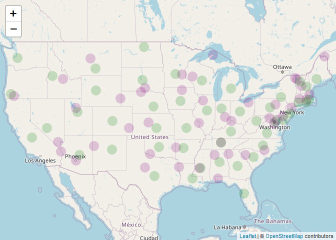
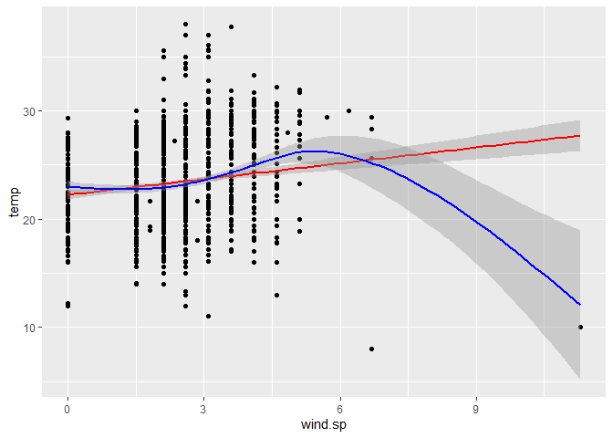
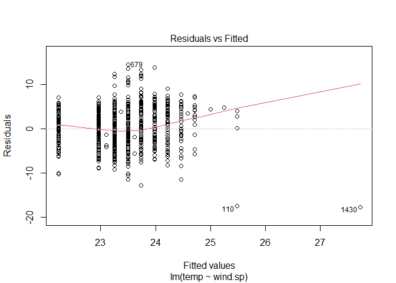
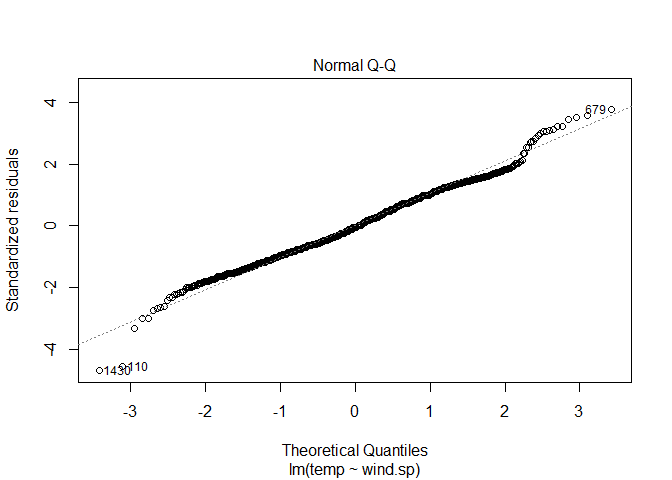
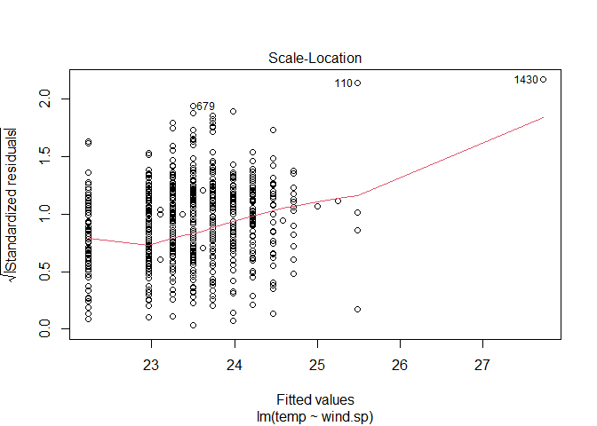
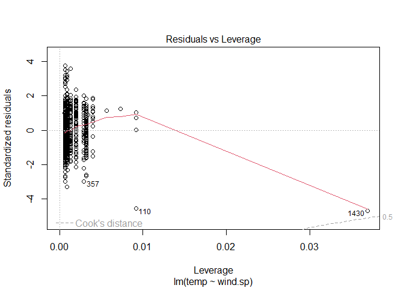
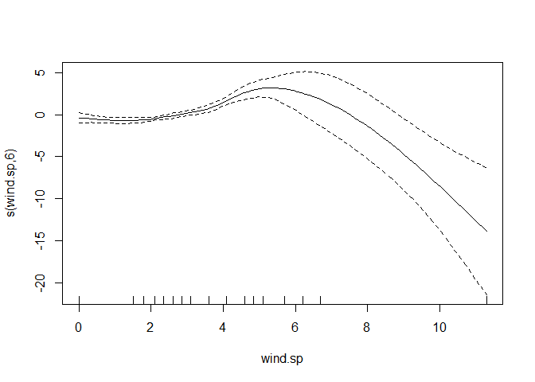

Lab 05 - Data Wrangling
================

# Learning goals

- Use the `merge()` function to join two datasets.
- Deal with missings and impute data.
- Identify relevant observations using `quantile()`.
- Practice your GitHub skills.

# Lab description

For this lab we will be dealing with the meteorological dataset `met`.
In this case, we will use `data.table` to answer some questions
regarding the `met` dataset, while at the same time practice your
Git+GitHub skills for this project.

This markdown document should be rendered using `github_document`
document.

# Part 1: Setup a Git project and the GitHub repository

1.  Go to wherever you are planning to store the data on your computer,
    and create a folder for this project

2.  In that folder, save [this
    template](https://github.com/JSC370/jsc370-2023/blob/main/labs/lab05/lab05-wrangling-gam.Rmd)
    as “README.Rmd”. This will be the markdown file where all the magic
    will happen.

3.  Go to your GitHub account and create a new repository of the same
    name that your local folder has, e.g., “JSC370-labs”.

4.  Initialize the Git project, add the “README.Rmd” file, and make your
    first commit.

5.  Add the repo you just created on GitHub.com to the list of remotes,
    and push your commit to origin while setting the upstream.

Most of the steps can be done using command line:

``` sh
# Step 1
cd ~/Documents
mkdir JSC370-labs
cd JSC370-labs
# Step 2
wget https://raw.githubusercontent.com/JSC370/jsc370-2023/main/labs/lab05/lab05-wrangling-gam.Rmd
mv lab05-wrangling-gam.Rmd README.Rmd
# if wget is not available,
curl https://raw.githubusercontent.com/JSC370/jsc370-2023/main/labs/lab05/lab05-wrangling-gam.Rmd --output README.Rmd
# Step 3
# Happens on github
# Step 4
git init
git add README.Rmd
git commit -m "First commit"
# Step 5
git remote add origin git@github.com:[username]/JSC370-labs
git push -u origin master
```

You can also complete the steps in R (replace with your paths/username
when needed)

``` r
# Step 1
setwd("~/Documents")
dir.create("JSC370-labs")
setwd("JSC370-labs")
# Step 2
download.file(
  "https://raw.githubusercontent.com/JSC370/jsc370-2023/main/labs/lab05/lab05-wrangling-gam.Rmd",
  destfile = "README.Rmd"
  )
# Step 3: Happens on Github
# Step 4
system("git init && git add README.Rmd")
system('git commit -m "First commit"')
# Step 5
system("git remote add origin git@github.com:[username]/JSC370-labs")
system("git push -u origin master")
```

Once you are done setting up the project, you can now start working with
the MET data.

## Setup in R

1.  Load the `data.table` (and the `dtplyr` and `dplyr` packages if you
    plan to work with those).

``` r
library('data.table')
library('dplyr')
```

    ## 
    ## Attaching package: 'dplyr'

    ## The following objects are masked from 'package:data.table':
    ## 
    ##     between, first, last

    ## The following objects are masked from 'package:stats':
    ## 
    ##     filter, lag

    ## The following objects are masked from 'package:base':
    ## 
    ##     intersect, setdiff, setequal, union

``` r
library('dtplyr')
```

2.  Load the met data from
    <https://github.com/JSC370/jsc370-2023/blob/main/labs/lab03/met_all.gz>
    or (Use
    <https://raw.githubusercontent.com/JSC370/jsc370-2023/main/labs/lab03/met_all.gz>
    to download programmatically), and also the station data. For the
    latter, you can use the code we used during lecture to pre-process
    the stations data:

``` r
#read met
met <- fread("https://raw.githubusercontent.com/JSC370/jsc370-2023/main/labs/lab03/met_all.gz")
head(met)
```

    ##    USAFID  WBAN year month day hour min  lat      lon elev wind.dir wind.dir.qc
    ## 1: 690150 93121 2019     8   1    0  56 34.3 -116.166  696      220           5
    ## 2: 690150 93121 2019     8   1    1  56 34.3 -116.166  696      230           5
    ## 3: 690150 93121 2019     8   1    2  56 34.3 -116.166  696      230           5
    ## 4: 690150 93121 2019     8   1    3  56 34.3 -116.166  696      210           5
    ## 5: 690150 93121 2019     8   1    4  56 34.3 -116.166  696      120           5
    ## 6: 690150 93121 2019     8   1    5  56 34.3 -116.166  696       NA           9
    ##    wind.type.code wind.sp wind.sp.qc ceiling.ht ceiling.ht.qc ceiling.ht.method
    ## 1:              N     5.7          5      22000             5                 9
    ## 2:              N     8.2          5      22000             5                 9
    ## 3:              N     6.7          5      22000             5                 9
    ## 4:              N     5.1          5      22000             5                 9
    ## 5:              N     2.1          5      22000             5                 9
    ## 6:              C     0.0          5      22000             5                 9
    ##    sky.cond vis.dist vis.dist.qc vis.var vis.var.qc temp temp.qc dew.point
    ## 1:        N    16093           5       N          5 37.2       5      10.6
    ## 2:        N    16093           5       N          5 35.6       5      10.6
    ## 3:        N    16093           5       N          5 34.4       5       7.2
    ## 4:        N    16093           5       N          5 33.3       5       5.0
    ## 5:        N    16093           5       N          5 32.8       5       5.0
    ## 6:        N    16093           5       N          5 31.1       5       5.6
    ##    dew.point.qc atm.press atm.press.qc       rh
    ## 1:            5    1009.9            5 19.88127
    ## 2:            5    1010.3            5 21.76098
    ## 3:            5    1010.6            5 18.48212
    ## 4:            5    1011.6            5 16.88862
    ## 5:            5    1012.7            5 17.38410
    ## 6:            5    1012.7            5 20.01540

``` r
# Download the data
stations <- fread("ftp://ftp.ncdc.noaa.gov/pub/data/noaa/isd-history.csv")
stations[, USAF := as.integer(USAF)]
```

    ## Warning in eval(jsub, SDenv, parent.frame()): NAs introduced by coercion

``` r
# Dealing with NAs and 999999
stations[, USAF   := fifelse(USAF == 999999, NA_integer_, USAF)]
stations[, CTRY   := fifelse(CTRY == "", NA_character_, CTRY)]
stations[, STATE  := fifelse(STATE == "", NA_character_, STATE)]
# Selecting the three relevant columns, and keeping unique records
stations <- unique(stations[, list(USAF, CTRY, STATE)])
# Dropping NAs
stations <- stations[!is.na(USAF)]
# Removing duplicates
stations[, n := 1:.N, by = .(USAF)]
stations <- stations[n == 1,][, n := NULL]
```

3.  Merge the data as we did during the lecture.

``` r
data <- merge(
# Data
 x = met, 
 y = stations, 
# List of variables to match
 by.x = "USAFID",
 by.y = "USAF", 
# Which obs to keep?
 all.x = TRUE, 
 all.y = FALSE
 ) 
```

``` r
met_lz <- lazy_dt(data, immutable = FALSE)
met_lz
```

    ## Source: local data table [2,377,343 x 32]
    ## Call:   `_DT1`
    ## 
    ##   USAFID  WBAN  year month   day  hour   min   lat   lon  elev wind.dir wind.d…¹
    ##    <int> <int> <int> <int> <int> <int> <int> <dbl> <dbl> <int>    <int> <chr>   
    ## 1 690150 93121  2019     8     1     0    56  34.3 -116.   696      220 5       
    ## 2 690150 93121  2019     8     1     1    56  34.3 -116.   696      230 5       
    ## 3 690150 93121  2019     8     1     2    56  34.3 -116.   696      230 5       
    ## 4 690150 93121  2019     8     1     3    56  34.3 -116.   696      210 5       
    ## 5 690150 93121  2019     8     1     4    56  34.3 -116.   696      120 5       
    ## 6 690150 93121  2019     8     1     5    56  34.3 -116.   696       NA 9       
    ## # … with 2,377,337 more rows, 20 more variables: wind.type.code <chr>,
    ## #   wind.sp <dbl>, wind.sp.qc <chr>, ceiling.ht <int>, ceiling.ht.qc <int>,
    ## #   ceiling.ht.method <chr>, sky.cond <chr>, vis.dist <int>, vis.dist.qc <chr>,
    ## #   vis.var <chr>, vis.var.qc <chr>, temp <dbl>, temp.qc <chr>,
    ## #   dew.point <dbl>, dew.point.qc <chr>, atm.press <dbl>, atm.press.qc <int>,
    ## #   rh <dbl>, CTRY <chr>, STATE <chr>, and abbreviated variable name
    ## #   ¹​wind.dir.qc
    ## 
    ## # Use as.data.table()/as.data.frame()/as_tibble() to access results

## Question 1: Representative station for the US

Across all weather stations, what is the median station in terms of
temperature, wind speed, and atmospheric pressure? Look for the three
weather stations that best represent continental US using the
`quantile()` function. Do these three coincide?

``` r
met_avg_lz <- met_lz %>%  group_by(USAFID)%>% summarise(
  across (c(temp, wind.sp, atm.press), function(x) mean(x, na.rm=TRUE))) 
met_avg_lz
```

    ## Source: local data table [1,595 x 4]
    ## Call:   `_DT1`[, .(temp = (function (x) 
    ## mean(x, na.rm = TRUE))(temp), wind.sp = (function (x) 
    ## mean(x, na.rm = TRUE))(wind.sp), atm.press = (function (x) 
    ## mean(x, na.rm = TRUE))(atm.press)), keyby = .(USAFID)]
    ## 
    ##   USAFID  temp wind.sp atm.press
    ##    <int> <dbl>   <dbl>     <dbl>
    ## 1 690150  33.2    3.48     1010.
    ## 2 720110  31.2    2.14      NaN 
    ## 3 720113  23.3    2.47      NaN 
    ## 4 720120  27.0    2.50      NaN 
    ## 5 720137  21.9    1.98      NaN 
    ## 6 720151  27.6    3.00      NaN 
    ## # … with 1,589 more rows
    ## 
    ## # Use as.data.table()/as.data.frame()/as_tibble() to access results

``` r
#median 
met_med_lz <- met_avg_lz %>% summarise(
  across (c(temp, wind.sp, atm.press), function(x) quantile(x, probs = 0.5, na.rm=TRUE)))
met_med_lz
```

    ## Source: local data table [1 x 3]
    ## Call:   `_DT1`[, .(temp = (function (x) 
    ## mean(x, na.rm = TRUE))(temp), wind.sp = (function (x) 
    ## mean(x, na.rm = TRUE))(wind.sp), atm.press = (function (x) 
    ## mean(x, na.rm = TRUE))(atm.press)), keyby = .(USAFID)][, .(temp = (function (x) 
    ## quantile(x, probs = 0.5, na.rm = TRUE))(temp), wind.sp = (function (x) 
    ## quantile(x, probs = 0.5, na.rm = TRUE))(wind.sp), atm.press = (function (x) 
    ## quantile(x, probs = 0.5, na.rm = TRUE))(atm.press))]
    ## 
    ##    temp wind.sp atm.press
    ##   <dbl>   <dbl>     <dbl>
    ## 1  23.7    2.46     1015.
    ## 
    ## # Use as.data.table()/as.data.frame()/as_tibble() to access results

``` r
med_temp <- met_avg_lz %>% mutate(
  temp_diff = abs(temp - (met_med_lz %>% pull(temp)))) %>% arrange((temp_diff)) %>% slice(1) %>% pull(USAFID)


med_wind <- met_avg_lz %>% mutate(
  wind_diff = abs(wind.sp - (met_med_lz %>% pull(wind.sp)))) %>% arrange((wind_diff)) %>% slice(1) %>% pull(USAFID)


med_pres <- met_avg_lz %>% mutate(
  pres_diff = abs(atm.press - (met_med_lz %>% pull(atm.press)))) %>% arrange((pres_diff)) %>% slice(1) %>% pull(USAFID)


med_temp
```

    ## [1] 720458

``` r
med_wind
```

    ## [1] 720929

``` r
med_pres
```

    ## [1] 722238

**Response** The three stations are not identical. For temperature, the
median station is 720458; for wind speed, the median station is 720929,
and for atmosphere pressure, the median station is 722238. They do not
coincide.

Knit the document, commit your changes, and save it on GitHub. Don’t
forget to add `README.md` to the tree, the first time you render it.

## Question 2: Representative station per state

Just like the previous question, you are asked to identify what is the
most representative, the median, station per state. This time, instead
of looking at one variable at a time, look at the euclidean distance. If
multiple stations show in the median, select the one located at the
lowest latitude.

``` r
#median 
met_med_s_lz <- met_lz %>%  group_by(STATE) %>% summarise(
  across (c(temp, wind.sp, atm.press), function(x) quantile(x, probs = 0.5, na.rm=TRUE))) 


merged <- met_lz %>% left_join(met_med_s_lz, by = "STATE") %>% as.data.frame()
merged
```

    ##      USAFID  WBAN year month day hour min    lat      lon elev wind.dir
    ## 1    690150 93121 2019     8   1    0  56 34.300 -116.166  696      220
    ## 2    690150 93121 2019     8   1    1  56 34.300 -116.166  696      230
    ## 3    690150 93121 2019     8   1    2  56 34.300 -116.166  696      230
    ## 4    690150 93121 2019     8   1    3  56 34.300 -116.166  696      210
    ## 5    690150 93121 2019     8   1    4  56 34.300 -116.166  696      120
    ## 6    690150 93121 2019     8   1    5  56 34.300 -116.166  696       NA
    ## 7    690150 93121 2019     8   1    6  56 34.300 -116.166  696      320
    ## 8    690150 93121 2019     8   1    7  56 34.300 -116.166  696       10
    ## 9    690150 93121 2019     8   1    8  56 34.300 -116.166  696      320
    ## 10   690150 93121 2019     8   1    9  56 34.300 -116.166  696      350
    ## 11   690150 93121 2019     8   1   10  56 34.296 -116.162  625      360
    ## 12   690150 93121 2019     8   1   11  56 34.296 -116.162  625      310
    ## 13   690150 93121 2019     8   1   12  56 34.300 -116.166  696       NA
    ## 14   690150 93121 2019     8   1   13  56 34.300 -116.166  696       NA
    ## 15   690150 93121 2019     8   1   14  56 34.300 -116.166  696       NA
    ## 16   690150 93121 2019     8   1   15  56 34.300 -116.166  696      350
    ## 17   690150 93121 2019     8   1   16  56 34.300 -116.166  696       30
    ## 18   690150 93121 2019     8   1   17  56 34.300 -116.166  696       NA
    ## 19   690150 93121 2019     8   1   18  56 34.300 -116.166  696       NA
    ## 20   690150 93121 2019     8   1   19  56 34.300 -116.166  696      100
    ## 21   690150 93121 2019     8   1   20  56 34.300 -116.166  696      150
    ## 22   690150 93121 2019     8   1   21  56 34.300 -116.166  696      200
    ## 23   690150 93121 2019     8   1   22  56 34.300 -116.166  696      220
    ## 24   690150 93121 2019     8   1   23  56 34.300 -116.166  696      220
    ## 25   690150 93121 2019     8   2    0  56 34.300 -116.166  696      250
    ## 26   690150 93121 2019     8   2    1  56 34.300 -116.166  696      230
    ## 27   690150 93121 2019     8   2    2  56 34.300 -116.166  696      240
    ## 28   690150 93121 2019     8   2    3  56 34.300 -116.166  696      240
    ## 29   690150 93121 2019     8   2    4  56 34.300 -116.166  696      260
    ## 30   690150 93121 2019     8   2    5  56 34.300 -116.166  696      260
    ## 31   690150 93121 2019     8   2    6  56 34.300 -116.166  696       10
    ## 32   690150 93121 2019     8   2    7  56 34.300 -116.166  696      310
    ## 33   690150 93121 2019     8   2    8  56 34.300 -116.166  696      310
    ## 34   690150 93121 2019     8   2    9  56 34.300 -116.166  696      310
    ## 35   690150 93121 2019     8   2   10  56 34.300 -116.166  696      280
    ## 36   690150 93121 2019     8   2   11  56 34.300 -116.166  696      280
    ## 37   690150 93121 2019     8   2   12  56 34.300 -116.166  696      280
    ## 38   690150 93121 2019     8   2   13  56 34.300 -116.166  696      300
    ## 39   690150 93121 2019     8   2   14  56 34.300 -116.166  696      300
    ## 40   690150 93121 2019     8   2   15  56 34.300 -116.166  696      300
    ## 41   690150 93121 2019     8   2   16  56 34.300 -116.166  696       NA
    ## 42   690150 93121 2019     8   2   17  56 34.300 -116.166  696       30
    ## 43   690150 93121 2019     8   2   18  56 34.300 -116.166  696      220
    ## 44   690150 93121 2019     8   2   19  56 34.300 -116.166  696       NA
    ## 45   690150 93121 2019     8   2   20  56 34.300 -116.166  696      150
    ## 46   690150 93121 2019     8   2   21  56 34.300 -116.166  696      170
    ## 47   690150 93121 2019     8   2   22  56 34.300 -116.166  696      120
    ## 48   690150 93121 2019     8   2   23  56 34.300 -116.166  696      220
    ## 49   690150 93121 2019     8   3    0  56 34.300 -116.166  696      220
    ## 50   690150 93121 2019     8   3    1  56 34.300 -116.166  696      230
    ## 51   690150 93121 2019     8   3    2  56 34.300 -116.166  696      220
    ## 52   690150 93121 2019     8   3    3  56 34.300 -116.166  696      220
    ## 53   690150 93121 2019     8   3    4  56 34.300 -116.166  696      240
    ## 54   690150 93121 2019     8   3    5  56 34.300 -116.166  696      280
    ## 55   690150 93121 2019     8   3    6  56 34.300 -116.166  696      350
    ## 56   690150 93121 2019     8   3    7  56 34.300 -116.166  696      340
    ## 57   690150 93121 2019     8   3    8  56 34.300 -116.166  696      290
    ## 58   690150 93121 2019     8   3    9  56 34.300 -116.166  696      290
    ## 59   690150 93121 2019     8   3   10  56 34.300 -116.166  696      310
    ## 60   690150 93121 2019     8   3   11  56 34.300 -116.166  696      280
    ## 61   690150 93121 2019     8   3   12  56 34.300 -116.166  696      280
    ## 62   690150 93121 2019     8   3   13  56 34.300 -116.166  696      310
    ## 63   690150 93121 2019     8   3   14  56 34.300 -116.166  696      320
    ## 64   690150 93121 2019     8   3   15  56 34.300 -116.166  696       NA
    ## 65   690150 93121 2019     8   3   16  56 34.300 -116.166  696       NA
    ## 66   690150 93121 2019     8   3   17  56 34.300 -116.166  696      170
    ## 67   690150 93121 2019     8   3   18  56 34.300 -116.166  696       90
    ## 68   690150 93121 2019     8   3   19  56 34.300 -116.166  696       NA
    ## 69   690150 93121 2019     8   3   20  56 34.300 -116.166  696       NA
    ## 70   690150 93121 2019     8   3   21  56 34.300 -116.166  696      180
    ## 71   690150 93121 2019     8   3   22  56 34.300 -116.166  696      190
    ## 72   690150 93121 2019     8   3   23  56 34.300 -116.166  696      230
    ## 73   690150 93121 2019     8   4    0  56 34.300 -116.166  696      230
    ## 74   690150 93121 2019     8   4    1  56 34.300 -116.166  696      210
    ## 75   690150 93121 2019     8   4    2  56 34.300 -116.166  696      230
    ## 76   690150 93121 2019     8   4    3  56 34.300 -116.166  696      230
    ## 77   690150 93121 2019     8   4    4  56 34.300 -116.166  696      260
    ## 78   690150 93121 2019     8   4    5  56 34.300 -116.166  696      280
    ## 79   690150 93121 2019     8   4    6  56 34.300 -116.166  696      350
    ## 80   690150 93121 2019     8   4    7  56 34.300 -116.166  696      310
    ## 81   690150 93121 2019     8   4    8  56 34.300 -116.166  696      290
    ## 82   690150 93121 2019     8   4    9  56 34.300 -116.166  696      290
    ## 83   690150 93121 2019     8   4   10  56 34.300 -116.166  696      290
    ## 84   690150 93121 2019     8   4   11  56 34.300 -116.166  696      290
    ## 85   690150 93121 2019     8   4   12  56 34.300 -116.166  696      290
    ## 86   690150 93121 2019     8   4   13  56 34.300 -116.166  696      280
    ## 87   690150 93121 2019     8   4   14  56 34.300 -116.166  696       NA
    ## 88   690150 93121 2019     8   4   15  56 34.300 -116.166  696      340
    ## 89   690150 93121 2019     8   4   16  56 34.300 -116.166  696       NA
    ## 90   690150 93121 2019     8   4   17  56 34.300 -116.166  696      130
    ## 91   690150 93121 2019     8   4   18  56 34.300 -116.166  696      120
    ## 92   690150 93121 2019     8   4   19  56 34.300 -116.166  696      120
    ## 93   690150 93121 2019     8   4   20  56 34.300 -116.166  696      320
    ## 94   690150 93121 2019     8   4   21  56 34.300 -116.166  696       NA
    ## 95   690150 93121 2019     8   4   22  56 34.300 -116.166  696      200
    ## 96   690150 93121 2019     8   4   23  56 34.300 -116.166  696      180
    ## 97   690150 93121 2019     8   5    0  56 34.300 -116.166  696      200
    ## 98   690150 93121 2019     8   5    1  56 34.300 -116.166  696      220
    ## 99   690150 93121 2019     8   5    2  56 34.300 -116.166  696      230
    ## 100  690150 93121 2019     8   5    3  56 34.300 -116.166  696      210
    ## 101  690150 93121 2019     8   5    4  56 34.300 -116.166  696      240
    ## 102  690150 93121 2019     8   5    5  56 34.300 -116.166  696      360
    ## 103  690150 93121 2019     8   5    6  56 34.300 -116.166  696      270
    ## 104  690150 93121 2019     8   5    7  56 34.300 -116.166  696      320
    ## 105  690150 93121 2019     8   5    8  56 34.300 -116.166  696      340
    ## 106  690150 93121 2019     8   5    9  56 34.300 -116.166  696      300
    ## 107  690150 93121 2019     8   5   10  56 34.300 -116.166  696      280
    ## 108  690150 93121 2019     8   5   11  56 34.300 -116.166  696      270
    ## 109  690150 93121 2019     8   5   12  56 34.300 -116.166  696      280
    ## 110  690150 93121 2019     8   5   13  56 34.300 -116.166  696      330
    ## 111  690150 93121 2019     8   5   14  56 34.300 -116.166  696      330
    ## 112  690150 93121 2019     8   5   15  56 34.300 -116.166  696      310
    ## 113  690150 93121 2019     8   5   16  56 34.300 -116.166  696       NA
    ## 114  690150 93121 2019     8   5   17  56 34.300 -116.166  696       NA
    ## 115  690150 93121 2019     8   5   18  56 34.300 -116.166  696       NA
    ## 116  690150 93121 2019     8   5   19  56 34.300 -116.166  696       NA
    ## 117  690150 93121 2019     8   5   20  56 34.300 -116.166  696       NA
    ## 118  690150 93121 2019     8   5   21  56 34.300 -116.166  696      200
    ## 119  690150 93121 2019     8   5   22  56 34.300 -116.166  696      190
    ## 120  690150 93121 2019     8   5   23  56 34.300 -116.166  696      240
    ## 121  690150 93121 2019     8   6    0  56 34.300 -116.166  696      240
    ## 122  690150 93121 2019     8   6    1  56 34.300 -116.166  696      240
    ## 123  690150 93121 2019     8   6    2  56 34.300 -116.166  696      240
    ## 124  690150 93121 2019     8   6    3  56 34.300 -116.166  696      260
    ## 125  690150 93121 2019     8   6    4  56 34.300 -116.166  696      290
    ## 126  690150 93121 2019     8   6    5  56 34.300 -116.166  696      250
    ## 127  690150 93121 2019     8   6    6  56 34.300 -116.166  696      280
    ## 128  690150 93121 2019     8   6    7  56 34.300 -116.166  696      280
    ## 129  690150 93121 2019     8   6    8  56 34.300 -116.166  696      330
    ## 130  690150 93121 2019     8   6    9  56 34.300 -116.166  696      280
    ## 131  690150 93121 2019     8   6   10  56 34.300 -116.166  696      260
    ## 132  690150 93121 2019     8   6   11  56 34.300 -116.166  696      340
    ## 133  690150 93121 2019     8   6   12  56 34.300 -116.166  696      290
    ## 134  690150 93121 2019     8   6   13  56 34.300 -116.166  696      260
    ## 135  690150 93121 2019     8   6   14  56 34.300 -116.166  696      120
    ## 136  690150 93121 2019     8   6   15  56 34.300 -116.166  696      190
    ## 137  690150 93121 2019     8   6   16  56 34.300 -116.166  696       NA
    ## 138  690150 93121 2019     8   6   17  56 34.300 -116.166  696      210
    ## 139  690150 93121 2019     8   6   18  56 34.300 -116.166  696       NA
    ## 140  690150 93121 2019     8   6   19  56 34.300 -116.166  696      360
    ## 141  690150 93121 2019     8   6   20  56 34.300 -116.166  696       NA
    ## 142  690150 93121 2019     8   6   21  56 34.300 -116.166  696      130
    ## 143  690150 93121 2019     8   6   22  56 34.300 -116.166  696      120
    ## 144  690150 93121 2019     8   6   23  56 34.300 -116.166  696      100
    ## 145  690150 93121 2019     8   7    0  56 34.300 -116.166  696      120
    ## 146  690150 93121 2019     8   7    1  56 34.300 -116.166  696      150
    ## 147  690150 93121 2019     8   7    2  56 34.300 -116.166  696      230
    ## 148  690150 93121 2019     8   7    3  56 34.300 -116.166  696      220
    ## 149  690150 93121 2019     8   7    4  56 34.300 -116.166  696      220
    ## 150  690150 93121 2019     8   7    5  56 34.300 -116.166  696      360
    ## 151  690150 93121 2019     8   7    6  56 34.300 -116.166  696      220
    ## 152  690150 93121 2019     8   7    7  56 34.300 -116.166  696      250
    ## 153  690150 93121 2019     8   7    7  59 34.300 -116.166  696       NA
    ## 154  690150 93121 2019     8   7    8  56 34.300 -116.166  696      210
    ## 155  690150 93121 2019     8   7    9  56 34.300 -116.166  696      350
    ## 156  690150 93121 2019     8   7   10  56 34.300 -116.166  696      270
    ## 157  690150 93121 2019     8   7   11  56 34.300 -116.166  696      300
    ## 158  690150 93121 2019     8   7   12  56 34.300 -116.166  696      330
    ## 159  690150 93121 2019     8   7   13  56 34.300 -116.166  696       60
    ## 160  690150 93121 2019     8   7   14  56 34.300 -116.166  696      360
    ## 161  690150 93121 2019     8   7   15  56 34.300 -116.166  696       NA
    ## 162  690150 93121 2019     8   7   16  56 34.300 -116.166  696       NA
    ## 163  690150 93121 2019     8   7   17  56 34.300 -116.166  696       NA
    ## 164  690150 93121 2019     8   7   18  56 34.300 -116.166  696      130
    ## 165  690150 93121 2019     8   7   19  54 34.300 -116.166  696      170
    ## 166  690150 93121 2019     8   7   19  56 34.300 -116.166  696       NA
    ## 167  690150 93121 2019     8   7   20  56 34.300 -116.166  696      240
    ## 168  690150 93121 2019     8   7   21  56 34.300 -116.166  696      200
    ## 169  690150 93121 2019     8   7   22  56 34.300 -116.166  696      220
    ## 170  690150 93121 2019     8   7   23  56 34.300 -116.166  696      230
    ## 171  690150 93121 2019     8   8    0  56 34.300 -116.166  696      200
    ## 172  690150 93121 2019     8   8    1  56 34.300 -116.166  696      230
    ## 173  690150 93121 2019     8   8    2  56 34.300 -116.166  696      220
    ## 174  690150 93121 2019     8   8    3  56 34.300 -116.166  696      220
    ## 175  690150 93121 2019     8   8    4  56 34.300 -116.166  696      150
    ## 176  690150 93121 2019     8   8    5  56 34.300 -116.166  696      290
    ## 177  690150 93121 2019     8   8    6  56 34.300 -116.166  696      290
    ## 178  690150 93121 2019     8   8    7  56 34.300 -116.166  696       NA
    ## 179  690150 93121 2019     8   8    7  59 34.300 -116.166  696       NA
    ## 180  690150 93121 2019     8   8    8  56 34.300 -116.166  696       NA
    ## 181  690150 93121 2019     8   8    9  56 34.300 -116.166  696       NA
    ## 182  690150 93121 2019     8   8   10  56 34.300 -116.166  696      350
    ## 183  690150 93121 2019     8   8   11  56 34.300 -116.166  696      310
    ## 184  690150 93121 2019     8   8   12  56 34.300 -116.166  696       NA
    ## 185  690150 93121 2019     8   8   13  56 34.300 -116.166  696      290
    ## 186  690150 93121 2019     8   8   14  56 34.300 -116.166  696      340
    ## 187  690150 93121 2019     8   8   15  56 34.300 -116.166  696       NA
    ## 188  690150 93121 2019     8   8   16  56 34.300 -116.166  696       NA
    ## 189  690150 93121 2019     8   8   17  56 34.300 -116.166  696       NA
    ## 190  690150 93121 2019     8   8   18  56 34.300 -116.166  696       NA
    ## 191  690150 93121 2019     8   8   19  56 34.300 -116.166  696      150
    ## 192  690150 93121 2019     8   8   20  56 34.300 -116.166  696      110
    ## 193  690150 93121 2019     8   8   21  56 34.300 -116.166  696      120
    ## 194  690150 93121 2019     8   8   22  56 34.300 -116.166  696       NA
    ## 195  690150 93121 2019     8   8   23  56 34.300 -116.166  696      240
    ## 196  690150 93121 2019     8   9    0  56 34.300 -116.166  696      250
    ## 197  690150 93121 2019     8   9    1  56 34.300 -116.166  696      240
    ## 198  690150 93121 2019     8   9    2  56 34.300 -116.166  696      240
    ## 199  690150 93121 2019     8   9    3  56 34.300 -116.166  696      220
    ## 200  690150 93121 2019     8   9    4  56 34.300 -116.166  696      230
    ## 201  690150 93121 2019     8   9    5  56 34.300 -116.166  696      300
    ## 202  690150 93121 2019     8   9    6  56 34.300 -116.166  696      320
    ## 203  690150 93121 2019     8   9    7  56 34.300 -116.166  696      280
    ## 204  690150 93121 2019     8   9    8  56 34.300 -116.166  696      280
    ## 205  690150 93121 2019     8   9    9  56 34.300 -116.166  696      280
    ## 206  690150 93121 2019     8   9   10  56 34.300 -116.166  696      270
    ## 207  690150 93121 2019     8   9   11  56 34.296 -116.162  625      260
    ## 208  690150 93121 2019     8   9   12  56 34.300 -116.166  696      300
    ## 209  690150 93121 2019     8   9   13  56 34.300 -116.166  696       NA
    ## 210  690150 93121 2019     8   9   14  56 34.300 -116.166  696       30
    ## 211  690150 93121 2019     8   9   15  56 34.300 -116.166  696      360
    ## 212  690150 93121 2019     8   9   16  56 34.300 -116.166  696       NA
    ## 213  690150 93121 2019     8   9   17  56 34.300 -116.166  696       NA
    ## 214  690150 93121 2019     8   9   18  56 34.300 -116.166  696       NA
    ## 215  690150 93121 2019     8   9   19  56 34.300 -116.166  696       NA
    ## 216  690150 93121 2019     8   9   20  56 34.300 -116.166  696       NA
    ## 217  690150 93121 2019     8   9   21  56 34.300 -116.166  696       NA
    ## 218  690150 93121 2019     8   9   22  56 34.300 -116.166  696      180
    ## 219  690150 93121 2019     8   9   23  56 34.300 -116.166  696      230
    ## 220  690150 93121 2019     8  10    0  56 34.300 -116.166  696      230
    ## 221  690150 93121 2019     8  10    1  56 34.300 -116.166  696      210
    ## 222  690150 93121 2019     8  10    2  56 34.300 -116.166  696      220
    ## 223  690150 93121 2019     8  10    3  56 34.300 -116.166  696      240
    ## 224  690150 93121 2019     8  10    4  56 34.300 -116.166  696      250
    ## 225  690150 93121 2019     8  10    5  56 34.300 -116.166  696      270
    ## 226  690150 93121 2019     8  10    6  56 34.300 -116.166  696      280
    ## 227  690150 93121 2019     8  10    7  56 34.300 -116.166  696      300
    ## 228  690150 93121 2019     8  10    8  56 34.300 -116.166  696      300
    ## 229  690150 93121 2019     8  10    9  56 34.300 -116.166  696      280
    ## 230  690150 93121 2019     8  10   10  56 34.300 -116.166  696      270
    ## 231  690150 93121 2019     8  10   11  56 34.300 -116.166  696      290
    ## 232  690150 93121 2019     8  10   12  56 34.300 -116.166  696      270
    ## 233  690150 93121 2019     8  10   13  56 34.300 -116.166  696       NA
    ## 234  690150 93121 2019     8  10   14  56 34.300 -116.166  696      330
    ## 235  690150 93121 2019     8  10   15  56 34.300 -116.166  696      350
    ## 236  690150 93121 2019     8  10   16  56 34.300 -116.166  696      360
    ## 237  690150 93121 2019     8  10   17  56 34.300 -116.166  696       NA
    ## 238  690150 93121 2019     8  10   18  56 34.300 -116.166  696      180
    ## 239  690150 93121 2019     8  10   19  56 34.300 -116.166  696       NA
    ## 240  690150 93121 2019     8  10   20  56 34.300 -116.166  696      150
    ## 241  690150 93121 2019     8  10   21  56 34.300 -116.166  696       NA
    ## 242  690150 93121 2019     8  10   22  56 34.300 -116.166  696      220
    ## 243  690150 93121 2019     8  10   23  56 34.300 -116.166  696      250
    ## 244  690150 93121 2019     8  11    0  56 34.300 -116.166  696      220
    ## 245  690150 93121 2019     8  11    1  56 34.300 -116.166  696      220
    ## 246  690150 93121 2019     8  11    2  56 34.300 -116.166  696      230
    ## 247  690150 93121 2019     8  11    3  56 34.300 -116.166  696      240
    ## 248  690150 93121 2019     8  11    4  56 34.300 -116.166  696      310
    ## 249  690150 93121 2019     8  11    5  56 34.300 -116.166  696      300
    ## 250  690150 93121 2019     8  11    6  56 34.300 -116.166  696      300
    ## 251  690150 93121 2019     8  11    7  56 34.300 -116.166  696      300
    ## 252  690150 93121 2019     8  11    8  56 34.300 -116.166  696      320
    ## 253  690150 93121 2019     8  11    9  56 34.300 -116.166  696      300
    ## 254  690150 93121 2019     8  11   10  56 34.300 -116.166  696      330
    ## 255  690150 93121 2019     8  11   11  56 34.300 -116.166  696      300
    ## 256  690150 93121 2019     8  11   12  56 34.300 -116.166  696      280
    ## 257  690150 93121 2019     8  11   13  56 34.300 -116.166  696      310
    ## 258  690150 93121 2019     8  11   14  56 34.300 -116.166  696      300
    ## 259  690150 93121 2019     8  11   15  56 34.300 -116.166  696       NA
    ## 260  690150 93121 2019     8  11   16  56 34.300 -116.166  696      310
    ## 261  690150 93121 2019     8  11   17  56 34.300 -116.166  696      290
    ## 262  690150 93121 2019     8  11   18  56 34.300 -116.166  696      160
    ## 263  690150 93121 2019     8  11   19  56 34.300 -116.166  696       NA
    ## 264  690150 93121 2019     8  11   20  56 34.300 -116.166  696       NA
    ## 265  690150 93121 2019     8  11   21  56 34.300 -116.166  696      140
    ## 266  690150 93121 2019     8  11   22  56 34.296 -116.162  625      170
    ## 267  690150 93121 2019     8  11   23  56 34.296 -116.162  625      110
    ## 268  690150 93121 2019     8  12    0  56 34.296 -116.162  625      110
    ## 269  690150 93121 2019     8  12    1  56 34.296 -116.162  625       NA
    ## 270  690150 93121 2019     8  12    2  56 34.296 -116.162  625      240
    ## 271  690150 93121 2019     8  12    3  56 34.296 -116.162  625      230
    ## 272  690150 93121 2019     8  12    4  56 34.296 -116.162  625      270
    ## 273  690150 93121 2019     8  12    5  56 34.296 -116.162  625      280
    ## 274  690150 93121 2019     8  12    6  56 34.296 -116.162  625      330
    ## 275  690150 93121 2019     8  12    7  56 34.296 -116.162  625      310
    ## 276  690150 93121 2019     8  12    8  56 34.296 -116.162  625      310
    ## 277  690150 93121 2019     8  12    9  56 34.296 -116.162  625      290
    ## 278  690150 93121 2019     8  12   10  56 34.296 -116.162  625      290
    ## 279  690150 93121 2019     8  12   11  56 34.296 -116.162  625      290
    ## 280  690150 93121 2019     8  12   12  56 34.296 -116.162  625       NA
    ## 281  690150 93121 2019     8  12   13  56 34.296 -116.162  625      290
    ## 282  690150 93121 2019     8  12   14  56 34.296 -116.162  625      350
    ## 283  690150 93121 2019     8  12   15  56 34.296 -116.162  625      340
    ## 284  690150 93121 2019     8  12   16  56 34.296 -116.162  625       NA
    ## 285  690150 93121 2019     8  12   17  56 34.296 -116.162  625       NA
    ## 286  690150 93121 2019     8  12   18  56 34.296 -116.162  625       90
    ## 287  690150 93121 2019     8  12   19  56 34.296 -116.162  625      140
    ## 288  690150 93121 2019     8  12   20  56 34.300 -116.166  696       NA
    ## 289  690150 93121 2019     8  12   21  56 34.300 -116.166  696      250
    ## 290  690150 93121 2019     8  12   22  56 34.300 -116.166  696      190
    ## 291  690150 93121 2019     8  12   23  56 34.300 -116.166  696       NA
    ## 292  690150 93121 2019     8  13    0  56 34.300 -116.166  696      190
    ## 293  690150 93121 2019     8  13    1  56 34.296 -116.162  625      240
    ## 294  690150 93121 2019     8  13    2  56 34.296 -116.162  625      230
    ## 295  690150 93121 2019     8  13    3  56 34.300 -116.166  696      220
    ## 296  690150 93121 2019     8  13    4  56 34.296 -116.162  625       NA
    ## 297  690150 93121 2019     8  13    5  56 34.300 -116.166  696      220
    ## 298  690150 93121 2019     8  13    6  56 34.300 -116.166  696      360
    ## 299  690150 93121 2019     8  13    7  56 34.300 -116.166  696      340
    ## 300  690150 93121 2019     8  13    8  56 34.300 -116.166  696      330
    ## 301  690150 93121 2019     8  13    9  56 34.300 -116.166  696      290
    ## 302  690150 93121 2019     8  13   10  56 34.300 -116.166  696      290
    ## 303  690150 93121 2019     8  13   11  56 34.300 -116.166  696      340
    ## 304  690150 93121 2019     8  13   12  56 34.296 -116.162  625      290
    ## 305  690150 93121 2019     8  13   13  56 34.300 -116.166  696      310
    ## 306  690150 93121 2019     8  13   14  56 34.300 -116.166  696       NA
    ## 307  690150 93121 2019     8  13   15  56 34.300 -116.166  696      340
    ## 308  690150 93121 2019     8  13   16  56 34.300 -116.166  696       30
    ## 309  690150 93121 2019     8  13   17  56 34.300 -116.166  696      120
    ## 310  690150 93121 2019     8  13   18  56 34.300 -116.166  696      150
    ## 311  690150 93121 2019     8  13   19  56 34.300 -116.166  696       90
    ## 312  690150 93121 2019     8  13   20  56 34.300 -116.166  696      110
    ## 313  690150 93121 2019     8  13   21  56 34.300 -116.166  696      160
    ## 314  690150 93121 2019     8  13   22  56 34.300 -116.166  696       NA
    ## 315  690150 93121 2019     8  13   23  56 34.300 -116.166  696       NA
    ## 316  690150 93121 2019     8  14    0  56 34.300 -116.166  696      200
    ## 317  690150 93121 2019     8  14    1  56 34.300 -116.166  696      240
    ## 318  690150 93121 2019     8  14    2  56 34.300 -116.166  696      230
    ## 319  690150 93121 2019     8  14    3  56 34.300 -116.166  696      220
    ## 320  690150 93121 2019     8  14    4  56 34.300 -116.166  696      210
    ## 321  690150 93121 2019     8  14    5  56 34.300 -116.166  696       NA
    ## 322  690150 93121 2019     8  14    6  56 34.300 -116.166  696      240
    ## 323  690150 93121 2019     8  14    7  56 34.300 -116.166  696      300
    ## 324  690150 93121 2019     8  14    8  56 34.300 -116.166  696      350
    ## 325  690150 93121 2019     8  14    9  56 34.300 -116.166  696      340
    ## 326  690150 93121 2019     8  14   10  56 34.300 -116.166  696      290
    ## 327  690150 93121 2019     8  14   11  56 34.300 -116.166  696      280
    ## 328  690150 93121 2019     8  14   12  56 34.300 -116.166  696      290
    ## 329  690150 93121 2019     8  14   13  56 34.300 -116.166  696      300
    ## 330  690150 93121 2019     8  14   14  56 34.300 -116.166  696      320
    ## 331  690150 93121 2019     8  14   15  56 34.300 -116.166  696       20
    ## 332  690150 93121 2019     8  14   16  56 34.300 -116.166  696      350
    ## 333  690150 93121 2019     8  14   17  56 34.300 -116.166  696       NA
    ## 334  690150 93121 2019     8  14   18  56 34.300 -116.166  696       NA
    ## 335  690150 93121 2019     8  14   19  56 34.300 -116.166  696      110
    ## 336  690150 93121 2019     8  14   20  56 34.300 -116.166  696       NA
    ## 337  690150 93121 2019     8  14   21  56 34.300 -116.166  696       NA
    ## 338  690150 93121 2019     8  14   22  56 34.300 -116.166  696       NA
    ## 339  690150 93121 2019     8  14   23  56 34.300 -116.166  696       90
    ## 340  690150 93121 2019     8  15    0  56 34.300 -116.166  696      240
    ## 341  690150 93121 2019     8  15    1  56 34.300 -116.166  696      240
    ## 342  690150 93121 2019     8  15    2  56 34.300 -116.166  696      230
    ## 343  690150 93121 2019     8  15    3  56 34.300 -116.166  696      240
    ## 344  690150 93121 2019     8  15    4  56 34.300 -116.166  696      270
    ## 345  690150 93121 2019     8  15    5  56 34.300 -116.166  696      260
    ## 346  690150 93121 2019     8  15    6  56 34.300 -116.166  696      270
    ## 347  690150 93121 2019     8  15    7  56 34.300 -116.166  696      270
    ## 348  690150 93121 2019     8  15    7  59 34.300 -116.166  696       NA
    ## 349  690150 93121 2019     8  15    8  56 34.300 -116.166  696      250
    ## 350  690150 93121 2019     8  15    9  56 34.300 -116.166  696      280
    ## 351  690150 93121 2019     8  15   10  56 34.300 -116.166  696      290
    ## 352  690150 93121 2019     8  15   11  56 34.300 -116.166  696      280
    ## 353  690150 93121 2019     8  15   12  56 34.296 -116.162  625      330
    ## 354  690150 93121 2019     8  15   13  56 34.300 -116.166  696      330
    ## 355  690150 93121 2019     8  15   14  56 34.300 -116.166  696      350
    ## 356  690150 93121 2019     8  15   15  56 34.300 -116.166  696      350
    ## 357  690150 93121 2019     8  15   16  56 34.300 -116.166  696       NA
    ## 358  690150 93121 2019     8  15   17  56 34.300 -116.166  696      290
    ## 359  690150 93121 2019     8  15   18  56 34.300 -116.166  696       NA
    ## 360  690150 93121 2019     8  15   19  56 34.300 -116.166  696       NA
    ## 361  690150 93121 2019     8  15   20  56 34.300 -116.166  696       20
    ## 362  690150 93121 2019     8  15   21  56 34.300 -116.166  696      120
    ## 363  690150 93121 2019     8  15   22  56 34.300 -116.166  696      210
    ## 364  690150 93121 2019     8  15   23  56 34.300 -116.166  696      230
    ## 365  690150 93121 2019     8  16    0  56 34.300 -116.166  696      230
    ## 366  690150 93121 2019     8  16    1  56 34.300 -116.166  696      220
    ## 367  690150 93121 2019     8  16    2  56 34.300 -116.166  696      220
    ## 368  690150 93121 2019     8  16    3  56 34.300 -116.166  696       NA
    ## 369  690150 93121 2019     8  16    4  56 34.300 -116.166  696      250
    ## 370  690150 93121 2019     8  16    5  56 34.300 -116.166  696      260
    ## 371  690150 93121 2019     8  16    6  56 34.300 -116.166  696      270
    ## 372  690150 93121 2019     8  16    7  56 34.300 -116.166  696      320
    ## 373  690150 93121 2019     8  16    8  56 34.300 -116.166  696      230
    ## 374  690150 93121 2019     8  16    9  56 34.300 -116.166  696      260
    ## 375  690150 93121 2019     8  16   10  56 34.300 -116.166  696      270
    ## 376  690150 93121 2019     8  16   11  56 34.300 -116.166  696      260
    ## 377  690150 93121 2019     8  16   12  56 34.300 -116.166  696      260
    ## 378  690150 93121 2019     8  16   13  56 34.300 -116.166  696       NA
    ## 379  690150 93121 2019     8  16   14  56 34.300 -116.166  696      360
    ## 380  690150 93121 2019     8  16   15  56 34.300 -116.166  696       10
    ## 381  690150 93121 2019     8  16   16  56 34.300 -116.166  696       NA
    ## 382  690150 93121 2019     8  16   17  56 34.300 -116.166  696       70
    ## 383  690150 93121 2019     8  16   18  56 34.300 -116.166  696       10
    ## 384  690150 93121 2019     8  16   19  56 34.300 -116.166  696       NA
    ## 385  690150 93121 2019     8  16   20  56 34.300 -116.166  696       NA
    ## 386  690150 93121 2019     8  16   21  56 34.300 -116.166  696      250
    ## 387  690150 93121 2019     8  16   22  56 34.300 -116.166  696      300
    ## 388  690150 93121 2019     8  16   23  56 34.300 -116.166  696      230
    ## 389  690150 93121 2019     8  17    0  56 34.300 -116.166  696      230
    ## 390  690150 93121 2019     8  17    1  56 34.300 -116.166  696      230
    ## 391  690150 93121 2019     8  17    2  56 34.300 -116.166  696      230
    ## 392  690150 93121 2019     8  17    3  56 34.300 -116.166  696      220
    ## 393  690150 93121 2019     8  17    4  56 34.300 -116.166  696      230
    ## 394  690150 93121 2019     8  17    5  56 34.300 -116.166  696      270
    ## 395  690150 93121 2019     8  17    6  56 34.300 -116.166  696      280
    ## 396  690150 93121 2019     8  17    7  56 34.300 -116.166  696      310
    ## 397  690150 93121 2019     8  17    8  56 34.300 -116.166  696      250
    ## 398  690150 93121 2019     8  17    9  56 34.300 -116.166  696      270
    ## 399  690150 93121 2019     8  17   10  56 34.300 -116.166  696      320
    ## 400  690150 93121 2019     8  17   11  56 34.300 -116.166  696      290
    ## 401  690150 93121 2019     8  17   12  56 34.300 -116.166  696      330
    ## 402  690150 93121 2019     8  17   13  56 34.300 -116.166  696       NA
    ## 403  690150 93121 2019     8  17   14  56 34.300 -116.166  696      350
    ## 404  690150 93121 2019     8  17   15  56 34.300 -116.166  696      310
    ## 405  690150 93121 2019     8  17   16  56 34.300 -116.166  696      340
    ## 406  690150 93121 2019     8  17   17  56 34.300 -116.166  696      360
    ## 407  690150 93121 2019     8  17   18  56 34.300 -116.166  696       20
    ## 408  690150 93121 2019     8  17   19  56 34.300 -116.166  696       NA
    ## 409  690150 93121 2019     8  17   20  56 34.300 -116.166  696       NA
    ## 410  690150 93121 2019     8  17   21  56 34.300 -116.166  696       NA
    ## 411  690150 93121 2019     8  17   22  56 34.300 -116.166  696      190
    ## 412  690150 93121 2019     8  17   23  56 34.300 -116.166  696      240
    ## 413  690150 93121 2019     8  18    0  56 34.300 -116.166  696      240
    ## 414  690150 93121 2019     8  18    1  56 34.300 -116.166  696      230
    ## 415  690150 93121 2019     8  18    2  56 34.300 -116.166  696      230
    ## 416  690150 93121 2019     8  18    3  56 34.300 -116.166  696      260
    ## 417  690150 93121 2019     8  18    4  56 34.300 -116.166  696      240
    ## 418  690150 93121 2019     8  18    5  56 34.300 -116.166  696      270
    ## 419  690150 93121 2019     8  18    6  56 34.300 -116.166  696      300
    ## 420  690150 93121 2019     8  18    7  56 34.300 -116.166  696      340
    ## 421  690150 93121 2019     8  18    8  56 34.300 -116.166  696      310
    ## 422  690150 93121 2019     8  18    9  56 34.300 -116.166  696      260
    ## 423  690150 93121 2019     8  18   10  56 34.300 -116.166  696      340
    ## 424  690150 93121 2019     8  18   11  56 34.300 -116.166  696      330
    ## 425  690150 93121 2019     8  18   12  56 34.300 -116.166  696       NA
    ## 426  690150 93121 2019     8  18   13  56 34.300 -116.166  696       NA
    ## 427  690150 93121 2019     8  18   14  56 34.300 -116.166  696       NA
    ## 428  690150 93121 2019     8  18   15  56 34.300 -116.166  696       20
    ## 429  690150 93121 2019     8  18   16  56 34.300 -116.166  696      330
    ## 430  690150 93121 2019     8  18   17  56 34.300 -116.166  696       NA
    ## 431  690150 93121 2019     8  18   18  56 34.300 -116.166  696       NA
    ## 432  690150 93121 2019     8  18   19  56 34.300 -116.166  696      130
    ## 433  690150 93121 2019     8  18   20  56 34.300 -116.166  696      160
    ## 434  690150 93121 2019     8  18   21  56 34.300 -116.166  696      120
    ## 435  690150 93121 2019     8  18   22  56 34.300 -116.166  696      190
    ## 436  690150 93121 2019     8  18   23  56 34.300 -116.166  696      230
    ## 437  690150 93121 2019     8  19    0  56 34.300 -116.166  696      230
    ## 438  690150 93121 2019     8  19    1  56 34.300 -116.166  696      220
    ## 439  690150 93121 2019     8  19    2  56 34.300 -116.166  696      180
    ## 440  690150 93121 2019     8  19    3  56 34.300 -116.166  696      240
    ## 441  690150 93121 2019     8  19    4  56 34.300 -116.166  696      260
    ## 442  690150 93121 2019     8  19    5  56 34.300 -116.166  696      280
    ## 443  690150 93121 2019     8  19    6  56 34.300 -116.166  696      280
    ## 444  690150 93121 2019     8  19    7  56 34.300 -116.166  696       NA
    ## 445  690150 93121 2019     8  19    8  56 34.300 -116.166  696      330
    ## 446  690150 93121 2019     8  19    9  56 34.300 -116.166  696       NA
    ## 447  690150 93121 2019     8  19   10  56 34.300 -116.166  696      280
    ## 448  690150 93121 2019     8  19   11  56 34.300 -116.166  696      360
    ## 449  690150 93121 2019     8  19   12  56 34.300 -116.166  696      280
    ## 450  690150 93121 2019     8  19   13  56 34.300 -116.166  696      300
    ## 451  690150 93121 2019     8  19   14  56 34.300 -116.166  696       NA
    ## 452  690150 93121 2019     8  19   15  56 34.300 -116.166  696       NA
    ## 453  690150 93121 2019     8  19   16  56 34.300 -116.166  696       NA
    ## 454  690150 93121 2019     8  19   17  56 34.300 -116.166  696       NA
    ## 455  690150 93121 2019     8  19   18  56 34.300 -116.166  696       70
    ## 456  690150 93121 2019     8  19   19  56 34.300 -116.166  696      130
    ## 457  690150 93121 2019     8  19   20  56 34.300 -116.166  696      120
    ## 458  690150 93121 2019     8  19   21  56 34.300 -116.166  696       NA
    ## 459  690150 93121 2019     8  19   22  56 34.300 -116.166  696       NA
    ## 460  690150 93121 2019     8  19   23  56 34.300 -116.166  696      240
    ## 461  690150 93121 2019     8  20    0  56 34.300 -116.166  696      230
    ## 462  690150 93121 2019     8  20    1  56 34.300 -116.166  696      230
    ## 463  690150 93121 2019     8  20    2  56 34.300 -116.166  696      220
    ## 464  690150 93121 2019     8  20    3  56 34.300 -116.166  696       NA
    ## 465  690150 93121 2019     8  20    4  56 34.300 -116.166  696      240
    ## 466  690150 93121 2019     8  20    5  56 34.300 -116.166  696      340
    ## 467  690150 93121 2019     8  20    6  56 34.300 -116.166  696      270
    ## 468  690150 93121 2019     8  20    7  56 34.300 -116.166  696      260
    ## 469  690150 93121 2019     8  20    7  59 34.300 -116.166  696       NA
    ## 470  690150 93121 2019     8  20    8  56 34.300 -116.166  696      330
    ## 471  690150 93121 2019     8  20    9  56 34.300 -116.166  696      350
    ## 472  690150 93121 2019     8  20   10  56 34.300 -116.166  696      340
    ## 473  690150 93121 2019     8  20   11  56 34.300 -116.166  696      290
    ## 474  690150 93121 2019     8  20   12  56 34.300 -116.166  696      340
    ## 475  690150 93121 2019     8  20   13  56 34.300 -116.166  696      290
    ## 476  690150 93121 2019     8  20   14  56 34.300 -116.166  696      320
    ## 477  690150 93121 2019     8  20   15  56 34.300 -116.166  696      360
    ## 478  690150 93121 2019     8  20   16  56 34.300 -116.166  696      300
    ## 479  690150 93121 2019     8  20   18  56 34.300 -116.166  696       NA
    ## 480  690150 93121 2019     8  20   19  56 34.300 -116.166  696       60
    ## 481  690150 93121 2019     8  20   20  56 34.300 -116.166  696       NA
    ## 482  690150 93121 2019     8  20   21  56 34.300 -116.166  696       30
    ## 483  690150 93121 2019     8  20   22  56 34.300 -116.166  696       NA
    ## 484  690150 93121 2019     8  20   23  56 34.300 -116.166  696       30
    ## 485  690150 93121 2019     8  21    0  56 34.300 -116.166  696       NA
    ## 486  690150 93121 2019     8  21    1  56 34.300 -116.166  696       NA
    ## 487  690150 93121 2019     8  21    2  56 34.300 -116.166  696      180
    ## 488  690150 93121 2019     8  21    3  56 34.300 -116.166  696      250
    ## 489  690150 93121 2019     8  21    4  56 34.300 -116.166  696      290
    ## 490  690150 93121 2019     8  21    5  56 34.300 -116.166  696      310
    ## 491  690150 93121 2019     8  21    6  56 34.300 -116.166  696      320
    ## 492  690150 93121 2019     8  21    7  56 34.300 -116.166  696      290
    ## 493  690150 93121 2019     8  21    8  56 34.300 -116.166  696      270
    ## 494  690150 93121 2019     8  21    9  56 34.300 -116.166  696      300
    ## 495  690150 93121 2019     8  21   10  56 34.300 -116.166  696      280
    ## 496  690150 93121 2019     8  21   11  56 34.300 -116.166  696      290
    ## 497  690150 93121 2019     8  21   12  56 34.300 -116.166  696      300
    ## 498  690150 93121 2019     8  21   13  56 34.300 -116.166  696      330
    ## 499  690150 93121 2019     8  21   14  56 34.300 -116.166  696      310
    ## 500  690150 93121 2019     8  21   15  56 34.300 -116.166  696      330
    ## 501  690150 93121 2019     8  21   16  56 34.300 -116.166  696       NA
    ## 502  690150 93121 2019     8  21   17  56 34.300 -116.166  696       NA
    ## 503  690150 93121 2019     8  21   18  56 34.300 -116.166  696       30
    ## 504  690150 93121 2019     8  21   19  56 34.300 -116.166  696       40
    ## 505  690150 93121 2019     8  21   20  56 34.300 -116.166  696       NA
    ## 506  690150 93121 2019     8  21   21  56 34.300 -116.166  696       80
    ## 507  690150 93121 2019     8  21   22  56 34.300 -116.166  696       50
    ## 508  690150 93121 2019     8  21   23  56 34.300 -116.166  696       NA
    ## 509  690150 93121 2019     8  22    0  56 34.300 -116.166  696       NA
    ## 510  690150 93121 2019     8  22    1  56 34.300 -116.166  696      230
    ## 511  690150 93121 2019     8  22    2  56 34.300 -116.166  696      230
    ## 512  690150 93121 2019     8  22    3  56 34.300 -116.166  696      240
    ## 513  690150 93121 2019     8  22    4  56 34.300 -116.166  696      270
    ## 514  690150 93121 2019     8  22    5  56 34.300 -116.166  696      290
    ## 515  690150 93121 2019     8  22    6  56 34.300 -116.166  696      310
    ## 516  690150 93121 2019     8  22    7  56 34.300 -116.166  696      280
    ## 517  690150 93121 2019     8  22    8  56 34.300 -116.166  696      280
    ## 518  690150 93121 2019     8  22    9  56 34.300 -116.166  696      330
    ## 519  690150 93121 2019     8  22   10  56 34.300 -116.166  696      300
    ## 520  690150 93121 2019     8  22   11  56 34.300 -116.166  696      270
    ## 521  690150 93121 2019     8  22   12  56 34.300 -116.166  696      280
    ## 522  690150 93121 2019     8  22   13  56 34.300 -116.166  696      330
    ## 523  690150 93121 2019     8  22   14  56 34.300 -116.166  696      300
    ## 524  690150 93121 2019     8  22   15  56 34.300 -116.166  696       60
    ## 525  690150 93121 2019     8  22   16  56 34.300 -116.166  696       NA
    ## 526  690150 93121 2019     8  22   17  56 34.300 -116.166  696       80
    ## 527  690150 93121 2019     8  22   18  56 34.300 -116.166  696      140
    ## 528  690150 93121 2019     8  22   19  56 34.300 -116.166  696      130
    ## 529  690150 93121 2019     8  22   20  56 34.300 -116.166  696      170
    ## 530  690150 93121 2019     8  22   21  56 34.300 -116.166  696      230
    ## 531  690150 93121 2019     8  22   22  56 34.300 -116.166  696      210
    ## 532  690150 93121 2019     8  22   23  56 34.300 -116.166  696      210
    ## 533  690150 93121 2019     8  23    0  56 34.300 -116.166  696      220
    ## 534  690150 93121 2019     8  23    1  56 34.300 -116.166  696      220
    ## 535  690150 93121 2019     8  23    2  56 34.300 -116.166  696      230
    ## 536  690150 93121 2019     8  23    3  56 34.300 -116.166  696      240
    ## 537  690150 93121 2019     8  23    4  56 34.300 -116.166  696      240
    ## 538  690150 93121 2019     8  23    5  56 34.300 -116.166  696      340
    ## 539  690150 93121 2019     8  23    6  56 34.300 -116.166  696      320
    ## 540  690150 93121 2019     8  23    7  56 34.300 -116.166  696       NA
    ## 541  690150 93121 2019     8  23    8  56 34.300 -116.166  696       NA
    ## 542  690150 93121 2019     8  23    9  56 34.300 -116.166  696       NA
    ## 543  690150 93121 2019     8  23   10  56 34.300 -116.166  696       NA
    ## 544  690150 93121 2019     8  23   11  56 34.300 -116.166  696       NA
    ## 545  690150 93121 2019     8  23   12  56 34.300 -116.166  696      170
    ## 546  690150 93121 2019     8  23   13  56 34.300 -116.166  696      310
    ## 547  690150 93121 2019     8  23   14   4 34.300 -116.166  696       NA
    ## 548  690150 93121 2019     8  23   14  56 34.300 -116.166  696       90
    ## 549  690150 93121 2019     8  23   15  56 34.300 -116.166  696      350
    ## 550  690150 93121 2019     8  23   16  56 34.300 -116.166  696       90
    ## 551  690150 93121 2019     8  23   17  56 34.300 -116.166  696      130
    ## 552  690150 93121 2019     8  23   18  56 34.300 -116.166  696      140
    ## 553  690150 93121 2019     8  23   19  56 34.300 -116.166  696       90
    ## 554  690150 93121 2019     8  23   20  56 34.300 -116.166  696      160
    ## 555  690150 93121 2019     8  23   21  56 34.300 -116.166  696      220
    ## 556  690150 93121 2019     8  23   22  56 34.300 -116.166  696      200
    ## 557  690150 93121 2019     8  23   23  56 34.300 -116.166  696       NA
    ## 558  690150 93121 2019     8  24    0  56 34.300 -116.166  696      170
    ## 559  690150 93121 2019     8  24    1  56 34.300 -116.166  696      170
    ## 560  690150 93121 2019     8  24    2  56 34.300 -116.166  696      170
    ## 561  690150 93121 2019     8  24    3  56 34.300 -116.166  696      160
    ## 562  690150 93121 2019     8  24    4  56 34.300 -116.166  696      200
    ## 563  690150 93121 2019     8  24    5  56 34.300 -116.166  696      190
    ## 564  690150 93121 2019     8  24    6  56 34.300 -116.166  696       NA
    ## 565  690150 93121 2019     8  24    7  56 34.300 -116.166  696       NA
    ## 566  690150 93121 2019     8  24    7  59 34.300 -116.166  696       NA
    ## 567  690150 93121 2019     8  24    8  56 34.300 -116.166  696      290
    ## 568  690150 93121 2019     8  24    9  56 34.300 -116.166  696      230
    ## 569  690150 93121 2019     8  24   10  56 34.300 -116.166  696       NA
    ## 570  690150 93121 2019     8  24   11  56 34.300 -116.166  696       NA
    ## 571  690150 93121 2019     8  24   12  56 34.300 -116.166  696       NA
    ## 572  690150 93121 2019     8  24   13  56 34.300 -116.166  696       NA
    ## 573  690150 93121 2019     8  24   14  56 34.300 -116.166  696       10
    ## 574  690150 93121 2019     8  24   15  56 34.300 -116.166  696       NA
    ## 575  690150 93121 2019     8  24   16  56 34.300 -116.166  696      130
    ## 576  690150 93121 2019     8  24   17  56 34.300 -116.166  696      120
    ## 577  690150 93121 2019     8  24   18  56 34.300 -116.166  696      160
    ## 578  690150 93121 2019     8  24   19  56 34.300 -116.166  696      110
    ## 579  690150 93121 2019     8  24   20  56 34.300 -116.166  696      120
    ## 580  690150 93121 2019     8  24   21  56 34.300 -116.166  696      110
    ## 581  690150 93121 2019     8  24   22  56 34.300 -116.166  696      200
    ## 582  690150 93121 2019     8  24   23  56 34.300 -116.166  696      200
    ## 583  690150 93121 2019     8  25    0  56 34.300 -116.166  696      190
    ## 584  690150 93121 2019     8  25    1  56 34.300 -116.166  696      240
    ## 585  690150 93121 2019     8  25    2  56 34.300 -116.166  696      220
    ## 586  690150 93121 2019     8  25    3  56 34.300 -116.166  696      230
    ## 587  690150 93121 2019     8  25    4  56 34.300 -116.166  696      230
    ## 588  690150 93121 2019     8  25    5  56 34.300 -116.166  696       NA
    ## 589  690150 93121 2019     8  25    6  56 34.300 -116.166  696      230
    ## 590  690150 93121 2019     8  25    7  56 34.300 -116.166  696       NA
    ## 591  690150 93121 2019     8  25    8  56 34.300 -116.166  696      220
    ## 592  690150 93121 2019     8  25    9  56 34.300 -116.166  696      260
    ## 593  690150 93121 2019     8  25   10  56 34.300 -116.166  696       80
    ## 594  690150 93121 2019     8  25   11  56 34.300 -116.166  696       NA
    ## 595  690150 93121 2019     8  25   12  56 34.300 -116.166  696       NA
    ## 596  690150 93121 2019     8  25   13  56 34.300 -116.166  696      300
    ## 597  690150 93121 2019     8  25   14  56 34.300 -116.166  696      330
    ## 598  690150 93121 2019     8  25   15  56 34.300 -116.166  696      330
    ## 599  690150 93121 2019     8  25   16  56 34.300 -116.166  696       NA
    ## 600  690150 93121 2019     8  25   17  56 34.300 -116.166  696      120
    ## 601  690150 93121 2019     8  25   18  56 34.300 -116.166  696      140
    ## 602  690150 93121 2019     8  25   19  56 34.300 -116.166  696       90
    ## 603  690150 93121 2019     8  25   20  56 34.300 -116.166  696      130
    ## 604  690150 93121 2019     8  25   21  56 34.300 -116.166  696       NA
    ## 605  690150 93121 2019     8  25   22  56 34.300 -116.166  696      100
    ## 606  690150 93121 2019     8  25   23  56 34.300 -116.166  696       30
    ## 607  690150 93121 2019     8  26    0  56 34.300 -116.166  696      210
    ## 608  690150 93121 2019     8  26    1  56 34.300 -116.166  696      230
    ## 609  690150 93121 2019     8  26    2  56 34.300 -116.166  696      230
    ## 610  690150 93121 2019     8  26    3  56 34.300 -116.166  696      230
    ## 611  690150 93121 2019     8  26    4  56 34.300 -116.166  696      230
    ## 612  690150 93121 2019     8  26    5  56 34.300 -116.166  696      240
    ## 613  690150 93121 2019     8  26    6  56 34.300 -116.166  696      280
    ## 614  690150 93121 2019     8  26    7  56 34.300 -116.166  696      280
    ## 615  690150 93121 2019     8  26    8  56 34.300 -116.166  696      320
    ## 616  690150 93121 2019     8  26    9  56 34.300 -116.166  696      330
    ## 617  690150 93121 2019     8  26   10  56 34.300 -116.166  696      320
    ## 618  690150 93121 2019     8  26   11  56 34.300 -116.166  696      270
    ## 619  690150 93121 2019     8  26   12  56 34.300 -116.166  696      300
    ## 620  690150 93121 2019     8  26   13  56 34.300 -116.166  696      280
    ## 621  690150 93121 2019     8  26   14  56 34.300 -116.166  696      350
    ## 622  690150 93121 2019     8  26   15  56 34.300 -116.166  696       20
    ## 623  690150 93121 2019     8  26   16  56 34.300 -116.166  696       50
    ## 624  690150 93121 2019     8  26   17  56 34.300 -116.166  696       NA
    ## 625  690150 93121 2019     8  26   18  56 34.300 -116.166  696       70
    ## 626  690150 93121 2019     8  26   19  56 34.300 -116.166  696       NA
    ## 627  690150 93121 2019     8  26   20  56 34.300 -116.166  696       NA
    ## 628  690150 93121 2019     8  26   21  56 34.300 -116.166  696      120
    ## 629  690150 93121 2019     8  26   22  56 34.300 -116.166  696      140
    ## 630  690150 93121 2019     8  26   23  56 34.300 -116.166  696       NA
    ## 631  690150 93121 2019     8  27    0  56 34.300 -116.166  696      140
    ## 632  690150 93121 2019     8  27    1  56 34.300 -116.166  696      240
    ## 633  690150 93121 2019     8  27    2  56 34.300 -116.166  696      230
    ## 634  690150 93121 2019     8  27    3  56 34.300 -116.166  696      230
    ## 635  690150 93121 2019     8  27    4  56 34.300 -116.166  696      220
    ## 636  690150 93121 2019     8  27    5  56 34.300 -116.166  696       NA
    ## 637  690150 93121 2019     8  27    6  56 34.300 -116.166  696       NA
    ## 638  690150 93121 2019     8  27    7  56 34.300 -116.166  696       NA
    ## 639  690150 93121 2019     8  27    8  56 34.300 -116.166  696      290
    ## 640  690150 93121 2019     8  27    9  56 34.300 -116.166  696      330
    ## 641  690150 93121 2019     8  27   10  56 34.300 -116.166  696      320
    ## 642  690150 93121 2019     8  27   11  56 34.300 -116.166  696      280
    ## 643  690150 93121 2019     8  27   12  56 34.300 -116.166  696      350
    ## 644  690150 93121 2019     8  27   13  56 34.300 -116.166  696      320
    ## 645  690150 93121 2019     8  27   14  56 34.300 -116.166  696      340
    ## 646  690150 93121 2019     8  27   15  56 34.300 -116.166  696       NA
    ## 647  690150 93121 2019     8  27   16  56 34.300 -116.166  696       NA
    ## 648  690150 93121 2019     8  27   17  56 34.300 -116.166  696      120
    ## 649  690150 93121 2019     8  27   18  56 34.300 -116.166  696      100
    ## 650  690150 93121 2019     8  27   19  56 34.300 -116.166  696      130
    ## 651  690150 93121 2019     8  27   20  56 34.300 -116.166  696       NA
    ## 652  690150 93121 2019     8  27   21  56 34.300 -116.166  696      190
    ## 653  690150 93121 2019     8  27   22  56 34.300 -116.166  696      160
    ## 654  690150 93121 2019     8  27   23  56 34.300 -116.166  696      160
    ## 655  690150 93121 2019     8  28    0  56 34.300 -116.166  696      210
    ## 656  690150 93121 2019     8  28    1  56 34.300 -116.166  696      220
    ## 657  690150 93121 2019     8  28    2  56 34.300 -116.166  696      210
    ## 658  690150 93121 2019     8  28    3  56 34.300 -116.166  696      210
    ## 659  690150 93121 2019     8  28    4  56 34.300 -116.166  696       NA
    ## 660  690150 93121 2019     8  28    5  56 34.300 -116.166  696      230
    ## 661  690150 93121 2019     8  28    6  56 34.300 -116.166  696       10
    ## 662  690150 93121 2019     8  28    7  56 34.300 -116.166  696       NA
    ## 663  690150 93121 2019     8  28    8  56 34.300 -116.166  696       NA
    ## 664  690150 93121 2019     8  28    9  56 34.300 -116.166  696      270
    ## 665  690150 93121 2019     8  28   10  56 34.300 -116.166  696      330
    ## 666  690150 93121 2019     8  28   11  56 34.300 -116.166  696      320
    ## 667  690150 93121 2019     8  28   12  56 34.300 -116.166  696      290
    ## 668  690150 93121 2019     8  28   13  56 34.300 -116.166  696      310
    ## 669  690150 93121 2019     8  28   14  56 34.300 -116.166  696      310
    ## 670  690150 93121 2019     8  28   15  56 34.300 -116.166  696       NA
    ## 671  690150 93121 2019     8  28   16  56 34.300 -116.166  696       60
    ## 672  690150 93121 2019     8  28   17  56 34.300 -116.166  696      110
    ## 673  690150 93121 2019     8  28   18  56 34.300 -116.166  696      120
    ## 674  690150 93121 2019     8  28   19  56 34.300 -116.166  696       NA
    ## 675  690150 93121 2019     8  28   20  56 34.300 -116.166  696      180
    ## 676  690150 93121 2019     8  28   21  56 34.300 -116.166  696      170
    ## 677  690150 93121 2019     8  28   22  56 34.300 -116.166  696      190
    ## 678  690150 93121 2019     8  28   23  56 34.300 -116.166  696      200
    ## 679  690150 93121 2019     8  29    0  56 34.300 -116.166  696      230
    ## 680  690150 93121 2019     8  29    1  56 34.300 -116.166  696      220
    ## 681  690150 93121 2019     8  29    2  56 34.300 -116.166  696      240
    ## 682  690150 93121 2019     8  29    3  56 34.300 -116.166  696      320
    ## 683  690150 93121 2019     8  29    4  56 34.300 -116.166  696      230
    ## 684  690150 93121 2019     8  29    5  56 34.300 -116.166  696      230
    ## 685  690150 93121 2019     8  29    6  56 34.300 -116.166  696      280
    ## 686  690150 93121 2019     8  29    7  56 34.300 -116.166  696       NA
    ## 687  690150 93121 2019     8  29    8  56 34.300 -116.166  696      310
    ## 688  690150 93121 2019     8  29    9  56 34.300 -116.166  696      300
    ## 689  690150 93121 2019     8  29   10  56 34.300 -116.166  696       NA
    ## 690  690150 93121 2019     8  29   11  56 34.300 -116.166  696       NA
    ## 691  690150 93121 2019     8  29   12  56 34.300 -116.166  696       NA
    ## 692  690150 93121 2019     8  29   13  56 34.300 -116.166  696       NA
    ## 693  690150 93121 2019     8  29   14  56 34.300 -116.166  696       10
    ## 694  690150 93121 2019     8  29   15  56 34.300 -116.166  696       NA
    ## 695  690150 93121 2019     8  29   16  56 34.300 -116.166  696       NA
    ## 696  690150 93121 2019     8  29   17  56 34.300 -116.166  696      140
    ## 697  690150 93121 2019     8  29   18  56 34.300 -116.166  696      160
    ## 698  690150 93121 2019     8  29   19  56 34.300 -116.166  696      130
    ## 699  690150 93121 2019     8  29   20  56 34.300 -116.166  696      160
    ## 700  690150 93121 2019     8  29   21  56 34.300 -116.166  696      140
    ## 701  690150 93121 2019     8  29   22  56 34.300 -116.166  696      260
    ## 702  690150 93121 2019     8  29   23  56 34.300 -116.166  696      230
    ## 703  690150 93121 2019     8  30    0  56 34.300 -116.166  696      210
    ## 704  690150 93121 2019     8  30    1  56 34.300 -116.166  696      230
    ## 705  690150 93121 2019     8  30    2  56 34.300 -116.166  696      230
    ## 706  690150 93121 2019     8  30    3  56 34.300 -116.166  696      270
    ## 707  690150 93121 2019     8  30    4  56 34.300 -116.166  696      280
    ## 708  690150 93121 2019     8  30    5  56 34.300 -116.166  696      320
    ## 709  690150 93121 2019     8  30    6  56 34.300 -116.166  696      310
    ## 710  690150 93121 2019     8  30    7  56 34.300 -116.166  696      310
    ## 711  690150 93121 2019     8  30    8  56 34.300 -116.166  696      360
    ## 712  690150 93121 2019     8  30    9  56 34.300 -116.166  696      290
    ## 713  690150 93121 2019     8  30   10  56 34.300 -116.166  696      320
    ## 714  690150 93121 2019     8  30   11  56 34.300 -116.166  696      340
    ## 715  690150 93121 2019     8  30   12  56 34.300 -116.166  696      300
    ## 716  690150 93121 2019     8  30   13  56 34.300 -116.166  696      300
    ## 717  690150 93121 2019     8  30   14  56 34.300 -116.166  696       80
    ## 718  690150 93121 2019     8  30   15  56 34.300 -116.166  696       NA
    ## 719  690150 93121 2019     8  30   16  56 34.300 -116.166  696       NA
    ## 720  690150 93121 2019     8  30   17  56 34.300 -116.166  696      300
    ## 721  690150 93121 2019     8  30   18  56 34.300 -116.166  696       NA
    ## 722  690150 93121 2019     8  30   19  56 34.300 -116.166  696      330
    ## 723  690150 93121 2019     8  30   20  56 34.300 -116.166  696       70
    ## 724  690150 93121 2019     8  30   21  56 34.300 -116.166  696       NA
    ## 725  690150 93121 2019     8  30   22  56 34.300 -116.166  696      160
    ## 726  690150 93121 2019     8  30   23  56 34.296 -116.162  625       NA
    ## 727  690150 93121 2019     8  31    0  56 34.300 -116.166  696      290
    ## 728  690150 93121 2019     8  31    1  56 34.300 -116.166  696      290
    ## 729  690150 93121 2019     8  31    2  56 34.300 -116.166  696      300
    ## 730  690150 93121 2019     8  31    3  56 34.300 -116.166  696      300
    ## 731  690150 93121 2019     8  31    4  56 34.300 -116.166  696      300
    ## 732  690150 93121 2019     8  31    5  56 34.300 -116.166  696      320
    ## 733  690150 93121 2019     8  31    6  56 34.300 -116.166  696      290
    ## 734  690150 93121 2019     8  31    7  56 34.300 -116.166  696      270
    ## 735  690150 93121 2019     8  31    8  56 34.300 -116.166  696      280
    ## 736  690150 93121 2019     8  31    9  56 34.300 -116.166  696      280
    ## 737  690150 93121 2019     8  31   10  56 34.300 -116.166  696      280
    ## 738  690150 93121 2019     8  31   11  56 34.300 -116.166  696      290
    ## 739  690150 93121 2019     8  31   12  56 34.300 -116.166  696      320
    ## 740  690150 93121 2019     8  31   13  56 34.300 -116.166  696      320
    ## 741  690150 93121 2019     8  31   14  56 34.300 -116.166  696       NA
    ## 742  690150 93121 2019     8  31   15  56 34.300 -116.166  696      350
    ## 743  690150 93121 2019     8  31   16  56 34.300 -116.166  696       NA
    ## 744  690150 93121 2019     8  31   17  56 34.300 -116.166  696       NA
    ## 745  690150 93121 2019     8  31   18  56 34.300 -116.166  696       NA
    ## 746  690150 93121 2019     8  31   19  56 34.300 -116.166  696       NA
    ## 747  690150 93121 2019     8  31   20  56 34.300 -116.166  696       NA
    ## 748  690150 93121 2019     8  31   21  56 34.300 -116.166  696       NA
    ## 749  690150 93121 2019     8  31   22  56 34.296 -116.162  625      320
    ## 750  690150 93121 2019     8  31   23  56 34.296 -116.162  625       NA
    ## 751  720110 53983 2019     8   1    0  10 30.784  -98.662  336      100
    ## 752  720110 53983 2019     8   1    0  30 30.784  -98.662  336      120
    ## 753  720110 53983 2019     8   1    0  50 30.784  -98.662  336      120
    ## 754  720110 53983 2019     8   1    1  10 30.784  -98.662  336      110
    ## 755  720110 53983 2019     8   1    1  30 30.784  -98.662  336      110
    ## 756  720110 53983 2019     8   1    1  50 30.784  -98.662  336      110
    ## 757  720110 53983 2019     8   1    2  10 30.784  -98.662  336      100
    ## 758  720110 53983 2019     8   1    2  30 30.784  -98.662  336      100
    ## 759  720110 53983 2019     8   1    2  50 30.784  -98.662  336       NA
    ## 760  720110 53983 2019     8   1    3  10 30.784  -98.662  336      120
    ## 761  720110 53983 2019     8   1    3  30 30.784  -98.662  336      120
    ## 762  720110 53983 2019     8   1    3  50 30.784  -98.662  336       NA
    ## 763  720110 53983 2019     8   1    4  10 30.784  -98.662  336       NA
    ## 764  720110 53983 2019     8   1    4  30 30.784  -98.662  336      130
    ## 765  720110 53983 2019     8   1    4  50 30.784  -98.662  336       NA
    ## 766  720110 53983 2019     8   1    5  10 30.784  -98.662  336       NA
    ## 767  720110 53983 2019     8   1    5  30 30.784  -98.662  336       NA
    ## 768  720110 53983 2019     8   1    5  50 30.784  -98.662  336       NA
    ## 769  720110 53983 2019     8   1    5  59 30.784  -98.662  336       NA
    ## 770  720110 53983 2019     8   1    6  10 30.784  -98.662  336       NA
    ## 771  720110 53983 2019     8   1    6  30 30.784  -98.662  336       NA
    ## 772  720110 53983 2019     8   1    6  50 30.784  -98.662  336       NA
    ## 773  720110 53983 2019     8   1    7  10 30.784  -98.662  336       NA
    ## 774  720110 53983 2019     8   1    7  30 30.784  -98.662  336       NA
    ## 775  720110 53983 2019     8   1    7  50 30.784  -98.662  336       NA
    ## 776  720110 53983 2019     8   1    8  10 30.784  -98.662  336       NA
    ## 777  720110 53983 2019     8   1    8  30 30.784  -98.662  336       NA
    ## 778  720110 53983 2019     8   1    8  50 30.784  -98.662  336       NA
    ## 779  720110 53983 2019     8   1    9  10 30.784  -98.662  336       NA
    ## 780  720110 53983 2019     8   1    9  30 30.784  -98.662  336       NA
    ## 781  720110 53983 2019     8   1    9  50 30.784  -98.662  336       90
    ## 782  720110 53983 2019     8   1   10  10 30.784  -98.662  336       NA
    ## 783  720110 53983 2019     8   1   10  30 30.784  -98.662  336       NA
    ## 784  720110 53983 2019     8   1   10  50 30.784  -98.662  336       NA
    ## 785  720110 53983 2019     8   1   11  10 30.784  -98.662  336       NA
    ## 786  720110 53983 2019     8   1   11  30 30.784  -98.662  336       NA
    ## 787  720110 53983 2019     8   1   11  50 30.784  -98.662  336       NA
    ## 788  720110 53983 2019     8   1   12  10 30.784  -98.662  336       NA
    ## 789  720110 53983 2019     8   1   12  30 30.784  -98.662  336       NA
    ## 790  720110 53983 2019     8   1   12  50 30.784  -98.662  336       NA
    ## 791  720110 53983 2019     8   1   13  10 30.784  -98.662  336       NA
    ## 792  720110 53983 2019     8   1   13  30 30.784  -98.662  336       NA
    ## 793  720110 53983 2019     8   1   13  50 30.784  -98.662  336       NA
    ## 794  720110 53983 2019     8   1   14  10 30.784  -98.662  336       NA
    ## 795  720110 53983 2019     8   1   14  30 30.784  -98.662  336      200
    ## 796  720110 53983 2019     8   1   14  50 30.784  -98.662  336       NA
    ## 797  720110 53983 2019     8   1   15  10 30.784  -98.662  336      230
    ## 798  720110 53983 2019     8   1   15  30 30.784  -98.662  336      190
    ## 799  720110 53983 2019     8   1   15  50 30.784  -98.662  336      180
    ## 800  720110 53983 2019     8   1   16  10 30.784  -98.662  336       NA
    ## 801  720110 53983 2019     8   1   16  30 30.784  -98.662  336      170
    ## 802  720110 53983 2019     8   1   16  50 30.784  -98.662  336       NA
    ## 803  720110 53983 2019     8   1   17  10 30.784  -98.662  336       80
    ## 804  720110 53983 2019     8   1   17  30 30.784  -98.662  336      150
    ## 805  720110 53983 2019     8   1   17  50 30.784  -98.662  336       80
    ## 806  720110 53983 2019     8   1   18  10 30.784  -98.662  336      160
    ## 807  720110 53983 2019     8   1   18  30 30.784  -98.662  336       70
    ## 808  720110 53983 2019     8   1   18  50 30.784  -98.662  336       70
    ## 809  720110 53983 2019     8   1   19  10 30.784  -98.662  336      140
    ## 810  720110 53983 2019     8   1   19  30 30.784  -98.662  336      170
    ## 811  720110 53983 2019     8   1   19  50 30.784  -98.662  336      100
    ## 812  720110 53983 2019     8   1   20  10 30.784  -98.662  336      110
    ## 813  720110 53983 2019     8   1   20  30 30.784  -98.662  336      110
    ## 814  720110 53983 2019     8   1   20  50 30.784  -98.662  336      190
    ## 815  720110 53983 2019     8   1   21  10 30.784  -98.662  336      100
    ## 816  720110 53983 2019     8   1   21  30 30.784  -98.662  336      110
    ## 817  720110 53983 2019     8   1   21  50 30.784  -98.662  336      160
    ## 818  720110 53983 2019     8   1   22  10 30.784  -98.662  336       90
    ## 819  720110 53983 2019     8   1   22  30 30.784  -98.662  336      110
    ## 820  720110 53983 2019     8   1   22  50 30.784  -98.662  336      120
    ## 821  720110 53983 2019     8   1   23  10 30.784  -98.662  336      130
    ## 822  720110 53983 2019     8   1   23  30 30.784  -98.662  336       80
    ## 823  720110 53983 2019     8   1   23  50 30.784  -98.662  336      140
    ## 824  720110 53983 2019     8   2    0  10 30.784  -98.662  336      130
    ## 825  720110 53983 2019     8   2    0  30 30.784  -98.662  336      120
    ## 826  720110 53983 2019     8   2    0  50 30.784  -98.662  336      130
    ## 827  720110 53983 2019     8   2    1  10 30.784  -98.662  336      120
    ## 828  720110 53983 2019     8   2    1  30 30.784  -98.662  336      130
    ## 829  720110 53983 2019     8   2    1  50 30.784  -98.662  336      140
    ## 830  720110 53983 2019     8   2    2  10 30.784  -98.662  336      130
    ## 831  720110 53983 2019     8   2    2  30 30.784  -98.662  336       NA
    ## 832  720110 53983 2019     8   2    2  50 30.784  -98.662  336       NA
    ## 833  720110 53983 2019     8   2    3  10 30.784  -98.662  336       NA
    ## 834  720110 53983 2019     8   2    3  30 30.784  -98.662  336       NA
    ## 835  720110 53983 2019     8   2    3  50 30.784  -98.662  336       90
    ## 836  720110 53983 2019     8   2    4  10 30.784  -98.662  336       NA
    ## 837  720110 53983 2019     8   2    4  30 30.784  -98.662  336       NA
    ## 838  720110 53983 2019     8   2    4  50 30.784  -98.662  336       NA
    ## 839  720110 53983 2019     8   2    5  10 30.784  -98.662  336       NA
    ## 840  720110 53983 2019     8   2    5  30 30.784  -98.662  336       NA
    ## 841  720110 53983 2019     8   2    5  50 30.784  -98.662  336       80
    ## 842  720110 53983 2019     8   2    5  59 30.784  -98.662  336       NA
    ## 843  720110 53983 2019     8   2    6  10 30.784  -98.662  336       NA
    ## 844  720110 53983 2019     8   2    6  30 30.784  -98.662  336       NA
    ## 845  720110 53983 2019     8   2    6  50 30.784  -98.662  336       NA
    ## 846  720110 53983 2019     8   2    7  10 30.784  -98.662  336       NA
    ## 847  720110 53983 2019     8   2    7  30 30.784  -98.662  336       NA
    ## 848  720110 53983 2019     8   2    7  50 30.784  -98.662  336       NA
    ## 849  720110 53983 2019     8   2    8  10 30.784  -98.662  336       NA
    ## 850  720110 53983 2019     8   2    8  30 30.784  -98.662  336       NA
    ## 851  720110 53983 2019     8   2    8  50 30.784  -98.662  336       NA
    ## 852  720110 53983 2019     8   2    9  10 30.784  -98.662  336       NA
    ## 853  720110 53983 2019     8   2    9  30 30.784  -98.662  336       NA
    ## 854  720110 53983 2019     8   2    9  50 30.784  -98.662  336       NA
    ## 855  720110 53983 2019     8   2   10  10 30.784  -98.662  336       NA
    ## 856  720110 53983 2019     8   2   10  30 30.784  -98.662  336       NA
    ## 857  720110 53983 2019     8   2   10  50 30.784  -98.662  336       NA
    ## 858  720110 53983 2019     8   2   11  10 30.784  -98.662  336       NA
    ## 859  720110 53983 2019     8   2   11  30 30.784  -98.662  336       NA
    ## 860  720110 53983 2019     8   2   11  50 30.784  -98.662  336       NA
    ## 861  720110 53983 2019     8   2   12  10 30.784  -98.662  336       NA
    ## 862  720110 53983 2019     8   2   12  30 30.784  -98.662  336       NA
    ## 863  720110 53983 2019     8   2   12  50 30.784  -98.662  336       NA
    ## 864  720110 53983 2019     8   2   13  10 30.784  -98.662  336       NA
    ## 865  720110 53983 2019     8   2   13  30 30.784  -98.662  336       NA
    ## 866  720110 53983 2019     8   2   13  50 30.784  -98.662  336       NA
    ## 867  720110 53983 2019     8   2   14  10 30.784  -98.662  336       NA
    ## 868  720110 53983 2019     8   2   14  30 30.784  -98.662  336       NA
    ## 869  720110 53983 2019     8   2   14  50 30.784  -98.662  336      210
    ## 870  720110 53983 2019     8   2   15  10 30.784  -98.662  336      210
    ## 871  720110 53983 2019     8   2   15  30 30.784  -98.662  336      140
    ## 872  720110 53983 2019     8   2   15  50 30.784  -98.662  336      130
    ## 873  720110 53983 2019     8   2   16  10 30.784  -98.662  336      130
    ## 874  720110 53983 2019     8   2   16  30 30.784  -98.662  336      170
    ## 875  720110 53983 2019     8   2   16  50 30.784  -98.662  336      170
    ## 876  720110 53983 2019     8   2   17  10 30.784  -98.662  336      130
    ## 877  720110 53983 2019     8   2   17  30 30.784  -98.662  336      130
    ## 878  720110 53983 2019     8   2   17  50 30.784  -98.662  336      110
    ## 879  720110 53983 2019     8   2   18  10 30.784  -98.662  336      160
    ## 880  720110 53983 2019     8   2   18  30 30.784  -98.662  336      120
    ## 881  720110 53983 2019     8   2   18  50 30.784  -98.662  336      150
    ## 882  720110 53983 2019     8   2   19  10 30.784  -98.662  336      150
    ## 883  720110 53983 2019     8   2   19  30 30.784  -98.662  336      160
    ## 884  720110 53983 2019     8   2   19  50 30.784  -98.662  336      140
    ## 885  720110 53983 2019     8   2   20  10 30.784  -98.662  336      110
    ## 886  720110 53983 2019     8   2   20  30 30.784  -98.662  336      140
    ## 887  720110 53983 2019     8   2   20  50 30.784  -98.662  336       90
    ## 888  720110 53983 2019     8   2   21  10 30.784  -98.662  336       NA
    ## 889  720110 53983 2019     8   2   21  30 30.784  -98.662  336      110
    ## 890  720110 53983 2019     8   2   21  50 30.784  -98.662  336      110
    ## 891  720110 53983 2019     8   2   22  10 30.784  -98.662  336      120
    ## 892  720110 53983 2019     8   2   22  30 30.784  -98.662  336      100
    ## 893  720110 53983 2019     8   2   22  50 30.784  -98.662  336      120
    ## 894  720110 53983 2019     8   2   23  10 30.784  -98.662  336      120
    ## 895  720110 53983 2019     8   2   23  30 30.784  -98.662  336      120
    ## 896  720110 53983 2019     8   2   23  50 30.784  -98.662  336      100
    ## 897  720110 53983 2019     8   3    0  10 30.784  -98.662  336      120
    ## 898  720110 53983 2019     8   3    0  30 30.784  -98.662  336      110
    ## 899  720110 53983 2019     8   3    0  50 30.784  -98.662  336      130
    ## 900  720110 53983 2019     8   3    1  10 30.784  -98.662  336      130
    ## 901  720110 53983 2019     8   3    1  30 30.784  -98.662  336      130
    ## 902  720110 53983 2019     8   3    1  50 30.784  -98.662  336      130
    ## 903  720110 53983 2019     8   3    2  10 30.784  -98.662  336      130
    ## 904  720110 53983 2019     8   3    2  30 30.784  -98.662  336      120
    ## 905  720110 53983 2019     8   3    2  50 30.784  -98.662  336       NA
    ## 906  720110 53983 2019     8   3    3  10 30.784  -98.662  336      120
    ## 907  720110 53983 2019     8   3    3  30 30.784  -98.662  336       NA
    ## 908  720110 53983 2019     8   3    3  50 30.784  -98.662  336       NA
    ## 909  720110 53983 2019     8   3    4  10 30.784  -98.662  336       NA
    ## 910  720110 53983 2019     8   3    4  30 30.784  -98.662  336       NA
    ## 911  720110 53983 2019     8   3    4  50 30.784  -98.662  336       NA
    ## 912  720110 53983 2019     8   3    5  10 30.784  -98.662  336       NA
    ## 913  720110 53983 2019     8   3    5  30 30.784  -98.662  336       NA
    ## 914  720110 53983 2019     8   3    5  50 30.784  -98.662  336       NA
    ## 915  720110 53983 2019     8   3    5  59 30.784  -98.662  336       NA
    ## 916  720110 53983 2019     8   3    6  10 30.784  -98.662  336       NA
    ## 917  720110 53983 2019     8   3    6  30 30.784  -98.662  336       NA
    ## 918  720110 53983 2019     8   3    6  50 30.784  -98.662  336       NA
    ## 919  720110 53983 2019     8   3    7  10 30.784  -98.662  336       NA
    ## 920  720110 53983 2019     8   3    7  30 30.784  -98.662  336       NA
    ## 921  720110 53983 2019     8   3    7  50 30.784  -98.662  336       NA
    ## 922  720110 53983 2019     8   3    8  10 30.784  -98.662  336       NA
    ## 923  720110 53983 2019     8   3    8  30 30.784  -98.662  336       NA
    ## 924  720110 53983 2019     8   3    8  50 30.784  -98.662  336       NA
    ## 925  720110 53983 2019     8   3    9  10 30.784  -98.662  336       NA
    ## 926  720110 53983 2019     8   3    9  30 30.784  -98.662  336       NA
    ## 927  720110 53983 2019     8   3    9  50 30.784  -98.662  336       NA
    ## 928  720110 53983 2019     8   3   10  10 30.784  -98.662  336       NA
    ## 929  720110 53983 2019     8   3   10  30 30.784  -98.662  336       NA
    ## 930  720110 53983 2019     8   3   10  50 30.784  -98.662  336       NA
    ## 931  720110 53983 2019     8   3   11  10 30.784  -98.662  336       NA
    ## 932  720110 53983 2019     8   3   11  30 30.784  -98.662  336       NA
    ## 933  720110 53983 2019     8   3   11  50 30.784  -98.662  336       NA
    ## 934  720110 53983 2019     8   3   12  10 30.784  -98.662  336       NA
    ## 935  720110 53983 2019     8   3   12  30 30.784  -98.662  336       NA
    ## 936  720110 53983 2019     8   3   12  50 30.784  -98.662  336       NA
    ## 937  720110 53983 2019     8   3   13  10 30.784  -98.662  336       NA
    ## 938  720110 53983 2019     8   3   13  30 30.784  -98.662  336       NA
    ## 939  720110 53983 2019     8   3   13  50 30.784  -98.662  336       NA
    ## 940  720110 53983 2019     8   3   14  10 30.784  -98.662  336       NA
    ## 941  720110 53983 2019     8   3   14  30 30.784  -98.662  336      100
    ## 942  720110 53983 2019     8   3   14  50 30.784  -98.662  336       NA
    ## 943  720110 53983 2019     8   3   15  10 30.784  -98.662  336       NA
    ## 944  720110 53983 2019     8   3   15  30 30.784  -98.662  336      230
    ## 945  720110 53983 2019     8   3   15  50 30.784  -98.662  336      180
    ## 946  720110 53983 2019     8   3   16  10 30.784  -98.662  336       NA
    ## 947  720110 53983 2019     8   3   16  30 30.784  -98.662  336       NA
    ## 948  720110 53983 2019     8   3   16  50 30.784  -98.662  336      140
    ## 949  720110 53983 2019     8   3   17  10 30.784  -98.662  336      130
    ## 950  720110 53983 2019     8   3   17  30 30.784  -98.662  336      120
    ## 951  720110 53983 2019     8   3   17  50 30.784  -98.662  336      110
    ## 952  720110 53983 2019     8   3   18  10 30.784  -98.662  336       90
    ## 953  720110 53983 2019     8   3   18  30 30.784  -98.662  336       80
    ## 954  720110 53983 2019     8   3   18  50 30.784  -98.662  336      100
    ## 955  720110 53983 2019     8   3   19  10 30.784  -98.662  336       90
    ## 956  720110 53983 2019     8   3   19  30 30.784  -98.662  336      130
    ## 957  720110 53983 2019     8   3   19  50 30.784  -98.662  336      130
    ## 958  720110 53983 2019     8   3   20  10 30.784  -98.662  336       80
    ## 959  720110 53983 2019     8   3   20  30 30.784  -98.662  336      120
    ## 960  720110 53983 2019     8   3   20  50 30.784  -98.662  336      120
    ## 961  720110 53983 2019     8   3   21  10 30.784  -98.662  336      130
    ## 962  720110 53983 2019     8   3   21  30 30.784  -98.662  336      100
    ## 963  720110 53983 2019     8   3   21  50 30.784  -98.662  336      110
    ## 964  720110 53983 2019     8   3   22  10 30.784  -98.662  336      120
    ## 965  720110 53983 2019     8   3   22  30 30.784  -98.662  336      110
    ## 966  720110 53983 2019     8   3   22  50 30.784  -98.662  336      140
    ## 967  720110 53983 2019     8   3   23  10 30.784  -98.662  336      130
    ## 968  720110 53983 2019     8   3   23  30 30.784  -98.662  336      140
    ## 969  720110 53983 2019     8   3   23  50 30.784  -98.662  336      140
    ## 970  720110 53983 2019     8   4    0  10 30.784  -98.662  336      140
    ## 971  720110 53983 2019     8   4    0  30 30.784  -98.662  336      150
    ## 972  720110 53983 2019     8   4    0  50 30.784  -98.662  336      140
    ## 973  720110 53983 2019     8   4    1  10 30.784  -98.662  336      140
    ## 974  720110 53983 2019     8   4    1  30 30.784  -98.662  336      130
    ## 975  720110 53983 2019     8   4    1  50 30.784  -98.662  336      130
    ## 976  720110 53983 2019     8   4    2  10 30.784  -98.662  336      130
    ## 977  720110 53983 2019     8   4    2  30 30.784  -98.662  336      130
    ## 978  720110 53983 2019     8   4    2  50 30.784  -98.662  336      130
    ## 979  720110 53983 2019     8   4    3  10 30.784  -98.662  336      110
    ## 980  720110 53983 2019     8   4    3  30 30.784  -98.662  336      120
    ## 981  720110 53983 2019     8   4    3  50 30.784  -98.662  336      120
    ## 982  720110 53983 2019     8   4    4  10 30.784  -98.662  336      120
    ## 983  720110 53983 2019     8   4    4  30 30.784  -98.662  336      130
    ## 984  720110 53983 2019     8   4    4  50 30.784  -98.662  336      130
    ## 985  720110 53983 2019     8   4    5  10 30.784  -98.662  336      120
    ## 986  720110 53983 2019     8   4    5  30 30.784  -98.662  336      130
    ## 987  720110 53983 2019     8   4    5  50 30.784  -98.662  336      130
    ## 988  720110 53983 2019     8   4    5  59 30.784  -98.662  336       NA
    ## 989  720110 53983 2019     8   4    6  10 30.784  -98.662  336      110
    ## 990  720110 53983 2019     8   4    6  30 30.784  -98.662  336      110
    ## 991  720110 53983 2019     8   4    6  50 30.784  -98.662  336       NA
    ## 992  720110 53983 2019     8   4    7  10 30.784  -98.662  336      100
    ## 993  720110 53983 2019     8   4    7  30 30.784  -98.662  336      110
    ## 994  720110 53983 2019     8   4    7  50 30.784  -98.662  336       NA
    ## 995  720110 53983 2019     8   4    8  10 30.784  -98.662  336      110
    ## 996  720110 53983 2019     8   4    8  30 30.784  -98.662  336       NA
    ## 997  720110 53983 2019     8   4    8  50 30.784  -98.662  336       NA
    ## 998  720110 53983 2019     8   4    9  10 30.784  -98.662  336       NA
    ## 999  720110 53983 2019     8   4    9  30 30.784  -98.662  336       NA
    ## 1000 720110 53983 2019     8   4    9  50 30.784  -98.662  336       NA
    ## 1001 720110 53983 2019     8   4   10  10 30.784  -98.662  336       NA
    ## 1002 720110 53983 2019     8   4   10  30 30.784  -98.662  336      100
    ## 1003 720110 53983 2019     8   4   10  50 30.784  -98.662  336       NA
    ## 1004 720110 53983 2019     8   4   11  10 30.784  -98.662  336      120
    ## 1005 720110 53983 2019     8   4   11  30 30.784  -98.662  336      110
    ## 1006 720110 53983 2019     8   4   11  50 30.784  -98.662  336       80
    ## 1007 720110 53983 2019     8   4   12  10 30.784  -98.662  336      120
    ## 1008 720110 53983 2019     8   4   12  30 30.784  -98.662  336      130
    ## 1009 720110 53983 2019     8   4   12  50 30.784  -98.662  336       NA
    ## 1010 720110 53983 2019     8   4   13  10 30.784  -98.662  336      110
    ## 1011 720110 53983 2019     8   4   13  30 30.784  -98.662  336      120
    ## 1012 720110 53983 2019     8   4   13  50 30.784  -98.662  336      110
    ## 1013 720110 53983 2019     8   4   14  10 30.784  -98.662  336      110
    ## 1014 720110 53983 2019     8   4   14  30 30.784  -98.662  336      130
    ## 1015 720110 53983 2019     8   4   14  50 30.784  -98.662  336       NA
    ## 1016 720110 53983 2019     8   4   15  10 30.784  -98.662  336       NA
    ## 1017 720110 53983 2019     8   4   15  30 30.784  -98.662  336      210
    ## 1018 720110 53983 2019     8   4   15  50 30.784  -98.662  336      130
    ## 1019 720110 53983 2019     8   4   16  10 30.784  -98.662  336       NA
    ## 1020 720110 53983 2019     8   4   16  30 30.784  -98.662  336      210
    ## 1021 720110 53983 2019     8   4   16  50 30.784  -98.662  336      210
    ## 1022 720110 53983 2019     8   4   17  10 30.784  -98.662  336      130
    ## 1023 720110 53983 2019     8   4   17  30 30.784  -98.662  336      230
    ## 1024 720110 53983 2019     8   4   17  50 30.784  -98.662  336       40
    ## 1025 720110 53983 2019     8   4   18  10 30.784  -98.662  336       80
    ## 1026 720110 53983 2019     8   4   18  30 30.784  -98.662  336      140
    ## 1027 720110 53983 2019     8   4   18  50 30.784  -98.662  336       80
    ## 1028 720110 53983 2019     8   4   19  10 30.784  -98.662  336      110
    ## 1029 720110 53983 2019     8   4   19  30 30.784  -98.662  336      110
    ## 1030 720110 53983 2019     8   4   19  50 30.784  -98.662  336      130
    ## 1031 720110 53983 2019     8   4   20  10 30.784  -98.662  336      130
    ## 1032 720110 53983 2019     8   4   20  30 30.784  -98.662  336      110
    ## 1033 720110 53983 2019     8   4   20  50 30.784  -98.662  336      130
    ## 1034 720110 53983 2019     8   4   21  10 30.784  -98.662  336      120
    ## 1035 720110 53983 2019     8   4   21  30 30.784  -98.662  336      120
    ## 1036 720110 53983 2019     8   4   21  50 30.784  -98.662  336      130
    ## 1037 720110 53983 2019     8   4   22  10 30.784  -98.662  336      110
    ## 1038 720110 53983 2019     8   4   22  30 30.784  -98.662  336      110
    ## 1039 720110 53983 2019     8   4   22  50 30.784  -98.662  336       90
    ## 1040 720110 53983 2019     8   4   23  10 30.784  -98.662  336      110
    ## 1041 720110 53983 2019     8   4   23  30 30.784  -98.662  336      120
    ## 1042 720110 53983 2019     8   4   23  50 30.784  -98.662  336      130
    ## 1043 720110 53983 2019     8   5    0  10 30.784  -98.662  336      120
    ## 1044 720110 53983 2019     8   5    0  30 30.784  -98.662  336      120
    ## 1045 720110 53983 2019     8   5    0  50 30.784  -98.662  336      120
    ## 1046 720110 53983 2019     8   5    1  10 30.784  -98.662  336      100
    ## 1047 720110 53983 2019     8   5    1  30 30.784  -98.662  336      100
    ## 1048 720110 53983 2019     8   5    1  50 30.784  -98.662  336      100
    ## 1049 720110 53983 2019     8   5    2  10 30.784  -98.662  336      100
    ## 1050 720110 53983 2019     8   5    2  30 30.784  -98.662  336      100
    ## 1051 720110 53983 2019     8   5    2  50 30.784  -98.662  336      100
    ## 1052 720110 53983 2019     8   5    3  10 30.784  -98.662  336       NA
    ## 1053 720110 53983 2019     8   5    3  30 30.784  -98.662  336      100
    ## 1054 720110 53983 2019     8   5    3  50 30.784  -98.662  336      120
    ## 1055 720110 53983 2019     8   5    4  10 30.784  -98.662  336      130
    ## 1056 720110 53983 2019     8   5    4  30 30.784  -98.662  336      130
    ## 1057 720110 53983 2019     8   5    4  50 30.784  -98.662  336      130
    ## 1058 720110 53983 2019     8   5    5  10 30.784  -98.662  336      130
    ## 1059 720110 53983 2019     8   5    5  30 30.784  -98.662  336      120
    ## 1060 720110 53983 2019     8   5    5  50 30.784  -98.662  336      120
    ## 1061 720110 53983 2019     8   5    5  59 30.784  -98.662  336       NA
    ## 1062 720110 53983 2019     8   5    6  10 30.784  -98.662  336      130
    ## 1063 720110 53983 2019     8   5    6  30 30.784  -98.662  336       NA
    ## 1064 720110 53983 2019     8   5    6  50 30.784  -98.662  336       NA
    ## 1065 720110 53983 2019     8   5    7  10 30.784  -98.662  336       NA
    ## 1066 720110 53983 2019     8   5    7  30 30.784  -98.662  336       NA
    ## 1067 720110 53983 2019     8   5    7  50 30.784  -98.662  336       NA
    ## 1068 720110 53983 2019     8   5    8  10 30.784  -98.662  336       NA
    ## 1069 720110 53983 2019     8   5    8  30 30.784  -98.662  336       NA
    ## 1070 720110 53983 2019     8   5    8  50 30.784  -98.662  336       NA
    ## 1071 720110 53983 2019     8   5    9  10 30.784  -98.662  336       NA
    ## 1072 720110 53983 2019     8   5    9  30 30.784  -98.662  336       NA
    ## 1073 720110 53983 2019     8   5    9  50 30.784  -98.662  336       NA
    ## 1074 720110 53983 2019     8   5   10  10 30.784  -98.662  336       NA
    ## 1075 720110 53983 2019     8   5   10  30 30.784  -98.662  336       NA
    ## 1076 720110 53983 2019     8   5   10  50 30.784  -98.662  336       NA
    ## 1077 720110 53983 2019     8   5   11  10 30.784  -98.662  336       NA
    ## 1078 720110 53983 2019     8   5   11  30 30.784  -98.662  336       NA
    ## 1079 720110 53983 2019     8   5   11  50 30.784  -98.662  336       NA
    ## 1080 720110 53983 2019     8   5   12  10 30.784  -98.662  336       NA
    ## 1081 720110 53983 2019     8   5   12  30 30.784  -98.662  336       NA
    ## 1082 720110 53983 2019     8   5   12  50 30.784  -98.662  336       NA
    ## 1083 720110 53983 2019     8   5   13  10 30.784  -98.662  336       NA
    ## 1084 720110 53983 2019     8   5   13  30 30.784  -98.662  336       NA
    ## 1085 720110 53983 2019     8   5   13  50 30.784  -98.662  336       NA
    ## 1086 720110 53983 2019     8   5   14  10 30.784  -98.662  336       NA
    ## 1087 720110 53983 2019     8   5   14  30 30.784  -98.662  336       NA
    ## 1088 720110 53983 2019     8   5   14  50 30.784  -98.662  336      250
    ## 1089 720110 53983 2019     8   5   15  10 30.784  -98.662  336       NA
    ## 1090 720110 53983 2019     8   5   15  30 30.784  -98.662  336      210
    ## 1091 720110 53983 2019     8   5   15  50 30.784  -98.662  336       NA
    ## 1092 720110 53983 2019     8   5   16  10 30.784  -98.662  336      270
    ## 1093 720110 53983 2019     8   5   16  30 30.784  -98.662  336      150
    ## 1094 720110 53983 2019     8   5   16  50 30.784  -98.662  336       NA
    ## 1095 720110 53983 2019     8   5   17  10 30.784  -98.662  336       40
    ## 1096 720110 53983 2019     8   5   17  30 30.784  -98.662  336       NA
    ## 1097 720110 53983 2019     8   5   17  50 30.784  -98.662  336       70
    ## 1098 720110 53983 2019     8   5   18  10 30.784  -98.662  336      180
    ## 1099 720110 53983 2019     8   5   18  30 30.784  -98.662  336      240
    ## 1100 720110 53983 2019     8   5   18  50 30.784  -98.662  336       80
    ## 1101 720110 53983 2019     8   5   19  10 30.784  -98.662  336      140
    ## 1102 720110 53983 2019     8   5   19  30 30.784  -98.662  336       60
    ## 1103 720110 53983 2019     8   5   19  50 30.784  -98.662  336       90
    ## 1104 720110 53983 2019     8   5   20  10 30.784  -98.662  336      100
    ## 1105 720110 53983 2019     8   5   20  30 30.784  -98.662  336       70
    ## 1106 720110 53983 2019     8   5   20  50 30.784  -98.662  336       30
    ## 1107 720110 53983 2019     8   5   21  10 30.784  -98.662  336      160
    ## 1108 720110 53983 2019     8   5   21  30 30.784  -98.662  336      120
    ## 1109 720110 53983 2019     8   5   21  50 30.784  -98.662  336       80
    ## 1110 720110 53983 2019     8   5   22  10 30.784  -98.662  336      100
    ## 1111 720110 53983 2019     8   5   22  30 30.784  -98.662  336      120
    ## 1112 720110 53983 2019     8   5   22  50 30.784  -98.662  336      100
    ## 1113 720110 53983 2019     8   5   23  10 30.784  -98.662  336       90
    ## 1114 720110 53983 2019     8   5   23  30 30.784  -98.662  336      120
    ## 1115 720110 53983 2019     8   5   23  50 30.784  -98.662  336      110
    ## 1116 720110 53983 2019     8   6    0  10 30.784  -98.662  336       90
    ## 1117 720110 53983 2019     8   6    0  30 30.784  -98.662  336      110
    ## 1118 720110 53983 2019     8   6    0  50 30.784  -98.662  336      100
    ## 1119 720110 53983 2019     8   6    1  10 30.784  -98.662  336      110
    ## 1120 720110 53983 2019     8   6    1  30 30.784  -98.662  336      110
    ## 1121 720110 53983 2019     8   6    1  50 30.784  -98.662  336      110
    ## 1122 720110 53983 2019     8   6    2  10 30.784  -98.662  336      110
    ## 1123 720110 53983 2019     8   6    2  30 30.784  -98.662  336      110
    ## 1124 720110 53983 2019     8   6    2  50 30.784  -98.662  336      110
    ## 1125 720110 53983 2019     8   6    3  10 30.784  -98.662  336      120
    ## 1126 720110 53983 2019     8   6    3  30 30.784  -98.662  336      130
    ## 1127 720110 53983 2019     8   6    3  50 30.784  -98.662  336      140
    ## 1128 720110 53983 2019     8   6    4  10 30.784  -98.662  336      140
    ## 1129 720110 53983 2019     8   6    4  30 30.784  -98.662  336      140
    ## 1130 720110 53983 2019     8   6    4  50 30.784  -98.662  336      130
    ## 1131 720110 53983 2019     8   6    5  10 30.784  -98.662  336      150
    ## 1132 720110 53983 2019     8   6    5  30 30.784  -98.662  336       NA
    ## 1133 720110 53983 2019     8   6    5  50 30.784  -98.662  336       NA
    ## 1134 720110 53983 2019     8   6    5  59 30.784  -98.662  336       NA
    ## 1135 720110 53983 2019     8   6    6  10 30.784  -98.662  336      150
    ## 1136 720110 53983 2019     8   6    6  30 30.784  -98.662  336      150
    ## 1137 720110 53983 2019     8   6    6  50 30.784  -98.662  336       NA
    ## 1138 720110 53983 2019     8   6    7  10 30.784  -98.662  336       NA
    ## 1139 720110 53983 2019     8   6    7  30 30.784  -98.662  336       NA
    ## 1140 720110 53983 2019     8   6    7  50 30.784  -98.662  336      170
    ## 1141 720110 53983 2019     8   6    8  10 30.784  -98.662  336       NA
    ## 1142 720110 53983 2019     8   6    8  30 30.784  -98.662  336      180
    ## 1143 720110 53983 2019     8   6    8  50 30.784  -98.662  336      170
    ## 1144 720110 53983 2019     8   6    9  10 30.784  -98.662  336       NA
    ## 1145 720110 53983 2019     8   6    9  30 30.784  -98.662  336       NA
    ## 1146 720110 53983 2019     8   6    9  50 30.784  -98.662  336       NA
    ## 1147 720110 53983 2019     8   6   10  10 30.784  -98.662  336       NA
    ## 1148 720110 53983 2019     8   6   10  30 30.784  -98.662  336       NA
    ## 1149 720110 53983 2019     8   6   10  50 30.784  -98.662  336       NA
    ## 1150 720110 53983 2019     8   6   11  10 30.784  -98.662  336       NA
    ## 1151 720110 53983 2019     8   6   11  30 30.784  -98.662  336       NA
    ## 1152 720110 53983 2019     8   6   11  50 30.784  -98.662  336       NA
    ## 1153 720110 53983 2019     8   6   12  10 30.784  -98.662  336       NA
    ## 1154 720110 53983 2019     8   6   12  30 30.784  -98.662  336       NA
    ## 1155 720110 53983 2019     8   6   12  50 30.784  -98.662  336       NA
    ## 1156 720110 53983 2019     8   6   13  10 30.784  -98.662  336       NA
    ## 1157 720110 53983 2019     8   6   13  30 30.784  -98.662  336       NA
    ## 1158 720110 53983 2019     8   6   13  50 30.784  -98.662  336       NA
    ## 1159 720110 53983 2019     8   6   14  10 30.784  -98.662  336       NA
    ## 1160 720110 53983 2019     8   6   14  30 30.784  -98.662  336      190
    ## 1161 720110 53983 2019     8   6   14  50 30.784  -98.662  336      240
    ## 1162 720110 53983 2019     8   6   15  10 30.784  -98.662  336       NA
    ## 1163 720110 53983 2019     8   6   15  30 30.784  -98.662  336       NA
    ## 1164 720110 53983 2019     8   6   15  50 30.784  -98.662  336       30
    ## 1165 720110 53983 2019     8   6   16  10 30.784  -98.662  336       NA
    ## 1166 720110 53983 2019     8   6   16  30 30.784  -98.662  336      160
    ## 1167 720110 53983 2019     8   6   16  50 30.784  -98.662  336      140
    ## 1168 720110 53983 2019     8   6   17  10 30.784  -98.662  336      220
    ## 1169 720110 53983 2019     8   6   17  30 30.784  -98.662  336       60
    ## 1170 720110 53983 2019     8   6   17  50 30.784  -98.662  336      170
    ## 1171 720110 53983 2019     8   6   18  10 30.784  -98.662  336       70
    ## 1172 720110 53983 2019     8   6   18  30 30.784  -98.662  336      350
    ## 1173 720110 53983 2019     8   6   18  50 30.784  -98.662  336      350
    ## 1174 720110 53983 2019     8   6   19  10 30.784  -98.662  336       60
    ## 1175 720110 53983 2019     8   6   19  30 30.784  -98.662  336      180
    ## 1176 720110 53983 2019     8   6   19  50 30.784  -98.662  336       70
    ## 1177 720110 53983 2019     8   6   20  10 30.784  -98.662  336       40
    ## 1178 720110 53983 2019     8   6   20  30 30.784  -98.662  336       30
    ## 1179 720110 53983 2019     8   6   20  50 30.784  -98.662  336      140
    ## 1180 720110 53983 2019     8   6   21  10 30.784  -98.662  336       80
    ## 1181 720110 53983 2019     8   6   21  30 30.784  -98.662  336       90
    ## 1182 720110 53983 2019     8   6   21  50 30.784  -98.662  336       90
    ## 1183 720110 53983 2019     8   6   22  10 30.784  -98.662  336      140
    ## 1184 720110 53983 2019     8   6   22  30 30.784  -98.662  336      110
    ## 1185 720110 53983 2019     8   6   22  50 30.784  -98.662  336      100
    ## 1186 720110 53983 2019     8   6   23  10 30.784  -98.662  336      110
    ## 1187 720110 53983 2019     8   6   23  30 30.784  -98.662  336      110
    ## 1188 720110 53983 2019     8   6   23  50 30.784  -98.662  336       90
    ## 1189 720110 53983 2019     8   7    0  10 30.784  -98.662  336      140
    ## 1190 720110 53983 2019     8   7    0  30 30.784  -98.662  336      140
    ## 1191 720110 53983 2019     8   7    0  50 30.784  -98.662  336      130
    ## 1192 720110 53983 2019     8   7    1  10 30.784  -98.662  336      120
    ## 1193 720110 53983 2019     8   7    1  30 30.784  -98.662  336      130
    ## 1194 720110 53983 2019     8   7    1  50 30.784  -98.662  336      130
    ## 1195 720110 53983 2019     8   7    2  10 30.784  -98.662  336      120
    ## 1196 720110 53983 2019     8   7    2  30 30.784  -98.662  336      120
    ## 1197 720110 53983 2019     8   7    2  50 30.784  -98.662  336      120
    ## 1198 720110 53983 2019     8   7    3  10 30.784  -98.662  336       NA
    ## 1199 720110 53983 2019     8   7    3  30 30.784  -98.662  336      110
    ## 1200 720110 53983 2019     8   7    3  50 30.784  -98.662  336      140
    ## 1201 720110 53983 2019     8   7    4  10 30.784  -98.662  336      130
    ## 1202 720110 53983 2019     8   7    4  30 30.784  -98.662  336      130
    ## 1203 720110 53983 2019     8   7    4  50 30.784  -98.662  336      140
    ## 1204 720110 53983 2019     8   7    5  10 30.784  -98.662  336      150
    ## 1205 720110 53983 2019     8   7    5  30 30.784  -98.662  336      150
    ## 1206 720110 53983 2019     8   7    5  50 30.784  -98.662  336       NA
    ## 1207 720110 53983 2019     8   7    5  59 30.784  -98.662  336       NA
    ## 1208 720110 53983 2019     8   7    6  10 30.784  -98.662  336      160
    ## 1209 720110 53983 2019     8   7    6  30 30.784  -98.662  336      150
    ## 1210 720110 53983 2019     8   7    6  50 30.784  -98.662  336      160
    ## 1211 720110 53983 2019     8   7    7  10 30.784  -98.662  336       NA
    ## 1212 720110 53983 2019     8   7    7  30 30.784  -98.662  336      170
    ## 1213 720110 53983 2019     8   7    7  50 30.784  -98.662  336       NA
    ## 1214 720110 53983 2019     8   7    8  10 30.784  -98.662  336       NA
    ## 1215 720110 53983 2019     8   7    8  30 30.784  -98.662  336       NA
    ## 1216 720110 53983 2019     8   7    8  50 30.784  -98.662  336       NA
    ## 1217 720110 53983 2019     8   7    9  10 30.784  -98.662  336       NA
    ## 1218 720110 53983 2019     8   7    9  30 30.784  -98.662  336       NA
    ## 1219 720110 53983 2019     8   7    9  50 30.784  -98.662  336       NA
    ## 1220 720110 53983 2019     8   7   10  10 30.784  -98.662  336       NA
    ## 1221 720110 53983 2019     8   7   10  30 30.784  -98.662  336       NA
    ## 1222 720110 53983 2019     8   7   10  50 30.784  -98.662  336       NA
    ## 1223 720110 53983 2019     8   7   11  10 30.784  -98.662  336       NA
    ## 1224 720110 53983 2019     8   7   11  30 30.784  -98.662  336       NA
    ## 1225 720110 53983 2019     8   7   11  50 30.784  -98.662  336       NA
    ## 1226 720110 53983 2019     8   7   12  10 30.784  -98.662  336       NA
    ## 1227 720110 53983 2019     8   7   12  30 30.784  -98.662  336       NA
    ## 1228 720110 53983 2019     8   7   12  50 30.784  -98.662  336       NA
    ## 1229 720110 53983 2019     8   7   13  10 30.784  -98.662  336       NA
    ## 1230 720110 53983 2019     8   7   13  30 30.784  -98.662  336       NA
    ## 1231 720110 53983 2019     8   7   13  50 30.784  -98.662  336       NA
    ## 1232 720110 53983 2019     8   7   14  10 30.784  -98.662  336      170
    ## 1233 720110 53983 2019     8   7   14  30 30.784  -98.662  336       NA
    ## 1234 720110 53983 2019     8   7   14  50 30.784  -98.662  336      190
    ## 1235 720110 53983 2019     8   7   15  10 30.784  -98.662  336       NA
    ## 1236 720110 53983 2019     8   7   15  30 30.784  -98.662  336       NA
    ## 1237 720110 53983 2019     8   7   15  50 30.784  -98.662  336      170
    ## 1238 720110 53983 2019     8   7   16  10 30.784  -98.662  336      210
    ## 1239 720110 53983 2019     8   7   16  30 30.784  -98.662  336      190
    ## 1240 720110 53983 2019     8   7   16  50 30.784  -98.662  336      170
    ## 1241 720110 53983 2019     8   7   17  10 30.784  -98.662  336      190
    ## 1242 720110 53983 2019     8   7   17  30 30.784  -98.662  336      180
    ## 1243 720110 53983 2019     8   7   17  50 30.784  -98.662  336      140
    ## 1244 720110 53983 2019     8   7   18  10 30.784  -98.662  336      170
    ## 1245 720110 53983 2019     8   7   18  30 30.784  -98.662  336      190
    ## 1246 720110 53983 2019     8   7   18  50 30.784  -98.662  336      110
    ## 1247 720110 53983 2019     8   7   19  10 30.784  -98.662  336      130
    ## 1248 720110 53983 2019     8   7   19  30 30.784  -98.662  336      130
    ## 1249 720110 53983 2019     8   7   19  50 30.784  -98.662  336      140
    ## 1250 720110 53983 2019     8   7   20  10 30.784  -98.662  336      140
    ## 1251 720110 53983 2019     8   7   20  30 30.784  -98.662  336      150
    ## 1252 720110 53983 2019     8   7   20  50 30.784  -98.662  336      140
    ## 1253 720110 53983 2019     8   7   21  10 30.784  -98.662  336      110
    ## 1254 720110 53983 2019     8   7   21  30 30.784  -98.662  336      140
    ## 1255 720110 53983 2019     8   7   21  50 30.784  -98.662  336      130
    ## 1256 720110 53983 2019     8   7   22  10 30.784  -98.662  336      130
    ## 1257 720110 53983 2019     8   7   22  30 30.784  -98.662  336      160
    ## 1258 720110 53983 2019     8   7   22  50 30.784  -98.662  336      120
    ## 1259 720110 53983 2019     8   7   23  10 30.784  -98.662  336      130
    ## 1260 720110 53983 2019     8   7   23  30 30.784  -98.662  336      150
    ## 1261 720110 53983 2019     8   7   23  50 30.784  -98.662  336      140
    ## 1262 720110 53983 2019     8   8    0  10 30.784  -98.662  336      140
    ## 1263 720110 53983 2019     8   8    0  30 30.784  -98.662  336      130
    ## 1264 720110 53983 2019     8   8    0  50 30.784  -98.662  336      150
    ## 1265 720110 53983 2019     8   8    1  10 30.784  -98.662  336      150
    ## 1266 720110 53983 2019     8   8    1  30 30.784  -98.662  336      150
    ## 1267 720110 53983 2019     8   8    1  50 30.784  -98.662  336      150
    ## 1268 720110 53983 2019     8   8    2  10 30.784  -98.662  336      150
    ## 1269 720110 53983 2019     8   8    2  30 30.784  -98.662  336      160
    ## 1270 720110 53983 2019     8   8    2  50 30.784  -98.662  336      160
    ## 1271 720110 53983 2019     8   8    3  10 30.784  -98.662  336      150
    ## 1272 720110 53983 2019     8   8    3  30 30.784  -98.662  336      150
    ## 1273 720110 53983 2019     8   8    3  50 30.784  -98.662  336      150
    ## 1274 720110 53983 2019     8   8    4  10 30.784  -98.662  336      160
    ## 1275 720110 53983 2019     8   8    4  30 30.784  -98.662  336      160
    ## 1276 720110 53983 2019     8   8    4  50 30.784  -98.662  336      170
    ## 1277 720110 53983 2019     8   8    5  10 30.784  -98.662  336      160
    ## 1278 720110 53983 2019     8   8    5  30 30.784  -98.662  336      160
    ## 1279 720110 53983 2019     8   8    5  50 30.784  -98.662  336      170
    ## 1280 720110 53983 2019     8   8    5  59 30.784  -98.662  336       NA
    ## 1281 720110 53983 2019     8   8    6  10 30.784  -98.662  336      160
    ## 1282 720110 53983 2019     8   8    6  30 30.784  -98.662  336      180
    ## 1283 720110 53983 2019     8   8    6  50 30.784  -98.662  336       NA
    ## 1284 720110 53983 2019     8   8    7  10 30.784  -98.662  336      170
    ## 1285 720110 53983 2019     8   8    7  30 30.784  -98.662  336      140
    ## 1286 720110 53983 2019     8   8    7  50 30.784  -98.662  336       NA
    ## 1287 720110 53983 2019     8   8    8  10 30.784  -98.662  336      170
    ## 1288 720110 53983 2019     8   8    8  30 30.784  -98.662  336      160
    ## 1289 720110 53983 2019     8   8    8  50 30.784  -98.662  336      180
    ## 1290 720110 53983 2019     8   8    9  10 30.784  -98.662  336      180
    ## 1291 720110 53983 2019     8   8    9  30 30.784  -98.662  336      160
    ## 1292 720110 53983 2019     8   8    9  50 30.784  -98.662  336      180
    ## 1293 720110 53983 2019     8   8   10  10 30.784  -98.662  336      170
    ## 1294 720110 53983 2019     8   8   10  30 30.784  -98.662  336      170
    ## 1295 720110 53983 2019     8   8   10  50 30.784  -98.662  336      180
    ## 1296 720110 53983 2019     8   8   11  10 30.784  -98.662  336      170
    ## 1297 720110 53983 2019     8   8   11  30 30.784  -98.662  336       NA
    ## 1298 720110 53983 2019     8   8   11  50 30.784  -98.662  336       NA
    ## 1299 720110 53983 2019     8   8   12  10 30.784  -98.662  336       NA
    ## 1300 720110 53983 2019     8   8   12  30 30.784  -98.662  336       NA
    ## 1301 720110 53983 2019     8   8   12  50 30.784  -98.662  336       NA
    ## 1302 720110 53983 2019     8   8   13  10 30.784  -98.662  336       NA
    ## 1303 720110 53983 2019     8   8   13  30 30.784  -98.662  336      140
    ## 1304 720110 53983 2019     8   8   13  50 30.784  -98.662  336      140
    ## 1305 720110 53983 2019     8   8   14  10 30.784  -98.662  336      140
    ## 1306 720110 53983 2019     8   8   14  30 30.784  -98.662  336      180
    ## 1307 720110 53983 2019     8   8   14  50 30.784  -98.662  336      200
    ## 1308 720110 53983 2019     8   8   15  10 30.784  -98.662  336      170
    ## 1309 720110 53983 2019     8   8   15  30 30.784  -98.662  336      190
    ## 1310 720110 53983 2019     8   8   15  50 30.784  -98.662  336      160
    ## 1311 720110 53983 2019     8   8   16  10 30.784  -98.662  336      190
    ## 1312 720110 53983 2019     8   8   16  30 30.784  -98.662  336      150
    ## 1313 720110 53983 2019     8   8   16  50 30.784  -98.662  336      160
    ## 1314 720110 53983 2019     8   8   17  10 30.784  -98.662  336      160
    ## 1315 720110 53983 2019     8   8   17  30 30.784  -98.662  336      190
    ## 1316 720110 53983 2019     8   8   17  50 30.784  -98.662  336      150
    ## 1317 720110 53983 2019     8   8   18  10 30.784  -98.662  336      190
    ## 1318 720110 53983 2019     8   8   18  30 30.784  -98.662  336      190
    ## 1319 720110 53983 2019     8   8   18  50 30.784  -98.662  336      180
    ## 1320 720110 53983 2019     8   8   19  10 30.784  -98.662  336      180
    ## 1321 720110 53983 2019     8   8   19  30 30.784  -98.662  336      180
    ## 1322 720110 53983 2019     8   8   19  50 30.784  -98.662  336      200
    ## 1323 720110 53983 2019     8   8   20  10 30.784  -98.662  336      150
    ## 1324 720110 53983 2019     8   8   20  30 30.784  -98.662  336      140
    ## 1325 720110 53983 2019     8   8   20  50 30.784  -98.662  336      180
    ## 1326 720110 53983 2019     8   8   21  10 30.784  -98.662  336      140
    ## 1327 720110 53983 2019     8   8   21  30 30.784  -98.662  336      200
    ## 1328 720110 53983 2019     8   8   21  50 30.784  -98.662  336      140
    ## 1329 720110 53983 2019     8   8   22  10 30.784  -98.662  336      160
    ## 1330 720110 53983 2019     8   8   22  30 30.784  -98.662  336      170
    ## 1331 720110 53983 2019     8   8   22  50 30.784  -98.662  336      150
    ## 1332 720110 53983 2019     8   8   23  10 30.784  -98.662  336      140
    ## 1333 720110 53983 2019     8   8   23  30 30.784  -98.662  336      140
    ## 1334 720110 53983 2019     8   8   23  50 30.784  -98.662  336      160
    ## 1335 720110 53983 2019     8   9    0  10 30.784  -98.662  336      150
    ## 1336 720110 53983 2019     8   9    0  30 30.784  -98.662  336      160
    ## 1337 720110 53983 2019     8   9    0  50 30.784  -98.662  336      140
    ## 1338 720110 53983 2019     8   9    1  10 30.784  -98.662  336      150
    ## 1339 720110 53983 2019     8   9    1  30 30.784  -98.662  336      160
    ## 1340 720110 53983 2019     8   9    1  50 30.784  -98.662  336      160
    ## 1341 720110 53983 2019     8   9    2  10 30.784  -98.662  336       NA
    ## 1342 720110 53983 2019     8   9    2  30 30.784  -98.662  336       NA
    ## 1343 720110 53983 2019     8   9    2  50 30.784  -98.662  336       NA
    ## 1344 720110 53983 2019     8   9    3  10 30.784  -98.662  336       NA
    ## 1345 720110 53983 2019     8   9    3  30 30.784  -98.662  336      140
    ## 1346 720110 53983 2019     8   9    3  50 30.784  -98.662  336      160
    ## 1347 720110 53983 2019     8   9    4  10 30.784  -98.662  336      160
    ## 1348 720110 53983 2019     8   9    4  30 30.784  -98.662  336      160
    ## 1349 720110 53983 2019     8   9    4  50 30.784  -98.662  336      160
    ## 1350 720110 53983 2019     8   9    5  10 30.784  -98.662  336      150
    ## 1351 720110 53983 2019     8   9    5  30 30.784  -98.662  336      160
    ## 1352 720110 53983 2019     8   9    5  50 30.784  -98.662  336      160
    ## 1353 720110 53983 2019     8   9    5  59 30.784  -98.662  336       NA
    ## 1354 720110 53983 2019     8   9    6  10 30.784  -98.662  336      140
    ## 1355 720110 53983 2019     8   9    6  30 30.784  -98.662  336      150
    ## 1356 720110 53983 2019     8   9    6  50 30.784  -98.662  336      150
    ## 1357 720110 53983 2019     8   9    7  10 30.784  -98.662  336      150
    ## 1358 720110 53983 2019     8   9    7  30 30.784  -98.662  336      160
    ## 1359 720110 53983 2019     8   9    7  50 30.784  -98.662  336      130
    ## 1360 720110 53983 2019     8   9    8  10 30.784  -98.662  336       NA
    ## 1361 720110 53983 2019     8   9    8  30 30.784  -98.662  336       NA
    ## 1362 720110 53983 2019     8   9    8  50 30.784  -98.662  336      140
    ## 1363 720110 53983 2019     8   9    9  10 30.784  -98.662  336       NA
    ## 1364 720110 53983 2019     8   9    9  30 30.784  -98.662  336      130
    ## 1365 720110 53983 2019     8   9    9  50 30.784  -98.662  336      130
    ## 1366 720110 53983 2019     8   9   10  10 30.784  -98.662  336      130
    ## 1367 720110 53983 2019     8   9   10  30 30.784  -98.662  336       NA
    ## 1368 720110 53983 2019     8   9   10  50 30.784  -98.662  336       NA
    ## 1369 720110 53983 2019     8   9   11  10 30.784  -98.662  336       NA
    ## 1370 720110 53983 2019     8   9   11  30 30.784  -98.662  336       NA
    ## 1371 720110 53983 2019     8   9   11  50 30.784  -98.662  336       NA
    ## 1372 720110 53983 2019     8   9   12  10 30.784  -98.662  336       NA
    ## 1373 720110 53983 2019     8   9   12  30 30.784  -98.662  336       NA
    ## 1374 720110 53983 2019     8   9   12  50 30.784  -98.662  336       NA
    ## 1375 720110 53983 2019     8   9   13  10 30.784  -98.662  336      140
    ## 1376 720110 53983 2019     8   9   13  30 30.784  -98.662  336      170
    ## 1377 720110 53983 2019     8   9   13  50 30.784  -98.662  336      170
    ## 1378 720110 53983 2019     8   9   14  10 30.784  -98.662  336      200
    ## 1379 720110 53983 2019     8   9   14  30 30.784  -98.662  336      170
    ## 1380 720110 53983 2019     8   9   14  50 30.784  -98.662  336      200
    ## 1381 720110 53983 2019     8   9   15  10 30.784  -98.662  336      170
    ## 1382 720110 53983 2019     8   9   15  30 30.784  -98.662  336      170
    ## 1383 720110 53983 2019     8   9   15  50 30.784  -98.662  336      190
    ## 1384 720110 53983 2019     8   9   16  10 30.784  -98.662  336      170
    ## 1385 720110 53983 2019     8   9   16  30 30.784  -98.662  336      200
    ## 1386 720110 53983 2019     8   9   16  50 30.784  -98.662  336      180
    ## 1387 720110 53983 2019     8   9   17  10 30.784  -98.662  336      160
    ## 1388 720110 53983 2019     8   9   17  30 30.784  -98.662  336      190
    ## 1389 720110 53983 2019     8   9   17  50 30.784  -98.662  336      170
    ## 1390 720110 53983 2019     8   9   18  10 30.784  -98.662  336      170
    ## 1391 720110 53983 2019     8   9   18  30 30.784  -98.662  336      190
    ## 1392 720110 53983 2019     8   9   18  50 30.784  -98.662  336      180
    ## 1393 720110 53983 2019     8   9   19  10 30.784  -98.662  336      160
    ## 1394 720110 53983 2019     8   9   19  30 30.784  -98.662  336      180
    ## 1395 720110 53983 2019     8   9   19  50 30.784  -98.662  336      170
    ## 1396 720110 53983 2019     8   9   20  10 30.784  -98.662  336      180
    ## 1397 720110 53983 2019     8   9   20  30 30.784  -98.662  336      180
    ## 1398 720110 53983 2019     8   9   20  50 30.784  -98.662  336      210
    ## 1399 720110 53983 2019     8   9   21  10 30.784  -98.662  336      140
    ## 1400 720110 53983 2019     8   9   21  30 30.784  -98.662  336      190
    ## 1401 720110 53983 2019     8   9   21  50 30.784  -98.662  336      160
    ## 1402 720110 53983 2019     8   9   22  10 30.784  -98.662  336      160
    ## 1403 720110 53983 2019     8   9   22  30 30.784  -98.662  336      120
    ## 1404 720110 53983 2019     8   9   22  50 30.784  -98.662  336      180
    ## 1405 720110 53983 2019     8   9   23  10 30.784  -98.662  336      170
    ## 1406 720110 53983 2019     8   9   23  30 30.784  -98.662  336      150
    ## 1407 720110 53983 2019     8   9   23  50 30.784  -98.662  336      160
    ## 1408 720110 53983 2019     8  10    0  10 30.784  -98.662  336      140
    ## 1409 720110 53983 2019     8  10    0  30 30.784  -98.662  336      170
    ## 1410 720110 53983 2019     8  10    0  50 30.784  -98.662  336      160
    ## 1411 720110 53983 2019     8  10    1  10 30.784  -98.662  336      150
    ## 1412 720110 53983 2019     8  10    1  30 30.784  -98.662  336      150
    ## 1413 720110 53983 2019     8  10    1  50 30.784  -98.662  336      150
    ## 1414 720110 53983 2019     8  10    2  10 30.784  -98.662  336      160
    ## 1415 720110 53983 2019     8  10    2  30 30.784  -98.662  336      160
    ## 1416 720110 53983 2019     8  10    2  50 30.784  -98.662  336      160
    ## 1417 720110 53983 2019     8  10    3  10 30.784  -98.662  336      150
    ## 1418 720110 53983 2019     8  10    3  30 30.784  -98.662  336      150
    ## 1419 720110 53983 2019     8  10    3  50 30.784  -98.662  336      150
    ## 1420 720110 53983 2019     8  10    4  10 30.784  -98.662  336      160
    ## 1421 720110 53983 2019     8  10    4  30 30.784  -98.662  336      160
    ## 1422 720110 53983 2019     8  10    4  50 30.784  -98.662  336      120
    ## 1423 720110 53983 2019     8  10    5  10 30.784  -98.662  336      150
    ## 1424 720110 53983 2019     8  10    5  30 30.784  -98.662  336      140
    ## 1425 720110 53983 2019     8  10    5  50 30.784  -98.662  336      150
    ## 1426 720110 53983 2019     8  10    5  59 30.784  -98.662  336       NA
    ## 1427 720110 53983 2019     8  10    6  10 30.784  -98.662  336      140
    ## 1428 720110 53983 2019     8  10    6  30 30.784  -98.662  336      140
    ## 1429 720110 53983 2019     8  10    6  50 30.784  -98.662  336       NA
    ## 1430 720110 53983 2019     8  10    7  10 30.784  -98.662  336      130
    ## 1431 720110 53983 2019     8  10    7  30 30.784  -98.662  336      150
    ## 1432 720110 53983 2019     8  10    7  50 30.784  -98.662  336       NA
    ## 1433 720110 53983 2019     8  10    8  10 30.784  -98.662  336       NA
    ## 1434 720110 53983 2019     8  10    8  30 30.784  -98.662  336       NA
    ## 1435 720110 53983 2019     8  10    8  50 30.784  -98.662  336       NA
    ## 1436 720110 53983 2019     8  10    9  10 30.784  -98.662  336       NA
    ## 1437 720110 53983 2019     8  10    9  30 30.784  -98.662  336       NA
    ## 1438 720110 53983 2019     8  10    9  50 30.784  -98.662  336       NA
    ## 1439 720110 53983 2019     8  10   10  10 30.784  -98.662  336       NA
    ## 1440 720110 53983 2019     8  10   10  30 30.784  -98.662  336       NA
    ## 1441 720110 53983 2019     8  10   10  50 30.784  -98.662  336       NA
    ## 1442 720110 53983 2019     8  10   11  10 30.784  -98.662  336       NA
    ## 1443 720110 53983 2019     8  10   11  30 30.784  -98.662  336       NA
    ## 1444 720110 53983 2019     8  10   11  50 30.784  -98.662  336       NA
    ## 1445 720110 53983 2019     8  10   12  10 30.784  -98.662  336       NA
    ## 1446 720110 53983 2019     8  10   12  30 30.784  -98.662  336       NA
    ## 1447 720110 53983 2019     8  10   12  50 30.784  -98.662  336       NA
    ## 1448 720110 53983 2019     8  10   13  10 30.784  -98.662  336       NA
    ## 1449 720110 53983 2019     8  10   13  30 30.784  -98.662  336      190
    ## 1450 720110 53983 2019     8  10   13  50 30.784  -98.662  336      200
    ## 1451 720110 53983 2019     8  10   14  10 30.784  -98.662  336      190
    ## 1452 720110 53983 2019     8  10   14  30 30.784  -98.662  336      180
    ## 1453 720110 53983 2019     8  10   14  50 30.784  -98.662  336      190
    ## 1454 720110 53983 2019     8  10   15  10 30.784  -98.662  336      190
    ## 1455 720110 53983 2019     8  10   15  30 30.784  -98.662  336      180
    ## 1456 720110 53983 2019     8  10   15  50 30.784  -98.662  336      180
    ## 1457 720110 53983 2019     8  10   16  10 30.784  -98.662  336      200
    ## 1458 720110 53983 2019     8  10   16  30 30.784  -98.662  336      180
    ## 1459 720110 53983 2019     8  10   16  50 30.784  -98.662  336      190
    ## 1460 720110 53983 2019     8  10   17  10 30.784  -98.662  336      190
    ## 1461 720110 53983 2019     8  10   17  30 30.784  -98.662  336      200
    ## 1462 720110 53983 2019     8  10   17  50 30.784  -98.662  336      180
    ## 1463 720110 53983 2019     8  10   18  10 30.784  -98.662  336      170
    ## 1464 720110 53983 2019     8  10   18  30 30.784  -98.662  336      200
    ## 1465 720110 53983 2019     8  10   18  50 30.784  -98.662  336      160
    ## 1466 720110 53983 2019     8  10   19  10 30.784  -98.662  336      210
    ## 1467 720110 53983 2019     8  10   19  30 30.784  -98.662  336      210
    ## 1468 720110 53983 2019     8  10   19  50 30.784  -98.662  336      160
    ## 1469 720110 53983 2019     8  10   20  10 30.784  -98.662  336      180
    ## 1470 720110 53983 2019     8  10   20  30 30.784  -98.662  336      180
    ## 1471 720110 53983 2019     8  10   20  50 30.784  -98.662  336      140
    ## 1472 720110 53983 2019     8  10   21  10 30.784  -98.662  336      170
    ## 1473 720110 53983 2019     8  10   21  30 30.784  -98.662  336      150
    ## 1474 720110 53983 2019     8  10   21  50 30.784  -98.662  336      170
    ## 1475 720110 53983 2019     8  10   22  10 30.784  -98.662  336      160
    ## 1476 720110 53983 2019     8  10   22  30 30.784  -98.662  336      150
    ## 1477 720110 53983 2019     8  10   22  50 30.784  -98.662  336      160
    ## 1478 720110 53983 2019     8  10   23  10 30.784  -98.662  336      160
    ## 1479 720110 53983 2019     8  10   23  30 30.784  -98.662  336      160
    ## 1480 720110 53983 2019     8  10   23  50 30.784  -98.662  336      160
    ## 1481 720110 53983 2019     8  11    0  10 30.784  -98.662  336      160
    ## 1482 720110 53983 2019     8  11    0  30 30.784  -98.662  336      160
    ## 1483 720110 53983 2019     8  11    0  50 30.784  -98.662  336      140
    ## 1484 720110 53983 2019     8  11    1  10 30.784  -98.662  336      140
    ## 1485 720110 53983 2019     8  11    1  30 30.784  -98.662  336      150
    ## 1486 720110 53983 2019     8  11    1  50 30.784  -98.662  336      150
    ## 1487 720110 53983 2019     8  11    2  10 30.784  -98.662  336      150
    ## 1488 720110 53983 2019     8  11    2  30 30.784  -98.662  336      160
    ## 1489 720110 53983 2019     8  11    2  50 30.784  -98.662  336      150
    ## 1490 720110 53983 2019     8  11    3  10 30.784  -98.662  336      160
    ## 1491 720110 53983 2019     8  11    3  30 30.784  -98.662  336      150
    ## 1492 720110 53983 2019     8  11    3  50 30.784  -98.662  336      150
    ## 1493 720110 53983 2019     8  11    4  10 30.784  -98.662  336      150
    ## 1494 720110 53983 2019     8  11    4  30 30.784  -98.662  336      160
    ## 1495 720110 53983 2019     8  11    4  50 30.784  -98.662  336      160
    ## 1496 720110 53983 2019     8  11    5  10 30.784  -98.662  336      150
    ## 1497 720110 53983 2019     8  11    5  30 30.784  -98.662  336      150
    ## 1498 720110 53983 2019     8  11    5  50 30.784  -98.662  336      160
    ## 1499 720110 53983 2019     8  11    5  59 30.784  -98.662  336       NA
    ## 1500 720110 53983 2019     8  11    6  10 30.784  -98.662  336      160
    ## 1501 720110 53983 2019     8  11    6  30 30.784  -98.662  336       NA
    ## 1502 720110 53983 2019     8  11    6  50 30.784  -98.662  336      150
    ## 1503 720110 53983 2019     8  11    7  10 30.784  -98.662  336       NA
    ## 1504 720110 53983 2019     8  11    7  30 30.784  -98.662  336       NA
    ## 1505 720110 53983 2019     8  11    7  50 30.784  -98.662  336       NA
    ## 1506 720110 53983 2019     8  11    8  10 30.784  -98.662  336       NA
    ## 1507 720110 53983 2019     8  11    8  30 30.784  -98.662  336       NA
    ## 1508 720110 53983 2019     8  11    8  50 30.784  -98.662  336       NA
    ## 1509 720110 53983 2019     8  11    9  10 30.784  -98.662  336       NA
    ## 1510 720110 53983 2019     8  11    9  30 30.784  -98.662  336       NA
    ## 1511 720110 53983 2019     8  11    9  50 30.784  -98.662  336       NA
    ## 1512 720110 53983 2019     8  11   10  10 30.784  -98.662  336       NA
    ## 1513 720110 53983 2019     8  11   10  30 30.784  -98.662  336       NA
    ## 1514 720110 53983 2019     8  11   10  50 30.784  -98.662  336       NA
    ## 1515 720110 53983 2019     8  11   11  10 30.784  -98.662  336       NA
    ## 1516 720110 53983 2019     8  11   11  30 30.784  -98.662  336       NA
    ## 1517 720110 53983 2019     8  11   11  50 30.784  -98.662  336       NA
    ## 1518 720110 53983 2019     8  11   12  10 30.784  -98.662  336       NA
    ## 1519 720110 53983 2019     8  11   12  30 30.784  -98.662  336       NA
    ## 1520 720110 53983 2019     8  11   12  50 30.784  -98.662  336       NA
    ## 1521 720110 53983 2019     8  11   13  10 30.784  -98.662  336      210
    ## 1522 720110 53983 2019     8  11   13  30 30.784  -98.662  336      210
    ## 1523 720110 53983 2019     8  11   13  50 30.784  -98.662  336      210
    ## 1524 720110 53983 2019     8  11   14  10 30.784  -98.662  336      200
    ## 1525 720110 53983 2019     8  11   14  30 30.784  -98.662  336      220
    ## 1526 720110 53983 2019     8  11   14  50 30.784  -98.662  336      210
    ## 1527 720110 53983 2019     8  11   15  10 30.784  -98.662  336      200
    ## 1528 720110 53983 2019     8  11   15  30 30.784  -98.662  336      180
    ## 1529 720110 53983 2019     8  11   15  50 30.784  -98.662  336      180
    ## 1530 720110 53983 2019     8  11   16  10 30.784  -98.662  336      200
    ## 1531 720110 53983 2019     8  11   16  30 30.784  -98.662  336      190
    ## 1532 720110 53983 2019     8  11   16  50 30.784  -98.662  336      160
    ## 1533 720110 53983 2019     8  11   17  10 30.784  -98.662  336      210
    ## 1534 720110 53983 2019     8  11   17  30 30.784  -98.662  336      140
    ## 1535 720110 53983 2019     8  11   17  50 30.784  -98.662  336      160
    ## 1536 720110 53983 2019     8  11   18  10 30.784  -98.662  336      180
    ## 1537 720110 53983 2019     8  11   18  30 30.784  -98.662  336      160
    ## 1538 720110 53983 2019     8  11   18  50 30.784  -98.662  336      200
    ## 1539 720110 53983 2019     8  11   19  10 30.784  -98.662  336      180
    ## 1540 720110 53983 2019     8  11   19  30 30.784  -98.662  336      210
    ## 1541 720110 53983 2019     8  11   19  50 30.784  -98.662  336      200
    ## 1542 720110 53983 2019     8  11   20  10 30.784  -98.662  336      160
    ## 1543 720110 53983 2019     8  11   20  30 30.784  -98.662  336      200
    ## 1544 720110 53983 2019     8  11   20  50 30.784  -98.662  336      130
    ## 1545 720110 53983 2019     8  11   21  10 30.784  -98.662  336      160
    ## 1546 720110 53983 2019     8  11   21  30 30.784  -98.662  336      180
    ## 1547 720110 53983 2019     8  11   21  50 30.784  -98.662  336      140
    ## 1548 720110 53983 2019     8  11   22  10 30.784  -98.662  336      150
    ## 1549 720110 53983 2019     8  11   22  30 30.784  -98.662  336      170
    ## 1550 720110 53983 2019     8  11   22  50 30.784  -98.662  336      150
    ## 1551 720110 53983 2019     8  11   23  10 30.784  -98.662  336      140
    ## 1552 720110 53983 2019     8  11   23  30 30.784  -98.662  336      140
    ## 1553 720110 53983 2019     8  11   23  50 30.784  -98.662  336      130
    ## 1554 720110 53983 2019     8  12    0  10 30.784  -98.662  336      160
    ## 1555 720110 53983 2019     8  12    0  30 30.784  -98.662  336      140
    ## 1556 720110 53983 2019     8  12    0  50 30.784  -98.662  336      150
    ## 1557 720110 53983 2019     8  12    1  10 30.784  -98.662  336      150
    ## 1558 720110 53983 2019     8  12    1  30 30.784  -98.662  336      150
    ## 1559 720110 53983 2019     8  12    1  50 30.784  -98.662  336      150
    ## 1560 720110 53983 2019     8  12    2  10 30.784  -98.662  336      150
    ## 1561 720110 53983 2019     8  12    2  30 30.784  -98.662  336      150
    ## 1562 720110 53983 2019     8  12    2  50 30.784  -98.662  336      150
    ## 1563 720110 53983 2019     8  12    3  10 30.784  -98.662  336      150
    ## 1564 720110 53983 2019     8  12    3  30 30.784  -98.662  336       NA
    ## 1565 720110 53983 2019     8  12    3  50 30.784  -98.662  336       NA
    ## 1566 720110 53983 2019     8  12    4  10 30.784  -98.662  336      130
    ## 1567 720110 53983 2019     8  12    4  30 30.784  -98.662  336      140
    ## 1568 720110 53983 2019     8  12    4  50 30.784  -98.662  336      160
    ## 1569 720110 53983 2019     8  12    5  10 30.784  -98.662  336      160
    ## 1570 720110 53983 2019     8  12    5  30 30.784  -98.662  336      160
    ## 1571 720110 53983 2019     8  12    5  50 30.784  -98.662  336      150
    ## 1572 720110 53983 2019     8  12    5  59 30.784  -98.662  336       NA
    ## 1573 720110 53983 2019     8  12    6  10 30.784  -98.662  336       NA
    ## 1574 720110 53983 2019     8  12    6  30 30.784  -98.662  336       NA
    ## 1575 720110 53983 2019     8  12    6  50 30.784  -98.662  336       NA
    ## 1576 720110 53983 2019     8  12    7  10 30.784  -98.662  336       NA
    ## 1577 720110 53983 2019     8  12    7  30 30.784  -98.662  336      170
    ## 1578 720110 53983 2019     8  12    7  50 30.784  -98.662  336      180
    ## 1579 720110 53983 2019     8  12    8  10 30.784  -98.662  336      200
    ## 1580 720110 53983 2019     8  12    8  30 30.784  -98.662  336      200
    ## 1581 720110 53983 2019     8  12    8  50 30.784  -98.662  336      200
    ## 1582 720110 53983 2019     8  12    9  10 30.784  -98.662  336      210
    ## 1583 720110 53983 2019     8  12    9  30 30.784  -98.662  336       NA
    ## 1584 720110 53983 2019     8  12    9  50 30.784  -98.662  336       NA
    ## 1585 720110 53983 2019     8  12   10  10 30.784  -98.662  336       NA
    ## 1586 720110 53983 2019     8  12   10  30 30.784  -98.662  336       NA
    ## 1587 720110 53983 2019     8  12   10  50 30.784  -98.662  336       NA
    ## 1588 720110 53983 2019     8  12   11  10 30.784  -98.662  336       NA
    ## 1589 720110 53983 2019     8  12   11  30 30.784  -98.662  336       NA
    ## 1590 720110 53983 2019     8  12   11  50 30.784  -98.662  336       NA
    ## 1591 720110 53983 2019     8  12   12  10 30.784  -98.662  336       NA
    ## 1592 720110 53983 2019     8  12   12  30 30.784  -98.662  336       NA
    ## 1593 720110 53983 2019     8  12   12  50 30.784  -98.662  336       NA
    ## 1594 720110 53983 2019     8  12   13  10 30.784  -98.662  336       NA
    ## 1595 720110 53983 2019     8  12   13  30 30.784  -98.662  336      170
    ## 1596 720110 53983 2019     8  12   13  50 30.784  -98.662  336      190
    ## 1597 720110 53983 2019     8  12   14  10 30.784  -98.662  336      180
    ## 1598 720110 53983 2019     8  12   14  30 30.784  -98.662  336      190
    ## 1599 720110 53983 2019     8  12   14  50 30.784  -98.662  336      170
    ## 1600 720110 53983 2019     8  12   15  10 30.784  -98.662  336      220
    ## 1601 720110 53983 2019     8  12   15  30 30.784  -98.662  336      190
    ## 1602 720110 53983 2019     8  12   15  50 30.784  -98.662  336      190
    ## 1603 720110 53983 2019     8  12   16  10 30.784  -98.662  336      160
    ## 1604 720110 53983 2019     8  12   16  30 30.784  -98.662  336      170
    ## 1605 720110 53983 2019     8  12   16  50 30.784  -98.662  336      170
    ## 1606 720110 53983 2019     8  12   17  10 30.784  -98.662  336      190
    ## 1607 720110 53983 2019     8  12   17  30 30.784  -98.662  336      170
    ## 1608 720110 53983 2019     8  12   17  50 30.784  -98.662  336      160
    ## 1609 720110 53983 2019     8  12   18  10 30.784  -98.662  336      180
    ## 1610 720110 53983 2019     8  12   18  30 30.784  -98.662  336      170
    ## 1611 720110 53983 2019     8  12   18  50 30.784  -98.662  336      140
    ## 1612 720110 53983 2019     8  12   19  10 30.784  -98.662  336      200
    ## 1613 720110 53983 2019     8  12   19  30 30.784  -98.662  336      170
    ## 1614 720110 53983 2019     8  12   19  50 30.784  -98.662  336      180
    ## 1615 720110 53983 2019     8  12   20  10 30.784  -98.662  336      140
    ## 1616 720110 53983 2019     8  12   20  30 30.784  -98.662  336      150
    ## 1617 720110 53983 2019     8  12   20  50 30.784  -98.662  336      170
    ## 1618 720110 53983 2019     8  12   21  10 30.784  -98.662  336      190
    ## 1619 720110 53983 2019     8  12   21  30 30.784  -98.662  336      100
    ## 1620 720110 53983 2019     8  12   21  50 30.784  -98.662  336      150
    ## 1621 720110 53983 2019     8  12   22  10 30.784  -98.662  336      150
    ## 1622 720110 53983 2019     8  12   22  30 30.784  -98.662  336      120
    ## 1623 720110 53983 2019     8  12   22  50 30.784  -98.662  336      130
    ## 1624 720110 53983 2019     8  12   23  10 30.784  -98.662  336      130
    ## 1625 720110 53983 2019     8  12   23  30 30.784  -98.662  336      160
    ## 1626 720110 53983 2019     8  12   23  50 30.784  -98.662  336      150
    ## 1627 720110 53983 2019     8  13    0  10 30.784  -98.662  336      150
    ## 1628 720110 53983 2019     8  13    0  30 30.784  -98.662  336      150
    ## 1629 720110 53983 2019     8  13    0  50 30.784  -98.662  336      140
    ## 1630 720110 53983 2019     8  13    1  10 30.784  -98.662  336      150
    ## 1631 720110 53983 2019     8  13    1  30 30.784  -98.662  336      150
    ## 1632 720110 53983 2019     8  13    1  50 30.784  -98.662  336      150
    ## 1633 720110 53983 2019     8  13    2  10 30.784  -98.662  336      150
    ## 1634 720110 53983 2019     8  13    2  30 30.784  -98.662  336      150
    ## 1635 720110 53983 2019     8  13    2  50 30.784  -98.662  336      160
    ## 1636 720110 53983 2019     8  13    3  10 30.784  -98.662  336      150
    ## 1637 720110 53983 2019     8  13    3  30 30.784  -98.662  336      160
    ## 1638 720110 53983 2019     8  13    3  50 30.784  -98.662  336      160
    ## 1639 720110 53983 2019     8  13    4  10 30.784  -98.662  336       NA
    ## 1640 720110 53983 2019     8  13    4  30 30.784  -98.662  336      160
    ## 1641 720110 53983 2019     8  13    4  50 30.784  -98.662  336      150
    ## 1642 720110 53983 2019     8  13    5  10 30.784  -98.662  336      170
    ## 1643 720110 53983 2019     8  13    5  30 30.784  -98.662  336      160
    ## 1644 720110 53983 2019     8  13    5  50 30.784  -98.662  336      160
    ## 1645 720110 53983 2019     8  13    5  59 30.784  -98.662  336       NA
    ## 1646 720110 53983 2019     8  13    6  10 30.784  -98.662  336      170
    ## 1647 720110 53983 2019     8  13    6  30 30.784  -98.662  336      160
    ## 1648 720110 53983 2019     8  13    6  50 30.784  -98.662  336      160
    ## 1649 720110 53983 2019     8  13    7  10 30.784  -98.662  336      160
    ## 1650 720110 53983 2019     8  13    7  30 30.784  -98.662  336      170
    ## 1651 720110 53983 2019     8  13    7  50 30.784  -98.662  336      150
    ## 1652 720110 53983 2019     8  13    8  10 30.784  -98.662  336      160
    ## 1653 720110 53983 2019     8  13    8  30 30.784  -98.662  336      160
    ## 1654 720110 53983 2019     8  13    8  50 30.784  -98.662  336      170
    ## 1655 720110 53983 2019     8  13    9  10 30.784  -98.662  336      170
    ## 1656 720110 53983 2019     8  13    9  30 30.784  -98.662  336       NA
    ## 1657 720110 53983 2019     8  13    9  50 30.784  -98.662  336       NA
    ## 1658 720110 53983 2019     8  13   10  10 30.784  -98.662  336       NA
    ## 1659 720110 53983 2019     8  13   10  30 30.784  -98.662  336       NA
    ## 1660 720110 53983 2019     8  13   10  50 30.784  -98.662  336       NA
    ## 1661 720110 53983 2019     8  13   11  10 30.784  -98.662  336       NA
    ## 1662 720110 53983 2019     8  13   11  30 30.784  -98.662  336       NA
    ## 1663 720110 53983 2019     8  13   11  50 30.784  -98.662  336       NA
    ## 1664 720110 53983 2019     8  13   12  10 30.784  -98.662  336       NA
    ## 1665 720110 53983 2019     8  13   12  30 30.784  -98.662  336       NA
    ## 1666 720110 53983 2019     8  13   12  50 30.784  -98.662  336      100
    ## 1667 720110 53983 2019     8  13   13  10 30.784  -98.662  336      110
    ## 1668 720110 53983 2019     8  13   13  30 30.784  -98.662  336      100
    ## 1669 720110 53983 2019     8  13   13  50 30.784  -98.662  336      120
    ## 1670 720110 53983 2019     8  13   14  10 30.784  -98.662  336      180
    ## 1671 720110 53983 2019     8  13   14  30 30.784  -98.662  336      170
    ## 1672 720110 53983 2019     8  13   14  50 30.784  -98.662  336      150
    ## 1673 720110 53983 2019     8  13   15  10 30.784  -98.662  336      230
    ## 1674 720110 53983 2019     8  13   15  30 30.784  -98.662  336      180
    ## 1675 720110 53983 2019     8  13   15  50 30.784  -98.662  336       NA
    ## 1676 720110 53983 2019     8  13   16  10 30.784  -98.662  336      160
    ## 1677 720110 53983 2019     8  13   16  30 30.784  -98.662  336      230
    ## 1678 720110 53983 2019     8  13   16  50 30.784  -98.662  336      160
    ## 1679 720110 53983 2019     8  13   17  10 30.784  -98.662  336      190
    ## 1680 720110 53983 2019     8  13   17  30 30.784  -98.662  336      230
    ## 1681 720110 53983 2019     8  13   17  50 30.784  -98.662  336      250
    ## 1682 720110 53983 2019     8  13   18  10 30.784  -98.662  336      250
    ## 1683 720110 53983 2019     8  13   18  30 30.784  -98.662  336      120
    ## 1684 720110 53983 2019     8  13   18  50 30.784  -98.662  336      100
    ## 1685 720110 53983 2019     8  13   19  10 30.784  -98.662  336       NA
    ## 1686 720110 53983 2019     8  13   19  30 30.784  -98.662  336       NA
    ## 1687 720110 53983 2019     8  13   19  50 30.784  -98.662  336       80
    ## 1688 720110 53983 2019     8  13   20  10 30.784  -98.662  336      100
    ## 1689 720110 53983 2019     8  13   20  30 30.784  -98.662  336       40
    ## 1690 720110 53983 2019     8  13   20  50 30.784  -98.662  336      110
    ## 1691 720110 53983 2019     8  13   21  10 30.784  -98.662  336      140
    ## 1692 720110 53983 2019     8  13   21  30 30.784  -98.662  336      100
    ## 1693 720110 53983 2019     8  13   21  50 30.784  -98.662  336      120
    ## 1694 720110 53983 2019     8  13   22  10 30.784  -98.662  336       90
    ## 1695 720110 53983 2019     8  13   22  30 30.784  -98.662  336       90
    ## 1696 720110 53983 2019     8  13   22  50 30.784  -98.662  336      110
    ## 1697 720110 53983 2019     8  13   23  10 30.784  -98.662  336      150
    ## 1698 720110 53983 2019     8  13   23  30 30.784  -98.662  336      100
    ## 1699 720110 53983 2019     8  13   23  50 30.784  -98.662  336      130
    ## 1700 720110 53983 2019     8  14    0  10 30.784  -98.662  336      130
    ## 1701 720110 53983 2019     8  14    0  30 30.784  -98.662  336      120
    ## 1702 720110 53983 2019     8  14    0  50 30.784  -98.662  336      130
    ## 1703 720110 53983 2019     8  14    1  10 30.784  -98.662  336      120
    ## 1704 720110 53983 2019     8  14    1  30 30.784  -98.662  336      120
    ## 1705 720110 53983 2019     8  14    1  50 30.784  -98.662  336      120
    ## 1706 720110 53983 2019     8  14    2  10 30.784  -98.662  336      120
    ## 1707 720110 53983 2019     8  14    2  30 30.784  -98.662  336      120
    ## 1708 720110 53983 2019     8  14    2  50 30.784  -98.662  336      120
    ## 1709 720110 53983 2019     8  14    3  10 30.784  -98.662  336      120
    ## 1710 720110 53983 2019     8  14    3  30 30.784  -98.662  336      130
    ## 1711 720110 53983 2019     8  14    3  50 30.784  -98.662  336      120
    ## 1712 720110 53983 2019     8  14    4  10 30.784  -98.662  336       NA
    ## 1713 720110 53983 2019     8  14    4  30 30.784  -98.662  336      120
    ## 1714 720110 53983 2019     8  14    4  50 30.784  -98.662  336      120
    ## 1715 720110 53983 2019     8  14    5  10 30.784  -98.662  336      150
    ## 1716 720110 53983 2019     8  14    5  30 30.784  -98.662  336      140
    ## 1717 720110 53983 2019     8  14    5  50 30.784  -98.662  336      150
    ## 1718 720110 53983 2019     8  14    5  59 30.784  -98.662  336       NA
    ## 1719 720110 53983 2019     8  14    6  10 30.784  -98.662  336      170
    ## 1720 720110 53983 2019     8  14    6  30 30.784  -98.662  336       NA
    ## 1721 720110 53983 2019     8  14    6  50 30.784  -98.662  336      150
    ## 1722 720110 53983 2019     8  14    7  10 30.784  -98.662  336       NA
    ## 1723 720110 53983 2019     8  14    7  30 30.784  -98.662  336       NA
    ## 1724 720110 53983 2019     8  14    7  50 30.784  -98.662  336       NA
    ## 1725 720110 53983 2019     8  14    8  10 30.784  -98.662  336       NA
    ## 1726 720110 53983 2019     8  14    8  30 30.784  -98.662  336       NA
    ## 1727 720110 53983 2019     8  14    8  50 30.784  -98.662  336       NA
    ## 1728 720110 53983 2019     8  14    9  10 30.784  -98.662  336       NA
    ## 1729 720110 53983 2019     8  14    9  30 30.784  -98.662  336       NA
    ## 1730 720110 53983 2019     8  14    9  50 30.784  -98.662  336       NA
    ## 1731 720110 53983 2019     8  14   10  10 30.784  -98.662  336       NA
    ## 1732 720110 53983 2019     8  14   10  30 30.784  -98.662  336       NA
    ## 1733 720110 53983 2019     8  14   10  50 30.784  -98.662  336       NA
    ## 1734 720110 53983 2019     8  14   11  10 30.784  -98.662  336       NA
    ## 1735 720110 53983 2019     8  14   11  30 30.784  -98.662  336       NA
    ## 1736 720110 53983 2019     8  14   11  50 30.784  -98.662  336       NA
    ## 1737 720110 53983 2019     8  14   12  10 30.784  -98.662  336       NA
    ## 1738 720110 53983 2019     8  14   12  30 30.784  -98.662  336       NA
    ## 1739 720110 53983 2019     8  14   12  50 30.784  -98.662  336       NA
    ## 1740 720110 53983 2019     8  14   13  10 30.784  -98.662  336       NA
    ## 1741 720110 53983 2019     8  14   13  30 30.784  -98.662  336       NA
    ## 1742 720110 53983 2019     8  14   13  50 30.784  -98.662  336       NA
    ## 1743 720110 53983 2019     8  14   14  10 30.784  -98.662  336       NA
    ## 1744 720110 53983 2019     8  14   14  30 30.784  -98.662  336       NA
    ## 1745 720110 53983 2019     8  14   14  50 30.784  -98.662  336       NA
    ## 1746 720110 53983 2019     8  14   15  10 30.784  -98.662  336       30
    ## 1747 720110 53983 2019     8  14   15  30 30.784  -98.662  336       40
    ## 1748 720110 53983 2019     8  14   15  50 30.784  -98.662  336       NA
    ## 1749 720110 53983 2019     8  14   16  10 30.784  -98.662  336      350
    ## 1750 720110 53983 2019     8  14   16  30 30.784  -98.662  336       NA
    ## 1751 720110 53983 2019     8  14   16  50 30.784  -98.662  336       NA
    ## 1752 720110 53983 2019     8  14   17  10 30.784  -98.662  336       NA
    ## 1753 720110 53983 2019     8  14   17  30 30.784  -98.662  336      330
    ## 1754 720110 53983 2019     8  14   17  50 30.784  -98.662  336      110
    ## 1755 720110 53983 2019     8  14   18  10 30.784  -98.662  336      170
    ## 1756 720110 53983 2019     8  14   18  30 30.784  -98.662  336       30
    ## 1757 720110 53983 2019     8  14   18  50 30.784  -98.662  336      150
    ## 1758 720110 53983 2019     8  14   19  10 30.784  -98.662  336       30
    ## 1759 720110 53983 2019     8  14   19  30 30.784  -98.662  336      110
    ## 1760 720110 53983 2019     8  14   19  50 30.784  -98.662  336      360
    ## 1761 720110 53983 2019     8  14   20  10 30.784  -98.662  336      100
    ## 1762 720110 53983 2019     8  14   20  30 30.784  -98.662  336       20
    ## 1763 720110 53983 2019     8  14   20  50 30.784  -98.662  336       NA
    ## 1764 720110 53983 2019     8  14   21  10 30.784  -98.662  336       60
    ## 1765 720110 53983 2019     8  14   21  30 30.784  -98.662  336       70
    ## 1766 720110 53983 2019     8  14   21  50 30.784  -98.662  336       80
    ## 1767 720110 53983 2019     8  14   22  10 30.784  -98.662  336      220
    ## 1768 720110 53983 2019     8  14   22  30 30.784  -98.662  336      240
    ## 1769 720110 53983 2019     8  14   22  50 30.784  -98.662  336      260
    ## 1770 720110 53983 2019     8  14   23  10 30.784  -98.662  336      270
    ## 1771 720110 53983 2019     8  14   23  30 30.784  -98.662  336      320
    ## 1772 720110 53983 2019     8  14   23  50 30.784  -98.662  336      320
    ## 1773 720110 53983 2019     8  15    0  10 30.784  -98.662  336       NA
    ## 1774 720110 53983 2019     8  15    0  30 30.784  -98.662  336       80
    ## 1775 720110 53983 2019     8  15    0  50 30.784  -98.662  336       40
    ## 1776 720110 53983 2019     8  15    1  10 30.784  -98.662  336       NA
    ## 1777 720110 53983 2019     8  15    1  30 30.784  -98.662  336       NA
    ## 1778 720110 53983 2019     8  15    1  50 30.784  -98.662  336       NA
    ## 1779 720110 53983 2019     8  15    2  10 30.784  -98.662  336       NA
    ## 1780 720110 53983 2019     8  15    2  30 30.784  -98.662  336       NA
    ## 1781 720110 53983 2019     8  15    2  50 30.784  -98.662  336       NA
    ## 1782 720110 53983 2019     8  15    3  10 30.784  -98.662  336       NA
    ## 1783 720110 53983 2019     8  15    3  30 30.784  -98.662  336       NA
    ## 1784 720110 53983 2019     8  15    3  50 30.784  -98.662  336       NA
    ## 1785 720110 53983 2019     8  15    4  10 30.784  -98.662  336       NA
    ## 1786 720110 53983 2019     8  15    4  30 30.784  -98.662  336       NA
    ## 1787 720110 53983 2019     8  15    4  50 30.784  -98.662  336       NA
    ## 1788 720110 53983 2019     8  15    5  10 30.784  -98.662  336       NA
    ## 1789 720110 53983 2019     8  15    5  30 30.784  -98.662  336       NA
    ## 1790 720110 53983 2019     8  15    5  50 30.784  -98.662  336       NA
    ## 1791 720110 53983 2019     8  15    5  59 30.784  -98.662  336       NA
    ## 1792 720110 53983 2019     8  15    6  10 30.784  -98.662  336       NA
    ## 1793 720110 53983 2019     8  15    6  30 30.784  -98.662  336       NA
    ## 1794 720110 53983 2019     8  15    6  50 30.784  -98.662  336       NA
    ## 1795 720110 53983 2019     8  15    7  10 30.784  -98.662  336       NA
    ## 1796 720110 53983 2019     8  15    7  30 30.784  -98.662  336       NA
    ## 1797 720110 53983 2019     8  15    7  50 30.784  -98.662  336       NA
    ## 1798 720110 53983 2019     8  15    8  10 30.784  -98.662  336       NA
    ## 1799 720110 53983 2019     8  15    8  30 30.784  -98.662  336       NA
    ## 1800 720110 53983 2019     8  15    8  50 30.784  -98.662  336       NA
    ## 1801 720110 53983 2019     8  15    9  10 30.784  -98.662  336       NA
    ## 1802 720110 53983 2019     8  15    9  30 30.784  -98.662  336       NA
    ## 1803 720110 53983 2019     8  15    9  50 30.784  -98.662  336       NA
    ## 1804 720110 53983 2019     8  15   10  10 30.784  -98.662  336       NA
    ## 1805 720110 53983 2019     8  15   10  30 30.784  -98.662  336       NA
    ## 1806 720110 53983 2019     8  15   10  50 30.784  -98.662  336       NA
    ## 1807 720110 53983 2019     8  15   11  10 30.784  -98.662  336       NA
    ## 1808 720110 53983 2019     8  15   11  30 30.784  -98.662  336       NA
    ## 1809 720110 53983 2019     8  15   11  50 30.784  -98.662  336       NA
    ## 1810 720110 53983 2019     8  15   12  10 30.784  -98.662  336       NA
    ## 1811 720110 53983 2019     8  15   12  30 30.784  -98.662  336       NA
    ## 1812 720110 53983 2019     8  15   12  50 30.784  -98.662  336       NA
    ## 1813 720110 53983 2019     8  15   13  10 30.784  -98.662  336       NA
    ## 1814 720110 53983 2019     8  15   13  30 30.784  -98.662  336       NA
    ## 1815 720110 53983 2019     8  15   13  50 30.784  -98.662  336       NA
    ## 1816 720110 53983 2019     8  15   14  10 30.784  -98.662  336       NA
    ## 1817 720110 53983 2019     8  15   14  30 30.784  -98.662  336       NA
    ## 1818 720110 53983 2019     8  15   14  50 30.784  -98.662  336       80
    ## 1819 720110 53983 2019     8  15   15  10 30.784  -98.662  336      110
    ## 1820 720110 53983 2019     8  15   15  30 30.784  -98.662  336       NA
    ## 1821 720110 53983 2019     8  15   15  50 30.784  -98.662  336      140
    ## 1822 720110 53983 2019     8  15   16  10 30.784  -98.662  336      160
    ## 1823 720110 53983 2019     8  15   16  30 30.784  -98.662  336      170
    ## 1824 720110 53983 2019     8  15   16  50 30.784  -98.662  336      140
    ## 1825 720110 53983 2019     8  15   17  10 30.784  -98.662  336       90
    ## 1826 720110 53983 2019     8  15   17  30 30.784  -98.662  336      280
    ## 1827 720110 53983 2019     8  15   17  50 30.784  -98.662  336      200
    ## 1828 720110 53983 2019     8  15   18  10 30.784  -98.662  336      190
    ## 1829 720110 53983 2019     8  15   18  30 30.784  -98.662  336       30
    ## 1830 720110 53983 2019     8  15   18  50 30.784  -98.662  336       NA
    ## 1831 720110 53983 2019     8  15   19  10 30.784  -98.662  336       40
    ## 1832 720110 53983 2019     8  15   19  30 30.784  -98.662  336      360
    ## 1833 720110 53983 2019     8  15   19  50 30.784  -98.662  336       NA
    ## 1834 720110 53983 2019     8  15   20  10 30.784  -98.662  336       70
    ## 1835 720110 53983 2019     8  15   20  30 30.784  -98.662  336      100
    ## 1836 720110 53983 2019     8  15   20  50 30.784  -98.662  336       NA
    ## 1837 720110 53983 2019     8  15   21  10 30.784  -98.662  336       10
    ## 1838 720110 53983 2019     8  15   21  30 30.784  -98.662  336       90
    ## 1839 720110 53983 2019     8  15   21  50 30.784  -98.662  336      330
    ## 1840 720110 53983 2019     8  15   22  10 30.784  -98.662  336       NA
    ## 1841 720110 53983 2019     8  15   22  30 30.784  -98.662  336       70
    ## 1842 720110 53983 2019     8  15   22  50 30.784  -98.662  336       NA
    ## 1843 720110 53983 2019     8  15   23  10 30.784  -98.662  336      110
    ## 1844 720110 53983 2019     8  15   23  30 30.784  -98.662  336       80
    ## 1845 720110 53983 2019     8  15   23  50 30.784  -98.662  336      100
    ## 1846 720110 53983 2019     8  16    0  10 30.784  -98.662  336      100
    ## 1847 720110 53983 2019     8  16    0  30 30.784  -98.662  336       90
    ## 1848 720110 53983 2019     8  16    0  50 30.784  -98.662  336       90
    ## 1849 720110 53983 2019     8  16    1  10 30.784  -98.662  336       80
    ## 1850 720110 53983 2019     8  16    1  30 30.784  -98.662  336       90
    ## 1851 720110 53983 2019     8  16    1  50 30.784  -98.662  336       90
    ## 1852 720110 53983 2019     8  16    2  10 30.784  -98.662  336      100
    ## 1853 720110 53983 2019     8  16    2  30 30.784  -98.662  336      100
    ## 1854 720110 53983 2019     8  16    2  50 30.784  -98.662  336      100
    ## 1855 720110 53983 2019     8  16    3  10 30.784  -98.662  336      110
    ## 1856 720110 53983 2019     8  16    3  30 30.784  -98.662  336       NA
    ## 1857 720110 53983 2019     8  16    3  50 30.784  -98.662  336      120
    ## 1858 720110 53983 2019     8  16    4  10 30.784  -98.662  336      110
    ## 1859 720110 53983 2019     8  16    4  30 30.784  -98.662  336       NA
    ## 1860 720110 53983 2019     8  16    4  50 30.784  -98.662  336       NA
    ## 1861 720110 53983 2019     8  16    5  10 30.784  -98.662  336       NA
    ## 1862 720110 53983 2019     8  16    5  30 30.784  -98.662  336       NA
    ## 1863 720110 53983 2019     8  16    5  50 30.784  -98.662  336       NA
    ## 1864 720110 53983 2019     8  16    5  59 30.784  -98.662  336       NA
    ## 1865 720110 53983 2019     8  16    6  10 30.784  -98.662  336       NA
    ## 1866 720110 53983 2019     8  16    6  30 30.784  -98.662  336       NA
    ## 1867 720110 53983 2019     8  16    6  50 30.784  -98.662  336       NA
    ## 1868 720110 53983 2019     8  16    7  10 30.784  -98.662  336       NA
    ## 1869 720110 53983 2019     8  16    7  30 30.784  -98.662  336       NA
    ## 1870 720110 53983 2019     8  16    7  50 30.784  -98.662  336       NA
    ## 1871 720110 53983 2019     8  16    8  10 30.784  -98.662  336       NA
    ## 1872 720110 53983 2019     8  16    8  30 30.784  -98.662  336       NA
    ## 1873 720110 53983 2019     8  16    8  50 30.784  -98.662  336       NA
    ## 1874 720110 53983 2019     8  16    9  10 30.784  -98.662  336       NA
    ## 1875 720110 53983 2019     8  16    9  30 30.784  -98.662  336       NA
    ## 1876 720110 53983 2019     8  16    9  50 30.784  -98.662  336       NA
    ## 1877 720110 53983 2019     8  16   10  10 30.784  -98.662  336       NA
    ## 1878 720110 53983 2019     8  16   10  30 30.784  -98.662  336       NA
    ## 1879 720110 53983 2019     8  16   10  50 30.784  -98.662  336       NA
    ## 1880 720110 53983 2019     8  16   11  10 30.784  -98.662  336       NA
    ## 1881 720110 53983 2019     8  16   11  30 30.784  -98.662  336       NA
    ## 1882 720110 53983 2019     8  16   11  50 30.784  -98.662  336       NA
    ## 1883 720110 53983 2019     8  16   12  10 30.784  -98.662  336       NA
    ## 1884 720110 53983 2019     8  16   12  30 30.784  -98.662  336       NA
    ## 1885 720110 53983 2019     8  16   12  50 30.784  -98.662  336       NA
    ## 1886 720110 53983 2019     8  16   13  10 30.784  -98.662  336       NA
    ## 1887 720110 53983 2019     8  16   13  30 30.784  -98.662  336       NA
    ## 1888 720110 53983 2019     8  16   13  50 30.784  -98.662  336      190
    ## 1889 720110 53983 2019     8  16   14  10 30.784  -98.662  336      160
    ## 1890 720110 53983 2019     8  16   14  30 30.784  -98.662  336      190
    ## 1891 720110 53983 2019     8  16   14  50 30.784  -98.662  336      180
    ## 1892 720110 53983 2019     8  16   15  10 30.784  -98.662  336      190
    ## 1893 720110 53983 2019     8  16   15  30 30.784  -98.662  336      220
    ## 1894 720110 53983 2019     8  16   15  50 30.784  -98.662  336      160
    ## 1895 720110 53983 2019     8  16   16  10 30.784  -98.662  336      240
    ## 1896 720110 53983 2019     8  16   16  30 30.784  -98.662  336      200
    ## 1897 720110 53983 2019     8  16   16  50 30.784  -98.662  336      240
    ## 1898 720110 53983 2019     8  16   17  10 30.784  -98.662  336      230
    ## 1899 720110 53983 2019     8  16   17  30 30.784  -98.662  336      240
    ## 1900 720110 53983 2019     8  16   17  50 30.784  -98.662  336      180
    ## 1901 720110 53983 2019     8  16   18  10 30.784  -98.662  336      100
    ## 1902 720110 53983 2019     8  16   18  30 30.784  -98.662  336       NA
    ## 1903 720110 53983 2019     8  16   18  50 30.784  -98.662  336      180
    ## 1904 720110 53983 2019     8  16   19  10 30.784  -98.662  336      140
    ## 1905 720110 53983 2019     8  16   19  30 30.784  -98.662  336       30
    ## 1906 720110 53983 2019     8  16   19  50 30.784  -98.662  336       90
    ## 1907 720110 53983 2019     8  16   20  10 30.784  -98.662  336      120
    ## 1908 720110 53983 2019     8  16   20  30 30.784  -98.662  336       90
    ## 1909 720110 53983 2019     8  16   20  50 30.784  -98.662  336      120
    ## 1910 720110 53983 2019     8  16   21  10 30.784  -98.662  336      140
    ## 1911 720110 53983 2019     8  16   21  30 30.784  -98.662  336      130
    ## 1912 720110 53983 2019     8  16   21  50 30.784  -98.662  336      140
    ## 1913 720110 53983 2019     8  16   22  10 30.784  -98.662  336      130
    ## 1914 720110 53983 2019     8  16   22  30 30.784  -98.662  336      140
    ## 1915 720110 53983 2019     8  16   22  50 30.784  -98.662  336      130
    ## 1916 720110 53983 2019     8  16   23  10 30.784  -98.662  336      130
    ## 1917 720110 53983 2019     8  16   23  30 30.784  -98.662  336      120
    ## 1918 720110 53983 2019     8  16   23  50 30.784  -98.662  336      130
    ## 1919 720110 53983 2019     8  17    0  10 30.784  -98.662  336      130
    ## 1920 720110 53983 2019     8  17    0  30 30.784  -98.662  336      140
    ## 1921 720110 53983 2019     8  17    0  50 30.784  -98.662  336      140
    ## 1922 720110 53983 2019     8  17    1  10 30.784  -98.662  336      140
    ## 1923 720110 53983 2019     8  17    1  30 30.784  -98.662  336      140
    ## 1924 720110 53983 2019     8  17    1  50 30.784  -98.662  336      140
    ## 1925 720110 53983 2019     8  17    2  10 30.784  -98.662  336      140
    ## 1926 720110 53983 2019     8  17    2  30 30.784  -98.662  336      130
    ## 1927 720110 53983 2019     8  17    2  50 30.784  -98.662  336      120
    ## 1928 720110 53983 2019     8  17    3  10 30.784  -98.662  336      110
    ## 1929 720110 53983 2019     8  17    3  30 30.784  -98.662  336      120
    ## 1930 720110 53983 2019     8  17    3  50 30.784  -98.662  336       NA
    ## 1931 720110 53983 2019     8  17    4  10 30.784  -98.662  336       NA
    ## 1932 720110 53983 2019     8  17    4  30 30.784  -98.662  336       NA
    ## 1933 720110 53983 2019     8  17    4  50 30.784  -98.662  336      130
    ## 1934 720110 53983 2019     8  17    5  10 30.784  -98.662  336      130
    ## 1935 720110 53983 2019     8  17    5  30 30.784  -98.662  336      140
    ## 1936 720110 53983 2019     8  17    5  50 30.784  -98.662  336      140
    ## 1937 720110 53983 2019     8  17    5  59 30.784  -98.662  336       NA
    ## 1938 720110 53983 2019     8  17    6  10 30.784  -98.662  336      150
    ## 1939 720110 53983 2019     8  17    6  30 30.784  -98.662  336      140
    ## 1940 720110 53983 2019     8  17    6  50 30.784  -98.662  336      140
    ## 1941 720110 53983 2019     8  17    7  10 30.784  -98.662  336      150
    ## 1942 720110 53983 2019     8  17    7  30 30.784  -98.662  336      130
    ## 1943 720110 53983 2019     8  17    7  50 30.784  -98.662  336      150
    ## 1944 720110 53983 2019     8  17    8  10 30.784  -98.662  336      160
    ## 1945 720110 53983 2019     8  17    8  30 30.784  -98.662  336      150
    ## 1946 720110 53983 2019     8  17    8  50 30.784  -98.662  336      150
    ## 1947 720110 53983 2019     8  17    9  10 30.784  -98.662  336      140
    ## 1948 720110 53983 2019     8  17    9  30 30.784  -98.662  336      120
    ## 1949 720110 53983 2019     8  17    9  50 30.784  -98.662  336       NA
    ## 1950 720110 53983 2019     8  17   10  10 30.784  -98.662  336       NA
    ## 1951 720110 53983 2019     8  17   10  30 30.784  -98.662  336      140
    ## 1952 720110 53983 2019     8  17   10  50 30.784  -98.662  336       NA
    ## 1953 720110 53983 2019     8  17   11  10 30.784  -98.662  336       NA
    ## 1954 720110 53983 2019     8  17   11  30 30.784  -98.662  336       NA
    ## 1955 720110 53983 2019     8  17   11  50 30.784  -98.662  336       NA
    ## 1956 720110 53983 2019     8  17   12  10 30.784  -98.662  336       NA
    ## 1957 720110 53983 2019     8  17   12  30 30.784  -98.662  336       NA
    ## 1958 720110 53983 2019     8  17   12  50 30.784  -98.662  336       NA
    ## 1959 720110 53983 2019     8  17   13  10 30.784  -98.662  336      160
    ## 1960 720110 53983 2019     8  17   13  30 30.784  -98.662  336      190
    ## 1961 720110 53983 2019     8  17   13  50 30.784  -98.662  336      180
    ## 1962 720110 53983 2019     8  17   14  10 30.784  -98.662  336      190
    ## 1963 720110 53983 2019     8  17   14  30 30.784  -98.662  336      200
    ## 1964 720110 53983 2019     8  17   14  50 30.784  -98.662  336      170
    ## 1965 720110 53983 2019     8  17   15  10 30.784  -98.662  336      160
    ## 1966 720110 53983 2019     8  17   15  30 30.784  -98.662  336      180
    ## 1967 720110 53983 2019     8  17   15  50 30.784  -98.662  336      170
    ## 1968 720110 53983 2019     8  17   16  10 30.784  -98.662  336      190
    ## 1969 720110 53983 2019     8  17   16  30 30.784  -98.662  336      170
    ## 1970 720110 53983 2019     8  17   16  50 30.784  -98.662  336      180
    ## 1971 720110 53983 2019     8  17   17  10 30.784  -98.662  336      190
    ## 1972 720110 53983 2019     8  17   17  30 30.784  -98.662  336      170
    ## 1973 720110 53983 2019     8  17   17  50 30.784  -98.662  336      150
    ## 1974 720110 53983 2019     8  17   18  10 30.784  -98.662  336      210
    ## 1975 720110 53983 2019     8  17   18  30 30.784  -98.662  336      170
    ## 1976 720110 53983 2019     8  17   18  50 30.784  -98.662  336      100
    ## 1977 720110 53983 2019     8  17   19  10 30.784  -98.662  336      160
    ## 1978 720110 53983 2019     8  17   19  30 30.784  -98.662  336      180
    ## 1979 720110 53983 2019     8  17   19  50 30.784  -98.662  336      140
    ## 1980 720110 53983 2019     8  17   20  10 30.784  -98.662  336      160
    ## 1981 720110 53983 2019     8  17   20  30 30.784  -98.662  336      190
    ## 1982 720110 53983 2019     8  17   20  50 30.784  -98.662  336      130
    ## 1983 720110 53983 2019     8  17   21  10 30.784  -98.662  336      170
    ## 1984 720110 53983 2019     8  17   21  30 30.784  -98.662  336      120
    ## 1985 720110 53983 2019     8  17   21  50 30.784  -98.662  336      130
    ## 1986 720110 53983 2019     8  17   22  10 30.784  -98.662  336      130
    ## 1987 720110 53983 2019     8  17   22  30 30.784  -98.662  336      120
    ## 1988 720110 53983 2019     8  17   22  50 30.784  -98.662  336      150
    ## 1989 720110 53983 2019     8  17   23  10 30.784  -98.662  336      130
    ## 1990 720110 53983 2019     8  17   23  30 30.784  -98.662  336      130
    ## 1991 720110 53983 2019     8  17   23  50 30.784  -98.662  336      130
    ## 1992 720110 53983 2019     8  18    0  10 30.784  -98.662  336      150
    ## 1993 720110 53983 2019     8  18    0  30 30.784  -98.662  336      130
    ## 1994 720110 53983 2019     8  18    0  50 30.784  -98.662  336      130
    ## 1995 720110 53983 2019     8  18    1  10 30.784  -98.662  336      130
    ## 1996 720110 53983 2019     8  18    1  30 30.784  -98.662  336      140
    ## 1997 720110 53983 2019     8  18    1  50 30.784  -98.662  336      140
    ## 1998 720110 53983 2019     8  18    2  10 30.784  -98.662  336      140
    ## 1999 720110 53983 2019     8  18    2  30 30.784  -98.662  336      140
    ## 2000 720110 53983 2019     8  18    2  50 30.784  -98.662  336      140
    ## 2001 720110 53983 2019     8  18    3  10 30.784  -98.662  336      140
    ## 2002 720110 53983 2019     8  18    3  30 30.784  -98.662  336      140
    ## 2003 720110 53983 2019     8  18    3  50 30.784  -98.662  336      160
    ## 2004 720110 53983 2019     8  18    4  10 30.784  -98.662  336      150
    ## 2005 720110 53983 2019     8  18    4  30 30.784  -98.662  336      150
    ## 2006 720110 53983 2019     8  18    4  50 30.784  -98.662  336      160
    ## 2007 720110 53983 2019     8  18    5  10 30.784  -98.662  336      150
    ## 2008 720110 53983 2019     8  18    5  30 30.784  -98.662  336      150
    ## 2009 720110 53983 2019     8  18    5  50 30.784  -98.662  336      150
    ## 2010 720110 53983 2019     8  18    5  59 30.784  -98.662  336       NA
    ## 2011 720110 53983 2019     8  18    6  10 30.784  -98.662  336      160
    ## 2012 720110 53983 2019     8  18    6  30 30.784  -98.662  336      150
    ## 2013 720110 53983 2019     8  18    6  50 30.784  -98.662  336      150
    ## 2014 720110 53983 2019     8  18    7  10 30.784  -98.662  336      160
    ## 2015 720110 53983 2019     8  18    7  30 30.784  -98.662  336      160
    ## 2016 720110 53983 2019     8  18    7  50 30.784  -98.662  336      140
    ## 2017 720110 53983 2019     8  18    8  10 30.784  -98.662  336      150
    ## 2018 720110 53983 2019     8  18    8  30 30.784  -98.662  336      140
    ## 2019 720110 53983 2019     8  18    8  50 30.784  -98.662  336      150
    ## 2020 720110 53983 2019     8  18    9  10 30.784  -98.662  336       NA
    ## 2021 720110 53983 2019     8  18    9  30 30.784  -98.662  336       NA
    ## 2022 720110 53983 2019     8  18    9  50 30.784  -98.662  336      150
    ## 2023 720110 53983 2019     8  18   10  10 30.784  -98.662  336       NA
    ## 2024 720110 53983 2019     8  18   10  30 30.784  -98.662  336       NA
    ## 2025 720110 53983 2019     8  18   10  50 30.784  -98.662  336       NA
    ## 2026 720110 53983 2019     8  18   11  10 30.784  -98.662  336      150
    ## 2027 720110 53983 2019     8  18   11  30 30.784  -98.662  336      160
    ## 2028 720110 53983 2019     8  18   11  50 30.784  -98.662  336       NA
    ## 2029 720110 53983 2019     8  18   12  10 30.784  -98.662  336       NA
    ## 2030 720110 53983 2019     8  18   12  30 30.784  -98.662  336       NA
    ## 2031 720110 53983 2019     8  18   12  50 30.784  -98.662  336       NA
    ## 2032 720110 53983 2019     8  18   13  10 30.784  -98.662  336       NA
    ## 2033 720110 53983 2019     8  18   13  30 30.784  -98.662  336      180
    ## 2034 720110 53983 2019     8  18   13  50 30.784  -98.662  336      180
    ## 2035 720110 53983 2019     8  18   14  10 30.784  -98.662  336      180
    ## 2036 720110 53983 2019     8  18   14  30 30.784  -98.662  336      200
    ## 2037 720110 53983 2019     8  18   14  50 30.784  -98.662  336      190
    ## 2038 720110 53983 2019     8  18   15  10 30.784  -98.662  336      180
    ## 2039 720110 53983 2019     8  18   15  30 30.784  -98.662  336      190
    ## 2040 720110 53983 2019     8  18   15  50 30.784  -98.662  336      200
    ## 2041 720110 53983 2019     8  18   16  10 30.784  -98.662  336      180
    ## 2042 720110 53983 2019     8  18   16  30 30.784  -98.662  336      160
    ## 2043 720110 53983 2019     8  18   16  50 30.784  -98.662  336      170
    ## 2044 720110 53983 2019     8  18   17  10 30.784  -98.662  336      180
    ## 2045 720110 53983 2019     8  18   17  30 30.784  -98.662  336      200
    ## 2046 720110 53983 2019     8  18   17  50 30.784  -98.662  336      140
    ## 2047 720110 53983 2019     8  18   18  10 30.784  -98.662  336      190
    ## 2048 720110 53983 2019     8  18   18  30 30.784  -98.662  336      150
    ## 2049 720110 53983 2019     8  18   18  50 30.784  -98.662  336      160
    ## 2050 720110 53983 2019     8  18   19  10 30.784  -98.662  336      160
    ## 2051 720110 53983 2019     8  18   19  30 30.784  -98.662  336       70
    ## 2052 720110 53983 2019     8  18   19  50 30.784  -98.662  336      180
    ## 2053 720110 53983 2019     8  18   20  10 30.784  -98.662  336      140
    ## 2054 720110 53983 2019     8  18   20  30 30.784  -98.662  336      180
    ## 2055 720110 53983 2019     8  18   20  50 30.784  -98.662  336      120
    ## 2056 720110 53983 2019     8  18   21  10 30.784  -98.662  336      120
    ## 2057 720110 53983 2019     8  18   21  30 30.784  -98.662  336      110
    ## 2058 720110 53983 2019     8  18   21  50 30.784  -98.662  336      130
    ## 2059 720110 53983 2019     8  18   22  10 30.784  -98.662  336       80
    ## 2060 720110 53983 2019     8  18   22  30 30.784  -98.662  336      160
    ## 2061 720110 53983 2019     8  18   22  50 30.784  -98.662  336      160
    ## 2062 720110 53983 2019     8  18   23  10 30.784  -98.662  336      120
    ## 2063 720110 53983 2019     8  18   23  30 30.784  -98.662  336      150
    ## 2064 720110 53983 2019     8  18   23  50 30.784  -98.662  336      130
    ## 2065 720110 53983 2019     8  19    0  10 30.784  -98.662  336      140
    ## 2066 720110 53983 2019     8  19    0  30 30.784  -98.662  336      150
    ## 2067 720110 53983 2019     8  19    0  50 30.784  -98.662  336      140
    ## 2068 720110 53983 2019     8  19    1  10 30.784  -98.662  336      140
    ## 2069 720110 53983 2019     8  19    1  30 30.784  -98.662  336      140
    ## 2070 720110 53983 2019     8  19    1  50 30.784  -98.662  336      140
    ## 2071 720110 53983 2019     8  19    2  10 30.784  -98.662  336      150
    ## 2072 720110 53983 2019     8  19    2  30 30.784  -98.662  336      130
    ## 2073 720110 53983 2019     8  19    2  50 30.784  -98.662  336      140
    ## 2074 720110 53983 2019     8  19    3  10 30.784  -98.662  336      140
    ## 2075 720110 53983 2019     8  19    3  30 30.784  -98.662  336      150
    ## 2076 720110 53983 2019     8  19    3  50 30.784  -98.662  336      150
    ## 2077 720110 53983 2019     8  19    4  10 30.784  -98.662  336      160
    ## 2078 720110 53983 2019     8  19    4  30 30.784  -98.662  336      160
    ## 2079 720110 53983 2019     8  19    4  50 30.784  -98.662  336      150
    ## 2080 720110 53983 2019     8  19    5  10 30.784  -98.662  336      160
    ## 2081 720110 53983 2019     8  19    5  30 30.784  -98.662  336      150
    ## 2082 720110 53983 2019     8  19    5  50 30.784  -98.662  336      140
    ## 2083 720110 53983 2019     8  19    5  59 30.784  -98.662  336       NA
    ## 2084 720110 53983 2019     8  19    6  10 30.784  -98.662  336      130
    ## 2085 720110 53983 2019     8  19    6  30 30.784  -98.662  336      140
    ## 2086 720110 53983 2019     8  19    6  50 30.784  -98.662  336      150
    ## 2087 720110 53983 2019     8  19    7  10 30.784  -98.662  336      160
    ## 2088 720110 53983 2019     8  19    7  30 30.784  -98.662  336      170
    ## 2089 720110 53983 2019     8  19    7  50 30.784  -98.662  336      170
    ## 2090 720110 53983 2019     8  19    8  10 30.784  -98.662  336       NA
    ## 2091 720110 53983 2019     8  19    8  30 30.784  -98.662  336      140
    ## 2092 720110 53983 2019     8  19    8  50 30.784  -98.662  336      130
    ## 2093 720110 53983 2019     8  19    9  10 30.784  -98.662  336       NA
    ## 2094 720110 53983 2019     8  19    9  30 30.784  -98.662  336      160
    ## 2095 720110 53983 2019     8  19    9  50 30.784  -98.662  336       NA
    ## 2096 720110 53983 2019     8  19   10  10 30.784  -98.662  336       NA
    ## 2097 720110 53983 2019     8  19   10  30 30.784  -98.662  336       NA
    ## 2098 720110 53983 2019     8  19   10  50 30.784  -98.662  336       NA
    ## 2099 720110 53983 2019     8  19   11  10 30.784  -98.662  336       NA
    ## 2100 720110 53983 2019     8  19   11  30 30.784  -98.662  336       NA
    ## 2101 720110 53983 2019     8  19   11  50 30.784  -98.662  336       NA
    ## 2102 720110 53983 2019     8  19   12  10 30.784  -98.662  336       NA
    ## 2103 720110 53983 2019     8  19   12  30 30.784  -98.662  336       NA
    ## 2104 720110 53983 2019     8  19   12  50 30.784  -98.662  336       NA
    ## 2105 720110 53983 2019     8  19   13  10 30.784  -98.662  336       NA
    ## 2106 720110 53983 2019     8  19   13  30 30.784  -98.662  336      170
    ## 2107 720110 53983 2019     8  19   13  50 30.784  -98.662  336      190
    ## 2108 720110 53983 2019     8  19   14  10 30.784  -98.662  336      180
    ## 2109 720110 53983 2019     8  19   14  30 30.784  -98.662  336      190
    ## 2110 720110 53983 2019     8  19   14  50 30.784  -98.662  336      190
    ## 2111 720110 53983 2019     8  19   15  10 30.784  -98.662  336      180
    ## 2112 720110 53983 2019     8  19   15  30 30.784  -98.662  336      130
    ## 2113 720110 53983 2019     8  19   15  50 30.784  -98.662  336      180
    ## 2114 720110 53983 2019     8  19   16  10 30.784  -98.662  336      210
    ## 2115 720110 53983 2019     8  19   16  30 30.784  -98.662  336      160
    ## 2116 720110 53983 2019     8  19   16  50 30.784  -98.662  336      220
    ## 2117 720110 53983 2019     8  19   17  10 30.784  -98.662  336      150
    ## 2118 720110 53983 2019     8  19   17  30 30.784  -98.662  336      190
    ## 2119 720110 53983 2019     8  19   17  50 30.784  -98.662  336      190
    ## 2120 720110 53983 2019     8  19   18  10 30.784  -98.662  336      180
    ## 2121 720110 53983 2019     8  19   18  30 30.784  -98.662  336      120
    ## 2122 720110 53983 2019     8  19   18  50 30.784  -98.662  336      190
    ## 2123 720110 53983 2019     8  19   19  10 30.784  -98.662  336      140
    ## 2124 720110 53983 2019     8  19   19  30 30.784  -98.662  336      200
    ## 2125 720110 53983 2019     8  19   19  50 30.784  -98.662  336      150
    ## 2126 720110 53983 2019     8  19   20  10 30.784  -98.662  336      130
    ## 2127 720110 53983 2019     8  19   20  30 30.784  -98.662  336      140
    ## 2128 720110 53983 2019     8  19   20  50 30.784  -98.662  336      170
    ## 2129 720110 53983 2019     8  19   21  10 30.784  -98.662  336      120
    ## 2130 720110 53983 2019     8  19   21  30 30.784  -98.662  336      150
    ## 2131 720110 53983 2019     8  19   21  50 30.784  -98.662  336      130
    ## 2132 720110 53983 2019     8  19   22  10 30.784  -98.662  336      110
    ## 2133 720110 53983 2019     8  19   22  30 30.784  -98.662  336      130
    ## 2134 720110 53983 2019     8  19   22  50 30.784  -98.662  336      120
    ## 2135 720110 53983 2019     8  19   23  10 30.784  -98.662  336      130
    ## 2136 720110 53983 2019     8  19   23  30 30.784  -98.662  336      150
    ## 2137 720110 53983 2019     8  19   23  50 30.784  -98.662  336      150
    ## 2138 720110 53983 2019     8  20    0  10 30.784  -98.662  336      140
    ## 2139 720110 53983 2019     8  20    0  30 30.784  -98.662  336      120
    ## 2140 720110 53983 2019     8  20    0  50 30.784  -98.662  336      120
    ## 2141 720110 53983 2019     8  20    1  10 30.784  -98.662  336      130
    ## 2142 720110 53983 2019     8  20    1  30 30.784  -98.662  336      120
    ## 2143 720110 53983 2019     8  20    1  50 30.784  -98.662  336       NA
    ## 2144 720110 53983 2019     8  20    2  10 30.784  -98.662  336       NA
    ## 2145 720110 53983 2019     8  20    2  30 30.784  -98.662  336       NA
    ## 2146 720110 53983 2019     8  20    2  50 30.784  -98.662  336       NA
    ## 2147 720110 53983 2019     8  20    3  10 30.784  -98.662  336       NA
    ## 2148 720110 53983 2019     8  20    3  30 30.784  -98.662  336       NA
    ## 2149 720110 53983 2019     8  20    3  50 30.784  -98.662  336       NA
    ## 2150 720110 53983 2019     8  20    4  10 30.784  -98.662  336       NA
    ## 2151 720110 53983 2019     8  20    4  30 30.784  -98.662  336      110
    ## 2152 720110 53983 2019     8  20    4  50 30.784  -98.662  336      130
    ## 2153 720110 53983 2019     8  20    5  10 30.784  -98.662  336      130
    ## 2154 720110 53983 2019     8  20    5  30 30.784  -98.662  336      130
    ## 2155 720110 53983 2019     8  20    5  50 30.784  -98.662  336      140
    ## 2156 720110 53983 2019     8  20    5  59 30.784  -98.662  336       NA
    ## 2157 720110 53983 2019     8  20    6  10 30.784  -98.662  336      140
    ## 2158 720110 53983 2019     8  20    6  30 30.784  -98.662  336      140
    ## 2159 720110 53983 2019     8  20    6  50 30.784  -98.662  336      140
    ## 2160 720110 53983 2019     8  20    7  10 30.784  -98.662  336       NA
    ## 2161 720110 53983 2019     8  20    7  30 30.784  -98.662  336      140
    ## 2162 720110 53983 2019     8  20    7  50 30.784  -98.662  336       NA
    ## 2163 720110 53983 2019     8  20    8  10 30.784  -98.662  336       NA
    ## 2164 720110 53983 2019     8  20    8  30 30.784  -98.662  336       NA
    ## 2165 720110 53983 2019     8  20    8  50 30.784  -98.662  336       NA
    ## 2166 720110 53983 2019     8  20    9  10 30.784  -98.662  336       NA
    ## 2167 720110 53983 2019     8  20    9  30 30.784  -98.662  336       NA
    ## 2168 720110 53983 2019     8  20    9  50 30.784  -98.662  336      190
    ## 2169 720110 53983 2019     8  20   10  10 30.784  -98.662  336       NA
    ## 2170 720110 53983 2019     8  20   10  30 30.784  -98.662  336       NA
    ## 2171 720110 53983 2019     8  20   10  50 30.784  -98.662  336       NA
    ## 2172 720110 53983 2019     8  20   11  10 30.784  -98.662  336       NA
    ## 2173 720110 53983 2019     8  20   11  30 30.784  -98.662  336       NA
    ## 2174 720110 53983 2019     8  20   11  50 30.784  -98.662  336       NA
    ## 2175 720110 53983 2019     8  20   12  10 30.784  -98.662  336       NA
    ## 2176 720110 53983 2019     8  20   12  30 30.784  -98.662  336       NA
    ## 2177 720110 53983 2019     8  20   12  50 30.784  -98.662  336       NA
    ## 2178 720110 53983 2019     8  20   13  10 30.784  -98.662  336       NA
    ## 2179 720110 53983 2019     8  20   13  30 30.784  -98.662  336      200
    ## 2180 720110 53983 2019     8  20   13  50 30.784  -98.662  336      170
    ## 2181 720110 53983 2019     8  20   14  10 30.784  -98.662  336      180
    ## 2182 720110 53983 2019     8  20   14  30 30.784  -98.662  336      170
    ## 2183 720110 53983 2019     8  20   14  50 30.784  -98.662  336      180
    ## 2184 720110 53983 2019     8  20   15  10 30.784  -98.662  336      170
    ## 2185 720110 53983 2019     8  20   15  30 30.784  -98.662  336      200
    ## 2186 720110 53983 2019     8  20   15  50 30.784  -98.662  336      190
    ## 2187 720110 53983 2019     8  20   16  10 30.784  -98.662  336      170
    ## 2188 720110 53983 2019     8  20   16  30 30.784  -98.662  336      210
    ## 2189 720110 53983 2019     8  20   16  50 30.784  -98.662  336      140
    ## 2190 720110 53983 2019     8  20   17  10 30.784  -98.662  336      150
    ## 2191 720110 53983 2019     8  20   17  30 30.784  -98.662  336      170
    ## 2192 720110 53983 2019     8  20   17  50 30.784  -98.662  336      180
    ## 2193 720110 53983 2019     8  20   18  10 30.784  -98.662  336      180
    ## 2194 720110 53983 2019     8  20   18  30 30.784  -98.662  336      130
    ## 2195 720110 53983 2019     8  20   18  50 30.784  -98.662  336      140
    ## 2196 720110 53983 2019     8  20   19  10 30.784  -98.662  336      190
    ## 2197 720110 53983 2019     8  20   19  30 30.784  -98.662  336      160
    ## 2198 720110 53983 2019     8  20   19  50 30.784  -98.662  336      190
    ## 2199 720110 53983 2019     8  20   20  10 30.784  -98.662  336      160
    ## 2200 720110 53983 2019     8  20   20  30 30.784  -98.662  336      110
    ## 2201 720110 53983 2019     8  20   20  50 30.784  -98.662  336      100
    ## 2202 720110 53983 2019     8  20   21  10 30.784  -98.662  336      160
    ## 2203 720110 53983 2019     8  20   21  30 30.784  -98.662  336      160
    ## 2204 720110 53983 2019     8  20   21  50 30.784  -98.662  336       90
    ## 2205 720110 53983 2019     8  20   22  10 30.784  -98.662  336      130
    ## 2206 720110 53983 2019     8  20   22  30 30.784  -98.662  336      130
    ## 2207 720110 53983 2019     8  20   22  50 30.784  -98.662  336      130
    ## 2208 720110 53983 2019     8  20   23  10 30.784  -98.662  336      160
    ## 2209 720110 53983 2019     8  20   23  30 30.784  -98.662  336      130
    ## 2210 720110 53983 2019     8  20   23  50 30.784  -98.662  336      120
    ## 2211 720110 53983 2019     8  21    0  10 30.784  -98.662  336      110
    ## 2212 720110 53983 2019     8  21    0  30 30.784  -98.662  336      150
    ## 2213 720110 53983 2019     8  21    0  50 30.784  -98.662  336      140
    ## 2214 720110 53983 2019     8  21    1  10 30.784  -98.662  336      150
    ## 2215 720110 53983 2019     8  21    1  30 30.784  -98.662  336       NA
    ## 2216 720110 53983 2019     8  21    1  50 30.784  -98.662  336      140
    ## 2217 720110 53983 2019     8  21    2  10 30.784  -98.662  336       NA
    ## 2218 720110 53983 2019     8  21    2  30 30.784  -98.662  336      120
    ## 2219 720110 53983 2019     8  21    2  50 30.784  -98.662  336       NA
    ## 2220 720110 53983 2019     8  21    3  10 30.784  -98.662  336      130
    ## 2221 720110 53983 2019     8  21    3  30 30.784  -98.662  336      130
    ## 2222 720110 53983 2019     8  21    3  50 30.784  -98.662  336      140
    ## 2223 720110 53983 2019     8  21    4  10 30.784  -98.662  336      130
    ## 2224 720110 53983 2019     8  21    4  30 30.784  -98.662  336      140
    ## 2225 720110 53983 2019     8  21    4  50 30.784  -98.662  336      130
    ## 2226 720110 53983 2019     8  21    5  10 30.784  -98.662  336      130
    ## 2227 720110 53983 2019     8  21    5  30 30.784  -98.662  336      130
    ## 2228 720110 53983 2019     8  21    5  50 30.784  -98.662  336       NA
    ## 2229 720110 53983 2019     8  21    5  59 30.784  -98.662  336       NA
    ## 2230 720110 53983 2019     8  21    6  10 30.784  -98.662  336       NA
    ## 2231 720110 53983 2019     8  21    6  30 30.784  -98.662  336       NA
    ## 2232 720110 53983 2019     8  21    6  50 30.784  -98.662  336       NA
    ## 2233 720110 53983 2019     8  21    7  10 30.784  -98.662  336       NA
    ## 2234 720110 53983 2019     8  21    7  30 30.784  -98.662  336       NA
    ## 2235 720110 53983 2019     8  21    7  50 30.784  -98.662  336       NA
    ## 2236 720110 53983 2019     8  21    8  10 30.784  -98.662  336       NA
    ## 2237 720110 53983 2019     8  21    8  30 30.784  -98.662  336       NA
    ## 2238 720110 53983 2019     8  21    8  50 30.784  -98.662  336       NA
    ## 2239 720110 53983 2019     8  21    9  10 30.784  -98.662  336       NA
    ## 2240 720110 53983 2019     8  21    9  30 30.784  -98.662  336       NA
    ## 2241 720110 53983 2019     8  21    9  50 30.784  -98.662  336       NA
    ## 2242 720110 53983 2019     8  21   10  10 30.784  -98.662  336       NA
    ## 2243 720110 53983 2019     8  21   10  30 30.784  -98.662  336       NA
    ## 2244 720110 53983 2019     8  21   10  50 30.784  -98.662  336       NA
    ## 2245 720110 53983 2019     8  21   11  10 30.784  -98.662  336       NA
    ## 2246 720110 53983 2019     8  21   11  30 30.784  -98.662  336       NA
    ## 2247 720110 53983 2019     8  21   11  50 30.784  -98.662  336       NA
    ## 2248 720110 53983 2019     8  21   12  10 30.784  -98.662  336       NA
    ## 2249 720110 53983 2019     8  21   12  30 30.784  -98.662  336       NA
    ## 2250 720110 53983 2019     8  21   12  50 30.784  -98.662  336       NA
    ## 2251 720110 53983 2019     8  21   13  10 30.784  -98.662  336       NA
    ## 2252 720110 53983 2019     8  21   13  30 30.784  -98.662  336       NA
    ## 2253 720110 53983 2019     8  21   14   0 30.784  -98.662  336      190
    ## 2254 720110 53983 2019     8  21   14  15 30.784  -98.662  336       NA
    ## 2255 720110 53983 2019     8  21   14  35 30.784  -98.662  336      230
    ## 2256 720110 53983 2019     8  21   14  55 30.784  -98.662  336      190
    ## 2257 720110 53983 2019     8  21   15  15 30.784  -98.662  336      250
    ## 2258 720110 53983 2019     8  21   15  35 30.784  -98.662  336      160
    ## 2259 720110 53983 2019     8  21   15  55 30.784  -98.662  336       NA
    ## 2260 720110 53983 2019     8  21   16  15 30.784  -98.662  336      210
    ## 2261 720110 53983 2019     8  21   16  35 30.784  -98.662  336      140
    ## 2262 720110 53983 2019     8  21   16  55 30.784  -98.662  336      170
    ## 2263 720110 53983 2019     8  21   17  15 30.784  -98.662  336      220
    ## 2264 720110 53983 2019     8  21   17  35 30.784  -98.662  336       NA
    ## 2265 720110 53983 2019     8  21   17  55 30.784  -98.662  336      110
    ## 2266 720110 53983 2019     8  21   18  15 30.784  -98.662  336       NA
    ## 2267 720110 53983 2019     8  21   18  35 30.784  -98.662  336      180
    ## 2268 720110 53983 2019     8  21   18  55 30.784  -98.662  336      100
    ## 2269 720110 53983 2019     8  21   19  15 30.784  -98.662  336      170
    ## 2270 720110 53983 2019     8  21   19  35 30.784  -98.662  336      190
    ## 2271 720110 53983 2019     8  21   19  55 30.784  -98.662  336      140
    ## 2272 720110 53983 2019     8  21   20  15 30.784  -98.662  336      130
    ## 2273 720110 53983 2019     8  21   20  35 30.784  -98.662  336      120
    ## 2274 720110 53983 2019     8  21   20  55 30.784  -98.662  336      170
    ## 2275 720110 53983 2019     8  21   21  15 30.784  -98.662  336      150
    ## 2276 720110 53983 2019     8  21   21  35 30.784  -98.662  336      150
    ## 2277 720110 53983 2019     8  21   21  55 30.784  -98.662  336      100
    ## 2278 720110 53983 2019     8  21   22  15 30.784  -98.662  336      140
    ## 2279 720110 53983 2019     8  21   22  35 30.784  -98.662  336      170
    ## 2280 720110 53983 2019     8  21   22  55 30.784  -98.662  336      170
    ## 2281 720110 53983 2019     8  21   23  15 30.784  -98.662  336      170
    ## 2282 720110 53983 2019     8  21   23  35 30.784  -98.662  336      160
    ## 2283 720110 53983 2019     8  21   23  55 30.784  -98.662  336      170
    ## 2284 720110 53983 2019     8  22    0  15 30.784  -98.662  336      150
    ## 2285 720110 53983 2019     8  22    0  35 30.784  -98.662  336      140
    ## 2286 720110 53983 2019     8  22    0  55 30.784  -98.662  336      150
    ## 2287 720110 53983 2019     8  22    1  15 30.784  -98.662  336      150
    ## 2288 720110 53983 2019     8  22    1  35 30.784  -98.662  336      150
    ## 2289 720110 53983 2019     8  22    1  55 30.784  -98.662  336      150
    ## 2290 720110 53983 2019     8  22    2  15 30.784  -98.662  336       NA
    ## 2291 720110 53983 2019     8  22    2  35 30.784  -98.662  336      140
    ## 2292 720110 53983 2019     8  22    2  55 30.784  -98.662  336      140
    ## 2293 720110 53983 2019     8  22    3  15 30.784  -98.662  336      150
    ## 2294 720110 53983 2019     8  22    3  35 30.784  -98.662  336      150
    ## 2295 720110 53983 2019     8  22    3  55 30.784  -98.662  336      150
    ## 2296 720110 53983 2019     8  22    4  15 30.784  -98.662  336      160
    ## 2297 720110 53983 2019     8  22    4  35 30.784  -98.662  336      150
    ## 2298 720110 53983 2019     8  22    4  55 30.784  -98.662  336      150
    ## 2299 720110 53983 2019     8  22    5  15 30.784  -98.662  336      160
    ## 2300 720110 53983 2019     8  22    5  35 30.784  -98.662  336      160
    ## 2301 720110 53983 2019     8  22    5  55 30.784  -98.662  336      150
    ## 2302 720110 53983 2019     8  22    5  59 30.784  -98.662  336       NA
    ## 2303 720110 53983 2019     8  22    6  15 30.784  -98.662  336      150
    ## 2304 720110 53983 2019     8  22    6  35 30.784  -98.662  336      170
    ## 2305 720110 53983 2019     8  22    6  55 30.784  -98.662  336      150
    ## 2306 720110 53983 2019     8  22    7  15 30.784  -98.662  336      160
    ## 2307 720110 53983 2019     8  22    7  35 30.784  -98.662  336      150
    ## 2308 720110 53983 2019     8  22    7  55 30.784  -98.662  336      170
    ## 2309 720110 53983 2019     8  22    8  15 30.784  -98.662  336       NA
    ## 2310 720110 53983 2019     8  22    8  35 30.784  -98.662  336      150
    ## 2311 720110 53983 2019     8  22    8  55 30.784  -98.662  336      160
    ## 2312 720110 53983 2019     8  22    9  15 30.784  -98.662  336      170
    ## 2313 720110 53983 2019     8  22    9  35 30.784  -98.662  336      170
    ## 2314 720110 53983 2019     8  22    9  55 30.784  -98.662  336      180
    ## 2315 720110 53983 2019     8  22   10  15 30.784  -98.662  336      170
    ## 2316 720110 53983 2019     8  22   10  35 30.784  -98.662  336       NA
    ## 2317 720110 53983 2019     8  22   10  55 30.784  -98.662  336       NA
    ## 2318 720110 53983 2019     8  22   11  15 30.784  -98.662  336       NA
    ## 2319 720110 53983 2019     8  22   11  35 30.784  -98.662  336       NA
    ## 2320 720110 53983 2019     8  22   11  55 30.784  -98.662  336       NA
    ## 2321 720110 53983 2019     8  22   12  15 30.784  -98.662  336       NA
    ## 2322 720110 53983 2019     8  22   12  35 30.784  -98.662  336       NA
    ## 2323 720110 53983 2019     8  22   12  55 30.784  -98.662  336       NA
    ## 2324 720110 53983 2019     8  22   13  15 30.784  -98.662  336       NA
    ## 2325 720110 53983 2019     8  22   13  35 30.784  -98.662  336       NA
    ## 2326 720110 53983 2019     8  22   13  55 30.784  -98.662  336      190
    ## 2327 720110 53983 2019     8  22   14  15 30.784  -98.662  336      190
    ## 2328 720110 53983 2019     8  22   14  35 30.784  -98.662  336      190
    ## 2329 720110 53983 2019     8  22   14  55 30.784  -98.662  336      190
    ## 2330 720110 53983 2019     8  22   15  15 30.784  -98.662  336      190
    ## 2331 720110 53983 2019     8  22   15  35 30.784  -98.662  336      160
    ## 2332 720110 53983 2019     8  22   15  55 30.784  -98.662  336      210
    ## 2333 720110 53983 2019     8  22   16  15 30.784  -98.662  336      170
    ## 2334 720110 53983 2019     8  22   16  35 30.784  -98.662  336      160
    ## 2335 720110 53983 2019     8  22   16  55 30.784  -98.662  336      180
    ## 2336 720110 53983 2019     8  22   17  15 30.784  -98.662  336      140
    ## 2337 720110 53983 2019     8  22   17  35 30.784  -98.662  336      140
    ## 2338 720110 53983 2019     8  22   17  55 30.784  -98.662  336      170
    ## 2339 720110 53983 2019     8  22   18  15 30.784  -98.662  336      240
    ## 2340 720110 53983 2019     8  22   18  35 30.784  -98.662  336      170
    ## 2341 720110 53983 2019     8  22   18  55 30.784  -98.662  336      190
    ## 2342 720110 53983 2019     8  22   19  15 30.784  -98.662  336      190
    ## 2343 720110 53983 2019     8  22   19  35 30.784  -98.662  336      140
    ## 2344 720110 53983 2019     8  22   19  55 30.784  -98.662  336      130
    ## 2345 720110 53983 2019     8  22   20  15 30.784  -98.662  336      110
    ## 2346 720110 53983 2019     8  22   20  35 30.784  -98.662  336      140
    ## 2347 720110 53983 2019     8  22   20  55 30.784  -98.662  336      140
    ## 2348 720110 53983 2019     8  22   21  15 30.784  -98.662  336      160
    ## 2349 720110 53983 2019     8  22   21  35 30.784  -98.662  336      100
    ## 2350 720110 53983 2019     8  22   21  55 30.784  -98.662  336      140
    ## 2351 720110 53983 2019     8  22   22  15 30.784  -98.662  336      150
    ## 2352 720110 53983 2019     8  22   22  35 30.784  -98.662  336      100
    ## 2353 720110 53983 2019     8  22   22  55 30.784  -98.662  336      120
    ## 2354 720110 53983 2019     8  22   23  15 30.784  -98.662  336      150
    ## 2355 720110 53983 2019     8  22   23  35 30.784  -98.662  336      120
    ## 2356 720110 53983 2019     8  22   23  55 30.784  -98.662  336      110
    ## 2357 720110 53983 2019     8  23    0  15 30.784  -98.662  336      120
    ## 2358 720110 53983 2019     8  23    0  35 30.784  -98.662  336      120
    ## 2359 720110 53983 2019     8  23    0  55 30.784  -98.662  336      130
    ## 2360 720110 53983 2019     8  23    1  15 30.784  -98.662  336      120
    ## 2361 720110 53983 2019     8  23    1  35 30.784  -98.662  336      130
    ## 2362 720110 53983 2019     8  23    1  55 30.784  -98.662  336      130
    ## 2363 720110 53983 2019     8  23    2  15 30.784  -98.662  336      120
    ## 2364 720110 53983 2019     8  23    2  35 30.784  -98.662  336      130
    ## 2365 720110 53983 2019     8  23    2  55 30.784  -98.662  336      130
    ## 2366 720110 53983 2019     8  23    3  15 30.784  -98.662  336      140
    ## 2367 720110 53983 2019     8  23    3  35 30.784  -98.662  336      130
    ## 2368 720110 53983 2019     8  23    3  55 30.784  -98.662  336      130
    ## 2369 720110 53983 2019     8  23    4  15 30.784  -98.662  336      140
    ## 2370 720110 53983 2019     8  23    4  35 30.784  -98.662  336      140
    ## 2371 720110 53983 2019     8  23    4  55 30.784  -98.662  336      150
    ## 2372 720110 53983 2019     8  23    5  15 30.784  -98.662  336      150
    ## 2373 720110 53983 2019     8  23    5  35 30.784  -98.662  336      140
    ## 2374 720110 53983 2019     8  23    5  55 30.784  -98.662  336      140
    ## 2375 720110 53983 2019     8  23    5  59 30.784  -98.662  336       NA
    ## 2376 720110 53983 2019     8  23    6  15 30.784  -98.662  336      150
    ## 2377 720110 53983 2019     8  23    6  35 30.784  -98.662  336      150
    ## 2378 720110 53983 2019     8  23    6  55 30.784  -98.662  336      150
    ## 2379 720110 53983 2019     8  23    7  15 30.784  -98.662  336       NA
    ## 2380 720110 53983 2019     8  23    7  35 30.784  -98.662  336       NA
    ## 2381 720110 53983 2019     8  23    7  55 30.784  -98.662  336       NA
    ## 2382 720110 53983 2019     8  23    8  15 30.784  -98.662  336      140
    ## 2383 720110 53983 2019     8  23    8  35 30.784  -98.662  336       NA
    ## 2384 720110 53983 2019     8  23    8  55 30.784  -98.662  336       NA
    ## 2385 720110 53983 2019     8  23    9  15 30.784  -98.662  336       NA
    ## 2386 720110 53983 2019     8  23    9  35 30.784  -98.662  336       NA
    ## 2387 720110 53983 2019     8  23    9  55 30.784  -98.662  336       NA
    ## 2388 720110 53983 2019     8  23   10  15 30.784  -98.662  336       NA
    ## 2389 720110 53983 2019     8  23   10  35 30.784  -98.662  336       NA
    ## 2390 720110 53983 2019     8  23   10  55 30.784  -98.662  336       NA
    ## 2391 720110 53983 2019     8  23   11  15 30.784  -98.662  336       NA
    ## 2392 720110 53983 2019     8  23   11  35 30.784  -98.662  336       NA
    ## 2393 720110 53983 2019     8  23   11  55 30.784  -98.662  336       NA
    ## 2394 720110 53983 2019     8  23   12  15 30.784  -98.662  336       NA
    ## 2395 720110 53983 2019     8  23   12  35 30.784  -98.662  336       NA
    ## 2396 720110 53983 2019     8  23   12  55 30.784  -98.662  336       NA
    ## 2397 720110 53983 2019     8  23   13  15 30.784  -98.662  336       NA
    ## 2398 720110 53983 2019     8  23   13  35 30.784  -98.662  336      180
    ## 2399 720110 53983 2019     8  23   13  55 30.784  -98.662  336      190
    ## 2400 720110 53983 2019     8  23   14  15 30.784  -98.662  336      190
    ## 2401 720110 53983 2019     8  23   14  35 30.784  -98.662  336       NA
    ## 2402 720110 53983 2019     8  23   14  55 30.784  -98.662  336      200
    ## 2403 720110 53983 2019     8  23   15  15 30.784  -98.662  336      230
    ## 2404 720110 53983 2019     8  23   15  35 30.784  -98.662  336      210
    ## 2405 720110 53983 2019     8  23   15  55 30.784  -98.662  336      180
    ## 2406 720110 53983 2019     8  23   16  15 30.784  -98.662  336       NA
    ## 2407 720110 53983 2019     8  23   16  35 30.784  -98.662  336      320
    ## 2408 720110 53983 2019     8  23   16  55 30.784  -98.662  336       NA
    ## 2409 720110 53983 2019     8  23   17  15 30.784  -98.662  336       50
    ## 2410 720110 53983 2019     8  23   17  35 30.784  -98.662  336      150
    ## 2411 720110 53983 2019     8  23   17  55 30.784  -98.662  336      120
    ## 2412 720110 53983 2019     8  23   18  15 30.784  -98.662  336      200
    ## 2413 720110 53983 2019     8  23   18  35 30.784  -98.662  336      140
    ## 2414 720110 53983 2019     8  23   18  55 30.784  -98.662  336      100
    ## 2415 720110 53983 2019     8  23   19  15 30.784  -98.662  336       60
    ## 2416 720110 53983 2019     8  23   19  35 30.784  -98.662  336       80
    ## 2417 720110 53983 2019     8  23   19  55 30.784  -98.662  336       90
    ## 2418 720110 53983 2019     8  23   20  15 30.784  -98.662  336      110
    ## 2419 720110 53983 2019     8  23   20  35 30.784  -98.662  336       60
    ## 2420 720110 53983 2019     8  23   20  55 30.784  -98.662  336      100
    ## 2421 720110 53983 2019     8  23   21  15 30.784  -98.662  336       60
    ## 2422 720110 53983 2019     8  23   21  35 30.784  -98.662  336       80
    ## 2423 720110 53983 2019     8  23   21  55 30.784  -98.662  336      110
    ## 2424 720110 53983 2019     8  23   22  15 30.784  -98.662  336      120
    ## 2425 720110 53983 2019     8  23   22  35 30.784  -98.662  336      120
    ## 2426 720110 53983 2019     8  23   22  55 30.784  -98.662  336      100
    ## 2427 720110 53983 2019     8  23   23  15 30.784  -98.662  336      110
    ## 2428 720110 53983 2019     8  23   23  35 30.784  -98.662  336      140
    ## 2429 720110 53983 2019     8  23   23  55 30.784  -98.662  336      130
    ## 2430 720110 53983 2019     8  24    0  15 30.784  -98.662  336      140
    ## 2431 720110 53983 2019     8  24    0  35 30.784  -98.662  336      130
    ## 2432 720110 53983 2019     8  24    0  55 30.784  -98.662  336      130
    ## 2433 720110 53983 2019     8  24    1  15 30.784  -98.662  336      140
    ## 2434 720110 53983 2019     8  24    1  35 30.784  -98.662  336      140
    ## 2435 720110 53983 2019     8  24    1  55 30.784  -98.662  336      130
    ## 2436 720110 53983 2019     8  24    2  15 30.784  -98.662  336      140
    ## 2437 720110 53983 2019     8  24    2  35 30.784  -98.662  336      330
    ## 2438 720110 53983 2019     8  24    2  55 30.784  -98.662  336      340
    ## 2439 720110 53983 2019     8  24    3  15 30.784  -98.662  336      360
    ## 2440 720110 53983 2019     8  24    3  35 30.784  -98.662  336      350
    ## 2441 720110 53983 2019     8  24    3  55 30.784  -98.662  336      360
    ## 2442 720110 53983 2019     8  24    4  15 30.784  -98.662  336      360
    ## 2443 720110 53983 2019     8  24    4  35 30.784  -98.662  336       30
    ## 2444 720110 53983 2019     8  24    4  55 30.784  -98.662  336       40
    ## 2445 720110 53983 2019     8  24    5  15 30.784  -98.662  336       60
    ## 2446 720110 53983 2019     8  24    5  35 30.784  -98.662  336       NA
    ## 2447 720110 53983 2019     8  24    5  55 30.784  -98.662  336       NA
    ## 2448 720110 53983 2019     8  24    5  59 30.784  -98.662  336       NA
    ## 2449 720110 53983 2019     8  24    6  10 30.784  -98.662  336       NA
    ## 2450 720110 53983 2019     8  24    6  35 30.784  -98.662  336       NA
    ## 2451 720110 53983 2019     8  24    6  55 30.784  -98.662  336      200
    ## 2452 720110 53983 2019     8  24    7  15 30.784  -98.662  336      200
    ## 2453 720110 53983 2019     8  24    7  35 30.784  -98.662  336       NA
    ## 2454 720110 53983 2019     8  24    7  55 30.784  -98.662  336       NA
    ## 2455 720110 53983 2019     8  24    8  15 30.784  -98.662  336       NA
    ## 2456 720110 53983 2019     8  24    8  35 30.784  -98.662  336       NA
    ## 2457 720110 53983 2019     8  24    8  55 30.784  -98.662  336       NA
    ## 2458 720110 53983 2019     8  24    9  15 30.784  -98.662  336       NA
    ## 2459 720110 53983 2019     8  24    9  35 30.784  -98.662  336       60
    ## 2460 720110 53983 2019     8  24    9  55 30.784  -98.662  336       70
    ## 2461 720110 53983 2019     8  24   10  15 30.784  -98.662  336       NA
    ## 2462 720110 53983 2019     8  24   10  35 30.784  -98.662  336       NA
    ## 2463 720110 53983 2019     8  24   10  55 30.784  -98.662  336       NA
    ## 2464 720110 53983 2019     8  24   11  15 30.784  -98.662  336       NA
    ## 2465 720110 53983 2019     8  24   11  35 30.784  -98.662  336       NA
    ## 2466 720110 53983 2019     8  24   11  55 30.784  -98.662  336       NA
    ## 2467 720110 53983 2019     8  24   12  15 30.784  -98.662  336       NA
    ## 2468 720110 53983 2019     8  24   12  35 30.784  -98.662  336       NA
    ## 2469 720110 53983 2019     8  24   12  55 30.784  -98.662  336       NA
    ## 2470 720110 53983 2019     8  24   13  15 30.784  -98.662  336       NA
    ## 2471 720110 53983 2019     8  24   13  35 30.784  -98.662  336       NA
    ## 2472 720110 53983 2019     8  24   13  55 30.784  -98.662  336       NA
    ## 2473 720110 53983 2019     8  24   14  15 30.784  -98.662  336       NA
    ## 2474 720110 53983 2019     8  24   14  35 30.784  -98.662  336       NA
    ## 2475 720110 53983 2019     8  24   14  55 30.784  -98.662  336       NA
    ## 2476 720110 53983 2019     8  24   15  15 30.784  -98.662  336       NA
    ## 2477 720110 53983 2019     8  24   15  35 30.784  -98.662  336       NA
    ## 2478 720110 53983 2019     8  24   15  55 30.784  -98.662  336       NA
    ## 2479 720110 53983 2019     8  24   16  15 30.784  -98.662  336       NA
    ## 2480 720110 53983 2019     8  24   16  35 30.784  -98.662  336      240
    ## 2481 720110 53983 2019     8  24   16  55 30.784  -98.662  336      130
    ## 2482 720110 53983 2019     8  24   17  15 30.784  -98.662  336       NA
    ## 2483 720110 53983 2019     8  24   17  35 30.784  -98.662  336       NA
    ## 2484 720110 53983 2019     8  24   17  55 30.784  -98.662  336       80
    ## 2485 720110 53983 2019     8  24   18  15 30.784  -98.662  336       50
    ## 2486 720110 53983 2019     8  24   18  35 30.784  -98.662  336       30
    ## 2487 720110 53983 2019     8  24   18  55 30.784  -98.662  336      100
    ## 2488 720110 53983 2019     8  24   19  15 30.784  -98.662  336       90
    ## 2489 720110 53983 2019     8  24   19  35 30.784  -98.662  336      170
    ## 2490 720110 53983 2019     8  24   19  55 30.784  -98.662  336      210
    ## 2491 720110 53983 2019     8  24   20  15 30.784  -98.662  336      130
    ## 2492 720110 53983 2019     8  24   20  35 30.784  -98.662  336       90
    ## 2493 720110 53983 2019     8  24   20  55 30.784  -98.662  336      110
    ## 2494 720110 53983 2019     8  24   21  15 30.784  -98.662  336      120
    ## 2495 720110 53983 2019     8  24   21  35 30.784  -98.662  336      110
    ## 2496 720110 53983 2019     8  24   21  55 30.784  -98.662  336      100
    ## 2497 720110 53983 2019     8  24   22  15 30.784  -98.662  336       90
    ## 2498 720110 53983 2019     8  24   22  35 30.784  -98.662  336       60
    ## 2499 720110 53983 2019     8  24   22  55 30.784  -98.662  336       80
    ## 2500 720110 53983 2019     8  24   23  15 30.784  -98.662  336       90
    ## 2501 720110 53983 2019     8  24   23  35 30.784  -98.662  336       70
    ## 2502 720110 53983 2019     8  24   23  55 30.784  -98.662  336       80
    ## 2503 720110 53983 2019     8  25    0  15 30.784  -98.662  336      100
    ## 2504 720110 53983 2019     8  25    0  35 30.784  -98.662  336       NA
    ## 2505 720110 53983 2019     8  25    0  55 30.784  -98.662  336       NA
    ## 2506 720110 53983 2019     8  25    1  15 30.784  -98.662  336       NA
    ## 2507 720110 53983 2019     8  25    1  35 30.784  -98.662  336       NA
    ## 2508 720110 53983 2019     8  25    1  55 30.784  -98.662  336       NA
    ## 2509 720110 53983 2019     8  25    2  15 30.784  -98.662  336       NA
    ## 2510 720110 53983 2019     8  25    2  35 30.784  -98.662  336       NA
    ## 2511 720110 53983 2019     8  25    2  55 30.784  -98.662  336      120
    ## 2512 720110 53983 2019     8  25    3  15 30.784  -98.662  336       NA
    ## 2513 720110 53983 2019     8  25    3  35 30.784  -98.662  336       NA
    ## 2514 720110 53983 2019     8  25    3  55 30.784  -98.662  336       NA
    ## 2515 720110 53983 2019     8  25    4  15 30.784  -98.662  336       NA
    ## 2516 720110 53983 2019     8  25    4  35 30.784  -98.662  336       NA
    ## 2517 720110 53983 2019     8  25    4  55 30.784  -98.662  336       NA
    ## 2518 720110 53983 2019     8  25    5  15 30.784  -98.662  336       NA
    ## 2519 720110 53983 2019     8  25    5  35 30.784  -98.662  336       NA
    ## 2520 720110 53983 2019     8  25    5  55 30.784  -98.662  336       NA
    ## 2521 720110 53983 2019     8  25    5  59 30.784  -98.662  336       NA
    ## 2522 720110 53983 2019     8  25    6  15 30.784  -98.662  336       NA
    ## 2523 720110 53983 2019     8  25    6  35 30.784  -98.662  336       NA
    ## 2524 720110 53983 2019     8  25    6  55 30.784  -98.662  336       NA
    ## 2525 720110 53983 2019     8  25    7  15 30.784  -98.662  336       NA
    ## 2526 720110 53983 2019     8  25    7  35 30.784  -98.662  336       NA
    ## 2527 720110 53983 2019     8  25    7  55 30.784  -98.662  336       NA
    ## 2528 720110 53983 2019     8  25    8  15 30.784  -98.662  336       NA
    ## 2529 720110 53983 2019     8  25    8  35 30.784  -98.662  336       NA
    ## 2530 720110 53983 2019     8  25    8  55 30.784  -98.662  336       NA
    ## 2531 720110 53983 2019     8  25    9  15 30.784  -98.662  336       NA
    ## 2532 720110 53983 2019     8  25    9  35 30.784  -98.662  336       NA
    ## 2533 720110 53983 2019     8  25    9  55 30.784  -98.662  336       NA
    ## 2534 720110 53983 2019     8  25   10  15 30.784  -98.662  336       NA
    ## 2535 720110 53983 2019     8  25   10  35 30.784  -98.662  336       NA
    ## 2536 720110 53983 2019     8  25   10  55 30.784  -98.662  336       NA
    ## 2537 720110 53983 2019     8  25   11  15 30.784  -98.662  336       NA
    ## 2538 720110 53983 2019     8  25   11  35 30.784  -98.662  336       NA
    ## 2539 720110 53983 2019     8  25   11  55 30.784  -98.662  336       NA
    ## 2540 720110 53983 2019     8  25   12  15 30.784  -98.662  336       NA
    ## 2541 720110 53983 2019     8  25   12  35 30.784  -98.662  336       NA
    ## 2542 720110 53983 2019     8  25   12  55 30.784  -98.662  336       NA
    ## 2543 720110 53983 2019     8  25   13  15 30.784  -98.662  336       NA
    ## 2544 720110 53983 2019     8  25   13  35 30.784  -98.662  336       NA
    ## 2545 720110 53983 2019     8  25   13  55 30.784  -98.662  336       NA
    ## 2546 720110 53983 2019     8  25   14  15 30.784  -98.662  336       NA
    ## 2547 720110 53983 2019     8  25   14  35 30.784  -98.662  336       NA
    ## 2548 720110 53983 2019     8  25   14  55 30.784  -98.662  336       NA
    ## 2549 720110 53983 2019     8  25   15  15 30.784  -98.662  336      180
    ## 2550 720110 53983 2019     8  25   15  35 30.784  -98.662  336      160
    ## 2551 720110 53983 2019     8  25   15  55 30.784  -98.662  336      130
    ## 2552 720110 53983 2019     8  25   16  15 30.784  -98.662  336       NA
    ## 2553 720110 53983 2019     8  25   16  35 30.784  -98.662  336      180
    ## 2554 720110 53983 2019     8  25   16  55 30.784  -98.662  336       NA
    ## 2555 720110 53983 2019     8  25   17  15 30.784  -98.662  336      170
    ## 2556 720110 53983 2019     8  25   17  35 30.784  -98.662  336      230
    ## 2557 720110 53983 2019     8  25   17  55 30.784  -98.662  336       NA
    ## 2558 720110 53983 2019     8  25   18  15 30.784  -98.662  336      230
    ## 2559 720110 53983 2019     8  25   18  35 30.784  -98.662  336       NA
    ## 2560 720110 53983 2019     8  25   18  55 30.784  -98.662  336      190
    ## 2561 720110 53983 2019     8  25   19  15 30.784  -98.662  336      200
    ## 2562 720110 53983 2019     8  25   19  35 30.784  -98.662  336      240
    ## 2563 720110 53983 2019     8  25   19  55 30.784  -98.662  336      300
    ## 2564 720110 53983 2019     8  25   20  15 30.784  -98.662  336      190
    ## 2565 720110 53983 2019     8  25   20  35 30.784  -98.662  336      170
    ## 2566 720110 53983 2019     8  25   20  55 30.784  -98.662  336       NA
    ## 2567 720110 53983 2019     8  25   21  15 30.784  -98.662  336      170
    ## 2568 720110 53983 2019     8  25   21  35 30.784  -98.662  336      150
    ## 2569 720110 53983 2019     8  25   21  55 30.784  -98.662  336      240
    ## 2570 720110 53983 2019     8  25   22  15 30.784  -98.662  336      200
    ## 2571 720110 53983 2019     8  25   22  35 30.784  -98.662  336      200
    ## 2572 720110 53983 2019     8  25   22  55 30.784  -98.662  336      240
    ## 2573 720110 53983 2019     8  25   23  15 30.784  -98.662  336       NA
    ## 2574 720110 53983 2019     8  25   23  35 30.784  -98.662  336      100
    ## 2575 720110 53983 2019     8  25   23  55 30.784  -98.662  336      200
    ## 2576 720110 53983 2019     8  26    0  15 30.784  -98.662  336      180
    ## 2577 720110 53983 2019     8  26    0  35 30.784  -98.662  336      150
    ## 2578 720110 53983 2019     8  26    0  55 30.784  -98.662  336      150
    ## 2579 720110 53983 2019     8  26    1  15 30.784  -98.662  336      150
    ## 2580 720110 53983 2019     8  26    1  35 30.784  -98.662  336      140
    ## 2581 720110 53983 2019     8  26    1  55 30.784  -98.662  336      130
    ## 2582 720110 53983 2019     8  26    2  15 30.784  -98.662  336      130
    ## 2583 720110 53983 2019     8  26    2  35 30.784  -98.662  336      140
    ## 2584 720110 53983 2019     8  26    2  55 30.784  -98.662  336      140
    ## 2585 720110 53983 2019     8  26    3  15 30.784  -98.662  336      150
    ## 2586 720110 53983 2019     8  26    3  35 30.784  -98.662  336      140
    ## 2587 720110 53983 2019     8  26    3  55 30.784  -98.662  336      150
    ## 2588 720110 53983 2019     8  26    4  15 30.784  -98.662  336      150
    ## 2589 720110 53983 2019     8  26    4  35 30.784  -98.662  336      140
    ## 2590 720110 53983 2019     8  26    4  55 30.784  -98.662  336      140
    ## 2591 720110 53983 2019     8  26    5  15 30.784  -98.662  336      150
    ## 2592 720110 53983 2019     8  26    5  35 30.784  -98.662  336      160
    ## 2593 720110 53983 2019     8  26    5  55 30.784  -98.662  336      170
    ## 2594 720110 53983 2019     8  26    5  59 30.784  -98.662  336       NA
    ## 2595 720110 53983 2019     8  26    6  15 30.784  -98.662  336      170
    ## 2596 720110 53983 2019     8  26    6  35 30.784  -98.662  336      160
    ## 2597 720110 53983 2019     8  26    6  55 30.784  -98.662  336      170
    ## 2598 720110 53983 2019     8  26    7  15 30.784  -98.662  336      180
    ## 2599 720110 53983 2019     8  26    7  35 30.784  -98.662  336       NA
    ## 2600 720110 53983 2019     8  26    7  55 30.784  -98.662  336      180
    ## 2601 720110 53983 2019     8  26    8  15 30.784  -98.662  336       NA
    ## 2602 720110 53983 2019     8  26    8  35 30.784  -98.662  336       NA
    ## 2603 720110 53983 2019     8  26    8  55 30.784  -98.662  336       NA
    ## 2604 720110 53983 2019     8  26    9  15 30.784  -98.662  336       NA
    ## 2605 720110 53983 2019     8  26    9  35 30.784  -98.662  336      160
    ## 2606 720110 53983 2019     8  26    9  55 30.784  -98.662  336       NA
    ## 2607 720110 53983 2019     8  26   10  15 30.784  -98.662  336       NA
    ## 2608 720110 53983 2019     8  26   10  35 30.784  -98.662  336       NA
    ## 2609 720110 53983 2019     8  26   10  55 30.784  -98.662  336       NA
    ## 2610 720110 53983 2019     8  26   11  15 30.784  -98.662  336       NA
    ## 2611 720110 53983 2019     8  26   11  35 30.784  -98.662  336       NA
    ## 2612 720110 53983 2019     8  26   11  55 30.784  -98.662  336       NA
    ## 2613 720110 53983 2019     8  26   12  15 30.784  -98.662  336       NA
    ## 2614 720110 53983 2019     8  26   12  35 30.784  -98.662  336       NA
    ## 2615 720110 53983 2019     8  26   12  55 30.784  -98.662  336       NA
    ## 2616 720110 53983 2019     8  26   13  15 30.784  -98.662  336      120
    ## 2617 720110 53983 2019     8  26   13  35 30.784  -98.662  336      120
    ## 2618 720110 53983 2019     8  26   13  55 30.784  -98.662  336       NA
    ## 2619 720110 53983 2019     8  26   14  15 30.784  -98.662  336      160
    ## 2620 720110 53983 2019     8  26   14  35 30.784  -98.662  336      180
    ## 2621 720110 53983 2019     8  26   14  55 30.784  -98.662  336      190
    ## 2622 720110 53983 2019     8  26   15  15 30.784  -98.662  336      180
    ## 2623 720110 53983 2019     8  26   15  35 30.784  -98.662  336      180
    ## 2624 720110 53983 2019     8  26   15  55 30.784  -98.662  336      180
    ## 2625 720110 53983 2019     8  26   16  15 30.784  -98.662  336      170
    ## 2626 720110 53983 2019     8  26   16  35 30.784  -98.662  336      170
    ## 2627 720110 53983 2019     8  26   16  55 30.784  -98.662  336      180
    ## 2628 720110 53983 2019     8  26   17  15 30.784  -98.662  336      180
    ## 2629 720110 53983 2019     8  26   17  35 30.784  -98.662  336      170
    ## 2630 720110 53983 2019     8  26   17  55 30.784  -98.662  336      140
    ## 2631 720110 53983 2019     8  26   18  15 30.784  -98.662  336      160
    ## 2632 720110 53983 2019     8  26   18  35 30.784  -98.662  336      180
    ## 2633 720110 53983 2019     8  26   18  55 30.784  -98.662  336      160
    ## 2634 720110 53983 2019     8  26   19  15 30.784  -98.662  336      180
    ## 2635 720110 53983 2019     8  26   19  35 30.784  -98.662  336      210
    ## 2636 720110 53983 2019     8  26   19  55 30.784  -98.662  336      210
    ## 2637 720110 53983 2019     8  26   20  15 30.784  -98.662  336      170
    ## 2638 720110 53983 2019     8  26   20  35 30.784  -98.662  336      180
    ## 2639 720110 53983 2019     8  26   20  55 30.784  -98.662  336      170
    ## 2640 720110 53983 2019     8  26   21  15 30.784  -98.662  336      180
    ## 2641 720110 53983 2019     8  26   21  35 30.784  -98.662  336      170
    ## 2642 720110 53983 2019     8  26   21  55 30.784  -98.662  336      180
    ## 2643 720110 53983 2019     8  26   22  15 30.784  -98.662  336      150
    ## 2644 720110 53983 2019     8  26   22  35 30.784  -98.662  336      180
    ## 2645 720110 53983 2019     8  26   22  55 30.784  -98.662  336      150
    ## 2646 720110 53983 2019     8  26   23  15 30.784  -98.662  336      190
    ## 2647 720110 53983 2019     8  26   23  35 30.784  -98.662  336      160
    ## 2648 720110 53983 2019     8  26   23  55 30.784  -98.662  336      180
    ## 2649 720110 53983 2019     8  27    0  15 30.784  -98.662  336      180
    ## 2650 720110 53983 2019     8  27    0  35 30.784  -98.662  336      180
    ## 2651 720110 53983 2019     8  27    0  55 30.784  -98.662  336      170
    ## 2652 720110 53983 2019     8  27    1  15 30.784  -98.662  336      170
    ## 2653 720110 53983 2019     8  27    1  35 30.784  -98.662  336      160
    ## 2654 720110 53983 2019     8  27    1  55 30.784  -98.662  336      150
    ## 2655 720110 53983 2019     8  27    2  15 30.784  -98.662  336      150
    ## 2656 720110 53983 2019     8  27    2  35 30.784  -98.662  336      150
    ## 2657 720110 53983 2019     8  27    2  55 30.784  -98.662  336      150
    ## 2658 720110 53983 2019     8  27    3  15 30.784  -98.662  336      150
    ## 2659 720110 53983 2019     8  27    3  35 30.784  -98.662  336      150
    ## 2660 720110 53983 2019     8  27    3  55 30.784  -98.662  336      150
    ## 2661 720110 53983 2019     8  27    4  15 30.784  -98.662  336      130
    ## 2662 720110 53983 2019     8  27    4  35 30.784  -98.662  336      150
    ## 2663 720110 53983 2019     8  27    4  55 30.784  -98.662  336      140
    ## 2664 720110 53983 2019     8  27    5  15 30.784  -98.662  336      150
    ## 2665 720110 53983 2019     8  27    5  35 30.784  -98.662  336      150
    ## 2666 720110 53983 2019     8  27    5  55 30.784  -98.662  336      140
    ## 2667 720110 53983 2019     8  27    5  59 30.784  -98.662  336       NA
    ## 2668 720110 53983 2019     8  27    6  15 30.784  -98.662  336      150
    ## 2669 720110 53983 2019     8  27    6  35 30.784  -98.662  336      140
    ## 2670 720110 53983 2019     8  27    6  55 30.784  -98.662  336      160
    ## 2671 720110 53983 2019     8  27    7  15 30.784  -98.662  336      140
    ## 2672 720110 53983 2019     8  27    7  35 30.784  -98.662  336      140
    ## 2673 720110 53983 2019     8  27    7  55 30.784  -98.662  336      140
    ## 2674 720110 53983 2019     8  27    8  15 30.784  -98.662  336      150
    ## 2675 720110 53983 2019     8  27    8  35 30.784  -98.662  336      160
    ## 2676 720110 53983 2019     8  27    8  55 30.784  -98.662  336      160
    ## 2677 720110 53983 2019     8  27    9  15 30.784  -98.662  336      150
    ## 2678 720110 53983 2019     8  27    9  35 30.784  -98.662  336       NA
    ## 2679 720110 53983 2019     8  27    9  55 30.784  -98.662  336       NA
    ## 2680 720110 53983 2019     8  27   10  15 30.784  -98.662  336      140
    ## 2681 720110 53983 2019     8  27   10  35 30.784  -98.662  336      140
    ## 2682 720110 53983 2019     8  27   10  55 30.784  -98.662  336      150
    ## 2683 720110 53983 2019     8  27   11  15 30.784  -98.662  336      140
    ## 2684 720110 53983 2019     8  27   11  35 30.784  -98.662  336      150
    ## 2685 720110 53983 2019     8  27   11  55 30.784  -98.662  336       NA
    ## 2686 720110 53983 2019     8  27   12  15 30.784  -98.662  336       NA
    ## 2687 720110 53983 2019     8  27   12  35 30.784  -98.662  336      130
    ## 2688 720110 53983 2019     8  27   12  55 30.784  -98.662  336      110
    ## 2689 720110 53983 2019     8  27   13  15 30.784  -98.662  336       NA
    ## 2690 720110 53983 2019     8  27   13  35 30.784  -98.662  336       NA
    ## 2691 720110 53983 2019     8  27   13  55 30.784  -98.662  336       80
    ## 2692 720110 53983 2019     8  27   14  15 30.784  -98.662  336      100
    ## 2693 720110 53983 2019     8  27   14  35 30.784  -98.662  336      110
    ## 2694 720110 53983 2019     8  27   14  55 30.784  -98.662  336      120
    ## 2695 720110 53983 2019     8  27   15  15 30.784  -98.662  336      100
    ## 2696 720110 53983 2019     8  27   15  35 30.784  -98.662  336      130
    ## 2697 720110 53983 2019     8  27   15  55 30.784  -98.662  336      120
    ## 2698 720110 53983 2019     8  27   16  15 30.784  -98.662  336      120
    ## 2699 720110 53983 2019     8  27   16  35 30.784  -98.662  336      140
    ## 2700 720110 53983 2019     8  27   16  55 30.784  -98.662  336       30
    ## 2701 720110 53983 2019     8  27   17  15 30.784  -98.662  336       80
    ## 2702 720110 53983 2019     8  27   17  35 30.784  -98.662  336       60
    ## 2703 720110 53983 2019     8  27   17  55 30.784  -98.662  336       60
    ## 2704 720110 53983 2019     8  27   18  15 30.784  -98.662  336       60
    ## 2705 720110 53983 2019     8  27   18  35 30.784  -98.662  336       50
    ## 2706 720110 53983 2019     8  27   18  55 30.784  -98.662  336       40
    ## 2707 720110 53983 2019     8  27   19  15 30.784  -98.662  336       70
    ## 2708 720110 53983 2019     8  27   19  35 30.784  -98.662  336       60
    ## 2709 720110 53983 2019     8  27   19  55 30.784  -98.662  336       70
    ## 2710 720110 53983 2019     8  27   20  15 30.784  -98.662  336       60
    ## 2711 720110 53983 2019     8  27   20  35 30.784  -98.662  336       80
    ## 2712 720110 53983 2019     8  27   20  55 30.784  -98.662  336       80
    ## 2713 720110 53983 2019     8  27   21  15 30.784  -98.662  336      100
    ## 2714 720110 53983 2019     8  27   21  35 30.784  -98.662  336      110
    ## 2715 720110 53983 2019     8  27   21  55 30.784  -98.662  336       90
    ## 2716 720110 53983 2019     8  27   22  15 30.784  -98.662  336      110
    ## 2717 720110 53983 2019     8  27   22  35 30.784  -98.662  336      140
    ## 2718 720110 53983 2019     8  27   22  55 30.784  -98.662  336      120
    ## 2719 720110 53983 2019     8  27   23  15 30.784  -98.662  336      160
    ## 2720 720110 53983 2019     8  27   23  35 30.784  -98.662  336      190
    ## 2721 720110 53983 2019     8  27   23  55 30.784  -98.662  336      160
    ## 2722 720110 53983 2019     8  28    0  15 30.784  -98.662  336       NA
    ## 2723 720110 53983 2019     8  28    0  35 30.784  -98.662  336       NA
    ## 2724 720110 53983 2019     8  28    0  55 30.784  -98.662  336      110
    ## 2725 720110 53983 2019     8  28    1  15 30.784  -98.662  336       NA
    ## 2726 720110 53983 2019     8  28    1  35 30.784  -98.662  336       50
    ## 2727 720110 53983 2019     8  28    1  55 30.784  -98.662  336       30
    ## 2728 720110 53983 2019     8  28    2  15 30.784  -98.662  336       30
    ## 2729 720110 53983 2019     8  28    2  35 30.784  -98.662  336       20
    ## 2730 720110 53983 2019     8  28    2  55 30.784  -98.662  336       40
    ## 2731 720110 53983 2019     8  28    3  15 30.784  -98.662  336       NA
    ## 2732 720110 53983 2019     8  28    3  35 30.784  -98.662  336       50
    ## 2733 720110 53983 2019     8  28    3  55 30.784  -98.662  336       NA
    ## 2734 720110 53983 2019     8  28    4  15 30.784  -98.662  336       NA
    ## 2735 720110 53983 2019     8  28    4  35 30.784  -98.662  336       NA
    ## 2736 720110 53983 2019     8  28    4  55 30.784  -98.662  336       NA
    ## 2737 720110 53983 2019     8  28    5  15 30.784  -98.662  336       NA
    ## 2738 720110 53983 2019     8  28    5  35 30.784  -98.662  336       NA
    ## 2739 720110 53983 2019     8  28    5  55 30.784  -98.662  336       NA
    ## 2740 720110 53983 2019     8  28    5  59 30.784  -98.662  336       NA
    ## 2741 720110 53983 2019     8  28    6  15 30.784  -98.662  336       NA
    ## 2742 720110 53983 2019     8  28    6  35 30.784  -98.662  336       NA
    ## 2743 720110 53983 2019     8  28    6  55 30.784  -98.662  336       NA
    ## 2744 720110 53983 2019     8  28    7  15 30.784  -98.662  336       NA
    ## 2745 720110 53983 2019     8  28    7  35 30.784  -98.662  336       NA
    ## 2746 720110 53983 2019     8  28    7  55 30.784  -98.662  336       NA
    ## 2747 720110 53983 2019     8  28    8  15 30.784  -98.662  336       NA
    ## 2748 720110 53983 2019     8  28    8  35 30.784  -98.662  336       NA
    ## 2749 720110 53983 2019     8  28    8  50 30.784  -98.662  336       NA
    ## 2750 720110 53983 2019     8  28    9  15 30.784  -98.662  336       NA
    ## 2751 720110 53983 2019     8  28    9  35 30.784  -98.662  336       NA
    ## 2752 720110 53983 2019     8  28    9  55 30.784  -98.662  336       NA
    ## 2753 720110 53983 2019     8  28   10  15 30.784  -98.662  336       NA
    ## 2754 720110 53983 2019     8  28   10  35 30.784  -98.662  336       NA
    ## 2755 720110 53983 2019     8  28   10  55 30.784  -98.662  336       NA
    ## 2756 720110 53983 2019     8  28   11  15 30.784  -98.662  336       NA
    ## 2757 720110 53983 2019     8  28   11  35 30.784  -98.662  336       NA
    ## 2758 720110 53983 2019     8  28   11  55 30.784  -98.662  336       NA
    ## 2759 720110 53983 2019     8  28   12  15 30.784  -98.662  336       NA
    ## 2760 720110 53983 2019     8  28   12  35 30.784  -98.662  336       NA
    ## 2761 720110 53983 2019     8  28   12  55 30.784  -98.662  336       NA
    ## 2762 720110 53983 2019     8  28   13  15 30.784  -98.662  336       NA
    ## 2763 720110 53983 2019     8  28   13  35 30.784  -98.662  336       NA
    ## 2764 720110 53983 2019     8  28   13  55 30.784  -98.662  336       NA
    ## 2765 720110 53983 2019     8  28   14  15 30.784  -98.662  336       NA
    ## 2766 720110 53983 2019     8  28   14  35 30.784  -98.662  336       NA
    ## 2767 720110 53983 2019     8  28   14  55 30.784  -98.662  336      160
    ## 2768 720110 53983 2019     8  28   15  15 30.784  -98.662  336      220
    ## 2769 720110 53983 2019     8  28   15  35 30.784  -98.662  336       NA
    ## 2770 720110 53983 2019     8  28   15  55 30.784  -98.662  336       NA
    ## 2771 720110 53983 2019     8  28   16  15 30.784  -98.662  336       NA
    ## 2772 720110 53983 2019     8  28   16  35 30.784  -98.662  336      250
    ## 2773 720110 53983 2019     8  28   16  55 30.784  -98.662  336      250
    ## 2774 720110 53983 2019     8  28   17  15 30.784  -98.662  336      210
    ## 2775 720110 53983 2019     8  28   17  35 30.784  -98.662  336       NA
    ## 2776 720110 53983 2019     8  28   17  55 30.784  -98.662  336       NA
    ## 2777 720110 53983 2019     8  28   18  15 30.784  -98.662  336      330
    ## 2778 720110 53983 2019     8  28   18  35 30.784  -98.662  336      240
    ## 2779 720110 53983 2019     8  28   18  55 30.784  -98.662  336      340
    ## 2780 720110 53983 2019     8  28   19  15 30.784  -98.662  336      360
    ## 2781 720110 53983 2019     8  28   19  35 30.784  -98.662  336       30
    ## 2782 720110 53983 2019     8  28   19  55 30.784  -98.662  336       NA
    ## 2783 720110 53983 2019     8  28   20  15 30.784  -98.662  336       50
    ## 2784 720110 53983 2019     8  28   20  35 30.784  -98.662  336       60
    ## 2785 720110 53983 2019     8  28   20  55 30.784  -98.662  336       90
    ## 2786 720110 53983 2019     8  28   21  15 30.784  -98.662  336       90
    ## 2787 720110 53983 2019     8  28   21  35 30.784  -98.662  336       30
    ## 2788 720110 53983 2019     8  28   21  55 30.784  -98.662  336       70
    ## 2789 720110 53983 2019     8  28   22  15 30.784  -98.662  336       60
    ## 2790 720110 53983 2019     8  28   22  35 30.784  -98.662  336       90
    ## 2791 720110 53983 2019     8  28   22  55 30.784  -98.662  336       80
    ## 2792 720110 53983 2019     8  28   23  15 30.784  -98.662  336       70
    ## 2793 720110 53983 2019     8  28   23  35 30.784  -98.662  336       80
    ## 2794 720110 53983 2019     8  28   23  55 30.784  -98.662  336       90
    ## 2795 720110 53983 2019     8  29    0  15 30.784  -98.662  336       80
    ## 2796 720110 53983 2019     8  29    0  35 30.784  -98.662  336       60
    ## 2797 720110 53983 2019     8  29    0  55 30.784  -98.662  336       70
    ## 2798 720110 53983 2019     8  29    1  15 30.784  -98.662  336       60
    ## 2799 720110 53983 2019     8  29    1  35 30.784  -98.662  336       60
    ## 2800 720110 53983 2019     8  29    1  55 30.784  -98.662  336       60
    ## 2801 720110 53983 2019     8  29    2  15 30.784  -98.662  336       70
    ## 2802 720110 53983 2019     8  29    2  35 30.784  -98.662  336       70
    ## 2803 720110 53983 2019     8  29    2  55 30.784  -98.662  336       70
    ## 2804 720110 53983 2019     8  29    3  15 30.784  -98.662  336       80
    ## 2805 720110 53983 2019     8  29    3  35 30.784  -98.662  336       80
    ## 2806 720110 53983 2019     8  29    3  55 30.784  -98.662  336       90
    ## 2807 720110 53983 2019     8  29    4  15 30.784  -98.662  336      100
    ## 2808 720110 53983 2019     8  29    4  35 30.784  -98.662  336       90
    ## 2809 720110 53983 2019     8  29    4  55 30.784  -98.662  336       NA
    ## 2810 720110 53983 2019     8  29    5  15 30.784  -98.662  336       NA
    ## 2811 720110 53983 2019     8  29    5  59 30.784  -98.662  336       NA
    ## 2812 720110 53983 2019     8  29    7  15 30.784  -98.662  336       NA
    ## 2813 720110 53983 2019     8  29    7  35 30.784  -98.662  336       NA
    ## 2814 720110 53983 2019     8  29    7  55 30.784  -98.662  336       NA
    ## 2815 720110 53983 2019     8  29    8  15 30.784  -98.662  336       NA
    ## 2816 720110 53983 2019     8  29    8  35 30.784  -98.662  336       NA
    ## 2817 720110 53983 2019     8  29    8  55 30.784  -98.662  336       NA
    ## 2818 720110 53983 2019     8  29    9  15 30.784  -98.662  336       NA
    ## 2819 720110 53983 2019     8  29    9  35 30.784  -98.662  336       NA
    ## 2820 720110 53983 2019     8  29    9  55 30.784  -98.662  336       NA
    ## 2821 720110 53983 2019     8  29   10  15 30.784  -98.662  336       NA
    ## 2822 720110 53983 2019     8  29   10  35 30.784  -98.662  336       NA
    ## 2823 720110 53983 2019     8  29   10  55 30.784  -98.662  336       NA
    ## 2824 720110 53983 2019     8  29   11  15 30.784  -98.662  336       NA
    ## 2825 720110 53983 2019     8  29   11  35 30.784  -98.662  336       NA
    ## 2826 720110 53983 2019     8  29   11  55 30.784  -98.662  336       NA
    ## 2827 720110 53983 2019     8  29   12  15 30.784  -98.662  336       NA
    ## 2828 720110 53983 2019     8  29   12  35 30.784  -98.662  336       NA
    ## 2829 720110 53983 2019     8  29   12  55 30.784  -98.662  336       NA
    ## 2830 720110 53983 2019     8  29   13  15 30.784  -98.662  336       NA
    ## 2831 720110 53983 2019     8  29   13  35 30.784  -98.662  336       NA
    ## 2832 720110 53983 2019     8  29   13  55 30.784  -98.662  336       NA
    ## 2833 720110 53983 2019     8  29   14  15 30.784  -98.662  336      160
    ## 2834 720110 53983 2019     8  29   14  35 30.784  -98.662  336       NA
    ## 2835 720110 53983 2019     8  29   14  55 30.784  -98.662  336       NA
    ## 2836 720110 53983 2019     8  29   15  15 30.784  -98.662  336       NA
    ## 2837 720110 53983 2019     8  29   15  35 30.784  -98.662  336       NA
    ## 2838 720110 53983 2019     8  29   15  55 30.784  -98.662  336      200
    ## 2839 720110 53983 2019     8  29   16  15 30.784  -98.662  336      200
    ## 2840 720110 53983 2019     8  29   16  35 30.784  -98.662  336      160
    ## 2841 720110 53983 2019     8  29   16  55 30.784  -98.662  336      140
    ## 2842 720110 53983 2019     8  29   17  15 30.784  -98.662  336      140
    ## 2843 720110 53983 2019     8  29   17  35 30.784  -98.662  336      150
    ## 2844 720110 53983 2019     8  29   17  55 30.784  -98.662  336      250
    ## 2845 720110 53983 2019     8  29   18  15 30.784  -98.662  336       NA
    ## 2846 720110 53983 2019     8  29   18  35 30.784  -98.662  336      200
    ## 2847 720110 53983 2019     8  29   18  55 30.784  -98.662  336      160
    ## 2848 720110 53983 2019     8  29   19  15 30.784  -98.662  336      100
    ## 2849 720110 53983 2019     8  29   19  35 30.784  -98.662  336      140
    ## 2850 720110 53983 2019     8  29   19  55 30.784  -98.662  336       90
    ## 2851 720110 53983 2019     8  29   20  15 30.784  -98.662  336      130
    ## 2852 720110 53983 2019     8  29   20  35 30.784  -98.662  336      130
    ## 2853 720110 53983 2019     8  29   20  55 30.784  -98.662  336      130
    ## 2854 720110 53983 2019     8  29   21  15 30.784  -98.662  336      110
    ## 2855 720110 53983 2019     8  29   21  35 30.784  -98.662  336      120
    ## 2856 720110 53983 2019     8  29   21  55 30.784  -98.662  336      110
    ## 2857 720110 53983 2019     8  29   22  15 30.784  -98.662  336      130
    ##      wind.dir.qc wind.type.code wind.sp.x wind.sp.qc ceiling.ht ceiling.ht.qc
    ## 1              5              N       5.7          5      22000             5
    ## 2              5              N       8.2          5      22000             5
    ## 3              5              N       6.7          5      22000             5
    ## 4              5              N       5.1          5      22000             5
    ## 5              5              N       2.1          5      22000             5
    ## 6              9              C       0.0          5      22000             5
    ## 7              5              N       1.5          5      22000             5
    ## 8              5              N       2.1          5      22000             5
    ## 9              5              N       2.6          5      22000             5
    ## 10             5              N       1.5          5      22000             5
    ## 11             1              N       1.5          1      22000             1
    ## 12             1              N       2.6          1      22000             1
    ## 13             9              C       0.0          5      22000             5
    ## 14             9              C       0.0          5      22000             5
    ## 15             9              C       0.0          5      22000             5
    ## 16             5              N       2.1          5      22000             5
    ## 17             5              N       1.5          5      22000             5
    ## 18             9              V       2.1          5      22000             5
    ## 19             9              V       2.1          5      22000             5
    ## 20             5              N       3.1          5      22000             5
    ## 21             5              N       3.6          5      22000             5
    ## 22             5              N       7.2          5      22000             5
    ## 23             5              V       3.6          5      22000             5
    ## 24             5              N       4.6          5      22000             5
    ## 25             5              N       6.2          5      22000             5
    ## 26             5              N       6.7          5      22000             5
    ## 27             5              N       8.8          5      22000             5
    ## 28             5              N       7.7          5      22000             5
    ## 29             5              N       3.1          5      22000             5
    ## 30             5              N       4.6          5      22000             5
    ## 31             5              N       1.5          5      22000             5
    ## 32             5              N       3.6          5      22000             5
    ## 33             5              N       4.1          5      22000             5
    ## 34             5              N       4.1          5      22000             5
    ## 35             5              N       4.1          5      22000             5
    ## 36             5              N       5.1          5      22000             5
    ## 37             5              N       6.2          5      22000             5
    ## 38             5              N       4.6          5      22000             5
    ## 39             5              N       5.7          5      22000             5
    ## 40             5              N       3.6          5      22000             5
    ## 41             9              C       0.0          5      22000             5
    ## 42             5              N       1.5          5      22000             5
    ## 43             5              N       1.5          5      22000             5
    ## 44             9              V       2.1          5      22000             5
    ## 45             5              N       2.6          5       9144             5
    ## 46             5              N       4.6          5       9144             5
    ## 47             5              V       3.6          5       9144             5
    ## 48             5              N       4.1          5      22000             5
    ## 49             5              N       6.7          5      22000             5
    ## 50             5              N       9.3          5      22000             5
    ## 51             5              N       6.2          5      22000             5
    ## 52             5              N       5.1          5      22000             5
    ## 53             5              N       6.2          5      22000             5
    ## 54             5              N       3.6          5      22000             5
    ## 55             5              N       3.6          5      22000             5
    ## 56             5              N       4.1          5      22000             5
    ## 57             5              N       7.2          5      22000             5
    ## 58             5              N       6.7          5      22000             5
    ## 59             5              N       5.1          5      22000             5
    ## 60             5              N       3.1          5      22000             5
    ## 61             5              N       5.1          5      22000             5
    ## 62             5              N       3.6          5       6706             5
    ## 63             5              N       3.1          5       6706             5
    ## 64             9              V       1.5          5      22000             5
    ## 65             9              C       0.0          5      22000             5
    ## 66             5              N       1.5          5      22000             5
    ## 67             5              N       2.6          5      22000             5
    ## 68             9              V       3.1          5      22000             5
    ## 69             9              V       3.1          5       6706             5
    ## 70             5              N       5.1          5       7620             5
    ## 71             5              N       3.6          5       7620             5
    ## 72             5              N       7.2          5       7620             5
    ## 73             5              N       8.2          5      22000             5
    ## 74             5              N       8.8          5      22000             5
    ## 75             5              N       6.7          5      22000             5
    ## 76             5              N       6.2          5      22000             5
    ## 77             5              N       4.6          5      22000             5
    ## 78             5              N       5.7          5      22000             5
    ## 79             5              N       2.6          5      22000             5
    ## 80             5              N       3.6          5      22000             5
    ## 81             5              N       4.6          5      22000             5
    ## 82             5              N       3.6          5      22000             5
    ## 83             5              N       5.1          5      22000             5
    ## 84             5              N       5.1          5      22000             5
    ## 85             5              N       3.6          5      22000             5
    ## 86             5              N       5.1          5      22000             5
    ## 87             9              C       0.0          5      22000             5
    ## 88             5              N       3.1          5      22000             5
    ## 89             9              C       0.0          5      22000             5
    ## 90             5              N       2.1          5      22000             5
    ## 91             5              N       4.6          5      22000             5
    ## 92             5              N       2.1          5      22000             5
    ## 93             5              N       2.6          5      22000             5
    ## 94             9              V       2.6          5      22000             5
    ## 95             5              N       6.2          5      22000             5
    ## 96             5              N       5.1          5      22000             5
    ## 97             5              N       6.7          5      22000             5
    ## 98             5              N       6.2          5      22000             5
    ## 99             5              N       5.7          5      22000             5
    ## 100            5              N       5.7          5      22000             5
    ## 101            5              N       5.1          5      22000             5
    ## 102            5              N       2.6          5      22000             5
    ## 103            5              N       4.6          5      22000             5
    ## 104            5              N       1.5          5      22000             5
    ## 105            5              N       2.6          5      22000             5
    ## 106            5              N       3.6          5      22000             5
    ## 107            5              N       4.6          5      22000             5
    ## 108            5              N       5.1          5      22000             5
    ## 109            5              N       4.1          5      22000             5
    ## 110            5              N       1.5          5      22000             5
    ## 111            5              N       3.1          5      22000             5
    ## 112            5              N       4.1          5      22000             5
    ## 113            9              V       1.5          5      22000             5
    ## 114            9              C       0.0          5      22000             5
    ## 115            9              C       0.0          5      22000             5
    ## 116            9              C       0.0          5      22000             5
    ## 117            9              N        NA          9         NA             9
    ## 118            5              N       5.1          5      22000             5
    ## 119            5              N       4.6          5      22000             5
    ## 120            5              N       6.2          5      22000             5
    ## 121            5              N       6.2          5      22000             5
    ## 122            5              N       7.7          5       7620             5
    ## 123            5              N       5.1          5       7620             5
    ## 124            5              N       4.1          5      22000             5
    ## 125            5              N       3.6          5      22000             5
    ## 126            5              N       4.6          5      22000             5
    ## 127            5              N       6.2          5      22000             5
    ## 128            5              N       5.7          5      22000             5
    ## 129            5              N       1.5          5      22000             5
    ## 130            5              N       2.6          5      22000             5
    ## 131            5              N       4.1          5      22000             5
    ## 132            5              N       3.6          5      22000             5
    ## 133            5              N       4.6          5      22000             5
    ## 134            5              N       4.1          5      22000             5
    ## 135            5              N       1.5          5       3658             5
    ## 136            5              N       5.1          5       3048             5
    ## 137            9              C       0.0          5       3353             5
    ## 138            5              N       4.1          5       4877             5
    ## 139            9              C       0.0          5       4877             5
    ## 140            5              N       2.1          5       4877             5
    ## 141            9              V       2.1          5       4877             5
    ## 142            5              N       5.7          5       6096             5
    ## 143            5              N       4.6          5       6096             5
    ## 144            5              N       4.1          5       6096             5
    ## 145            5              N       3.1          5       6096             5
    ## 146            5              N       3.1          5       6096             5
    ## 147            5              N       3.1          5       6096             5
    ## 148            5              N       3.6          5       6096             5
    ## 149            5              N       3.6          5       6096             5
    ## 150            5              N       2.1          5       6096             5
    ## 151            5              N       3.6          5      22000             5
    ## 152            5              N       2.6          5      22000             5
    ## 153            9              9        NA          9         NA             9
    ## 154            5              N       2.1          5      22000             5
    ## 155            5              N       1.5          5      22000             5
    ## 156            5              N       1.5          5      22000             5
    ## 157            5              N       3.1          5      22000             5
    ## 158            5              N       1.5          5      22000             5
    ## 159            5              N       2.6          5      22000             5
    ## 160            5              N       2.1          5      22000             5
    ## 161            9              C       0.0          5       7010             5
    ## 162            9              C       0.0          5       7010             5
    ## 163            9              C       0.0          5       7010             5
    ## 164            5              N       2.6          5       7010             5
    ## 165            5              N       3.1          5       7010             5
    ## 166            9              V       2.6          5       7010             5
    ## 167            5              N       7.2          5       7010             5
    ## 168            5              N       6.2          5       7010             5
    ## 169            5              N       6.7          5      22000             5
    ## 170            5              N       6.2          5       7010             5
    ## 171            5              N       5.1          5      22000             5
    ## 172            5              N       6.7          5      22000             5
    ## 173            5              N       4.6          5      22000             5
    ## 174            5              N       3.6          5      22000             5
    ## 175            5              N       1.5          5      22000             5
    ## 176            5              N       2.6          5      22000             5
    ## 177            5              N       2.1          5      22000             5
    ## 178            9              C       0.0          5      22000             5
    ## 179            9              9        NA          9         NA             9
    ## 180            9              C       0.0          5      22000             5
    ## 181            9              C       0.0          5      22000             5
    ## 182            5              N       2.1          5      22000             5
    ## 183            5              N       2.6          5      22000             5
    ## 184            9              C       0.0          5      22000             5
    ## 185            5              N       1.5          5      22000             5
    ## 186            5              N       2.6          5      22000             5
    ## 187            9              C       0.0          5      22000             5
    ## 188            9              C       0.0          5      22000             5
    ## 189            9              C       0.0          5      22000             5
    ## 190            9              N        NA          9      22000             5
    ## 191            5              N       3.1          5      22000             5
    ## 192            5              N       3.6          5      22000             5
    ## 193            5              V       4.1          5      22000             5
    ## 194            9              N        NA          9      22000             5
    ## 195            5              N       7.2          5      22000             5
    ## 196            5              N       8.8          5      22000             5
    ## 197            5              N       7.2          5      22000             5
    ## 198            5              N       6.2          5      22000             5
    ## 199            5              N       6.2          5      22000             5
    ## 200            5              N       5.7          5      22000             5
    ## 201            5              N       2.6          5      22000             5
    ## 202            5              N       1.5          5      22000             5
    ## 203            5              N       2.6          5      22000             5
    ## 204            5              N       4.1          5      22000             5
    ## 205            5              N       4.6          5      22000             5
    ## 206            5              N       5.7          5      22000             5
    ## 207            1              N       4.6          1      22000             1
    ## 208            5              N       2.1          5      22000             5
    ## 209            9              C       0.0          5      22000             5
    ## 210            5              N       2.1          5      22000             5
    ## 211            5              N       1.5          5      22000             5
    ## 212            9              C       0.0          5      22000             5
    ## 213            9              V       2.6          5      22000             5
    ## 214            9              C       0.0          5      22000             5
    ## 215            9              V       1.5          5      22000             5
    ## 216            9              V       2.1          5      22000             5
    ## 217            9              V       2.6          5      22000             5
    ## 218            5              N       2.1          5      22000             5
    ## 219            5              N       6.2          5      22000             5
    ## 220            5              N       8.2          5      22000             5
    ## 221            5              N       7.2          5      22000             5
    ## 222            5              N       6.7          5      22000             5
    ## 223            5              N       5.7          5      22000             5
    ## 224            5              N       5.7          5      22000             5
    ## 225            5              N       4.6          5      22000             5
    ## 226            5              N       5.7          5      22000             5
    ## 227            5              N       5.1          5      22000             5
    ## 228            5              N       5.7          5      22000             5
    ## 229            5              N       4.6          5      22000             5
    ## 230            5              N       5.1          5      22000             5
    ## 231            5              N       5.1          5      22000             5
    ## 232            5              N       3.6          5      22000             5
    ## 233            9              V       2.1          5      22000             5
    ## 234            5              N       1.5          5      22000             5
    ## 235            5              N       3.1          5      22000             5
    ## 236            5              N       2.1          5      22000             5
    ## 237            9              C       0.0          5      22000             5
    ## 238            5              N       1.5          5      22000             5
    ## 239            9              C       0.0          5      22000             5
    ## 240            5              N       4.1          5      22000             5
    ## 241            9              V       2.1          5      22000             5
    ## 242            5              V       4.1          5      22000             5
    ## 243            5              N       7.2          5      22000             5
    ## 244            5              N       8.8          5      22000             5
    ## 245            5              N       8.8          5      22000             5
    ## 246            5              N       7.2          5      22000             5
    ## 247            5              N       7.2          5      22000             5
    ## 248            5              N       3.6          5      22000             5
    ## 249            5              N       3.6          5      22000             5
    ## 250            5              N       4.6          5      22000             5
    ## 251            5              N       8.2          5      22000             5
    ## 252            5              N       5.7          5      22000             5
    ## 253            5              N       4.1          5      22000             5
    ## 254            5              N       3.6          5      22000             5
    ## 255            5              N       4.1          5      22000             5
    ## 256            5              N       4.1          5      22000             5
    ## 257            5              N       5.7          5      22000             5
    ## 258            5              N       6.2          5      22000             5
    ## 259            9              V       2.1          5      22000             5
    ## 260            5              N       1.5          5      22000             5
    ## 261            5              N       2.6          5      22000             5
    ## 262            5              N       2.6          5      22000             5
    ## 263            9              C       0.0          5      22000             5
    ## 264            9              C       0.0          5      22000             5
    ## 265            5              N       4.1          5      22000             5
    ## 266            1              N       4.1          1      22000             1
    ## 267            1              N       3.1          1      22000             1
    ## 268            1              N       1.5          1      22000             1
    ## 269            9              C       0.0          1      22000             1
    ## 270            1              N       5.1          1      22000             1
    ## 271            1              N       5.7          1      22000             1
    ## 272            1              N       2.1          1      22000             1
    ## 273            1              N       3.6          1      22000             1
    ## 274            1              N       2.6          1      22000             1
    ## 275            1              N       4.6          1      22000             1
    ## 276            1              N       4.6          1      22000             1
    ## 277            1              N       6.2          1      22000             1
    ## 278            1              N       6.2          1      22000             1
    ## 279            1              N       4.6          1      22000             1
    ## 280            9              C       0.0          1      22000             1
    ## 281            1              N       2.1          1      22000             1
    ## 282            1              N       3.1          1      22000             1
    ## 283            1              N       2.1          1      22000             1
    ## 284            9              V       1.5          1      22000             1
    ## 285            9              V       2.1          1      22000             1
    ## 286            1              N       3.6          1      22000             1
    ## 287            1              V       3.6          1      22000             1
    ## 288            9              V       2.1          5      22000             5
    ## 289            5              N       3.1          5      22000             5
    ## 290            5              N       5.1          5      22000             5
    ## 291            9              V       3.1          5      22000             5
    ## 292            5              N       5.1          5      22000             5
    ## 293            1              N       7.2          1      22000             1
    ## 294            1              N       6.2          1      22000             1
    ## 295            5              N       5.1          5      22000             5
    ## 296            9              C       0.0          1      22000             1
    ## 297            5              N       1.5          5      22000             5
    ## 298            5              N       2.1          5      22000             5
    ## 299            5              N       2.1          5      22000             5
    ## 300            5              N       2.1          5      22000             5
    ## 301            5              N       2.6          5      22000             5
    ## 302            5              N       3.6          5      22000             5
    ## 303            5              N       2.1          5      22000             5
    ## 304            1              N       5.1          1      22000             1
    ## 305            5              N       2.6          5      22000             5
    ## 306            9              C       0.0          5      22000             5
    ## 307            5              N       1.5          5      22000             5
    ## 308            5              N       1.5          5      22000             5
    ## 309            5              N       2.1          5      22000             5
    ## 310            5              N       4.1          5      22000             5
    ## 311            5              V       4.1          5      22000             5
    ## 312            5              N       3.6          5      22000             5
    ## 313            5              N       2.1          5      22000             5
    ## 314            9              N        NA          9      22000             5
    ## 315            9              C       0.0          5      22000             5
    ## 316            5              N       4.6          5      22000             5
    ## 317            5              N       8.2          5      22000             5
    ## 318            5              N       7.2          5      22000             5
    ## 319            5              N       5.1          5      22000             5
    ## 320            5              N       4.6          5      22000             5
    ## 321            9              V       1.5          5      22000             5
    ## 322            5              N       3.6          5      22000             5
    ## 323            5              N       3.1          5      22000             5
    ## 324            5              N       1.5          5      22000             5
    ## 325            5              N       3.6          5      22000             5
    ## 326            5              N       3.6          5      22000             5
    ## 327            5              N       3.6          5      22000             5
    ## 328            5              N       3.1          5      22000             5
    ## 329            5              N       2.1          5      22000             5
    ## 330            5              N       3.1          5      22000             5
    ## 331            5              N       2.1          5      22000             5
    ## 332            5              N       1.5          5      22000             5
    ## 333            9              C       0.0          5      22000             5
    ## 334            9              C       0.0          5      22000             5
    ## 335            5              N       3.1          5      22000             5
    ## 336            9              N        NA          9      22000             5
    ## 337            9              V       1.5          5      22000             5
    ## 338            9              V       1.5          5      22000             5
    ## 339            5              N       3.6          5      22000             5
    ## 340            5              N       4.6          5      22000             5
    ## 341            5              N       7.2          5      22000             5
    ## 342            5              N       6.7          5      22000             5
    ## 343            5              N       7.7          5      22000             5
    ## 344            5              N       3.1          5      22000             5
    ## 345            5              N       5.7          5      22000             5
    ## 346            5              N       5.1          5      22000             5
    ## 347            5              N       4.6          5      22000             5
    ## 348            9              9        NA          9         NA             9
    ## 349            5              N       5.1          5      22000             5
    ## 350            5              N       5.1          5      22000             5
    ## 351            5              N       4.1          5      22000             5
    ## 352            5              N       4.6          5      22000             5
    ## 353            1              N       1.5          1      22000             1
    ## 354            5              N       3.1          5      22000             5
    ## 355            5              N       2.1          5      22000             5
    ## 356            5              N       1.5          5      22000             5
    ## 357            9              V       1.5          5      22000             5
    ## 358            5              N       1.5          5      22000             5
    ## 359            9              C       0.0          5      22000             5
    ## 360            9              C       0.0          5      22000             5
    ## 361            5              N       2.1          5      22000             5
    ## 362            5              N       4.1          5      22000             5
    ## 363            5              N       6.2          5      22000             5
    ## 364            5              N       5.7          5      22000             5
    ## 365            5              N       8.2          5      22000             5
    ## 366            5              N       5.1          5      22000             5
    ## 367            5              N       4.6          5      22000             5
    ## 368            9              V       1.5          5      22000             5
    ## 369            5              N       4.6          5      22000             5
    ## 370            5              N       4.1          5      22000             5
    ## 371            5              N       3.6          5      22000             5
    ## 372            5              N       2.1          5      22000             5
    ## 373            5              N       3.1          5      22000             5
    ## 374            5              N       4.6          5      22000             5
    ## 375            5              N       4.1          5      22000             5
    ## 376            5              N       5.1          5      22000             5
    ## 377            5              N       4.1          5      22000             5
    ## 378            9              V       2.6          5      22000             5
    ## 379            5              N       1.5          5      22000             5
    ## 380            5              N       1.5          5      22000             5
    ## 381            9              C       0.0          5      22000             5
    ## 382            5              N       2.1          5      22000             5
    ## 383            5              N       2.1          5      22000             5
    ## 384            9              V       3.1          5      22000             5
    ## 385            9              V       1.5          5      22000             5
    ## 386            5              N       5.1          5      22000             5
    ## 387            5              N       4.1          5      22000             5
    ## 388            5              N       6.7          5      22000             5
    ## 389            5              N       8.2          5      22000             5
    ## 390            5              N       8.2          5      22000             5
    ## 391            5              N       8.8          5      22000             5
    ## 392            5              N       3.6          5      22000             5
    ## 393            5              N       3.1          5      22000             5
    ## 394            5              N       4.6          5      22000             5
    ## 395            5              N       5.7          5      22000             5
    ## 396            5              N       3.1          5      22000             5
    ## 397            5              N       5.7          5      22000             5
    ## 398            5              N       5.7          5      22000             5
    ## 399            5              N       3.1          5      22000             5
    ## 400            5              N       3.6          5      22000             5
    ## 401            5              N       1.5          5      22000             5
    ## 402            9              C       0.0          5      22000             5
    ## 403            5              N       1.5          5      22000             5
    ## 404            5              N       1.5          5      22000             5
    ## 405            5              N       1.5          5      22000             5
    ## 406            5              N       2.1          5      22000             5
    ## 407            5              N       1.5          5      22000             5
    ## 408            9              C       0.0          5      22000             5
    ## 409            9              V       1.5          5      22000             5
    ## 410            9              C       0.0          5      22000             5
    ## 411            5              N       3.1          5      22000             5
    ## 412            5              N       3.6          5      22000             5
    ## 413            5              N       7.2          5      22000             5
    ## 414            5              N       9.3          5      22000             5
    ## 415            5              N       7.7          5      22000             5
    ## 416            5              N       4.1          5      22000             5
    ## 417            5              N       6.7          5      22000             5
    ## 418            5              N       4.6          5      22000             5
    ## 419            5              N       3.1          5      22000             5
    ## 420            5              N       3.1          5      22000             5
    ## 421            5              N       3.1          5      22000             5
    ## 422            5              N       5.7          5      22000             5
    ## 423            5              N       2.6          5      22000             5
    ## 424            5              N       2.1          5      22000             5
    ## 425            9              C       0.0          5      22000             5
    ## 426            9              C       0.0          5      22000             5
    ## 427            9              C       0.0          5      22000             5
    ## 428            5              N       1.5          5      22000             5
    ## 429            5              N       2.1          5      22000             5
    ## 430            9              V       1.5          5      22000             5
    ## 431            9              V       2.6          5      22000             5
    ## 432            5              N       3.1          5      22000             5
    ## 433            5              N       5.1          5       7620             5
    ## 434            5              N       4.1          5       7620             5
    ## 435            5              N       6.2          5      22000             5
    ## 436            5              N       4.6          5      22000             5
    ## 437            5              N       5.1          5      22000             5
    ## 438            5              N       6.2          5      22000             5
    ## 439            5              N       4.6          5      22000             5
    ## 440            5              N       5.1          5      22000             5
    ## 441            5              N       2.6          5      22000             5
    ## 442            5              N       3.6          5      22000             5
    ## 443            5              N       2.6          5      22000             5
    ## 444            9              C       0.0          5      22000             5
    ## 445            5              N       2.6          5      22000             5
    ## 446            9              C       0.0          5      22000             5
    ## 447            5              N       3.1          5      22000             5
    ## 448            5              N       1.5          5      22000             5
    ## 449            5              N       4.6          5      22000             5
    ## 450            5              N       4.1          5      22000             5
    ## 451            9              C       0.0          5      22000             5
    ## 452            9              C       0.0          5      22000             5
    ## 453            9              C       0.0          5      22000             5
    ## 454            9              V       1.5          5      22000             5
    ## 455            5              N       2.1          5      22000             5
    ## 456            5              N       2.1          5      22000             5
    ## 457            5              N       4.1          5      22000             5
    ## 458            9              V       3.1          5      22000             5
    ## 459            9              V       1.5          5      22000             5
    ## 460            5              N       6.2          5      22000             5
    ## 461            5              N       7.2          5      22000             5
    ## 462            5              N       7.7          5      22000             5
    ## 463            5              N       6.7          5      22000             5
    ## 464            9              V       2.1          5      22000             5
    ## 465            5              N       5.7          5      22000             5
    ## 466            5              N       3.1          5      22000             5
    ## 467            5              N       5.1          5      22000             5
    ## 468            5              N       4.6          5      22000             5
    ## 469            9              9        NA          9         NA             9
    ## 470            5              N       2.6          5      22000             5
    ## 471            5              N       3.1          5      22000             5
    ## 472            5              N       1.5          5      22000             5
    ## 473            5              N       4.1          5      22000             5
    ## 474            5              N       1.5          5      22000             5
    ## 475            5              N       4.1          5      22000             5
    ## 476            5              N       2.6          5      22000             5
    ## 477            5              N       2.1          5      22000             5
    ## 478            5              N       2.1          5      22000             5
    ## 479            9              V       2.1          5      22000             5
    ## 480            5              N       3.1          5      22000             5
    ## 481            9              C       0.0          5      22000             5
    ## 482            5              N       2.1          5      22000             5
    ## 483            9              C       0.0          5      22000             5
    ## 484            5              N       3.1          5      22000             5
    ## 485            9              C       0.0          5      22000             5
    ## 486            9              C       0.0          5      22000             5
    ## 487            5              N       3.1          5      22000             5
    ## 488            5              N       5.7          5      22000             5
    ## 489            5              N       3.1          5      22000             5
    ## 490            5              N       5.1          5      22000             5
    ## 491            5              N       4.1          5      22000             5
    ## 492            5              N       5.1          5      22000             5
    ## 493            5              N       5.1          5      22000             5
    ## 494            5              N       3.6          5      22000             5
    ## 495            5              N       4.6          5      22000             5
    ## 496            5              N       4.6          5      22000             5
    ## 497            5              N       4.1          5      22000             5
    ## 498            5              N       2.6          5      22000             5
    ## 499            5              N       3.1          5      22000             5
    ## 500            5              N       2.6          5         NA             9
    ## 501            9              C       0.0          5      22000             5
    ## 502            9              C       0.0          5      22000             5
    ## 503            5              N       2.1          5      22000             5
    ## 504            5              N       1.5          5      22000             5
    ## 505            9              N        NA          9      22000             5
    ## 506            5              N       2.6          5      22000             5
    ## 507            5              N       2.6          5      22000             5
    ## 508            9              N        NA          9      22000             5
    ## 509            9              V       3.1          5      22000             5
    ## 510            5              N       6.7          5      22000             5
    ## 511            5              N       5.7          5      22000             5
    ## 512            5              N       7.2          5      22000             5
    ## 513            5              N       3.1          5      22000             5
    ## 514            5              N       4.1          5      22000             5
    ## 515            5              N       4.1          5      22000             5
    ## 516            5              N       6.2          5      22000             5
    ## 517            5              N       5.7          5      22000             5
    ## 518            5              N       3.1          5      22000             5
    ## 519            5              N       3.6          5      22000             5
    ## 520            5              N       4.1          5      22000             5
    ## 521            5              N       6.2          5      22000             5
    ## 522            5              N       1.5          5      22000             5
    ## 523            5              N       3.1          5      22000             5
    ## 524            5              N       1.5          5      22000             5
    ## 525            9              C       0.0          5      22000             5
    ## 526            5              N       1.5          5      22000             5
    ## 527            5              N       3.6          5      22000             5
    ## 528            5              N       4.6          5      22000             5
    ## 529            5              N       5.7          5      22000             5
    ## 530            5              N       8.2          5       7620             5
    ## 531            5              N       9.8          5      22000             5
    ## 532            5              N      10.8          5      22000             5
    ## 533            5              N      11.3          5      22000             5
    ## 534            5              N      10.8          5      22000             5
    ## 535            5              N       8.2          5      22000             5
    ## 536            5              N       5.7          5      22000             5
    ## 537            5              N       6.2          5      22000             5
    ## 538            5              N       3.6          5      22000             5
    ## 539            5              N       3.1          5      22000             5
    ## 540            9              C       0.0          5      22000             5
    ## 541            9              C       0.0          5      22000             5
    ## 542            9              C       0.0          5      22000             5
    ## 543            9              N        NA          9      22000             5
    ## 544            9              C       0.0          5      22000             5
    ## 545            5              N       2.1          5      22000             5
    ## 546            5              N       2.1          5      22000             5
    ## 547            9              C       0.0          5      22000             5
    ## 548            5              N       2.1          5      22000             5
    ## 549            5              N       2.1          5      22000             5
    ## 550            5              N       2.1          5      22000             5
    ## 551            5              N       4.6          5      22000             5
    ## 552            5              N       3.6          5      22000             5
    ## 553            5              N       6.2          5      22000             5
    ## 554            5              N       4.1          5      22000             5
    ## 555            5              N       5.1          5      22000             5
    ## 556            5              N       4.1          5      22000             5
    ## 557            9              V       2.6          5      22000             5
    ## 558            5              N       5.7          5      22000             5
    ## 559            5              N       6.7          5      22000             5
    ## 560            5              N       4.1          5      22000             5
    ## 561            5              N       3.1          5      22000             5
    ## 562            5              N       3.1          5      22000             5
    ## 563            5              N       2.6          5      22000             5
    ## 564            9              C       0.0          5      22000             5
    ## 565            9              C       0.0          5      22000             5
    ## 566            9              9        NA          9         NA             9
    ## 567            5              N       2.6          5      22000             5
    ## 568            5              N       3.6          5      22000             5
    ## 569            9              C       0.0          5      22000             5
    ## 570            9              C       0.0          5      22000             5
    ## 571            9              C       0.0          5      22000             5
    ## 572            9              C       0.0          5      22000             5
    ## 573            5              N       1.5          5      22000             5
    ## 574            9              C       0.0          5      22000             5
    ## 575            5              N       4.6          5      22000             5
    ## 576            5              N       6.2          5      22000             5
    ## 577            5              N       6.2          5      22000             5
    ## 578            5              N       4.1          5      22000             5
    ## 579            5              N       6.2          5      22000             5
    ## 580            5              N       4.6          5      22000             5
    ## 581            5              N       4.6          5      22000             5
    ## 582            5              N       5.7          5      22000             5
    ## 583            5              N       4.6          5      22000             5
    ## 584            5              N       6.2          5      22000             5
    ## 585            5              N       7.2          5      22000             5
    ## 586            5              N       7.2          5      22000             5
    ## 587            5              N       8.2          5      22000             5
    ## 588            9              V       2.6          5      22000             5
    ## 589            5              N       2.6          5      22000             5
    ## 590            9              C       0.0          5      22000             5
    ## 591            5              N       2.6          5      22000             5
    ## 592            5              N       2.1          5      22000             5
    ## 593            5              N       1.5          5      22000             5
    ## 594            9              C       0.0          5      22000             5
    ## 595            9              C       0.0          5      22000             5
    ## 596            5              N       2.6          5      22000             5
    ## 597            5              N       2.1          5      22000             5
    ## 598            5              N       2.1          5      22000             5
    ## 599            9              C       0.0          5      22000             5
    ## 600            5              N       2.1          5      22000             5
    ## 601            5              N       4.1          5      22000             5
    ## 602            5              V       3.6          5      22000             5
    ## 603            5              N       3.1          5      22000             5
    ## 604            9              C       0.0          5      22000             5
    ## 605            5              N       3.6          5      22000             5
    ## 606            5              N       2.1          5      22000             5
    ## 607            5              N       3.1          5      22000             5
    ## 608            5              N       8.2          5      22000             5
    ## 609            5              N      10.3          5      22000             5
    ## 610            5              N       6.7          5      22000             5
    ## 611            5              N       7.2          5      22000             5
    ## 612            5              N       5.7          5      22000             5
    ## 613            5              N       4.1          5      22000             5
    ## 614            5              N       4.6          5      22000             5
    ## 615            5              N       3.1          5      22000             5
    ## 616            5              N       2.1          5      22000             5
    ## 617            5              N       3.1          5      22000             5
    ## 618            5              N       5.1          5      22000             5
    ## 619            5              N       3.6          5      22000             5
    ## 620            5              N       4.6          5      22000             5
    ## 621            5              N       2.1          5      22000             5
    ## 622            5              N       2.1          5      22000             5
    ## 623            5              N       2.1          5      22000             5
    ## 624            9              C       0.0          5      22000             5
    ## 625            5              N       1.5          5      22000             5
    ## 626            9              V       1.5          5      22000             5
    ## 627            9              V       1.5          5      22000             5
    ## 628            5              V       4.6          5      22000             5
    ## 629            5              N       3.6          5      22000             5
    ## 630            9              C       0.0          5      22000             5
    ## 631            5              N       2.6          5      22000             5
    ## 632            5              N       4.1          5      22000             5
    ## 633            5              N       5.7          5      22000             5
    ## 634            5              N       6.7          5      22000             5
    ## 635            5              N       4.1          5      22000             5
    ## 636            9              C       0.0          5      22000             5
    ## 637            9              V       1.5          5      22000             5
    ## 638            9              C       0.0          5      22000             5
    ## 639            5              N       3.1          5      22000             5
    ## 640            5              N       3.1          5      22000             5
    ## 641            5              N       3.1          5      22000             5
    ## 642            5              N       3.1          5      22000             5
    ## 643            5              N       2.1          5      22000             5
    ## 644            5              N       1.5          5      22000             5
    ## 645            5              N       2.6          5      22000             5
    ## 646            9              C       0.0          5      22000             5
    ## 647            9              C       0.0          5      22000             5
    ## 648            5              N       3.6          5      22000             5
    ## 649            5              N       3.1          5      22000             5
    ## 650            5              N       5.7          5      22000             5
    ## 651            9              N        NA          9      22000             5
    ## 652            5              N       4.1          5      22000             5
    ## 653            5              N       6.2          5      22000             5
    ## 654            5              N       6.7          5      22000             5
    ## 655            5              N       5.7          5      22000             5
    ## 656            5              N       6.2          5      22000             5
    ## 657            5              N       5.7          5      22000             5
    ## 658            5              N       4.6          5      22000             5
    ## 659            9              C       0.0          5      22000             5
    ## 660            5              N       6.2          5      22000             5
    ## 661            5              N       2.6          5      22000             5
    ## 662            9              C       0.0          5      22000             5
    ## 663            9              C       0.0          5      22000             5
    ## 664            5              N       4.1          5      22000             5
    ## 665            5              N       3.1          5      22000             5
    ## 666            5              N       2.6          5      22000             5
    ## 667            5              N       2.6          5      22000             5
    ## 668            5              N       3.1          5      22000             5
    ## 669            5              N       2.6          5      22000             5
    ## 670            9              C       0.0          5      22000             5
    ## 671            5              N       1.5          5      22000             5
    ## 672            5              N       4.6          5      22000             5
    ## 673            5              N       4.6          5      22000             5
    ## 674            9              V       2.1          5      22000             5
    ## 675            5              N       5.7          5      22000             5
    ## 676            5              N       6.2          5      22000             5
    ## 677            5              N       7.2          5      22000             5
    ## 678            5              N       7.2          5      22000             5
    ## 679            5              N       8.2          5      22000             5
    ## 680            5              N       8.2          5      22000             5
    ## 681            5              N       8.8          5      22000             5
    ## 682            5              N       3.1          5      22000             5
    ## 683            5              N       5.7          5      22000             5
    ## 684            5              N       5.7          5      22000             5
    ## 685            5              N       2.6          5      22000             5
    ## 686            9              C       0.0          5      22000             5
    ## 687            5              N       3.1          5      22000             5
    ## 688            5              N       2.6          5      22000             5
    ## 689            9              C       0.0          5      22000             5
    ## 690            9              C       0.0          5      22000             5
    ## 691            9              V       1.5          5      22000             5
    ## 692            9              V       1.5          5      22000             5
    ## 693            5              N       2.1          5      22000             5
    ## 694            9              C       0.0          5      22000             5
    ## 695            9              V       2.1          5      22000             5
    ## 696            5              N       2.1          5      22000             5
    ## 697            5              N       1.5          5      22000             5
    ## 698            5              N       2.6          5      22000             5
    ## 699            5              N       4.6          5      22000             5
    ## 700            5              N       5.7          5      22000             5
    ## 701            5              N       6.2          5      22000             5
    ## 702            5              N       5.7          5      22000             5
    ## 703            5              N       6.2          5      22000             5
    ## 704            5              N       5.7          5      22000             5
    ## 705            5              N       6.7          5      22000             5
    ## 706            5              N       3.1          5      22000             5
    ## 707            5              N       2.6          5      22000             5
    ## 708            5              N       4.1          5      22000             5
    ## 709            5              N       4.1          5      22000             5
    ## 710            5              N       6.2          5      22000             5
    ## 711            5              N       3.1          5      22000             5
    ## 712            5              N       2.1          5      22000             5
    ## 713            5              N       3.1          5      22000             5
    ## 714            5              N       3.1          5      22000             5
    ## 715            5              N       4.1          5      22000             5
    ## 716            5              N       1.5          5      22000             5
    ## 717            5              N       1.5          5      22000             5
    ## 718            9              C       0.0          5      22000             5
    ## 719            9              C       0.0          5      22000             5
    ## 720            5              N       1.5          5      22000             5
    ## 721            9              C       0.0          5      22000             5
    ## 722            5              N       2.6          5      22000             5
    ## 723            5              N       2.6          5      22000             5
    ## 724            9              V       2.1          5      22000             5
    ## 725            5              N       3.1          5      22000             5
    ## 726            9              V       1.5          1      22000             1
    ## 727            5              N       3.1          5      22000             5
    ## 728            5              N       3.6          5      22000             5
    ## 729            5              N       6.2          5      22000             5
    ## 730            5              N       2.6          5      22000             5
    ## 731            5              N       3.6          5      22000             5
    ## 732            5              N       2.6          5      22000             5
    ## 733            5              N       4.6          5      22000             5
    ## 734            5              N       4.1          5      22000             5
    ## 735            5              N       5.1          5      22000             5
    ## 736            5              N       3.6          5      22000             5
    ## 737            5              N       4.1          5      22000             5
    ## 738            5              N       1.5          5      22000             5
    ## 739            5              N       2.6          5      22000             5
    ## 740            5              N       3.1          5      22000             5
    ## 741            9              C       0.0          5      22000             5
    ## 742            5              N       1.5          5      22000             5
    ## 743            9              C       0.0          5      22000             5
    ## 744            9              C       0.0          5      22000             5
    ## 745            9              V       2.6          5      22000             5
    ## 746            9              V       1.5          5      22000             5
    ## 747            9              C       0.0          5      22000             5
    ## 748            9              V       2.6          5      22000             5
    ## 749            1              N       4.1          1      22000             1
    ## 750            9              V       3.1          1      22000             1
    ## 751            5              N       3.1          5      22000             5
    ## 752            5              N       3.6          5      22000             5
    ## 753            5              N       3.6          5      22000             5
    ## 754            5              N       2.6          5      22000             5
    ## 755            5              N       3.6          5      22000             5
    ## 756            5              N       2.1          5      22000             5
    ## 757            5              N       2.1          5      22000             5
    ## 758            5              N       2.1          5      22000             5
    ## 759            9              C       0.0          5      22000             5
    ## 760            5              N       3.1          5      22000             5
    ## 761            5              N       2.1          5      22000             5
    ## 762            9              C       0.0          5      22000             5
    ## 763            9              C       0.0          5      22000             5
    ## 764            5              N       1.5          5      22000             5
    ## 765            9              C       0.0          5      22000             5
    ## 766            9              C       0.0          5      22000             5
    ## 767            9              C       0.0          5      22000             5
    ## 768            9              C       0.0          5      22000             5
    ## 769            9              9        NA          9         NA             9
    ## 770            9              C       0.0          5      22000             5
    ## 771            9              C       0.0          5      22000             5
    ## 772            9              C       0.0          5      22000             5
    ## 773            9              C       0.0          5      22000             5
    ## 774            9              C       0.0          5      22000             5
    ## 775            9              C       0.0          5      22000             5
    ## 776            9              C       0.0          5      22000             5
    ## 777            9              C       0.0          5      22000             5
    ## 778            9              C       0.0          5      22000             5
    ## 779            9              C       0.0          5      22000             5
    ## 780            9              C       0.0          5      22000             5
    ## 781            5              N       1.5          5      22000             5
    ## 782            9              C       0.0          5      22000             5
    ## 783            9              C       0.0          5      22000             5
    ## 784            9              C       0.0          5      22000             5
    ## 785            9              C       0.0          5      22000             5
    ## 786            9              C       0.0          5      22000             5
    ## 787            9              C       0.0          1      22000             1
    ## 788            9              C       0.0          5      22000             5
    ## 789            9              C       0.0          5      22000             5
    ## 790            9              C       0.0          1      22000             1
    ## 791            9              C       0.0          5      22000             5
    ## 792            9              C       0.0          5      22000             5
    ## 793            9              C       0.0          5      22000             5
    ## 794            9              C       0.0          5      22000             5
    ## 795            5              N       2.1          5      22000             5
    ## 796            9              C       0.0          5      22000             5
    ## 797            5              N       2.6          5      22000             5
    ## 798            5              N       2.6          5      22000             5
    ## 799            1              N       3.1          1      22000             1
    ## 800            9              C       0.0          5      22000             5
    ## 801            5              N       3.1          5      22000             5
    ## 802            9              C       0.0          1      22000             1
    ## 803            5              N       2.1          5      22000             5
    ## 804            5              N       2.6          5      22000             5
    ## 805            5              N       1.5          5      22000             5
    ## 806            5              N       2.1          5      22000             5
    ## 807            5              N       4.1          5      22000             5
    ## 808            5              N       5.7          5      22000             5
    ## 809            5              V       3.6          5      22000             5
    ## 810            5              N       3.1          5      22000             5
    ## 811            5              N       4.6          5      22000             5
    ## 812            5              V       3.1          5      22000             5
    ## 813            5              V       5.1          5      22000             5
    ## 814            1              N       2.1          1      22000             1
    ## 815            5              N       3.6          5      22000             5
    ## 816            5              V       5.1          5      22000             5
    ## 817            5              N       4.1          5      22000             5
    ## 818            5              N       3.6          5      22000             5
    ## 819            5              N       3.6          5      22000             5
    ## 820            5              N       2.1          5      22000             5
    ## 821            5              N       4.1          5      22000             5
    ## 822            5              N       3.6          5      22000             5
    ## 823            5              N       2.6          5      22000             5
    ## 824            5              N       3.1          5      22000             5
    ## 825            5              N       3.1          5      22000             5
    ## 826            5              N       2.6          5      22000             5
    ## 827            5              N       3.1          5      22000             5
    ## 828            5              N       2.1          5      22000             5
    ## 829            5              N       1.5          5      22000             5
    ## 830            5              N       2.1          5      22000             5
    ## 831            9              C       0.0          5      22000             5
    ## 832            9              C       0.0          5      22000             5
    ## 833            9              C       0.0          5      22000             5
    ## 834            9              C       0.0          5      22000             5
    ## 835            5              N       1.5          5      22000             5
    ## 836            9              C       0.0          5      22000             5
    ## 837            9              C       0.0          5      22000             5
    ## 838            9              C       0.0          5      22000             5
    ## 839            9              C       0.0          5      22000             5
    ## 840            9              C       0.0          5      22000             5
    ## 841            5              N       1.5          5      22000             5
    ## 842            9              9        NA          9         NA             9
    ## 843            9              C       0.0          5      22000             5
    ## 844            9              C       0.0          5      22000             5
    ## 845            9              C       0.0          5      22000             5
    ## 846            9              C       0.0          5      22000             5
    ## 847            9              C       0.0          5      22000             5
    ## 848            9              C       0.0          5      22000             5
    ## 849            9              C       0.0          5      22000             5
    ## 850            9              C       0.0          5      22000             5
    ## 851            9              C       0.0          5      22000             5
    ## 852            9              C       0.0          5      22000             5
    ## 853            9              C       0.0          5      22000             5
    ## 854            9              C       0.0          5      22000             5
    ## 855            9              C       0.0          5      22000             5
    ## 856            9              C       0.0          5      22000             5
    ## 857            9              C       0.0          5      22000             5
    ## 858            9              C       0.0          5      22000             5
    ## 859            9              C       0.0          5      22000             5
    ## 860            9              C       0.0          5      22000             5
    ## 861            9              C       0.0          5      22000             5
    ## 862            9              C       0.0          5      22000             5
    ## 863            9              C       0.0          5      22000             5
    ## 864            9              C       0.0          5      22000             5
    ## 865            9              C       0.0          5      22000             5
    ## 866            9              C       0.0          5      22000             5
    ## 867            9              C       0.0          5      22000             5
    ## 868            9              C       0.0          5      22000             5
    ## 869            5              N       2.6          5      22000             5
    ## 870            5              N       3.6          5      22000             5
    ## 871            5              N       2.6          5      22000             5
    ## 872            5              N       3.6          5      22000             5
    ## 873            5              N       2.1          5      22000             5
    ## 874            5              N       3.6          5      22000             5
    ## 875            5              N       3.6          5      22000             5
    ## 876            5              N       3.1          5      22000             5
    ## 877            5              N       3.1          5      22000             5
    ## 878            5              N       3.1          5      22000             5
    ## 879            5              N       2.1          5      22000             5
    ## 880            5              N       3.1          5      22000             5
    ## 881            5              V       3.6          5      22000             5
    ## 882            5              N       2.1          5      22000             5
    ## 883            5              N       1.5          5      22000             5
    ## 884            5              N       2.6          5      22000             5
    ## 885            5              N       2.1          5      22000             5
    ## 886            5              N       4.6          5      22000             5
    ## 887            5              N       2.1          5      22000             5
    ## 888            9              C       0.0          5      22000             5
    ## 889            5              V       4.1          5      22000             5
    ## 890            5              N       1.5          5      22000             5
    ## 891            5              N       3.1          5      22000             5
    ## 892            5              N       3.6          5      22000             5
    ## 893            5              N       5.1          5      22000             5
    ## 894            5              N       3.1          5      22000             5
    ## 895            5              N       3.1          5      22000             5
    ## 896            5              N       4.1          5      22000             5
    ## 897            5              N       4.1          5      22000             5
    ## 898            5              N       4.1          5      22000             5
    ## 899            5              N       2.6          5      22000             5
    ## 900            5              N       3.6          5      22000             5
    ## 901            5              N       3.1          5      22000             5
    ## 902            5              N       2.6          5      22000             5
    ## 903            5              N       2.1          5      22000             5
    ## 904            5              N       2.1          5      22000             5
    ## 905            9              C       0.0          5      22000             5
    ## 906            5              N       2.1          5      22000             5
    ## 907            9              C       0.0          5      22000             5
    ## 908            9              C       0.0          5      22000             5
    ## 909            9              C       0.0          5      22000             5
    ## 910            9              C       0.0          5      22000             5
    ## 911            9              C       0.0          5      22000             5
    ## 912            9              C       0.0          5      22000             5
    ## 913            9              C       0.0          5      22000             5
    ## 914            9              C       0.0          5      22000             5
    ## 915            9              9        NA          9         NA             9
    ## 916            9              C       0.0          5      22000             5
    ## 917            9              C       0.0          5      22000             5
    ## 918            9              C       0.0          5      22000             5
    ## 919            9              C       0.0          5      22000             5
    ## 920            9              C       0.0          5      22000             5
    ## 921            9              C       0.0          5      22000             5
    ## 922            9              C       0.0          5      22000             5
    ## 923            9              C       0.0          5      22000             5
    ## 924            9              C       0.0          5      22000             5
    ## 925            9              C       0.0          5      22000             5
    ## 926            9              C       0.0          5      22000             5
    ## 927            9              C       0.0          5      22000             5
    ## 928            9              C       0.0          5      22000             5
    ## 929            9              C       0.0          5      22000             5
    ## 930            9              C       0.0          5      22000             5
    ## 931            9              C       0.0          5      22000             5
    ## 932            9              C       0.0          5      22000             5
    ## 933            9              C       0.0          5      22000             5
    ## 934            9              C       0.0          5      22000             5
    ## 935            9              C       0.0          5      22000             5
    ## 936            9              C       0.0          5      22000             5
    ## 937            9              C       0.0          5      22000             5
    ## 938            9              C       0.0          5      22000             5
    ## 939            9              C       0.0          5      22000             5
    ## 940            9              C       0.0          5      22000             5
    ## 941            5              N       1.5          5      22000             5
    ## 942            9              C       0.0          5      22000             5
    ## 943            9              C       0.0          5      22000             5
    ## 944            5              N       2.1          5      22000             5
    ## 945            5              N       1.5          5      22000             5
    ## 946            9              C       0.0          5      22000             5
    ## 947            9              C       0.0          5      22000             5
    ## 948            5              N       2.1          5      22000             5
    ## 949            5              N       3.1          5      22000             5
    ## 950            5              N       3.1          5      22000             5
    ## 951            5              N       3.6          5      22000             5
    ## 952            5              N       3.6          5      22000             5
    ## 953            5              N       3.1          5      22000             5
    ## 954            5              V       4.1          5      22000             5
    ## 955            5              N       4.1          5      22000             5
    ## 956            5              N       3.6          5      22000             5
    ## 957            5              N       3.6          5      22000             5
    ## 958            5              N       3.6          5      22000             5
    ## 959            5              N       3.6          5      22000             5
    ## 960            5              N       4.6          5      22000             5
    ## 961            5              N       3.6          5      22000             5
    ## 962            5              V       4.6          5      22000             5
    ## 963            5              N       5.1          5      22000             5
    ## 964            5              N       4.6          5      22000             5
    ## 965            5              N       6.2          5      22000             5
    ## 966            5              N       4.1          5      22000             5
    ## 967            5              N       5.1          5      22000             5
    ## 968            5              N       5.1          5      22000             5
    ## 969            5              N       5.1          5      22000             5
    ## 970            5              N       5.1          5      22000             5
    ## 971            5              N       5.1          5      22000             5
    ## 972            5              N       4.1          5      22000             5
    ## 973            5              N       3.6          5      22000             5
    ## 974            5              N       2.6          5      22000             5
    ## 975            5              N       2.6          5      22000             5
    ## 976            5              N       3.1          5      22000             5
    ## 977            5              N       2.1          5      22000             5
    ## 978            5              N       3.6          5      22000             5
    ## 979            5              N       2.1          5      22000             5
    ## 980            5              N       3.1          5      22000             5
    ## 981            5              N       2.6          5      22000             5
    ## 982            5              N       2.1          5      22000             5
    ## 983            5              N       2.1          5      22000             5
    ## 984            5              N       2.6          5      22000             5
    ## 985            5              N       3.1          5      22000             5
    ## 986            5              N       3.1          5      22000             5
    ## 987            5              N       1.5          5      22000             5
    ## 988            9              9        NA          9         NA             9
    ## 989            5              N       2.1          5      22000             5
    ## 990            5              N       2.1          5      22000             5
    ## 991            9              C       0.0          5      22000             5
    ## 992            5              N       1.5          5      22000             5
    ## 993            5              N       2.1          5      22000             5
    ## 994            9              C       0.0          5      22000             5
    ## 995            5              N       1.5          5      22000             5
    ## 996            9              C       0.0          5      22000             5
    ## 997            9              C       0.0          5      22000             5
    ## 998            9              C       0.0          5      22000             5
    ## 999            9              C       0.0          5      22000             5
    ## 1000           9              C       0.0          5      22000             5
    ## 1001           9              C       0.0          5      22000             5
    ## 1002           5              N       2.6          5       2438             5
    ## 1003           9              C       0.0          5      22000             5
    ## 1004           5              N       2.1          5       2438             5
    ## 1005           5              N       2.1          5       2438             5
    ## 1006           5              N       2.1          5       2438             5
    ## 1007           5              N       1.5          5       1524             5
    ## 1008           5              N       1.5          5       2438             5
    ## 1009           9              C       0.0          5       2438             5
    ## 1010           5              N       2.1          5       2438             5
    ## 1011           5              N       3.1          5       2438             5
    ## 1012           5              N       1.5          5      22000             5
    ## 1013           5              N       3.1          5      22000             5
    ## 1014           5              N       2.1          5      22000             5
    ## 1015           9              C       0.0          5      22000             5
    ## 1016           9              C       0.0          5      22000             5
    ## 1017           5              N       1.5          5      22000             5
    ## 1018           5              N       2.6          5      22000             5
    ## 1019           9              C       0.0          5      22000             5
    ## 1020           5              N       1.5          5      22000             5
    ## 1021           5              N       2.6          5      22000             5
    ## 1022           5              N       2.1          5      22000             5
    ## 1023           5              N       1.5          5      22000             5
    ## 1024           5              N       2.1          5      22000             5
    ## 1025           5              N       4.1          5      22000             5
    ## 1026           5              N       2.6          5      22000             5
    ## 1027           5              V       3.6          5      22000             5
    ## 1028           5              N       4.6          5      22000             5
    ## 1029           5              N       3.6          5       2286             5
    ## 1030           5              N       3.1          5       3048             5
    ## 1031           5              N       5.1          5      22000             5
    ## 1032           5              N       3.6          5      22000             5
    ## 1033           5              N       2.6          5      22000             5
    ## 1034           5              N       4.6          5      22000             5
    ## 1035           5              N       4.1          5      22000             5
    ## 1036           5              N       4.1          5      22000             5
    ## 1037           5              V       3.6          5      22000             5
    ## 1038           5              N       4.1          5      22000             5
    ## 1039           5              V       4.1          5      22000             5
    ## 1040           5              N       4.6          5      22000             5
    ## 1041           5              N       5.7          5      22000             5
    ## 1042           5              N       4.6          5      22000             5
    ## 1043           5              N       3.6          5      22000             5
    ## 1044           5              N       3.1          5      22000             5
    ## 1045           5              N       3.1          5      22000             5
    ## 1046           5              N       3.1          5      22000             5
    ## 1047           5              N       3.6          5      22000             5
    ## 1048           5              N       2.6          5      22000             5
    ## 1049           5              N       2.6          5      22000             5
    ## 1050           5              N       2.1          5      22000             5
    ## 1051           5              N       1.5          5      22000             5
    ## 1052           9              C       0.0          5      22000             5
    ## 1053           5              N       2.1          5      22000             5
    ## 1054           5              N       2.6          5       1829             5
    ## 1055           5              N       3.1          5       1829             5
    ## 1056           5              N       3.1          5       2134             5
    ## 1057           5              N       1.5          5      22000             5
    ## 1058           5              N       2.1          5      22000             5
    ## 1059           5              N       2.1          5      22000             5
    ## 1060           5              N       2.6          5      22000             5
    ## 1061           9              9        NA          9         NA             9
    ## 1062           5              N       2.6          5      22000             5
    ## 1063           9              C       0.0          5      22000             5
    ## 1064           9              C       0.0          5      22000             5
    ## 1065           9              C       0.0          5      22000             5
    ## 1066           9              C       0.0          5      22000             5
    ## 1067           9              C       0.0          5      22000             5
    ## 1068           9              C       0.0          5      22000             5
    ## 1069           9              C       0.0          5      22000             5
    ## 1070           9              C       0.0          5      22000             5
    ## 1071           9              C       0.0          5      22000             5
    ## 1072           9              C       0.0          5      22000             5
    ## 1073           9              C       0.0          5      22000             5
    ## 1074           9              C       0.0          5      22000             5
    ## 1075           9              C       0.0          5      22000             5
    ## 1076           9              C       0.0          5      22000             5
    ## 1077           9              C       0.0          5      22000             5
    ## 1078           9              C       0.0          5      22000             5
    ## 1079           9              C       0.0          5      22000             5
    ## 1080           9              C       0.0          5      22000             5
    ## 1081           9              C       0.0          5      22000             5
    ## 1082           9              C       0.0          5      22000             5
    ## 1083           9              C       0.0          5      22000             5
    ## 1084           9              C       0.0          5      22000             5
    ## 1085           9              C       0.0          5      22000             5
    ## 1086           9              C       0.0          5      22000             5
    ## 1087           9              C       0.0          5      22000             5
    ## 1088           5              N       1.5          5      22000             5
    ## 1089           9              C       0.0          5      22000             5
    ## 1090           5              N       1.5          5      22000             5
    ## 1091           9              C       0.0          5      22000             5
    ## 1092           5              N       2.1          5      22000             5
    ## 1093           5              N       2.1          5      22000             5
    ## 1094           9              C       0.0          5      22000             5
    ## 1095           5              N       1.5          5      22000             5
    ## 1096           9              C       0.0          5      22000             5
    ## 1097           5              N       2.1          5      22000             5
    ## 1098           5              N       1.5          5      22000             5
    ## 1099           5              N       1.5          5      22000             5
    ## 1100           5              N       2.6          5      22000             5
    ## 1101           5              N       2.1          5      22000             5
    ## 1102           5              N       1.5          5      22000             5
    ## 1103           5              N       2.1          5      22000             5
    ## 1104           5              N       3.1          5      22000             5
    ## 1105           5              N       4.1          5      22000             5
    ## 1106           5              N       2.6          5      22000             5
    ## 1107           5              N       2.6          5      22000             5
    ## 1108           5              N       3.6          5      22000             5
    ## 1109           5              N       4.6          5      22000             5
    ## 1110           5              N       3.6          5      22000             5
    ## 1111           5              N       2.6          5      22000             5
    ## 1112           5              N       2.6          5      22000             5
    ## 1113           5              N       2.6          5      22000             5
    ## 1114           5              N       3.1          5      22000             5
    ## 1115           5              N       2.6          5      22000             5
    ## 1116           5              N       3.1          5      22000             5
    ## 1117           5              N       3.6          5      22000             5
    ## 1118           5              N       2.6          5      22000             5
    ## 1119           5              N       3.6          5      22000             5
    ## 1120           5              N       3.1          5      22000             5
    ## 1121           5              N       3.1          5      22000             5
    ## 1122           5              N       2.1          5      22000             5
    ## 1123           5              N       2.1          5      22000             5
    ## 1124           5              N       2.1          5      22000             5
    ## 1125           5              N       1.5          5      22000             5
    ## 1126           5              N       2.1          5      22000             5
    ## 1127           5              N       3.1          5      22000             5
    ## 1128           5              N       2.1          5      22000             5
    ## 1129           5              N       2.6          5      22000             5
    ## 1130           5              N       2.6          5      22000             5
    ## 1131           5              N       2.6          5      22000             5
    ## 1132           9              C       0.0          5      22000             5
    ## 1133           9              C       0.0          5      22000             5
    ## 1134           9              9        NA          9         NA             9
    ## 1135           5              N       2.1          5      22000             5
    ## 1136           5              N       1.5          5      22000             5
    ## 1137           9              C       0.0          5      22000             5
    ## 1138           9              C       0.0          5      22000             5
    ## 1139           9              C       0.0          5      22000             5
    ## 1140           5              N       2.1          5      22000             5
    ## 1141           9              C       0.0          5      22000             5
    ## 1142           5              N       1.5          5      22000             5
    ## 1143           5              N       1.5          5      22000             5
    ## 1144           9              C       0.0          5      22000             5
    ## 1145           9              C       0.0          5      22000             5
    ## 1146           9              C       0.0          5      22000             5
    ## 1147           9              C       0.0          5      22000             5
    ## 1148           9              C       0.0          5      22000             5
    ## 1149           9              C       0.0          5      22000             5
    ## 1150           9              C       0.0          5      22000             5
    ## 1151           9              C       0.0          5      22000             5
    ## 1152           9              C       0.0          5      22000             5
    ## 1153           9              C       0.0          5      22000             5
    ## 1154           9              C       0.0          5      22000             5
    ## 1155           9              C       0.0          5      22000             5
    ## 1156           9              C       0.0          5      22000             5
    ## 1157           9              C       0.0          5      22000             5
    ## 1158           9              C       0.0          5      22000             5
    ## 1159           9              C       0.0          5      22000             5
    ## 1160           5              N       2.6          5      22000             5
    ## 1161           5              N       1.5          5      22000             5
    ## 1162           9              C       0.0          5      22000             5
    ## 1163           9              C       0.0          5      22000             5
    ## 1164           5              N       1.5          5      22000             5
    ## 1165           9              C       0.0          5      22000             5
    ## 1166           5              N       1.5          5      22000             5
    ## 1167           5              N       2.1          5      22000             5
    ## 1168           5              N       2.1          5      22000             5
    ## 1169           5              N       1.5          5      22000             5
    ## 1170           5              N       2.1          5      22000             5
    ## 1171           5              V       4.6          5      22000             5
    ## 1172           5              N       2.1          5      22000             5
    ## 1173           5              N       2.1          5      22000             5
    ## 1174           5              N       2.6          5      22000             5
    ## 1175           5              N       2.1          5      22000             5
    ## 1176           5              N       2.6          5      22000             5
    ## 1177           5              N       4.1          5      22000             5
    ## 1178           5              N       3.1          5      22000             5
    ## 1179           5              V       3.6          5      22000             5
    ## 1180           5              V       5.1          5      22000             5
    ## 1181           5              N       4.1          5      22000             5
    ## 1182           5              N       2.6          5      22000             5
    ## 1183           5              N       3.6          5      22000             5
    ## 1184           5              N       3.1          5      22000             5
    ## 1185           5              N       3.6          5      22000             5
    ## 1186           5              N       4.6          5      22000             5
    ## 1187           5              N       4.6          5      22000             5
    ## 1188           5              N       3.6          5      22000             5
    ## 1189           5              N       3.1          5      22000             5
    ## 1190           5              N       3.6          5      22000             5
    ## 1191           5              N       3.1          5      22000             5
    ## 1192           5              N       3.1          5      22000             5
    ## 1193           5              N       3.1          5      22000             5
    ## 1194           5              N       2.6          5      22000             5
    ## 1195           5              N       1.5          5      22000             5
    ## 1196           5              N       1.5          5      22000             5
    ## 1197           5              N       2.1          5      22000             5
    ## 1198           9              C       0.0          5      22000             5
    ## 1199           5              N       2.6          5      22000             5
    ## 1200           5              N       2.1          5      22000             5
    ## 1201           5              N       2.1          5      22000             5
    ## 1202           5              N       1.5          5      22000             5
    ## 1203           5              N       2.1          5      22000             5
    ## 1204           5              N       2.1          5      22000             5
    ## 1205           5              N       2.1          5      22000             5
    ## 1206           9              C       0.0          5      22000             5
    ## 1207           9              9        NA          9         NA             9
    ## 1208           5              N       2.6          5      22000             5
    ## 1209           5              N       1.5          5      22000             5
    ## 1210           5              N       2.1          5      22000             5
    ## 1211           9              C       0.0          5      22000             5
    ## 1212           5              N       2.6          5      22000             5
    ## 1213           9              C       0.0          5      22000             5
    ## 1214           9              C       0.0          5      22000             5
    ## 1215           9              C       0.0          5      22000             5
    ## 1216           9              C       0.0          5      22000             5
    ## 1217           9              C       0.0          5      22000             5
    ## 1218           9              C       0.0          5      22000             5
    ## 1219           9              C       0.0          5      22000             5
    ## 1220           9              C       0.0          5      22000             5
    ## 1221           9              C       0.0          5      22000             5
    ## 1222           9              C       0.0          5      22000             5
    ## 1223           9              C       0.0          5      22000             5
    ## 1224           9              C       0.0          5      22000             5
    ## 1225           9              C       0.0          5      22000             5
    ## 1226           9              C       0.0          5      22000             5
    ## 1227           9              C       0.0          5      22000             5
    ## 1228           9              C       0.0          5      22000             5
    ## 1229           9              C       0.0          5      22000             5
    ## 1230           9              C       0.0          5      22000             5
    ## 1231           9              C       0.0          5      22000             5
    ## 1232           5              N       1.5          5      22000             5
    ## 1233           9              C       0.0          5      22000             5
    ## 1234           5              N       1.5          5      22000             5
    ## 1235           9              C       0.0          5      22000             5
    ## 1236           9              C       0.0          5      22000             5
    ## 1237           5              N       2.1          5      22000             5
    ## 1238           5              N       3.1          5      22000             5
    ## 1239           5              N       2.1          5      22000             5
    ## 1240           5              N       3.1          5      22000             5
    ## 1241           5              N       3.6          5      22000             5
    ## 1242           5              N       2.6          5      22000             5
    ## 1243           5              N       1.5          5      22000             5
    ## 1244           5              N       3.6          5      22000             5
    ## 1245           5              N       1.5          5      22000             5
    ## 1246           5              V       3.6          5      22000             5
    ## 1247           5              N       4.1          5      22000             5
    ## 1248           5              N       3.1          5      22000             5
    ## 1249           5              N       2.6          5      22000             5
    ## 1250           5              N       3.6          5      22000             5
    ## 1251           5              N       2.6          5      22000             5
    ## 1252           5              N       4.6          5      22000             5
    ## 1253           5              N       5.1          5      22000             5
    ## 1254           5              N       4.6          5      22000             5
    ## 1255           5              N       4.1          5      22000             5
    ## 1256           5              N       3.6          5      22000             5
    ## 1257           5              N       4.6          5      22000             5
    ## 1258           5              N       3.6          5      22000             5
    ## 1259           5              N       3.6          5      22000             5
    ## 1260           5              N       3.6          5      22000             5
    ## 1261           5              N       4.1          5      22000             5
    ## 1262           5              N       3.1          5      22000             5
    ## 1263           5              N       4.6          5      22000             5
    ## 1264           5              N       2.6          5      22000             5
    ## 1265           5              N       2.6          5      22000             5
    ## 1266           5              N       2.6          5      22000             5
    ## 1267           5              N       2.6          5      22000             5
    ## 1268           5              N       2.6          5      22000             5
    ## 1269           5              N       1.5          5      22000             5
    ## 1270           5              N       2.1          5      22000             5
    ## 1271           5              N       2.1          5      22000             5
    ## 1272           5              N       1.5          5      22000             5
    ## 1273           5              N       2.6          5      22000             5
    ## 1274           5              N       3.1          5      22000             5
    ## 1275           5              N       3.1          5      22000             5
    ## 1276           5              N       3.1          5      22000             5
    ## 1277           5              N       3.1          5      22000             5
    ## 1278           5              N       4.1          5      22000             5
    ## 1279           5              N       3.6          5      22000             5
    ## 1280           9              9        NA          9         NA             9
    ## 1281           5              N       3.1          5      22000             5
    ## 1282           5              N       3.1          5      22000             5
    ## 1283           9              C       0.0          5      22000             5
    ## 1284           5              N       2.1          5      22000             5
    ## 1285           5              N       1.5          5      22000             5
    ## 1286           9              C       0.0          5      22000             5
    ## 1287           5              N       3.1          5      22000             5
    ## 1288           5              N       3.1          5      22000             5
    ## 1289           5              N       2.6          5      22000             5
    ## 1290           5              N       3.6          5      22000             5
    ## 1291           5              N       3.1          5      22000             5
    ## 1292           5              N       1.5          5      22000             5
    ## 1293           5              N       1.5          5      22000             5
    ## 1294           5              N       3.1          5      22000             5
    ## 1295           5              N       1.5          5      22000             5
    ## 1296           5              N       2.6          5      22000             5
    ## 1297           9              C       0.0          5      22000             5
    ## 1298           9              C       0.0          5      22000             5
    ## 1299           9              C       0.0          5      22000             5
    ## 1300           9              C       0.0          5      22000             5
    ## 1301           9              C       0.0          5      22000             5
    ## 1302           9              C       0.0          5      22000             5
    ## 1303           5              N       2.1          5      22000             5
    ## 1304           5              N       2.6          5      22000             5
    ## 1305           5              N       3.6          5      22000             5
    ## 1306           5              N       3.1          5      22000             5
    ## 1307           5              N       3.1          5      22000             5
    ## 1308           5              V       3.1          5      22000             5
    ## 1309           5              N       3.1          5      22000             5
    ## 1310           5              N       4.1          5      22000             5
    ## 1311           5              N       3.6          5      22000             5
    ## 1312           5              N       4.1          5      22000             5
    ## 1313           5              N       3.1          5      22000             5
    ## 1314           5              V       4.6          5      22000             5
    ## 1315           5              V       4.6          5      22000             5
    ## 1316           5              N       3.6          5      22000             5
    ## 1317           5              N       4.1          5      22000             5
    ## 1318           5              N       4.1          5      22000             5
    ## 1319           5              N       2.1          5      22000             5
    ## 1320           5              N       3.1          5      22000             5
    ## 1321           5              N       2.6          5      22000             5
    ## 1322           5              N       1.5          5      22000             5
    ## 1323           5              N       4.6          5      22000             5
    ## 1324           5              N       3.1          5      22000             5
    ## 1325           5              N       3.6          5      22000             5
    ## 1326           5              N       4.1          5      22000             5
    ## 1327           5              N       4.1          5      22000             5
    ## 1328           5              N       3.6          5      22000             5
    ## 1329           5              N       4.1          5      22000             5
    ## 1330           5              N       5.1          5      22000             5
    ## 1331           5              N       3.1          5      22000             5
    ## 1332           5              N       3.1          5      22000             5
    ## 1333           5              N       2.1          5      22000             5
    ## 1334           5              N       1.5          5      22000             5
    ## 1335           5              N       3.6          5      22000             5
    ## 1336           5              N       2.6          5      22000             5
    ## 1337           5              N       2.6          5      22000             5
    ## 1338           5              N       2.1          5      22000             5
    ## 1339           5              N       2.6          5      22000             5
    ## 1340           5              N       2.1          5      22000             5
    ## 1341           9              C       0.0          5      22000             5
    ## 1342           9              C       0.0          5      22000             5
    ## 1343           9              C       0.0          5      22000             5
    ## 1344           9              C       0.0          5      22000             5
    ## 1345           5              N       3.1          5      22000             5
    ## 1346           5              N       3.6          5      22000             5
    ## 1347           5              N       3.6          5      22000             5
    ## 1348           5              N       3.1          5      22000             5
    ## 1349           5              N       3.6          5      22000             5
    ## 1350           5              N       4.1          5      22000             5
    ## 1351           5              N       3.1          5      22000             5
    ## 1352           5              V       4.6          5      22000             5
    ## 1353           9              9        NA          9         NA             9
    ## 1354           5              N       2.6          5      22000             5
    ## 1355           5              N       2.6          5      22000             5
    ## 1356           5              V       2.6          5      22000             5
    ## 1357           5              N       2.6          5      22000             5
    ## 1358           5              N       2.1          5      22000             5
    ## 1359           5              N       1.5          5      22000             5
    ## 1360           9              C       0.0          5      22000             5
    ## 1361           9              C       0.0          5      22000             5
    ## 1362           5              N       3.1          5      22000             5
    ## 1363           9              C       0.0          5      22000             5
    ## 1364           5              N       2.6          5      22000             5
    ## 1365           5              N       1.5          5      22000             5
    ## 1366           5              N       1.5          5      22000             5
    ## 1367           9              C       0.0          5      22000             5
    ## 1368           9              C       0.0          5      22000             5
    ## 1369           9              C       0.0          5      22000             5
    ## 1370           9              C       0.0          1      22000             1
    ## 1371           9              C       0.0          1      22000             1
    ## 1372           9              C       0.0          1      22000             1
    ## 1373           9              C       0.0          5      22000             5
    ## 1374           9              C       0.0          5      22000             5
    ## 1375           5              N       2.1          5      22000             5
    ## 1376           5              N       3.6          5      22000             5
    ## 1377           5              N       4.6          5      22000             5
    ## 1378           5              N       5.7          5        671             5
    ## 1379           5              N       4.6          5        671             5
    ## 1380           5              N       6.7          5        732             5
    ## 1381           5              N       4.1          5        732             5
    ## 1382           5              N       4.6          5      22000             5
    ## 1383           5              N       4.1          5      22000             5
    ## 1384           5              V       4.1          5      22000             5
    ## 1385           5              N       4.1          5      22000             5
    ## 1386           5              N       3.6          5      22000             5
    ## 1387           5              N       3.1          5      22000             5
    ## 1388           5              N       5.1          5      22000             5
    ## 1389           5              N       3.1          5      22000             5
    ## 1390           5              V       4.6          5      22000             5
    ## 1391           5              V       4.1          5      22000             5
    ## 1392           5              N       4.1          5      22000             5
    ## 1393           5              N       3.1          5      22000             5
    ## 1394           5              V       4.1          5      22000             5
    ## 1395           5              N       4.6          5      22000             5
    ## 1396           5              N       4.6          5      22000             5
    ## 1397           5              N       3.6          5      22000             5
    ## 1398           5              N       4.6          5      22000             5
    ## 1399           5              N       4.1          5      22000             5
    ## 1400           5              N       5.7          5      22000             5
    ## 1401           5              N       5.7          5      22000             5
    ## 1402           5              N       4.6          5      22000             5
    ## 1403           5              N       4.6          5      22000             5
    ## 1404           5              N       4.1          5      22000             5
    ## 1405           5              N       4.6          5      22000             5
    ## 1406           5              N       3.6          5      22000             5
    ## 1407           5              N       5.1          5      22000             5
    ## 1408           5              N       4.6          5      22000             5
    ## 1409           5              V       4.6          5      22000             5
    ## 1410           5              N       3.1          5      22000             5
    ## 1411           5              N       4.1          5      22000             5
    ## 1412           5              N       4.1          5      22000             5
    ## 1413           5              N       2.6          5      22000             5
    ## 1414           5              N       4.1          5      22000             5
    ## 1415           5              N       3.6          5      22000             5
    ## 1416           5              N       5.1          5      22000             5
    ## 1417           5              N       5.7          5      22000             5
    ## 1418           5              N       3.1          5      22000             5
    ## 1419           5              N       5.7          5      22000             5
    ## 1420           5              N       4.1          5      22000             5
    ## 1421           5              N       3.1          5      22000             5
    ## 1422           5              N       2.1          5      22000             5
    ## 1423           5              N       4.1          5      22000             5
    ## 1424           5              N       4.6          5      22000             5
    ## 1425           5              N       1.5          5      22000             5
    ## 1426           9              9        NA          9         NA             9
    ## 1427           5              N       2.6          5      22000             5
    ## 1428           5              N       2.6          5      22000             5
    ## 1429           9              C       0.0          5      22000             5
    ## 1430           5              N       1.5          5      22000             5
    ## 1431           5              N       1.5          5      22000             5
    ## 1432           9              C       0.0          5      22000             5
    ## 1433           9              C       0.0          5      22000             5
    ## 1434           9              C       0.0          5      22000             5
    ## 1435           9              C       0.0          5      22000             5
    ## 1436           9              C       0.0          5        579             5
    ## 1437           9              C       0.0          5        579             5
    ## 1438           9              C       0.0          5      22000             5
    ## 1439           9              C       0.0          5      22000             5
    ## 1440           9              C       0.0          5      22000             5
    ## 1441           9              C       0.0          5      22000             5
    ## 1442           9              C       0.0          5      22000             5
    ## 1443           9              C       0.0          5      22000             5
    ## 1444           9              C       0.0          5      22000             5
    ## 1445           9              C       0.0          5      22000             5
    ## 1446           9              C       0.0          5      22000             5
    ## 1447           9              C       0.0          5      22000             5
    ## 1448           9              C       0.0          5      22000             5
    ## 1449           5              N       3.1          5      22000             5
    ## 1450           5              N       3.1          5        579             5
    ## 1451           5              N       4.1          5      22000             5
    ## 1452           5              N       5.1          5      22000             5
    ## 1453           5              N       5.1          5      22000             5
    ## 1454           5              N       4.1          5      22000             5
    ## 1455           5              N       4.6          5      22000             5
    ## 1456           5              N       4.1          5      22000             5
    ## 1457           5              N       3.6          5      22000             5
    ## 1458           5              N       5.7          5      22000             5
    ## 1459           5              N       5.1          5      22000             5
    ## 1460           5              N       4.1          5      22000             5
    ## 1461           5              N       4.6          5      22000             5
    ## 1462           5              N       4.1          5      22000             5
    ## 1463           5              V       3.6          5      22000             5
    ## 1464           5              N       5.7          5      22000             5
    ## 1465           5              N       5.7          5      22000             5
    ## 1466           5              V       4.1          5      22000             5
    ## 1467           5              N       4.6          5      22000             5
    ## 1468           5              N       2.6          5      22000             5
    ## 1469           5              V       5.1          5      22000             5
    ## 1470           5              N       4.1          5      22000             5
    ## 1471           5              N       3.1          5      22000             5
    ## 1472           5              N       5.7          5      22000             5
    ## 1473           5              V       4.1          5      22000             5
    ## 1474           5              N       7.2          5      22000             5
    ## 1475           5              N       4.1          5      22000             5
    ## 1476           5              N       4.6          5      22000             5
    ## 1477           5              N       3.6          5      22000             5
    ## 1478           5              N       5.1          5      22000             5
    ## 1479           5              N       3.6          5      22000             5
    ## 1480           5              N       4.1          5      22000             5
    ## 1481           5              N       3.6          5      22000             5
    ## 1482           5              N       4.1          5      22000             5
    ## 1483           5              N       3.6          5      22000             5
    ## 1484           5              N       2.6          5      22000             5
    ## 1485           5              N       3.1          5      22000             5
    ## 1486           5              N       2.1          5      22000             5
    ## 1487           5              N       2.1          5      22000             5
    ## 1488           5              N       2.1          5      22000             5
    ## 1489           5              N       2.1          5      22000             5
    ## 1490           5              N       3.1          5      22000             5
    ## 1491           5              N       3.1          5      22000             5
    ## 1492           5              N       3.1          5      22000             5
    ## 1493           5              N       3.1          5      22000             5
    ## 1494           5              N       3.6          5      22000             5
    ## 1495           5              N       3.1          5      22000             5
    ## 1496           5              N       3.6          5      22000             5
    ## 1497           5              N       2.6          5      22000             5
    ## 1498           5              N       2.6          5      22000             5
    ## 1499           9              9        NA          9         NA             9
    ## 1500           5              N       3.6          5      22000             5
    ## 1501           9              C       0.0          5      22000             5
    ## 1502           5              N       2.6          5      22000             5
    ## 1503           9              C       0.0          5      22000             5
    ## 1504           9              C       0.0          5      22000             5
    ## 1505           9              C       0.0          5      22000             5
    ## 1506           9              C       0.0          5      22000             5
    ## 1507           9              C       0.0          5      22000             5
    ## 1508           9              C       0.0          5      22000             5
    ## 1509           9              C       0.0          5      22000             5
    ## 1510           9              C       0.0          5      22000             5
    ## 1511           9              C       0.0          5      22000             5
    ## 1512           9              C       0.0          5      22000             5
    ## 1513           9              C       0.0          5      22000             5
    ## 1514           9              C       0.0          5      22000             5
    ## 1515           9              C       0.0          5      22000             5
    ## 1516           9              C       0.0          5      22000             5
    ## 1517           9              C       0.0          5      22000             5
    ## 1518           9              C       0.0          5      22000             5
    ## 1519           9              C       0.0          5      22000             5
    ## 1520           9              C       0.0          5      22000             5
    ## 1521           5              N       3.6          5      22000             5
    ## 1522           5              N       4.1          5      22000             5
    ## 1523           5              N       5.1          5      22000             5
    ## 1524           5              N       5.1          5      22000             5
    ## 1525           5              N       4.6          5      22000             5
    ## 1526           5              N       5.7          5      22000             5
    ## 1527           5              N       5.7          5      22000             5
    ## 1528           5              V       4.1          5      22000             5
    ## 1529           5              V       2.1          5      22000             5
    ## 1530           5              N       4.1          5      22000             5
    ## 1531           5              N       4.6          5      22000             5
    ## 1532           5              N       3.1          5      22000             5
    ## 1533           5              N       3.6          5      22000             5
    ## 1534           5              N       3.6          5      22000             5
    ## 1535           5              N       3.6          5      22000             5
    ## 1536           5              N       2.6          5      22000             5
    ## 1537           5              V       3.1          5      22000             5
    ## 1538           5              N       4.1          5      22000             5
    ## 1539           5              N       3.6          5      22000             5
    ## 1540           5              V       4.6          5      22000             5
    ## 1541           5              N       5.7          5      22000             5
    ## 1542           5              N       3.6          5      22000             5
    ## 1543           5              N       3.1          5      22000             5
    ## 1544           5              N       3.6          5      22000             5
    ## 1545           5              N       3.6          5      22000             5
    ## 1546           5              N       5.7          5      22000             5
    ## 1547           5              N       3.6          5      22000             5
    ## 1548           1              N       3.6          1      22000             1
    ## 1549           1              N       4.1          1      22000             1
    ## 1550           1              N       6.2          1      22000             1
    ## 1551           1              N       5.7          1      22000             1
    ## 1552           1              N       4.1          1      22000             1
    ## 1553           1              N       4.1          1      22000             1
    ## 1554           1              N       4.1          1      22000             1
    ## 1555           1              N       4.1          1      22000             1
    ## 1556           1              N       3.1          1      22000             1
    ## 1557           1              N       2.6          1      22000             1
    ## 1558           1              N       2.6          1      22000             1
    ## 1559           1              N       2.1          1      22000             1
    ## 1560           1              N       2.6          1      22000             1
    ## 1561           1              N       2.6          1      22000             1
    ## 1562           1              N       2.1          1      22000             1
    ## 1563           1              N       2.1          1      22000             1
    ## 1564           9              C       0.0          1      22000             1
    ## 1565           9              C       0.0          1      22000             1
    ## 1566           1              N       1.5          1      22000             1
    ## 1567           1              N       1.5          1      22000             1
    ## 1568           1              N       2.6          1      22000             1
    ## 1569           1              N       2.6          1      22000             1
    ## 1570           1              N       3.1          1      22000             1
    ## 1571           1              N       3.1          1      22000             1
    ## 1572           9              9        NA          9         NA             9
    ## 1573           9              C       0.0          1      22000             1
    ## 1574           9              C       0.0          1      22000             1
    ## 1575           9              C       0.0          1      22000             1
    ## 1576           9              C       0.0          1      22000             1
    ## 1577           1              N       2.6          1      22000             1
    ## 1578           1              N       2.1          1      22000             1
    ## 1579           1              N       3.1          1      22000             1
    ## 1580           1              N       3.1          1      22000             1
    ## 1581           1              N       1.5          1      22000             1
    ## 1582           1              N       2.1          1      22000             1
    ## 1583           9              C       0.0          1      22000             1
    ## 1584           9              C       0.0          1      22000             1
    ## 1585           9              C       0.0          1      22000             1
    ## 1586           9              C       0.0          1      22000             1
    ## 1587           9              C       0.0          1      22000             1
    ## 1588           9              C       0.0          1      22000             1
    ## 1589           9              C       0.0          1      22000             1
    ## 1590           9              C       0.0          1      22000             1
    ## 1591           9              C       0.0          1      22000             1
    ## 1592           9              C       0.0          1      22000             1
    ## 1593           9              C       0.0          1      22000             1
    ## 1594           9              C       0.0          1      22000             1
    ## 1595           1              N       2.6          1      22000             1
    ## 1596           1              N       3.6          1      22000             1
    ## 1597           1              N       3.6          1      22000             1
    ## 1598           1              N       4.1          1      22000             1
    ## 1599           1              N       3.6          1      22000             1
    ## 1600           1              N       4.6          1      22000             1
    ## 1601           1              N       5.7          1      22000             1
    ## 1602           1              N       3.6          1      22000             1
    ## 1603           1              N       4.1          1      22000             1
    ## 1604           1              N       3.6          1      22000             1
    ## 1605           1              N       4.1          1      22000             1
    ## 1606           1              N       2.6          1      22000             1
    ## 1607           1              V       4.1          1      22000             1
    ## 1608           1              V       3.1          1      22000             5
    ## 1609           1              V       3.6          1      22000             1
    ## 1610           1              N       3.6          1      22000             1
    ## 1611           1              N       2.1          1      22000             1
    ## 1612           1              V       4.1          1      22000             1
    ## 1613           1              V       4.1          1      22000             1
    ## 1614           1              V       3.1          1      22000             1
    ## 1615           1              N       3.6          1      22000             1
    ## 1616           5              N       3.1          5      22000             5
    ## 1617           5              N       2.1          5      22000             5
    ## 1618           5              N       3.6          5      22000             5
    ## 1619           5              N       3.6          5      22000             5
    ## 1620           5              V       3.6          5      22000             5
    ## 1621           5              N       4.1          5      22000             5
    ## 1622           5              N       4.1          5      22000             5
    ## 1623           1              N       3.6          1      22000             1
    ## 1624           5              N       3.6          5      22000             5
    ## 1625           5              N       4.6          5      22000             5
    ## 1626           5              V       4.1          5      22000             5
    ## 1627           5              V       4.6          5      22000             5
    ## 1628           5              N       3.1          5      22000             5
    ## 1629           5              N       4.1          5      22000             5
    ## 1630           5              N       3.1          5      22000             5
    ## 1631           5              N       3.1          5      22000             5
    ## 1632           5              N       2.6          5      22000             5
    ## 1633           5              N       2.1          5      22000             5
    ## 1634           5              N       2.6          5      22000             5
    ## 1635           1              N       2.6          1      22000             1
    ## 1636           5              N       2.1          5      22000             5
    ## 1637           5              N       2.1          5      22000             5
    ## 1638           1              N       2.1          1      22000             1
    ## 1639           9              C       0.0          1      22000             1
    ## 1640           1              N       2.1          1      22000             1
    ## 1641           1              N       3.1          1      22000             1
    ## 1642           5              N       3.6          5      22000             5
    ## 1643           5              N       3.1          5      22000             5
    ## 1644           5              N       3.1          5      22000             5
    ## 1645           9              9        NA          9         NA             9
    ## 1646           5              N       3.1          5      22000             5
    ## 1647           5              N       3.1          5      22000             5
    ## 1648           5              N       3.1          5      22000             5
    ## 1649           5              N       4.1          5      22000             5
    ## 1650           5              N       3.1          5      22000             5
    ## 1651           5              N       2.6          5      22000             5
    ## 1652           5              N       2.1          5      22000             5
    ## 1653           5              N       2.1          5      22000             5
    ## 1654           5              N       2.1          5      22000             5
    ## 1655           5              N       2.6          5      22000             5
    ## 1656           9              C       0.0          5      22000             5
    ## 1657           9              C       0.0          1      22000             1
    ## 1658           9              C       0.0          5      22000             5
    ## 1659           9              C       0.0          5      22000             5
    ## 1660           9              C       0.0          5      22000             5
    ## 1661           9              C       0.0          5      22000             5
    ## 1662           9              C       0.0          5      22000             5
    ## 1663           9              C       0.0          5      22000             5
    ## 1664           9              C       0.0          5      22000             5
    ## 1665           9              C       0.0          5      22000             5
    ## 1666           1              N       2.1          1      22000             1
    ## 1667           5              N       1.5          5      22000             5
    ## 1668           5              N       2.1          5      22000             5
    ## 1669           5              N       3.1          5      22000             5
    ## 1670           5              N       3.1          5      22000             5
    ## 1671           5              N       2.1          5      22000             5
    ## 1672           5              N       3.1          5      22000             5
    ## 1673           5              N       1.5          5      22000             5
    ## 1674           5              N       2.6          5      22000             5
    ## 1675           9              C       0.0          5      22000             5
    ## 1676           5              N       3.1          5      22000             5
    ## 1677           5              N       2.1          5      22000             5
    ## 1678           5              N       1.5          5      22000             5
    ## 1679           5              N       2.6          5      22000             5
    ## 1680           5              N       3.1          5      22000             5
    ## 1681           5              N       3.1          5      22000             5
    ## 1682           5              N       3.1          5      22000             5
    ## 1683           5              V       4.1          5      22000             5
    ## 1684           5              V       3.6          5      22000             5
    ## 1685           9              C       0.0          5      22000             5
    ## 1686           9              C       0.0          5      22000             5
    ## 1687           5              N       3.1          5      22000             5
    ## 1688           5              N       3.1          5      22000             5
    ## 1689           5              N       3.1          5      22000             5
    ## 1690           5              N       3.1          5      22000             5
    ## 1691           5              N       4.6          5      22000             5
    ## 1692           5              N       2.6          5      22000             5
    ## 1693           5              V       4.1          5      22000             5
    ## 1694           5              N       3.1          5      22000             5
    ## 1695           1              N       3.1          1      22000             1
    ## 1696           1              N       3.1          1      22000             1
    ## 1697           1              N       4.1          1      22000             1
    ## 1698           5              N       3.6          5      22000             5
    ## 1699           5              N       3.6          5      22000             5
    ## 1700           5              N       3.1          5      22000             5
    ## 1701           5              N       3.6          5      22000             5
    ## 1702           5              N       2.6          5      22000             5
    ## 1703           5              N       3.1          5      22000             5
    ## 1704           5              N       3.1          5      22000             5
    ## 1705           5              N       4.1          5      22000             5
    ## 1706           5              N       2.6          5      22000             5
    ## 1707           5              N       2.6          5      22000             5
    ## 1708           5              N       2.1          5      22000             5
    ## 1709           5              N       2.1          5      22000             5
    ## 1710           5              N       2.1          5      22000             5
    ## 1711           5              N       1.5          5      22000             5
    ## 1712           9              C       0.0          5      22000             5
    ## 1713           5              N       1.5          5      22000             5
    ## 1714           5              N       2.1          5      22000             5
    ## 1715           5              N       2.6          5      22000             5
    ## 1716           5              N       1.5          5      22000             5
    ## 1717           5              N       2.1          5      22000             5
    ## 1718           9              9        NA          9         NA             9
    ## 1719           5              N       2.1          5      22000             5
    ## 1720           9              C       0.0          5      22000             5
    ## 1721           5              N       1.5          5      22000             5
    ## 1722           9              C       0.0          5      22000             5
    ## 1723           9              C       0.0          5      22000             5
    ## 1724           9              C       0.0          5      22000             5
    ## 1725           9              C       0.0          5      22000             5
    ## 1726           9              C       0.0          5      22000             5
    ## 1727           9              C       0.0          5      22000             5
    ## 1728           9              C       0.0          5      22000             5
    ## 1729           9              C       0.0          5      22000             5
    ## 1730           9              C       0.0          5      22000             5
    ## 1731           9              C       0.0          5      22000             5
    ## 1732           9              C       0.0          5      22000             5
    ## 1733           9              C       0.0          5      22000             5
    ## 1734           9              C       0.0          5      22000             5
    ## 1735           9              C       0.0          5      22000             5
    ## 1736           9              C       0.0          5      22000             5
    ## 1737           9              C       0.0          5      22000             5
    ## 1738           9              C       0.0          5      22000             5
    ## 1739           9              C       0.0          5      22000             5
    ## 1740           9              C       0.0          5      22000             5
    ## 1741           9              C       0.0          5      22000             5
    ## 1742           9              C       0.0          5      22000             5
    ## 1743           9              C       0.0          5      22000             5
    ## 1744           9              C       0.0          5      22000             5
    ## 1745           9              C       0.0          5      22000             5
    ## 1746           5              N       3.1          5      22000             5
    ## 1747           5              N       2.1          5      22000             5
    ## 1748           9              C       0.0          5      22000             5
    ## 1749           5              N       2.1          5      22000             5
    ## 1750           9              C       0.0          5      22000             5
    ## 1751           9              C       0.0          5      22000             5
    ## 1752           9              C       0.0          5      22000             5
    ## 1753           5              N       3.1          5      22000             5
    ## 1754           5              N       2.1          5      22000             5
    ## 1755           5              N       3.1          5      22000             5
    ## 1756           5              N       2.6          5      22000             5
    ## 1757           5              N       2.1          5      22000             5
    ## 1758           5              N       1.5          5      22000             5
    ## 1759           5              N       3.6          5      22000             5
    ## 1760           5              N       2.1          5      22000             5
    ## 1761           5              N       4.1          5      22000             5
    ## 1762           5              N       2.1          5      22000             5
    ## 1763           9              C       0.0          5      22000             5
    ## 1764           5              N       4.6          5      22000             5
    ## 1765           5              N       4.1          5      22000             5
    ## 1766           5              N       3.6          5      22000             5
    ## 1767           5              N       5.7          5      22000             5
    ## 1768           5              N       3.6          5      22000             5
    ## 1769           5              N       2.6          5      22000             5
    ## 1770           5              N       3.1          5      22000             5
    ## 1771           5              N       3.1          5      22000             5
    ## 1772           5              N       2.6          5      22000             5
    ## 1773           9              C       0.0          5      22000             5
    ## 1774           5              N       2.6          5      22000             5
    ## 1775           5              N       2.1          5      22000             5
    ## 1776           9              C       0.0          5      22000             5
    ## 1777           9              C       0.0          5      22000             5
    ## 1778           9              C       0.0          5      22000             5
    ## 1779           9              C       0.0          5      22000             5
    ## 1780           9              C       0.0          5      22000             5
    ## 1781           9              C       0.0          5      22000             5
    ## 1782           9              C       0.0          5      22000             5
    ## 1783           9              C       0.0          5       2591             5
    ## 1784           9              C       0.0          5      22000             5
    ## 1785           9              C       0.0          5      22000             5
    ## 1786           9              C       0.0          5      22000             5
    ## 1787           9              C       0.0          5      22000             5
    ## 1788           9              C       0.0          5      22000             5
    ## 1789           9              C       0.0          5      22000             5
    ## 1790           9              C       0.0          5      22000             5
    ## 1791           9              9        NA          9         NA             9
    ## 1792           9              C       0.0          5      22000             5
    ## 1793           9              C       0.0          5      22000             5
    ## 1794           9              C       0.0          5      22000             5
    ## 1795           9              C       0.0          5      22000             5
    ## 1796           9              C       0.0          5      22000             5
    ## 1797           9              C       0.0          5      22000             5
    ## 1798           9              C       0.0          5      22000             5
    ## 1799           9              C       0.0          5      22000             5
    ## 1800           9              C       0.0          5      22000             5
    ## 1801           9              C       0.0          5      22000             5
    ## 1802           9              C       0.0          5      22000             5
    ## 1803           9              C       0.0          5      22000             5
    ## 1804           9              C       0.0          5      22000             5
    ## 1805           9              C       0.0          5      22000             5
    ## 1806           9              C       0.0          5      22000             5
    ## 1807           9              C       0.0          5      22000             5
    ## 1808           9              C       0.0          5      22000             5
    ## 1809           9              C       0.0          5      22000             5
    ## 1810           9              C       0.0          5      22000             5
    ## 1811           9              C       0.0          5      22000             5
    ## 1812           9              C       0.0          5      22000             5
    ## 1813           9              C       0.0          5      22000             5
    ## 1814           9              C       0.0          5      22000             5
    ## 1815           9              C       0.0          5      22000             5
    ## 1816           9              C       0.0          5      22000             5
    ## 1817           9              C       0.0          5      22000             5
    ## 1818           5              N       1.5          5      22000             5
    ## 1819           5              N       2.1          5      22000             5
    ## 1820           9              C       0.0          5      22000             5
    ## 1821           5              N       2.1          5      22000             5
    ## 1822           5              N       1.5          5      22000             5
    ## 1823           5              N       1.5          5      22000             5
    ## 1824           5              N       2.1          5      22000             5
    ## 1825           5              N       3.1          5      22000             5
    ## 1826           5              N       2.1          5      22000             5
    ## 1827           5              N       2.1          5      22000             5
    ## 1828           5              N       1.5          5      22000             5
    ## 1829           5              N       1.5          5      22000             5
    ## 1830           9              C       0.0          5      22000             5
    ## 1831           5              N       3.1          5      22000             5
    ## 1832           5              N       1.5          5      22000             5
    ## 1833           9              C       0.0          5      22000             5
    ## 1834           5              N       3.1          5       2134             5
    ## 1835           5              N       2.1          5      22000             5
    ## 1836           9              C       0.0          5      22000             5
    ## 1837           5              N       1.5          5      22000             5
    ## 1838           5              N       1.5          5      22000             5
    ## 1839           5              N       2.1          5      22000             5
    ## 1840           9              C       0.0          5      22000             5
    ## 1841           5              N       3.1          5      22000             5
    ## 1842           9              C       0.0          5      22000             5
    ## 1843           5              N       2.1          5      22000             5
    ## 1844           5              N       2.1          5      22000             5
    ## 1845           5              N       3.1          5      22000             5
    ## 1846           5              N       3.6          5      22000             5
    ## 1847           5              N       3.1          5      22000             5
    ## 1848           5              N       4.1          5      22000             5
    ## 1849           5              N       2.6          5      22000             5
    ## 1850           5              N       2.1          5      22000             5
    ## 1851           5              N       2.1          5      22000             5
    ## 1852           5              N       1.5          5      22000             5
    ## 1853           5              N       2.6          5      22000             5
    ## 1854           5              N       2.1          5      22000             5
    ## 1855           5              N       2.6          5      22000             5
    ## 1856           9              C       0.0          5      22000             5
    ## 1857           5              N       2.1          5      22000             5
    ## 1858           5              N       1.5          5      22000             5
    ## 1859           9              C       0.0          5      22000             5
    ## 1860           9              C       0.0          5      22000             5
    ## 1861           9              C       0.0          5      22000             5
    ## 1862           9              C       0.0          5      22000             5
    ## 1863           9              C       0.0          5      22000             5
    ## 1864           9              9        NA          9         NA             9
    ## 1865           9              C       0.0          5      22000             5
    ## 1866           9              C       0.0          5      22000             5
    ## 1867           9              C       0.0          5      22000             5
    ## 1868           9              C       0.0          5      22000             5
    ## 1869           9              C       0.0          5      22000             5
    ## 1870           9              C       0.0          5      22000             5
    ## 1871           9              C       0.0          5      22000             5
    ## 1872           9              C       0.0          5      22000             5
    ## 1873           9              C       0.0          5      22000             5
    ## 1874           9              C       0.0          5      22000             5
    ## 1875           9              C       0.0          5      22000             5
    ## 1876           9              C       0.0          5      22000             5
    ## 1877           9              C       0.0          5      22000             5
    ## 1878           9              C       0.0          5      22000             5
    ## 1879           9              C       0.0          5      22000             5
    ## 1880           9              C       0.0          5      22000             5
    ## 1881           9              C       0.0          5      22000             5
    ## 1882           9              C       0.0          5      22000             5
    ## 1883           9              C       0.0          5      22000             5
    ## 1884           9              C       0.0          5      22000             5
    ## 1885           9              C       0.0          5      22000             5
    ## 1886           9              C       0.0          5      22000             5
    ## 1887           9              C       0.0          5      22000             5
    ## 1888           5              N       2.1          5      22000             5
    ## 1889           5              N       2.1          5      22000             5
    ## 1890           5              N       2.1          5      22000             5
    ## 1891           5              N       3.1          5      22000             5
    ## 1892           5              N       3.6          5      22000             5
    ## 1893           5              N       3.6          5      22000             5
    ## 1894           5              N       3.6          5      22000             5
    ## 1895           5              N       1.5          5      22000             5
    ## 1896           5              N       2.6          5      22000             5
    ## 1897           5              N       2.6          5      22000             5
    ## 1898           5              N       1.5          5      22000             5
    ## 1899           5              N       2.6          5      22000             5
    ## 1900           5              N       2.1          5      22000             5
    ## 1901           5              N       1.5          5      22000             5
    ## 1902           9              C       0.0          5      22000             5
    ## 1903           5              N       2.6          5      22000             5
    ## 1904           5              N       2.6          5      22000             5
    ## 1905           5              N       1.5          5      22000             5
    ## 1906           5              N       2.6          5      22000             5
    ## 1907           5              N       3.1          5      22000             5
    ## 1908           5              N       3.1          5      22000             5
    ## 1909           5              N       3.1          5      22000             5
    ## 1910           5              V       4.1          5      22000             5
    ## 1911           5              N       3.6          5      22000             5
    ## 1912           5              N       4.1          5      22000             5
    ## 1913           5              N       4.1          5      22000             5
    ## 1914           5              N       5.1          5      22000             5
    ## 1915           5              N       3.1          5      22000             5
    ## 1916           5              N       5.7          5      22000             5
    ## 1917           5              N       5.1          5      22000             5
    ## 1918           5              N       5.1          5      22000             5
    ## 1919           5              N       4.1          5      22000             5
    ## 1920           5              N       4.6          5      22000             5
    ## 1921           5              N       4.1          5      22000             5
    ## 1922           5              N       3.1          5      22000             5
    ## 1923           5              N       3.1          5      22000             5
    ## 1924           5              N       3.1          5      22000             5
    ## 1925           5              N       4.1          5      22000             5
    ## 1926           5              N       2.6          5      22000             5
    ## 1927           5              N       2.6          5      22000             5
    ## 1928           5              N       1.5          5      22000             5
    ## 1929           5              N       1.5          5      22000             5
    ## 1930           9              C       0.0          5      22000             5
    ## 1931           9              C       0.0          5      22000             5
    ## 1932           9              C       0.0          5      22000             5
    ## 1933           5              N       1.5          5      22000             5
    ## 1934           5              N       3.1          5      22000             5
    ## 1935           5              N       2.6          5      22000             5
    ## 1936           5              N       3.6          5      22000             5
    ## 1937           9              9        NA          9         NA             9
    ## 1938           5              N       4.1          5      22000             5
    ## 1939           5              N       2.6          5      22000             5
    ## 1940           5              N       4.1          5      22000             5
    ## 1941           5              N       3.1          5      22000             5
    ## 1942           5              N       2.1          5      22000             5
    ## 1943           5              N       2.6          5      22000             5
    ## 1944           5              N       3.6          5      22000             5
    ## 1945           5              N       3.1          5      22000             5
    ## 1946           5              N       2.1          5      22000             5
    ## 1947           5              N       2.1          5      22000             5
    ## 1948           5              N       1.5          5      22000             5
    ## 1949           9              C       0.0          5      22000             5
    ## 1950           9              C       0.0          5      22000             5
    ## 1951           5              N       1.5          5      22000             5
    ## 1952           9              C       0.0          5      22000             5
    ## 1953           9              C       0.0          5      22000             5
    ## 1954           9              C       0.0          5      22000             5
    ## 1955           9              C       0.0          5      22000             5
    ## 1956           9              C       0.0          5      22000             5
    ## 1957           9              C       0.0          5      22000             5
    ## 1958           9              C       0.0          5      22000             5
    ## 1959           5              N       1.5          5      22000             5
    ## 1960           5              N       3.1          5      22000             5
    ## 1961           5              N       3.1          5      22000             5
    ## 1962           5              N       3.1          5      22000             5
    ## 1963           5              N       4.6          5      22000             5
    ## 1964           5              V       3.1          5      22000             5
    ## 1965           5              N       2.6          5      22000             5
    ## 1966           5              V       3.6          5      22000             5
    ## 1967           5              N       3.6          5      22000             5
    ## 1968           5              N       4.1          5      22000             5
    ## 1969           5              N       3.1          5      22000             5
    ## 1970           5              N       5.1          5      22000             5
    ## 1971           5              N       4.1          5      22000             5
    ## 1972           5              N       3.1          5      22000             5
    ## 1973           5              N       2.6          5      22000             5
    ## 1974           5              N       2.6          5      22000             5
    ## 1975           5              N       2.1          5      22000             5
    ## 1976           5              N       2.6          5      22000             5
    ## 1977           5              V       3.6          5      22000             5
    ## 1978           5              N       3.1          5      22000             5
    ## 1979           5              N       2.6          5      22000             5
    ## 1980           5              V       4.6          5      22000             5
    ## 1981           5              N       3.6          5      22000             5
    ## 1982           5              N       2.6          5      22000             5
    ## 1983           5              N       3.6          5      22000             5
    ## 1984           5              N       5.7          5      22000             5
    ## 1985           5              N       4.6          5      22000             5
    ## 1986           5              N       3.6          5      22000             5
    ## 1987           5              N       2.6          5      22000             5
    ## 1988           5              N       2.6          5      22000             5
    ## 1989           5              N       3.6          5      22000             5
    ## 1990           5              N       5.1          5      22000             5
    ## 1991           5              N       5.7          5      22000             5
    ## 1992           5              N       4.1          5      22000             5
    ## 1993           5              N       4.1          5      22000             5
    ## 1994           5              N       3.6          5      22000             5
    ## 1995           5              N       4.1          5      22000             5
    ## 1996           5              N       3.6          5      22000             5
    ## 1997           5              N       3.1          5      22000             5
    ## 1998           5              N       2.6          5      22000             5
    ## 1999           5              N       4.1          5      22000             5
    ## 2000           5              N       3.6          5      22000             5
    ## 2001           5              N       3.1          5      22000             5
    ## 2002           5              N       3.6          5      22000             5
    ## 2003           5              N       3.6          5      22000             5
    ## 2004           5              N       3.6          5      22000             5
    ## 2005           5              N       3.6          5      22000             5
    ## 2006           5              N       4.6          5      22000             5
    ## 2007           5              N       3.6          5      22000             5
    ## 2008           5              N       2.6          5      22000             5
    ## 2009           5              N       5.1          5      22000             5
    ## 2010           9              9        NA          9         NA             9
    ## 2011           5              N       3.6          5      22000             5
    ## 2012           5              N       4.1          5      22000             5
    ## 2013           5              N       3.1          5      22000             5
    ## 2014           5              N       3.6          5      22000             5
    ## 2015           5              N       3.6          5      22000             5
    ## 2016           5              N       2.6          5      22000             5
    ## 2017           5              N       2.1          5      22000             5
    ## 2018           5              N       2.1          5      22000             5
    ## 2019           5              N       1.5          5      22000             5
    ## 2020           9              C       0.0          5      22000             5
    ## 2021           9              C       0.0          5      22000             5
    ## 2022           5              N       1.5          5      22000             5
    ## 2023           9              C       0.0          5      22000             5
    ## 2024           9              C       0.0          5      22000             5
    ## 2025           9              C       0.0          5      22000             5
    ## 2026           5              N       2.6          5      22000             5
    ## 2027           5              N       2.6          5      22000             5
    ## 2028           9              C       0.0          5      22000             5
    ## 2029           9              C       0.0          5      22000             5
    ## 2030           9              C       0.0          5      22000             5
    ## 2031           9              C       0.0          5      22000             5
    ## 2032           9              C       0.0          5      22000             5
    ## 2033           5              N       3.6          5      22000             5
    ## 2034           5              N       3.6          5      22000             5
    ## 2035           5              N       4.6          5      22000             5
    ## 2036           5              N       5.7          5      22000             5
    ## 2037           5              N       4.6          5      22000             5
    ## 2038           5              N       5.1          5      22000             5
    ## 2039           5              N       5.1          5      22000             5
    ## 2040           5              N       5.1          5      22000             5
    ## 2041           5              V       4.1          5      22000             5
    ## 2042           5              V       4.1          5      22000             5
    ## 2043           5              N       3.1          5      22000             5
    ## 2044           5              N       4.6          5      22000             5
    ## 2045           5              N       5.7          5      22000             5
    ## 2046           5              N       3.6          5      22000             5
    ## 2047           5              V       4.1          5      22000             5
    ## 2048           5              N       3.6          5      22000             5
    ## 2049           5              N       2.6          5      22000             5
    ## 2050           5              N       4.6          5      22000             5
    ## 2051           5              N       1.5          5      22000             5
    ## 2052           5              N       5.7          5      22000             5
    ## 2053           5              N       3.6          5      22000             5
    ## 2054           5              V       4.1          5      22000             5
    ## 2055           5              N       4.6          5      22000             5
    ## 2056           5              N       3.6          5      22000             5
    ## 2057           5              N       4.6          5      22000             5
    ## 2058           5              N       3.6          5      22000             5
    ## 2059           5              N       2.1          5      22000             5
    ## 2060           5              N       3.6          5      22000             5
    ## 2061           5              N       4.1          5      22000             5
    ## 2062           5              V       3.6          5      22000             5
    ## 2063           5              N       4.1          5      22000             5
    ## 2064           5              N       4.1          5      22000             5
    ## 2065           5              N       3.1          5      22000             5
    ## 2066           5              N       3.1          5      22000             5
    ## 2067           5              N       2.6          5      22000             5
    ## 2068           5              N       4.1          5      22000             5
    ## 2069           5              N       3.6          5      22000             5
    ## 2070           5              N       2.6          5      22000             5
    ## 2071           5              N       2.6          5      22000             5
    ## 2072           5              N       2.6          5      22000             5
    ## 2073           5              N       2.1          5      22000             5
    ## 2074           5              N       3.6          5      22000             5
    ## 2075           5              N       4.6          5      22000             5
    ## 2076           5              N       6.2          5      22000             5
    ## 2077           5              N       5.7          5      22000             5
    ## 2078           5              N       4.1          5      22000             5
    ## 2079           5              N       3.6          5      22000             5
    ## 2080           5              N       5.7          5      22000             5
    ## 2081           5              N       4.6          5      22000             5
    ## 2082           5              N       3.1          5      22000             5
    ## 2083           9              9        NA          9         NA             9
    ## 2084           5              N       3.1          5      22000             5
    ## 2085           5              N       3.1          5      22000             5
    ## 2086           5              N       2.1          5      22000             5
    ## 2087           5              N       2.6          5      22000             5
    ## 2088           5              N       3.6          5      22000             5
    ## 2089           5              N       1.5          5      22000             5
    ## 2090           9              C       0.0          5      22000             5
    ## 2091           5              N       2.6          5      22000             5
    ## 2092           5              N       1.5          5      22000             5
    ## 2093           9              C       0.0          5      22000             5
    ## 2094           5              N       1.5          5      22000             5
    ## 2095           9              C       0.0          5      22000             5
    ## 2096           9              C       0.0          5      22000             5
    ## 2097           9              C       0.0          5      22000             5
    ## 2098           9              C       0.0          5      22000             5
    ## 2099           9              C       0.0          5      22000             5
    ## 2100           9              C       0.0          5      22000             5
    ## 2101           9              C       0.0          5      22000             5
    ## 2102           9              C       0.0          5      22000             5
    ## 2103           9              C       0.0          5      22000             5
    ## 2104           9              C       0.0          5      22000             5
    ## 2105           9              C       0.0          5      22000             5
    ## 2106           5              N       2.6          5      22000             5
    ## 2107           5              N       4.6          5      22000             5
    ## 2108           5              N       5.1          5      22000             5
    ## 2109           5              N       3.6          5      22000             5
    ## 2110           5              N       2.6          5      22000             5
    ## 2111           5              N       2.6          5      22000             5
    ## 2112           5              V       3.1          5      22000             5
    ## 2113           5              N       3.1          5      22000             5
    ## 2114           5              N       4.6          5      22000             5
    ## 2115           5              N       2.6          5      22000             5
    ## 2116           5              N       2.6          5      22000             5
    ## 2117           5              V       3.1          5      22000             5
    ## 2118           5              V       4.6          5      22000             5
    ## 2119           5              N       4.1          5      22000             5
    ## 2120           5              N       2.6          5      22000             5
    ## 2121           5              V       4.6          5      22000             5
    ## 2122           5              N       4.6          5      22000             5
    ## 2123           5              N       2.6          5      22000             5
    ## 2124           5              V       2.6          5      22000             5
    ## 2125           5              N       3.1          5      22000             5
    ## 2126           5              N       3.6          5      22000             5
    ## 2127           5              N       4.6          5      22000             5
    ## 2128           5              N       2.6          5      22000             5
    ## 2129           5              N       3.6          5      22000             5
    ## 2130           5              N       3.6          5      22000             5
    ## 2131           5              N       2.6          5      22000             5
    ## 2132           5              N       2.6          5      22000             5
    ## 2133           5              N       3.1          5      22000             5
    ## 2134           5              N       4.6          5      22000             5
    ## 2135           5              N       3.6          5      22000             5
    ## 2136           5              N       2.6          5      22000             5
    ## 2137           5              N       2.6          5      22000             5
    ## 2138           5              N       4.1          5      22000             5
    ## 2139           5              N       4.6          5      22000             5
    ## 2140           5              N       4.1          5      22000             5
    ## 2141           5              N       3.6          5      22000             5
    ## 2142           5              N       2.6          5      22000             5
    ## 2143           9              C       0.0          5      22000             5
    ## 2144           9              C       0.0          5      22000             5
    ## 2145           9              C       0.0          5      22000             5
    ## 2146           9              C       0.0          5      22000             5
    ## 2147           9              C       0.0          5      22000             5
    ## 2148           9              C       0.0          5      22000             5
    ## 2149           9              C       0.0          5      22000             5
    ## 2150           9              C       0.0          5      22000             5
    ## 2151           5              N       2.1          5      22000             5
    ## 2152           5              N       2.6          5      22000             5
    ## 2153           5              N       2.1          5      22000             5
    ## 2154           5              N       2.1          5      22000             5
    ## 2155           5              N       3.1          5      22000             5
    ## 2156           9              9        NA          9         NA             9
    ## 2157           5              N       3.1          5      22000             5
    ## 2158           5              N       2.6          5      22000             5
    ## 2159           5              N       2.6          5      22000             5
    ## 2160           9              C       0.0          5      22000             5
    ## 2161           5              N       2.1          5      22000             5
    ## 2162           9              C       0.0          5      22000             5
    ## 2163           9              C       0.0          5      22000             5
    ## 2164           9              C       0.0          5      22000             5
    ## 2165           9              C       0.0          5      22000             5
    ## 2166           9              C       0.0          5      22000             5
    ## 2167           9              C       0.0          5      22000             5
    ## 2168           5              N       2.6          5      22000             5
    ## 2169           9              C       0.0          5      22000             5
    ## 2170           9              C       0.0          5      22000             5
    ## 2171           9              C       0.0          5      22000             5
    ## 2172           9              C       0.0          5      22000             5
    ## 2173           9              C       0.0          5      22000             5
    ## 2174           9              C       0.0          5      22000             5
    ## 2175           9              C       0.0          5      22000             5
    ## 2176           9              C       0.0          5      22000             5
    ## 2177           9              C       0.0          5      22000             5
    ## 2178           9              C       0.0          5      22000             5
    ## 2179           5              N       2.6          5      22000             5
    ## 2180           5              N       3.1          5      22000             5
    ## 2181           5              N       2.6          5      22000             5
    ## 2182           5              N       2.1          5      22000             5
    ## 2183           5              N       3.1          5      22000             5
    ## 2184           5              N       2.6          5      22000             5
    ## 2185           5              N       2.6          5      22000             5
    ## 2186           5              N       3.1          5      22000             5
    ## 2187           5              N       3.1          5      22000             5
    ## 2188           5              N       4.6          5      22000             5
    ## 2189           5              N       2.6          5      22000             5
    ## 2190           5              N       2.1          5      22000             5
    ## 2191           5              N       2.1          5      22000             5
    ## 2192           5              N       2.6          5      22000             5
    ## 2193           5              N       3.1          5      22000             5
    ## 2194           5              N       2.6          5      22000             5
    ## 2195           5              N       3.1          5      22000             5
    ## 2196           5              N       4.6          5      22000             5
    ## 2197           5              N       2.1          5      22000             5
    ## 2198           5              N       3.6          5      22000             5
    ## 2199           5              N       3.6          5      22000             5
    ## 2200           5              N       4.6          5      22000             5
    ## 2201           5              N       4.6          5      22000             5
    ## 2202           5              N       3.1          5      22000             5
    ## 2203           5              N       3.6          5      22000             5
    ## 2204           5              V       4.6          5      22000             5
    ## 2205           5              N       4.1          5      22000             5
    ## 2206           5              N       5.1          5      22000             5
    ## 2207           5              N       4.1          5      22000             5
    ## 2208           5              N       3.1          5      22000             5
    ## 2209           5              N       3.1          5      22000             5
    ## 2210           5              N       4.6          5      22000             5
    ## 2211           5              N       3.6          5      22000             5
    ## 2212           5              N       3.1          5      22000             5
    ## 2213           5              N       1.5          5      22000             5
    ## 2214           5              N       2.1          5      22000             5
    ## 2215           9              C       0.0          5      22000             5
    ## 2216           5              N       1.5          5      22000             5
    ## 2217           9              C       0.0          5      22000             5
    ## 2218           5              N       1.5          5      22000             5
    ## 2219           9              C       0.0          5      22000             5
    ## 2220           5              N       2.6          5      22000             5
    ## 2221           5              N       2.6          5      22000             5
    ## 2222           5              N       3.1          5      22000             5
    ## 2223           5              N       2.1          5      22000             5
    ## 2224           5              N       2.1          5      22000             5
    ## 2225           5              N       2.1          5      22000             5
    ## 2226           5              N       2.6          5      22000             5
    ## 2227           5              N       1.5          5      22000             5
    ## 2228           9              C       0.0          5      22000             5
    ## 2229           9              9        NA          9         NA             9
    ## 2230           9              C       0.0          5      22000             5
    ## 2231           9              C       0.0          5      22000             5
    ## 2232           9              C       0.0          5      22000             5
    ## 2233           9              C       0.0          5      22000             5
    ## 2234           9              C       0.0          5      22000             5
    ## 2235           9              C       0.0          5      22000             5
    ## 2236           9              C       0.0          5      22000             5
    ## 2237           9              C       0.0          5      22000             5
    ## 2238           9              C       0.0          5      22000             5
    ## 2239           9              C       0.0          5      22000             5
    ## 2240           9              C       0.0          5      22000             5
    ## 2241           9              C       0.0          5      22000             5
    ## 2242           9              C       0.0          5      22000             5
    ## 2243           9              C       0.0          5      22000             5
    ## 2244           9              C       0.0          5      22000             5
    ## 2245           9              C       0.0          5      22000             5
    ## 2246           9              C       0.0          5      22000             5
    ## 2247           9              C       0.0          5      22000             5
    ## 2248           9              C       0.0          5      22000             5
    ## 2249           9              C       0.0          5      22000             5
    ## 2250           9              C       0.0          5      22000             5
    ## 2251           9              C       0.0          5      22000             5
    ## 2252           9              C       0.0          5      22000             5
    ## 2253           1              N       1.5          1      22000             1
    ## 2254           9              C       0.0          5      22000             5
    ## 2255           5              N       2.6          5      22000             5
    ## 2256           5              N       1.5          5      22000             5
    ## 2257           5              N       1.5          5      22000             5
    ## 2258           5              N       2.1          5      22000             5
    ## 2259           9              C       0.0          5      22000             5
    ## 2260           5              N       3.6          5      22000             5
    ## 2261           5              N       3.1          5      22000             5
    ## 2262           5              N       3.6          5      22000             5
    ## 2263           5              N       3.1          5      22000             5
    ## 2264           9              C       0.0          5      22000             5
    ## 2265           5              N       3.1          5      22000             5
    ## 2266           9              C       0.0          5      22000             5
    ## 2267           5              N       3.1          5      22000             5
    ## 2268           5              N       2.6          5      22000             5
    ## 2269           5              N       3.6          5      22000             5
    ## 2270           5              N       4.1          5      22000             5
    ## 2271           5              N       4.1          5      22000             5
    ## 2272           5              N       2.6          5      22000             5
    ## 2273           5              N       3.1          5      22000             5
    ## 2274           5              N       2.6          5      22000             5
    ## 2275           5              V       3.1          5      22000             5
    ## 2276           5              N       3.1          5       2134             5
    ## 2277           5              N       3.6          5      22000             5
    ## 2278           5              N       3.1          5      22000             5
    ## 2279           5              N       3.6          5      22000             5
    ## 2280           5              N       3.6          5      22000             5
    ## 2281           5              N       4.6          5      22000             5
    ## 2282           5              N       4.1          5       2438             5
    ## 2283           5              N       4.6          5      22000             5
    ## 2284           5              N       3.6          5      22000             5
    ## 2285           5              N       3.1          5      22000             5
    ## 2286           5              N       3.6          5      22000             5
    ## 2287           5              N       3.1          5      22000             5
    ## 2288           5              N       2.6          5      22000             5
    ## 2289           5              N       2.1          5      22000             5
    ## 2290           9              C       0.0          5      22000             5
    ## 2291           5              N       1.5          5      22000             5
    ## 2292           5              V       3.6          5      22000             5
    ## 2293           5              N       4.1          5      22000             5
    ## 2294           5              N       3.6          5      22000             5
    ## 2295           5              N       3.6          5      22000             5
    ## 2296           5              N       4.1          5      22000             5
    ## 2297           5              N       3.1          5      22000             5
    ## 2298           5              N       3.1          5      22000             5
    ## 2299           5              N       3.1          5      22000             5
    ## 2300           5              N       3.1          5      22000             5
    ## 2301           5              N       2.6          5      22000             5
    ## 2302           9              9        NA          9         NA             9
    ## 2303           5              N       2.6          5      22000             5
    ## 2304           5              N       3.1          5      22000             5
    ## 2305           5              N       3.1          5      22000             5
    ## 2306           5              N       2.1          5      22000             5
    ## 2307           5              N       1.5          5      22000             5
    ## 2308           5              N       2.1          5      22000             5
    ## 2309           9              C       0.0          5      22000             5
    ## 2310           5              N       2.6          5      22000             5
    ## 2311           5              N       2.1          5      22000             5
    ## 2312           5              N       1.5          5      22000             5
    ## 2313           5              N       1.5          5      22000             5
    ## 2314           5              N       2.1          5      22000             5
    ## 2315           5              N       2.6          5      22000             5
    ## 2316           9              C       0.0          5      22000             5
    ## 2317           9              C       0.0          5      22000             5
    ## 2318           9              C       0.0          5      22000             5
    ## 2319           9              C       0.0          5      22000             5
    ## 2320           9              C       0.0          5      22000             5
    ## 2321           9              C       0.0          5      22000             5
    ## 2322           9              C       0.0          5      22000             5
    ## 2323           9              C       0.0          5      22000             5
    ## 2324           9              C       0.0          5      22000             5
    ## 2325           9              C       0.0          5      22000             5
    ## 2326           5              N       2.1          5      22000             5
    ## 2327           5              N       2.6          5      22000             5
    ## 2328           5              V       3.6          5      22000             5
    ## 2329           5              N       4.6          5      22000             5
    ## 2330           5              N       3.1          5      22000             5
    ## 2331           5              N       2.1          5      22000             5
    ## 2332           5              N       2.6          5      22000             5
    ## 2333           5              N       2.6          5      22000             5
    ## 2334           5              N       4.1          5      22000             5
    ## 2335           5              N       3.1          5      22000             5
    ## 2336           5              N       2.6          5      22000             5
    ## 2337           5              N       3.1          5      22000             5
    ## 2338           5              N       2.6          5      22000             5
    ## 2339           5              N       1.5          5      22000             5
    ## 2340           5              N       2.1          5      22000             5
    ## 2341           5              N       3.6          5      22000             5
    ## 2342           5              N       2.1          5      22000             5
    ## 2343           5              N       2.6          5      22000             5
    ## 2344           5              N       2.6          5      22000             5
    ## 2345           5              V       5.1          5      22000             5
    ## 2346           5              N       3.6          5      22000             5
    ## 2347           5              N       3.6          5      22000             5
    ## 2348           5              N       4.1          5      22000             5
    ## 2349           5              N       4.6          5      22000             5
    ## 2350           5              N       4.1          5      22000             5
    ## 2351           5              N       5.7          5      22000             5
    ## 2352           5              N       4.1          5      22000             5
    ## 2353           5              N       4.6          5      22000             5
    ## 2354           5              N       4.1          5      22000             5
    ## 2355           5              N       4.1          5      22000             5
    ## 2356           5              N       4.6          5      22000             5
    ## 2357           5              N       4.6          5      22000             5
    ## 2358           5              N       4.1          5      22000             5
    ## 2359           5              N       3.1          5      22000             5
    ## 2360           5              N       2.6          5      22000             5
    ## 2361           5              N       2.6          5      22000             5
    ## 2362           5              N       1.5          5      22000             5
    ## 2363           5              N       3.1          5      22000             5
    ## 2364           5              N       3.6          5      22000             5
    ## 2365           5              N       3.6          5      22000             5
    ## 2366           5              N       4.6          5      22000             5
    ## 2367           5              V       4.1          5      22000             5
    ## 2368           5              N       5.1          5      22000             5
    ## 2369           5              N       4.1          5      22000             5
    ## 2370           5              N       5.7          5      22000             5
    ## 2371           5              V       4.6          5      22000             5
    ## 2372           5              N       3.6          5      22000             5
    ## 2373           5              N       3.6          5      22000             5
    ## 2374           5              N       3.1          5      22000             5
    ## 2375           9              9        NA          9         NA             9
    ## 2376           5              N       3.1          5      22000             5
    ## 2377           5              N       2.6          5      22000             5
    ## 2378           5              N       2.1          5      22000             5
    ## 2379           9              C       0.0          5      22000             5
    ## 2380           9              C       0.0          5      22000             5
    ## 2381           9              C       0.0          5      22000             5
    ## 2382           5              N       2.1          5      22000             5
    ## 2383           9              C       0.0          5      22000             5
    ## 2384           9              C       0.0          5      22000             5
    ## 2385           9              C       0.0          5      22000             5
    ## 2386           9              C       0.0          5      22000             5
    ## 2387           9              C       0.0          5      22000             5
    ## 2388           9              C       0.0          5      22000             5
    ## 2389           9              C       0.0          5      22000             5
    ## 2390           9              C       0.0          5      22000             5
    ## 2391           9              C       0.0          5      22000             5
    ## 2392           9              C       0.0          5      22000             5
    ## 2393           9              C       0.0          5      22000             5
    ## 2394           9              C       0.0          5      22000             5
    ## 2395           9              C       0.0          5      22000             5
    ## 2396           9              C       0.0          5      22000             5
    ## 2397           9              C       0.0          5      22000             5
    ## 2398           5              N       2.6          5      22000             5
    ## 2399           5              N       3.1          5      22000             5
    ## 2400           5              N       2.1          5      22000             5
    ## 2401           9              C       0.0          5      22000             5
    ## 2402           5              N       1.5          5      22000             5
    ## 2403           5              N       2.6          5      22000             5
    ## 2404           5              N       1.5          5      22000             5
    ## 2405           5              N       3.1          5      22000             5
    ## 2406           9              C       0.0          5      22000             5
    ## 2407           5              N       1.5          5      22000             5
    ## 2408           9              C       0.0          5      22000             5
    ## 2409           5              N       2.1          5      22000             5
    ## 2410           5              N       1.5          5      22000             5
    ## 2411           5              N       3.1          5      22000             5
    ## 2412           5              N       2.1          5      22000             5
    ## 2413           5              N       1.5          5      22000             5
    ## 2414           5              N       3.6          5      22000             5
    ## 2415           5              N       3.6          5      22000             5
    ## 2416           5              N       5.1          5      22000             5
    ## 2417           5              N       4.6          5      22000             5
    ## 2418           5              V       4.1          5      22000             5
    ## 2419           5              N       3.6          5      22000             5
    ## 2420           5              N       5.7          5      22000             5
    ## 2421           5              N       5.7          5      22000             5
    ## 2422           5              N       4.6          5      22000             5
    ## 2423           5              V       4.1          5      22000             5
    ## 2424           5              N       5.1          5      22000             5
    ## 2425           5              N       5.7          5      22000             5
    ## 2426           5              N       6.2          5      22000             5
    ## 2427           5              N       5.7          5       2134             5
    ## 2428           5              N       5.7          5      22000             5
    ## 2429           5              N       5.7          5      22000             5
    ## 2430           5              N       5.1          5      22000             5
    ## 2431           5              N       3.6          5      22000             5
    ## 2432           5              N       3.1          5      22000             5
    ## 2433           5              N       3.1          5      22000             5
    ## 2434           5              N       1.5          5      22000             5
    ## 2435           5              N       5.1          5      22000             5
    ## 2436           5              N       2.6          5      22000             5
    ## 2437           5              N       4.1          5       2134             5
    ## 2438           5              N       6.2          5       1311             5
    ## 2439           5              N       5.1          5       1128             5
    ## 2440           5              N       5.1          5       1189             5
    ## 2441           5              N       4.6          5         61             5
    ## 2442           5              N       3.6          5         30             5
    ## 2443           5              N       2.6          5        884             5
    ## 2444           5              N       2.1          5        823             5
    ## 2445           5              N       2.1          5        762             5
    ## 2446           9              C       0.0          5      22000             5
    ## 2447           9              C       0.0          5      22000             5
    ## 2448           9              9        NA          9         NA             9
    ## 2449           9              C       0.0          5      22000             5
    ## 2450           9              C       0.0          5      22000             5
    ## 2451           5              N       1.5          5      22000             5
    ## 2452           5              N       4.1          5      22000             5
    ## 2453           9              C       0.0          5      22000             5
    ## 2454           9              C       0.0          5      22000             5
    ## 2455           9              C       0.0          5      22000             5
    ## 2456           9              C       0.0          5      22000             5
    ## 2457           9              C       0.0          5      22000             5
    ## 2458           9              C       0.0          5      22000             5
    ## 2459           5              N       2.1          5      22000             5
    ## 2460           5              N       2.1          5      22000             5
    ## 2461           9              C       0.0          5      22000             5
    ## 2462           9              C       0.0          5      22000             5
    ## 2463           9              C       0.0          5      22000             5
    ## 2464           9              C       0.0          5      22000             5
    ## 2465           9              C       0.0          5      22000             5
    ## 2466           9              C       0.0          5      22000             5
    ## 2467           9              C       0.0          5      22000             5
    ## 2468           9              C       0.0          5      22000             5
    ## 2469           9              C       0.0          5      22000             5
    ## 2470           9              C       0.0          5      22000             5
    ## 2471           9              C       0.0          5       3048             5
    ## 2472           9              C       0.0          5      22000             5
    ## 2473           9              C       0.0          5       3353             5
    ## 2474           9              C       0.0          5       3353             5
    ## 2475           9              C       0.0          5      22000             5
    ## 2476           9              C       0.0          5      22000             5
    ## 2477           9              C       0.0          5       3048             5
    ## 2478           9              C       0.0          5        549             5
    ## 2479           9              C       0.0          5        549             5
    ## 2480           5              N       2.6          5        610             5
    ## 2481           5              N       2.1          5        671             5
    ## 2482           9              C       0.0          5      22000             5
    ## 2483           9              C       0.0          5      22000             5
    ## 2484           5              N       1.5          5      22000             5
    ## 2485           5              N       1.5          5      22000             5
    ## 2486           5              N       1.5          5      22000             5
    ## 2487           5              N       2.1          5      22000             5
    ## 2488           5              N       2.1          5      22000             5
    ## 2489           5              N       1.5          5      22000             5
    ## 2490           5              N       1.5          5      22000             5
    ## 2491           5              N       1.5          5      22000             5
    ## 2492           5              N       2.6          5      22000             5
    ## 2493           5              N       6.2          5      22000             5
    ## 2494           5              N       5.1          5       2134             5
    ## 2495           5              N       3.6          5       2134             5
    ## 2496           5              N       3.1          5       2134             5
    ## 2497           5              N       3.6          5       2134             5
    ## 2498           5              N       4.1          5       2286             5
    ## 2499           5              N       3.6          5       1372             5
    ## 2500           5              N       4.1          5      22000             5
    ## 2501           5              N       4.1          5      22000             5
    ## 2502           5              N       2.6          5      22000             5
    ## 2503           5              N       2.1          5      22000             5
    ## 2504           9              C       0.0          5      22000             5
    ## 2505           9              C       0.0          5      22000             5
    ## 2506           9              C       0.0          5      22000             5
    ## 2507           9              C       0.0          5      22000             5
    ## 2508           9              C       0.0          5      22000             5
    ## 2509           9              C       0.0          5      22000             5
    ## 2510           9              C       0.0          5      22000             5
    ## 2511           5              N       2.1          5      22000             5
    ## 2512           9              C       0.0          5      22000             5
    ## 2513           9              C       0.0          5      22000             5
    ## 2514           9              C       0.0          5      22000             5
    ## 2515           9              C       0.0          5      22000             5
    ## 2516           9              C       0.0          5      22000             5
    ## 2517           9              C       0.0          5      22000             5
    ## 2518           9              C       0.0          5      22000             5
    ## 2519           9              C       0.0          5      22000             5
    ## 2520           9              C       0.0          5      22000             5
    ## 2521           9              9        NA          9         NA             9
    ## 2522           9              C       0.0          5      22000             5
    ## 2523           9              C       0.0          5      22000             5
    ## 2524           9              C       0.0          5      22000             5
    ## 2525           9              C       0.0          5      22000             5
    ## 2526           9              C       0.0          5      22000             5
    ## 2527           9              C       0.0          5      22000             5
    ## 2528           9              C       0.0          5      22000             5
    ## 2529           9              C       0.0          5      22000             5
    ## 2530           9              C       0.0          5      22000             5
    ## 2531           9              C       0.0          5      22000             5
    ## 2532           9              C       0.0          5        579             5
    ## 2533           9              C       0.0          5        518             5
    ## 2534           9              C       0.0          5      22000             5
    ## 2535           9              C       0.0          5      22000             5
    ## 2536           9              C       0.0          5      22000             5
    ## 2537           9              C       0.0          5      22000             5
    ## 2538           9              C       0.0          5      22000             5
    ## 2539           9              C       0.0          5      22000             5
    ## 2540           9              C       0.0          5      22000             5
    ## 2541           9              C       0.0          5      22000             5
    ## 2542           9              C       0.0          5      22000             5
    ## 2543           9              C       0.0          5      22000             5
    ## 2544           9              C       0.0          5      22000             5
    ## 2545           9              C       0.0          5      22000             5
    ## 2546           9              C       0.0          5      22000             5
    ## 2547           9              C       0.0          5      22000             5
    ## 2548           9              C       0.0          5      22000             5
    ## 2549           5              N       1.5          5      22000             5
    ## 2550           5              N       1.5          5      22000             5
    ## 2551           5              N       1.5          5      22000             5
    ## 2552           9              C       0.0          5      22000             5
    ## 2553           5              N       1.5          5      22000             5
    ## 2554           9              C       0.0          5      22000             5
    ## 2555           5              N       3.6          5      22000             5
    ## 2556           5              N       2.1          5      22000             5
    ## 2557           9              C       0.0          5      22000             5
    ## 2558           5              N       2.1          5      22000             5
    ## 2559           9              C       0.0          5      22000             5
    ## 2560           5              N       2.1          5      22000             5
    ## 2561           5              N       2.1          5      22000             5
    ## 2562           5              N       3.6          5      22000             5
    ## 2563           5              N       3.1          5      22000             5
    ## 2564           5              N       2.6          5      22000             5
    ## 2565           5              N       2.6          5      22000             5
    ## 2566           9              C       0.0          5      22000             5
    ## 2567           5              N       2.1          5      22000             5
    ## 2568           5              N       2.1          5      22000             5
    ## 2569           5              N       3.6          5      22000             5
    ## 2570           5              N       1.5          5      22000             5
    ## 2571           5              N       2.1          5      22000             5
    ## 2572           5              N       2.1          5       2134             5
    ## 2573           9              C       0.0          5      22000             5
    ## 2574           5              N       2.6          5      22000             5
    ## 2575           5              N       4.6          5      22000             5
    ## 2576           5              N       3.1          5      22000             5
    ## 2577           5              N       2.6          5      22000             5
    ## 2578           5              N       2.6          5      22000             5
    ## 2579           5              N       4.1          5      22000             5
    ## 2580           5              N       3.1          5      22000             5
    ## 2581           5              N       2.6          5      22000             5
    ## 2582           5              N       3.6          5      22000             5
    ## 2583           5              N       4.1          5      22000             5
    ## 2584           5              N       3.1          5      22000             5
    ## 2585           5              N       4.1          5      22000             5
    ## 2586           5              N       4.1          5      22000             5
    ## 2587           5              N       3.1          5      22000             5
    ## 2588           5              N       3.6          5      22000             5
    ## 2589           5              N       2.6          5      22000             5
    ## 2590           5              N       3.1          5      22000             5
    ## 2591           5              N       3.1          5      22000             5
    ## 2592           5              N       1.5          5      22000             5
    ## 2593           5              N       2.6          5      22000             5
    ## 2594           9              9        NA          9         NA             9
    ## 2595           5              N       2.1          5      22000             5
    ## 2596           5              N       3.6          5      22000             5
    ## 2597           5              N       3.1          5      22000             5
    ## 2598           5              N       3.1          5      22000             5
    ## 2599           9              C       0.0          5      22000             5
    ## 2600           5              N       3.1          5      22000             5
    ## 2601           9              C       0.0          5      22000             5
    ## 2602           9              C       0.0          5      22000             5
    ## 2603           9              C       0.0          5      22000             5
    ## 2604           9              C       0.0          5      22000             5
    ## 2605           5              N       1.5          5      22000             5
    ## 2606           9              C       0.0          5      22000             5
    ## 2607           9              C       0.0          5      22000             5
    ## 2608           9              C       0.0          5      22000             5
    ## 2609           9              C       0.0          5      22000             5
    ## 2610           9              C       0.0          5      22000             5
    ## 2611           9              C       0.0          5      22000             5
    ## 2612           9              C       0.0          5      22000             5
    ## 2613           9              C       0.0          5      22000             5
    ## 2614           9              C       0.0          5      22000             5
    ## 2615           9              C       0.0          5      22000             5
    ## 2616           5              N       2.1          5      22000             5
    ## 2617           5              N       2.1          5      22000             5
    ## 2618           9              C       0.0          5      22000             5
    ## 2619           5              N       2.6          5      22000             5
    ## 2620           5              N       5.1          5      22000             5
    ## 2621           5              N       4.6          5      22000             5
    ## 2622           5              N       5.1          5      22000             5
    ## 2623           5              N       5.1          5      22000             5
    ## 2624           5              N       6.7          5      22000             5
    ## 2625           5              N       6.2          5      22000             5
    ## 2626           5              N       6.2          5      22000             5
    ## 2627           5              N       6.2          5      22000             5
    ## 2628           5              N       5.1          5      22000             5
    ## 2629           5              N       4.6          5      22000             5
    ## 2630           5              N       5.7          5      22000             5
    ## 2631           5              N       6.2          5      22000             5
    ## 2632           5              V       6.2          5      22000             5
    ## 2633           5              N       6.2          5      22000             5
    ## 2634           5              N       6.7          5      22000             5
    ## 2635           5              V       4.6          5      22000             5
    ## 2636           5              N       6.2          5      22000             5
    ## 2637           5              N       4.1          5      22000             5
    ## 2638           5              N       5.7          5      22000             5
    ## 2639           5              N       6.2          5      22000             5
    ## 2640           5              N       4.6          5      22000             5
    ## 2641           5              N       3.1          5      22000             5
    ## 2642           5              V       5.1          5      22000             5
    ## 2643           5              N       2.6          5      22000             5
    ## 2644           5              N       4.6          5      22000             5
    ## 2645           5              V       4.1          5      22000             5
    ## 2646           5              N       3.1          5      22000             5
    ## 2647           5              V       3.1          5      22000             5
    ## 2648           5              N       4.6          5      22000             5
    ## 2649           5              N       5.1          5      22000             5
    ## 2650           5              N       4.1          5      22000             5
    ## 2651           5              N       2.6          5      22000             5
    ## 2652           5              N       2.1          5      22000             5
    ## 2653           5              N       2.1          5      22000             5
    ## 2654           5              N       2.6          5      22000             5
    ## 2655           5              N       2.6          5      22000             5
    ## 2656           5              N       2.6          5      22000             5
    ## 2657           5              N       3.1          5      22000             5
    ## 2658           5              N       3.1          5      22000             5
    ## 2659           5              N       3.1          5      22000             5
    ## 2660           5              N       3.6          5      22000             5
    ## 2661           5              N       4.6          5      22000             5
    ## 2662           5              N       5.1          5      22000             5
    ## 2663           5              N       4.6          5      22000             5
    ## 2664           5              N       5.7          5      22000             5
    ## 2665           5              N       4.1          5      22000             5
    ## 2666           5              N       4.1          5      22000             5
    ## 2667           9              9        NA          9         NA             9
    ## 2668           5              N       4.1          5      22000             5
    ## 2669           5              N       3.1          5      22000             5
    ## 2670           5              N       4.1          5      22000             5
    ## 2671           5              N       3.1          5      22000             5
    ## 2672           5              N       3.1          5      22000             5
    ## 2673           5              N       2.1          5      22000             5
    ## 2674           5              N       3.6          5      22000             5
    ## 2675           5              N       3.1          5      22000             5
    ## 2676           5              N       2.6          5      22000             5
    ## 2677           5              N       2.1          5      22000             5
    ## 2678           9              C       0.0          5      22000             5
    ## 2679           9              C       0.0          5      22000             5
    ## 2680           5              N       1.5          5      22000             5
    ## 2681           5              N       1.5          5      22000             5
    ## 2682           5              N       2.6          5      22000             5
    ## 2683           5              N       2.6          5      22000             5
    ## 2684           5              N       1.5          5      22000             5
    ## 2685           9              C       0.0          5      22000             5
    ## 2686           9              C       0.0          5      22000             5
    ## 2687           5              N       2.1          5      22000             5
    ## 2688           5              N       1.5          5      22000             5
    ## 2689           9              C       0.0          5      22000             5
    ## 2690           9              C       0.0          5      22000             5
    ## 2691           5              N       4.1          5      22000             5
    ## 2692           5              N       4.1          5      22000             5
    ## 2693           5              N       3.1          5      22000             5
    ## 2694           5              N       4.1          5      22000             5
    ## 2695           5              N       4.1          5      22000             5
    ## 2696           5              N       4.6          5      22000             5
    ## 2697           5              N       4.6          5      22000             5
    ## 2698           5              N       4.6          5      22000             5
    ## 2699           5              N       3.6          5      22000             5
    ## 2700           5              N       1.5          5        823             5
    ## 2701           5              N       3.1          5        884             5
    ## 2702           5              N       4.6          5       2743             5
    ## 2703           5              V       5.1          5       1006             5
    ## 2704           5              N       5.1          5       1158             5
    ## 2705           5              N       7.2          5       1036             5
    ## 2706           5              N      10.3          5       1189             5
    ## 2707           5              N       8.2          5      22000             5
    ## 2708           5              N       8.2          5      22000             5
    ## 2709           5              N       7.2          5      22000             5
    ## 2710           5              N       8.8          5      22000             5
    ## 2711           5              N       6.2          5      22000             5
    ## 2712           5              N       5.7          5      22000             5
    ## 2713           5              N       5.1          5      22000             5
    ## 2714           5              N       3.1          5      22000             5
    ## 2715           5              N       2.6          5      22000             5
    ## 2716           5              N       3.6          5      22000             5
    ## 2717           5              N       3.1          5      22000             5
    ## 2718           5              N       3.1          5      22000             5
    ## 2719           5              N       3.1          5      22000             5
    ## 2720           5              N       3.6          5      22000             5
    ## 2721           5              N       2.1          5      22000             5
    ## 2722           9              C       0.0          5      22000             5
    ## 2723           9              C       0.0          5      22000             5
    ## 2724           5              N       1.5          5      22000             5
    ## 2725           9              C       0.0          5      22000             5
    ## 2726           5              N       3.1          5      22000             5
    ## 2727           5              N       4.6          5      22000             5
    ## 2728           5              N       3.1          5      22000             5
    ## 2729           5              N       3.6          5      22000             5
    ## 2730           5              N       3.6          5      22000             5
    ## 2731           9              C       0.0          5      22000             5
    ## 2732           5              N       3.1          5      22000             5
    ## 2733           9              C       0.0          5      22000             5
    ## 2734           9              C       0.0          5      22000             5
    ## 2735           9              C       0.0          5      22000             5
    ## 2736           9              C       0.0          5      22000             5
    ## 2737           9              C       0.0          5      22000             5
    ## 2738           9              C       0.0          5      22000             5
    ## 2739           9              C       0.0          5      22000             5
    ## 2740           9              9        NA          9         NA             9
    ## 2741           9              C       0.0          5       1402             5
    ## 2742           9              C       0.0          5       1402             5
    ## 2743           9              C       0.0          5       1402             5
    ## 2744           9              C       0.0          5       1524             5
    ## 2745           9              C       0.0          5      22000             5
    ## 2746           9              C       0.0          5      22000             5
    ## 2747           9              C       0.0          5      22000             5
    ## 2748           9              C       0.0          5      22000             5
    ## 2749           9              C       0.0          5      22000             5
    ## 2750           9              C       0.0          5      22000             5
    ## 2751           9              C       0.0          5      22000             5
    ## 2752           9              C       0.0          5      22000             5
    ## 2753           9              C       0.0          5      22000             5
    ## 2754           9              C       0.0          5      22000             5
    ## 2755           9              C       0.0          5      22000             5
    ## 2756           9              C       0.0          5      22000             5
    ## 2757           9              C       0.0          5      22000             5
    ## 2758           9              C       0.0          5      22000             5
    ## 2759           9              C       0.0          5      22000             5
    ## 2760           9              C       0.0          5      22000             5
    ## 2761           9              C       0.0          5      22000             5
    ## 2762           9              C       0.0          5      22000             5
    ## 2763           9              C       0.0          5      22000             5
    ## 2764           9              C       0.0          5      22000             5
    ## 2765           9              C       0.0          5      22000             5
    ## 2766           9              C       0.0          5      22000             5
    ## 2767           5              N       2.1          5      22000             5
    ## 2768           5              N       2.6          5      22000             5
    ## 2769           9              C       0.0          5      22000             5
    ## 2770           9              C       0.0          5      22000             5
    ## 2771           9              C       0.0          5      22000             5
    ## 2772           5              N       1.5          5      22000             5
    ## 2773           5              N       1.5          5      22000             5
    ## 2774           5              N       2.1          5      22000             5
    ## 2775           9              C       0.0          5      22000             5
    ## 2776           9              C       0.0          5      22000             5
    ## 2777           5              N       3.1          5      22000             5
    ## 2778           5              N       1.5          5      22000             5
    ## 2779           5              N       3.6          5      22000             5
    ## 2780           5              N       3.1          5      22000             5
    ## 2781           5              N       3.1          5      22000             5
    ## 2782           9              C       0.0          5      22000             5
    ## 2783           5              N       3.6          5       1829             5
    ## 2784           5              N       2.6          5      22000             5
    ## 2785           5              N       5.7          5      22000             5
    ## 2786           5              N       2.1          5      22000             5
    ## 2787           5              N       3.1          5      22000             5
    ## 2788           5              N       5.7          5      22000             5
    ## 2789           5              N       5.7          5      22000             5
    ## 2790           5              N       4.1          5      22000             5
    ## 2791           5              N       3.6          5      22000             5
    ## 2792           5              N       4.1          5      22000             5
    ## 2793           5              N       3.6          5      22000             5
    ## 2794           5              N       2.6          5      22000             5
    ## 2795           5              N       3.1          5      22000             5
    ## 2796           5              N       3.6          5      22000             5
    ## 2797           5              N       3.6          5      22000             5
    ## 2798           5              N       4.1          5      22000             5
    ## 2799           5              N       5.1          5      22000             5
    ## 2800           5              N       3.1          5      22000             5
    ## 2801           5              N       2.6          5      22000             5
    ## 2802           5              N       3.1          5      22000             5
    ## 2803           5              N       3.6          5      22000             5
    ## 2804           5              N       2.6          5      22000             5
    ## 2805           5              N       2.6          5      22000             5
    ## 2806           5              N       1.5          5      22000             5
    ## 2807           5              N       2.1          5      22000             5
    ## 2808           5              N       2.1          5      22000             5
    ## 2809           9              C       0.0          5      22000             5
    ## 2810           9              C       0.0          5      22000             5
    ## 2811           9              9        NA          9         NA             9
    ## 2812           9              C       0.0          5      22000             5
    ## 2813           9              C       0.0          5      22000             5
    ## 2814           9              C       0.0          5      22000             5
    ## 2815           9              C       0.0          5      22000             5
    ## 2816           9              C       0.0          5      22000             5
    ## 2817           9              C       0.0          5      22000             5
    ## 2818           9              C       0.0          5      22000             5
    ## 2819           9              C       0.0          5      22000             5
    ## 2820           9              C       0.0          5      22000             5
    ## 2821           9              C       0.0          5      22000             5
    ## 2822           9              C       0.0          5      22000             5
    ## 2823           9              C       0.0          5      22000             5
    ## 2824           9              C       0.0          5      22000             5
    ## 2825           9              C       0.0          5      22000             5
    ## 2826           9              C       0.0          5      22000             5
    ## 2827           9              C       0.0          5      22000             5
    ## 2828           9              C       0.0          5      22000             5
    ## 2829           9              C       0.0          5      22000             5
    ## 2830           9              C       0.0          5      22000             5
    ## 2831           9              C       0.0          5      22000             5
    ## 2832           9              C       0.0          5      22000             5
    ## 2833           5              N       1.5          5      22000             5
    ## 2834           9              C       0.0          5      22000             5
    ## 2835           9              C       0.0          5      22000             5
    ## 2836           9              C       0.0          5      22000             5
    ## 2837           9              C       0.0          5      22000             5
    ## 2838           5              N       2.1          5      22000             5
    ## 2839           5              N       2.6          5      22000             5
    ## 2840           5              N       2.1          5      22000             5
    ## 2841           5              N       3.6          5      22000             5
    ## 2842           5              N       1.5          5      22000             5
    ## 2843           5              N       2.6          5      22000             5
    ## 2844           5              N       2.6          5      22000             5
    ## 2845           9              C       0.0          5      22000             5
    ## 2846           5              N       4.1          5      22000             5
    ## 2847           5              V       3.1          5      22000             5
    ## 2848           5              N       5.1          5      22000             5
    ## 2849           5              V       3.6          5      22000             5
    ## 2850           5              N       2.6          5      22000             5
    ## 2851           5              N       5.7          5      22000             5
    ## 2852           5              N       3.6          5      22000             5
    ## 2853           5              N       3.1          5      22000             5
    ## 2854           5              N       3.1          5      22000             5
    ## 2855           5              V       3.6          5      22000             5
    ## 2856           5              N       4.6          5      22000             5
    ## 2857           5              N       4.1          5      22000             5
    ##      ceiling.ht.method sky.cond vis.dist vis.dist.qc vis.var vis.var.qc temp.x
    ## 1                    9        N    16093           5       N          5   37.2
    ## 2                    9        N    16093           5       N          5   35.6
    ## 3                    9        N    16093           5       N          5   34.4
    ## 4                    9        N    16093           5       N          5   33.3
    ## 5                    9        N    16093           5       N          5   32.8
    ## 6                    9        N    16093           5       N          5   31.1
    ## 7                    9        N    16093           5       N          5   29.4
    ## 8                    9        N    16093           5       N          5   28.9
    ## 9                    9        N    16093           5       N          5   27.2
    ## 10                   9        N    16093           5       N          5   26.7
    ## 11                   9        N    16093           1       9          9   26.7
    ## 12                   9        N    16093           1       9          9   25.6
    ## 13                   9        N    14484           5       N          5   25.6
    ## 14                   9        N    14484           5       N          5   25.6
    ## 15                   9        N    16093           5       N          5   27.8
    ## 16                   9        N    16093           5       N          5   30.6
    ## 17                   9        N    16093           5       N          5   33.3
    ## 18                   9        N    16093           5       N          5   35.6
    ## 19                   9        N    16093           5       N          5   37.2
    ## 20                   9        N    16093           5       N          5   38.3
    ## 21                   9        N    16093           5       N          5   39.4
    ## 22                   9        N    16093           5       N          5   40.0
    ## 23                   9        N    16093           5       N          5   40.0
    ## 24                   9        N    16093           5       N          5   40.0
    ## 25                   9        N    16093           5       N          5   39.4
    ## 26                   9        N    16093           5       N          5   37.8
    ## 27                   9        N    16093           5       N          5   36.1
    ## 28                   9        N    16093           5       N          5   35.0
    ## 29                   9        N    16093           5       N          5   33.3
    ## 30                   9        N    16093           5       N          5   31.7
    ## 31                   9        N    16093           5       N          5   28.9
    ## 32                   9        N    16093           5       N          5   30.6
    ## 33                   9        N    16093           5       N          5   28.3
    ## 34                   9        N    16093           5       N          5   27.8
    ## 35                   9        N    16093           5       N          5   27.2
    ## 36                   9        N    16093           5       N          5   27.8
    ## 37                   9        N    16093           5       N          5   26.7
    ## 38                   9        N    16093           5       N          5   27.2
    ## 39                   9        N    16093           5       N          5   29.4
    ## 40                   9        N    16093           5       N          5   31.7
    ## 41                   9        N    16093           5       N          5   34.4
    ## 42                   9        N    16093           5       N          5   36.1
    ## 43                   9        N    16093           5       N          5   36.7
    ## 44                   9        N    16093           5       N          5   38.3
    ## 45                   M        N    16093           5       N          5   39.4
    ## 46                   M        N    16093           5       N          5   40.6
    ## 47                   M        N    16093           5       N          5   40.0
    ## 48                   9        N    16093           5       N          5   40.6
    ## 49                   9        N    16093           5       N          5   39.4
    ## 50                   9        N    16093           5       N          5   37.8
    ## 51                   9        N    16093           5       N          5   35.6
    ## 52                   9        N    16093           5       N          5   34.4
    ## 53                   9        N    16093           5       N          5   33.9
    ## 54                   9        N    16093           5       N          5   32.2
    ## 55                   9        N    16093           5       N          5   31.1
    ## 56                   9        N    16093           5       N          5   29.4
    ## 57                   9        N    16093           5       N          5   30.0
    ## 58                   9        N    16093           5       N          5   28.9
    ## 59                   9        N    16093           5       N          5   28.3
    ## 60                   9        N    16093           5       N          5   27.8
    ## 61                   9        N    16093           5       N          5   27.2
    ## 62                   M        N    14484           5       N          5   27.2
    ## 63                   M        N    16093           5       N          5   30.6
    ## 64                   9        N    16093           5       N          5   32.2
    ## 65                   9        N    16093           5       N          5   35.0
    ## 66                   9        N    16093           5       N          5   36.7
    ## 67                   9        N    16093           5       N          5   38.9
    ## 68                   9        N    16093           5       N          5   40.0
    ## 69                   M        N    16093           5       N          5   41.7
    ## 70                   M        N    16093           5       N          5   41.7
    ## 71                   M        N    16093           5       N          5   41.7
    ## 72                   M        N    16093           5       N          5   41.7
    ## 73                   9        N    16093           5       N          5   40.6
    ## 74                   9        N    16093           5       N          5   38.9
    ## 75                   9        N    16093           5       N          5   37.2
    ## 76                   9        N    16093           5       N          5   35.6
    ## 77                   9        N    16093           5       N          5   34.4
    ## 78                   9        N    16093           5       N          5   33.3
    ## 79                   9        N    16093           5       N          5   31.7
    ## 80                   9        N    16093           5       N          5   31.1
    ## 81                   9        N    16093           5       N          5   30.0
    ## 82                   9        N    16093           5       N          5   28.9
    ## 83                   9        N    16093           5       N          5   28.3
    ## 84                   9        N    16093           5       N          5   28.3
    ## 85                   9        N    16093           5       N          5   27.2
    ## 86                   9        N    16093           5       N          5   27.8
    ## 87                   9        N    16093           5       N          5   29.4
    ## 88                   9        N    16093           5       N          5   33.3
    ## 89                   9        N    16093           5       N          5   35.6
    ## 90                   9        N    16093           5       N          5   37.8
    ## 91                   9        N    16093           5       N          5   38.9
    ## 92                   9        N    16093           5       N          5   39.4
    ## 93                   9        N    16093           5       N          5   41.1
    ## 94                   9        N    16093           5       N          5   41.7
    ## 95                   9        N    16093           5       N          5   41.7
    ## 96                   9        N    16093           5       N          5   41.1
    ## 97                   9        N    16093           5       N          5   41.1
    ## 98                   9        N    16093           5       N          5   39.4
    ## 99                   9        N    16093           5       N          5   37.2
    ## 100                  9        N    16093           5       N          5   35.6
    ## 101                  9        N    16093           5       N          5   35.6
    ## 102                  9        N    16093           5       N          5   32.8
    ## 103                  9        N    16093           5       N          5   32.2
    ## 104                  9        N    16093           5       N          5   30.0
    ## 105                  9        N    16093           5       N          5   28.3
    ## 106                  9        N    16093           5       N          5   28.3
    ## 107                  9        N    16093           5       N          5   28.3
    ## 108                  9        N    16093           5       N          5   28.3
    ## 109                  9        N    16093           5       N          5   27.2
    ## 110                  9        N    16093           5       N          5   27.8
    ## 111                  9        N    16093           5       N          5   28.3
    ## 112                  9        N    12875           5       N          5   32.8
    ## 113                  9        N    16093           5       N          5   36.7
    ## 114                  9        N    16093           5       N          5   38.3
    ## 115                  9        N    16093           5       N          5   40.6
    ## 116                  9        N    16093           5       N          5   41.1
    ## 117                  9        N       NA           9       N          5     NA
    ## 118                  9        N    16093           5       N          5   43.3
    ## 119                  9        N    16093           5       N          5   43.3
    ## 120                  9        N    16093           5       N          5   43.3
    ## 121                  9        N    16093           5       N          5   42.2
    ## 122                  M        N    16093           5       N          5   40.6
    ## 123                  M        N    16093           5       N          5   38.9
    ## 124                  9        N    16093           5       N          5   37.8
    ## 125                  9        N    16093           5       N          5   36.1
    ## 126                  9        N    16093           5       N          5   34.4
    ## 127                  9        N    16093           5       N          5   34.4
    ## 128                  9        N    16093           5       N          5   32.8
    ## 129                  9        N    16093           5       N          5   32.2
    ## 130                  9        N    16093           5       N          5   31.7
    ## 131                  9        N    16093           5       N          5   31.1
    ## 132                  9        N    16093           5       N          5   31.1
    ## 133                  9        N    16093           5       N          5   29.4
    ## 134                  9        N    16093           5       N          5   30.6
    ## 135                  M        N    16093           5       N          5   30.0
    ## 136                  M        N    16093           5       N          5   30.6
    ## 137                  M        N    16093           5       N          5   33.3
    ## 138                  M        N    16093           5       N          5   32.8
    ## 139                  M        N    16093           5       N          5   33.9
    ## 140                  M        N    16093           5       N          5   36.1
    ## 141                  M        N    16093           5       N          5   36.7
    ## 142                  M        N    16093           5       N          5   37.8
    ## 143                  M        N    16093           5       N          5   37.8
    ## 144                  M        N    16093           5       N          5   39.4
    ## 145                  M        N    16093           5       N          5   38.9
    ## 146                  M        N    16093           5       N          5   37.8
    ## 147                  M        N    16093           5       N          5   36.7
    ## 148                  M        N    16093           5       N          5   35.0
    ## 149                  M        N    16093           5       N          5   33.9
    ## 150                  M        N    16093           5       N          5   32.8
    ## 151                  9        N    16093           5       N          5   32.2
    ## 152                  9        N    16093           5       N          5   31.7
    ## 153                  9        9       NA           9       9          9     NA
    ## 154                  9        N    16093           5       N          5   29.4
    ## 155                  9        N    16093           5       N          5   30.0
    ## 156                  9        N    16093           5       N          5   28.3
    ## 157                  9        N    16093           5       N          5   28.9
    ## 158                  9        N    16093           5       N          5   27.8
    ## 159                  9        N    16093           5       N          5   28.9
    ## 160                  9        N    11265           5       N          5   30.6
    ## 161                  M        N    16093           5       N          5   33.3
    ## 162                  M        N    16093           5       N          5   34.4
    ## 163                  M        N    16093           5       N          5   35.0
    ## 164                  M        N    16093           5       N          5   36.7
    ## 165                  M        N    16093           5       N          5   37.0
    ## 166                  M        N    16093           5       N          5   37.2
    ## 167                  M        N    16093           5       N          5   38.3
    ## 168                  M        N    16093           5       N          5   38.3
    ## 169                  9        N    16093           5       N          5   37.8
    ## 170                  M        N    16093           5       N          5   38.3
    ## 171                  9        N    16093           5       N          5   37.2
    ## 172                  9        N    16093           5       N          5   36.1
    ## 173                  9        N    16093           5       N          5   33.9
    ## 174                  9        N    16093           5       N          5   32.8
    ## 175                  9        N    16093           5       N          5   31.1
    ## 176                  9        N    14484           5       N          5   30.0
    ## 177                  9        N    16093           5       N          5   29.4
    ## 178                  9        N    16093           5       N          5   28.3
    ## 179                  9        9       NA           9       9          9     NA
    ## 180                  9        N    16093           5       N          5   26.7
    ## 181                  9        N    14484           5       N          5   26.1
    ## 182                  9        N    16093           5       N          5   26.1
    ## 183                  9        N    16093           5       N          5   26.7
    ## 184                  9        N    16093           5       N          5   25.0
    ## 185                  9        N    16093           5       N          5   26.1
    ## 186                  9        N    14484           5       N          5   27.2
    ## 187                  9        N    16093           5       N          5   30.6
    ## 188                  9        N    16093           5       N          5   33.3
    ## 189                  9        N    16093           5       N          5   35.0
    ## 190                  9        N    16093           5       N          5   36.7
    ## 191                  9        N    16093           5       N          5   36.7
    ## 192                  9        N    16093           5       N          5   38.3
    ## 193                  9        N    16093           5       N          5   37.8
    ## 194                  9        N    16093           5       N          5   39.4
    ## 195                  9        N    16093           5       N          5   38.9
    ## 196                  9        N    16093           5       N          5   38.3
    ## 197                  9        N    16093           5       N          5   36.7
    ## 198                  9        N    14484           5       N          5   34.4
    ## 199                  9        N    16093           5       N          5   32.8
    ## 200                  9        N    16093           5       N          5   31.1
    ## 201                  9        N    16093           5       N          5   30.6
    ## 202                  9        N    16093           5       N          5   28.3
    ## 203                  9        N    16093           5       N          5   27.2
    ## 204                  9        N    16093           5       N          5   26.1
    ## 205                  9        N    16093           5       N          5   25.0
    ## 206                  9        N    16093           5       N          5   25.0
    ## 207                  9        N    16093           1       9          9   23.9
    ## 208                  9        N    16093           5       N          5   23.3
    ## 209                  9        N    16093           5       N          5   22.2
    ## 210                  9        N    16093           5       N          5   24.4
    ## 211                  9        N    16093           5       N          5   28.3
    ## 212                  9        N    16093           5       N          5   31.1
    ## 213                  9        N    16093           5       N          5   33.9
    ## 214                  9        N    16093           5       N          5   34.4
    ## 215                  9        N    16093           5       N          5   36.1
    ## 216                  9        N    16093           5       N          5   36.7
    ## 217                  9        N    16093           5       N          5   38.3
    ## 218                  9        N    16093           5       N          5   37.2
    ## 219                  9        N    16093           5       N          5   37.2
    ## 220                  9        N    16093           5       N          5   36.7
    ## 221                  9        N    16093           5       N          5   34.4
    ## 222                  9        N    16093           5       N          5   32.2
    ## 223                  9        N    16093           5       N          5   30.6
    ## 224                  9        N    16093           5       N          5   30.6
    ## 225                  9        N    16093           5       N          5   28.9
    ## 226                  9        N    16093           5       N          5   26.7
    ## 227                  9        N    16093           5       N          5   25.6
    ## 228                  9        N    16093           5       N          5   25.6
    ## 229                  9        N    16093           5       N          5   23.9
    ## 230                  9        N    16093           5       N          5   23.9
    ## 231                  9        N    16093           5       N          5   22.2
    ## 232                  9        N    16093           5       N          5   21.1
    ## 233                  9        N    16093           5       N          5   22.8
    ## 234                  9        N    16093           5       N          5   24.4
    ## 235                  9        N    16093           5       N          5   27.8
    ## 236                  9        N    16093           5       N          5   30.6
    ## 237                  9        N    16093           5       N          5   31.7
    ## 238                  9        N    16093           5       N          5   33.3
    ## 239                  9        N    16093           5       N          5   34.4
    ## 240                  9        N    16093           5       N          5   36.1
    ## 241                  9        N    16093           5       N          5   36.1
    ## 242                  9        N    16093           5       N          5   36.7
    ## 243                  9        N    16093           5       N          5   36.7
    ## 244                  9        N    16093           5       N          5   35.0
    ## 245                  9        N    16093           5       N          5   33.3
    ## 246                  9        N    16093           5       N          5   31.1
    ## 247                  9        N    16093           5       N          5   29.4
    ## 248                  9        N    16093           5       N          5   28.3
    ## 249                  9        N    16093           5       N          5   27.8
    ## 250                  9        N    16093           5       N          5   26.1
    ## 251                  9        N    16093           5       N          5   25.6
    ## 252                  9        N    16093           5       N          5   25.0
    ## 253                  9        N    16093           5       N          5   23.9
    ## 254                  9        N    16093           5       N          5   23.9
    ## 255                  9        N    16093           5       N          5   23.9
    ## 256                  9        N    16093           5       N          5   22.2
    ## 257                  9        N    16093           5       N          5   22.8
    ## 258                  9        N    14484           5       N          5   23.9
    ## 259                  9        N    16093           5       N          5   26.1
    ## 260                  9        N    16093           5       N          5   28.9
    ## 261                  9        N    16093           5       N          5   30.6
    ## 262                  9        N    16093           5       N          5   31.7
    ## 263                  9        N    16093           5       N          5   33.3
    ## 264                  9        N    16093           5       N          5   34.4
    ## 265                  9        N    16093           5       N          5   35.6
    ## 266                  9        N    16093           1       9          9   36.7
    ## 267                  9        N    16093           1       9          9   36.7
    ## 268                  9        N    16093           1       9          9   36.1
    ## 269                  9        N    16093           1       9          9   35.6
    ## 270                  9        N    16093           1       9          9   32.8
    ## 271                  9        N    16093           1       9          9   30.6
    ## 272                  9        N    14484           1       9          9   30.6
    ## 273                  9        N    16093           1       9          9   28.3
    ## 274                  9        N    16093           1       9          9   27.8
    ## 275                  9        N    16093           1       9          9   26.7
    ## 276                  9        N    16093           1       9          9   26.1
    ## 277                  9        N    16093           1       9          9   25.6
    ## 278                  9        N    16093           1       9          9   24.4
    ## 279                  9        N    16093           1       9          9   23.9
    ## 280                  9        N    16093           1       9          9   22.8
    ## 281                  9        N    16093           1       9          9   23.3
    ## 282                  9        N    14484           1       9          9   26.1
    ## 283                  9        N    16093           1       9          9   27.8
    ## 284                  9        N    16093           1       9          9   30.6
    ## 285                  9        N    16093           1       9          9   33.9
    ## 286                  9        N    16093           1       9          9   35.0
    ## 287                  9        N    16093           1       9          9   36.1
    ## 288                  9        N    16093           5       N          5   36.7
    ## 289                  9        N    16093           5       N          5   37.8
    ## 290                  9        N    16093           5       N          5   38.3
    ## 291                  9        N    16093           5       N          5   37.8
    ## 292                  9        N    16093           5       N          5   37.2
    ## 293                  9        N    16093           1       9          9   36.1
    ## 294                  9        N    16093           1       9          9   33.9
    ## 295                  9        N    16093           5       N          5   32.2
    ## 296                  9        N    16093           1       9          9   31.1
    ## 297                  9        N    16093           5       N          5   30.6
    ## 298                  9        N    14484           5       N          5   28.3
    ## 299                  9        N    16093           5       N          5   28.3
    ## 300                  9        N    16093           5       N          5   26.7
    ## 301                  9        N    16093           5       N          5   25.6
    ## 302                  9        N    16093           5       N          5   25.6
    ## 303                  9        N    16093           5       N          5   23.9
    ## 304                  9        N    16093           1       9          9   23.9
    ## 305                  9        N    12875           5       N          5   24.4
    ## 306                  9        N    12875           5       N          5   26.7
    ## 307                  9        N    16093           5       N          5   29.4
    ## 308                  9        N    16093           5       N          5   32.8
    ## 309                  9        N    16093           5       N          5   35.0
    ## 310                  9        N    16093           5       N          5   36.1
    ## 311                  9        N    16093           5       N          5   37.8
    ## 312                  9        N    16093           5       N          5   38.9
    ## 313                  9        N    16093           5       N          5   39.4
    ## 314                  9        N    16093           5       N          5   40.0
    ## 315                  9        N    16093           5       N          5   40.6
    ## 316                  9        N    16093           5       N          5   39.4
    ## 317                  9        N    16093           5       N          5   37.8
    ## 318                  9        N    16093           5       N          5   35.6
    ## 319                  9        N    16093           5       N          5   33.9
    ## 320                  9        N    16093           5       N          5   32.8
    ## 321                  9        N    16093           5       N          5   32.2
    ## 322                  9        N    16093           5       N          5   30.6
    ## 323                  9        N    16093           5       N          5   28.9
    ## 324                  9        N    16093           5       N          5   27.2
    ## 325                  9        N    16093           5       N          5   26.1
    ## 326                  9        N    16093           5       N          5   25.6
    ## 327                  9        N    16093           5       N          5   25.6
    ## 328                  9        N    16093           5       N          5   24.4
    ## 329                  9        N    14484           5       N          5   25.0
    ## 330                  9        N    12875           5       N          5   27.8
    ## 331                  9        N    11265           5       N          5   30.6
    ## 332                  9        N    16093           5       N          5   34.4
    ## 333                  9        N    16093           5       N          5   37.2
    ## 334                  9        N    16093           5       N          5   38.3
    ## 335                  9        N    16093           5       N          5   39.4
    ## 336                  9        N    16093           5       N          5   40.6
    ## 337                  9        N    16093           5       N          5   40.6
    ## 338                  9        N    16093           5       N          5   41.1
    ## 339                  9        N    16093           5       N          5   41.1
    ## 340                  9        N    16093           5       N          5   41.1
    ## 341                  9        N    16093           5       N          5   39.4
    ## 342                  9        N    16093           5       N          5   36.7
    ## 343                  9        N    16093           5       N          5   35.0
    ## 344                  9        N    16093           5       N          5   33.3
    ## 345                  9        N     6437           5       N          5   31.7
    ## 346                  9        N    16093           5       N          5   30.6
    ## 347                  9        N    16093           5       N          5   30.0
    ## 348                  9        9       NA           9       9          9     NA
    ## 349                  9        N    16093           5       N          5   28.9
    ## 350                  9        N    16093           5       N          5   28.9
    ## 351                  9        N    16093           5       N          5   26.7
    ## 352                  9        N    16093           5       N          5   27.2
    ## 353                  9        N    14484           1       9          9   25.6
    ## 354                  9        N    16093           5       N          5   25.6
    ## 355                  9        N    14484           5       N          5   27.8
    ## 356                  9        N    14484           5       N          5   31.7
    ## 357                  9        N    16093           5       N          5   35.0
    ## 358                  9        N    16093           5       N          5   37.8
    ## 359                  9        N    16093           5       N          5   40.0
    ## 360                  9        N    16093           5       N          5   41.1
    ## 361                  9        N    16093           5       N          5   42.2
    ## 362                  9        N    16093           5       N          5   42.2
    ## 363                  9        N    16093           5       N          5   42.8
    ## 364                  9        N    16093           5       N          5   41.7
    ## 365                  9        N    16093           5       N          5   41.1
    ## 366                  9        N    16093           5       N          5   38.9
    ## 367                  9        N    16093           5       N          5   36.1
    ## 368                  9        N    16093           5       N          5   34.4
    ## 369                  9        N    16093           5       N          5   32.2
    ## 370                  9        N    16093           5       N          5   31.1
    ## 371                  9        N    16093           5       N          5   30.6
    ## 372                  9        N    16093           5       N          5   31.1
    ## 373                  9        N    16093           5       N          5   28.9
    ## 374                  9        N    16093           5       N          5   27.8
    ## 375                  9        N    16093           5       N          5   27.8
    ## 376                  9        N    16093           5       N          5   26.7
    ## 377                  9        N    16093           5       N          5   26.1
    ## 378                  9        N    14484           5       N          5   26.1
    ## 379                  9        N    16093           5       N          5   27.2
    ## 380                  9        N    16093           5       N          5   31.1
    ## 381                  9        N    16093           5       N          5   35.0
    ## 382                  9        N    16093           5       N          5   37.2
    ## 383                  9        N    16093           5       N          5   39.4
    ## 384                  9        N    16093           5       N          5   40.0
    ## 385                  9        N    16093           5       N          5   39.4
    ## 386                  9        N    16093           5       N          5   40.6
    ## 387                  9        N    16093           5       N          5   41.1
    ## 388                  9        N    16093           5       N          5   41.1
    ## 389                  9        N    16093           5       N          5   39.4
    ## 390                  9        N    16093           5       N          5   37.2
    ## 391                  9        N    16093           5       N          5   35.0
    ## 392                  9        N    16093           5       N          5   33.3
    ## 393                  9        N    14484           5       N          5   32.2
    ## 394                  9        N    16093           5       N          5   30.0
    ## 395                  9        N    16093           5       N          5   28.9
    ## 396                  9        N    16093           5       N          5   29.4
    ## 397                  9        N    16093           5       N          5   28.3
    ## 398                  9        N    16093           5       N          5   28.3
    ## 399                  9        N    16093           5       N          5   25.0
    ## 400                  9        N    16093           5       N          5   24.4
    ## 401                  9        N    16093           5       N          5   23.3
    ## 402                  9        N    14484           5       N          5   23.3
    ## 403                  9        N    11265           5       N          5   26.1
    ## 404                  9        N    14484           5       N          5   28.3
    ## 405                  9        N    16093           5       N          5   33.3
    ## 406                  9        N    16093           5       N          5   36.7
    ## 407                  9        N    16093           5       N          5   37.8
    ## 408                  9        N    16093           5       N          5   37.2
    ## 409                  9        N    16093           5       N          5   39.4
    ## 410                  9        N    16093           5       N          5   39.4
    ## 411                  9        N    16093           5       N          5   39.4
    ## 412                  9        N    16093           5       N          5   39.4
    ## 413                  9        N    16093           5       N          5   38.3
    ## 414                  9        N    16093           5       N          5   35.6
    ## 415                  9        N    16093           5       N          5   32.8
    ## 416                  9        N    16093           5       N          5   30.6
    ## 417                  9        N    16093           5       N          5   30.6
    ## 418                  9        N    16093           5       N          5   30.0
    ## 419                  9        N    16093           5       N          5   27.2
    ## 420                  9        N    16093           5       N          5   26.7
    ## 421                  9        N    16093           5       N          5   25.0
    ## 422                  9        N    16093           5       N          5   26.1
    ## 423                  9        N    16093           5       N          5   22.2
    ## 424                  9        N    16093           5       N          5   21.7
    ## 425                  9        N    16093           5       N          5   21.1
    ## 426                  9        N    16093           5       N          5   20.6
    ## 427                  9        N    16093           5       N          5   23.9
    ## 428                  9        N    16093           5       N          5   27.2
    ## 429                  9        N    16093           5       N          5   31.1
    ## 430                  9        N    16093           5       N          5   35.0
    ## 431                  9        N    16093           5       N          5   35.6
    ## 432                  9        N    16093           5       N          5   36.7
    ## 433                  M        N    16093           5       N          5   37.8
    ## 434                  M        N    16093           5       N          5   37.8
    ## 435                  9        N    16093           5       N          5   38.3
    ## 436                  9        N    16093           5       N          5   37.2
    ## 437                  9        N    16093           5       N          5   36.7
    ## 438                  9        N    16093           5       N          5   35.0
    ## 439                  9        N    16093           5       N          5   32.8
    ## 440                  9        N    16093           5       N          5   31.1
    ## 441                  9        N    16093           5       N          5   30.6
    ## 442                  9        N    16093           5       N          5   28.9
    ## 443                  9        N    16093           5       N          5   27.2
    ## 444                  9        N    16093           5       N          5   26.1
    ## 445                  9        N    16093           5       N          5   25.0
    ## 446                  9        N    16093           5       N          5   24.4
    ## 447                  9        N    16093           5       N          5   23.3
    ## 448                  9        N    16093           5       N          5   20.6
    ## 449                  9        N    16093           5       N          5   21.7
    ## 450                  9        N    14484           5       N          5   22.8
    ## 451                  9        N    16093           5       N          5   23.9
    ## 452                  9        N     9656           5       N          5   27.2
    ## 453                  9        N    16093           5       N          5   31.7
    ## 454                  9        N    16093           5       N          5   33.9
    ## 455                  9        N    16093           5       N          5   35.6
    ## 456                  9        N    16093           5       N          5   37.2
    ## 457                  9        N    16093           5       N          5   37.8
    ## 458                  9        N    16093           5       N          5   38.9
    ## 459                  9        N    16093           5       N          5   39.4
    ## 460                  9        N    16093           5       N          5   38.9
    ## 461                  9        N    16093           5       N          5   37.8
    ## 462                  9        N    16093           5       N          5   35.6
    ## 463                  9        N    16093           5       N          5   33.3
    ## 464                  9        N    16093           5       N          5   31.7
    ## 465                  9        N    16093           5       N          5   30.6
    ## 466                  9        N    16093           5       N          5   27.2
    ## 467                  9        N    16093           5       N          5   28.9
    ## 468                  9        N    16093           5       N          5   27.2
    ## 469                  9        9       NA           9       9          9     NA
    ## 470                  9        N    16093           5       N          5   25.0
    ## 471                  9        N    16093           5       N          5   25.0
    ## 472                  9        N    16093           5       N          5   23.9
    ## 473                  9        N    16093           5       N          5   23.3
    ## 474                  9        N    16093           5       N          5   21.7
    ## 475                  9        N    16093           5       N          5   23.9
    ## 476                  9        N    12875           5       N          5   25.6
    ## 477                  9        N    16093           5       N          5   28.3
    ## 478                  9        N    16093           5       N          5   31.7
    ## 479                  9        N    16093           5       N          5   36.7
    ## 480                  9        N    16093           5       N          5   38.3
    ## 481                  9        N    16093           5       N          5   38.9
    ## 482                  9        N    16093           5       N          5   40.0
    ## 483                  9        N    16093           5       N          5   40.0
    ## 484                  9        N    16093           5       N          5   40.6
    ## 485                  9        N    16093           5       N          5   40.0
    ## 486                  9        N    16093           5       N          5   38.9
    ## 487                  9        N    16093           5       N          5   34.4
    ## 488                  9        N    16093           5       N          5   32.8
    ## 489                  9        N    14484           5       N          5   32.2
    ## 490                  9        N    16093           5       N          5   31.7
    ## 491                  9        N    16093           5       N          5   30.6
    ## 492                  9        N    16093           5       N          5   29.4
    ## 493                  9        N    16093           5       N          5   28.9
    ## 494                  9        N    16093           5       N          5   27.2
    ## 495                  9        N    16093           5       N          5   26.1
    ## 496                  9        N    16093           5       N          5   25.0
    ## 497                  9        N    16093           5       N          5   25.0
    ## 498                  9        N    14484           5       N          5   24.4
    ## 499                  9        N    14484           5       N          5   28.3
    ## 500                  9        N    16093           5       N          5   30.6
    ## 501                  9        N    16093           5       N          5   33.3
    ## 502                  9        N    16093           5       N          5   35.6
    ## 503                  9        N    16093           5       N          5   37.8
    ## 504                  9        N    16093           5       N          5   40.0
    ## 505                  9        N    16093           5       N          5   40.6
    ## 506                  9        N    16093           5       N          5   41.7
    ## 507                  9        N    16093           5       N          5   41.7
    ## 508                  9        N    16093           5       N          5   41.7
    ## 509                  9        N    16093           5       N          5   41.1
    ## 510                  9        N    16093           5       N          5   39.4
    ## 511                  9        N    16093           5       N          5   36.1
    ## 512                  9        N    16093           5       N          5   34.4
    ## 513                  9        N    16093           5       N          5   33.3
    ## 514                  9        N    16093           5       N          5   31.7
    ## 515                  9        N    16093           5       N          5   30.6
    ## 516                  9        N    16093           5       N          5   28.3
    ## 517                  9        N    16093           5       N          5   27.8
    ## 518                  9        N    16093           5       N          5   26.1
    ## 519                  9        N    16093           5       N          5   26.1
    ## 520                  9        N    16093           5       N          5   23.9
    ## 521                  9        N    16093           5       N          5   23.3
    ## 522                  9        N    12875           5       N          5   22.8
    ## 523                  9        N    16093           5       N          5   26.7
    ## 524                  9        N    16093           5       N          5   28.9
    ## 525                  9        N    16093           5       N          5   31.7
    ## 526                  9        N    16093           5       N          5   34.4
    ## 527                  9        N    16093           5       N          5   36.7
    ## 528                  9        N    16093           5       N          5   38.9
    ## 529                  9        N    16093           5       N          5   40.6
    ## 530                  M        N    16093           5       N          5   40.6
    ## 531                  9        N    16093           5       N          5   41.1
    ## 532                  9        N    16093           5       N          5   40.0
    ## 533                  9        N    16093           5       N          5   38.3
    ## 534                  9        N    16093           5       N          5   36.1
    ## 535                  9        N    16093           5       N          5   33.9
    ## 536                  9        N    16093           5       N          5   32.2
    ## 537                  9        N    16093           5       N          5   31.1
    ## 538                  9        N    16093           5       N          5   30.0
    ## 539                  9        N    16093           5       N          5   27.8
    ## 540                  9        N    16093           5       N          5   26.1
    ## 541                  9        N    16093           5       N          5   24.4
    ## 542                  9        N    16093           5       N          5   23.3
    ## 543                  9        N    16093           5       N          5   22.2
    ## 544                  9        N    16093           5       N          5   21.1
    ## 545                  9        N    16093           5       N          5   21.1
    ## 546                  9        N     4023           5       N          5   21.1
    ## 547                  9        N     8047           5       N          5   21.7
    ## 548                  9        N    16093           5       N          5   25.0
    ## 549                  9        N    11265           5       N          5   28.3
    ## 550                  9        N    16093           5       N          5   30.0
    ## 551                  9        N    16093           5       N          5   32.2
    ## 552                  9        N    16093           5       N          5   34.4
    ## 553                  9        N    16093           5       N          5   36.1
    ## 554                  9        N    16093           5       N          5   36.7
    ## 555                  9        N    14484           5       N          5   38.9
    ## 556                  9        N    16093           5       N          5   38.3
    ## 557                  9        N    16093           5       N          5   37.2
    ## 558                  9        N    16093           5       N          5   36.1
    ## 559                  9        N    16093           5       N          5   34.4
    ## 560                  9        N    16093           5       N          5   32.2
    ## 561                  9        N    16093           5       N          5   31.1
    ## 562                  9        N    16093           5       N          5   30.6
    ## 563                  9        N    16093           5       N          5   29.4
    ## 564                  9        N    16093           5       N          5   27.8
    ## 565                  9        N    16093           5       N          5   27.8
    ## 566                  9        9       NA           9       9          9     NA
    ## 567                  9        N    16093           5       N          5   27.2
    ## 568                  9        N    16093           5       N          5   26.1
    ## 569                  9        N    16093           5       N          5   25.0
    ## 570                  9        N    16093           5       N          5   24.4
    ## 571                  9        N    16093           5       N          5   24.4
    ## 572                  9        N    12875           5       N          5   23.9
    ## 573                  9        N    16093           5       N          5   26.1
    ## 574                  9        N    16093           5       N          5   27.8
    ## 575                  9        N    16093           5       N          5   30.6
    ## 576                  9        N    16093           5       N          5   32.2
    ## 577                  9        N    16093           5       N          5   33.9
    ## 578                  9        N    16093           5       N          5   35.6
    ## 579                  9        N    16093           5       N          5   36.1
    ## 580                  9        N    16093           5       N          5   37.8
    ## 581                  9        N    16093           5       N          5   38.3
    ## 582                  9        N    16093           5       N          5   38.3
    ## 583                  9        N    16093           5       N          5   37.2
    ## 584                  9        N    16093           5       N          5   35.0
    ## 585                  9        N    16093           5       N          5   33.3
    ## 586                  9        N    16093           5       N          5   32.2
    ## 587                  9        N    16093           5       N          5   31.1
    ## 588                  9        N    16093           5       N          5   30.6
    ## 589                  9        N    16093           5       N          5   29.4
    ## 590                  9        N    16093           5       N          5   29.4
    ## 591                  9        N    16093           5       N          5   28.9
    ## 592                  9        N    16093           5       N          5   27.8
    ## 593                  9        N    16093           5       N          5   27.8
    ## 594                  9        N    16093           5       N          5   27.2
    ## 595                  9        N    16093           5       N          5   25.6
    ## 596                  9        N    14484           5       N          5   25.6
    ## 597                  9        N    12875           5       N          5   27.2
    ## 598                  9        N    16093           5       N          5   30.0
    ## 599                  9        N    16093           5       N          5   32.2
    ## 600                  9        N    16093           5       N          5   34.4
    ## 601                  9        N    16093           5       N          5   36.1
    ## 602                  9        N    16093           5       N          5   37.2
    ## 603                  9        N    16093           5       N          5   37.8
    ## 604                  9        N    16093           5       N          5   38.9
    ## 605                  9        N    16093           5       N          5   38.9
    ## 606                  9        N    16093           5       N          5   38.9
    ## 607                  9        N    16093           5       N          5   37.8
    ## 608                  9        N    16093           5       N          5   36.7
    ## 609                  9        N    16093           5       N          5   33.9
    ## 610                  9        N    16093           5       N          5   33.3
    ## 611                  9        N    16093           5       N          5   32.8
    ## 612                  9        N    16093           5       N          5   31.7
    ## 613                  9        N    16093           5       N          5   31.1
    ## 614                  9        N    16093           5       N          5   30.0
    ## 615                  9        N    16093           5       N          5   28.9
    ## 616                  9        N    16093           5       N          5   27.8
    ## 617                  9        N    16093           5       N          5   28.3
    ## 618                  9        N    16093           5       N          5   28.3
    ## 619                  9        N    16093           5       N          5   27.8
    ## 620                  9        N    16093           5       N          5   27.8
    ## 621                  9        N    12875           5       N          5   27.2
    ## 622                  9        N    16093           5       N          5   31.7
    ## 623                  9        N    16093           5       N          5   34.4
    ## 624                  9        N    16093           5       N          5   35.6
    ## 625                  9        N    16093           5       N          5   37.8
    ## 626                  9        N    16093           5       N          5   38.3
    ## 627                  9        N    16093           5       N          5   39.4
    ## 628                  9        N    16093           5       N          5   40.6
    ## 629                  9        N    14484           5       N          5   41.1
    ## 630                  9        N    16093           5       N          5   40.0
    ## 631                  9        N    16093           5       N          5   40.0
    ## 632                  9        N    16093           5       N          5   38.3
    ## 633                  9        N    16093           5       N          5   36.1
    ## 634                  9        N    16093           5       N          5   35.0
    ## 635                  9        N    16093           5       N          5   33.3
    ## 636                  9        N    16093           5       N          5   33.3
    ## 637                  9        N    16093           5       N          5   33.3
    ## 638                  9        N    16093           5       N          5   32.2
    ## 639                  9        N    16093           5       N          5   30.6
    ## 640                  9        N    16093           5       N          5   29.4
    ## 641                  9        N    16093           5       N          5   27.8
    ## 642                  9        N    16093           5       N          5   27.8
    ## 643                  9        N    16093           5       N          5   26.1
    ## 644                  9        N    16093           5       N          5   27.2
    ## 645                  9        N    12875           5       N          5   29.4
    ## 646                  9        N    16093           5       N          5   32.2
    ## 647                  9        N    16093           5       N          5   35.0
    ## 648                  9        N    16093           5       N          5   37.2
    ## 649                  9        N    16093           5       N          5   38.3
    ## 650                  9        N    16093           5       N          5   39.4
    ## 651                  9        N    16093           5       N          5   41.1
    ## 652                  9        N    16093           5       N          5   41.7
    ## 653                  9        N    16093           5       N          5   41.7
    ## 654                  9        N    16093           5       N          5   41.1
    ## 655                  9        N    16093           5       N          5   39.4
    ## 656                  9        N    16093           5       N          5   37.8
    ## 657                  9        N    16093           5       N          5   35.6
    ## 658                  9        N    16093           5       N          5   34.4
    ## 659                  9        N    16093           5       N          5   32.8
    ## 660                  9        N    16093           5       N          5   32.8
    ## 661                  9        N    16093           5       N          5   32.2
    ## 662                  9        N    16093           5       N          5   31.1
    ## 663                  9        N    12875           5       N          5   30.0
    ## 664                  9        N    16093           5       N          5   29.4
    ## 665                  9        N    16093           5       N          5   28.3
    ## 666                  9        N    16093           5       N          5   27.2
    ## 667                  9        N    16093           5       N          5   26.7
    ## 668                  9        N    12875           5       N          5   26.7
    ## 669                  9        N    16093           5       N          5   29.4
    ## 670                  9        N    16093           5       N          5   32.2
    ## 671                  9        N    16093           5       N          5   34.4
    ## 672                  9        N    16093           5       N          5   36.7
    ## 673                  9        N    16093           5       N          5   38.3
    ## 674                  9        N    16093           5       N          5   39.4
    ## 675                  9        N    16093           5       N          5   40.6
    ## 676                  9        N    16093           5       N          5   40.0
    ## 677                  9        N    16093           5       N          5   40.0
    ## 678                  9        N    16093           5       N          5   39.4
    ## 679                  9        N    16093           5       N          5   37.8
    ## 680                  9        N    16093           5       N          5   36.1
    ## 681                  9        N    16093           5       N          5   35.6
    ## 682                  9        N    16093           5       N          5   34.4
    ## 683                  9        N    16093           5       N          5   33.9
    ## 684                  9        N    16093           5       N          5   33.3
    ## 685                  9        N    16093           5       N          5   31.7
    ## 686                  9        N    16093           5       N          5   30.0
    ## 687                  9        N    14484           5       N          5   33.9
    ## 688                  9        N    16093           5       N          5   33.3
    ## 689                  9        N    16093           5       N          5   28.3
    ## 690                  9        N    16093           5       N          5   28.3
    ## 691                  9        N    16093           5       N          5   28.3
    ## 692                  9        N    16093           5       N          5   30.6
    ## 693                  9        N    16093           5       N          5   32.2
    ## 694                  9        N    16093           5       N          5   34.4
    ## 695                  9        N    16093           5       N          5   39.4
    ## 696                  9        N    16093           5       N          5   47.2
    ## 697                  9        N    16093           5       N          5   48.3
    ## 698                  9        N    16093           5       N          5   50.0
    ## 699                  9        N    16093           5       N          5   50.6
    ## 700                  9        N    16093           5       N          5   50.6
    ## 701                  9        N    16093           5       N          5   54.4
    ## 702                  9        N    16093           5       N          5   49.4
    ## 703                  9        N    16093           5       N          5   47.2
    ## 704                  9        N    16093           5       N          5   45.6
    ## 705                  9        N    16093           5       N          5   43.3
    ## 706                  9        N    16093           5       N          5   42.2
    ## 707                  9        N    16093           5       N          5   36.7
    ## 708                  9        N    16093           5       N          5   38.9
    ## 709                  9        N    16093           5       N          5   36.1
    ## 710                  9        N    16093           5       N          5   36.1
    ## 711                  9        N    16093           5       N          5   37.2
    ## 712                  9        N    16093           5       N          5   32.2
    ## 713                  9        N    16093           5       N          5   32.2
    ## 714                  9        N    16093           5       N          5   31.7
    ## 715                  9        N    16093           5       N          5   32.2
    ## 716                  9        N    12875           5       N          5   28.9
    ## 717                  9        N    16093           5       N          5   31.7
    ## 718                  9        N    16093           5       N          5   35.0
    ## 719                  9        N    16093           5       N          5   38.9
    ## 720                  9        N    16093           5       N          5   43.3
    ## 721                  9        N    16093           5       N          5   47.2
    ## 722                  9        N    16093           5       N          5   50.0
    ## 723                  9        N    16093           5       N          5   46.7
    ## 724                  9        N    16093           5       N          5   52.8
    ## 725                  9        N    16093           5       N          5   51.1
    ## 726                  9        N    16093           1       9          9   51.7
    ## 727                  9        N    16093           5       N          5   48.3
    ## 728                  9        N    16093           5       N          5   48.3
    ## 729                  9        N    16093           5       N          5   43.9
    ## 730                  9        N    16093           5       N          5   41.1
    ## 731                  9        N    16093           5       N          5   41.1
    ## 732                  9        N    16093           5       N          5   39.4
    ## 733                  9        N    16093           5       N          5   41.7
    ## 734                  9        N    16093           5       N          5   38.3
    ## 735                  9        N    16093           5       N          5   37.8
    ## 736                  9        N    16093           5       N          5   36.1
    ## 737                  9        N    16093           5       N          5   36.7
    ## 738                  9        N    16093           5       N          5   30.6
    ## 739                  9        N    16093           5       N          5   31.7
    ## 740                  9        N    16093           5       N          5   32.8
    ## 741                  9        N    16093           5       N          5   29.4
    ## 742                  9        N    16093           5       N          5   35.0
    ## 743                  9        N    16093           5       N          5   39.4
    ## 744                  9        N    16093           5       N          5   43.9
    ## 745                  9        N    16093           5       N          5   46.7
    ## 746                  9        N    16093           5       N          5   51.7
    ## 747                  9        N    16093           5       N          5   48.9
    ## 748                  9        N    16093           5       N          5   53.9
    ## 749                  9        N    16093           1       9          9   52.8
    ## 750                  9        N    16093           1       9          9   51.7
    ## 751                  9        N    16093           5       N          5   37.0
    ## 752                  9        N    16093           5       N          5   37.0
    ## 753                  9        N    16093           5       N          5   36.0
    ## 754                  9        N    16093           5       N          5   35.0
    ## 755                  9        N    16093           5       N          5   34.0
    ## 756                  9        N    16093           5       N          5   34.0
    ## 757                  9        N    16093           5       N          5   33.0
    ## 758                  9        N    16093           5       N          5   32.0
    ## 759                  9        N    16093           5       N          5   32.0
    ## 760                  9        N    16093           5       N          5   32.0
    ## 761                  9        N    16093           5       N          5   32.0
    ## 762                  9        N    16093           5       N          5   31.0
    ## 763                  9        N    16093           5       N          5   29.0
    ## 764                  9        N    16093           5       N          5   29.0
    ## 765                  9        N    16093           5       N          5   29.0
    ## 766                  9        N    16093           5       N          5   28.0
    ## 767                  9        N    16093           5       N          5   28.0
    ## 768                  9        N    16093           5       N          5   27.0
    ## 769                  9        9       NA           9       9          9     NA
    ## 770                  9        N    16093           5       N          5   27.0
    ## 771                  9        N    16093           5       N          5   27.0
    ## 772                  9        N    16093           5       N          5   27.0
    ## 773                  9        N    16093           5       N          5   26.0
    ## 774                  9        N    16093           5       N          5   26.0
    ## 775                  9        N    16093           5       N          5   26.0
    ## 776                  9        N    16093           5       N          5   26.0
    ## 777                  9        N    16093           5       N          5   25.0
    ## 778                  9        N    16093           5       N          5   25.0
    ## 779                  9        N    16093           5       N          5   24.0
    ## 780                  9        N    16093           5       N          5   24.0
    ## 781                  9        N    16093           5       N          5   24.0
    ## 782                  9        N    16093           5       N          5   23.0
    ## 783                  9        N    14484           5       N          5   23.0
    ## 784                  9        N    16093           5       N          5   23.0
    ## 785                  9        N     8047           5       N          5   23.0
    ## 786                  9        N    16093           5       N          5   23.0
    ## 787                  9        N     8047           1       9          9   23.0
    ## 788                  9        N     6437           5       N          5   23.0
    ## 789                  9        N    16093           5       N          5   23.0
    ## 790                  9        N    11265           1       9          9   23.0
    ## 791                  9        N    16093           5       N          5   25.0
    ## 792                  9        N    16093           5       N          5   27.0
    ## 793                  9        N    16093           5       N          5   28.0
    ## 794                  9        N    16093           5       N          5   29.0
    ## 795                  9        N    16093           5       N          5   29.0
    ## 796                  9        N    16093           5       N          5   31.0
    ## 797                  9        N    16093           5       N          5   31.0
    ## 798                  9        N    16093           5       N          5   32.0
    ## 799                  9        N    16093           1       9          9   32.0
    ## 800                  9        N    16093           5       N          5   33.0
    ## 801                  9        N    16093           5       N          5   34.0
    ## 802                  9        N    16093           1       9          9   34.0
    ## 803                  9        N    16093           5       N          5   34.0
    ## 804                  9        N    16093           5       N          5   36.0
    ## 805                  9        N    16093           5       N          5   35.0
    ## 806                  9        N    16093           5       N          5   37.0
    ## 807                  9        N    16093           5       N          5   37.0
    ## 808                  9        N    16093           5       N          5   37.0
    ## 809                  9        N    16093           5       N          5   37.0
    ## 810                  9        N    16093           5       N          5   38.0
    ## 811                  9        N    16093           5       N          5   38.0
    ## 812                  9        N    16093           5       N          5   38.0
    ## 813                  9        N    16093           5       N          5   37.0
    ## 814                  9        N    16093           1       9          9   37.0
    ## 815                  9        N    16093           5       N          5   38.0
    ## 816                  9        N    16093           5       N          5   38.0
    ## 817                  9        N    16093           5       N          5   38.0
    ## 818                  9        N    16093           5       N          5   38.0
    ## 819                  9        N    16093           5       N          5   38.0
    ## 820                  9        N    16093           5       N          5   37.0
    ## 821                  9        N    16093           5       N          5   37.0
    ## 822                  9        N    16093           5       N          5   37.0
    ## 823                  9        N    16093           5       N          5   36.0
    ## 824                  9        N    16093           5       N          5   36.0
    ## 825                  9        N    16093           5       N          5   35.0
    ## 826                  9        N    16093           5       N          5   34.0
    ## 827                  9        N    16093           5       N          5   34.0
    ## 828                  9        N    16093           5       N          5   33.0
    ## 829                  9        N    16093           5       N          5   32.0
    ## 830                  9        N    16093           5       N          5   32.0
    ## 831                  9        N    16093           5       N          5   31.0
    ## 832                  9        N    16093           5       N          5   31.0
    ## 833                  9        N    16093           5       N          5   29.0
    ## 834                  9        N    16093           5       N          5   29.0
    ## 835                  9        N    16093           5       N          5   28.0
    ## 836                  9        N    16093           5       N          5   27.0
    ## 837                  9        N    16093           5       N          5   27.0
    ## 838                  9        N    16093           5       N          5   27.0
    ## 839                  9        N    16093           5       N          5   27.0
    ## 840                  9        N    16093           5       N          5   27.0
    ## 841                  9        N    16093           5       N          5   27.0
    ## 842                  9        9       NA           9       9          9     NA
    ## 843                  9        N    16093           5       N          5   27.0
    ## 844                  9        N    16093           5       N          5   26.0
    ## 845                  9        N    16093           5       N          5   26.0
    ## 846                  9        N    16093           5       N          5   26.0
    ## 847                  9        N    16093           5       N          5   26.0
    ## 848                  9        N    16093           5       N          5   26.0
    ## 849                  9        N    16093           5       N          5   26.0
    ## 850                  9        N    16093           5       N          5   25.0
    ## 851                  9        N    16093           5       N          5   26.0
    ## 852                  9        N    16093           5       N          5   25.0
    ## 853                  9        N    16093           5       N          5   24.0
    ## 854                  9        N    16093           5       N          5   23.0
    ## 855                  9        N    16093           5       N          5   24.0
    ## 856                  9        N    16093           5       N          5   23.0
    ## 857                  9        N    16093           5       N          5   23.0
    ## 858                  9        N    16093           5       N          5   23.0
    ## 859                  9        N    16093           5       N          5   23.0
    ## 860                  9        N    16093           5       N          5   23.0
    ## 861                  9        N    16093           5       N          5   23.0
    ## 862                  9        N    16093           5       N          5   24.0
    ## 863                  9        N    16093           5       N          5   26.0
    ## 864                  9        N    16093           5       N          5   27.0
    ## 865                  9        N    16093           5       N          5   28.0
    ## 866                  9        N    16093           5       N          5   28.0
    ## 867                  9        N    16093           5       N          5   29.0
    ## 868                  9        N    16093           5       N          5   30.0
    ## 869                  9        N    16093           5       N          5   31.0
    ## 870                  9        N    16093           5       N          5   32.0
    ## 871                  9        N    16093           5       N          5   33.0
    ## 872                  9        N    16093           5       N          5   33.0
    ## 873                  9        N    16093           5       N          5   33.0
    ## 874                  9        N    16093           5       N          5   34.0
    ## 875                  9        N    16093           5       N          5   34.0
    ## 876                  9        N    16093           5       N          5   35.0
    ## 877                  9        N    16093           5       N          5   35.0
    ## 878                  9        N    16093           5       N          5   36.0
    ## 879                  9        N    16093           5       N          5   35.0
    ## 880                  9        N    16093           5       N          5   37.0
    ## 881                  9        N    16093           5       N          5   37.0
    ## 882                  9        N    16093           5       N          5   37.0
    ## 883                  9        N    16093           5       N          5   38.0
    ## 884                  9        N    16093           5       N          5   38.0
    ## 885                  9        N    16093           5       N          5   38.0
    ## 886                  9        N    16093           5       N          5   38.0
    ## 887                  9        N    16093           5       N          5   39.0
    ## 888                  9        N    16093           5       N          5   38.0
    ## 889                  9        N    16093           5       N          5   40.0
    ## 890                  9        N    16093           5       N          5   39.0
    ## 891                  9        N    16093           5       N          5   39.0
    ## 892                  9        N    16093           5       N          5   38.0
    ## 893                  9        N    16093           5       N          5   38.0
    ## 894                  9        N    16093           5       N          5   38.0
    ## 895                  9        N    16093           5       N          5   38.0
    ## 896                  9        N    16093           5       N          5   37.0
    ## 897                  9        N    16093           5       N          5   36.0
    ## 898                  9        N    16093           5       N          5   36.0
    ## 899                  9        N    16093           5       N          5   35.0
    ## 900                  9        N    16093           5       N          5   34.0
    ## 901                  9        N    16093           5       N          5   33.0
    ## 902                  9        N    16093           5       N          5   33.0
    ## 903                  9        N    16093           5       N          5   33.0
    ## 904                  9        N    16093           5       N          5   32.0
    ## 905                  9        N    16093           5       N          5   32.0
    ## 906                  9        N    16093           5       N          5   31.0
    ## 907                  9        N    16093           5       N          5   31.0
    ## 908                  9        N    16093           5       N          5   30.0
    ## 909                  9        N    16093           5       N          5   29.0
    ## 910                  9        N    16093           5       N          5   29.0
    ## 911                  9        N    16093           5       N          5   28.0
    ## 912                  9        N    16093           5       N          5   28.0
    ## 913                  9        N    16093           5       N          5   28.0
    ## 914                  9        N    16093           5       N          5   27.0
    ## 915                  9        9       NA           9       9          9     NA
    ## 916                  9        N    16093           5       N          5   27.0
    ## 917                  9        N    16093           5       N          5   27.0
    ## 918                  9        N    16093           5       N          5   27.0
    ## 919                  9        N    16093           5       N          5   27.0
    ## 920                  9        N    16093           5       N          5   26.0
    ## 921                  9        N    16093           5       N          5   26.0
    ## 922                  9        N    16093           5       N          5   26.0
    ## 923                  9        N    16093           5       N          5   25.0
    ## 924                  9        N    16093           5       N          5   26.0
    ## 925                  9        N    16093           5       N          5   26.0
    ## 926                  9        N    16093           5       N          5   26.0
    ## 927                  9        N    16093           5       N          5   26.0
    ## 928                  9        N    16093           5       N          5   26.0
    ## 929                  9        N    16093           5       N          5   26.0
    ## 930                  9        N    16093           5       N          5   26.0
    ## 931                  9        N    16093           5       N          5   26.0
    ## 932                  9        N    16093           5       N          5   26.0
    ## 933                  9        N    16093           5       N          5   27.0
    ## 934                  9        N    16093           5       N          5   26.0
    ## 935                  9        N    16093           5       N          5   26.0
    ## 936                  9        N    16093           5       N          5   26.0
    ## 937                  9        N    16093           5       N          5   26.0
    ## 938                  9        N    16093           5       N          5   27.0
    ## 939                  9        N    16093           5       N          5   28.0
    ## 940                  9        N    16093           5       N          5   29.0
    ## 941                  9        N    16093           5       N          5   29.0
    ## 942                  9        N    16093           5       N          5   31.0
    ## 943                  9        N    16093           5       N          5   31.0
    ## 944                  9        N    16093           5       N          5   32.0
    ## 945                  9        N    16093           5       N          5   33.0
    ## 946                  9        N    16093           5       N          5   33.0
    ## 947                  9        N    16093           5       N          5   34.0
    ## 948                  9        N    16093           5       N          5   34.0
    ## 949                  9        N    16093           5       N          5   34.0
    ## 950                  9        N    16093           5       N          5   36.0
    ## 951                  9        N    16093           5       N          5   35.0
    ## 952                  9        N    16093           5       N          5   36.0
    ## 953                  9        N    16093           5       N          5   36.0
    ## 954                  9        N    16093           5       N          5   37.0
    ## 955                  9        N    16093           5       N          5   37.0
    ## 956                  9        N    16093           5       N          5   37.0
    ## 957                  9        N    16093           5       N          5   37.0
    ## 958                  9        N    16093           5       N          5   38.0
    ## 959                  9        N    16093           5       N          5   37.0
    ## 960                  9        N    16093           5       N          5   38.0
    ## 961                  9        N    16093           5       N          5   38.0
    ## 962                  9        N    16093           5       N          5   36.0
    ## 963                  9        N    16093           5       N          5   36.0
    ## 964                  9        N    16093           5       N          5   36.0
    ## 965                  9        N    16093           5       N          5   37.0
    ## 966                  9        N    16093           5       N          5   37.0
    ## 967                  9        N    16093           5       N          5   36.0
    ## 968                  9        N    16093           5       N          5   36.0
    ## 969                  9        N    16093           5       N          5   35.0
    ## 970                  9        N    16093           5       N          5   36.0
    ## 971                  9        N    16093           5       N          5   35.0
    ## 972                  9        N    16093           5       N          5   34.0
    ## 973                  9        N    16093           5       N          5   33.0
    ## 974                  9        N    16093           5       N          5   33.0
    ## 975                  9        N    16093           5       N          5   32.0
    ## 976                  9        N    16093           5       N          5   32.0
    ## 977                  9        N    16093           5       N          5   32.0
    ## 978                  9        N    16093           5       N          5   31.0
    ## 979                  9        N    16093           5       N          5   31.0
    ## 980                  9        N    16093           5       N          5   31.0
    ## 981                  9        N    16093           5       N          5   30.0
    ## 982                  9        N    16093           5       N          5   30.0
    ## 983                  9        N    16093           5       N          5   29.0
    ## 984                  9        N    16093           5       N          5   29.0
    ## 985                  9        N    16093           5       N          5   29.0
    ## 986                  9        N    16093           5       N          5   29.0
    ## 987                  9        N    16093           5       N          5   29.0
    ## 988                  9        9       NA           9       9          9     NA
    ## 989                  9        N    16093           5       N          5   28.0
    ## 990                  9        N    16093           5       N          5   28.0
    ## 991                  9        N    16093           5       N          5   28.0
    ## 992                  9        N    16093           5       N          5   27.0
    ## 993                  9        N    16093           5       N          5   27.0
    ## 994                  9        N    16093           5       N          5   27.0
    ## 995                  9        N    16093           5       N          5   27.0
    ## 996                  9        N    16093           5       N          5   26.0
    ## 997                  9        N    16093           5       N          5   26.0
    ## 998                  9        N    16093           5       N          5   26.0
    ## 999                  9        N    16093           5       N          5   26.0
    ## 1000                 9        N    16093           5       N          5   26.0
    ## 1001                 9        N    16093           5       N          5   26.0
    ## 1002                 M        N    16093           5       N          5   26.0
    ## 1003                 9        N    16093           5       N          5   26.0
    ## 1004                 M        N    16093           5       N          5   26.0
    ## 1005                 M        N    16093           5       N          5   26.0
    ## 1006                 M        N    16093           5       N          5   26.0
    ## 1007                 M        N     9656           5       N          5   26.0
    ## 1008                 M        N    16093           5       N          5   24.0
    ## 1009                 M        N    16093           5       N          5   24.0
    ## 1010                 M        N    16093           5       N          5   24.0
    ## 1011                 M        N    16093           5       N          5   25.0
    ## 1012                 9        N    16093           5       N          5   26.0
    ## 1013                 9        N    16093           5       N          5   27.0
    ## 1014                 9        N    16093           5       N          5   27.0
    ## 1015                 9        N    16093           5       N          5   27.0
    ## 1016                 9        N    12875           5       N          5   28.0
    ## 1017                 9        N    16093           5       N          5   29.0
    ## 1018                 9        N    16093           5       N          5   31.0
    ## 1019                 9        N    14484           5       N          5   32.0
    ## 1020                 9        N    16093           5       N          5   32.0
    ## 1021                 9        N    14484           5       N          5   33.0
    ## 1022                 9        N    16093           5       N          5   33.0
    ## 1023                 9        N    16093           5       N          5   34.0
    ## 1024                 9        N    16093           5       N          5   34.0
    ## 1025                 9        N    16093           5       N          5   35.0
    ## 1026                 9        N    16093           5       N          5   36.0
    ## 1027                 9        N    16093           5       N          5   36.0
    ## 1028                 9        N    16093           5       N          5   36.0
    ## 1029                 M        N    16093           5       N          5   35.0
    ## 1030                 M        N    16093           5       N          5   34.0
    ## 1031                 9        N    16093           5       N          5   36.0
    ## 1032                 9        N    16093           5       N          5   37.0
    ## 1033                 9        N    16093           5       N          5   37.0
    ## 1034                 9        N    16093           5       N          5   37.0
    ## 1035                 9        N    16093           5       N          5   37.0
    ## 1036                 9        N    16093           5       N          5   37.0
    ## 1037                 9        N    16093           5       N          5   37.0
    ## 1038                 9        N    16093           5       N          5   37.0
    ## 1039                 9        N    16093           5       N          5   37.0
    ## 1040                 9        N    16093           5       N          5   37.0
    ## 1041                 9        N    16093           5       N          5   36.0
    ## 1042                 9        N    16093           5       N          5   35.0
    ## 1043                 9        N    16093           5       N          5   34.0
    ## 1044                 9        N    16093           5       N          5   34.0
    ## 1045                 9        N    16093           5       N          5   33.0
    ## 1046                 9        N    16093           5       N          5   32.0
    ## 1047                 9        N    16093           5       N          5   32.0
    ## 1048                 9        N    16093           5       N          5   31.0
    ## 1049                 9        N    16093           5       N          5   31.0
    ## 1050                 9        N    16093           5       N          5   31.0
    ## 1051                 9        N    16093           5       N          5   30.0
    ## 1052                 9        N    16093           5       N          5   29.0
    ## 1053                 9        N    16093           5       N          5   29.0
    ## 1054                 M        N    16093           5       N          5   29.0
    ## 1055                 M        N    16093           5       N          5   30.0
    ## 1056                 M        N    16093           5       N          5   29.0
    ## 1057                 9        N    16093           5       N          5   29.0
    ## 1058                 9        N    16093           5       N          5   29.0
    ## 1059                 9        N    16093           5       N          5   28.0
    ## 1060                 9        N    16093           5       N          5   28.0
    ## 1061                 9        9       NA           9       9          9     NA
    ## 1062                 9        N    16093           5       N          5   28.0
    ## 1063                 9        N    16093           5       N          5   27.0
    ## 1064                 9        N    16093           5       N          5   27.0
    ## 1065                 9        N    16093           5       N          5   27.0
    ## 1066                 9        N    16093           5       N          5   26.0
    ## 1067                 9        N    16093           5       N          5   26.0
    ## 1068                 9        N    16093           5       N          5   26.0
    ## 1069                 9        N    16093           5       N          5   26.0
    ## 1070                 9        N    16093           5       N          5   26.0
    ## 1071                 9        N    16093           5       N          5   25.0
    ## 1072                 9        N    16093           5       N          5   24.0
    ## 1073                 9        N    16093           5       N          5   24.0
    ## 1074                 9        N    16093           5       N          5   24.0
    ## 1075                 9        N    16093           5       N          5   24.0
    ## 1076                 9        N    16093           5       N          5   24.0
    ## 1077                 9        N    16093           5       N          5   25.0
    ## 1078                 9        N    16093           5       N          5   24.0
    ## 1079                 9        N    16093           5       N          5   24.0
    ## 1080                 9        N    16093           5       N          5   24.0
    ## 1081                 9        N    16093           5       N          5   25.0
    ## 1082                 9        N    16093           5       N          5   26.0
    ## 1083                 9        N     8047           5       N          5   27.0
    ## 1084                 9        N    16093           5       N          5   28.0
    ## 1085                 9        N    16093           5       N          5   28.0
    ## 1086                 9        N    16093           5       N          5   28.0
    ## 1087                 9        N    16093           5       N          5   29.0
    ## 1088                 9        N    16093           5       N          5   29.0
    ## 1089                 9        N    16093           5       N          5   31.0
    ## 1090                 9        N    16093           5       N          5   31.0
    ## 1091                 9        N    16093           5       N          5   31.0
    ## 1092                 9        N    16093           5       N          5   32.0
    ## 1093                 9        N    16093           5       N          5   32.0
    ## 1094                 9        N    16093           5       N          5   33.0
    ## 1095                 9        N    16093           5       N          5   34.0
    ## 1096                 9        N    16093           5       N          5   33.0
    ## 1097                 9        N    16093           5       N          5   34.0
    ## 1098                 9        N    16093           5       N          5   34.0
    ## 1099                 9        N    16093           5       N          5   36.0
    ## 1100                 9        N    16093           5       N          5   36.0
    ## 1101                 9        N    16093           5       N          5   36.0
    ## 1102                 9        N    16093           5       N          5   36.0
    ## 1103                 9        N    16093           5       N          5   36.0
    ## 1104                 9        N    16093           5       N          5   38.0
    ## 1105                 9        N    16093           5       N          5   37.0
    ## 1106                 9        N    16093           5       N          5   36.0
    ## 1107                 9        N    16093           5       N          5   38.0
    ## 1108                 9        N    16093           5       N          5   38.0
    ## 1109                 9        N    16093           5       N          5   38.0
    ## 1110                 9        N    16093           5       N          5   38.0
    ## 1111                 9        N    16093           5       N          5   37.0
    ## 1112                 9        N    16093           5       N          5   38.0
    ## 1113                 9        N    16093           5       N          5   36.0
    ## 1114                 9        N    16093           5       N          5   36.0
    ## 1115                 9        N    16093           5       N          5   37.0
    ## 1116                 9        N    16093           5       N          5   36.0
    ## 1117                 9        N    16093           5       N          5   35.0
    ## 1118                 9        N    16093           5       N          5   35.0
    ## 1119                 9        N    16093           5       N          5   34.0
    ## 1120                 9        N    16093           5       N          5   34.0
    ## 1121                 9        N    16093           5       N          5   33.0
    ## 1122                 9        N    16093           5       N          5   33.0
    ## 1123                 9        N    16093           5       N          5   32.0
    ## 1124                 9        N    16093           5       N          5   32.0
    ## 1125                 9        N    16093           5       N          5   31.0
    ## 1126                 9        N    16093           5       N          5   31.0
    ## 1127                 9        N    16093           5       N          5   31.0
    ## 1128                 9        N    16093           5       N          5   31.0
    ## 1129                 9        N    16093           5       N          5   31.0
    ## 1130                 9        N    16093           5       N          5   31.0
    ## 1131                 9        N    16093           5       N          5   30.0
    ## 1132                 9        N    16093           5       N          5   29.0
    ## 1133                 9        N    16093           5       N          5   29.0
    ## 1134                 9        9       NA           9       9          9     NA
    ## 1135                 9        N    16093           5       N          5   29.0
    ## 1136                 9        N    16093           5       N          5   29.0
    ## 1137                 9        N    16093           5       N          5   29.0
    ## 1138                 9        N    16093           5       N          5   28.0
    ## 1139                 9        N    16093           5       N          5   28.0
    ## 1140                 9        N    16093           5       N          5   28.0
    ## 1141                 9        N    16093           5       N          5   28.0
    ## 1142                 9        N    16093           5       N          5   27.0
    ## 1143                 9        N    16093           5       N          5   27.0
    ## 1144                 9        N    16093           5       N          5   27.0
    ## 1145                 9        N    16093           5       N          5   27.0
    ## 1146                 9        N    16093           5       N          5   26.0
    ## 1147                 9        N    16093           5       N          5   26.0
    ## 1148                 9        N    16093           5       N          5   26.0
    ## 1149                 9        N    16093           5       N          5   25.0
    ## 1150                 9        N    16093           5       N          5   24.0
    ## 1151                 9        N    16093           5       N          5   24.0
    ## 1152                 9        N    14484           5       N          5   24.0
    ## 1153                 9        N    16093           5       N          5   24.0
    ## 1154                 9        N    16093           5       N          5   25.0
    ## 1155                 9        N    16093           5       N          5   26.0
    ## 1156                 9        N    16093           5       N          5   27.0
    ## 1157                 9        N    16093           5       N          5   28.0
    ## 1158                 9        N    16093           5       N          5   29.0
    ## 1159                 9        N    16093           5       N          5   29.0
    ## 1160                 9        N    16093           5       N          5   29.0
    ## 1161                 9        N    16093           5       N          5   31.0
    ## 1162                 9        N    16093           5       N          5   31.0
    ## 1163                 9        N    16093           5       N          5   32.0
    ## 1164                 9        N    16093           5       N          5   32.0
    ## 1165                 9        N    16093           5       N          5   33.0
    ## 1166                 9        N    16093           5       N          5   34.0
    ## 1167                 9        N    16093           5       N          5   34.0
    ## 1168                 9        N    16093           5       N          5   36.0
    ## 1169                 9        N    16093           5       N          5   35.0
    ## 1170                 9        N    16093           5       N          5   36.0
    ## 1171                 9        N    16093           5       N          5   36.0
    ## 1172                 9        N    16093           5       N          5   37.0
    ## 1173                 9        N    16093           5       N          5   37.0
    ## 1174                 9        N    16093           5       N          5   38.0
    ## 1175                 9        N    16093           5       N          5   38.0
    ## 1176                 9        N    16093           5       N          5   38.0
    ## 1177                 9        N    16093           5       N          5   39.0
    ## 1178                 9        N    16093           5       N          5   39.0
    ## 1179                 9        N    16093           5       N          5   39.0
    ## 1180                 9        N    16093           5       N          5   39.0
    ## 1181                 9        N    16093           5       N          5   37.0
    ## 1182                 9        N    16093           5       N          5   37.0
    ## 1183                 9        N    16093           5       N          5   39.0
    ## 1184                 9        N    16093           5       N          5   38.0
    ## 1185                 9        N    16093           5       N          5   37.0
    ## 1186                 9        N    16093           5       N          5   37.0
    ## 1187                 9        N    16093           5       N          5   37.0
    ## 1188                 9        N    16093           5       N          5   37.0
    ## 1189                 9        N    16093           5       N          5   36.0
    ## 1190                 9        N    16093           5       N          5   36.0
    ## 1191                 9        N    16093           5       N          5   35.0
    ## 1192                 9        N    16093           5       N          5   34.0
    ## 1193                 9        N    16093           5       N          5   34.0
    ## 1194                 9        N    16093           5       N          5   33.0
    ## 1195                 9        N    16093           5       N          5   33.0
    ## 1196                 9        N    16093           5       N          5   32.0
    ## 1197                 9        N    16093           5       N          5   32.0
    ## 1198                 9        N    16093           5       N          5   31.0
    ## 1199                 9        N    16093           5       N          5   30.0
    ## 1200                 9        N    16093           5       N          5   31.0
    ## 1201                 9        N    16093           5       N          5   31.0
    ## 1202                 9        N    16093           5       N          5   30.0
    ## 1203                 9        N    16093           5       N          5   30.0
    ## 1204                 9        N    16093           5       N          5   30.0
    ## 1205                 9        N    16093           5       N          5   30.0
    ## 1206                 9        N    16093           5       N          5   29.0
    ## 1207                 9        9       NA           9       9          9     NA
    ## 1208                 9        N    16093           5       N          5   29.0
    ## 1209                 9        N    16093           5       N          5   29.0
    ## 1210                 9        N    16093           5       N          5   29.0
    ## 1211                 9        N    16093           5       N          5   29.0
    ## 1212                 9        N    16093           5       N          5   29.0
    ## 1213                 9        N    16093           5       N          5   28.0
    ## 1214                 9        N    16093           5       N          5   28.0
    ## 1215                 9        N    16093           5       N          5   28.0
    ## 1216                 9        N    16093           5       N          5   28.0
    ## 1217                 9        N    16093           5       N          5   27.0
    ## 1218                 9        N    16093           5       N          5   27.0
    ## 1219                 9        N    16093           5       N          5   27.0
    ## 1220                 9        N    16093           5       N          5   27.0
    ## 1221                 9        N    16093           5       N          5   26.0
    ## 1222                 9        N    16093           5       N          5   26.0
    ## 1223                 9        N    16093           5       N          5   26.0
    ## 1224                 9        N    16093           5       N          5   25.0
    ## 1225                 9        N    16093           5       N          5   25.0
    ## 1226                 9        N    16093           5       N          5   25.0
    ## 1227                 9        N    16093           5       N          5   25.0
    ## 1228                 9        N    16093           5       N          5   27.0
    ## 1229                 9        N    16093           5       N          5   27.0
    ## 1230                 9        N    16093           5       N          5   28.0
    ## 1231                 9        N    16093           5       N          5   29.0
    ## 1232                 9        N    16093           5       N          5   29.0
    ## 1233                 9        N    16093           5       N          5   30.0
    ## 1234                 9        N    16093           5       N          5   30.0
    ## 1235                 9        N    16093           5       N          5   31.0
    ## 1236                 9        N    16093           5       N          5   31.0
    ## 1237                 9        N    16093           5       N          5   33.0
    ## 1238                 9        N    16093           5       N          5   34.0
    ## 1239                 9        N    16093           5       N          5   34.0
    ## 1240                 9        N    16093           5       N          5   34.0
    ## 1241                 9        N    16093           5       N          5   35.0
    ## 1242                 9        N    16093           5       N          5   36.0
    ## 1243                 9        N    16093           5       N          5   37.0
    ## 1244                 9        N    16093           5       N          5   37.0
    ## 1245                 9        N    16093           5       N          5   38.0
    ## 1246                 9        N    16093           5       N          5   38.0
    ## 1247                 9        N    16093           5       N          5   38.0
    ## 1248                 9        N    16093           5       N          5   39.0
    ## 1249                 9        N    16093           5       N          5   39.0
    ## 1250                 9        N    16093           5       N          5   39.0
    ## 1251                 9        N    16093           5       N          5   37.0
    ## 1252                 9        N    16093           5       N          5   40.0
    ## 1253                 9        N    16093           5       N          5   39.0
    ## 1254                 9        N    16093           5       N          5   39.0
    ## 1255                 9        N    16093           5       N          5   39.0
    ## 1256                 9        N    16093           5       N          5   38.0
    ## 1257                 9        N    16093           5       N          5   39.0
    ## 1258                 9        N    16093           5       N          5   39.0
    ## 1259                 9        N    16093           5       N          5   38.0
    ## 1260                 9        N    16093           5       N          5   38.0
    ## 1261                 9        N    16093           5       N          5   37.0
    ## 1262                 9        N    16093           5       N          5   37.0
    ## 1263                 9        N    16093           5       N          5   36.0
    ## 1264                 9        N    16093           5       N          5   36.0
    ## 1265                 9        N    16093           5       N          5   35.0
    ## 1266                 9        N    16093           5       N          5   34.0
    ## 1267                 9        N    16093           5       N          5   33.0
    ## 1268                 9        N    16093           5       N          5   33.0
    ## 1269                 9        N    16093           5       N          5   33.0
    ## 1270                 9        N    16093           5       N          5   32.0
    ## 1271                 9        N    16093           5       N          5   32.0
    ## 1272                 9        N    16093           5       N          5   32.0
    ## 1273                 9        N    16093           5       N          5   32.0
    ## 1274                 9        N    16093           5       N          5   32.0
    ## 1275                 9        N    16093           5       N          5   32.0
    ## 1276                 9        N    16093           5       N          5   31.0
    ## 1277                 9        N    16093           5       N          5   31.0
    ## 1278                 9        N    16093           5       N          5   31.0
    ## 1279                 9        N    16093           5       N          5   30.0
    ## 1280                 9        9       NA           9       9          9     NA
    ## 1281                 9        N    16093           5       N          5   30.0
    ## 1282                 9        N    16093           5       N          5   29.0
    ## 1283                 9        N    16093           5       N          5   29.0
    ## 1284                 9        N    16093           5       N          5   29.0
    ## 1285                 9        N    16093           5       N          5   28.0
    ## 1286                 9        N    16093           5       N          5   28.0
    ## 1287                 9        N    16093           5       N          5   28.0
    ## 1288                 9        N    16093           5       N          5   28.0
    ## 1289                 9        N    16093           5       N          5   28.0
    ## 1290                 9        N    16093           5       N          5   27.0
    ## 1291                 9        N    16093           5       N          5   27.0
    ## 1292                 9        N    16093           5       N          5   27.0
    ## 1293                 9        N    16093           5       N          5   27.0
    ## 1294                 9        N    16093           5       N          5   27.0
    ## 1295                 9        N    16093           5       N          5   27.0
    ## 1296                 9        N    16093           5       N          5   27.0
    ## 1297                 9        N    16093           5       N          5   26.0
    ## 1298                 9        N    16093           5       N          5   26.0
    ## 1299                 9        N    16093           5       N          5   26.0
    ## 1300                 9        N    16093           5       N          5   27.0
    ## 1301                 9        N    16093           5       N          5   27.0
    ## 1302                 9        N    16093           5       N          5   28.0
    ## 1303                 9        N    16093           5       N          5   28.0
    ## 1304                 9        N    16093           5       N          5   29.0
    ## 1305                 9        N    16093           5       N          5   30.0
    ## 1306                 9        N    16093           5       N          5   30.0
    ## 1307                 9        N    16093           5       N          5   31.0
    ## 1308                 9        N    16093           5       N          5   31.0
    ## 1309                 9        N    16093           5       N          5   32.0
    ## 1310                 9        N    16093           5       N          5   32.0
    ## 1311                 9        N    16093           5       N          5   33.0
    ## 1312                 9        N    16093           5       N          5   34.0
    ## 1313                 9        N    16093           5       N          5   35.0
    ## 1314                 9        N    16093           5       N          5   35.0
    ## 1315                 9        N    16093           5       N          5   36.0
    ## 1316                 9        N    16093           5       N          5   36.0
    ## 1317                 9        N    16093           5       N          5   37.0
    ## 1318                 9        N    16093           5       N          5   37.0
    ## 1319                 9        N    16093           5       N          5   37.0
    ## 1320                 9        N    16093           5       N          5   37.0
    ## 1321                 9        N    16093           5       N          5   37.0
    ## 1322                 9        N    16093           5       N          5   38.0
    ## 1323                 9        N    16093           5       N          5   39.0
    ## 1324                 9        N    16093           5       N          5   38.0
    ## 1325                 9        N    16093           5       N          5   39.0
    ## 1326                 9        N    16093           5       N          5   39.0
    ## 1327                 9        N    16093           5       N          5   38.0
    ## 1328                 9        N    16093           5       N          5   39.0
    ## 1329                 9        N    16093           5       N          5   38.0
    ## 1330                 9        N    16093           5       N          5   38.0
    ## 1331                 9        N    16093           5       N          5   37.0
    ## 1332                 9        N    16093           5       N          5   37.0
    ## 1333                 9        N    16093           5       N          5   36.0
    ## 1334                 9        N    16093           5       N          5   36.0
    ## 1335                 9        N    16093           5       N          5   37.0
    ## 1336                 9        N    16093           5       N          5   36.0
    ## 1337                 9        N    16093           5       N          5   36.0
    ## 1338                 9        N    16093           5       N          5   34.0
    ## 1339                 9        N    16093           5       N          5   34.0
    ## 1340                 9        N    16093           5       N          5   33.0
    ## 1341                 9        N    16093           5       N          5   33.0
    ## 1342                 9        N    16093           5       N          5   31.0
    ## 1343                 9        N    16093           5       N          5   31.0
    ## 1344                 9        N    16093           5       N          5   31.0
    ## 1345                 9        N    16093           5       N          5   31.0
    ## 1346                 9        N    16093           5       N          5   32.0
    ## 1347                 9        N    16093           5       N          5   32.0
    ## 1348                 9        N    16093           5       N          5   31.0
    ## 1349                 9        N    16093           5       N          5   31.0
    ## 1350                 9        N    16093           5       N          5   31.0
    ## 1351                 9        N    16093           5       N          5   31.0
    ## 1352                 9        N    16093           5       N          5   30.0
    ## 1353                 9        9       NA           9       9          9     NA
    ## 1354                 9        N    16093           5       N          5   30.0
    ## 1355                 9        N    16093           5       N          5   29.0
    ## 1356                 9        N    16093           5       N          5   29.0
    ## 1357                 9        N    16093           5       N          5   29.0
    ## 1358                 9        N    16093           5       N          5   28.0
    ## 1359                 9        N    16093           5       N          5   28.0
    ## 1360                 9        N    16093           5       N          5   27.0
    ## 1361                 9        N    16093           5       N          5   27.0
    ## 1362                 9        N    16093           5       N          5   27.0
    ## 1363                 9        N    16093           5       N          5   27.0
    ## 1364                 9        N    16093           5       N          5   26.0
    ## 1365                 9        N    16093           5       N          5   26.0
    ## 1366                 9        N    16093           5       N          5   26.0
    ## 1367                 9        N    16093           5       N          5   26.0
    ## 1368                 9        N    16093           5       N          5   25.0
    ## 1369                 9        N    16093           5       N          5   24.0
    ## 1370                 9        N    16093           1       9          9   24.0
    ## 1371                 9        N    16093           1       9          9   24.0
    ## 1372                 9        N    16093           1       9          9   24.0
    ## 1373                 9        N    16093           5       N          5   24.0
    ## 1374                 9        N    16093           5       N          5   25.0
    ## 1375                 9        N    16093           5       N          5   26.0
    ## 1376                 9        N    16093           5       N          5   27.0
    ## 1377                 9        N    16093           5       N          5   28.0
    ## 1378                 M        N    16093           5       N          5   28.0
    ## 1379                 M        N    16093           5       N          5   29.0
    ## 1380                 M        N    16093           5       N          5   29.0
    ## 1381                 M        N    16093           5       N          5   30.0
    ## 1382                 9        N    16093           5       N          5   31.0
    ## 1383                 9        N    16093           5       N          5   32.0
    ## 1384                 9        N    16093           5       N          5   32.0
    ## 1385                 9        N    16093           5       N          5   33.0
    ## 1386                 9        N    16093           5       N          5   34.0
    ## 1387                 9        N    16093           5       N          5   34.0
    ## 1388                 9        N    16093           5       N          5   35.0
    ## 1389                 9        N    16093           5       N          5   36.0
    ## 1390                 9        N    16093           5       N          5   37.0
    ## 1391                 9        N    16093           5       N          5   38.0
    ## 1392                 9        N    16093           5       N          5   38.0
    ## 1393                 9        N    16093           5       N          5   38.0
    ## 1394                 9        N    16093           5       N          5   39.0
    ## 1395                 9        N    16093           5       N          5   38.0
    ## 1396                 9        N    16093           5       N          5   39.0
    ## 1397                 9        N    16093           5       N          5   40.0
    ## 1398                 9        N    16093           5       N          5   40.0
    ## 1399                 9        N    16093           5       N          5   40.0
    ## 1400                 9        N    16093           5       N          5   40.0
    ## 1401                 9        N    16093           5       N          5   40.0
    ## 1402                 9        N    16093           5       N          5   39.0
    ## 1403                 9        N    16093           5       N          5   39.0
    ## 1404                 9        N    16093           5       N          5   39.0
    ## 1405                 9        N    16093           5       N          5   39.0
    ## 1406                 9        N    16093           5       N          5   39.0
    ## 1407                 9        N    16093           5       N          5   38.0
    ## 1408                 9        N    16093           5       N          5   38.0
    ## 1409                 9        N    16093           5       N          5   37.0
    ## 1410                 9        N    16093           5       N          5   37.0
    ## 1411                 9        N    16093           5       N          5   36.0
    ## 1412                 9        N    16093           5       N          5   35.0
    ## 1413                 9        N    16093           5       N          5   34.0
    ## 1414                 9        N    16093           5       N          5   34.0
    ## 1415                 9        N    16093           5       N          5   34.0
    ## 1416                 9        N    16093           5       N          5   33.0
    ## 1417                 9        N    16093           5       N          5   33.0
    ## 1418                 9        N    16093           5       N          5   32.0
    ## 1419                 9        N    16093           5       N          5   32.0
    ## 1420                 9        N    16093           5       N          5   31.0
    ## 1421                 9        N    16093           5       N          5   31.0
    ## 1422                 9        N    16093           5       N          5   30.0
    ## 1423                 9        N    16093           5       N          5   29.0
    ## 1424                 9        N    16093           5       N          5   29.0
    ## 1425                 9        N    16093           5       N          5   29.0
    ## 1426                 9        9       NA           9       9          9     NA
    ## 1427                 9        N    16093           5       N          5   28.0
    ## 1428                 9        N    16093           5       N          5   28.0
    ## 1429                 9        N    16093           5       N          5   27.0
    ## 1430                 9        N    16093           5       N          5   27.0
    ## 1431                 9        N    16093           5       N          5   27.0
    ## 1432                 9        N    16093           5       N          5   27.0
    ## 1433                 9        N    16093           5       N          5   26.0
    ## 1434                 9        N    16093           5       N          5   26.0
    ## 1435                 9        N    16093           5       N          5   26.0
    ## 1436                 M        N    16093           5       N          5   26.0
    ## 1437                 M        N    16093           5       N          5   26.0
    ## 1438                 9        N    16093           5       N          5   26.0
    ## 1439                 9        N    16093           5       N          5   25.0
    ## 1440                 9        N    16093           5       N          5   25.0
    ## 1441                 9        N    16093           5       N          5   24.0
    ## 1442                 9        N    16093           5       N          5   24.0
    ## 1443                 9        N    16093           5       N          5   24.0
    ## 1444                 9        N    16093           5       N          5   23.0
    ## 1445                 9        N    16093           5       N          5   23.0
    ## 1446                 9        N    16093           5       N          5   24.0
    ## 1447                 9        N    16093           5       N          5   26.0
    ## 1448                 9        N    16093           5       N          5   26.0
    ## 1449                 9        N    16093           5       N          5   27.0
    ## 1450                 M        N    16093           5       N          5   27.0
    ## 1451                 9        N    16093           5       N          5   28.0
    ## 1452                 9        N    16093           5       N          5   29.0
    ## 1453                 9        N    16093           5       N          5   29.0
    ## 1454                 9        N    16093           5       N          5   30.0
    ## 1455                 9        N    16093           5       N          5   31.0
    ## 1456                 9        N    16093           5       N          5   32.0
    ## 1457                 9        N    16093           5       N          5   32.0
    ## 1458                 9        N    16093           5       N          5   33.0
    ## 1459                 9        N    16093           5       N          5   34.0
    ## 1460                 9        N    16093           5       N          5   34.0
    ## 1461                 9        N    16093           5       N          5   35.0
    ## 1462                 9        N    16093           5       N          5   36.0
    ## 1463                 9        N    16093           5       N          5   36.0
    ## 1464                 9        N    16093           5       N          5   37.0
    ## 1465                 9        N    16093           5       N          5   37.0
    ## 1466                 9        N    16093           5       N          5   38.0
    ## 1467                 9        N    16093           5       N          5   38.0
    ## 1468                 9        N    16093           5       N          5   39.0
    ## 1469                 9        N    16093           5       N          5   39.0
    ## 1470                 9        N    16093           5       N          5   39.0
    ## 1471                 9        N    16093           5       N          5   39.0
    ## 1472                 9        N    16093           5       N          5   39.0
    ## 1473                 9        N    16093           5       N          5   40.0
    ## 1474                 9        N    16093           5       N          5   39.0
    ## 1475                 9        N    16093           5       N          5   40.0
    ## 1476                 9        N    16093           5       N          5   39.0
    ## 1477                 9        N    16093           5       N          5   39.0
    ## 1478                 9        N    16093           5       N          5   39.0
    ## 1479                 9        N    16093           5       N          5   38.0
    ## 1480                 9        N    16093           5       N          5   38.0
    ## 1481                 9        N    16093           5       N          5   38.0
    ## 1482                 9        N    16093           5       N          5   37.0
    ## 1483                 9        N    16093           5       N          5   36.0
    ## 1484                 9        N    16093           5       N          5   36.0
    ## 1485                 9        N    16093           5       N          5   35.0
    ## 1486                 9        N    16093           5       N          5   34.0
    ## 1487                 9        N    16093           5       N          5   34.0
    ## 1488                 9        N    16093           5       N          5   33.0
    ## 1489                 9        N    16093           5       N          5   33.0
    ## 1490                 9        N    16093           5       N          5   33.0
    ## 1491                 9        N    16093           5       N          5   32.0
    ## 1492                 9        N    16093           5       N          5   32.0
    ## 1493                 9        N    16093           5       N          5   32.0
    ## 1494                 9        N    16093           5       N          5   32.0
    ## 1495                 9        N    16093           5       N          5   32.0
    ## 1496                 9        N    16093           5       N          5   31.0
    ## 1497                 9        N    16093           5       N          5   31.0
    ## 1498                 9        N    16093           5       N          5   30.0
    ## 1499                 9        9       NA           9       9          9     NA
    ## 1500                 9        N    16093           5       N          5   29.0
    ## 1501                 9        N    16093           5       N          5   29.0
    ## 1502                 9        N    16093           5       N          5   29.0
    ## 1503                 9        N    16093           5       N          5   29.0
    ## 1504                 9        N    16093           5       N          5   28.0
    ## 1505                 9        N    16093           5       N          5   28.0
    ## 1506                 9        N    16093           5       N          5   27.0
    ## 1507                 9        N    16093           5       N          5   27.0
    ## 1508                 9        N    16093           5       N          5   27.0
    ## 1509                 9        N    16093           5       N          5   26.0
    ## 1510                 9        N    16093           5       N          5   26.0
    ## 1511                 9        N    16093           5       N          5   26.0
    ## 1512                 9        N    16093           5       N          5   25.0
    ## 1513                 9        N    16093           5       N          5   25.0
    ## 1514                 9        N    16093           5       N          5   25.0
    ## 1515                 9        N    16093           5       N          5   24.0
    ## 1516                 9        N    16093           5       N          5   24.0
    ## 1517                 9        N    16093           5       N          5   24.0
    ## 1518                 9        N    16093           5       N          5   24.0
    ## 1519                 9        N    16093           5       N          5   24.0
    ## 1520                 9        N    16093           5       N          5   26.0
    ## 1521                 9        N    16093           5       N          5   27.0
    ## 1522                 9        N    16093           5       N          5   27.0
    ## 1523                 9        N    16093           5       N          5   28.0
    ## 1524                 9        N    16093           5       N          5   29.0
    ## 1525                 9        N    16093           5       N          5   29.0
    ## 1526                 9        N    16093           5       N          5   31.0
    ## 1527                 9        N    16093           5       N          5   31.0
    ## 1528                 9        N    16093           5       N          5   32.0
    ## 1529                 9        N    16093           5       N          5   32.0
    ## 1530                 9        N    16093           5       N          5   33.0
    ## 1531                 9        N    16093           5       N          5   34.0
    ## 1532                 9        N    16093           5       N          5   34.0
    ## 1533                 9        N    16093           5       N          5   35.0
    ## 1534                 9        N    16093           5       N          5   36.0
    ## 1535                 9        N    16093           5       N          5   37.0
    ## 1536                 9        N    16093           5       N          5   37.0
    ## 1537                 9        N    16093           5       N          5   37.0
    ## 1538                 9        N    16093           5       N          5   38.0
    ## 1539                 9        N    16093           5       N          5   39.0
    ## 1540                 9        N    16093           5       N          5   39.0
    ## 1541                 9        N    16093           5       N          5   39.0
    ## 1542                 9        N    16093           5       N          5   39.0
    ## 1543                 9        N    16093           5       N          5   39.0
    ## 1544                 9        N    16093           5       N          5   39.0
    ## 1545                 9        N    16093           5       N          5   39.0
    ## 1546                 9        N    16093           5       N          5   40.0
    ## 1547                 9        N    16093           5       N          5   39.0
    ## 1548                 9        N    16093           1       9          9   39.0
    ## 1549                 9        N    16093           1       9          9   39.0
    ## 1550                 9        N    16093           1       9          9   39.0
    ## 1551                 9        N    16093           1       9          9   39.0
    ## 1552                 9        N    16093           1       9          9   38.0
    ## 1553                 9        N    16093           1       9          9   38.0
    ## 1554                 9        N    16093           1       9          9   37.0
    ## 1555                 9        N    16093           1       9          9   37.0
    ## 1556                 9        N    16093           1       9          9   36.0
    ## 1557                 9        N    16093           1       9          9   36.0
    ## 1558                 9        N    16093           1       9          9   35.0
    ## 1559                 9        N    16093           1       9          9   34.0
    ## 1560                 9        N    16093           1       9          9   34.0
    ## 1561                 9        N    16093           1       9          9   33.0
    ## 1562                 9        N    16093           1       9          9   33.0
    ## 1563                 9        N    16093           1       9          9   33.0
    ## 1564                 9        N    16093           1       9          9   31.0
    ## 1565                 9        N    16093           1       9          9   31.0
    ## 1566                 9        N    16093           1       9          9   31.0
    ## 1567                 9        N    16093           1       9          9   30.0
    ## 1568                 9        N    16093           1       9          9   32.0
    ## 1569                 9        N    16093           1       9          9   31.0
    ## 1570                 9        N    16093           1       9          9   31.0
    ## 1571                 9        N    16093           1       9          9   31.0
    ## 1572                 9        9       NA           9       9          9     NA
    ## 1573                 9        N    16093           1       9          9   30.0
    ## 1574                 9        N    16093           1       9          9   29.0
    ## 1575                 9        N    16093           1       9          9   29.0
    ## 1576                 9        N    16093           1       9          9   29.0
    ## 1577                 9        N    16093           1       9          9   29.0
    ## 1578                 9        N    16093           1       9          9   28.0
    ## 1579                 9        N    16093           1       9          9   28.0
    ## 1580                 9        N    16093           1       9          9   28.0
    ## 1581                 9        N    16093           1       9          9   28.0
    ## 1582                 9        N    16093           1       9          9   28.0
    ## 1583                 9        N    16093           1       9          9   27.0
    ## 1584                 9        N    16093           1       9          9   27.0
    ## 1585                 9        N    16093           1       9          9   27.0
    ## 1586                 9        N    16093           1       9          9   26.0
    ## 1587                 9        N    16093           1       9          9   26.0
    ## 1588                 9        N    16093           1       9          9   26.0
    ## 1589                 9        N    16093           1       9          9   26.0
    ## 1590                 9        N    16093           1       9          9   25.0
    ## 1591                 9        N    16093           1       9          9   26.0
    ## 1592                 9        N    16093           1       9          9   26.0
    ## 1593                 9        N    16093           1       9          9   27.0
    ## 1594                 9        N    16093           1       9          9   28.0
    ## 1595                 9        N    16093           1       9          9   28.0
    ## 1596                 9        N    16093           1       9          9   29.0
    ## 1597                 9        N    16093           1       9          9   29.0
    ## 1598                 9        N    16093           1       9          9   30.0
    ## 1599                 9        N    16093           1       9          9   31.0
    ## 1600                 9        N    16093           1       9          9   32.0
    ## 1601                 9        N    16093           1       9          9   33.0
    ## 1602                 9        N    16093           1       9          9   33.0
    ## 1603                 9        N    16093           1       9          9   34.0
    ## 1604                 9        N    16093           1       9          9   34.0
    ## 1605                 9        N    16093           1       9          9   36.0
    ## 1606                 9        N    16093           1       9          9   36.0
    ## 1607                 9        N    16093           1       9          9   36.0
    ## 1608                 9        N    16093           1       9          9   38.0
    ## 1609                 9        N    16093           1       9          9   37.0
    ## 1610                 9        N    16093           1       9          9   38.0
    ## 1611                 9        N       NA           9       9          9   38.0
    ## 1612                 9        N    16093           1       9          9   39.0
    ## 1613                 9        N    16093           1       9          9   39.0
    ## 1614                 9        N    16093           1       9          9   39.0
    ## 1615                 9        N    16093           1       9          9   40.0
    ## 1616                 9        N    16093           5       N          5   40.0
    ## 1617                 9        N    16093           5       N          5   40.0
    ## 1618                 9        N    16093           5       N          5   40.0
    ## 1619                 9        N    16093           5       N          5   41.0
    ## 1620                 9        N       NA           9       N          5   40.0
    ## 1621                 9        N       NA           9       N          5   41.0
    ## 1622                 9        N       NA           9       N          5   41.0
    ## 1623                 9        N    16093           1       9          9   40.0
    ## 1624                 9        N    16093           5       N          5   40.0
    ## 1625                 9        N    16093           5       N          5   39.0
    ## 1626                 9        N    16093           5       N          5   39.0
    ## 1627                 9        N    16093           5       N          5   38.0
    ## 1628                 9        N    16093           5       N          5   38.0
    ## 1629                 9        N    16093           5       N          5   37.0
    ## 1630                 9        N    16093           5       N          5   36.0
    ## 1631                 9        N    16093           5       N          5   36.0
    ## 1632                 9        N    16093           5       N          5   35.0
    ## 1633                 9        N    16093           5       N          5   34.0
    ## 1634                 9        N    16093           5       N          5   34.0
    ## 1635                 9        N    16093           1       9          9   33.0
    ## 1636                 9        N    16093           5       N          5   33.0
    ## 1637                 9        N    16093           5       N          5   33.0
    ## 1638                 9        N    16093           1       9          9   32.0
    ## 1639                 9        N    16093           1       9          9   32.0
    ## 1640                 9        N    16093           1       9          9   31.0
    ## 1641                 9        N    16093           1       9          9   32.0
    ## 1642                 9        N    16093           5       N          5   32.0
    ## 1643                 9        N    16093           5       N          5   31.0
    ## 1644                 9        N    16093           5       N          5   31.0
    ## 1645                 9        9       NA           9       9          9     NA
    ## 1646                 9        N    16093           5       N          5   31.0
    ## 1647                 9        N    16093           5       N          5   30.0
    ## 1648                 9        N    16093           5       N          5   30.0
    ## 1649                 9        N    16093           5       N          5   29.0
    ## 1650                 9        N    16093           5       N          5   29.0
    ## 1651                 9        N    16093           5       N          5   29.0
    ## 1652                 9        N    16093           5       N          5   28.0
    ## 1653                 9        N    16093           5       N          5   28.0
    ## 1654                 9        N    16093           5       N          5   28.0
    ## 1655                 9        N    16093           5       N          5   28.0
    ## 1656                 9        N    16093           5       N          5   28.0
    ## 1657                 9        N    16093           1       9          9   27.0
    ## 1658                 9        N    16093           5       N          5   27.0
    ## 1659                 9        N    16093           5       N          5   27.0
    ## 1660                 9        N    16093           5       N          5   26.0
    ## 1661                 9        N    16093           5       N          5   26.0
    ## 1662                 9        N    16093           5       N          5   25.0
    ## 1663                 9        N    16093           5       N          5   25.0
    ## 1664                 9        N    16093           5       N          5   24.0
    ## 1665                 9        N    16093           5       N          5   25.0
    ## 1666                 9        N    16093           1       9          9   26.0
    ## 1667                 9        N    16093           5       N          5   27.0
    ## 1668                 9        N    16093           5       N          5   28.0
    ## 1669                 9        N    16093           5       N          5   29.0
    ## 1670                 9        N    16093           5       N          5   30.0
    ## 1671                 9        N    16093           5       N          5   31.0
    ## 1672                 9        N    16093           5       N          5   32.0
    ## 1673                 9        N    16093           5       N          5   33.0
    ## 1674                 9        N    16093           5       N          5   33.0
    ## 1675                 9        N    16093           5       N          5   34.0
    ## 1676                 9        N    16093           5       N          5   35.0
    ## 1677                 9        N    16093           5       N          5   36.0
    ## 1678                 9        N    16093           5       N          5   37.0
    ## 1679                 9        N    16093           5       N          5   37.0
    ## 1680                 9        N    16093           5       N          5   38.0
    ## 1681                 9        N       NA           9       N          5   38.0
    ## 1682                 9        N    16093           5       N          5   38.0
    ## 1683                 9        N    16093           5       N          5   39.0
    ## 1684                 9        N       NA           9       N          5   40.0
    ## 1685                 9        N       NA           9       N          5   39.0
    ## 1686                 9        N       NA           9       N          5   40.0
    ## 1687                 9        N       NA           9       N          5   41.0
    ## 1688                 9        N       NA           9       N          5   41.0
    ## 1689                 9        N       NA           9       N          5   41.0
    ## 1690                 9        N    16093           5       N          5   41.0
    ## 1691                 9        N       NA           9       N          5   42.0
    ## 1692                 9        N       NA           9       N          5   40.0
    ## 1693                 9        N       NA           9       N          5   41.0
    ## 1694                 9        N    16093           5       N          5   41.0
    ## 1695                 9        N    16093           1       9          9   40.0
    ## 1696                 9        N    16093           1       9          9   41.0
    ## 1697                 9        N    16093           1       9          9   40.0
    ## 1698                 9        N    16093           5       N          5   39.0
    ## 1699                 9        N    16093           5       N          5   39.0
    ## 1700                 9        N    16093           5       N          5   38.0
    ## 1701                 9        N    16093           5       N          5   38.0
    ## 1702                 9        N    16093           5       N          5   37.0
    ## 1703                 9        N    16093           5       N          5   36.0
    ## 1704                 9        N    16093           5       N          5   36.0
    ## 1705                 9        N    16093           5       N          5   35.0
    ## 1706                 9        N    16093           5       N          5   34.0
    ## 1707                 9        N    16093           5       N          5   34.0
    ## 1708                 9        N    16093           5       N          5   33.0
    ## 1709                 9        N    16093           5       N          5   33.0
    ## 1710                 9        N    16093           5       N          5   33.0
    ## 1711                 9        N    16093           5       N          5   32.0
    ## 1712                 9        N    16093           5       N          5   32.0
    ## 1713                 9        N    16093           5       N          5   31.0
    ## 1714                 9        N    16093           5       N          5   32.0
    ## 1715                 9        N    16093           5       N          5   32.0
    ## 1716                 9        N    16093           5       N          5   32.0
    ## 1717                 9        N    16093           5       N          5   31.0
    ## 1718                 9        9       NA           9       9          9     NA
    ## 1719                 9        N    16093           5       N          5   31.0
    ## 1720                 9        N    16093           5       N          5   30.0
    ## 1721                 9        N    16093           5       N          5   29.0
    ## 1722                 9        N    16093           5       N          5   29.0
    ## 1723                 9        N    16093           5       N          5   28.0
    ## 1724                 9        N    16093           5       N          5   29.0
    ## 1725                 9        N    16093           5       N          5   29.0
    ## 1726                 9        N    16093           5       N          5   28.0
    ## 1727                 9        N    16093           5       N          5   28.0
    ## 1728                 9        N    16093           5       N          5   27.0
    ## 1729                 9        N    16093           5       N          5   27.0
    ## 1730                 9        N    16093           5       N          5   27.0
    ## 1731                 9        N    16093           5       N          5   26.0
    ## 1732                 9        N    16093           5       N          5   26.0
    ## 1733                 9        N    16093           5       N          5   26.0
    ## 1734                 9        N    16093           5       N          5   26.0
    ## 1735                 9        N    16093           5       N          5   26.0
    ## 1736                 9        N    16093           5       N          5   26.0
    ## 1737                 9        N    16093           5       N          5   26.0
    ## 1738                 9        N    16093           5       N          5   26.0
    ## 1739                 9        N    16093           5       N          5   27.0
    ## 1740                 9        N    16093           5       N          5   28.0
    ## 1741                 9        N    16093           5       N          5   28.0
    ## 1742                 9        N    16093           5       N          5   28.0
    ## 1743                 9        N    16093           5       N          5   29.0
    ## 1744                 9        N    16093           5       N          5   29.0
    ## 1745                 9        N    16093           5       N          5   31.0
    ## 1746                 9        N    16093           5       N          5   32.0
    ## 1747                 9        N    16093           5       N          5   32.0
    ## 1748                 9        N    16093           5       N          5   32.0
    ## 1749                 9        N    16093           5       N          5   34.0
    ## 1750                 9        N    16093           5       N          5   35.0
    ## 1751                 9        N    16093           5       N          5   34.0
    ## 1752                 9        N    16093           5       N          5   34.0
    ## 1753                 9        N    16093           5       N          5   36.0
    ## 1754                 9        N    16093           5       N          5   36.0
    ## 1755                 9        N    16093           5       N          5   37.0
    ## 1756                 9        N    16093           5       N          5   38.0
    ## 1757                 9        N    16093           5       N          5   38.0
    ## 1758                 9        N    16093           5       N          5   38.0
    ## 1759                 9        N    16093           5       N          5   38.0
    ## 1760                 9        N    16093           5       N          5   37.0
    ## 1761                 9        N    16093           5       N          5   39.0
    ## 1762                 9        N    16093           5       N          5   37.0
    ## 1763                 9        N    16093           5       N          5   39.0
    ## 1764                 9        N    16093           5       N          5   38.0
    ## 1765                 9        N    16093           5       N          5   37.0
    ## 1766                 9        N    16093           5       N          5   36.0
    ## 1767                 9        N    16093           5       N          5   34.0
    ## 1768                 9        N    16093           5       N          5   33.0
    ## 1769                 9        N    16093           5       N          5   33.0
    ## 1770                 9        N    16093           5       N          5   33.0
    ## 1771                 9        N    16093           5       N          5   33.0
    ## 1772                 9        N    16093           5       N          5   33.0
    ## 1773                 9        N    16093           5       N          5   33.0
    ## 1774                 9        N    16093           5       N          5   33.0
    ## 1775                 9        N    16093           5       N          5   32.0
    ## 1776                 9        N    16093           5       N          5   31.0
    ## 1777                 9        N    16093           5       N          5   31.0
    ## 1778                 9        N    16093           5       N          5   30.0
    ## 1779                 9        N    16093           5       N          5   29.0
    ## 1780                 9        N    16093           5       N          5   29.0
    ## 1781                 9        N    16093           5       N          5   29.0
    ## 1782                 9        N    16093           5       N          5   29.0
    ## 1783                 M        N    16093           5       N          5   29.0
    ## 1784                 9        N    16093           5       N          5   29.0
    ## 1785                 9        N    16093           5       N          5   29.0
    ## 1786                 9        N    16093           5       N          5   29.0
    ## 1787                 9        N    16093           5       N          5   29.0
    ## 1788                 9        N    16093           5       N          5   28.0
    ## 1789                 9        N    16093           5       N          5   28.0
    ## 1790                 9        N    16093           5       N          5   27.0
    ## 1791                 9        9       NA           9       9          9     NA
    ## 1792                 9        N    16093           5       N          5   28.0
    ## 1793                 9        N    16093           5       N          5   28.0
    ## 1794                 9        N    16093           5       N          5   27.0
    ## 1795                 9        N    16093           5       N          5   26.0
    ## 1796                 9        N    16093           5       N          5   26.0
    ## 1797                 9        N    16093           5       N          5   26.0
    ## 1798                 9        N    16093           5       N          5   26.0
    ## 1799                 9        N    16093           5       N          5   26.0
    ## 1800                 9        N    16093           5       N          5   26.0
    ## 1801                 9        N    16093           5       N          5   26.0
    ## 1802                 9        N    16093           5       N          5   26.0
    ## 1803                 9        N    16093           5       N          5   26.0
    ## 1804                 9        N    16093           5       N          5   25.0
    ## 1805                 9        N    16093           5       N          5   25.0
    ## 1806                 9        N    16093           5       N          5   25.0
    ## 1807                 9        N    16093           5       N          5   25.0
    ## 1808                 9        N    16093           5       N          5   25.0
    ## 1809                 9        N    16093           5       N          5   25.0
    ## 1810                 9        N    16093           5       N          5   24.0
    ## 1811                 9        N    16093           5       N          5   25.0
    ## 1812                 9        N    16093           5       N          5   26.0
    ## 1813                 9        N    16093           5       N          5   27.0
    ## 1814                 9        N    16093           5       N          5   28.0
    ## 1815                 9        N    16093           5       N          5   29.0
    ## 1816                 9        N    16093           5       N          5   29.0
    ## 1817                 9        N    16093           5       N          5   30.0
    ## 1818                 9        N    16093           5       N          5   31.0
    ## 1819                 9        N    16093           5       N          5   32.0
    ## 1820                 9        N    16093           5       N          5   33.0
    ## 1821                 9        N    16093           5       N          5   33.0
    ## 1822                 9        N    16093           5       N          5   33.0
    ## 1823                 9        N    16093           5       N          5   34.0
    ## 1824                 9        N    16093           5       N          5   35.0
    ## 1825                 9        N    16093           5       N          5   36.0
    ## 1826                 9        N    16093           5       N          5   35.0
    ## 1827                 9        N    16093           5       N          5   35.0
    ## 1828                 9        N    16093           5       N          5   36.0
    ## 1829                 9        N    16093           5       N          5   37.0
    ## 1830                 9        N    16093           5       N          5   36.0
    ## 1831                 9        N    16093           5       N          5   36.0
    ## 1832                 9        N    16093           5       N          5   37.0
    ## 1833                 9        N       NA           9       N          5   38.0
    ## 1834                 M        N       NA           9       N          5   37.0
    ## 1835                 9        N    16093           5       N          5   36.0
    ## 1836                 9        N    16093           5       N          5   36.0
    ## 1837                 9        N    16093           5       N          5   38.0
    ## 1838                 9        N    16093           5       N          5   38.0
    ## 1839                 9        N    16093           5       N          5   38.0
    ## 1840                 9        N    16093           5       N          5   38.0
    ## 1841                 9        N    16093           5       N          5   38.0
    ## 1842                 9        N    16093           5       N          5   38.0
    ## 1843                 9        N    16093           5       N          5   38.0
    ## 1844                 9        N    16093           5       N          5   38.0
    ## 1845                 9        N    16093           5       N          5   38.0
    ## 1846                 9        N    16093           5       N          5   37.0
    ## 1847                 9        N    16093           5       N          5   37.0
    ## 1848                 9        N    16093           5       N          5   36.0
    ## 1849                 9        N    16093           5       N          5   35.0
    ## 1850                 9        N    16093           5       N          5   34.0
    ## 1851                 9        N    16093           5       N          5   33.0
    ## 1852                 9        N    16093           5       N          5   33.0
    ## 1853                 9        N    16093           5       N          5   33.0
    ## 1854                 9        N    16093           5       N          5   32.0
    ## 1855                 9        N    16093           5       N          5   32.0
    ## 1856                 9        N    16093           5       N          5   32.0
    ## 1857                 9        N    16093           5       N          5   31.0
    ## 1858                 9        N    16093           5       N          5   31.0
    ## 1859                 9        N    16093           5       N          5   30.0
    ## 1860                 9        N    16093           5       N          5   29.0
    ## 1861                 9        N    16093           5       N          5   29.0
    ## 1862                 9        N    16093           5       N          5   28.0
    ## 1863                 9        N    16093           5       N          5   28.0
    ## 1864                 9        9       NA           9       9          9     NA
    ## 1865                 9        N    16093           5       N          5   28.0
    ## 1866                 9        N    16093           5       N          5   28.0
    ## 1867                 9        N    16093           5       N          5   27.0
    ## 1868                 9        N    16093           5       N          5   27.0
    ## 1869                 9        N    16093           5       N          5   27.0
    ## 1870                 9        N    16093           5       N          5   26.0
    ## 1871                 9        N    16093           5       N          5   26.0
    ## 1872                 9        N    16093           5       N          5   27.0
    ## 1873                 9        N    16093           5       N          5   27.0
    ## 1874                 9        N    16093           5       N          5   26.0
    ## 1875                 9        N    16093           5       N          5   26.0
    ## 1876                 9        N    16093           5       N          5   26.0
    ## 1877                 9        N    16093           5       N          5   26.0
    ## 1878                 9        N    16093           5       N          5   25.0
    ## 1879                 9        N    16093           5       N          5   26.0
    ## 1880                 9        N    16093           5       N          5   25.0
    ## 1881                 9        N    16093           5       N          5   25.0
    ## 1882                 9        N    16093           5       N          5   25.0
    ## 1883                 9        N    16093           5       N          5   24.0
    ## 1884                 9        N    16093           5       N          5   25.0
    ## 1885                 9        N    16093           5       N          5   27.0
    ## 1886                 9        N    16093           5       N          5   28.0
    ## 1887                 9        N    16093           5       N          5   29.0
    ## 1888                 9        N    16093           5       N          5   30.0
    ## 1889                 9        N    16093           5       N          5   31.0
    ## 1890                 9        N    16093           5       N          5   31.0
    ## 1891                 9        N    16093           5       N          5   32.0
    ## 1892                 9        N    16093           5       N          5   33.0
    ## 1893                 9        N    16093           5       N          5   34.0
    ## 1894                 9        N    16093           5       N          5   34.0
    ## 1895                 9        N    16093           5       N          5   35.0
    ## 1896                 9        N    16093           5       N          5   36.0
    ## 1897                 9        N    16093           5       N          5   36.0
    ## 1898                 9        N       NA           9       N          5   37.0
    ## 1899                 9        N       NA           9       N          5   37.0
    ## 1900                 9        N    16093           5       N          5   38.0
    ## 1901                 9        N    16093           5       N          5   39.0
    ## 1902                 9        N    16093           5       N          5   39.0
    ## 1903                 9        N    16093           5       N          5   39.0
    ## 1904                 9        N    16093           5       N          5   39.0
    ## 1905                 9        N    16093           5       N          5   39.0
    ## 1906                 9        N    16093           5       N          5   40.0
    ## 1907                 9        N       NA           9       N          5   41.0
    ## 1908                 9        N    16093           5       N          5   41.0
    ## 1909                 9        N    16093           5       N          5   40.0
    ## 1910                 9        N    16093           5       N          5   40.0
    ## 1911                 9        N    16093           5       N          5   40.0
    ## 1912                 9        N       NA           9       N          5   40.0
    ## 1913                 9        N       NA           9       N          5   40.0
    ## 1914                 9        N       NA           9       N          5   40.0
    ## 1915                 9        N    16093           5       N          5   39.0
    ## 1916                 9        N    16093           5       N          5   39.0
    ## 1917                 9        N    16093           5       N          5   38.0
    ## 1918                 9        N    16093           5       N          5   38.0
    ## 1919                 9        N    16093           5       N          5   37.0
    ## 1920                 9        N    16093           5       N          5   37.0
    ## 1921                 9        N    16093           5       N          5   36.0
    ## 1922                 9        N    16093           5       N          5   35.0
    ## 1923                 9        N    16093           5       N          5   35.0
    ## 1924                 9        N    16093           5       N          5   34.0
    ## 1925                 9        N    16093           5       N          5   34.0
    ## 1926                 9        N    16093           5       N          5   34.0
    ## 1927                 9        N    16093           5       N          5   33.0
    ## 1928                 9        N    16093           5       N          5   32.0
    ## 1929                 9        N    16093           5       N          5   32.0
    ## 1930                 9        N    16093           5       N          5   32.0
    ## 1931                 9        N    16093           5       N          5   31.0
    ## 1932                 9        N    16093           5       N          5   31.0
    ## 1933                 9        N    16093           5       N          5   30.0
    ## 1934                 9        N    16093           5       N          5   31.0
    ## 1935                 9        N    16093           5       N          5   31.0
    ## 1936                 9        N    16093           5       N          5   31.0
    ## 1937                 9        9       NA           9       9          9     NA
    ## 1938                 9        N    16093           5       N          5   30.0
    ## 1939                 9        N    16093           5       N          5   30.0
    ## 1940                 9        N    16093           5       N          5   29.0
    ## 1941                 9        N    16093           5       N          5   29.0
    ## 1942                 9        N    16093           5       N          5   29.0
    ## 1943                 9        N    16093           5       N          5   28.0
    ## 1944                 9        N    16093           5       N          5   28.0
    ## 1945                 9        N    16093           5       N          5   28.0
    ## 1946                 9        N    16093           5       N          5   28.0
    ## 1947                 9        N    16093           5       N          5   27.0
    ## 1948                 9        N    16093           5       N          5   27.0
    ## 1949                 9        N    16093           5       N          5   26.0
    ## 1950                 9        N    16093           5       N          5   26.0
    ## 1951                 9        N    16093           5       N          5   26.0
    ## 1952                 9        N    16093           5       N          5   26.0
    ## 1953                 9        N    16093           5       N          5   26.0
    ## 1954                 9        N    16093           5       N          5   25.0
    ## 1955                 9        N    16093           5       N          5   24.0
    ## 1956                 9        N    16093           5       N          5   24.0
    ## 1957                 9        N    16093           5       N          5   24.0
    ## 1958                 9        N    16093           5       N          5   26.0
    ## 1959                 9        N    16093           5       N          5   27.0
    ## 1960                 9        N    16093           5       N          5   28.0
    ## 1961                 9        N    16093           5       N          5   28.0
    ## 1962                 9        N    16093           5       N          5   29.0
    ## 1963                 9        N    16093           5       N          5   30.0
    ## 1964                 9        N    16093           5       N          5   31.0
    ## 1965                 9        N    16093           5       N          5   32.0
    ## 1966                 9        N    16093           5       N          5   32.0
    ## 1967                 9        N    16093           5       N          5   33.0
    ## 1968                 9        N    16093           5       N          5   34.0
    ## 1969                 9        N    16093           5       N          5   35.0
    ## 1970                 9        N    16093           5       N          5   36.0
    ## 1971                 9        N    16093           5       N          5   36.0
    ## 1972                 9        N    16093           5       N          5   37.0
    ## 1973                 9        N    16093           5       N          5   37.0
    ## 1974                 9        N    16093           5       N          5   37.0
    ## 1975                 9        N    16093           5       N          5   38.0
    ## 1976                 9        N       NA           9       N          5   39.0
    ## 1977                 9        N       NA           9       N          5   39.0
    ## 1978                 9        N    16093           5       N          5   39.0
    ## 1979                 9        N    16093           5       N          5   39.0
    ## 1980                 9        N    16093           5       N          5   40.0
    ## 1981                 9        N    16093           5       N          5   40.0
    ## 1982                 9        N    16093           5       N          5   38.0
    ## 1983                 9        N    16093           5       N          5   39.0
    ## 1984                 9        N    16093           5       N          5   40.0
    ## 1985                 9        N    16093           5       N          5   38.0
    ## 1986                 9        N    16093           5       N          5   38.0
    ## 1987                 9        N    16093           5       N          5   39.0
    ## 1988                 9        N    16093           5       N          5   39.0
    ## 1989                 9        N    16093           5       N          5   39.0
    ## 1990                 9        N    16093           5       N          5   39.0
    ## 1991                 9        N    16093           5       N          5   38.0
    ## 1992                 9        N    16093           5       N          5   37.0
    ## 1993                 9        N    16093           5       N          5   37.0
    ## 1994                 9        N    16093           5       N          5   36.0
    ## 1995                 9        N    16093           5       N          5   36.0
    ## 1996                 9        N    16093           5       N          5   35.0
    ## 1997                 9        N    16093           5       N          5   34.0
    ## 1998                 9        N    16093           5       N          5   34.0
    ## 1999                 9        N    16093           5       N          5   34.0
    ## 2000                 9        N    16093           5       N          5   33.0
    ## 2001                 9        N    16093           5       N          5   33.0
    ## 2002                 9        N    16093           5       N          5   33.0
    ## 2003                 9        N    16093           5       N          5   32.0
    ## 2004                 9        N    16093           5       N          5   32.0
    ## 2005                 9        N    16093           5       N          5   31.0
    ## 2006                 9        N    16093           5       N          5   31.0
    ## 2007                 9        N    16093           5       N          5   31.0
    ## 2008                 9        N    16093           5       N          5   31.0
    ## 2009                 9        N    16093           5       N          5   30.0
    ## 2010                 9        9       NA           9       9          9     NA
    ## 2011                 9        N    16093           5       N          5   29.0
    ## 2012                 9        N    16093           5       N          5   29.0
    ## 2013                 9        N    16093           5       N          5   29.0
    ## 2014                 9        N    16093           5       N          5   28.0
    ## 2015                 9        N    16093           5       N          5   28.0
    ## 2016                 9        N    16093           5       N          5   28.0
    ## 2017                 9        N    16093           5       N          5   27.0
    ## 2018                 9        N    16093           5       N          5   27.0
    ## 2019                 9        N    16093           5       N          5   27.0
    ## 2020                 9        N    16093           5       N          5   27.0
    ## 2021                 9        N    16093           5       N          5   26.0
    ## 2022                 9        N    16093           5       N          5   26.0
    ## 2023                 9        N    16093           5       N          5   26.0
    ## 2024                 9        N    16093           5       N          5   25.0
    ## 2025                 9        N    16093           5       N          5   25.0
    ## 2026                 9        N    16093           5       N          5   24.0
    ## 2027                 9        N    16093           5       N          5   25.0
    ## 2028                 9        N    16093           5       N          5   24.0
    ## 2029                 9        N    16093           5       N          5   24.0
    ## 2030                 9        N    16093           5       N          5   25.0
    ## 2031                 9        N    16093           5       N          5   26.0
    ## 2032                 9        N    16093           5       N          5   27.0
    ## 2033                 9        N    16093           5       N          5   28.0
    ## 2034                 9        N    16093           5       N          5   29.0
    ## 2035                 9        N    16093           5       N          5   29.0
    ## 2036                 9        N    16093           5       N          5   30.0
    ## 2037                 9        N    16093           5       N          5   31.0
    ## 2038                 9        N    16093           5       N          5   32.0
    ## 2039                 9        N    16093           5       N          5   32.0
    ## 2040                 9        N    16093           5       N          5   33.0
    ## 2041                 9        N    16093           5       N          5   34.0
    ## 2042                 9        N    16093           5       N          5   34.0
    ## 2043                 9        N    16093           5       N          5   35.0
    ## 2044                 9        N    16093           5       N          5   36.0
    ## 2045                 9        N    16093           5       N          5   36.0
    ## 2046                 9        N    16093           5       N          5   37.0
    ## 2047                 9        N       NA           9       N          5   37.0
    ## 2048                 9        N       NA           9       N          5   38.0
    ## 2049                 9        N       NA           9       N          5   38.0
    ## 2050                 9        N       NA           9       N          5   38.0
    ## 2051                 9        N    16093           5       N          5   39.0
    ## 2052                 9        N    16093           5       N          5   39.0
    ## 2053                 9        N       NA           9       N          5   39.0
    ## 2054                 9        N       NA           9       N          5   40.0
    ## 2055                 9        N    16093           5       N          5   40.0
    ## 2056                 9        N    16093           5       N          5   40.0
    ## 2057                 9        N    16093           5       N          5   39.0
    ## 2058                 9        N    16093           5       N          5   40.0
    ## 2059                 9        N    16093           5       N          5   39.0
    ## 2060                 9        N    16093           5       N          5   39.0
    ## 2061                 9        N    16093           5       N          5   39.0
    ## 2062                 9        N    16093           5       N          5   38.0
    ## 2063                 9        N    16093           5       N          5   38.0
    ## 2064                 9        N    16093           5       N          5   38.0
    ## 2065                 9        N    16093           5       N          5   37.0
    ## 2066                 9        N    16093           5       N          5   37.0
    ## 2067                 9        N    16093           5       N          5   36.0
    ## 2068                 9        N    16093           5       N          5   35.0
    ## 2069                 9        N    16093           5       N          5   35.0
    ## 2070                 9        N    16093           5       N          5   34.0
    ## 2071                 9        N    16093           5       N          5   34.0
    ## 2072                 9        N    16093           5       N          5   33.0
    ## 2073                 9        N    16093           5       N          5   33.0
    ## 2074                 9        N    16093           5       N          5   33.0
    ## 2075                 9        N    16093           5       N          5   33.0
    ## 2076                 9        N    16093           5       N          5   32.0
    ## 2077                 9        N    16093           5       N          5   32.0
    ## 2078                 9        N    16093           5       N          5   31.0
    ## 2079                 9        N    16093           5       N          5   31.0
    ## 2080                 9        N    16093           5       N          5   31.0
    ## 2081                 9        N    16093           5       N          5   30.0
    ## 2082                 9        N    16093           5       N          5   29.0
    ## 2083                 9        9       NA           9       9          9     NA
    ## 2084                 9        N    16093           5       N          5   29.0
    ## 2085                 9        N    16093           5       N          5   29.0
    ## 2086                 9        N    16093           5       N          5   28.0
    ## 2087                 9        N    16093           5       N          5   28.0
    ## 2088                 9        N    16093           5       N          5   28.0
    ## 2089                 9        N    16093           5       N          5   28.0
    ## 2090                 9        N    16093           5       N          5   28.0
    ## 2091                 9        N    16093           5       N          5   27.0
    ## 2092                 9        N    16093           5       N          5   27.0
    ## 2093                 9        N    16093           5       N          5   26.0
    ## 2094                 9        N    16093           5       N          5   26.0
    ## 2095                 9        N    16093           5       N          5   26.0
    ## 2096                 9        N    16093           5       N          5   25.0
    ## 2097                 9        N    16093           5       N          5   25.0
    ## 2098                 9        N    16093           5       N          5   25.0
    ## 2099                 9        N    16093           5       N          5   24.0
    ## 2100                 9        N    16093           5       N          5   24.0
    ## 2101                 9        N    16093           5       N          5   24.0
    ## 2102                 9        N    16093           5       N          5   24.0
    ## 2103                 9        N    16093           5       N          5   24.0
    ## 2104                 9        N    16093           5       N          5   26.0
    ## 2105                 9        N    16093           5       N          5   27.0
    ## 2106                 9        N    16093           5       N          5   28.0
    ## 2107                 9        N    16093           5       N          5   28.0
    ## 2108                 9        N    16093           5       N          5   29.0
    ## 2109                 9        N    16093           5       N          5   29.0
    ## 2110                 9        N    16093           5       N          5   31.0
    ## 2111                 9        N    16093           5       N          5   31.0
    ## 2112                 9        N    16093           5       N          5   32.0
    ## 2113                 9        N    16093           5       N          5   33.0
    ## 2114                 9        N    16093           5       N          5   34.0
    ## 2115                 9        N    16093           5       N          5   33.0
    ## 2116                 9        N    16093           5       N          5   34.0
    ## 2117                 9        N    16093           5       N          5   35.0
    ## 2118                 9        N    16093           5       N          5   36.0
    ## 2119                 9        N    16093           5       N          5   36.0
    ## 2120                 9        N    16093           5       N          5   36.0
    ## 2121                 9        N    16093           5       N          5   37.0
    ## 2122                 9        N    16093           5       N          5   37.0
    ## 2123                 9        N    16093           5       N          5   38.0
    ## 2124                 9        N    16093           5       N          5   37.0
    ## 2125                 9        N    16093           5       N          5   37.0
    ## 2126                 9        N    16093           5       N          5   38.0
    ## 2127                 9        N    16093           5       N          5   38.0
    ## 2128                 9        N    16093           5       N          5   38.0
    ## 2129                 9        N    16093           5       N          5   39.0
    ## 2130                 9        N    16093           5       N          5   39.0
    ## 2131                 9        N    16093           5       N          5   38.0
    ## 2132                 9        N    16093           5       N          5   39.0
    ## 2133                 9        N    16093           5       N          5   39.0
    ## 2134                 9        N    16093           5       N          5   38.0
    ## 2135                 9        N    16093           5       N          5   38.0
    ## 2136                 9        N    16093           5       N          5   38.0
    ## 2137                 9        N    16093           5       N          5   37.0
    ## 2138                 9        N    16093           5       N          5   37.0
    ## 2139                 9        N    16093           5       N          5   36.0
    ## 2140                 9        N    16093           5       N          5   36.0
    ## 2141                 9        N    16093           5       N          5   35.0
    ## 2142                 9        N    16093           5       N          5   34.0
    ## 2143                 9        N    16093           5       N          5   33.0
    ## 2144                 9        N    16093           5       N          5   32.0
    ## 2145                 9        N    16093           5       N          5   32.0
    ## 2146                 9        N    16093           5       N          5   31.0
    ## 2147                 9        N    16093           5       N          5   29.0
    ## 2148                 9        N    16093           5       N          5   29.0
    ## 2149                 9        N    16093           5       N          5   29.0
    ## 2150                 9        N    16093           5       N          5   28.0
    ## 2151                 9        N    16093           5       N          5   29.0
    ## 2152                 9        N    16093           5       N          5   31.0
    ## 2153                 9        N    16093           5       N          5   30.0
    ## 2154                 9        N    16093           5       N          5   30.0
    ## 2155                 9        N    16093           5       N          5   29.0
    ## 2156                 9        9       NA           9       9          9     NA
    ## 2157                 9        N    16093           5       N          5   30.0
    ## 2158                 9        N    16093           5       N          5   29.0
    ## 2159                 9        N    16093           5       N          5   29.0
    ## 2160                 9        N    16093           5       N          5   29.0
    ## 2161                 9        N    16093           5       N          5   28.0
    ## 2162                 9        N    16093           5       N          5   28.0
    ## 2163                 9        N    16093           5       N          5   28.0
    ## 2164                 9        N    16093           5       N          5   27.0
    ## 2165                 9        N    16093           5       N          5   28.0
    ## 2166                 9        N    16093           5       N          5   27.0
    ## 2167                 9        N    16093           5       N          5   27.0
    ## 2168                 9        N    16093           5       N          5   27.0
    ## 2169                 9        N    16093           5       N          5   27.0
    ## 2170                 9        N    16093           5       N          5   27.0
    ## 2171                 9        N    16093           5       N          5   26.0
    ## 2172                 9        N    16093           5       N          5   26.0
    ## 2173                 9        N    16093           5       N          5   25.0
    ## 2174                 9        N    16093           5       N          5   25.0
    ## 2175                 9        N    14484           5       N          5   25.0
    ## 2176                 9        N    12875           5       N          5   25.0
    ## 2177                 9        N    16093           5       N          5   26.0
    ## 2178                 9        N    16093           5       N          5   27.0
    ## 2179                 9        N    16093           5       N          5   28.0
    ## 2180                 9        N    16093           5       N          5   28.0
    ## 2181                 9        N    16093           5       N          5   29.0
    ## 2182                 9        N    16093           5       N          5   30.0
    ## 2183                 9        N    16093           5       N          5   31.0
    ## 2184                 9        N    16093           5       N          5   31.0
    ## 2185                 9        N    16093           5       N          5   32.0
    ## 2186                 9        N    16093           5       N          5   32.0
    ## 2187                 9        N    16093           5       N          5   33.0
    ## 2188                 9        N    16093           5       N          5   34.0
    ## 2189                 9        N       NA           9       N          5   34.0
    ## 2190                 9        N    16093           5       N          5   35.0
    ## 2191                 9        N    16093           5       N          5   36.0
    ## 2192                 9        N    16093           5       N          5   35.0
    ## 2193                 9        N       NA           9       N          5   36.0
    ## 2194                 9        N       NA           9       N          5   37.0
    ## 2195                 9        N    16093           5       N          5   37.0
    ## 2196                 9        N    16093           5       N          5   37.0
    ## 2197                 9        N    16093           5       N          5   37.0
    ## 2198                 9        N    16093           5       N          5   38.0
    ## 2199                 9        N    16093           5       N          5   38.0
    ## 2200                 9        N    16093           5       N          5   38.0
    ## 2201                 9        N    16093           5       N          5   39.0
    ## 2202                 9        N    16093           5       N          5   38.0
    ## 2203                 9        N    16093           5       N          5   39.0
    ## 2204                 9        N    16093           5       N          5   38.0
    ## 2205                 9        N    16093           5       N          5   37.0
    ## 2206                 9        N       NA           9       N          5   37.0
    ## 2207                 9        N       NA           9       N          5   37.0
    ## 2208                 9        N       NA           9       N          5   37.0
    ## 2209                 9        N    16093           5       N          5   37.0
    ## 2210                 9        N    16093           5       N          5   37.0
    ## 2211                 9        N    16093           5       N          5   36.0
    ## 2212                 9        N    16093           5       N          5   36.0
    ## 2213                 9        N    16093           5       N          5   35.0
    ## 2214                 9        N    16093           5       N          5   34.0
    ## 2215                 9        N    16093           5       N          5   33.0
    ## 2216                 9        N    16093           5       N          5   33.0
    ## 2217                 9        N    16093           5       N          5   32.0
    ## 2218                 9        N    16093           5       N          5   32.0
    ## 2219                 9        N    16093           5       N          5   31.0
    ## 2220                 9        N    16093           5       N          5   30.0
    ## 2221                 9        N    16093           5       N          5   31.0
    ## 2222                 9        N    16093           5       N          5   31.0
    ## 2223                 9        N    16093           5       N          5   30.0
    ## 2224                 9        N    16093           5       N          5   29.0
    ## 2225                 9        N    16093           5       N          5   29.0
    ## 2226                 9        N    16093           5       N          5   29.0
    ## 2227                 9        N    16093           5       N          5   28.0
    ## 2228                 9        N    16093           5       N          5   28.0
    ## 2229                 9        9       NA           9       9          9     NA
    ## 2230                 9        N    16093           5       N          5   28.0
    ## 2231                 9        N    16093           5       N          5   27.0
    ## 2232                 9        N    16093           5       N          5   26.0
    ## 2233                 9        N    16093           5       N          5   26.0
    ## 2234                 9        N    16093           5       N          5   26.0
    ## 2235                 9        N    16093           5       N          5   26.0
    ## 2236                 9        N    16093           5       N          5   26.0
    ## 2237                 9        N    16093           5       N          5   26.0
    ## 2238                 9        N    16093           5       N          5   26.0
    ## 2239                 9        N    16093           5       N          5   26.0
    ## 2240                 9        N    16093           5       N          5   24.0
    ## 2241                 9        N    16093           5       N          5   25.0
    ## 2242                 9        N    16093           5       N          5   24.0
    ## 2243                 9        N    16093           5       N          5   24.0
    ## 2244                 9        N    16093           5       N          5   23.0
    ## 2245                 9        N    16093           5       N          5   24.0
    ## 2246                 9        N    16093           5       N          5   23.0
    ## 2247                 9        N    16093           5       N          5   23.0
    ## 2248                 9        N    16093           5       N          5   23.0
    ## 2249                 9        N    16093           5       N          5   24.0
    ## 2250                 9        N    16093           5       N          5   25.0
    ## 2251                 9        N    16093           5       N          5   27.0
    ## 2252                 9        N    16093           5       N          5   27.0
    ## 2253                 9        N    16093           1       9          9   28.0
    ## 2254                 9        N       NA           9       N          5   28.0
    ## 2255                 9        N    16093           5       N          5   29.0
    ## 2256                 9        N    16093           5       N          5   29.0
    ## 2257                 9        N    16093           5       N          5   30.0
    ## 2258                 9        N    16093           5       N          5   31.0
    ## 2259                 9        N    16093           5       N          5   31.0
    ## 2260                 9        N    16093           5       N          5   33.0
    ## 2261                 9        N    16093           5       N          5   33.0
    ## 2262                 9        N    16093           5       N          5   34.0
    ## 2263                 9        N    16093           5       N          5   34.0
    ## 2264                 9        N    16093           5       N          5   34.0
    ## 2265                 9        N    16093           5       N          5   36.0
    ## 2266                 9        N    16093           5       N          5   36.0
    ## 2267                 9        N    16093           5       N          5   35.0
    ## 2268                 9        N    16093           5       N          5   37.0
    ## 2269                 9        N    16093           5       N          5   37.0
    ## 2270                 9        N    16093           5       N          5   36.0
    ## 2271                 9        N    16093           5       N          5   36.0
    ## 2272                 9        N    16093           5       N          5   36.0
    ## 2273                 9        N    16093           5       N          5   38.0
    ## 2274                 9        N    16093           5       N          5   37.0
    ## 2275                 9        N    16093           5       N          5   37.0
    ## 2276                 M        N    16093           5       N          5   37.0
    ## 2277                 9        N    16093           5       N          5   37.0
    ## 2278                 9        N    16093           5       N          5   37.0
    ## 2279                 9        N    16093           5       N          5   37.0
    ## 2280                 9        N    16093           5       N          5   37.0
    ## 2281                 9        N    16093           5       N          5   36.0
    ## 2282                 M        N    16093           5       N          5   36.0
    ## 2283                 9        N    16093           5       N          5   36.0
    ## 2284                 9        N    16093           5       N          5   35.0
    ## 2285                 9        N    16093           5       N          5   34.0
    ## 2286                 9        N    16093           5       N          5   34.0
    ## 2287                 9        N    16093           5       N          5   33.0
    ## 2288                 9        N    16093           5       N          5   33.0
    ## 2289                 9        N    16093           5       N          5   32.0
    ## 2290                 9        N    16093           5       N          5   32.0
    ## 2291                 9        N    16093           5       N          5   31.0
    ## 2292                 9        N    16093           5       N          5   31.0
    ## 2293                 9        N    16093           5       N          5   31.0
    ## 2294                 9        N    16093           5       N          5   31.0
    ## 2295                 9        N    16093           5       N          5   31.0
    ## 2296                 9        N    16093           5       N          5   30.0
    ## 2297                 9        N    16093           5       N          5   30.0
    ## 2298                 9        N    16093           5       N          5   29.0
    ## 2299                 9        N    16093           5       N          5   29.0
    ## 2300                 9        N    16093           5       N          5   29.0
    ## 2301                 9        N    16093           5       N          5   29.0
    ## 2302                 9        9       NA           9       9          9     NA
    ## 2303                 9        N    16093           5       N          5   28.0
    ## 2304                 9        N    16093           5       N          5   28.0
    ## 2305                 9        N    16093           5       N          5   28.0
    ## 2306                 9        N    16093           5       N          5   28.0
    ## 2307                 9        N    16093           5       N          5   28.0
    ## 2308                 9        N    16093           5       N          5   27.0
    ## 2309                 9        N    16093           5       N          5   27.0
    ## 2310                 9        N    16093           5       N          5   27.0
    ## 2311                 9        N    16093           5       N          5   27.0
    ## 2312                 9        N    16093           5       N          5   27.0
    ## 2313                 9        N    16093           5       N          5   26.0
    ## 2314                 9        N    16093           5       N          5   26.0
    ## 2315                 9        N    16093           5       N          5   26.0
    ## 2316                 9        N    16093           5       N          5   26.0
    ## 2317                 9        N    16093           5       N          5   26.0
    ## 2318                 9        N    16093           5       N          5   24.0
    ## 2319                 9        N    16093           5       N          5   24.0
    ## 2320                 9        N    16093           5       N          5   23.0
    ## 2321                 9        N    16093           5       N          5   23.0
    ## 2322                 9        N    16093           5       N          5   24.0
    ## 2323                 9        N    16093           5       N          5   24.0
    ## 2324                 9        N    16093           5       N          5   26.0
    ## 2325                 9        N    16093           5       N          5   27.0
    ## 2326                 9        N    16093           5       N          5   27.0
    ## 2327                 9        N    16093           5       N          5   28.0
    ## 2328                 9        N    16093           5       N          5   29.0
    ## 2329                 9        N    16093           5       N          5   29.0
    ## 2330                 9        N    16093           5       N          5   29.0
    ## 2331                 9        N    16093           5       N          5   30.0
    ## 2332                 9        N    16093           5       N          5   31.0
    ## 2333                 9        N    16093           5       N          5   32.0
    ## 2334                 9        N    16093           5       N          5   32.0
    ## 2335                 9        N    16093           5       N          5   33.0
    ## 2336                 9        N    16093           5       N          5   33.0
    ## 2337                 9        N    16093           5       N          5   34.0
    ## 2338                 9        N    16093           5       N          5   35.0
    ## 2339                 9        N    16093           5       N          5   35.0
    ## 2340                 9        N    16093           5       N          5   36.0
    ## 2341                 9        N    16093           5       N          5   36.0
    ## 2342                 9        N    16093           5       N          5   35.0
    ## 2343                 9        N    16093           5       N          5   36.0
    ## 2344                 9        N    16093           5       N          5   36.0
    ## 2345                 9        N    16093           5       N          5   36.0
    ## 2346                 9        N    16093           5       N          5   36.0
    ## 2347                 9        N    16093           5       N          5   37.0
    ## 2348                 9        N    16093           5       N          5   37.0
    ## 2349                 9        N    16093           5       N          5   38.0
    ## 2350                 9        N    16093           5       N          5   38.0
    ## 2351                 9        N    16093           5       N          5   37.0
    ## 2352                 9        N    16093           5       N          5   38.0
    ## 2353                 9        N    16093           5       N          5   37.0
    ## 2354                 9        N    16093           5       N          5   37.0
    ## 2355                 9        N    16093           5       N          5   37.0
    ## 2356                 9        N    16093           5       N          5   36.0
    ## 2357                 9        N    16093           5       N          5   36.0
    ## 2358                 9        N    16093           5       N          5   35.0
    ## 2359                 9        N    16093           5       N          5   34.0
    ## 2360                 9        N    16093           5       N          5   34.0
    ## 2361                 9        N    16093           5       N          5   33.0
    ## 2362                 9        N    16093           5       N          5   33.0
    ## 2363                 9        N    16093           5       N          5   32.0
    ## 2364                 9        N    16093           5       N          5   33.0
    ## 2365                 9        N    16093           5       N          5   32.0
    ## 2366                 9        N    16093           5       N          5   32.0
    ## 2367                 9        N    16093           5       N          5   32.0
    ## 2368                 9        N    16093           5       N          5   31.0
    ## 2369                 9        N    16093           5       N          5   31.0
    ## 2370                 9        N    16093           5       N          5   30.0
    ## 2371                 9        N    16093           5       N          5   29.0
    ## 2372                 9        N    16093           5       N          5   29.0
    ## 2373                 9        N    16093           5       N          5   29.0
    ## 2374                 9        N    16093           5       N          5   28.0
    ## 2375                 9        9       NA           9       9          9     NA
    ## 2376                 9        N    16093           5       N          5   28.0
    ## 2377                 9        N    16093           5       N          5   28.0
    ## 2378                 9        N    16093           5       N          5   28.0
    ## 2379                 9        N    16093           5       N          5   27.0
    ## 2380                 9        N    16093           5       N          5   27.0
    ## 2381                 9        N    16093           5       N          5   27.0
    ## 2382                 9        N    16093           5       N          5   26.0
    ## 2383                 9        N    16093           5       N          5   27.0
    ## 2384                 9        N    16093           5       N          5   27.0
    ## 2385                 9        N    16093           5       N          5   26.0
    ## 2386                 9        N    16093           5       N          5   26.0
    ## 2387                 9        N    16093           5       N          5   25.0
    ## 2388                 9        N    16093           5       N          5   24.0
    ## 2389                 9        N    16093           5       N          5   24.0
    ## 2390                 9        N    16093           5       N          5   24.0
    ## 2391                 9        N    16093           5       N          5   24.0
    ## 2392                 9        N    16093           5       N          5   24.0
    ## 2393                 9        N    16093           5       N          5   24.0
    ## 2394                 9        N    16093           5       N          5   24.0
    ## 2395                 9        N    16093           5       N          5   24.0
    ## 2396                 9        N    16093           5       N          5   25.0
    ## 2397                 9        N    16093           5       N          5   26.0
    ## 2398                 9        N    16093           5       N          5   27.0
    ## 2399                 9        N    16093           5       N          5   28.0
    ## 2400                 9        N    16093           5       N          5   28.0
    ## 2401                 9        N    16093           5       N          5   29.0
    ## 2402                 9        N    16093           5       N          5   29.0
    ## 2403                 9        N    16093           5       N          5   29.0
    ## 2404                 9        N    16093           5       N          5   31.0
    ## 2405                 9        N    16093           5       N          5   31.0
    ## 2406                 9        N    16093           5       N          5   31.0
    ## 2407                 9        N    16093           5       N          5   32.0
    ## 2408                 9        N    16093           5       N          5   33.0
    ## 2409                 9        N    16093           5       N          5   34.0
    ## 2410                 9        N    16093           5       N          5   34.0
    ## 2411                 9        N    16093           5       N          5   36.0
    ## 2412                 9        N    16093           5       N          5   36.0
    ## 2413                 9        N    16093           5       N          5   36.0
    ## 2414                 9        N    16093           5       N          5   35.0
    ## 2415                 9        N    16093           5       N          5   36.0
    ## 2416                 9        N    16093           5       N          5   37.0
    ## 2417                 9        N    16093           5       N          5   38.0
    ## 2418                 9        N    16093           5       N          5   38.0
    ## 2419                 9        N    16093           5       N          5   38.0
    ## 2420                 9        N    16093           5       N          5   37.0
    ## 2421                 9        N    16093           5       N          5   37.0
    ## 2422                 9        N    16093           5       N          5   38.0
    ## 2423                 9        N    16093           5       N          5   37.0
    ## 2424                 9        N    16093           5       N          5   37.0
    ## 2425                 9        N    16093           5       N          5   38.0
    ## 2426                 9        N    16093           5       N          5   37.0
    ## 2427                 M        N    16093           5       N          5   37.0
    ## 2428                 9        N    16093           5       N          5   36.0
    ## 2429                 9        N    16093           5       N          5   36.0
    ## 2430                 9        N    16093           5       N          5   34.0
    ## 2431                 9        N    16093           5       N          5   34.0
    ## 2432                 9        N    16093           5       N          5   34.0
    ## 2433                 9        N    16093           5       N          5   34.0
    ## 2434                 9        N    16093           5       N          5   33.0
    ## 2435                 9        N    16093           5       N          5   32.0
    ## 2436                 9        N    16093           5       N          5   29.0
    ## 2437                 M        N    14484           5       N          5   26.0
    ## 2438                 M        N    14484           5       N          5   24.0
    ## 2439                 M        N    16093           5       N          5   24.0
    ## 2440                 M        N    16093           5       N          5   24.0
    ## 2441                 M        N    12875           5       N          5   24.0
    ## 2442                 M        N     9656           5       N          5   24.0
    ## 2443                 M        N    16093           5       N          5   24.0
    ## 2444                 M        N    16093           5       N          5   24.0
    ## 2445                 M        N    16093           5       N          5   24.0
    ## 2446                 9        N    16093           5       N          5   24.0
    ## 2447                 9        N    16093           5       N          5   24.0
    ## 2448                 9        9       NA           9       9          9     NA
    ## 2449                 9        N    16093           5       N          5   24.0
    ## 2450                 9        N    16093           5       N          5   24.0
    ## 2451                 9        N    16093           5       N          5   24.0
    ## 2452                 9        N    16093           5       N          5   24.0
    ## 2453                 9        N    16093           5       N          5   24.0
    ## 2454                 9        N    16093           5       N          5   24.0
    ## 2455                 9        N    16093           5       N          5   24.0
    ## 2456                 9        N    16093           5       N          5   24.0
    ## 2457                 9        N    16093           5       N          5   24.0
    ## 2458                 9        N    16093           5       N          5   24.0
    ## 2459                 9        N    16093           5       N          5   24.0
    ## 2460                 9        N    16093           5       N          5   24.0
    ## 2461                 9        N    16093           5       N          5   24.0
    ## 2462                 9        N    16093           5       N          5   24.0
    ## 2463                 9        N    16093           5       N          5   24.0
    ## 2464                 9        N    16093           5       N          5   24.0
    ## 2465                 9        N    16093           5       N          5   24.0
    ## 2466                 9        N    16093           5       N          5   24.0
    ## 2467                 9        N    16093           5       N          5   24.0
    ## 2468                 9        N    16093           5       N          5   24.0
    ## 2469                 9        N    16093           5       N          5   25.0
    ## 2470                 9        N    16093           5       N          5   26.0
    ## 2471                 M        N    16093           5       N          5   26.0
    ## 2472                 9        N    16093           5       N          5   26.0
    ## 2473                 M        N    16093           5       N          5   26.0
    ## 2474                 M        N    16093           5       N          5   26.0
    ## 2475                 9        N    16093           5       N          5   26.0
    ## 2476                 9        N    16093           5       N          5   26.0
    ## 2477                 M        N    16093           5       N          5   27.0
    ## 2478                 M        N    16093           5       N          5   28.0
    ## 2479                 M        N    16093           5       N          5   28.0
    ## 2480                 M        N    16093           5       N          5   29.0
    ## 2481                 M        N    16093           5       N          5   30.0
    ## 2482                 9        N    16093           5       N          5   30.0
    ## 2483                 9        N    16093           5       N          5   31.0
    ## 2484                 9        N    16093           5       N          5   31.0
    ## 2485                 9        N    16093           5       N          5   32.0
    ## 2486                 9        N    16093           5       N          5   33.0
    ## 2487                 9        N    16093           5       N          5   34.0
    ## 2488                 9        N    16093           5       N          5   33.0
    ## 2489                 9        N    16093           5       N          5   34.0
    ## 2490                 9        N    16093           5       N          5   35.0
    ## 2491                 9        N    16093           5       N          5   34.0
    ## 2492                 9        N    16093           5       N          5   36.0
    ## 2493                 9        N    16093           5       N          5   34.0
    ## 2494                 M        N    16093           5       N          5   31.0
    ## 2495                 M        N     9656           5       N          5   28.0
    ## 2496                 M        N    16093           5       N          5   29.0
    ## 2497                 M        N    16093           5       N          5   29.0
    ## 2498                 M        N    16093           5       N          5   28.0
    ## 2499                 M        N    16093           5       N          5   28.0
    ## 2500                 9        N    16093           5       N          5   29.0
    ## 2501                 9        N    16093           5       N          5   29.0
    ## 2502                 9        N    16093           5       N          5   28.0
    ## 2503                 9        N    16093           5       N          5   28.0
    ## 2504                 9        N    16093           5       N          5   28.0
    ## 2505                 9        N    16093           5       N          5   28.0
    ## 2506                 9        N    16093           5       N          5   27.0
    ## 2507                 9        N    16093           5       N          5   27.0
    ## 2508                 9        N    16093           5       N          5   27.0
    ## 2509                 9        N    16093           5       N          5   26.0
    ## 2510                 9        N    16093           5       N          5   27.0
    ## 2511                 9        N    16093           5       N          5   27.0
    ## 2512                 9        N    16093           5       N          5   27.0
    ## 2513                 9        N    16093           5       N          5   26.0
    ## 2514                 9        N    16093           5       N          5   26.0
    ## 2515                 9        N    16093           5       N          5   26.0
    ## 2516                 9        N    16093           5       N          5   26.0
    ## 2517                 9        N    16093           5       N          5   26.0
    ## 2518                 9        N    16093           5       N          5   26.0
    ## 2519                 9        N    16093           5       N          5   25.0
    ## 2520                 9        N    16093           5       N          5   25.0
    ## 2521                 9        9       NA           9       9          9     NA
    ## 2522                 9        N    16093           5       N          5   24.0
    ## 2523                 9        N    16093           5       N          5   24.0
    ## 2524                 9        N    16093           5       N          5   24.0
    ## 2525                 9        N    16093           5       N          5   24.0
    ## 2526                 9        N    16093           5       N          5   24.0
    ## 2527                 9        N    16093           5       N          5   24.0
    ## 2528                 9        N    16093           5       N          5   24.0
    ## 2529                 9        N    16093           5       N          5   23.0
    ## 2530                 9        N    16093           5       N          5   23.0
    ## 2531                 9        N    14484           5       N          5   23.0
    ## 2532                 M        N    12875           5       N          5   23.0
    ## 2533                 M        N    16093           5       N          5   23.0
    ## 2534                 9        N    16093           5       N          5   23.0
    ## 2535                 9        N    11265           5       N          5   23.0
    ## 2536                 9        N    16093           5       N          5   23.0
    ## 2537                 9        N    16093           5       N          5   23.0
    ## 2538                 9        N    16093           5       N          5   23.0
    ## 2539                 9        N    16093           5       N          5   23.0
    ## 2540                 9        N     8047           5       N          5   23.0
    ## 2541                 9        N    12875           5       N          5   23.0
    ## 2542                 9        N    14484           5       N          5   23.0
    ## 2543                 9        N    14484           5       N          5   24.0
    ## 2544                 9        N    16093           5       N          5   25.0
    ## 2545                 9        N    16093           5       N          5   26.0
    ## 2546                 9        N    16093           5       N          5   27.0
    ## 2547                 9        N    16093           5       N          5   28.0
    ## 2548                 9        N    16093           5       N          5   28.0
    ## 2549                 9        N    16093           5       N          5   29.0
    ## 2550                 9        N    16093           5       N          5   30.0
    ## 2551                 9        N    16093           5       N          5   31.0
    ## 2552                 9        N    16093           5       N          5   32.0
    ## 2553                 9        N    16093           5       N          5   32.0
    ## 2554                 9        N    16093           5       N          5   33.0
    ## 2555                 9        N    16093           5       N          5   35.0
    ## 2556                 9        N    16093           5       N          5   34.0
    ## 2557                 9        N    16093           5       N          5   36.0
    ## 2558                 9        N    16093           5       N          5   36.0
    ## 2559                 9        N    16093           5       N          5   37.0
    ## 2560                 9        N    16093           5       N          5   37.0
    ## 2561                 9        N    16093           5       N          5   37.0
    ## 2562                 9        N    16093           5       N          5   37.0
    ## 2563                 9        N    16093           5       N          5   38.0
    ## 2564                 9        N    16093           5       N          5   37.0
    ## 2565                 9        N    16093           5       N          5   37.0
    ## 2566                 9        N    16093           5       N          5   38.0
    ## 2567                 9        N    16093           5       N          5   39.0
    ## 2568                 9        N    16093           5       N          5   39.0
    ## 2569                 9        N    16093           5       N          5   39.0
    ## 2570                 9        N    16093           5       N          5   39.0
    ## 2571                 9        N    16093           5       N          5   39.0
    ## 2572                 M        N    16093           5       N          5   39.0
    ## 2573                 9        N    16093           5       N          5   39.0
    ## 2574                 9        N    16093           5       N          5   38.0
    ## 2575                 9        N    16093           5       N          5   38.0
    ## 2576                 9        N    16093           5       N          5   38.0
    ## 2577                 9        N    16093           5       N          5   37.0
    ## 2578                 9        N    16093           5       N          5   36.0
    ## 2579                 9        N    16093           5       N          5   35.0
    ## 2580                 9        N    16093           5       N          5   35.0
    ## 2581                 9        N    16093           5       N          5   34.0
    ## 2582                 9        N    16093           5       N          5   33.0
    ## 2583                 9        N    16093           5       N          5   33.0
    ## 2584                 9        N    16093           5       N          5   33.0
    ## 2585                 9        N    16093           5       N          5   33.0
    ## 2586                 9        N    16093           5       N          5   32.0
    ## 2587                 9        N    16093           5       N          5   32.0
    ## 2588                 9        N    16093           5       N          5   32.0
    ## 2589                 9        N    16093           5       N          5   31.0
    ## 2590                 9        N    16093           5       N          5   31.0
    ## 2591                 9        N    16093           5       N          5   31.0
    ## 2592                 9        N    16093           5       N          5   30.0
    ## 2593                 9        N    16093           5       N          5   29.0
    ## 2594                 9        9       NA           9       9          9     NA
    ## 2595                 9        N    16093           5       N          5   29.0
    ## 2596                 9        N    16093           5       N          5   29.0
    ## 2597                 9        N    16093           5       N          5   29.0
    ## 2598                 9        N    16093           5       N          5   29.0
    ## 2599                 9        N    16093           5       N          5   29.0
    ## 2600                 9        N    16093           5       N          5   28.0
    ## 2601                 9        N    16093           5       N          5   28.0
    ## 2602                 9        N    16093           5       N          5   27.0
    ## 2603                 9        N    16093           5       N          5   27.0
    ## 2604                 9        N    16093           5       N          5   27.0
    ## 2605                 9        N    16093           5       N          5   27.0
    ## 2606                 9        N    16093           5       N          5   27.0
    ## 2607                 9        N    16093           5       N          5   26.0
    ## 2608                 9        N    16093           5       N          5   26.0
    ## 2609                 9        N    16093           5       N          5   26.0
    ## 2610                 9        N    16093           5       N          5   25.0
    ## 2611                 9        N    16093           5       N          5   24.0
    ## 2612                 9        N    16093           5       N          5   24.0
    ## 2613                 9        N    14484           5       N          5   24.0
    ## 2614                 9        N    14484           5       N          5   25.0
    ## 2615                 9        N    16093           5       N          5   26.0
    ## 2616                 9        N    16093           5       N          5   27.0
    ## 2617                 9        N    16093           5       N          5   27.0
    ## 2618                 9        N    16093           5       N          5   28.0
    ## 2619                 9        N    16093           5       N          5   29.0
    ## 2620                 9        N    16093           5       N          5   31.0
    ## 2621                 9        N    16093           5       N          5   32.0
    ## 2622                 9        N    16093           5       N          5   33.0
    ## 2623                 9        N    16093           5       N          5   33.0
    ## 2624                 9        N    16093           5       N          5   34.0
    ## 2625                 9        N    16093           5       N          5   35.0
    ## 2626                 9        N    16093           5       N          5   36.0
    ## 2627                 9        N    16093           5       N          5   36.0
    ## 2628                 9        N    16093           5       N          5   37.0
    ## 2629                 9        N    16093           5       N          5   37.0
    ## 2630                 9        N    16093           5       N          5   37.0
    ## 2631                 9        N    16093           5       N          5   38.0
    ## 2632                 9        N    16093           5       N          5   38.0
    ## 2633                 9        N    16093           5       N          5   39.0
    ## 2634                 9        N    16093           5       N          5   39.0
    ## 2635                 9        N    16093           5       N          5   39.0
    ## 2636                 9        N    16093           5       N          5   39.0
    ## 2637                 9        N    16093           5       N          5   40.0
    ## 2638                 9        N    16093           5       N          5   40.0
    ## 2639                 9        N    16093           5       N          5   40.0
    ## 2640                 9        N    16093           5       N          5   41.0
    ## 2641                 9        N    16093           5       N          5   40.0
    ## 2642                 9        N    16093           5       N          5   40.0
    ## 2643                 9        N    16093           5       N          5   40.0
    ## 2644                 9        N    16093           5       N          5   40.0
    ## 2645                 9        N    16093           5       N          5   39.0
    ## 2646                 9        N    16093           5       N          5   39.0
    ## 2647                 9        N    16093           5       N          5   39.0
    ## 2648                 9        N    16093           5       N          5   38.0
    ## 2649                 9        N    16093           5       N          5   38.0
    ## 2650                 9        N    16093           5       N          5   37.0
    ## 2651                 9        N    16093           5       N          5   37.0
    ## 2652                 9        N    16093           5       N          5   36.0
    ## 2653                 9        N    16093           5       N          5   35.0
    ## 2654                 9        N    16093           5       N          5   34.0
    ## 2655                 9        N    16093           5       N          5   34.0
    ## 2656                 9        N    16093           5       N          5   34.0
    ## 2657                 9        N    16093           5       N          5   34.0
    ## 2658                 9        N    16093           5       N          5   33.0
    ## 2659                 9        N    16093           5       N          5   33.0
    ## 2660                 9        N    16093           5       N          5   33.0
    ## 2661                 9        N    16093           5       N          5   33.0
    ## 2662                 9        N    16093           5       N          5   32.0
    ## 2663                 9        N    16093           5       N          5   32.0
    ## 2664                 9        N    16093           5       N          5   31.0
    ## 2665                 9        N    16093           5       N          5   31.0
    ## 2666                 9        N    16093           5       N          5   31.0
    ## 2667                 9        9       NA           9       9          9     NA
    ## 2668                 9        N    16093           5       N          5   30.0
    ## 2669                 9        N    16093           5       N          5   29.0
    ## 2670                 9        N    16093           5       N          5   29.0
    ## 2671                 9        N    16093           5       N          5   29.0
    ## 2672                 9        N    16093           5       N          5   28.0
    ## 2673                 9        N    16093           5       N          5   28.0
    ## 2674                 9        N    16093           5       N          5   28.0
    ## 2675                 9        N    16093           5       N          5   28.0
    ## 2676                 9        N    16093           5       N          5   28.0
    ## 2677                 9        N    16093           5       N          5   28.0
    ## 2678                 9        N    16093           5       N          5   27.0
    ## 2679                 9        N    16093           5       N          5   27.0
    ## 2680                 9        N    16093           5       N          5   27.0
    ## 2681                 9        N    16093           5       N          5   27.0
    ## 2682                 9        N    16093           5       N          5   27.0
    ## 2683                 9        N    16093           5       N          5   27.0
    ## 2684                 9        N    16093           5       N          5   27.0
    ## 2685                 9        N    16093           5       N          5   26.0
    ## 2686                 9        N    16093           5       N          5   26.0
    ## 2687                 9        N    16093           5       N          5   26.0
    ## 2688                 9        N    16093           5       N          5   26.0
    ## 2689                 9        N    16093           5       N          5   27.0
    ## 2690                 9        N    16093           5       N          5   27.0
    ## 2691                 9        N    16093           5       N          5   27.0
    ## 2692                 9        N    16093           5       N          5   28.0
    ## 2693                 9        N    16093           5       N          5   28.0
    ## 2694                 9        N    16093           5       N          5   29.0
    ## 2695                 9        N    16093           5       N          5   29.0
    ## 2696                 9        N    16093           5       N          5   30.0
    ## 2697                 9        N    16093           5       N          5   29.0
    ## 2698                 9        N    16093           5       N          5   31.0
    ## 2699                 9        N    16093           5       N          5   32.0
    ## 2700                 M        N    16093           5       N          5   31.0
    ## 2701                 M        N    16093           5       N          5   31.0
    ## 2702                 M        N    16093           5       N          5   32.0
    ## 2703                 M        N    16093           5       N          5   32.0
    ## 2704                 M        N    16093           5       N          5   32.0
    ## 2705                 M        N    16093           5       N          5   31.0
    ## 2706                 M        N    16093           5       N          5   29.0
    ## 2707                 9        N    16093           5       N          5   27.0
    ## 2708                 9        N    16093           5       N          5   27.0
    ## 2709                 9        N    16093           5       N          5   28.0
    ## 2710                 9        N    16093           5       N          5   28.0
    ## 2711                 9        N    16093           5       N          5   29.0
    ## 2712                 9        N    16093           5       N          5   31.0
    ## 2713                 9        N    16093           5       N          5   31.0
    ## 2714                 9        N    16093           5       N          5   31.0
    ## 2715                 9        N    16093           5       N          5   31.0
    ## 2716                 9        N    16093           5       N          5   31.0
    ## 2717                 9        N    16093           5       N          5   32.0
    ## 2718                 9        N    16093           5       N          5   31.0
    ## 2719                 9        N    16093           5       N          5   31.0
    ## 2720                 9        N    16093           5       N          5   31.0
    ## 2721                 9        N    16093           5       N          5   31.0
    ## 2722                 9        N    16093           5       N          5   31.0
    ## 2723                 9        N    16093           5       N          5   31.0
    ## 2724                 9        N    16093           5       N          5   30.0
    ## 2725                 9        N    16093           5       N          5   30.0
    ## 2726                 9        N    16093           5       N          5   29.0
    ## 2727                 9        N    16093           5       N          5   28.0
    ## 2728                 9        N    16093           5       N          5   27.0
    ## 2729                 9        N    16093           5       N          5   26.0
    ## 2730                 9        N    16093           5       N          5   25.0
    ## 2731                 9        N    16093           5       N          5   24.0
    ## 2732                 9        N    16093           5       N          5   24.0
    ## 2733                 9        N    16093           5       N          5   24.0
    ## 2734                 9        N    16093           5       N          5   24.0
    ## 2735                 9        N    16093           5       N          5   24.0
    ## 2736                 9        N    16093           5       N          5   24.0
    ## 2737                 9        N    16093           5       N          5   24.0
    ## 2738                 9        N    16093           5       N          5   24.0
    ## 2739                 9        N    16093           5       N          5   23.0
    ## 2740                 9        9       NA           9       9          9     NA
    ## 2741                 M        N    16093           5       N          5   23.0
    ## 2742                 M        N    16093           5       N          5   24.0
    ## 2743                 M        N    16093           5       N          5   23.0
    ## 2744                 M        N    16093           5       N          5   23.0
    ## 2745                 9        N    16093           5       N          5   23.0
    ## 2746                 9        N    16093           5       N          5   23.0
    ## 2747                 9        N    16093           5       N          5   23.0
    ## 2748                 9        N    16093           5       N          5   23.0
    ## 2749                 9        N    16093           5       N          5   23.0
    ## 2750                 9        N    16093           5       N          5   23.0
    ## 2751                 9        N    16093           5       N          5   22.0
    ## 2752                 9        N    16093           5       N          5   22.0
    ## 2753                 9        N    16093           5       N          5   22.0
    ## 2754                 9        N    16093           5       N          5   22.0
    ## 2755                 9        N    16093           5       N          5   22.0
    ## 2756                 9        N    16093           5       N          5   22.0
    ## 2757                 9        N    16093           5       N          5   22.0
    ## 2758                 9        N    16093           5       N          5   22.0
    ## 2759                 9        N    16093           5       N          5   22.0
    ## 2760                 9        N    16093           5       N          5   22.0
    ## 2761                 9        N    16093           5       N          5   22.0
    ## 2762                 9        N    16093           5       N          5   23.0
    ## 2763                 9        N    16093           5       N          5   23.0
    ## 2764                 9        N    16093           5       N          5   24.0
    ## 2765                 9        N    16093           5       N          5   25.0
    ## 2766                 9        N    12875           5       N          5   27.0
    ## 2767                 9        N    16093           5       N          5   28.0
    ## 2768                 9        N    16093           5       N          5   29.0
    ## 2769                 9        N    16093           5       N          5   28.0
    ## 2770                 9        N    16093           5       N          5   29.0
    ## 2771                 9        N    16093           5       N          5   30.0
    ## 2772                 9        N    16093           5       N          5   31.0
    ## 2773                 9        N    16093           5       N          5   31.0
    ## 2774                 9        N    12875           5       N          5   32.0
    ## 2775                 9        N    16093           5       N          5   32.0
    ## 2776                 9        N    16093           5       N          5   33.0
    ## 2777                 9        N    16093           5       N          5   33.0
    ## 2778                 9        N    16093           5       N          5   34.0
    ## 2779                 9        N    16093           5       N          5   35.0
    ## 2780                 9        N    16093           5       N          5   34.0
    ## 2781                 9        N    16093           5       N          5   35.0
    ## 2782                 9        N    16093           5       N          5   36.0
    ## 2783                 M        N    16093           5       N          5   35.0
    ## 2784                 9        N    16093           5       N          5   36.0
    ## 2785                 9        N    16093           5       N          5   36.0
    ## 2786                 9        N    16093           5       N          5   36.0
    ## 2787                 9        N    16093           5       N          5   34.0
    ## 2788                 9        N    16093           5       N          5   34.0
    ## 2789                 9        N    16093           5       N          5   35.0
    ## 2790                 9        N    16093           5       N          5   35.0
    ## 2791                 9        N    16093           5       N          5   35.0
    ## 2792                 9        N    16093           5       N          5   36.0
    ## 2793                 9        N    16093           5       N          5   35.0
    ## 2794                 9        N    16093           5       N          5   35.0
    ## 2795                 9        N    16093           5       N          5   33.0
    ## 2796                 9        N    16093           5       N          5   33.0
    ## 2797                 9        N    16093           5       N          5   32.0
    ## 2798                 9        N    16093           5       N          5   31.0
    ## 2799                 9        N    16093           5       N          5   31.0
    ## 2800                 9        N    16093           5       N          5   30.0
    ## 2801                 9        N    16093           5       N          5   29.0
    ## 2802                 9        N    16093           5       N          5   29.0
    ## 2803                 9        N    16093           5       N          5   29.0
    ## 2804                 9        N    16093           5       N          5   29.0
    ## 2805                 9        N    16093           5       N          5   28.0
    ## 2806                 9        N    16093           5       N          5   28.0
    ## 2807                 9        N    16093           5       N          5   28.0
    ## 2808                 9        N    16093           5       N          5   28.0
    ## 2809                 9        N    16093           5       N          5   28.0
    ## 2810                 9        N    16093           5       N          5   27.0
    ## 2811                 9        9       NA           9       9          9     NA
    ## 2812                 9        N    16093           5       N          5   26.0
    ## 2813                 9        N    16093           5       N          5   26.0
    ## 2814                 9        N    16093           5       N          5   26.0
    ## 2815                 9        N    16093           5       N          5   25.0
    ## 2816                 9        N    16093           5       N          5   25.0
    ## 2817                 9        N    16093           5       N          5   25.0
    ## 2818                 9        N    16093           5       N          5   25.0
    ## 2819                 9        N    16093           5       N          5   24.0
    ## 2820                 9        N    16093           5       N          5   24.0
    ## 2821                 9        N    16093           5       N          5   23.0
    ## 2822                 9        N    16093           5       N          5   24.0
    ## 2823                 9        N    16093           5       N          5   23.0
    ## 2824                 9        N    16093           5       N          5   24.0
    ## 2825                 9        N    16093           5       N          5   24.0
    ## 2826                 9        N    16093           5       N          5   23.0
    ## 2827                 9        N    16093           5       N          5   23.0
    ## 2828                 9        N    16093           5       N          5   23.0
    ## 2829                 9        N    16093           5       N          5   24.0
    ## 2830                 9        N    16093           5       N          5   26.0
    ## 2831                 9        N    16093           5       N          5   27.0
    ## 2832                 9        N    16093           5       N          5   28.0
    ## 2833                 9        N    16093           5       N          5   28.0
    ## 2834                 9        N    16093           5       N          5   29.0
    ## 2835                 9        N    16093           5       N          5   29.0
    ## 2836                 9        N    16093           5       N          5   30.0
    ## 2837                 9        N    16093           5       N          5   31.0
    ## 2838                 9        N    16093           5       N          5   32.0
    ## 2839                 9        N    16093           5       N          5   33.0
    ## 2840                 9        N    16093           5       N          5   34.0
    ## 2841                 9        N    16093           5       N          5   34.0
    ## 2842                 9        N    16093           5       N          5   34.0
    ## 2843                 9        N    16093           5       N          5   36.0
    ## 2844                 9        N    16093           5       N          5   36.0
    ## 2845                 9        N    16093           5       N          5   37.0
    ## 2846                 9        N    16093           5       N          5   38.0
    ## 2847                 9        N    16093           5       N          5   38.0
    ## 2848                 9        N    16093           5       N          5   38.0
    ## 2849                 9        N    16093           5       N          5   39.0
    ## 2850                 9        N    16093           5       N          5   39.0
    ## 2851                 9        N    16093           5       N          5   39.0
    ## 2852                 9        N    16093           5       N          5   39.0
    ## 2853                 9        N    16093           5       N          5   39.0
    ## 2854                 9        N    16093           5       N          5   39.0
    ## 2855                 9        N    16093           5       N          5   39.0
    ## 2856                 9        N    16093           5       N          5   39.0
    ## 2857                 9        N    16093           5       N          5   37.0
    ##      temp.qc dew.point dew.point.qc atm.press.x atm.press.qc         rh CTRY
    ## 1          5      10.6            5      1009.9            5  19.881266   US
    ## 2          5      10.6            5      1010.3            5  21.760980   US
    ## 3          5       7.2            5      1010.6            5  18.482122   US
    ## 4          5       5.0            5      1011.6            5  16.888622   US
    ## 5          5       5.0            5      1012.7            5  17.384101   US
    ## 6          5       5.6            5      1012.7            5  20.015403   US
    ## 7          5       6.1            5      1012.8            5  22.899111   US
    ## 8          5       6.7            5      1012.8            5  24.585783   US
    ## 9          5       7.8            5      1012.5            5  29.329834   US
    ## 10         5       7.8            5      1012.7            5  30.218128   US
    ## 11         1       8.3            1      1012.8            1  31.265631   US
    ## 12         1       9.4            1      1013.0            1  35.975075   US
    ## 13         5       6.7            5      1013.6            5  29.933337   US
    ## 14         5       5.6            5      1014.6            5  27.739048   US
    ## 15         5       5.6            5      1015.0            5  24.314684   US
    ## 16         5       5.0            5      1015.0            5  19.761503   US
    ## 17         5       8.3            5      1014.8            5  21.233582   US
    ## 18         5       6.1            5      1014.6            5  15.987941   US
    ## 19         5       5.0            5      1014.1            5  13.514488   US
    ## 20         5       4.4            5      1013.3            5  12.172839   US
    ## 21         5       5.0            5      1012.2            5  11.942026   US
    ## 22         5       5.0            5      1011.5            5  11.548719   US
    ## 23         5       2.2            5      1010.8            5   9.448417   US
    ## 24         5       2.2            5      1010.3            5   9.448417   US
    ## 25         5       1.1            5      1010.0            5   9.018086   US
    ## 26         5       2.2            5      1010.2            5  10.692597   US
    ## 27         5       2.8            5      1010.5            5  12.297689   US
    ## 28         5       3.3            5      1011.3            5  13.574356   US
    ## 29         5       3.3            5      1012.0            5  14.970654   US
    ## 30         5       3.3            5      1012.0            5  16.429419   US
    ## 31         5       2.8            5      1012.3            5  18.692471   US
    ## 32         5       2.2            5      1012.0            5  16.194718   US
    ## 33         5       2.2            5      1011.9            5  18.555912   US
    ## 34         5       1.1            5      1011.9            5  17.658846   US
    ## 35         5       0.6            5      1012.3            5  17.652129   US
    ## 36         5       0.0            5      1012.6            5  16.298426   US
    ## 37         5      -0.6            5      1013.3            5  16.661631   US
    ## 38         5      -1.1            5      1013.8            5  15.582018   US
    ## 39         5      -1.1            5      1014.2            5  13.661815   US
    ## 40         5      -1.1            5      1014.3            5  11.927266   US
    ## 41         5      -1.7            5      1014.2            5   9.745521   US
    ## 42         5      -1.7            5      1013.7            5   8.836645   US
    ## 43         5      -0.6            5      1013.3            5   9.268949   US
    ## 44         5       1.7            5      1012.7            5  10.024057   US
    ## 45         5       2.2            5      1011.9            5   9.771249   US
    ## 46         5       2.8            5      1011.1            5   9.543085   US
    ## 47         5       3.3            5      1010.0            5  10.229811   US
    ## 48         5       2.2            5      1009.4            5   9.137202   US
    ## 49         5       1.1            5      1009.1            5   9.018086   US
    ## 50         5       3.3            5      1009.3            5  11.575062   US
    ## 51         5       4.4            5      1009.8            5  14.185339   US
    ## 52         5       4.4            5      1010.3            5  15.194316   US
    ## 53         5       5.0            5      1011.0            5  16.314349   US
    ## 54         5       3.9            5      1011.1            5  16.653850   US
    ## 55         5       5.0            5      1011.7            5  19.191487   US
    ## 56         5       5.0            5      1011.6            5  21.206662   US
    ## 57         5       3.3            5      1011.2            5  18.151798   US
    ## 58         5       3.3            5      1011.2            5  19.371138   US
    ## 59         5       2.8            5      1011.2            5  19.370907   US
    ## 60         5       2.8            5      1011.3            5  19.956889   US
    ## 61         5       2.2            5      1011.8            5  19.816346   US
    ## 62         5       2.2            5      1012.1            5  19.816346   US
    ## 63         5       2.2            5      1012.5            5  16.194718   US
    ## 64         5       1.7            5      1012.4            5  14.223592   US
    ## 65         5       0.6            5      1012.2            5  11.163048   US
    ## 66         5      -0.6            5      1011.7            5   9.268949   US
    ## 67         5       0.0            5      1011.0            5   8.553659   US
    ## 68         5       1.1            5      1010.4            5   8.719755   US
    ## 69         5       1.7            5      1009.7            5   8.287777   US
    ## 70         5       3.3            5      1009.0            5   9.307303   US
    ## 71         5       0.6            5      1008.4            5   7.644850   US
    ## 72         5       0.6            5      1008.0            5   7.644850   US
    ## 73         5       1.1            5      1008.0            5   8.432171   US
    ## 74         5       2.8            5      1008.1            5  10.495198   US
    ## 75         5       4.4            5      1008.5            5  12.952344   US
    ## 76         5       5.0            5      1009.3            5  14.800107   US
    ## 77         5       5.0            5      1010.0            5  15.852098   US
    ## 78         5       1.7            5      1010.3            5  13.342453   US
    ## 79         5       0.0            5      1010.6            5  12.937092   US
    ## 80         5      -4.4            5      1010.7            5   9.634335   US
    ## 81         5      -1.7            5      1010.5            5  12.608963   US
    ## 82         5       0.0            5      1010.6            5  15.262722   US
    ## 83         5       0.0            5      1010.9            5  15.818417   US
    ## 84         5      -0.6            5      1011.2            5  15.136144   US
    ## 85         5      -1.1            5      1011.9            5  15.582018   US
    ## 86         5      -1.1            5      1012.4            5  15.030609   US
    ## 87         5      -1.7            5      1012.6            5  13.066083   US
    ## 88         5      -2.8            5      1012.5            5   9.563363   US
    ## 89         5      -4.4            5      1012.4            5   7.408629   US
    ## 90         5      -4.4            5      1012.2            5   6.530545   US
    ## 91         5      -1.7            5      1011.9            5   7.535022   US
    ## 92         5       2.2            5      1011.4            5   9.771249   US
    ## 93         5       2.8            5      1010.7            5   9.281328   US
    ## 94         5       4.4            5      1010.1            5  10.070361   US
    ## 95         5       3.9            5      1009.3            5   9.716989   US
    ## 96         5       3.9            5      1008.9            5  10.045387   US
    ## 97         5       2.8            5      1008.6            5   9.281328   US
    ## 98         5       2.8            5      1008.7            5  10.204816   US
    ## 99         5       3.3            5      1009.0            5  11.974697   US
    ## 100        5       2.8            5      1009.5            5  12.653858   US
    ## 101        5       1.1            5      1010.4            5  11.187086   US
    ## 102        5       1.7            5      1010.7            5  13.735339   US
    ## 103        5       2.2            5      1011.1            5  14.746797   US
    ## 104        5       2.8            5      1011.1            5  17.515237   US
    ## 105        5       3.3            5      1011.0            5  20.073823   US
    ## 106        5       3.3            5      1011.0            5  20.073823   US
    ## 107        5       3.3            5      1011.0            5  20.073823   US
    ## 108        5       2.8            5      1011.2            5  19.370907   US
    ## 109        5       2.2            5      1011.7            5  19.816346   US
    ## 110        5       2.2            5      1012.1            5  19.117607   US
    ## 111        5       3.3            5      1012.8            5  20.073823   US
    ## 112        5       1.7            5      1012.9            5  13.735339   US
    ## 113        5       0.0            5      1012.7            5   9.690076   US
    ## 114        5      -1.1            5      1012.4            5   8.153667   US
    ## 115        5      -2.2            5      1011.5            5   6.594276   US
    ## 116        5      -1.1            5      1010.9            5   6.966068   US
    ## 117        9        NA            9          NA            9         NA   US
    ## 118        5      -1.1            5      1009.1            5   6.165304   US
    ## 119        5      -1.7            5      1008.4            5   5.893024   US
    ## 120        5       0.0            5      1008.0            5   6.693179   US
    ## 121        5       0.0            5      1007.9            5   7.112768   US
    ## 122        5       0.0            5      1008.0            5   7.775207   US
    ## 123        5       0.0            5      1008.5            5   8.553659   US
    ## 124        5       1.1            5      1009.0            5   9.869570   US
    ## 125        5       1.7            5      1009.6            5  11.357445   US
    ## 126        5       1.1            5      1009.9            5  11.985871   US
    ## 127        5       0.0            5      1009.9            5  11.057129   US
    ## 128        5      -1.7            5      1009.8            5  10.694907   US
    ## 129        5      -2.2            5          NA            9  10.669540   US
    ## 130        5      -2.8            5      1009.5            5  10.502138   US
    ## 131        5      -3.3            5      1009.5            5  10.476259   US
    ## 132        5      -3.3            5      1009.5            5  10.476259   US
    ## 133        5      -2.8            5      1010.1            5  12.032722   US
    ## 134        5      -2.2            5      1011.3            5  11.722705   US
    ## 135        5      -1.1            5      1012.4            5  13.184181   US
    ## 136        5      -1.7            5      1013.1            5  12.169275   US
    ## 137        5       0.0            5      1013.4            5  11.784324   US
    ## 138        5      10.6            5      1013.6            5  25.536619   US
    ## 139        5       8.3            5      1013.3            5  20.514010   US
    ## 140        5       8.3            5      1012.4            5  18.095342   US
    ## 141        5       8.3            5      1011.8            5  17.491193   US
    ## 142        5       8.3            5      1010.7            5  16.440123   US
    ## 143        5       7.8            5      1009.8            5  15.884156   US
    ## 144        5       7.2            5      1009.1            5  13.932694   US
    ## 145        5       7.2            5      1008.6            5  14.327181   US
    ## 146        5       7.8            5      1008.8            5  15.884156   US
    ## 147        5       7.2            5      1009.5            5  16.214196   US
    ## 148        5       7.2            5      1010.2            5  17.858775   US
    ## 149        5       8.9            5      1010.6            5  21.371544   US
    ## 150        5       9.4            5      1011.0            5  23.552930   US
    ## 151        5      10.6            5      1011.0            5  26.435805   US
    ## 152        5      11.1            5      1010.7            5  28.136515   US
    ## 153        9        NA            9          NA            9         NA   US
    ## 154        5      11.7            5      1010.3            5  33.480368   US
    ## 155        5      12.2            5      1010.4            5  33.412006   US
    ## 156        5      10.6            5      1010.7            5  33.198689   US
    ## 157        5       9.4            5      1010.7            5  29.563479   US
    ## 158        5      12.2            5      1011.1            5  38.023328   US
    ## 159        5      11.1            5      1011.6            5  33.131441   US
    ## 160        5       7.8            5      1011.7            5  23.997597   US
    ## 161        5       9.4            5      1011.9            5  22.884627   US
    ## 162        5      11.1            5      1011.7            5  24.092156   US
    ## 163        5      11.1            5      1011.5            5  23.282748   US
    ## 164        5      10.6            5      1011.2            5  20.448835   US
    ## 165        5      12.0            5          NA            9  22.080053   US
    ## 166        5      11.7            5      1010.7            5  21.401515   US
    ## 167        5       8.3            5      1010.3            5  15.985387   US
    ## 168        5       8.9            5      1009.7            5  16.656183   US
    ## 169        5       7.8            5      1009.2            5  15.884156   US
    ## 170        5       6.7            5      1008.6            5  14.310787   US
    ## 171        5       6.7            5      1008.4            5  15.224817   US
    ## 172        5       6.7            5      1008.6            5  16.203110   US
    ## 173        5       7.8            5      1009.3            5  19.822553   US
    ## 174        5       8.3            5      1010.2            5  21.854365   US
    ## 175        5      10.6            5      1010.9            5  28.175808   US
    ## 176        5      11.7            5      1011.0            5  32.325091   US
    ## 177        5      12.8            5      1011.1            5  35.999359   US
    ## 178        5      11.7            5      1010.8            5  35.717801   US
    ## 179        9        NA            9          NA            9         NA   US
    ## 180        5       8.9            5      1010.4            5  32.564464   US
    ## 181        5      10.0            5      1010.5            5  36.348432   US
    ## 182        5      10.6            5      1010.6            5  37.835762   US
    ## 183        5       5.6            5      1010.5            5  25.965080   US
    ## 184        5       5.0            5      1011.2            5  27.584532   US
    ## 185        5       5.6            5      1011.6            5  26.916752   US
    ## 186        5       6.1            5      1012.3            5  26.091087   US
    ## 187        5       6.7            5      1012.4            5  22.247177   US
    ## 188        5       6.7            5      1012.1            5  19.018247   US
    ## 189        5      10.6            5      1011.8            5  22.515359   US
    ## 190        5       9.4            5      1011.3            5  18.855340   US
    ## 191        5       8.9            5      1010.5            5  18.224153   US
    ## 192        5       6.7            5      1009.4            5  14.310787   US
    ## 193        5       8.9            5      1008.5            5  17.129700   US
    ## 194        5       2.8            5      1007.7            5  10.204816   US
    ## 195        5       1.7            5      1007.4            5   9.690811   US
    ## 196        5       1.7            5      1007.2            5  10.024057   US
    ## 197        5       2.8            5      1007.2            5  11.884687   US
    ## 198        5       3.3            5      1007.9            5  14.050190   US
    ## 199        5       2.8            5      1008.8            5  14.868923   US
    ## 200        5       2.2            5      1009.6            5  15.726194   US
    ## 201        5       2.2            5      1010.1            5  16.194718   US
    ## 202        5       3.3            5      1010.2            5  20.073823   US
    ## 203        5       2.8            5      1010.1            5  20.685826   US
    ## 204        5       1.7            5      1009.8            5  20.424047   US
    ## 205        5      -0.6            5      1009.9            5  18.469059   US
    ## 206        5      -1.1            5      1009.8            5  17.801475   US
    ## 207        1      -0.6            1      1010.0            1  19.752422   US
    ## 208        5       1.1            5      1010.7            5  23.192518   US
    ## 209        5       1.1            5      1011.8            5  24.817655   US
    ## 210        5       1.7            5      1012.3            5  22.641820   US
    ## 211        5       1.7            5      1012.1            5  17.899831   US
    ## 212        5       1.7            5      1012.0            5  15.168784   US
    ## 213        5      -1.1            5      1011.5            5  10.491273   US
    ## 214        5      -2.2            5      1011.0            5   9.386643   US
    ## 215        5      -3.9            5      1010.3            5   7.479895   US
    ## 216        5      -5.6            5      1009.6            5   6.337464   US
    ## 217        5      -8.9            5      1008.8            5   4.451996   US
    ## 218        5      -7.8            5      1008.4            5   5.178580   US
    ## 219        5      -8.9            5      1008.1            5   4.742044   US
    ## 220        5      -5.6            5      1007.9            5   6.337464   US
    ## 221        5      -2.8            5      1007.8            5   8.971297   US
    ## 222        5      -0.6            5      1008.0            5  12.020313   US
    ## 223        5       1.1            5      1008.9            5  14.955981   US
    ## 224        5      -1.1            5      1009.4            5  12.724751   US
    ## 225        5      -1.1            5      1009.3            5  14.074315   US
    ## 226        5       1.1            5      1010.1            5  18.863357   US
    ## 227        5      -0.6            5      1010.1            5  17.807741   US
    ## 228        5       0.0            5      1010.5            5  18.608409   US
    ## 229        5       0.0            5      1010.3            5  20.639114   US
    ## 230        5       0.0            5      1010.1            5  20.639114   US
    ## 231        5       0.0            5      1010.3            5  22.915051   US
    ## 232        5       0.0            5      1010.8            5  24.533542   US
    ## 233        5      -0.6            5      1011.3            5  21.134085   US
    ## 234        5      -0.6            5      1011.7            5  19.157359   US
    ## 235        5      -1.1            5      1011.7            5  15.030609   US
    ## 236        5      -3.9            5      1011.6            5  10.309746   US
    ## 237        5      -7.8            5      1011.5            5   7.135928   US
    ## 238        5     -10.6            5      1011.3            5   5.184618   US
    ## 239        5     -10.0            5      1010.5            5   5.103748   US
    ## 240        5      -8.9            5      1009.7            5   5.052812   US
    ## 241        5      -8.9            5      1009.1            5   5.052812   US
    ## 242        5     -11.7            5      1008.4            5   3.883587   US
    ## 243        5      -9.4            5      1008.3            5   4.687716   US
    ## 244        5      -6.1            5      1008.2            5   6.723330   US
    ## 245        5       0.0            5      1008.3            5  11.784324   US
    ## 246        5       5.0            5      1008.9            5  19.191487   US
    ## 247        5       5.0            5      1009.5            5  21.206662   US
    ## 248        5       3.9            5      1010.6            5  20.946703   US
    ## 249        5       2.2            5      1010.9            5  19.117607   US
    ## 250        5       2.8            5      1011.2            5  22.099133   US
    ## 251        5       1.7            5      1011.3            5  21.050563   US
    ## 252        5       3.3            5      1011.3            5  24.473412   US
    ## 253        5       4.4            5      1011.4            5  28.276991   US
    ## 254        5       6.1            5      1011.6            5  31.831476   US
    ## 255        5       7.2            5      1012.2            5  34.334429   US
    ## 256        5       7.8            5      1012.9            5  39.682832   US
    ## 257        5       8.9            5      1013.4            5  41.210885   US
    ## 258        5       8.9            5      1014.0            5  38.541589   US
    ## 259        5       7.8            5      1014.3            5  31.323227   US
    ## 260        5       6.1            5      1014.3            5  23.585059   US
    ## 261        5       4.4            5      1014.0            5  18.944185   US
    ## 262        5       2.2            5      1013.4            5  15.183446   US
    ## 263        5       0.6            5      1012.6            5  12.315013   US
    ## 264        5      -0.6            5      1011.7            5  10.577589   US
    ## 265        5      -0.6            5      1010.9            5   9.871295   US
    ## 266        1      -2.8            1      1010.3            1   7.858592   US
    ## 267        1      -3.3            1      1009.7            1   7.565613   US
    ## 268        1      -3.3            1      1009.5            1   7.830488   US
    ## 269        1      -3.3            1      1009.6            1   8.058958   US
    ## 270        1      -1.1            1      1010.1            1  11.184108   US
    ## 271        1       1.1            1      1010.8            1  14.955981   US
    ## 272        1       1.7            1      1011.3            1  15.620955   US
    ## 273        1       1.7            1      1011.4            1  17.899831   US
    ## 274        1       2.2            1      1011.8            1  19.117607   US
    ## 275        1       5.0            1      1011.9            1  24.900269   US
    ## 276        1       7.2            1      1011.9            1  30.063011   US
    ## 277        1       8.3            1      1012.0            1  33.395874   US
    ## 278        1       8.9            1      1012.3            1  37.391485   US
    ## 279        1       8.3            1      1012.7            1  37.007926   US
    ## 280        1       7.8            1      1013.4            1  38.251005   US
    ## 281        1       8.3            1      1013.9            1  38.383386   US
    ## 282        1       7.8            1      1014.2            1  31.323227   US
    ## 283        1       7.2            1      1014.1            1  27.161206   US
    ## 284        1       6.1            1      1014.2            1  21.340335   US
    ## 285        1       5.0            1      1014.2            1  16.314349   US
    ## 286        1       4.4            1      1013.7            1  14.680347   US
    ## 287        1       5.0            1      1013.1            1  14.384531   US
    ## 288        5       5.0            5      1012.3            5  13.902610   US
    ## 289        5       4.4            5      1011.4            5  12.520608   US
    ## 290        5       0.6            5      1010.7            5   9.248761   US
    ## 291        5       1.7            5      1010.2            5  10.311338   US
    ## 292        5       4.4            5      1009.9            5  12.952344   US
    ## 293        1       2.8            1      1010.0            1  12.297689   US
    ## 294        1       3.9            1      1010.2            1  15.092677   US
    ## 295        5       5.0            5      1011.0            5  17.999788   US
    ## 296        1       5.6            1      1011.7            1  20.015403   US
    ## 297        5       6.7            5      1012.1            5  22.247177   US
    ## 298        5       6.7            5      1012.4            5  25.474437   US
    ## 299        5       6.7            5      1012.6            5  25.474437   US
    ## 300        5       4.4            5      1012.3            5  23.873865   US
    ## 301        5       5.0            5      1012.5            5  26.602556   US
    ## 302        5       6.7            5      1012.6            5  29.933337   US
    ## 303        5       6.7            5      1012.7            5  33.176157   US
    ## 304        1       5.0            1      1013.2            1  29.489658   US
    ## 305        5       5.0            5      1014.0            5  28.606382   US
    ## 306        5       6.1            5      1014.3            5  26.882644   US
    ## 307        5       5.6            5      1014.5            5  22.115710   US
    ## 308        5       4.4            5      1014.7            5  16.663745   US
    ## 309        5       6.7            5      1014.6            5  17.250617   US
    ## 310        5       6.7            5      1014.2            5  16.203110   US
    ## 311        5       5.0            5      1013.4            5  13.064309   US
    ## 312        5       1.7            5      1012.7            5   9.690811   US
    ## 313        5       2.8            5      1011.7            5  10.204816   US
    ## 314        5       1.1            5      1010.8            5   8.719755   US
    ## 315        5      -1.7            5      1010.5            5   6.847896   US
    ## 316        5       2.2            5      1010.3            5   9.771249   US
    ## 317        5       1.1            5      1010.5            5   9.869570   US
    ## 318        5       1.1            5      1011.0            5  11.187086   US
    ## 319        5       3.3            5      1011.6            5  14.460671   US
    ## 320        5       3.3            5      1012.2            5  15.410687   US
    ## 321        5       2.8            5      1012.8            5  15.396812   US
    ## 322        5       2.8            5      1013.0            5  16.907507   US
    ## 323        5       2.2            5      1013.3            5  17.905606   US
    ## 324        5       3.3            5      1013.2            5  21.435709   US
    ## 325        5       4.4            5      1013.1            5  24.749979   US
    ## 326        5       3.9            5      1013.1            5  24.624433   US
    ## 327        5       2.8            5      1013.2            5  22.776229   US
    ## 328        5       1.7            5      1013.7            5  22.641820   US
    ## 329        5       2.2            5      1014.2            5  22.628049   US
    ## 330        5       2.8            5      1014.7            5  19.956889   US
    ## 331        5       2.8            5      1014.7            5  16.907507   US
    ## 332        5       1.7            5      1014.6            5  12.520671   US
    ## 333        5      -0.6            5      1014.3            5   9.008532   US
    ## 334        5      -1.7            5      1014.0            5   7.795224   US
    ## 335        5      -2.2            5      1013.2            5   7.054419   US
    ## 336        5      -2.2            5      1012.5            5   6.594276   US
    ## 337        5      -3.3            5      1011.9            5   6.065051   US
    ## 338        5      -3.9            5      1011.3            5   5.632169   US
    ## 339        5      -3.9            5      1010.7            5   5.632169   US
    ## 340        5      -5.6            5      1010.4            5   4.936379   US
    ## 341        5      -6.7            5      1010.6            5   4.983552   US
    ## 342        5      -1.7            5      1011.0            5   8.538321   US
    ## 343        5       2.2            5      1011.6            5  12.541970   US
    ## 344        5      -2.2            5      1012.1            5  10.005652   US
    ## 345        5      -0.6            5      1012.4            5  12.377385   US
    ## 346        5      -1.7            5      1012.5            5  12.169275   US
    ## 347        5      -1.1            5      1012.3            5  13.184181   US
    ## 348        9        NA            9          NA            9         NA   US
    ## 349        5      -0.6            5      1012.2            5  14.604062   US
    ## 350        5      -0.6            5      1012.1            5  14.604062   US
    ## 351        5      -0.6            5      1012.3            5  16.661631   US
    ## 352        5      -1.1            5      1012.5            5  15.582018   US
    ## 353        1      -2.2            1      1013.1            1  15.818125   US
    ## 354        5      -3.3            5      1013.6            5  14.565763   US
    ## 355        5      -2.8            5      1014.0            5  13.240803   US
    ## 356        5      -3.3            5      1013.9            5  10.112421   US
    ## 357        5      -5.6            5      1013.7            5   6.990493   US
    ## 358        5      -7.8            5      1013.2            5   5.003374   US
    ## 359        5     -10.6            5      1012.4            5   3.518665   US
    ## 360        5     -12.8            5      1011.7            5   2.753099   US
    ## 361        5     -12.2            5      1010.8            5   2.720630   US
    ## 362        5     -11.7            5      1009.7            5   2.836594   US
    ## 363        5     -15.6            5      1008.8            5   1.968239   US
    ## 364        5     -16.7            5      1008.5            5   1.903112   US
    ## 365        5     -13.9            5      1008.4            5   2.508397   US
    ## 366        5     -12.2            5      1008.3            5   3.281981   US
    ## 367        5     -10.6            5      1008.6            5   4.402032   US
    ## 368        5      -6.7            5      1009.2            5   6.642217   US
    ## 369        5     -10.0            5      1009.6            5   5.808876   US
    ## 370        5     -10.6            5      1009.9            5   5.906070   US
    ## 371        5     -10.0            5      1010.1            5   6.388303   US
    ## 372        5      -8.3            5      1009.6            5   7.106608   US
    ## 373        5      -7.2            5      1009.7            5   8.839953   US
    ## 374        5      -7.8            5      1009.5            5   9.009841   US
    ## 375        5      -6.1            5      1009.4            5  10.291331   US
    ## 376        5      -6.1            5      1009.8            5  10.999421   US
    ## 377        5      -6.1            5      1010.3            5  11.407968   US
    ## 378        5      -6.1            5      1010.9            5  11.407968   US
    ## 379        5      -5.0            5      1011.4            5  11.615986   US
    ## 380        5      -3.9            5      1011.5            5  10.009385   US
    ## 381        5      -1.7            5      1011.4            5   9.413580   US
    ## 382        5      -4.4            5      1011.1            5   6.758171   US
    ## 383        5      -7.2            5      1010.4            5   4.790247   US
    ## 384        5      -9.4            5      1009.3            5   3.880803   US
    ## 385        5      -7.2            5      1008.6            5   4.790247   US
    ## 386        5      -7.2            5      1007.8            5   4.475775   US
    ## 387        5      -7.2            5      1006.8            5   4.351448   US
    ## 388        5      -5.6            5      1006.3            5   4.936379   US
    ## 389        5      -1.7            5      1005.8            5   7.325424   US
    ## 390        5      -1.1            5      1005.8            5   8.679280   US
    ## 391        5       0.0            5      1006.5            5  10.681265   US
    ## 392        5       1.1            5      1007.2            5  12.773110   US
    ## 393        5       0.0            5      1007.7            5  12.564129   US
    ## 394        5      -1.7            5      1007.7            5  12.608963   US
    ## 395        5      -3.9            5      1007.8            5  11.407007   US
    ## 396        5      -2.2            5      1007.6            5  12.587131   US
    ## 397        5      -2.2            5      1007.7            5  13.441029   US
    ## 398        5      -1.1            5      1007.6            5  14.587395   US
    ## 399        5      -1.1            5      1007.5            5  17.801475   US
    ## 400        5      -1.7            5      1007.5            5  17.663722   US
    ## 401        5      -3.9            5      1008.1            5  16.027681   US
    ## 402        5      -5.0            5      1008.8            5  14.741730   US
    ## 403        5      -5.6            5      1009.3            5  11.857309   US
    ## 404        5      -2.8            5      1009.5            5  12.849606   US
    ## 405        5      -1.1            5      1009.3            5  10.863173   US
    ## 406        5     -11.1            5      1009.1            5   4.080745   US
    ## 407        5     -13.3            5      1008.6            5   3.188329   US
    ## 408        5     -13.9            5      1008.1            5   3.137715   US
    ## 409        5     -14.4            5      1007.2            5   2.648740   US
    ## 410        5        NA            9      1006.4            5         NA   US
    ## 411        5     -17.8            5      1005.8            5   1.970465   US
    ## 412        5     -15.0            5      1005.3            5   2.515999   US
    ## 413        5     -15.0            5      1005.0            5   2.680522   US
    ## 414        5      -6.1            5      1004.9            5   6.493792   US
    ## 415        5      -0.6            5      1005.3            5  11.606619   US
    ## 416        5       1.7            6      1006.6            5  15.620955   US
    ## 417        5       0.0            6      1006.8            5  13.800957   US
    ## 418        5      -1.7            5      1007.2            5  12.608963   US
    ## 419        5      -3.9            5      1007.2            5  12.633202   US
    ## 420        5      -8.3            5      1007.5            5   9.258172   US
    ## 421        5      -7.8            5      1007.5            5  10.685365   US
    ## 422        5      -7.2            5      1007.6            5  10.471509   US
    ## 423        5      -6.7            5      1008.0            5  13.846190   US
    ## 424        5      -6.7            5      1008.2            5  14.285044   US
    ## 425        5      -6.1            5      1008.6            5  15.535991   US
    ## 426        5      -6.1            5      1009.7            5  16.031294   US
    ## 427        5      -6.1            5      1010.3            5  13.054135   US
    ## 428        5      -6.7            5      1010.5            5  10.184728   US
    ## 429        5      -6.1            5      1010.5            5   8.449496   US
    ## 430        5      -6.7            5      1010.5            5   6.414562   US
    ## 431        5      -7.2            5      1010.3            5   5.955966   US
    ## 432        5      -7.2            5      1009.9            5   5.589556   US
    ## 433        5      -8.3            5      1009.3            5   4.807515   US
    ## 434        5      -7.8            5      1008.4            5   5.003374   US
    ## 435        5      -6.1            5      1007.9            5   5.561545   US
    ## 436        5      -3.9            5      1007.8            5   7.022828   US
    ## 437        5      -1.7            5      1007.8            5   8.538321   US
    ## 438        5      -1.7            5      1007.9            5   9.413580   US
    ## 439        5      -0.6            5      1008.1            5  11.606619   US
    ## 440        5      -2.8            5      1008.8            5  10.879764   US
    ## 441        5      -1.7            5      1009.6            5  12.169275   US
    ## 442        5      -2.8            5      1009.8            5  12.396769   US
    ## 443        5      -2.2            5      1009.7            5  14.358689   US
    ## 444        5      -3.9            5      1009.8            5  13.503066   US
    ## 445        5      -4.4            5      1009.9            5  13.900917   US
    ## 446        5      -5.0            5      1010.2            5  13.776011   US
    ## 447        5      -5.0            5      1010.6            5  14.741730   US
    ## 448        5      -4.4            5      1011.0            5  18.255253   US
    ## 449        5      -3.9            5      1011.5            5  17.699183   US
    ## 450        5      -2.8            5      1012.0            5  17.956438   US
    ## 451        5      -3.3            5      1012.5            5  16.161534   US
    ## 452        5      -2.2            5      1012.6            5  14.358689   US
    ## 453        5      -1.1            5      1012.7            5  11.927266   US
    ## 454        5      -3.3            5      1012.5            5   8.891892   US
    ## 455        5      -5.0            5      1012.0            5   7.073644   US
    ## 456        5      -5.0            5      1011.4            5   6.452136   US
    ## 457        5      -5.0            5      1010.7            5   6.234650   US
    ## 458        5      -5.6            5      1009.9            5   5.589267   US
    ## 459        5      -5.6            5      1009.2            5   5.433016   US
    ## 460        5      -7.2            5      1008.9            5   4.928317   US
    ## 461        5      -5.0            5      1008.6            5   6.234650   US
    ## 462        5      -3.3            5      1008.5            5   8.058958   US
    ## 463        5       0.6            5      1008.9            5  12.315013   US
    ## 464        5       3.3            5      1009.6            5  16.429419   US
    ## 465        5       3.9            5      1010.0            5  18.285838   US
    ## 466        5       1.1            5      1010.5            5  18.305054   US
    ## 467        5      -3.3            5      1010.7            5  11.937937   US
    ## 468        5      -2.8            5      1010.6            5  13.727525   US
    ## 469        9        NA            9          NA            9         NA   US
    ## 470        5      -2.2            5      1010.7            5  16.406634   US
    ## 471        5      -0.6            5      1010.9            5  18.469059   US
    ## 472        5       0.6            5      1011.0            5  21.560442   US
    ## 473        5       2.2            5      1011.3            5  25.100349   US
    ## 474        5       1.1            5      1011.8            5  25.597264   US
    ## 475        5       1.7            5      1012.2            5  23.343345   US
    ## 476        5       1.7            5      1012.7            5  21.050563   US
    ## 477        5       1.7            5      1012.7            5  17.899831   US
    ## 478        5       0.0            5      1012.8            5  12.937092   US
    ## 479        5      -3.9            5      1012.1            5   7.226690   US
    ## 480        5      -6.1            5      1011.0            5   5.561545   US
    ## 481        5     -10.0            5      1010.6            5   3.934877   US
    ## 482        5     -10.0            5      1009.7            5   3.695855   US
    ## 483        5     -10.0            5      1009.1            5   3.695855   US
    ## 484        5      -8.9            5      1008.7            5   3.906049   US
    ## 485        5      -9.4            5      1008.3            5   3.880803   US
    ## 486        5      -7.8            5      1008.0            5   4.698712   US
    ## 487        5      -6.7            5      1008.3            5   6.642217   US
    ## 488        5      -2.8            5      1008.7            5   9.846485   US
    ## 489        5      -2.8            5      1009.3            5  10.198382   US
    ## 490        5      -3.3            5      1009.5            5  10.112421   US
    ## 491        5      -2.8            5      1009.7            5  11.205801   US
    ## 492        5      -2.2            5      1009.7            5  12.587131   US
    ## 493        5      -1.7            5      1009.4            5  13.460875   US
    ## 494        5      -1.1            5      1009.4            5  15.582018   US
    ## 495        5      -0.6            5      1009.4            5  17.276425   US
    ## 496        5      -0.6            5      1009.5            5  18.469059   US
    ## 497        5      -0.6            5      1009.7            5  18.469059   US
    ## 498        5      -1.1            5      1010.2            5  18.465271   US
    ## 499        5      -1.1            5      1010.7            5  14.587395   US
    ## 500        5      -0.6            5      1010.9            5  13.204468   US
    ## 501        5      -1.7            5      1010.5            5  10.387794   US
    ## 502        5      -3.3            5      1010.4            5   8.058958   US
    ## 503        5      -3.3            5      1009.6            5   7.105056   US
    ## 504        5      -5.6            5      1008.6            5   5.251773   US
    ## 505        5      -6.7            5      1007.8            5   4.656609   US
    ## 506        5      -6.1            5      1006.8            5   4.589503   US
    ## 507        5      -6.7            5      1005.8            5   4.377371   US
    ## 508        5      -7.2            5      1005.1            5   4.207200   US
    ## 509        5      -7.8            5      1004.8            5   4.148285   US
    ## 510        5      -9.4            5      1004.9            5   4.015458   US
    ## 511        5     -12.8            5      1005.1            5   3.669419   US
    ## 512        5      -8.3            5      1005.5            5   5.852013   US
    ## 513        5      -8.3            5      1005.8            5   6.241065   US
    ## 514        5      -3.3            5      1006.4            5  10.112421   US
    ## 515        5       2.8            5      1006.4            5  16.907507   US
    ## 516        5       3.9            6      1006.1            5  20.946703   US
    ## 517        5       3.3            5      1005.7            5  20.680740   US
    ## 518        5       3.3            5      1005.7            5  22.899452   US
    ## 519        5       2.8            5      1005.4            5  22.099133   US
    ## 520        5       0.0            5      1005.4            5  20.639114   US
    ## 521        5      -1.7            5      1005.9            5  18.897113   US
    ## 522        5      -0.6            5      1006.7            5  21.134085   US
    ## 523        5      -0.6            5      1007.1            5  16.661631   US
    ## 524        5       0.0            5      1007.3            5  15.262722   US
    ## 525        5      -2.2            5      1007.1            5  10.987096   US
    ## 526        5      -5.0            5      1006.7            5   7.582633   US
    ## 527        5      -7.8            5      1006.1            5   5.329699   US
    ## 528        5      -8.9            5      1005.2            5   4.301982   US
    ## 529        5      -8.9            5      1004.5            5   3.906049   US
    ## 530        5     -11.7            5      1003.8            5   3.105257   US
    ## 531        5     -15.6            5      1002.8            5   2.167605   US
    ## 532        5     -17.8            5      1002.8            5   1.903525   US
    ## 533        5      -9.4            5      1003.1            5   4.275737   US
    ## 534        5      -3.9            5      1003.3            5   7.479895   US
    ## 535        5      -3.9            5      1003.6            5   8.494593   US
    ## 536        5      -6.7            5      1004.4            5   7.555535   US
    ## 537        5      -6.7            5      1004.6            5   8.062896   US
    ## 538        5      -7.2            5      1005.1            5   8.276826   US
    ## 539        5      -6.7            5      1005.7            5   9.821935   US
    ## 540        5      -5.6            5      1006.2            5  11.857309   US
    ## 541        5      -5.0            5      1006.6            5  13.776011   US
    ## 542        5      -7.8            5      1006.7            5  11.867004   US
    ## 543        5     -12.2            5      1007.0            5   8.929384   US
    ## 544        5     -11.1            5      1007.9            5  10.466434   US
    ## 545        5      -8.3            5      1008.6            5  13.088882   US
    ## 546        5      -8.3            5      1009.2            5  13.088882   US
    ## 547        5      -8.3            5          NA            9  12.605397   US
    ## 548        5      -4.4            5      1009.7            5  13.900917   US
    ## 549        5       8.3            5      1009.8            5  28.428392   US
    ## 550        5      10.0            5      1010.5            5  28.857406   US
    ## 551        5      11.1            5      1010.3            5  27.334669   US
    ## 552        5        NA            9      1009.8            5         NA   US
    ## 553        5        NA            9      1008.9            5         NA   US
    ## 554        5      10.0            5      1008.1            5  19.637950   US
    ## 555        5      -2.2            5      1007.3            5   7.256392   US
    ## 556        5        NA            9      1007.0            5         NA   US
    ## 557        5       4.4            5      1006.9            5  12.952344   US
    ## 558        5       8.3            5      1006.8            5  18.095342   US
    ## 559        5       7.2            5      1007.4            5  18.482122   US
    ## 560        5       5.0            5      1007.7            5  17.999788   US
    ## 561        5       9.4            5      1008.7            5  25.990112   US
    ## 562        5       8.3            5      1009.6            5  24.832288   US
    ## 563        5      14.4            5      1010.2            5  39.959088   US
    ## 564        5      12.8            5      1010.8            5  39.552730   US
    ## 565        5      13.9            5      1011.3            5  42.496890   US
    ## 566        9        NA            9          NA            9         NA   US
    ## 567        5      11.7            5      1011.5            5  38.120319   US
    ## 568        5      11.1            5      1011.0            5  39.115609   US
    ## 569        5      11.7            5      1011.4            5  43.475310   US
    ## 570        5      12.2            5      1012.1            5  46.583917   US
    ## 571        5      15.6            5      1012.7            5  58.066189   US
    ## 572        5      13.3            5      1013.5            5  51.592596   US
    ## 573        5      15.0            5      1014.0            5  50.469128   US
    ## 574        5      16.1            5      1014.3            5  48.965634   US
    ## 575        5      16.1            5      1014.4            5  41.572101   US
    ## 576        5      17.8            5      1014.2            5  42.233851   US
    ## 577        5      17.8            5      1013.7            5  38.325579   US
    ## 578        5      16.7            5      1013.0            5  32.456696   US
    ## 579        5      15.0            5      1012.4            5  28.283776   US
    ## 580        5      13.3            5      1011.7            5  23.008237   US
    ## 581        5       6.1            5      1011.2            5  13.723610   US
    ## 582        5       5.6            5      1011.0            5  13.250511   US
    ## 583        5      10.0            5      1011.2            5  19.092561   US
    ## 584        5      13.9            5      1011.4            5  28.017936   US
    ## 585        5      15.0            5      1011.8            5  33.154481   US
    ## 586        5      16.7            5      1012.2            5  39.385470   US
    ## 587        5      16.1            5      1012.8            5  40.385553   US
    ## 588        5      17.2            5      1013.1            5  44.589527   US
    ## 589        5      17.8            5      1013.1            5  49.659580   US
    ## 590        5      18.9            5      1013.2            5  53.210732   US
    ## 591        5      18.9            5      1013.2            5  54.785639   US
    ## 592        5      18.3            5      1013.3            5  56.280083   US
    ## 593        5      18.3            5      1013.4            5  56.280083   US
    ## 594        5      17.8            5      1013.8            5  56.502223   US
    ## 595        5      17.8            5      1014.3            5  62.128354   US
    ## 596        5      16.7            5      1015.1            5  57.959306   US
    ## 597        5      13.9            5      1015.2            5  44.032109   US
    ## 598        5      13.9            5      1015.3            5  37.350521   US
    ## 599        5      12.2            5      1015.1            5  29.406856   US
    ## 600        5      12.2            5      1014.6            5  25.922001   US
    ## 601        5       9.4            5      1014.0            5  19.505857   US
    ## 602        5       8.9            5      1013.2            5  17.717466   US
    ## 603        5      11.1            5      1012.5            5  19.879580   US
    ## 604        5      11.7            5      1011.5            5  19.461196   US
    ## 605        5      12.2            5      1010.8            5  20.120501   US
    ## 606        5      12.8            5      1010.1            5  20.937400   US
    ## 607        5      13.3            5      1010.0            5  23.008237   US
    ## 608        5      13.9            5      1009.7            5  25.454216   US
    ## 609        5      15.6            5      1009.9            5  33.303492   US
    ## 610        5      16.1            5      1010.5            5  35.588423   US
    ## 611        5      10.0            5      1010.8            5  24.527232   US
    ## 612        5       8.9            5      1010.9            5  24.263016   US
    ## 613        5       9.4            5      1011.0            5  25.990112   US
    ## 614        5      10.6            5      1010.9            5  30.042152   US
    ## 615        5       9.4            5      1010.6            5  29.563479   US
    ## 616        5       7.8            5      1010.4            5  28.301473   US
    ## 617        5       4.4            5      1010.1            5  21.699291   US
    ## 618        5       3.3            5      1010.2            5  20.073823   US
    ## 619        5       3.9            5      1010.5            5  21.579604   US
    ## 620        5       5.0            5      1011.3            5  23.316617   US
    ## 621        5       4.4            5      1011.9            5  23.169700   US
    ## 622        5       5.0            5      1011.6            5  18.531114   US
    ## 623        5       5.6            5      1011.6            5  16.534664   US
    ## 624        5       6.1            5      1011.5            5  15.987941   US
    ## 625        5       5.6            5      1010.8            5  13.628558   US
    ## 626        5       6.1            5      1009.9            5  13.723610   US
    ## 627        5       7.2            5      1009.0            5  13.932694   US
    ## 628        5       7.2            5      1008.2            5  13.033542   US
    ## 629        5       7.8            5      1007.3            5  13.216291   US
    ## 630        5       8.9            5      1007.0            5  15.150340   US
    ## 631        5      10.0            5      1006.8            5  16.329103   US
    ## 632        5      12.2            5      1006.9            5  20.804469   US
    ## 633        5      13.3            5      1007.3            5  25.312603   US
    ## 634        5      14.4            5      1007.9            5  28.946753   US
    ## 635        5      12.8            5      1008.1            5  28.719680   US
    ## 636        5      12.2            5      1008.6            5  27.604222   US
    ## 637        5      11.1            5      1008.7            5  25.657346   US
    ## 638        5      10.6            5      1008.5            5  26.435805   US
    ## 639        5      10.6            5      1008.3            5  29.007898   US
    ## 640        5      10.0            5      1008.1            5  29.890447   US
    ## 641        5       8.9            5      1008.3            5  30.501121   US
    ## 642        5      10.6            5      1008.4            5  34.195016   US
    ## 643        5       9.4            5      1009.0            5  34.912513   US
    ## 644        5       9.4            5      1009.6            5  32.694010   US
    ## 645        5       9.4            5      1009.8            5  28.706431   US
    ## 646        5       9.4            5      1009.8            5  24.383264   US
    ## 647        5       8.9            5      1010.0            5  20.069177   US
    ## 648        5      11.7            5      1009.7            5  21.401515   US
    ## 649        5       9.4            5      1009.2            5  17.233865   US
    ## 650        5       9.4            5      1008.3            5  16.207877   US
    ## 651        5       8.9            5      1007.6            5  14.255692   US
    ## 652        5       3.3            5      1006.9            5   9.307303   US
    ## 653        5       0.0            5      1006.5            5   7.312909   US
    ## 654        5       2.2            5      1006.3            5   8.886403   US
    ## 655        5       8.3            5      1006.3            5  15.032661   US
    ## 656        5      10.6            5      1006.5            5  19.222844   US
    ## 657        5      10.0            5      1007.0            5  20.898845   US
    ## 658        5      10.6            5      1007.8            5  23.298483   US
    ## 659        5      10.6            5      1008.5            5  25.536619   US
    ## 660        5      10.6            5      1008.1            5  25.536619   US
    ## 661        5      11.1            5      1008.5            5  27.334669   US
    ## 662        5      11.1            5      1008.8            5  29.132940   US
    ## 663        5      11.1            5      1008.9            5  31.061731   US
    ## 664        5       9.4            5      1009.1            5  28.706431   US
    ## 665        5       9.4            5      1009.5            5  30.629161   US
    ## 666        5      10.0            5      1009.7            5  34.039952   US
    ## 667        5       9.4            5      1010.4            5  33.682643   US
    ## 668        5      10.0            5      1011.3            5  35.068690   US
    ## 669        5       8.9            5      1011.8            5  27.751310   US
    ## 670        5       8.9            5      1012.2            5  23.570089   US
    ## 671        5       9.4            5      1012.4            5  21.486308   US
    ## 672        5      10.6            5      1012.2            5  20.448835   US
    ## 673        5      11.7            5      1011.8            5  20.123086   US
    ## 674        5      11.1            5      1011.1            5  18.182354   US
    ## 675        5       9.4            5      1010.6            5  15.164263   US
    ## 676        5      10.6            5      1009.8            5  17.005280   US
    ## 677        5      11.7            5      1009.2            5  18.308783   US
    ## 678        5      10.0            5      1008.7            5  16.882175   US
    ## 679        5      10.6            5      1008.5            5  19.222844   US
    ## 680        5      10.6            5      1008.2            5  21.153459   US
    ## 681        5       8.9            5      1008.7            5  19.395625   US
    ## 682        5       6.1            5      1010.0            5  17.122973   US
    ## 683        5       4.4            5      1010.3            5  15.637678   US
    ## 684        5       6.7            5      1011.0            5  19.018247   US
    ## 685        5       7.2            5      1011.3            5  21.597823   US
    ## 686        5       5.0            5      1011.8            5  20.470121   US
    ## 687        5       7.2            5      1011.5            5  19.019792   US
    ## 688        5       7.2            5      1011.9            5  19.687719   US
    ## 689        5       7.2            5      1012.8            5  26.367249   US
    ## 690        5       7.2            5      1012.7            5  26.367249   US
    ## 691        5      10.0            5      1013.4            5  31.891288   US
    ## 692        5       8.3            5      1013.8            5  24.832288   US
    ## 693        5      12.8            5      1014.1            5  30.594056   US
    ## 694        5      13.9            5      1014.3            5  28.989300   US
    ## 695        5      13.3            5      1014.2            5  21.047994   US
    ## 696        5      12.2            5      1013.7            5  12.805119   US
    ## 697        5      11.7            5      1013.1            5  11.678991   US
    ## 698        5      11.7            5      1012.4            5  10.675999   US
    ## 699        6      10.0            5      1011.1            5   9.216754   US
    ## 700        6       8.9            5      1010.1            5   8.545582   US
    ## 701        6       3.3            5      1009.5            5   4.709481   US
    ## 702        5       5.6            5      1009.5            5   7.226556   US
    ## 703        5       6.7            5      1009.1            5   8.783167   US
    ## 704        5       7.2            5      1009.1            5   9.914019   US
    ## 705        5       6.7            5      1009.8            5  10.848551   US
    ## 706        5       8.3            5      1010.8            5  12.876339   US
    ## 707        5       8.3            5      1011.5            5  17.491193   US
    ## 708        5       8.9            5      1011.3            5  16.106783   US
    ## 709        5       8.9            5      1011.5            5  18.853221   US
    ## 710        5       8.3            5      1011.4            5  18.095342   US
    ## 711        5       7.8            5      1011.3            5  16.429822   US
    ## 712        5       8.3            5      1011.5            5  22.625681   US
    ## 713        5       8.9            5      1011.1            5  23.570089   US
    ## 714        5       8.9            5      1011.5            5  24.263016   US
    ## 715        5       8.9            5      1011.7            5  23.570089   US
    ## 716        5       8.9            5      1012.4            5  28.580251   US
    ## 717        5       8.3            5      1012.8            5  23.291249   US
    ## 718        5       7.8            5      1013.1            5  18.613263   US
    ## 719        5       6.7            5      1013.0            5  13.837662   US
    ## 720        5       2.8            5      1012.6            5   8.219201   US
    ## 721        5       1.7            5      1011.8            5   6.134743   US
    ## 722        5      -2.2            5      1010.9            5   3.941786   US
    ## 723        5      -1.7            5      1010.3            5   4.891654   US
    ## 724        6      -2.2            5      1009.2            5   3.396832   US
    ## 725        6      -2.2            5      1008.5            5   3.717105   US
    ## 726        2      -2.2            2      1007.7            1   3.600461   US
    ## 727        5      -1.1            5      1007.4            5   4.694267   US
    ## 728        5       0.0            5      1007.7            5   5.098155   US
    ## 729        5       2.2            5      1008.4            5   7.613858   US
    ## 730        5       5.0            5      1009.3            5  10.863927   US
    ## 731        5       5.0            5      1009.9            5  10.863927   US
    ## 732        5       5.0            5      1010.1            5  11.942026   US
    ## 733        5       5.0            5      1009.9            5  10.509209   US
    ## 734        5       4.4            5      1010.0            5  12.172839   US
    ## 735        5       3.9            5      1009.7            5  12.082755   US
    ## 736        5       2.8            5      1009.4            5  12.297689   US
    ## 737        5       2.2            5      1009.7            5  11.380952   US
    ## 738        5       1.7            5      1010.3            5  15.620955   US
    ## 739        5       0.6            5      1010.8            5  13.518821   US
    ## 740        5       0.0            5      1011.2            5  12.132016   US
    ## 741        5       1.1            5      1012.0            5  16.054501   US
    ## 742        5       1.1            5      1012.3            5  11.578951   US
    ## 743        5      -0.6            5      1011.9            5   7.953913   US
    ## 744        5      -2.2            5      1011.6            5   5.489390   US
    ## 745        5      -1.7            5      1010.8            5   4.891654   US
    ## 746        6      -2.8            5      1010.5            5   3.438564   US
    ## 747        5      -6.7            5      1009.8            5   2.944396   US
    ## 748        6     -11.7            5      1008.6            5   1.494442   US
    ## 749        2     -11.1            2      1007.9            1   1.666744   US
    ## 750        2     -10.0            2      1007.8            1   1.937259   US
    ## 751        5      16.0            5          NA            9  28.684291   US
    ## 752        5      16.0            5          NA            9  28.684291   US
    ## 753        5      16.0            5          NA            9  30.340693   US
    ## 754        5      16.0            5          NA            9  32.102555   US
    ## 755        5      17.0            5          NA            9  36.221040   US
    ## 756        5      17.0            5          NA            9  36.221040   US
    ## 757        5      17.0            5          NA            9  38.346296   US
    ## 758        5      17.0            5          NA            9  40.609149   US
    ## 759        5      17.0            5          NA            9  40.609149   US
    ## 760        5      17.0            5          NA            9  40.609149   US
    ## 761        5      18.0            5          NA            9  43.264610   US
    ## 762        5      18.0            5          NA            9  45.830148   US
    ## 763        5      18.0            5          NA            9  51.477207   US
    ## 764        5      18.0            5          NA            9  51.477207   US
    ## 765        5      18.0            5          NA            9  51.477207   US
    ## 766        5      19.0            5          NA            9  58.112734   US
    ## 767        5      19.0            5          NA            9  58.112734   US
    ## 768        5      19.0            5          NA            9  61.637697   US
    ## 769        9        NA            9          NA            9         NA   US
    ## 770        5      19.0            5          NA            9  61.637697   US
    ## 771        5      19.0            5          NA            9  61.637697   US
    ## 772        C      19.0            C          NA            9  61.637697   US
    ## 773        5      19.0            5          NA            9  65.398965   US
    ## 774        5      19.0            5          NA            9  65.398965   US
    ## 775        C      19.0            C          NA            9  65.398965   US
    ## 776        5      19.0            5          NA            9  65.398965   US
    ## 777        5      19.0            5          NA            9  69.413948   US
    ## 778        C      19.0            C          NA            9  69.413948   US
    ## 779        5      19.0            5          NA            9  73.701459   US
    ## 780        5      19.0            5          NA            9  73.701459   US
    ## 781        C      19.0            C          NA            9  73.701459   US
    ## 782        5      19.0            5          NA            9  78.281834   US
    ## 783        5      19.0            5          NA            9  78.281834   US
    ## 784        C      19.0            C          NA            9  78.281834   US
    ## 785        5      19.0            5          NA            9  78.281834   US
    ## 786        5      19.0            5          NA            9  78.281834   US
    ## 787        1      19.0            1          NA            9  78.281834   US
    ## 788        5      19.0            5          NA            9  78.281834   US
    ## 789        5      20.0            5          NA            9  83.282245   US
    ## 790        1      20.0            1          NA            9  83.282245   US
    ## 791        5      21.0            5          NA            9  78.542699   US
    ## 792        5      20.0            5          NA            9  65.587542   US
    ## 793        C      19.0            C          NA            9  58.112734   US
    ## 794        5      18.0            5          NA            9  51.477207   US
    ## 795        5      18.0            5          NA            9  51.477207   US
    ## 796        C      18.0            C          NA            9  45.830148   US
    ## 797        5      18.0            5          NA            9  45.830148   US
    ## 798        5      18.0            5          NA            9  43.264610   US
    ## 799        1      18.0            1          NA            9  43.264610   US
    ## 800        5      18.0            5          NA            9  40.855837   US
    ## 801        5      18.0            5          NA            9  38.593436   US
    ## 802        1      18.0            1          NA            9  38.593436   US
    ## 803        5      18.0            5          NA            9  38.593436   US
    ## 804        5      18.0            5          NA            9  34.469822   US
    ## 805        C      17.0            C          NA            9  34.224302   US
    ## 806        5      17.0            5          NA            9  30.583251   US
    ## 807        5      17.0            5          NA            9  30.583251   US
    ## 808        C      17.0            C          NA            9  30.583251   US
    ## 809        5      16.0            5          NA            9  28.684291   US
    ## 810        5      17.0            5          NA            9  28.923820   US
    ## 811        C      17.0            C          NA            9  28.923820   US
    ## 812        5      17.0            5          NA            9  28.923820   US
    ## 813        5      17.0            5          NA            9  30.583251   US
    ## 814        1      17.0            1          NA            9  30.583251   US
    ## 815        5      17.0            5          NA            9  28.923820   US
    ## 816        5      16.0            5          NA            9  27.126501   US
    ## 817        C      16.0            C          NA            9  27.126501   US
    ## 818        5      17.0            5          NA            9  28.923820   US
    ## 819        5      17.0            5          NA            9  28.923820   US
    ## 820        C      17.0            C          NA            9  30.583251   US
    ## 821        5      17.0            5          NA            9  30.583251   US
    ## 822        5      17.0            5          NA            9  30.583251   US
    ## 823        C      17.0            C          NA            9  32.347651   US
    ## 824        5      17.0            5          NA            9  32.347651   US
    ## 825        5      17.0            5          NA            9  34.224302   US
    ## 826        C      17.0            C          NA            9  36.221040   US
    ## 827        5      17.0            5          NA            9  36.221040   US
    ## 828        5      17.0            5          NA            9  38.346296   US
    ## 829        C      17.0            C          NA            9  40.609149   US
    ## 830        5      17.0            5          NA            9  40.609149   US
    ## 831        5      17.0            5          NA            9  43.019378   US
    ## 832        C      17.0            C          NA            9  43.019378   US
    ## 833        5      17.0            5          NA            9  48.324933   US
    ## 834        5      17.0            5          NA            9  48.324933   US
    ## 835        C      17.0            C          NA            9  51.243873   US
    ## 836        5      17.0            5          NA            9  54.357560   US
    ## 837        5      17.0            5          NA            9  54.357560   US
    ## 838        C      18.0            C          NA            9  57.897576   US
    ## 839        5      18.0            5          NA            9  57.897576   US
    ## 840        5      18.0            5          NA            9  57.897576   US
    ## 841        C      18.0            C          NA            9  57.897576   US
    ## 842        9        NA            9          NA            9         NA   US
    ## 843        5      18.0            5          NA            9  57.897576   US
    ## 844        5      18.0            5          NA            9  61.433620   US
    ## 845        C      18.0            C          NA            9  61.433620   US
    ## 846        5      18.0            5          NA            9  61.433620   US
    ## 847        5      18.0            5          NA            9  61.433620   US
    ## 848        C      18.0            C          NA            9  61.433620   US
    ## 849        5      18.0            5          NA            9  61.433620   US
    ## 850        5      18.0            5          NA            9  65.208349   US
    ## 851        C      18.0            C          NA            9  61.433620   US
    ## 852        5      19.0            5          NA            9  69.413948   US
    ## 853        5      19.0            5          NA            9  73.701459   US
    ## 854        C      18.0            C          NA            9  73.546125   US
    ## 855        5      19.0            5          NA            9  73.701459   US
    ## 856        5      19.0            5          NA            9  78.281834   US
    ## 857        C      19.0            C          NA            9  78.281834   US
    ## 858        5      19.0            5          NA            9  78.281834   US
    ## 859        5      19.0            5          NA            9  78.281834   US
    ## 860        C      19.0            C          NA            9  78.281834   US
    ## 861        5      19.0            5          NA            9  78.281834   US
    ## 862        5      19.0            5          NA            9  73.701459   US
    ## 863        C      21.0            C          NA            9  74.006764   US
    ## 864        5      21.0            5          NA            9  69.757110   US
    ## 865        5      21.0            5          NA            9  65.774110   US
    ## 866        C      20.0            C          NA            9  61.839678   US
    ## 867        5      20.0            5          NA            9  58.325774   US
    ## 868        5      20.0            5          NA            9  55.029971   US
    ## 869        C      20.0            C          NA            9  51.937570   US
    ## 870        5      19.0            5          NA            9  46.070783   US
    ## 871        5      19.0            5          NA            9  43.507925   US
    ## 872        C      19.0            C          NA            9  43.507925   US
    ## 873        5      19.0            5          NA            9  43.507925   US
    ## 874        5      19.0            5          NA            9  41.100697   US
    ## 875        C      19.0            C          NA            9  41.100697   US
    ## 876        5      18.0            5          NA            9  36.467752   US
    ## 877        5      18.0            5          NA            9  36.467752   US
    ## 878        C      18.0            C          NA            9  34.469822   US
    ## 879        5      18.0            5          NA            9  36.467752   US
    ## 880        5      18.0            5          NA            9  32.591315   US
    ## 881        C      17.0            C          NA            9  30.583251   US
    ## 882        5      17.0            5          NA            9  30.583251   US
    ## 883        5      17.0            5          NA            9  28.923820   US
    ## 884        C      16.0            C          NA            9  27.126501   US
    ## 885        5      16.0            5          NA            9  27.126501   US
    ## 886        5      17.0            5          NA            9  28.923820   US
    ## 887        C      16.0            C          NA            9  25.660958   US
    ## 888        5      16.0            5          NA            9  27.126501   US
    ## 889        5      16.0            5          NA            9  24.281737   US
    ## 890        C      16.0            C          NA            9  25.660958   US
    ## 891        5      17.0            5          NA            9  27.362583   US
    ## 892        5      17.0            5          NA            9  28.923820   US
    ## 893        C      17.0            C          NA            9  28.923820   US
    ## 894        5      17.0            5          NA            9  28.923820   US
    ## 895        5      17.0            5          NA            9  28.923820   US
    ## 896        C      17.0            C          NA            9  30.583251   US
    ## 897        5      17.0            5          NA            9  32.347651   US
    ## 898        5      17.0            5          NA            9  32.347651   US
    ## 899        C      18.0            C          NA            9  36.467752   US
    ## 900        5      17.0            5          NA            9  36.221040   US
    ## 901        5      18.0            5          NA            9  40.855837   US
    ## 902        C      18.0            C          NA            9  40.855837   US
    ## 903        5      18.0            5          NA            9  40.855837   US
    ## 904        5      18.0            5          NA            9  43.264610   US
    ## 905        C      18.0            C          NA            9  43.264610   US
    ## 906        5      18.0            5          NA            9  45.830148   US
    ## 907        5      18.0            5          NA            9  45.830148   US
    ## 908        C      18.0            C          NA            9  48.563655   US
    ## 909        5      18.0            5          NA            9  51.477207   US
    ## 910        5      18.0            5          NA            9  51.477207   US
    ## 911        C      18.0            C          NA            9  54.583829   US
    ## 912        5      18.0            5          NA            9  54.583829   US
    ## 913        5      18.0            5          NA            9  54.583829   US
    ## 914        C      18.0            C          NA            9  57.897576   US
    ## 915        9        NA            9          NA            9         NA   US
    ## 916        5      18.0            5          NA            9  57.897576   US
    ## 917        5      19.0            5          NA            9  61.637697   US
    ## 918        C      19.0            C          NA            9  61.637697   US
    ## 919        5      19.0            5          NA            9  61.637697   US
    ## 920        5      19.0            5          NA            9  65.398965   US
    ## 921        C      19.0            C          NA            9  65.398965   US
    ## 922        5      19.0            5          NA            9  65.398965   US
    ## 923        5      19.0            5          NA            9  69.413948   US
    ## 924        C      19.0            C          NA            9  65.398965   US
    ## 925        5      19.0            5          NA            9  65.398965   US
    ## 926        5      19.0            5          NA            9  65.398965   US
    ## 927        C      19.0            C          NA            9  65.398965   US
    ## 928        5      19.0            5          NA            9  65.398965   US
    ## 929        5      19.0            5          NA            9  65.398965   US
    ## 930        C      19.0            C          NA            9  65.398965   US
    ## 931        5      19.0            5          NA            9  65.398965   US
    ## 932        5      19.0            5          NA            9  65.398965   US
    ## 933        C      19.0            C          NA            9  61.637697   US
    ## 934        5      19.0            5          NA            9  65.398965   US
    ## 935        5      20.0            5          NA            9  69.586484   US
    ## 936        C      20.0            C          NA            9  69.586484   US
    ## 937        5      20.0            5          NA            9  69.586484   US
    ## 938        5      20.0            5          NA            9  65.587542   US
    ## 939        C      21.0            C          NA            9  65.774110   US
    ## 940        5      21.0            5          NA            9  62.039594   US
    ## 941        5      21.0            5          NA            9  62.039594   US
    ## 942        C      20.0            C          NA            9  51.937570   US
    ## 943        5      20.0            5          NA            9  51.937570   US
    ## 944        5      20.0            5          NA            9  49.034942   US
    ## 945        C      19.0            C          NA            9  43.507925   US
    ## 946        5      19.0            5          NA            9  43.507925   US
    ## 947        5      19.0            5          NA            9  41.100697   US
    ## 948        C      19.0            C          NA            9  41.100697   US
    ## 949        5      19.0            5          NA            9  41.100697   US
    ## 950        5      19.0            5          NA            9  36.712831   US
    ## 951        C      19.0            C          NA            9  38.838842   US
    ## 952        5      19.0            5          NA            9  36.712831   US
    ## 953        5      18.0            5          NA            9  34.469822   US
    ## 954        C      18.0            C          NA            9  32.591315   US
    ## 955        5      17.0            5          NA            9  30.583251   US
    ## 956        5      17.0            5          NA            9  30.583251   US
    ## 957        C      18.0            C          NA            9  32.591315   US
    ## 958        5      18.0            5          NA            9  30.824487   US
    ## 959        5      18.0            5          NA            9  32.591315   US
    ## 960        C      18.0            C          NA            9  30.824487   US
    ## 961        5      18.0            5          NA            9  30.824487   US
    ## 962        5      18.0            5          NA            9  34.469822   US
    ## 963        C      18.0            C          NA            9  34.469822   US
    ## 964        5      18.0            5          NA            9  34.469822   US
    ## 965        5      19.0            5          NA            9  34.713813   US
    ## 966        C      18.0            C          NA            9  32.591315   US
    ## 967        5      18.0            5          NA            9  34.469822   US
    ## 968        5      18.0            5          NA            9  34.469822   US
    ## 969        C      18.0            C          NA            9  36.467752   US
    ## 970        5      18.0            5          NA            9  34.469822   US
    ## 971        5      18.0            5          NA            9  36.467752   US
    ## 972        C      18.0            C          NA            9  38.593436   US
    ## 973        5      18.0            5          NA            9  40.855837   US
    ## 974        5      18.0            5          NA            9  40.855837   US
    ## 975        C      19.0            C          NA            9  46.070783   US
    ## 976        5      19.0            5          NA            9  46.070783   US
    ## 977        5      19.0            5          NA            9  46.070783   US
    ## 978        C      20.0            C          NA            9  51.937570   US
    ## 979        5      20.0            5          NA            9  51.937570   US
    ## 980        5      21.0            5          NA            9  55.249900   US
    ## 981        C      21.0            C          NA            9  58.536724   US
    ## 982        5      21.0            5          NA            9  58.536724   US
    ## 983        5      21.0            5          NA            9  62.039594   US
    ## 984        C      21.0            C          NA            9  62.039594   US
    ## 985        5      21.0            5          NA            9  62.039594   US
    ## 986        5      21.0            5          NA            9  62.039594   US
    ## 987        C      21.0            C          NA            9  62.039594   US
    ## 988        9        NA            9          NA            9         NA   US
    ## 989        5      21.0            5          NA            9  65.774110   US
    ## 990        5      21.0            5          NA            9  65.774110   US
    ## 991        C      21.0            C          NA            9  65.774110   US
    ## 992        5      21.0            5          NA            9  69.757110   US
    ## 993        5      21.0            5          NA            9  69.757110   US
    ## 994        C      21.0            C          NA            9  69.757110   US
    ## 995        5      21.0            5          NA            9  69.757110   US
    ## 996        5      21.0            5          NA            9  74.006764   US
    ## 997        C      21.0            C          NA            9  74.006764   US
    ## 998        5      21.0            5          NA            9  74.006764   US
    ## 999        5      21.0            5          NA            9  74.006764   US
    ## 1000       C      21.0            C          NA            9  74.006764   US
    ## 1001       5      21.0            5          NA            9  74.006764   US
    ## 1002       5      22.0            5          NA            9  78.670807   US
    ## 1003       C      22.0            C          NA            9  78.670807   US
    ## 1004       5      22.0            5          NA            9  78.670807   US
    ## 1005       5      21.0            5          NA            9  74.006764   US
    ## 1006       C      22.0            C          NA            9  78.670807   US
    ## 1007       5      22.0            5          NA            9  78.670807   US
    ## 1008       5      22.0            5          NA            9  88.633000   US
    ## 1009       C      23.0            C          NA            9  94.166521   US
    ## 1010       5      23.0            5          NA            9  94.166521   US
    ## 1011       5      22.0            5          NA            9  83.488709   US
    ## 1012       C      23.0            C          NA            9  83.590046   US
    ## 1013       5      23.0            5          NA            9  78.797403   US
    ## 1014       5      23.0            5          NA            9  78.797403   US
    ## 1015       C      22.0            C          NA            9  74.156797   US
    ## 1016       5      22.0            5          NA            9  69.925856   US
    ## 1017       5      21.0            5          NA            9  62.039594   US
    ## 1018       C      21.0            C          NA            9  55.249900   US
    ## 1019       5      21.0            5          NA            9  52.164650   US
    ## 1020       5      20.0            5          NA            9  49.034942   US
    ## 1021       C      19.0            C          NA            9  43.507925   US
    ## 1022       5      19.0            5          NA            9  43.507925   US
    ## 1023       5      19.0            5          NA            9  41.100697   US
    ## 1024       C      21.0            C          NA            9  46.546155   US
    ## 1025       5      21.0            5          NA            9  43.988883   US
    ## 1026       5      20.0            5          NA            9  39.082528   US
    ## 1027       C      20.0            C          NA            9  39.082528   US
    ## 1028       5      21.0            5          NA            9  41.584996   US
    ## 1029       5      20.0            5          NA            9  41.343745   US
    ## 1030       C      20.0            C          NA            9  43.749344   US
    ## 1031       5      20.0            5          NA            9  39.082528   US
    ## 1032       5      20.0            5          NA            9  36.956287   US
    ## 1033       C      20.0            C          NA            9  36.956287   US
    ## 1034       5      20.0            5          NA            9  36.956287   US
    ## 1035       5      20.0            5          NA            9  36.956287   US
    ## 1036       C      19.0            C          NA            9  34.713813   US
    ## 1037       5      19.0            5          NA            9  34.713813   US
    ## 1038       5      19.0            5          NA            9  34.713813   US
    ## 1039       C      19.0            C          NA            9  34.713813   US
    ## 1040       5      19.0            5          NA            9  34.713813   US
    ## 1041       5      19.0            5          NA            9  36.712831   US
    ## 1042       C      19.0            C          NA            9  38.838842   US
    ## 1043       5      19.0            5          NA            9  41.100697   US
    ## 1044       5      19.0            5          NA            9  41.100697   US
    ## 1045       C      19.0            C          NA            9  43.507925   US
    ## 1046       5      20.0            5          NA            9  49.034942   US
    ## 1047       5      20.0            5          NA            9  49.034942   US
    ## 1048       C      20.0            C          NA            9  51.937570   US
    ## 1049       5      20.0            5          NA            9  51.937570   US
    ## 1050       5      20.0            5          NA            9  51.937570   US
    ## 1051       C      20.0            C          NA            9  55.029971   US
    ## 1052       5      20.0            5          NA            9  58.325774   US
    ## 1053       5      20.0            5          NA            9  58.325774   US
    ## 1054       C      21.0            C          NA            9  62.039594   US
    ## 1055       5      21.0            5          NA            9  58.536724   US
    ## 1056       5      21.0            5          NA            9  62.039594   US
    ## 1057       C      21.0            C          NA            9  62.039594   US
    ## 1058       5      21.0            5          NA            9  62.039594   US
    ## 1059       5      21.0            5          NA            9  65.774110   US
    ## 1060       C      21.0            C          NA            9  65.774110   US
    ## 1061       9        NA            9          NA            9         NA   US
    ## 1062       5      21.0            5          NA            9  65.774110   US
    ## 1063       5      21.0            5          NA            9  69.757110   US
    ## 1064       C      21.0            C          NA            9  69.757110   US
    ## 1065       5      21.0            5          NA            9  69.757110   US
    ## 1066       5      21.0            5          NA            9  74.006764   US
    ## 1067       C      21.0            C          NA            9  74.006764   US
    ## 1068       5      22.0            5          NA            9  78.670807   US
    ## 1069       5      22.0            5          NA            9  78.670807   US
    ## 1070       C      22.0            C          NA            9  78.670807   US
    ## 1071       5      22.0            5          NA            9  83.488709   US
    ## 1072       5      21.0            5          NA            9  83.386117   US
    ## 1073       C      22.0            C          NA            9  88.633000   US
    ## 1074       5      22.0            5          NA            9  88.633000   US
    ## 1075       5      22.0            5          NA            9  88.633000   US
    ## 1076       C      22.0            C          NA            9  88.633000   US
    ## 1077       5      22.0            5          NA            9  83.488709   US
    ## 1078       5      22.0            5          NA            9  88.633000   US
    ## 1079       C      22.0            C          NA            9  88.633000   US
    ## 1080       5      22.0            5          NA            9  88.633000   US
    ## 1081       5      22.0            5          NA            9  83.488709   US
    ## 1082       C      22.0            C          NA            9  78.670807   US
    ## 1083       5      21.0            5          NA            9  69.757110   US
    ## 1084       5      21.0            5          NA            9  65.774110   US
    ## 1085       C      21.0            C          NA            9  65.774110   US
    ## 1086       5      21.0            5          NA            9  65.774110   US
    ## 1087       5      21.0            5          NA            9  62.039594   US
    ## 1088       C      20.0            C          NA            9  58.325774   US
    ## 1089       5      20.0            5          NA            9  51.937570   US
    ## 1090       5      20.0            5          NA            9  51.937570   US
    ## 1091       C      20.0            C          NA            9  51.937570   US
    ## 1092       5      20.0            5          NA            9  49.034942   US
    ## 1093       5      20.0            5          NA            9  49.034942   US
    ## 1094       C      20.0            C          NA            9  46.309445   US
    ## 1095       5      19.0            5          NA            9  41.100697   US
    ## 1096       5      19.0            5          NA            9  43.507925   US
    ## 1097       C      19.0            C          NA            9  41.100697   US
    ## 1098       5      19.0            5          NA            9  41.100697   US
    ## 1099       5      19.0            5          NA            9  36.712831   US
    ## 1100       C      19.0            C          NA            9  36.712831   US
    ## 1101       5      19.0            5          NA            9  36.712831   US
    ## 1102       5      18.0            5          NA            9  34.469822   US
    ## 1103       C      18.0            C          NA            9  34.469822   US
    ## 1104       5      18.0            5          NA            9  30.824487   US
    ## 1105       5      18.0            5          NA            9  32.591315   US
    ## 1106       C      18.0            C          NA            9  34.469822   US
    ## 1107       5      18.0            5          NA            9  30.824487   US
    ## 1108       5      18.0            5          NA            9  30.824487   US
    ## 1109       C      18.0            C          NA            9  30.824487   US
    ## 1110       5      18.0            5          NA            9  30.824487   US
    ## 1111       5      18.0            5          NA            9  32.591315   US
    ## 1112       C      19.0            C          NA            9  32.833555   US
    ## 1113       5      18.0            5          NA            9  34.469822   US
    ## 1114       5      19.0            5          NA            9  36.712831   US
    ## 1115       C      19.0            C          NA            9  34.713813   US
    ## 1116       5      19.0            5          NA            9  36.712831   US
    ## 1117       5      19.0            5          NA            9  38.838842   US
    ## 1118       C      19.0            C          NA            9  38.838842   US
    ## 1119       5      19.0            5          NA            9  41.100697   US
    ## 1120       5      19.0            5          NA            9  41.100697   US
    ## 1121       C      19.0            C          NA            9  43.507925   US
    ## 1122       5      19.0            5          NA            9  43.507925   US
    ## 1123       5      19.0            5          NA            9  46.070783   US
    ## 1124       C      19.0            C          NA            9  46.070783   US
    ## 1125       5      20.0            5          NA            9  51.937570   US
    ## 1126       5      20.0            5          NA            9  51.937570   US
    ## 1127       C      20.0            C          NA            9  51.937570   US
    ## 1128       5      20.0            5          NA            9  51.937570   US
    ## 1129       5      21.0            5          NA            9  55.249900   US
    ## 1130       C      21.0            C          NA            9  55.249900   US
    ## 1131       5      21.0            5          NA            9  58.536724   US
    ## 1132       5      21.0            5          NA            9  62.039594   US
    ## 1133       C      21.0            C          NA            9  62.039594   US
    ## 1134       9        NA            9          NA            9         NA   US
    ## 1135       5      21.0            5          NA            9  62.039594   US
    ## 1136       5      21.0            5          NA            9  62.039594   US
    ## 1137       C      21.0            C          NA            9  62.039594   US
    ## 1138       5      21.0            5          NA            9  65.774110   US
    ## 1139       5      21.0            5          NA            9  65.774110   US
    ## 1140       C      22.0            C          NA            9  69.925856   US
    ## 1141       5      22.0            5          NA            9  69.925856   US
    ## 1142       5      21.0            5          NA            9  69.757110   US
    ## 1143       C      21.0            C          NA            9  69.757110   US
    ## 1144       5      21.0            5          NA            9  69.757110   US
    ## 1145       5      21.0            5          NA            9  69.757110   US
    ## 1146       C      21.0            C          NA            9  74.006764   US
    ## 1147       5      21.0            5          NA            9  74.006764   US
    ## 1148       5      21.0            5          NA            9  74.006764   US
    ## 1149       C      21.0            C          NA            9  78.542699   US
    ## 1150       5      21.0            5          NA            9  83.386117   US
    ## 1151       5      21.0            5          NA            9  83.386117   US
    ## 1152       C      21.0            C          NA            9  83.386117   US
    ## 1153       5      21.0            5          NA            9  83.386117   US
    ## 1154       5      21.0            5          NA            9  78.542699   US
    ## 1155       C      21.0            C          NA            9  74.006764   US
    ## 1156       5      21.0            5          NA            9  69.757110   US
    ## 1157       5      21.0            5          NA            9  65.774110   US
    ## 1158       C      21.0            C          NA            9  62.039594   US
    ## 1159       5      21.0            5          NA            9  62.039594   US
    ## 1160       5      21.0            5          NA            9  62.039594   US
    ## 1161       C      21.0            C          NA            9  55.249900   US
    ## 1162       5      21.0            5          NA            9  55.249900   US
    ## 1163       5      21.0            5          NA            9  52.164650   US
    ## 1164       C      21.0            C          NA            9  52.164650   US
    ## 1165       5      21.0            5          NA            9  49.267555   US
    ## 1166       5      20.0            5          NA            9  43.749344   US
    ## 1167       C      21.0            C          NA            9  46.546155   US
    ## 1168       5      20.0            5          NA            9  39.082528   US
    ## 1169       5      20.0            5          NA            9  41.343745   US
    ## 1170       C      19.0            C          NA            9  36.712831   US
    ## 1171       5      19.0            5          NA            9  36.712831   US
    ## 1172       5      18.0            5          NA            9  32.591315   US
    ## 1173       C      18.0            C          NA            9  32.591315   US
    ## 1174       5      18.0            5          NA            9  30.824487   US
    ## 1175       5      18.0            5          NA            9  30.824487   US
    ## 1176       C      18.0            C          NA            9  30.824487   US
    ## 1177       5      17.0            5          NA            9  27.362583   US
    ## 1178       5      16.0            5          NA            9  25.660958   US
    ## 1179       C      18.0            C          NA            9  29.162135   US
    ## 1180       5      18.0            5          NA            9  29.162135   US
    ## 1181       5      18.0            5          NA            9  32.591315   US
    ## 1182       C      18.0            C          NA            9  32.591315   US
    ## 1183       5      18.0            5          NA            9  29.162135   US
    ## 1184       5      18.0            5          NA            9  30.824487   US
    ## 1185       C      18.0            C          NA            9  32.591315   US
    ## 1186       5      18.0            5          NA            9  32.591315   US
    ## 1187       5      18.0            5          NA            9  32.591315   US
    ## 1188       C      18.0            C          NA            9  32.591315   US
    ## 1189       5      18.0            5          NA            9  34.469822   US
    ## 1190       5      18.0            5          NA            9  34.469822   US
    ## 1191       C      19.0            C          NA            9  38.838842   US
    ## 1192       5      19.0            5          NA            9  41.100697   US
    ## 1193       5      19.0            5          NA            9  41.100697   US
    ## 1194       C      19.0            C          NA            9  43.507925   US
    ## 1195       5      19.0            5          NA            9  43.507925   US
    ## 1196       5      19.0            5          NA            9  46.070783   US
    ## 1197       C      19.0            C          NA            9  46.070783   US
    ## 1198       5      19.0            5          NA            9  48.800317   US
    ## 1199       5      19.0            5          NA            9  51.708430   US
    ## 1200       C      19.0            C          NA            9  48.800317   US
    ## 1201       5      19.0            5          NA            9  48.800317   US
    ## 1202       5      20.0            5          NA            9  55.029971   US
    ## 1203       C      21.0            C          NA            9  58.536724   US
    ## 1204       5      21.0            5          NA            9  58.536724   US
    ## 1205       5      22.0            5          NA            9  62.237475   US
    ## 1206       C      22.0            C          NA            9  65.958703   US
    ## 1207       9        NA            9          NA            9         NA   US
    ## 1208       5      22.0            5          NA            9  65.958703   US
    ## 1209       5      22.0            5          NA            9  65.958703   US
    ## 1210       C      22.0            C          NA            9  65.958703   US
    ## 1211       5      22.0            5          NA            9  65.958703   US
    ## 1212       5      22.0            5          NA            9  65.958703   US
    ## 1213       C      22.0            C          NA            9  69.925856   US
    ## 1214       5      22.0            5          NA            9  69.925856   US
    ## 1215       5      22.0            5          NA            9  69.925856   US
    ## 1216       C      22.0            C          NA            9  69.925856   US
    ## 1217       5      22.0            5          NA            9  74.156797   US
    ## 1218       5      22.0            5          NA            9  74.156797   US
    ## 1219       C      22.0            C          NA            9  74.156797   US
    ## 1220       5      22.0            5          NA            9  74.156797   US
    ## 1221       5      22.0            5          NA            9  78.670807   US
    ## 1222       C      22.0            C          NA            9  78.670807   US
    ## 1223       5      22.0            5          NA            9  78.670807   US
    ## 1224       5      21.0            5          NA            9  78.542699   US
    ## 1225       C      21.0            C          NA            9  78.542699   US
    ## 1226       5      22.0            5          NA            9  83.488709   US
    ## 1227       5      22.0            5          NA            9  83.488709   US
    ## 1228       C      22.0            C          NA            9  74.156797   US
    ## 1229       5      22.0            5          NA            9  74.156797   US
    ## 1230       5      22.0            5          NA            9  69.925856   US
    ## 1231       C      22.0            C          NA            9  65.958703   US
    ## 1232       5      22.0            5          NA            9  65.958703   US
    ## 1233       5      22.0            5          NA            9  62.237475   US
    ## 1234       C      22.0            C          NA            9  62.237475   US
    ## 1235       5      22.0            5          NA            9  58.745615   US
    ## 1236       5      22.0            5          NA            9  58.745615   US
    ## 1237       C      21.0            C          NA            9  49.267555   US
    ## 1238       5      21.0            5          NA            9  46.546155   US
    ## 1239       5      21.0            5          NA            9  46.546155   US
    ## 1240       C      21.0            C          NA            9  46.546155   US
    ## 1241       5      20.0            5          NA            9  41.343745   US
    ## 1242       5      19.0            5          NA            9  36.712831   US
    ## 1243       C      18.0            C          NA            9  32.591315   US
    ## 1244       5      19.0            5          NA            9  34.713813   US
    ## 1245       5      19.0            5          NA            9  32.833555   US
    ## 1246       C      19.0            C          NA            9  32.833555   US
    ## 1247       5      18.0            5          NA            9  30.824487   US
    ## 1248       5      18.0            5          NA            9  29.162135   US
    ## 1249       C      17.0            C          NA            9  27.362583   US
    ## 1250       5      18.0            5          NA            9  29.162135   US
    ## 1251       5      18.0            5          NA            9  32.591315   US
    ## 1252       C      18.0            C          NA            9  27.597557   US
    ## 1253       5      18.0            5          NA            9  29.162135   US
    ## 1254       5      18.0            5          NA            9  29.162135   US
    ## 1255       C      18.0            C          NA            9  29.162135   US
    ## 1256       5      18.0            5          NA            9  30.824487   US
    ## 1257       5      18.0            5          NA            9  29.162135   US
    ## 1258       C      17.0            C          NA            9  27.362583   US
    ## 1259       5      17.0            5          NA            9  28.923820   US
    ## 1260       5      17.0            5          NA            9  28.923820   US
    ## 1261       C      18.0            C          NA            9  32.591315   US
    ## 1262       5      18.0            5          NA            9  32.591315   US
    ## 1263       5      18.0            5          NA            9  34.469822   US
    ## 1264       C      18.0            C          NA            9  34.469822   US
    ## 1265       5      18.0            5          NA            9  36.467752   US
    ## 1266       5      18.0            5          NA            9  38.593436   US
    ## 1267       C      18.0            C          NA            9  40.855837   US
    ## 1268       5      18.0            5          NA            9  40.855837   US
    ## 1269       5      18.0            5          NA            9  40.855837   US
    ## 1270       C      18.0            C          NA            9  43.264610   US
    ## 1271       5      18.0            5          NA            9  43.264610   US
    ## 1272       5      18.0            5          NA            9  43.264610   US
    ## 1273       C      18.0            C          NA            9  43.264610   US
    ## 1274       5      19.0            5          NA            9  46.070783   US
    ## 1275       5      20.0            5          NA            9  49.034942   US
    ## 1276       C      21.0            C          NA            9  55.249900   US
    ## 1277       5      21.0            5          NA            9  55.249900   US
    ## 1278       5      21.0            5          NA            9  55.249900   US
    ## 1279       C      22.0            C          NA            9  62.237475   US
    ## 1280       9        NA            9          NA            9         NA   US
    ## 1281       5      22.0            5          NA            9  62.237475   US
    ## 1282       5      23.0            5          NA            9  70.092752   US
    ## 1283       C      23.0            C          NA            9  70.092752   US
    ## 1284       5      23.0            5          NA            9  70.092752   US
    ## 1285       5      23.0            5          NA            9  74.305122   US
    ## 1286       C      23.0            C          NA            9  74.305122   US
    ## 1287       5      23.0            5          NA            9  74.305122   US
    ## 1288       5      23.0            5          NA            9  74.305122   US
    ## 1289       C      23.0            C          NA            9  74.305122   US
    ## 1290       5      23.0            5          NA            9  78.797403   US
    ## 1291       5      23.0            5          NA            9  78.797403   US
    ## 1292       C      23.0            C          NA            9  78.797403   US
    ## 1293       5      23.0            5          NA            9  78.797403   US
    ## 1294       5      22.0            5          NA            9  74.156797   US
    ## 1295       C      22.0            C          NA            9  74.156797   US
    ## 1296       5      22.0            5          NA            9  74.156797   US
    ## 1297       5      22.0            5          NA            9  78.670807   US
    ## 1298       C      21.0            C          NA            9  74.006764   US
    ## 1299       5      22.0            5          NA            9  78.670807   US
    ## 1300       5      22.0            5          NA            9  74.156797   US
    ## 1301       C      22.0            C          NA            9  74.156797   US
    ## 1302       5      21.0            5          NA            9  65.774110   US
    ## 1303       5      21.0            5          NA            9  65.774110   US
    ## 1304       C      21.0            C          NA            9  62.039594   US
    ## 1305       5      21.0            5          NA            9  58.536724   US
    ## 1306       5      20.0            5          NA            9  55.029971   US
    ## 1307       C      20.0            C          NA            9  51.937570   US
    ## 1308       5      20.0            5          NA            9  51.937570   US
    ## 1309       5      20.0            5          NA            9  49.034942   US
    ## 1310       C      20.0            C          NA            9  49.034942   US
    ## 1311       5      20.0            5          NA            9  46.309445   US
    ## 1312       5      20.0            5          NA            9  43.749344   US
    ## 1313       C      19.0            C          NA            9  38.838842   US
    ## 1314       5      19.0            5          NA            9  38.838842   US
    ## 1315       5      19.0            5          NA            9  36.712831   US
    ## 1316       C      18.0            C          NA            9  34.469822   US
    ## 1317       5      18.0            5          NA            9  32.591315   US
    ## 1318       5      18.0            5          NA            9  32.591315   US
    ## 1319       C      18.0            C          NA            9  32.591315   US
    ## 1320       5      17.0            5          NA            9  30.583251   US
    ## 1321       5      17.0            5          NA            9  30.583251   US
    ## 1322       C      17.0            C          NA            9  28.923820   US
    ## 1323       5      16.0            5          NA            9  25.660958   US
    ## 1324       5      16.0            5          NA            9  27.126501   US
    ## 1325       C      17.0            C          NA            9  27.362583   US
    ## 1326       5      17.0            5          NA            9  27.362583   US
    ## 1327       5      17.0            5          NA            9  28.923820   US
    ## 1328       C      18.0            C          NA            9  29.162135   US
    ## 1329       5      18.0            5          NA            9  30.824487   US
    ## 1330       5      18.0            5          NA            9  30.824487   US
    ## 1331       C      18.0            C          NA            9  32.591315   US
    ## 1332       5      18.0            5          NA            9  32.591315   US
    ## 1333       5      18.0            5          NA            9  34.469822   US
    ## 1334       C      18.0            C          NA            9  34.469822   US
    ## 1335       5      18.0            5          NA            9  32.591315   US
    ## 1336       5      18.0            5          NA            9  34.469822   US
    ## 1337       C      18.0            C          NA            9  34.469822   US
    ## 1338       5      18.0            5          NA            9  38.593436   US
    ## 1339       5      17.0            5          NA            9  36.221040   US
    ## 1340       C      17.0            C          NA            9  38.346296   US
    ## 1341       5      17.0            5          NA            9  38.346296   US
    ## 1342       5      17.0            5          NA            9  43.019378   US
    ## 1343       C      17.0            C          NA            9  43.019378   US
    ## 1344       5      18.0            5          NA            9  45.830148   US
    ## 1345       5      18.0            5          NA            9  45.830148   US
    ## 1346       C      19.0            C          NA            9  46.070783   US
    ## 1347       5      21.0            5          NA            9  52.164650   US
    ## 1348       5      22.0            5          NA            9  58.745615   US
    ## 1349       C      23.0            C          NA            9  62.433351   US
    ## 1350       5      23.0            5          NA            9  62.433351   US
    ## 1351       5      23.0            5          NA            9  62.433351   US
    ## 1352       C      23.0            C          NA            9  66.141349   US
    ## 1353       9        NA            9          NA            9         NA   US
    ## 1354       5      23.0            5          NA            9  66.141349   US
    ## 1355       5      23.0            5          NA            9  70.092752   US
    ## 1356       C      23.0            C          NA            9  70.092752   US
    ## 1357       5      22.0            5          NA            9  65.958703   US
    ## 1358       5      22.0            5          NA            9  69.925856   US
    ## 1359       C      23.0            C          NA            9  74.305122   US
    ## 1360       5      22.0            5          NA            9  74.156797   US
    ## 1361       5      22.0            5          NA            9  74.156797   US
    ## 1362       C      22.0            C          NA            9  74.156797   US
    ## 1363       5      22.0            5          NA            9  74.156797   US
    ## 1364       5      22.0            5          NA            9  78.670807   US
    ## 1365       C      22.0            C          NA            9  78.670807   US
    ## 1366       5      22.0            5          NA            9  78.670807   US
    ## 1367       5      22.0            5          NA            9  78.670807   US
    ## 1368       C      22.0            C          NA            9  83.488709   US
    ## 1369       5      22.0            5          NA            9  88.633000   US
    ## 1370       1      22.0            1          NA            9  88.633000   US
    ## 1371       1      22.0            1          NA            9  88.633000   US
    ## 1372       1      22.0            1          NA            9  88.633000   US
    ## 1373       5      22.0            5          NA            9  88.633000   US
    ## 1374       C      22.0            C          NA            9  83.488709   US
    ## 1375       5      23.0            5          NA            9  83.590046   US
    ## 1376       5      23.0            5          NA            9  78.797403   US
    ## 1377       C      22.0            C          NA            9  69.925856   US
    ## 1378       5      22.0            5          NA            9  69.925856   US
    ## 1379       5      22.0            5          NA            9  65.958703   US
    ## 1380       C      22.0            C          NA            9  65.958703   US
    ## 1381       5      22.0            5          NA            9  62.237475   US
    ## 1382       5      22.0            5          NA            9  58.745615   US
    ## 1383       C      22.0            C          NA            9  55.467771   US
    ## 1384       5      22.0            5          NA            9  55.467771   US
    ## 1385       5      22.0            5          NA            9  52.389698   US
    ## 1386       C      22.0            C          NA            9  49.498178   US
    ## 1387       5      22.0            5          NA            9  49.498178   US
    ## 1388       5      21.0            5          NA            9  43.988883   US
    ## 1389       C      21.0            C          NA            9  41.584996   US
    ## 1390       5      20.0            5          NA            9  36.956287   US
    ## 1391       5      19.0            5          NA            9  32.833555   US
    ## 1392       C      18.0            C          NA            9  30.824487   US
    ## 1393       5      18.0            5          NA            9  30.824487   US
    ## 1394       5      18.0            5          NA            9  29.162135   US
    ## 1395       C      17.0            C          NA            9  28.923820   US
    ## 1396       5      16.0            5          NA            9  25.660958   US
    ## 1397       5      16.0            5          NA            9  24.281737   US
    ## 1398       C      15.0            C          NA            9  22.758685   US
    ## 1399       5      15.0            5          NA            9  22.758685   US
    ## 1400       5      14.0            5          NA            9  21.319888   US
    ## 1401       C      16.0            C          NA            9  24.281737   US
    ## 1402       5      14.0            5          NA            9  22.533255   US
    ## 1403       5      15.0            5          NA            9  24.052656   US
    ## 1404       C      13.0            C          NA            9  21.098509   US
    ## 1405       5      14.0            5          NA            9  22.533255   US
    ## 1406       5      14.0            5          NA            9  22.533255   US
    ## 1407       C      14.0            C          NA            9  23.822683   US
    ## 1408       5      14.0            5          NA            9  23.822683   US
    ## 1409       5      14.0            5          NA            9  25.193398   US
    ## 1410       C      16.0            C          NA            9  28.684291   US
    ## 1411       5      16.0            5          NA            9  30.340693   US
    ## 1412       5      16.0            5          NA            9  32.102555   US
    ## 1413       C      16.0            C          NA            9  33.977243   US
    ## 1414       5      17.0            5          NA            9  36.221040   US
    ## 1415       5      17.0            5          NA            9  36.221040   US
    ## 1416       C      18.0            C          NA            9  40.855837   US
    ## 1417       5      19.0            5          NA            9  43.507925   US
    ## 1418       5      19.0            5          NA            9  46.070783   US
    ## 1419       C      19.0            C          NA            9  46.070783   US
    ## 1420       5      20.0            5          NA            9  51.937570   US
    ## 1421       5      21.0            5          NA            9  55.249900   US
    ## 1422       C      21.0            C          NA            9  58.536724   US
    ## 1423       5      20.0            5          NA            9  58.325774   US
    ## 1424       5      20.0            5          NA            9  58.325774   US
    ## 1425       C      21.0            C          NA            9  62.039594   US
    ## 1426       9        NA            9          NA            9         NA   US
    ## 1427       5      21.0            5          NA            9  65.774110   US
    ## 1428       5      21.0            5          NA            9  65.774110   US
    ## 1429       C      22.0            C          NA            9  74.156797   US
    ## 1430       5      22.0            5          NA            9  74.156797   US
    ## 1431       5      22.0            5          NA            9  74.156797   US
    ## 1432       C      22.0            C          NA            9  74.156797   US
    ## 1433       5      22.0            5          NA            9  78.670807   US
    ## 1434       5      22.0            5          NA            9  78.670807   US
    ## 1435       C      23.0            C          NA            9  83.590046   US
    ## 1436       5      23.0            5          NA            9  83.590046   US
    ## 1437       5      23.0            5          NA            9  83.590046   US
    ## 1438       C      23.0            C          NA            9  83.590046   US
    ## 1439       5      22.0            5          NA            9  83.488709   US
    ## 1440       5      22.0            5          NA            9  83.488709   US
    ## 1441       C      22.0            C          NA            9  88.633000   US
    ## 1442       5      22.0            5          NA            9  88.633000   US
    ## 1443       5      22.0            5          NA            9  88.633000   US
    ## 1444       C      22.0            C          NA            9  94.127997   US
    ## 1445       5      22.0            5          NA            9  94.127997   US
    ## 1446       5      22.0            5          NA            9  88.633000   US
    ## 1447       C      22.0            C          NA            9  78.670807   US
    ## 1448       5      22.0            5          NA            9  78.670807   US
    ## 1449       5      22.0            5          NA            9  74.156797   US
    ## 1450       C      22.0            C          NA            9  74.156797   US
    ## 1451       5      22.0            5          NA            9  69.925856   US
    ## 1452       5      22.0            5          NA            9  65.958703   US
    ## 1453       C      21.0            C          NA            9  62.039594   US
    ## 1454       5      21.0            5          NA            9  58.536724   US
    ## 1455       5      21.0            5          NA            9  55.249900   US
    ## 1456       C      21.0            C          NA            9  52.164650   US
    ## 1457       5      21.0            5          NA            9  52.164650   US
    ## 1458       5      21.0            5          NA            9  49.267555   US
    ## 1459       C      21.0            C          NA            9  46.546155   US
    ## 1460       5      21.0            5          NA            9  46.546155   US
    ## 1461       5      21.0            5          NA            9  43.988883   US
    ## 1462       C      21.0            C          NA            9  41.584996   US
    ## 1463       5      20.0            5          NA            9  39.082528   US
    ## 1464       5      19.0            5          NA            9  34.713813   US
    ## 1465       C      19.0            C          NA            9  34.713813   US
    ## 1466       5      18.0            5          NA            9  30.824487   US
    ## 1467       5      18.0            5          NA            9  30.824487   US
    ## 1468       C      18.0            C          NA            9  29.162135   US
    ## 1469       5      18.0            5          NA            9  29.162135   US
    ## 1470       5      18.0            5          NA            9  29.162135   US
    ## 1471       C      17.0            C          NA            9  27.362583   US
    ## 1472       5      16.0            5          NA            9  25.660958   US
    ## 1473       5      16.0            5          NA            9  24.281737   US
    ## 1474       C      16.0            C          NA            9  25.660958   US
    ## 1475       5      16.0            5          NA            9  24.281737   US
    ## 1476       5      16.0            5          NA            9  25.660958   US
    ## 1477       C      15.0            C          NA            9  24.052656   US
    ## 1478       5      16.0            5          NA            9  25.660958   US
    ## 1479       5      16.0            5          NA            9  27.126501   US
    ## 1480       C      17.0            C          NA            9  28.923820   US
    ## 1481       5      17.0            5          NA            9  28.923820   US
    ## 1482       5      17.0            5          NA            9  30.583251   US
    ## 1483       C      17.0            C          NA            9  32.347651   US
    ## 1484       5      17.0            5          NA            9  32.347651   US
    ## 1485       5      17.0            5          NA            9  34.224302   US
    ## 1486       C      17.0            C          NA            9  36.221040   US
    ## 1487       5      17.0            5          NA            9  36.221040   US
    ## 1488       5      17.0            5          NA            9  38.346296   US
    ## 1489       C      17.0            C          NA            9  38.346296   US
    ## 1490       5      17.0            5          NA            9  38.346296   US
    ## 1491       5      17.0            5          NA            9  40.609149   US
    ## 1492       C      18.0            C          NA            9  43.264610   US
    ## 1493       5      19.0            5          NA            9  46.070783   US
    ## 1494       5      19.0            5          NA            9  46.070783   US
    ## 1495       C      19.0            C          NA            9  46.070783   US
    ## 1496       5      19.0            5          NA            9  48.800317   US
    ## 1497       5      19.0            5          NA            9  48.800317   US
    ## 1498       C      20.0            C          NA            9  55.029971   US
    ## 1499       9        NA            9          NA            9         NA   US
    ## 1500       5      21.0            5          NA            9  62.039594   US
    ## 1501       5      20.0            5          NA            9  58.325774   US
    ## 1502       C      19.0            C          NA            9  54.807956   US
    ## 1503       5      18.0            5          NA            9  51.477207   US
    ## 1504       5      18.0            5          NA            9  54.583829   US
    ## 1505       C      19.0            C          NA            9  58.112734   US
    ## 1506       5      19.0            5          NA            9  61.637697   US
    ## 1507       5      19.0            5          NA            9  61.637697   US
    ## 1508       C      19.0            C          NA            9  61.637697   US
    ## 1509       5      19.0            5          NA            9  65.398965   US
    ## 1510       5      20.0            5          NA            9  69.586484   US
    ## 1511       C      20.0            C          NA            9  69.586484   US
    ## 1512       5      20.0            5          NA            9  73.854995   US
    ## 1513       5      21.0            5          NA            9  78.542699   US
    ## 1514       C      21.0            C          NA            9  78.542699   US
    ## 1515       5      21.0            5          NA            9  83.386117   US
    ## 1516       5      21.0            5          NA            9  83.386117   US
    ## 1517       C      21.0            C          NA            9  83.386117   US
    ## 1518       5      21.0            5          NA            9  83.386117   US
    ## 1519       5      21.0            5          NA            9  83.386117   US
    ## 1520       C      22.0            C          NA            9  78.670807   US
    ## 1521       5      21.0            5          NA            9  69.757110   US
    ## 1522       5      21.0            5          NA            9  69.757110   US
    ## 1523       C      21.0            C          NA            9  65.774110   US
    ## 1524       5      21.0            5          NA            9  62.039594   US
    ## 1525       5      21.0            5          NA            9  62.039594   US
    ## 1526       C      21.0            C          NA            9  55.249900   US
    ## 1527       5      21.0            5          NA            9  55.249900   US
    ## 1528       5      20.0            5          NA            9  49.034942   US
    ## 1529       C      20.0            C          NA            9  49.034942   US
    ## 1530       5      19.0            5          NA            9  43.507925   US
    ## 1531       5      19.0            5          NA            9  41.100697   US
    ## 1532       C      19.0            C          NA            9  41.100697   US
    ## 1533       5      19.0            5          NA            9  38.838842   US
    ## 1534       5      19.0            5          NA            9  36.712831   US
    ## 1535       C      17.0            C          NA            9  30.583251   US
    ## 1536       5      17.0            5          NA            9  30.583251   US
    ## 1537       5      16.0            5          NA            9  28.684291   US
    ## 1538       C      15.0            C          NA            9  25.427677   US
    ## 1539       5      16.0            5          NA            9  25.660958   US
    ## 1540       5      16.0            5          NA            9  25.660958   US
    ## 1541       C      16.0            C          NA            9  25.660958   US
    ## 1542       5      17.0            5          NA            9  27.362583   US
    ## 1543       5      16.0            5          NA            9  25.660958   US
    ## 1544       C      16.0            C          NA            9  25.660958   US
    ## 1545       5      16.0            5          NA            9  25.660958   US
    ## 1546       5      15.0            5          NA            9  22.758685   US
    ## 1547       C      16.0            C          NA            9  25.660958   US
    ## 1548       1      17.0            1          NA            9  27.362583   US
    ## 1549       1      17.0            1          NA            9  27.362583   US
    ## 1550       1      17.0            1          NA            9  27.362583   US
    ## 1551       1      17.0            1          NA            9  27.362583   US
    ## 1552       1      17.0            1          NA            9  28.923820   US
    ## 1553       1      17.0            1          NA            9  28.923820   US
    ## 1554       1      17.0            1          NA            9  30.583251   US
    ## 1555       1      17.0            1          NA            9  30.583251   US
    ## 1556       1      18.0            1          NA            9  34.469822   US
    ## 1557       1      18.0            1          NA            9  34.469822   US
    ## 1558       1      18.0            1          NA            9  36.467752   US
    ## 1559       1      18.0            1          NA            9  38.593436   US
    ## 1560       1      18.0            1          NA            9  38.593436   US
    ## 1561       1      18.0            1          NA            9  40.855837   US
    ## 1562       1      18.0            1          NA            9  40.855837   US
    ## 1563       1      18.0            1          NA            9  40.855837   US
    ## 1564       1      18.0            1          NA            9  45.830148   US
    ## 1565       1      18.0            1          NA            9  45.830148   US
    ## 1566       1      19.0            1          NA            9  48.800317   US
    ## 1567       1      19.0            1          NA            9  51.708430   US
    ## 1568       1      19.0            1          NA            9  46.070783   US
    ## 1569       1      19.0            1          NA            9  48.800317   US
    ## 1570       1      21.0            1          NA            9  55.249900   US
    ## 1571       1      22.0            1          NA            9  58.745615   US
    ## 1572       9        NA            9          NA            9         NA   US
    ## 1573       1      22.0            1          NA            9  62.237475   US
    ## 1574       1      22.0            1          NA            9  65.958703   US
    ## 1575       1      22.0            1          NA            9  65.958703   US
    ## 1576       1      23.0            1          NA            9  70.092752   US
    ## 1577       1      22.0            1          NA            9  65.958703   US
    ## 1578       1      23.0            1          NA            9  74.305122   US
    ## 1579       1      23.0            1          NA            9  74.305122   US
    ## 1580       1      23.0            1          NA            9  74.305122   US
    ## 1581       1      22.0            1          NA            9  69.925856   US
    ## 1582       1      22.0            1          NA            9  69.925856   US
    ## 1583       1      22.0            1          NA            9  74.156797   US
    ## 1584       1      22.0            1          NA            9  74.156797   US
    ## 1585       1      22.0            1          NA            9  74.156797   US
    ## 1586       1      22.0            1          NA            9  78.670807   US
    ## 1587       1      22.0            1          NA            9  78.670807   US
    ## 1588       1      21.0            1          NA            9  74.006764   US
    ## 1589       1      21.0            1          NA            9  74.006764   US
    ## 1590       1      21.0            1          NA            9  78.542699   US
    ## 1591       1      21.0            1          NA            9  74.006764   US
    ## 1592       1      21.0            1          NA            9  74.006764   US
    ## 1593       1      21.0            1          NA            9  69.757110   US
    ## 1594       1      21.0            1          NA            9  65.774110   US
    ## 1595       1      21.0            1          NA            9  65.774110   US
    ## 1596       1      21.0            1          NA            9  62.039594   US
    ## 1597       1      21.0            1          NA            9  62.039594   US
    ## 1598       1      21.0            1          NA            9  58.536724   US
    ## 1599       1      21.0            1          NA            9  55.249900   US
    ## 1600       1      19.0            1          NA            9  46.070783   US
    ## 1601       1      19.0            1          NA            9  43.507925   US
    ## 1602       1      19.0            1          NA            9  43.507925   US
    ## 1603       1      19.0            1          NA            9  41.100697   US
    ## 1604       1      19.0            1          NA            9  41.100697   US
    ## 1605       1      19.0            1          NA            9  36.712831   US
    ## 1606       1      19.0            1          NA            9  36.712831   US
    ## 1607       1      19.0            1          NA            9  36.712831   US
    ## 1608       1      18.0            1          NA            9  30.824487   US
    ## 1609       1      18.0            1          NA            9  32.591315   US
    ## 1610       1      18.0            1          NA            9  30.824487   US
    ## 1611       1      18.0            1          NA            9  30.824487   US
    ## 1612       1      18.0            1          NA            9  29.162135   US
    ## 1613       1      18.0            1          NA            9  29.162135   US
    ## 1614       1      18.0            1          NA            9  29.162135   US
    ## 1615       1      17.0            1          NA            9  25.893239   US
    ## 1616       5      17.0            5          NA            9  25.893239   US
    ## 1617       C      16.0            C          NA            9  24.281737   US
    ## 1618       5      16.0            5          NA            9  24.281737   US
    ## 1619       5      15.0            5          NA            9  21.540584   US
    ## 1620       C      15.0            C          NA            9  22.758685   US
    ## 1621       5      15.0            5          NA            9  21.540584   US
    ## 1622       5      14.0            5          NA            9  20.177719   US
    ## 1623       1      14.0            1          NA            9  21.319888   US
    ## 1624       5      14.0            5          NA            9  21.319888   US
    ## 1625       5      15.0            5          NA            9  24.052656   US
    ## 1626       C      16.0            C          NA            9  25.660958   US
    ## 1627       5      16.0            5          NA            9  27.126501   US
    ## 1628       5      16.0            5          NA            9  27.126501   US
    ## 1629       C      16.0            C          NA            9  28.684291   US
    ## 1630       5      16.0            5          NA            9  30.340693   US
    ## 1631       5      17.0            5          NA            9  32.347651   US
    ## 1632       C      17.0            C          NA            9  34.224302   US
    ## 1633       5      17.0            5          NA            9  36.221040   US
    ## 1634       5      17.0            5          NA            9  36.221040   US
    ## 1635       1      17.0            1          NA            9  38.346296   US
    ## 1636       5      18.0            5          NA            9  40.855837   US
    ## 1637       5      18.0            5          NA            9  40.855837   US
    ## 1638       1      18.0            1          NA            9  43.264610   US
    ## 1639       1      18.0            1          NA            9  43.264610   US
    ## 1640       1      18.0            1          NA            9  45.830148   US
    ## 1641       1      18.0            1          NA            9  43.264610   US
    ## 1642       5      21.0            5          NA            9  52.164650   US
    ## 1643       5      21.0            5          NA            9  55.249900   US
    ## 1644       C      22.0            C          NA            9  58.745615   US
    ## 1645       9        NA            9          NA            9         NA   US
    ## 1646       5      22.0            5          NA            9  58.745615   US
    ## 1647       5      22.0            5          NA            9  62.237475   US
    ## 1648       C      23.0            C          NA            9  66.141349   US
    ## 1649       5      23.0            5          NA            9  70.092752   US
    ## 1650       5      23.0            5          NA            9  70.092752   US
    ## 1651       C      22.0            C          NA            9  65.958703   US
    ## 1652       5      22.0            5          NA            9  69.925856   US
    ## 1653       5      22.0            5          NA            9  69.925856   US
    ## 1654       C      22.0            C          NA            9  69.925856   US
    ## 1655       5      22.0            5          NA            9  69.925856   US
    ## 1656       5      22.0            5          NA            9  69.925856   US
    ## 1657       1      21.0            1          NA            9  69.757110   US
    ## 1658       5      21.0            5          NA            9  69.757110   US
    ## 1659       5      21.0            5          NA            9  69.757110   US
    ## 1660       C      21.0            C          NA            9  74.006764   US
    ## 1661       5      21.0            5          NA            9  74.006764   US
    ## 1662       5      22.0            5          NA            9  83.488709   US
    ## 1663       C      22.0            C          NA            9  83.488709   US
    ## 1664       5      22.0            5          NA            9  88.633000   US
    ## 1665       5      22.0            5          NA            9  83.488709   US
    ## 1666       1      22.0            1          NA            9  78.670807   US
    ## 1667       5      23.0            5          NA            9  78.797403   US
    ## 1668       5      22.0            5          NA            9  69.925856   US
    ## 1669       C      22.0            C          NA            9  65.958703   US
    ## 1670       5      21.0            5          NA            9  58.536724   US
    ## 1671       5      21.0            5          NA            9  55.249900   US
    ## 1672       C      19.0            C          NA            9  46.070783   US
    ## 1673       5      18.0            5          NA            9  40.855837   US
    ## 1674       5      18.0            5          NA            9  40.855837   US
    ## 1675       C      18.0            C          NA            9  38.593436   US
    ## 1676       5      17.0            5          NA            9  34.224302   US
    ## 1677       5      16.0            5          NA            9  30.340693   US
    ## 1678       C      16.0            C          NA            9  28.684291   US
    ## 1679       5      16.0            5          NA            9  28.684291   US
    ## 1680       5      15.0            5          NA            9  25.427677   US
    ## 1681       C      15.0            C          NA            9  25.427677   US
    ## 1682       5      15.0            5          NA            9  25.427677   US
    ## 1683       5      14.0            5          NA            9  22.533255   US
    ## 1684       C      14.0            C          NA            9  21.319888   US
    ## 1685       5      14.0            5          NA            9  22.533255   US
    ## 1686       5      14.0            5          NA            9  21.319888   US
    ## 1687       C      15.0            C          NA            9  21.540584   US
    ## 1688       5      15.0            5          NA            9  21.540584   US
    ## 1689       5      15.0            5          NA            9  21.540584   US
    ## 1690       C      16.0            C          NA            9  22.983326   US
    ## 1691       5      16.0            5          NA            9  21.760589   US
    ## 1692       5      16.0            5          NA            9  24.281737   US
    ## 1693       C      15.0            C          NA            9  21.540584   US
    ## 1694       5      15.0            5          NA            9  21.540584   US
    ## 1695       1      15.0            1          NA            9  22.758685   US
    ## 1696       1      16.0            1          NA            9  22.983326   US
    ## 1697       1      16.0            1          NA            9  24.281737   US
    ## 1698       5      16.0            5          NA            9  25.660958   US
    ## 1699       C      17.0            C          NA            9  27.362583   US
    ## 1700       5      17.0            5          NA            9  28.923820   US
    ## 1701       5      17.0            5          NA            9  28.923820   US
    ## 1702       C      17.0            C          NA            9  30.583251   US
    ## 1703       5      17.0            5          NA            9  32.347651   US
    ## 1704       5      17.0            5          NA            9  32.347651   US
    ## 1705       C      18.0            C          NA            9  36.467752   US
    ## 1706       5      18.0            5          NA            9  38.593436   US
    ## 1707       5      18.0            5          NA            9  38.593436   US
    ## 1708       C      18.0            C          NA            9  40.855837   US
    ## 1709       5      18.0            5          NA            9  40.855837   US
    ## 1710       5      18.0            5          NA            9  40.855837   US
    ## 1711       C      18.0            C          NA            9  43.264610   US
    ## 1712       5      18.0            5          NA            9  43.264610   US
    ## 1713       5      18.0            5          NA            9  45.830148   US
    ## 1714       C      18.0            C          NA            9  43.264610   US
    ## 1715       5      18.0            5          NA            9  43.264610   US
    ## 1716       5      19.0            5          NA            9  46.070783   US
    ## 1717       C      20.0            C          NA            9  51.937570   US
    ## 1718       9        NA            9          NA            9         NA   US
    ## 1719       5      21.0            5          NA            9  55.249900   US
    ## 1720       5      21.0            5          NA            9  58.536724   US
    ## 1721       C      21.0            C          NA            9  62.039594   US
    ## 1722       5      21.0            5          NA            9  62.039594   US
    ## 1723       5      21.0            5          NA            9  65.774110   US
    ## 1724       C      21.0            C          NA            9  62.039594   US
    ## 1725       5      21.0            5          NA            9  62.039594   US
    ## 1726       5      21.0            5          NA            9  65.774110   US
    ## 1727       C      21.0            C          NA            9  65.774110   US
    ## 1728       5      21.0            5          NA            9  69.757110   US
    ## 1729       5      21.0            5          NA            9  69.757110   US
    ## 1730       C      21.0            C          NA            9  69.757110   US
    ## 1731       5      21.0            5          NA            9  74.006764   US
    ## 1732       5      21.0            5          NA            9  74.006764   US
    ## 1733       C      21.0            C          NA            9  74.006764   US
    ## 1734       5      21.0            5          NA            9  74.006764   US
    ## 1735       5      21.0            5          NA            9  74.006764   US
    ## 1736       C      21.0            C          NA            9  74.006764   US
    ## 1737       5      21.0            5          NA            9  74.006764   US
    ## 1738       5      21.0            5          NA            9  74.006764   US
    ## 1739       C      21.0            C          NA            9  69.757110   US
    ## 1740       5      21.0            5          NA            9  65.774110   US
    ## 1741       5      21.0            5          NA            9  65.774110   US
    ## 1742       C      21.0            C          NA            9  65.774110   US
    ## 1743       5      21.0            5          NA            9  62.039594   US
    ## 1744       5      21.0            5          NA            9  62.039594   US
    ## 1745       C      21.0            C          NA            9  55.249900   US
    ## 1746       5      21.0            5          NA            9  52.164650   US
    ## 1747       5      21.0            5          NA            9  52.164650   US
    ## 1748       C      21.0            C          NA            9  52.164650   US
    ## 1749       5      19.0            5          NA            9  41.100697   US
    ## 1750       5      17.0            5          NA            9  34.224302   US
    ## 1751       C      18.0            C          NA            9  38.593436   US
    ## 1752       5      18.0            5          NA            9  38.593436   US
    ## 1753       5      19.0            5          NA            9  36.712831   US
    ## 1754       C      18.0            C          NA            9  34.469822   US
    ## 1755       5      18.0            5          NA            9  32.591315   US
    ## 1756       5      18.0            5          NA            9  30.824487   US
    ## 1757       C      18.0            C          NA            9  30.824487   US
    ## 1758       5      18.0            5          NA            9  30.824487   US
    ## 1759       5      18.0            5          NA            9  30.824487   US
    ## 1760       C      18.0            C          NA            9  32.591315   US
    ## 1761       5      18.0            5          NA            9  29.162135   US
    ## 1762       5      18.0            5          NA            9  32.591315   US
    ## 1763       C      18.0            C          NA            9  29.162135   US
    ## 1764       5      19.0            5          NA            9  32.833555   US
    ## 1765       5      18.0            5          NA            9  32.591315   US
    ## 1766       C      19.0            C          NA            9  36.712831   US
    ## 1767       5      20.0            5          NA            9  43.749344   US
    ## 1768       5      20.0            5          NA            9  46.309445   US
    ## 1769       C      20.0            C          NA            9  46.309445   US
    ## 1770       5      20.0            5          NA            9  46.309445   US
    ## 1771       5      20.0            5          NA            9  46.309445   US
    ## 1772       C      20.0            C          NA            9  46.309445   US
    ## 1773       5      20.0            5          NA            9  46.309445   US
    ## 1774       5      20.0            5          NA            9  46.309445   US
    ## 1775       C      21.0            C          NA            9  52.164650   US
    ## 1776       5      21.0            5          NA            9  55.249900   US
    ## 1777       5      21.0            5          NA            9  55.249900   US
    ## 1778       C      21.0            C          NA            9  58.536724   US
    ## 1779       5      21.0            5          NA            9  62.039594   US
    ## 1780       5      21.0            5          NA            9  62.039594   US
    ## 1781       C      21.0            C          NA            9  62.039594   US
    ## 1782       5      21.0            5          NA            9  62.039594   US
    ## 1783       5      21.0            5          NA            9  62.039594   US
    ## 1784       C      21.0            C          NA            9  62.039594   US
    ## 1785       5      22.0            5          NA            9  65.958703   US
    ## 1786       5      21.0            5          NA            9  62.039594   US
    ## 1787       C      22.0            C          NA            9  65.958703   US
    ## 1788       5      22.0            5          NA            9  69.925856   US
    ## 1789       5      22.0            5          NA            9  69.925856   US
    ## 1790       C      22.0            C          NA            9  74.156797   US
    ## 1791       9        NA            9          NA            9         NA   US
    ## 1792       5      22.0            5          NA            9  69.925856   US
    ## 1793       5      22.0            5          NA            9  69.925856   US
    ## 1794       C      22.0            C          NA            9  74.156797   US
    ## 1795       5      22.0            5          NA            9  78.670807   US
    ## 1796       5      22.0            5          NA            9  78.670807   US
    ## 1797       C      22.0            C          NA            9  78.670807   US
    ## 1798       5      22.0            5          NA            9  78.670807   US
    ## 1799       5      21.0            5          NA            9  74.006764   US
    ## 1800       C      21.0            C          NA            9  74.006764   US
    ## 1801       5      22.0            5          NA            9  78.670807   US
    ## 1802       5      22.0            5          NA            9  78.670807   US
    ## 1803       C      22.0            C          NA            9  78.670807   US
    ## 1804       5      21.0            5          NA            9  78.542699   US
    ## 1805       5      22.0            5          NA            9  83.488709   US
    ## 1806       C      22.0            C          NA            9  83.488709   US
    ## 1807       5      22.0            5          NA            9  83.488709   US
    ## 1808       5      21.0            5          NA            9  78.542699   US
    ## 1809       C      21.0            C          NA            9  78.542699   US
    ## 1810       5      21.0            5          NA            9  83.386117   US
    ## 1811       5      22.0            5          NA            9  83.488709   US
    ## 1812       C      22.0            C          NA            9  78.670807   US
    ## 1813       5      22.0            5          NA            9  74.156797   US
    ## 1814       5      22.0            5          NA            9  69.925856   US
    ## 1815       C      22.0            C          NA            9  65.958703   US
    ## 1816       5      22.0            5          NA            9  65.958703   US
    ## 1817       5      22.0            5          NA            9  62.237475   US
    ## 1818       C      22.0            C          NA            9  58.745615   US
    ## 1819       5      21.0            5          NA            9  52.164650   US
    ## 1820       5      21.0            5          NA            9  49.267555   US
    ## 1821       C      21.0            C          NA            9  49.267555   US
    ## 1822       5      21.0            5          NA            9  49.267555   US
    ## 1823       5      21.0            5          NA            9  46.546155   US
    ## 1824       C      21.0            C          NA            9  43.988883   US
    ## 1825       5      21.0            5          NA            9  41.584996   US
    ## 1826       5      21.0            5          NA            9  43.988883   US
    ## 1827       C      20.0            C          NA            9  41.343745   US
    ## 1828       5      20.0            5          NA            9  39.082528   US
    ## 1829       5      20.0            5          NA            9  36.956287   US
    ## 1830       C      19.0            C          NA            9  36.712831   US
    ## 1831       5      19.0            5          NA            9  36.712831   US
    ## 1832       5      19.0            5          NA            9  34.713813   US
    ## 1833       C      18.0            C          NA            9  30.824487   US
    ## 1834       5      18.0            5          NA            9  32.591315   US
    ## 1835       5      18.0            5          NA            9  34.469822   US
    ## 1836       C      18.0            C          NA            9  34.469822   US
    ## 1837       5      18.0            5          NA            9  30.824487   US
    ## 1838       5      17.0            5          NA            9  28.923820   US
    ## 1839       C      17.0            C          NA            9  28.923820   US
    ## 1840       5      17.0            5          NA            9  28.923820   US
    ## 1841       5      16.0            5          NA            9  27.126501   US
    ## 1842       C      16.0            C          NA            9  27.126501   US
    ## 1843       5      16.0            5          NA            9  27.126501   US
    ## 1844       5      16.0            5          NA            9  27.126501   US
    ## 1845       C      16.0            C          NA            9  27.126501   US
    ## 1846       5      16.0            5          NA            9  28.684291   US
    ## 1847       5      16.0            5          NA            9  28.684291   US
    ## 1848       C      16.0            C          NA            9  30.340693   US
    ## 1849       5      17.0            5          NA            9  34.224302   US
    ## 1850       5      17.0            5          NA            9  36.221040   US
    ## 1851       C      17.0            C          NA            9  38.346296   US
    ## 1852       5      18.0            5          NA            9  40.855837   US
    ## 1853       5      18.0            5          NA            9  40.855837   US
    ## 1854       C      18.0            C          NA            9  43.264610   US
    ## 1855       5      18.0            5          NA            9  43.264610   US
    ## 1856       5      18.0            5          NA            9  43.264610   US
    ## 1857       C      18.0            C          NA            9  45.830148   US
    ## 1858       5      18.0            5          NA            9  45.830148   US
    ## 1859       5      18.0            5          NA            9  48.563655   US
    ## 1860       C      18.0            C          NA            9  51.477207   US
    ## 1861       5      18.0            5          NA            9  51.477207   US
    ## 1862       5      18.0            5          NA            9  54.583829   US
    ## 1863       C      18.0            C          NA            9  54.583829   US
    ## 1864       9        NA            9          NA            9         NA   US
    ## 1865       5      19.0            5          NA            9  58.112734   US
    ## 1866       5      19.0            5          NA            9  58.112734   US
    ## 1867       C      19.0            C          NA            9  61.637697   US
    ## 1868       5      19.0            5          NA            9  61.637697   US
    ## 1869       5      19.0            5          NA            9  61.637697   US
    ## 1870       C      19.0            C          NA            9  65.398965   US
    ## 1871       5      19.0            5          NA            9  65.398965   US
    ## 1872       5      19.0            5          NA            9  61.637697   US
    ## 1873       C      19.0            C          NA            9  61.637697   US
    ## 1874       5      19.0            5          NA            9  65.398965   US
    ## 1875       5      19.0            5          NA            9  65.398965   US
    ## 1876       C      19.0            C          NA            9  65.398965   US
    ## 1877       5      19.0            5          NA            9  65.398965   US
    ## 1878       5      19.0            5          NA            9  69.413948   US
    ## 1879       C      20.0            C          NA            9  69.586484   US
    ## 1880       5      21.0            5          NA            9  78.542699   US
    ## 1881       5      21.0            5          NA            9  78.542699   US
    ## 1882       C      20.0            C          NA            9  73.854995   US
    ## 1883       5      20.0            5          NA            9  78.413050   US
    ## 1884       5      21.0            5          NA            9  78.542699   US
    ## 1885       C      21.0            C          NA            9  69.757110   US
    ## 1886       5      21.0            5          NA            9  65.774110   US
    ## 1887       5      20.0            5          NA            9  58.325774   US
    ## 1888       C      20.0            C          NA            9  55.029971   US
    ## 1889       5      20.0            5          NA            9  51.937570   US
    ## 1890       5      20.0            5          NA            9  51.937570   US
    ## 1891       C      20.0            C          NA            9  49.034942   US
    ## 1892       5      20.0            5          NA            9  46.309445   US
    ## 1893       5      21.0            5          NA            9  46.546155   US
    ## 1894       C      20.0            C          NA            9  43.749344   US
    ## 1895       5      20.0            5          NA            9  41.343745   US
    ## 1896       5      20.0            5          NA            9  39.082528   US
    ## 1897       C      19.0            C          NA            9  36.712831   US
    ## 1898       5      19.0            5          NA            9  34.713813   US
    ## 1899       5      18.0            5          NA            9  32.591315   US
    ## 1900       C      18.0            C          NA            9  30.824487   US
    ## 1901       5      18.0            5          NA            9  29.162135   US
    ## 1902       5      17.0            5          NA            9  27.362583   US
    ## 1903       C      17.0            C          NA            9  27.362583   US
    ## 1904       5      16.0            5          NA            9  25.660958   US
    ## 1905       5      16.0            5          NA            9  25.660958   US
    ## 1906       C      15.0            C          NA            9  22.758685   US
    ## 1907       5      17.0            5          NA            9  24.509922   US
    ## 1908       5      17.0            5          NA            9  24.509922   US
    ## 1909       C      17.0            C          NA            9  25.893239   US
    ## 1910       5      17.0            5          NA            9  25.893239   US
    ## 1911       5      17.0            5          NA            9  25.893239   US
    ## 1912       C      17.0            C          NA            9  25.893239   US
    ## 1913       5      17.0            5          NA            9  25.893239   US
    ## 1914       5      17.0            5          NA            9  25.893239   US
    ## 1915       C      17.0            C          NA            9  27.362583   US
    ## 1916       5      17.0            5          NA            9  27.362583   US
    ## 1917       5      17.0            5          NA            9  28.923820   US
    ## 1918       C      18.0            C          NA            9  30.824487   US
    ## 1919       5      18.0            5          NA            9  32.591315   US
    ## 1920       5      18.0            5          NA            9  32.591315   US
    ## 1921       C      18.0            C          NA            9  34.469822   US
    ## 1922       5      18.0            5          NA            9  36.467752   US
    ## 1923       5      18.0            5          NA            9  36.467752   US
    ## 1924       C      18.0            C          NA            9  38.593436   US
    ## 1925       5      18.0            5          NA            9  38.593436   US
    ## 1926       5      18.0            5          NA            9  38.593436   US
    ## 1927       C      18.0            C          NA            9  40.855837   US
    ## 1928       5      18.0            5          NA            9  43.264610   US
    ## 1929       5      18.0            5          NA            9  43.264610   US
    ## 1930       C      18.0            C          NA            9  43.264610   US
    ## 1931       5      18.0            5          NA            9  45.830148   US
    ## 1932       5      18.0            5          NA            9  45.830148   US
    ## 1933       C      18.0            C          NA            9  48.563655   US
    ## 1934       5      18.0            5          NA            9  45.830148   US
    ## 1935       5      18.0            5          NA            9  45.830148   US
    ## 1936       C      19.0            C          NA            9  48.800317   US
    ## 1937       9        NA            9          NA            9         NA   US
    ## 1938       5      19.0            5          NA            9  51.708430   US
    ## 1939       5      19.0            5          NA            9  51.708430   US
    ## 1940       C      19.0            C          NA            9  54.807956   US
    ## 1941       5      19.0            5          NA            9  54.807956   US
    ## 1942       5      19.0            5          NA            9  54.807956   US
    ## 1943       C      19.0            C          NA            9  58.112734   US
    ## 1944       5      19.0            5          NA            9  58.112734   US
    ## 1945       5      19.0            5          NA            9  58.112734   US
    ## 1946       C      19.0            C          NA            9  58.112734   US
    ## 1947       5      19.0            5          NA            9  61.637697   US
    ## 1948       5      20.0            5          NA            9  65.587542   US
    ## 1949       C      20.0            C          NA            9  69.586484   US
    ## 1950       5      20.0            5          NA            9  69.586484   US
    ## 1951       5      21.0            5          NA            9  74.006764   US
    ## 1952       C      21.0            C          NA            9  74.006764   US
    ## 1953       5      21.0            5          NA            9  74.006764   US
    ## 1954       5      21.0            5          NA            9  78.542699   US
    ## 1955       C      21.0            C          NA            9  83.386117   US
    ## 1956       5      21.0            5          NA            9  83.386117   US
    ## 1957       5      21.0            5          NA            9  83.386117   US
    ## 1958       C      22.0            C          NA            9  78.670807   US
    ## 1959       5      22.0            5          NA            9  74.156797   US
    ## 1960       5      22.0            5          NA            9  69.925856   US
    ## 1961       C      21.0            C          NA            9  65.774110   US
    ## 1962       5      21.0            5          NA            9  62.039594   US
    ## 1963       5      21.0            5          NA            9  58.536724   US
    ## 1964       C      20.0            C          NA            9  51.937570   US
    ## 1965       5      20.0            5          NA            9  49.034942   US
    ## 1966       5      19.0            5          NA            9  46.070783   US
    ## 1967       C      19.0            C          NA            9  43.507925   US
    ## 1968       5      19.0            5          NA            9  41.100697   US
    ## 1969       5      19.0            5          NA            9  38.838842   US
    ## 1970       C      19.0            C          NA            9  36.712831   US
    ## 1971       5      19.0            5          NA            9  36.712831   US
    ## 1972       5      19.0            5          NA            9  34.713813   US
    ## 1973       C      19.0            C          NA            9  34.713813   US
    ## 1974       5      18.0            5          NA            9  32.591315   US
    ## 1975       5      19.0            5          NA            9  32.833555   US
    ## 1976       C      18.0            C          NA            9  29.162135   US
    ## 1977       5      18.0            5          NA            9  29.162135   US
    ## 1978       5      18.0            5          NA            9  29.162135   US
    ## 1979       C      18.0            C          NA            9  29.162135   US
    ## 1980       5      18.0            5          NA            9  27.597557   US
    ## 1981       5      17.0            5          NA            9  25.893239   US
    ## 1982       C      17.0            C          NA            9  28.923820   US
    ## 1983       5      17.0            5          NA            9  27.362583   US
    ## 1984       5      17.0            5          NA            9  25.893239   US
    ## 1985       C      17.0            C          NA            9  28.923820   US
    ## 1986       5      16.0            5          NA            9  27.126501   US
    ## 1987       5      17.0            5          NA            9  27.362583   US
    ## 1988       C      16.0            C          NA            9  25.660958   US
    ## 1989       5      16.0            5          NA            9  25.660958   US
    ## 1990       5      16.0            5          NA            9  25.660958   US
    ## 1991       C      16.0            C          NA            9  27.126501   US
    ## 1992       5      16.0            5          NA            9  28.684291   US
    ## 1993       5      16.0            5          NA            9  28.684291   US
    ## 1994       C      16.0            C          NA            9  30.340693   US
    ## 1995       5      16.0            5          NA            9  30.340693   US
    ## 1996       5      17.0            5          NA            9  34.224302   US
    ## 1997       C      17.0            C          NA            9  36.221040   US
    ## 1998       5      17.0            5          NA            9  36.221040   US
    ## 1999       5      17.0            5          NA            9  36.221040   US
    ## 2000       C      17.0            C          NA            9  38.346296   US
    ## 2001       5      17.0            5          NA            9  38.346296   US
    ## 2002       5      18.0            5          NA            9  40.855837   US
    ## 2003       C      18.0            C          NA            9  43.264610   US
    ## 2004       5      19.0            5          NA            9  46.070783   US
    ## 2005       5      20.0            5          NA            9  51.937570   US
    ## 2006       C      22.0            C          NA            9  58.745615   US
    ## 2007       5      22.0            5          NA            9  58.745615   US
    ## 2008       5      22.0            5          NA            9  58.745615   US
    ## 2009       C      22.0            C          NA            9  62.237475   US
    ## 2010       9        NA            9          NA            9         NA   US
    ## 2011       5      22.0            5          NA            9  65.958703   US
    ## 2012       5      23.0            5          NA            9  70.092752   US
    ## 2013       C      23.0            C          NA            9  70.092752   US
    ## 2014       5      22.0            5          NA            9  69.925856   US
    ## 2015       5      22.0            5          NA            9  69.925856   US
    ## 2016       C      22.0            C          NA            9  69.925856   US
    ## 2017       5      22.0            5          NA            9  74.156797   US
    ## 2018       5      22.0            5          NA            9  74.156797   US
    ## 2019       C      22.0            C          NA            9  74.156797   US
    ## 2020       5      21.0            5          NA            9  69.757110   US
    ## 2021       5      21.0            5          NA            9  74.006764   US
    ## 2022       C      21.0            C          NA            9  74.006764   US
    ## 2023       5      21.0            5          NA            9  74.006764   US
    ## 2024       5      21.0            5          NA            9  78.542699   US
    ## 2025       C      21.0            C          NA            9  78.542699   US
    ## 2026       5      21.0            5          NA            9  83.386117   US
    ## 2027       5      21.0            5          NA            9  78.542699   US
    ## 2028       C      21.0            C          NA            9  83.386117   US
    ## 2029       5      21.0            5          NA            9  83.386117   US
    ## 2030       5      21.0            5          NA            9  78.542699   US
    ## 2031       C      22.0            C          NA            9  78.670807   US
    ## 2032       5      21.0            5          NA            9  69.757110   US
    ## 2033       5      20.0            5          NA            9  61.839678   US
    ## 2034       C      20.0            C          NA            9  58.325774   US
    ## 2035       5      20.0            5          NA            9  58.325774   US
    ## 2036       5      19.0            5          NA            9  51.708430   US
    ## 2037       C      17.0            C          NA            9  43.019378   US
    ## 2038       5      18.0            5          NA            9  43.264610   US
    ## 2039       5      17.0            5          NA            9  40.609149   US
    ## 2040       C      17.0            C          NA            9  38.346296   US
    ## 2041       5      17.0            5          NA            9  36.221040   US
    ## 2042       5      17.0            5          NA            9  36.221040   US
    ## 2043       C      17.0            C          NA            9  34.224302   US
    ## 2044       5      17.0            5          NA            9  32.347651   US
    ## 2045       5      17.0            5          NA            9  32.347651   US
    ## 2046       C      17.0            C          NA            9  30.583251   US
    ## 2047       5      17.0            5          NA            9  30.583251   US
    ## 2048       5      17.0            5          NA            9  28.923820   US
    ## 2049       C      17.0            C          NA            9  28.923820   US
    ## 2050       5      17.0            5          NA            9  28.923820   US
    ## 2051       5      17.0            5          NA            9  27.362583   US
    ## 2052       C      16.0            C          NA            9  25.660958   US
    ## 2053       5      17.0            5          NA            9  27.362583   US
    ## 2054       5      17.0            5          NA            9  25.893239   US
    ## 2055       C      16.0            C          NA            9  24.281737   US
    ## 2056       5      16.0            5          NA            9  24.281737   US
    ## 2057       5      16.0            5          NA            9  25.660958   US
    ## 2058       C      17.0            C          NA            9  25.893239   US
    ## 2059       5      17.0            5          NA            9  27.362583   US
    ## 2060       5      16.0            5          NA            9  25.660958   US
    ## 2061       C      17.0            C          NA            9  27.362583   US
    ## 2062       5      17.0            5          NA            9  28.923820   US
    ## 2063       5      16.0            5          NA            9  27.126501   US
    ## 2064       C      16.0            C          NA            9  27.126501   US
    ## 2065       5      16.0            5          NA            9  28.684291   US
    ## 2066       5      16.0            5          NA            9  28.684291   US
    ## 2067       C      16.0            C          NA            9  30.340693   US
    ## 2068       5      17.0            5          NA            9  34.224302   US
    ## 2069       5      18.0            5          NA            9  36.467752   US
    ## 2070       C      18.0            C          NA            9  38.593436   US
    ## 2071       5      18.0            5          NA            9  38.593436   US
    ## 2072       5      18.0            5          NA            9  40.855837   US
    ## 2073       C      18.0            C          NA            9  40.855837   US
    ## 2074       5      18.0            5          NA            9  40.855837   US
    ## 2075       5      19.0            5          NA            9  43.507925   US
    ## 2076       C      20.0            C          NA            9  49.034942   US
    ## 2077       5      21.0            5          NA            9  52.164650   US
    ## 2078       5      21.0            5          NA            9  55.249900   US
    ## 2079       C      21.0            C          NA            9  55.249900   US
    ## 2080       5      20.0            5          NA            9  51.937570   US
    ## 2081       5      19.0            5          NA            9  51.708430   US
    ## 2082       C      19.0            C          NA            9  54.807956   US
    ## 2083       9        NA            9          NA            9         NA   US
    ## 2084       5      19.0            5          NA            9  54.807956   US
    ## 2085       5      19.0            5          NA            9  54.807956   US
    ## 2086       C      20.0            C          NA            9  61.839678   US
    ## 2087       5      20.0            5          NA            9  61.839678   US
    ## 2088       5      21.0            5          NA            9  65.774110   US
    ## 2089       C      21.0            C          NA            9  65.774110   US
    ## 2090       5      21.0            5          NA            9  65.774110   US
    ## 2091       5      21.0            5          NA            9  69.757110   US
    ## 2092       C      21.0            C          NA            9  69.757110   US
    ## 2093       5      20.0            5          NA            9  69.586484   US
    ## 2094       5      21.0            5          NA            9  74.006764   US
    ## 2095       C      21.0            C          NA            9  74.006764   US
    ## 2096       5      21.0            5          NA            9  78.542699   US
    ## 2097       5      21.0            5          NA            9  78.542699   US
    ## 2098       C      21.0            C          NA            9  78.542699   US
    ## 2099       5      21.0            5          NA            9  83.386117   US
    ## 2100       5      21.0            5          NA            9  83.386117   US
    ## 2101       C      22.0            C          NA            9  88.633000   US
    ## 2102       5      22.0            5          NA            9  88.633000   US
    ## 2103       5      22.0            5          NA            9  88.633000   US
    ## 2104       C      22.0            C          NA            9  78.670807   US
    ## 2105       5      22.0            5          NA            9  74.156797   US
    ## 2106       5      22.0            5          NA            9  69.925856   US
    ## 2107       C      22.0            C          NA            9  69.925856   US
    ## 2108       5      22.0            5          NA            9  65.958703   US
    ## 2109       5      22.0            5          NA            9  65.958703   US
    ## 2110       C      21.0            C          NA            9  55.249900   US
    ## 2111       5      21.0            5          NA            9  55.249900   US
    ## 2112       5      21.0            5          NA            9  52.164650   US
    ## 2113       C      20.0            C          NA            9  46.309445   US
    ## 2114       5      20.0            5          NA            9  43.749344   US
    ## 2115       5      19.0            5          NA            9  43.507925   US
    ## 2116       C      19.0            C          NA            9  41.100697   US
    ## 2117       5      19.0            5          NA            9  38.838842   US
    ## 2118       5      19.0            5          NA            9  36.712831   US
    ## 2119       C      19.0            C          NA            9  36.712831   US
    ## 2120       5      19.0            5          NA            9  36.712831   US
    ## 2121       5      19.0            5          NA            9  34.713813   US
    ## 2122       C      19.0            C          NA            9  34.713813   US
    ## 2123       5      19.0            5          NA            9  32.833555   US
    ## 2124       5      19.0            5          NA            9  34.713813   US
    ## 2125       C      19.0            C          NA            9  34.713813   US
    ## 2126       5      19.0            5          NA            9  32.833555   US
    ## 2127       5      18.0            5          NA            9  30.824487   US
    ## 2128       C      18.0            C          NA            9  30.824487   US
    ## 2129       5      18.0            5          NA            9  29.162135   US
    ## 2130       5      17.0            5          NA            9  27.362583   US
    ## 2131       C      17.0            C          NA            9  28.923820   US
    ## 2132       5      16.0            5          NA            9  25.660958   US
    ## 2133       5      16.0            5          NA            9  25.660958   US
    ## 2134       C      16.0            C          NA            9  27.126501   US
    ## 2135       5      16.0            5          NA            9  27.126501   US
    ## 2136       5      16.0            5          NA            9  27.126501   US
    ## 2137       C      16.0            C          NA            9  28.684291   US
    ## 2138       5      16.0            5          NA            9  28.684291   US
    ## 2139       5      17.0            5          NA            9  32.347651   US
    ## 2140       C      17.0            C          NA            9  32.347651   US
    ## 2141       5      17.0            5          NA            9  34.224302   US
    ## 2142       5      17.0            5          NA            9  36.221040   US
    ## 2143       C      17.0            C          NA            9  38.346296   US
    ## 2144       5      17.0            5          NA            9  40.609149   US
    ## 2145       5      17.0            5          NA            9  40.609149   US
    ## 2146       C      18.0            C          NA            9  45.830148   US
    ## 2147       5      18.0            5          NA            9  51.477207   US
    ## 2148       5      18.0            5          NA            9  51.477207   US
    ## 2149       C      18.0            C          NA            9  51.477207   US
    ## 2150       5      18.0            5          NA            9  54.583829   US
    ## 2151       5      18.0            5          NA            9  51.477207   US
    ## 2152       C      19.0            C          NA            9  48.800317   US
    ## 2153       5      19.0            5          NA            9  51.708430   US
    ## 2154       5      19.0            5          NA            9  51.708430   US
    ## 2155       C      20.0            C          NA            9  58.325774   US
    ## 2156       9        NA            9          NA            9         NA   US
    ## 2157       5      21.0            5          NA            9  58.536724   US
    ## 2158       5      21.0            5          NA            9  62.039594   US
    ## 2159       C      21.0            C          NA            9  62.039594   US
    ## 2160       5      21.0            5          NA            9  62.039594   US
    ## 2161       5      21.0            5          NA            9  65.774110   US
    ## 2162       C      21.0            C          NA            9  65.774110   US
    ## 2163       5      21.0            5          NA            9  65.774110   US
    ## 2164       5      22.0            5          NA            9  74.156797   US
    ## 2165       C      22.0            C          NA            9  69.925856   US
    ## 2166       5      22.0            5          NA            9  74.156797   US
    ## 2167       5      22.0            5          NA            9  74.156797   US
    ## 2168       C      22.0            C          NA            9  74.156797   US
    ## 2169       5      22.0            5          NA            9  74.156797   US
    ## 2170       5      22.0            5          NA            9  74.156797   US
    ## 2171       C      22.0            C          NA            9  78.670807   US
    ## 2172       5      22.0            5          NA            9  78.670807   US
    ## 2173       5      22.0            5          NA            9  83.488709   US
    ## 2174       C      22.0            C          NA            9  83.488709   US
    ## 2175       5      22.0            5          NA            9  83.488709   US
    ## 2176       5      22.0            5          NA            9  83.488709   US
    ## 2177       C      22.0            C          NA            9  78.670807   US
    ## 2178       5      23.0            5          NA            9  78.797403   US
    ## 2179       5      22.0            5          NA            9  69.925856   US
    ## 2180       C      22.0            C          NA            9  69.925856   US
    ## 2181       5      22.0            5          NA            9  65.958703   US
    ## 2182       5      22.0            5          NA            9  62.237475   US
    ## 2183       C      22.0            C          NA            9  58.745615   US
    ## 2184       5      21.0            5          NA            9  55.249900   US
    ## 2185       5      21.0            5          NA            9  52.164650   US
    ## 2186       C      21.0            C          NA            9  52.164650   US
    ## 2187       5      20.0            5          NA            9  46.309445   US
    ## 2188       5      19.0            5          NA            9  41.100697   US
    ## 2189       C      19.0            C          NA            9  41.100697   US
    ## 2190       5      19.0            5          NA            9  38.838842   US
    ## 2191       5      19.0            5          NA            9  36.712831   US
    ## 2192       C      19.0            C          NA            9  38.838842   US
    ## 2193       5      18.0            5          NA            9  34.469822   US
    ## 2194       5      18.0            5          NA            9  32.591315   US
    ## 2195       C      18.0            C          NA            9  32.591315   US
    ## 2196       5      18.0            5          NA            9  32.591315   US
    ## 2197       5      17.0            5          NA            9  30.583251   US
    ## 2198       C      18.0            C          NA            9  30.824487   US
    ## 2199       5      17.0            5          NA            9  28.923820   US
    ## 2200       5      18.0            5          NA            9  30.824487   US
    ## 2201       C      17.0            C          NA            9  27.362583   US
    ## 2202       5      17.0            5          NA            9  28.923820   US
    ## 2203       5      17.0            5          NA            9  27.362583   US
    ## 2204       C      17.0            C          NA            9  28.923820   US
    ## 2205       5      17.0            5          NA            9  30.583251   US
    ## 2206       5      17.0            5          NA            9  30.583251   US
    ## 2207       C      16.0            C          NA            9  28.684291   US
    ## 2208       5      17.0            5          NA            9  30.583251   US
    ## 2209       5      16.0            5          NA            9  28.684291   US
    ## 2210       C      17.0            C          NA            9  30.583251   US
    ## 2211       5      17.0            5          NA            9  32.347651   US
    ## 2212       5      17.0            5          NA            9  32.347651   US
    ## 2213       C      17.0            C          NA            9  34.224302   US
    ## 2214       5      17.0            5          NA            9  36.221040   US
    ## 2215       5      17.0            5          NA            9  38.346296   US
    ## 2216       C      17.0            C          NA            9  38.346296   US
    ## 2217       5      17.0            5          NA            9  40.609149   US
    ## 2218       5      17.0            5          NA            9  40.609149   US
    ## 2219       C      17.0            C          NA            9  43.019378   US
    ## 2220       5      17.0            5          NA            9  45.587519   US
    ## 2221       5      18.0            5          NA            9  45.830148   US
    ## 2222       C      18.0            C          NA            9  45.830148   US
    ## 2223       5      19.0            5          NA            9  51.708430   US
    ## 2224       5      19.0            5          NA            9  54.807956   US
    ## 2225       C      19.0            C          NA            9  54.807956   US
    ## 2226       5      19.0            5          NA            9  54.807956   US
    ## 2227       5      19.0            5          NA            9  58.112734   US
    ## 2228       C      19.0            C          NA            9  58.112734   US
    ## 2229       9        NA            9          NA            9         NA   US
    ## 2230       5      19.0            5          NA            9  58.112734   US
    ## 2231       5      19.0            5          NA            9  61.637697   US
    ## 2232       C      19.0            C          NA            9  65.398965   US
    ## 2233       5      19.0            5          NA            9  65.398965   US
    ## 2234       5      19.0            5          NA            9  65.398965   US
    ## 2235       C      19.0            C          NA            9  65.398965   US
    ## 2236       5      19.0            5          NA            9  65.398965   US
    ## 2237       5      19.0            5          NA            9  65.398965   US
    ## 2238       C      20.0            C          NA            9  69.586484   US
    ## 2239       5      19.0            5          NA            9  65.398965   US
    ## 2240       5      19.0            5          NA            9  73.701459   US
    ## 2241       C      20.0            C          NA            9  73.854995   US
    ## 2242       5      20.0            5          NA            9  78.413050   US
    ## 2243       5      19.0            5          NA            9  73.701459   US
    ## 2244       C      19.0            C          NA            9  78.281834   US
    ## 2245       5      19.0            5          NA            9  73.701459   US
    ## 2246       5      19.0            5          NA            9  78.281834   US
    ## 2247       C      19.0            C          NA            9  78.281834   US
    ## 2248       5      19.0            5          NA            9  78.281834   US
    ## 2249       5      20.0            5          NA            9  78.413050   US
    ## 2250       C      20.0            C          NA            9  73.854995   US
    ## 2251       5      20.0            5          NA            9  65.587542   US
    ## 2252       5      20.0            5          NA            9  65.587542   US
    ## 2253       1      19.0            1          NA            9  58.112734   US
    ## 2254       5      19.0            5          NA            9  58.112734   US
    ## 2255       5      19.0            5          NA            9  54.807956   US
    ## 2256       C      19.0            C          NA            9  54.807956   US
    ## 2257       5      18.0            5          NA            9  48.563655   US
    ## 2258       5      19.0            5          NA            9  48.800317   US
    ## 2259       C      18.0            C          NA            9  45.830148   US
    ## 2260       5      17.0            5          NA            9  38.346296   US
    ## 2261       5      18.0            5          NA            9  40.855837   US
    ## 2262       C      17.0            C          NA            9  36.221040   US
    ## 2263       5      17.0            5          NA            9  36.221040   US
    ## 2264       5      17.0            5          NA            9  36.221040   US
    ## 2265       C      18.0            C          NA            9  34.469822   US
    ## 2266       5      18.0            5          NA            9  34.469822   US
    ## 2267       5      17.0            5          NA            9  34.224302   US
    ## 2268       C      17.0            C          NA            9  30.583251   US
    ## 2269       5      17.0            5          NA            9  30.583251   US
    ## 2270       5      17.0            5          NA            9  32.347651   US
    ## 2271       C      17.0            C          NA            9  32.347651   US
    ## 2272       5      17.0            5          NA            9  32.347651   US
    ## 2273       5      17.0            5          NA            9  28.923820   US
    ## 2274       C      17.0            C          NA            9  30.583251   US
    ## 2275       5      17.0            5          NA            9  30.583251   US
    ## 2276       5      17.0            5          NA            9  30.583251   US
    ## 2277       C      17.0            C          NA            9  30.583251   US
    ## 2278       5      17.0            5          NA            9  30.583251   US
    ## 2279       5      17.0            5          NA            9  30.583251   US
    ## 2280       C      17.0            C          NA            9  30.583251   US
    ## 2281       5      16.0            5          NA            9  30.340693   US
    ## 2282       5      16.0            5          NA            9  30.340693   US
    ## 2283       C      16.0            C          NA            9  30.340693   US
    ## 2284       5      16.0            5          NA            9  32.102555   US
    ## 2285       5      16.0            5          NA            9  33.977243   US
    ## 2286       C      16.0            C          NA            9  33.977243   US
    ## 2287       5      16.0            5          NA            9  35.972683   US
    ## 2288       5      16.0            5          NA            9  35.972683   US
    ## 2289       C      16.0            C          NA            9  38.097409   US
    ## 2290       5      15.0            5          NA            9  35.722671   US
    ## 2291       5      15.0            5          NA            9  37.846763   US
    ## 2292       C      16.0            C          NA            9  40.360616   US
    ## 2293       5      18.0            5          NA            9  45.830148   US
    ## 2294       5      19.0            5          NA            9  48.800317   US
    ## 2295       C      19.0            C          NA            9  48.800317   US
    ## 2296       5      19.0            5          NA            9  51.708430   US
    ## 2297       5      19.0            5          NA            9  51.708430   US
    ## 2298       C      19.0            C          NA            9  54.807956   US
    ## 2299       5      19.0            5          NA            9  54.807956   US
    ## 2300       5      19.0            5          NA            9  54.807956   US
    ## 2301       C      19.0            C          NA            9  54.807956   US
    ## 2302       9        NA            9          NA            9         NA   US
    ## 2303       5      19.0            5          NA            9  58.112734   US
    ## 2304       5      19.0            5          NA            9  58.112734   US
    ## 2305       C      19.0            C          NA            9  58.112734   US
    ## 2306       5      19.0            5          NA            9  58.112734   US
    ## 2307       5      19.0            5          NA            9  58.112734   US
    ## 2308       C      19.0            C          NA            9  61.637697   US
    ## 2309       5      19.0            5          NA            9  61.637697   US
    ## 2310       5      19.0            5          NA            9  61.637697   US
    ## 2311       C      19.0            C          NA            9  61.637697   US
    ## 2312       5      20.0            5          NA            9  65.587542   US
    ## 2313       5      20.0            5          NA            9  69.586484   US
    ## 2314       C      20.0            C          NA            9  69.586484   US
    ## 2315       5      21.0            5          NA            9  74.006764   US
    ## 2316       5      21.0            5          NA            9  74.006764   US
    ## 2317       C      21.0            C          NA            9  74.006764   US
    ## 2318       5      21.0            5          NA            9  83.386117   US
    ## 2319       5      21.0            5          NA            9  83.386117   US
    ## 2320       C      20.0            C          NA            9  83.282245   US
    ## 2321       5      21.0            5          NA            9  88.559941   US
    ## 2322       5      21.0            5          NA            9  83.386117   US
    ## 2323       C      21.0            C          NA            9  83.386117   US
    ## 2324       5      21.0            5          NA            9  74.006764   US
    ## 2325       5      21.0            5          NA            9  69.757110   US
    ## 2326       C      22.0            C          NA            9  74.156797   US
    ## 2327       5      22.0            5          NA            9  69.925856   US
    ## 2328       5      21.0            5          NA            9  62.039594   US
    ## 2329       C      21.0            C          NA            9  62.039594   US
    ## 2330       5      21.0            5          NA            9  62.039594   US
    ## 2331       5      21.0            5          NA            9  58.536724   US
    ## 2332       C      21.0            C          NA            9  55.249900   US
    ## 2333       5      20.0            5          NA            9  49.034942   US
    ## 2334       5      20.0            5          NA            9  49.034942   US
    ## 2335       C      19.0            C          NA            9  43.507925   US
    ## 2336       5      19.0            5          NA            9  43.507925   US
    ## 2337       5      19.0            5          NA            9  41.100697   US
    ## 2338       C      18.0            C          NA            9  36.467752   US
    ## 2339       5      18.0            5          NA            9  36.467752   US
    ## 2340       5      18.0            5          NA            9  34.469822   US
    ## 2341       C      18.0            C          NA            9  34.469822   US
    ## 2342       5      18.0            5          NA            9  36.467752   US
    ## 2343       5      18.0            5          NA            9  34.469822   US
    ## 2344       C      18.0            C          NA            9  34.469822   US
    ## 2345       5      18.0            5          NA            9  34.469822   US
    ## 2346       5      18.0            5          NA            9  34.469822   US
    ## 2347       C      18.0            C          NA            9  32.591315   US
    ## 2348       5      17.0            5          NA            9  30.583251   US
    ## 2349       5      18.0            5          NA            9  30.824487   US
    ## 2350       C      17.0            C          NA            9  28.923820   US
    ## 2351       5      17.0            5          NA            9  30.583251   US
    ## 2352       5      18.0            5          NA            9  30.824487   US
    ## 2353       C      17.0            C          NA            9  30.583251   US
    ## 2354       5      17.0            5          NA            9  30.583251   US
    ## 2355       5      17.0            5          NA            9  30.583251   US
    ## 2356       C      17.0            C          NA            9  32.347651   US
    ## 2357       5      18.0            5          NA            9  34.469822   US
    ## 2358       5      17.0            5          NA            9  34.224302   US
    ## 2359       C      17.0            C          NA            9  36.221040   US
    ## 2360       5      17.0            5          NA            9  36.221040   US
    ## 2361       5      17.0            5          NA            9  38.346296   US
    ## 2362       C      17.0            C          NA            9  38.346296   US
    ## 2363       5      17.0            5          NA            9  40.609149   US
    ## 2364       5      18.0            5          NA            9  40.855837   US
    ## 2365       C      18.0            C          NA            9  43.264610   US
    ## 2366       5      19.0            5          NA            9  46.070783   US
    ## 2367       5      19.0            5          NA            9  46.070783   US
    ## 2368       C      21.0            C          NA            9  55.249900   US
    ## 2369       5      20.0            5          NA            9  51.937570   US
    ## 2370       5      20.0            5          NA            9  55.029971   US
    ## 2371       C      21.0            C          NA            9  62.039594   US
    ## 2372       5      21.0            5          NA            9  62.039594   US
    ## 2373       5      21.0            5          NA            9  62.039594   US
    ## 2374       C      21.0            C          NA            9  65.774110   US
    ## 2375       9        NA            9          NA            9         NA   US
    ## 2376       5      21.0            5          NA            9  65.774110   US
    ## 2377       5      21.0            5          NA            9  65.774110   US
    ## 2378       C      21.0            C          NA            9  65.774110   US
    ## 2379       5      21.0            5          NA            9  69.757110   US
    ## 2380       5      21.0            5          NA            9  69.757110   US
    ## 2381       C      21.0            C          NA            9  69.757110   US
    ## 2382       5      21.0            5          NA            9  74.006764   US
    ## 2383       5      21.0            5          NA            9  69.757110   US
    ## 2384       C      21.0            C          NA            9  69.757110   US
    ## 2385       5      21.0            5          NA            9  74.006764   US
    ## 2386       5      21.0            5          NA            9  74.006764   US
    ## 2387       C      21.0            C          NA            9  78.542699   US
    ## 2388       5      21.0            5          NA            9  83.386117   US
    ## 2389       5      21.0            5          NA            9  83.386117   US
    ## 2390       C      21.0            C          NA            9  83.386117   US
    ## 2391       5      21.0            5          NA            9  83.386117   US
    ## 2392       5      21.0            5          NA            9  83.386117   US
    ## 2393       C      21.0            C          NA            9  83.386117   US
    ## 2394       5      21.0            5          NA            9  83.386117   US
    ## 2395       5      21.0            5          NA            9  83.386117   US
    ## 2396       C      22.0            C          NA            9  83.488709   US
    ## 2397       5      22.0            5          NA            9  78.670807   US
    ## 2398       5      22.0            5          NA            9  74.156797   US
    ## 2399       C      22.0            C          NA            9  69.925856   US
    ## 2400       5      22.0            5          NA            9  69.925856   US
    ## 2401       5      22.0            5          NA            9  65.958703   US
    ## 2402       C      22.0            C          NA            9  65.958703   US
    ## 2403       5      21.0            5          NA            9  62.039594   US
    ## 2404       5      21.0            5          NA            9  55.249900   US
    ## 2405       C      21.0            C          NA            9  55.249900   US
    ## 2406       5      21.0            5          NA            9  55.249900   US
    ## 2407       5      21.0            5          NA            9  52.164650   US
    ## 2408       C      21.0            C          NA            9  49.267555   US
    ## 2409       5      20.0            5          NA            9  43.749344   US
    ## 2410       5      19.0            5          NA            9  41.100697   US
    ## 2411       C      19.0            C          NA            9  36.712831   US
    ## 2412       5      18.0            5          NA            9  34.469822   US
    ## 2413       5      19.0            5          NA            9  36.712831   US
    ## 2414       C      19.0            C          NA            9  38.838842   US
    ## 2415       5      19.0            5          NA            9  36.712831   US
    ## 2416       5      18.0            5          NA            9  32.591315   US
    ## 2417       C      17.0            C          NA            9  28.923820   US
    ## 2418       5      17.0            5          NA            9  28.923820   US
    ## 2419       5      18.0            5          NA            9  30.824487   US
    ## 2420       C      18.0            C          NA            9  32.591315   US
    ## 2421       5      18.0            5          NA            9  32.591315   US
    ## 2422       5      18.0            5          NA            9  30.824487   US
    ## 2423       C      18.0            C          NA            9  32.591315   US
    ## 2424       5      18.0            5          NA            9  32.591315   US
    ## 2425       5      19.0            5          NA            9  32.833555   US
    ## 2426       C      19.0            C          NA            9  34.713813   US
    ## 2427       5      19.0            5          NA            9  34.713813   US
    ## 2428       5      18.0            5          NA            9  34.469822   US
    ## 2429       C      18.0            C          NA            9  34.469822   US
    ## 2430       5      18.0            5          NA            9  38.593436   US
    ## 2431       5      18.0            5          NA            9  38.593436   US
    ## 2432       C      18.0            C          NA            9  38.593436   US
    ## 2433       5      18.0            5          NA            9  38.593436   US
    ## 2434       5      18.0            5          NA            9  40.855837   US
    ## 2435       C      21.0            C          NA            9  52.164650   US
    ## 2436       5      22.0            5          NA            9  65.958703   US
    ## 2437       5      22.0            5          NA            9  78.670807   US
    ## 2438       C      23.0            C          NA            9  94.166521   US
    ## 2439       5      23.0            5          NA            9  94.166521   US
    ## 2440       5      23.0            5          NA            9  94.166521   US
    ## 2441       C      23.0            C          NA            9  94.166521   US
    ## 2442       5      23.0            5          NA            9  94.166521   US
    ## 2443       5      23.0            5          NA            9  94.166521   US
    ## 2444       C      23.0            C          NA            9  94.166521   US
    ## 2445       5      23.0            5          NA            9  94.166521   US
    ## 2446       5      22.0            5          NA            9  88.633000   US
    ## 2447       C      23.0            C          NA            9  94.166521   US
    ## 2448       9        NA            9          NA            9         NA   US
    ## 2449       5      23.0            5          NA            9  94.166521   US
    ## 2450       5      23.0            5          NA            9  94.166521   US
    ## 2451       C      23.0            C          NA            9  94.166521   US
    ## 2452       5      23.0            5          NA            9  94.166521   US
    ## 2453       5      23.0            5          NA            9  94.166521   US
    ## 2454       C      23.0            C          NA            9  94.166521   US
    ## 2455       5      23.0            5          NA            9  94.166521   US
    ## 2456       5      23.0            5          NA            9  94.166521   US
    ## 2457       C      23.0            C          NA            9  94.166521   US
    ## 2458       5      23.0            5          NA            9  94.166521   US
    ## 2459       5      23.0            5          NA            9  94.166521   US
    ## 2460       C      23.0            C          NA            9  94.166521   US
    ## 2461       5      23.0            5          NA            9  94.166521   US
    ## 2462       5      23.0            5          NA            9  94.166521   US
    ## 2463       C      23.0            C          NA            9  94.166521   US
    ## 2464       5      23.0            5          NA            9  94.166521   US
    ## 2465       5      23.0            5          NA            9  94.166521   US
    ## 2466       C      23.0            C          NA            9  94.166521   US
    ## 2467       5      23.0            5          NA            9  94.166521   US
    ## 2468       5      23.0            5          NA            9  94.166521   US
    ## 2469       C      24.0            C          NA            9  94.204544   US
    ## 2470       5      24.0            5          NA            9  88.776357   US
    ## 2471       5      24.0            5          NA            9  88.776357   US
    ## 2472       C      24.0            C          NA            9  88.776357   US
    ## 2473       5      24.0            5          NA            9  88.776357   US
    ## 2474       5      24.0            5          NA            9  88.776357   US
    ## 2475       C      23.0            C          NA            9  83.590046   US
    ## 2476       5      24.0            5          NA            9  88.776357   US
    ## 2477       5      24.0            5          NA            9  83.690150   US
    ## 2478       C      23.0            C          NA            9  74.305122   US
    ## 2479       5      23.0            5          NA            9  74.305122   US
    ## 2480       5      23.0            5          NA            9  70.092752   US
    ## 2481       C      23.0            C          NA            9  66.141349   US
    ## 2482       5      23.0            5          NA            9  66.141349   US
    ## 2483       5      22.0            5          NA            9  58.745615   US
    ## 2484       C      22.0            C          NA            9  58.745615   US
    ## 2485       5      22.0            5          NA            9  55.467771   US
    ## 2486       5      22.0            5          NA            9  52.389698   US
    ## 2487       C      21.0            C          NA            9  46.546155   US
    ## 2488       5      21.0            5          NA            9  49.267555   US
    ## 2489       5      21.0            5          NA            9  46.546155   US
    ## 2490       C      19.0            C          NA            9  38.838842   US
    ## 2491       5      20.0            5          NA            9  43.749344   US
    ## 2492       5      19.0            5          NA            9  36.712831   US
    ## 2493       C      21.0            C          NA            9  46.546155   US
    ## 2494       5      21.0            5          NA            9  55.249900   US
    ## 2495       5      22.0            5          NA            9  69.925856   US
    ## 2496       C      23.0            C          NA            9  70.092752   US
    ## 2497       5      23.0            5          NA            9  70.092752   US
    ## 2498       5      22.0            5          NA            9  69.925856   US
    ## 2499       C      22.0            C          NA            9  69.925856   US
    ## 2500       5      23.0            5          NA            9  70.092752   US
    ## 2501       5      23.0            5          NA            9  70.092752   US
    ## 2502       C      23.0            C          NA            9  74.305122   US
    ## 2503       5      23.0            5          NA            9  74.305122   US
    ## 2504       5      23.0            5          NA            9  74.305122   US
    ## 2505       C      23.0            C          NA            9  74.305122   US
    ## 2506       5      23.0            5          NA            9  78.797403   US
    ## 2507       5      23.0            5          NA            9  78.797403   US
    ## 2508       C      23.0            C          NA            9  78.797403   US
    ## 2509       5      23.0            5          NA            9  83.590046   US
    ## 2510       5      23.0            5          NA            9  78.797403   US
    ## 2511       C      23.0            C          NA            9  78.797403   US
    ## 2512       5      23.0            5          NA            9  78.797403   US
    ## 2513       5      23.0            5          NA            9  83.590046   US
    ## 2514       C      23.0            C          NA            9  83.590046   US
    ## 2515       5      23.0            5          NA            9  83.590046   US
    ## 2516       5      23.0            5          NA            9  83.590046   US
    ## 2517       C      23.0            C          NA            9  83.590046   US
    ## 2518       5      23.0            5          NA            9  83.590046   US
    ## 2519       5      23.0            5          NA            9  88.705133   US
    ## 2520       C      23.0            C          NA            9  88.705133   US
    ## 2521       9        NA            9          NA            9         NA   US
    ## 2522       5      23.0            5          NA            9  94.166521   US
    ## 2523       5      23.0            5          NA            9  94.166521   US
    ## 2524       C      23.0            C          NA            9  94.166521   US
    ## 2525       5      23.0            5          NA            9  94.166521   US
    ## 2526       5      23.0            5          NA            9  94.166521   US
    ## 2527       C      23.0            C          NA            9  94.166521   US
    ## 2528       5      23.0            5          NA            9  94.166521   US
    ## 2529       5      22.0            5          NA            9  94.127997   US
    ## 2530       C      22.0            C          NA            9  94.127997   US
    ## 2531       5      22.0            5          NA            9  94.127997   US
    ## 2532       5      22.0            5          NA            9  94.127997   US
    ## 2533       C      23.0            C          NA            9 100.000000   US
    ## 2534       5      23.0            5          NA            9 100.000000   US
    ## 2535       5      22.0            5          NA            9  94.127997   US
    ## 2536       C      22.0            C          NA            9  94.127997   US
    ## 2537       5      23.0            5          NA            9 100.000000   US
    ## 2538       5      22.0            5          NA            9  94.127997   US
    ## 2539       C      22.0            C          NA            9  94.127997   US
    ## 2540       5      22.0            5          NA            9  94.127997   US
    ## 2541       5      22.0            5          NA            9  94.127997   US
    ## 2542       C      23.0            C          NA            9 100.000000   US
    ## 2543       5      23.0            5          NA            9  94.166521   US
    ## 2544       5      23.0            5          NA            9  88.705133   US
    ## 2545       C      23.0            C          NA            9  83.590046   US
    ## 2546       5      23.0            5          NA            9  78.797403   US
    ## 2547       5      23.0            5          NA            9  74.305122   US
    ## 2548       C      23.0            C          NA            9  74.305122   US
    ## 2549       5      23.0            5          NA            9  70.092752   US
    ## 2550       5      23.0            5          NA            9  66.141349   US
    ## 2551       C      23.0            C          NA            9  62.433351   US
    ## 2552       5      23.0            5          NA            9  58.952475   US
    ## 2553       5      23.0            5          NA            9  58.952475   US
    ## 2554       C      22.0            C          NA            9  52.389698   US
    ## 2555       5      22.0            5          NA            9  46.780934   US
    ## 2556       5      21.0            5          NA            9  46.546155   US
    ## 2557       C      21.0            C          NA            9  41.584996   US
    ## 2558       5      21.0            5          NA            9  41.584996   US
    ## 2559       5      20.0            5          NA            9  36.956287   US
    ## 2560       C      19.0            C          NA            9  34.713813   US
    ## 2561       5      20.0            5          NA            9  36.956287   US
    ## 2562       5      19.0            5          NA            9  34.713813   US
    ## 2563       C      19.0            C          NA            9  32.833555   US
    ## 2564       5      18.0            5          NA            9  32.591315   US
    ## 2565       5      19.0            5          NA            9  34.713813   US
    ## 2566       C      19.0            C          NA            9  32.833555   US
    ## 2567       5      19.0            5          NA            9  31.064404   US
    ## 2568       5      18.0            5          NA            9  29.162135   US
    ## 2569       C      18.0            C          NA            9  29.162135   US
    ## 2570       5      18.0            5          NA            9  29.162135   US
    ## 2571       5      18.0            5          NA            9  29.162135   US
    ## 2572       C      18.0            C          NA            9  29.162135   US
    ## 2573       5      18.0            5          NA            9  29.162135   US
    ## 2574       5      18.0            5          NA            9  30.824487   US
    ## 2575       C      18.0            C          NA            9  30.824487   US
    ## 2576       5      18.0            5          NA            9  30.824487   US
    ## 2577       5      18.0            5          NA            9  32.591315   US
    ## 2578       C      19.0            C          NA            9  36.712831   US
    ## 2579       5      18.0            5          NA            9  36.467752   US
    ## 2580       5      18.0            5          NA            9  36.467752   US
    ## 2581       C      19.0            C          NA            9  41.100697   US
    ## 2582       5      19.0            5          NA            9  43.507925   US
    ## 2583       5      21.0            5          NA            9  49.267555   US
    ## 2584       C      21.0            C          NA            9  49.267555   US
    ## 2585       5      21.0            5          NA            9  49.267555   US
    ## 2586       5      21.0            5          NA            9  52.164650   US
    ## 2587       C      21.0            C          NA            9  52.164650   US
    ## 2588       5      21.0            5          NA            9  52.164650   US
    ## 2589       5      22.0            5          NA            9  58.745615   US
    ## 2590       C      22.0            C          NA            9  58.745615   US
    ## 2591       5      23.0            5          NA            9  62.433351   US
    ## 2592       5      23.0            5          NA            9  66.141349   US
    ## 2593       C      23.0            C          NA            9  70.092752   US
    ## 2594       9        NA            9          NA            9         NA   US
    ## 2595       5      23.0            5          NA            9  70.092752   US
    ## 2596       5      23.0            5          NA            9  70.092752   US
    ## 2597       C      23.0            C          NA            9  70.092752   US
    ## 2598       5      23.0            5          NA            9  70.092752   US
    ## 2599       5      23.0            5          NA            9  70.092752   US
    ## 2600       C      23.0            C          NA            9  74.305122   US
    ## 2601       5      23.0            5          NA            9  74.305122   US
    ## 2602       5      23.0            5          NA            9  78.797403   US
    ## 2603       C      23.0            C          NA            9  78.797403   US
    ## 2604       5      22.0            5          NA            9  74.156797   US
    ## 2605       5      22.0            5          NA            9  74.156797   US
    ## 2606       C      22.0            C          NA            9  74.156797   US
    ## 2607       5      22.0            5          NA            9  78.670807   US
    ## 2608       5      22.0            5          NA            9  78.670807   US
    ## 2609       C      22.0            C          NA            9  78.670807   US
    ## 2610       5      22.0            5          NA            9  83.488709   US
    ## 2611       5      22.0            5          NA            9  88.633000   US
    ## 2612       C      22.0            C          NA            9  88.633000   US
    ## 2613       5      22.0            5          NA            9  88.633000   US
    ## 2614       5      23.0            5          NA            9  88.705133   US
    ## 2615       C      23.0            C          NA            9  83.590046   US
    ## 2616       5      23.0            5          NA            9  78.797403   US
    ## 2617       5      23.0            5          NA            9  78.797403   US
    ## 2618       C      23.0            C          NA            9  74.305122   US
    ## 2619       5      23.0            5          NA            9  70.092752   US
    ## 2620       5      23.0            5          NA            9  62.433351   US
    ## 2621       C      22.0            C          NA            9  55.467771   US
    ## 2622       5      22.0            5          NA            9  52.389698   US
    ## 2623       5      22.0            5          NA            9  52.389698   US
    ## 2624       C      22.0            C          NA            9  49.498178   US
    ## 2625       5      22.0            5          NA            9  46.780934   US
    ## 2626       5      22.0            5          NA            9  44.226563   US
    ## 2627       C      21.0            C          NA            9  41.584996   US
    ## 2628       5      21.0            5          NA            9  39.324507   US
    ## 2629       5      21.0            5          NA            9  39.324507   US
    ## 2630       C      21.0            C          NA            9  39.324507   US
    ## 2631       5      21.0            5          NA            9  37.198132   US
    ## 2632       5      21.0            5          NA            9  37.198132   US
    ## 2633       C      21.0            C          NA            9  35.197236   US
    ## 2634       5      21.0            5          NA            9  35.197236   US
    ## 2635       5      20.0            5          NA            9  33.074376   US
    ## 2636       C      19.0            C          NA            9  31.064404   US
    ## 2637       5      19.0            5          NA            9  29.399236   US
    ## 2638       5      19.0            5          NA            9  29.399236   US
    ## 2639       C      19.0            C          NA            9  29.399236   US
    ## 2640       5      19.0            5          NA            9  27.831422   US
    ## 2641       5      19.0            5          NA            9  29.399236   US
    ## 2642       C      19.0            C          NA            9  29.399236   US
    ## 2643       5      19.0            5          NA            9  29.399236   US
    ## 2644       5      19.0            5          NA            9  29.399236   US
    ## 2645       C      19.0            C          NA            9  31.064404   US
    ## 2646       5      19.0            5          NA            9  31.064404   US
    ## 2647       5      19.0            5          NA            9  31.064404   US
    ## 2648       C      19.0            C          NA            9  32.833555   US
    ## 2649       5      19.0            5          NA            9  32.833555   US
    ## 2650       5      19.0            5          NA            9  34.713813   US
    ## 2651       C      19.0            C          NA            9  34.713813   US
    ## 2652       5      19.0            5          NA            9  36.712831   US
    ## 2653       5      19.0            5          NA            9  38.838842   US
    ## 2654       C      19.0            C          NA            9  41.100697   US
    ## 2655       5      19.0            5          NA            9  41.100697   US
    ## 2656       5      20.0            5          NA            9  43.749344   US
    ## 2657       C      20.0            C          NA            9  43.749344   US
    ## 2658       5      20.0            5          NA            9  46.309445   US
    ## 2659       5      20.0            5          NA            9  46.309445   US
    ## 2660       C      20.0            C          NA            9  46.309445   US
    ## 2661       5      21.0            5          NA            9  49.267555   US
    ## 2662       5      22.0            5          NA            9  55.467771   US
    ## 2663       C      23.0            C          NA            9  58.952475   US
    ## 2664       5      24.0            5          NA            9  66.322079   US
    ## 2665       5      24.0            5          NA            9  66.322079   US
    ## 2666       C      24.0            C          NA            9  66.322079   US
    ## 2667       9        NA            9          NA            9         NA   US
    ## 2668       5      24.0            5          NA            9  70.257829   US
    ## 2669       5      24.0            5          NA            9  74.451768   US
    ## 2670       C      24.0            C          NA            9  74.451768   US
    ## 2671       5      24.0            5          NA            9  74.451768   US
    ## 2672       5      24.0            5          NA            9  78.922513   US
    ## 2673       C      23.0            C          NA            9  74.305122   US
    ## 2674       5      23.0            5          NA            9  74.305122   US
    ## 2675       5      23.0            5          NA            9  74.305122   US
    ## 2676       C      23.0            C          NA            9  74.305122   US
    ## 2677       5      24.0            5          NA            9  78.922513   US
    ## 2678       5      23.0            5          NA            9  78.797403   US
    ## 2679       C      23.0            C          NA            9  78.797403   US
    ## 2680       5      23.0            5          NA            9  78.797403   US
    ## 2681       5      23.0            5          NA            9  78.797403   US
    ## 2682       C      23.0            C          NA            9  78.797403   US
    ## 2683       5      23.0            5          NA            9  78.797403   US
    ## 2684       5      23.0            5          NA            9  78.797403   US
    ## 2685       C      23.0            C          NA            9  83.590046   US
    ## 2686       5      23.0            5          NA            9  83.590046   US
    ## 2687       5      23.0            5          NA            9  83.590046   US
    ## 2688       C      23.0            C          NA            9  83.590046   US
    ## 2689       5      23.0            5          NA            9  78.797403   US
    ## 2690       5      23.0            5          NA            9  78.797403   US
    ## 2691       C      23.0            C          NA            9  78.797403   US
    ## 2692       5      23.0            5          NA            9  74.305122   US
    ## 2693       5      23.0            5          NA            9  74.305122   US
    ## 2694       C      23.0            C          NA            9  70.092752   US
    ## 2695       5      23.0            5          NA            9  70.092752   US
    ## 2696       5      23.0            5          NA            9  66.141349   US
    ## 2697       C      23.0            C          NA            9  70.092752   US
    ## 2698       5      23.0            5          NA            9  62.433351   US
    ## 2699       5      23.0            5          NA            9  58.952475   US
    ## 2700       C      23.0            C          NA            9  62.433351   US
    ## 2701       5      23.0            5          NA            9  62.433351   US
    ## 2702       5      23.0            5          NA            9  58.952475   US
    ## 2703       C      23.0            C          NA            9  58.952475   US
    ## 2704       5      22.0            5          NA            9  55.467771   US
    ## 2705       5      22.0            5          NA            9  58.745615   US
    ## 2706       C      23.0            C          NA            9  70.092752   US
    ## 2707       5      21.0            5          NA            9  69.757110   US
    ## 2708       5      19.0            5          NA            9  61.637697   US
    ## 2709       C      19.0            C          NA            9  58.112734   US
    ## 2710       5      18.0            5          NA            9  54.583829   US
    ## 2711       5      18.0            5          NA            9  51.477207   US
    ## 2712       C      17.0            C          NA            9  43.019378   US
    ## 2713       5      18.0            5          NA            9  45.830148   US
    ## 2714       5      18.0            5          NA            9  45.830148   US
    ## 2715       C      17.0            C          NA            9  43.019378   US
    ## 2716       5      16.0            5          NA            9  40.360616   US
    ## 2717       5      15.0            5          NA            9  35.722671   US
    ## 2718       C      16.0            C          NA            9  40.360616   US
    ## 2719       5      16.0            5          NA            9  40.360616   US
    ## 2720       5      20.0            5          NA            9  51.937570   US
    ## 2721       C      21.0            C          NA            9  55.249900   US
    ## 2722       5      21.0            5          NA            9  55.249900   US
    ## 2723       5      21.0            5          NA            9  55.249900   US
    ## 2724       C      21.0            C          NA            9  58.536724   US
    ## 2725       5      21.0            5          NA            9  58.536724   US
    ## 2726       5      20.0            5          NA            9  58.325774   US
    ## 2727       C      18.0            C          NA            9  54.583829   US
    ## 2728       5      18.0            5          NA            9  57.897576   US
    ## 2729       5      19.0            5          NA            9  65.398965   US
    ## 2730       C      19.0            C          NA            9  69.413948   US
    ## 2731       5      20.0            5          NA            9  78.413050   US
    ## 2732       5      20.0            5          NA            9  78.413050   US
    ## 2733       C      20.0            C          NA            9  78.413050   US
    ## 2734       5      20.0            5          NA            9  78.413050   US
    ## 2735       5      20.0            5          NA            9  78.413050   US
    ## 2736       C      20.0            C          NA            9  78.413050   US
    ## 2737       5      20.0            5          NA            9  78.413050   US
    ## 2738       5      20.0            5          NA            9  78.413050   US
    ## 2739       C      20.0            C          NA            9  83.282245   US
    ## 2740       9        NA            9          NA            9         NA   US
    ## 2741       5      20.0            5          NA            9  83.282245   US
    ## 2742       5      20.0            5          NA            9  78.413050   US
    ## 2743       C      20.0            C          NA            9  83.282245   US
    ## 2744       5      20.0            5          NA            9  83.282245   US
    ## 2745       5      21.0            5          NA            9  88.559941   US
    ## 2746       C      21.0            C          NA            9  88.559941   US
    ## 2747       5      21.0            5          NA            9  88.559941   US
    ## 2748       5      21.0            5          NA            9  88.559941   US
    ## 2749       C      21.0            C          NA            9  88.559941   US
    ## 2750       5      21.0            5          NA            9  88.559941   US
    ## 2751       5      20.0            5          NA            9  88.485938   US
    ## 2752       C      21.0            C          NA            9  94.088960   US
    ## 2753       5      20.0            5          NA            9  88.485938   US
    ## 2754       5      21.0            5          NA            9  94.088960   US
    ## 2755       C      20.0            C          NA            9  88.485938   US
    ## 2756       5      20.0            5          NA            9  88.485938   US
    ## 2757       5      20.0            5          NA            9  88.485938   US
    ## 2758       C      20.0            C          NA            9  88.485938   US
    ## 2759       5      20.0            5          NA            9  88.485938   US
    ## 2760       5      21.0            5          NA            9  94.088960   US
    ## 2761       C      21.0            C          NA            9  94.088960   US
    ## 2762       5      21.0            5          NA            9  88.559941   US
    ## 2763       5      21.0            5          NA            9  88.559941   US
    ## 2764       C      21.0            C          NA            9  83.386117   US
    ## 2765       5      21.0            5          NA            9  78.542699   US
    ## 2766       5      21.0            5          NA            9  69.757110   US
    ## 2767       C      22.0            C          NA            9  69.925856   US
    ## 2768       5      22.0            5          NA            9  65.958703   US
    ## 2769       5      22.0            5          NA            9  69.925856   US
    ## 2770       C      21.0            C          NA            9  62.039594   US
    ## 2771       5      21.0            5          NA            9  58.536724   US
    ## 2772       5      21.0            5          NA            9  55.249900   US
    ## 2773       C      21.0            C          NA            9  55.249900   US
    ## 2774       5      20.0            5          NA            9  49.034942   US
    ## 2775       5      20.0            5          NA            9  49.034942   US
    ## 2776       C      20.0            C          NA            9  46.309445   US
    ## 2777       5      19.0            5          NA            9  43.507925   US
    ## 2778       5      18.0            5          NA            9  38.593436   US
    ## 2779       C      18.0            C          NA            9  36.467752   US
    ## 2780       5      19.0            5          NA            9  41.100697   US
    ## 2781       5      19.0            5          NA            9  38.838842   US
    ## 2782       C      19.0            C          NA            9  36.712831   US
    ## 2783       5      21.0            5          NA            9  43.988883   US
    ## 2784       5      21.0            5          NA            9  41.584996   US
    ## 2785       C      21.0            C          NA            9  41.584996   US
    ## 2786       5      20.0            5          NA            9  39.082528   US
    ## 2787       5      21.0            5          NA            9  46.546155   US
    ## 2788       C      20.0            C          NA            9  43.749344   US
    ## 2789       5      20.0            5          NA            9  41.343745   US
    ## 2790       5      18.0            5          NA            9  36.467752   US
    ## 2791       C      19.0            C          NA            9  38.838842   US
    ## 2792       5      19.0            5          NA            9  36.712831   US
    ## 2793       5      19.0            5          NA            9  38.838842   US
    ## 2794       C      19.0            C          NA            9  38.838842   US
    ## 2795       5      20.0            5          NA            9  46.309445   US
    ## 2796       5      22.0            5          NA            9  52.389698   US
    ## 2797       C      22.0            C          NA            9  55.467771   US
    ## 2798       5      22.0            5          NA            9  58.745615   US
    ## 2799       5      23.0            5          NA            9  62.433351   US
    ## 2800       C      22.0            C          NA            9  62.237475   US
    ## 2801       5      22.0            5          NA            9  65.958703   US
    ## 2802       5      22.0            5          NA            9  65.958703   US
    ## 2803       C      22.0            C          NA            9  65.958703   US
    ## 2804       5      22.0            5          NA            9  65.958703   US
    ## 2805       5      22.0            5          NA            9  69.925856   US
    ## 2806       C      22.0            C          NA            9  69.925856   US
    ## 2807       5      22.0            5          NA            9  69.925856   US
    ## 2808       5      22.0            5          NA            9  69.925856   US
    ## 2809       C      22.0            C          NA            9  69.925856   US
    ## 2810       5      22.0            5          NA            9  74.156797   US
    ## 2811       9        NA            9          NA            9         NA   US
    ## 2812       5      22.0            5          NA            9  78.670807   US
    ## 2813       5      21.0            5          NA            9  74.006764   US
    ## 2814       C      21.0            C          NA            9  74.006764   US
    ## 2815       5      21.0            5          NA            9  78.542699   US
    ## 2816       5      21.0            5          NA            9  78.542699   US
    ## 2817       C      21.0            C          NA            9  78.542699   US
    ## 2818       5      21.0            5          NA            9  78.542699   US
    ## 2819       5      21.0            5          NA            9  83.386117   US
    ## 2820       C      21.0            C          NA            9  83.386117   US
    ## 2821       5      21.0            5          NA            9  88.559941   US
    ## 2822       5      21.0            5          NA            9  83.386117   US
    ## 2823       C      21.0            C          NA            9  88.559941   US
    ## 2824       5      21.0            5          NA            9  83.386117   US
    ## 2825       5      21.0            5          NA            9  83.386117   US
    ## 2826       C      21.0            C          NA            9  88.559941   US
    ## 2827       5      21.0            5          NA            9  88.559941   US
    ## 2828       5      21.0            5          NA            9  88.559941   US
    ## 2829       C      22.0            C          NA            9  88.633000   US
    ## 2830       5      22.0            5          NA            9  78.670807   US
    ## 2831       5      22.0            5          NA            9  74.156797   US
    ## 2832       C      22.0            C          NA            9  69.925856   US
    ## 2833       5      22.0            5          NA            9  69.925856   US
    ## 2834       5      22.0            5          NA            9  65.958703   US
    ## 2835       C      22.0            C          NA            9  65.958703   US
    ## 2836       5      22.0            5          NA            9  62.237475   US
    ## 2837       5      21.0            5          NA            9  55.249900   US
    ## 2838       C      21.0            C          NA            9  52.164650   US
    ## 2839       5      19.0            5          NA            9  43.507925   US
    ## 2840       5      19.0            5          NA            9  41.100697   US
    ## 2841       C      18.0            C          NA            9  38.593436   US
    ## 2842       5      18.0            5          NA            9  38.593436   US
    ## 2843       5      17.0            5          NA            9  32.347651   US
    ## 2844       C      18.0            C          NA            9  34.469822   US
    ## 2845       5      17.0            5          NA            9  30.583251   US
    ## 2846       5      17.0            5          NA            9  28.923820   US
    ## 2847       C      17.0            C          NA            9  28.923820   US
    ## 2848       5      17.0            5          NA            9  28.923820   US
    ## 2849       5      17.0            5          NA            9  27.362583   US
    ## 2850       C      16.0            C          NA            9  25.660958   US
    ## 2851       5      17.0            5          NA            9  27.362583   US
    ## 2852       5      17.0            5          NA            9  27.362583   US
    ## 2853       C      17.0            C          NA            9  27.362583   US
    ## 2854       5      16.0            5          NA            9  25.660958   US
    ## 2855       5      16.0            5          NA            9  25.660958   US
    ## 2856       C      16.0            C          NA            9  25.660958   US
    ## 2857       5      16.0            5          NA            9  28.684291   US
    ##      STATE temp.y wind.sp.y atm.press.y
    ## 1       CA   21.1       2.6      1012.8
    ## 2       CA   21.1       2.6      1012.8
    ## 3       CA   21.1       2.6      1012.8
    ## 4       CA   21.1       2.6      1012.8
    ## 5       CA   21.1       2.6      1012.8
    ## 6       CA   21.1       2.6      1012.8
    ## 7       CA   21.1       2.6      1012.8
    ## 8       CA   21.1       2.6      1012.8
    ## 9       CA   21.1       2.6      1012.8
    ## 10      CA   21.1       2.6      1012.8
    ## 11      CA   21.1       2.6      1012.8
    ## 12      CA   21.1       2.6      1012.8
    ## 13      CA   21.1       2.6      1012.8
    ## 14      CA   21.1       2.6      1012.8
    ## 15      CA   21.1       2.6      1012.8
    ## 16      CA   21.1       2.6      1012.8
    ## 17      CA   21.1       2.6      1012.8
    ## 18      CA   21.1       2.6      1012.8
    ## 19      CA   21.1       2.6      1012.8
    ## 20      CA   21.1       2.6      1012.8
    ## 21      CA   21.1       2.6      1012.8
    ## 22      CA   21.1       2.6      1012.8
    ## 23      CA   21.1       2.6      1012.8
    ## 24      CA   21.1       2.6      1012.8
    ## 25      CA   21.1       2.6      1012.8
    ## 26      CA   21.1       2.6      1012.8
    ## 27      CA   21.1       2.6      1012.8
    ## 28      CA   21.1       2.6      1012.8
    ## 29      CA   21.1       2.6      1012.8
    ## 30      CA   21.1       2.6      1012.8
    ## 31      CA   21.1       2.6      1012.8
    ## 32      CA   21.1       2.6      1012.8
    ## 33      CA   21.1       2.6      1012.8
    ## 34      CA   21.1       2.6      1012.8
    ## 35      CA   21.1       2.6      1012.8
    ## 36      CA   21.1       2.6      1012.8
    ## 37      CA   21.1       2.6      1012.8
    ## 38      CA   21.1       2.6      1012.8
    ## 39      CA   21.1       2.6      1012.8
    ## 40      CA   21.1       2.6      1012.8
    ## 41      CA   21.1       2.6      1012.8
    ## 42      CA   21.1       2.6      1012.8
    ## 43      CA   21.1       2.6      1012.8
    ## 44      CA   21.1       2.6      1012.8
    ## 45      CA   21.1       2.6      1012.8
    ## 46      CA   21.1       2.6      1012.8
    ## 47      CA   21.1       2.6      1012.8
    ## 48      CA   21.1       2.6      1012.8
    ## 49      CA   21.1       2.6      1012.8
    ## 50      CA   21.1       2.6      1012.8
    ## 51      CA   21.1       2.6      1012.8
    ## 52      CA   21.1       2.6      1012.8
    ## 53      CA   21.1       2.6      1012.8
    ## 54      CA   21.1       2.6      1012.8
    ## 55      CA   21.1       2.6      1012.8
    ## 56      CA   21.1       2.6      1012.8
    ## 57      CA   21.1       2.6      1012.8
    ## 58      CA   21.1       2.6      1012.8
    ## 59      CA   21.1       2.6      1012.8
    ## 60      CA   21.1       2.6      1012.8
    ## 61      CA   21.1       2.6      1012.8
    ## 62      CA   21.1       2.6      1012.8
    ## 63      CA   21.1       2.6      1012.8
    ## 64      CA   21.1       2.6      1012.8
    ## 65      CA   21.1       2.6      1012.8
    ## 66      CA   21.1       2.6      1012.8
    ## 67      CA   21.1       2.6      1012.8
    ## 68      CA   21.1       2.6      1012.8
    ## 69      CA   21.1       2.6      1012.8
    ## 70      CA   21.1       2.6      1012.8
    ## 71      CA   21.1       2.6      1012.8
    ## 72      CA   21.1       2.6      1012.8
    ## 73      CA   21.1       2.6      1012.8
    ## 74      CA   21.1       2.6      1012.8
    ## 75      CA   21.1       2.6      1012.8
    ## 76      CA   21.1       2.6      1012.8
    ## 77      CA   21.1       2.6      1012.8
    ## 78      CA   21.1       2.6      1012.8
    ## 79      CA   21.1       2.6      1012.8
    ## 80      CA   21.1       2.6      1012.8
    ## 81      CA   21.1       2.6      1012.8
    ## 82      CA   21.1       2.6      1012.8
    ## 83      CA   21.1       2.6      1012.8
    ## 84      CA   21.1       2.6      1012.8
    ## 85      CA   21.1       2.6      1012.8
    ## 86      CA   21.1       2.6      1012.8
    ## 87      CA   21.1       2.6      1012.8
    ## 88      CA   21.1       2.6      1012.8
    ## 89      CA   21.1       2.6      1012.8
    ## 90      CA   21.1       2.6      1012.8
    ## 91      CA   21.1       2.6      1012.8
    ## 92      CA   21.1       2.6      1012.8
    ## 93      CA   21.1       2.6      1012.8
    ## 94      CA   21.1       2.6      1012.8
    ## 95      CA   21.1       2.6      1012.8
    ## 96      CA   21.1       2.6      1012.8
    ## 97      CA   21.1       2.6      1012.8
    ## 98      CA   21.1       2.6      1012.8
    ## 99      CA   21.1       2.6      1012.8
    ## 100     CA   21.1       2.6      1012.8
    ## 101     CA   21.1       2.6      1012.8
    ## 102     CA   21.1       2.6      1012.8
    ## 103     CA   21.1       2.6      1012.8
    ## 104     CA   21.1       2.6      1012.8
    ## 105     CA   21.1       2.6      1012.8
    ## 106     CA   21.1       2.6      1012.8
    ## 107     CA   21.1       2.6      1012.8
    ## 108     CA   21.1       2.6      1012.8
    ## 109     CA   21.1       2.6      1012.8
    ## 110     CA   21.1       2.6      1012.8
    ## 111     CA   21.1       2.6      1012.8
    ## 112     CA   21.1       2.6      1012.8
    ## 113     CA   21.1       2.6      1012.8
    ## 114     CA   21.1       2.6      1012.8
    ## 115     CA   21.1       2.6      1012.8
    ## 116     CA   21.1       2.6      1012.8
    ## 117     CA   21.1       2.6      1012.8
    ## 118     CA   21.1       2.6      1012.8
    ## 119     CA   21.1       2.6      1012.8
    ## 120     CA   21.1       2.6      1012.8
    ## 121     CA   21.1       2.6      1012.8
    ## 122     CA   21.1       2.6      1012.8
    ## 123     CA   21.1       2.6      1012.8
    ## 124     CA   21.1       2.6      1012.8
    ## 125     CA   21.1       2.6      1012.8
    ## 126     CA   21.1       2.6      1012.8
    ## 127     CA   21.1       2.6      1012.8
    ## 128     CA   21.1       2.6      1012.8
    ## 129     CA   21.1       2.6      1012.8
    ## 130     CA   21.1       2.6      1012.8
    ## 131     CA   21.1       2.6      1012.8
    ## 132     CA   21.1       2.6      1012.8
    ## 133     CA   21.1       2.6      1012.8
    ## 134     CA   21.1       2.6      1012.8
    ## 135     CA   21.1       2.6      1012.8
    ## 136     CA   21.1       2.6      1012.8
    ## 137     CA   21.1       2.6      1012.8
    ## 138     CA   21.1       2.6      1012.8
    ## 139     CA   21.1       2.6      1012.8
    ## 140     CA   21.1       2.6      1012.8
    ## 141     CA   21.1       2.6      1012.8
    ## 142     CA   21.1       2.6      1012.8
    ## 143     CA   21.1       2.6      1012.8
    ## 144     CA   21.1       2.6      1012.8
    ## 145     CA   21.1       2.6      1012.8
    ## 146     CA   21.1       2.6      1012.8
    ## 147     CA   21.1       2.6      1012.8
    ## 148     CA   21.1       2.6      1012.8
    ## 149     CA   21.1       2.6      1012.8
    ## 150     CA   21.1       2.6      1012.8
    ## 151     CA   21.1       2.6      1012.8
    ## 152     CA   21.1       2.6      1012.8
    ## 153     CA   21.1       2.6      1012.8
    ## 154     CA   21.1       2.6      1012.8
    ## 155     CA   21.1       2.6      1012.8
    ## 156     CA   21.1       2.6      1012.8
    ## 157     CA   21.1       2.6      1012.8
    ## 158     CA   21.1       2.6      1012.8
    ## 159     CA   21.1       2.6      1012.8
    ## 160     CA   21.1       2.6      1012.8
    ## 161     CA   21.1       2.6      1012.8
    ## 162     CA   21.1       2.6      1012.8
    ## 163     CA   21.1       2.6      1012.8
    ## 164     CA   21.1       2.6      1012.8
    ## 165     CA   21.1       2.6      1012.8
    ## 166     CA   21.1       2.6      1012.8
    ## 167     CA   21.1       2.6      1012.8
    ## 168     CA   21.1       2.6      1012.8
    ## 169     CA   21.1       2.6      1012.8
    ## 170     CA   21.1       2.6      1012.8
    ## 171     CA   21.1       2.6      1012.8
    ## 172     CA   21.1       2.6      1012.8
    ## 173     CA   21.1       2.6      1012.8
    ## 174     CA   21.1       2.6      1012.8
    ## 175     CA   21.1       2.6      1012.8
    ## 176     CA   21.1       2.6      1012.8
    ## 177     CA   21.1       2.6      1012.8
    ## 178     CA   21.1       2.6      1012.8
    ## 179     CA   21.1       2.6      1012.8
    ## 180     CA   21.1       2.6      1012.8
    ## 181     CA   21.1       2.6      1012.8
    ## 182     CA   21.1       2.6      1012.8
    ## 183     CA   21.1       2.6      1012.8
    ## 184     CA   21.1       2.6      1012.8
    ## 185     CA   21.1       2.6      1012.8
    ## 186     CA   21.1       2.6      1012.8
    ## 187     CA   21.1       2.6      1012.8
    ## 188     CA   21.1       2.6      1012.8
    ## 189     CA   21.1       2.6      1012.8
    ## 190     CA   21.1       2.6      1012.8
    ## 191     CA   21.1       2.6      1012.8
    ## 192     CA   21.1       2.6      1012.8
    ## 193     CA   21.1       2.6      1012.8
    ## 194     CA   21.1       2.6      1012.8
    ## 195     CA   21.1       2.6      1012.8
    ## 196     CA   21.1       2.6      1012.8
    ## 197     CA   21.1       2.6      1012.8
    ## 198     CA   21.1       2.6      1012.8
    ## 199     CA   21.1       2.6      1012.8
    ## 200     CA   21.1       2.6      1012.8
    ## 201     CA   21.1       2.6      1012.8
    ## 202     CA   21.1       2.6      1012.8
    ## 203     CA   21.1       2.6      1012.8
    ## 204     CA   21.1       2.6      1012.8
    ## 205     CA   21.1       2.6      1012.8
    ## 206     CA   21.1       2.6      1012.8
    ## 207     CA   21.1       2.6      1012.8
    ## 208     CA   21.1       2.6      1012.8
    ## 209     CA   21.1       2.6      1012.8
    ## 210     CA   21.1       2.6      1012.8
    ## 211     CA   21.1       2.6      1012.8
    ## 212     CA   21.1       2.6      1012.8
    ## 213     CA   21.1       2.6      1012.8
    ## 214     CA   21.1       2.6      1012.8
    ## 215     CA   21.1       2.6      1012.8
    ## 216     CA   21.1       2.6      1012.8
    ## 217     CA   21.1       2.6      1012.8
    ## 218     CA   21.1       2.6      1012.8
    ## 219     CA   21.1       2.6      1012.8
    ## 220     CA   21.1       2.6      1012.8
    ## 221     CA   21.1       2.6      1012.8
    ## 222     CA   21.1       2.6      1012.8
    ## 223     CA   21.1       2.6      1012.8
    ## 224     CA   21.1       2.6      1012.8
    ## 225     CA   21.1       2.6      1012.8
    ## 226     CA   21.1       2.6      1012.8
    ## 227     CA   21.1       2.6      1012.8
    ## 228     CA   21.1       2.6      1012.8
    ## 229     CA   21.1       2.6      1012.8
    ## 230     CA   21.1       2.6      1012.8
    ## 231     CA   21.1       2.6      1012.8
    ## 232     CA   21.1       2.6      1012.8
    ## 233     CA   21.1       2.6      1012.8
    ## 234     CA   21.1       2.6      1012.8
    ## 235     CA   21.1       2.6      1012.8
    ## 236     CA   21.1       2.6      1012.8
    ## 237     CA   21.1       2.6      1012.8
    ## 238     CA   21.1       2.6      1012.8
    ## 239     CA   21.1       2.6      1012.8
    ## 240     CA   21.1       2.6      1012.8
    ## 241     CA   21.1       2.6      1012.8
    ## 242     CA   21.1       2.6      1012.8
    ## 243     CA   21.1       2.6      1012.8
    ## 244     CA   21.1       2.6      1012.8
    ## 245     CA   21.1       2.6      1012.8
    ## 246     CA   21.1       2.6      1012.8
    ## 247     CA   21.1       2.6      1012.8
    ## 248     CA   21.1       2.6      1012.8
    ## 249     CA   21.1       2.6      1012.8
    ## 250     CA   21.1       2.6      1012.8
    ## 251     CA   21.1       2.6      1012.8
    ## 252     CA   21.1       2.6      1012.8
    ## 253     CA   21.1       2.6      1012.8
    ## 254     CA   21.1       2.6      1012.8
    ## 255     CA   21.1       2.6      1012.8
    ## 256     CA   21.1       2.6      1012.8
    ## 257     CA   21.1       2.6      1012.8
    ## 258     CA   21.1       2.6      1012.8
    ## 259     CA   21.1       2.6      1012.8
    ## 260     CA   21.1       2.6      1012.8
    ## 261     CA   21.1       2.6      1012.8
    ## 262     CA   21.1       2.6      1012.8
    ## 263     CA   21.1       2.6      1012.8
    ## 264     CA   21.1       2.6      1012.8
    ## 265     CA   21.1       2.6      1012.8
    ## 266     CA   21.1       2.6      1012.8
    ## 267     CA   21.1       2.6      1012.8
    ## 268     CA   21.1       2.6      1012.8
    ## 269     CA   21.1       2.6      1012.8
    ## 270     CA   21.1       2.6      1012.8
    ## 271     CA   21.1       2.6      1012.8
    ## 272     CA   21.1       2.6      1012.8
    ## 273     CA   21.1       2.6      1012.8
    ## 274     CA   21.1       2.6      1012.8
    ## 275     CA   21.1       2.6      1012.8
    ## 276     CA   21.1       2.6      1012.8
    ## 277     CA   21.1       2.6      1012.8
    ## 278     CA   21.1       2.6      1012.8
    ## 279     CA   21.1       2.6      1012.8
    ## 280     CA   21.1       2.6      1012.8
    ## 281     CA   21.1       2.6      1012.8
    ## 282     CA   21.1       2.6      1012.8
    ## 283     CA   21.1       2.6      1012.8
    ## 284     CA   21.1       2.6      1012.8
    ## 285     CA   21.1       2.6      1012.8
    ## 286     CA   21.1       2.6      1012.8
    ## 287     CA   21.1       2.6      1012.8
    ## 288     CA   21.1       2.6      1012.8
    ## 289     CA   21.1       2.6      1012.8
    ## 290     CA   21.1       2.6      1012.8
    ## 291     CA   21.1       2.6      1012.8
    ## 292     CA   21.1       2.6      1012.8
    ## 293     CA   21.1       2.6      1012.8
    ## 294     CA   21.1       2.6      1012.8
    ## 295     CA   21.1       2.6      1012.8
    ## 296     CA   21.1       2.6      1012.8
    ## 297     CA   21.1       2.6      1012.8
    ## 298     CA   21.1       2.6      1012.8
    ## 299     CA   21.1       2.6      1012.8
    ## 300     CA   21.1       2.6      1012.8
    ## 301     CA   21.1       2.6      1012.8
    ## 302     CA   21.1       2.6      1012.8
    ## 303     CA   21.1       2.6      1012.8
    ## 304     CA   21.1       2.6      1012.8
    ## 305     CA   21.1       2.6      1012.8
    ## 306     CA   21.1       2.6      1012.8
    ## 307     CA   21.1       2.6      1012.8
    ## 308     CA   21.1       2.6      1012.8
    ## 309     CA   21.1       2.6      1012.8
    ## 310     CA   21.1       2.6      1012.8
    ## 311     CA   21.1       2.6      1012.8
    ## 312     CA   21.1       2.6      1012.8
    ## 313     CA   21.1       2.6      1012.8
    ## 314     CA   21.1       2.6      1012.8
    ## 315     CA   21.1       2.6      1012.8
    ## 316     CA   21.1       2.6      1012.8
    ## 317     CA   21.1       2.6      1012.8
    ## 318     CA   21.1       2.6      1012.8
    ## 319     CA   21.1       2.6      1012.8
    ## 320     CA   21.1       2.6      1012.8
    ## 321     CA   21.1       2.6      1012.8
    ## 322     CA   21.1       2.6      1012.8
    ## 323     CA   21.1       2.6      1012.8
    ## 324     CA   21.1       2.6      1012.8
    ## 325     CA   21.1       2.6      1012.8
    ## 326     CA   21.1       2.6      1012.8
    ## 327     CA   21.1       2.6      1012.8
    ## 328     CA   21.1       2.6      1012.8
    ## 329     CA   21.1       2.6      1012.8
    ## 330     CA   21.1       2.6      1012.8
    ## 331     CA   21.1       2.6      1012.8
    ## 332     CA   21.1       2.6      1012.8
    ## 333     CA   21.1       2.6      1012.8
    ## 334     CA   21.1       2.6      1012.8
    ## 335     CA   21.1       2.6      1012.8
    ## 336     CA   21.1       2.6      1012.8
    ## 337     CA   21.1       2.6      1012.8
    ## 338     CA   21.1       2.6      1012.8
    ## 339     CA   21.1       2.6      1012.8
    ## 340     CA   21.1       2.6      1012.8
    ## 341     CA   21.1       2.6      1012.8
    ## 342     CA   21.1       2.6      1012.8
    ## 343     CA   21.1       2.6      1012.8
    ## 344     CA   21.1       2.6      1012.8
    ## 345     CA   21.1       2.6      1012.8
    ## 346     CA   21.1       2.6      1012.8
    ## 347     CA   21.1       2.6      1012.8
    ## 348     CA   21.1       2.6      1012.8
    ## 349     CA   21.1       2.6      1012.8
    ## 350     CA   21.1       2.6      1012.8
    ## 351     CA   21.1       2.6      1012.8
    ## 352     CA   21.1       2.6      1012.8
    ## 353     CA   21.1       2.6      1012.8
    ## 354     CA   21.1       2.6      1012.8
    ## 355     CA   21.1       2.6      1012.8
    ## 356     CA   21.1       2.6      1012.8
    ## 357     CA   21.1       2.6      1012.8
    ## 358     CA   21.1       2.6      1012.8
    ## 359     CA   21.1       2.6      1012.8
    ## 360     CA   21.1       2.6      1012.8
    ## 361     CA   21.1       2.6      1012.8
    ## 362     CA   21.1       2.6      1012.8
    ## 363     CA   21.1       2.6      1012.8
    ## 364     CA   21.1       2.6      1012.8
    ## 365     CA   21.1       2.6      1012.8
    ## 366     CA   21.1       2.6      1012.8
    ## 367     CA   21.1       2.6      1012.8
    ## 368     CA   21.1       2.6      1012.8
    ## 369     CA   21.1       2.6      1012.8
    ## 370     CA   21.1       2.6      1012.8
    ## 371     CA   21.1       2.6      1012.8
    ## 372     CA   21.1       2.6      1012.8
    ## 373     CA   21.1       2.6      1012.8
    ## 374     CA   21.1       2.6      1012.8
    ## 375     CA   21.1       2.6      1012.8
    ## 376     CA   21.1       2.6      1012.8
    ## 377     CA   21.1       2.6      1012.8
    ## 378     CA   21.1       2.6      1012.8
    ## 379     CA   21.1       2.6      1012.8
    ## 380     CA   21.1       2.6      1012.8
    ## 381     CA   21.1       2.6      1012.8
    ## 382     CA   21.1       2.6      1012.8
    ## 383     CA   21.1       2.6      1012.8
    ## 384     CA   21.1       2.6      1012.8
    ## 385     CA   21.1       2.6      1012.8
    ## 386     CA   21.1       2.6      1012.8
    ## 387     CA   21.1       2.6      1012.8
    ## 388     CA   21.1       2.6      1012.8
    ## 389     CA   21.1       2.6      1012.8
    ## 390     CA   21.1       2.6      1012.8
    ## 391     CA   21.1       2.6      1012.8
    ## 392     CA   21.1       2.6      1012.8
    ## 393     CA   21.1       2.6      1012.8
    ## 394     CA   21.1       2.6      1012.8
    ## 395     CA   21.1       2.6      1012.8
    ## 396     CA   21.1       2.6      1012.8
    ## 397     CA   21.1       2.6      1012.8
    ## 398     CA   21.1       2.6      1012.8
    ## 399     CA   21.1       2.6      1012.8
    ## 400     CA   21.1       2.6      1012.8
    ## 401     CA   21.1       2.6      1012.8
    ## 402     CA   21.1       2.6      1012.8
    ## 403     CA   21.1       2.6      1012.8
    ## 404     CA   21.1       2.6      1012.8
    ## 405     CA   21.1       2.6      1012.8
    ## 406     CA   21.1       2.6      1012.8
    ## 407     CA   21.1       2.6      1012.8
    ## 408     CA   21.1       2.6      1012.8
    ## 409     CA   21.1       2.6      1012.8
    ## 410     CA   21.1       2.6      1012.8
    ## 411     CA   21.1       2.6      1012.8
    ## 412     CA   21.1       2.6      1012.8
    ## 413     CA   21.1       2.6      1012.8
    ## 414     CA   21.1       2.6      1012.8
    ## 415     CA   21.1       2.6      1012.8
    ## 416     CA   21.1       2.6      1012.8
    ## 417     CA   21.1       2.6      1012.8
    ## 418     CA   21.1       2.6      1012.8
    ## 419     CA   21.1       2.6      1012.8
    ## 420     CA   21.1       2.6      1012.8
    ## 421     CA   21.1       2.6      1012.8
    ## 422     CA   21.1       2.6      1012.8
    ## 423     CA   21.1       2.6      1012.8
    ## 424     CA   21.1       2.6      1012.8
    ## 425     CA   21.1       2.6      1012.8
    ## 426     CA   21.1       2.6      1012.8
    ## 427     CA   21.1       2.6      1012.8
    ## 428     CA   21.1       2.6      1012.8
    ## 429     CA   21.1       2.6      1012.8
    ## 430     CA   21.1       2.6      1012.8
    ## 431     CA   21.1       2.6      1012.8
    ## 432     CA   21.1       2.6      1012.8
    ## 433     CA   21.1       2.6      1012.8
    ## 434     CA   21.1       2.6      1012.8
    ## 435     CA   21.1       2.6      1012.8
    ## 436     CA   21.1       2.6      1012.8
    ## 437     CA   21.1       2.6      1012.8
    ## 438     CA   21.1       2.6      1012.8
    ## 439     CA   21.1       2.6      1012.8
    ## 440     CA   21.1       2.6      1012.8
    ## 441     CA   21.1       2.6      1012.8
    ## 442     CA   21.1       2.6      1012.8
    ## 443     CA   21.1       2.6      1012.8
    ## 444     CA   21.1       2.6      1012.8
    ## 445     CA   21.1       2.6      1012.8
    ## 446     CA   21.1       2.6      1012.8
    ## 447     CA   21.1       2.6      1012.8
    ## 448     CA   21.1       2.6      1012.8
    ## 449     CA   21.1       2.6      1012.8
    ## 450     CA   21.1       2.6      1012.8
    ## 451     CA   21.1       2.6      1012.8
    ## 452     CA   21.1       2.6      1012.8
    ## 453     CA   21.1       2.6      1012.8
    ## 454     CA   21.1       2.6      1012.8
    ## 455     CA   21.1       2.6      1012.8
    ## 456     CA   21.1       2.6      1012.8
    ## 457     CA   21.1       2.6      1012.8
    ## 458     CA   21.1       2.6      1012.8
    ## 459     CA   21.1       2.6      1012.8
    ## 460     CA   21.1       2.6      1012.8
    ## 461     CA   21.1       2.6      1012.8
    ## 462     CA   21.1       2.6      1012.8
    ## 463     CA   21.1       2.6      1012.8
    ## 464     CA   21.1       2.6      1012.8
    ## 465     CA   21.1       2.6      1012.8
    ## 466     CA   21.1       2.6      1012.8
    ## 467     CA   21.1       2.6      1012.8
    ## 468     CA   21.1       2.6      1012.8
    ## 469     CA   21.1       2.6      1012.8
    ## 470     CA   21.1       2.6      1012.8
    ## 471     CA   21.1       2.6      1012.8
    ## 472     CA   21.1       2.6      1012.8
    ## 473     CA   21.1       2.6      1012.8
    ## 474     CA   21.1       2.6      1012.8
    ## 475     CA   21.1       2.6      1012.8
    ## 476     CA   21.1       2.6      1012.8
    ## 477     CA   21.1       2.6      1012.8
    ## 478     CA   21.1       2.6      1012.8
    ## 479     CA   21.1       2.6      1012.8
    ## 480     CA   21.1       2.6      1012.8
    ## 481     CA   21.1       2.6      1012.8
    ## 482     CA   21.1       2.6      1012.8
    ## 483     CA   21.1       2.6      1012.8
    ## 484     CA   21.1       2.6      1012.8
    ## 485     CA   21.1       2.6      1012.8
    ## 486     CA   21.1       2.6      1012.8
    ## 487     CA   21.1       2.6      1012.8
    ## 488     CA   21.1       2.6      1012.8
    ## 489     CA   21.1       2.6      1012.8
    ## 490     CA   21.1       2.6      1012.8
    ## 491     CA   21.1       2.6      1012.8
    ## 492     CA   21.1       2.6      1012.8
    ## 493     CA   21.1       2.6      1012.8
    ## 494     CA   21.1       2.6      1012.8
    ## 495     CA   21.1       2.6      1012.8
    ## 496     CA   21.1       2.6      1012.8
    ## 497     CA   21.1       2.6      1012.8
    ## 498     CA   21.1       2.6      1012.8
    ## 499     CA   21.1       2.6      1012.8
    ## 500     CA   21.1       2.6      1012.8
    ## 501     CA   21.1       2.6      1012.8
    ## 502     CA   21.1       2.6      1012.8
    ## 503     CA   21.1       2.6      1012.8
    ## 504     CA   21.1       2.6      1012.8
    ## 505     CA   21.1       2.6      1012.8
    ## 506     CA   21.1       2.6      1012.8
    ## 507     CA   21.1       2.6      1012.8
    ## 508     CA   21.1       2.6      1012.8
    ## 509     CA   21.1       2.6      1012.8
    ## 510     CA   21.1       2.6      1012.8
    ## 511     CA   21.1       2.6      1012.8
    ## 512     CA   21.1       2.6      1012.8
    ## 513     CA   21.1       2.6      1012.8
    ## 514     CA   21.1       2.6      1012.8
    ## 515     CA   21.1       2.6      1012.8
    ## 516     CA   21.1       2.6      1012.8
    ## 517     CA   21.1       2.6      1012.8
    ## 518     CA   21.1       2.6      1012.8
    ## 519     CA   21.1       2.6      1012.8
    ## 520     CA   21.1       2.6      1012.8
    ## 521     CA   21.1       2.6      1012.8
    ## 522     CA   21.1       2.6      1012.8
    ## 523     CA   21.1       2.6      1012.8
    ## 524     CA   21.1       2.6      1012.8
    ## 525     CA   21.1       2.6      1012.8
    ## 526     CA   21.1       2.6      1012.8
    ## 527     CA   21.1       2.6      1012.8
    ## 528     CA   21.1       2.6      1012.8
    ## 529     CA   21.1       2.6      1012.8
    ## 530     CA   21.1       2.6      1012.8
    ## 531     CA   21.1       2.6      1012.8
    ## 532     CA   21.1       2.6      1012.8
    ## 533     CA   21.1       2.6      1012.8
    ## 534     CA   21.1       2.6      1012.8
    ## 535     CA   21.1       2.6      1012.8
    ## 536     CA   21.1       2.6      1012.8
    ## 537     CA   21.1       2.6      1012.8
    ## 538     CA   21.1       2.6      1012.8
    ## 539     CA   21.1       2.6      1012.8
    ## 540     CA   21.1       2.6      1012.8
    ## 541     CA   21.1       2.6      1012.8
    ## 542     CA   21.1       2.6      1012.8
    ## 543     CA   21.1       2.6      1012.8
    ## 544     CA   21.1       2.6      1012.8
    ## 545     CA   21.1       2.6      1012.8
    ## 546     CA   21.1       2.6      1012.8
    ## 547     CA   21.1       2.6      1012.8
    ## 548     CA   21.1       2.6      1012.8
    ## 549     CA   21.1       2.6      1012.8
    ## 550     CA   21.1       2.6      1012.8
    ## 551     CA   21.1       2.6      1012.8
    ## 552     CA   21.1       2.6      1012.8
    ## 553     CA   21.1       2.6      1012.8
    ## 554     CA   21.1       2.6      1012.8
    ## 555     CA   21.1       2.6      1012.8
    ## 556     CA   21.1       2.6      1012.8
    ## 557     CA   21.1       2.6      1012.8
    ## 558     CA   21.1       2.6      1012.8
    ## 559     CA   21.1       2.6      1012.8
    ## 560     CA   21.1       2.6      1012.8
    ## 561     CA   21.1       2.6      1012.8
    ## 562     CA   21.1       2.6      1012.8
    ## 563     CA   21.1       2.6      1012.8
    ## 564     CA   21.1       2.6      1012.8
    ## 565     CA   21.1       2.6      1012.8
    ## 566     CA   21.1       2.6      1012.8
    ## 567     CA   21.1       2.6      1012.8
    ## 568     CA   21.1       2.6      1012.8
    ## 569     CA   21.1       2.6      1012.8
    ## 570     CA   21.1       2.6      1012.8
    ## 571     CA   21.1       2.6      1012.8
    ## 572     CA   21.1       2.6      1012.8
    ## 573     CA   21.1       2.6      1012.8
    ## 574     CA   21.1       2.6      1012.8
    ## 575     CA   21.1       2.6      1012.8
    ## 576     CA   21.1       2.6      1012.8
    ## 577     CA   21.1       2.6      1012.8
    ## 578     CA   21.1       2.6      1012.8
    ## 579     CA   21.1       2.6      1012.8
    ## 580     CA   21.1       2.6      1012.8
    ## 581     CA   21.1       2.6      1012.8
    ## 582     CA   21.1       2.6      1012.8
    ## 583     CA   21.1       2.6      1012.8
    ## 584     CA   21.1       2.6      1012.8
    ## 585     CA   21.1       2.6      1012.8
    ## 586     CA   21.1       2.6      1012.8
    ## 587     CA   21.1       2.6      1012.8
    ## 588     CA   21.1       2.6      1012.8
    ## 589     CA   21.1       2.6      1012.8
    ## 590     CA   21.1       2.6      1012.8
    ## 591     CA   21.1       2.6      1012.8
    ## 592     CA   21.1       2.6      1012.8
    ## 593     CA   21.1       2.6      1012.8
    ## 594     CA   21.1       2.6      1012.8
    ## 595     CA   21.1       2.6      1012.8
    ## 596     CA   21.1       2.6      1012.8
    ## 597     CA   21.1       2.6      1012.8
    ## 598     CA   21.1       2.6      1012.8
    ## 599     CA   21.1       2.6      1012.8
    ## 600     CA   21.1       2.6      1012.8
    ## 601     CA   21.1       2.6      1012.8
    ## 602     CA   21.1       2.6      1012.8
    ## 603     CA   21.1       2.6      1012.8
    ## 604     CA   21.1       2.6      1012.8
    ## 605     CA   21.1       2.6      1012.8
    ## 606     CA   21.1       2.6      1012.8
    ## 607     CA   21.1       2.6      1012.8
    ## 608     CA   21.1       2.6      1012.8
    ## 609     CA   21.1       2.6      1012.8
    ## 610     CA   21.1       2.6      1012.8
    ## 611     CA   21.1       2.6      1012.8
    ## 612     CA   21.1       2.6      1012.8
    ## 613     CA   21.1       2.6      1012.8
    ## 614     CA   21.1       2.6      1012.8
    ## 615     CA   21.1       2.6      1012.8
    ## 616     CA   21.1       2.6      1012.8
    ## 617     CA   21.1       2.6      1012.8
    ## 618     CA   21.1       2.6      1012.8
    ## 619     CA   21.1       2.6      1012.8
    ## 620     CA   21.1       2.6      1012.8
    ## 621     CA   21.1       2.6      1012.8
    ## 622     CA   21.1       2.6      1012.8
    ## 623     CA   21.1       2.6      1012.8
    ## 624     CA   21.1       2.6      1012.8
    ## 625     CA   21.1       2.6      1012.8
    ## 626     CA   21.1       2.6      1012.8
    ## 627     CA   21.1       2.6      1012.8
    ## 628     CA   21.1       2.6      1012.8
    ## 629     CA   21.1       2.6      1012.8
    ## 630     CA   21.1       2.6      1012.8
    ## 631     CA   21.1       2.6      1012.8
    ## 632     CA   21.1       2.6      1012.8
    ## 633     CA   21.1       2.6      1012.8
    ## 634     CA   21.1       2.6      1012.8
    ## 635     CA   21.1       2.6      1012.8
    ## 636     CA   21.1       2.6      1012.8
    ## 637     CA   21.1       2.6      1012.8
    ## 638     CA   21.1       2.6      1012.8
    ## 639     CA   21.1       2.6      1012.8
    ## 640     CA   21.1       2.6      1012.8
    ## 641     CA   21.1       2.6      1012.8
    ## 642     CA   21.1       2.6      1012.8
    ## 643     CA   21.1       2.6      1012.8
    ## 644     CA   21.1       2.6      1012.8
    ## 645     CA   21.1       2.6      1012.8
    ## 646     CA   21.1       2.6      1012.8
    ## 647     CA   21.1       2.6      1012.8
    ## 648     CA   21.1       2.6      1012.8
    ## 649     CA   21.1       2.6      1012.8
    ## 650     CA   21.1       2.6      1012.8
    ## 651     CA   21.1       2.6      1012.8
    ## 652     CA   21.1       2.6      1012.8
    ## 653     CA   21.1       2.6      1012.8
    ## 654     CA   21.1       2.6      1012.8
    ## 655     CA   21.1       2.6      1012.8
    ## 656     CA   21.1       2.6      1012.8
    ## 657     CA   21.1       2.6      1012.8
    ## 658     CA   21.1       2.6      1012.8
    ## 659     CA   21.1       2.6      1012.8
    ## 660     CA   21.1       2.6      1012.8
    ## 661     CA   21.1       2.6      1012.8
    ## 662     CA   21.1       2.6      1012.8
    ## 663     CA   21.1       2.6      1012.8
    ## 664     CA   21.1       2.6      1012.8
    ## 665     CA   21.1       2.6      1012.8
    ## 666     CA   21.1       2.6      1012.8
    ## 667     CA   21.1       2.6      1012.8
    ## 668     CA   21.1       2.6      1012.8
    ## 669     CA   21.1       2.6      1012.8
    ## 670     CA   21.1       2.6      1012.8
    ## 671     CA   21.1       2.6      1012.8
    ## 672     CA   21.1       2.6      1012.8
    ## 673     CA   21.1       2.6      1012.8
    ## 674     CA   21.1       2.6      1012.8
    ## 675     CA   21.1       2.6      1012.8
    ## 676     CA   21.1       2.6      1012.8
    ## 677     CA   21.1       2.6      1012.8
    ## 678     CA   21.1       2.6      1012.8
    ## 679     CA   21.1       2.6      1012.8
    ## 680     CA   21.1       2.6      1012.8
    ## 681     CA   21.1       2.6      1012.8
    ## 682     CA   21.1       2.6      1012.8
    ## 683     CA   21.1       2.6      1012.8
    ## 684     CA   21.1       2.6      1012.8
    ## 685     CA   21.1       2.6      1012.8
    ## 686     CA   21.1       2.6      1012.8
    ## 687     CA   21.1       2.6      1012.8
    ## 688     CA   21.1       2.6      1012.8
    ## 689     CA   21.1       2.6      1012.8
    ## 690     CA   21.1       2.6      1012.8
    ## 691     CA   21.1       2.6      1012.8
    ## 692     CA   21.1       2.6      1012.8
    ## 693     CA   21.1       2.6      1012.8
    ## 694     CA   21.1       2.6      1012.8
    ## 695     CA   21.1       2.6      1012.8
    ## 696     CA   21.1       2.6      1012.8
    ## 697     CA   21.1       2.6      1012.8
    ## 698     CA   21.1       2.6      1012.8
    ## 699     CA   21.1       2.6      1012.8
    ## 700     CA   21.1       2.6      1012.8
    ## 701     CA   21.1       2.6      1012.8
    ## 702     CA   21.1       2.6      1012.8
    ## 703     CA   21.1       2.6      1012.8
    ## 704     CA   21.1       2.6      1012.8
    ## 705     CA   21.1       2.6      1012.8
    ## 706     CA   21.1       2.6      1012.8
    ## 707     CA   21.1       2.6      1012.8
    ## 708     CA   21.1       2.6      1012.8
    ## 709     CA   21.1       2.6      1012.8
    ## 710     CA   21.1       2.6      1012.8
    ## 711     CA   21.1       2.6      1012.8
    ## 712     CA   21.1       2.6      1012.8
    ## 713     CA   21.1       2.6      1012.8
    ## 714     CA   21.1       2.6      1012.8
    ## 715     CA   21.1       2.6      1012.8
    ## 716     CA   21.1       2.6      1012.8
    ## 717     CA   21.1       2.6      1012.8
    ## 718     CA   21.1       2.6      1012.8
    ## 719     CA   21.1       2.6      1012.8
    ## 720     CA   21.1       2.6      1012.8
    ## 721     CA   21.1       2.6      1012.8
    ## 722     CA   21.1       2.6      1012.8
    ## 723     CA   21.1       2.6      1012.8
    ## 724     CA   21.1       2.6      1012.8
    ## 725     CA   21.1       2.6      1012.8
    ## 726     CA   21.1       2.6      1012.8
    ## 727     CA   21.1       2.6      1012.8
    ## 728     CA   21.1       2.6      1012.8
    ## 729     CA   21.1       2.6      1012.8
    ## 730     CA   21.1       2.6      1012.8
    ## 731     CA   21.1       2.6      1012.8
    ## 732     CA   21.1       2.6      1012.8
    ## 733     CA   21.1       2.6      1012.8
    ## 734     CA   21.1       2.6      1012.8
    ## 735     CA   21.1       2.6      1012.8
    ## 736     CA   21.1       2.6      1012.8
    ## 737     CA   21.1       2.6      1012.8
    ## 738     CA   21.1       2.6      1012.8
    ## 739     CA   21.1       2.6      1012.8
    ## 740     CA   21.1       2.6      1012.8
    ## 741     CA   21.1       2.6      1012.8
    ## 742     CA   21.1       2.6      1012.8
    ## 743     CA   21.1       2.6      1012.8
    ## 744     CA   21.1       2.6      1012.8
    ## 745     CA   21.1       2.6      1012.8
    ## 746     CA   21.1       2.6      1012.8
    ## 747     CA   21.1       2.6      1012.8
    ## 748     CA   21.1       2.6      1012.8
    ## 749     CA   21.1       2.6      1012.8
    ## 750     CA   21.1       2.6      1012.8
    ## 751     TX   29.0       3.1      1012.6
    ## 752     TX   29.0       3.1      1012.6
    ## 753     TX   29.0       3.1      1012.6
    ## 754     TX   29.0       3.1      1012.6
    ## 755     TX   29.0       3.1      1012.6
    ## 756     TX   29.0       3.1      1012.6
    ## 757     TX   29.0       3.1      1012.6
    ## 758     TX   29.0       3.1      1012.6
    ## 759     TX   29.0       3.1      1012.6
    ## 760     TX   29.0       3.1      1012.6
    ## 761     TX   29.0       3.1      1012.6
    ## 762     TX   29.0       3.1      1012.6
    ## 763     TX   29.0       3.1      1012.6
    ## 764     TX   29.0       3.1      1012.6
    ## 765     TX   29.0       3.1      1012.6
    ## 766     TX   29.0       3.1      1012.6
    ## 767     TX   29.0       3.1      1012.6
    ## 768     TX   29.0       3.1      1012.6
    ## 769     TX   29.0       3.1      1012.6
    ## 770     TX   29.0       3.1      1012.6
    ## 771     TX   29.0       3.1      1012.6
    ## 772     TX   29.0       3.1      1012.6
    ## 773     TX   29.0       3.1      1012.6
    ## 774     TX   29.0       3.1      1012.6
    ## 775     TX   29.0       3.1      1012.6
    ## 776     TX   29.0       3.1      1012.6
    ## 777     TX   29.0       3.1      1012.6
    ## 778     TX   29.0       3.1      1012.6
    ## 779     TX   29.0       3.1      1012.6
    ## 780     TX   29.0       3.1      1012.6
    ## 781     TX   29.0       3.1      1012.6
    ## 782     TX   29.0       3.1      1012.6
    ## 783     TX   29.0       3.1      1012.6
    ## 784     TX   29.0       3.1      1012.6
    ## 785     TX   29.0       3.1      1012.6
    ## 786     TX   29.0       3.1      1012.6
    ## 787     TX   29.0       3.1      1012.6
    ## 788     TX   29.0       3.1      1012.6
    ## 789     TX   29.0       3.1      1012.6
    ## 790     TX   29.0       3.1      1012.6
    ## 791     TX   29.0       3.1      1012.6
    ## 792     TX   29.0       3.1      1012.6
    ## 793     TX   29.0       3.1      1012.6
    ## 794     TX   29.0       3.1      1012.6
    ## 795     TX   29.0       3.1      1012.6
    ## 796     TX   29.0       3.1      1012.6
    ## 797     TX   29.0       3.1      1012.6
    ## 798     TX   29.0       3.1      1012.6
    ## 799     TX   29.0       3.1      1012.6
    ## 800     TX   29.0       3.1      1012.6
    ## 801     TX   29.0       3.1      1012.6
    ## 802     TX   29.0       3.1      1012.6
    ## 803     TX   29.0       3.1      1012.6
    ## 804     TX   29.0       3.1      1012.6
    ## 805     TX   29.0       3.1      1012.6
    ## 806     TX   29.0       3.1      1012.6
    ## 807     TX   29.0       3.1      1012.6
    ## 808     TX   29.0       3.1      1012.6
    ## 809     TX   29.0       3.1      1012.6
    ## 810     TX   29.0       3.1      1012.6
    ## 811     TX   29.0       3.1      1012.6
    ## 812     TX   29.0       3.1      1012.6
    ## 813     TX   29.0       3.1      1012.6
    ## 814     TX   29.0       3.1      1012.6
    ## 815     TX   29.0       3.1      1012.6
    ## 816     TX   29.0       3.1      1012.6
    ## 817     TX   29.0       3.1      1012.6
    ## 818     TX   29.0       3.1      1012.6
    ## 819     TX   29.0       3.1      1012.6
    ## 820     TX   29.0       3.1      1012.6
    ## 821     TX   29.0       3.1      1012.6
    ## 822     TX   29.0       3.1      1012.6
    ## 823     TX   29.0       3.1      1012.6
    ## 824     TX   29.0       3.1      1012.6
    ## 825     TX   29.0       3.1      1012.6
    ## 826     TX   29.0       3.1      1012.6
    ## 827     TX   29.0       3.1      1012.6
    ## 828     TX   29.0       3.1      1012.6
    ## 829     TX   29.0       3.1      1012.6
    ## 830     TX   29.0       3.1      1012.6
    ## 831     TX   29.0       3.1      1012.6
    ## 832     TX   29.0       3.1      1012.6
    ## 833     TX   29.0       3.1      1012.6
    ## 834     TX   29.0       3.1      1012.6
    ## 835     TX   29.0       3.1      1012.6
    ## 836     TX   29.0       3.1      1012.6
    ## 837     TX   29.0       3.1      1012.6
    ## 838     TX   29.0       3.1      1012.6
    ## 839     TX   29.0       3.1      1012.6
    ## 840     TX   29.0       3.1      1012.6
    ## 841     TX   29.0       3.1      1012.6
    ## 842     TX   29.0       3.1      1012.6
    ## 843     TX   29.0       3.1      1012.6
    ## 844     TX   29.0       3.1      1012.6
    ## 845     TX   29.0       3.1      1012.6
    ## 846     TX   29.0       3.1      1012.6
    ## 847     TX   29.0       3.1      1012.6
    ## 848     TX   29.0       3.1      1012.6
    ## 849     TX   29.0       3.1      1012.6
    ## 850     TX   29.0       3.1      1012.6
    ## 851     TX   29.0       3.1      1012.6
    ## 852     TX   29.0       3.1      1012.6
    ## 853     TX   29.0       3.1      1012.6
    ## 854     TX   29.0       3.1      1012.6
    ## 855     TX   29.0       3.1      1012.6
    ## 856     TX   29.0       3.1      1012.6
    ## 857     TX   29.0       3.1      1012.6
    ## 858     TX   29.0       3.1      1012.6
    ## 859     TX   29.0       3.1      1012.6
    ## 860     TX   29.0       3.1      1012.6
    ## 861     TX   29.0       3.1      1012.6
    ## 862     TX   29.0       3.1      1012.6
    ## 863     TX   29.0       3.1      1012.6
    ## 864     TX   29.0       3.1      1012.6
    ## 865     TX   29.0       3.1      1012.6
    ## 866     TX   29.0       3.1      1012.6
    ## 867     TX   29.0       3.1      1012.6
    ## 868     TX   29.0       3.1      1012.6
    ## 869     TX   29.0       3.1      1012.6
    ## 870     TX   29.0       3.1      1012.6
    ## 871     TX   29.0       3.1      1012.6
    ## 872     TX   29.0       3.1      1012.6
    ## 873     TX   29.0       3.1      1012.6
    ## 874     TX   29.0       3.1      1012.6
    ## 875     TX   29.0       3.1      1012.6
    ## 876     TX   29.0       3.1      1012.6
    ## 877     TX   29.0       3.1      1012.6
    ## 878     TX   29.0       3.1      1012.6
    ## 879     TX   29.0       3.1      1012.6
    ## 880     TX   29.0       3.1      1012.6
    ## 881     TX   29.0       3.1      1012.6
    ## 882     TX   29.0       3.1      1012.6
    ## 883     TX   29.0       3.1      1012.6
    ## 884     TX   29.0       3.1      1012.6
    ## 885     TX   29.0       3.1      1012.6
    ## 886     TX   29.0       3.1      1012.6
    ## 887     TX   29.0       3.1      1012.6
    ## 888     TX   29.0       3.1      1012.6
    ## 889     TX   29.0       3.1      1012.6
    ## 890     TX   29.0       3.1      1012.6
    ## 891     TX   29.0       3.1      1012.6
    ## 892     TX   29.0       3.1      1012.6
    ## 893     TX   29.0       3.1      1012.6
    ## 894     TX   29.0       3.1      1012.6
    ## 895     TX   29.0       3.1      1012.6
    ## 896     TX   29.0       3.1      1012.6
    ## 897     TX   29.0       3.1      1012.6
    ## 898     TX   29.0       3.1      1012.6
    ## 899     TX   29.0       3.1      1012.6
    ## 900     TX   29.0       3.1      1012.6
    ## 901     TX   29.0       3.1      1012.6
    ## 902     TX   29.0       3.1      1012.6
    ## 903     TX   29.0       3.1      1012.6
    ## 904     TX   29.0       3.1      1012.6
    ## 905     TX   29.0       3.1      1012.6
    ## 906     TX   29.0       3.1      1012.6
    ## 907     TX   29.0       3.1      1012.6
    ## 908     TX   29.0       3.1      1012.6
    ## 909     TX   29.0       3.1      1012.6
    ## 910     TX   29.0       3.1      1012.6
    ## 911     TX   29.0       3.1      1012.6
    ## 912     TX   29.0       3.1      1012.6
    ## 913     TX   29.0       3.1      1012.6
    ## 914     TX   29.0       3.1      1012.6
    ## 915     TX   29.0       3.1      1012.6
    ## 916     TX   29.0       3.1      1012.6
    ## 917     TX   29.0       3.1      1012.6
    ## 918     TX   29.0       3.1      1012.6
    ## 919     TX   29.0       3.1      1012.6
    ## 920     TX   29.0       3.1      1012.6
    ## 921     TX   29.0       3.1      1012.6
    ## 922     TX   29.0       3.1      1012.6
    ## 923     TX   29.0       3.1      1012.6
    ## 924     TX   29.0       3.1      1012.6
    ## 925     TX   29.0       3.1      1012.6
    ## 926     TX   29.0       3.1      1012.6
    ## 927     TX   29.0       3.1      1012.6
    ## 928     TX   29.0       3.1      1012.6
    ## 929     TX   29.0       3.1      1012.6
    ## 930     TX   29.0       3.1      1012.6
    ## 931     TX   29.0       3.1      1012.6
    ## 932     TX   29.0       3.1      1012.6
    ## 933     TX   29.0       3.1      1012.6
    ## 934     TX   29.0       3.1      1012.6
    ## 935     TX   29.0       3.1      1012.6
    ## 936     TX   29.0       3.1      1012.6
    ## 937     TX   29.0       3.1      1012.6
    ## 938     TX   29.0       3.1      1012.6
    ## 939     TX   29.0       3.1      1012.6
    ## 940     TX   29.0       3.1      1012.6
    ## 941     TX   29.0       3.1      1012.6
    ## 942     TX   29.0       3.1      1012.6
    ## 943     TX   29.0       3.1      1012.6
    ## 944     TX   29.0       3.1      1012.6
    ## 945     TX   29.0       3.1      1012.6
    ## 946     TX   29.0       3.1      1012.6
    ## 947     TX   29.0       3.1      1012.6
    ## 948     TX   29.0       3.1      1012.6
    ## 949     TX   29.0       3.1      1012.6
    ## 950     TX   29.0       3.1      1012.6
    ## 951     TX   29.0       3.1      1012.6
    ## 952     TX   29.0       3.1      1012.6
    ## 953     TX   29.0       3.1      1012.6
    ## 954     TX   29.0       3.1      1012.6
    ## 955     TX   29.0       3.1      1012.6
    ## 956     TX   29.0       3.1      1012.6
    ## 957     TX   29.0       3.1      1012.6
    ## 958     TX   29.0       3.1      1012.6
    ## 959     TX   29.0       3.1      1012.6
    ## 960     TX   29.0       3.1      1012.6
    ## 961     TX   29.0       3.1      1012.6
    ## 962     TX   29.0       3.1      1012.6
    ## 963     TX   29.0       3.1      1012.6
    ## 964     TX   29.0       3.1      1012.6
    ## 965     TX   29.0       3.1      1012.6
    ## 966     TX   29.0       3.1      1012.6
    ## 967     TX   29.0       3.1      1012.6
    ## 968     TX   29.0       3.1      1012.6
    ## 969     TX   29.0       3.1      1012.6
    ## 970     TX   29.0       3.1      1012.6
    ## 971     TX   29.0       3.1      1012.6
    ## 972     TX   29.0       3.1      1012.6
    ## 973     TX   29.0       3.1      1012.6
    ## 974     TX   29.0       3.1      1012.6
    ## 975     TX   29.0       3.1      1012.6
    ## 976     TX   29.0       3.1      1012.6
    ## 977     TX   29.0       3.1      1012.6
    ## 978     TX   29.0       3.1      1012.6
    ## 979     TX   29.0       3.1      1012.6
    ## 980     TX   29.0       3.1      1012.6
    ## 981     TX   29.0       3.1      1012.6
    ## 982     TX   29.0       3.1      1012.6
    ## 983     TX   29.0       3.1      1012.6
    ## 984     TX   29.0       3.1      1012.6
    ## 985     TX   29.0       3.1      1012.6
    ## 986     TX   29.0       3.1      1012.6
    ## 987     TX   29.0       3.1      1012.6
    ## 988     TX   29.0       3.1      1012.6
    ## 989     TX   29.0       3.1      1012.6
    ## 990     TX   29.0       3.1      1012.6
    ## 991     TX   29.0       3.1      1012.6
    ## 992     TX   29.0       3.1      1012.6
    ## 993     TX   29.0       3.1      1012.6
    ## 994     TX   29.0       3.1      1012.6
    ## 995     TX   29.0       3.1      1012.6
    ## 996     TX   29.0       3.1      1012.6
    ## 997     TX   29.0       3.1      1012.6
    ## 998     TX   29.0       3.1      1012.6
    ## 999     TX   29.0       3.1      1012.6
    ## 1000    TX   29.0       3.1      1012.6
    ## 1001    TX   29.0       3.1      1012.6
    ## 1002    TX   29.0       3.1      1012.6
    ## 1003    TX   29.0       3.1      1012.6
    ## 1004    TX   29.0       3.1      1012.6
    ## 1005    TX   29.0       3.1      1012.6
    ## 1006    TX   29.0       3.1      1012.6
    ## 1007    TX   29.0       3.1      1012.6
    ## 1008    TX   29.0       3.1      1012.6
    ## 1009    TX   29.0       3.1      1012.6
    ## 1010    TX   29.0       3.1      1012.6
    ## 1011    TX   29.0       3.1      1012.6
    ## 1012    TX   29.0       3.1      1012.6
    ## 1013    TX   29.0       3.1      1012.6
    ## 1014    TX   29.0       3.1      1012.6
    ## 1015    TX   29.0       3.1      1012.6
    ## 1016    TX   29.0       3.1      1012.6
    ## 1017    TX   29.0       3.1      1012.6
    ## 1018    TX   29.0       3.1      1012.6
    ## 1019    TX   29.0       3.1      1012.6
    ## 1020    TX   29.0       3.1      1012.6
    ## 1021    TX   29.0       3.1      1012.6
    ## 1022    TX   29.0       3.1      1012.6
    ## 1023    TX   29.0       3.1      1012.6
    ## 1024    TX   29.0       3.1      1012.6
    ## 1025    TX   29.0       3.1      1012.6
    ## 1026    TX   29.0       3.1      1012.6
    ## 1027    TX   29.0       3.1      1012.6
    ## 1028    TX   29.0       3.1      1012.6
    ## 1029    TX   29.0       3.1      1012.6
    ## 1030    TX   29.0       3.1      1012.6
    ## 1031    TX   29.0       3.1      1012.6
    ## 1032    TX   29.0       3.1      1012.6
    ## 1033    TX   29.0       3.1      1012.6
    ## 1034    TX   29.0       3.1      1012.6
    ## 1035    TX   29.0       3.1      1012.6
    ## 1036    TX   29.0       3.1      1012.6
    ## 1037    TX   29.0       3.1      1012.6
    ## 1038    TX   29.0       3.1      1012.6
    ## 1039    TX   29.0       3.1      1012.6
    ## 1040    TX   29.0       3.1      1012.6
    ## 1041    TX   29.0       3.1      1012.6
    ## 1042    TX   29.0       3.1      1012.6
    ## 1043    TX   29.0       3.1      1012.6
    ## 1044    TX   29.0       3.1      1012.6
    ## 1045    TX   29.0       3.1      1012.6
    ## 1046    TX   29.0       3.1      1012.6
    ## 1047    TX   29.0       3.1      1012.6
    ## 1048    TX   29.0       3.1      1012.6
    ## 1049    TX   29.0       3.1      1012.6
    ## 1050    TX   29.0       3.1      1012.6
    ## 1051    TX   29.0       3.1      1012.6
    ## 1052    TX   29.0       3.1      1012.6
    ## 1053    TX   29.0       3.1      1012.6
    ## 1054    TX   29.0       3.1      1012.6
    ## 1055    TX   29.0       3.1      1012.6
    ## 1056    TX   29.0       3.1      1012.6
    ## 1057    TX   29.0       3.1      1012.6
    ## 1058    TX   29.0       3.1      1012.6
    ## 1059    TX   29.0       3.1      1012.6
    ## 1060    TX   29.0       3.1      1012.6
    ## 1061    TX   29.0       3.1      1012.6
    ## 1062    TX   29.0       3.1      1012.6
    ## 1063    TX   29.0       3.1      1012.6
    ## 1064    TX   29.0       3.1      1012.6
    ## 1065    TX   29.0       3.1      1012.6
    ## 1066    TX   29.0       3.1      1012.6
    ## 1067    TX   29.0       3.1      1012.6
    ## 1068    TX   29.0       3.1      1012.6
    ## 1069    TX   29.0       3.1      1012.6
    ## 1070    TX   29.0       3.1      1012.6
    ## 1071    TX   29.0       3.1      1012.6
    ## 1072    TX   29.0       3.1      1012.6
    ## 1073    TX   29.0       3.1      1012.6
    ## 1074    TX   29.0       3.1      1012.6
    ## 1075    TX   29.0       3.1      1012.6
    ## 1076    TX   29.0       3.1      1012.6
    ## 1077    TX   29.0       3.1      1012.6
    ## 1078    TX   29.0       3.1      1012.6
    ## 1079    TX   29.0       3.1      1012.6
    ## 1080    TX   29.0       3.1      1012.6
    ## 1081    TX   29.0       3.1      1012.6
    ## 1082    TX   29.0       3.1      1012.6
    ## 1083    TX   29.0       3.1      1012.6
    ## 1084    TX   29.0       3.1      1012.6
    ## 1085    TX   29.0       3.1      1012.6
    ## 1086    TX   29.0       3.1      1012.6
    ## 1087    TX   29.0       3.1      1012.6
    ## 1088    TX   29.0       3.1      1012.6
    ## 1089    TX   29.0       3.1      1012.6
    ## 1090    TX   29.0       3.1      1012.6
    ## 1091    TX   29.0       3.1      1012.6
    ## 1092    TX   29.0       3.1      1012.6
    ## 1093    TX   29.0       3.1      1012.6
    ## 1094    TX   29.0       3.1      1012.6
    ## 1095    TX   29.0       3.1      1012.6
    ## 1096    TX   29.0       3.1      1012.6
    ## 1097    TX   29.0       3.1      1012.6
    ## 1098    TX   29.0       3.1      1012.6
    ## 1099    TX   29.0       3.1      1012.6
    ## 1100    TX   29.0       3.1      1012.6
    ## 1101    TX   29.0       3.1      1012.6
    ## 1102    TX   29.0       3.1      1012.6
    ## 1103    TX   29.0       3.1      1012.6
    ## 1104    TX   29.0       3.1      1012.6
    ## 1105    TX   29.0       3.1      1012.6
    ## 1106    TX   29.0       3.1      1012.6
    ## 1107    TX   29.0       3.1      1012.6
    ## 1108    TX   29.0       3.1      1012.6
    ## 1109    TX   29.0       3.1      1012.6
    ## 1110    TX   29.0       3.1      1012.6
    ## 1111    TX   29.0       3.1      1012.6
    ## 1112    TX   29.0       3.1      1012.6
    ## 1113    TX   29.0       3.1      1012.6
    ## 1114    TX   29.0       3.1      1012.6
    ## 1115    TX   29.0       3.1      1012.6
    ## 1116    TX   29.0       3.1      1012.6
    ## 1117    TX   29.0       3.1      1012.6
    ## 1118    TX   29.0       3.1      1012.6
    ## 1119    TX   29.0       3.1      1012.6
    ## 1120    TX   29.0       3.1      1012.6
    ## 1121    TX   29.0       3.1      1012.6
    ## 1122    TX   29.0       3.1      1012.6
    ## 1123    TX   29.0       3.1      1012.6
    ## 1124    TX   29.0       3.1      1012.6
    ## 1125    TX   29.0       3.1      1012.6
    ## 1126    TX   29.0       3.1      1012.6
    ## 1127    TX   29.0       3.1      1012.6
    ## 1128    TX   29.0       3.1      1012.6
    ## 1129    TX   29.0       3.1      1012.6
    ## 1130    TX   29.0       3.1      1012.6
    ## 1131    TX   29.0       3.1      1012.6
    ## 1132    TX   29.0       3.1      1012.6
    ## 1133    TX   29.0       3.1      1012.6
    ## 1134    TX   29.0       3.1      1012.6
    ## 1135    TX   29.0       3.1      1012.6
    ## 1136    TX   29.0       3.1      1012.6
    ## 1137    TX   29.0       3.1      1012.6
    ## 1138    TX   29.0       3.1      1012.6
    ## 1139    TX   29.0       3.1      1012.6
    ## 1140    TX   29.0       3.1      1012.6
    ## 1141    TX   29.0       3.1      1012.6
    ## 1142    TX   29.0       3.1      1012.6
    ## 1143    TX   29.0       3.1      1012.6
    ## 1144    TX   29.0       3.1      1012.6
    ## 1145    TX   29.0       3.1      1012.6
    ## 1146    TX   29.0       3.1      1012.6
    ## 1147    TX   29.0       3.1      1012.6
    ## 1148    TX   29.0       3.1      1012.6
    ## 1149    TX   29.0       3.1      1012.6
    ## 1150    TX   29.0       3.1      1012.6
    ## 1151    TX   29.0       3.1      1012.6
    ## 1152    TX   29.0       3.1      1012.6
    ## 1153    TX   29.0       3.1      1012.6
    ## 1154    TX   29.0       3.1      1012.6
    ## 1155    TX   29.0       3.1      1012.6
    ## 1156    TX   29.0       3.1      1012.6
    ## 1157    TX   29.0       3.1      1012.6
    ## 1158    TX   29.0       3.1      1012.6
    ## 1159    TX   29.0       3.1      1012.6
    ## 1160    TX   29.0       3.1      1012.6
    ## 1161    TX   29.0       3.1      1012.6
    ## 1162    TX   29.0       3.1      1012.6
    ## 1163    TX   29.0       3.1      1012.6
    ## 1164    TX   29.0       3.1      1012.6
    ## 1165    TX   29.0       3.1      1012.6
    ## 1166    TX   29.0       3.1      1012.6
    ## 1167    TX   29.0       3.1      1012.6
    ## 1168    TX   29.0       3.1      1012.6
    ## 1169    TX   29.0       3.1      1012.6
    ## 1170    TX   29.0       3.1      1012.6
    ## 1171    TX   29.0       3.1      1012.6
    ## 1172    TX   29.0       3.1      1012.6
    ## 1173    TX   29.0       3.1      1012.6
    ## 1174    TX   29.0       3.1      1012.6
    ## 1175    TX   29.0       3.1      1012.6
    ## 1176    TX   29.0       3.1      1012.6
    ## 1177    TX   29.0       3.1      1012.6
    ## 1178    TX   29.0       3.1      1012.6
    ## 1179    TX   29.0       3.1      1012.6
    ## 1180    TX   29.0       3.1      1012.6
    ## 1181    TX   29.0       3.1      1012.6
    ## 1182    TX   29.0       3.1      1012.6
    ## 1183    TX   29.0       3.1      1012.6
    ## 1184    TX   29.0       3.1      1012.6
    ## 1185    TX   29.0       3.1      1012.6
    ## 1186    TX   29.0       3.1      1012.6
    ## 1187    TX   29.0       3.1      1012.6
    ## 1188    TX   29.0       3.1      1012.6
    ## 1189    TX   29.0       3.1      1012.6
    ## 1190    TX   29.0       3.1      1012.6
    ## 1191    TX   29.0       3.1      1012.6
    ## 1192    TX   29.0       3.1      1012.6
    ## 1193    TX   29.0       3.1      1012.6
    ## 1194    TX   29.0       3.1      1012.6
    ## 1195    TX   29.0       3.1      1012.6
    ## 1196    TX   29.0       3.1      1012.6
    ## 1197    TX   29.0       3.1      1012.6
    ## 1198    TX   29.0       3.1      1012.6
    ## 1199    TX   29.0       3.1      1012.6
    ## 1200    TX   29.0       3.1      1012.6
    ## 1201    TX   29.0       3.1      1012.6
    ## 1202    TX   29.0       3.1      1012.6
    ## 1203    TX   29.0       3.1      1012.6
    ## 1204    TX   29.0       3.1      1012.6
    ## 1205    TX   29.0       3.1      1012.6
    ## 1206    TX   29.0       3.1      1012.6
    ## 1207    TX   29.0       3.1      1012.6
    ## 1208    TX   29.0       3.1      1012.6
    ## 1209    TX   29.0       3.1      1012.6
    ## 1210    TX   29.0       3.1      1012.6
    ## 1211    TX   29.0       3.1      1012.6
    ## 1212    TX   29.0       3.1      1012.6
    ## 1213    TX   29.0       3.1      1012.6
    ## 1214    TX   29.0       3.1      1012.6
    ## 1215    TX   29.0       3.1      1012.6
    ## 1216    TX   29.0       3.1      1012.6
    ## 1217    TX   29.0       3.1      1012.6
    ## 1218    TX   29.0       3.1      1012.6
    ## 1219    TX   29.0       3.1      1012.6
    ## 1220    TX   29.0       3.1      1012.6
    ## 1221    TX   29.0       3.1      1012.6
    ## 1222    TX   29.0       3.1      1012.6
    ## 1223    TX   29.0       3.1      1012.6
    ## 1224    TX   29.0       3.1      1012.6
    ## 1225    TX   29.0       3.1      1012.6
    ## 1226    TX   29.0       3.1      1012.6
    ## 1227    TX   29.0       3.1      1012.6
    ## 1228    TX   29.0       3.1      1012.6
    ## 1229    TX   29.0       3.1      1012.6
    ## 1230    TX   29.0       3.1      1012.6
    ## 1231    TX   29.0       3.1      1012.6
    ## 1232    TX   29.0       3.1      1012.6
    ## 1233    TX   29.0       3.1      1012.6
    ## 1234    TX   29.0       3.1      1012.6
    ## 1235    TX   29.0       3.1      1012.6
    ## 1236    TX   29.0       3.1      1012.6
    ## 1237    TX   29.0       3.1      1012.6
    ## 1238    TX   29.0       3.1      1012.6
    ## 1239    TX   29.0       3.1      1012.6
    ## 1240    TX   29.0       3.1      1012.6
    ## 1241    TX   29.0       3.1      1012.6
    ## 1242    TX   29.0       3.1      1012.6
    ## 1243    TX   29.0       3.1      1012.6
    ## 1244    TX   29.0       3.1      1012.6
    ## 1245    TX   29.0       3.1      1012.6
    ## 1246    TX   29.0       3.1      1012.6
    ## 1247    TX   29.0       3.1      1012.6
    ## 1248    TX   29.0       3.1      1012.6
    ## 1249    TX   29.0       3.1      1012.6
    ## 1250    TX   29.0       3.1      1012.6
    ## 1251    TX   29.0       3.1      1012.6
    ## 1252    TX   29.0       3.1      1012.6
    ## 1253    TX   29.0       3.1      1012.6
    ## 1254    TX   29.0       3.1      1012.6
    ## 1255    TX   29.0       3.1      1012.6
    ## 1256    TX   29.0       3.1      1012.6
    ## 1257    TX   29.0       3.1      1012.6
    ## 1258    TX   29.0       3.1      1012.6
    ## 1259    TX   29.0       3.1      1012.6
    ## 1260    TX   29.0       3.1      1012.6
    ## 1261    TX   29.0       3.1      1012.6
    ## 1262    TX   29.0       3.1      1012.6
    ## 1263    TX   29.0       3.1      1012.6
    ## 1264    TX   29.0       3.1      1012.6
    ## 1265    TX   29.0       3.1      1012.6
    ## 1266    TX   29.0       3.1      1012.6
    ## 1267    TX   29.0       3.1      1012.6
    ## 1268    TX   29.0       3.1      1012.6
    ## 1269    TX   29.0       3.1      1012.6
    ## 1270    TX   29.0       3.1      1012.6
    ## 1271    TX   29.0       3.1      1012.6
    ## 1272    TX   29.0       3.1      1012.6
    ## 1273    TX   29.0       3.1      1012.6
    ## 1274    TX   29.0       3.1      1012.6
    ## 1275    TX   29.0       3.1      1012.6
    ## 1276    TX   29.0       3.1      1012.6
    ## 1277    TX   29.0       3.1      1012.6
    ## 1278    TX   29.0       3.1      1012.6
    ## 1279    TX   29.0       3.1      1012.6
    ## 1280    TX   29.0       3.1      1012.6
    ## 1281    TX   29.0       3.1      1012.6
    ## 1282    TX   29.0       3.1      1012.6
    ## 1283    TX   29.0       3.1      1012.6
    ## 1284    TX   29.0       3.1      1012.6
    ## 1285    TX   29.0       3.1      1012.6
    ## 1286    TX   29.0       3.1      1012.6
    ## 1287    TX   29.0       3.1      1012.6
    ## 1288    TX   29.0       3.1      1012.6
    ## 1289    TX   29.0       3.1      1012.6
    ## 1290    TX   29.0       3.1      1012.6
    ## 1291    TX   29.0       3.1      1012.6
    ## 1292    TX   29.0       3.1      1012.6
    ## 1293    TX   29.0       3.1      1012.6
    ## 1294    TX   29.0       3.1      1012.6
    ## 1295    TX   29.0       3.1      1012.6
    ## 1296    TX   29.0       3.1      1012.6
    ## 1297    TX   29.0       3.1      1012.6
    ## 1298    TX   29.0       3.1      1012.6
    ## 1299    TX   29.0       3.1      1012.6
    ## 1300    TX   29.0       3.1      1012.6
    ## 1301    TX   29.0       3.1      1012.6
    ## 1302    TX   29.0       3.1      1012.6
    ## 1303    TX   29.0       3.1      1012.6
    ## 1304    TX   29.0       3.1      1012.6
    ## 1305    TX   29.0       3.1      1012.6
    ## 1306    TX   29.0       3.1      1012.6
    ## 1307    TX   29.0       3.1      1012.6
    ## 1308    TX   29.0       3.1      1012.6
    ## 1309    TX   29.0       3.1      1012.6
    ## 1310    TX   29.0       3.1      1012.6
    ## 1311    TX   29.0       3.1      1012.6
    ## 1312    TX   29.0       3.1      1012.6
    ## 1313    TX   29.0       3.1      1012.6
    ## 1314    TX   29.0       3.1      1012.6
    ## 1315    TX   29.0       3.1      1012.6
    ## 1316    TX   29.0       3.1      1012.6
    ## 1317    TX   29.0       3.1      1012.6
    ## 1318    TX   29.0       3.1      1012.6
    ## 1319    TX   29.0       3.1      1012.6
    ## 1320    TX   29.0       3.1      1012.6
    ## 1321    TX   29.0       3.1      1012.6
    ## 1322    TX   29.0       3.1      1012.6
    ## 1323    TX   29.0       3.1      1012.6
    ## 1324    TX   29.0       3.1      1012.6
    ## 1325    TX   29.0       3.1      1012.6
    ## 1326    TX   29.0       3.1      1012.6
    ## 1327    TX   29.0       3.1      1012.6
    ## 1328    TX   29.0       3.1      1012.6
    ## 1329    TX   29.0       3.1      1012.6
    ## 1330    TX   29.0       3.1      1012.6
    ## 1331    TX   29.0       3.1      1012.6
    ## 1332    TX   29.0       3.1      1012.6
    ## 1333    TX   29.0       3.1      1012.6
    ## 1334    TX   29.0       3.1      1012.6
    ## 1335    TX   29.0       3.1      1012.6
    ## 1336    TX   29.0       3.1      1012.6
    ## 1337    TX   29.0       3.1      1012.6
    ## 1338    TX   29.0       3.1      1012.6
    ## 1339    TX   29.0       3.1      1012.6
    ## 1340    TX   29.0       3.1      1012.6
    ## 1341    TX   29.0       3.1      1012.6
    ## 1342    TX   29.0       3.1      1012.6
    ## 1343    TX   29.0       3.1      1012.6
    ## 1344    TX   29.0       3.1      1012.6
    ## 1345    TX   29.0       3.1      1012.6
    ## 1346    TX   29.0       3.1      1012.6
    ## 1347    TX   29.0       3.1      1012.6
    ## 1348    TX   29.0       3.1      1012.6
    ## 1349    TX   29.0       3.1      1012.6
    ## 1350    TX   29.0       3.1      1012.6
    ## 1351    TX   29.0       3.1      1012.6
    ## 1352    TX   29.0       3.1      1012.6
    ## 1353    TX   29.0       3.1      1012.6
    ## 1354    TX   29.0       3.1      1012.6
    ## 1355    TX   29.0       3.1      1012.6
    ## 1356    TX   29.0       3.1      1012.6
    ## 1357    TX   29.0       3.1      1012.6
    ## 1358    TX   29.0       3.1      1012.6
    ## 1359    TX   29.0       3.1      1012.6
    ## 1360    TX   29.0       3.1      1012.6
    ## 1361    TX   29.0       3.1      1012.6
    ## 1362    TX   29.0       3.1      1012.6
    ## 1363    TX   29.0       3.1      1012.6
    ## 1364    TX   29.0       3.1      1012.6
    ## 1365    TX   29.0       3.1      1012.6
    ## 1366    TX   29.0       3.1      1012.6
    ## 1367    TX   29.0       3.1      1012.6
    ## 1368    TX   29.0       3.1      1012.6
    ## 1369    TX   29.0       3.1      1012.6
    ## 1370    TX   29.0       3.1      1012.6
    ## 1371    TX   29.0       3.1      1012.6
    ## 1372    TX   29.0       3.1      1012.6
    ## 1373    TX   29.0       3.1      1012.6
    ## 1374    TX   29.0       3.1      1012.6
    ## 1375    TX   29.0       3.1      1012.6
    ## 1376    TX   29.0       3.1      1012.6
    ## 1377    TX   29.0       3.1      1012.6
    ## 1378    TX   29.0       3.1      1012.6
    ## 1379    TX   29.0       3.1      1012.6
    ## 1380    TX   29.0       3.1      1012.6
    ## 1381    TX   29.0       3.1      1012.6
    ## 1382    TX   29.0       3.1      1012.6
    ## 1383    TX   29.0       3.1      1012.6
    ## 1384    TX   29.0       3.1      1012.6
    ## 1385    TX   29.0       3.1      1012.6
    ## 1386    TX   29.0       3.1      1012.6
    ## 1387    TX   29.0       3.1      1012.6
    ## 1388    TX   29.0       3.1      1012.6
    ## 1389    TX   29.0       3.1      1012.6
    ## 1390    TX   29.0       3.1      1012.6
    ## 1391    TX   29.0       3.1      1012.6
    ## 1392    TX   29.0       3.1      1012.6
    ## 1393    TX   29.0       3.1      1012.6
    ## 1394    TX   29.0       3.1      1012.6
    ## 1395    TX   29.0       3.1      1012.6
    ## 1396    TX   29.0       3.1      1012.6
    ## 1397    TX   29.0       3.1      1012.6
    ## 1398    TX   29.0       3.1      1012.6
    ## 1399    TX   29.0       3.1      1012.6
    ## 1400    TX   29.0       3.1      1012.6
    ## 1401    TX   29.0       3.1      1012.6
    ## 1402    TX   29.0       3.1      1012.6
    ## 1403    TX   29.0       3.1      1012.6
    ## 1404    TX   29.0       3.1      1012.6
    ## 1405    TX   29.0       3.1      1012.6
    ## 1406    TX   29.0       3.1      1012.6
    ## 1407    TX   29.0       3.1      1012.6
    ## 1408    TX   29.0       3.1      1012.6
    ## 1409    TX   29.0       3.1      1012.6
    ## 1410    TX   29.0       3.1      1012.6
    ## 1411    TX   29.0       3.1      1012.6
    ## 1412    TX   29.0       3.1      1012.6
    ## 1413    TX   29.0       3.1      1012.6
    ## 1414    TX   29.0       3.1      1012.6
    ## 1415    TX   29.0       3.1      1012.6
    ## 1416    TX   29.0       3.1      1012.6
    ## 1417    TX   29.0       3.1      1012.6
    ## 1418    TX   29.0       3.1      1012.6
    ## 1419    TX   29.0       3.1      1012.6
    ## 1420    TX   29.0       3.1      1012.6
    ## 1421    TX   29.0       3.1      1012.6
    ## 1422    TX   29.0       3.1      1012.6
    ## 1423    TX   29.0       3.1      1012.6
    ## 1424    TX   29.0       3.1      1012.6
    ## 1425    TX   29.0       3.1      1012.6
    ## 1426    TX   29.0       3.1      1012.6
    ## 1427    TX   29.0       3.1      1012.6
    ## 1428    TX   29.0       3.1      1012.6
    ## 1429    TX   29.0       3.1      1012.6
    ## 1430    TX   29.0       3.1      1012.6
    ## 1431    TX   29.0       3.1      1012.6
    ## 1432    TX   29.0       3.1      1012.6
    ## 1433    TX   29.0       3.1      1012.6
    ## 1434    TX   29.0       3.1      1012.6
    ## 1435    TX   29.0       3.1      1012.6
    ## 1436    TX   29.0       3.1      1012.6
    ## 1437    TX   29.0       3.1      1012.6
    ## 1438    TX   29.0       3.1      1012.6
    ## 1439    TX   29.0       3.1      1012.6
    ## 1440    TX   29.0       3.1      1012.6
    ## 1441    TX   29.0       3.1      1012.6
    ## 1442    TX   29.0       3.1      1012.6
    ## 1443    TX   29.0       3.1      1012.6
    ## 1444    TX   29.0       3.1      1012.6
    ## 1445    TX   29.0       3.1      1012.6
    ## 1446    TX   29.0       3.1      1012.6
    ## 1447    TX   29.0       3.1      1012.6
    ## 1448    TX   29.0       3.1      1012.6
    ## 1449    TX   29.0       3.1      1012.6
    ## 1450    TX   29.0       3.1      1012.6
    ## 1451    TX   29.0       3.1      1012.6
    ## 1452    TX   29.0       3.1      1012.6
    ## 1453    TX   29.0       3.1      1012.6
    ## 1454    TX   29.0       3.1      1012.6
    ## 1455    TX   29.0       3.1      1012.6
    ## 1456    TX   29.0       3.1      1012.6
    ## 1457    TX   29.0       3.1      1012.6
    ## 1458    TX   29.0       3.1      1012.6
    ## 1459    TX   29.0       3.1      1012.6
    ## 1460    TX   29.0       3.1      1012.6
    ## 1461    TX   29.0       3.1      1012.6
    ## 1462    TX   29.0       3.1      1012.6
    ## 1463    TX   29.0       3.1      1012.6
    ## 1464    TX   29.0       3.1      1012.6
    ## 1465    TX   29.0       3.1      1012.6
    ## 1466    TX   29.0       3.1      1012.6
    ## 1467    TX   29.0       3.1      1012.6
    ## 1468    TX   29.0       3.1      1012.6
    ## 1469    TX   29.0       3.1      1012.6
    ## 1470    TX   29.0       3.1      1012.6
    ## 1471    TX   29.0       3.1      1012.6
    ## 1472    TX   29.0       3.1      1012.6
    ## 1473    TX   29.0       3.1      1012.6
    ## 1474    TX   29.0       3.1      1012.6
    ## 1475    TX   29.0       3.1      1012.6
    ## 1476    TX   29.0       3.1      1012.6
    ## 1477    TX   29.0       3.1      1012.6
    ## 1478    TX   29.0       3.1      1012.6
    ## 1479    TX   29.0       3.1      1012.6
    ## 1480    TX   29.0       3.1      1012.6
    ## 1481    TX   29.0       3.1      1012.6
    ## 1482    TX   29.0       3.1      1012.6
    ## 1483    TX   29.0       3.1      1012.6
    ## 1484    TX   29.0       3.1      1012.6
    ## 1485    TX   29.0       3.1      1012.6
    ## 1486    TX   29.0       3.1      1012.6
    ## 1487    TX   29.0       3.1      1012.6
    ## 1488    TX   29.0       3.1      1012.6
    ## 1489    TX   29.0       3.1      1012.6
    ## 1490    TX   29.0       3.1      1012.6
    ## 1491    TX   29.0       3.1      1012.6
    ## 1492    TX   29.0       3.1      1012.6
    ## 1493    TX   29.0       3.1      1012.6
    ## 1494    TX   29.0       3.1      1012.6
    ## 1495    TX   29.0       3.1      1012.6
    ## 1496    TX   29.0       3.1      1012.6
    ## 1497    TX   29.0       3.1      1012.6
    ## 1498    TX   29.0       3.1      1012.6
    ## 1499    TX   29.0       3.1      1012.6
    ## 1500    TX   29.0       3.1      1012.6
    ## 1501    TX   29.0       3.1      1012.6
    ## 1502    TX   29.0       3.1      1012.6
    ## 1503    TX   29.0       3.1      1012.6
    ## 1504    TX   29.0       3.1      1012.6
    ## 1505    TX   29.0       3.1      1012.6
    ## 1506    TX   29.0       3.1      1012.6
    ## 1507    TX   29.0       3.1      1012.6
    ## 1508    TX   29.0       3.1      1012.6
    ## 1509    TX   29.0       3.1      1012.6
    ## 1510    TX   29.0       3.1      1012.6
    ## 1511    TX   29.0       3.1      1012.6
    ## 1512    TX   29.0       3.1      1012.6
    ## 1513    TX   29.0       3.1      1012.6
    ## 1514    TX   29.0       3.1      1012.6
    ## 1515    TX   29.0       3.1      1012.6
    ## 1516    TX   29.0       3.1      1012.6
    ## 1517    TX   29.0       3.1      1012.6
    ## 1518    TX   29.0       3.1      1012.6
    ## 1519    TX   29.0       3.1      1012.6
    ## 1520    TX   29.0       3.1      1012.6
    ## 1521    TX   29.0       3.1      1012.6
    ## 1522    TX   29.0       3.1      1012.6
    ## 1523    TX   29.0       3.1      1012.6
    ## 1524    TX   29.0       3.1      1012.6
    ## 1525    TX   29.0       3.1      1012.6
    ## 1526    TX   29.0       3.1      1012.6
    ## 1527    TX   29.0       3.1      1012.6
    ## 1528    TX   29.0       3.1      1012.6
    ## 1529    TX   29.0       3.1      1012.6
    ## 1530    TX   29.0       3.1      1012.6
    ## 1531    TX   29.0       3.1      1012.6
    ## 1532    TX   29.0       3.1      1012.6
    ## 1533    TX   29.0       3.1      1012.6
    ## 1534    TX   29.0       3.1      1012.6
    ## 1535    TX   29.0       3.1      1012.6
    ## 1536    TX   29.0       3.1      1012.6
    ## 1537    TX   29.0       3.1      1012.6
    ## 1538    TX   29.0       3.1      1012.6
    ## 1539    TX   29.0       3.1      1012.6
    ## 1540    TX   29.0       3.1      1012.6
    ## 1541    TX   29.0       3.1      1012.6
    ## 1542    TX   29.0       3.1      1012.6
    ## 1543    TX   29.0       3.1      1012.6
    ## 1544    TX   29.0       3.1      1012.6
    ## 1545    TX   29.0       3.1      1012.6
    ## 1546    TX   29.0       3.1      1012.6
    ## 1547    TX   29.0       3.1      1012.6
    ## 1548    TX   29.0       3.1      1012.6
    ## 1549    TX   29.0       3.1      1012.6
    ## 1550    TX   29.0       3.1      1012.6
    ## 1551    TX   29.0       3.1      1012.6
    ## 1552    TX   29.0       3.1      1012.6
    ## 1553    TX   29.0       3.1      1012.6
    ## 1554    TX   29.0       3.1      1012.6
    ## 1555    TX   29.0       3.1      1012.6
    ## 1556    TX   29.0       3.1      1012.6
    ## 1557    TX   29.0       3.1      1012.6
    ## 1558    TX   29.0       3.1      1012.6
    ## 1559    TX   29.0       3.1      1012.6
    ## 1560    TX   29.0       3.1      1012.6
    ## 1561    TX   29.0       3.1      1012.6
    ## 1562    TX   29.0       3.1      1012.6
    ## 1563    TX   29.0       3.1      1012.6
    ## 1564    TX   29.0       3.1      1012.6
    ## 1565    TX   29.0       3.1      1012.6
    ## 1566    TX   29.0       3.1      1012.6
    ## 1567    TX   29.0       3.1      1012.6
    ## 1568    TX   29.0       3.1      1012.6
    ## 1569    TX   29.0       3.1      1012.6
    ## 1570    TX   29.0       3.1      1012.6
    ## 1571    TX   29.0       3.1      1012.6
    ## 1572    TX   29.0       3.1      1012.6
    ## 1573    TX   29.0       3.1      1012.6
    ## 1574    TX   29.0       3.1      1012.6
    ## 1575    TX   29.0       3.1      1012.6
    ## 1576    TX   29.0       3.1      1012.6
    ## 1577    TX   29.0       3.1      1012.6
    ## 1578    TX   29.0       3.1      1012.6
    ## 1579    TX   29.0       3.1      1012.6
    ## 1580    TX   29.0       3.1      1012.6
    ## 1581    TX   29.0       3.1      1012.6
    ## 1582    TX   29.0       3.1      1012.6
    ## 1583    TX   29.0       3.1      1012.6
    ## 1584    TX   29.0       3.1      1012.6
    ## 1585    TX   29.0       3.1      1012.6
    ## 1586    TX   29.0       3.1      1012.6
    ## 1587    TX   29.0       3.1      1012.6
    ## 1588    TX   29.0       3.1      1012.6
    ## 1589    TX   29.0       3.1      1012.6
    ## 1590    TX   29.0       3.1      1012.6
    ## 1591    TX   29.0       3.1      1012.6
    ## 1592    TX   29.0       3.1      1012.6
    ## 1593    TX   29.0       3.1      1012.6
    ## 1594    TX   29.0       3.1      1012.6
    ## 1595    TX   29.0       3.1      1012.6
    ## 1596    TX   29.0       3.1      1012.6
    ## 1597    TX   29.0       3.1      1012.6
    ## 1598    TX   29.0       3.1      1012.6
    ## 1599    TX   29.0       3.1      1012.6
    ## 1600    TX   29.0       3.1      1012.6
    ## 1601    TX   29.0       3.1      1012.6
    ## 1602    TX   29.0       3.1      1012.6
    ## 1603    TX   29.0       3.1      1012.6
    ## 1604    TX   29.0       3.1      1012.6
    ## 1605    TX   29.0       3.1      1012.6
    ## 1606    TX   29.0       3.1      1012.6
    ## 1607    TX   29.0       3.1      1012.6
    ## 1608    TX   29.0       3.1      1012.6
    ## 1609    TX   29.0       3.1      1012.6
    ## 1610    TX   29.0       3.1      1012.6
    ## 1611    TX   29.0       3.1      1012.6
    ## 1612    TX   29.0       3.1      1012.6
    ## 1613    TX   29.0       3.1      1012.6
    ## 1614    TX   29.0       3.1      1012.6
    ## 1615    TX   29.0       3.1      1012.6
    ## 1616    TX   29.0       3.1      1012.6
    ## 1617    TX   29.0       3.1      1012.6
    ## 1618    TX   29.0       3.1      1012.6
    ## 1619    TX   29.0       3.1      1012.6
    ## 1620    TX   29.0       3.1      1012.6
    ## 1621    TX   29.0       3.1      1012.6
    ## 1622    TX   29.0       3.1      1012.6
    ## 1623    TX   29.0       3.1      1012.6
    ## 1624    TX   29.0       3.1      1012.6
    ## 1625    TX   29.0       3.1      1012.6
    ## 1626    TX   29.0       3.1      1012.6
    ## 1627    TX   29.0       3.1      1012.6
    ## 1628    TX   29.0       3.1      1012.6
    ## 1629    TX   29.0       3.1      1012.6
    ## 1630    TX   29.0       3.1      1012.6
    ## 1631    TX   29.0       3.1      1012.6
    ## 1632    TX   29.0       3.1      1012.6
    ## 1633    TX   29.0       3.1      1012.6
    ## 1634    TX   29.0       3.1      1012.6
    ## 1635    TX   29.0       3.1      1012.6
    ## 1636    TX   29.0       3.1      1012.6
    ## 1637    TX   29.0       3.1      1012.6
    ## 1638    TX   29.0       3.1      1012.6
    ## 1639    TX   29.0       3.1      1012.6
    ## 1640    TX   29.0       3.1      1012.6
    ## 1641    TX   29.0       3.1      1012.6
    ## 1642    TX   29.0       3.1      1012.6
    ## 1643    TX   29.0       3.1      1012.6
    ## 1644    TX   29.0       3.1      1012.6
    ## 1645    TX   29.0       3.1      1012.6
    ## 1646    TX   29.0       3.1      1012.6
    ## 1647    TX   29.0       3.1      1012.6
    ## 1648    TX   29.0       3.1      1012.6
    ## 1649    TX   29.0       3.1      1012.6
    ## 1650    TX   29.0       3.1      1012.6
    ## 1651    TX   29.0       3.1      1012.6
    ## 1652    TX   29.0       3.1      1012.6
    ## 1653    TX   29.0       3.1      1012.6
    ## 1654    TX   29.0       3.1      1012.6
    ## 1655    TX   29.0       3.1      1012.6
    ## 1656    TX   29.0       3.1      1012.6
    ## 1657    TX   29.0       3.1      1012.6
    ## 1658    TX   29.0       3.1      1012.6
    ## 1659    TX   29.0       3.1      1012.6
    ## 1660    TX   29.0       3.1      1012.6
    ## 1661    TX   29.0       3.1      1012.6
    ## 1662    TX   29.0       3.1      1012.6
    ## 1663    TX   29.0       3.1      1012.6
    ## 1664    TX   29.0       3.1      1012.6
    ## 1665    TX   29.0       3.1      1012.6
    ## 1666    TX   29.0       3.1      1012.6
    ## 1667    TX   29.0       3.1      1012.6
    ## 1668    TX   29.0       3.1      1012.6
    ## 1669    TX   29.0       3.1      1012.6
    ## 1670    TX   29.0       3.1      1012.6
    ## 1671    TX   29.0       3.1      1012.6
    ## 1672    TX   29.0       3.1      1012.6
    ## 1673    TX   29.0       3.1      1012.6
    ## 1674    TX   29.0       3.1      1012.6
    ## 1675    TX   29.0       3.1      1012.6
    ## 1676    TX   29.0       3.1      1012.6
    ## 1677    TX   29.0       3.1      1012.6
    ## 1678    TX   29.0       3.1      1012.6
    ## 1679    TX   29.0       3.1      1012.6
    ## 1680    TX   29.0       3.1      1012.6
    ## 1681    TX   29.0       3.1      1012.6
    ## 1682    TX   29.0       3.1      1012.6
    ## 1683    TX   29.0       3.1      1012.6
    ## 1684    TX   29.0       3.1      1012.6
    ## 1685    TX   29.0       3.1      1012.6
    ## 1686    TX   29.0       3.1      1012.6
    ## 1687    TX   29.0       3.1      1012.6
    ## 1688    TX   29.0       3.1      1012.6
    ## 1689    TX   29.0       3.1      1012.6
    ## 1690    TX   29.0       3.1      1012.6
    ## 1691    TX   29.0       3.1      1012.6
    ## 1692    TX   29.0       3.1      1012.6
    ## 1693    TX   29.0       3.1      1012.6
    ## 1694    TX   29.0       3.1      1012.6
    ## 1695    TX   29.0       3.1      1012.6
    ## 1696    TX   29.0       3.1      1012.6
    ## 1697    TX   29.0       3.1      1012.6
    ## 1698    TX   29.0       3.1      1012.6
    ## 1699    TX   29.0       3.1      1012.6
    ## 1700    TX   29.0       3.1      1012.6
    ## 1701    TX   29.0       3.1      1012.6
    ## 1702    TX   29.0       3.1      1012.6
    ## 1703    TX   29.0       3.1      1012.6
    ## 1704    TX   29.0       3.1      1012.6
    ## 1705    TX   29.0       3.1      1012.6
    ## 1706    TX   29.0       3.1      1012.6
    ## 1707    TX   29.0       3.1      1012.6
    ## 1708    TX   29.0       3.1      1012.6
    ## 1709    TX   29.0       3.1      1012.6
    ## 1710    TX   29.0       3.1      1012.6
    ## 1711    TX   29.0       3.1      1012.6
    ## 1712    TX   29.0       3.1      1012.6
    ## 1713    TX   29.0       3.1      1012.6
    ## 1714    TX   29.0       3.1      1012.6
    ## 1715    TX   29.0       3.1      1012.6
    ## 1716    TX   29.0       3.1      1012.6
    ## 1717    TX   29.0       3.1      1012.6
    ## 1718    TX   29.0       3.1      1012.6
    ## 1719    TX   29.0       3.1      1012.6
    ## 1720    TX   29.0       3.1      1012.6
    ## 1721    TX   29.0       3.1      1012.6
    ## 1722    TX   29.0       3.1      1012.6
    ## 1723    TX   29.0       3.1      1012.6
    ## 1724    TX   29.0       3.1      1012.6
    ## 1725    TX   29.0       3.1      1012.6
    ## 1726    TX   29.0       3.1      1012.6
    ## 1727    TX   29.0       3.1      1012.6
    ## 1728    TX   29.0       3.1      1012.6
    ## 1729    TX   29.0       3.1      1012.6
    ## 1730    TX   29.0       3.1      1012.6
    ## 1731    TX   29.0       3.1      1012.6
    ## 1732    TX   29.0       3.1      1012.6
    ## 1733    TX   29.0       3.1      1012.6
    ## 1734    TX   29.0       3.1      1012.6
    ## 1735    TX   29.0       3.1      1012.6
    ## 1736    TX   29.0       3.1      1012.6
    ## 1737    TX   29.0       3.1      1012.6
    ## 1738    TX   29.0       3.1      1012.6
    ## 1739    TX   29.0       3.1      1012.6
    ## 1740    TX   29.0       3.1      1012.6
    ## 1741    TX   29.0       3.1      1012.6
    ## 1742    TX   29.0       3.1      1012.6
    ## 1743    TX   29.0       3.1      1012.6
    ## 1744    TX   29.0       3.1      1012.6
    ## 1745    TX   29.0       3.1      1012.6
    ## 1746    TX   29.0       3.1      1012.6
    ## 1747    TX   29.0       3.1      1012.6
    ## 1748    TX   29.0       3.1      1012.6
    ## 1749    TX   29.0       3.1      1012.6
    ## 1750    TX   29.0       3.1      1012.6
    ## 1751    TX   29.0       3.1      1012.6
    ## 1752    TX   29.0       3.1      1012.6
    ## 1753    TX   29.0       3.1      1012.6
    ## 1754    TX   29.0       3.1      1012.6
    ## 1755    TX   29.0       3.1      1012.6
    ## 1756    TX   29.0       3.1      1012.6
    ## 1757    TX   29.0       3.1      1012.6
    ## 1758    TX   29.0       3.1      1012.6
    ## 1759    TX   29.0       3.1      1012.6
    ## 1760    TX   29.0       3.1      1012.6
    ## 1761    TX   29.0       3.1      1012.6
    ## 1762    TX   29.0       3.1      1012.6
    ## 1763    TX   29.0       3.1      1012.6
    ## 1764    TX   29.0       3.1      1012.6
    ## 1765    TX   29.0       3.1      1012.6
    ## 1766    TX   29.0       3.1      1012.6
    ## 1767    TX   29.0       3.1      1012.6
    ## 1768    TX   29.0       3.1      1012.6
    ## 1769    TX   29.0       3.1      1012.6
    ## 1770    TX   29.0       3.1      1012.6
    ## 1771    TX   29.0       3.1      1012.6
    ## 1772    TX   29.0       3.1      1012.6
    ## 1773    TX   29.0       3.1      1012.6
    ## 1774    TX   29.0       3.1      1012.6
    ## 1775    TX   29.0       3.1      1012.6
    ## 1776    TX   29.0       3.1      1012.6
    ## 1777    TX   29.0       3.1      1012.6
    ## 1778    TX   29.0       3.1      1012.6
    ## 1779    TX   29.0       3.1      1012.6
    ## 1780    TX   29.0       3.1      1012.6
    ## 1781    TX   29.0       3.1      1012.6
    ## 1782    TX   29.0       3.1      1012.6
    ## 1783    TX   29.0       3.1      1012.6
    ## 1784    TX   29.0       3.1      1012.6
    ## 1785    TX   29.0       3.1      1012.6
    ## 1786    TX   29.0       3.1      1012.6
    ## 1787    TX   29.0       3.1      1012.6
    ## 1788    TX   29.0       3.1      1012.6
    ## 1789    TX   29.0       3.1      1012.6
    ## 1790    TX   29.0       3.1      1012.6
    ## 1791    TX   29.0       3.1      1012.6
    ## 1792    TX   29.0       3.1      1012.6
    ## 1793    TX   29.0       3.1      1012.6
    ## 1794    TX   29.0       3.1      1012.6
    ## 1795    TX   29.0       3.1      1012.6
    ## 1796    TX   29.0       3.1      1012.6
    ## 1797    TX   29.0       3.1      1012.6
    ## 1798    TX   29.0       3.1      1012.6
    ## 1799    TX   29.0       3.1      1012.6
    ## 1800    TX   29.0       3.1      1012.6
    ## 1801    TX   29.0       3.1      1012.6
    ## 1802    TX   29.0       3.1      1012.6
    ## 1803    TX   29.0       3.1      1012.6
    ## 1804    TX   29.0       3.1      1012.6
    ## 1805    TX   29.0       3.1      1012.6
    ## 1806    TX   29.0       3.1      1012.6
    ## 1807    TX   29.0       3.1      1012.6
    ## 1808    TX   29.0       3.1      1012.6
    ## 1809    TX   29.0       3.1      1012.6
    ## 1810    TX   29.0       3.1      1012.6
    ## 1811    TX   29.0       3.1      1012.6
    ## 1812    TX   29.0       3.1      1012.6
    ## 1813    TX   29.0       3.1      1012.6
    ## 1814    TX   29.0       3.1      1012.6
    ## 1815    TX   29.0       3.1      1012.6
    ## 1816    TX   29.0       3.1      1012.6
    ## 1817    TX   29.0       3.1      1012.6
    ## 1818    TX   29.0       3.1      1012.6
    ## 1819    TX   29.0       3.1      1012.6
    ## 1820    TX   29.0       3.1      1012.6
    ## 1821    TX   29.0       3.1      1012.6
    ## 1822    TX   29.0       3.1      1012.6
    ## 1823    TX   29.0       3.1      1012.6
    ## 1824    TX   29.0       3.1      1012.6
    ## 1825    TX   29.0       3.1      1012.6
    ## 1826    TX   29.0       3.1      1012.6
    ## 1827    TX   29.0       3.1      1012.6
    ## 1828    TX   29.0       3.1      1012.6
    ## 1829    TX   29.0       3.1      1012.6
    ## 1830    TX   29.0       3.1      1012.6
    ## 1831    TX   29.0       3.1      1012.6
    ## 1832    TX   29.0       3.1      1012.6
    ## 1833    TX   29.0       3.1      1012.6
    ## 1834    TX   29.0       3.1      1012.6
    ## 1835    TX   29.0       3.1      1012.6
    ## 1836    TX   29.0       3.1      1012.6
    ## 1837    TX   29.0       3.1      1012.6
    ## 1838    TX   29.0       3.1      1012.6
    ## 1839    TX   29.0       3.1      1012.6
    ## 1840    TX   29.0       3.1      1012.6
    ## 1841    TX   29.0       3.1      1012.6
    ## 1842    TX   29.0       3.1      1012.6
    ## 1843    TX   29.0       3.1      1012.6
    ## 1844    TX   29.0       3.1      1012.6
    ## 1845    TX   29.0       3.1      1012.6
    ## 1846    TX   29.0       3.1      1012.6
    ## 1847    TX   29.0       3.1      1012.6
    ## 1848    TX   29.0       3.1      1012.6
    ## 1849    TX   29.0       3.1      1012.6
    ## 1850    TX   29.0       3.1      1012.6
    ## 1851    TX   29.0       3.1      1012.6
    ## 1852    TX   29.0       3.1      1012.6
    ## 1853    TX   29.0       3.1      1012.6
    ## 1854    TX   29.0       3.1      1012.6
    ## 1855    TX   29.0       3.1      1012.6
    ## 1856    TX   29.0       3.1      1012.6
    ## 1857    TX   29.0       3.1      1012.6
    ## 1858    TX   29.0       3.1      1012.6
    ## 1859    TX   29.0       3.1      1012.6
    ## 1860    TX   29.0       3.1      1012.6
    ## 1861    TX   29.0       3.1      1012.6
    ## 1862    TX   29.0       3.1      1012.6
    ## 1863    TX   29.0       3.1      1012.6
    ## 1864    TX   29.0       3.1      1012.6
    ## 1865    TX   29.0       3.1      1012.6
    ## 1866    TX   29.0       3.1      1012.6
    ## 1867    TX   29.0       3.1      1012.6
    ## 1868    TX   29.0       3.1      1012.6
    ## 1869    TX   29.0       3.1      1012.6
    ## 1870    TX   29.0       3.1      1012.6
    ## 1871    TX   29.0       3.1      1012.6
    ## 1872    TX   29.0       3.1      1012.6
    ## 1873    TX   29.0       3.1      1012.6
    ## 1874    TX   29.0       3.1      1012.6
    ## 1875    TX   29.0       3.1      1012.6
    ## 1876    TX   29.0       3.1      1012.6
    ## 1877    TX   29.0       3.1      1012.6
    ## 1878    TX   29.0       3.1      1012.6
    ## 1879    TX   29.0       3.1      1012.6
    ## 1880    TX   29.0       3.1      1012.6
    ## 1881    TX   29.0       3.1      1012.6
    ## 1882    TX   29.0       3.1      1012.6
    ## 1883    TX   29.0       3.1      1012.6
    ## 1884    TX   29.0       3.1      1012.6
    ## 1885    TX   29.0       3.1      1012.6
    ## 1886    TX   29.0       3.1      1012.6
    ## 1887    TX   29.0       3.1      1012.6
    ## 1888    TX   29.0       3.1      1012.6
    ## 1889    TX   29.0       3.1      1012.6
    ## 1890    TX   29.0       3.1      1012.6
    ## 1891    TX   29.0       3.1      1012.6
    ## 1892    TX   29.0       3.1      1012.6
    ## 1893    TX   29.0       3.1      1012.6
    ## 1894    TX   29.0       3.1      1012.6
    ## 1895    TX   29.0       3.1      1012.6
    ## 1896    TX   29.0       3.1      1012.6
    ## 1897    TX   29.0       3.1      1012.6
    ## 1898    TX   29.0       3.1      1012.6
    ## 1899    TX   29.0       3.1      1012.6
    ## 1900    TX   29.0       3.1      1012.6
    ## 1901    TX   29.0       3.1      1012.6
    ## 1902    TX   29.0       3.1      1012.6
    ## 1903    TX   29.0       3.1      1012.6
    ## 1904    TX   29.0       3.1      1012.6
    ## 1905    TX   29.0       3.1      1012.6
    ## 1906    TX   29.0       3.1      1012.6
    ## 1907    TX   29.0       3.1      1012.6
    ## 1908    TX   29.0       3.1      1012.6
    ## 1909    TX   29.0       3.1      1012.6
    ## 1910    TX   29.0       3.1      1012.6
    ## 1911    TX   29.0       3.1      1012.6
    ## 1912    TX   29.0       3.1      1012.6
    ## 1913    TX   29.0       3.1      1012.6
    ## 1914    TX   29.0       3.1      1012.6
    ## 1915    TX   29.0       3.1      1012.6
    ## 1916    TX   29.0       3.1      1012.6
    ## 1917    TX   29.0       3.1      1012.6
    ## 1918    TX   29.0       3.1      1012.6
    ## 1919    TX   29.0       3.1      1012.6
    ## 1920    TX   29.0       3.1      1012.6
    ## 1921    TX   29.0       3.1      1012.6
    ## 1922    TX   29.0       3.1      1012.6
    ## 1923    TX   29.0       3.1      1012.6
    ## 1924    TX   29.0       3.1      1012.6
    ## 1925    TX   29.0       3.1      1012.6
    ## 1926    TX   29.0       3.1      1012.6
    ## 1927    TX   29.0       3.1      1012.6
    ## 1928    TX   29.0       3.1      1012.6
    ## 1929    TX   29.0       3.1      1012.6
    ## 1930    TX   29.0       3.1      1012.6
    ## 1931    TX   29.0       3.1      1012.6
    ## 1932    TX   29.0       3.1      1012.6
    ## 1933    TX   29.0       3.1      1012.6
    ## 1934    TX   29.0       3.1      1012.6
    ## 1935    TX   29.0       3.1      1012.6
    ## 1936    TX   29.0       3.1      1012.6
    ## 1937    TX   29.0       3.1      1012.6
    ## 1938    TX   29.0       3.1      1012.6
    ## 1939    TX   29.0       3.1      1012.6
    ## 1940    TX   29.0       3.1      1012.6
    ## 1941    TX   29.0       3.1      1012.6
    ## 1942    TX   29.0       3.1      1012.6
    ## 1943    TX   29.0       3.1      1012.6
    ## 1944    TX   29.0       3.1      1012.6
    ## 1945    TX   29.0       3.1      1012.6
    ## 1946    TX   29.0       3.1      1012.6
    ## 1947    TX   29.0       3.1      1012.6
    ## 1948    TX   29.0       3.1      1012.6
    ## 1949    TX   29.0       3.1      1012.6
    ## 1950    TX   29.0       3.1      1012.6
    ## 1951    TX   29.0       3.1      1012.6
    ## 1952    TX   29.0       3.1      1012.6
    ## 1953    TX   29.0       3.1      1012.6
    ## 1954    TX   29.0       3.1      1012.6
    ## 1955    TX   29.0       3.1      1012.6
    ## 1956    TX   29.0       3.1      1012.6
    ## 1957    TX   29.0       3.1      1012.6
    ## 1958    TX   29.0       3.1      1012.6
    ## 1959    TX   29.0       3.1      1012.6
    ## 1960    TX   29.0       3.1      1012.6
    ## 1961    TX   29.0       3.1      1012.6
    ## 1962    TX   29.0       3.1      1012.6
    ## 1963    TX   29.0       3.1      1012.6
    ## 1964    TX   29.0       3.1      1012.6
    ## 1965    TX   29.0       3.1      1012.6
    ## 1966    TX   29.0       3.1      1012.6
    ## 1967    TX   29.0       3.1      1012.6
    ## 1968    TX   29.0       3.1      1012.6
    ## 1969    TX   29.0       3.1      1012.6
    ## 1970    TX   29.0       3.1      1012.6
    ## 1971    TX   29.0       3.1      1012.6
    ## 1972    TX   29.0       3.1      1012.6
    ## 1973    TX   29.0       3.1      1012.6
    ## 1974    TX   29.0       3.1      1012.6
    ## 1975    TX   29.0       3.1      1012.6
    ## 1976    TX   29.0       3.1      1012.6
    ## 1977    TX   29.0       3.1      1012.6
    ## 1978    TX   29.0       3.1      1012.6
    ## 1979    TX   29.0       3.1      1012.6
    ## 1980    TX   29.0       3.1      1012.6
    ## 1981    TX   29.0       3.1      1012.6
    ## 1982    TX   29.0       3.1      1012.6
    ## 1983    TX   29.0       3.1      1012.6
    ## 1984    TX   29.0       3.1      1012.6
    ## 1985    TX   29.0       3.1      1012.6
    ## 1986    TX   29.0       3.1      1012.6
    ## 1987    TX   29.0       3.1      1012.6
    ## 1988    TX   29.0       3.1      1012.6
    ## 1989    TX   29.0       3.1      1012.6
    ## 1990    TX   29.0       3.1      1012.6
    ## 1991    TX   29.0       3.1      1012.6
    ## 1992    TX   29.0       3.1      1012.6
    ## 1993    TX   29.0       3.1      1012.6
    ## 1994    TX   29.0       3.1      1012.6
    ## 1995    TX   29.0       3.1      1012.6
    ## 1996    TX   29.0       3.1      1012.6
    ## 1997    TX   29.0       3.1      1012.6
    ## 1998    TX   29.0       3.1      1012.6
    ## 1999    TX   29.0       3.1      1012.6
    ## 2000    TX   29.0       3.1      1012.6
    ## 2001    TX   29.0       3.1      1012.6
    ## 2002    TX   29.0       3.1      1012.6
    ## 2003    TX   29.0       3.1      1012.6
    ## 2004    TX   29.0       3.1      1012.6
    ## 2005    TX   29.0       3.1      1012.6
    ## 2006    TX   29.0       3.1      1012.6
    ## 2007    TX   29.0       3.1      1012.6
    ## 2008    TX   29.0       3.1      1012.6
    ## 2009    TX   29.0       3.1      1012.6
    ## 2010    TX   29.0       3.1      1012.6
    ## 2011    TX   29.0       3.1      1012.6
    ## 2012    TX   29.0       3.1      1012.6
    ## 2013    TX   29.0       3.1      1012.6
    ## 2014    TX   29.0       3.1      1012.6
    ## 2015    TX   29.0       3.1      1012.6
    ## 2016    TX   29.0       3.1      1012.6
    ## 2017    TX   29.0       3.1      1012.6
    ## 2018    TX   29.0       3.1      1012.6
    ## 2019    TX   29.0       3.1      1012.6
    ## 2020    TX   29.0       3.1      1012.6
    ## 2021    TX   29.0       3.1      1012.6
    ## 2022    TX   29.0       3.1      1012.6
    ## 2023    TX   29.0       3.1      1012.6
    ## 2024    TX   29.0       3.1      1012.6
    ## 2025    TX   29.0       3.1      1012.6
    ## 2026    TX   29.0       3.1      1012.6
    ## 2027    TX   29.0       3.1      1012.6
    ## 2028    TX   29.0       3.1      1012.6
    ## 2029    TX   29.0       3.1      1012.6
    ## 2030    TX   29.0       3.1      1012.6
    ## 2031    TX   29.0       3.1      1012.6
    ## 2032    TX   29.0       3.1      1012.6
    ## 2033    TX   29.0       3.1      1012.6
    ## 2034    TX   29.0       3.1      1012.6
    ## 2035    TX   29.0       3.1      1012.6
    ## 2036    TX   29.0       3.1      1012.6
    ## 2037    TX   29.0       3.1      1012.6
    ## 2038    TX   29.0       3.1      1012.6
    ## 2039    TX   29.0       3.1      1012.6
    ## 2040    TX   29.0       3.1      1012.6
    ## 2041    TX   29.0       3.1      1012.6
    ## 2042    TX   29.0       3.1      1012.6
    ## 2043    TX   29.0       3.1      1012.6
    ## 2044    TX   29.0       3.1      1012.6
    ## 2045    TX   29.0       3.1      1012.6
    ## 2046    TX   29.0       3.1      1012.6
    ## 2047    TX   29.0       3.1      1012.6
    ## 2048    TX   29.0       3.1      1012.6
    ## 2049    TX   29.0       3.1      1012.6
    ## 2050    TX   29.0       3.1      1012.6
    ## 2051    TX   29.0       3.1      1012.6
    ## 2052    TX   29.0       3.1      1012.6
    ## 2053    TX   29.0       3.1      1012.6
    ## 2054    TX   29.0       3.1      1012.6
    ## 2055    TX   29.0       3.1      1012.6
    ## 2056    TX   29.0       3.1      1012.6
    ## 2057    TX   29.0       3.1      1012.6
    ## 2058    TX   29.0       3.1      1012.6
    ## 2059    TX   29.0       3.1      1012.6
    ## 2060    TX   29.0       3.1      1012.6
    ## 2061    TX   29.0       3.1      1012.6
    ## 2062    TX   29.0       3.1      1012.6
    ## 2063    TX   29.0       3.1      1012.6
    ## 2064    TX   29.0       3.1      1012.6
    ## 2065    TX   29.0       3.1      1012.6
    ## 2066    TX   29.0       3.1      1012.6
    ## 2067    TX   29.0       3.1      1012.6
    ## 2068    TX   29.0       3.1      1012.6
    ## 2069    TX   29.0       3.1      1012.6
    ## 2070    TX   29.0       3.1      1012.6
    ## 2071    TX   29.0       3.1      1012.6
    ## 2072    TX   29.0       3.1      1012.6
    ## 2073    TX   29.0       3.1      1012.6
    ## 2074    TX   29.0       3.1      1012.6
    ## 2075    TX   29.0       3.1      1012.6
    ## 2076    TX   29.0       3.1      1012.6
    ## 2077    TX   29.0       3.1      1012.6
    ## 2078    TX   29.0       3.1      1012.6
    ## 2079    TX   29.0       3.1      1012.6
    ## 2080    TX   29.0       3.1      1012.6
    ## 2081    TX   29.0       3.1      1012.6
    ## 2082    TX   29.0       3.1      1012.6
    ## 2083    TX   29.0       3.1      1012.6
    ## 2084    TX   29.0       3.1      1012.6
    ## 2085    TX   29.0       3.1      1012.6
    ## 2086    TX   29.0       3.1      1012.6
    ## 2087    TX   29.0       3.1      1012.6
    ## 2088    TX   29.0       3.1      1012.6
    ## 2089    TX   29.0       3.1      1012.6
    ## 2090    TX   29.0       3.1      1012.6
    ## 2091    TX   29.0       3.1      1012.6
    ## 2092    TX   29.0       3.1      1012.6
    ## 2093    TX   29.0       3.1      1012.6
    ## 2094    TX   29.0       3.1      1012.6
    ## 2095    TX   29.0       3.1      1012.6
    ## 2096    TX   29.0       3.1      1012.6
    ## 2097    TX   29.0       3.1      1012.6
    ## 2098    TX   29.0       3.1      1012.6
    ## 2099    TX   29.0       3.1      1012.6
    ## 2100    TX   29.0       3.1      1012.6
    ## 2101    TX   29.0       3.1      1012.6
    ## 2102    TX   29.0       3.1      1012.6
    ## 2103    TX   29.0       3.1      1012.6
    ## 2104    TX   29.0       3.1      1012.6
    ## 2105    TX   29.0       3.1      1012.6
    ## 2106    TX   29.0       3.1      1012.6
    ## 2107    TX   29.0       3.1      1012.6
    ## 2108    TX   29.0       3.1      1012.6
    ## 2109    TX   29.0       3.1      1012.6
    ## 2110    TX   29.0       3.1      1012.6
    ## 2111    TX   29.0       3.1      1012.6
    ## 2112    TX   29.0       3.1      1012.6
    ## 2113    TX   29.0       3.1      1012.6
    ## 2114    TX   29.0       3.1      1012.6
    ## 2115    TX   29.0       3.1      1012.6
    ## 2116    TX   29.0       3.1      1012.6
    ## 2117    TX   29.0       3.1      1012.6
    ## 2118    TX   29.0       3.1      1012.6
    ## 2119    TX   29.0       3.1      1012.6
    ## 2120    TX   29.0       3.1      1012.6
    ## 2121    TX   29.0       3.1      1012.6
    ## 2122    TX   29.0       3.1      1012.6
    ## 2123    TX   29.0       3.1      1012.6
    ## 2124    TX   29.0       3.1      1012.6
    ## 2125    TX   29.0       3.1      1012.6
    ## 2126    TX   29.0       3.1      1012.6
    ## 2127    TX   29.0       3.1      1012.6
    ## 2128    TX   29.0       3.1      1012.6
    ## 2129    TX   29.0       3.1      1012.6
    ## 2130    TX   29.0       3.1      1012.6
    ## 2131    TX   29.0       3.1      1012.6
    ## 2132    TX   29.0       3.1      1012.6
    ## 2133    TX   29.0       3.1      1012.6
    ## 2134    TX   29.0       3.1      1012.6
    ## 2135    TX   29.0       3.1      1012.6
    ## 2136    TX   29.0       3.1      1012.6
    ## 2137    TX   29.0       3.1      1012.6
    ## 2138    TX   29.0       3.1      1012.6
    ## 2139    TX   29.0       3.1      1012.6
    ## 2140    TX   29.0       3.1      1012.6
    ## 2141    TX   29.0       3.1      1012.6
    ## 2142    TX   29.0       3.1      1012.6
    ## 2143    TX   29.0       3.1      1012.6
    ## 2144    TX   29.0       3.1      1012.6
    ## 2145    TX   29.0       3.1      1012.6
    ## 2146    TX   29.0       3.1      1012.6
    ## 2147    TX   29.0       3.1      1012.6
    ## 2148    TX   29.0       3.1      1012.6
    ## 2149    TX   29.0       3.1      1012.6
    ## 2150    TX   29.0       3.1      1012.6
    ## 2151    TX   29.0       3.1      1012.6
    ## 2152    TX   29.0       3.1      1012.6
    ## 2153    TX   29.0       3.1      1012.6
    ## 2154    TX   29.0       3.1      1012.6
    ## 2155    TX   29.0       3.1      1012.6
    ## 2156    TX   29.0       3.1      1012.6
    ## 2157    TX   29.0       3.1      1012.6
    ## 2158    TX   29.0       3.1      1012.6
    ## 2159    TX   29.0       3.1      1012.6
    ## 2160    TX   29.0       3.1      1012.6
    ## 2161    TX   29.0       3.1      1012.6
    ## 2162    TX   29.0       3.1      1012.6
    ## 2163    TX   29.0       3.1      1012.6
    ## 2164    TX   29.0       3.1      1012.6
    ## 2165    TX   29.0       3.1      1012.6
    ## 2166    TX   29.0       3.1      1012.6
    ## 2167    TX   29.0       3.1      1012.6
    ## 2168    TX   29.0       3.1      1012.6
    ## 2169    TX   29.0       3.1      1012.6
    ## 2170    TX   29.0       3.1      1012.6
    ## 2171    TX   29.0       3.1      1012.6
    ## 2172    TX   29.0       3.1      1012.6
    ## 2173    TX   29.0       3.1      1012.6
    ## 2174    TX   29.0       3.1      1012.6
    ## 2175    TX   29.0       3.1      1012.6
    ## 2176    TX   29.0       3.1      1012.6
    ## 2177    TX   29.0       3.1      1012.6
    ## 2178    TX   29.0       3.1      1012.6
    ## 2179    TX   29.0       3.1      1012.6
    ## 2180    TX   29.0       3.1      1012.6
    ## 2181    TX   29.0       3.1      1012.6
    ## 2182    TX   29.0       3.1      1012.6
    ## 2183    TX   29.0       3.1      1012.6
    ## 2184    TX   29.0       3.1      1012.6
    ## 2185    TX   29.0       3.1      1012.6
    ## 2186    TX   29.0       3.1      1012.6
    ## 2187    TX   29.0       3.1      1012.6
    ## 2188    TX   29.0       3.1      1012.6
    ## 2189    TX   29.0       3.1      1012.6
    ## 2190    TX   29.0       3.1      1012.6
    ## 2191    TX   29.0       3.1      1012.6
    ## 2192    TX   29.0       3.1      1012.6
    ## 2193    TX   29.0       3.1      1012.6
    ## 2194    TX   29.0       3.1      1012.6
    ## 2195    TX   29.0       3.1      1012.6
    ## 2196    TX   29.0       3.1      1012.6
    ## 2197    TX   29.0       3.1      1012.6
    ## 2198    TX   29.0       3.1      1012.6
    ## 2199    TX   29.0       3.1      1012.6
    ## 2200    TX   29.0       3.1      1012.6
    ## 2201    TX   29.0       3.1      1012.6
    ## 2202    TX   29.0       3.1      1012.6
    ## 2203    TX   29.0       3.1      1012.6
    ## 2204    TX   29.0       3.1      1012.6
    ## 2205    TX   29.0       3.1      1012.6
    ## 2206    TX   29.0       3.1      1012.6
    ## 2207    TX   29.0       3.1      1012.6
    ## 2208    TX   29.0       3.1      1012.6
    ## 2209    TX   29.0       3.1      1012.6
    ## 2210    TX   29.0       3.1      1012.6
    ## 2211    TX   29.0       3.1      1012.6
    ## 2212    TX   29.0       3.1      1012.6
    ## 2213    TX   29.0       3.1      1012.6
    ## 2214    TX   29.0       3.1      1012.6
    ## 2215    TX   29.0       3.1      1012.6
    ## 2216    TX   29.0       3.1      1012.6
    ## 2217    TX   29.0       3.1      1012.6
    ## 2218    TX   29.0       3.1      1012.6
    ## 2219    TX   29.0       3.1      1012.6
    ## 2220    TX   29.0       3.1      1012.6
    ## 2221    TX   29.0       3.1      1012.6
    ## 2222    TX   29.0       3.1      1012.6
    ## 2223    TX   29.0       3.1      1012.6
    ## 2224    TX   29.0       3.1      1012.6
    ## 2225    TX   29.0       3.1      1012.6
    ## 2226    TX   29.0       3.1      1012.6
    ## 2227    TX   29.0       3.1      1012.6
    ## 2228    TX   29.0       3.1      1012.6
    ## 2229    TX   29.0       3.1      1012.6
    ## 2230    TX   29.0       3.1      1012.6
    ## 2231    TX   29.0       3.1      1012.6
    ## 2232    TX   29.0       3.1      1012.6
    ## 2233    TX   29.0       3.1      1012.6
    ## 2234    TX   29.0       3.1      1012.6
    ## 2235    TX   29.0       3.1      1012.6
    ## 2236    TX   29.0       3.1      1012.6
    ## 2237    TX   29.0       3.1      1012.6
    ## 2238    TX   29.0       3.1      1012.6
    ## 2239    TX   29.0       3.1      1012.6
    ## 2240    TX   29.0       3.1      1012.6
    ## 2241    TX   29.0       3.1      1012.6
    ## 2242    TX   29.0       3.1      1012.6
    ## 2243    TX   29.0       3.1      1012.6
    ## 2244    TX   29.0       3.1      1012.6
    ## 2245    TX   29.0       3.1      1012.6
    ## 2246    TX   29.0       3.1      1012.6
    ## 2247    TX   29.0       3.1      1012.6
    ## 2248    TX   29.0       3.1      1012.6
    ## 2249    TX   29.0       3.1      1012.6
    ## 2250    TX   29.0       3.1      1012.6
    ## 2251    TX   29.0       3.1      1012.6
    ## 2252    TX   29.0       3.1      1012.6
    ## 2253    TX   29.0       3.1      1012.6
    ## 2254    TX   29.0       3.1      1012.6
    ## 2255    TX   29.0       3.1      1012.6
    ## 2256    TX   29.0       3.1      1012.6
    ## 2257    TX   29.0       3.1      1012.6
    ## 2258    TX   29.0       3.1      1012.6
    ## 2259    TX   29.0       3.1      1012.6
    ## 2260    TX   29.0       3.1      1012.6
    ## 2261    TX   29.0       3.1      1012.6
    ## 2262    TX   29.0       3.1      1012.6
    ## 2263    TX   29.0       3.1      1012.6
    ## 2264    TX   29.0       3.1      1012.6
    ## 2265    TX   29.0       3.1      1012.6
    ## 2266    TX   29.0       3.1      1012.6
    ## 2267    TX   29.0       3.1      1012.6
    ## 2268    TX   29.0       3.1      1012.6
    ## 2269    TX   29.0       3.1      1012.6
    ## 2270    TX   29.0       3.1      1012.6
    ## 2271    TX   29.0       3.1      1012.6
    ## 2272    TX   29.0       3.1      1012.6
    ## 2273    TX   29.0       3.1      1012.6
    ## 2274    TX   29.0       3.1      1012.6
    ## 2275    TX   29.0       3.1      1012.6
    ## 2276    TX   29.0       3.1      1012.6
    ## 2277    TX   29.0       3.1      1012.6
    ## 2278    TX   29.0       3.1      1012.6
    ## 2279    TX   29.0       3.1      1012.6
    ## 2280    TX   29.0       3.1      1012.6
    ## 2281    TX   29.0       3.1      1012.6
    ## 2282    TX   29.0       3.1      1012.6
    ## 2283    TX   29.0       3.1      1012.6
    ## 2284    TX   29.0       3.1      1012.6
    ## 2285    TX   29.0       3.1      1012.6
    ## 2286    TX   29.0       3.1      1012.6
    ## 2287    TX   29.0       3.1      1012.6
    ## 2288    TX   29.0       3.1      1012.6
    ## 2289    TX   29.0       3.1      1012.6
    ## 2290    TX   29.0       3.1      1012.6
    ## 2291    TX   29.0       3.1      1012.6
    ## 2292    TX   29.0       3.1      1012.6
    ## 2293    TX   29.0       3.1      1012.6
    ## 2294    TX   29.0       3.1      1012.6
    ## 2295    TX   29.0       3.1      1012.6
    ## 2296    TX   29.0       3.1      1012.6
    ## 2297    TX   29.0       3.1      1012.6
    ## 2298    TX   29.0       3.1      1012.6
    ## 2299    TX   29.0       3.1      1012.6
    ## 2300    TX   29.0       3.1      1012.6
    ## 2301    TX   29.0       3.1      1012.6
    ## 2302    TX   29.0       3.1      1012.6
    ## 2303    TX   29.0       3.1      1012.6
    ## 2304    TX   29.0       3.1      1012.6
    ## 2305    TX   29.0       3.1      1012.6
    ## 2306    TX   29.0       3.1      1012.6
    ## 2307    TX   29.0       3.1      1012.6
    ## 2308    TX   29.0       3.1      1012.6
    ## 2309    TX   29.0       3.1      1012.6
    ## 2310    TX   29.0       3.1      1012.6
    ## 2311    TX   29.0       3.1      1012.6
    ## 2312    TX   29.0       3.1      1012.6
    ## 2313    TX   29.0       3.1      1012.6
    ## 2314    TX   29.0       3.1      1012.6
    ## 2315    TX   29.0       3.1      1012.6
    ## 2316    TX   29.0       3.1      1012.6
    ## 2317    TX   29.0       3.1      1012.6
    ## 2318    TX   29.0       3.1      1012.6
    ## 2319    TX   29.0       3.1      1012.6
    ## 2320    TX   29.0       3.1      1012.6
    ## 2321    TX   29.0       3.1      1012.6
    ## 2322    TX   29.0       3.1      1012.6
    ## 2323    TX   29.0       3.1      1012.6
    ## 2324    TX   29.0       3.1      1012.6
    ## 2325    TX   29.0       3.1      1012.6
    ## 2326    TX   29.0       3.1      1012.6
    ## 2327    TX   29.0       3.1      1012.6
    ## 2328    TX   29.0       3.1      1012.6
    ## 2329    TX   29.0       3.1      1012.6
    ## 2330    TX   29.0       3.1      1012.6
    ## 2331    TX   29.0       3.1      1012.6
    ## 2332    TX   29.0       3.1      1012.6
    ## 2333    TX   29.0       3.1      1012.6
    ## 2334    TX   29.0       3.1      1012.6
    ## 2335    TX   29.0       3.1      1012.6
    ## 2336    TX   29.0       3.1      1012.6
    ## 2337    TX   29.0       3.1      1012.6
    ## 2338    TX   29.0       3.1      1012.6
    ## 2339    TX   29.0       3.1      1012.6
    ## 2340    TX   29.0       3.1      1012.6
    ## 2341    TX   29.0       3.1      1012.6
    ## 2342    TX   29.0       3.1      1012.6
    ## 2343    TX   29.0       3.1      1012.6
    ## 2344    TX   29.0       3.1      1012.6
    ## 2345    TX   29.0       3.1      1012.6
    ## 2346    TX   29.0       3.1      1012.6
    ## 2347    TX   29.0       3.1      1012.6
    ## 2348    TX   29.0       3.1      1012.6
    ## 2349    TX   29.0       3.1      1012.6
    ## 2350    TX   29.0       3.1      1012.6
    ## 2351    TX   29.0       3.1      1012.6
    ## 2352    TX   29.0       3.1      1012.6
    ## 2353    TX   29.0       3.1      1012.6
    ## 2354    TX   29.0       3.1      1012.6
    ## 2355    TX   29.0       3.1      1012.6
    ## 2356    TX   29.0       3.1      1012.6
    ## 2357    TX   29.0       3.1      1012.6
    ## 2358    TX   29.0       3.1      1012.6
    ## 2359    TX   29.0       3.1      1012.6
    ## 2360    TX   29.0       3.1      1012.6
    ## 2361    TX   29.0       3.1      1012.6
    ## 2362    TX   29.0       3.1      1012.6
    ## 2363    TX   29.0       3.1      1012.6
    ## 2364    TX   29.0       3.1      1012.6
    ## 2365    TX   29.0       3.1      1012.6
    ## 2366    TX   29.0       3.1      1012.6
    ## 2367    TX   29.0       3.1      1012.6
    ## 2368    TX   29.0       3.1      1012.6
    ## 2369    TX   29.0       3.1      1012.6
    ## 2370    TX   29.0       3.1      1012.6
    ## 2371    TX   29.0       3.1      1012.6
    ## 2372    TX   29.0       3.1      1012.6
    ## 2373    TX   29.0       3.1      1012.6
    ## 2374    TX   29.0       3.1      1012.6
    ## 2375    TX   29.0       3.1      1012.6
    ## 2376    TX   29.0       3.1      1012.6
    ## 2377    TX   29.0       3.1      1012.6
    ## 2378    TX   29.0       3.1      1012.6
    ## 2379    TX   29.0       3.1      1012.6
    ## 2380    TX   29.0       3.1      1012.6
    ## 2381    TX   29.0       3.1      1012.6
    ## 2382    TX   29.0       3.1      1012.6
    ## 2383    TX   29.0       3.1      1012.6
    ## 2384    TX   29.0       3.1      1012.6
    ## 2385    TX   29.0       3.1      1012.6
    ## 2386    TX   29.0       3.1      1012.6
    ## 2387    TX   29.0       3.1      1012.6
    ## 2388    TX   29.0       3.1      1012.6
    ## 2389    TX   29.0       3.1      1012.6
    ## 2390    TX   29.0       3.1      1012.6
    ## 2391    TX   29.0       3.1      1012.6
    ## 2392    TX   29.0       3.1      1012.6
    ## 2393    TX   29.0       3.1      1012.6
    ## 2394    TX   29.0       3.1      1012.6
    ## 2395    TX   29.0       3.1      1012.6
    ## 2396    TX   29.0       3.1      1012.6
    ## 2397    TX   29.0       3.1      1012.6
    ## 2398    TX   29.0       3.1      1012.6
    ## 2399    TX   29.0       3.1      1012.6
    ## 2400    TX   29.0       3.1      1012.6
    ## 2401    TX   29.0       3.1      1012.6
    ## 2402    TX   29.0       3.1      1012.6
    ## 2403    TX   29.0       3.1      1012.6
    ## 2404    TX   29.0       3.1      1012.6
    ## 2405    TX   29.0       3.1      1012.6
    ## 2406    TX   29.0       3.1      1012.6
    ## 2407    TX   29.0       3.1      1012.6
    ## 2408    TX   29.0       3.1      1012.6
    ## 2409    TX   29.0       3.1      1012.6
    ## 2410    TX   29.0       3.1      1012.6
    ## 2411    TX   29.0       3.1      1012.6
    ## 2412    TX   29.0       3.1      1012.6
    ## 2413    TX   29.0       3.1      1012.6
    ## 2414    TX   29.0       3.1      1012.6
    ## 2415    TX   29.0       3.1      1012.6
    ## 2416    TX   29.0       3.1      1012.6
    ## 2417    TX   29.0       3.1      1012.6
    ## 2418    TX   29.0       3.1      1012.6
    ## 2419    TX   29.0       3.1      1012.6
    ## 2420    TX   29.0       3.1      1012.6
    ## 2421    TX   29.0       3.1      1012.6
    ## 2422    TX   29.0       3.1      1012.6
    ## 2423    TX   29.0       3.1      1012.6
    ## 2424    TX   29.0       3.1      1012.6
    ## 2425    TX   29.0       3.1      1012.6
    ## 2426    TX   29.0       3.1      1012.6
    ## 2427    TX   29.0       3.1      1012.6
    ## 2428    TX   29.0       3.1      1012.6
    ## 2429    TX   29.0       3.1      1012.6
    ## 2430    TX   29.0       3.1      1012.6
    ## 2431    TX   29.0       3.1      1012.6
    ## 2432    TX   29.0       3.1      1012.6
    ## 2433    TX   29.0       3.1      1012.6
    ## 2434    TX   29.0       3.1      1012.6
    ## 2435    TX   29.0       3.1      1012.6
    ## 2436    TX   29.0       3.1      1012.6
    ## 2437    TX   29.0       3.1      1012.6
    ## 2438    TX   29.0       3.1      1012.6
    ## 2439    TX   29.0       3.1      1012.6
    ## 2440    TX   29.0       3.1      1012.6
    ## 2441    TX   29.0       3.1      1012.6
    ## 2442    TX   29.0       3.1      1012.6
    ## 2443    TX   29.0       3.1      1012.6
    ## 2444    TX   29.0       3.1      1012.6
    ## 2445    TX   29.0       3.1      1012.6
    ## 2446    TX   29.0       3.1      1012.6
    ## 2447    TX   29.0       3.1      1012.6
    ## 2448    TX   29.0       3.1      1012.6
    ## 2449    TX   29.0       3.1      1012.6
    ## 2450    TX   29.0       3.1      1012.6
    ## 2451    TX   29.0       3.1      1012.6
    ## 2452    TX   29.0       3.1      1012.6
    ## 2453    TX   29.0       3.1      1012.6
    ## 2454    TX   29.0       3.1      1012.6
    ## 2455    TX   29.0       3.1      1012.6
    ## 2456    TX   29.0       3.1      1012.6
    ## 2457    TX   29.0       3.1      1012.6
    ## 2458    TX   29.0       3.1      1012.6
    ## 2459    TX   29.0       3.1      1012.6
    ## 2460    TX   29.0       3.1      1012.6
    ## 2461    TX   29.0       3.1      1012.6
    ## 2462    TX   29.0       3.1      1012.6
    ## 2463    TX   29.0       3.1      1012.6
    ## 2464    TX   29.0       3.1      1012.6
    ## 2465    TX   29.0       3.1      1012.6
    ## 2466    TX   29.0       3.1      1012.6
    ## 2467    TX   29.0       3.1      1012.6
    ## 2468    TX   29.0       3.1      1012.6
    ## 2469    TX   29.0       3.1      1012.6
    ## 2470    TX   29.0       3.1      1012.6
    ## 2471    TX   29.0       3.1      1012.6
    ## 2472    TX   29.0       3.1      1012.6
    ## 2473    TX   29.0       3.1      1012.6
    ## 2474    TX   29.0       3.1      1012.6
    ## 2475    TX   29.0       3.1      1012.6
    ## 2476    TX   29.0       3.1      1012.6
    ## 2477    TX   29.0       3.1      1012.6
    ## 2478    TX   29.0       3.1      1012.6
    ## 2479    TX   29.0       3.1      1012.6
    ## 2480    TX   29.0       3.1      1012.6
    ## 2481    TX   29.0       3.1      1012.6
    ## 2482    TX   29.0       3.1      1012.6
    ## 2483    TX   29.0       3.1      1012.6
    ## 2484    TX   29.0       3.1      1012.6
    ## 2485    TX   29.0       3.1      1012.6
    ## 2486    TX   29.0       3.1      1012.6
    ## 2487    TX   29.0       3.1      1012.6
    ## 2488    TX   29.0       3.1      1012.6
    ## 2489    TX   29.0       3.1      1012.6
    ## 2490    TX   29.0       3.1      1012.6
    ## 2491    TX   29.0       3.1      1012.6
    ## 2492    TX   29.0       3.1      1012.6
    ## 2493    TX   29.0       3.1      1012.6
    ## 2494    TX   29.0       3.1      1012.6
    ## 2495    TX   29.0       3.1      1012.6
    ## 2496    TX   29.0       3.1      1012.6
    ## 2497    TX   29.0       3.1      1012.6
    ## 2498    TX   29.0       3.1      1012.6
    ## 2499    TX   29.0       3.1      1012.6
    ## 2500    TX   29.0       3.1      1012.6
    ## 2501    TX   29.0       3.1      1012.6
    ## 2502    TX   29.0       3.1      1012.6
    ## 2503    TX   29.0       3.1      1012.6
    ## 2504    TX   29.0       3.1      1012.6
    ## 2505    TX   29.0       3.1      1012.6
    ## 2506    TX   29.0       3.1      1012.6
    ## 2507    TX   29.0       3.1      1012.6
    ## 2508    TX   29.0       3.1      1012.6
    ## 2509    TX   29.0       3.1      1012.6
    ## 2510    TX   29.0       3.1      1012.6
    ## 2511    TX   29.0       3.1      1012.6
    ## 2512    TX   29.0       3.1      1012.6
    ## 2513    TX   29.0       3.1      1012.6
    ## 2514    TX   29.0       3.1      1012.6
    ## 2515    TX   29.0       3.1      1012.6
    ## 2516    TX   29.0       3.1      1012.6
    ## 2517    TX   29.0       3.1      1012.6
    ## 2518    TX   29.0       3.1      1012.6
    ## 2519    TX   29.0       3.1      1012.6
    ## 2520    TX   29.0       3.1      1012.6
    ## 2521    TX   29.0       3.1      1012.6
    ## 2522    TX   29.0       3.1      1012.6
    ## 2523    TX   29.0       3.1      1012.6
    ## 2524    TX   29.0       3.1      1012.6
    ## 2525    TX   29.0       3.1      1012.6
    ## 2526    TX   29.0       3.1      1012.6
    ## 2527    TX   29.0       3.1      1012.6
    ## 2528    TX   29.0       3.1      1012.6
    ## 2529    TX   29.0       3.1      1012.6
    ## 2530    TX   29.0       3.1      1012.6
    ## 2531    TX   29.0       3.1      1012.6
    ## 2532    TX   29.0       3.1      1012.6
    ## 2533    TX   29.0       3.1      1012.6
    ## 2534    TX   29.0       3.1      1012.6
    ## 2535    TX   29.0       3.1      1012.6
    ## 2536    TX   29.0       3.1      1012.6
    ## 2537    TX   29.0       3.1      1012.6
    ## 2538    TX   29.0       3.1      1012.6
    ## 2539    TX   29.0       3.1      1012.6
    ## 2540    TX   29.0       3.1      1012.6
    ## 2541    TX   29.0       3.1      1012.6
    ## 2542    TX   29.0       3.1      1012.6
    ## 2543    TX   29.0       3.1      1012.6
    ## 2544    TX   29.0       3.1      1012.6
    ## 2545    TX   29.0       3.1      1012.6
    ## 2546    TX   29.0       3.1      1012.6
    ## 2547    TX   29.0       3.1      1012.6
    ## 2548    TX   29.0       3.1      1012.6
    ## 2549    TX   29.0       3.1      1012.6
    ## 2550    TX   29.0       3.1      1012.6
    ## 2551    TX   29.0       3.1      1012.6
    ## 2552    TX   29.0       3.1      1012.6
    ## 2553    TX   29.0       3.1      1012.6
    ## 2554    TX   29.0       3.1      1012.6
    ## 2555    TX   29.0       3.1      1012.6
    ## 2556    TX   29.0       3.1      1012.6
    ## 2557    TX   29.0       3.1      1012.6
    ## 2558    TX   29.0       3.1      1012.6
    ## 2559    TX   29.0       3.1      1012.6
    ## 2560    TX   29.0       3.1      1012.6
    ## 2561    TX   29.0       3.1      1012.6
    ## 2562    TX   29.0       3.1      1012.6
    ## 2563    TX   29.0       3.1      1012.6
    ## 2564    TX   29.0       3.1      1012.6
    ## 2565    TX   29.0       3.1      1012.6
    ## 2566    TX   29.0       3.1      1012.6
    ## 2567    TX   29.0       3.1      1012.6
    ## 2568    TX   29.0       3.1      1012.6
    ## 2569    TX   29.0       3.1      1012.6
    ## 2570    TX   29.0       3.1      1012.6
    ## 2571    TX   29.0       3.1      1012.6
    ## 2572    TX   29.0       3.1      1012.6
    ## 2573    TX   29.0       3.1      1012.6
    ## 2574    TX   29.0       3.1      1012.6
    ## 2575    TX   29.0       3.1      1012.6
    ## 2576    TX   29.0       3.1      1012.6
    ## 2577    TX   29.0       3.1      1012.6
    ## 2578    TX   29.0       3.1      1012.6
    ## 2579    TX   29.0       3.1      1012.6
    ## 2580    TX   29.0       3.1      1012.6
    ## 2581    TX   29.0       3.1      1012.6
    ## 2582    TX   29.0       3.1      1012.6
    ## 2583    TX   29.0       3.1      1012.6
    ## 2584    TX   29.0       3.1      1012.6
    ## 2585    TX   29.0       3.1      1012.6
    ## 2586    TX   29.0       3.1      1012.6
    ## 2587    TX   29.0       3.1      1012.6
    ## 2588    TX   29.0       3.1      1012.6
    ## 2589    TX   29.0       3.1      1012.6
    ## 2590    TX   29.0       3.1      1012.6
    ## 2591    TX   29.0       3.1      1012.6
    ## 2592    TX   29.0       3.1      1012.6
    ## 2593    TX   29.0       3.1      1012.6
    ## 2594    TX   29.0       3.1      1012.6
    ## 2595    TX   29.0       3.1      1012.6
    ## 2596    TX   29.0       3.1      1012.6
    ## 2597    TX   29.0       3.1      1012.6
    ## 2598    TX   29.0       3.1      1012.6
    ## 2599    TX   29.0       3.1      1012.6
    ## 2600    TX   29.0       3.1      1012.6
    ## 2601    TX   29.0       3.1      1012.6
    ## 2602    TX   29.0       3.1      1012.6
    ## 2603    TX   29.0       3.1      1012.6
    ## 2604    TX   29.0       3.1      1012.6
    ## 2605    TX   29.0       3.1      1012.6
    ## 2606    TX   29.0       3.1      1012.6
    ## 2607    TX   29.0       3.1      1012.6
    ## 2608    TX   29.0       3.1      1012.6
    ## 2609    TX   29.0       3.1      1012.6
    ## 2610    TX   29.0       3.1      1012.6
    ## 2611    TX   29.0       3.1      1012.6
    ## 2612    TX   29.0       3.1      1012.6
    ## 2613    TX   29.0       3.1      1012.6
    ## 2614    TX   29.0       3.1      1012.6
    ## 2615    TX   29.0       3.1      1012.6
    ## 2616    TX   29.0       3.1      1012.6
    ## 2617    TX   29.0       3.1      1012.6
    ## 2618    TX   29.0       3.1      1012.6
    ## 2619    TX   29.0       3.1      1012.6
    ## 2620    TX   29.0       3.1      1012.6
    ## 2621    TX   29.0       3.1      1012.6
    ## 2622    TX   29.0       3.1      1012.6
    ## 2623    TX   29.0       3.1      1012.6
    ## 2624    TX   29.0       3.1      1012.6
    ## 2625    TX   29.0       3.1      1012.6
    ## 2626    TX   29.0       3.1      1012.6
    ## 2627    TX   29.0       3.1      1012.6
    ## 2628    TX   29.0       3.1      1012.6
    ## 2629    TX   29.0       3.1      1012.6
    ## 2630    TX   29.0       3.1      1012.6
    ## 2631    TX   29.0       3.1      1012.6
    ## 2632    TX   29.0       3.1      1012.6
    ## 2633    TX   29.0       3.1      1012.6
    ## 2634    TX   29.0       3.1      1012.6
    ## 2635    TX   29.0       3.1      1012.6
    ## 2636    TX   29.0       3.1      1012.6
    ## 2637    TX   29.0       3.1      1012.6
    ## 2638    TX   29.0       3.1      1012.6
    ## 2639    TX   29.0       3.1      1012.6
    ## 2640    TX   29.0       3.1      1012.6
    ## 2641    TX   29.0       3.1      1012.6
    ## 2642    TX   29.0       3.1      1012.6
    ## 2643    TX   29.0       3.1      1012.6
    ## 2644    TX   29.0       3.1      1012.6
    ## 2645    TX   29.0       3.1      1012.6
    ## 2646    TX   29.0       3.1      1012.6
    ## 2647    TX   29.0       3.1      1012.6
    ## 2648    TX   29.0       3.1      1012.6
    ## 2649    TX   29.0       3.1      1012.6
    ## 2650    TX   29.0       3.1      1012.6
    ## 2651    TX   29.0       3.1      1012.6
    ## 2652    TX   29.0       3.1      1012.6
    ## 2653    TX   29.0       3.1      1012.6
    ## 2654    TX   29.0       3.1      1012.6
    ## 2655    TX   29.0       3.1      1012.6
    ## 2656    TX   29.0       3.1      1012.6
    ## 2657    TX   29.0       3.1      1012.6
    ## 2658    TX   29.0       3.1      1012.6
    ## 2659    TX   29.0       3.1      1012.6
    ## 2660    TX   29.0       3.1      1012.6
    ## 2661    TX   29.0       3.1      1012.6
    ## 2662    TX   29.0       3.1      1012.6
    ## 2663    TX   29.0       3.1      1012.6
    ## 2664    TX   29.0       3.1      1012.6
    ## 2665    TX   29.0       3.1      1012.6
    ## 2666    TX   29.0       3.1      1012.6
    ## 2667    TX   29.0       3.1      1012.6
    ## 2668    TX   29.0       3.1      1012.6
    ## 2669    TX   29.0       3.1      1012.6
    ## 2670    TX   29.0       3.1      1012.6
    ## 2671    TX   29.0       3.1      1012.6
    ## 2672    TX   29.0       3.1      1012.6
    ## 2673    TX   29.0       3.1      1012.6
    ## 2674    TX   29.0       3.1      1012.6
    ## 2675    TX   29.0       3.1      1012.6
    ## 2676    TX   29.0       3.1      1012.6
    ## 2677    TX   29.0       3.1      1012.6
    ## 2678    TX   29.0       3.1      1012.6
    ## 2679    TX   29.0       3.1      1012.6
    ## 2680    TX   29.0       3.1      1012.6
    ## 2681    TX   29.0       3.1      1012.6
    ## 2682    TX   29.0       3.1      1012.6
    ## 2683    TX   29.0       3.1      1012.6
    ## 2684    TX   29.0       3.1      1012.6
    ## 2685    TX   29.0       3.1      1012.6
    ## 2686    TX   29.0       3.1      1012.6
    ## 2687    TX   29.0       3.1      1012.6
    ## 2688    TX   29.0       3.1      1012.6
    ## 2689    TX   29.0       3.1      1012.6
    ## 2690    TX   29.0       3.1      1012.6
    ## 2691    TX   29.0       3.1      1012.6
    ## 2692    TX   29.0       3.1      1012.6
    ## 2693    TX   29.0       3.1      1012.6
    ## 2694    TX   29.0       3.1      1012.6
    ## 2695    TX   29.0       3.1      1012.6
    ## 2696    TX   29.0       3.1      1012.6
    ## 2697    TX   29.0       3.1      1012.6
    ## 2698    TX   29.0       3.1      1012.6
    ## 2699    TX   29.0       3.1      1012.6
    ## 2700    TX   29.0       3.1      1012.6
    ## 2701    TX   29.0       3.1      1012.6
    ## 2702    TX   29.0       3.1      1012.6
    ## 2703    TX   29.0       3.1      1012.6
    ## 2704    TX   29.0       3.1      1012.6
    ## 2705    TX   29.0       3.1      1012.6
    ## 2706    TX   29.0       3.1      1012.6
    ## 2707    TX   29.0       3.1      1012.6
    ## 2708    TX   29.0       3.1      1012.6
    ## 2709    TX   29.0       3.1      1012.6
    ## 2710    TX   29.0       3.1      1012.6
    ## 2711    TX   29.0       3.1      1012.6
    ## 2712    TX   29.0       3.1      1012.6
    ## 2713    TX   29.0       3.1      1012.6
    ## 2714    TX   29.0       3.1      1012.6
    ## 2715    TX   29.0       3.1      1012.6
    ## 2716    TX   29.0       3.1      1012.6
    ## 2717    TX   29.0       3.1      1012.6
    ## 2718    TX   29.0       3.1      1012.6
    ## 2719    TX   29.0       3.1      1012.6
    ## 2720    TX   29.0       3.1      1012.6
    ## 2721    TX   29.0       3.1      1012.6
    ## 2722    TX   29.0       3.1      1012.6
    ## 2723    TX   29.0       3.1      1012.6
    ## 2724    TX   29.0       3.1      1012.6
    ## 2725    TX   29.0       3.1      1012.6
    ## 2726    TX   29.0       3.1      1012.6
    ## 2727    TX   29.0       3.1      1012.6
    ## 2728    TX   29.0       3.1      1012.6
    ## 2729    TX   29.0       3.1      1012.6
    ## 2730    TX   29.0       3.1      1012.6
    ## 2731    TX   29.0       3.1      1012.6
    ## 2732    TX   29.0       3.1      1012.6
    ## 2733    TX   29.0       3.1      1012.6
    ## 2734    TX   29.0       3.1      1012.6
    ## 2735    TX   29.0       3.1      1012.6
    ## 2736    TX   29.0       3.1      1012.6
    ## 2737    TX   29.0       3.1      1012.6
    ## 2738    TX   29.0       3.1      1012.6
    ## 2739    TX   29.0       3.1      1012.6
    ## 2740    TX   29.0       3.1      1012.6
    ## 2741    TX   29.0       3.1      1012.6
    ## 2742    TX   29.0       3.1      1012.6
    ## 2743    TX   29.0       3.1      1012.6
    ## 2744    TX   29.0       3.1      1012.6
    ## 2745    TX   29.0       3.1      1012.6
    ## 2746    TX   29.0       3.1      1012.6
    ## 2747    TX   29.0       3.1      1012.6
    ## 2748    TX   29.0       3.1      1012.6
    ## 2749    TX   29.0       3.1      1012.6
    ## 2750    TX   29.0       3.1      1012.6
    ## 2751    TX   29.0       3.1      1012.6
    ## 2752    TX   29.0       3.1      1012.6
    ## 2753    TX   29.0       3.1      1012.6
    ## 2754    TX   29.0       3.1      1012.6
    ## 2755    TX   29.0       3.1      1012.6
    ## 2756    TX   29.0       3.1      1012.6
    ## 2757    TX   29.0       3.1      1012.6
    ## 2758    TX   29.0       3.1      1012.6
    ## 2759    TX   29.0       3.1      1012.6
    ## 2760    TX   29.0       3.1      1012.6
    ## 2761    TX   29.0       3.1      1012.6
    ## 2762    TX   29.0       3.1      1012.6
    ## 2763    TX   29.0       3.1      1012.6
    ## 2764    TX   29.0       3.1      1012.6
    ## 2765    TX   29.0       3.1      1012.6
    ## 2766    TX   29.0       3.1      1012.6
    ## 2767    TX   29.0       3.1      1012.6
    ## 2768    TX   29.0       3.1      1012.6
    ## 2769    TX   29.0       3.1      1012.6
    ## 2770    TX   29.0       3.1      1012.6
    ## 2771    TX   29.0       3.1      1012.6
    ## 2772    TX   29.0       3.1      1012.6
    ## 2773    TX   29.0       3.1      1012.6
    ## 2774    TX   29.0       3.1      1012.6
    ## 2775    TX   29.0       3.1      1012.6
    ## 2776    TX   29.0       3.1      1012.6
    ## 2777    TX   29.0       3.1      1012.6
    ## 2778    TX   29.0       3.1      1012.6
    ## 2779    TX   29.0       3.1      1012.6
    ## 2780    TX   29.0       3.1      1012.6
    ## 2781    TX   29.0       3.1      1012.6
    ## 2782    TX   29.0       3.1      1012.6
    ## 2783    TX   29.0       3.1      1012.6
    ## 2784    TX   29.0       3.1      1012.6
    ## 2785    TX   29.0       3.1      1012.6
    ## 2786    TX   29.0       3.1      1012.6
    ## 2787    TX   29.0       3.1      1012.6
    ## 2788    TX   29.0       3.1      1012.6
    ## 2789    TX   29.0       3.1      1012.6
    ## 2790    TX   29.0       3.1      1012.6
    ## 2791    TX   29.0       3.1      1012.6
    ## 2792    TX   29.0       3.1      1012.6
    ## 2793    TX   29.0       3.1      1012.6
    ## 2794    TX   29.0       3.1      1012.6
    ## 2795    TX   29.0       3.1      1012.6
    ## 2796    TX   29.0       3.1      1012.6
    ## 2797    TX   29.0       3.1      1012.6
    ## 2798    TX   29.0       3.1      1012.6
    ## 2799    TX   29.0       3.1      1012.6
    ## 2800    TX   29.0       3.1      1012.6
    ## 2801    TX   29.0       3.1      1012.6
    ## 2802    TX   29.0       3.1      1012.6
    ## 2803    TX   29.0       3.1      1012.6
    ## 2804    TX   29.0       3.1      1012.6
    ## 2805    TX   29.0       3.1      1012.6
    ## 2806    TX   29.0       3.1      1012.6
    ## 2807    TX   29.0       3.1      1012.6
    ## 2808    TX   29.0       3.1      1012.6
    ## 2809    TX   29.0       3.1      1012.6
    ## 2810    TX   29.0       3.1      1012.6
    ## 2811    TX   29.0       3.1      1012.6
    ## 2812    TX   29.0       3.1      1012.6
    ## 2813    TX   29.0       3.1      1012.6
    ## 2814    TX   29.0       3.1      1012.6
    ## 2815    TX   29.0       3.1      1012.6
    ## 2816    TX   29.0       3.1      1012.6
    ## 2817    TX   29.0       3.1      1012.6
    ## 2818    TX   29.0       3.1      1012.6
    ## 2819    TX   29.0       3.1      1012.6
    ## 2820    TX   29.0       3.1      1012.6
    ## 2821    TX   29.0       3.1      1012.6
    ## 2822    TX   29.0       3.1      1012.6
    ## 2823    TX   29.0       3.1      1012.6
    ## 2824    TX   29.0       3.1      1012.6
    ## 2825    TX   29.0       3.1      1012.6
    ## 2826    TX   29.0       3.1      1012.6
    ## 2827    TX   29.0       3.1      1012.6
    ## 2828    TX   29.0       3.1      1012.6
    ## 2829    TX   29.0       3.1      1012.6
    ## 2830    TX   29.0       3.1      1012.6
    ## 2831    TX   29.0       3.1      1012.6
    ## 2832    TX   29.0       3.1      1012.6
    ## 2833    TX   29.0       3.1      1012.6
    ## 2834    TX   29.0       3.1      1012.6
    ## 2835    TX   29.0       3.1      1012.6
    ## 2836    TX   29.0       3.1      1012.6
    ## 2837    TX   29.0       3.1      1012.6
    ## 2838    TX   29.0       3.1      1012.6
    ## 2839    TX   29.0       3.1      1012.6
    ## 2840    TX   29.0       3.1      1012.6
    ## 2841    TX   29.0       3.1      1012.6
    ## 2842    TX   29.0       3.1      1012.6
    ## 2843    TX   29.0       3.1      1012.6
    ## 2844    TX   29.0       3.1      1012.6
    ## 2845    TX   29.0       3.1      1012.6
    ## 2846    TX   29.0       3.1      1012.6
    ## 2847    TX   29.0       3.1      1012.6
    ## 2848    TX   29.0       3.1      1012.6
    ## 2849    TX   29.0       3.1      1012.6
    ## 2850    TX   29.0       3.1      1012.6
    ## 2851    TX   29.0       3.1      1012.6
    ## 2852    TX   29.0       3.1      1012.6
    ## 2853    TX   29.0       3.1      1012.6
    ## 2854    TX   29.0       3.1      1012.6
    ## 2855    TX   29.0       3.1      1012.6
    ## 2856    TX   29.0       3.1      1012.6
    ## 2857    TX   29.0       3.1      1012.6
    ##  [ reached 'max' / getOption("max.print") -- omitted 2374486 rows ]

``` r
euc_station <- merged %>% mutate(
  distance = ((temp.x -merged$temp.y )^2 + 
                    (wind.sp.x -merged$temp.y)^2 + 
                       (atm.press.x -merged$temp.y)^2)^(1/2)) 


result <- euc_station %>% 
    group_by(STATE) %>% 
    slice(which.min(distance))


result
```

    ## # A tibble: 46 × 36
    ## # Groups:   STATE [46]
    ##    USAFID  WBAN  year month   day  hour   min   lat    lon  elev wind.…¹ wind.…²
    ##     <int> <int> <int> <int> <int> <int> <int> <dbl>  <dbl> <int>   <int> <chr>  
    ##  1 720413   138  2019     8    30    17    56  34.3  -87.6   284      NA 9      
    ##  2 723440 13964  2019     8    26    21    53  35.3  -94.4   141     120 5      
    ##  3 722780 23183  2019     8    23     0    51  33.4 -112.    337     310 5      
    ##  4 723805 23179  2019     8    23     1    56  34.8 -115.    279     180 5      
    ##  5 724636  3013  2019     8    17    23    53  38.1 -103.   1129     130 5      
    ##  6 725080 14740  2019     8     8    19    51  41.9  -72.7    55     220 5      
    ##  7 724180 13781  2019     8     7    18    51  39.7  -75.6    24     180 5      
    ##  8 722226 93841  2019     8    14    18    56  30.7  -87.0    61     200 5      
    ##  9 723200 93801  2019     8    13    21    53  34.3  -85.2   196      80 5      
    ## 10 725485 14940  2019     8    18     9    53  43.2  -93.3   373     280 5      
    ## # … with 36 more rows, 24 more variables: wind.type.code <chr>,
    ## #   wind.sp.x <dbl>, wind.sp.qc <chr>, ceiling.ht <int>, ceiling.ht.qc <int>,
    ## #   ceiling.ht.method <chr>, sky.cond <chr>, vis.dist <int>, vis.dist.qc <chr>,
    ## #   vis.var <chr>, vis.var.qc <chr>, temp.x <dbl>, temp.qc <chr>,
    ## #   dew.point <dbl>, dew.point.qc <chr>, atm.press.x <dbl>, atm.press.qc <int>,
    ## #   rh <dbl>, CTRY <chr>, STATE <chr>, temp.y <dbl>, wind.sp.y <dbl>,
    ## #   atm.press.y <dbl>, distance <dbl>, and abbreviated variable names …

``` r
#check for duplicates
length(unique(result$STATE)) == nrow(result)
```

    ## [1] TRUE

There are no identical observations in the representation in state, so
we do not need to order by latitude.

Knit the doc and save it on GitHub.

## Question 3: In the middle?

For each state, identify what is the station that is closest to the
mid-point of the state. Combining these with the stations you identified
in the previous question, use `leaflet()` to visualize all \~100 points
in the same figure, applying different colors for those identified in
this question.

``` r
#mean 
met_mid_pt_lz <- met_lz %>%  group_by(STATE) %>% summarise(
  across (c(lat, lon), function(x) mean(x,na.rm=TRUE))) 


merged <- met_lz %>% left_join(met_mid_pt_lz, by = "STATE") %>% as.data.frame()
merged
```

    ##      USAFID  WBAN year month day hour min  lat.x    lon.x elev wind.dir
    ## 1    690150 93121 2019     8   1    0  56 34.300 -116.166  696      220
    ## 2    690150 93121 2019     8   1    1  56 34.300 -116.166  696      230
    ## 3    690150 93121 2019     8   1    2  56 34.300 -116.166  696      230
    ## 4    690150 93121 2019     8   1    3  56 34.300 -116.166  696      210
    ## 5    690150 93121 2019     8   1    4  56 34.300 -116.166  696      120
    ## 6    690150 93121 2019     8   1    5  56 34.300 -116.166  696       NA
    ## 7    690150 93121 2019     8   1    6  56 34.300 -116.166  696      320
    ## 8    690150 93121 2019     8   1    7  56 34.300 -116.166  696       10
    ## 9    690150 93121 2019     8   1    8  56 34.300 -116.166  696      320
    ## 10   690150 93121 2019     8   1    9  56 34.300 -116.166  696      350
    ## 11   690150 93121 2019     8   1   10  56 34.296 -116.162  625      360
    ## 12   690150 93121 2019     8   1   11  56 34.296 -116.162  625      310
    ## 13   690150 93121 2019     8   1   12  56 34.300 -116.166  696       NA
    ## 14   690150 93121 2019     8   1   13  56 34.300 -116.166  696       NA
    ## 15   690150 93121 2019     8   1   14  56 34.300 -116.166  696       NA
    ## 16   690150 93121 2019     8   1   15  56 34.300 -116.166  696      350
    ## 17   690150 93121 2019     8   1   16  56 34.300 -116.166  696       30
    ## 18   690150 93121 2019     8   1   17  56 34.300 -116.166  696       NA
    ## 19   690150 93121 2019     8   1   18  56 34.300 -116.166  696       NA
    ## 20   690150 93121 2019     8   1   19  56 34.300 -116.166  696      100
    ## 21   690150 93121 2019     8   1   20  56 34.300 -116.166  696      150
    ## 22   690150 93121 2019     8   1   21  56 34.300 -116.166  696      200
    ## 23   690150 93121 2019     8   1   22  56 34.300 -116.166  696      220
    ## 24   690150 93121 2019     8   1   23  56 34.300 -116.166  696      220
    ## 25   690150 93121 2019     8   2    0  56 34.300 -116.166  696      250
    ## 26   690150 93121 2019     8   2    1  56 34.300 -116.166  696      230
    ## 27   690150 93121 2019     8   2    2  56 34.300 -116.166  696      240
    ## 28   690150 93121 2019     8   2    3  56 34.300 -116.166  696      240
    ## 29   690150 93121 2019     8   2    4  56 34.300 -116.166  696      260
    ## 30   690150 93121 2019     8   2    5  56 34.300 -116.166  696      260
    ## 31   690150 93121 2019     8   2    6  56 34.300 -116.166  696       10
    ## 32   690150 93121 2019     8   2    7  56 34.300 -116.166  696      310
    ## 33   690150 93121 2019     8   2    8  56 34.300 -116.166  696      310
    ## 34   690150 93121 2019     8   2    9  56 34.300 -116.166  696      310
    ## 35   690150 93121 2019     8   2   10  56 34.300 -116.166  696      280
    ## 36   690150 93121 2019     8   2   11  56 34.300 -116.166  696      280
    ## 37   690150 93121 2019     8   2   12  56 34.300 -116.166  696      280
    ## 38   690150 93121 2019     8   2   13  56 34.300 -116.166  696      300
    ## 39   690150 93121 2019     8   2   14  56 34.300 -116.166  696      300
    ## 40   690150 93121 2019     8   2   15  56 34.300 -116.166  696      300
    ## 41   690150 93121 2019     8   2   16  56 34.300 -116.166  696       NA
    ## 42   690150 93121 2019     8   2   17  56 34.300 -116.166  696       30
    ## 43   690150 93121 2019     8   2   18  56 34.300 -116.166  696      220
    ## 44   690150 93121 2019     8   2   19  56 34.300 -116.166  696       NA
    ## 45   690150 93121 2019     8   2   20  56 34.300 -116.166  696      150
    ## 46   690150 93121 2019     8   2   21  56 34.300 -116.166  696      170
    ## 47   690150 93121 2019     8   2   22  56 34.300 -116.166  696      120
    ## 48   690150 93121 2019     8   2   23  56 34.300 -116.166  696      220
    ## 49   690150 93121 2019     8   3    0  56 34.300 -116.166  696      220
    ## 50   690150 93121 2019     8   3    1  56 34.300 -116.166  696      230
    ## 51   690150 93121 2019     8   3    2  56 34.300 -116.166  696      220
    ## 52   690150 93121 2019     8   3    3  56 34.300 -116.166  696      220
    ## 53   690150 93121 2019     8   3    4  56 34.300 -116.166  696      240
    ## 54   690150 93121 2019     8   3    5  56 34.300 -116.166  696      280
    ## 55   690150 93121 2019     8   3    6  56 34.300 -116.166  696      350
    ## 56   690150 93121 2019     8   3    7  56 34.300 -116.166  696      340
    ## 57   690150 93121 2019     8   3    8  56 34.300 -116.166  696      290
    ## 58   690150 93121 2019     8   3    9  56 34.300 -116.166  696      290
    ## 59   690150 93121 2019     8   3   10  56 34.300 -116.166  696      310
    ## 60   690150 93121 2019     8   3   11  56 34.300 -116.166  696      280
    ## 61   690150 93121 2019     8   3   12  56 34.300 -116.166  696      280
    ## 62   690150 93121 2019     8   3   13  56 34.300 -116.166  696      310
    ## 63   690150 93121 2019     8   3   14  56 34.300 -116.166  696      320
    ## 64   690150 93121 2019     8   3   15  56 34.300 -116.166  696       NA
    ## 65   690150 93121 2019     8   3   16  56 34.300 -116.166  696       NA
    ## 66   690150 93121 2019     8   3   17  56 34.300 -116.166  696      170
    ## 67   690150 93121 2019     8   3   18  56 34.300 -116.166  696       90
    ## 68   690150 93121 2019     8   3   19  56 34.300 -116.166  696       NA
    ## 69   690150 93121 2019     8   3   20  56 34.300 -116.166  696       NA
    ## 70   690150 93121 2019     8   3   21  56 34.300 -116.166  696      180
    ## 71   690150 93121 2019     8   3   22  56 34.300 -116.166  696      190
    ## 72   690150 93121 2019     8   3   23  56 34.300 -116.166  696      230
    ## 73   690150 93121 2019     8   4    0  56 34.300 -116.166  696      230
    ## 74   690150 93121 2019     8   4    1  56 34.300 -116.166  696      210
    ## 75   690150 93121 2019     8   4    2  56 34.300 -116.166  696      230
    ## 76   690150 93121 2019     8   4    3  56 34.300 -116.166  696      230
    ## 77   690150 93121 2019     8   4    4  56 34.300 -116.166  696      260
    ## 78   690150 93121 2019     8   4    5  56 34.300 -116.166  696      280
    ## 79   690150 93121 2019     8   4    6  56 34.300 -116.166  696      350
    ## 80   690150 93121 2019     8   4    7  56 34.300 -116.166  696      310
    ## 81   690150 93121 2019     8   4    8  56 34.300 -116.166  696      290
    ## 82   690150 93121 2019     8   4    9  56 34.300 -116.166  696      290
    ## 83   690150 93121 2019     8   4   10  56 34.300 -116.166  696      290
    ## 84   690150 93121 2019     8   4   11  56 34.300 -116.166  696      290
    ## 85   690150 93121 2019     8   4   12  56 34.300 -116.166  696      290
    ## 86   690150 93121 2019     8   4   13  56 34.300 -116.166  696      280
    ## 87   690150 93121 2019     8   4   14  56 34.300 -116.166  696       NA
    ## 88   690150 93121 2019     8   4   15  56 34.300 -116.166  696      340
    ## 89   690150 93121 2019     8   4   16  56 34.300 -116.166  696       NA
    ## 90   690150 93121 2019     8   4   17  56 34.300 -116.166  696      130
    ## 91   690150 93121 2019     8   4   18  56 34.300 -116.166  696      120
    ## 92   690150 93121 2019     8   4   19  56 34.300 -116.166  696      120
    ## 93   690150 93121 2019     8   4   20  56 34.300 -116.166  696      320
    ## 94   690150 93121 2019     8   4   21  56 34.300 -116.166  696       NA
    ## 95   690150 93121 2019     8   4   22  56 34.300 -116.166  696      200
    ## 96   690150 93121 2019     8   4   23  56 34.300 -116.166  696      180
    ## 97   690150 93121 2019     8   5    0  56 34.300 -116.166  696      200
    ## 98   690150 93121 2019     8   5    1  56 34.300 -116.166  696      220
    ## 99   690150 93121 2019     8   5    2  56 34.300 -116.166  696      230
    ## 100  690150 93121 2019     8   5    3  56 34.300 -116.166  696      210
    ## 101  690150 93121 2019     8   5    4  56 34.300 -116.166  696      240
    ## 102  690150 93121 2019     8   5    5  56 34.300 -116.166  696      360
    ## 103  690150 93121 2019     8   5    6  56 34.300 -116.166  696      270
    ## 104  690150 93121 2019     8   5    7  56 34.300 -116.166  696      320
    ## 105  690150 93121 2019     8   5    8  56 34.300 -116.166  696      340
    ## 106  690150 93121 2019     8   5    9  56 34.300 -116.166  696      300
    ## 107  690150 93121 2019     8   5   10  56 34.300 -116.166  696      280
    ## 108  690150 93121 2019     8   5   11  56 34.300 -116.166  696      270
    ## 109  690150 93121 2019     8   5   12  56 34.300 -116.166  696      280
    ## 110  690150 93121 2019     8   5   13  56 34.300 -116.166  696      330
    ## 111  690150 93121 2019     8   5   14  56 34.300 -116.166  696      330
    ## 112  690150 93121 2019     8   5   15  56 34.300 -116.166  696      310
    ## 113  690150 93121 2019     8   5   16  56 34.300 -116.166  696       NA
    ## 114  690150 93121 2019     8   5   17  56 34.300 -116.166  696       NA
    ## 115  690150 93121 2019     8   5   18  56 34.300 -116.166  696       NA
    ## 116  690150 93121 2019     8   5   19  56 34.300 -116.166  696       NA
    ## 117  690150 93121 2019     8   5   20  56 34.300 -116.166  696       NA
    ## 118  690150 93121 2019     8   5   21  56 34.300 -116.166  696      200
    ## 119  690150 93121 2019     8   5   22  56 34.300 -116.166  696      190
    ## 120  690150 93121 2019     8   5   23  56 34.300 -116.166  696      240
    ## 121  690150 93121 2019     8   6    0  56 34.300 -116.166  696      240
    ## 122  690150 93121 2019     8   6    1  56 34.300 -116.166  696      240
    ## 123  690150 93121 2019     8   6    2  56 34.300 -116.166  696      240
    ## 124  690150 93121 2019     8   6    3  56 34.300 -116.166  696      260
    ## 125  690150 93121 2019     8   6    4  56 34.300 -116.166  696      290
    ## 126  690150 93121 2019     8   6    5  56 34.300 -116.166  696      250
    ## 127  690150 93121 2019     8   6    6  56 34.300 -116.166  696      280
    ## 128  690150 93121 2019     8   6    7  56 34.300 -116.166  696      280
    ## 129  690150 93121 2019     8   6    8  56 34.300 -116.166  696      330
    ## 130  690150 93121 2019     8   6    9  56 34.300 -116.166  696      280
    ## 131  690150 93121 2019     8   6   10  56 34.300 -116.166  696      260
    ## 132  690150 93121 2019     8   6   11  56 34.300 -116.166  696      340
    ## 133  690150 93121 2019     8   6   12  56 34.300 -116.166  696      290
    ## 134  690150 93121 2019     8   6   13  56 34.300 -116.166  696      260
    ## 135  690150 93121 2019     8   6   14  56 34.300 -116.166  696      120
    ## 136  690150 93121 2019     8   6   15  56 34.300 -116.166  696      190
    ## 137  690150 93121 2019     8   6   16  56 34.300 -116.166  696       NA
    ## 138  690150 93121 2019     8   6   17  56 34.300 -116.166  696      210
    ## 139  690150 93121 2019     8   6   18  56 34.300 -116.166  696       NA
    ## 140  690150 93121 2019     8   6   19  56 34.300 -116.166  696      360
    ## 141  690150 93121 2019     8   6   20  56 34.300 -116.166  696       NA
    ## 142  690150 93121 2019     8   6   21  56 34.300 -116.166  696      130
    ## 143  690150 93121 2019     8   6   22  56 34.300 -116.166  696      120
    ## 144  690150 93121 2019     8   6   23  56 34.300 -116.166  696      100
    ## 145  690150 93121 2019     8   7    0  56 34.300 -116.166  696      120
    ## 146  690150 93121 2019     8   7    1  56 34.300 -116.166  696      150
    ## 147  690150 93121 2019     8   7    2  56 34.300 -116.166  696      230
    ## 148  690150 93121 2019     8   7    3  56 34.300 -116.166  696      220
    ## 149  690150 93121 2019     8   7    4  56 34.300 -116.166  696      220
    ## 150  690150 93121 2019     8   7    5  56 34.300 -116.166  696      360
    ## 151  690150 93121 2019     8   7    6  56 34.300 -116.166  696      220
    ## 152  690150 93121 2019     8   7    7  56 34.300 -116.166  696      250
    ## 153  690150 93121 2019     8   7    7  59 34.300 -116.166  696       NA
    ## 154  690150 93121 2019     8   7    8  56 34.300 -116.166  696      210
    ## 155  690150 93121 2019     8   7    9  56 34.300 -116.166  696      350
    ## 156  690150 93121 2019     8   7   10  56 34.300 -116.166  696      270
    ## 157  690150 93121 2019     8   7   11  56 34.300 -116.166  696      300
    ## 158  690150 93121 2019     8   7   12  56 34.300 -116.166  696      330
    ## 159  690150 93121 2019     8   7   13  56 34.300 -116.166  696       60
    ## 160  690150 93121 2019     8   7   14  56 34.300 -116.166  696      360
    ## 161  690150 93121 2019     8   7   15  56 34.300 -116.166  696       NA
    ## 162  690150 93121 2019     8   7   16  56 34.300 -116.166  696       NA
    ## 163  690150 93121 2019     8   7   17  56 34.300 -116.166  696       NA
    ## 164  690150 93121 2019     8   7   18  56 34.300 -116.166  696      130
    ## 165  690150 93121 2019     8   7   19  54 34.300 -116.166  696      170
    ## 166  690150 93121 2019     8   7   19  56 34.300 -116.166  696       NA
    ## 167  690150 93121 2019     8   7   20  56 34.300 -116.166  696      240
    ## 168  690150 93121 2019     8   7   21  56 34.300 -116.166  696      200
    ## 169  690150 93121 2019     8   7   22  56 34.300 -116.166  696      220
    ## 170  690150 93121 2019     8   7   23  56 34.300 -116.166  696      230
    ## 171  690150 93121 2019     8   8    0  56 34.300 -116.166  696      200
    ## 172  690150 93121 2019     8   8    1  56 34.300 -116.166  696      230
    ## 173  690150 93121 2019     8   8    2  56 34.300 -116.166  696      220
    ## 174  690150 93121 2019     8   8    3  56 34.300 -116.166  696      220
    ## 175  690150 93121 2019     8   8    4  56 34.300 -116.166  696      150
    ## 176  690150 93121 2019     8   8    5  56 34.300 -116.166  696      290
    ## 177  690150 93121 2019     8   8    6  56 34.300 -116.166  696      290
    ## 178  690150 93121 2019     8   8    7  56 34.300 -116.166  696       NA
    ## 179  690150 93121 2019     8   8    7  59 34.300 -116.166  696       NA
    ## 180  690150 93121 2019     8   8    8  56 34.300 -116.166  696       NA
    ## 181  690150 93121 2019     8   8    9  56 34.300 -116.166  696       NA
    ## 182  690150 93121 2019     8   8   10  56 34.300 -116.166  696      350
    ## 183  690150 93121 2019     8   8   11  56 34.300 -116.166  696      310
    ## 184  690150 93121 2019     8   8   12  56 34.300 -116.166  696       NA
    ## 185  690150 93121 2019     8   8   13  56 34.300 -116.166  696      290
    ## 186  690150 93121 2019     8   8   14  56 34.300 -116.166  696      340
    ## 187  690150 93121 2019     8   8   15  56 34.300 -116.166  696       NA
    ## 188  690150 93121 2019     8   8   16  56 34.300 -116.166  696       NA
    ## 189  690150 93121 2019     8   8   17  56 34.300 -116.166  696       NA
    ## 190  690150 93121 2019     8   8   18  56 34.300 -116.166  696       NA
    ## 191  690150 93121 2019     8   8   19  56 34.300 -116.166  696      150
    ## 192  690150 93121 2019     8   8   20  56 34.300 -116.166  696      110
    ## 193  690150 93121 2019     8   8   21  56 34.300 -116.166  696      120
    ## 194  690150 93121 2019     8   8   22  56 34.300 -116.166  696       NA
    ## 195  690150 93121 2019     8   8   23  56 34.300 -116.166  696      240
    ## 196  690150 93121 2019     8   9    0  56 34.300 -116.166  696      250
    ## 197  690150 93121 2019     8   9    1  56 34.300 -116.166  696      240
    ## 198  690150 93121 2019     8   9    2  56 34.300 -116.166  696      240
    ## 199  690150 93121 2019     8   9    3  56 34.300 -116.166  696      220
    ## 200  690150 93121 2019     8   9    4  56 34.300 -116.166  696      230
    ## 201  690150 93121 2019     8   9    5  56 34.300 -116.166  696      300
    ## 202  690150 93121 2019     8   9    6  56 34.300 -116.166  696      320
    ## 203  690150 93121 2019     8   9    7  56 34.300 -116.166  696      280
    ## 204  690150 93121 2019     8   9    8  56 34.300 -116.166  696      280
    ## 205  690150 93121 2019     8   9    9  56 34.300 -116.166  696      280
    ## 206  690150 93121 2019     8   9   10  56 34.300 -116.166  696      270
    ## 207  690150 93121 2019     8   9   11  56 34.296 -116.162  625      260
    ## 208  690150 93121 2019     8   9   12  56 34.300 -116.166  696      300
    ## 209  690150 93121 2019     8   9   13  56 34.300 -116.166  696       NA
    ## 210  690150 93121 2019     8   9   14  56 34.300 -116.166  696       30
    ## 211  690150 93121 2019     8   9   15  56 34.300 -116.166  696      360
    ## 212  690150 93121 2019     8   9   16  56 34.300 -116.166  696       NA
    ## 213  690150 93121 2019     8   9   17  56 34.300 -116.166  696       NA
    ## 214  690150 93121 2019     8   9   18  56 34.300 -116.166  696       NA
    ## 215  690150 93121 2019     8   9   19  56 34.300 -116.166  696       NA
    ## 216  690150 93121 2019     8   9   20  56 34.300 -116.166  696       NA
    ## 217  690150 93121 2019     8   9   21  56 34.300 -116.166  696       NA
    ## 218  690150 93121 2019     8   9   22  56 34.300 -116.166  696      180
    ## 219  690150 93121 2019     8   9   23  56 34.300 -116.166  696      230
    ## 220  690150 93121 2019     8  10    0  56 34.300 -116.166  696      230
    ## 221  690150 93121 2019     8  10    1  56 34.300 -116.166  696      210
    ## 222  690150 93121 2019     8  10    2  56 34.300 -116.166  696      220
    ## 223  690150 93121 2019     8  10    3  56 34.300 -116.166  696      240
    ## 224  690150 93121 2019     8  10    4  56 34.300 -116.166  696      250
    ## 225  690150 93121 2019     8  10    5  56 34.300 -116.166  696      270
    ## 226  690150 93121 2019     8  10    6  56 34.300 -116.166  696      280
    ## 227  690150 93121 2019     8  10    7  56 34.300 -116.166  696      300
    ## 228  690150 93121 2019     8  10    8  56 34.300 -116.166  696      300
    ## 229  690150 93121 2019     8  10    9  56 34.300 -116.166  696      280
    ## 230  690150 93121 2019     8  10   10  56 34.300 -116.166  696      270
    ## 231  690150 93121 2019     8  10   11  56 34.300 -116.166  696      290
    ## 232  690150 93121 2019     8  10   12  56 34.300 -116.166  696      270
    ## 233  690150 93121 2019     8  10   13  56 34.300 -116.166  696       NA
    ## 234  690150 93121 2019     8  10   14  56 34.300 -116.166  696      330
    ## 235  690150 93121 2019     8  10   15  56 34.300 -116.166  696      350
    ## 236  690150 93121 2019     8  10   16  56 34.300 -116.166  696      360
    ## 237  690150 93121 2019     8  10   17  56 34.300 -116.166  696       NA
    ## 238  690150 93121 2019     8  10   18  56 34.300 -116.166  696      180
    ## 239  690150 93121 2019     8  10   19  56 34.300 -116.166  696       NA
    ## 240  690150 93121 2019     8  10   20  56 34.300 -116.166  696      150
    ## 241  690150 93121 2019     8  10   21  56 34.300 -116.166  696       NA
    ## 242  690150 93121 2019     8  10   22  56 34.300 -116.166  696      220
    ## 243  690150 93121 2019     8  10   23  56 34.300 -116.166  696      250
    ## 244  690150 93121 2019     8  11    0  56 34.300 -116.166  696      220
    ## 245  690150 93121 2019     8  11    1  56 34.300 -116.166  696      220
    ## 246  690150 93121 2019     8  11    2  56 34.300 -116.166  696      230
    ## 247  690150 93121 2019     8  11    3  56 34.300 -116.166  696      240
    ## 248  690150 93121 2019     8  11    4  56 34.300 -116.166  696      310
    ## 249  690150 93121 2019     8  11    5  56 34.300 -116.166  696      300
    ## 250  690150 93121 2019     8  11    6  56 34.300 -116.166  696      300
    ## 251  690150 93121 2019     8  11    7  56 34.300 -116.166  696      300
    ## 252  690150 93121 2019     8  11    8  56 34.300 -116.166  696      320
    ## 253  690150 93121 2019     8  11    9  56 34.300 -116.166  696      300
    ## 254  690150 93121 2019     8  11   10  56 34.300 -116.166  696      330
    ## 255  690150 93121 2019     8  11   11  56 34.300 -116.166  696      300
    ## 256  690150 93121 2019     8  11   12  56 34.300 -116.166  696      280
    ## 257  690150 93121 2019     8  11   13  56 34.300 -116.166  696      310
    ## 258  690150 93121 2019     8  11   14  56 34.300 -116.166  696      300
    ## 259  690150 93121 2019     8  11   15  56 34.300 -116.166  696       NA
    ## 260  690150 93121 2019     8  11   16  56 34.300 -116.166  696      310
    ## 261  690150 93121 2019     8  11   17  56 34.300 -116.166  696      290
    ## 262  690150 93121 2019     8  11   18  56 34.300 -116.166  696      160
    ## 263  690150 93121 2019     8  11   19  56 34.300 -116.166  696       NA
    ## 264  690150 93121 2019     8  11   20  56 34.300 -116.166  696       NA
    ## 265  690150 93121 2019     8  11   21  56 34.300 -116.166  696      140
    ## 266  690150 93121 2019     8  11   22  56 34.296 -116.162  625      170
    ## 267  690150 93121 2019     8  11   23  56 34.296 -116.162  625      110
    ## 268  690150 93121 2019     8  12    0  56 34.296 -116.162  625      110
    ## 269  690150 93121 2019     8  12    1  56 34.296 -116.162  625       NA
    ## 270  690150 93121 2019     8  12    2  56 34.296 -116.162  625      240
    ## 271  690150 93121 2019     8  12    3  56 34.296 -116.162  625      230
    ## 272  690150 93121 2019     8  12    4  56 34.296 -116.162  625      270
    ## 273  690150 93121 2019     8  12    5  56 34.296 -116.162  625      280
    ## 274  690150 93121 2019     8  12    6  56 34.296 -116.162  625      330
    ## 275  690150 93121 2019     8  12    7  56 34.296 -116.162  625      310
    ## 276  690150 93121 2019     8  12    8  56 34.296 -116.162  625      310
    ## 277  690150 93121 2019     8  12    9  56 34.296 -116.162  625      290
    ## 278  690150 93121 2019     8  12   10  56 34.296 -116.162  625      290
    ## 279  690150 93121 2019     8  12   11  56 34.296 -116.162  625      290
    ## 280  690150 93121 2019     8  12   12  56 34.296 -116.162  625       NA
    ## 281  690150 93121 2019     8  12   13  56 34.296 -116.162  625      290
    ## 282  690150 93121 2019     8  12   14  56 34.296 -116.162  625      350
    ## 283  690150 93121 2019     8  12   15  56 34.296 -116.162  625      340
    ## 284  690150 93121 2019     8  12   16  56 34.296 -116.162  625       NA
    ## 285  690150 93121 2019     8  12   17  56 34.296 -116.162  625       NA
    ## 286  690150 93121 2019     8  12   18  56 34.296 -116.162  625       90
    ## 287  690150 93121 2019     8  12   19  56 34.296 -116.162  625      140
    ## 288  690150 93121 2019     8  12   20  56 34.300 -116.166  696       NA
    ## 289  690150 93121 2019     8  12   21  56 34.300 -116.166  696      250
    ## 290  690150 93121 2019     8  12   22  56 34.300 -116.166  696      190
    ## 291  690150 93121 2019     8  12   23  56 34.300 -116.166  696       NA
    ## 292  690150 93121 2019     8  13    0  56 34.300 -116.166  696      190
    ## 293  690150 93121 2019     8  13    1  56 34.296 -116.162  625      240
    ## 294  690150 93121 2019     8  13    2  56 34.296 -116.162  625      230
    ## 295  690150 93121 2019     8  13    3  56 34.300 -116.166  696      220
    ## 296  690150 93121 2019     8  13    4  56 34.296 -116.162  625       NA
    ## 297  690150 93121 2019     8  13    5  56 34.300 -116.166  696      220
    ## 298  690150 93121 2019     8  13    6  56 34.300 -116.166  696      360
    ## 299  690150 93121 2019     8  13    7  56 34.300 -116.166  696      340
    ## 300  690150 93121 2019     8  13    8  56 34.300 -116.166  696      330
    ## 301  690150 93121 2019     8  13    9  56 34.300 -116.166  696      290
    ## 302  690150 93121 2019     8  13   10  56 34.300 -116.166  696      290
    ## 303  690150 93121 2019     8  13   11  56 34.300 -116.166  696      340
    ## 304  690150 93121 2019     8  13   12  56 34.296 -116.162  625      290
    ## 305  690150 93121 2019     8  13   13  56 34.300 -116.166  696      310
    ## 306  690150 93121 2019     8  13   14  56 34.300 -116.166  696       NA
    ## 307  690150 93121 2019     8  13   15  56 34.300 -116.166  696      340
    ## 308  690150 93121 2019     8  13   16  56 34.300 -116.166  696       30
    ## 309  690150 93121 2019     8  13   17  56 34.300 -116.166  696      120
    ## 310  690150 93121 2019     8  13   18  56 34.300 -116.166  696      150
    ## 311  690150 93121 2019     8  13   19  56 34.300 -116.166  696       90
    ## 312  690150 93121 2019     8  13   20  56 34.300 -116.166  696      110
    ## 313  690150 93121 2019     8  13   21  56 34.300 -116.166  696      160
    ## 314  690150 93121 2019     8  13   22  56 34.300 -116.166  696       NA
    ## 315  690150 93121 2019     8  13   23  56 34.300 -116.166  696       NA
    ## 316  690150 93121 2019     8  14    0  56 34.300 -116.166  696      200
    ## 317  690150 93121 2019     8  14    1  56 34.300 -116.166  696      240
    ## 318  690150 93121 2019     8  14    2  56 34.300 -116.166  696      230
    ## 319  690150 93121 2019     8  14    3  56 34.300 -116.166  696      220
    ## 320  690150 93121 2019     8  14    4  56 34.300 -116.166  696      210
    ## 321  690150 93121 2019     8  14    5  56 34.300 -116.166  696       NA
    ## 322  690150 93121 2019     8  14    6  56 34.300 -116.166  696      240
    ## 323  690150 93121 2019     8  14    7  56 34.300 -116.166  696      300
    ## 324  690150 93121 2019     8  14    8  56 34.300 -116.166  696      350
    ## 325  690150 93121 2019     8  14    9  56 34.300 -116.166  696      340
    ## 326  690150 93121 2019     8  14   10  56 34.300 -116.166  696      290
    ## 327  690150 93121 2019     8  14   11  56 34.300 -116.166  696      280
    ## 328  690150 93121 2019     8  14   12  56 34.300 -116.166  696      290
    ## 329  690150 93121 2019     8  14   13  56 34.300 -116.166  696      300
    ## 330  690150 93121 2019     8  14   14  56 34.300 -116.166  696      320
    ## 331  690150 93121 2019     8  14   15  56 34.300 -116.166  696       20
    ## 332  690150 93121 2019     8  14   16  56 34.300 -116.166  696      350
    ## 333  690150 93121 2019     8  14   17  56 34.300 -116.166  696       NA
    ## 334  690150 93121 2019     8  14   18  56 34.300 -116.166  696       NA
    ## 335  690150 93121 2019     8  14   19  56 34.300 -116.166  696      110
    ## 336  690150 93121 2019     8  14   20  56 34.300 -116.166  696       NA
    ## 337  690150 93121 2019     8  14   21  56 34.300 -116.166  696       NA
    ## 338  690150 93121 2019     8  14   22  56 34.300 -116.166  696       NA
    ## 339  690150 93121 2019     8  14   23  56 34.300 -116.166  696       90
    ## 340  690150 93121 2019     8  15    0  56 34.300 -116.166  696      240
    ## 341  690150 93121 2019     8  15    1  56 34.300 -116.166  696      240
    ## 342  690150 93121 2019     8  15    2  56 34.300 -116.166  696      230
    ## 343  690150 93121 2019     8  15    3  56 34.300 -116.166  696      240
    ## 344  690150 93121 2019     8  15    4  56 34.300 -116.166  696      270
    ## 345  690150 93121 2019     8  15    5  56 34.300 -116.166  696      260
    ## 346  690150 93121 2019     8  15    6  56 34.300 -116.166  696      270
    ## 347  690150 93121 2019     8  15    7  56 34.300 -116.166  696      270
    ## 348  690150 93121 2019     8  15    7  59 34.300 -116.166  696       NA
    ## 349  690150 93121 2019     8  15    8  56 34.300 -116.166  696      250
    ## 350  690150 93121 2019     8  15    9  56 34.300 -116.166  696      280
    ## 351  690150 93121 2019     8  15   10  56 34.300 -116.166  696      290
    ## 352  690150 93121 2019     8  15   11  56 34.300 -116.166  696      280
    ## 353  690150 93121 2019     8  15   12  56 34.296 -116.162  625      330
    ## 354  690150 93121 2019     8  15   13  56 34.300 -116.166  696      330
    ## 355  690150 93121 2019     8  15   14  56 34.300 -116.166  696      350
    ## 356  690150 93121 2019     8  15   15  56 34.300 -116.166  696      350
    ## 357  690150 93121 2019     8  15   16  56 34.300 -116.166  696       NA
    ## 358  690150 93121 2019     8  15   17  56 34.300 -116.166  696      290
    ## 359  690150 93121 2019     8  15   18  56 34.300 -116.166  696       NA
    ## 360  690150 93121 2019     8  15   19  56 34.300 -116.166  696       NA
    ## 361  690150 93121 2019     8  15   20  56 34.300 -116.166  696       20
    ## 362  690150 93121 2019     8  15   21  56 34.300 -116.166  696      120
    ## 363  690150 93121 2019     8  15   22  56 34.300 -116.166  696      210
    ## 364  690150 93121 2019     8  15   23  56 34.300 -116.166  696      230
    ## 365  690150 93121 2019     8  16    0  56 34.300 -116.166  696      230
    ## 366  690150 93121 2019     8  16    1  56 34.300 -116.166  696      220
    ## 367  690150 93121 2019     8  16    2  56 34.300 -116.166  696      220
    ## 368  690150 93121 2019     8  16    3  56 34.300 -116.166  696       NA
    ## 369  690150 93121 2019     8  16    4  56 34.300 -116.166  696      250
    ## 370  690150 93121 2019     8  16    5  56 34.300 -116.166  696      260
    ## 371  690150 93121 2019     8  16    6  56 34.300 -116.166  696      270
    ## 372  690150 93121 2019     8  16    7  56 34.300 -116.166  696      320
    ## 373  690150 93121 2019     8  16    8  56 34.300 -116.166  696      230
    ## 374  690150 93121 2019     8  16    9  56 34.300 -116.166  696      260
    ## 375  690150 93121 2019     8  16   10  56 34.300 -116.166  696      270
    ## 376  690150 93121 2019     8  16   11  56 34.300 -116.166  696      260
    ## 377  690150 93121 2019     8  16   12  56 34.300 -116.166  696      260
    ## 378  690150 93121 2019     8  16   13  56 34.300 -116.166  696       NA
    ## 379  690150 93121 2019     8  16   14  56 34.300 -116.166  696      360
    ## 380  690150 93121 2019     8  16   15  56 34.300 -116.166  696       10
    ## 381  690150 93121 2019     8  16   16  56 34.300 -116.166  696       NA
    ## 382  690150 93121 2019     8  16   17  56 34.300 -116.166  696       70
    ## 383  690150 93121 2019     8  16   18  56 34.300 -116.166  696       10
    ## 384  690150 93121 2019     8  16   19  56 34.300 -116.166  696       NA
    ## 385  690150 93121 2019     8  16   20  56 34.300 -116.166  696       NA
    ## 386  690150 93121 2019     8  16   21  56 34.300 -116.166  696      250
    ## 387  690150 93121 2019     8  16   22  56 34.300 -116.166  696      300
    ## 388  690150 93121 2019     8  16   23  56 34.300 -116.166  696      230
    ## 389  690150 93121 2019     8  17    0  56 34.300 -116.166  696      230
    ## 390  690150 93121 2019     8  17    1  56 34.300 -116.166  696      230
    ## 391  690150 93121 2019     8  17    2  56 34.300 -116.166  696      230
    ## 392  690150 93121 2019     8  17    3  56 34.300 -116.166  696      220
    ## 393  690150 93121 2019     8  17    4  56 34.300 -116.166  696      230
    ## 394  690150 93121 2019     8  17    5  56 34.300 -116.166  696      270
    ## 395  690150 93121 2019     8  17    6  56 34.300 -116.166  696      280
    ## 396  690150 93121 2019     8  17    7  56 34.300 -116.166  696      310
    ## 397  690150 93121 2019     8  17    8  56 34.300 -116.166  696      250
    ## 398  690150 93121 2019     8  17    9  56 34.300 -116.166  696      270
    ## 399  690150 93121 2019     8  17   10  56 34.300 -116.166  696      320
    ## 400  690150 93121 2019     8  17   11  56 34.300 -116.166  696      290
    ## 401  690150 93121 2019     8  17   12  56 34.300 -116.166  696      330
    ## 402  690150 93121 2019     8  17   13  56 34.300 -116.166  696       NA
    ## 403  690150 93121 2019     8  17   14  56 34.300 -116.166  696      350
    ## 404  690150 93121 2019     8  17   15  56 34.300 -116.166  696      310
    ## 405  690150 93121 2019     8  17   16  56 34.300 -116.166  696      340
    ## 406  690150 93121 2019     8  17   17  56 34.300 -116.166  696      360
    ## 407  690150 93121 2019     8  17   18  56 34.300 -116.166  696       20
    ## 408  690150 93121 2019     8  17   19  56 34.300 -116.166  696       NA
    ## 409  690150 93121 2019     8  17   20  56 34.300 -116.166  696       NA
    ## 410  690150 93121 2019     8  17   21  56 34.300 -116.166  696       NA
    ## 411  690150 93121 2019     8  17   22  56 34.300 -116.166  696      190
    ## 412  690150 93121 2019     8  17   23  56 34.300 -116.166  696      240
    ## 413  690150 93121 2019     8  18    0  56 34.300 -116.166  696      240
    ## 414  690150 93121 2019     8  18    1  56 34.300 -116.166  696      230
    ## 415  690150 93121 2019     8  18    2  56 34.300 -116.166  696      230
    ## 416  690150 93121 2019     8  18    3  56 34.300 -116.166  696      260
    ## 417  690150 93121 2019     8  18    4  56 34.300 -116.166  696      240
    ## 418  690150 93121 2019     8  18    5  56 34.300 -116.166  696      270
    ## 419  690150 93121 2019     8  18    6  56 34.300 -116.166  696      300
    ## 420  690150 93121 2019     8  18    7  56 34.300 -116.166  696      340
    ## 421  690150 93121 2019     8  18    8  56 34.300 -116.166  696      310
    ## 422  690150 93121 2019     8  18    9  56 34.300 -116.166  696      260
    ## 423  690150 93121 2019     8  18   10  56 34.300 -116.166  696      340
    ## 424  690150 93121 2019     8  18   11  56 34.300 -116.166  696      330
    ## 425  690150 93121 2019     8  18   12  56 34.300 -116.166  696       NA
    ## 426  690150 93121 2019     8  18   13  56 34.300 -116.166  696       NA
    ## 427  690150 93121 2019     8  18   14  56 34.300 -116.166  696       NA
    ## 428  690150 93121 2019     8  18   15  56 34.300 -116.166  696       20
    ## 429  690150 93121 2019     8  18   16  56 34.300 -116.166  696      330
    ## 430  690150 93121 2019     8  18   17  56 34.300 -116.166  696       NA
    ## 431  690150 93121 2019     8  18   18  56 34.300 -116.166  696       NA
    ## 432  690150 93121 2019     8  18   19  56 34.300 -116.166  696      130
    ## 433  690150 93121 2019     8  18   20  56 34.300 -116.166  696      160
    ## 434  690150 93121 2019     8  18   21  56 34.300 -116.166  696      120
    ## 435  690150 93121 2019     8  18   22  56 34.300 -116.166  696      190
    ## 436  690150 93121 2019     8  18   23  56 34.300 -116.166  696      230
    ## 437  690150 93121 2019     8  19    0  56 34.300 -116.166  696      230
    ## 438  690150 93121 2019     8  19    1  56 34.300 -116.166  696      220
    ## 439  690150 93121 2019     8  19    2  56 34.300 -116.166  696      180
    ## 440  690150 93121 2019     8  19    3  56 34.300 -116.166  696      240
    ## 441  690150 93121 2019     8  19    4  56 34.300 -116.166  696      260
    ## 442  690150 93121 2019     8  19    5  56 34.300 -116.166  696      280
    ## 443  690150 93121 2019     8  19    6  56 34.300 -116.166  696      280
    ## 444  690150 93121 2019     8  19    7  56 34.300 -116.166  696       NA
    ## 445  690150 93121 2019     8  19    8  56 34.300 -116.166  696      330
    ## 446  690150 93121 2019     8  19    9  56 34.300 -116.166  696       NA
    ## 447  690150 93121 2019     8  19   10  56 34.300 -116.166  696      280
    ## 448  690150 93121 2019     8  19   11  56 34.300 -116.166  696      360
    ## 449  690150 93121 2019     8  19   12  56 34.300 -116.166  696      280
    ## 450  690150 93121 2019     8  19   13  56 34.300 -116.166  696      300
    ## 451  690150 93121 2019     8  19   14  56 34.300 -116.166  696       NA
    ## 452  690150 93121 2019     8  19   15  56 34.300 -116.166  696       NA
    ## 453  690150 93121 2019     8  19   16  56 34.300 -116.166  696       NA
    ## 454  690150 93121 2019     8  19   17  56 34.300 -116.166  696       NA
    ## 455  690150 93121 2019     8  19   18  56 34.300 -116.166  696       70
    ## 456  690150 93121 2019     8  19   19  56 34.300 -116.166  696      130
    ## 457  690150 93121 2019     8  19   20  56 34.300 -116.166  696      120
    ## 458  690150 93121 2019     8  19   21  56 34.300 -116.166  696       NA
    ## 459  690150 93121 2019     8  19   22  56 34.300 -116.166  696       NA
    ## 460  690150 93121 2019     8  19   23  56 34.300 -116.166  696      240
    ## 461  690150 93121 2019     8  20    0  56 34.300 -116.166  696      230
    ## 462  690150 93121 2019     8  20    1  56 34.300 -116.166  696      230
    ## 463  690150 93121 2019     8  20    2  56 34.300 -116.166  696      220
    ## 464  690150 93121 2019     8  20    3  56 34.300 -116.166  696       NA
    ## 465  690150 93121 2019     8  20    4  56 34.300 -116.166  696      240
    ## 466  690150 93121 2019     8  20    5  56 34.300 -116.166  696      340
    ## 467  690150 93121 2019     8  20    6  56 34.300 -116.166  696      270
    ## 468  690150 93121 2019     8  20    7  56 34.300 -116.166  696      260
    ## 469  690150 93121 2019     8  20    7  59 34.300 -116.166  696       NA
    ## 470  690150 93121 2019     8  20    8  56 34.300 -116.166  696      330
    ## 471  690150 93121 2019     8  20    9  56 34.300 -116.166  696      350
    ## 472  690150 93121 2019     8  20   10  56 34.300 -116.166  696      340
    ## 473  690150 93121 2019     8  20   11  56 34.300 -116.166  696      290
    ## 474  690150 93121 2019     8  20   12  56 34.300 -116.166  696      340
    ## 475  690150 93121 2019     8  20   13  56 34.300 -116.166  696      290
    ## 476  690150 93121 2019     8  20   14  56 34.300 -116.166  696      320
    ## 477  690150 93121 2019     8  20   15  56 34.300 -116.166  696      360
    ## 478  690150 93121 2019     8  20   16  56 34.300 -116.166  696      300
    ## 479  690150 93121 2019     8  20   18  56 34.300 -116.166  696       NA
    ## 480  690150 93121 2019     8  20   19  56 34.300 -116.166  696       60
    ## 481  690150 93121 2019     8  20   20  56 34.300 -116.166  696       NA
    ## 482  690150 93121 2019     8  20   21  56 34.300 -116.166  696       30
    ## 483  690150 93121 2019     8  20   22  56 34.300 -116.166  696       NA
    ## 484  690150 93121 2019     8  20   23  56 34.300 -116.166  696       30
    ## 485  690150 93121 2019     8  21    0  56 34.300 -116.166  696       NA
    ## 486  690150 93121 2019     8  21    1  56 34.300 -116.166  696       NA
    ## 487  690150 93121 2019     8  21    2  56 34.300 -116.166  696      180
    ## 488  690150 93121 2019     8  21    3  56 34.300 -116.166  696      250
    ## 489  690150 93121 2019     8  21    4  56 34.300 -116.166  696      290
    ## 490  690150 93121 2019     8  21    5  56 34.300 -116.166  696      310
    ## 491  690150 93121 2019     8  21    6  56 34.300 -116.166  696      320
    ## 492  690150 93121 2019     8  21    7  56 34.300 -116.166  696      290
    ## 493  690150 93121 2019     8  21    8  56 34.300 -116.166  696      270
    ## 494  690150 93121 2019     8  21    9  56 34.300 -116.166  696      300
    ## 495  690150 93121 2019     8  21   10  56 34.300 -116.166  696      280
    ## 496  690150 93121 2019     8  21   11  56 34.300 -116.166  696      290
    ## 497  690150 93121 2019     8  21   12  56 34.300 -116.166  696      300
    ## 498  690150 93121 2019     8  21   13  56 34.300 -116.166  696      330
    ## 499  690150 93121 2019     8  21   14  56 34.300 -116.166  696      310
    ## 500  690150 93121 2019     8  21   15  56 34.300 -116.166  696      330
    ## 501  690150 93121 2019     8  21   16  56 34.300 -116.166  696       NA
    ## 502  690150 93121 2019     8  21   17  56 34.300 -116.166  696       NA
    ## 503  690150 93121 2019     8  21   18  56 34.300 -116.166  696       30
    ## 504  690150 93121 2019     8  21   19  56 34.300 -116.166  696       40
    ## 505  690150 93121 2019     8  21   20  56 34.300 -116.166  696       NA
    ## 506  690150 93121 2019     8  21   21  56 34.300 -116.166  696       80
    ## 507  690150 93121 2019     8  21   22  56 34.300 -116.166  696       50
    ## 508  690150 93121 2019     8  21   23  56 34.300 -116.166  696       NA
    ## 509  690150 93121 2019     8  22    0  56 34.300 -116.166  696       NA
    ## 510  690150 93121 2019     8  22    1  56 34.300 -116.166  696      230
    ## 511  690150 93121 2019     8  22    2  56 34.300 -116.166  696      230
    ## 512  690150 93121 2019     8  22    3  56 34.300 -116.166  696      240
    ## 513  690150 93121 2019     8  22    4  56 34.300 -116.166  696      270
    ## 514  690150 93121 2019     8  22    5  56 34.300 -116.166  696      290
    ## 515  690150 93121 2019     8  22    6  56 34.300 -116.166  696      310
    ## 516  690150 93121 2019     8  22    7  56 34.300 -116.166  696      280
    ## 517  690150 93121 2019     8  22    8  56 34.300 -116.166  696      280
    ## 518  690150 93121 2019     8  22    9  56 34.300 -116.166  696      330
    ## 519  690150 93121 2019     8  22   10  56 34.300 -116.166  696      300
    ## 520  690150 93121 2019     8  22   11  56 34.300 -116.166  696      270
    ## 521  690150 93121 2019     8  22   12  56 34.300 -116.166  696      280
    ## 522  690150 93121 2019     8  22   13  56 34.300 -116.166  696      330
    ## 523  690150 93121 2019     8  22   14  56 34.300 -116.166  696      300
    ## 524  690150 93121 2019     8  22   15  56 34.300 -116.166  696       60
    ## 525  690150 93121 2019     8  22   16  56 34.300 -116.166  696       NA
    ## 526  690150 93121 2019     8  22   17  56 34.300 -116.166  696       80
    ## 527  690150 93121 2019     8  22   18  56 34.300 -116.166  696      140
    ## 528  690150 93121 2019     8  22   19  56 34.300 -116.166  696      130
    ## 529  690150 93121 2019     8  22   20  56 34.300 -116.166  696      170
    ## 530  690150 93121 2019     8  22   21  56 34.300 -116.166  696      230
    ## 531  690150 93121 2019     8  22   22  56 34.300 -116.166  696      210
    ## 532  690150 93121 2019     8  22   23  56 34.300 -116.166  696      210
    ## 533  690150 93121 2019     8  23    0  56 34.300 -116.166  696      220
    ## 534  690150 93121 2019     8  23    1  56 34.300 -116.166  696      220
    ## 535  690150 93121 2019     8  23    2  56 34.300 -116.166  696      230
    ## 536  690150 93121 2019     8  23    3  56 34.300 -116.166  696      240
    ## 537  690150 93121 2019     8  23    4  56 34.300 -116.166  696      240
    ## 538  690150 93121 2019     8  23    5  56 34.300 -116.166  696      340
    ## 539  690150 93121 2019     8  23    6  56 34.300 -116.166  696      320
    ## 540  690150 93121 2019     8  23    7  56 34.300 -116.166  696       NA
    ## 541  690150 93121 2019     8  23    8  56 34.300 -116.166  696       NA
    ## 542  690150 93121 2019     8  23    9  56 34.300 -116.166  696       NA
    ## 543  690150 93121 2019     8  23   10  56 34.300 -116.166  696       NA
    ## 544  690150 93121 2019     8  23   11  56 34.300 -116.166  696       NA
    ## 545  690150 93121 2019     8  23   12  56 34.300 -116.166  696      170
    ## 546  690150 93121 2019     8  23   13  56 34.300 -116.166  696      310
    ## 547  690150 93121 2019     8  23   14   4 34.300 -116.166  696       NA
    ## 548  690150 93121 2019     8  23   14  56 34.300 -116.166  696       90
    ## 549  690150 93121 2019     8  23   15  56 34.300 -116.166  696      350
    ## 550  690150 93121 2019     8  23   16  56 34.300 -116.166  696       90
    ## 551  690150 93121 2019     8  23   17  56 34.300 -116.166  696      130
    ## 552  690150 93121 2019     8  23   18  56 34.300 -116.166  696      140
    ## 553  690150 93121 2019     8  23   19  56 34.300 -116.166  696       90
    ## 554  690150 93121 2019     8  23   20  56 34.300 -116.166  696      160
    ## 555  690150 93121 2019     8  23   21  56 34.300 -116.166  696      220
    ## 556  690150 93121 2019     8  23   22  56 34.300 -116.166  696      200
    ## 557  690150 93121 2019     8  23   23  56 34.300 -116.166  696       NA
    ## 558  690150 93121 2019     8  24    0  56 34.300 -116.166  696      170
    ## 559  690150 93121 2019     8  24    1  56 34.300 -116.166  696      170
    ## 560  690150 93121 2019     8  24    2  56 34.300 -116.166  696      170
    ## 561  690150 93121 2019     8  24    3  56 34.300 -116.166  696      160
    ## 562  690150 93121 2019     8  24    4  56 34.300 -116.166  696      200
    ## 563  690150 93121 2019     8  24    5  56 34.300 -116.166  696      190
    ## 564  690150 93121 2019     8  24    6  56 34.300 -116.166  696       NA
    ## 565  690150 93121 2019     8  24    7  56 34.300 -116.166  696       NA
    ## 566  690150 93121 2019     8  24    7  59 34.300 -116.166  696       NA
    ## 567  690150 93121 2019     8  24    8  56 34.300 -116.166  696      290
    ## 568  690150 93121 2019     8  24    9  56 34.300 -116.166  696      230
    ## 569  690150 93121 2019     8  24   10  56 34.300 -116.166  696       NA
    ## 570  690150 93121 2019     8  24   11  56 34.300 -116.166  696       NA
    ## 571  690150 93121 2019     8  24   12  56 34.300 -116.166  696       NA
    ## 572  690150 93121 2019     8  24   13  56 34.300 -116.166  696       NA
    ## 573  690150 93121 2019     8  24   14  56 34.300 -116.166  696       10
    ## 574  690150 93121 2019     8  24   15  56 34.300 -116.166  696       NA
    ## 575  690150 93121 2019     8  24   16  56 34.300 -116.166  696      130
    ## 576  690150 93121 2019     8  24   17  56 34.300 -116.166  696      120
    ## 577  690150 93121 2019     8  24   18  56 34.300 -116.166  696      160
    ## 578  690150 93121 2019     8  24   19  56 34.300 -116.166  696      110
    ## 579  690150 93121 2019     8  24   20  56 34.300 -116.166  696      120
    ## 580  690150 93121 2019     8  24   21  56 34.300 -116.166  696      110
    ## 581  690150 93121 2019     8  24   22  56 34.300 -116.166  696      200
    ## 582  690150 93121 2019     8  24   23  56 34.300 -116.166  696      200
    ## 583  690150 93121 2019     8  25    0  56 34.300 -116.166  696      190
    ## 584  690150 93121 2019     8  25    1  56 34.300 -116.166  696      240
    ## 585  690150 93121 2019     8  25    2  56 34.300 -116.166  696      220
    ## 586  690150 93121 2019     8  25    3  56 34.300 -116.166  696      230
    ## 587  690150 93121 2019     8  25    4  56 34.300 -116.166  696      230
    ## 588  690150 93121 2019     8  25    5  56 34.300 -116.166  696       NA
    ## 589  690150 93121 2019     8  25    6  56 34.300 -116.166  696      230
    ## 590  690150 93121 2019     8  25    7  56 34.300 -116.166  696       NA
    ## 591  690150 93121 2019     8  25    8  56 34.300 -116.166  696      220
    ## 592  690150 93121 2019     8  25    9  56 34.300 -116.166  696      260
    ## 593  690150 93121 2019     8  25   10  56 34.300 -116.166  696       80
    ## 594  690150 93121 2019     8  25   11  56 34.300 -116.166  696       NA
    ## 595  690150 93121 2019     8  25   12  56 34.300 -116.166  696       NA
    ## 596  690150 93121 2019     8  25   13  56 34.300 -116.166  696      300
    ## 597  690150 93121 2019     8  25   14  56 34.300 -116.166  696      330
    ## 598  690150 93121 2019     8  25   15  56 34.300 -116.166  696      330
    ## 599  690150 93121 2019     8  25   16  56 34.300 -116.166  696       NA
    ## 600  690150 93121 2019     8  25   17  56 34.300 -116.166  696      120
    ## 601  690150 93121 2019     8  25   18  56 34.300 -116.166  696      140
    ## 602  690150 93121 2019     8  25   19  56 34.300 -116.166  696       90
    ## 603  690150 93121 2019     8  25   20  56 34.300 -116.166  696      130
    ## 604  690150 93121 2019     8  25   21  56 34.300 -116.166  696       NA
    ## 605  690150 93121 2019     8  25   22  56 34.300 -116.166  696      100
    ## 606  690150 93121 2019     8  25   23  56 34.300 -116.166  696       30
    ## 607  690150 93121 2019     8  26    0  56 34.300 -116.166  696      210
    ## 608  690150 93121 2019     8  26    1  56 34.300 -116.166  696      230
    ## 609  690150 93121 2019     8  26    2  56 34.300 -116.166  696      230
    ## 610  690150 93121 2019     8  26    3  56 34.300 -116.166  696      230
    ## 611  690150 93121 2019     8  26    4  56 34.300 -116.166  696      230
    ## 612  690150 93121 2019     8  26    5  56 34.300 -116.166  696      240
    ## 613  690150 93121 2019     8  26    6  56 34.300 -116.166  696      280
    ## 614  690150 93121 2019     8  26    7  56 34.300 -116.166  696      280
    ## 615  690150 93121 2019     8  26    8  56 34.300 -116.166  696      320
    ## 616  690150 93121 2019     8  26    9  56 34.300 -116.166  696      330
    ## 617  690150 93121 2019     8  26   10  56 34.300 -116.166  696      320
    ## 618  690150 93121 2019     8  26   11  56 34.300 -116.166  696      270
    ## 619  690150 93121 2019     8  26   12  56 34.300 -116.166  696      300
    ## 620  690150 93121 2019     8  26   13  56 34.300 -116.166  696      280
    ## 621  690150 93121 2019     8  26   14  56 34.300 -116.166  696      350
    ## 622  690150 93121 2019     8  26   15  56 34.300 -116.166  696       20
    ## 623  690150 93121 2019     8  26   16  56 34.300 -116.166  696       50
    ## 624  690150 93121 2019     8  26   17  56 34.300 -116.166  696       NA
    ## 625  690150 93121 2019     8  26   18  56 34.300 -116.166  696       70
    ## 626  690150 93121 2019     8  26   19  56 34.300 -116.166  696       NA
    ## 627  690150 93121 2019     8  26   20  56 34.300 -116.166  696       NA
    ## 628  690150 93121 2019     8  26   21  56 34.300 -116.166  696      120
    ## 629  690150 93121 2019     8  26   22  56 34.300 -116.166  696      140
    ## 630  690150 93121 2019     8  26   23  56 34.300 -116.166  696       NA
    ## 631  690150 93121 2019     8  27    0  56 34.300 -116.166  696      140
    ## 632  690150 93121 2019     8  27    1  56 34.300 -116.166  696      240
    ## 633  690150 93121 2019     8  27    2  56 34.300 -116.166  696      230
    ## 634  690150 93121 2019     8  27    3  56 34.300 -116.166  696      230
    ## 635  690150 93121 2019     8  27    4  56 34.300 -116.166  696      220
    ## 636  690150 93121 2019     8  27    5  56 34.300 -116.166  696       NA
    ## 637  690150 93121 2019     8  27    6  56 34.300 -116.166  696       NA
    ## 638  690150 93121 2019     8  27    7  56 34.300 -116.166  696       NA
    ## 639  690150 93121 2019     8  27    8  56 34.300 -116.166  696      290
    ## 640  690150 93121 2019     8  27    9  56 34.300 -116.166  696      330
    ## 641  690150 93121 2019     8  27   10  56 34.300 -116.166  696      320
    ## 642  690150 93121 2019     8  27   11  56 34.300 -116.166  696      280
    ## 643  690150 93121 2019     8  27   12  56 34.300 -116.166  696      350
    ## 644  690150 93121 2019     8  27   13  56 34.300 -116.166  696      320
    ## 645  690150 93121 2019     8  27   14  56 34.300 -116.166  696      340
    ## 646  690150 93121 2019     8  27   15  56 34.300 -116.166  696       NA
    ## 647  690150 93121 2019     8  27   16  56 34.300 -116.166  696       NA
    ## 648  690150 93121 2019     8  27   17  56 34.300 -116.166  696      120
    ## 649  690150 93121 2019     8  27   18  56 34.300 -116.166  696      100
    ## 650  690150 93121 2019     8  27   19  56 34.300 -116.166  696      130
    ## 651  690150 93121 2019     8  27   20  56 34.300 -116.166  696       NA
    ## 652  690150 93121 2019     8  27   21  56 34.300 -116.166  696      190
    ## 653  690150 93121 2019     8  27   22  56 34.300 -116.166  696      160
    ## 654  690150 93121 2019     8  27   23  56 34.300 -116.166  696      160
    ## 655  690150 93121 2019     8  28    0  56 34.300 -116.166  696      210
    ## 656  690150 93121 2019     8  28    1  56 34.300 -116.166  696      220
    ## 657  690150 93121 2019     8  28    2  56 34.300 -116.166  696      210
    ## 658  690150 93121 2019     8  28    3  56 34.300 -116.166  696      210
    ## 659  690150 93121 2019     8  28    4  56 34.300 -116.166  696       NA
    ## 660  690150 93121 2019     8  28    5  56 34.300 -116.166  696      230
    ## 661  690150 93121 2019     8  28    6  56 34.300 -116.166  696       10
    ## 662  690150 93121 2019     8  28    7  56 34.300 -116.166  696       NA
    ## 663  690150 93121 2019     8  28    8  56 34.300 -116.166  696       NA
    ## 664  690150 93121 2019     8  28    9  56 34.300 -116.166  696      270
    ## 665  690150 93121 2019     8  28   10  56 34.300 -116.166  696      330
    ## 666  690150 93121 2019     8  28   11  56 34.300 -116.166  696      320
    ## 667  690150 93121 2019     8  28   12  56 34.300 -116.166  696      290
    ## 668  690150 93121 2019     8  28   13  56 34.300 -116.166  696      310
    ## 669  690150 93121 2019     8  28   14  56 34.300 -116.166  696      310
    ## 670  690150 93121 2019     8  28   15  56 34.300 -116.166  696       NA
    ## 671  690150 93121 2019     8  28   16  56 34.300 -116.166  696       60
    ## 672  690150 93121 2019     8  28   17  56 34.300 -116.166  696      110
    ## 673  690150 93121 2019     8  28   18  56 34.300 -116.166  696      120
    ## 674  690150 93121 2019     8  28   19  56 34.300 -116.166  696       NA
    ## 675  690150 93121 2019     8  28   20  56 34.300 -116.166  696      180
    ## 676  690150 93121 2019     8  28   21  56 34.300 -116.166  696      170
    ## 677  690150 93121 2019     8  28   22  56 34.300 -116.166  696      190
    ## 678  690150 93121 2019     8  28   23  56 34.300 -116.166  696      200
    ## 679  690150 93121 2019     8  29    0  56 34.300 -116.166  696      230
    ## 680  690150 93121 2019     8  29    1  56 34.300 -116.166  696      220
    ## 681  690150 93121 2019     8  29    2  56 34.300 -116.166  696      240
    ## 682  690150 93121 2019     8  29    3  56 34.300 -116.166  696      320
    ## 683  690150 93121 2019     8  29    4  56 34.300 -116.166  696      230
    ## 684  690150 93121 2019     8  29    5  56 34.300 -116.166  696      230
    ## 685  690150 93121 2019     8  29    6  56 34.300 -116.166  696      280
    ## 686  690150 93121 2019     8  29    7  56 34.300 -116.166  696       NA
    ## 687  690150 93121 2019     8  29    8  56 34.300 -116.166  696      310
    ## 688  690150 93121 2019     8  29    9  56 34.300 -116.166  696      300
    ## 689  690150 93121 2019     8  29   10  56 34.300 -116.166  696       NA
    ## 690  690150 93121 2019     8  29   11  56 34.300 -116.166  696       NA
    ## 691  690150 93121 2019     8  29   12  56 34.300 -116.166  696       NA
    ## 692  690150 93121 2019     8  29   13  56 34.300 -116.166  696       NA
    ## 693  690150 93121 2019     8  29   14  56 34.300 -116.166  696       10
    ## 694  690150 93121 2019     8  29   15  56 34.300 -116.166  696       NA
    ## 695  690150 93121 2019     8  29   16  56 34.300 -116.166  696       NA
    ## 696  690150 93121 2019     8  29   17  56 34.300 -116.166  696      140
    ## 697  690150 93121 2019     8  29   18  56 34.300 -116.166  696      160
    ## 698  690150 93121 2019     8  29   19  56 34.300 -116.166  696      130
    ## 699  690150 93121 2019     8  29   20  56 34.300 -116.166  696      160
    ## 700  690150 93121 2019     8  29   21  56 34.300 -116.166  696      140
    ## 701  690150 93121 2019     8  29   22  56 34.300 -116.166  696      260
    ## 702  690150 93121 2019     8  29   23  56 34.300 -116.166  696      230
    ## 703  690150 93121 2019     8  30    0  56 34.300 -116.166  696      210
    ## 704  690150 93121 2019     8  30    1  56 34.300 -116.166  696      230
    ## 705  690150 93121 2019     8  30    2  56 34.300 -116.166  696      230
    ## 706  690150 93121 2019     8  30    3  56 34.300 -116.166  696      270
    ## 707  690150 93121 2019     8  30    4  56 34.300 -116.166  696      280
    ## 708  690150 93121 2019     8  30    5  56 34.300 -116.166  696      320
    ## 709  690150 93121 2019     8  30    6  56 34.300 -116.166  696      310
    ## 710  690150 93121 2019     8  30    7  56 34.300 -116.166  696      310
    ## 711  690150 93121 2019     8  30    8  56 34.300 -116.166  696      360
    ## 712  690150 93121 2019     8  30    9  56 34.300 -116.166  696      290
    ## 713  690150 93121 2019     8  30   10  56 34.300 -116.166  696      320
    ## 714  690150 93121 2019     8  30   11  56 34.300 -116.166  696      340
    ## 715  690150 93121 2019     8  30   12  56 34.300 -116.166  696      300
    ## 716  690150 93121 2019     8  30   13  56 34.300 -116.166  696      300
    ## 717  690150 93121 2019     8  30   14  56 34.300 -116.166  696       80
    ## 718  690150 93121 2019     8  30   15  56 34.300 -116.166  696       NA
    ## 719  690150 93121 2019     8  30   16  56 34.300 -116.166  696       NA
    ## 720  690150 93121 2019     8  30   17  56 34.300 -116.166  696      300
    ## 721  690150 93121 2019     8  30   18  56 34.300 -116.166  696       NA
    ## 722  690150 93121 2019     8  30   19  56 34.300 -116.166  696      330
    ## 723  690150 93121 2019     8  30   20  56 34.300 -116.166  696       70
    ## 724  690150 93121 2019     8  30   21  56 34.300 -116.166  696       NA
    ## 725  690150 93121 2019     8  30   22  56 34.300 -116.166  696      160
    ## 726  690150 93121 2019     8  30   23  56 34.296 -116.162  625       NA
    ## 727  690150 93121 2019     8  31    0  56 34.300 -116.166  696      290
    ## 728  690150 93121 2019     8  31    1  56 34.300 -116.166  696      290
    ## 729  690150 93121 2019     8  31    2  56 34.300 -116.166  696      300
    ## 730  690150 93121 2019     8  31    3  56 34.300 -116.166  696      300
    ## 731  690150 93121 2019     8  31    4  56 34.300 -116.166  696      300
    ## 732  690150 93121 2019     8  31    5  56 34.300 -116.166  696      320
    ## 733  690150 93121 2019     8  31    6  56 34.300 -116.166  696      290
    ## 734  690150 93121 2019     8  31    7  56 34.300 -116.166  696      270
    ## 735  690150 93121 2019     8  31    8  56 34.300 -116.166  696      280
    ## 736  690150 93121 2019     8  31    9  56 34.300 -116.166  696      280
    ## 737  690150 93121 2019     8  31   10  56 34.300 -116.166  696      280
    ## 738  690150 93121 2019     8  31   11  56 34.300 -116.166  696      290
    ## 739  690150 93121 2019     8  31   12  56 34.300 -116.166  696      320
    ## 740  690150 93121 2019     8  31   13  56 34.300 -116.166  696      320
    ## 741  690150 93121 2019     8  31   14  56 34.300 -116.166  696       NA
    ## 742  690150 93121 2019     8  31   15  56 34.300 -116.166  696      350
    ## 743  690150 93121 2019     8  31   16  56 34.300 -116.166  696       NA
    ## 744  690150 93121 2019     8  31   17  56 34.300 -116.166  696       NA
    ## 745  690150 93121 2019     8  31   18  56 34.300 -116.166  696       NA
    ## 746  690150 93121 2019     8  31   19  56 34.300 -116.166  696       NA
    ## 747  690150 93121 2019     8  31   20  56 34.300 -116.166  696       NA
    ## 748  690150 93121 2019     8  31   21  56 34.300 -116.166  696       NA
    ## 749  690150 93121 2019     8  31   22  56 34.296 -116.162  625      320
    ## 750  690150 93121 2019     8  31   23  56 34.296 -116.162  625       NA
    ## 751  720110 53983 2019     8   1    0  10 30.784  -98.662  336      100
    ## 752  720110 53983 2019     8   1    0  30 30.784  -98.662  336      120
    ## 753  720110 53983 2019     8   1    0  50 30.784  -98.662  336      120
    ## 754  720110 53983 2019     8   1    1  10 30.784  -98.662  336      110
    ## 755  720110 53983 2019     8   1    1  30 30.784  -98.662  336      110
    ## 756  720110 53983 2019     8   1    1  50 30.784  -98.662  336      110
    ## 757  720110 53983 2019     8   1    2  10 30.784  -98.662  336      100
    ## 758  720110 53983 2019     8   1    2  30 30.784  -98.662  336      100
    ## 759  720110 53983 2019     8   1    2  50 30.784  -98.662  336       NA
    ## 760  720110 53983 2019     8   1    3  10 30.784  -98.662  336      120
    ## 761  720110 53983 2019     8   1    3  30 30.784  -98.662  336      120
    ## 762  720110 53983 2019     8   1    3  50 30.784  -98.662  336       NA
    ## 763  720110 53983 2019     8   1    4  10 30.784  -98.662  336       NA
    ## 764  720110 53983 2019     8   1    4  30 30.784  -98.662  336      130
    ## 765  720110 53983 2019     8   1    4  50 30.784  -98.662  336       NA
    ## 766  720110 53983 2019     8   1    5  10 30.784  -98.662  336       NA
    ## 767  720110 53983 2019     8   1    5  30 30.784  -98.662  336       NA
    ## 768  720110 53983 2019     8   1    5  50 30.784  -98.662  336       NA
    ## 769  720110 53983 2019     8   1    5  59 30.784  -98.662  336       NA
    ## 770  720110 53983 2019     8   1    6  10 30.784  -98.662  336       NA
    ## 771  720110 53983 2019     8   1    6  30 30.784  -98.662  336       NA
    ## 772  720110 53983 2019     8   1    6  50 30.784  -98.662  336       NA
    ## 773  720110 53983 2019     8   1    7  10 30.784  -98.662  336       NA
    ## 774  720110 53983 2019     8   1    7  30 30.784  -98.662  336       NA
    ## 775  720110 53983 2019     8   1    7  50 30.784  -98.662  336       NA
    ## 776  720110 53983 2019     8   1    8  10 30.784  -98.662  336       NA
    ## 777  720110 53983 2019     8   1    8  30 30.784  -98.662  336       NA
    ## 778  720110 53983 2019     8   1    8  50 30.784  -98.662  336       NA
    ## 779  720110 53983 2019     8   1    9  10 30.784  -98.662  336       NA
    ## 780  720110 53983 2019     8   1    9  30 30.784  -98.662  336       NA
    ## 781  720110 53983 2019     8   1    9  50 30.784  -98.662  336       90
    ## 782  720110 53983 2019     8   1   10  10 30.784  -98.662  336       NA
    ## 783  720110 53983 2019     8   1   10  30 30.784  -98.662  336       NA
    ## 784  720110 53983 2019     8   1   10  50 30.784  -98.662  336       NA
    ## 785  720110 53983 2019     8   1   11  10 30.784  -98.662  336       NA
    ## 786  720110 53983 2019     8   1   11  30 30.784  -98.662  336       NA
    ## 787  720110 53983 2019     8   1   11  50 30.784  -98.662  336       NA
    ## 788  720110 53983 2019     8   1   12  10 30.784  -98.662  336       NA
    ## 789  720110 53983 2019     8   1   12  30 30.784  -98.662  336       NA
    ## 790  720110 53983 2019     8   1   12  50 30.784  -98.662  336       NA
    ## 791  720110 53983 2019     8   1   13  10 30.784  -98.662  336       NA
    ## 792  720110 53983 2019     8   1   13  30 30.784  -98.662  336       NA
    ## 793  720110 53983 2019     8   1   13  50 30.784  -98.662  336       NA
    ## 794  720110 53983 2019     8   1   14  10 30.784  -98.662  336       NA
    ## 795  720110 53983 2019     8   1   14  30 30.784  -98.662  336      200
    ## 796  720110 53983 2019     8   1   14  50 30.784  -98.662  336       NA
    ## 797  720110 53983 2019     8   1   15  10 30.784  -98.662  336      230
    ## 798  720110 53983 2019     8   1   15  30 30.784  -98.662  336      190
    ## 799  720110 53983 2019     8   1   15  50 30.784  -98.662  336      180
    ## 800  720110 53983 2019     8   1   16  10 30.784  -98.662  336       NA
    ## 801  720110 53983 2019     8   1   16  30 30.784  -98.662  336      170
    ## 802  720110 53983 2019     8   1   16  50 30.784  -98.662  336       NA
    ## 803  720110 53983 2019     8   1   17  10 30.784  -98.662  336       80
    ## 804  720110 53983 2019     8   1   17  30 30.784  -98.662  336      150
    ## 805  720110 53983 2019     8   1   17  50 30.784  -98.662  336       80
    ## 806  720110 53983 2019     8   1   18  10 30.784  -98.662  336      160
    ## 807  720110 53983 2019     8   1   18  30 30.784  -98.662  336       70
    ## 808  720110 53983 2019     8   1   18  50 30.784  -98.662  336       70
    ## 809  720110 53983 2019     8   1   19  10 30.784  -98.662  336      140
    ## 810  720110 53983 2019     8   1   19  30 30.784  -98.662  336      170
    ## 811  720110 53983 2019     8   1   19  50 30.784  -98.662  336      100
    ## 812  720110 53983 2019     8   1   20  10 30.784  -98.662  336      110
    ## 813  720110 53983 2019     8   1   20  30 30.784  -98.662  336      110
    ## 814  720110 53983 2019     8   1   20  50 30.784  -98.662  336      190
    ## 815  720110 53983 2019     8   1   21  10 30.784  -98.662  336      100
    ## 816  720110 53983 2019     8   1   21  30 30.784  -98.662  336      110
    ## 817  720110 53983 2019     8   1   21  50 30.784  -98.662  336      160
    ## 818  720110 53983 2019     8   1   22  10 30.784  -98.662  336       90
    ## 819  720110 53983 2019     8   1   22  30 30.784  -98.662  336      110
    ## 820  720110 53983 2019     8   1   22  50 30.784  -98.662  336      120
    ## 821  720110 53983 2019     8   1   23  10 30.784  -98.662  336      130
    ## 822  720110 53983 2019     8   1   23  30 30.784  -98.662  336       80
    ## 823  720110 53983 2019     8   1   23  50 30.784  -98.662  336      140
    ## 824  720110 53983 2019     8   2    0  10 30.784  -98.662  336      130
    ## 825  720110 53983 2019     8   2    0  30 30.784  -98.662  336      120
    ## 826  720110 53983 2019     8   2    0  50 30.784  -98.662  336      130
    ## 827  720110 53983 2019     8   2    1  10 30.784  -98.662  336      120
    ## 828  720110 53983 2019     8   2    1  30 30.784  -98.662  336      130
    ## 829  720110 53983 2019     8   2    1  50 30.784  -98.662  336      140
    ## 830  720110 53983 2019     8   2    2  10 30.784  -98.662  336      130
    ## 831  720110 53983 2019     8   2    2  30 30.784  -98.662  336       NA
    ## 832  720110 53983 2019     8   2    2  50 30.784  -98.662  336       NA
    ## 833  720110 53983 2019     8   2    3  10 30.784  -98.662  336       NA
    ## 834  720110 53983 2019     8   2    3  30 30.784  -98.662  336       NA
    ## 835  720110 53983 2019     8   2    3  50 30.784  -98.662  336       90
    ## 836  720110 53983 2019     8   2    4  10 30.784  -98.662  336       NA
    ## 837  720110 53983 2019     8   2    4  30 30.784  -98.662  336       NA
    ## 838  720110 53983 2019     8   2    4  50 30.784  -98.662  336       NA
    ## 839  720110 53983 2019     8   2    5  10 30.784  -98.662  336       NA
    ## 840  720110 53983 2019     8   2    5  30 30.784  -98.662  336       NA
    ## 841  720110 53983 2019     8   2    5  50 30.784  -98.662  336       80
    ## 842  720110 53983 2019     8   2    5  59 30.784  -98.662  336       NA
    ## 843  720110 53983 2019     8   2    6  10 30.784  -98.662  336       NA
    ## 844  720110 53983 2019     8   2    6  30 30.784  -98.662  336       NA
    ## 845  720110 53983 2019     8   2    6  50 30.784  -98.662  336       NA
    ## 846  720110 53983 2019     8   2    7  10 30.784  -98.662  336       NA
    ## 847  720110 53983 2019     8   2    7  30 30.784  -98.662  336       NA
    ## 848  720110 53983 2019     8   2    7  50 30.784  -98.662  336       NA
    ## 849  720110 53983 2019     8   2    8  10 30.784  -98.662  336       NA
    ## 850  720110 53983 2019     8   2    8  30 30.784  -98.662  336       NA
    ## 851  720110 53983 2019     8   2    8  50 30.784  -98.662  336       NA
    ## 852  720110 53983 2019     8   2    9  10 30.784  -98.662  336       NA
    ## 853  720110 53983 2019     8   2    9  30 30.784  -98.662  336       NA
    ## 854  720110 53983 2019     8   2    9  50 30.784  -98.662  336       NA
    ## 855  720110 53983 2019     8   2   10  10 30.784  -98.662  336       NA
    ## 856  720110 53983 2019     8   2   10  30 30.784  -98.662  336       NA
    ## 857  720110 53983 2019     8   2   10  50 30.784  -98.662  336       NA
    ## 858  720110 53983 2019     8   2   11  10 30.784  -98.662  336       NA
    ## 859  720110 53983 2019     8   2   11  30 30.784  -98.662  336       NA
    ## 860  720110 53983 2019     8   2   11  50 30.784  -98.662  336       NA
    ## 861  720110 53983 2019     8   2   12  10 30.784  -98.662  336       NA
    ## 862  720110 53983 2019     8   2   12  30 30.784  -98.662  336       NA
    ## 863  720110 53983 2019     8   2   12  50 30.784  -98.662  336       NA
    ## 864  720110 53983 2019     8   2   13  10 30.784  -98.662  336       NA
    ## 865  720110 53983 2019     8   2   13  30 30.784  -98.662  336       NA
    ## 866  720110 53983 2019     8   2   13  50 30.784  -98.662  336       NA
    ## 867  720110 53983 2019     8   2   14  10 30.784  -98.662  336       NA
    ## 868  720110 53983 2019     8   2   14  30 30.784  -98.662  336       NA
    ## 869  720110 53983 2019     8   2   14  50 30.784  -98.662  336      210
    ## 870  720110 53983 2019     8   2   15  10 30.784  -98.662  336      210
    ## 871  720110 53983 2019     8   2   15  30 30.784  -98.662  336      140
    ## 872  720110 53983 2019     8   2   15  50 30.784  -98.662  336      130
    ## 873  720110 53983 2019     8   2   16  10 30.784  -98.662  336      130
    ## 874  720110 53983 2019     8   2   16  30 30.784  -98.662  336      170
    ## 875  720110 53983 2019     8   2   16  50 30.784  -98.662  336      170
    ## 876  720110 53983 2019     8   2   17  10 30.784  -98.662  336      130
    ## 877  720110 53983 2019     8   2   17  30 30.784  -98.662  336      130
    ## 878  720110 53983 2019     8   2   17  50 30.784  -98.662  336      110
    ## 879  720110 53983 2019     8   2   18  10 30.784  -98.662  336      160
    ## 880  720110 53983 2019     8   2   18  30 30.784  -98.662  336      120
    ## 881  720110 53983 2019     8   2   18  50 30.784  -98.662  336      150
    ## 882  720110 53983 2019     8   2   19  10 30.784  -98.662  336      150
    ## 883  720110 53983 2019     8   2   19  30 30.784  -98.662  336      160
    ## 884  720110 53983 2019     8   2   19  50 30.784  -98.662  336      140
    ## 885  720110 53983 2019     8   2   20  10 30.784  -98.662  336      110
    ## 886  720110 53983 2019     8   2   20  30 30.784  -98.662  336      140
    ## 887  720110 53983 2019     8   2   20  50 30.784  -98.662  336       90
    ## 888  720110 53983 2019     8   2   21  10 30.784  -98.662  336       NA
    ## 889  720110 53983 2019     8   2   21  30 30.784  -98.662  336      110
    ## 890  720110 53983 2019     8   2   21  50 30.784  -98.662  336      110
    ## 891  720110 53983 2019     8   2   22  10 30.784  -98.662  336      120
    ## 892  720110 53983 2019     8   2   22  30 30.784  -98.662  336      100
    ## 893  720110 53983 2019     8   2   22  50 30.784  -98.662  336      120
    ## 894  720110 53983 2019     8   2   23  10 30.784  -98.662  336      120
    ## 895  720110 53983 2019     8   2   23  30 30.784  -98.662  336      120
    ## 896  720110 53983 2019     8   2   23  50 30.784  -98.662  336      100
    ## 897  720110 53983 2019     8   3    0  10 30.784  -98.662  336      120
    ## 898  720110 53983 2019     8   3    0  30 30.784  -98.662  336      110
    ## 899  720110 53983 2019     8   3    0  50 30.784  -98.662  336      130
    ## 900  720110 53983 2019     8   3    1  10 30.784  -98.662  336      130
    ## 901  720110 53983 2019     8   3    1  30 30.784  -98.662  336      130
    ## 902  720110 53983 2019     8   3    1  50 30.784  -98.662  336      130
    ## 903  720110 53983 2019     8   3    2  10 30.784  -98.662  336      130
    ## 904  720110 53983 2019     8   3    2  30 30.784  -98.662  336      120
    ## 905  720110 53983 2019     8   3    2  50 30.784  -98.662  336       NA
    ## 906  720110 53983 2019     8   3    3  10 30.784  -98.662  336      120
    ## 907  720110 53983 2019     8   3    3  30 30.784  -98.662  336       NA
    ## 908  720110 53983 2019     8   3    3  50 30.784  -98.662  336       NA
    ## 909  720110 53983 2019     8   3    4  10 30.784  -98.662  336       NA
    ## 910  720110 53983 2019     8   3    4  30 30.784  -98.662  336       NA
    ## 911  720110 53983 2019     8   3    4  50 30.784  -98.662  336       NA
    ## 912  720110 53983 2019     8   3    5  10 30.784  -98.662  336       NA
    ## 913  720110 53983 2019     8   3    5  30 30.784  -98.662  336       NA
    ## 914  720110 53983 2019     8   3    5  50 30.784  -98.662  336       NA
    ## 915  720110 53983 2019     8   3    5  59 30.784  -98.662  336       NA
    ## 916  720110 53983 2019     8   3    6  10 30.784  -98.662  336       NA
    ## 917  720110 53983 2019     8   3    6  30 30.784  -98.662  336       NA
    ## 918  720110 53983 2019     8   3    6  50 30.784  -98.662  336       NA
    ## 919  720110 53983 2019     8   3    7  10 30.784  -98.662  336       NA
    ## 920  720110 53983 2019     8   3    7  30 30.784  -98.662  336       NA
    ## 921  720110 53983 2019     8   3    7  50 30.784  -98.662  336       NA
    ## 922  720110 53983 2019     8   3    8  10 30.784  -98.662  336       NA
    ## 923  720110 53983 2019     8   3    8  30 30.784  -98.662  336       NA
    ## 924  720110 53983 2019     8   3    8  50 30.784  -98.662  336       NA
    ## 925  720110 53983 2019     8   3    9  10 30.784  -98.662  336       NA
    ## 926  720110 53983 2019     8   3    9  30 30.784  -98.662  336       NA
    ## 927  720110 53983 2019     8   3    9  50 30.784  -98.662  336       NA
    ## 928  720110 53983 2019     8   3   10  10 30.784  -98.662  336       NA
    ## 929  720110 53983 2019     8   3   10  30 30.784  -98.662  336       NA
    ## 930  720110 53983 2019     8   3   10  50 30.784  -98.662  336       NA
    ## 931  720110 53983 2019     8   3   11  10 30.784  -98.662  336       NA
    ## 932  720110 53983 2019     8   3   11  30 30.784  -98.662  336       NA
    ## 933  720110 53983 2019     8   3   11  50 30.784  -98.662  336       NA
    ## 934  720110 53983 2019     8   3   12  10 30.784  -98.662  336       NA
    ## 935  720110 53983 2019     8   3   12  30 30.784  -98.662  336       NA
    ## 936  720110 53983 2019     8   3   12  50 30.784  -98.662  336       NA
    ## 937  720110 53983 2019     8   3   13  10 30.784  -98.662  336       NA
    ## 938  720110 53983 2019     8   3   13  30 30.784  -98.662  336       NA
    ## 939  720110 53983 2019     8   3   13  50 30.784  -98.662  336       NA
    ## 940  720110 53983 2019     8   3   14  10 30.784  -98.662  336       NA
    ## 941  720110 53983 2019     8   3   14  30 30.784  -98.662  336      100
    ## 942  720110 53983 2019     8   3   14  50 30.784  -98.662  336       NA
    ## 943  720110 53983 2019     8   3   15  10 30.784  -98.662  336       NA
    ## 944  720110 53983 2019     8   3   15  30 30.784  -98.662  336      230
    ## 945  720110 53983 2019     8   3   15  50 30.784  -98.662  336      180
    ## 946  720110 53983 2019     8   3   16  10 30.784  -98.662  336       NA
    ## 947  720110 53983 2019     8   3   16  30 30.784  -98.662  336       NA
    ## 948  720110 53983 2019     8   3   16  50 30.784  -98.662  336      140
    ## 949  720110 53983 2019     8   3   17  10 30.784  -98.662  336      130
    ## 950  720110 53983 2019     8   3   17  30 30.784  -98.662  336      120
    ## 951  720110 53983 2019     8   3   17  50 30.784  -98.662  336      110
    ## 952  720110 53983 2019     8   3   18  10 30.784  -98.662  336       90
    ## 953  720110 53983 2019     8   3   18  30 30.784  -98.662  336       80
    ## 954  720110 53983 2019     8   3   18  50 30.784  -98.662  336      100
    ## 955  720110 53983 2019     8   3   19  10 30.784  -98.662  336       90
    ## 956  720110 53983 2019     8   3   19  30 30.784  -98.662  336      130
    ## 957  720110 53983 2019     8   3   19  50 30.784  -98.662  336      130
    ## 958  720110 53983 2019     8   3   20  10 30.784  -98.662  336       80
    ## 959  720110 53983 2019     8   3   20  30 30.784  -98.662  336      120
    ## 960  720110 53983 2019     8   3   20  50 30.784  -98.662  336      120
    ## 961  720110 53983 2019     8   3   21  10 30.784  -98.662  336      130
    ## 962  720110 53983 2019     8   3   21  30 30.784  -98.662  336      100
    ## 963  720110 53983 2019     8   3   21  50 30.784  -98.662  336      110
    ## 964  720110 53983 2019     8   3   22  10 30.784  -98.662  336      120
    ## 965  720110 53983 2019     8   3   22  30 30.784  -98.662  336      110
    ## 966  720110 53983 2019     8   3   22  50 30.784  -98.662  336      140
    ## 967  720110 53983 2019     8   3   23  10 30.784  -98.662  336      130
    ## 968  720110 53983 2019     8   3   23  30 30.784  -98.662  336      140
    ## 969  720110 53983 2019     8   3   23  50 30.784  -98.662  336      140
    ## 970  720110 53983 2019     8   4    0  10 30.784  -98.662  336      140
    ## 971  720110 53983 2019     8   4    0  30 30.784  -98.662  336      150
    ## 972  720110 53983 2019     8   4    0  50 30.784  -98.662  336      140
    ## 973  720110 53983 2019     8   4    1  10 30.784  -98.662  336      140
    ## 974  720110 53983 2019     8   4    1  30 30.784  -98.662  336      130
    ## 975  720110 53983 2019     8   4    1  50 30.784  -98.662  336      130
    ## 976  720110 53983 2019     8   4    2  10 30.784  -98.662  336      130
    ## 977  720110 53983 2019     8   4    2  30 30.784  -98.662  336      130
    ## 978  720110 53983 2019     8   4    2  50 30.784  -98.662  336      130
    ## 979  720110 53983 2019     8   4    3  10 30.784  -98.662  336      110
    ## 980  720110 53983 2019     8   4    3  30 30.784  -98.662  336      120
    ## 981  720110 53983 2019     8   4    3  50 30.784  -98.662  336      120
    ## 982  720110 53983 2019     8   4    4  10 30.784  -98.662  336      120
    ## 983  720110 53983 2019     8   4    4  30 30.784  -98.662  336      130
    ## 984  720110 53983 2019     8   4    4  50 30.784  -98.662  336      130
    ## 985  720110 53983 2019     8   4    5  10 30.784  -98.662  336      120
    ## 986  720110 53983 2019     8   4    5  30 30.784  -98.662  336      130
    ## 987  720110 53983 2019     8   4    5  50 30.784  -98.662  336      130
    ## 988  720110 53983 2019     8   4    5  59 30.784  -98.662  336       NA
    ## 989  720110 53983 2019     8   4    6  10 30.784  -98.662  336      110
    ## 990  720110 53983 2019     8   4    6  30 30.784  -98.662  336      110
    ## 991  720110 53983 2019     8   4    6  50 30.784  -98.662  336       NA
    ## 992  720110 53983 2019     8   4    7  10 30.784  -98.662  336      100
    ## 993  720110 53983 2019     8   4    7  30 30.784  -98.662  336      110
    ## 994  720110 53983 2019     8   4    7  50 30.784  -98.662  336       NA
    ## 995  720110 53983 2019     8   4    8  10 30.784  -98.662  336      110
    ## 996  720110 53983 2019     8   4    8  30 30.784  -98.662  336       NA
    ## 997  720110 53983 2019     8   4    8  50 30.784  -98.662  336       NA
    ## 998  720110 53983 2019     8   4    9  10 30.784  -98.662  336       NA
    ## 999  720110 53983 2019     8   4    9  30 30.784  -98.662  336       NA
    ## 1000 720110 53983 2019     8   4    9  50 30.784  -98.662  336       NA
    ## 1001 720110 53983 2019     8   4   10  10 30.784  -98.662  336       NA
    ## 1002 720110 53983 2019     8   4   10  30 30.784  -98.662  336      100
    ## 1003 720110 53983 2019     8   4   10  50 30.784  -98.662  336       NA
    ## 1004 720110 53983 2019     8   4   11  10 30.784  -98.662  336      120
    ## 1005 720110 53983 2019     8   4   11  30 30.784  -98.662  336      110
    ## 1006 720110 53983 2019     8   4   11  50 30.784  -98.662  336       80
    ## 1007 720110 53983 2019     8   4   12  10 30.784  -98.662  336      120
    ## 1008 720110 53983 2019     8   4   12  30 30.784  -98.662  336      130
    ## 1009 720110 53983 2019     8   4   12  50 30.784  -98.662  336       NA
    ## 1010 720110 53983 2019     8   4   13  10 30.784  -98.662  336      110
    ## 1011 720110 53983 2019     8   4   13  30 30.784  -98.662  336      120
    ## 1012 720110 53983 2019     8   4   13  50 30.784  -98.662  336      110
    ## 1013 720110 53983 2019     8   4   14  10 30.784  -98.662  336      110
    ## 1014 720110 53983 2019     8   4   14  30 30.784  -98.662  336      130
    ## 1015 720110 53983 2019     8   4   14  50 30.784  -98.662  336       NA
    ## 1016 720110 53983 2019     8   4   15  10 30.784  -98.662  336       NA
    ## 1017 720110 53983 2019     8   4   15  30 30.784  -98.662  336      210
    ## 1018 720110 53983 2019     8   4   15  50 30.784  -98.662  336      130
    ## 1019 720110 53983 2019     8   4   16  10 30.784  -98.662  336       NA
    ## 1020 720110 53983 2019     8   4   16  30 30.784  -98.662  336      210
    ## 1021 720110 53983 2019     8   4   16  50 30.784  -98.662  336      210
    ## 1022 720110 53983 2019     8   4   17  10 30.784  -98.662  336      130
    ## 1023 720110 53983 2019     8   4   17  30 30.784  -98.662  336      230
    ## 1024 720110 53983 2019     8   4   17  50 30.784  -98.662  336       40
    ## 1025 720110 53983 2019     8   4   18  10 30.784  -98.662  336       80
    ## 1026 720110 53983 2019     8   4   18  30 30.784  -98.662  336      140
    ## 1027 720110 53983 2019     8   4   18  50 30.784  -98.662  336       80
    ## 1028 720110 53983 2019     8   4   19  10 30.784  -98.662  336      110
    ## 1029 720110 53983 2019     8   4   19  30 30.784  -98.662  336      110
    ## 1030 720110 53983 2019     8   4   19  50 30.784  -98.662  336      130
    ## 1031 720110 53983 2019     8   4   20  10 30.784  -98.662  336      130
    ## 1032 720110 53983 2019     8   4   20  30 30.784  -98.662  336      110
    ## 1033 720110 53983 2019     8   4   20  50 30.784  -98.662  336      130
    ## 1034 720110 53983 2019     8   4   21  10 30.784  -98.662  336      120
    ## 1035 720110 53983 2019     8   4   21  30 30.784  -98.662  336      120
    ## 1036 720110 53983 2019     8   4   21  50 30.784  -98.662  336      130
    ## 1037 720110 53983 2019     8   4   22  10 30.784  -98.662  336      110
    ## 1038 720110 53983 2019     8   4   22  30 30.784  -98.662  336      110
    ## 1039 720110 53983 2019     8   4   22  50 30.784  -98.662  336       90
    ## 1040 720110 53983 2019     8   4   23  10 30.784  -98.662  336      110
    ## 1041 720110 53983 2019     8   4   23  30 30.784  -98.662  336      120
    ## 1042 720110 53983 2019     8   4   23  50 30.784  -98.662  336      130
    ## 1043 720110 53983 2019     8   5    0  10 30.784  -98.662  336      120
    ## 1044 720110 53983 2019     8   5    0  30 30.784  -98.662  336      120
    ## 1045 720110 53983 2019     8   5    0  50 30.784  -98.662  336      120
    ## 1046 720110 53983 2019     8   5    1  10 30.784  -98.662  336      100
    ## 1047 720110 53983 2019     8   5    1  30 30.784  -98.662  336      100
    ## 1048 720110 53983 2019     8   5    1  50 30.784  -98.662  336      100
    ## 1049 720110 53983 2019     8   5    2  10 30.784  -98.662  336      100
    ## 1050 720110 53983 2019     8   5    2  30 30.784  -98.662  336      100
    ## 1051 720110 53983 2019     8   5    2  50 30.784  -98.662  336      100
    ## 1052 720110 53983 2019     8   5    3  10 30.784  -98.662  336       NA
    ## 1053 720110 53983 2019     8   5    3  30 30.784  -98.662  336      100
    ## 1054 720110 53983 2019     8   5    3  50 30.784  -98.662  336      120
    ## 1055 720110 53983 2019     8   5    4  10 30.784  -98.662  336      130
    ## 1056 720110 53983 2019     8   5    4  30 30.784  -98.662  336      130
    ## 1057 720110 53983 2019     8   5    4  50 30.784  -98.662  336      130
    ## 1058 720110 53983 2019     8   5    5  10 30.784  -98.662  336      130
    ## 1059 720110 53983 2019     8   5    5  30 30.784  -98.662  336      120
    ## 1060 720110 53983 2019     8   5    5  50 30.784  -98.662  336      120
    ## 1061 720110 53983 2019     8   5    5  59 30.784  -98.662  336       NA
    ## 1062 720110 53983 2019     8   5    6  10 30.784  -98.662  336      130
    ## 1063 720110 53983 2019     8   5    6  30 30.784  -98.662  336       NA
    ## 1064 720110 53983 2019     8   5    6  50 30.784  -98.662  336       NA
    ## 1065 720110 53983 2019     8   5    7  10 30.784  -98.662  336       NA
    ## 1066 720110 53983 2019     8   5    7  30 30.784  -98.662  336       NA
    ## 1067 720110 53983 2019     8   5    7  50 30.784  -98.662  336       NA
    ## 1068 720110 53983 2019     8   5    8  10 30.784  -98.662  336       NA
    ## 1069 720110 53983 2019     8   5    8  30 30.784  -98.662  336       NA
    ## 1070 720110 53983 2019     8   5    8  50 30.784  -98.662  336       NA
    ## 1071 720110 53983 2019     8   5    9  10 30.784  -98.662  336       NA
    ## 1072 720110 53983 2019     8   5    9  30 30.784  -98.662  336       NA
    ## 1073 720110 53983 2019     8   5    9  50 30.784  -98.662  336       NA
    ## 1074 720110 53983 2019     8   5   10  10 30.784  -98.662  336       NA
    ## 1075 720110 53983 2019     8   5   10  30 30.784  -98.662  336       NA
    ## 1076 720110 53983 2019     8   5   10  50 30.784  -98.662  336       NA
    ## 1077 720110 53983 2019     8   5   11  10 30.784  -98.662  336       NA
    ## 1078 720110 53983 2019     8   5   11  30 30.784  -98.662  336       NA
    ## 1079 720110 53983 2019     8   5   11  50 30.784  -98.662  336       NA
    ## 1080 720110 53983 2019     8   5   12  10 30.784  -98.662  336       NA
    ## 1081 720110 53983 2019     8   5   12  30 30.784  -98.662  336       NA
    ## 1082 720110 53983 2019     8   5   12  50 30.784  -98.662  336       NA
    ## 1083 720110 53983 2019     8   5   13  10 30.784  -98.662  336       NA
    ## 1084 720110 53983 2019     8   5   13  30 30.784  -98.662  336       NA
    ## 1085 720110 53983 2019     8   5   13  50 30.784  -98.662  336       NA
    ## 1086 720110 53983 2019     8   5   14  10 30.784  -98.662  336       NA
    ## 1087 720110 53983 2019     8   5   14  30 30.784  -98.662  336       NA
    ## 1088 720110 53983 2019     8   5   14  50 30.784  -98.662  336      250
    ## 1089 720110 53983 2019     8   5   15  10 30.784  -98.662  336       NA
    ## 1090 720110 53983 2019     8   5   15  30 30.784  -98.662  336      210
    ## 1091 720110 53983 2019     8   5   15  50 30.784  -98.662  336       NA
    ## 1092 720110 53983 2019     8   5   16  10 30.784  -98.662  336      270
    ## 1093 720110 53983 2019     8   5   16  30 30.784  -98.662  336      150
    ## 1094 720110 53983 2019     8   5   16  50 30.784  -98.662  336       NA
    ## 1095 720110 53983 2019     8   5   17  10 30.784  -98.662  336       40
    ## 1096 720110 53983 2019     8   5   17  30 30.784  -98.662  336       NA
    ## 1097 720110 53983 2019     8   5   17  50 30.784  -98.662  336       70
    ## 1098 720110 53983 2019     8   5   18  10 30.784  -98.662  336      180
    ## 1099 720110 53983 2019     8   5   18  30 30.784  -98.662  336      240
    ## 1100 720110 53983 2019     8   5   18  50 30.784  -98.662  336       80
    ## 1101 720110 53983 2019     8   5   19  10 30.784  -98.662  336      140
    ## 1102 720110 53983 2019     8   5   19  30 30.784  -98.662  336       60
    ## 1103 720110 53983 2019     8   5   19  50 30.784  -98.662  336       90
    ## 1104 720110 53983 2019     8   5   20  10 30.784  -98.662  336      100
    ## 1105 720110 53983 2019     8   5   20  30 30.784  -98.662  336       70
    ## 1106 720110 53983 2019     8   5   20  50 30.784  -98.662  336       30
    ## 1107 720110 53983 2019     8   5   21  10 30.784  -98.662  336      160
    ## 1108 720110 53983 2019     8   5   21  30 30.784  -98.662  336      120
    ## 1109 720110 53983 2019     8   5   21  50 30.784  -98.662  336       80
    ## 1110 720110 53983 2019     8   5   22  10 30.784  -98.662  336      100
    ## 1111 720110 53983 2019     8   5   22  30 30.784  -98.662  336      120
    ## 1112 720110 53983 2019     8   5   22  50 30.784  -98.662  336      100
    ## 1113 720110 53983 2019     8   5   23  10 30.784  -98.662  336       90
    ## 1114 720110 53983 2019     8   5   23  30 30.784  -98.662  336      120
    ## 1115 720110 53983 2019     8   5   23  50 30.784  -98.662  336      110
    ## 1116 720110 53983 2019     8   6    0  10 30.784  -98.662  336       90
    ## 1117 720110 53983 2019     8   6    0  30 30.784  -98.662  336      110
    ## 1118 720110 53983 2019     8   6    0  50 30.784  -98.662  336      100
    ## 1119 720110 53983 2019     8   6    1  10 30.784  -98.662  336      110
    ## 1120 720110 53983 2019     8   6    1  30 30.784  -98.662  336      110
    ## 1121 720110 53983 2019     8   6    1  50 30.784  -98.662  336      110
    ## 1122 720110 53983 2019     8   6    2  10 30.784  -98.662  336      110
    ## 1123 720110 53983 2019     8   6    2  30 30.784  -98.662  336      110
    ## 1124 720110 53983 2019     8   6    2  50 30.784  -98.662  336      110
    ## 1125 720110 53983 2019     8   6    3  10 30.784  -98.662  336      120
    ## 1126 720110 53983 2019     8   6    3  30 30.784  -98.662  336      130
    ## 1127 720110 53983 2019     8   6    3  50 30.784  -98.662  336      140
    ## 1128 720110 53983 2019     8   6    4  10 30.784  -98.662  336      140
    ## 1129 720110 53983 2019     8   6    4  30 30.784  -98.662  336      140
    ## 1130 720110 53983 2019     8   6    4  50 30.784  -98.662  336      130
    ## 1131 720110 53983 2019     8   6    5  10 30.784  -98.662  336      150
    ## 1132 720110 53983 2019     8   6    5  30 30.784  -98.662  336       NA
    ## 1133 720110 53983 2019     8   6    5  50 30.784  -98.662  336       NA
    ## 1134 720110 53983 2019     8   6    5  59 30.784  -98.662  336       NA
    ## 1135 720110 53983 2019     8   6    6  10 30.784  -98.662  336      150
    ## 1136 720110 53983 2019     8   6    6  30 30.784  -98.662  336      150
    ## 1137 720110 53983 2019     8   6    6  50 30.784  -98.662  336       NA
    ## 1138 720110 53983 2019     8   6    7  10 30.784  -98.662  336       NA
    ## 1139 720110 53983 2019     8   6    7  30 30.784  -98.662  336       NA
    ## 1140 720110 53983 2019     8   6    7  50 30.784  -98.662  336      170
    ## 1141 720110 53983 2019     8   6    8  10 30.784  -98.662  336       NA
    ## 1142 720110 53983 2019     8   6    8  30 30.784  -98.662  336      180
    ## 1143 720110 53983 2019     8   6    8  50 30.784  -98.662  336      170
    ## 1144 720110 53983 2019     8   6    9  10 30.784  -98.662  336       NA
    ## 1145 720110 53983 2019     8   6    9  30 30.784  -98.662  336       NA
    ## 1146 720110 53983 2019     8   6    9  50 30.784  -98.662  336       NA
    ## 1147 720110 53983 2019     8   6   10  10 30.784  -98.662  336       NA
    ## 1148 720110 53983 2019     8   6   10  30 30.784  -98.662  336       NA
    ## 1149 720110 53983 2019     8   6   10  50 30.784  -98.662  336       NA
    ## 1150 720110 53983 2019     8   6   11  10 30.784  -98.662  336       NA
    ## 1151 720110 53983 2019     8   6   11  30 30.784  -98.662  336       NA
    ## 1152 720110 53983 2019     8   6   11  50 30.784  -98.662  336       NA
    ## 1153 720110 53983 2019     8   6   12  10 30.784  -98.662  336       NA
    ## 1154 720110 53983 2019     8   6   12  30 30.784  -98.662  336       NA
    ## 1155 720110 53983 2019     8   6   12  50 30.784  -98.662  336       NA
    ## 1156 720110 53983 2019     8   6   13  10 30.784  -98.662  336       NA
    ## 1157 720110 53983 2019     8   6   13  30 30.784  -98.662  336       NA
    ## 1158 720110 53983 2019     8   6   13  50 30.784  -98.662  336       NA
    ## 1159 720110 53983 2019     8   6   14  10 30.784  -98.662  336       NA
    ## 1160 720110 53983 2019     8   6   14  30 30.784  -98.662  336      190
    ## 1161 720110 53983 2019     8   6   14  50 30.784  -98.662  336      240
    ## 1162 720110 53983 2019     8   6   15  10 30.784  -98.662  336       NA
    ## 1163 720110 53983 2019     8   6   15  30 30.784  -98.662  336       NA
    ## 1164 720110 53983 2019     8   6   15  50 30.784  -98.662  336       30
    ## 1165 720110 53983 2019     8   6   16  10 30.784  -98.662  336       NA
    ## 1166 720110 53983 2019     8   6   16  30 30.784  -98.662  336      160
    ## 1167 720110 53983 2019     8   6   16  50 30.784  -98.662  336      140
    ## 1168 720110 53983 2019     8   6   17  10 30.784  -98.662  336      220
    ## 1169 720110 53983 2019     8   6   17  30 30.784  -98.662  336       60
    ## 1170 720110 53983 2019     8   6   17  50 30.784  -98.662  336      170
    ## 1171 720110 53983 2019     8   6   18  10 30.784  -98.662  336       70
    ## 1172 720110 53983 2019     8   6   18  30 30.784  -98.662  336      350
    ## 1173 720110 53983 2019     8   6   18  50 30.784  -98.662  336      350
    ## 1174 720110 53983 2019     8   6   19  10 30.784  -98.662  336       60
    ## 1175 720110 53983 2019     8   6   19  30 30.784  -98.662  336      180
    ## 1176 720110 53983 2019     8   6   19  50 30.784  -98.662  336       70
    ## 1177 720110 53983 2019     8   6   20  10 30.784  -98.662  336       40
    ## 1178 720110 53983 2019     8   6   20  30 30.784  -98.662  336       30
    ## 1179 720110 53983 2019     8   6   20  50 30.784  -98.662  336      140
    ## 1180 720110 53983 2019     8   6   21  10 30.784  -98.662  336       80
    ## 1181 720110 53983 2019     8   6   21  30 30.784  -98.662  336       90
    ## 1182 720110 53983 2019     8   6   21  50 30.784  -98.662  336       90
    ## 1183 720110 53983 2019     8   6   22  10 30.784  -98.662  336      140
    ## 1184 720110 53983 2019     8   6   22  30 30.784  -98.662  336      110
    ## 1185 720110 53983 2019     8   6   22  50 30.784  -98.662  336      100
    ## 1186 720110 53983 2019     8   6   23  10 30.784  -98.662  336      110
    ## 1187 720110 53983 2019     8   6   23  30 30.784  -98.662  336      110
    ## 1188 720110 53983 2019     8   6   23  50 30.784  -98.662  336       90
    ## 1189 720110 53983 2019     8   7    0  10 30.784  -98.662  336      140
    ## 1190 720110 53983 2019     8   7    0  30 30.784  -98.662  336      140
    ## 1191 720110 53983 2019     8   7    0  50 30.784  -98.662  336      130
    ## 1192 720110 53983 2019     8   7    1  10 30.784  -98.662  336      120
    ## 1193 720110 53983 2019     8   7    1  30 30.784  -98.662  336      130
    ## 1194 720110 53983 2019     8   7    1  50 30.784  -98.662  336      130
    ## 1195 720110 53983 2019     8   7    2  10 30.784  -98.662  336      120
    ## 1196 720110 53983 2019     8   7    2  30 30.784  -98.662  336      120
    ## 1197 720110 53983 2019     8   7    2  50 30.784  -98.662  336      120
    ## 1198 720110 53983 2019     8   7    3  10 30.784  -98.662  336       NA
    ## 1199 720110 53983 2019     8   7    3  30 30.784  -98.662  336      110
    ## 1200 720110 53983 2019     8   7    3  50 30.784  -98.662  336      140
    ## 1201 720110 53983 2019     8   7    4  10 30.784  -98.662  336      130
    ## 1202 720110 53983 2019     8   7    4  30 30.784  -98.662  336      130
    ## 1203 720110 53983 2019     8   7    4  50 30.784  -98.662  336      140
    ## 1204 720110 53983 2019     8   7    5  10 30.784  -98.662  336      150
    ## 1205 720110 53983 2019     8   7    5  30 30.784  -98.662  336      150
    ## 1206 720110 53983 2019     8   7    5  50 30.784  -98.662  336       NA
    ## 1207 720110 53983 2019     8   7    5  59 30.784  -98.662  336       NA
    ## 1208 720110 53983 2019     8   7    6  10 30.784  -98.662  336      160
    ## 1209 720110 53983 2019     8   7    6  30 30.784  -98.662  336      150
    ## 1210 720110 53983 2019     8   7    6  50 30.784  -98.662  336      160
    ## 1211 720110 53983 2019     8   7    7  10 30.784  -98.662  336       NA
    ## 1212 720110 53983 2019     8   7    7  30 30.784  -98.662  336      170
    ## 1213 720110 53983 2019     8   7    7  50 30.784  -98.662  336       NA
    ## 1214 720110 53983 2019     8   7    8  10 30.784  -98.662  336       NA
    ## 1215 720110 53983 2019     8   7    8  30 30.784  -98.662  336       NA
    ## 1216 720110 53983 2019     8   7    8  50 30.784  -98.662  336       NA
    ## 1217 720110 53983 2019     8   7    9  10 30.784  -98.662  336       NA
    ## 1218 720110 53983 2019     8   7    9  30 30.784  -98.662  336       NA
    ## 1219 720110 53983 2019     8   7    9  50 30.784  -98.662  336       NA
    ## 1220 720110 53983 2019     8   7   10  10 30.784  -98.662  336       NA
    ## 1221 720110 53983 2019     8   7   10  30 30.784  -98.662  336       NA
    ## 1222 720110 53983 2019     8   7   10  50 30.784  -98.662  336       NA
    ## 1223 720110 53983 2019     8   7   11  10 30.784  -98.662  336       NA
    ## 1224 720110 53983 2019     8   7   11  30 30.784  -98.662  336       NA
    ## 1225 720110 53983 2019     8   7   11  50 30.784  -98.662  336       NA
    ## 1226 720110 53983 2019     8   7   12  10 30.784  -98.662  336       NA
    ## 1227 720110 53983 2019     8   7   12  30 30.784  -98.662  336       NA
    ## 1228 720110 53983 2019     8   7   12  50 30.784  -98.662  336       NA
    ## 1229 720110 53983 2019     8   7   13  10 30.784  -98.662  336       NA
    ## 1230 720110 53983 2019     8   7   13  30 30.784  -98.662  336       NA
    ## 1231 720110 53983 2019     8   7   13  50 30.784  -98.662  336       NA
    ## 1232 720110 53983 2019     8   7   14  10 30.784  -98.662  336      170
    ## 1233 720110 53983 2019     8   7   14  30 30.784  -98.662  336       NA
    ## 1234 720110 53983 2019     8   7   14  50 30.784  -98.662  336      190
    ## 1235 720110 53983 2019     8   7   15  10 30.784  -98.662  336       NA
    ## 1236 720110 53983 2019     8   7   15  30 30.784  -98.662  336       NA
    ## 1237 720110 53983 2019     8   7   15  50 30.784  -98.662  336      170
    ## 1238 720110 53983 2019     8   7   16  10 30.784  -98.662  336      210
    ## 1239 720110 53983 2019     8   7   16  30 30.784  -98.662  336      190
    ## 1240 720110 53983 2019     8   7   16  50 30.784  -98.662  336      170
    ## 1241 720110 53983 2019     8   7   17  10 30.784  -98.662  336      190
    ## 1242 720110 53983 2019     8   7   17  30 30.784  -98.662  336      180
    ## 1243 720110 53983 2019     8   7   17  50 30.784  -98.662  336      140
    ## 1244 720110 53983 2019     8   7   18  10 30.784  -98.662  336      170
    ## 1245 720110 53983 2019     8   7   18  30 30.784  -98.662  336      190
    ## 1246 720110 53983 2019     8   7   18  50 30.784  -98.662  336      110
    ## 1247 720110 53983 2019     8   7   19  10 30.784  -98.662  336      130
    ## 1248 720110 53983 2019     8   7   19  30 30.784  -98.662  336      130
    ## 1249 720110 53983 2019     8   7   19  50 30.784  -98.662  336      140
    ## 1250 720110 53983 2019     8   7   20  10 30.784  -98.662  336      140
    ## 1251 720110 53983 2019     8   7   20  30 30.784  -98.662  336      150
    ## 1252 720110 53983 2019     8   7   20  50 30.784  -98.662  336      140
    ## 1253 720110 53983 2019     8   7   21  10 30.784  -98.662  336      110
    ## 1254 720110 53983 2019     8   7   21  30 30.784  -98.662  336      140
    ## 1255 720110 53983 2019     8   7   21  50 30.784  -98.662  336      130
    ## 1256 720110 53983 2019     8   7   22  10 30.784  -98.662  336      130
    ## 1257 720110 53983 2019     8   7   22  30 30.784  -98.662  336      160
    ## 1258 720110 53983 2019     8   7   22  50 30.784  -98.662  336      120
    ## 1259 720110 53983 2019     8   7   23  10 30.784  -98.662  336      130
    ## 1260 720110 53983 2019     8   7   23  30 30.784  -98.662  336      150
    ## 1261 720110 53983 2019     8   7   23  50 30.784  -98.662  336      140
    ## 1262 720110 53983 2019     8   8    0  10 30.784  -98.662  336      140
    ## 1263 720110 53983 2019     8   8    0  30 30.784  -98.662  336      130
    ## 1264 720110 53983 2019     8   8    0  50 30.784  -98.662  336      150
    ## 1265 720110 53983 2019     8   8    1  10 30.784  -98.662  336      150
    ## 1266 720110 53983 2019     8   8    1  30 30.784  -98.662  336      150
    ## 1267 720110 53983 2019     8   8    1  50 30.784  -98.662  336      150
    ## 1268 720110 53983 2019     8   8    2  10 30.784  -98.662  336      150
    ## 1269 720110 53983 2019     8   8    2  30 30.784  -98.662  336      160
    ## 1270 720110 53983 2019     8   8    2  50 30.784  -98.662  336      160
    ## 1271 720110 53983 2019     8   8    3  10 30.784  -98.662  336      150
    ## 1272 720110 53983 2019     8   8    3  30 30.784  -98.662  336      150
    ## 1273 720110 53983 2019     8   8    3  50 30.784  -98.662  336      150
    ## 1274 720110 53983 2019     8   8    4  10 30.784  -98.662  336      160
    ## 1275 720110 53983 2019     8   8    4  30 30.784  -98.662  336      160
    ## 1276 720110 53983 2019     8   8    4  50 30.784  -98.662  336      170
    ## 1277 720110 53983 2019     8   8    5  10 30.784  -98.662  336      160
    ## 1278 720110 53983 2019     8   8    5  30 30.784  -98.662  336      160
    ## 1279 720110 53983 2019     8   8    5  50 30.784  -98.662  336      170
    ## 1280 720110 53983 2019     8   8    5  59 30.784  -98.662  336       NA
    ## 1281 720110 53983 2019     8   8    6  10 30.784  -98.662  336      160
    ## 1282 720110 53983 2019     8   8    6  30 30.784  -98.662  336      180
    ## 1283 720110 53983 2019     8   8    6  50 30.784  -98.662  336       NA
    ## 1284 720110 53983 2019     8   8    7  10 30.784  -98.662  336      170
    ## 1285 720110 53983 2019     8   8    7  30 30.784  -98.662  336      140
    ## 1286 720110 53983 2019     8   8    7  50 30.784  -98.662  336       NA
    ## 1287 720110 53983 2019     8   8    8  10 30.784  -98.662  336      170
    ## 1288 720110 53983 2019     8   8    8  30 30.784  -98.662  336      160
    ## 1289 720110 53983 2019     8   8    8  50 30.784  -98.662  336      180
    ## 1290 720110 53983 2019     8   8    9  10 30.784  -98.662  336      180
    ## 1291 720110 53983 2019     8   8    9  30 30.784  -98.662  336      160
    ## 1292 720110 53983 2019     8   8    9  50 30.784  -98.662  336      180
    ## 1293 720110 53983 2019     8   8   10  10 30.784  -98.662  336      170
    ## 1294 720110 53983 2019     8   8   10  30 30.784  -98.662  336      170
    ## 1295 720110 53983 2019     8   8   10  50 30.784  -98.662  336      180
    ## 1296 720110 53983 2019     8   8   11  10 30.784  -98.662  336      170
    ## 1297 720110 53983 2019     8   8   11  30 30.784  -98.662  336       NA
    ## 1298 720110 53983 2019     8   8   11  50 30.784  -98.662  336       NA
    ## 1299 720110 53983 2019     8   8   12  10 30.784  -98.662  336       NA
    ## 1300 720110 53983 2019     8   8   12  30 30.784  -98.662  336       NA
    ## 1301 720110 53983 2019     8   8   12  50 30.784  -98.662  336       NA
    ## 1302 720110 53983 2019     8   8   13  10 30.784  -98.662  336       NA
    ## 1303 720110 53983 2019     8   8   13  30 30.784  -98.662  336      140
    ## 1304 720110 53983 2019     8   8   13  50 30.784  -98.662  336      140
    ## 1305 720110 53983 2019     8   8   14  10 30.784  -98.662  336      140
    ## 1306 720110 53983 2019     8   8   14  30 30.784  -98.662  336      180
    ## 1307 720110 53983 2019     8   8   14  50 30.784  -98.662  336      200
    ## 1308 720110 53983 2019     8   8   15  10 30.784  -98.662  336      170
    ## 1309 720110 53983 2019     8   8   15  30 30.784  -98.662  336      190
    ## 1310 720110 53983 2019     8   8   15  50 30.784  -98.662  336      160
    ## 1311 720110 53983 2019     8   8   16  10 30.784  -98.662  336      190
    ## 1312 720110 53983 2019     8   8   16  30 30.784  -98.662  336      150
    ## 1313 720110 53983 2019     8   8   16  50 30.784  -98.662  336      160
    ## 1314 720110 53983 2019     8   8   17  10 30.784  -98.662  336      160
    ## 1315 720110 53983 2019     8   8   17  30 30.784  -98.662  336      190
    ## 1316 720110 53983 2019     8   8   17  50 30.784  -98.662  336      150
    ## 1317 720110 53983 2019     8   8   18  10 30.784  -98.662  336      190
    ## 1318 720110 53983 2019     8   8   18  30 30.784  -98.662  336      190
    ## 1319 720110 53983 2019     8   8   18  50 30.784  -98.662  336      180
    ## 1320 720110 53983 2019     8   8   19  10 30.784  -98.662  336      180
    ## 1321 720110 53983 2019     8   8   19  30 30.784  -98.662  336      180
    ## 1322 720110 53983 2019     8   8   19  50 30.784  -98.662  336      200
    ## 1323 720110 53983 2019     8   8   20  10 30.784  -98.662  336      150
    ## 1324 720110 53983 2019     8   8   20  30 30.784  -98.662  336      140
    ## 1325 720110 53983 2019     8   8   20  50 30.784  -98.662  336      180
    ## 1326 720110 53983 2019     8   8   21  10 30.784  -98.662  336      140
    ## 1327 720110 53983 2019     8   8   21  30 30.784  -98.662  336      200
    ## 1328 720110 53983 2019     8   8   21  50 30.784  -98.662  336      140
    ## 1329 720110 53983 2019     8   8   22  10 30.784  -98.662  336      160
    ## 1330 720110 53983 2019     8   8   22  30 30.784  -98.662  336      170
    ## 1331 720110 53983 2019     8   8   22  50 30.784  -98.662  336      150
    ## 1332 720110 53983 2019     8   8   23  10 30.784  -98.662  336      140
    ## 1333 720110 53983 2019     8   8   23  30 30.784  -98.662  336      140
    ## 1334 720110 53983 2019     8   8   23  50 30.784  -98.662  336      160
    ## 1335 720110 53983 2019     8   9    0  10 30.784  -98.662  336      150
    ## 1336 720110 53983 2019     8   9    0  30 30.784  -98.662  336      160
    ## 1337 720110 53983 2019     8   9    0  50 30.784  -98.662  336      140
    ## 1338 720110 53983 2019     8   9    1  10 30.784  -98.662  336      150
    ## 1339 720110 53983 2019     8   9    1  30 30.784  -98.662  336      160
    ## 1340 720110 53983 2019     8   9    1  50 30.784  -98.662  336      160
    ## 1341 720110 53983 2019     8   9    2  10 30.784  -98.662  336       NA
    ## 1342 720110 53983 2019     8   9    2  30 30.784  -98.662  336       NA
    ## 1343 720110 53983 2019     8   9    2  50 30.784  -98.662  336       NA
    ## 1344 720110 53983 2019     8   9    3  10 30.784  -98.662  336       NA
    ## 1345 720110 53983 2019     8   9    3  30 30.784  -98.662  336      140
    ## 1346 720110 53983 2019     8   9    3  50 30.784  -98.662  336      160
    ## 1347 720110 53983 2019     8   9    4  10 30.784  -98.662  336      160
    ## 1348 720110 53983 2019     8   9    4  30 30.784  -98.662  336      160
    ## 1349 720110 53983 2019     8   9    4  50 30.784  -98.662  336      160
    ## 1350 720110 53983 2019     8   9    5  10 30.784  -98.662  336      150
    ## 1351 720110 53983 2019     8   9    5  30 30.784  -98.662  336      160
    ## 1352 720110 53983 2019     8   9    5  50 30.784  -98.662  336      160
    ## 1353 720110 53983 2019     8   9    5  59 30.784  -98.662  336       NA
    ## 1354 720110 53983 2019     8   9    6  10 30.784  -98.662  336      140
    ## 1355 720110 53983 2019     8   9    6  30 30.784  -98.662  336      150
    ## 1356 720110 53983 2019     8   9    6  50 30.784  -98.662  336      150
    ## 1357 720110 53983 2019     8   9    7  10 30.784  -98.662  336      150
    ## 1358 720110 53983 2019     8   9    7  30 30.784  -98.662  336      160
    ## 1359 720110 53983 2019     8   9    7  50 30.784  -98.662  336      130
    ## 1360 720110 53983 2019     8   9    8  10 30.784  -98.662  336       NA
    ## 1361 720110 53983 2019     8   9    8  30 30.784  -98.662  336       NA
    ## 1362 720110 53983 2019     8   9    8  50 30.784  -98.662  336      140
    ## 1363 720110 53983 2019     8   9    9  10 30.784  -98.662  336       NA
    ## 1364 720110 53983 2019     8   9    9  30 30.784  -98.662  336      130
    ## 1365 720110 53983 2019     8   9    9  50 30.784  -98.662  336      130
    ## 1366 720110 53983 2019     8   9   10  10 30.784  -98.662  336      130
    ## 1367 720110 53983 2019     8   9   10  30 30.784  -98.662  336       NA
    ## 1368 720110 53983 2019     8   9   10  50 30.784  -98.662  336       NA
    ## 1369 720110 53983 2019     8   9   11  10 30.784  -98.662  336       NA
    ## 1370 720110 53983 2019     8   9   11  30 30.784  -98.662  336       NA
    ## 1371 720110 53983 2019     8   9   11  50 30.784  -98.662  336       NA
    ## 1372 720110 53983 2019     8   9   12  10 30.784  -98.662  336       NA
    ## 1373 720110 53983 2019     8   9   12  30 30.784  -98.662  336       NA
    ## 1374 720110 53983 2019     8   9   12  50 30.784  -98.662  336       NA
    ## 1375 720110 53983 2019     8   9   13  10 30.784  -98.662  336      140
    ## 1376 720110 53983 2019     8   9   13  30 30.784  -98.662  336      170
    ## 1377 720110 53983 2019     8   9   13  50 30.784  -98.662  336      170
    ## 1378 720110 53983 2019     8   9   14  10 30.784  -98.662  336      200
    ## 1379 720110 53983 2019     8   9   14  30 30.784  -98.662  336      170
    ## 1380 720110 53983 2019     8   9   14  50 30.784  -98.662  336      200
    ## 1381 720110 53983 2019     8   9   15  10 30.784  -98.662  336      170
    ## 1382 720110 53983 2019     8   9   15  30 30.784  -98.662  336      170
    ## 1383 720110 53983 2019     8   9   15  50 30.784  -98.662  336      190
    ## 1384 720110 53983 2019     8   9   16  10 30.784  -98.662  336      170
    ## 1385 720110 53983 2019     8   9   16  30 30.784  -98.662  336      200
    ## 1386 720110 53983 2019     8   9   16  50 30.784  -98.662  336      180
    ## 1387 720110 53983 2019     8   9   17  10 30.784  -98.662  336      160
    ## 1388 720110 53983 2019     8   9   17  30 30.784  -98.662  336      190
    ## 1389 720110 53983 2019     8   9   17  50 30.784  -98.662  336      170
    ## 1390 720110 53983 2019     8   9   18  10 30.784  -98.662  336      170
    ## 1391 720110 53983 2019     8   9   18  30 30.784  -98.662  336      190
    ## 1392 720110 53983 2019     8   9   18  50 30.784  -98.662  336      180
    ## 1393 720110 53983 2019     8   9   19  10 30.784  -98.662  336      160
    ## 1394 720110 53983 2019     8   9   19  30 30.784  -98.662  336      180
    ## 1395 720110 53983 2019     8   9   19  50 30.784  -98.662  336      170
    ## 1396 720110 53983 2019     8   9   20  10 30.784  -98.662  336      180
    ## 1397 720110 53983 2019     8   9   20  30 30.784  -98.662  336      180
    ## 1398 720110 53983 2019     8   9   20  50 30.784  -98.662  336      210
    ## 1399 720110 53983 2019     8   9   21  10 30.784  -98.662  336      140
    ## 1400 720110 53983 2019     8   9   21  30 30.784  -98.662  336      190
    ## 1401 720110 53983 2019     8   9   21  50 30.784  -98.662  336      160
    ## 1402 720110 53983 2019     8   9   22  10 30.784  -98.662  336      160
    ## 1403 720110 53983 2019     8   9   22  30 30.784  -98.662  336      120
    ## 1404 720110 53983 2019     8   9   22  50 30.784  -98.662  336      180
    ## 1405 720110 53983 2019     8   9   23  10 30.784  -98.662  336      170
    ## 1406 720110 53983 2019     8   9   23  30 30.784  -98.662  336      150
    ## 1407 720110 53983 2019     8   9   23  50 30.784  -98.662  336      160
    ## 1408 720110 53983 2019     8  10    0  10 30.784  -98.662  336      140
    ## 1409 720110 53983 2019     8  10    0  30 30.784  -98.662  336      170
    ## 1410 720110 53983 2019     8  10    0  50 30.784  -98.662  336      160
    ## 1411 720110 53983 2019     8  10    1  10 30.784  -98.662  336      150
    ## 1412 720110 53983 2019     8  10    1  30 30.784  -98.662  336      150
    ## 1413 720110 53983 2019     8  10    1  50 30.784  -98.662  336      150
    ## 1414 720110 53983 2019     8  10    2  10 30.784  -98.662  336      160
    ## 1415 720110 53983 2019     8  10    2  30 30.784  -98.662  336      160
    ## 1416 720110 53983 2019     8  10    2  50 30.784  -98.662  336      160
    ## 1417 720110 53983 2019     8  10    3  10 30.784  -98.662  336      150
    ## 1418 720110 53983 2019     8  10    3  30 30.784  -98.662  336      150
    ## 1419 720110 53983 2019     8  10    3  50 30.784  -98.662  336      150
    ## 1420 720110 53983 2019     8  10    4  10 30.784  -98.662  336      160
    ## 1421 720110 53983 2019     8  10    4  30 30.784  -98.662  336      160
    ## 1422 720110 53983 2019     8  10    4  50 30.784  -98.662  336      120
    ## 1423 720110 53983 2019     8  10    5  10 30.784  -98.662  336      150
    ## 1424 720110 53983 2019     8  10    5  30 30.784  -98.662  336      140
    ## 1425 720110 53983 2019     8  10    5  50 30.784  -98.662  336      150
    ## 1426 720110 53983 2019     8  10    5  59 30.784  -98.662  336       NA
    ## 1427 720110 53983 2019     8  10    6  10 30.784  -98.662  336      140
    ## 1428 720110 53983 2019     8  10    6  30 30.784  -98.662  336      140
    ## 1429 720110 53983 2019     8  10    6  50 30.784  -98.662  336       NA
    ## 1430 720110 53983 2019     8  10    7  10 30.784  -98.662  336      130
    ## 1431 720110 53983 2019     8  10    7  30 30.784  -98.662  336      150
    ## 1432 720110 53983 2019     8  10    7  50 30.784  -98.662  336       NA
    ## 1433 720110 53983 2019     8  10    8  10 30.784  -98.662  336       NA
    ## 1434 720110 53983 2019     8  10    8  30 30.784  -98.662  336       NA
    ## 1435 720110 53983 2019     8  10    8  50 30.784  -98.662  336       NA
    ## 1436 720110 53983 2019     8  10    9  10 30.784  -98.662  336       NA
    ## 1437 720110 53983 2019     8  10    9  30 30.784  -98.662  336       NA
    ## 1438 720110 53983 2019     8  10    9  50 30.784  -98.662  336       NA
    ## 1439 720110 53983 2019     8  10   10  10 30.784  -98.662  336       NA
    ## 1440 720110 53983 2019     8  10   10  30 30.784  -98.662  336       NA
    ## 1441 720110 53983 2019     8  10   10  50 30.784  -98.662  336       NA
    ## 1442 720110 53983 2019     8  10   11  10 30.784  -98.662  336       NA
    ## 1443 720110 53983 2019     8  10   11  30 30.784  -98.662  336       NA
    ## 1444 720110 53983 2019     8  10   11  50 30.784  -98.662  336       NA
    ## 1445 720110 53983 2019     8  10   12  10 30.784  -98.662  336       NA
    ## 1446 720110 53983 2019     8  10   12  30 30.784  -98.662  336       NA
    ## 1447 720110 53983 2019     8  10   12  50 30.784  -98.662  336       NA
    ## 1448 720110 53983 2019     8  10   13  10 30.784  -98.662  336       NA
    ## 1449 720110 53983 2019     8  10   13  30 30.784  -98.662  336      190
    ## 1450 720110 53983 2019     8  10   13  50 30.784  -98.662  336      200
    ## 1451 720110 53983 2019     8  10   14  10 30.784  -98.662  336      190
    ## 1452 720110 53983 2019     8  10   14  30 30.784  -98.662  336      180
    ## 1453 720110 53983 2019     8  10   14  50 30.784  -98.662  336      190
    ## 1454 720110 53983 2019     8  10   15  10 30.784  -98.662  336      190
    ## 1455 720110 53983 2019     8  10   15  30 30.784  -98.662  336      180
    ## 1456 720110 53983 2019     8  10   15  50 30.784  -98.662  336      180
    ## 1457 720110 53983 2019     8  10   16  10 30.784  -98.662  336      200
    ## 1458 720110 53983 2019     8  10   16  30 30.784  -98.662  336      180
    ## 1459 720110 53983 2019     8  10   16  50 30.784  -98.662  336      190
    ## 1460 720110 53983 2019     8  10   17  10 30.784  -98.662  336      190
    ## 1461 720110 53983 2019     8  10   17  30 30.784  -98.662  336      200
    ## 1462 720110 53983 2019     8  10   17  50 30.784  -98.662  336      180
    ## 1463 720110 53983 2019     8  10   18  10 30.784  -98.662  336      170
    ## 1464 720110 53983 2019     8  10   18  30 30.784  -98.662  336      200
    ## 1465 720110 53983 2019     8  10   18  50 30.784  -98.662  336      160
    ## 1466 720110 53983 2019     8  10   19  10 30.784  -98.662  336      210
    ## 1467 720110 53983 2019     8  10   19  30 30.784  -98.662  336      210
    ## 1468 720110 53983 2019     8  10   19  50 30.784  -98.662  336      160
    ## 1469 720110 53983 2019     8  10   20  10 30.784  -98.662  336      180
    ## 1470 720110 53983 2019     8  10   20  30 30.784  -98.662  336      180
    ## 1471 720110 53983 2019     8  10   20  50 30.784  -98.662  336      140
    ## 1472 720110 53983 2019     8  10   21  10 30.784  -98.662  336      170
    ## 1473 720110 53983 2019     8  10   21  30 30.784  -98.662  336      150
    ## 1474 720110 53983 2019     8  10   21  50 30.784  -98.662  336      170
    ## 1475 720110 53983 2019     8  10   22  10 30.784  -98.662  336      160
    ## 1476 720110 53983 2019     8  10   22  30 30.784  -98.662  336      150
    ## 1477 720110 53983 2019     8  10   22  50 30.784  -98.662  336      160
    ## 1478 720110 53983 2019     8  10   23  10 30.784  -98.662  336      160
    ## 1479 720110 53983 2019     8  10   23  30 30.784  -98.662  336      160
    ## 1480 720110 53983 2019     8  10   23  50 30.784  -98.662  336      160
    ## 1481 720110 53983 2019     8  11    0  10 30.784  -98.662  336      160
    ## 1482 720110 53983 2019     8  11    0  30 30.784  -98.662  336      160
    ## 1483 720110 53983 2019     8  11    0  50 30.784  -98.662  336      140
    ## 1484 720110 53983 2019     8  11    1  10 30.784  -98.662  336      140
    ## 1485 720110 53983 2019     8  11    1  30 30.784  -98.662  336      150
    ## 1486 720110 53983 2019     8  11    1  50 30.784  -98.662  336      150
    ## 1487 720110 53983 2019     8  11    2  10 30.784  -98.662  336      150
    ## 1488 720110 53983 2019     8  11    2  30 30.784  -98.662  336      160
    ## 1489 720110 53983 2019     8  11    2  50 30.784  -98.662  336      150
    ## 1490 720110 53983 2019     8  11    3  10 30.784  -98.662  336      160
    ## 1491 720110 53983 2019     8  11    3  30 30.784  -98.662  336      150
    ## 1492 720110 53983 2019     8  11    3  50 30.784  -98.662  336      150
    ## 1493 720110 53983 2019     8  11    4  10 30.784  -98.662  336      150
    ## 1494 720110 53983 2019     8  11    4  30 30.784  -98.662  336      160
    ## 1495 720110 53983 2019     8  11    4  50 30.784  -98.662  336      160
    ## 1496 720110 53983 2019     8  11    5  10 30.784  -98.662  336      150
    ## 1497 720110 53983 2019     8  11    5  30 30.784  -98.662  336      150
    ## 1498 720110 53983 2019     8  11    5  50 30.784  -98.662  336      160
    ## 1499 720110 53983 2019     8  11    5  59 30.784  -98.662  336       NA
    ## 1500 720110 53983 2019     8  11    6  10 30.784  -98.662  336      160
    ## 1501 720110 53983 2019     8  11    6  30 30.784  -98.662  336       NA
    ## 1502 720110 53983 2019     8  11    6  50 30.784  -98.662  336      150
    ## 1503 720110 53983 2019     8  11    7  10 30.784  -98.662  336       NA
    ## 1504 720110 53983 2019     8  11    7  30 30.784  -98.662  336       NA
    ## 1505 720110 53983 2019     8  11    7  50 30.784  -98.662  336       NA
    ## 1506 720110 53983 2019     8  11    8  10 30.784  -98.662  336       NA
    ## 1507 720110 53983 2019     8  11    8  30 30.784  -98.662  336       NA
    ## 1508 720110 53983 2019     8  11    8  50 30.784  -98.662  336       NA
    ## 1509 720110 53983 2019     8  11    9  10 30.784  -98.662  336       NA
    ## 1510 720110 53983 2019     8  11    9  30 30.784  -98.662  336       NA
    ## 1511 720110 53983 2019     8  11    9  50 30.784  -98.662  336       NA
    ## 1512 720110 53983 2019     8  11   10  10 30.784  -98.662  336       NA
    ## 1513 720110 53983 2019     8  11   10  30 30.784  -98.662  336       NA
    ## 1514 720110 53983 2019     8  11   10  50 30.784  -98.662  336       NA
    ## 1515 720110 53983 2019     8  11   11  10 30.784  -98.662  336       NA
    ## 1516 720110 53983 2019     8  11   11  30 30.784  -98.662  336       NA
    ## 1517 720110 53983 2019     8  11   11  50 30.784  -98.662  336       NA
    ## 1518 720110 53983 2019     8  11   12  10 30.784  -98.662  336       NA
    ## 1519 720110 53983 2019     8  11   12  30 30.784  -98.662  336       NA
    ## 1520 720110 53983 2019     8  11   12  50 30.784  -98.662  336       NA
    ## 1521 720110 53983 2019     8  11   13  10 30.784  -98.662  336      210
    ## 1522 720110 53983 2019     8  11   13  30 30.784  -98.662  336      210
    ## 1523 720110 53983 2019     8  11   13  50 30.784  -98.662  336      210
    ## 1524 720110 53983 2019     8  11   14  10 30.784  -98.662  336      200
    ## 1525 720110 53983 2019     8  11   14  30 30.784  -98.662  336      220
    ## 1526 720110 53983 2019     8  11   14  50 30.784  -98.662  336      210
    ## 1527 720110 53983 2019     8  11   15  10 30.784  -98.662  336      200
    ## 1528 720110 53983 2019     8  11   15  30 30.784  -98.662  336      180
    ## 1529 720110 53983 2019     8  11   15  50 30.784  -98.662  336      180
    ## 1530 720110 53983 2019     8  11   16  10 30.784  -98.662  336      200
    ## 1531 720110 53983 2019     8  11   16  30 30.784  -98.662  336      190
    ## 1532 720110 53983 2019     8  11   16  50 30.784  -98.662  336      160
    ## 1533 720110 53983 2019     8  11   17  10 30.784  -98.662  336      210
    ## 1534 720110 53983 2019     8  11   17  30 30.784  -98.662  336      140
    ## 1535 720110 53983 2019     8  11   17  50 30.784  -98.662  336      160
    ## 1536 720110 53983 2019     8  11   18  10 30.784  -98.662  336      180
    ## 1537 720110 53983 2019     8  11   18  30 30.784  -98.662  336      160
    ## 1538 720110 53983 2019     8  11   18  50 30.784  -98.662  336      200
    ## 1539 720110 53983 2019     8  11   19  10 30.784  -98.662  336      180
    ## 1540 720110 53983 2019     8  11   19  30 30.784  -98.662  336      210
    ## 1541 720110 53983 2019     8  11   19  50 30.784  -98.662  336      200
    ## 1542 720110 53983 2019     8  11   20  10 30.784  -98.662  336      160
    ## 1543 720110 53983 2019     8  11   20  30 30.784  -98.662  336      200
    ## 1544 720110 53983 2019     8  11   20  50 30.784  -98.662  336      130
    ## 1545 720110 53983 2019     8  11   21  10 30.784  -98.662  336      160
    ## 1546 720110 53983 2019     8  11   21  30 30.784  -98.662  336      180
    ## 1547 720110 53983 2019     8  11   21  50 30.784  -98.662  336      140
    ## 1548 720110 53983 2019     8  11   22  10 30.784  -98.662  336      150
    ## 1549 720110 53983 2019     8  11   22  30 30.784  -98.662  336      170
    ## 1550 720110 53983 2019     8  11   22  50 30.784  -98.662  336      150
    ## 1551 720110 53983 2019     8  11   23  10 30.784  -98.662  336      140
    ## 1552 720110 53983 2019     8  11   23  30 30.784  -98.662  336      140
    ## 1553 720110 53983 2019     8  11   23  50 30.784  -98.662  336      130
    ## 1554 720110 53983 2019     8  12    0  10 30.784  -98.662  336      160
    ## 1555 720110 53983 2019     8  12    0  30 30.784  -98.662  336      140
    ## 1556 720110 53983 2019     8  12    0  50 30.784  -98.662  336      150
    ## 1557 720110 53983 2019     8  12    1  10 30.784  -98.662  336      150
    ## 1558 720110 53983 2019     8  12    1  30 30.784  -98.662  336      150
    ## 1559 720110 53983 2019     8  12    1  50 30.784  -98.662  336      150
    ## 1560 720110 53983 2019     8  12    2  10 30.784  -98.662  336      150
    ## 1561 720110 53983 2019     8  12    2  30 30.784  -98.662  336      150
    ## 1562 720110 53983 2019     8  12    2  50 30.784  -98.662  336      150
    ## 1563 720110 53983 2019     8  12    3  10 30.784  -98.662  336      150
    ## 1564 720110 53983 2019     8  12    3  30 30.784  -98.662  336       NA
    ## 1565 720110 53983 2019     8  12    3  50 30.784  -98.662  336       NA
    ## 1566 720110 53983 2019     8  12    4  10 30.784  -98.662  336      130
    ## 1567 720110 53983 2019     8  12    4  30 30.784  -98.662  336      140
    ## 1568 720110 53983 2019     8  12    4  50 30.784  -98.662  336      160
    ## 1569 720110 53983 2019     8  12    5  10 30.784  -98.662  336      160
    ## 1570 720110 53983 2019     8  12    5  30 30.784  -98.662  336      160
    ## 1571 720110 53983 2019     8  12    5  50 30.784  -98.662  336      150
    ## 1572 720110 53983 2019     8  12    5  59 30.784  -98.662  336       NA
    ## 1573 720110 53983 2019     8  12    6  10 30.784  -98.662  336       NA
    ## 1574 720110 53983 2019     8  12    6  30 30.784  -98.662  336       NA
    ## 1575 720110 53983 2019     8  12    6  50 30.784  -98.662  336       NA
    ## 1576 720110 53983 2019     8  12    7  10 30.784  -98.662  336       NA
    ## 1577 720110 53983 2019     8  12    7  30 30.784  -98.662  336      170
    ## 1578 720110 53983 2019     8  12    7  50 30.784  -98.662  336      180
    ## 1579 720110 53983 2019     8  12    8  10 30.784  -98.662  336      200
    ## 1580 720110 53983 2019     8  12    8  30 30.784  -98.662  336      200
    ## 1581 720110 53983 2019     8  12    8  50 30.784  -98.662  336      200
    ## 1582 720110 53983 2019     8  12    9  10 30.784  -98.662  336      210
    ## 1583 720110 53983 2019     8  12    9  30 30.784  -98.662  336       NA
    ## 1584 720110 53983 2019     8  12    9  50 30.784  -98.662  336       NA
    ## 1585 720110 53983 2019     8  12   10  10 30.784  -98.662  336       NA
    ## 1586 720110 53983 2019     8  12   10  30 30.784  -98.662  336       NA
    ## 1587 720110 53983 2019     8  12   10  50 30.784  -98.662  336       NA
    ## 1588 720110 53983 2019     8  12   11  10 30.784  -98.662  336       NA
    ## 1589 720110 53983 2019     8  12   11  30 30.784  -98.662  336       NA
    ## 1590 720110 53983 2019     8  12   11  50 30.784  -98.662  336       NA
    ## 1591 720110 53983 2019     8  12   12  10 30.784  -98.662  336       NA
    ## 1592 720110 53983 2019     8  12   12  30 30.784  -98.662  336       NA
    ## 1593 720110 53983 2019     8  12   12  50 30.784  -98.662  336       NA
    ## 1594 720110 53983 2019     8  12   13  10 30.784  -98.662  336       NA
    ## 1595 720110 53983 2019     8  12   13  30 30.784  -98.662  336      170
    ## 1596 720110 53983 2019     8  12   13  50 30.784  -98.662  336      190
    ## 1597 720110 53983 2019     8  12   14  10 30.784  -98.662  336      180
    ## 1598 720110 53983 2019     8  12   14  30 30.784  -98.662  336      190
    ## 1599 720110 53983 2019     8  12   14  50 30.784  -98.662  336      170
    ## 1600 720110 53983 2019     8  12   15  10 30.784  -98.662  336      220
    ## 1601 720110 53983 2019     8  12   15  30 30.784  -98.662  336      190
    ## 1602 720110 53983 2019     8  12   15  50 30.784  -98.662  336      190
    ## 1603 720110 53983 2019     8  12   16  10 30.784  -98.662  336      160
    ## 1604 720110 53983 2019     8  12   16  30 30.784  -98.662  336      170
    ## 1605 720110 53983 2019     8  12   16  50 30.784  -98.662  336      170
    ## 1606 720110 53983 2019     8  12   17  10 30.784  -98.662  336      190
    ## 1607 720110 53983 2019     8  12   17  30 30.784  -98.662  336      170
    ## 1608 720110 53983 2019     8  12   17  50 30.784  -98.662  336      160
    ## 1609 720110 53983 2019     8  12   18  10 30.784  -98.662  336      180
    ## 1610 720110 53983 2019     8  12   18  30 30.784  -98.662  336      170
    ## 1611 720110 53983 2019     8  12   18  50 30.784  -98.662  336      140
    ## 1612 720110 53983 2019     8  12   19  10 30.784  -98.662  336      200
    ## 1613 720110 53983 2019     8  12   19  30 30.784  -98.662  336      170
    ## 1614 720110 53983 2019     8  12   19  50 30.784  -98.662  336      180
    ## 1615 720110 53983 2019     8  12   20  10 30.784  -98.662  336      140
    ## 1616 720110 53983 2019     8  12   20  30 30.784  -98.662  336      150
    ## 1617 720110 53983 2019     8  12   20  50 30.784  -98.662  336      170
    ## 1618 720110 53983 2019     8  12   21  10 30.784  -98.662  336      190
    ## 1619 720110 53983 2019     8  12   21  30 30.784  -98.662  336      100
    ## 1620 720110 53983 2019     8  12   21  50 30.784  -98.662  336      150
    ## 1621 720110 53983 2019     8  12   22  10 30.784  -98.662  336      150
    ## 1622 720110 53983 2019     8  12   22  30 30.784  -98.662  336      120
    ## 1623 720110 53983 2019     8  12   22  50 30.784  -98.662  336      130
    ## 1624 720110 53983 2019     8  12   23  10 30.784  -98.662  336      130
    ## 1625 720110 53983 2019     8  12   23  30 30.784  -98.662  336      160
    ## 1626 720110 53983 2019     8  12   23  50 30.784  -98.662  336      150
    ## 1627 720110 53983 2019     8  13    0  10 30.784  -98.662  336      150
    ## 1628 720110 53983 2019     8  13    0  30 30.784  -98.662  336      150
    ## 1629 720110 53983 2019     8  13    0  50 30.784  -98.662  336      140
    ## 1630 720110 53983 2019     8  13    1  10 30.784  -98.662  336      150
    ## 1631 720110 53983 2019     8  13    1  30 30.784  -98.662  336      150
    ## 1632 720110 53983 2019     8  13    1  50 30.784  -98.662  336      150
    ## 1633 720110 53983 2019     8  13    2  10 30.784  -98.662  336      150
    ## 1634 720110 53983 2019     8  13    2  30 30.784  -98.662  336      150
    ## 1635 720110 53983 2019     8  13    2  50 30.784  -98.662  336      160
    ## 1636 720110 53983 2019     8  13    3  10 30.784  -98.662  336      150
    ## 1637 720110 53983 2019     8  13    3  30 30.784  -98.662  336      160
    ## 1638 720110 53983 2019     8  13    3  50 30.784  -98.662  336      160
    ## 1639 720110 53983 2019     8  13    4  10 30.784  -98.662  336       NA
    ## 1640 720110 53983 2019     8  13    4  30 30.784  -98.662  336      160
    ## 1641 720110 53983 2019     8  13    4  50 30.784  -98.662  336      150
    ## 1642 720110 53983 2019     8  13    5  10 30.784  -98.662  336      170
    ## 1643 720110 53983 2019     8  13    5  30 30.784  -98.662  336      160
    ## 1644 720110 53983 2019     8  13    5  50 30.784  -98.662  336      160
    ## 1645 720110 53983 2019     8  13    5  59 30.784  -98.662  336       NA
    ## 1646 720110 53983 2019     8  13    6  10 30.784  -98.662  336      170
    ## 1647 720110 53983 2019     8  13    6  30 30.784  -98.662  336      160
    ## 1648 720110 53983 2019     8  13    6  50 30.784  -98.662  336      160
    ## 1649 720110 53983 2019     8  13    7  10 30.784  -98.662  336      160
    ## 1650 720110 53983 2019     8  13    7  30 30.784  -98.662  336      170
    ## 1651 720110 53983 2019     8  13    7  50 30.784  -98.662  336      150
    ## 1652 720110 53983 2019     8  13    8  10 30.784  -98.662  336      160
    ## 1653 720110 53983 2019     8  13    8  30 30.784  -98.662  336      160
    ## 1654 720110 53983 2019     8  13    8  50 30.784  -98.662  336      170
    ## 1655 720110 53983 2019     8  13    9  10 30.784  -98.662  336      170
    ## 1656 720110 53983 2019     8  13    9  30 30.784  -98.662  336       NA
    ## 1657 720110 53983 2019     8  13    9  50 30.784  -98.662  336       NA
    ## 1658 720110 53983 2019     8  13   10  10 30.784  -98.662  336       NA
    ## 1659 720110 53983 2019     8  13   10  30 30.784  -98.662  336       NA
    ## 1660 720110 53983 2019     8  13   10  50 30.784  -98.662  336       NA
    ## 1661 720110 53983 2019     8  13   11  10 30.784  -98.662  336       NA
    ## 1662 720110 53983 2019     8  13   11  30 30.784  -98.662  336       NA
    ## 1663 720110 53983 2019     8  13   11  50 30.784  -98.662  336       NA
    ## 1664 720110 53983 2019     8  13   12  10 30.784  -98.662  336       NA
    ## 1665 720110 53983 2019     8  13   12  30 30.784  -98.662  336       NA
    ## 1666 720110 53983 2019     8  13   12  50 30.784  -98.662  336      100
    ## 1667 720110 53983 2019     8  13   13  10 30.784  -98.662  336      110
    ## 1668 720110 53983 2019     8  13   13  30 30.784  -98.662  336      100
    ## 1669 720110 53983 2019     8  13   13  50 30.784  -98.662  336      120
    ## 1670 720110 53983 2019     8  13   14  10 30.784  -98.662  336      180
    ## 1671 720110 53983 2019     8  13   14  30 30.784  -98.662  336      170
    ## 1672 720110 53983 2019     8  13   14  50 30.784  -98.662  336      150
    ## 1673 720110 53983 2019     8  13   15  10 30.784  -98.662  336      230
    ## 1674 720110 53983 2019     8  13   15  30 30.784  -98.662  336      180
    ## 1675 720110 53983 2019     8  13   15  50 30.784  -98.662  336       NA
    ## 1676 720110 53983 2019     8  13   16  10 30.784  -98.662  336      160
    ## 1677 720110 53983 2019     8  13   16  30 30.784  -98.662  336      230
    ## 1678 720110 53983 2019     8  13   16  50 30.784  -98.662  336      160
    ## 1679 720110 53983 2019     8  13   17  10 30.784  -98.662  336      190
    ## 1680 720110 53983 2019     8  13   17  30 30.784  -98.662  336      230
    ## 1681 720110 53983 2019     8  13   17  50 30.784  -98.662  336      250
    ## 1682 720110 53983 2019     8  13   18  10 30.784  -98.662  336      250
    ## 1683 720110 53983 2019     8  13   18  30 30.784  -98.662  336      120
    ## 1684 720110 53983 2019     8  13   18  50 30.784  -98.662  336      100
    ## 1685 720110 53983 2019     8  13   19  10 30.784  -98.662  336       NA
    ## 1686 720110 53983 2019     8  13   19  30 30.784  -98.662  336       NA
    ## 1687 720110 53983 2019     8  13   19  50 30.784  -98.662  336       80
    ## 1688 720110 53983 2019     8  13   20  10 30.784  -98.662  336      100
    ## 1689 720110 53983 2019     8  13   20  30 30.784  -98.662  336       40
    ## 1690 720110 53983 2019     8  13   20  50 30.784  -98.662  336      110
    ## 1691 720110 53983 2019     8  13   21  10 30.784  -98.662  336      140
    ## 1692 720110 53983 2019     8  13   21  30 30.784  -98.662  336      100
    ## 1693 720110 53983 2019     8  13   21  50 30.784  -98.662  336      120
    ## 1694 720110 53983 2019     8  13   22  10 30.784  -98.662  336       90
    ## 1695 720110 53983 2019     8  13   22  30 30.784  -98.662  336       90
    ## 1696 720110 53983 2019     8  13   22  50 30.784  -98.662  336      110
    ## 1697 720110 53983 2019     8  13   23  10 30.784  -98.662  336      150
    ## 1698 720110 53983 2019     8  13   23  30 30.784  -98.662  336      100
    ## 1699 720110 53983 2019     8  13   23  50 30.784  -98.662  336      130
    ## 1700 720110 53983 2019     8  14    0  10 30.784  -98.662  336      130
    ## 1701 720110 53983 2019     8  14    0  30 30.784  -98.662  336      120
    ## 1702 720110 53983 2019     8  14    0  50 30.784  -98.662  336      130
    ## 1703 720110 53983 2019     8  14    1  10 30.784  -98.662  336      120
    ## 1704 720110 53983 2019     8  14    1  30 30.784  -98.662  336      120
    ## 1705 720110 53983 2019     8  14    1  50 30.784  -98.662  336      120
    ## 1706 720110 53983 2019     8  14    2  10 30.784  -98.662  336      120
    ## 1707 720110 53983 2019     8  14    2  30 30.784  -98.662  336      120
    ## 1708 720110 53983 2019     8  14    2  50 30.784  -98.662  336      120
    ## 1709 720110 53983 2019     8  14    3  10 30.784  -98.662  336      120
    ## 1710 720110 53983 2019     8  14    3  30 30.784  -98.662  336      130
    ## 1711 720110 53983 2019     8  14    3  50 30.784  -98.662  336      120
    ## 1712 720110 53983 2019     8  14    4  10 30.784  -98.662  336       NA
    ## 1713 720110 53983 2019     8  14    4  30 30.784  -98.662  336      120
    ## 1714 720110 53983 2019     8  14    4  50 30.784  -98.662  336      120
    ## 1715 720110 53983 2019     8  14    5  10 30.784  -98.662  336      150
    ## 1716 720110 53983 2019     8  14    5  30 30.784  -98.662  336      140
    ## 1717 720110 53983 2019     8  14    5  50 30.784  -98.662  336      150
    ## 1718 720110 53983 2019     8  14    5  59 30.784  -98.662  336       NA
    ## 1719 720110 53983 2019     8  14    6  10 30.784  -98.662  336      170
    ## 1720 720110 53983 2019     8  14    6  30 30.784  -98.662  336       NA
    ## 1721 720110 53983 2019     8  14    6  50 30.784  -98.662  336      150
    ## 1722 720110 53983 2019     8  14    7  10 30.784  -98.662  336       NA
    ## 1723 720110 53983 2019     8  14    7  30 30.784  -98.662  336       NA
    ## 1724 720110 53983 2019     8  14    7  50 30.784  -98.662  336       NA
    ## 1725 720110 53983 2019     8  14    8  10 30.784  -98.662  336       NA
    ## 1726 720110 53983 2019     8  14    8  30 30.784  -98.662  336       NA
    ## 1727 720110 53983 2019     8  14    8  50 30.784  -98.662  336       NA
    ## 1728 720110 53983 2019     8  14    9  10 30.784  -98.662  336       NA
    ## 1729 720110 53983 2019     8  14    9  30 30.784  -98.662  336       NA
    ## 1730 720110 53983 2019     8  14    9  50 30.784  -98.662  336       NA
    ## 1731 720110 53983 2019     8  14   10  10 30.784  -98.662  336       NA
    ## 1732 720110 53983 2019     8  14   10  30 30.784  -98.662  336       NA
    ## 1733 720110 53983 2019     8  14   10  50 30.784  -98.662  336       NA
    ## 1734 720110 53983 2019     8  14   11  10 30.784  -98.662  336       NA
    ## 1735 720110 53983 2019     8  14   11  30 30.784  -98.662  336       NA
    ## 1736 720110 53983 2019     8  14   11  50 30.784  -98.662  336       NA
    ## 1737 720110 53983 2019     8  14   12  10 30.784  -98.662  336       NA
    ## 1738 720110 53983 2019     8  14   12  30 30.784  -98.662  336       NA
    ## 1739 720110 53983 2019     8  14   12  50 30.784  -98.662  336       NA
    ## 1740 720110 53983 2019     8  14   13  10 30.784  -98.662  336       NA
    ## 1741 720110 53983 2019     8  14   13  30 30.784  -98.662  336       NA
    ## 1742 720110 53983 2019     8  14   13  50 30.784  -98.662  336       NA
    ## 1743 720110 53983 2019     8  14   14  10 30.784  -98.662  336       NA
    ## 1744 720110 53983 2019     8  14   14  30 30.784  -98.662  336       NA
    ## 1745 720110 53983 2019     8  14   14  50 30.784  -98.662  336       NA
    ## 1746 720110 53983 2019     8  14   15  10 30.784  -98.662  336       30
    ## 1747 720110 53983 2019     8  14   15  30 30.784  -98.662  336       40
    ## 1748 720110 53983 2019     8  14   15  50 30.784  -98.662  336       NA
    ## 1749 720110 53983 2019     8  14   16  10 30.784  -98.662  336      350
    ## 1750 720110 53983 2019     8  14   16  30 30.784  -98.662  336       NA
    ## 1751 720110 53983 2019     8  14   16  50 30.784  -98.662  336       NA
    ## 1752 720110 53983 2019     8  14   17  10 30.784  -98.662  336       NA
    ## 1753 720110 53983 2019     8  14   17  30 30.784  -98.662  336      330
    ## 1754 720110 53983 2019     8  14   17  50 30.784  -98.662  336      110
    ## 1755 720110 53983 2019     8  14   18  10 30.784  -98.662  336      170
    ## 1756 720110 53983 2019     8  14   18  30 30.784  -98.662  336       30
    ## 1757 720110 53983 2019     8  14   18  50 30.784  -98.662  336      150
    ## 1758 720110 53983 2019     8  14   19  10 30.784  -98.662  336       30
    ## 1759 720110 53983 2019     8  14   19  30 30.784  -98.662  336      110
    ## 1760 720110 53983 2019     8  14   19  50 30.784  -98.662  336      360
    ## 1761 720110 53983 2019     8  14   20  10 30.784  -98.662  336      100
    ## 1762 720110 53983 2019     8  14   20  30 30.784  -98.662  336       20
    ## 1763 720110 53983 2019     8  14   20  50 30.784  -98.662  336       NA
    ## 1764 720110 53983 2019     8  14   21  10 30.784  -98.662  336       60
    ## 1765 720110 53983 2019     8  14   21  30 30.784  -98.662  336       70
    ## 1766 720110 53983 2019     8  14   21  50 30.784  -98.662  336       80
    ## 1767 720110 53983 2019     8  14   22  10 30.784  -98.662  336      220
    ## 1768 720110 53983 2019     8  14   22  30 30.784  -98.662  336      240
    ## 1769 720110 53983 2019     8  14   22  50 30.784  -98.662  336      260
    ## 1770 720110 53983 2019     8  14   23  10 30.784  -98.662  336      270
    ## 1771 720110 53983 2019     8  14   23  30 30.784  -98.662  336      320
    ## 1772 720110 53983 2019     8  14   23  50 30.784  -98.662  336      320
    ## 1773 720110 53983 2019     8  15    0  10 30.784  -98.662  336       NA
    ## 1774 720110 53983 2019     8  15    0  30 30.784  -98.662  336       80
    ## 1775 720110 53983 2019     8  15    0  50 30.784  -98.662  336       40
    ## 1776 720110 53983 2019     8  15    1  10 30.784  -98.662  336       NA
    ## 1777 720110 53983 2019     8  15    1  30 30.784  -98.662  336       NA
    ## 1778 720110 53983 2019     8  15    1  50 30.784  -98.662  336       NA
    ## 1779 720110 53983 2019     8  15    2  10 30.784  -98.662  336       NA
    ## 1780 720110 53983 2019     8  15    2  30 30.784  -98.662  336       NA
    ## 1781 720110 53983 2019     8  15    2  50 30.784  -98.662  336       NA
    ## 1782 720110 53983 2019     8  15    3  10 30.784  -98.662  336       NA
    ## 1783 720110 53983 2019     8  15    3  30 30.784  -98.662  336       NA
    ## 1784 720110 53983 2019     8  15    3  50 30.784  -98.662  336       NA
    ## 1785 720110 53983 2019     8  15    4  10 30.784  -98.662  336       NA
    ## 1786 720110 53983 2019     8  15    4  30 30.784  -98.662  336       NA
    ## 1787 720110 53983 2019     8  15    4  50 30.784  -98.662  336       NA
    ## 1788 720110 53983 2019     8  15    5  10 30.784  -98.662  336       NA
    ## 1789 720110 53983 2019     8  15    5  30 30.784  -98.662  336       NA
    ## 1790 720110 53983 2019     8  15    5  50 30.784  -98.662  336       NA
    ## 1791 720110 53983 2019     8  15    5  59 30.784  -98.662  336       NA
    ## 1792 720110 53983 2019     8  15    6  10 30.784  -98.662  336       NA
    ## 1793 720110 53983 2019     8  15    6  30 30.784  -98.662  336       NA
    ## 1794 720110 53983 2019     8  15    6  50 30.784  -98.662  336       NA
    ## 1795 720110 53983 2019     8  15    7  10 30.784  -98.662  336       NA
    ## 1796 720110 53983 2019     8  15    7  30 30.784  -98.662  336       NA
    ## 1797 720110 53983 2019     8  15    7  50 30.784  -98.662  336       NA
    ## 1798 720110 53983 2019     8  15    8  10 30.784  -98.662  336       NA
    ## 1799 720110 53983 2019     8  15    8  30 30.784  -98.662  336       NA
    ## 1800 720110 53983 2019     8  15    8  50 30.784  -98.662  336       NA
    ## 1801 720110 53983 2019     8  15    9  10 30.784  -98.662  336       NA
    ## 1802 720110 53983 2019     8  15    9  30 30.784  -98.662  336       NA
    ## 1803 720110 53983 2019     8  15    9  50 30.784  -98.662  336       NA
    ## 1804 720110 53983 2019     8  15   10  10 30.784  -98.662  336       NA
    ## 1805 720110 53983 2019     8  15   10  30 30.784  -98.662  336       NA
    ## 1806 720110 53983 2019     8  15   10  50 30.784  -98.662  336       NA
    ## 1807 720110 53983 2019     8  15   11  10 30.784  -98.662  336       NA
    ## 1808 720110 53983 2019     8  15   11  30 30.784  -98.662  336       NA
    ## 1809 720110 53983 2019     8  15   11  50 30.784  -98.662  336       NA
    ## 1810 720110 53983 2019     8  15   12  10 30.784  -98.662  336       NA
    ## 1811 720110 53983 2019     8  15   12  30 30.784  -98.662  336       NA
    ## 1812 720110 53983 2019     8  15   12  50 30.784  -98.662  336       NA
    ## 1813 720110 53983 2019     8  15   13  10 30.784  -98.662  336       NA
    ## 1814 720110 53983 2019     8  15   13  30 30.784  -98.662  336       NA
    ## 1815 720110 53983 2019     8  15   13  50 30.784  -98.662  336       NA
    ## 1816 720110 53983 2019     8  15   14  10 30.784  -98.662  336       NA
    ## 1817 720110 53983 2019     8  15   14  30 30.784  -98.662  336       NA
    ## 1818 720110 53983 2019     8  15   14  50 30.784  -98.662  336       80
    ## 1819 720110 53983 2019     8  15   15  10 30.784  -98.662  336      110
    ## 1820 720110 53983 2019     8  15   15  30 30.784  -98.662  336       NA
    ## 1821 720110 53983 2019     8  15   15  50 30.784  -98.662  336      140
    ## 1822 720110 53983 2019     8  15   16  10 30.784  -98.662  336      160
    ## 1823 720110 53983 2019     8  15   16  30 30.784  -98.662  336      170
    ## 1824 720110 53983 2019     8  15   16  50 30.784  -98.662  336      140
    ## 1825 720110 53983 2019     8  15   17  10 30.784  -98.662  336       90
    ## 1826 720110 53983 2019     8  15   17  30 30.784  -98.662  336      280
    ## 1827 720110 53983 2019     8  15   17  50 30.784  -98.662  336      200
    ## 1828 720110 53983 2019     8  15   18  10 30.784  -98.662  336      190
    ## 1829 720110 53983 2019     8  15   18  30 30.784  -98.662  336       30
    ## 1830 720110 53983 2019     8  15   18  50 30.784  -98.662  336       NA
    ## 1831 720110 53983 2019     8  15   19  10 30.784  -98.662  336       40
    ## 1832 720110 53983 2019     8  15   19  30 30.784  -98.662  336      360
    ## 1833 720110 53983 2019     8  15   19  50 30.784  -98.662  336       NA
    ## 1834 720110 53983 2019     8  15   20  10 30.784  -98.662  336       70
    ## 1835 720110 53983 2019     8  15   20  30 30.784  -98.662  336      100
    ## 1836 720110 53983 2019     8  15   20  50 30.784  -98.662  336       NA
    ## 1837 720110 53983 2019     8  15   21  10 30.784  -98.662  336       10
    ## 1838 720110 53983 2019     8  15   21  30 30.784  -98.662  336       90
    ## 1839 720110 53983 2019     8  15   21  50 30.784  -98.662  336      330
    ## 1840 720110 53983 2019     8  15   22  10 30.784  -98.662  336       NA
    ## 1841 720110 53983 2019     8  15   22  30 30.784  -98.662  336       70
    ## 1842 720110 53983 2019     8  15   22  50 30.784  -98.662  336       NA
    ## 1843 720110 53983 2019     8  15   23  10 30.784  -98.662  336      110
    ## 1844 720110 53983 2019     8  15   23  30 30.784  -98.662  336       80
    ## 1845 720110 53983 2019     8  15   23  50 30.784  -98.662  336      100
    ## 1846 720110 53983 2019     8  16    0  10 30.784  -98.662  336      100
    ## 1847 720110 53983 2019     8  16    0  30 30.784  -98.662  336       90
    ## 1848 720110 53983 2019     8  16    0  50 30.784  -98.662  336       90
    ## 1849 720110 53983 2019     8  16    1  10 30.784  -98.662  336       80
    ## 1850 720110 53983 2019     8  16    1  30 30.784  -98.662  336       90
    ## 1851 720110 53983 2019     8  16    1  50 30.784  -98.662  336       90
    ## 1852 720110 53983 2019     8  16    2  10 30.784  -98.662  336      100
    ## 1853 720110 53983 2019     8  16    2  30 30.784  -98.662  336      100
    ## 1854 720110 53983 2019     8  16    2  50 30.784  -98.662  336      100
    ## 1855 720110 53983 2019     8  16    3  10 30.784  -98.662  336      110
    ## 1856 720110 53983 2019     8  16    3  30 30.784  -98.662  336       NA
    ## 1857 720110 53983 2019     8  16    3  50 30.784  -98.662  336      120
    ## 1858 720110 53983 2019     8  16    4  10 30.784  -98.662  336      110
    ## 1859 720110 53983 2019     8  16    4  30 30.784  -98.662  336       NA
    ## 1860 720110 53983 2019     8  16    4  50 30.784  -98.662  336       NA
    ## 1861 720110 53983 2019     8  16    5  10 30.784  -98.662  336       NA
    ## 1862 720110 53983 2019     8  16    5  30 30.784  -98.662  336       NA
    ## 1863 720110 53983 2019     8  16    5  50 30.784  -98.662  336       NA
    ## 1864 720110 53983 2019     8  16    5  59 30.784  -98.662  336       NA
    ## 1865 720110 53983 2019     8  16    6  10 30.784  -98.662  336       NA
    ## 1866 720110 53983 2019     8  16    6  30 30.784  -98.662  336       NA
    ## 1867 720110 53983 2019     8  16    6  50 30.784  -98.662  336       NA
    ## 1868 720110 53983 2019     8  16    7  10 30.784  -98.662  336       NA
    ## 1869 720110 53983 2019     8  16    7  30 30.784  -98.662  336       NA
    ## 1870 720110 53983 2019     8  16    7  50 30.784  -98.662  336       NA
    ## 1871 720110 53983 2019     8  16    8  10 30.784  -98.662  336       NA
    ## 1872 720110 53983 2019     8  16    8  30 30.784  -98.662  336       NA
    ## 1873 720110 53983 2019     8  16    8  50 30.784  -98.662  336       NA
    ## 1874 720110 53983 2019     8  16    9  10 30.784  -98.662  336       NA
    ## 1875 720110 53983 2019     8  16    9  30 30.784  -98.662  336       NA
    ## 1876 720110 53983 2019     8  16    9  50 30.784  -98.662  336       NA
    ## 1877 720110 53983 2019     8  16   10  10 30.784  -98.662  336       NA
    ## 1878 720110 53983 2019     8  16   10  30 30.784  -98.662  336       NA
    ## 1879 720110 53983 2019     8  16   10  50 30.784  -98.662  336       NA
    ## 1880 720110 53983 2019     8  16   11  10 30.784  -98.662  336       NA
    ## 1881 720110 53983 2019     8  16   11  30 30.784  -98.662  336       NA
    ## 1882 720110 53983 2019     8  16   11  50 30.784  -98.662  336       NA
    ## 1883 720110 53983 2019     8  16   12  10 30.784  -98.662  336       NA
    ## 1884 720110 53983 2019     8  16   12  30 30.784  -98.662  336       NA
    ## 1885 720110 53983 2019     8  16   12  50 30.784  -98.662  336       NA
    ## 1886 720110 53983 2019     8  16   13  10 30.784  -98.662  336       NA
    ## 1887 720110 53983 2019     8  16   13  30 30.784  -98.662  336       NA
    ## 1888 720110 53983 2019     8  16   13  50 30.784  -98.662  336      190
    ## 1889 720110 53983 2019     8  16   14  10 30.784  -98.662  336      160
    ## 1890 720110 53983 2019     8  16   14  30 30.784  -98.662  336      190
    ## 1891 720110 53983 2019     8  16   14  50 30.784  -98.662  336      180
    ## 1892 720110 53983 2019     8  16   15  10 30.784  -98.662  336      190
    ## 1893 720110 53983 2019     8  16   15  30 30.784  -98.662  336      220
    ## 1894 720110 53983 2019     8  16   15  50 30.784  -98.662  336      160
    ## 1895 720110 53983 2019     8  16   16  10 30.784  -98.662  336      240
    ## 1896 720110 53983 2019     8  16   16  30 30.784  -98.662  336      200
    ## 1897 720110 53983 2019     8  16   16  50 30.784  -98.662  336      240
    ## 1898 720110 53983 2019     8  16   17  10 30.784  -98.662  336      230
    ## 1899 720110 53983 2019     8  16   17  30 30.784  -98.662  336      240
    ## 1900 720110 53983 2019     8  16   17  50 30.784  -98.662  336      180
    ## 1901 720110 53983 2019     8  16   18  10 30.784  -98.662  336      100
    ## 1902 720110 53983 2019     8  16   18  30 30.784  -98.662  336       NA
    ## 1903 720110 53983 2019     8  16   18  50 30.784  -98.662  336      180
    ## 1904 720110 53983 2019     8  16   19  10 30.784  -98.662  336      140
    ## 1905 720110 53983 2019     8  16   19  30 30.784  -98.662  336       30
    ## 1906 720110 53983 2019     8  16   19  50 30.784  -98.662  336       90
    ## 1907 720110 53983 2019     8  16   20  10 30.784  -98.662  336      120
    ## 1908 720110 53983 2019     8  16   20  30 30.784  -98.662  336       90
    ## 1909 720110 53983 2019     8  16   20  50 30.784  -98.662  336      120
    ## 1910 720110 53983 2019     8  16   21  10 30.784  -98.662  336      140
    ## 1911 720110 53983 2019     8  16   21  30 30.784  -98.662  336      130
    ## 1912 720110 53983 2019     8  16   21  50 30.784  -98.662  336      140
    ## 1913 720110 53983 2019     8  16   22  10 30.784  -98.662  336      130
    ## 1914 720110 53983 2019     8  16   22  30 30.784  -98.662  336      140
    ## 1915 720110 53983 2019     8  16   22  50 30.784  -98.662  336      130
    ## 1916 720110 53983 2019     8  16   23  10 30.784  -98.662  336      130
    ## 1917 720110 53983 2019     8  16   23  30 30.784  -98.662  336      120
    ## 1918 720110 53983 2019     8  16   23  50 30.784  -98.662  336      130
    ## 1919 720110 53983 2019     8  17    0  10 30.784  -98.662  336      130
    ## 1920 720110 53983 2019     8  17    0  30 30.784  -98.662  336      140
    ## 1921 720110 53983 2019     8  17    0  50 30.784  -98.662  336      140
    ## 1922 720110 53983 2019     8  17    1  10 30.784  -98.662  336      140
    ## 1923 720110 53983 2019     8  17    1  30 30.784  -98.662  336      140
    ## 1924 720110 53983 2019     8  17    1  50 30.784  -98.662  336      140
    ## 1925 720110 53983 2019     8  17    2  10 30.784  -98.662  336      140
    ## 1926 720110 53983 2019     8  17    2  30 30.784  -98.662  336      130
    ## 1927 720110 53983 2019     8  17    2  50 30.784  -98.662  336      120
    ## 1928 720110 53983 2019     8  17    3  10 30.784  -98.662  336      110
    ## 1929 720110 53983 2019     8  17    3  30 30.784  -98.662  336      120
    ## 1930 720110 53983 2019     8  17    3  50 30.784  -98.662  336       NA
    ## 1931 720110 53983 2019     8  17    4  10 30.784  -98.662  336       NA
    ## 1932 720110 53983 2019     8  17    4  30 30.784  -98.662  336       NA
    ## 1933 720110 53983 2019     8  17    4  50 30.784  -98.662  336      130
    ## 1934 720110 53983 2019     8  17    5  10 30.784  -98.662  336      130
    ## 1935 720110 53983 2019     8  17    5  30 30.784  -98.662  336      140
    ## 1936 720110 53983 2019     8  17    5  50 30.784  -98.662  336      140
    ## 1937 720110 53983 2019     8  17    5  59 30.784  -98.662  336       NA
    ## 1938 720110 53983 2019     8  17    6  10 30.784  -98.662  336      150
    ## 1939 720110 53983 2019     8  17    6  30 30.784  -98.662  336      140
    ## 1940 720110 53983 2019     8  17    6  50 30.784  -98.662  336      140
    ## 1941 720110 53983 2019     8  17    7  10 30.784  -98.662  336      150
    ## 1942 720110 53983 2019     8  17    7  30 30.784  -98.662  336      130
    ## 1943 720110 53983 2019     8  17    7  50 30.784  -98.662  336      150
    ## 1944 720110 53983 2019     8  17    8  10 30.784  -98.662  336      160
    ## 1945 720110 53983 2019     8  17    8  30 30.784  -98.662  336      150
    ## 1946 720110 53983 2019     8  17    8  50 30.784  -98.662  336      150
    ## 1947 720110 53983 2019     8  17    9  10 30.784  -98.662  336      140
    ## 1948 720110 53983 2019     8  17    9  30 30.784  -98.662  336      120
    ## 1949 720110 53983 2019     8  17    9  50 30.784  -98.662  336       NA
    ## 1950 720110 53983 2019     8  17   10  10 30.784  -98.662  336       NA
    ## 1951 720110 53983 2019     8  17   10  30 30.784  -98.662  336      140
    ## 1952 720110 53983 2019     8  17   10  50 30.784  -98.662  336       NA
    ## 1953 720110 53983 2019     8  17   11  10 30.784  -98.662  336       NA
    ## 1954 720110 53983 2019     8  17   11  30 30.784  -98.662  336       NA
    ## 1955 720110 53983 2019     8  17   11  50 30.784  -98.662  336       NA
    ## 1956 720110 53983 2019     8  17   12  10 30.784  -98.662  336       NA
    ## 1957 720110 53983 2019     8  17   12  30 30.784  -98.662  336       NA
    ## 1958 720110 53983 2019     8  17   12  50 30.784  -98.662  336       NA
    ## 1959 720110 53983 2019     8  17   13  10 30.784  -98.662  336      160
    ## 1960 720110 53983 2019     8  17   13  30 30.784  -98.662  336      190
    ## 1961 720110 53983 2019     8  17   13  50 30.784  -98.662  336      180
    ## 1962 720110 53983 2019     8  17   14  10 30.784  -98.662  336      190
    ## 1963 720110 53983 2019     8  17   14  30 30.784  -98.662  336      200
    ## 1964 720110 53983 2019     8  17   14  50 30.784  -98.662  336      170
    ## 1965 720110 53983 2019     8  17   15  10 30.784  -98.662  336      160
    ## 1966 720110 53983 2019     8  17   15  30 30.784  -98.662  336      180
    ## 1967 720110 53983 2019     8  17   15  50 30.784  -98.662  336      170
    ## 1968 720110 53983 2019     8  17   16  10 30.784  -98.662  336      190
    ## 1969 720110 53983 2019     8  17   16  30 30.784  -98.662  336      170
    ## 1970 720110 53983 2019     8  17   16  50 30.784  -98.662  336      180
    ## 1971 720110 53983 2019     8  17   17  10 30.784  -98.662  336      190
    ## 1972 720110 53983 2019     8  17   17  30 30.784  -98.662  336      170
    ## 1973 720110 53983 2019     8  17   17  50 30.784  -98.662  336      150
    ## 1974 720110 53983 2019     8  17   18  10 30.784  -98.662  336      210
    ## 1975 720110 53983 2019     8  17   18  30 30.784  -98.662  336      170
    ## 1976 720110 53983 2019     8  17   18  50 30.784  -98.662  336      100
    ## 1977 720110 53983 2019     8  17   19  10 30.784  -98.662  336      160
    ## 1978 720110 53983 2019     8  17   19  30 30.784  -98.662  336      180
    ## 1979 720110 53983 2019     8  17   19  50 30.784  -98.662  336      140
    ## 1980 720110 53983 2019     8  17   20  10 30.784  -98.662  336      160
    ## 1981 720110 53983 2019     8  17   20  30 30.784  -98.662  336      190
    ## 1982 720110 53983 2019     8  17   20  50 30.784  -98.662  336      130
    ## 1983 720110 53983 2019     8  17   21  10 30.784  -98.662  336      170
    ## 1984 720110 53983 2019     8  17   21  30 30.784  -98.662  336      120
    ## 1985 720110 53983 2019     8  17   21  50 30.784  -98.662  336      130
    ## 1986 720110 53983 2019     8  17   22  10 30.784  -98.662  336      130
    ## 1987 720110 53983 2019     8  17   22  30 30.784  -98.662  336      120
    ## 1988 720110 53983 2019     8  17   22  50 30.784  -98.662  336      150
    ## 1989 720110 53983 2019     8  17   23  10 30.784  -98.662  336      130
    ## 1990 720110 53983 2019     8  17   23  30 30.784  -98.662  336      130
    ## 1991 720110 53983 2019     8  17   23  50 30.784  -98.662  336      130
    ## 1992 720110 53983 2019     8  18    0  10 30.784  -98.662  336      150
    ## 1993 720110 53983 2019     8  18    0  30 30.784  -98.662  336      130
    ## 1994 720110 53983 2019     8  18    0  50 30.784  -98.662  336      130
    ## 1995 720110 53983 2019     8  18    1  10 30.784  -98.662  336      130
    ## 1996 720110 53983 2019     8  18    1  30 30.784  -98.662  336      140
    ## 1997 720110 53983 2019     8  18    1  50 30.784  -98.662  336      140
    ## 1998 720110 53983 2019     8  18    2  10 30.784  -98.662  336      140
    ## 1999 720110 53983 2019     8  18    2  30 30.784  -98.662  336      140
    ## 2000 720110 53983 2019     8  18    2  50 30.784  -98.662  336      140
    ## 2001 720110 53983 2019     8  18    3  10 30.784  -98.662  336      140
    ## 2002 720110 53983 2019     8  18    3  30 30.784  -98.662  336      140
    ## 2003 720110 53983 2019     8  18    3  50 30.784  -98.662  336      160
    ## 2004 720110 53983 2019     8  18    4  10 30.784  -98.662  336      150
    ## 2005 720110 53983 2019     8  18    4  30 30.784  -98.662  336      150
    ## 2006 720110 53983 2019     8  18    4  50 30.784  -98.662  336      160
    ## 2007 720110 53983 2019     8  18    5  10 30.784  -98.662  336      150
    ## 2008 720110 53983 2019     8  18    5  30 30.784  -98.662  336      150
    ## 2009 720110 53983 2019     8  18    5  50 30.784  -98.662  336      150
    ## 2010 720110 53983 2019     8  18    5  59 30.784  -98.662  336       NA
    ## 2011 720110 53983 2019     8  18    6  10 30.784  -98.662  336      160
    ## 2012 720110 53983 2019     8  18    6  30 30.784  -98.662  336      150
    ## 2013 720110 53983 2019     8  18    6  50 30.784  -98.662  336      150
    ## 2014 720110 53983 2019     8  18    7  10 30.784  -98.662  336      160
    ## 2015 720110 53983 2019     8  18    7  30 30.784  -98.662  336      160
    ## 2016 720110 53983 2019     8  18    7  50 30.784  -98.662  336      140
    ## 2017 720110 53983 2019     8  18    8  10 30.784  -98.662  336      150
    ## 2018 720110 53983 2019     8  18    8  30 30.784  -98.662  336      140
    ## 2019 720110 53983 2019     8  18    8  50 30.784  -98.662  336      150
    ## 2020 720110 53983 2019     8  18    9  10 30.784  -98.662  336       NA
    ## 2021 720110 53983 2019     8  18    9  30 30.784  -98.662  336       NA
    ## 2022 720110 53983 2019     8  18    9  50 30.784  -98.662  336      150
    ## 2023 720110 53983 2019     8  18   10  10 30.784  -98.662  336       NA
    ## 2024 720110 53983 2019     8  18   10  30 30.784  -98.662  336       NA
    ## 2025 720110 53983 2019     8  18   10  50 30.784  -98.662  336       NA
    ## 2026 720110 53983 2019     8  18   11  10 30.784  -98.662  336      150
    ## 2027 720110 53983 2019     8  18   11  30 30.784  -98.662  336      160
    ## 2028 720110 53983 2019     8  18   11  50 30.784  -98.662  336       NA
    ## 2029 720110 53983 2019     8  18   12  10 30.784  -98.662  336       NA
    ## 2030 720110 53983 2019     8  18   12  30 30.784  -98.662  336       NA
    ## 2031 720110 53983 2019     8  18   12  50 30.784  -98.662  336       NA
    ## 2032 720110 53983 2019     8  18   13  10 30.784  -98.662  336       NA
    ## 2033 720110 53983 2019     8  18   13  30 30.784  -98.662  336      180
    ## 2034 720110 53983 2019     8  18   13  50 30.784  -98.662  336      180
    ## 2035 720110 53983 2019     8  18   14  10 30.784  -98.662  336      180
    ## 2036 720110 53983 2019     8  18   14  30 30.784  -98.662  336      200
    ## 2037 720110 53983 2019     8  18   14  50 30.784  -98.662  336      190
    ## 2038 720110 53983 2019     8  18   15  10 30.784  -98.662  336      180
    ## 2039 720110 53983 2019     8  18   15  30 30.784  -98.662  336      190
    ## 2040 720110 53983 2019     8  18   15  50 30.784  -98.662  336      200
    ## 2041 720110 53983 2019     8  18   16  10 30.784  -98.662  336      180
    ## 2042 720110 53983 2019     8  18   16  30 30.784  -98.662  336      160
    ## 2043 720110 53983 2019     8  18   16  50 30.784  -98.662  336      170
    ## 2044 720110 53983 2019     8  18   17  10 30.784  -98.662  336      180
    ## 2045 720110 53983 2019     8  18   17  30 30.784  -98.662  336      200
    ## 2046 720110 53983 2019     8  18   17  50 30.784  -98.662  336      140
    ## 2047 720110 53983 2019     8  18   18  10 30.784  -98.662  336      190
    ## 2048 720110 53983 2019     8  18   18  30 30.784  -98.662  336      150
    ## 2049 720110 53983 2019     8  18   18  50 30.784  -98.662  336      160
    ## 2050 720110 53983 2019     8  18   19  10 30.784  -98.662  336      160
    ## 2051 720110 53983 2019     8  18   19  30 30.784  -98.662  336       70
    ## 2052 720110 53983 2019     8  18   19  50 30.784  -98.662  336      180
    ## 2053 720110 53983 2019     8  18   20  10 30.784  -98.662  336      140
    ## 2054 720110 53983 2019     8  18   20  30 30.784  -98.662  336      180
    ## 2055 720110 53983 2019     8  18   20  50 30.784  -98.662  336      120
    ## 2056 720110 53983 2019     8  18   21  10 30.784  -98.662  336      120
    ## 2057 720110 53983 2019     8  18   21  30 30.784  -98.662  336      110
    ## 2058 720110 53983 2019     8  18   21  50 30.784  -98.662  336      130
    ## 2059 720110 53983 2019     8  18   22  10 30.784  -98.662  336       80
    ## 2060 720110 53983 2019     8  18   22  30 30.784  -98.662  336      160
    ## 2061 720110 53983 2019     8  18   22  50 30.784  -98.662  336      160
    ## 2062 720110 53983 2019     8  18   23  10 30.784  -98.662  336      120
    ## 2063 720110 53983 2019     8  18   23  30 30.784  -98.662  336      150
    ## 2064 720110 53983 2019     8  18   23  50 30.784  -98.662  336      130
    ## 2065 720110 53983 2019     8  19    0  10 30.784  -98.662  336      140
    ## 2066 720110 53983 2019     8  19    0  30 30.784  -98.662  336      150
    ## 2067 720110 53983 2019     8  19    0  50 30.784  -98.662  336      140
    ## 2068 720110 53983 2019     8  19    1  10 30.784  -98.662  336      140
    ## 2069 720110 53983 2019     8  19    1  30 30.784  -98.662  336      140
    ## 2070 720110 53983 2019     8  19    1  50 30.784  -98.662  336      140
    ## 2071 720110 53983 2019     8  19    2  10 30.784  -98.662  336      150
    ## 2072 720110 53983 2019     8  19    2  30 30.784  -98.662  336      130
    ## 2073 720110 53983 2019     8  19    2  50 30.784  -98.662  336      140
    ## 2074 720110 53983 2019     8  19    3  10 30.784  -98.662  336      140
    ## 2075 720110 53983 2019     8  19    3  30 30.784  -98.662  336      150
    ## 2076 720110 53983 2019     8  19    3  50 30.784  -98.662  336      150
    ## 2077 720110 53983 2019     8  19    4  10 30.784  -98.662  336      160
    ## 2078 720110 53983 2019     8  19    4  30 30.784  -98.662  336      160
    ## 2079 720110 53983 2019     8  19    4  50 30.784  -98.662  336      150
    ## 2080 720110 53983 2019     8  19    5  10 30.784  -98.662  336      160
    ## 2081 720110 53983 2019     8  19    5  30 30.784  -98.662  336      150
    ## 2082 720110 53983 2019     8  19    5  50 30.784  -98.662  336      140
    ## 2083 720110 53983 2019     8  19    5  59 30.784  -98.662  336       NA
    ## 2084 720110 53983 2019     8  19    6  10 30.784  -98.662  336      130
    ## 2085 720110 53983 2019     8  19    6  30 30.784  -98.662  336      140
    ## 2086 720110 53983 2019     8  19    6  50 30.784  -98.662  336      150
    ## 2087 720110 53983 2019     8  19    7  10 30.784  -98.662  336      160
    ## 2088 720110 53983 2019     8  19    7  30 30.784  -98.662  336      170
    ## 2089 720110 53983 2019     8  19    7  50 30.784  -98.662  336      170
    ## 2090 720110 53983 2019     8  19    8  10 30.784  -98.662  336       NA
    ## 2091 720110 53983 2019     8  19    8  30 30.784  -98.662  336      140
    ## 2092 720110 53983 2019     8  19    8  50 30.784  -98.662  336      130
    ## 2093 720110 53983 2019     8  19    9  10 30.784  -98.662  336       NA
    ## 2094 720110 53983 2019     8  19    9  30 30.784  -98.662  336      160
    ## 2095 720110 53983 2019     8  19    9  50 30.784  -98.662  336       NA
    ## 2096 720110 53983 2019     8  19   10  10 30.784  -98.662  336       NA
    ## 2097 720110 53983 2019     8  19   10  30 30.784  -98.662  336       NA
    ## 2098 720110 53983 2019     8  19   10  50 30.784  -98.662  336       NA
    ## 2099 720110 53983 2019     8  19   11  10 30.784  -98.662  336       NA
    ## 2100 720110 53983 2019     8  19   11  30 30.784  -98.662  336       NA
    ## 2101 720110 53983 2019     8  19   11  50 30.784  -98.662  336       NA
    ## 2102 720110 53983 2019     8  19   12  10 30.784  -98.662  336       NA
    ## 2103 720110 53983 2019     8  19   12  30 30.784  -98.662  336       NA
    ## 2104 720110 53983 2019     8  19   12  50 30.784  -98.662  336       NA
    ## 2105 720110 53983 2019     8  19   13  10 30.784  -98.662  336       NA
    ## 2106 720110 53983 2019     8  19   13  30 30.784  -98.662  336      170
    ## 2107 720110 53983 2019     8  19   13  50 30.784  -98.662  336      190
    ## 2108 720110 53983 2019     8  19   14  10 30.784  -98.662  336      180
    ## 2109 720110 53983 2019     8  19   14  30 30.784  -98.662  336      190
    ## 2110 720110 53983 2019     8  19   14  50 30.784  -98.662  336      190
    ## 2111 720110 53983 2019     8  19   15  10 30.784  -98.662  336      180
    ## 2112 720110 53983 2019     8  19   15  30 30.784  -98.662  336      130
    ## 2113 720110 53983 2019     8  19   15  50 30.784  -98.662  336      180
    ## 2114 720110 53983 2019     8  19   16  10 30.784  -98.662  336      210
    ## 2115 720110 53983 2019     8  19   16  30 30.784  -98.662  336      160
    ## 2116 720110 53983 2019     8  19   16  50 30.784  -98.662  336      220
    ## 2117 720110 53983 2019     8  19   17  10 30.784  -98.662  336      150
    ## 2118 720110 53983 2019     8  19   17  30 30.784  -98.662  336      190
    ## 2119 720110 53983 2019     8  19   17  50 30.784  -98.662  336      190
    ## 2120 720110 53983 2019     8  19   18  10 30.784  -98.662  336      180
    ## 2121 720110 53983 2019     8  19   18  30 30.784  -98.662  336      120
    ## 2122 720110 53983 2019     8  19   18  50 30.784  -98.662  336      190
    ## 2123 720110 53983 2019     8  19   19  10 30.784  -98.662  336      140
    ## 2124 720110 53983 2019     8  19   19  30 30.784  -98.662  336      200
    ## 2125 720110 53983 2019     8  19   19  50 30.784  -98.662  336      150
    ## 2126 720110 53983 2019     8  19   20  10 30.784  -98.662  336      130
    ## 2127 720110 53983 2019     8  19   20  30 30.784  -98.662  336      140
    ## 2128 720110 53983 2019     8  19   20  50 30.784  -98.662  336      170
    ## 2129 720110 53983 2019     8  19   21  10 30.784  -98.662  336      120
    ## 2130 720110 53983 2019     8  19   21  30 30.784  -98.662  336      150
    ## 2131 720110 53983 2019     8  19   21  50 30.784  -98.662  336      130
    ## 2132 720110 53983 2019     8  19   22  10 30.784  -98.662  336      110
    ## 2133 720110 53983 2019     8  19   22  30 30.784  -98.662  336      130
    ## 2134 720110 53983 2019     8  19   22  50 30.784  -98.662  336      120
    ## 2135 720110 53983 2019     8  19   23  10 30.784  -98.662  336      130
    ## 2136 720110 53983 2019     8  19   23  30 30.784  -98.662  336      150
    ## 2137 720110 53983 2019     8  19   23  50 30.784  -98.662  336      150
    ## 2138 720110 53983 2019     8  20    0  10 30.784  -98.662  336      140
    ## 2139 720110 53983 2019     8  20    0  30 30.784  -98.662  336      120
    ## 2140 720110 53983 2019     8  20    0  50 30.784  -98.662  336      120
    ## 2141 720110 53983 2019     8  20    1  10 30.784  -98.662  336      130
    ## 2142 720110 53983 2019     8  20    1  30 30.784  -98.662  336      120
    ## 2143 720110 53983 2019     8  20    1  50 30.784  -98.662  336       NA
    ## 2144 720110 53983 2019     8  20    2  10 30.784  -98.662  336       NA
    ## 2145 720110 53983 2019     8  20    2  30 30.784  -98.662  336       NA
    ## 2146 720110 53983 2019     8  20    2  50 30.784  -98.662  336       NA
    ## 2147 720110 53983 2019     8  20    3  10 30.784  -98.662  336       NA
    ## 2148 720110 53983 2019     8  20    3  30 30.784  -98.662  336       NA
    ## 2149 720110 53983 2019     8  20    3  50 30.784  -98.662  336       NA
    ## 2150 720110 53983 2019     8  20    4  10 30.784  -98.662  336       NA
    ## 2151 720110 53983 2019     8  20    4  30 30.784  -98.662  336      110
    ## 2152 720110 53983 2019     8  20    4  50 30.784  -98.662  336      130
    ## 2153 720110 53983 2019     8  20    5  10 30.784  -98.662  336      130
    ## 2154 720110 53983 2019     8  20    5  30 30.784  -98.662  336      130
    ## 2155 720110 53983 2019     8  20    5  50 30.784  -98.662  336      140
    ## 2156 720110 53983 2019     8  20    5  59 30.784  -98.662  336       NA
    ## 2157 720110 53983 2019     8  20    6  10 30.784  -98.662  336      140
    ## 2158 720110 53983 2019     8  20    6  30 30.784  -98.662  336      140
    ## 2159 720110 53983 2019     8  20    6  50 30.784  -98.662  336      140
    ## 2160 720110 53983 2019     8  20    7  10 30.784  -98.662  336       NA
    ## 2161 720110 53983 2019     8  20    7  30 30.784  -98.662  336      140
    ## 2162 720110 53983 2019     8  20    7  50 30.784  -98.662  336       NA
    ## 2163 720110 53983 2019     8  20    8  10 30.784  -98.662  336       NA
    ## 2164 720110 53983 2019     8  20    8  30 30.784  -98.662  336       NA
    ## 2165 720110 53983 2019     8  20    8  50 30.784  -98.662  336       NA
    ## 2166 720110 53983 2019     8  20    9  10 30.784  -98.662  336       NA
    ## 2167 720110 53983 2019     8  20    9  30 30.784  -98.662  336       NA
    ## 2168 720110 53983 2019     8  20    9  50 30.784  -98.662  336      190
    ## 2169 720110 53983 2019     8  20   10  10 30.784  -98.662  336       NA
    ## 2170 720110 53983 2019     8  20   10  30 30.784  -98.662  336       NA
    ## 2171 720110 53983 2019     8  20   10  50 30.784  -98.662  336       NA
    ## 2172 720110 53983 2019     8  20   11  10 30.784  -98.662  336       NA
    ## 2173 720110 53983 2019     8  20   11  30 30.784  -98.662  336       NA
    ## 2174 720110 53983 2019     8  20   11  50 30.784  -98.662  336       NA
    ## 2175 720110 53983 2019     8  20   12  10 30.784  -98.662  336       NA
    ## 2176 720110 53983 2019     8  20   12  30 30.784  -98.662  336       NA
    ## 2177 720110 53983 2019     8  20   12  50 30.784  -98.662  336       NA
    ## 2178 720110 53983 2019     8  20   13  10 30.784  -98.662  336       NA
    ## 2179 720110 53983 2019     8  20   13  30 30.784  -98.662  336      200
    ## 2180 720110 53983 2019     8  20   13  50 30.784  -98.662  336      170
    ## 2181 720110 53983 2019     8  20   14  10 30.784  -98.662  336      180
    ## 2182 720110 53983 2019     8  20   14  30 30.784  -98.662  336      170
    ## 2183 720110 53983 2019     8  20   14  50 30.784  -98.662  336      180
    ## 2184 720110 53983 2019     8  20   15  10 30.784  -98.662  336      170
    ## 2185 720110 53983 2019     8  20   15  30 30.784  -98.662  336      200
    ## 2186 720110 53983 2019     8  20   15  50 30.784  -98.662  336      190
    ## 2187 720110 53983 2019     8  20   16  10 30.784  -98.662  336      170
    ## 2188 720110 53983 2019     8  20   16  30 30.784  -98.662  336      210
    ## 2189 720110 53983 2019     8  20   16  50 30.784  -98.662  336      140
    ## 2190 720110 53983 2019     8  20   17  10 30.784  -98.662  336      150
    ## 2191 720110 53983 2019     8  20   17  30 30.784  -98.662  336      170
    ## 2192 720110 53983 2019     8  20   17  50 30.784  -98.662  336      180
    ## 2193 720110 53983 2019     8  20   18  10 30.784  -98.662  336      180
    ## 2194 720110 53983 2019     8  20   18  30 30.784  -98.662  336      130
    ## 2195 720110 53983 2019     8  20   18  50 30.784  -98.662  336      140
    ## 2196 720110 53983 2019     8  20   19  10 30.784  -98.662  336      190
    ## 2197 720110 53983 2019     8  20   19  30 30.784  -98.662  336      160
    ## 2198 720110 53983 2019     8  20   19  50 30.784  -98.662  336      190
    ## 2199 720110 53983 2019     8  20   20  10 30.784  -98.662  336      160
    ## 2200 720110 53983 2019     8  20   20  30 30.784  -98.662  336      110
    ## 2201 720110 53983 2019     8  20   20  50 30.784  -98.662  336      100
    ## 2202 720110 53983 2019     8  20   21  10 30.784  -98.662  336      160
    ## 2203 720110 53983 2019     8  20   21  30 30.784  -98.662  336      160
    ## 2204 720110 53983 2019     8  20   21  50 30.784  -98.662  336       90
    ## 2205 720110 53983 2019     8  20   22  10 30.784  -98.662  336      130
    ## 2206 720110 53983 2019     8  20   22  30 30.784  -98.662  336      130
    ## 2207 720110 53983 2019     8  20   22  50 30.784  -98.662  336      130
    ## 2208 720110 53983 2019     8  20   23  10 30.784  -98.662  336      160
    ## 2209 720110 53983 2019     8  20   23  30 30.784  -98.662  336      130
    ## 2210 720110 53983 2019     8  20   23  50 30.784  -98.662  336      120
    ## 2211 720110 53983 2019     8  21    0  10 30.784  -98.662  336      110
    ## 2212 720110 53983 2019     8  21    0  30 30.784  -98.662  336      150
    ## 2213 720110 53983 2019     8  21    0  50 30.784  -98.662  336      140
    ## 2214 720110 53983 2019     8  21    1  10 30.784  -98.662  336      150
    ## 2215 720110 53983 2019     8  21    1  30 30.784  -98.662  336       NA
    ## 2216 720110 53983 2019     8  21    1  50 30.784  -98.662  336      140
    ## 2217 720110 53983 2019     8  21    2  10 30.784  -98.662  336       NA
    ## 2218 720110 53983 2019     8  21    2  30 30.784  -98.662  336      120
    ## 2219 720110 53983 2019     8  21    2  50 30.784  -98.662  336       NA
    ## 2220 720110 53983 2019     8  21    3  10 30.784  -98.662  336      130
    ## 2221 720110 53983 2019     8  21    3  30 30.784  -98.662  336      130
    ## 2222 720110 53983 2019     8  21    3  50 30.784  -98.662  336      140
    ## 2223 720110 53983 2019     8  21    4  10 30.784  -98.662  336      130
    ## 2224 720110 53983 2019     8  21    4  30 30.784  -98.662  336      140
    ## 2225 720110 53983 2019     8  21    4  50 30.784  -98.662  336      130
    ## 2226 720110 53983 2019     8  21    5  10 30.784  -98.662  336      130
    ## 2227 720110 53983 2019     8  21    5  30 30.784  -98.662  336      130
    ## 2228 720110 53983 2019     8  21    5  50 30.784  -98.662  336       NA
    ## 2229 720110 53983 2019     8  21    5  59 30.784  -98.662  336       NA
    ## 2230 720110 53983 2019     8  21    6  10 30.784  -98.662  336       NA
    ## 2231 720110 53983 2019     8  21    6  30 30.784  -98.662  336       NA
    ## 2232 720110 53983 2019     8  21    6  50 30.784  -98.662  336       NA
    ## 2233 720110 53983 2019     8  21    7  10 30.784  -98.662  336       NA
    ## 2234 720110 53983 2019     8  21    7  30 30.784  -98.662  336       NA
    ## 2235 720110 53983 2019     8  21    7  50 30.784  -98.662  336       NA
    ## 2236 720110 53983 2019     8  21    8  10 30.784  -98.662  336       NA
    ## 2237 720110 53983 2019     8  21    8  30 30.784  -98.662  336       NA
    ## 2238 720110 53983 2019     8  21    8  50 30.784  -98.662  336       NA
    ## 2239 720110 53983 2019     8  21    9  10 30.784  -98.662  336       NA
    ## 2240 720110 53983 2019     8  21    9  30 30.784  -98.662  336       NA
    ## 2241 720110 53983 2019     8  21    9  50 30.784  -98.662  336       NA
    ## 2242 720110 53983 2019     8  21   10  10 30.784  -98.662  336       NA
    ## 2243 720110 53983 2019     8  21   10  30 30.784  -98.662  336       NA
    ## 2244 720110 53983 2019     8  21   10  50 30.784  -98.662  336       NA
    ## 2245 720110 53983 2019     8  21   11  10 30.784  -98.662  336       NA
    ## 2246 720110 53983 2019     8  21   11  30 30.784  -98.662  336       NA
    ## 2247 720110 53983 2019     8  21   11  50 30.784  -98.662  336       NA
    ## 2248 720110 53983 2019     8  21   12  10 30.784  -98.662  336       NA
    ## 2249 720110 53983 2019     8  21   12  30 30.784  -98.662  336       NA
    ## 2250 720110 53983 2019     8  21   12  50 30.784  -98.662  336       NA
    ## 2251 720110 53983 2019     8  21   13  10 30.784  -98.662  336       NA
    ## 2252 720110 53983 2019     8  21   13  30 30.784  -98.662  336       NA
    ## 2253 720110 53983 2019     8  21   14   0 30.784  -98.662  336      190
    ## 2254 720110 53983 2019     8  21   14  15 30.784  -98.662  336       NA
    ## 2255 720110 53983 2019     8  21   14  35 30.784  -98.662  336      230
    ## 2256 720110 53983 2019     8  21   14  55 30.784  -98.662  336      190
    ## 2257 720110 53983 2019     8  21   15  15 30.784  -98.662  336      250
    ## 2258 720110 53983 2019     8  21   15  35 30.784  -98.662  336      160
    ## 2259 720110 53983 2019     8  21   15  55 30.784  -98.662  336       NA
    ## 2260 720110 53983 2019     8  21   16  15 30.784  -98.662  336      210
    ## 2261 720110 53983 2019     8  21   16  35 30.784  -98.662  336      140
    ## 2262 720110 53983 2019     8  21   16  55 30.784  -98.662  336      170
    ## 2263 720110 53983 2019     8  21   17  15 30.784  -98.662  336      220
    ## 2264 720110 53983 2019     8  21   17  35 30.784  -98.662  336       NA
    ## 2265 720110 53983 2019     8  21   17  55 30.784  -98.662  336      110
    ## 2266 720110 53983 2019     8  21   18  15 30.784  -98.662  336       NA
    ## 2267 720110 53983 2019     8  21   18  35 30.784  -98.662  336      180
    ## 2268 720110 53983 2019     8  21   18  55 30.784  -98.662  336      100
    ## 2269 720110 53983 2019     8  21   19  15 30.784  -98.662  336      170
    ## 2270 720110 53983 2019     8  21   19  35 30.784  -98.662  336      190
    ## 2271 720110 53983 2019     8  21   19  55 30.784  -98.662  336      140
    ## 2272 720110 53983 2019     8  21   20  15 30.784  -98.662  336      130
    ## 2273 720110 53983 2019     8  21   20  35 30.784  -98.662  336      120
    ## 2274 720110 53983 2019     8  21   20  55 30.784  -98.662  336      170
    ## 2275 720110 53983 2019     8  21   21  15 30.784  -98.662  336      150
    ## 2276 720110 53983 2019     8  21   21  35 30.784  -98.662  336      150
    ## 2277 720110 53983 2019     8  21   21  55 30.784  -98.662  336      100
    ## 2278 720110 53983 2019     8  21   22  15 30.784  -98.662  336      140
    ## 2279 720110 53983 2019     8  21   22  35 30.784  -98.662  336      170
    ## 2280 720110 53983 2019     8  21   22  55 30.784  -98.662  336      170
    ## 2281 720110 53983 2019     8  21   23  15 30.784  -98.662  336      170
    ## 2282 720110 53983 2019     8  21   23  35 30.784  -98.662  336      160
    ## 2283 720110 53983 2019     8  21   23  55 30.784  -98.662  336      170
    ## 2284 720110 53983 2019     8  22    0  15 30.784  -98.662  336      150
    ## 2285 720110 53983 2019     8  22    0  35 30.784  -98.662  336      140
    ## 2286 720110 53983 2019     8  22    0  55 30.784  -98.662  336      150
    ## 2287 720110 53983 2019     8  22    1  15 30.784  -98.662  336      150
    ## 2288 720110 53983 2019     8  22    1  35 30.784  -98.662  336      150
    ## 2289 720110 53983 2019     8  22    1  55 30.784  -98.662  336      150
    ## 2290 720110 53983 2019     8  22    2  15 30.784  -98.662  336       NA
    ## 2291 720110 53983 2019     8  22    2  35 30.784  -98.662  336      140
    ## 2292 720110 53983 2019     8  22    2  55 30.784  -98.662  336      140
    ## 2293 720110 53983 2019     8  22    3  15 30.784  -98.662  336      150
    ## 2294 720110 53983 2019     8  22    3  35 30.784  -98.662  336      150
    ## 2295 720110 53983 2019     8  22    3  55 30.784  -98.662  336      150
    ## 2296 720110 53983 2019     8  22    4  15 30.784  -98.662  336      160
    ## 2297 720110 53983 2019     8  22    4  35 30.784  -98.662  336      150
    ## 2298 720110 53983 2019     8  22    4  55 30.784  -98.662  336      150
    ## 2299 720110 53983 2019     8  22    5  15 30.784  -98.662  336      160
    ## 2300 720110 53983 2019     8  22    5  35 30.784  -98.662  336      160
    ## 2301 720110 53983 2019     8  22    5  55 30.784  -98.662  336      150
    ## 2302 720110 53983 2019     8  22    5  59 30.784  -98.662  336       NA
    ## 2303 720110 53983 2019     8  22    6  15 30.784  -98.662  336      150
    ## 2304 720110 53983 2019     8  22    6  35 30.784  -98.662  336      170
    ## 2305 720110 53983 2019     8  22    6  55 30.784  -98.662  336      150
    ## 2306 720110 53983 2019     8  22    7  15 30.784  -98.662  336      160
    ## 2307 720110 53983 2019     8  22    7  35 30.784  -98.662  336      150
    ## 2308 720110 53983 2019     8  22    7  55 30.784  -98.662  336      170
    ## 2309 720110 53983 2019     8  22    8  15 30.784  -98.662  336       NA
    ## 2310 720110 53983 2019     8  22    8  35 30.784  -98.662  336      150
    ## 2311 720110 53983 2019     8  22    8  55 30.784  -98.662  336      160
    ## 2312 720110 53983 2019     8  22    9  15 30.784  -98.662  336      170
    ## 2313 720110 53983 2019     8  22    9  35 30.784  -98.662  336      170
    ## 2314 720110 53983 2019     8  22    9  55 30.784  -98.662  336      180
    ## 2315 720110 53983 2019     8  22   10  15 30.784  -98.662  336      170
    ## 2316 720110 53983 2019     8  22   10  35 30.784  -98.662  336       NA
    ## 2317 720110 53983 2019     8  22   10  55 30.784  -98.662  336       NA
    ## 2318 720110 53983 2019     8  22   11  15 30.784  -98.662  336       NA
    ## 2319 720110 53983 2019     8  22   11  35 30.784  -98.662  336       NA
    ## 2320 720110 53983 2019     8  22   11  55 30.784  -98.662  336       NA
    ## 2321 720110 53983 2019     8  22   12  15 30.784  -98.662  336       NA
    ## 2322 720110 53983 2019     8  22   12  35 30.784  -98.662  336       NA
    ## 2323 720110 53983 2019     8  22   12  55 30.784  -98.662  336       NA
    ## 2324 720110 53983 2019     8  22   13  15 30.784  -98.662  336       NA
    ## 2325 720110 53983 2019     8  22   13  35 30.784  -98.662  336       NA
    ## 2326 720110 53983 2019     8  22   13  55 30.784  -98.662  336      190
    ## 2327 720110 53983 2019     8  22   14  15 30.784  -98.662  336      190
    ## 2328 720110 53983 2019     8  22   14  35 30.784  -98.662  336      190
    ## 2329 720110 53983 2019     8  22   14  55 30.784  -98.662  336      190
    ## 2330 720110 53983 2019     8  22   15  15 30.784  -98.662  336      190
    ## 2331 720110 53983 2019     8  22   15  35 30.784  -98.662  336      160
    ## 2332 720110 53983 2019     8  22   15  55 30.784  -98.662  336      210
    ## 2333 720110 53983 2019     8  22   16  15 30.784  -98.662  336      170
    ## 2334 720110 53983 2019     8  22   16  35 30.784  -98.662  336      160
    ## 2335 720110 53983 2019     8  22   16  55 30.784  -98.662  336      180
    ## 2336 720110 53983 2019     8  22   17  15 30.784  -98.662  336      140
    ## 2337 720110 53983 2019     8  22   17  35 30.784  -98.662  336      140
    ## 2338 720110 53983 2019     8  22   17  55 30.784  -98.662  336      170
    ## 2339 720110 53983 2019     8  22   18  15 30.784  -98.662  336      240
    ## 2340 720110 53983 2019     8  22   18  35 30.784  -98.662  336      170
    ## 2341 720110 53983 2019     8  22   18  55 30.784  -98.662  336      190
    ## 2342 720110 53983 2019     8  22   19  15 30.784  -98.662  336      190
    ## 2343 720110 53983 2019     8  22   19  35 30.784  -98.662  336      140
    ## 2344 720110 53983 2019     8  22   19  55 30.784  -98.662  336      130
    ## 2345 720110 53983 2019     8  22   20  15 30.784  -98.662  336      110
    ## 2346 720110 53983 2019     8  22   20  35 30.784  -98.662  336      140
    ## 2347 720110 53983 2019     8  22   20  55 30.784  -98.662  336      140
    ## 2348 720110 53983 2019     8  22   21  15 30.784  -98.662  336      160
    ## 2349 720110 53983 2019     8  22   21  35 30.784  -98.662  336      100
    ## 2350 720110 53983 2019     8  22   21  55 30.784  -98.662  336      140
    ## 2351 720110 53983 2019     8  22   22  15 30.784  -98.662  336      150
    ## 2352 720110 53983 2019     8  22   22  35 30.784  -98.662  336      100
    ## 2353 720110 53983 2019     8  22   22  55 30.784  -98.662  336      120
    ## 2354 720110 53983 2019     8  22   23  15 30.784  -98.662  336      150
    ## 2355 720110 53983 2019     8  22   23  35 30.784  -98.662  336      120
    ## 2356 720110 53983 2019     8  22   23  55 30.784  -98.662  336      110
    ## 2357 720110 53983 2019     8  23    0  15 30.784  -98.662  336      120
    ## 2358 720110 53983 2019     8  23    0  35 30.784  -98.662  336      120
    ## 2359 720110 53983 2019     8  23    0  55 30.784  -98.662  336      130
    ## 2360 720110 53983 2019     8  23    1  15 30.784  -98.662  336      120
    ## 2361 720110 53983 2019     8  23    1  35 30.784  -98.662  336      130
    ## 2362 720110 53983 2019     8  23    1  55 30.784  -98.662  336      130
    ## 2363 720110 53983 2019     8  23    2  15 30.784  -98.662  336      120
    ## 2364 720110 53983 2019     8  23    2  35 30.784  -98.662  336      130
    ## 2365 720110 53983 2019     8  23    2  55 30.784  -98.662  336      130
    ## 2366 720110 53983 2019     8  23    3  15 30.784  -98.662  336      140
    ## 2367 720110 53983 2019     8  23    3  35 30.784  -98.662  336      130
    ## 2368 720110 53983 2019     8  23    3  55 30.784  -98.662  336      130
    ## 2369 720110 53983 2019     8  23    4  15 30.784  -98.662  336      140
    ## 2370 720110 53983 2019     8  23    4  35 30.784  -98.662  336      140
    ## 2371 720110 53983 2019     8  23    4  55 30.784  -98.662  336      150
    ## 2372 720110 53983 2019     8  23    5  15 30.784  -98.662  336      150
    ## 2373 720110 53983 2019     8  23    5  35 30.784  -98.662  336      140
    ## 2374 720110 53983 2019     8  23    5  55 30.784  -98.662  336      140
    ## 2375 720110 53983 2019     8  23    5  59 30.784  -98.662  336       NA
    ## 2376 720110 53983 2019     8  23    6  15 30.784  -98.662  336      150
    ## 2377 720110 53983 2019     8  23    6  35 30.784  -98.662  336      150
    ## 2378 720110 53983 2019     8  23    6  55 30.784  -98.662  336      150
    ## 2379 720110 53983 2019     8  23    7  15 30.784  -98.662  336       NA
    ## 2380 720110 53983 2019     8  23    7  35 30.784  -98.662  336       NA
    ## 2381 720110 53983 2019     8  23    7  55 30.784  -98.662  336       NA
    ## 2382 720110 53983 2019     8  23    8  15 30.784  -98.662  336      140
    ## 2383 720110 53983 2019     8  23    8  35 30.784  -98.662  336       NA
    ## 2384 720110 53983 2019     8  23    8  55 30.784  -98.662  336       NA
    ## 2385 720110 53983 2019     8  23    9  15 30.784  -98.662  336       NA
    ## 2386 720110 53983 2019     8  23    9  35 30.784  -98.662  336       NA
    ## 2387 720110 53983 2019     8  23    9  55 30.784  -98.662  336       NA
    ## 2388 720110 53983 2019     8  23   10  15 30.784  -98.662  336       NA
    ## 2389 720110 53983 2019     8  23   10  35 30.784  -98.662  336       NA
    ## 2390 720110 53983 2019     8  23   10  55 30.784  -98.662  336       NA
    ## 2391 720110 53983 2019     8  23   11  15 30.784  -98.662  336       NA
    ## 2392 720110 53983 2019     8  23   11  35 30.784  -98.662  336       NA
    ## 2393 720110 53983 2019     8  23   11  55 30.784  -98.662  336       NA
    ## 2394 720110 53983 2019     8  23   12  15 30.784  -98.662  336       NA
    ## 2395 720110 53983 2019     8  23   12  35 30.784  -98.662  336       NA
    ## 2396 720110 53983 2019     8  23   12  55 30.784  -98.662  336       NA
    ## 2397 720110 53983 2019     8  23   13  15 30.784  -98.662  336       NA
    ## 2398 720110 53983 2019     8  23   13  35 30.784  -98.662  336      180
    ## 2399 720110 53983 2019     8  23   13  55 30.784  -98.662  336      190
    ## 2400 720110 53983 2019     8  23   14  15 30.784  -98.662  336      190
    ## 2401 720110 53983 2019     8  23   14  35 30.784  -98.662  336       NA
    ## 2402 720110 53983 2019     8  23   14  55 30.784  -98.662  336      200
    ## 2403 720110 53983 2019     8  23   15  15 30.784  -98.662  336      230
    ## 2404 720110 53983 2019     8  23   15  35 30.784  -98.662  336      210
    ## 2405 720110 53983 2019     8  23   15  55 30.784  -98.662  336      180
    ## 2406 720110 53983 2019     8  23   16  15 30.784  -98.662  336       NA
    ## 2407 720110 53983 2019     8  23   16  35 30.784  -98.662  336      320
    ## 2408 720110 53983 2019     8  23   16  55 30.784  -98.662  336       NA
    ## 2409 720110 53983 2019     8  23   17  15 30.784  -98.662  336       50
    ## 2410 720110 53983 2019     8  23   17  35 30.784  -98.662  336      150
    ## 2411 720110 53983 2019     8  23   17  55 30.784  -98.662  336      120
    ## 2412 720110 53983 2019     8  23   18  15 30.784  -98.662  336      200
    ## 2413 720110 53983 2019     8  23   18  35 30.784  -98.662  336      140
    ## 2414 720110 53983 2019     8  23   18  55 30.784  -98.662  336      100
    ## 2415 720110 53983 2019     8  23   19  15 30.784  -98.662  336       60
    ## 2416 720110 53983 2019     8  23   19  35 30.784  -98.662  336       80
    ## 2417 720110 53983 2019     8  23   19  55 30.784  -98.662  336       90
    ## 2418 720110 53983 2019     8  23   20  15 30.784  -98.662  336      110
    ## 2419 720110 53983 2019     8  23   20  35 30.784  -98.662  336       60
    ## 2420 720110 53983 2019     8  23   20  55 30.784  -98.662  336      100
    ## 2421 720110 53983 2019     8  23   21  15 30.784  -98.662  336       60
    ## 2422 720110 53983 2019     8  23   21  35 30.784  -98.662  336       80
    ## 2423 720110 53983 2019     8  23   21  55 30.784  -98.662  336      110
    ## 2424 720110 53983 2019     8  23   22  15 30.784  -98.662  336      120
    ## 2425 720110 53983 2019     8  23   22  35 30.784  -98.662  336      120
    ## 2426 720110 53983 2019     8  23   22  55 30.784  -98.662  336      100
    ## 2427 720110 53983 2019     8  23   23  15 30.784  -98.662  336      110
    ## 2428 720110 53983 2019     8  23   23  35 30.784  -98.662  336      140
    ## 2429 720110 53983 2019     8  23   23  55 30.784  -98.662  336      130
    ## 2430 720110 53983 2019     8  24    0  15 30.784  -98.662  336      140
    ## 2431 720110 53983 2019     8  24    0  35 30.784  -98.662  336      130
    ## 2432 720110 53983 2019     8  24    0  55 30.784  -98.662  336      130
    ## 2433 720110 53983 2019     8  24    1  15 30.784  -98.662  336      140
    ## 2434 720110 53983 2019     8  24    1  35 30.784  -98.662  336      140
    ## 2435 720110 53983 2019     8  24    1  55 30.784  -98.662  336      130
    ## 2436 720110 53983 2019     8  24    2  15 30.784  -98.662  336      140
    ## 2437 720110 53983 2019     8  24    2  35 30.784  -98.662  336      330
    ## 2438 720110 53983 2019     8  24    2  55 30.784  -98.662  336      340
    ## 2439 720110 53983 2019     8  24    3  15 30.784  -98.662  336      360
    ## 2440 720110 53983 2019     8  24    3  35 30.784  -98.662  336      350
    ## 2441 720110 53983 2019     8  24    3  55 30.784  -98.662  336      360
    ## 2442 720110 53983 2019     8  24    4  15 30.784  -98.662  336      360
    ## 2443 720110 53983 2019     8  24    4  35 30.784  -98.662  336       30
    ## 2444 720110 53983 2019     8  24    4  55 30.784  -98.662  336       40
    ## 2445 720110 53983 2019     8  24    5  15 30.784  -98.662  336       60
    ## 2446 720110 53983 2019     8  24    5  35 30.784  -98.662  336       NA
    ## 2447 720110 53983 2019     8  24    5  55 30.784  -98.662  336       NA
    ## 2448 720110 53983 2019     8  24    5  59 30.784  -98.662  336       NA
    ## 2449 720110 53983 2019     8  24    6  10 30.784  -98.662  336       NA
    ## 2450 720110 53983 2019     8  24    6  35 30.784  -98.662  336       NA
    ## 2451 720110 53983 2019     8  24    6  55 30.784  -98.662  336      200
    ## 2452 720110 53983 2019     8  24    7  15 30.784  -98.662  336      200
    ## 2453 720110 53983 2019     8  24    7  35 30.784  -98.662  336       NA
    ## 2454 720110 53983 2019     8  24    7  55 30.784  -98.662  336       NA
    ## 2455 720110 53983 2019     8  24    8  15 30.784  -98.662  336       NA
    ## 2456 720110 53983 2019     8  24    8  35 30.784  -98.662  336       NA
    ## 2457 720110 53983 2019     8  24    8  55 30.784  -98.662  336       NA
    ## 2458 720110 53983 2019     8  24    9  15 30.784  -98.662  336       NA
    ## 2459 720110 53983 2019     8  24    9  35 30.784  -98.662  336       60
    ## 2460 720110 53983 2019     8  24    9  55 30.784  -98.662  336       70
    ## 2461 720110 53983 2019     8  24   10  15 30.784  -98.662  336       NA
    ## 2462 720110 53983 2019     8  24   10  35 30.784  -98.662  336       NA
    ## 2463 720110 53983 2019     8  24   10  55 30.784  -98.662  336       NA
    ## 2464 720110 53983 2019     8  24   11  15 30.784  -98.662  336       NA
    ## 2465 720110 53983 2019     8  24   11  35 30.784  -98.662  336       NA
    ## 2466 720110 53983 2019     8  24   11  55 30.784  -98.662  336       NA
    ## 2467 720110 53983 2019     8  24   12  15 30.784  -98.662  336       NA
    ## 2468 720110 53983 2019     8  24   12  35 30.784  -98.662  336       NA
    ## 2469 720110 53983 2019     8  24   12  55 30.784  -98.662  336       NA
    ## 2470 720110 53983 2019     8  24   13  15 30.784  -98.662  336       NA
    ## 2471 720110 53983 2019     8  24   13  35 30.784  -98.662  336       NA
    ## 2472 720110 53983 2019     8  24   13  55 30.784  -98.662  336       NA
    ## 2473 720110 53983 2019     8  24   14  15 30.784  -98.662  336       NA
    ## 2474 720110 53983 2019     8  24   14  35 30.784  -98.662  336       NA
    ## 2475 720110 53983 2019     8  24   14  55 30.784  -98.662  336       NA
    ## 2476 720110 53983 2019     8  24   15  15 30.784  -98.662  336       NA
    ## 2477 720110 53983 2019     8  24   15  35 30.784  -98.662  336       NA
    ## 2478 720110 53983 2019     8  24   15  55 30.784  -98.662  336       NA
    ## 2479 720110 53983 2019     8  24   16  15 30.784  -98.662  336       NA
    ## 2480 720110 53983 2019     8  24   16  35 30.784  -98.662  336      240
    ## 2481 720110 53983 2019     8  24   16  55 30.784  -98.662  336      130
    ## 2482 720110 53983 2019     8  24   17  15 30.784  -98.662  336       NA
    ## 2483 720110 53983 2019     8  24   17  35 30.784  -98.662  336       NA
    ## 2484 720110 53983 2019     8  24   17  55 30.784  -98.662  336       80
    ## 2485 720110 53983 2019     8  24   18  15 30.784  -98.662  336       50
    ## 2486 720110 53983 2019     8  24   18  35 30.784  -98.662  336       30
    ## 2487 720110 53983 2019     8  24   18  55 30.784  -98.662  336      100
    ## 2488 720110 53983 2019     8  24   19  15 30.784  -98.662  336       90
    ## 2489 720110 53983 2019     8  24   19  35 30.784  -98.662  336      170
    ## 2490 720110 53983 2019     8  24   19  55 30.784  -98.662  336      210
    ## 2491 720110 53983 2019     8  24   20  15 30.784  -98.662  336      130
    ## 2492 720110 53983 2019     8  24   20  35 30.784  -98.662  336       90
    ## 2493 720110 53983 2019     8  24   20  55 30.784  -98.662  336      110
    ## 2494 720110 53983 2019     8  24   21  15 30.784  -98.662  336      120
    ## 2495 720110 53983 2019     8  24   21  35 30.784  -98.662  336      110
    ## 2496 720110 53983 2019     8  24   21  55 30.784  -98.662  336      100
    ## 2497 720110 53983 2019     8  24   22  15 30.784  -98.662  336       90
    ## 2498 720110 53983 2019     8  24   22  35 30.784  -98.662  336       60
    ## 2499 720110 53983 2019     8  24   22  55 30.784  -98.662  336       80
    ## 2500 720110 53983 2019     8  24   23  15 30.784  -98.662  336       90
    ## 2501 720110 53983 2019     8  24   23  35 30.784  -98.662  336       70
    ## 2502 720110 53983 2019     8  24   23  55 30.784  -98.662  336       80
    ## 2503 720110 53983 2019     8  25    0  15 30.784  -98.662  336      100
    ## 2504 720110 53983 2019     8  25    0  35 30.784  -98.662  336       NA
    ## 2505 720110 53983 2019     8  25    0  55 30.784  -98.662  336       NA
    ## 2506 720110 53983 2019     8  25    1  15 30.784  -98.662  336       NA
    ## 2507 720110 53983 2019     8  25    1  35 30.784  -98.662  336       NA
    ## 2508 720110 53983 2019     8  25    1  55 30.784  -98.662  336       NA
    ## 2509 720110 53983 2019     8  25    2  15 30.784  -98.662  336       NA
    ## 2510 720110 53983 2019     8  25    2  35 30.784  -98.662  336       NA
    ## 2511 720110 53983 2019     8  25    2  55 30.784  -98.662  336      120
    ## 2512 720110 53983 2019     8  25    3  15 30.784  -98.662  336       NA
    ## 2513 720110 53983 2019     8  25    3  35 30.784  -98.662  336       NA
    ## 2514 720110 53983 2019     8  25    3  55 30.784  -98.662  336       NA
    ## 2515 720110 53983 2019     8  25    4  15 30.784  -98.662  336       NA
    ## 2516 720110 53983 2019     8  25    4  35 30.784  -98.662  336       NA
    ## 2517 720110 53983 2019     8  25    4  55 30.784  -98.662  336       NA
    ## 2518 720110 53983 2019     8  25    5  15 30.784  -98.662  336       NA
    ## 2519 720110 53983 2019     8  25    5  35 30.784  -98.662  336       NA
    ## 2520 720110 53983 2019     8  25    5  55 30.784  -98.662  336       NA
    ## 2521 720110 53983 2019     8  25    5  59 30.784  -98.662  336       NA
    ## 2522 720110 53983 2019     8  25    6  15 30.784  -98.662  336       NA
    ## 2523 720110 53983 2019     8  25    6  35 30.784  -98.662  336       NA
    ## 2524 720110 53983 2019     8  25    6  55 30.784  -98.662  336       NA
    ## 2525 720110 53983 2019     8  25    7  15 30.784  -98.662  336       NA
    ## 2526 720110 53983 2019     8  25    7  35 30.784  -98.662  336       NA
    ## 2527 720110 53983 2019     8  25    7  55 30.784  -98.662  336       NA
    ## 2528 720110 53983 2019     8  25    8  15 30.784  -98.662  336       NA
    ## 2529 720110 53983 2019     8  25    8  35 30.784  -98.662  336       NA
    ## 2530 720110 53983 2019     8  25    8  55 30.784  -98.662  336       NA
    ## 2531 720110 53983 2019     8  25    9  15 30.784  -98.662  336       NA
    ## 2532 720110 53983 2019     8  25    9  35 30.784  -98.662  336       NA
    ## 2533 720110 53983 2019     8  25    9  55 30.784  -98.662  336       NA
    ## 2534 720110 53983 2019     8  25   10  15 30.784  -98.662  336       NA
    ## 2535 720110 53983 2019     8  25   10  35 30.784  -98.662  336       NA
    ## 2536 720110 53983 2019     8  25   10  55 30.784  -98.662  336       NA
    ## 2537 720110 53983 2019     8  25   11  15 30.784  -98.662  336       NA
    ## 2538 720110 53983 2019     8  25   11  35 30.784  -98.662  336       NA
    ## 2539 720110 53983 2019     8  25   11  55 30.784  -98.662  336       NA
    ## 2540 720110 53983 2019     8  25   12  15 30.784  -98.662  336       NA
    ## 2541 720110 53983 2019     8  25   12  35 30.784  -98.662  336       NA
    ## 2542 720110 53983 2019     8  25   12  55 30.784  -98.662  336       NA
    ## 2543 720110 53983 2019     8  25   13  15 30.784  -98.662  336       NA
    ## 2544 720110 53983 2019     8  25   13  35 30.784  -98.662  336       NA
    ## 2545 720110 53983 2019     8  25   13  55 30.784  -98.662  336       NA
    ## 2546 720110 53983 2019     8  25   14  15 30.784  -98.662  336       NA
    ## 2547 720110 53983 2019     8  25   14  35 30.784  -98.662  336       NA
    ## 2548 720110 53983 2019     8  25   14  55 30.784  -98.662  336       NA
    ## 2549 720110 53983 2019     8  25   15  15 30.784  -98.662  336      180
    ## 2550 720110 53983 2019     8  25   15  35 30.784  -98.662  336      160
    ## 2551 720110 53983 2019     8  25   15  55 30.784  -98.662  336      130
    ## 2552 720110 53983 2019     8  25   16  15 30.784  -98.662  336       NA
    ## 2553 720110 53983 2019     8  25   16  35 30.784  -98.662  336      180
    ## 2554 720110 53983 2019     8  25   16  55 30.784  -98.662  336       NA
    ## 2555 720110 53983 2019     8  25   17  15 30.784  -98.662  336      170
    ## 2556 720110 53983 2019     8  25   17  35 30.784  -98.662  336      230
    ## 2557 720110 53983 2019     8  25   17  55 30.784  -98.662  336       NA
    ## 2558 720110 53983 2019     8  25   18  15 30.784  -98.662  336      230
    ## 2559 720110 53983 2019     8  25   18  35 30.784  -98.662  336       NA
    ## 2560 720110 53983 2019     8  25   18  55 30.784  -98.662  336      190
    ## 2561 720110 53983 2019     8  25   19  15 30.784  -98.662  336      200
    ## 2562 720110 53983 2019     8  25   19  35 30.784  -98.662  336      240
    ## 2563 720110 53983 2019     8  25   19  55 30.784  -98.662  336      300
    ## 2564 720110 53983 2019     8  25   20  15 30.784  -98.662  336      190
    ## 2565 720110 53983 2019     8  25   20  35 30.784  -98.662  336      170
    ## 2566 720110 53983 2019     8  25   20  55 30.784  -98.662  336       NA
    ## 2567 720110 53983 2019     8  25   21  15 30.784  -98.662  336      170
    ## 2568 720110 53983 2019     8  25   21  35 30.784  -98.662  336      150
    ## 2569 720110 53983 2019     8  25   21  55 30.784  -98.662  336      240
    ## 2570 720110 53983 2019     8  25   22  15 30.784  -98.662  336      200
    ## 2571 720110 53983 2019     8  25   22  35 30.784  -98.662  336      200
    ## 2572 720110 53983 2019     8  25   22  55 30.784  -98.662  336      240
    ## 2573 720110 53983 2019     8  25   23  15 30.784  -98.662  336       NA
    ## 2574 720110 53983 2019     8  25   23  35 30.784  -98.662  336      100
    ## 2575 720110 53983 2019     8  25   23  55 30.784  -98.662  336      200
    ## 2576 720110 53983 2019     8  26    0  15 30.784  -98.662  336      180
    ## 2577 720110 53983 2019     8  26    0  35 30.784  -98.662  336      150
    ## 2578 720110 53983 2019     8  26    0  55 30.784  -98.662  336      150
    ## 2579 720110 53983 2019     8  26    1  15 30.784  -98.662  336      150
    ## 2580 720110 53983 2019     8  26    1  35 30.784  -98.662  336      140
    ## 2581 720110 53983 2019     8  26    1  55 30.784  -98.662  336      130
    ## 2582 720110 53983 2019     8  26    2  15 30.784  -98.662  336      130
    ## 2583 720110 53983 2019     8  26    2  35 30.784  -98.662  336      140
    ## 2584 720110 53983 2019     8  26    2  55 30.784  -98.662  336      140
    ## 2585 720110 53983 2019     8  26    3  15 30.784  -98.662  336      150
    ## 2586 720110 53983 2019     8  26    3  35 30.784  -98.662  336      140
    ## 2587 720110 53983 2019     8  26    3  55 30.784  -98.662  336      150
    ## 2588 720110 53983 2019     8  26    4  15 30.784  -98.662  336      150
    ## 2589 720110 53983 2019     8  26    4  35 30.784  -98.662  336      140
    ## 2590 720110 53983 2019     8  26    4  55 30.784  -98.662  336      140
    ## 2591 720110 53983 2019     8  26    5  15 30.784  -98.662  336      150
    ## 2592 720110 53983 2019     8  26    5  35 30.784  -98.662  336      160
    ## 2593 720110 53983 2019     8  26    5  55 30.784  -98.662  336      170
    ## 2594 720110 53983 2019     8  26    5  59 30.784  -98.662  336       NA
    ## 2595 720110 53983 2019     8  26    6  15 30.784  -98.662  336      170
    ## 2596 720110 53983 2019     8  26    6  35 30.784  -98.662  336      160
    ## 2597 720110 53983 2019     8  26    6  55 30.784  -98.662  336      170
    ## 2598 720110 53983 2019     8  26    7  15 30.784  -98.662  336      180
    ## 2599 720110 53983 2019     8  26    7  35 30.784  -98.662  336       NA
    ## 2600 720110 53983 2019     8  26    7  55 30.784  -98.662  336      180
    ## 2601 720110 53983 2019     8  26    8  15 30.784  -98.662  336       NA
    ## 2602 720110 53983 2019     8  26    8  35 30.784  -98.662  336       NA
    ## 2603 720110 53983 2019     8  26    8  55 30.784  -98.662  336       NA
    ## 2604 720110 53983 2019     8  26    9  15 30.784  -98.662  336       NA
    ## 2605 720110 53983 2019     8  26    9  35 30.784  -98.662  336      160
    ## 2606 720110 53983 2019     8  26    9  55 30.784  -98.662  336       NA
    ## 2607 720110 53983 2019     8  26   10  15 30.784  -98.662  336       NA
    ## 2608 720110 53983 2019     8  26   10  35 30.784  -98.662  336       NA
    ## 2609 720110 53983 2019     8  26   10  55 30.784  -98.662  336       NA
    ## 2610 720110 53983 2019     8  26   11  15 30.784  -98.662  336       NA
    ## 2611 720110 53983 2019     8  26   11  35 30.784  -98.662  336       NA
    ## 2612 720110 53983 2019     8  26   11  55 30.784  -98.662  336       NA
    ## 2613 720110 53983 2019     8  26   12  15 30.784  -98.662  336       NA
    ## 2614 720110 53983 2019     8  26   12  35 30.784  -98.662  336       NA
    ## 2615 720110 53983 2019     8  26   12  55 30.784  -98.662  336       NA
    ## 2616 720110 53983 2019     8  26   13  15 30.784  -98.662  336      120
    ## 2617 720110 53983 2019     8  26   13  35 30.784  -98.662  336      120
    ## 2618 720110 53983 2019     8  26   13  55 30.784  -98.662  336       NA
    ## 2619 720110 53983 2019     8  26   14  15 30.784  -98.662  336      160
    ## 2620 720110 53983 2019     8  26   14  35 30.784  -98.662  336      180
    ## 2621 720110 53983 2019     8  26   14  55 30.784  -98.662  336      190
    ## 2622 720110 53983 2019     8  26   15  15 30.784  -98.662  336      180
    ## 2623 720110 53983 2019     8  26   15  35 30.784  -98.662  336      180
    ## 2624 720110 53983 2019     8  26   15  55 30.784  -98.662  336      180
    ## 2625 720110 53983 2019     8  26   16  15 30.784  -98.662  336      170
    ## 2626 720110 53983 2019     8  26   16  35 30.784  -98.662  336      170
    ## 2627 720110 53983 2019     8  26   16  55 30.784  -98.662  336      180
    ## 2628 720110 53983 2019     8  26   17  15 30.784  -98.662  336      180
    ## 2629 720110 53983 2019     8  26   17  35 30.784  -98.662  336      170
    ## 2630 720110 53983 2019     8  26   17  55 30.784  -98.662  336      140
    ## 2631 720110 53983 2019     8  26   18  15 30.784  -98.662  336      160
    ## 2632 720110 53983 2019     8  26   18  35 30.784  -98.662  336      180
    ## 2633 720110 53983 2019     8  26   18  55 30.784  -98.662  336      160
    ## 2634 720110 53983 2019     8  26   19  15 30.784  -98.662  336      180
    ## 2635 720110 53983 2019     8  26   19  35 30.784  -98.662  336      210
    ## 2636 720110 53983 2019     8  26   19  55 30.784  -98.662  336      210
    ## 2637 720110 53983 2019     8  26   20  15 30.784  -98.662  336      170
    ## 2638 720110 53983 2019     8  26   20  35 30.784  -98.662  336      180
    ## 2639 720110 53983 2019     8  26   20  55 30.784  -98.662  336      170
    ## 2640 720110 53983 2019     8  26   21  15 30.784  -98.662  336      180
    ## 2641 720110 53983 2019     8  26   21  35 30.784  -98.662  336      170
    ## 2642 720110 53983 2019     8  26   21  55 30.784  -98.662  336      180
    ## 2643 720110 53983 2019     8  26   22  15 30.784  -98.662  336      150
    ## 2644 720110 53983 2019     8  26   22  35 30.784  -98.662  336      180
    ## 2645 720110 53983 2019     8  26   22  55 30.784  -98.662  336      150
    ## 2646 720110 53983 2019     8  26   23  15 30.784  -98.662  336      190
    ## 2647 720110 53983 2019     8  26   23  35 30.784  -98.662  336      160
    ## 2648 720110 53983 2019     8  26   23  55 30.784  -98.662  336      180
    ## 2649 720110 53983 2019     8  27    0  15 30.784  -98.662  336      180
    ## 2650 720110 53983 2019     8  27    0  35 30.784  -98.662  336      180
    ## 2651 720110 53983 2019     8  27    0  55 30.784  -98.662  336      170
    ## 2652 720110 53983 2019     8  27    1  15 30.784  -98.662  336      170
    ## 2653 720110 53983 2019     8  27    1  35 30.784  -98.662  336      160
    ## 2654 720110 53983 2019     8  27    1  55 30.784  -98.662  336      150
    ## 2655 720110 53983 2019     8  27    2  15 30.784  -98.662  336      150
    ## 2656 720110 53983 2019     8  27    2  35 30.784  -98.662  336      150
    ## 2657 720110 53983 2019     8  27    2  55 30.784  -98.662  336      150
    ## 2658 720110 53983 2019     8  27    3  15 30.784  -98.662  336      150
    ## 2659 720110 53983 2019     8  27    3  35 30.784  -98.662  336      150
    ## 2660 720110 53983 2019     8  27    3  55 30.784  -98.662  336      150
    ## 2661 720110 53983 2019     8  27    4  15 30.784  -98.662  336      130
    ## 2662 720110 53983 2019     8  27    4  35 30.784  -98.662  336      150
    ## 2663 720110 53983 2019     8  27    4  55 30.784  -98.662  336      140
    ## 2664 720110 53983 2019     8  27    5  15 30.784  -98.662  336      150
    ## 2665 720110 53983 2019     8  27    5  35 30.784  -98.662  336      150
    ## 2666 720110 53983 2019     8  27    5  55 30.784  -98.662  336      140
    ## 2667 720110 53983 2019     8  27    5  59 30.784  -98.662  336       NA
    ## 2668 720110 53983 2019     8  27    6  15 30.784  -98.662  336      150
    ## 2669 720110 53983 2019     8  27    6  35 30.784  -98.662  336      140
    ## 2670 720110 53983 2019     8  27    6  55 30.784  -98.662  336      160
    ## 2671 720110 53983 2019     8  27    7  15 30.784  -98.662  336      140
    ## 2672 720110 53983 2019     8  27    7  35 30.784  -98.662  336      140
    ## 2673 720110 53983 2019     8  27    7  55 30.784  -98.662  336      140
    ## 2674 720110 53983 2019     8  27    8  15 30.784  -98.662  336      150
    ## 2675 720110 53983 2019     8  27    8  35 30.784  -98.662  336      160
    ## 2676 720110 53983 2019     8  27    8  55 30.784  -98.662  336      160
    ## 2677 720110 53983 2019     8  27    9  15 30.784  -98.662  336      150
    ## 2678 720110 53983 2019     8  27    9  35 30.784  -98.662  336       NA
    ## 2679 720110 53983 2019     8  27    9  55 30.784  -98.662  336       NA
    ## 2680 720110 53983 2019     8  27   10  15 30.784  -98.662  336      140
    ## 2681 720110 53983 2019     8  27   10  35 30.784  -98.662  336      140
    ## 2682 720110 53983 2019     8  27   10  55 30.784  -98.662  336      150
    ## 2683 720110 53983 2019     8  27   11  15 30.784  -98.662  336      140
    ## 2684 720110 53983 2019     8  27   11  35 30.784  -98.662  336      150
    ## 2685 720110 53983 2019     8  27   11  55 30.784  -98.662  336       NA
    ## 2686 720110 53983 2019     8  27   12  15 30.784  -98.662  336       NA
    ## 2687 720110 53983 2019     8  27   12  35 30.784  -98.662  336      130
    ## 2688 720110 53983 2019     8  27   12  55 30.784  -98.662  336      110
    ## 2689 720110 53983 2019     8  27   13  15 30.784  -98.662  336       NA
    ## 2690 720110 53983 2019     8  27   13  35 30.784  -98.662  336       NA
    ## 2691 720110 53983 2019     8  27   13  55 30.784  -98.662  336       80
    ## 2692 720110 53983 2019     8  27   14  15 30.784  -98.662  336      100
    ## 2693 720110 53983 2019     8  27   14  35 30.784  -98.662  336      110
    ## 2694 720110 53983 2019     8  27   14  55 30.784  -98.662  336      120
    ## 2695 720110 53983 2019     8  27   15  15 30.784  -98.662  336      100
    ## 2696 720110 53983 2019     8  27   15  35 30.784  -98.662  336      130
    ## 2697 720110 53983 2019     8  27   15  55 30.784  -98.662  336      120
    ## 2698 720110 53983 2019     8  27   16  15 30.784  -98.662  336      120
    ## 2699 720110 53983 2019     8  27   16  35 30.784  -98.662  336      140
    ## 2700 720110 53983 2019     8  27   16  55 30.784  -98.662  336       30
    ## 2701 720110 53983 2019     8  27   17  15 30.784  -98.662  336       80
    ## 2702 720110 53983 2019     8  27   17  35 30.784  -98.662  336       60
    ## 2703 720110 53983 2019     8  27   17  55 30.784  -98.662  336       60
    ## 2704 720110 53983 2019     8  27   18  15 30.784  -98.662  336       60
    ## 2705 720110 53983 2019     8  27   18  35 30.784  -98.662  336       50
    ## 2706 720110 53983 2019     8  27   18  55 30.784  -98.662  336       40
    ## 2707 720110 53983 2019     8  27   19  15 30.784  -98.662  336       70
    ## 2708 720110 53983 2019     8  27   19  35 30.784  -98.662  336       60
    ## 2709 720110 53983 2019     8  27   19  55 30.784  -98.662  336       70
    ## 2710 720110 53983 2019     8  27   20  15 30.784  -98.662  336       60
    ## 2711 720110 53983 2019     8  27   20  35 30.784  -98.662  336       80
    ## 2712 720110 53983 2019     8  27   20  55 30.784  -98.662  336       80
    ## 2713 720110 53983 2019     8  27   21  15 30.784  -98.662  336      100
    ## 2714 720110 53983 2019     8  27   21  35 30.784  -98.662  336      110
    ## 2715 720110 53983 2019     8  27   21  55 30.784  -98.662  336       90
    ## 2716 720110 53983 2019     8  27   22  15 30.784  -98.662  336      110
    ## 2717 720110 53983 2019     8  27   22  35 30.784  -98.662  336      140
    ## 2718 720110 53983 2019     8  27   22  55 30.784  -98.662  336      120
    ## 2719 720110 53983 2019     8  27   23  15 30.784  -98.662  336      160
    ## 2720 720110 53983 2019     8  27   23  35 30.784  -98.662  336      190
    ## 2721 720110 53983 2019     8  27   23  55 30.784  -98.662  336      160
    ## 2722 720110 53983 2019     8  28    0  15 30.784  -98.662  336       NA
    ## 2723 720110 53983 2019     8  28    0  35 30.784  -98.662  336       NA
    ## 2724 720110 53983 2019     8  28    0  55 30.784  -98.662  336      110
    ## 2725 720110 53983 2019     8  28    1  15 30.784  -98.662  336       NA
    ## 2726 720110 53983 2019     8  28    1  35 30.784  -98.662  336       50
    ## 2727 720110 53983 2019     8  28    1  55 30.784  -98.662  336       30
    ## 2728 720110 53983 2019     8  28    2  15 30.784  -98.662  336       30
    ## 2729 720110 53983 2019     8  28    2  35 30.784  -98.662  336       20
    ## 2730 720110 53983 2019     8  28    2  55 30.784  -98.662  336       40
    ## 2731 720110 53983 2019     8  28    3  15 30.784  -98.662  336       NA
    ## 2732 720110 53983 2019     8  28    3  35 30.784  -98.662  336       50
    ## 2733 720110 53983 2019     8  28    3  55 30.784  -98.662  336       NA
    ## 2734 720110 53983 2019     8  28    4  15 30.784  -98.662  336       NA
    ## 2735 720110 53983 2019     8  28    4  35 30.784  -98.662  336       NA
    ## 2736 720110 53983 2019     8  28    4  55 30.784  -98.662  336       NA
    ## 2737 720110 53983 2019     8  28    5  15 30.784  -98.662  336       NA
    ## 2738 720110 53983 2019     8  28    5  35 30.784  -98.662  336       NA
    ## 2739 720110 53983 2019     8  28    5  55 30.784  -98.662  336       NA
    ## 2740 720110 53983 2019     8  28    5  59 30.784  -98.662  336       NA
    ## 2741 720110 53983 2019     8  28    6  15 30.784  -98.662  336       NA
    ## 2742 720110 53983 2019     8  28    6  35 30.784  -98.662  336       NA
    ## 2743 720110 53983 2019     8  28    6  55 30.784  -98.662  336       NA
    ## 2744 720110 53983 2019     8  28    7  15 30.784  -98.662  336       NA
    ## 2745 720110 53983 2019     8  28    7  35 30.784  -98.662  336       NA
    ## 2746 720110 53983 2019     8  28    7  55 30.784  -98.662  336       NA
    ## 2747 720110 53983 2019     8  28    8  15 30.784  -98.662  336       NA
    ## 2748 720110 53983 2019     8  28    8  35 30.784  -98.662  336       NA
    ## 2749 720110 53983 2019     8  28    8  50 30.784  -98.662  336       NA
    ## 2750 720110 53983 2019     8  28    9  15 30.784  -98.662  336       NA
    ## 2751 720110 53983 2019     8  28    9  35 30.784  -98.662  336       NA
    ## 2752 720110 53983 2019     8  28    9  55 30.784  -98.662  336       NA
    ## 2753 720110 53983 2019     8  28   10  15 30.784  -98.662  336       NA
    ## 2754 720110 53983 2019     8  28   10  35 30.784  -98.662  336       NA
    ## 2755 720110 53983 2019     8  28   10  55 30.784  -98.662  336       NA
    ## 2756 720110 53983 2019     8  28   11  15 30.784  -98.662  336       NA
    ## 2757 720110 53983 2019     8  28   11  35 30.784  -98.662  336       NA
    ## 2758 720110 53983 2019     8  28   11  55 30.784  -98.662  336       NA
    ## 2759 720110 53983 2019     8  28   12  15 30.784  -98.662  336       NA
    ## 2760 720110 53983 2019     8  28   12  35 30.784  -98.662  336       NA
    ## 2761 720110 53983 2019     8  28   12  55 30.784  -98.662  336       NA
    ## 2762 720110 53983 2019     8  28   13  15 30.784  -98.662  336       NA
    ## 2763 720110 53983 2019     8  28   13  35 30.784  -98.662  336       NA
    ## 2764 720110 53983 2019     8  28   13  55 30.784  -98.662  336       NA
    ## 2765 720110 53983 2019     8  28   14  15 30.784  -98.662  336       NA
    ## 2766 720110 53983 2019     8  28   14  35 30.784  -98.662  336       NA
    ## 2767 720110 53983 2019     8  28   14  55 30.784  -98.662  336      160
    ## 2768 720110 53983 2019     8  28   15  15 30.784  -98.662  336      220
    ## 2769 720110 53983 2019     8  28   15  35 30.784  -98.662  336       NA
    ## 2770 720110 53983 2019     8  28   15  55 30.784  -98.662  336       NA
    ## 2771 720110 53983 2019     8  28   16  15 30.784  -98.662  336       NA
    ## 2772 720110 53983 2019     8  28   16  35 30.784  -98.662  336      250
    ## 2773 720110 53983 2019     8  28   16  55 30.784  -98.662  336      250
    ## 2774 720110 53983 2019     8  28   17  15 30.784  -98.662  336      210
    ## 2775 720110 53983 2019     8  28   17  35 30.784  -98.662  336       NA
    ## 2776 720110 53983 2019     8  28   17  55 30.784  -98.662  336       NA
    ## 2777 720110 53983 2019     8  28   18  15 30.784  -98.662  336      330
    ## 2778 720110 53983 2019     8  28   18  35 30.784  -98.662  336      240
    ## 2779 720110 53983 2019     8  28   18  55 30.784  -98.662  336      340
    ## 2780 720110 53983 2019     8  28   19  15 30.784  -98.662  336      360
    ## 2781 720110 53983 2019     8  28   19  35 30.784  -98.662  336       30
    ## 2782 720110 53983 2019     8  28   19  55 30.784  -98.662  336       NA
    ## 2783 720110 53983 2019     8  28   20  15 30.784  -98.662  336       50
    ## 2784 720110 53983 2019     8  28   20  35 30.784  -98.662  336       60
    ## 2785 720110 53983 2019     8  28   20  55 30.784  -98.662  336       90
    ## 2786 720110 53983 2019     8  28   21  15 30.784  -98.662  336       90
    ## 2787 720110 53983 2019     8  28   21  35 30.784  -98.662  336       30
    ## 2788 720110 53983 2019     8  28   21  55 30.784  -98.662  336       70
    ## 2789 720110 53983 2019     8  28   22  15 30.784  -98.662  336       60
    ## 2790 720110 53983 2019     8  28   22  35 30.784  -98.662  336       90
    ## 2791 720110 53983 2019     8  28   22  55 30.784  -98.662  336       80
    ## 2792 720110 53983 2019     8  28   23  15 30.784  -98.662  336       70
    ## 2793 720110 53983 2019     8  28   23  35 30.784  -98.662  336       80
    ## 2794 720110 53983 2019     8  28   23  55 30.784  -98.662  336       90
    ## 2795 720110 53983 2019     8  29    0  15 30.784  -98.662  336       80
    ## 2796 720110 53983 2019     8  29    0  35 30.784  -98.662  336       60
    ## 2797 720110 53983 2019     8  29    0  55 30.784  -98.662  336       70
    ## 2798 720110 53983 2019     8  29    1  15 30.784  -98.662  336       60
    ## 2799 720110 53983 2019     8  29    1  35 30.784  -98.662  336       60
    ## 2800 720110 53983 2019     8  29    1  55 30.784  -98.662  336       60
    ## 2801 720110 53983 2019     8  29    2  15 30.784  -98.662  336       70
    ## 2802 720110 53983 2019     8  29    2  35 30.784  -98.662  336       70
    ## 2803 720110 53983 2019     8  29    2  55 30.784  -98.662  336       70
    ## 2804 720110 53983 2019     8  29    3  15 30.784  -98.662  336       80
    ## 2805 720110 53983 2019     8  29    3  35 30.784  -98.662  336       80
    ## 2806 720110 53983 2019     8  29    3  55 30.784  -98.662  336       90
    ## 2807 720110 53983 2019     8  29    4  15 30.784  -98.662  336      100
    ## 2808 720110 53983 2019     8  29    4  35 30.784  -98.662  336       90
    ## 2809 720110 53983 2019     8  29    4  55 30.784  -98.662  336       NA
    ## 2810 720110 53983 2019     8  29    5  15 30.784  -98.662  336       NA
    ## 2811 720110 53983 2019     8  29    5  59 30.784  -98.662  336       NA
    ## 2812 720110 53983 2019     8  29    7  15 30.784  -98.662  336       NA
    ## 2813 720110 53983 2019     8  29    7  35 30.784  -98.662  336       NA
    ## 2814 720110 53983 2019     8  29    7  55 30.784  -98.662  336       NA
    ## 2815 720110 53983 2019     8  29    8  15 30.784  -98.662  336       NA
    ## 2816 720110 53983 2019     8  29    8  35 30.784  -98.662  336       NA
    ## 2817 720110 53983 2019     8  29    8  55 30.784  -98.662  336       NA
    ## 2818 720110 53983 2019     8  29    9  15 30.784  -98.662  336       NA
    ## 2819 720110 53983 2019     8  29    9  35 30.784  -98.662  336       NA
    ## 2820 720110 53983 2019     8  29    9  55 30.784  -98.662  336       NA
    ## 2821 720110 53983 2019     8  29   10  15 30.784  -98.662  336       NA
    ## 2822 720110 53983 2019     8  29   10  35 30.784  -98.662  336       NA
    ## 2823 720110 53983 2019     8  29   10  55 30.784  -98.662  336       NA
    ## 2824 720110 53983 2019     8  29   11  15 30.784  -98.662  336       NA
    ## 2825 720110 53983 2019     8  29   11  35 30.784  -98.662  336       NA
    ## 2826 720110 53983 2019     8  29   11  55 30.784  -98.662  336       NA
    ## 2827 720110 53983 2019     8  29   12  15 30.784  -98.662  336       NA
    ## 2828 720110 53983 2019     8  29   12  35 30.784  -98.662  336       NA
    ## 2829 720110 53983 2019     8  29   12  55 30.784  -98.662  336       NA
    ## 2830 720110 53983 2019     8  29   13  15 30.784  -98.662  336       NA
    ## 2831 720110 53983 2019     8  29   13  35 30.784  -98.662  336       NA
    ## 2832 720110 53983 2019     8  29   13  55 30.784  -98.662  336       NA
    ## 2833 720110 53983 2019     8  29   14  15 30.784  -98.662  336      160
    ## 2834 720110 53983 2019     8  29   14  35 30.784  -98.662  336       NA
    ## 2835 720110 53983 2019     8  29   14  55 30.784  -98.662  336       NA
    ## 2836 720110 53983 2019     8  29   15  15 30.784  -98.662  336       NA
    ## 2837 720110 53983 2019     8  29   15  35 30.784  -98.662  336       NA
    ## 2838 720110 53983 2019     8  29   15  55 30.784  -98.662  336      200
    ## 2839 720110 53983 2019     8  29   16  15 30.784  -98.662  336      200
    ## 2840 720110 53983 2019     8  29   16  35 30.784  -98.662  336      160
    ## 2841 720110 53983 2019     8  29   16  55 30.784  -98.662  336      140
    ## 2842 720110 53983 2019     8  29   17  15 30.784  -98.662  336      140
    ## 2843 720110 53983 2019     8  29   17  35 30.784  -98.662  336      150
    ## 2844 720110 53983 2019     8  29   17  55 30.784  -98.662  336      250
    ## 2845 720110 53983 2019     8  29   18  15 30.784  -98.662  336       NA
    ## 2846 720110 53983 2019     8  29   18  35 30.784  -98.662  336      200
    ## 2847 720110 53983 2019     8  29   18  55 30.784  -98.662  336      160
    ## 2848 720110 53983 2019     8  29   19  15 30.784  -98.662  336      100
    ## 2849 720110 53983 2019     8  29   19  35 30.784  -98.662  336      140
    ## 2850 720110 53983 2019     8  29   19  55 30.784  -98.662  336       90
    ## 2851 720110 53983 2019     8  29   20  15 30.784  -98.662  336      130
    ## 2852 720110 53983 2019     8  29   20  35 30.784  -98.662  336      130
    ## 2853 720110 53983 2019     8  29   20  55 30.784  -98.662  336      130
    ## 2854 720110 53983 2019     8  29   21  15 30.784  -98.662  336      110
    ## 2855 720110 53983 2019     8  29   21  35 30.784  -98.662  336      120
    ## 2856 720110 53983 2019     8  29   21  55 30.784  -98.662  336      110
    ## 2857 720110 53983 2019     8  29   22  15 30.784  -98.662  336      130
    ## 2858 720110 53983 2019     8  29   22  35 30.784  -98.662  336      130
    ## 2859 720110 53983 2019     8  29   22  55 30.784  -98.662  336      140
    ## 2860 720110 53983 2019     8  29   23  15 30.784  -98.662  336      120
    ## 2861 720110 53983 2019     8  29   23  35 30.784  -98.662  336      120
    ## 2862 720110 53983 2019     8  29   23  55 30.784  -98.662  336      140
    ## 2863 720110 53983 2019     8  30    0  15 30.784  -98.662  336      140
    ## 2864 720110 53983 2019     8  30    0  35 30.784  -98.662  336      130
    ## 2865 720110 53983 2019     8  30    0  55 30.784  -98.662  336      130
    ## 2866 720110 53983 2019     8  30    1  15 30.784  -98.662  336      120
    ## 2867 720110 53983 2019     8  30    1  35 30.784  -98.662  336      120
    ## 2868 720110 53983 2019     8  30    1  55 30.784  -98.662  336      110
    ## 2869 720110 53983 2019     8  30    2  15 30.784  -98.662  336      130
    ## 2870 720110 53983 2019     8  30    2  35 30.784  -98.662  336      120
    ## 2871 720110 53983 2019     8  30    2  55 30.784  -98.662  336      110
    ## 2872 720110 53983 2019     8  30    3  15 30.784  -98.662  336       NA
    ## 2873 720110 53983 2019     8  30    3  35 30.784  -98.662  336      140
    ## 2874 720110 53983 2019     8  30    3  55 30.784  -98.662  336      130
    ## 2875 720110 53983 2019     8  30    4  15 30.784  -98.662  336      130
    ## 2876 720110 53983 2019     8  30    4  35 30.784  -98.662  336      140
    ## 2877 720110 53983 2019     8  30    4  55 30.784  -98.662  336      140
    ## 2878 720110 53983 2019     8  30    5  15 30.784  -98.662  336      150
    ## 2879 720110 53983 2019     8  30    5  35 30.784  -98.662  336      140
    ## 2880 720110 53983 2019     8  30    5  55 30.784  -98.662  336      130
    ## 2881 720110 53983 2019     8  30    5  59 30.784  -98.662  336       NA
    ## 2882 720110 53983 2019     8  30    6  15 30.784  -98.662  336      140
    ## 2883 720110 53983 2019     8  30    6  35 30.784  -98.662  336      150
    ## 2884 720110 53983 2019     8  30    6  55 30.784  -98.662  336      150
    ## 2885 720110 53983 2019     8  30    7  15 30.784  -98.662  336      160
    ## 2886 720110 53983 2019     8  30    7  35 30.784  -98.662  336      160
    ## 2887 720110 53983 2019     8  30    7  55 30.784  -98.662  336       NA
    ## 2888 720110 53983 2019     8  30    8  15 30.784  -98.662  336       NA
    ## 2889 720110 53983 2019     8  30    8  35 30.784  -98.662  336       NA
    ## 2890 720110 53983 2019     8  30    8  55 30.784  -98.662  336       NA
    ## 2891 720110 53983 2019     8  30    9  15 30.784  -98.662  336       NA
    ## 2892 720110 53983 2019     8  30    9  35 30.784  -98.662  336       NA
    ## 2893 720110 53983 2019     8  30    9  55 30.784  -98.662  336       NA
    ## 2894 720110 53983 2019     8  30   10  15 30.784  -98.662  336       NA
    ## 2895 720110 53983 2019     8  30   10  35 30.784  -98.662  336       NA
    ## 2896 720110 53983 2019     8  30   10  55 30.784  -98.662  336       NA
    ## 2897 720110 53983 2019     8  30   11  15 30.784  -98.662  336       NA
    ## 2898 720110 53983 2019     8  30   11  35 30.784  -98.662  336       NA
    ## 2899 720110 53983 2019     8  30   11  55 30.784  -98.662  336       NA
    ## 2900 720110 53983 2019     8  30   12  15 30.784  -98.662  336       NA
    ## 2901 720110 53983 2019     8  30   12  35 30.784  -98.662  336       NA
    ## 2902 720110 53983 2019     8  30   12  55 30.784  -98.662  336       NA
    ## 2903 720110 53983 2019     8  30   13  15 30.784  -98.662  336      150
    ## 2904 720110 53983 2019     8  30   13  35 30.784  -98.662  336      180
    ## 2905 720110 53983 2019     8  30   13  55 30.784  -98.662  336      170
    ## 2906 720110 53983 2019     8  30   14  15 30.784  -98.662  336      180
    ## 2907 720110 53983 2019     8  30   14  35 30.784  -98.662  336      140
    ## 2908 720110 53983 2019     8  30   14  55 30.784  -98.662  336      150
    ## 2909 720110 53983 2019     8  30   15  15 30.784  -98.662  336      200
    ## 2910 720110 53983 2019     8  30   15  35 30.784  -98.662  336      190
    ## 2911 720110 53983 2019     8  30   15  55 30.784  -98.662  336      200
    ## 2912 720110 53983 2019     8  30   16  15 30.784  -98.662  336      160
    ## 2913 720110 53983 2019     8  30   16  35 30.784  -98.662  336      190
    ## 2914 720110 53983 2019     8  30   16  55 30.784  -98.662  336      160
    ## 2915 720110 53983 2019     8  30   17  15 30.784  -98.662  336      110
    ## 2916 720110 53983 2019     8  30   17  35 30.784  -98.662  336       90
    ## 2917 720110 53983 2019     8  30   17  55 30.784  -98.662  336      110
    ## 2918 720110 53983 2019     8  30   18  15 30.784  -98.662  336       NA
    ## 2919 720110 53983 2019     8  30   18  35 30.784  -98.662  336       70
    ## 2920 720110 53983 2019     8  30   18  55 30.784  -98.662  336       90
    ## 2921 720110 53983 2019     8  30   19  15 30.784  -98.662  336      100
    ## 2922 720110 53983 2019     8  30   19  35 30.784  -98.662  336       80
    ## 2923 720110 53983 2019     8  30   19  55 30.784  -98.662  336      140
    ## 2924 720110 53983 2019     8  30   20  15 30.784  -98.662  336       40
    ## 2925 720110 53983 2019     8  30   20  35 30.784  -98.662  336      130
    ## 2926 720110 53983 2019     8  30   20  55 30.784  -98.662  336       70
    ## 2927 720110 53983 2019     8  30   21  15 30.784  -98.662  336      110
    ## 2928 720110 53983 2019     8  30   21  35 30.784  -98.662  336      100
    ## 2929 720110 53983 2019     8  30   21  55 30.784  -98.662  336       60
    ## 2930 720110 53983 2019     8  30   22  15 30.784  -98.662  336       90
    ## 2931 720110 53983 2019     8  30   22  35 30.784  -98.662  336       70
    ## 2932 720110 53983 2019     8  30   22  55 30.784  -98.662  336      100
    ## 2933 720110 53983 2019     8  30   23  15 30.784  -98.662  336       90
    ## 2934 720110 53983 2019     8  30   23  35 30.784  -98.662  336       50
    ## 2935 720110 53983 2019     8  30   23  55 30.784  -98.662  336       50
    ## 2936 720110 53983 2019     8  31    0  15 30.784  -98.662  336       80
    ## 2937 720110 53983 2019     8  31    0  35 30.784  -98.662  336       80
    ## 2938 720110 53983 2019     8  31    0  55 30.784  -98.662  336       90
    ## 2939 720110 53983 2019     8  31    1  15 30.784  -98.662  336       NA
    ## 2940 720110 53983 2019     8  31    1  35 30.784  -98.662  336       NA
    ## 2941 720110 53983 2019     8  31    1  55 30.784  -98.662  336       70
    ##      wind.dir.qc wind.type.code wind.sp wind.sp.qc ceiling.ht ceiling.ht.qc
    ## 1              5              N     5.7          5      22000             5
    ## 2              5              N     8.2          5      22000             5
    ## 3              5              N     6.7          5      22000             5
    ## 4              5              N     5.1          5      22000             5
    ## 5              5              N     2.1          5      22000             5
    ## 6              9              C     0.0          5      22000             5
    ## 7              5              N     1.5          5      22000             5
    ## 8              5              N     2.1          5      22000             5
    ## 9              5              N     2.6          5      22000             5
    ## 10             5              N     1.5          5      22000             5
    ## 11             1              N     1.5          1      22000             1
    ## 12             1              N     2.6          1      22000             1
    ## 13             9              C     0.0          5      22000             5
    ## 14             9              C     0.0          5      22000             5
    ## 15             9              C     0.0          5      22000             5
    ## 16             5              N     2.1          5      22000             5
    ## 17             5              N     1.5          5      22000             5
    ## 18             9              V     2.1          5      22000             5
    ## 19             9              V     2.1          5      22000             5
    ## 20             5              N     3.1          5      22000             5
    ## 21             5              N     3.6          5      22000             5
    ## 22             5              N     7.2          5      22000             5
    ## 23             5              V     3.6          5      22000             5
    ## 24             5              N     4.6          5      22000             5
    ## 25             5              N     6.2          5      22000             5
    ## 26             5              N     6.7          5      22000             5
    ## 27             5              N     8.8          5      22000             5
    ## 28             5              N     7.7          5      22000             5
    ## 29             5              N     3.1          5      22000             5
    ## 30             5              N     4.6          5      22000             5
    ## 31             5              N     1.5          5      22000             5
    ## 32             5              N     3.6          5      22000             5
    ## 33             5              N     4.1          5      22000             5
    ## 34             5              N     4.1          5      22000             5
    ## 35             5              N     4.1          5      22000             5
    ## 36             5              N     5.1          5      22000             5
    ## 37             5              N     6.2          5      22000             5
    ## 38             5              N     4.6          5      22000             5
    ## 39             5              N     5.7          5      22000             5
    ## 40             5              N     3.6          5      22000             5
    ## 41             9              C     0.0          5      22000             5
    ## 42             5              N     1.5          5      22000             5
    ## 43             5              N     1.5          5      22000             5
    ## 44             9              V     2.1          5      22000             5
    ## 45             5              N     2.6          5       9144             5
    ## 46             5              N     4.6          5       9144             5
    ## 47             5              V     3.6          5       9144             5
    ## 48             5              N     4.1          5      22000             5
    ## 49             5              N     6.7          5      22000             5
    ## 50             5              N     9.3          5      22000             5
    ## 51             5              N     6.2          5      22000             5
    ## 52             5              N     5.1          5      22000             5
    ## 53             5              N     6.2          5      22000             5
    ## 54             5              N     3.6          5      22000             5
    ## 55             5              N     3.6          5      22000             5
    ## 56             5              N     4.1          5      22000             5
    ## 57             5              N     7.2          5      22000             5
    ## 58             5              N     6.7          5      22000             5
    ## 59             5              N     5.1          5      22000             5
    ## 60             5              N     3.1          5      22000             5
    ## 61             5              N     5.1          5      22000             5
    ## 62             5              N     3.6          5       6706             5
    ## 63             5              N     3.1          5       6706             5
    ## 64             9              V     1.5          5      22000             5
    ## 65             9              C     0.0          5      22000             5
    ## 66             5              N     1.5          5      22000             5
    ## 67             5              N     2.6          5      22000             5
    ## 68             9              V     3.1          5      22000             5
    ## 69             9              V     3.1          5       6706             5
    ## 70             5              N     5.1          5       7620             5
    ## 71             5              N     3.6          5       7620             5
    ## 72             5              N     7.2          5       7620             5
    ## 73             5              N     8.2          5      22000             5
    ## 74             5              N     8.8          5      22000             5
    ## 75             5              N     6.7          5      22000             5
    ## 76             5              N     6.2          5      22000             5
    ## 77             5              N     4.6          5      22000             5
    ## 78             5              N     5.7          5      22000             5
    ## 79             5              N     2.6          5      22000             5
    ## 80             5              N     3.6          5      22000             5
    ## 81             5              N     4.6          5      22000             5
    ## 82             5              N     3.6          5      22000             5
    ## 83             5              N     5.1          5      22000             5
    ## 84             5              N     5.1          5      22000             5
    ## 85             5              N     3.6          5      22000             5
    ## 86             5              N     5.1          5      22000             5
    ## 87             9              C     0.0          5      22000             5
    ## 88             5              N     3.1          5      22000             5
    ## 89             9              C     0.0          5      22000             5
    ## 90             5              N     2.1          5      22000             5
    ## 91             5              N     4.6          5      22000             5
    ## 92             5              N     2.1          5      22000             5
    ## 93             5              N     2.6          5      22000             5
    ## 94             9              V     2.6          5      22000             5
    ## 95             5              N     6.2          5      22000             5
    ## 96             5              N     5.1          5      22000             5
    ## 97             5              N     6.7          5      22000             5
    ## 98             5              N     6.2          5      22000             5
    ## 99             5              N     5.7          5      22000             5
    ## 100            5              N     5.7          5      22000             5
    ## 101            5              N     5.1          5      22000             5
    ## 102            5              N     2.6          5      22000             5
    ## 103            5              N     4.6          5      22000             5
    ## 104            5              N     1.5          5      22000             5
    ## 105            5              N     2.6          5      22000             5
    ## 106            5              N     3.6          5      22000             5
    ## 107            5              N     4.6          5      22000             5
    ## 108            5              N     5.1          5      22000             5
    ## 109            5              N     4.1          5      22000             5
    ## 110            5              N     1.5          5      22000             5
    ## 111            5              N     3.1          5      22000             5
    ## 112            5              N     4.1          5      22000             5
    ## 113            9              V     1.5          5      22000             5
    ## 114            9              C     0.0          5      22000             5
    ## 115            9              C     0.0          5      22000             5
    ## 116            9              C     0.0          5      22000             5
    ## 117            9              N      NA          9         NA             9
    ## 118            5              N     5.1          5      22000             5
    ## 119            5              N     4.6          5      22000             5
    ## 120            5              N     6.2          5      22000             5
    ## 121            5              N     6.2          5      22000             5
    ## 122            5              N     7.7          5       7620             5
    ## 123            5              N     5.1          5       7620             5
    ## 124            5              N     4.1          5      22000             5
    ## 125            5              N     3.6          5      22000             5
    ## 126            5              N     4.6          5      22000             5
    ## 127            5              N     6.2          5      22000             5
    ## 128            5              N     5.7          5      22000             5
    ## 129            5              N     1.5          5      22000             5
    ## 130            5              N     2.6          5      22000             5
    ## 131            5              N     4.1          5      22000             5
    ## 132            5              N     3.6          5      22000             5
    ## 133            5              N     4.6          5      22000             5
    ## 134            5              N     4.1          5      22000             5
    ## 135            5              N     1.5          5       3658             5
    ## 136            5              N     5.1          5       3048             5
    ## 137            9              C     0.0          5       3353             5
    ## 138            5              N     4.1          5       4877             5
    ## 139            9              C     0.0          5       4877             5
    ## 140            5              N     2.1          5       4877             5
    ## 141            9              V     2.1          5       4877             5
    ## 142            5              N     5.7          5       6096             5
    ## 143            5              N     4.6          5       6096             5
    ## 144            5              N     4.1          5       6096             5
    ## 145            5              N     3.1          5       6096             5
    ## 146            5              N     3.1          5       6096             5
    ## 147            5              N     3.1          5       6096             5
    ## 148            5              N     3.6          5       6096             5
    ## 149            5              N     3.6          5       6096             5
    ## 150            5              N     2.1          5       6096             5
    ## 151            5              N     3.6          5      22000             5
    ## 152            5              N     2.6          5      22000             5
    ## 153            9              9      NA          9         NA             9
    ## 154            5              N     2.1          5      22000             5
    ## 155            5              N     1.5          5      22000             5
    ## 156            5              N     1.5          5      22000             5
    ## 157            5              N     3.1          5      22000             5
    ## 158            5              N     1.5          5      22000             5
    ## 159            5              N     2.6          5      22000             5
    ## 160            5              N     2.1          5      22000             5
    ## 161            9              C     0.0          5       7010             5
    ## 162            9              C     0.0          5       7010             5
    ## 163            9              C     0.0          5       7010             5
    ## 164            5              N     2.6          5       7010             5
    ## 165            5              N     3.1          5       7010             5
    ## 166            9              V     2.6          5       7010             5
    ## 167            5              N     7.2          5       7010             5
    ## 168            5              N     6.2          5       7010             5
    ## 169            5              N     6.7          5      22000             5
    ## 170            5              N     6.2          5       7010             5
    ## 171            5              N     5.1          5      22000             5
    ## 172            5              N     6.7          5      22000             5
    ## 173            5              N     4.6          5      22000             5
    ## 174            5              N     3.6          5      22000             5
    ## 175            5              N     1.5          5      22000             5
    ## 176            5              N     2.6          5      22000             5
    ## 177            5              N     2.1          5      22000             5
    ## 178            9              C     0.0          5      22000             5
    ## 179            9              9      NA          9         NA             9
    ## 180            9              C     0.0          5      22000             5
    ## 181            9              C     0.0          5      22000             5
    ## 182            5              N     2.1          5      22000             5
    ## 183            5              N     2.6          5      22000             5
    ## 184            9              C     0.0          5      22000             5
    ## 185            5              N     1.5          5      22000             5
    ## 186            5              N     2.6          5      22000             5
    ## 187            9              C     0.0          5      22000             5
    ## 188            9              C     0.0          5      22000             5
    ## 189            9              C     0.0          5      22000             5
    ## 190            9              N      NA          9      22000             5
    ## 191            5              N     3.1          5      22000             5
    ## 192            5              N     3.6          5      22000             5
    ## 193            5              V     4.1          5      22000             5
    ## 194            9              N      NA          9      22000             5
    ## 195            5              N     7.2          5      22000             5
    ## 196            5              N     8.8          5      22000             5
    ## 197            5              N     7.2          5      22000             5
    ## 198            5              N     6.2          5      22000             5
    ## 199            5              N     6.2          5      22000             5
    ## 200            5              N     5.7          5      22000             5
    ## 201            5              N     2.6          5      22000             5
    ## 202            5              N     1.5          5      22000             5
    ## 203            5              N     2.6          5      22000             5
    ## 204            5              N     4.1          5      22000             5
    ## 205            5              N     4.6          5      22000             5
    ## 206            5              N     5.7          5      22000             5
    ## 207            1              N     4.6          1      22000             1
    ## 208            5              N     2.1          5      22000             5
    ## 209            9              C     0.0          5      22000             5
    ## 210            5              N     2.1          5      22000             5
    ## 211            5              N     1.5          5      22000             5
    ## 212            9              C     0.0          5      22000             5
    ## 213            9              V     2.6          5      22000             5
    ## 214            9              C     0.0          5      22000             5
    ## 215            9              V     1.5          5      22000             5
    ## 216            9              V     2.1          5      22000             5
    ## 217            9              V     2.6          5      22000             5
    ## 218            5              N     2.1          5      22000             5
    ## 219            5              N     6.2          5      22000             5
    ## 220            5              N     8.2          5      22000             5
    ## 221            5              N     7.2          5      22000             5
    ## 222            5              N     6.7          5      22000             5
    ## 223            5              N     5.7          5      22000             5
    ## 224            5              N     5.7          5      22000             5
    ## 225            5              N     4.6          5      22000             5
    ## 226            5              N     5.7          5      22000             5
    ## 227            5              N     5.1          5      22000             5
    ## 228            5              N     5.7          5      22000             5
    ## 229            5              N     4.6          5      22000             5
    ## 230            5              N     5.1          5      22000             5
    ## 231            5              N     5.1          5      22000             5
    ## 232            5              N     3.6          5      22000             5
    ## 233            9              V     2.1          5      22000             5
    ## 234            5              N     1.5          5      22000             5
    ## 235            5              N     3.1          5      22000             5
    ## 236            5              N     2.1          5      22000             5
    ## 237            9              C     0.0          5      22000             5
    ## 238            5              N     1.5          5      22000             5
    ## 239            9              C     0.0          5      22000             5
    ## 240            5              N     4.1          5      22000             5
    ## 241            9              V     2.1          5      22000             5
    ## 242            5              V     4.1          5      22000             5
    ## 243            5              N     7.2          5      22000             5
    ## 244            5              N     8.8          5      22000             5
    ## 245            5              N     8.8          5      22000             5
    ## 246            5              N     7.2          5      22000             5
    ## 247            5              N     7.2          5      22000             5
    ## 248            5              N     3.6          5      22000             5
    ## 249            5              N     3.6          5      22000             5
    ## 250            5              N     4.6          5      22000             5
    ## 251            5              N     8.2          5      22000             5
    ## 252            5              N     5.7          5      22000             5
    ## 253            5              N     4.1          5      22000             5
    ## 254            5              N     3.6          5      22000             5
    ## 255            5              N     4.1          5      22000             5
    ## 256            5              N     4.1          5      22000             5
    ## 257            5              N     5.7          5      22000             5
    ## 258            5              N     6.2          5      22000             5
    ## 259            9              V     2.1          5      22000             5
    ## 260            5              N     1.5          5      22000             5
    ## 261            5              N     2.6          5      22000             5
    ## 262            5              N     2.6          5      22000             5
    ## 263            9              C     0.0          5      22000             5
    ## 264            9              C     0.0          5      22000             5
    ## 265            5              N     4.1          5      22000             5
    ## 266            1              N     4.1          1      22000             1
    ## 267            1              N     3.1          1      22000             1
    ## 268            1              N     1.5          1      22000             1
    ## 269            9              C     0.0          1      22000             1
    ## 270            1              N     5.1          1      22000             1
    ## 271            1              N     5.7          1      22000             1
    ## 272            1              N     2.1          1      22000             1
    ## 273            1              N     3.6          1      22000             1
    ## 274            1              N     2.6          1      22000             1
    ## 275            1              N     4.6          1      22000             1
    ## 276            1              N     4.6          1      22000             1
    ## 277            1              N     6.2          1      22000             1
    ## 278            1              N     6.2          1      22000             1
    ## 279            1              N     4.6          1      22000             1
    ## 280            9              C     0.0          1      22000             1
    ## 281            1              N     2.1          1      22000             1
    ## 282            1              N     3.1          1      22000             1
    ## 283            1              N     2.1          1      22000             1
    ## 284            9              V     1.5          1      22000             1
    ## 285            9              V     2.1          1      22000             1
    ## 286            1              N     3.6          1      22000             1
    ## 287            1              V     3.6          1      22000             1
    ## 288            9              V     2.1          5      22000             5
    ## 289            5              N     3.1          5      22000             5
    ## 290            5              N     5.1          5      22000             5
    ## 291            9              V     3.1          5      22000             5
    ## 292            5              N     5.1          5      22000             5
    ## 293            1              N     7.2          1      22000             1
    ## 294            1              N     6.2          1      22000             1
    ## 295            5              N     5.1          5      22000             5
    ## 296            9              C     0.0          1      22000             1
    ## 297            5              N     1.5          5      22000             5
    ## 298            5              N     2.1          5      22000             5
    ## 299            5              N     2.1          5      22000             5
    ## 300            5              N     2.1          5      22000             5
    ## 301            5              N     2.6          5      22000             5
    ## 302            5              N     3.6          5      22000             5
    ## 303            5              N     2.1          5      22000             5
    ## 304            1              N     5.1          1      22000             1
    ## 305            5              N     2.6          5      22000             5
    ## 306            9              C     0.0          5      22000             5
    ## 307            5              N     1.5          5      22000             5
    ## 308            5              N     1.5          5      22000             5
    ## 309            5              N     2.1          5      22000             5
    ## 310            5              N     4.1          5      22000             5
    ## 311            5              V     4.1          5      22000             5
    ## 312            5              N     3.6          5      22000             5
    ## 313            5              N     2.1          5      22000             5
    ## 314            9              N      NA          9      22000             5
    ## 315            9              C     0.0          5      22000             5
    ## 316            5              N     4.6          5      22000             5
    ## 317            5              N     8.2          5      22000             5
    ## 318            5              N     7.2          5      22000             5
    ## 319            5              N     5.1          5      22000             5
    ## 320            5              N     4.6          5      22000             5
    ## 321            9              V     1.5          5      22000             5
    ## 322            5              N     3.6          5      22000             5
    ## 323            5              N     3.1          5      22000             5
    ## 324            5              N     1.5          5      22000             5
    ## 325            5              N     3.6          5      22000             5
    ## 326            5              N     3.6          5      22000             5
    ## 327            5              N     3.6          5      22000             5
    ## 328            5              N     3.1          5      22000             5
    ## 329            5              N     2.1          5      22000             5
    ## 330            5              N     3.1          5      22000             5
    ## 331            5              N     2.1          5      22000             5
    ## 332            5              N     1.5          5      22000             5
    ## 333            9              C     0.0          5      22000             5
    ## 334            9              C     0.0          5      22000             5
    ## 335            5              N     3.1          5      22000             5
    ## 336            9              N      NA          9      22000             5
    ## 337            9              V     1.5          5      22000             5
    ## 338            9              V     1.5          5      22000             5
    ## 339            5              N     3.6          5      22000             5
    ## 340            5              N     4.6          5      22000             5
    ## 341            5              N     7.2          5      22000             5
    ## 342            5              N     6.7          5      22000             5
    ## 343            5              N     7.7          5      22000             5
    ## 344            5              N     3.1          5      22000             5
    ## 345            5              N     5.7          5      22000             5
    ## 346            5              N     5.1          5      22000             5
    ## 347            5              N     4.6          5      22000             5
    ## 348            9              9      NA          9         NA             9
    ## 349            5              N     5.1          5      22000             5
    ## 350            5              N     5.1          5      22000             5
    ## 351            5              N     4.1          5      22000             5
    ## 352            5              N     4.6          5      22000             5
    ## 353            1              N     1.5          1      22000             1
    ## 354            5              N     3.1          5      22000             5
    ## 355            5              N     2.1          5      22000             5
    ## 356            5              N     1.5          5      22000             5
    ## 357            9              V     1.5          5      22000             5
    ## 358            5              N     1.5          5      22000             5
    ## 359            9              C     0.0          5      22000             5
    ## 360            9              C     0.0          5      22000             5
    ## 361            5              N     2.1          5      22000             5
    ## 362            5              N     4.1          5      22000             5
    ## 363            5              N     6.2          5      22000             5
    ## 364            5              N     5.7          5      22000             5
    ## 365            5              N     8.2          5      22000             5
    ## 366            5              N     5.1          5      22000             5
    ## 367            5              N     4.6          5      22000             5
    ## 368            9              V     1.5          5      22000             5
    ## 369            5              N     4.6          5      22000             5
    ## 370            5              N     4.1          5      22000             5
    ## 371            5              N     3.6          5      22000             5
    ## 372            5              N     2.1          5      22000             5
    ## 373            5              N     3.1          5      22000             5
    ## 374            5              N     4.6          5      22000             5
    ## 375            5              N     4.1          5      22000             5
    ## 376            5              N     5.1          5      22000             5
    ## 377            5              N     4.1          5      22000             5
    ## 378            9              V     2.6          5      22000             5
    ## 379            5              N     1.5          5      22000             5
    ## 380            5              N     1.5          5      22000             5
    ## 381            9              C     0.0          5      22000             5
    ## 382            5              N     2.1          5      22000             5
    ## 383            5              N     2.1          5      22000             5
    ## 384            9              V     3.1          5      22000             5
    ## 385            9              V     1.5          5      22000             5
    ## 386            5              N     5.1          5      22000             5
    ## 387            5              N     4.1          5      22000             5
    ## 388            5              N     6.7          5      22000             5
    ## 389            5              N     8.2          5      22000             5
    ## 390            5              N     8.2          5      22000             5
    ## 391            5              N     8.8          5      22000             5
    ## 392            5              N     3.6          5      22000             5
    ## 393            5              N     3.1          5      22000             5
    ## 394            5              N     4.6          5      22000             5
    ## 395            5              N     5.7          5      22000             5
    ## 396            5              N     3.1          5      22000             5
    ## 397            5              N     5.7          5      22000             5
    ## 398            5              N     5.7          5      22000             5
    ## 399            5              N     3.1          5      22000             5
    ## 400            5              N     3.6          5      22000             5
    ## 401            5              N     1.5          5      22000             5
    ## 402            9              C     0.0          5      22000             5
    ## 403            5              N     1.5          5      22000             5
    ## 404            5              N     1.5          5      22000             5
    ## 405            5              N     1.5          5      22000             5
    ## 406            5              N     2.1          5      22000             5
    ## 407            5              N     1.5          5      22000             5
    ## 408            9              C     0.0          5      22000             5
    ## 409            9              V     1.5          5      22000             5
    ## 410            9              C     0.0          5      22000             5
    ## 411            5              N     3.1          5      22000             5
    ## 412            5              N     3.6          5      22000             5
    ## 413            5              N     7.2          5      22000             5
    ## 414            5              N     9.3          5      22000             5
    ## 415            5              N     7.7          5      22000             5
    ## 416            5              N     4.1          5      22000             5
    ## 417            5              N     6.7          5      22000             5
    ## 418            5              N     4.6          5      22000             5
    ## 419            5              N     3.1          5      22000             5
    ## 420            5              N     3.1          5      22000             5
    ## 421            5              N     3.1          5      22000             5
    ## 422            5              N     5.7          5      22000             5
    ## 423            5              N     2.6          5      22000             5
    ## 424            5              N     2.1          5      22000             5
    ## 425            9              C     0.0          5      22000             5
    ## 426            9              C     0.0          5      22000             5
    ## 427            9              C     0.0          5      22000             5
    ## 428            5              N     1.5          5      22000             5
    ## 429            5              N     2.1          5      22000             5
    ## 430            9              V     1.5          5      22000             5
    ## 431            9              V     2.6          5      22000             5
    ## 432            5              N     3.1          5      22000             5
    ## 433            5              N     5.1          5       7620             5
    ## 434            5              N     4.1          5       7620             5
    ## 435            5              N     6.2          5      22000             5
    ## 436            5              N     4.6          5      22000             5
    ## 437            5              N     5.1          5      22000             5
    ## 438            5              N     6.2          5      22000             5
    ## 439            5              N     4.6          5      22000             5
    ## 440            5              N     5.1          5      22000             5
    ## 441            5              N     2.6          5      22000             5
    ## 442            5              N     3.6          5      22000             5
    ## 443            5              N     2.6          5      22000             5
    ## 444            9              C     0.0          5      22000             5
    ## 445            5              N     2.6          5      22000             5
    ## 446            9              C     0.0          5      22000             5
    ## 447            5              N     3.1          5      22000             5
    ## 448            5              N     1.5          5      22000             5
    ## 449            5              N     4.6          5      22000             5
    ## 450            5              N     4.1          5      22000             5
    ## 451            9              C     0.0          5      22000             5
    ## 452            9              C     0.0          5      22000             5
    ## 453            9              C     0.0          5      22000             5
    ## 454            9              V     1.5          5      22000             5
    ## 455            5              N     2.1          5      22000             5
    ## 456            5              N     2.1          5      22000             5
    ## 457            5              N     4.1          5      22000             5
    ## 458            9              V     3.1          5      22000             5
    ## 459            9              V     1.5          5      22000             5
    ## 460            5              N     6.2          5      22000             5
    ## 461            5              N     7.2          5      22000             5
    ## 462            5              N     7.7          5      22000             5
    ## 463            5              N     6.7          5      22000             5
    ## 464            9              V     2.1          5      22000             5
    ## 465            5              N     5.7          5      22000             5
    ## 466            5              N     3.1          5      22000             5
    ## 467            5              N     5.1          5      22000             5
    ## 468            5              N     4.6          5      22000             5
    ## 469            9              9      NA          9         NA             9
    ## 470            5              N     2.6          5      22000             5
    ## 471            5              N     3.1          5      22000             5
    ## 472            5              N     1.5          5      22000             5
    ## 473            5              N     4.1          5      22000             5
    ## 474            5              N     1.5          5      22000             5
    ## 475            5              N     4.1          5      22000             5
    ## 476            5              N     2.6          5      22000             5
    ## 477            5              N     2.1          5      22000             5
    ## 478            5              N     2.1          5      22000             5
    ## 479            9              V     2.1          5      22000             5
    ## 480            5              N     3.1          5      22000             5
    ## 481            9              C     0.0          5      22000             5
    ## 482            5              N     2.1          5      22000             5
    ## 483            9              C     0.0          5      22000             5
    ## 484            5              N     3.1          5      22000             5
    ## 485            9              C     0.0          5      22000             5
    ## 486            9              C     0.0          5      22000             5
    ## 487            5              N     3.1          5      22000             5
    ## 488            5              N     5.7          5      22000             5
    ## 489            5              N     3.1          5      22000             5
    ## 490            5              N     5.1          5      22000             5
    ## 491            5              N     4.1          5      22000             5
    ## 492            5              N     5.1          5      22000             5
    ## 493            5              N     5.1          5      22000             5
    ## 494            5              N     3.6          5      22000             5
    ## 495            5              N     4.6          5      22000             5
    ## 496            5              N     4.6          5      22000             5
    ## 497            5              N     4.1          5      22000             5
    ## 498            5              N     2.6          5      22000             5
    ## 499            5              N     3.1          5      22000             5
    ## 500            5              N     2.6          5         NA             9
    ## 501            9              C     0.0          5      22000             5
    ## 502            9              C     0.0          5      22000             5
    ## 503            5              N     2.1          5      22000             5
    ## 504            5              N     1.5          5      22000             5
    ## 505            9              N      NA          9      22000             5
    ## 506            5              N     2.6          5      22000             5
    ## 507            5              N     2.6          5      22000             5
    ## 508            9              N      NA          9      22000             5
    ## 509            9              V     3.1          5      22000             5
    ## 510            5              N     6.7          5      22000             5
    ## 511            5              N     5.7          5      22000             5
    ## 512            5              N     7.2          5      22000             5
    ## 513            5              N     3.1          5      22000             5
    ## 514            5              N     4.1          5      22000             5
    ## 515            5              N     4.1          5      22000             5
    ## 516            5              N     6.2          5      22000             5
    ## 517            5              N     5.7          5      22000             5
    ## 518            5              N     3.1          5      22000             5
    ## 519            5              N     3.6          5      22000             5
    ## 520            5              N     4.1          5      22000             5
    ## 521            5              N     6.2          5      22000             5
    ## 522            5              N     1.5          5      22000             5
    ## 523            5              N     3.1          5      22000             5
    ## 524            5              N     1.5          5      22000             5
    ## 525            9              C     0.0          5      22000             5
    ## 526            5              N     1.5          5      22000             5
    ## 527            5              N     3.6          5      22000             5
    ## 528            5              N     4.6          5      22000             5
    ## 529            5              N     5.7          5      22000             5
    ## 530            5              N     8.2          5       7620             5
    ## 531            5              N     9.8          5      22000             5
    ## 532            5              N    10.8          5      22000             5
    ## 533            5              N    11.3          5      22000             5
    ## 534            5              N    10.8          5      22000             5
    ## 535            5              N     8.2          5      22000             5
    ## 536            5              N     5.7          5      22000             5
    ## 537            5              N     6.2          5      22000             5
    ## 538            5              N     3.6          5      22000             5
    ## 539            5              N     3.1          5      22000             5
    ## 540            9              C     0.0          5      22000             5
    ## 541            9              C     0.0          5      22000             5
    ## 542            9              C     0.0          5      22000             5
    ## 543            9              N      NA          9      22000             5
    ## 544            9              C     0.0          5      22000             5
    ## 545            5              N     2.1          5      22000             5
    ## 546            5              N     2.1          5      22000             5
    ## 547            9              C     0.0          5      22000             5
    ## 548            5              N     2.1          5      22000             5
    ## 549            5              N     2.1          5      22000             5
    ## 550            5              N     2.1          5      22000             5
    ## 551            5              N     4.6          5      22000             5
    ## 552            5              N     3.6          5      22000             5
    ## 553            5              N     6.2          5      22000             5
    ## 554            5              N     4.1          5      22000             5
    ## 555            5              N     5.1          5      22000             5
    ## 556            5              N     4.1          5      22000             5
    ## 557            9              V     2.6          5      22000             5
    ## 558            5              N     5.7          5      22000             5
    ## 559            5              N     6.7          5      22000             5
    ## 560            5              N     4.1          5      22000             5
    ## 561            5              N     3.1          5      22000             5
    ## 562            5              N     3.1          5      22000             5
    ## 563            5              N     2.6          5      22000             5
    ## 564            9              C     0.0          5      22000             5
    ## 565            9              C     0.0          5      22000             5
    ## 566            9              9      NA          9         NA             9
    ## 567            5              N     2.6          5      22000             5
    ## 568            5              N     3.6          5      22000             5
    ## 569            9              C     0.0          5      22000             5
    ## 570            9              C     0.0          5      22000             5
    ## 571            9              C     0.0          5      22000             5
    ## 572            9              C     0.0          5      22000             5
    ## 573            5              N     1.5          5      22000             5
    ## 574            9              C     0.0          5      22000             5
    ## 575            5              N     4.6          5      22000             5
    ## 576            5              N     6.2          5      22000             5
    ## 577            5              N     6.2          5      22000             5
    ## 578            5              N     4.1          5      22000             5
    ## 579            5              N     6.2          5      22000             5
    ## 580            5              N     4.6          5      22000             5
    ## 581            5              N     4.6          5      22000             5
    ## 582            5              N     5.7          5      22000             5
    ## 583            5              N     4.6          5      22000             5
    ## 584            5              N     6.2          5      22000             5
    ## 585            5              N     7.2          5      22000             5
    ## 586            5              N     7.2          5      22000             5
    ## 587            5              N     8.2          5      22000             5
    ## 588            9              V     2.6          5      22000             5
    ## 589            5              N     2.6          5      22000             5
    ## 590            9              C     0.0          5      22000             5
    ## 591            5              N     2.6          5      22000             5
    ## 592            5              N     2.1          5      22000             5
    ## 593            5              N     1.5          5      22000             5
    ## 594            9              C     0.0          5      22000             5
    ## 595            9              C     0.0          5      22000             5
    ## 596            5              N     2.6          5      22000             5
    ## 597            5              N     2.1          5      22000             5
    ## 598            5              N     2.1          5      22000             5
    ## 599            9              C     0.0          5      22000             5
    ## 600            5              N     2.1          5      22000             5
    ## 601            5              N     4.1          5      22000             5
    ## 602            5              V     3.6          5      22000             5
    ## 603            5              N     3.1          5      22000             5
    ## 604            9              C     0.0          5      22000             5
    ## 605            5              N     3.6          5      22000             5
    ## 606            5              N     2.1          5      22000             5
    ## 607            5              N     3.1          5      22000             5
    ## 608            5              N     8.2          5      22000             5
    ## 609            5              N    10.3          5      22000             5
    ## 610            5              N     6.7          5      22000             5
    ## 611            5              N     7.2          5      22000             5
    ## 612            5              N     5.7          5      22000             5
    ## 613            5              N     4.1          5      22000             5
    ## 614            5              N     4.6          5      22000             5
    ## 615            5              N     3.1          5      22000             5
    ## 616            5              N     2.1          5      22000             5
    ## 617            5              N     3.1          5      22000             5
    ## 618            5              N     5.1          5      22000             5
    ## 619            5              N     3.6          5      22000             5
    ## 620            5              N     4.6          5      22000             5
    ## 621            5              N     2.1          5      22000             5
    ## 622            5              N     2.1          5      22000             5
    ## 623            5              N     2.1          5      22000             5
    ## 624            9              C     0.0          5      22000             5
    ## 625            5              N     1.5          5      22000             5
    ## 626            9              V     1.5          5      22000             5
    ## 627            9              V     1.5          5      22000             5
    ## 628            5              V     4.6          5      22000             5
    ## 629            5              N     3.6          5      22000             5
    ## 630            9              C     0.0          5      22000             5
    ## 631            5              N     2.6          5      22000             5
    ## 632            5              N     4.1          5      22000             5
    ## 633            5              N     5.7          5      22000             5
    ## 634            5              N     6.7          5      22000             5
    ## 635            5              N     4.1          5      22000             5
    ## 636            9              C     0.0          5      22000             5
    ## 637            9              V     1.5          5      22000             5
    ## 638            9              C     0.0          5      22000             5
    ## 639            5              N     3.1          5      22000             5
    ## 640            5              N     3.1          5      22000             5
    ## 641            5              N     3.1          5      22000             5
    ## 642            5              N     3.1          5      22000             5
    ## 643            5              N     2.1          5      22000             5
    ## 644            5              N     1.5          5      22000             5
    ## 645            5              N     2.6          5      22000             5
    ## 646            9              C     0.0          5      22000             5
    ## 647            9              C     0.0          5      22000             5
    ## 648            5              N     3.6          5      22000             5
    ## 649            5              N     3.1          5      22000             5
    ## 650            5              N     5.7          5      22000             5
    ## 651            9              N      NA          9      22000             5
    ## 652            5              N     4.1          5      22000             5
    ## 653            5              N     6.2          5      22000             5
    ## 654            5              N     6.7          5      22000             5
    ## 655            5              N     5.7          5      22000             5
    ## 656            5              N     6.2          5      22000             5
    ## 657            5              N     5.7          5      22000             5
    ## 658            5              N     4.6          5      22000             5
    ## 659            9              C     0.0          5      22000             5
    ## 660            5              N     6.2          5      22000             5
    ## 661            5              N     2.6          5      22000             5
    ## 662            9              C     0.0          5      22000             5
    ## 663            9              C     0.0          5      22000             5
    ## 664            5              N     4.1          5      22000             5
    ## 665            5              N     3.1          5      22000             5
    ## 666            5              N     2.6          5      22000             5
    ## 667            5              N     2.6          5      22000             5
    ## 668            5              N     3.1          5      22000             5
    ## 669            5              N     2.6          5      22000             5
    ## 670            9              C     0.0          5      22000             5
    ## 671            5              N     1.5          5      22000             5
    ## 672            5              N     4.6          5      22000             5
    ## 673            5              N     4.6          5      22000             5
    ## 674            9              V     2.1          5      22000             5
    ## 675            5              N     5.7          5      22000             5
    ## 676            5              N     6.2          5      22000             5
    ## 677            5              N     7.2          5      22000             5
    ## 678            5              N     7.2          5      22000             5
    ## 679            5              N     8.2          5      22000             5
    ## 680            5              N     8.2          5      22000             5
    ## 681            5              N     8.8          5      22000             5
    ## 682            5              N     3.1          5      22000             5
    ## 683            5              N     5.7          5      22000             5
    ## 684            5              N     5.7          5      22000             5
    ## 685            5              N     2.6          5      22000             5
    ## 686            9              C     0.0          5      22000             5
    ## 687            5              N     3.1          5      22000             5
    ## 688            5              N     2.6          5      22000             5
    ## 689            9              C     0.0          5      22000             5
    ## 690            9              C     0.0          5      22000             5
    ## 691            9              V     1.5          5      22000             5
    ## 692            9              V     1.5          5      22000             5
    ## 693            5              N     2.1          5      22000             5
    ## 694            9              C     0.0          5      22000             5
    ## 695            9              V     2.1          5      22000             5
    ## 696            5              N     2.1          5      22000             5
    ## 697            5              N     1.5          5      22000             5
    ## 698            5              N     2.6          5      22000             5
    ## 699            5              N     4.6          5      22000             5
    ## 700            5              N     5.7          5      22000             5
    ## 701            5              N     6.2          5      22000             5
    ## 702            5              N     5.7          5      22000             5
    ## 703            5              N     6.2          5      22000             5
    ## 704            5              N     5.7          5      22000             5
    ## 705            5              N     6.7          5      22000             5
    ## 706            5              N     3.1          5      22000             5
    ## 707            5              N     2.6          5      22000             5
    ## 708            5              N     4.1          5      22000             5
    ## 709            5              N     4.1          5      22000             5
    ## 710            5              N     6.2          5      22000             5
    ## 711            5              N     3.1          5      22000             5
    ## 712            5              N     2.1          5      22000             5
    ## 713            5              N     3.1          5      22000             5
    ## 714            5              N     3.1          5      22000             5
    ## 715            5              N     4.1          5      22000             5
    ## 716            5              N     1.5          5      22000             5
    ## 717            5              N     1.5          5      22000             5
    ## 718            9              C     0.0          5      22000             5
    ## 719            9              C     0.0          5      22000             5
    ## 720            5              N     1.5          5      22000             5
    ## 721            9              C     0.0          5      22000             5
    ## 722            5              N     2.6          5      22000             5
    ## 723            5              N     2.6          5      22000             5
    ## 724            9              V     2.1          5      22000             5
    ## 725            5              N     3.1          5      22000             5
    ## 726            9              V     1.5          1      22000             1
    ## 727            5              N     3.1          5      22000             5
    ## 728            5              N     3.6          5      22000             5
    ## 729            5              N     6.2          5      22000             5
    ## 730            5              N     2.6          5      22000             5
    ## 731            5              N     3.6          5      22000             5
    ## 732            5              N     2.6          5      22000             5
    ## 733            5              N     4.6          5      22000             5
    ## 734            5              N     4.1          5      22000             5
    ## 735            5              N     5.1          5      22000             5
    ## 736            5              N     3.6          5      22000             5
    ## 737            5              N     4.1          5      22000             5
    ## 738            5              N     1.5          5      22000             5
    ## 739            5              N     2.6          5      22000             5
    ## 740            5              N     3.1          5      22000             5
    ## 741            9              C     0.0          5      22000             5
    ## 742            5              N     1.5          5      22000             5
    ## 743            9              C     0.0          5      22000             5
    ## 744            9              C     0.0          5      22000             5
    ## 745            9              V     2.6          5      22000             5
    ## 746            9              V     1.5          5      22000             5
    ## 747            9              C     0.0          5      22000             5
    ## 748            9              V     2.6          5      22000             5
    ## 749            1              N     4.1          1      22000             1
    ## 750            9              V     3.1          1      22000             1
    ## 751            5              N     3.1          5      22000             5
    ## 752            5              N     3.6          5      22000             5
    ## 753            5              N     3.6          5      22000             5
    ## 754            5              N     2.6          5      22000             5
    ## 755            5              N     3.6          5      22000             5
    ## 756            5              N     2.1          5      22000             5
    ## 757            5              N     2.1          5      22000             5
    ## 758            5              N     2.1          5      22000             5
    ## 759            9              C     0.0          5      22000             5
    ## 760            5              N     3.1          5      22000             5
    ## 761            5              N     2.1          5      22000             5
    ## 762            9              C     0.0          5      22000             5
    ## 763            9              C     0.0          5      22000             5
    ## 764            5              N     1.5          5      22000             5
    ## 765            9              C     0.0          5      22000             5
    ## 766            9              C     0.0          5      22000             5
    ## 767            9              C     0.0          5      22000             5
    ## 768            9              C     0.0          5      22000             5
    ## 769            9              9      NA          9         NA             9
    ## 770            9              C     0.0          5      22000             5
    ## 771            9              C     0.0          5      22000             5
    ## 772            9              C     0.0          5      22000             5
    ## 773            9              C     0.0          5      22000             5
    ## 774            9              C     0.0          5      22000             5
    ## 775            9              C     0.0          5      22000             5
    ## 776            9              C     0.0          5      22000             5
    ## 777            9              C     0.0          5      22000             5
    ## 778            9              C     0.0          5      22000             5
    ## 779            9              C     0.0          5      22000             5
    ## 780            9              C     0.0          5      22000             5
    ## 781            5              N     1.5          5      22000             5
    ## 782            9              C     0.0          5      22000             5
    ## 783            9              C     0.0          5      22000             5
    ## 784            9              C     0.0          5      22000             5
    ## 785            9              C     0.0          5      22000             5
    ## 786            9              C     0.0          5      22000             5
    ## 787            9              C     0.0          1      22000             1
    ## 788            9              C     0.0          5      22000             5
    ## 789            9              C     0.0          5      22000             5
    ## 790            9              C     0.0          1      22000             1
    ## 791            9              C     0.0          5      22000             5
    ## 792            9              C     0.0          5      22000             5
    ## 793            9              C     0.0          5      22000             5
    ## 794            9              C     0.0          5      22000             5
    ## 795            5              N     2.1          5      22000             5
    ## 796            9              C     0.0          5      22000             5
    ## 797            5              N     2.6          5      22000             5
    ## 798            5              N     2.6          5      22000             5
    ## 799            1              N     3.1          1      22000             1
    ## 800            9              C     0.0          5      22000             5
    ## 801            5              N     3.1          5      22000             5
    ## 802            9              C     0.0          1      22000             1
    ## 803            5              N     2.1          5      22000             5
    ## 804            5              N     2.6          5      22000             5
    ## 805            5              N     1.5          5      22000             5
    ## 806            5              N     2.1          5      22000             5
    ## 807            5              N     4.1          5      22000             5
    ## 808            5              N     5.7          5      22000             5
    ## 809            5              V     3.6          5      22000             5
    ## 810            5              N     3.1          5      22000             5
    ## 811            5              N     4.6          5      22000             5
    ## 812            5              V     3.1          5      22000             5
    ## 813            5              V     5.1          5      22000             5
    ## 814            1              N     2.1          1      22000             1
    ## 815            5              N     3.6          5      22000             5
    ## 816            5              V     5.1          5      22000             5
    ## 817            5              N     4.1          5      22000             5
    ## 818            5              N     3.6          5      22000             5
    ## 819            5              N     3.6          5      22000             5
    ## 820            5              N     2.1          5      22000             5
    ## 821            5              N     4.1          5      22000             5
    ## 822            5              N     3.6          5      22000             5
    ## 823            5              N     2.6          5      22000             5
    ## 824            5              N     3.1          5      22000             5
    ## 825            5              N     3.1          5      22000             5
    ## 826            5              N     2.6          5      22000             5
    ## 827            5              N     3.1          5      22000             5
    ## 828            5              N     2.1          5      22000             5
    ## 829            5              N     1.5          5      22000             5
    ## 830            5              N     2.1          5      22000             5
    ## 831            9              C     0.0          5      22000             5
    ## 832            9              C     0.0          5      22000             5
    ## 833            9              C     0.0          5      22000             5
    ## 834            9              C     0.0          5      22000             5
    ## 835            5              N     1.5          5      22000             5
    ## 836            9              C     0.0          5      22000             5
    ## 837            9              C     0.0          5      22000             5
    ## 838            9              C     0.0          5      22000             5
    ## 839            9              C     0.0          5      22000             5
    ## 840            9              C     0.0          5      22000             5
    ## 841            5              N     1.5          5      22000             5
    ## 842            9              9      NA          9         NA             9
    ## 843            9              C     0.0          5      22000             5
    ## 844            9              C     0.0          5      22000             5
    ## 845            9              C     0.0          5      22000             5
    ## 846            9              C     0.0          5      22000             5
    ## 847            9              C     0.0          5      22000             5
    ## 848            9              C     0.0          5      22000             5
    ## 849            9              C     0.0          5      22000             5
    ## 850            9              C     0.0          5      22000             5
    ## 851            9              C     0.0          5      22000             5
    ## 852            9              C     0.0          5      22000             5
    ## 853            9              C     0.0          5      22000             5
    ## 854            9              C     0.0          5      22000             5
    ## 855            9              C     0.0          5      22000             5
    ## 856            9              C     0.0          5      22000             5
    ## 857            9              C     0.0          5      22000             5
    ## 858            9              C     0.0          5      22000             5
    ## 859            9              C     0.0          5      22000             5
    ## 860            9              C     0.0          5      22000             5
    ## 861            9              C     0.0          5      22000             5
    ## 862            9              C     0.0          5      22000             5
    ## 863            9              C     0.0          5      22000             5
    ## 864            9              C     0.0          5      22000             5
    ## 865            9              C     0.0          5      22000             5
    ## 866            9              C     0.0          5      22000             5
    ## 867            9              C     0.0          5      22000             5
    ## 868            9              C     0.0          5      22000             5
    ## 869            5              N     2.6          5      22000             5
    ## 870            5              N     3.6          5      22000             5
    ## 871            5              N     2.6          5      22000             5
    ## 872            5              N     3.6          5      22000             5
    ## 873            5              N     2.1          5      22000             5
    ## 874            5              N     3.6          5      22000             5
    ## 875            5              N     3.6          5      22000             5
    ## 876            5              N     3.1          5      22000             5
    ## 877            5              N     3.1          5      22000             5
    ## 878            5              N     3.1          5      22000             5
    ## 879            5              N     2.1          5      22000             5
    ## 880            5              N     3.1          5      22000             5
    ## 881            5              V     3.6          5      22000             5
    ## 882            5              N     2.1          5      22000             5
    ## 883            5              N     1.5          5      22000             5
    ## 884            5              N     2.6          5      22000             5
    ## 885            5              N     2.1          5      22000             5
    ## 886            5              N     4.6          5      22000             5
    ## 887            5              N     2.1          5      22000             5
    ## 888            9              C     0.0          5      22000             5
    ## 889            5              V     4.1          5      22000             5
    ## 890            5              N     1.5          5      22000             5
    ## 891            5              N     3.1          5      22000             5
    ## 892            5              N     3.6          5      22000             5
    ## 893            5              N     5.1          5      22000             5
    ## 894            5              N     3.1          5      22000             5
    ## 895            5              N     3.1          5      22000             5
    ## 896            5              N     4.1          5      22000             5
    ## 897            5              N     4.1          5      22000             5
    ## 898            5              N     4.1          5      22000             5
    ## 899            5              N     2.6          5      22000             5
    ## 900            5              N     3.6          5      22000             5
    ## 901            5              N     3.1          5      22000             5
    ## 902            5              N     2.6          5      22000             5
    ## 903            5              N     2.1          5      22000             5
    ## 904            5              N     2.1          5      22000             5
    ## 905            9              C     0.0          5      22000             5
    ## 906            5              N     2.1          5      22000             5
    ## 907            9              C     0.0          5      22000             5
    ## 908            9              C     0.0          5      22000             5
    ## 909            9              C     0.0          5      22000             5
    ## 910            9              C     0.0          5      22000             5
    ## 911            9              C     0.0          5      22000             5
    ## 912            9              C     0.0          5      22000             5
    ## 913            9              C     0.0          5      22000             5
    ## 914            9              C     0.0          5      22000             5
    ## 915            9              9      NA          9         NA             9
    ## 916            9              C     0.0          5      22000             5
    ## 917            9              C     0.0          5      22000             5
    ## 918            9              C     0.0          5      22000             5
    ## 919            9              C     0.0          5      22000             5
    ## 920            9              C     0.0          5      22000             5
    ## 921            9              C     0.0          5      22000             5
    ## 922            9              C     0.0          5      22000             5
    ## 923            9              C     0.0          5      22000             5
    ## 924            9              C     0.0          5      22000             5
    ## 925            9              C     0.0          5      22000             5
    ## 926            9              C     0.0          5      22000             5
    ## 927            9              C     0.0          5      22000             5
    ## 928            9              C     0.0          5      22000             5
    ## 929            9              C     0.0          5      22000             5
    ## 930            9              C     0.0          5      22000             5
    ## 931            9              C     0.0          5      22000             5
    ## 932            9              C     0.0          5      22000             5
    ## 933            9              C     0.0          5      22000             5
    ## 934            9              C     0.0          5      22000             5
    ## 935            9              C     0.0          5      22000             5
    ## 936            9              C     0.0          5      22000             5
    ## 937            9              C     0.0          5      22000             5
    ## 938            9              C     0.0          5      22000             5
    ## 939            9              C     0.0          5      22000             5
    ## 940            9              C     0.0          5      22000             5
    ## 941            5              N     1.5          5      22000             5
    ## 942            9              C     0.0          5      22000             5
    ## 943            9              C     0.0          5      22000             5
    ## 944            5              N     2.1          5      22000             5
    ## 945            5              N     1.5          5      22000             5
    ## 946            9              C     0.0          5      22000             5
    ## 947            9              C     0.0          5      22000             5
    ## 948            5              N     2.1          5      22000             5
    ## 949            5              N     3.1          5      22000             5
    ## 950            5              N     3.1          5      22000             5
    ## 951            5              N     3.6          5      22000             5
    ## 952            5              N     3.6          5      22000             5
    ## 953            5              N     3.1          5      22000             5
    ## 954            5              V     4.1          5      22000             5
    ## 955            5              N     4.1          5      22000             5
    ## 956            5              N     3.6          5      22000             5
    ## 957            5              N     3.6          5      22000             5
    ## 958            5              N     3.6          5      22000             5
    ## 959            5              N     3.6          5      22000             5
    ## 960            5              N     4.6          5      22000             5
    ## 961            5              N     3.6          5      22000             5
    ## 962            5              V     4.6          5      22000             5
    ## 963            5              N     5.1          5      22000             5
    ## 964            5              N     4.6          5      22000             5
    ## 965            5              N     6.2          5      22000             5
    ## 966            5              N     4.1          5      22000             5
    ## 967            5              N     5.1          5      22000             5
    ## 968            5              N     5.1          5      22000             5
    ## 969            5              N     5.1          5      22000             5
    ## 970            5              N     5.1          5      22000             5
    ## 971            5              N     5.1          5      22000             5
    ## 972            5              N     4.1          5      22000             5
    ## 973            5              N     3.6          5      22000             5
    ## 974            5              N     2.6          5      22000             5
    ## 975            5              N     2.6          5      22000             5
    ## 976            5              N     3.1          5      22000             5
    ## 977            5              N     2.1          5      22000             5
    ## 978            5              N     3.6          5      22000             5
    ## 979            5              N     2.1          5      22000             5
    ## 980            5              N     3.1          5      22000             5
    ## 981            5              N     2.6          5      22000             5
    ## 982            5              N     2.1          5      22000             5
    ## 983            5              N     2.1          5      22000             5
    ## 984            5              N     2.6          5      22000             5
    ## 985            5              N     3.1          5      22000             5
    ## 986            5              N     3.1          5      22000             5
    ## 987            5              N     1.5          5      22000             5
    ## 988            9              9      NA          9         NA             9
    ## 989            5              N     2.1          5      22000             5
    ## 990            5              N     2.1          5      22000             5
    ## 991            9              C     0.0          5      22000             5
    ## 992            5              N     1.5          5      22000             5
    ## 993            5              N     2.1          5      22000             5
    ## 994            9              C     0.0          5      22000             5
    ## 995            5              N     1.5          5      22000             5
    ## 996            9              C     0.0          5      22000             5
    ## 997            9              C     0.0          5      22000             5
    ## 998            9              C     0.0          5      22000             5
    ## 999            9              C     0.0          5      22000             5
    ## 1000           9              C     0.0          5      22000             5
    ## 1001           9              C     0.0          5      22000             5
    ## 1002           5              N     2.6          5       2438             5
    ## 1003           9              C     0.0          5      22000             5
    ## 1004           5              N     2.1          5       2438             5
    ## 1005           5              N     2.1          5       2438             5
    ## 1006           5              N     2.1          5       2438             5
    ## 1007           5              N     1.5          5       1524             5
    ## 1008           5              N     1.5          5       2438             5
    ## 1009           9              C     0.0          5       2438             5
    ## 1010           5              N     2.1          5       2438             5
    ## 1011           5              N     3.1          5       2438             5
    ## 1012           5              N     1.5          5      22000             5
    ## 1013           5              N     3.1          5      22000             5
    ## 1014           5              N     2.1          5      22000             5
    ## 1015           9              C     0.0          5      22000             5
    ## 1016           9              C     0.0          5      22000             5
    ## 1017           5              N     1.5          5      22000             5
    ## 1018           5              N     2.6          5      22000             5
    ## 1019           9              C     0.0          5      22000             5
    ## 1020           5              N     1.5          5      22000             5
    ## 1021           5              N     2.6          5      22000             5
    ## 1022           5              N     2.1          5      22000             5
    ## 1023           5              N     1.5          5      22000             5
    ## 1024           5              N     2.1          5      22000             5
    ## 1025           5              N     4.1          5      22000             5
    ## 1026           5              N     2.6          5      22000             5
    ## 1027           5              V     3.6          5      22000             5
    ## 1028           5              N     4.6          5      22000             5
    ## 1029           5              N     3.6          5       2286             5
    ## 1030           5              N     3.1          5       3048             5
    ## 1031           5              N     5.1          5      22000             5
    ## 1032           5              N     3.6          5      22000             5
    ## 1033           5              N     2.6          5      22000             5
    ## 1034           5              N     4.6          5      22000             5
    ## 1035           5              N     4.1          5      22000             5
    ## 1036           5              N     4.1          5      22000             5
    ## 1037           5              V     3.6          5      22000             5
    ## 1038           5              N     4.1          5      22000             5
    ## 1039           5              V     4.1          5      22000             5
    ## 1040           5              N     4.6          5      22000             5
    ## 1041           5              N     5.7          5      22000             5
    ## 1042           5              N     4.6          5      22000             5
    ## 1043           5              N     3.6          5      22000             5
    ## 1044           5              N     3.1          5      22000             5
    ## 1045           5              N     3.1          5      22000             5
    ## 1046           5              N     3.1          5      22000             5
    ## 1047           5              N     3.6          5      22000             5
    ## 1048           5              N     2.6          5      22000             5
    ## 1049           5              N     2.6          5      22000             5
    ## 1050           5              N     2.1          5      22000             5
    ## 1051           5              N     1.5          5      22000             5
    ## 1052           9              C     0.0          5      22000             5
    ## 1053           5              N     2.1          5      22000             5
    ## 1054           5              N     2.6          5       1829             5
    ## 1055           5              N     3.1          5       1829             5
    ## 1056           5              N     3.1          5       2134             5
    ## 1057           5              N     1.5          5      22000             5
    ## 1058           5              N     2.1          5      22000             5
    ## 1059           5              N     2.1          5      22000             5
    ## 1060           5              N     2.6          5      22000             5
    ## 1061           9              9      NA          9         NA             9
    ## 1062           5              N     2.6          5      22000             5
    ## 1063           9              C     0.0          5      22000             5
    ## 1064           9              C     0.0          5      22000             5
    ## 1065           9              C     0.0          5      22000             5
    ## 1066           9              C     0.0          5      22000             5
    ## 1067           9              C     0.0          5      22000             5
    ## 1068           9              C     0.0          5      22000             5
    ## 1069           9              C     0.0          5      22000             5
    ## 1070           9              C     0.0          5      22000             5
    ## 1071           9              C     0.0          5      22000             5
    ## 1072           9              C     0.0          5      22000             5
    ## 1073           9              C     0.0          5      22000             5
    ## 1074           9              C     0.0          5      22000             5
    ## 1075           9              C     0.0          5      22000             5
    ## 1076           9              C     0.0          5      22000             5
    ## 1077           9              C     0.0          5      22000             5
    ## 1078           9              C     0.0          5      22000             5
    ## 1079           9              C     0.0          5      22000             5
    ## 1080           9              C     0.0          5      22000             5
    ## 1081           9              C     0.0          5      22000             5
    ## 1082           9              C     0.0          5      22000             5
    ## 1083           9              C     0.0          5      22000             5
    ## 1084           9              C     0.0          5      22000             5
    ## 1085           9              C     0.0          5      22000             5
    ## 1086           9              C     0.0          5      22000             5
    ## 1087           9              C     0.0          5      22000             5
    ## 1088           5              N     1.5          5      22000             5
    ## 1089           9              C     0.0          5      22000             5
    ## 1090           5              N     1.5          5      22000             5
    ## 1091           9              C     0.0          5      22000             5
    ## 1092           5              N     2.1          5      22000             5
    ## 1093           5              N     2.1          5      22000             5
    ## 1094           9              C     0.0          5      22000             5
    ## 1095           5              N     1.5          5      22000             5
    ## 1096           9              C     0.0          5      22000             5
    ## 1097           5              N     2.1          5      22000             5
    ## 1098           5              N     1.5          5      22000             5
    ## 1099           5              N     1.5          5      22000             5
    ## 1100           5              N     2.6          5      22000             5
    ## 1101           5              N     2.1          5      22000             5
    ## 1102           5              N     1.5          5      22000             5
    ## 1103           5              N     2.1          5      22000             5
    ## 1104           5              N     3.1          5      22000             5
    ## 1105           5              N     4.1          5      22000             5
    ## 1106           5              N     2.6          5      22000             5
    ## 1107           5              N     2.6          5      22000             5
    ## 1108           5              N     3.6          5      22000             5
    ## 1109           5              N     4.6          5      22000             5
    ## 1110           5              N     3.6          5      22000             5
    ## 1111           5              N     2.6          5      22000             5
    ## 1112           5              N     2.6          5      22000             5
    ## 1113           5              N     2.6          5      22000             5
    ## 1114           5              N     3.1          5      22000             5
    ## 1115           5              N     2.6          5      22000             5
    ## 1116           5              N     3.1          5      22000             5
    ## 1117           5              N     3.6          5      22000             5
    ## 1118           5              N     2.6          5      22000             5
    ## 1119           5              N     3.6          5      22000             5
    ## 1120           5              N     3.1          5      22000             5
    ## 1121           5              N     3.1          5      22000             5
    ## 1122           5              N     2.1          5      22000             5
    ## 1123           5              N     2.1          5      22000             5
    ## 1124           5              N     2.1          5      22000             5
    ## 1125           5              N     1.5          5      22000             5
    ## 1126           5              N     2.1          5      22000             5
    ## 1127           5              N     3.1          5      22000             5
    ## 1128           5              N     2.1          5      22000             5
    ## 1129           5              N     2.6          5      22000             5
    ## 1130           5              N     2.6          5      22000             5
    ## 1131           5              N     2.6          5      22000             5
    ## 1132           9              C     0.0          5      22000             5
    ## 1133           9              C     0.0          5      22000             5
    ## 1134           9              9      NA          9         NA             9
    ## 1135           5              N     2.1          5      22000             5
    ## 1136           5              N     1.5          5      22000             5
    ## 1137           9              C     0.0          5      22000             5
    ## 1138           9              C     0.0          5      22000             5
    ## 1139           9              C     0.0          5      22000             5
    ## 1140           5              N     2.1          5      22000             5
    ## 1141           9              C     0.0          5      22000             5
    ## 1142           5              N     1.5          5      22000             5
    ## 1143           5              N     1.5          5      22000             5
    ## 1144           9              C     0.0          5      22000             5
    ## 1145           9              C     0.0          5      22000             5
    ## 1146           9              C     0.0          5      22000             5
    ## 1147           9              C     0.0          5      22000             5
    ## 1148           9              C     0.0          5      22000             5
    ## 1149           9              C     0.0          5      22000             5
    ## 1150           9              C     0.0          5      22000             5
    ## 1151           9              C     0.0          5      22000             5
    ## 1152           9              C     0.0          5      22000             5
    ## 1153           9              C     0.0          5      22000             5
    ## 1154           9              C     0.0          5      22000             5
    ## 1155           9              C     0.0          5      22000             5
    ## 1156           9              C     0.0          5      22000             5
    ## 1157           9              C     0.0          5      22000             5
    ## 1158           9              C     0.0          5      22000             5
    ## 1159           9              C     0.0          5      22000             5
    ## 1160           5              N     2.6          5      22000             5
    ## 1161           5              N     1.5          5      22000             5
    ## 1162           9              C     0.0          5      22000             5
    ## 1163           9              C     0.0          5      22000             5
    ## 1164           5              N     1.5          5      22000             5
    ## 1165           9              C     0.0          5      22000             5
    ## 1166           5              N     1.5          5      22000             5
    ## 1167           5              N     2.1          5      22000             5
    ## 1168           5              N     2.1          5      22000             5
    ## 1169           5              N     1.5          5      22000             5
    ## 1170           5              N     2.1          5      22000             5
    ## 1171           5              V     4.6          5      22000             5
    ## 1172           5              N     2.1          5      22000             5
    ## 1173           5              N     2.1          5      22000             5
    ## 1174           5              N     2.6          5      22000             5
    ## 1175           5              N     2.1          5      22000             5
    ## 1176           5              N     2.6          5      22000             5
    ## 1177           5              N     4.1          5      22000             5
    ## 1178           5              N     3.1          5      22000             5
    ## 1179           5              V     3.6          5      22000             5
    ## 1180           5              V     5.1          5      22000             5
    ## 1181           5              N     4.1          5      22000             5
    ## 1182           5              N     2.6          5      22000             5
    ## 1183           5              N     3.6          5      22000             5
    ## 1184           5              N     3.1          5      22000             5
    ## 1185           5              N     3.6          5      22000             5
    ## 1186           5              N     4.6          5      22000             5
    ## 1187           5              N     4.6          5      22000             5
    ## 1188           5              N     3.6          5      22000             5
    ## 1189           5              N     3.1          5      22000             5
    ## 1190           5              N     3.6          5      22000             5
    ## 1191           5              N     3.1          5      22000             5
    ## 1192           5              N     3.1          5      22000             5
    ## 1193           5              N     3.1          5      22000             5
    ## 1194           5              N     2.6          5      22000             5
    ## 1195           5              N     1.5          5      22000             5
    ## 1196           5              N     1.5          5      22000             5
    ## 1197           5              N     2.1          5      22000             5
    ## 1198           9              C     0.0          5      22000             5
    ## 1199           5              N     2.6          5      22000             5
    ## 1200           5              N     2.1          5      22000             5
    ## 1201           5              N     2.1          5      22000             5
    ## 1202           5              N     1.5          5      22000             5
    ## 1203           5              N     2.1          5      22000             5
    ## 1204           5              N     2.1          5      22000             5
    ## 1205           5              N     2.1          5      22000             5
    ## 1206           9              C     0.0          5      22000             5
    ## 1207           9              9      NA          9         NA             9
    ## 1208           5              N     2.6          5      22000             5
    ## 1209           5              N     1.5          5      22000             5
    ## 1210           5              N     2.1          5      22000             5
    ## 1211           9              C     0.0          5      22000             5
    ## 1212           5              N     2.6          5      22000             5
    ## 1213           9              C     0.0          5      22000             5
    ## 1214           9              C     0.0          5      22000             5
    ## 1215           9              C     0.0          5      22000             5
    ## 1216           9              C     0.0          5      22000             5
    ## 1217           9              C     0.0          5      22000             5
    ## 1218           9              C     0.0          5      22000             5
    ## 1219           9              C     0.0          5      22000             5
    ## 1220           9              C     0.0          5      22000             5
    ## 1221           9              C     0.0          5      22000             5
    ## 1222           9              C     0.0          5      22000             5
    ## 1223           9              C     0.0          5      22000             5
    ## 1224           9              C     0.0          5      22000             5
    ## 1225           9              C     0.0          5      22000             5
    ## 1226           9              C     0.0          5      22000             5
    ## 1227           9              C     0.0          5      22000             5
    ## 1228           9              C     0.0          5      22000             5
    ## 1229           9              C     0.0          5      22000             5
    ## 1230           9              C     0.0          5      22000             5
    ## 1231           9              C     0.0          5      22000             5
    ## 1232           5              N     1.5          5      22000             5
    ## 1233           9              C     0.0          5      22000             5
    ## 1234           5              N     1.5          5      22000             5
    ## 1235           9              C     0.0          5      22000             5
    ## 1236           9              C     0.0          5      22000             5
    ## 1237           5              N     2.1          5      22000             5
    ## 1238           5              N     3.1          5      22000             5
    ## 1239           5              N     2.1          5      22000             5
    ## 1240           5              N     3.1          5      22000             5
    ## 1241           5              N     3.6          5      22000             5
    ## 1242           5              N     2.6          5      22000             5
    ## 1243           5              N     1.5          5      22000             5
    ## 1244           5              N     3.6          5      22000             5
    ## 1245           5              N     1.5          5      22000             5
    ## 1246           5              V     3.6          5      22000             5
    ## 1247           5              N     4.1          5      22000             5
    ## 1248           5              N     3.1          5      22000             5
    ## 1249           5              N     2.6          5      22000             5
    ## 1250           5              N     3.6          5      22000             5
    ## 1251           5              N     2.6          5      22000             5
    ## 1252           5              N     4.6          5      22000             5
    ## 1253           5              N     5.1          5      22000             5
    ## 1254           5              N     4.6          5      22000             5
    ## 1255           5              N     4.1          5      22000             5
    ## 1256           5              N     3.6          5      22000             5
    ## 1257           5              N     4.6          5      22000             5
    ## 1258           5              N     3.6          5      22000             5
    ## 1259           5              N     3.6          5      22000             5
    ## 1260           5              N     3.6          5      22000             5
    ## 1261           5              N     4.1          5      22000             5
    ## 1262           5              N     3.1          5      22000             5
    ## 1263           5              N     4.6          5      22000             5
    ## 1264           5              N     2.6          5      22000             5
    ## 1265           5              N     2.6          5      22000             5
    ## 1266           5              N     2.6          5      22000             5
    ## 1267           5              N     2.6          5      22000             5
    ## 1268           5              N     2.6          5      22000             5
    ## 1269           5              N     1.5          5      22000             5
    ## 1270           5              N     2.1          5      22000             5
    ## 1271           5              N     2.1          5      22000             5
    ## 1272           5              N     1.5          5      22000             5
    ## 1273           5              N     2.6          5      22000             5
    ## 1274           5              N     3.1          5      22000             5
    ## 1275           5              N     3.1          5      22000             5
    ## 1276           5              N     3.1          5      22000             5
    ## 1277           5              N     3.1          5      22000             5
    ## 1278           5              N     4.1          5      22000             5
    ## 1279           5              N     3.6          5      22000             5
    ## 1280           9              9      NA          9         NA             9
    ## 1281           5              N     3.1          5      22000             5
    ## 1282           5              N     3.1          5      22000             5
    ## 1283           9              C     0.0          5      22000             5
    ## 1284           5              N     2.1          5      22000             5
    ## 1285           5              N     1.5          5      22000             5
    ## 1286           9              C     0.0          5      22000             5
    ## 1287           5              N     3.1          5      22000             5
    ## 1288           5              N     3.1          5      22000             5
    ## 1289           5              N     2.6          5      22000             5
    ## 1290           5              N     3.6          5      22000             5
    ## 1291           5              N     3.1          5      22000             5
    ## 1292           5              N     1.5          5      22000             5
    ## 1293           5              N     1.5          5      22000             5
    ## 1294           5              N     3.1          5      22000             5
    ## 1295           5              N     1.5          5      22000             5
    ## 1296           5              N     2.6          5      22000             5
    ## 1297           9              C     0.0          5      22000             5
    ## 1298           9              C     0.0          5      22000             5
    ## 1299           9              C     0.0          5      22000             5
    ## 1300           9              C     0.0          5      22000             5
    ## 1301           9              C     0.0          5      22000             5
    ## 1302           9              C     0.0          5      22000             5
    ## 1303           5              N     2.1          5      22000             5
    ## 1304           5              N     2.6          5      22000             5
    ## 1305           5              N     3.6          5      22000             5
    ## 1306           5              N     3.1          5      22000             5
    ## 1307           5              N     3.1          5      22000             5
    ## 1308           5              V     3.1          5      22000             5
    ## 1309           5              N     3.1          5      22000             5
    ## 1310           5              N     4.1          5      22000             5
    ## 1311           5              N     3.6          5      22000             5
    ## 1312           5              N     4.1          5      22000             5
    ## 1313           5              N     3.1          5      22000             5
    ## 1314           5              V     4.6          5      22000             5
    ## 1315           5              V     4.6          5      22000             5
    ## 1316           5              N     3.6          5      22000             5
    ## 1317           5              N     4.1          5      22000             5
    ## 1318           5              N     4.1          5      22000             5
    ## 1319           5              N     2.1          5      22000             5
    ## 1320           5              N     3.1          5      22000             5
    ## 1321           5              N     2.6          5      22000             5
    ## 1322           5              N     1.5          5      22000             5
    ## 1323           5              N     4.6          5      22000             5
    ## 1324           5              N     3.1          5      22000             5
    ## 1325           5              N     3.6          5      22000             5
    ## 1326           5              N     4.1          5      22000             5
    ## 1327           5              N     4.1          5      22000             5
    ## 1328           5              N     3.6          5      22000             5
    ## 1329           5              N     4.1          5      22000             5
    ## 1330           5              N     5.1          5      22000             5
    ## 1331           5              N     3.1          5      22000             5
    ## 1332           5              N     3.1          5      22000             5
    ## 1333           5              N     2.1          5      22000             5
    ## 1334           5              N     1.5          5      22000             5
    ## 1335           5              N     3.6          5      22000             5
    ## 1336           5              N     2.6          5      22000             5
    ## 1337           5              N     2.6          5      22000             5
    ## 1338           5              N     2.1          5      22000             5
    ## 1339           5              N     2.6          5      22000             5
    ## 1340           5              N     2.1          5      22000             5
    ## 1341           9              C     0.0          5      22000             5
    ## 1342           9              C     0.0          5      22000             5
    ## 1343           9              C     0.0          5      22000             5
    ## 1344           9              C     0.0          5      22000             5
    ## 1345           5              N     3.1          5      22000             5
    ## 1346           5              N     3.6          5      22000             5
    ## 1347           5              N     3.6          5      22000             5
    ## 1348           5              N     3.1          5      22000             5
    ## 1349           5              N     3.6          5      22000             5
    ## 1350           5              N     4.1          5      22000             5
    ## 1351           5              N     3.1          5      22000             5
    ## 1352           5              V     4.6          5      22000             5
    ## 1353           9              9      NA          9         NA             9
    ## 1354           5              N     2.6          5      22000             5
    ## 1355           5              N     2.6          5      22000             5
    ## 1356           5              V     2.6          5      22000             5
    ## 1357           5              N     2.6          5      22000             5
    ## 1358           5              N     2.1          5      22000             5
    ## 1359           5              N     1.5          5      22000             5
    ## 1360           9              C     0.0          5      22000             5
    ## 1361           9              C     0.0          5      22000             5
    ## 1362           5              N     3.1          5      22000             5
    ## 1363           9              C     0.0          5      22000             5
    ## 1364           5              N     2.6          5      22000             5
    ## 1365           5              N     1.5          5      22000             5
    ## 1366           5              N     1.5          5      22000             5
    ## 1367           9              C     0.0          5      22000             5
    ## 1368           9              C     0.0          5      22000             5
    ## 1369           9              C     0.0          5      22000             5
    ## 1370           9              C     0.0          1      22000             1
    ## 1371           9              C     0.0          1      22000             1
    ## 1372           9              C     0.0          1      22000             1
    ## 1373           9              C     0.0          5      22000             5
    ## 1374           9              C     0.0          5      22000             5
    ## 1375           5              N     2.1          5      22000             5
    ## 1376           5              N     3.6          5      22000             5
    ## 1377           5              N     4.6          5      22000             5
    ## 1378           5              N     5.7          5        671             5
    ## 1379           5              N     4.6          5        671             5
    ## 1380           5              N     6.7          5        732             5
    ## 1381           5              N     4.1          5        732             5
    ## 1382           5              N     4.6          5      22000             5
    ## 1383           5              N     4.1          5      22000             5
    ## 1384           5              V     4.1          5      22000             5
    ## 1385           5              N     4.1          5      22000             5
    ## 1386           5              N     3.6          5      22000             5
    ## 1387           5              N     3.1          5      22000             5
    ## 1388           5              N     5.1          5      22000             5
    ## 1389           5              N     3.1          5      22000             5
    ## 1390           5              V     4.6          5      22000             5
    ## 1391           5              V     4.1          5      22000             5
    ## 1392           5              N     4.1          5      22000             5
    ## 1393           5              N     3.1          5      22000             5
    ## 1394           5              V     4.1          5      22000             5
    ## 1395           5              N     4.6          5      22000             5
    ## 1396           5              N     4.6          5      22000             5
    ## 1397           5              N     3.6          5      22000             5
    ## 1398           5              N     4.6          5      22000             5
    ## 1399           5              N     4.1          5      22000             5
    ## 1400           5              N     5.7          5      22000             5
    ## 1401           5              N     5.7          5      22000             5
    ## 1402           5              N     4.6          5      22000             5
    ## 1403           5              N     4.6          5      22000             5
    ## 1404           5              N     4.1          5      22000             5
    ## 1405           5              N     4.6          5      22000             5
    ## 1406           5              N     3.6          5      22000             5
    ## 1407           5              N     5.1          5      22000             5
    ## 1408           5              N     4.6          5      22000             5
    ## 1409           5              V     4.6          5      22000             5
    ## 1410           5              N     3.1          5      22000             5
    ## 1411           5              N     4.1          5      22000             5
    ## 1412           5              N     4.1          5      22000             5
    ## 1413           5              N     2.6          5      22000             5
    ## 1414           5              N     4.1          5      22000             5
    ## 1415           5              N     3.6          5      22000             5
    ## 1416           5              N     5.1          5      22000             5
    ## 1417           5              N     5.7          5      22000             5
    ## 1418           5              N     3.1          5      22000             5
    ## 1419           5              N     5.7          5      22000             5
    ## 1420           5              N     4.1          5      22000             5
    ## 1421           5              N     3.1          5      22000             5
    ## 1422           5              N     2.1          5      22000             5
    ## 1423           5              N     4.1          5      22000             5
    ## 1424           5              N     4.6          5      22000             5
    ## 1425           5              N     1.5          5      22000             5
    ## 1426           9              9      NA          9         NA             9
    ## 1427           5              N     2.6          5      22000             5
    ## 1428           5              N     2.6          5      22000             5
    ## 1429           9              C     0.0          5      22000             5
    ## 1430           5              N     1.5          5      22000             5
    ## 1431           5              N     1.5          5      22000             5
    ## 1432           9              C     0.0          5      22000             5
    ## 1433           9              C     0.0          5      22000             5
    ## 1434           9              C     0.0          5      22000             5
    ## 1435           9              C     0.0          5      22000             5
    ## 1436           9              C     0.0          5        579             5
    ## 1437           9              C     0.0          5        579             5
    ## 1438           9              C     0.0          5      22000             5
    ## 1439           9              C     0.0          5      22000             5
    ## 1440           9              C     0.0          5      22000             5
    ## 1441           9              C     0.0          5      22000             5
    ## 1442           9              C     0.0          5      22000             5
    ## 1443           9              C     0.0          5      22000             5
    ## 1444           9              C     0.0          5      22000             5
    ## 1445           9              C     0.0          5      22000             5
    ## 1446           9              C     0.0          5      22000             5
    ## 1447           9              C     0.0          5      22000             5
    ## 1448           9              C     0.0          5      22000             5
    ## 1449           5              N     3.1          5      22000             5
    ## 1450           5              N     3.1          5        579             5
    ## 1451           5              N     4.1          5      22000             5
    ## 1452           5              N     5.1          5      22000             5
    ## 1453           5              N     5.1          5      22000             5
    ## 1454           5              N     4.1          5      22000             5
    ## 1455           5              N     4.6          5      22000             5
    ## 1456           5              N     4.1          5      22000             5
    ## 1457           5              N     3.6          5      22000             5
    ## 1458           5              N     5.7          5      22000             5
    ## 1459           5              N     5.1          5      22000             5
    ## 1460           5              N     4.1          5      22000             5
    ## 1461           5              N     4.6          5      22000             5
    ## 1462           5              N     4.1          5      22000             5
    ## 1463           5              V     3.6          5      22000             5
    ## 1464           5              N     5.7          5      22000             5
    ## 1465           5              N     5.7          5      22000             5
    ## 1466           5              V     4.1          5      22000             5
    ## 1467           5              N     4.6          5      22000             5
    ## 1468           5              N     2.6          5      22000             5
    ## 1469           5              V     5.1          5      22000             5
    ## 1470           5              N     4.1          5      22000             5
    ## 1471           5              N     3.1          5      22000             5
    ## 1472           5              N     5.7          5      22000             5
    ## 1473           5              V     4.1          5      22000             5
    ## 1474           5              N     7.2          5      22000             5
    ## 1475           5              N     4.1          5      22000             5
    ## 1476           5              N     4.6          5      22000             5
    ## 1477           5              N     3.6          5      22000             5
    ## 1478           5              N     5.1          5      22000             5
    ## 1479           5              N     3.6          5      22000             5
    ## 1480           5              N     4.1          5      22000             5
    ## 1481           5              N     3.6          5      22000             5
    ## 1482           5              N     4.1          5      22000             5
    ## 1483           5              N     3.6          5      22000             5
    ## 1484           5              N     2.6          5      22000             5
    ## 1485           5              N     3.1          5      22000             5
    ## 1486           5              N     2.1          5      22000             5
    ## 1487           5              N     2.1          5      22000             5
    ## 1488           5              N     2.1          5      22000             5
    ## 1489           5              N     2.1          5      22000             5
    ## 1490           5              N     3.1          5      22000             5
    ## 1491           5              N     3.1          5      22000             5
    ## 1492           5              N     3.1          5      22000             5
    ## 1493           5              N     3.1          5      22000             5
    ## 1494           5              N     3.6          5      22000             5
    ## 1495           5              N     3.1          5      22000             5
    ## 1496           5              N     3.6          5      22000             5
    ## 1497           5              N     2.6          5      22000             5
    ## 1498           5              N     2.6          5      22000             5
    ## 1499           9              9      NA          9         NA             9
    ## 1500           5              N     3.6          5      22000             5
    ## 1501           9              C     0.0          5      22000             5
    ## 1502           5              N     2.6          5      22000             5
    ## 1503           9              C     0.0          5      22000             5
    ## 1504           9              C     0.0          5      22000             5
    ## 1505           9              C     0.0          5      22000             5
    ## 1506           9              C     0.0          5      22000             5
    ## 1507           9              C     0.0          5      22000             5
    ## 1508           9              C     0.0          5      22000             5
    ## 1509           9              C     0.0          5      22000             5
    ## 1510           9              C     0.0          5      22000             5
    ## 1511           9              C     0.0          5      22000             5
    ## 1512           9              C     0.0          5      22000             5
    ## 1513           9              C     0.0          5      22000             5
    ## 1514           9              C     0.0          5      22000             5
    ## 1515           9              C     0.0          5      22000             5
    ## 1516           9              C     0.0          5      22000             5
    ## 1517           9              C     0.0          5      22000             5
    ## 1518           9              C     0.0          5      22000             5
    ## 1519           9              C     0.0          5      22000             5
    ## 1520           9              C     0.0          5      22000             5
    ## 1521           5              N     3.6          5      22000             5
    ## 1522           5              N     4.1          5      22000             5
    ## 1523           5              N     5.1          5      22000             5
    ## 1524           5              N     5.1          5      22000             5
    ## 1525           5              N     4.6          5      22000             5
    ## 1526           5              N     5.7          5      22000             5
    ## 1527           5              N     5.7          5      22000             5
    ## 1528           5              V     4.1          5      22000             5
    ## 1529           5              V     2.1          5      22000             5
    ## 1530           5              N     4.1          5      22000             5
    ## 1531           5              N     4.6          5      22000             5
    ## 1532           5              N     3.1          5      22000             5
    ## 1533           5              N     3.6          5      22000             5
    ## 1534           5              N     3.6          5      22000             5
    ## 1535           5              N     3.6          5      22000             5
    ## 1536           5              N     2.6          5      22000             5
    ## 1537           5              V     3.1          5      22000             5
    ## 1538           5              N     4.1          5      22000             5
    ## 1539           5              N     3.6          5      22000             5
    ## 1540           5              V     4.6          5      22000             5
    ## 1541           5              N     5.7          5      22000             5
    ## 1542           5              N     3.6          5      22000             5
    ## 1543           5              N     3.1          5      22000             5
    ## 1544           5              N     3.6          5      22000             5
    ## 1545           5              N     3.6          5      22000             5
    ## 1546           5              N     5.7          5      22000             5
    ## 1547           5              N     3.6          5      22000             5
    ## 1548           1              N     3.6          1      22000             1
    ## 1549           1              N     4.1          1      22000             1
    ## 1550           1              N     6.2          1      22000             1
    ## 1551           1              N     5.7          1      22000             1
    ## 1552           1              N     4.1          1      22000             1
    ## 1553           1              N     4.1          1      22000             1
    ## 1554           1              N     4.1          1      22000             1
    ## 1555           1              N     4.1          1      22000             1
    ## 1556           1              N     3.1          1      22000             1
    ## 1557           1              N     2.6          1      22000             1
    ## 1558           1              N     2.6          1      22000             1
    ## 1559           1              N     2.1          1      22000             1
    ## 1560           1              N     2.6          1      22000             1
    ## 1561           1              N     2.6          1      22000             1
    ## 1562           1              N     2.1          1      22000             1
    ## 1563           1              N     2.1          1      22000             1
    ## 1564           9              C     0.0          1      22000             1
    ## 1565           9              C     0.0          1      22000             1
    ## 1566           1              N     1.5          1      22000             1
    ## 1567           1              N     1.5          1      22000             1
    ## 1568           1              N     2.6          1      22000             1
    ## 1569           1              N     2.6          1      22000             1
    ## 1570           1              N     3.1          1      22000             1
    ## 1571           1              N     3.1          1      22000             1
    ## 1572           9              9      NA          9         NA             9
    ## 1573           9              C     0.0          1      22000             1
    ## 1574           9              C     0.0          1      22000             1
    ## 1575           9              C     0.0          1      22000             1
    ## 1576           9              C     0.0          1      22000             1
    ## 1577           1              N     2.6          1      22000             1
    ## 1578           1              N     2.1          1      22000             1
    ## 1579           1              N     3.1          1      22000             1
    ## 1580           1              N     3.1          1      22000             1
    ## 1581           1              N     1.5          1      22000             1
    ## 1582           1              N     2.1          1      22000             1
    ## 1583           9              C     0.0          1      22000             1
    ## 1584           9              C     0.0          1      22000             1
    ## 1585           9              C     0.0          1      22000             1
    ## 1586           9              C     0.0          1      22000             1
    ## 1587           9              C     0.0          1      22000             1
    ## 1588           9              C     0.0          1      22000             1
    ## 1589           9              C     0.0          1      22000             1
    ## 1590           9              C     0.0          1      22000             1
    ## 1591           9              C     0.0          1      22000             1
    ## 1592           9              C     0.0          1      22000             1
    ## 1593           9              C     0.0          1      22000             1
    ## 1594           9              C     0.0          1      22000             1
    ## 1595           1              N     2.6          1      22000             1
    ## 1596           1              N     3.6          1      22000             1
    ## 1597           1              N     3.6          1      22000             1
    ## 1598           1              N     4.1          1      22000             1
    ## 1599           1              N     3.6          1      22000             1
    ## 1600           1              N     4.6          1      22000             1
    ## 1601           1              N     5.7          1      22000             1
    ## 1602           1              N     3.6          1      22000             1
    ## 1603           1              N     4.1          1      22000             1
    ## 1604           1              N     3.6          1      22000             1
    ## 1605           1              N     4.1          1      22000             1
    ## 1606           1              N     2.6          1      22000             1
    ## 1607           1              V     4.1          1      22000             1
    ## 1608           1              V     3.1          1      22000             5
    ## 1609           1              V     3.6          1      22000             1
    ## 1610           1              N     3.6          1      22000             1
    ## 1611           1              N     2.1          1      22000             1
    ## 1612           1              V     4.1          1      22000             1
    ## 1613           1              V     4.1          1      22000             1
    ## 1614           1              V     3.1          1      22000             1
    ## 1615           1              N     3.6          1      22000             1
    ## 1616           5              N     3.1          5      22000             5
    ## 1617           5              N     2.1          5      22000             5
    ## 1618           5              N     3.6          5      22000             5
    ## 1619           5              N     3.6          5      22000             5
    ## 1620           5              V     3.6          5      22000             5
    ## 1621           5              N     4.1          5      22000             5
    ## 1622           5              N     4.1          5      22000             5
    ## 1623           1              N     3.6          1      22000             1
    ## 1624           5              N     3.6          5      22000             5
    ## 1625           5              N     4.6          5      22000             5
    ## 1626           5              V     4.1          5      22000             5
    ## 1627           5              V     4.6          5      22000             5
    ## 1628           5              N     3.1          5      22000             5
    ## 1629           5              N     4.1          5      22000             5
    ## 1630           5              N     3.1          5      22000             5
    ## 1631           5              N     3.1          5      22000             5
    ## 1632           5              N     2.6          5      22000             5
    ## 1633           5              N     2.1          5      22000             5
    ## 1634           5              N     2.6          5      22000             5
    ## 1635           1              N     2.6          1      22000             1
    ## 1636           5              N     2.1          5      22000             5
    ## 1637           5              N     2.1          5      22000             5
    ## 1638           1              N     2.1          1      22000             1
    ## 1639           9              C     0.0          1      22000             1
    ## 1640           1              N     2.1          1      22000             1
    ## 1641           1              N     3.1          1      22000             1
    ## 1642           5              N     3.6          5      22000             5
    ## 1643           5              N     3.1          5      22000             5
    ## 1644           5              N     3.1          5      22000             5
    ## 1645           9              9      NA          9         NA             9
    ## 1646           5              N     3.1          5      22000             5
    ## 1647           5              N     3.1          5      22000             5
    ## 1648           5              N     3.1          5      22000             5
    ## 1649           5              N     4.1          5      22000             5
    ## 1650           5              N     3.1          5      22000             5
    ## 1651           5              N     2.6          5      22000             5
    ## 1652           5              N     2.1          5      22000             5
    ## 1653           5              N     2.1          5      22000             5
    ## 1654           5              N     2.1          5      22000             5
    ## 1655           5              N     2.6          5      22000             5
    ## 1656           9              C     0.0          5      22000             5
    ## 1657           9              C     0.0          1      22000             1
    ## 1658           9              C     0.0          5      22000             5
    ## 1659           9              C     0.0          5      22000             5
    ## 1660           9              C     0.0          5      22000             5
    ## 1661           9              C     0.0          5      22000             5
    ## 1662           9              C     0.0          5      22000             5
    ## 1663           9              C     0.0          5      22000             5
    ## 1664           9              C     0.0          5      22000             5
    ## 1665           9              C     0.0          5      22000             5
    ## 1666           1              N     2.1          1      22000             1
    ## 1667           5              N     1.5          5      22000             5
    ## 1668           5              N     2.1          5      22000             5
    ## 1669           5              N     3.1          5      22000             5
    ## 1670           5              N     3.1          5      22000             5
    ## 1671           5              N     2.1          5      22000             5
    ## 1672           5              N     3.1          5      22000             5
    ## 1673           5              N     1.5          5      22000             5
    ## 1674           5              N     2.6          5      22000             5
    ## 1675           9              C     0.0          5      22000             5
    ## 1676           5              N     3.1          5      22000             5
    ## 1677           5              N     2.1          5      22000             5
    ## 1678           5              N     1.5          5      22000             5
    ## 1679           5              N     2.6          5      22000             5
    ## 1680           5              N     3.1          5      22000             5
    ## 1681           5              N     3.1          5      22000             5
    ## 1682           5              N     3.1          5      22000             5
    ## 1683           5              V     4.1          5      22000             5
    ## 1684           5              V     3.6          5      22000             5
    ## 1685           9              C     0.0          5      22000             5
    ## 1686           9              C     0.0          5      22000             5
    ## 1687           5              N     3.1          5      22000             5
    ## 1688           5              N     3.1          5      22000             5
    ## 1689           5              N     3.1          5      22000             5
    ## 1690           5              N     3.1          5      22000             5
    ## 1691           5              N     4.6          5      22000             5
    ## 1692           5              N     2.6          5      22000             5
    ## 1693           5              V     4.1          5      22000             5
    ## 1694           5              N     3.1          5      22000             5
    ## 1695           1              N     3.1          1      22000             1
    ## 1696           1              N     3.1          1      22000             1
    ## 1697           1              N     4.1          1      22000             1
    ## 1698           5              N     3.6          5      22000             5
    ## 1699           5              N     3.6          5      22000             5
    ## 1700           5              N     3.1          5      22000             5
    ## 1701           5              N     3.6          5      22000             5
    ## 1702           5              N     2.6          5      22000             5
    ## 1703           5              N     3.1          5      22000             5
    ## 1704           5              N     3.1          5      22000             5
    ## 1705           5              N     4.1          5      22000             5
    ## 1706           5              N     2.6          5      22000             5
    ## 1707           5              N     2.6          5      22000             5
    ## 1708           5              N     2.1          5      22000             5
    ## 1709           5              N     2.1          5      22000             5
    ## 1710           5              N     2.1          5      22000             5
    ## 1711           5              N     1.5          5      22000             5
    ## 1712           9              C     0.0          5      22000             5
    ## 1713           5              N     1.5          5      22000             5
    ## 1714           5              N     2.1          5      22000             5
    ## 1715           5              N     2.6          5      22000             5
    ## 1716           5              N     1.5          5      22000             5
    ## 1717           5              N     2.1          5      22000             5
    ## 1718           9              9      NA          9         NA             9
    ## 1719           5              N     2.1          5      22000             5
    ## 1720           9              C     0.0          5      22000             5
    ## 1721           5              N     1.5          5      22000             5
    ## 1722           9              C     0.0          5      22000             5
    ## 1723           9              C     0.0          5      22000             5
    ## 1724           9              C     0.0          5      22000             5
    ## 1725           9              C     0.0          5      22000             5
    ## 1726           9              C     0.0          5      22000             5
    ## 1727           9              C     0.0          5      22000             5
    ## 1728           9              C     0.0          5      22000             5
    ## 1729           9              C     0.0          5      22000             5
    ## 1730           9              C     0.0          5      22000             5
    ## 1731           9              C     0.0          5      22000             5
    ## 1732           9              C     0.0          5      22000             5
    ## 1733           9              C     0.0          5      22000             5
    ## 1734           9              C     0.0          5      22000             5
    ## 1735           9              C     0.0          5      22000             5
    ## 1736           9              C     0.0          5      22000             5
    ## 1737           9              C     0.0          5      22000             5
    ## 1738           9              C     0.0          5      22000             5
    ## 1739           9              C     0.0          5      22000             5
    ## 1740           9              C     0.0          5      22000             5
    ## 1741           9              C     0.0          5      22000             5
    ## 1742           9              C     0.0          5      22000             5
    ## 1743           9              C     0.0          5      22000             5
    ## 1744           9              C     0.0          5      22000             5
    ## 1745           9              C     0.0          5      22000             5
    ## 1746           5              N     3.1          5      22000             5
    ## 1747           5              N     2.1          5      22000             5
    ## 1748           9              C     0.0          5      22000             5
    ## 1749           5              N     2.1          5      22000             5
    ## 1750           9              C     0.0          5      22000             5
    ## 1751           9              C     0.0          5      22000             5
    ## 1752           9              C     0.0          5      22000             5
    ## 1753           5              N     3.1          5      22000             5
    ## 1754           5              N     2.1          5      22000             5
    ## 1755           5              N     3.1          5      22000             5
    ## 1756           5              N     2.6          5      22000             5
    ## 1757           5              N     2.1          5      22000             5
    ## 1758           5              N     1.5          5      22000             5
    ## 1759           5              N     3.6          5      22000             5
    ## 1760           5              N     2.1          5      22000             5
    ## 1761           5              N     4.1          5      22000             5
    ## 1762           5              N     2.1          5      22000             5
    ## 1763           9              C     0.0          5      22000             5
    ## 1764           5              N     4.6          5      22000             5
    ## 1765           5              N     4.1          5      22000             5
    ## 1766           5              N     3.6          5      22000             5
    ## 1767           5              N     5.7          5      22000             5
    ## 1768           5              N     3.6          5      22000             5
    ## 1769           5              N     2.6          5      22000             5
    ## 1770           5              N     3.1          5      22000             5
    ## 1771           5              N     3.1          5      22000             5
    ## 1772           5              N     2.6          5      22000             5
    ## 1773           9              C     0.0          5      22000             5
    ## 1774           5              N     2.6          5      22000             5
    ## 1775           5              N     2.1          5      22000             5
    ## 1776           9              C     0.0          5      22000             5
    ## 1777           9              C     0.0          5      22000             5
    ## 1778           9              C     0.0          5      22000             5
    ## 1779           9              C     0.0          5      22000             5
    ## 1780           9              C     0.0          5      22000             5
    ## 1781           9              C     0.0          5      22000             5
    ## 1782           9              C     0.0          5      22000             5
    ## 1783           9              C     0.0          5       2591             5
    ## 1784           9              C     0.0          5      22000             5
    ## 1785           9              C     0.0          5      22000             5
    ## 1786           9              C     0.0          5      22000             5
    ## 1787           9              C     0.0          5      22000             5
    ## 1788           9              C     0.0          5      22000             5
    ## 1789           9              C     0.0          5      22000             5
    ## 1790           9              C     0.0          5      22000             5
    ## 1791           9              9      NA          9         NA             9
    ## 1792           9              C     0.0          5      22000             5
    ## 1793           9              C     0.0          5      22000             5
    ## 1794           9              C     0.0          5      22000             5
    ## 1795           9              C     0.0          5      22000             5
    ## 1796           9              C     0.0          5      22000             5
    ## 1797           9              C     0.0          5      22000             5
    ## 1798           9              C     0.0          5      22000             5
    ## 1799           9              C     0.0          5      22000             5
    ## 1800           9              C     0.0          5      22000             5
    ## 1801           9              C     0.0          5      22000             5
    ## 1802           9              C     0.0          5      22000             5
    ## 1803           9              C     0.0          5      22000             5
    ## 1804           9              C     0.0          5      22000             5
    ## 1805           9              C     0.0          5      22000             5
    ## 1806           9              C     0.0          5      22000             5
    ## 1807           9              C     0.0          5      22000             5
    ## 1808           9              C     0.0          5      22000             5
    ## 1809           9              C     0.0          5      22000             5
    ## 1810           9              C     0.0          5      22000             5
    ## 1811           9              C     0.0          5      22000             5
    ## 1812           9              C     0.0          5      22000             5
    ## 1813           9              C     0.0          5      22000             5
    ## 1814           9              C     0.0          5      22000             5
    ## 1815           9              C     0.0          5      22000             5
    ## 1816           9              C     0.0          5      22000             5
    ## 1817           9              C     0.0          5      22000             5
    ## 1818           5              N     1.5          5      22000             5
    ## 1819           5              N     2.1          5      22000             5
    ## 1820           9              C     0.0          5      22000             5
    ## 1821           5              N     2.1          5      22000             5
    ## 1822           5              N     1.5          5      22000             5
    ## 1823           5              N     1.5          5      22000             5
    ## 1824           5              N     2.1          5      22000             5
    ## 1825           5              N     3.1          5      22000             5
    ## 1826           5              N     2.1          5      22000             5
    ## 1827           5              N     2.1          5      22000             5
    ## 1828           5              N     1.5          5      22000             5
    ## 1829           5              N     1.5          5      22000             5
    ## 1830           9              C     0.0          5      22000             5
    ## 1831           5              N     3.1          5      22000             5
    ## 1832           5              N     1.5          5      22000             5
    ## 1833           9              C     0.0          5      22000             5
    ## 1834           5              N     3.1          5       2134             5
    ## 1835           5              N     2.1          5      22000             5
    ## 1836           9              C     0.0          5      22000             5
    ## 1837           5              N     1.5          5      22000             5
    ## 1838           5              N     1.5          5      22000             5
    ## 1839           5              N     2.1          5      22000             5
    ## 1840           9              C     0.0          5      22000             5
    ## 1841           5              N     3.1          5      22000             5
    ## 1842           9              C     0.0          5      22000             5
    ## 1843           5              N     2.1          5      22000             5
    ## 1844           5              N     2.1          5      22000             5
    ## 1845           5              N     3.1          5      22000             5
    ## 1846           5              N     3.6          5      22000             5
    ## 1847           5              N     3.1          5      22000             5
    ## 1848           5              N     4.1          5      22000             5
    ## 1849           5              N     2.6          5      22000             5
    ## 1850           5              N     2.1          5      22000             5
    ## 1851           5              N     2.1          5      22000             5
    ## 1852           5              N     1.5          5      22000             5
    ## 1853           5              N     2.6          5      22000             5
    ## 1854           5              N     2.1          5      22000             5
    ## 1855           5              N     2.6          5      22000             5
    ## 1856           9              C     0.0          5      22000             5
    ## 1857           5              N     2.1          5      22000             5
    ## 1858           5              N     1.5          5      22000             5
    ## 1859           9              C     0.0          5      22000             5
    ## 1860           9              C     0.0          5      22000             5
    ## 1861           9              C     0.0          5      22000             5
    ## 1862           9              C     0.0          5      22000             5
    ## 1863           9              C     0.0          5      22000             5
    ## 1864           9              9      NA          9         NA             9
    ## 1865           9              C     0.0          5      22000             5
    ## 1866           9              C     0.0          5      22000             5
    ## 1867           9              C     0.0          5      22000             5
    ## 1868           9              C     0.0          5      22000             5
    ## 1869           9              C     0.0          5      22000             5
    ## 1870           9              C     0.0          5      22000             5
    ## 1871           9              C     0.0          5      22000             5
    ## 1872           9              C     0.0          5      22000             5
    ## 1873           9              C     0.0          5      22000             5
    ## 1874           9              C     0.0          5      22000             5
    ## 1875           9              C     0.0          5      22000             5
    ## 1876           9              C     0.0          5      22000             5
    ## 1877           9              C     0.0          5      22000             5
    ## 1878           9              C     0.0          5      22000             5
    ## 1879           9              C     0.0          5      22000             5
    ## 1880           9              C     0.0          5      22000             5
    ## 1881           9              C     0.0          5      22000             5
    ## 1882           9              C     0.0          5      22000             5
    ## 1883           9              C     0.0          5      22000             5
    ## 1884           9              C     0.0          5      22000             5
    ## 1885           9              C     0.0          5      22000             5
    ## 1886           9              C     0.0          5      22000             5
    ## 1887           9              C     0.0          5      22000             5
    ## 1888           5              N     2.1          5      22000             5
    ## 1889           5              N     2.1          5      22000             5
    ## 1890           5              N     2.1          5      22000             5
    ## 1891           5              N     3.1          5      22000             5
    ## 1892           5              N     3.6          5      22000             5
    ## 1893           5              N     3.6          5      22000             5
    ## 1894           5              N     3.6          5      22000             5
    ## 1895           5              N     1.5          5      22000             5
    ## 1896           5              N     2.6          5      22000             5
    ## 1897           5              N     2.6          5      22000             5
    ## 1898           5              N     1.5          5      22000             5
    ## 1899           5              N     2.6          5      22000             5
    ## 1900           5              N     2.1          5      22000             5
    ## 1901           5              N     1.5          5      22000             5
    ## 1902           9              C     0.0          5      22000             5
    ## 1903           5              N     2.6          5      22000             5
    ## 1904           5              N     2.6          5      22000             5
    ## 1905           5              N     1.5          5      22000             5
    ## 1906           5              N     2.6          5      22000             5
    ## 1907           5              N     3.1          5      22000             5
    ## 1908           5              N     3.1          5      22000             5
    ## 1909           5              N     3.1          5      22000             5
    ## 1910           5              V     4.1          5      22000             5
    ## 1911           5              N     3.6          5      22000             5
    ## 1912           5              N     4.1          5      22000             5
    ## 1913           5              N     4.1          5      22000             5
    ## 1914           5              N     5.1          5      22000             5
    ## 1915           5              N     3.1          5      22000             5
    ## 1916           5              N     5.7          5      22000             5
    ## 1917           5              N     5.1          5      22000             5
    ## 1918           5              N     5.1          5      22000             5
    ## 1919           5              N     4.1          5      22000             5
    ## 1920           5              N     4.6          5      22000             5
    ## 1921           5              N     4.1          5      22000             5
    ## 1922           5              N     3.1          5      22000             5
    ## 1923           5              N     3.1          5      22000             5
    ## 1924           5              N     3.1          5      22000             5
    ## 1925           5              N     4.1          5      22000             5
    ## 1926           5              N     2.6          5      22000             5
    ## 1927           5              N     2.6          5      22000             5
    ## 1928           5              N     1.5          5      22000             5
    ## 1929           5              N     1.5          5      22000             5
    ## 1930           9              C     0.0          5      22000             5
    ## 1931           9              C     0.0          5      22000             5
    ## 1932           9              C     0.0          5      22000             5
    ## 1933           5              N     1.5          5      22000             5
    ## 1934           5              N     3.1          5      22000             5
    ## 1935           5              N     2.6          5      22000             5
    ## 1936           5              N     3.6          5      22000             5
    ## 1937           9              9      NA          9         NA             9
    ## 1938           5              N     4.1          5      22000             5
    ## 1939           5              N     2.6          5      22000             5
    ## 1940           5              N     4.1          5      22000             5
    ## 1941           5              N     3.1          5      22000             5
    ## 1942           5              N     2.1          5      22000             5
    ## 1943           5              N     2.6          5      22000             5
    ## 1944           5              N     3.6          5      22000             5
    ## 1945           5              N     3.1          5      22000             5
    ## 1946           5              N     2.1          5      22000             5
    ## 1947           5              N     2.1          5      22000             5
    ## 1948           5              N     1.5          5      22000             5
    ## 1949           9              C     0.0          5      22000             5
    ## 1950           9              C     0.0          5      22000             5
    ## 1951           5              N     1.5          5      22000             5
    ## 1952           9              C     0.0          5      22000             5
    ## 1953           9              C     0.0          5      22000             5
    ## 1954           9              C     0.0          5      22000             5
    ## 1955           9              C     0.0          5      22000             5
    ## 1956           9              C     0.0          5      22000             5
    ## 1957           9              C     0.0          5      22000             5
    ## 1958           9              C     0.0          5      22000             5
    ## 1959           5              N     1.5          5      22000             5
    ## 1960           5              N     3.1          5      22000             5
    ## 1961           5              N     3.1          5      22000             5
    ## 1962           5              N     3.1          5      22000             5
    ## 1963           5              N     4.6          5      22000             5
    ## 1964           5              V     3.1          5      22000             5
    ## 1965           5              N     2.6          5      22000             5
    ## 1966           5              V     3.6          5      22000             5
    ## 1967           5              N     3.6          5      22000             5
    ## 1968           5              N     4.1          5      22000             5
    ## 1969           5              N     3.1          5      22000             5
    ## 1970           5              N     5.1          5      22000             5
    ## 1971           5              N     4.1          5      22000             5
    ## 1972           5              N     3.1          5      22000             5
    ## 1973           5              N     2.6          5      22000             5
    ## 1974           5              N     2.6          5      22000             5
    ## 1975           5              N     2.1          5      22000             5
    ## 1976           5              N     2.6          5      22000             5
    ## 1977           5              V     3.6          5      22000             5
    ## 1978           5              N     3.1          5      22000             5
    ## 1979           5              N     2.6          5      22000             5
    ## 1980           5              V     4.6          5      22000             5
    ## 1981           5              N     3.6          5      22000             5
    ## 1982           5              N     2.6          5      22000             5
    ## 1983           5              N     3.6          5      22000             5
    ## 1984           5              N     5.7          5      22000             5
    ## 1985           5              N     4.6          5      22000             5
    ## 1986           5              N     3.6          5      22000             5
    ## 1987           5              N     2.6          5      22000             5
    ## 1988           5              N     2.6          5      22000             5
    ## 1989           5              N     3.6          5      22000             5
    ## 1990           5              N     5.1          5      22000             5
    ## 1991           5              N     5.7          5      22000             5
    ## 1992           5              N     4.1          5      22000             5
    ## 1993           5              N     4.1          5      22000             5
    ## 1994           5              N     3.6          5      22000             5
    ## 1995           5              N     4.1          5      22000             5
    ## 1996           5              N     3.6          5      22000             5
    ## 1997           5              N     3.1          5      22000             5
    ## 1998           5              N     2.6          5      22000             5
    ## 1999           5              N     4.1          5      22000             5
    ## 2000           5              N     3.6          5      22000             5
    ## 2001           5              N     3.1          5      22000             5
    ## 2002           5              N     3.6          5      22000             5
    ## 2003           5              N     3.6          5      22000             5
    ## 2004           5              N     3.6          5      22000             5
    ## 2005           5              N     3.6          5      22000             5
    ## 2006           5              N     4.6          5      22000             5
    ## 2007           5              N     3.6          5      22000             5
    ## 2008           5              N     2.6          5      22000             5
    ## 2009           5              N     5.1          5      22000             5
    ## 2010           9              9      NA          9         NA             9
    ## 2011           5              N     3.6          5      22000             5
    ## 2012           5              N     4.1          5      22000             5
    ## 2013           5              N     3.1          5      22000             5
    ## 2014           5              N     3.6          5      22000             5
    ## 2015           5              N     3.6          5      22000             5
    ## 2016           5              N     2.6          5      22000             5
    ## 2017           5              N     2.1          5      22000             5
    ## 2018           5              N     2.1          5      22000             5
    ## 2019           5              N     1.5          5      22000             5
    ## 2020           9              C     0.0          5      22000             5
    ## 2021           9              C     0.0          5      22000             5
    ## 2022           5              N     1.5          5      22000             5
    ## 2023           9              C     0.0          5      22000             5
    ## 2024           9              C     0.0          5      22000             5
    ## 2025           9              C     0.0          5      22000             5
    ## 2026           5              N     2.6          5      22000             5
    ## 2027           5              N     2.6          5      22000             5
    ## 2028           9              C     0.0          5      22000             5
    ## 2029           9              C     0.0          5      22000             5
    ## 2030           9              C     0.0          5      22000             5
    ## 2031           9              C     0.0          5      22000             5
    ## 2032           9              C     0.0          5      22000             5
    ## 2033           5              N     3.6          5      22000             5
    ## 2034           5              N     3.6          5      22000             5
    ## 2035           5              N     4.6          5      22000             5
    ## 2036           5              N     5.7          5      22000             5
    ## 2037           5              N     4.6          5      22000             5
    ## 2038           5              N     5.1          5      22000             5
    ## 2039           5              N     5.1          5      22000             5
    ## 2040           5              N     5.1          5      22000             5
    ## 2041           5              V     4.1          5      22000             5
    ## 2042           5              V     4.1          5      22000             5
    ## 2043           5              N     3.1          5      22000             5
    ## 2044           5              N     4.6          5      22000             5
    ## 2045           5              N     5.7          5      22000             5
    ## 2046           5              N     3.6          5      22000             5
    ## 2047           5              V     4.1          5      22000             5
    ## 2048           5              N     3.6          5      22000             5
    ## 2049           5              N     2.6          5      22000             5
    ## 2050           5              N     4.6          5      22000             5
    ## 2051           5              N     1.5          5      22000             5
    ## 2052           5              N     5.7          5      22000             5
    ## 2053           5              N     3.6          5      22000             5
    ## 2054           5              V     4.1          5      22000             5
    ## 2055           5              N     4.6          5      22000             5
    ## 2056           5              N     3.6          5      22000             5
    ## 2057           5              N     4.6          5      22000             5
    ## 2058           5              N     3.6          5      22000             5
    ## 2059           5              N     2.1          5      22000             5
    ## 2060           5              N     3.6          5      22000             5
    ## 2061           5              N     4.1          5      22000             5
    ## 2062           5              V     3.6          5      22000             5
    ## 2063           5              N     4.1          5      22000             5
    ## 2064           5              N     4.1          5      22000             5
    ## 2065           5              N     3.1          5      22000             5
    ## 2066           5              N     3.1          5      22000             5
    ## 2067           5              N     2.6          5      22000             5
    ## 2068           5              N     4.1          5      22000             5
    ## 2069           5              N     3.6          5      22000             5
    ## 2070           5              N     2.6          5      22000             5
    ## 2071           5              N     2.6          5      22000             5
    ## 2072           5              N     2.6          5      22000             5
    ## 2073           5              N     2.1          5      22000             5
    ## 2074           5              N     3.6          5      22000             5
    ## 2075           5              N     4.6          5      22000             5
    ## 2076           5              N     6.2          5      22000             5
    ## 2077           5              N     5.7          5      22000             5
    ## 2078           5              N     4.1          5      22000             5
    ## 2079           5              N     3.6          5      22000             5
    ## 2080           5              N     5.7          5      22000             5
    ## 2081           5              N     4.6          5      22000             5
    ## 2082           5              N     3.1          5      22000             5
    ## 2083           9              9      NA          9         NA             9
    ## 2084           5              N     3.1          5      22000             5
    ## 2085           5              N     3.1          5      22000             5
    ## 2086           5              N     2.1          5      22000             5
    ## 2087           5              N     2.6          5      22000             5
    ## 2088           5              N     3.6          5      22000             5
    ## 2089           5              N     1.5          5      22000             5
    ## 2090           9              C     0.0          5      22000             5
    ## 2091           5              N     2.6          5      22000             5
    ## 2092           5              N     1.5          5      22000             5
    ## 2093           9              C     0.0          5      22000             5
    ## 2094           5              N     1.5          5      22000             5
    ## 2095           9              C     0.0          5      22000             5
    ## 2096           9              C     0.0          5      22000             5
    ## 2097           9              C     0.0          5      22000             5
    ## 2098           9              C     0.0          5      22000             5
    ## 2099           9              C     0.0          5      22000             5
    ## 2100           9              C     0.0          5      22000             5
    ## 2101           9              C     0.0          5      22000             5
    ## 2102           9              C     0.0          5      22000             5
    ## 2103           9              C     0.0          5      22000             5
    ## 2104           9              C     0.0          5      22000             5
    ## 2105           9              C     0.0          5      22000             5
    ## 2106           5              N     2.6          5      22000             5
    ## 2107           5              N     4.6          5      22000             5
    ## 2108           5              N     5.1          5      22000             5
    ## 2109           5              N     3.6          5      22000             5
    ## 2110           5              N     2.6          5      22000             5
    ## 2111           5              N     2.6          5      22000             5
    ## 2112           5              V     3.1          5      22000             5
    ## 2113           5              N     3.1          5      22000             5
    ## 2114           5              N     4.6          5      22000             5
    ## 2115           5              N     2.6          5      22000             5
    ## 2116           5              N     2.6          5      22000             5
    ## 2117           5              V     3.1          5      22000             5
    ## 2118           5              V     4.6          5      22000             5
    ## 2119           5              N     4.1          5      22000             5
    ## 2120           5              N     2.6          5      22000             5
    ## 2121           5              V     4.6          5      22000             5
    ## 2122           5              N     4.6          5      22000             5
    ## 2123           5              N     2.6          5      22000             5
    ## 2124           5              V     2.6          5      22000             5
    ## 2125           5              N     3.1          5      22000             5
    ## 2126           5              N     3.6          5      22000             5
    ## 2127           5              N     4.6          5      22000             5
    ## 2128           5              N     2.6          5      22000             5
    ## 2129           5              N     3.6          5      22000             5
    ## 2130           5              N     3.6          5      22000             5
    ## 2131           5              N     2.6          5      22000             5
    ## 2132           5              N     2.6          5      22000             5
    ## 2133           5              N     3.1          5      22000             5
    ## 2134           5              N     4.6          5      22000             5
    ## 2135           5              N     3.6          5      22000             5
    ## 2136           5              N     2.6          5      22000             5
    ## 2137           5              N     2.6          5      22000             5
    ## 2138           5              N     4.1          5      22000             5
    ## 2139           5              N     4.6          5      22000             5
    ## 2140           5              N     4.1          5      22000             5
    ## 2141           5              N     3.6          5      22000             5
    ## 2142           5              N     2.6          5      22000             5
    ## 2143           9              C     0.0          5      22000             5
    ## 2144           9              C     0.0          5      22000             5
    ## 2145           9              C     0.0          5      22000             5
    ## 2146           9              C     0.0          5      22000             5
    ## 2147           9              C     0.0          5      22000             5
    ## 2148           9              C     0.0          5      22000             5
    ## 2149           9              C     0.0          5      22000             5
    ## 2150           9              C     0.0          5      22000             5
    ## 2151           5              N     2.1          5      22000             5
    ## 2152           5              N     2.6          5      22000             5
    ## 2153           5              N     2.1          5      22000             5
    ## 2154           5              N     2.1          5      22000             5
    ## 2155           5              N     3.1          5      22000             5
    ## 2156           9              9      NA          9         NA             9
    ## 2157           5              N     3.1          5      22000             5
    ## 2158           5              N     2.6          5      22000             5
    ## 2159           5              N     2.6          5      22000             5
    ## 2160           9              C     0.0          5      22000             5
    ## 2161           5              N     2.1          5      22000             5
    ## 2162           9              C     0.0          5      22000             5
    ## 2163           9              C     0.0          5      22000             5
    ## 2164           9              C     0.0          5      22000             5
    ## 2165           9              C     0.0          5      22000             5
    ## 2166           9              C     0.0          5      22000             5
    ## 2167           9              C     0.0          5      22000             5
    ## 2168           5              N     2.6          5      22000             5
    ## 2169           9              C     0.0          5      22000             5
    ## 2170           9              C     0.0          5      22000             5
    ## 2171           9              C     0.0          5      22000             5
    ## 2172           9              C     0.0          5      22000             5
    ## 2173           9              C     0.0          5      22000             5
    ## 2174           9              C     0.0          5      22000             5
    ## 2175           9              C     0.0          5      22000             5
    ## 2176           9              C     0.0          5      22000             5
    ## 2177           9              C     0.0          5      22000             5
    ## 2178           9              C     0.0          5      22000             5
    ## 2179           5              N     2.6          5      22000             5
    ## 2180           5              N     3.1          5      22000             5
    ## 2181           5              N     2.6          5      22000             5
    ## 2182           5              N     2.1          5      22000             5
    ## 2183           5              N     3.1          5      22000             5
    ## 2184           5              N     2.6          5      22000             5
    ## 2185           5              N     2.6          5      22000             5
    ## 2186           5              N     3.1          5      22000             5
    ## 2187           5              N     3.1          5      22000             5
    ## 2188           5              N     4.6          5      22000             5
    ## 2189           5              N     2.6          5      22000             5
    ## 2190           5              N     2.1          5      22000             5
    ## 2191           5              N     2.1          5      22000             5
    ## 2192           5              N     2.6          5      22000             5
    ## 2193           5              N     3.1          5      22000             5
    ## 2194           5              N     2.6          5      22000             5
    ## 2195           5              N     3.1          5      22000             5
    ## 2196           5              N     4.6          5      22000             5
    ## 2197           5              N     2.1          5      22000             5
    ## 2198           5              N     3.6          5      22000             5
    ## 2199           5              N     3.6          5      22000             5
    ## 2200           5              N     4.6          5      22000             5
    ## 2201           5              N     4.6          5      22000             5
    ## 2202           5              N     3.1          5      22000             5
    ## 2203           5              N     3.6          5      22000             5
    ## 2204           5              V     4.6          5      22000             5
    ## 2205           5              N     4.1          5      22000             5
    ## 2206           5              N     5.1          5      22000             5
    ## 2207           5              N     4.1          5      22000             5
    ## 2208           5              N     3.1          5      22000             5
    ## 2209           5              N     3.1          5      22000             5
    ## 2210           5              N     4.6          5      22000             5
    ## 2211           5              N     3.6          5      22000             5
    ## 2212           5              N     3.1          5      22000             5
    ## 2213           5              N     1.5          5      22000             5
    ## 2214           5              N     2.1          5      22000             5
    ## 2215           9              C     0.0          5      22000             5
    ## 2216           5              N     1.5          5      22000             5
    ## 2217           9              C     0.0          5      22000             5
    ## 2218           5              N     1.5          5      22000             5
    ## 2219           9              C     0.0          5      22000             5
    ## 2220           5              N     2.6          5      22000             5
    ## 2221           5              N     2.6          5      22000             5
    ## 2222           5              N     3.1          5      22000             5
    ## 2223           5              N     2.1          5      22000             5
    ## 2224           5              N     2.1          5      22000             5
    ## 2225           5              N     2.1          5      22000             5
    ## 2226           5              N     2.6          5      22000             5
    ## 2227           5              N     1.5          5      22000             5
    ## 2228           9              C     0.0          5      22000             5
    ## 2229           9              9      NA          9         NA             9
    ## 2230           9              C     0.0          5      22000             5
    ## 2231           9              C     0.0          5      22000             5
    ## 2232           9              C     0.0          5      22000             5
    ## 2233           9              C     0.0          5      22000             5
    ## 2234           9              C     0.0          5      22000             5
    ## 2235           9              C     0.0          5      22000             5
    ## 2236           9              C     0.0          5      22000             5
    ## 2237           9              C     0.0          5      22000             5
    ## 2238           9              C     0.0          5      22000             5
    ## 2239           9              C     0.0          5      22000             5
    ## 2240           9              C     0.0          5      22000             5
    ## 2241           9              C     0.0          5      22000             5
    ## 2242           9              C     0.0          5      22000             5
    ## 2243           9              C     0.0          5      22000             5
    ## 2244           9              C     0.0          5      22000             5
    ## 2245           9              C     0.0          5      22000             5
    ## 2246           9              C     0.0          5      22000             5
    ## 2247           9              C     0.0          5      22000             5
    ## 2248           9              C     0.0          5      22000             5
    ## 2249           9              C     0.0          5      22000             5
    ## 2250           9              C     0.0          5      22000             5
    ## 2251           9              C     0.0          5      22000             5
    ## 2252           9              C     0.0          5      22000             5
    ## 2253           1              N     1.5          1      22000             1
    ## 2254           9              C     0.0          5      22000             5
    ## 2255           5              N     2.6          5      22000             5
    ## 2256           5              N     1.5          5      22000             5
    ## 2257           5              N     1.5          5      22000             5
    ## 2258           5              N     2.1          5      22000             5
    ## 2259           9              C     0.0          5      22000             5
    ## 2260           5              N     3.6          5      22000             5
    ## 2261           5              N     3.1          5      22000             5
    ## 2262           5              N     3.6          5      22000             5
    ## 2263           5              N     3.1          5      22000             5
    ## 2264           9              C     0.0          5      22000             5
    ## 2265           5              N     3.1          5      22000             5
    ## 2266           9              C     0.0          5      22000             5
    ## 2267           5              N     3.1          5      22000             5
    ## 2268           5              N     2.6          5      22000             5
    ## 2269           5              N     3.6          5      22000             5
    ## 2270           5              N     4.1          5      22000             5
    ## 2271           5              N     4.1          5      22000             5
    ## 2272           5              N     2.6          5      22000             5
    ## 2273           5              N     3.1          5      22000             5
    ## 2274           5              N     2.6          5      22000             5
    ## 2275           5              V     3.1          5      22000             5
    ## 2276           5              N     3.1          5       2134             5
    ## 2277           5              N     3.6          5      22000             5
    ## 2278           5              N     3.1          5      22000             5
    ## 2279           5              N     3.6          5      22000             5
    ## 2280           5              N     3.6          5      22000             5
    ## 2281           5              N     4.6          5      22000             5
    ## 2282           5              N     4.1          5       2438             5
    ## 2283           5              N     4.6          5      22000             5
    ## 2284           5              N     3.6          5      22000             5
    ## 2285           5              N     3.1          5      22000             5
    ## 2286           5              N     3.6          5      22000             5
    ## 2287           5              N     3.1          5      22000             5
    ## 2288           5              N     2.6          5      22000             5
    ## 2289           5              N     2.1          5      22000             5
    ## 2290           9              C     0.0          5      22000             5
    ## 2291           5              N     1.5          5      22000             5
    ## 2292           5              V     3.6          5      22000             5
    ## 2293           5              N     4.1          5      22000             5
    ## 2294           5              N     3.6          5      22000             5
    ## 2295           5              N     3.6          5      22000             5
    ## 2296           5              N     4.1          5      22000             5
    ## 2297           5              N     3.1          5      22000             5
    ## 2298           5              N     3.1          5      22000             5
    ## 2299           5              N     3.1          5      22000             5
    ## 2300           5              N     3.1          5      22000             5
    ## 2301           5              N     2.6          5      22000             5
    ## 2302           9              9      NA          9         NA             9
    ## 2303           5              N     2.6          5      22000             5
    ## 2304           5              N     3.1          5      22000             5
    ## 2305           5              N     3.1          5      22000             5
    ## 2306           5              N     2.1          5      22000             5
    ## 2307           5              N     1.5          5      22000             5
    ## 2308           5              N     2.1          5      22000             5
    ## 2309           9              C     0.0          5      22000             5
    ## 2310           5              N     2.6          5      22000             5
    ## 2311           5              N     2.1          5      22000             5
    ## 2312           5              N     1.5          5      22000             5
    ## 2313           5              N     1.5          5      22000             5
    ## 2314           5              N     2.1          5      22000             5
    ## 2315           5              N     2.6          5      22000             5
    ## 2316           9              C     0.0          5      22000             5
    ## 2317           9              C     0.0          5      22000             5
    ## 2318           9              C     0.0          5      22000             5
    ## 2319           9              C     0.0          5      22000             5
    ## 2320           9              C     0.0          5      22000             5
    ## 2321           9              C     0.0          5      22000             5
    ## 2322           9              C     0.0          5      22000             5
    ## 2323           9              C     0.0          5      22000             5
    ## 2324           9              C     0.0          5      22000             5
    ## 2325           9              C     0.0          5      22000             5
    ## 2326           5              N     2.1          5      22000             5
    ## 2327           5              N     2.6          5      22000             5
    ## 2328           5              V     3.6          5      22000             5
    ## 2329           5              N     4.6          5      22000             5
    ## 2330           5              N     3.1          5      22000             5
    ## 2331           5              N     2.1          5      22000             5
    ## 2332           5              N     2.6          5      22000             5
    ## 2333           5              N     2.6          5      22000             5
    ## 2334           5              N     4.1          5      22000             5
    ## 2335           5              N     3.1          5      22000             5
    ## 2336           5              N     2.6          5      22000             5
    ## 2337           5              N     3.1          5      22000             5
    ## 2338           5              N     2.6          5      22000             5
    ## 2339           5              N     1.5          5      22000             5
    ## 2340           5              N     2.1          5      22000             5
    ## 2341           5              N     3.6          5      22000             5
    ## 2342           5              N     2.1          5      22000             5
    ## 2343           5              N     2.6          5      22000             5
    ## 2344           5              N     2.6          5      22000             5
    ## 2345           5              V     5.1          5      22000             5
    ## 2346           5              N     3.6          5      22000             5
    ## 2347           5              N     3.6          5      22000             5
    ## 2348           5              N     4.1          5      22000             5
    ## 2349           5              N     4.6          5      22000             5
    ## 2350           5              N     4.1          5      22000             5
    ## 2351           5              N     5.7          5      22000             5
    ## 2352           5              N     4.1          5      22000             5
    ## 2353           5              N     4.6          5      22000             5
    ## 2354           5              N     4.1          5      22000             5
    ## 2355           5              N     4.1          5      22000             5
    ## 2356           5              N     4.6          5      22000             5
    ## 2357           5              N     4.6          5      22000             5
    ## 2358           5              N     4.1          5      22000             5
    ## 2359           5              N     3.1          5      22000             5
    ## 2360           5              N     2.6          5      22000             5
    ## 2361           5              N     2.6          5      22000             5
    ## 2362           5              N     1.5          5      22000             5
    ## 2363           5              N     3.1          5      22000             5
    ## 2364           5              N     3.6          5      22000             5
    ## 2365           5              N     3.6          5      22000             5
    ## 2366           5              N     4.6          5      22000             5
    ## 2367           5              V     4.1          5      22000             5
    ## 2368           5              N     5.1          5      22000             5
    ## 2369           5              N     4.1          5      22000             5
    ## 2370           5              N     5.7          5      22000             5
    ## 2371           5              V     4.6          5      22000             5
    ## 2372           5              N     3.6          5      22000             5
    ## 2373           5              N     3.6          5      22000             5
    ## 2374           5              N     3.1          5      22000             5
    ## 2375           9              9      NA          9         NA             9
    ## 2376           5              N     3.1          5      22000             5
    ## 2377           5              N     2.6          5      22000             5
    ## 2378           5              N     2.1          5      22000             5
    ## 2379           9              C     0.0          5      22000             5
    ## 2380           9              C     0.0          5      22000             5
    ## 2381           9              C     0.0          5      22000             5
    ## 2382           5              N     2.1          5      22000             5
    ## 2383           9              C     0.0          5      22000             5
    ## 2384           9              C     0.0          5      22000             5
    ## 2385           9              C     0.0          5      22000             5
    ## 2386           9              C     0.0          5      22000             5
    ## 2387           9              C     0.0          5      22000             5
    ## 2388           9              C     0.0          5      22000             5
    ## 2389           9              C     0.0          5      22000             5
    ## 2390           9              C     0.0          5      22000             5
    ## 2391           9              C     0.0          5      22000             5
    ## 2392           9              C     0.0          5      22000             5
    ## 2393           9              C     0.0          5      22000             5
    ## 2394           9              C     0.0          5      22000             5
    ## 2395           9              C     0.0          5      22000             5
    ## 2396           9              C     0.0          5      22000             5
    ## 2397           9              C     0.0          5      22000             5
    ## 2398           5              N     2.6          5      22000             5
    ## 2399           5              N     3.1          5      22000             5
    ## 2400           5              N     2.1          5      22000             5
    ## 2401           9              C     0.0          5      22000             5
    ## 2402           5              N     1.5          5      22000             5
    ## 2403           5              N     2.6          5      22000             5
    ## 2404           5              N     1.5          5      22000             5
    ## 2405           5              N     3.1          5      22000             5
    ## 2406           9              C     0.0          5      22000             5
    ## 2407           5              N     1.5          5      22000             5
    ## 2408           9              C     0.0          5      22000             5
    ## 2409           5              N     2.1          5      22000             5
    ## 2410           5              N     1.5          5      22000             5
    ## 2411           5              N     3.1          5      22000             5
    ## 2412           5              N     2.1          5      22000             5
    ## 2413           5              N     1.5          5      22000             5
    ## 2414           5              N     3.6          5      22000             5
    ## 2415           5              N     3.6          5      22000             5
    ## 2416           5              N     5.1          5      22000             5
    ## 2417           5              N     4.6          5      22000             5
    ## 2418           5              V     4.1          5      22000             5
    ## 2419           5              N     3.6          5      22000             5
    ## 2420           5              N     5.7          5      22000             5
    ## 2421           5              N     5.7          5      22000             5
    ## 2422           5              N     4.6          5      22000             5
    ## 2423           5              V     4.1          5      22000             5
    ## 2424           5              N     5.1          5      22000             5
    ## 2425           5              N     5.7          5      22000             5
    ## 2426           5              N     6.2          5      22000             5
    ## 2427           5              N     5.7          5       2134             5
    ## 2428           5              N     5.7          5      22000             5
    ## 2429           5              N     5.7          5      22000             5
    ## 2430           5              N     5.1          5      22000             5
    ## 2431           5              N     3.6          5      22000             5
    ## 2432           5              N     3.1          5      22000             5
    ## 2433           5              N     3.1          5      22000             5
    ## 2434           5              N     1.5          5      22000             5
    ## 2435           5              N     5.1          5      22000             5
    ## 2436           5              N     2.6          5      22000             5
    ## 2437           5              N     4.1          5       2134             5
    ## 2438           5              N     6.2          5       1311             5
    ## 2439           5              N     5.1          5       1128             5
    ## 2440           5              N     5.1          5       1189             5
    ## 2441           5              N     4.6          5         61             5
    ## 2442           5              N     3.6          5         30             5
    ## 2443           5              N     2.6          5        884             5
    ## 2444           5              N     2.1          5        823             5
    ## 2445           5              N     2.1          5        762             5
    ## 2446           9              C     0.0          5      22000             5
    ## 2447           9              C     0.0          5      22000             5
    ## 2448           9              9      NA          9         NA             9
    ## 2449           9              C     0.0          5      22000             5
    ## 2450           9              C     0.0          5      22000             5
    ## 2451           5              N     1.5          5      22000             5
    ## 2452           5              N     4.1          5      22000             5
    ## 2453           9              C     0.0          5      22000             5
    ## 2454           9              C     0.0          5      22000             5
    ## 2455           9              C     0.0          5      22000             5
    ## 2456           9              C     0.0          5      22000             5
    ## 2457           9              C     0.0          5      22000             5
    ## 2458           9              C     0.0          5      22000             5
    ## 2459           5              N     2.1          5      22000             5
    ## 2460           5              N     2.1          5      22000             5
    ## 2461           9              C     0.0          5      22000             5
    ## 2462           9              C     0.0          5      22000             5
    ## 2463           9              C     0.0          5      22000             5
    ## 2464           9              C     0.0          5      22000             5
    ## 2465           9              C     0.0          5      22000             5
    ## 2466           9              C     0.0          5      22000             5
    ## 2467           9              C     0.0          5      22000             5
    ## 2468           9              C     0.0          5      22000             5
    ## 2469           9              C     0.0          5      22000             5
    ## 2470           9              C     0.0          5      22000             5
    ## 2471           9              C     0.0          5       3048             5
    ## 2472           9              C     0.0          5      22000             5
    ## 2473           9              C     0.0          5       3353             5
    ## 2474           9              C     0.0          5       3353             5
    ## 2475           9              C     0.0          5      22000             5
    ## 2476           9              C     0.0          5      22000             5
    ## 2477           9              C     0.0          5       3048             5
    ## 2478           9              C     0.0          5        549             5
    ## 2479           9              C     0.0          5        549             5
    ## 2480           5              N     2.6          5        610             5
    ## 2481           5              N     2.1          5        671             5
    ## 2482           9              C     0.0          5      22000             5
    ## 2483           9              C     0.0          5      22000             5
    ## 2484           5              N     1.5          5      22000             5
    ## 2485           5              N     1.5          5      22000             5
    ## 2486           5              N     1.5          5      22000             5
    ## 2487           5              N     2.1          5      22000             5
    ## 2488           5              N     2.1          5      22000             5
    ## 2489           5              N     1.5          5      22000             5
    ## 2490           5              N     1.5          5      22000             5
    ## 2491           5              N     1.5          5      22000             5
    ## 2492           5              N     2.6          5      22000             5
    ## 2493           5              N     6.2          5      22000             5
    ## 2494           5              N     5.1          5       2134             5
    ## 2495           5              N     3.6          5       2134             5
    ## 2496           5              N     3.1          5       2134             5
    ## 2497           5              N     3.6          5       2134             5
    ## 2498           5              N     4.1          5       2286             5
    ## 2499           5              N     3.6          5       1372             5
    ## 2500           5              N     4.1          5      22000             5
    ## 2501           5              N     4.1          5      22000             5
    ## 2502           5              N     2.6          5      22000             5
    ## 2503           5              N     2.1          5      22000             5
    ## 2504           9              C     0.0          5      22000             5
    ## 2505           9              C     0.0          5      22000             5
    ## 2506           9              C     0.0          5      22000             5
    ## 2507           9              C     0.0          5      22000             5
    ## 2508           9              C     0.0          5      22000             5
    ## 2509           9              C     0.0          5      22000             5
    ## 2510           9              C     0.0          5      22000             5
    ## 2511           5              N     2.1          5      22000             5
    ## 2512           9              C     0.0          5      22000             5
    ## 2513           9              C     0.0          5      22000             5
    ## 2514           9              C     0.0          5      22000             5
    ## 2515           9              C     0.0          5      22000             5
    ## 2516           9              C     0.0          5      22000             5
    ## 2517           9              C     0.0          5      22000             5
    ## 2518           9              C     0.0          5      22000             5
    ## 2519           9              C     0.0          5      22000             5
    ## 2520           9              C     0.0          5      22000             5
    ## 2521           9              9      NA          9         NA             9
    ## 2522           9              C     0.0          5      22000             5
    ## 2523           9              C     0.0          5      22000             5
    ## 2524           9              C     0.0          5      22000             5
    ## 2525           9              C     0.0          5      22000             5
    ## 2526           9              C     0.0          5      22000             5
    ## 2527           9              C     0.0          5      22000             5
    ## 2528           9              C     0.0          5      22000             5
    ## 2529           9              C     0.0          5      22000             5
    ## 2530           9              C     0.0          5      22000             5
    ## 2531           9              C     0.0          5      22000             5
    ## 2532           9              C     0.0          5        579             5
    ## 2533           9              C     0.0          5        518             5
    ## 2534           9              C     0.0          5      22000             5
    ## 2535           9              C     0.0          5      22000             5
    ## 2536           9              C     0.0          5      22000             5
    ## 2537           9              C     0.0          5      22000             5
    ## 2538           9              C     0.0          5      22000             5
    ## 2539           9              C     0.0          5      22000             5
    ## 2540           9              C     0.0          5      22000             5
    ## 2541           9              C     0.0          5      22000             5
    ## 2542           9              C     0.0          5      22000             5
    ## 2543           9              C     0.0          5      22000             5
    ## 2544           9              C     0.0          5      22000             5
    ## 2545           9              C     0.0          5      22000             5
    ## 2546           9              C     0.0          5      22000             5
    ## 2547           9              C     0.0          5      22000             5
    ## 2548           9              C     0.0          5      22000             5
    ## 2549           5              N     1.5          5      22000             5
    ## 2550           5              N     1.5          5      22000             5
    ## 2551           5              N     1.5          5      22000             5
    ## 2552           9              C     0.0          5      22000             5
    ## 2553           5              N     1.5          5      22000             5
    ## 2554           9              C     0.0          5      22000             5
    ## 2555           5              N     3.6          5      22000             5
    ## 2556           5              N     2.1          5      22000             5
    ## 2557           9              C     0.0          5      22000             5
    ## 2558           5              N     2.1          5      22000             5
    ## 2559           9              C     0.0          5      22000             5
    ## 2560           5              N     2.1          5      22000             5
    ## 2561           5              N     2.1          5      22000             5
    ## 2562           5              N     3.6          5      22000             5
    ## 2563           5              N     3.1          5      22000             5
    ## 2564           5              N     2.6          5      22000             5
    ## 2565           5              N     2.6          5      22000             5
    ## 2566           9              C     0.0          5      22000             5
    ## 2567           5              N     2.1          5      22000             5
    ## 2568           5              N     2.1          5      22000             5
    ## 2569           5              N     3.6          5      22000             5
    ## 2570           5              N     1.5          5      22000             5
    ## 2571           5              N     2.1          5      22000             5
    ## 2572           5              N     2.1          5       2134             5
    ## 2573           9              C     0.0          5      22000             5
    ## 2574           5              N     2.6          5      22000             5
    ## 2575           5              N     4.6          5      22000             5
    ## 2576           5              N     3.1          5      22000             5
    ## 2577           5              N     2.6          5      22000             5
    ## 2578           5              N     2.6          5      22000             5
    ## 2579           5              N     4.1          5      22000             5
    ## 2580           5              N     3.1          5      22000             5
    ## 2581           5              N     2.6          5      22000             5
    ## 2582           5              N     3.6          5      22000             5
    ## 2583           5              N     4.1          5      22000             5
    ## 2584           5              N     3.1          5      22000             5
    ## 2585           5              N     4.1          5      22000             5
    ## 2586           5              N     4.1          5      22000             5
    ## 2587           5              N     3.1          5      22000             5
    ## 2588           5              N     3.6          5      22000             5
    ## 2589           5              N     2.6          5      22000             5
    ## 2590           5              N     3.1          5      22000             5
    ## 2591           5              N     3.1          5      22000             5
    ## 2592           5              N     1.5          5      22000             5
    ## 2593           5              N     2.6          5      22000             5
    ## 2594           9              9      NA          9         NA             9
    ## 2595           5              N     2.1          5      22000             5
    ## 2596           5              N     3.6          5      22000             5
    ## 2597           5              N     3.1          5      22000             5
    ## 2598           5              N     3.1          5      22000             5
    ## 2599           9              C     0.0          5      22000             5
    ## 2600           5              N     3.1          5      22000             5
    ## 2601           9              C     0.0          5      22000             5
    ## 2602           9              C     0.0          5      22000             5
    ## 2603           9              C     0.0          5      22000             5
    ## 2604           9              C     0.0          5      22000             5
    ## 2605           5              N     1.5          5      22000             5
    ## 2606           9              C     0.0          5      22000             5
    ## 2607           9              C     0.0          5      22000             5
    ## 2608           9              C     0.0          5      22000             5
    ## 2609           9              C     0.0          5      22000             5
    ## 2610           9              C     0.0          5      22000             5
    ## 2611           9              C     0.0          5      22000             5
    ## 2612           9              C     0.0          5      22000             5
    ## 2613           9              C     0.0          5      22000             5
    ## 2614           9              C     0.0          5      22000             5
    ## 2615           9              C     0.0          5      22000             5
    ## 2616           5              N     2.1          5      22000             5
    ## 2617           5              N     2.1          5      22000             5
    ## 2618           9              C     0.0          5      22000             5
    ## 2619           5              N     2.6          5      22000             5
    ## 2620           5              N     5.1          5      22000             5
    ## 2621           5              N     4.6          5      22000             5
    ## 2622           5              N     5.1          5      22000             5
    ## 2623           5              N     5.1          5      22000             5
    ## 2624           5              N     6.7          5      22000             5
    ## 2625           5              N     6.2          5      22000             5
    ## 2626           5              N     6.2          5      22000             5
    ## 2627           5              N     6.2          5      22000             5
    ## 2628           5              N     5.1          5      22000             5
    ## 2629           5              N     4.6          5      22000             5
    ## 2630           5              N     5.7          5      22000             5
    ## 2631           5              N     6.2          5      22000             5
    ## 2632           5              V     6.2          5      22000             5
    ## 2633           5              N     6.2          5      22000             5
    ## 2634           5              N     6.7          5      22000             5
    ## 2635           5              V     4.6          5      22000             5
    ## 2636           5              N     6.2          5      22000             5
    ## 2637           5              N     4.1          5      22000             5
    ## 2638           5              N     5.7          5      22000             5
    ## 2639           5              N     6.2          5      22000             5
    ## 2640           5              N     4.6          5      22000             5
    ## 2641           5              N     3.1          5      22000             5
    ## 2642           5              V     5.1          5      22000             5
    ## 2643           5              N     2.6          5      22000             5
    ## 2644           5              N     4.6          5      22000             5
    ## 2645           5              V     4.1          5      22000             5
    ## 2646           5              N     3.1          5      22000             5
    ## 2647           5              V     3.1          5      22000             5
    ## 2648           5              N     4.6          5      22000             5
    ## 2649           5              N     5.1          5      22000             5
    ## 2650           5              N     4.1          5      22000             5
    ## 2651           5              N     2.6          5      22000             5
    ## 2652           5              N     2.1          5      22000             5
    ## 2653           5              N     2.1          5      22000             5
    ## 2654           5              N     2.6          5      22000             5
    ## 2655           5              N     2.6          5      22000             5
    ## 2656           5              N     2.6          5      22000             5
    ## 2657           5              N     3.1          5      22000             5
    ## 2658           5              N     3.1          5      22000             5
    ## 2659           5              N     3.1          5      22000             5
    ## 2660           5              N     3.6          5      22000             5
    ## 2661           5              N     4.6          5      22000             5
    ## 2662           5              N     5.1          5      22000             5
    ## 2663           5              N     4.6          5      22000             5
    ## 2664           5              N     5.7          5      22000             5
    ## 2665           5              N     4.1          5      22000             5
    ## 2666           5              N     4.1          5      22000             5
    ## 2667           9              9      NA          9         NA             9
    ## 2668           5              N     4.1          5      22000             5
    ## 2669           5              N     3.1          5      22000             5
    ## 2670           5              N     4.1          5      22000             5
    ## 2671           5              N     3.1          5      22000             5
    ## 2672           5              N     3.1          5      22000             5
    ## 2673           5              N     2.1          5      22000             5
    ## 2674           5              N     3.6          5      22000             5
    ## 2675           5              N     3.1          5      22000             5
    ## 2676           5              N     2.6          5      22000             5
    ## 2677           5              N     2.1          5      22000             5
    ## 2678           9              C     0.0          5      22000             5
    ## 2679           9              C     0.0          5      22000             5
    ## 2680           5              N     1.5          5      22000             5
    ## 2681           5              N     1.5          5      22000             5
    ## 2682           5              N     2.6          5      22000             5
    ## 2683           5              N     2.6          5      22000             5
    ## 2684           5              N     1.5          5      22000             5
    ## 2685           9              C     0.0          5      22000             5
    ## 2686           9              C     0.0          5      22000             5
    ## 2687           5              N     2.1          5      22000             5
    ## 2688           5              N     1.5          5      22000             5
    ## 2689           9              C     0.0          5      22000             5
    ## 2690           9              C     0.0          5      22000             5
    ## 2691           5              N     4.1          5      22000             5
    ## 2692           5              N     4.1          5      22000             5
    ## 2693           5              N     3.1          5      22000             5
    ## 2694           5              N     4.1          5      22000             5
    ## 2695           5              N     4.1          5      22000             5
    ## 2696           5              N     4.6          5      22000             5
    ## 2697           5              N     4.6          5      22000             5
    ## 2698           5              N     4.6          5      22000             5
    ## 2699           5              N     3.6          5      22000             5
    ## 2700           5              N     1.5          5        823             5
    ## 2701           5              N     3.1          5        884             5
    ## 2702           5              N     4.6          5       2743             5
    ## 2703           5              V     5.1          5       1006             5
    ## 2704           5              N     5.1          5       1158             5
    ## 2705           5              N     7.2          5       1036             5
    ## 2706           5              N    10.3          5       1189             5
    ## 2707           5              N     8.2          5      22000             5
    ## 2708           5              N     8.2          5      22000             5
    ## 2709           5              N     7.2          5      22000             5
    ## 2710           5              N     8.8          5      22000             5
    ## 2711           5              N     6.2          5      22000             5
    ## 2712           5              N     5.7          5      22000             5
    ## 2713           5              N     5.1          5      22000             5
    ## 2714           5              N     3.1          5      22000             5
    ## 2715           5              N     2.6          5      22000             5
    ## 2716           5              N     3.6          5      22000             5
    ## 2717           5              N     3.1          5      22000             5
    ## 2718           5              N     3.1          5      22000             5
    ## 2719           5              N     3.1          5      22000             5
    ## 2720           5              N     3.6          5      22000             5
    ## 2721           5              N     2.1          5      22000             5
    ## 2722           9              C     0.0          5      22000             5
    ## 2723           9              C     0.0          5      22000             5
    ## 2724           5              N     1.5          5      22000             5
    ## 2725           9              C     0.0          5      22000             5
    ## 2726           5              N     3.1          5      22000             5
    ## 2727           5              N     4.6          5      22000             5
    ## 2728           5              N     3.1          5      22000             5
    ## 2729           5              N     3.6          5      22000             5
    ## 2730           5              N     3.6          5      22000             5
    ## 2731           9              C     0.0          5      22000             5
    ## 2732           5              N     3.1          5      22000             5
    ## 2733           9              C     0.0          5      22000             5
    ## 2734           9              C     0.0          5      22000             5
    ## 2735           9              C     0.0          5      22000             5
    ## 2736           9              C     0.0          5      22000             5
    ## 2737           9              C     0.0          5      22000             5
    ## 2738           9              C     0.0          5      22000             5
    ## 2739           9              C     0.0          5      22000             5
    ## 2740           9              9      NA          9         NA             9
    ## 2741           9              C     0.0          5       1402             5
    ## 2742           9              C     0.0          5       1402             5
    ## 2743           9              C     0.0          5       1402             5
    ## 2744           9              C     0.0          5       1524             5
    ## 2745           9              C     0.0          5      22000             5
    ## 2746           9              C     0.0          5      22000             5
    ## 2747           9              C     0.0          5      22000             5
    ## 2748           9              C     0.0          5      22000             5
    ## 2749           9              C     0.0          5      22000             5
    ## 2750           9              C     0.0          5      22000             5
    ## 2751           9              C     0.0          5      22000             5
    ## 2752           9              C     0.0          5      22000             5
    ## 2753           9              C     0.0          5      22000             5
    ## 2754           9              C     0.0          5      22000             5
    ## 2755           9              C     0.0          5      22000             5
    ## 2756           9              C     0.0          5      22000             5
    ## 2757           9              C     0.0          5      22000             5
    ## 2758           9              C     0.0          5      22000             5
    ## 2759           9              C     0.0          5      22000             5
    ## 2760           9              C     0.0          5      22000             5
    ## 2761           9              C     0.0          5      22000             5
    ## 2762           9              C     0.0          5      22000             5
    ## 2763           9              C     0.0          5      22000             5
    ## 2764           9              C     0.0          5      22000             5
    ## 2765           9              C     0.0          5      22000             5
    ## 2766           9              C     0.0          5      22000             5
    ## 2767           5              N     2.1          5      22000             5
    ## 2768           5              N     2.6          5      22000             5
    ## 2769           9              C     0.0          5      22000             5
    ## 2770           9              C     0.0          5      22000             5
    ## 2771           9              C     0.0          5      22000             5
    ## 2772           5              N     1.5          5      22000             5
    ## 2773           5              N     1.5          5      22000             5
    ## 2774           5              N     2.1          5      22000             5
    ## 2775           9              C     0.0          5      22000             5
    ## 2776           9              C     0.0          5      22000             5
    ## 2777           5              N     3.1          5      22000             5
    ## 2778           5              N     1.5          5      22000             5
    ## 2779           5              N     3.6          5      22000             5
    ## 2780           5              N     3.1          5      22000             5
    ## 2781           5              N     3.1          5      22000             5
    ## 2782           9              C     0.0          5      22000             5
    ## 2783           5              N     3.6          5       1829             5
    ## 2784           5              N     2.6          5      22000             5
    ## 2785           5              N     5.7          5      22000             5
    ## 2786           5              N     2.1          5      22000             5
    ## 2787           5              N     3.1          5      22000             5
    ## 2788           5              N     5.7          5      22000             5
    ## 2789           5              N     5.7          5      22000             5
    ## 2790           5              N     4.1          5      22000             5
    ## 2791           5              N     3.6          5      22000             5
    ## 2792           5              N     4.1          5      22000             5
    ## 2793           5              N     3.6          5      22000             5
    ## 2794           5              N     2.6          5      22000             5
    ## 2795           5              N     3.1          5      22000             5
    ## 2796           5              N     3.6          5      22000             5
    ## 2797           5              N     3.6          5      22000             5
    ## 2798           5              N     4.1          5      22000             5
    ## 2799           5              N     5.1          5      22000             5
    ## 2800           5              N     3.1          5      22000             5
    ## 2801           5              N     2.6          5      22000             5
    ## 2802           5              N     3.1          5      22000             5
    ## 2803           5              N     3.6          5      22000             5
    ## 2804           5              N     2.6          5      22000             5
    ## 2805           5              N     2.6          5      22000             5
    ## 2806           5              N     1.5          5      22000             5
    ## 2807           5              N     2.1          5      22000             5
    ## 2808           5              N     2.1          5      22000             5
    ## 2809           9              C     0.0          5      22000             5
    ## 2810           9              C     0.0          5      22000             5
    ## 2811           9              9      NA          9         NA             9
    ## 2812           9              C     0.0          5      22000             5
    ## 2813           9              C     0.0          5      22000             5
    ## 2814           9              C     0.0          5      22000             5
    ## 2815           9              C     0.0          5      22000             5
    ## 2816           9              C     0.0          5      22000             5
    ## 2817           9              C     0.0          5      22000             5
    ## 2818           9              C     0.0          5      22000             5
    ## 2819           9              C     0.0          5      22000             5
    ## 2820           9              C     0.0          5      22000             5
    ## 2821           9              C     0.0          5      22000             5
    ## 2822           9              C     0.0          5      22000             5
    ## 2823           9              C     0.0          5      22000             5
    ## 2824           9              C     0.0          5      22000             5
    ## 2825           9              C     0.0          5      22000             5
    ## 2826           9              C     0.0          5      22000             5
    ## 2827           9              C     0.0          5      22000             5
    ## 2828           9              C     0.0          5      22000             5
    ## 2829           9              C     0.0          5      22000             5
    ## 2830           9              C     0.0          5      22000             5
    ## 2831           9              C     0.0          5      22000             5
    ## 2832           9              C     0.0          5      22000             5
    ## 2833           5              N     1.5          5      22000             5
    ## 2834           9              C     0.0          5      22000             5
    ## 2835           9              C     0.0          5      22000             5
    ## 2836           9              C     0.0          5      22000             5
    ## 2837           9              C     0.0          5      22000             5
    ## 2838           5              N     2.1          5      22000             5
    ## 2839           5              N     2.6          5      22000             5
    ## 2840           5              N     2.1          5      22000             5
    ## 2841           5              N     3.6          5      22000             5
    ## 2842           5              N     1.5          5      22000             5
    ## 2843           5              N     2.6          5      22000             5
    ## 2844           5              N     2.6          5      22000             5
    ## 2845           9              C     0.0          5      22000             5
    ## 2846           5              N     4.1          5      22000             5
    ## 2847           5              V     3.1          5      22000             5
    ## 2848           5              N     5.1          5      22000             5
    ## 2849           5              V     3.6          5      22000             5
    ## 2850           5              N     2.6          5      22000             5
    ## 2851           5              N     5.7          5      22000             5
    ## 2852           5              N     3.6          5      22000             5
    ## 2853           5              N     3.1          5      22000             5
    ## 2854           5              N     3.1          5      22000             5
    ## 2855           5              V     3.6          5      22000             5
    ## 2856           5              N     4.6          5      22000             5
    ## 2857           5              N     4.1          5      22000             5
    ## 2858           5              N     3.6          5      22000             5
    ## 2859           5              N     2.6          5      22000             5
    ## 2860           5              N     4.6          5      22000             5
    ## 2861           5              N     4.1          5      22000             5
    ## 2862           5              N     5.1          5      22000             5
    ## 2863           5              N     4.6          5      22000             5
    ## 2864           5              N     3.6          5      22000             5
    ## 2865           5              N     4.1          5      22000             5
    ## 2866           5              N     3.6          5      22000             5
    ## 2867           5              N     3.1          5      22000             5
    ## 2868           5              N     2.1          5      22000             5
    ## 2869           5              N     2.1          5      22000             5
    ## 2870           5              N     2.1          5      22000             5
    ## 2871           5              N     2.6          5      22000             5
    ## 2872           9              C     0.0          5      22000             5
    ## 2873           5              N     2.1          5      22000             5
    ## 2874           5              N     2.6          5      22000             5
    ## 2875           5              N     4.1          5      22000             5
    ## 2876           5              N     2.6          5      22000             5
    ## 2877           5              N     2.1          5      22000             5
    ## 2878           5              N     2.6          5      22000             5
    ## 2879           5              N     2.6          5      22000             5
    ## 2880           5              N     2.6          5      22000             5
    ## 2881           9              9      NA          9         NA             9
    ## 2882           5              N     3.6          5      22000             5
    ## 2883           5              N     3.1          5      22000             5
    ## 2884           5              N     3.1          5      22000             5
    ## 2885           5              N     2.6          5      22000             5
    ## 2886           5              N     3.1          5      22000             5
    ## 2887           9              C     0.0          5      22000             5
    ## 2888           9              C     0.0          5      22000             5
    ## 2889           9              C     0.0          5      22000             5
    ## 2890           9              C     0.0          5      22000             5
    ## 2891           9              C     0.0          5      22000             5
    ## 2892           9              C     0.0          5      22000             5
    ## 2893           9              C     0.0          5      22000             5
    ## 2894           9              C     0.0          5      22000             5
    ## 2895           9              C     0.0          5      22000             5
    ## 2896           9              C     0.0          5      22000             5
    ## 2897           9              C     0.0          5      22000             5
    ## 2898           9              C     0.0          5      22000             5
    ## 2899           9              C     0.0          5      22000             5
    ## 2900           9              C     0.0          5      22000             5
    ## 2901           9              C     0.0          5      22000             5
    ## 2902           9              C     0.0          5      22000             5
    ## 2903           5              N     2.6          5      22000             5
    ## 2904           5              N     3.6          5      22000             5
    ## 2905           5              N     1.5          5      22000             5
    ## 2906           5              N     3.1          5      22000             5
    ## 2907           5              N     1.5          5      22000             5
    ## 2908           5              N     2.1          5      22000             5
    ## 2909           5              N     2.6          5      22000             5
    ## 2910           5              V     3.1          5      22000             5
    ## 2911           5              N     3.1          5      22000             5
    ## 2912           5              N     3.1          5      22000             5
    ## 2913           5              N     2.1          5      22000             5
    ## 2914           5              N     2.6          5      22000             5
    ## 2915           5              N     3.1          5      22000             5
    ## 2916           5              N     2.1          5      22000             5
    ## 2917           5              N     3.6          5      22000             5
    ## 2918           9              C     0.0          5      22000             5
    ## 2919           5              N     2.1          5      22000             5
    ## 2920           5              N     4.1          5      22000             5
    ## 2921           5              N     2.6          5      22000             5
    ## 2922           5              N     3.6          5      22000             5
    ## 2923           5              N     2.6          5      22000             5
    ## 2924           5              N     2.1          5      22000             5
    ## 2925           5              N     2.6          5      22000             5
    ## 2926           5              N     5.1          5      22000             5
    ## 2927           5              N     5.7          5      22000             5
    ## 2928           5              N     4.6          5      22000             5
    ## 2929           5              N     6.2          5      22000             5
    ## 2930           5              N     5.1          5      22000             5
    ## 2931           5              N     6.2          5      22000             5
    ## 2932           5              N     5.1          5      22000             5
    ## 2933           5              N     3.1          5      22000             5
    ## 2934           1              N     8.2          1      22000             5
    ## 2935           1              N     8.2          1      22000             5
    ## 2936           5              N     6.7          5      22000             5
    ## 2937           5              N     5.1          5      22000             5
    ## 2938           5              N     2.6          5      22000             5
    ## 2939           9              C     0.0          5      22000             5
    ## 2940           9              C     0.0          5      22000             5
    ## 2941           5              N     2.1          5      22000             5
    ##      ceiling.ht.method sky.cond vis.dist vis.dist.qc vis.var vis.var.qc temp
    ## 1                    9        N    16093           5       N          5 37.2
    ## 2                    9        N    16093           5       N          5 35.6
    ## 3                    9        N    16093           5       N          5 34.4
    ## 4                    9        N    16093           5       N          5 33.3
    ## 5                    9        N    16093           5       N          5 32.8
    ## 6                    9        N    16093           5       N          5 31.1
    ## 7                    9        N    16093           5       N          5 29.4
    ## 8                    9        N    16093           5       N          5 28.9
    ## 9                    9        N    16093           5       N          5 27.2
    ## 10                   9        N    16093           5       N          5 26.7
    ## 11                   9        N    16093           1       9          9 26.7
    ## 12                   9        N    16093           1       9          9 25.6
    ## 13                   9        N    14484           5       N          5 25.6
    ## 14                   9        N    14484           5       N          5 25.6
    ## 15                   9        N    16093           5       N          5 27.8
    ## 16                   9        N    16093           5       N          5 30.6
    ## 17                   9        N    16093           5       N          5 33.3
    ## 18                   9        N    16093           5       N          5 35.6
    ## 19                   9        N    16093           5       N          5 37.2
    ## 20                   9        N    16093           5       N          5 38.3
    ## 21                   9        N    16093           5       N          5 39.4
    ## 22                   9        N    16093           5       N          5 40.0
    ## 23                   9        N    16093           5       N          5 40.0
    ## 24                   9        N    16093           5       N          5 40.0
    ## 25                   9        N    16093           5       N          5 39.4
    ## 26                   9        N    16093           5       N          5 37.8
    ## 27                   9        N    16093           5       N          5 36.1
    ## 28                   9        N    16093           5       N          5 35.0
    ## 29                   9        N    16093           5       N          5 33.3
    ## 30                   9        N    16093           5       N          5 31.7
    ## 31                   9        N    16093           5       N          5 28.9
    ## 32                   9        N    16093           5       N          5 30.6
    ## 33                   9        N    16093           5       N          5 28.3
    ## 34                   9        N    16093           5       N          5 27.8
    ## 35                   9        N    16093           5       N          5 27.2
    ## 36                   9        N    16093           5       N          5 27.8
    ## 37                   9        N    16093           5       N          5 26.7
    ## 38                   9        N    16093           5       N          5 27.2
    ## 39                   9        N    16093           5       N          5 29.4
    ## 40                   9        N    16093           5       N          5 31.7
    ## 41                   9        N    16093           5       N          5 34.4
    ## 42                   9        N    16093           5       N          5 36.1
    ## 43                   9        N    16093           5       N          5 36.7
    ## 44                   9        N    16093           5       N          5 38.3
    ## 45                   M        N    16093           5       N          5 39.4
    ## 46                   M        N    16093           5       N          5 40.6
    ## 47                   M        N    16093           5       N          5 40.0
    ## 48                   9        N    16093           5       N          5 40.6
    ## 49                   9        N    16093           5       N          5 39.4
    ## 50                   9        N    16093           5       N          5 37.8
    ## 51                   9        N    16093           5       N          5 35.6
    ## 52                   9        N    16093           5       N          5 34.4
    ## 53                   9        N    16093           5       N          5 33.9
    ## 54                   9        N    16093           5       N          5 32.2
    ## 55                   9        N    16093           5       N          5 31.1
    ## 56                   9        N    16093           5       N          5 29.4
    ## 57                   9        N    16093           5       N          5 30.0
    ## 58                   9        N    16093           5       N          5 28.9
    ## 59                   9        N    16093           5       N          5 28.3
    ## 60                   9        N    16093           5       N          5 27.8
    ## 61                   9        N    16093           5       N          5 27.2
    ## 62                   M        N    14484           5       N          5 27.2
    ## 63                   M        N    16093           5       N          5 30.6
    ## 64                   9        N    16093           5       N          5 32.2
    ## 65                   9        N    16093           5       N          5 35.0
    ## 66                   9        N    16093           5       N          5 36.7
    ## 67                   9        N    16093           5       N          5 38.9
    ## 68                   9        N    16093           5       N          5 40.0
    ## 69                   M        N    16093           5       N          5 41.7
    ## 70                   M        N    16093           5       N          5 41.7
    ## 71                   M        N    16093           5       N          5 41.7
    ## 72                   M        N    16093           5       N          5 41.7
    ## 73                   9        N    16093           5       N          5 40.6
    ## 74                   9        N    16093           5       N          5 38.9
    ## 75                   9        N    16093           5       N          5 37.2
    ## 76                   9        N    16093           5       N          5 35.6
    ## 77                   9        N    16093           5       N          5 34.4
    ## 78                   9        N    16093           5       N          5 33.3
    ## 79                   9        N    16093           5       N          5 31.7
    ## 80                   9        N    16093           5       N          5 31.1
    ## 81                   9        N    16093           5       N          5 30.0
    ## 82                   9        N    16093           5       N          5 28.9
    ## 83                   9        N    16093           5       N          5 28.3
    ## 84                   9        N    16093           5       N          5 28.3
    ## 85                   9        N    16093           5       N          5 27.2
    ## 86                   9        N    16093           5       N          5 27.8
    ## 87                   9        N    16093           5       N          5 29.4
    ## 88                   9        N    16093           5       N          5 33.3
    ## 89                   9        N    16093           5       N          5 35.6
    ## 90                   9        N    16093           5       N          5 37.8
    ## 91                   9        N    16093           5       N          5 38.9
    ## 92                   9        N    16093           5       N          5 39.4
    ## 93                   9        N    16093           5       N          5 41.1
    ## 94                   9        N    16093           5       N          5 41.7
    ## 95                   9        N    16093           5       N          5 41.7
    ## 96                   9        N    16093           5       N          5 41.1
    ## 97                   9        N    16093           5       N          5 41.1
    ## 98                   9        N    16093           5       N          5 39.4
    ## 99                   9        N    16093           5       N          5 37.2
    ## 100                  9        N    16093           5       N          5 35.6
    ## 101                  9        N    16093           5       N          5 35.6
    ## 102                  9        N    16093           5       N          5 32.8
    ## 103                  9        N    16093           5       N          5 32.2
    ## 104                  9        N    16093           5       N          5 30.0
    ## 105                  9        N    16093           5       N          5 28.3
    ## 106                  9        N    16093           5       N          5 28.3
    ## 107                  9        N    16093           5       N          5 28.3
    ## 108                  9        N    16093           5       N          5 28.3
    ## 109                  9        N    16093           5       N          5 27.2
    ## 110                  9        N    16093           5       N          5 27.8
    ## 111                  9        N    16093           5       N          5 28.3
    ## 112                  9        N    12875           5       N          5 32.8
    ## 113                  9        N    16093           5       N          5 36.7
    ## 114                  9        N    16093           5       N          5 38.3
    ## 115                  9        N    16093           5       N          5 40.6
    ## 116                  9        N    16093           5       N          5 41.1
    ## 117                  9        N       NA           9       N          5   NA
    ## 118                  9        N    16093           5       N          5 43.3
    ## 119                  9        N    16093           5       N          5 43.3
    ## 120                  9        N    16093           5       N          5 43.3
    ## 121                  9        N    16093           5       N          5 42.2
    ## 122                  M        N    16093           5       N          5 40.6
    ## 123                  M        N    16093           5       N          5 38.9
    ## 124                  9        N    16093           5       N          5 37.8
    ## 125                  9        N    16093           5       N          5 36.1
    ## 126                  9        N    16093           5       N          5 34.4
    ## 127                  9        N    16093           5       N          5 34.4
    ## 128                  9        N    16093           5       N          5 32.8
    ## 129                  9        N    16093           5       N          5 32.2
    ## 130                  9        N    16093           5       N          5 31.7
    ## 131                  9        N    16093           5       N          5 31.1
    ## 132                  9        N    16093           5       N          5 31.1
    ## 133                  9        N    16093           5       N          5 29.4
    ## 134                  9        N    16093           5       N          5 30.6
    ## 135                  M        N    16093           5       N          5 30.0
    ## 136                  M        N    16093           5       N          5 30.6
    ## 137                  M        N    16093           5       N          5 33.3
    ## 138                  M        N    16093           5       N          5 32.8
    ## 139                  M        N    16093           5       N          5 33.9
    ## 140                  M        N    16093           5       N          5 36.1
    ## 141                  M        N    16093           5       N          5 36.7
    ## 142                  M        N    16093           5       N          5 37.8
    ## 143                  M        N    16093           5       N          5 37.8
    ## 144                  M        N    16093           5       N          5 39.4
    ## 145                  M        N    16093           5       N          5 38.9
    ## 146                  M        N    16093           5       N          5 37.8
    ## 147                  M        N    16093           5       N          5 36.7
    ## 148                  M        N    16093           5       N          5 35.0
    ## 149                  M        N    16093           5       N          5 33.9
    ## 150                  M        N    16093           5       N          5 32.8
    ## 151                  9        N    16093           5       N          5 32.2
    ## 152                  9        N    16093           5       N          5 31.7
    ## 153                  9        9       NA           9       9          9   NA
    ## 154                  9        N    16093           5       N          5 29.4
    ## 155                  9        N    16093           5       N          5 30.0
    ## 156                  9        N    16093           5       N          5 28.3
    ## 157                  9        N    16093           5       N          5 28.9
    ## 158                  9        N    16093           5       N          5 27.8
    ## 159                  9        N    16093           5       N          5 28.9
    ## 160                  9        N    11265           5       N          5 30.6
    ## 161                  M        N    16093           5       N          5 33.3
    ## 162                  M        N    16093           5       N          5 34.4
    ## 163                  M        N    16093           5       N          5 35.0
    ## 164                  M        N    16093           5       N          5 36.7
    ## 165                  M        N    16093           5       N          5 37.0
    ## 166                  M        N    16093           5       N          5 37.2
    ## 167                  M        N    16093           5       N          5 38.3
    ## 168                  M        N    16093           5       N          5 38.3
    ## 169                  9        N    16093           5       N          5 37.8
    ## 170                  M        N    16093           5       N          5 38.3
    ## 171                  9        N    16093           5       N          5 37.2
    ## 172                  9        N    16093           5       N          5 36.1
    ## 173                  9        N    16093           5       N          5 33.9
    ## 174                  9        N    16093           5       N          5 32.8
    ## 175                  9        N    16093           5       N          5 31.1
    ## 176                  9        N    14484           5       N          5 30.0
    ## 177                  9        N    16093           5       N          5 29.4
    ## 178                  9        N    16093           5       N          5 28.3
    ## 179                  9        9       NA           9       9          9   NA
    ## 180                  9        N    16093           5       N          5 26.7
    ## 181                  9        N    14484           5       N          5 26.1
    ## 182                  9        N    16093           5       N          5 26.1
    ## 183                  9        N    16093           5       N          5 26.7
    ## 184                  9        N    16093           5       N          5 25.0
    ## 185                  9        N    16093           5       N          5 26.1
    ## 186                  9        N    14484           5       N          5 27.2
    ## 187                  9        N    16093           5       N          5 30.6
    ## 188                  9        N    16093           5       N          5 33.3
    ## 189                  9        N    16093           5       N          5 35.0
    ## 190                  9        N    16093           5       N          5 36.7
    ## 191                  9        N    16093           5       N          5 36.7
    ## 192                  9        N    16093           5       N          5 38.3
    ## 193                  9        N    16093           5       N          5 37.8
    ## 194                  9        N    16093           5       N          5 39.4
    ## 195                  9        N    16093           5       N          5 38.9
    ## 196                  9        N    16093           5       N          5 38.3
    ## 197                  9        N    16093           5       N          5 36.7
    ## 198                  9        N    14484           5       N          5 34.4
    ## 199                  9        N    16093           5       N          5 32.8
    ## 200                  9        N    16093           5       N          5 31.1
    ## 201                  9        N    16093           5       N          5 30.6
    ## 202                  9        N    16093           5       N          5 28.3
    ## 203                  9        N    16093           5       N          5 27.2
    ## 204                  9        N    16093           5       N          5 26.1
    ## 205                  9        N    16093           5       N          5 25.0
    ## 206                  9        N    16093           5       N          5 25.0
    ## 207                  9        N    16093           1       9          9 23.9
    ## 208                  9        N    16093           5       N          5 23.3
    ## 209                  9        N    16093           5       N          5 22.2
    ## 210                  9        N    16093           5       N          5 24.4
    ## 211                  9        N    16093           5       N          5 28.3
    ## 212                  9        N    16093           5       N          5 31.1
    ## 213                  9        N    16093           5       N          5 33.9
    ## 214                  9        N    16093           5       N          5 34.4
    ## 215                  9        N    16093           5       N          5 36.1
    ## 216                  9        N    16093           5       N          5 36.7
    ## 217                  9        N    16093           5       N          5 38.3
    ## 218                  9        N    16093           5       N          5 37.2
    ## 219                  9        N    16093           5       N          5 37.2
    ## 220                  9        N    16093           5       N          5 36.7
    ## 221                  9        N    16093           5       N          5 34.4
    ## 222                  9        N    16093           5       N          5 32.2
    ## 223                  9        N    16093           5       N          5 30.6
    ## 224                  9        N    16093           5       N          5 30.6
    ## 225                  9        N    16093           5       N          5 28.9
    ## 226                  9        N    16093           5       N          5 26.7
    ## 227                  9        N    16093           5       N          5 25.6
    ## 228                  9        N    16093           5       N          5 25.6
    ## 229                  9        N    16093           5       N          5 23.9
    ## 230                  9        N    16093           5       N          5 23.9
    ## 231                  9        N    16093           5       N          5 22.2
    ## 232                  9        N    16093           5       N          5 21.1
    ## 233                  9        N    16093           5       N          5 22.8
    ## 234                  9        N    16093           5       N          5 24.4
    ## 235                  9        N    16093           5       N          5 27.8
    ## 236                  9        N    16093           5       N          5 30.6
    ## 237                  9        N    16093           5       N          5 31.7
    ## 238                  9        N    16093           5       N          5 33.3
    ## 239                  9        N    16093           5       N          5 34.4
    ## 240                  9        N    16093           5       N          5 36.1
    ## 241                  9        N    16093           5       N          5 36.1
    ## 242                  9        N    16093           5       N          5 36.7
    ## 243                  9        N    16093           5       N          5 36.7
    ## 244                  9        N    16093           5       N          5 35.0
    ## 245                  9        N    16093           5       N          5 33.3
    ## 246                  9        N    16093           5       N          5 31.1
    ## 247                  9        N    16093           5       N          5 29.4
    ## 248                  9        N    16093           5       N          5 28.3
    ## 249                  9        N    16093           5       N          5 27.8
    ## 250                  9        N    16093           5       N          5 26.1
    ## 251                  9        N    16093           5       N          5 25.6
    ## 252                  9        N    16093           5       N          5 25.0
    ## 253                  9        N    16093           5       N          5 23.9
    ## 254                  9        N    16093           5       N          5 23.9
    ## 255                  9        N    16093           5       N          5 23.9
    ## 256                  9        N    16093           5       N          5 22.2
    ## 257                  9        N    16093           5       N          5 22.8
    ## 258                  9        N    14484           5       N          5 23.9
    ## 259                  9        N    16093           5       N          5 26.1
    ## 260                  9        N    16093           5       N          5 28.9
    ## 261                  9        N    16093           5       N          5 30.6
    ## 262                  9        N    16093           5       N          5 31.7
    ## 263                  9        N    16093           5       N          5 33.3
    ## 264                  9        N    16093           5       N          5 34.4
    ## 265                  9        N    16093           5       N          5 35.6
    ## 266                  9        N    16093           1       9          9 36.7
    ## 267                  9        N    16093           1       9          9 36.7
    ## 268                  9        N    16093           1       9          9 36.1
    ## 269                  9        N    16093           1       9          9 35.6
    ## 270                  9        N    16093           1       9          9 32.8
    ## 271                  9        N    16093           1       9          9 30.6
    ## 272                  9        N    14484           1       9          9 30.6
    ## 273                  9        N    16093           1       9          9 28.3
    ## 274                  9        N    16093           1       9          9 27.8
    ## 275                  9        N    16093           1       9          9 26.7
    ## 276                  9        N    16093           1       9          9 26.1
    ## 277                  9        N    16093           1       9          9 25.6
    ## 278                  9        N    16093           1       9          9 24.4
    ## 279                  9        N    16093           1       9          9 23.9
    ## 280                  9        N    16093           1       9          9 22.8
    ## 281                  9        N    16093           1       9          9 23.3
    ## 282                  9        N    14484           1       9          9 26.1
    ## 283                  9        N    16093           1       9          9 27.8
    ## 284                  9        N    16093           1       9          9 30.6
    ## 285                  9        N    16093           1       9          9 33.9
    ## 286                  9        N    16093           1       9          9 35.0
    ## 287                  9        N    16093           1       9          9 36.1
    ## 288                  9        N    16093           5       N          5 36.7
    ## 289                  9        N    16093           5       N          5 37.8
    ## 290                  9        N    16093           5       N          5 38.3
    ## 291                  9        N    16093           5       N          5 37.8
    ## 292                  9        N    16093           5       N          5 37.2
    ## 293                  9        N    16093           1       9          9 36.1
    ## 294                  9        N    16093           1       9          9 33.9
    ## 295                  9        N    16093           5       N          5 32.2
    ## 296                  9        N    16093           1       9          9 31.1
    ## 297                  9        N    16093           5       N          5 30.6
    ## 298                  9        N    14484           5       N          5 28.3
    ## 299                  9        N    16093           5       N          5 28.3
    ## 300                  9        N    16093           5       N          5 26.7
    ## 301                  9        N    16093           5       N          5 25.6
    ## 302                  9        N    16093           5       N          5 25.6
    ## 303                  9        N    16093           5       N          5 23.9
    ## 304                  9        N    16093           1       9          9 23.9
    ## 305                  9        N    12875           5       N          5 24.4
    ## 306                  9        N    12875           5       N          5 26.7
    ## 307                  9        N    16093           5       N          5 29.4
    ## 308                  9        N    16093           5       N          5 32.8
    ## 309                  9        N    16093           5       N          5 35.0
    ## 310                  9        N    16093           5       N          5 36.1
    ## 311                  9        N    16093           5       N          5 37.8
    ## 312                  9        N    16093           5       N          5 38.9
    ## 313                  9        N    16093           5       N          5 39.4
    ## 314                  9        N    16093           5       N          5 40.0
    ## 315                  9        N    16093           5       N          5 40.6
    ## 316                  9        N    16093           5       N          5 39.4
    ## 317                  9        N    16093           5       N          5 37.8
    ## 318                  9        N    16093           5       N          5 35.6
    ## 319                  9        N    16093           5       N          5 33.9
    ## 320                  9        N    16093           5       N          5 32.8
    ## 321                  9        N    16093           5       N          5 32.2
    ## 322                  9        N    16093           5       N          5 30.6
    ## 323                  9        N    16093           5       N          5 28.9
    ## 324                  9        N    16093           5       N          5 27.2
    ## 325                  9        N    16093           5       N          5 26.1
    ## 326                  9        N    16093           5       N          5 25.6
    ## 327                  9        N    16093           5       N          5 25.6
    ## 328                  9        N    16093           5       N          5 24.4
    ## 329                  9        N    14484           5       N          5 25.0
    ## 330                  9        N    12875           5       N          5 27.8
    ## 331                  9        N    11265           5       N          5 30.6
    ## 332                  9        N    16093           5       N          5 34.4
    ## 333                  9        N    16093           5       N          5 37.2
    ## 334                  9        N    16093           5       N          5 38.3
    ## 335                  9        N    16093           5       N          5 39.4
    ## 336                  9        N    16093           5       N          5 40.6
    ## 337                  9        N    16093           5       N          5 40.6
    ## 338                  9        N    16093           5       N          5 41.1
    ## 339                  9        N    16093           5       N          5 41.1
    ## 340                  9        N    16093           5       N          5 41.1
    ## 341                  9        N    16093           5       N          5 39.4
    ## 342                  9        N    16093           5       N          5 36.7
    ## 343                  9        N    16093           5       N          5 35.0
    ## 344                  9        N    16093           5       N          5 33.3
    ## 345                  9        N     6437           5       N          5 31.7
    ## 346                  9        N    16093           5       N          5 30.6
    ## 347                  9        N    16093           5       N          5 30.0
    ## 348                  9        9       NA           9       9          9   NA
    ## 349                  9        N    16093           5       N          5 28.9
    ## 350                  9        N    16093           5       N          5 28.9
    ## 351                  9        N    16093           5       N          5 26.7
    ## 352                  9        N    16093           5       N          5 27.2
    ## 353                  9        N    14484           1       9          9 25.6
    ## 354                  9        N    16093           5       N          5 25.6
    ## 355                  9        N    14484           5       N          5 27.8
    ## 356                  9        N    14484           5       N          5 31.7
    ## 357                  9        N    16093           5       N          5 35.0
    ## 358                  9        N    16093           5       N          5 37.8
    ## 359                  9        N    16093           5       N          5 40.0
    ## 360                  9        N    16093           5       N          5 41.1
    ## 361                  9        N    16093           5       N          5 42.2
    ## 362                  9        N    16093           5       N          5 42.2
    ## 363                  9        N    16093           5       N          5 42.8
    ## 364                  9        N    16093           5       N          5 41.7
    ## 365                  9        N    16093           5       N          5 41.1
    ## 366                  9        N    16093           5       N          5 38.9
    ## 367                  9        N    16093           5       N          5 36.1
    ## 368                  9        N    16093           5       N          5 34.4
    ## 369                  9        N    16093           5       N          5 32.2
    ## 370                  9        N    16093           5       N          5 31.1
    ## 371                  9        N    16093           5       N          5 30.6
    ## 372                  9        N    16093           5       N          5 31.1
    ## 373                  9        N    16093           5       N          5 28.9
    ## 374                  9        N    16093           5       N          5 27.8
    ## 375                  9        N    16093           5       N          5 27.8
    ## 376                  9        N    16093           5       N          5 26.7
    ## 377                  9        N    16093           5       N          5 26.1
    ## 378                  9        N    14484           5       N          5 26.1
    ## 379                  9        N    16093           5       N          5 27.2
    ## 380                  9        N    16093           5       N          5 31.1
    ## 381                  9        N    16093           5       N          5 35.0
    ## 382                  9        N    16093           5       N          5 37.2
    ## 383                  9        N    16093           5       N          5 39.4
    ## 384                  9        N    16093           5       N          5 40.0
    ## 385                  9        N    16093           5       N          5 39.4
    ## 386                  9        N    16093           5       N          5 40.6
    ## 387                  9        N    16093           5       N          5 41.1
    ## 388                  9        N    16093           5       N          5 41.1
    ## 389                  9        N    16093           5       N          5 39.4
    ## 390                  9        N    16093           5       N          5 37.2
    ## 391                  9        N    16093           5       N          5 35.0
    ## 392                  9        N    16093           5       N          5 33.3
    ## 393                  9        N    14484           5       N          5 32.2
    ## 394                  9        N    16093           5       N          5 30.0
    ## 395                  9        N    16093           5       N          5 28.9
    ## 396                  9        N    16093           5       N          5 29.4
    ## 397                  9        N    16093           5       N          5 28.3
    ## 398                  9        N    16093           5       N          5 28.3
    ## 399                  9        N    16093           5       N          5 25.0
    ## 400                  9        N    16093           5       N          5 24.4
    ## 401                  9        N    16093           5       N          5 23.3
    ## 402                  9        N    14484           5       N          5 23.3
    ## 403                  9        N    11265           5       N          5 26.1
    ## 404                  9        N    14484           5       N          5 28.3
    ## 405                  9        N    16093           5       N          5 33.3
    ## 406                  9        N    16093           5       N          5 36.7
    ## 407                  9        N    16093           5       N          5 37.8
    ## 408                  9        N    16093           5       N          5 37.2
    ## 409                  9        N    16093           5       N          5 39.4
    ## 410                  9        N    16093           5       N          5 39.4
    ## 411                  9        N    16093           5       N          5 39.4
    ## 412                  9        N    16093           5       N          5 39.4
    ## 413                  9        N    16093           5       N          5 38.3
    ## 414                  9        N    16093           5       N          5 35.6
    ## 415                  9        N    16093           5       N          5 32.8
    ## 416                  9        N    16093           5       N          5 30.6
    ## 417                  9        N    16093           5       N          5 30.6
    ## 418                  9        N    16093           5       N          5 30.0
    ## 419                  9        N    16093           5       N          5 27.2
    ## 420                  9        N    16093           5       N          5 26.7
    ## 421                  9        N    16093           5       N          5 25.0
    ## 422                  9        N    16093           5       N          5 26.1
    ## 423                  9        N    16093           5       N          5 22.2
    ## 424                  9        N    16093           5       N          5 21.7
    ## 425                  9        N    16093           5       N          5 21.1
    ## 426                  9        N    16093           5       N          5 20.6
    ## 427                  9        N    16093           5       N          5 23.9
    ## 428                  9        N    16093           5       N          5 27.2
    ## 429                  9        N    16093           5       N          5 31.1
    ## 430                  9        N    16093           5       N          5 35.0
    ## 431                  9        N    16093           5       N          5 35.6
    ## 432                  9        N    16093           5       N          5 36.7
    ## 433                  M        N    16093           5       N          5 37.8
    ## 434                  M        N    16093           5       N          5 37.8
    ## 435                  9        N    16093           5       N          5 38.3
    ## 436                  9        N    16093           5       N          5 37.2
    ## 437                  9        N    16093           5       N          5 36.7
    ## 438                  9        N    16093           5       N          5 35.0
    ## 439                  9        N    16093           5       N          5 32.8
    ## 440                  9        N    16093           5       N          5 31.1
    ## 441                  9        N    16093           5       N          5 30.6
    ## 442                  9        N    16093           5       N          5 28.9
    ## 443                  9        N    16093           5       N          5 27.2
    ## 444                  9        N    16093           5       N          5 26.1
    ## 445                  9        N    16093           5       N          5 25.0
    ## 446                  9        N    16093           5       N          5 24.4
    ## 447                  9        N    16093           5       N          5 23.3
    ## 448                  9        N    16093           5       N          5 20.6
    ## 449                  9        N    16093           5       N          5 21.7
    ## 450                  9        N    14484           5       N          5 22.8
    ## 451                  9        N    16093           5       N          5 23.9
    ## 452                  9        N     9656           5       N          5 27.2
    ## 453                  9        N    16093           5       N          5 31.7
    ## 454                  9        N    16093           5       N          5 33.9
    ## 455                  9        N    16093           5       N          5 35.6
    ## 456                  9        N    16093           5       N          5 37.2
    ## 457                  9        N    16093           5       N          5 37.8
    ## 458                  9        N    16093           5       N          5 38.9
    ## 459                  9        N    16093           5       N          5 39.4
    ## 460                  9        N    16093           5       N          5 38.9
    ## 461                  9        N    16093           5       N          5 37.8
    ## 462                  9        N    16093           5       N          5 35.6
    ## 463                  9        N    16093           5       N          5 33.3
    ## 464                  9        N    16093           5       N          5 31.7
    ## 465                  9        N    16093           5       N          5 30.6
    ## 466                  9        N    16093           5       N          5 27.2
    ## 467                  9        N    16093           5       N          5 28.9
    ## 468                  9        N    16093           5       N          5 27.2
    ## 469                  9        9       NA           9       9          9   NA
    ## 470                  9        N    16093           5       N          5 25.0
    ## 471                  9        N    16093           5       N          5 25.0
    ## 472                  9        N    16093           5       N          5 23.9
    ## 473                  9        N    16093           5       N          5 23.3
    ## 474                  9        N    16093           5       N          5 21.7
    ## 475                  9        N    16093           5       N          5 23.9
    ## 476                  9        N    12875           5       N          5 25.6
    ## 477                  9        N    16093           5       N          5 28.3
    ## 478                  9        N    16093           5       N          5 31.7
    ## 479                  9        N    16093           5       N          5 36.7
    ## 480                  9        N    16093           5       N          5 38.3
    ## 481                  9        N    16093           5       N          5 38.9
    ## 482                  9        N    16093           5       N          5 40.0
    ## 483                  9        N    16093           5       N          5 40.0
    ## 484                  9        N    16093           5       N          5 40.6
    ## 485                  9        N    16093           5       N          5 40.0
    ## 486                  9        N    16093           5       N          5 38.9
    ## 487                  9        N    16093           5       N          5 34.4
    ## 488                  9        N    16093           5       N          5 32.8
    ## 489                  9        N    14484           5       N          5 32.2
    ## 490                  9        N    16093           5       N          5 31.7
    ## 491                  9        N    16093           5       N          5 30.6
    ## 492                  9        N    16093           5       N          5 29.4
    ## 493                  9        N    16093           5       N          5 28.9
    ## 494                  9        N    16093           5       N          5 27.2
    ## 495                  9        N    16093           5       N          5 26.1
    ## 496                  9        N    16093           5       N          5 25.0
    ## 497                  9        N    16093           5       N          5 25.0
    ## 498                  9        N    14484           5       N          5 24.4
    ## 499                  9        N    14484           5       N          5 28.3
    ## 500                  9        N    16093           5       N          5 30.6
    ## 501                  9        N    16093           5       N          5 33.3
    ## 502                  9        N    16093           5       N          5 35.6
    ## 503                  9        N    16093           5       N          5 37.8
    ## 504                  9        N    16093           5       N          5 40.0
    ## 505                  9        N    16093           5       N          5 40.6
    ## 506                  9        N    16093           5       N          5 41.7
    ## 507                  9        N    16093           5       N          5 41.7
    ## 508                  9        N    16093           5       N          5 41.7
    ## 509                  9        N    16093           5       N          5 41.1
    ## 510                  9        N    16093           5       N          5 39.4
    ## 511                  9        N    16093           5       N          5 36.1
    ## 512                  9        N    16093           5       N          5 34.4
    ## 513                  9        N    16093           5       N          5 33.3
    ## 514                  9        N    16093           5       N          5 31.7
    ## 515                  9        N    16093           5       N          5 30.6
    ## 516                  9        N    16093           5       N          5 28.3
    ## 517                  9        N    16093           5       N          5 27.8
    ## 518                  9        N    16093           5       N          5 26.1
    ## 519                  9        N    16093           5       N          5 26.1
    ## 520                  9        N    16093           5       N          5 23.9
    ## 521                  9        N    16093           5       N          5 23.3
    ## 522                  9        N    12875           5       N          5 22.8
    ## 523                  9        N    16093           5       N          5 26.7
    ## 524                  9        N    16093           5       N          5 28.9
    ## 525                  9        N    16093           5       N          5 31.7
    ## 526                  9        N    16093           5       N          5 34.4
    ## 527                  9        N    16093           5       N          5 36.7
    ## 528                  9        N    16093           5       N          5 38.9
    ## 529                  9        N    16093           5       N          5 40.6
    ## 530                  M        N    16093           5       N          5 40.6
    ## 531                  9        N    16093           5       N          5 41.1
    ## 532                  9        N    16093           5       N          5 40.0
    ## 533                  9        N    16093           5       N          5 38.3
    ## 534                  9        N    16093           5       N          5 36.1
    ## 535                  9        N    16093           5       N          5 33.9
    ## 536                  9        N    16093           5       N          5 32.2
    ## 537                  9        N    16093           5       N          5 31.1
    ## 538                  9        N    16093           5       N          5 30.0
    ## 539                  9        N    16093           5       N          5 27.8
    ## 540                  9        N    16093           5       N          5 26.1
    ## 541                  9        N    16093           5       N          5 24.4
    ## 542                  9        N    16093           5       N          5 23.3
    ## 543                  9        N    16093           5       N          5 22.2
    ## 544                  9        N    16093           5       N          5 21.1
    ## 545                  9        N    16093           5       N          5 21.1
    ## 546                  9        N     4023           5       N          5 21.1
    ## 547                  9        N     8047           5       N          5 21.7
    ## 548                  9        N    16093           5       N          5 25.0
    ## 549                  9        N    11265           5       N          5 28.3
    ## 550                  9        N    16093           5       N          5 30.0
    ## 551                  9        N    16093           5       N          5 32.2
    ## 552                  9        N    16093           5       N          5 34.4
    ## 553                  9        N    16093           5       N          5 36.1
    ## 554                  9        N    16093           5       N          5 36.7
    ## 555                  9        N    14484           5       N          5 38.9
    ## 556                  9        N    16093           5       N          5 38.3
    ## 557                  9        N    16093           5       N          5 37.2
    ## 558                  9        N    16093           5       N          5 36.1
    ## 559                  9        N    16093           5       N          5 34.4
    ## 560                  9        N    16093           5       N          5 32.2
    ## 561                  9        N    16093           5       N          5 31.1
    ## 562                  9        N    16093           5       N          5 30.6
    ## 563                  9        N    16093           5       N          5 29.4
    ## 564                  9        N    16093           5       N          5 27.8
    ## 565                  9        N    16093           5       N          5 27.8
    ## 566                  9        9       NA           9       9          9   NA
    ## 567                  9        N    16093           5       N          5 27.2
    ## 568                  9        N    16093           5       N          5 26.1
    ## 569                  9        N    16093           5       N          5 25.0
    ## 570                  9        N    16093           5       N          5 24.4
    ## 571                  9        N    16093           5       N          5 24.4
    ## 572                  9        N    12875           5       N          5 23.9
    ## 573                  9        N    16093           5       N          5 26.1
    ## 574                  9        N    16093           5       N          5 27.8
    ## 575                  9        N    16093           5       N          5 30.6
    ## 576                  9        N    16093           5       N          5 32.2
    ## 577                  9        N    16093           5       N          5 33.9
    ## 578                  9        N    16093           5       N          5 35.6
    ## 579                  9        N    16093           5       N          5 36.1
    ## 580                  9        N    16093           5       N          5 37.8
    ## 581                  9        N    16093           5       N          5 38.3
    ## 582                  9        N    16093           5       N          5 38.3
    ## 583                  9        N    16093           5       N          5 37.2
    ## 584                  9        N    16093           5       N          5 35.0
    ## 585                  9        N    16093           5       N          5 33.3
    ## 586                  9        N    16093           5       N          5 32.2
    ## 587                  9        N    16093           5       N          5 31.1
    ## 588                  9        N    16093           5       N          5 30.6
    ## 589                  9        N    16093           5       N          5 29.4
    ## 590                  9        N    16093           5       N          5 29.4
    ## 591                  9        N    16093           5       N          5 28.9
    ## 592                  9        N    16093           5       N          5 27.8
    ## 593                  9        N    16093           5       N          5 27.8
    ## 594                  9        N    16093           5       N          5 27.2
    ## 595                  9        N    16093           5       N          5 25.6
    ## 596                  9        N    14484           5       N          5 25.6
    ## 597                  9        N    12875           5       N          5 27.2
    ## 598                  9        N    16093           5       N          5 30.0
    ## 599                  9        N    16093           5       N          5 32.2
    ## 600                  9        N    16093           5       N          5 34.4
    ## 601                  9        N    16093           5       N          5 36.1
    ## 602                  9        N    16093           5       N          5 37.2
    ## 603                  9        N    16093           5       N          5 37.8
    ## 604                  9        N    16093           5       N          5 38.9
    ## 605                  9        N    16093           5       N          5 38.9
    ## 606                  9        N    16093           5       N          5 38.9
    ## 607                  9        N    16093           5       N          5 37.8
    ## 608                  9        N    16093           5       N          5 36.7
    ## 609                  9        N    16093           5       N          5 33.9
    ## 610                  9        N    16093           5       N          5 33.3
    ## 611                  9        N    16093           5       N          5 32.8
    ## 612                  9        N    16093           5       N          5 31.7
    ## 613                  9        N    16093           5       N          5 31.1
    ## 614                  9        N    16093           5       N          5 30.0
    ## 615                  9        N    16093           5       N          5 28.9
    ## 616                  9        N    16093           5       N          5 27.8
    ## 617                  9        N    16093           5       N          5 28.3
    ## 618                  9        N    16093           5       N          5 28.3
    ## 619                  9        N    16093           5       N          5 27.8
    ## 620                  9        N    16093           5       N          5 27.8
    ## 621                  9        N    12875           5       N          5 27.2
    ## 622                  9        N    16093           5       N          5 31.7
    ## 623                  9        N    16093           5       N          5 34.4
    ## 624                  9        N    16093           5       N          5 35.6
    ## 625                  9        N    16093           5       N          5 37.8
    ## 626                  9        N    16093           5       N          5 38.3
    ## 627                  9        N    16093           5       N          5 39.4
    ## 628                  9        N    16093           5       N          5 40.6
    ## 629                  9        N    14484           5       N          5 41.1
    ## 630                  9        N    16093           5       N          5 40.0
    ## 631                  9        N    16093           5       N          5 40.0
    ## 632                  9        N    16093           5       N          5 38.3
    ## 633                  9        N    16093           5       N          5 36.1
    ## 634                  9        N    16093           5       N          5 35.0
    ## 635                  9        N    16093           5       N          5 33.3
    ## 636                  9        N    16093           5       N          5 33.3
    ## 637                  9        N    16093           5       N          5 33.3
    ## 638                  9        N    16093           5       N          5 32.2
    ## 639                  9        N    16093           5       N          5 30.6
    ## 640                  9        N    16093           5       N          5 29.4
    ## 641                  9        N    16093           5       N          5 27.8
    ## 642                  9        N    16093           5       N          5 27.8
    ## 643                  9        N    16093           5       N          5 26.1
    ## 644                  9        N    16093           5       N          5 27.2
    ## 645                  9        N    12875           5       N          5 29.4
    ## 646                  9        N    16093           5       N          5 32.2
    ## 647                  9        N    16093           5       N          5 35.0
    ## 648                  9        N    16093           5       N          5 37.2
    ## 649                  9        N    16093           5       N          5 38.3
    ## 650                  9        N    16093           5       N          5 39.4
    ## 651                  9        N    16093           5       N          5 41.1
    ## 652                  9        N    16093           5       N          5 41.7
    ## 653                  9        N    16093           5       N          5 41.7
    ## 654                  9        N    16093           5       N          5 41.1
    ## 655                  9        N    16093           5       N          5 39.4
    ## 656                  9        N    16093           5       N          5 37.8
    ## 657                  9        N    16093           5       N          5 35.6
    ## 658                  9        N    16093           5       N          5 34.4
    ## 659                  9        N    16093           5       N          5 32.8
    ## 660                  9        N    16093           5       N          5 32.8
    ## 661                  9        N    16093           5       N          5 32.2
    ## 662                  9        N    16093           5       N          5 31.1
    ## 663                  9        N    12875           5       N          5 30.0
    ## 664                  9        N    16093           5       N          5 29.4
    ## 665                  9        N    16093           5       N          5 28.3
    ## 666                  9        N    16093           5       N          5 27.2
    ## 667                  9        N    16093           5       N          5 26.7
    ## 668                  9        N    12875           5       N          5 26.7
    ## 669                  9        N    16093           5       N          5 29.4
    ## 670                  9        N    16093           5       N          5 32.2
    ## 671                  9        N    16093           5       N          5 34.4
    ## 672                  9        N    16093           5       N          5 36.7
    ## 673                  9        N    16093           5       N          5 38.3
    ## 674                  9        N    16093           5       N          5 39.4
    ## 675                  9        N    16093           5       N          5 40.6
    ## 676                  9        N    16093           5       N          5 40.0
    ## 677                  9        N    16093           5       N          5 40.0
    ## 678                  9        N    16093           5       N          5 39.4
    ## 679                  9        N    16093           5       N          5 37.8
    ## 680                  9        N    16093           5       N          5 36.1
    ## 681                  9        N    16093           5       N          5 35.6
    ## 682                  9        N    16093           5       N          5 34.4
    ## 683                  9        N    16093           5       N          5 33.9
    ## 684                  9        N    16093           5       N          5 33.3
    ## 685                  9        N    16093           5       N          5 31.7
    ## 686                  9        N    16093           5       N          5 30.0
    ## 687                  9        N    14484           5       N          5 33.9
    ## 688                  9        N    16093           5       N          5 33.3
    ## 689                  9        N    16093           5       N          5 28.3
    ## 690                  9        N    16093           5       N          5 28.3
    ## 691                  9        N    16093           5       N          5 28.3
    ## 692                  9        N    16093           5       N          5 30.6
    ## 693                  9        N    16093           5       N          5 32.2
    ## 694                  9        N    16093           5       N          5 34.4
    ## 695                  9        N    16093           5       N          5 39.4
    ## 696                  9        N    16093           5       N          5 47.2
    ## 697                  9        N    16093           5       N          5 48.3
    ## 698                  9        N    16093           5       N          5 50.0
    ## 699                  9        N    16093           5       N          5 50.6
    ## 700                  9        N    16093           5       N          5 50.6
    ## 701                  9        N    16093           5       N          5 54.4
    ## 702                  9        N    16093           5       N          5 49.4
    ## 703                  9        N    16093           5       N          5 47.2
    ## 704                  9        N    16093           5       N          5 45.6
    ## 705                  9        N    16093           5       N          5 43.3
    ## 706                  9        N    16093           5       N          5 42.2
    ## 707                  9        N    16093           5       N          5 36.7
    ## 708                  9        N    16093           5       N          5 38.9
    ## 709                  9        N    16093           5       N          5 36.1
    ## 710                  9        N    16093           5       N          5 36.1
    ## 711                  9        N    16093           5       N          5 37.2
    ## 712                  9        N    16093           5       N          5 32.2
    ## 713                  9        N    16093           5       N          5 32.2
    ## 714                  9        N    16093           5       N          5 31.7
    ## 715                  9        N    16093           5       N          5 32.2
    ## 716                  9        N    12875           5       N          5 28.9
    ## 717                  9        N    16093           5       N          5 31.7
    ## 718                  9        N    16093           5       N          5 35.0
    ## 719                  9        N    16093           5       N          5 38.9
    ## 720                  9        N    16093           5       N          5 43.3
    ## 721                  9        N    16093           5       N          5 47.2
    ## 722                  9        N    16093           5       N          5 50.0
    ## 723                  9        N    16093           5       N          5 46.7
    ## 724                  9        N    16093           5       N          5 52.8
    ## 725                  9        N    16093           5       N          5 51.1
    ## 726                  9        N    16093           1       9          9 51.7
    ## 727                  9        N    16093           5       N          5 48.3
    ## 728                  9        N    16093           5       N          5 48.3
    ## 729                  9        N    16093           5       N          5 43.9
    ## 730                  9        N    16093           5       N          5 41.1
    ## 731                  9        N    16093           5       N          5 41.1
    ## 732                  9        N    16093           5       N          5 39.4
    ## 733                  9        N    16093           5       N          5 41.7
    ## 734                  9        N    16093           5       N          5 38.3
    ## 735                  9        N    16093           5       N          5 37.8
    ## 736                  9        N    16093           5       N          5 36.1
    ## 737                  9        N    16093           5       N          5 36.7
    ## 738                  9        N    16093           5       N          5 30.6
    ## 739                  9        N    16093           5       N          5 31.7
    ## 740                  9        N    16093           5       N          5 32.8
    ## 741                  9        N    16093           5       N          5 29.4
    ## 742                  9        N    16093           5       N          5 35.0
    ## 743                  9        N    16093           5       N          5 39.4
    ## 744                  9        N    16093           5       N          5 43.9
    ## 745                  9        N    16093           5       N          5 46.7
    ## 746                  9        N    16093           5       N          5 51.7
    ## 747                  9        N    16093           5       N          5 48.9
    ## 748                  9        N    16093           5       N          5 53.9
    ## 749                  9        N    16093           1       9          9 52.8
    ## 750                  9        N    16093           1       9          9 51.7
    ## 751                  9        N    16093           5       N          5 37.0
    ## 752                  9        N    16093           5       N          5 37.0
    ## 753                  9        N    16093           5       N          5 36.0
    ## 754                  9        N    16093           5       N          5 35.0
    ## 755                  9        N    16093           5       N          5 34.0
    ## 756                  9        N    16093           5       N          5 34.0
    ## 757                  9        N    16093           5       N          5 33.0
    ## 758                  9        N    16093           5       N          5 32.0
    ## 759                  9        N    16093           5       N          5 32.0
    ## 760                  9        N    16093           5       N          5 32.0
    ## 761                  9        N    16093           5       N          5 32.0
    ## 762                  9        N    16093           5       N          5 31.0
    ## 763                  9        N    16093           5       N          5 29.0
    ## 764                  9        N    16093           5       N          5 29.0
    ## 765                  9        N    16093           5       N          5 29.0
    ## 766                  9        N    16093           5       N          5 28.0
    ## 767                  9        N    16093           5       N          5 28.0
    ## 768                  9        N    16093           5       N          5 27.0
    ## 769                  9        9       NA           9       9          9   NA
    ## 770                  9        N    16093           5       N          5 27.0
    ## 771                  9        N    16093           5       N          5 27.0
    ## 772                  9        N    16093           5       N          5 27.0
    ## 773                  9        N    16093           5       N          5 26.0
    ## 774                  9        N    16093           5       N          5 26.0
    ## 775                  9        N    16093           5       N          5 26.0
    ## 776                  9        N    16093           5       N          5 26.0
    ## 777                  9        N    16093           5       N          5 25.0
    ## 778                  9        N    16093           5       N          5 25.0
    ## 779                  9        N    16093           5       N          5 24.0
    ## 780                  9        N    16093           5       N          5 24.0
    ## 781                  9        N    16093           5       N          5 24.0
    ## 782                  9        N    16093           5       N          5 23.0
    ## 783                  9        N    14484           5       N          5 23.0
    ## 784                  9        N    16093           5       N          5 23.0
    ## 785                  9        N     8047           5       N          5 23.0
    ## 786                  9        N    16093           5       N          5 23.0
    ## 787                  9        N     8047           1       9          9 23.0
    ## 788                  9        N     6437           5       N          5 23.0
    ## 789                  9        N    16093           5       N          5 23.0
    ## 790                  9        N    11265           1       9          9 23.0
    ## 791                  9        N    16093           5       N          5 25.0
    ## 792                  9        N    16093           5       N          5 27.0
    ## 793                  9        N    16093           5       N          5 28.0
    ## 794                  9        N    16093           5       N          5 29.0
    ## 795                  9        N    16093           5       N          5 29.0
    ## 796                  9        N    16093           5       N          5 31.0
    ## 797                  9        N    16093           5       N          5 31.0
    ## 798                  9        N    16093           5       N          5 32.0
    ## 799                  9        N    16093           1       9          9 32.0
    ## 800                  9        N    16093           5       N          5 33.0
    ## 801                  9        N    16093           5       N          5 34.0
    ## 802                  9        N    16093           1       9          9 34.0
    ## 803                  9        N    16093           5       N          5 34.0
    ## 804                  9        N    16093           5       N          5 36.0
    ## 805                  9        N    16093           5       N          5 35.0
    ## 806                  9        N    16093           5       N          5 37.0
    ## 807                  9        N    16093           5       N          5 37.0
    ## 808                  9        N    16093           5       N          5 37.0
    ## 809                  9        N    16093           5       N          5 37.0
    ## 810                  9        N    16093           5       N          5 38.0
    ## 811                  9        N    16093           5       N          5 38.0
    ## 812                  9        N    16093           5       N          5 38.0
    ## 813                  9        N    16093           5       N          5 37.0
    ## 814                  9        N    16093           1       9          9 37.0
    ## 815                  9        N    16093           5       N          5 38.0
    ## 816                  9        N    16093           5       N          5 38.0
    ## 817                  9        N    16093           5       N          5 38.0
    ## 818                  9        N    16093           5       N          5 38.0
    ## 819                  9        N    16093           5       N          5 38.0
    ## 820                  9        N    16093           5       N          5 37.0
    ## 821                  9        N    16093           5       N          5 37.0
    ## 822                  9        N    16093           5       N          5 37.0
    ## 823                  9        N    16093           5       N          5 36.0
    ## 824                  9        N    16093           5       N          5 36.0
    ## 825                  9        N    16093           5       N          5 35.0
    ## 826                  9        N    16093           5       N          5 34.0
    ## 827                  9        N    16093           5       N          5 34.0
    ## 828                  9        N    16093           5       N          5 33.0
    ## 829                  9        N    16093           5       N          5 32.0
    ## 830                  9        N    16093           5       N          5 32.0
    ## 831                  9        N    16093           5       N          5 31.0
    ## 832                  9        N    16093           5       N          5 31.0
    ## 833                  9        N    16093           5       N          5 29.0
    ## 834                  9        N    16093           5       N          5 29.0
    ## 835                  9        N    16093           5       N          5 28.0
    ## 836                  9        N    16093           5       N          5 27.0
    ## 837                  9        N    16093           5       N          5 27.0
    ## 838                  9        N    16093           5       N          5 27.0
    ## 839                  9        N    16093           5       N          5 27.0
    ## 840                  9        N    16093           5       N          5 27.0
    ## 841                  9        N    16093           5       N          5 27.0
    ## 842                  9        9       NA           9       9          9   NA
    ## 843                  9        N    16093           5       N          5 27.0
    ## 844                  9        N    16093           5       N          5 26.0
    ## 845                  9        N    16093           5       N          5 26.0
    ## 846                  9        N    16093           5       N          5 26.0
    ## 847                  9        N    16093           5       N          5 26.0
    ## 848                  9        N    16093           5       N          5 26.0
    ## 849                  9        N    16093           5       N          5 26.0
    ## 850                  9        N    16093           5       N          5 25.0
    ## 851                  9        N    16093           5       N          5 26.0
    ## 852                  9        N    16093           5       N          5 25.0
    ## 853                  9        N    16093           5       N          5 24.0
    ## 854                  9        N    16093           5       N          5 23.0
    ## 855                  9        N    16093           5       N          5 24.0
    ## 856                  9        N    16093           5       N          5 23.0
    ## 857                  9        N    16093           5       N          5 23.0
    ## 858                  9        N    16093           5       N          5 23.0
    ## 859                  9        N    16093           5       N          5 23.0
    ## 860                  9        N    16093           5       N          5 23.0
    ## 861                  9        N    16093           5       N          5 23.0
    ## 862                  9        N    16093           5       N          5 24.0
    ## 863                  9        N    16093           5       N          5 26.0
    ## 864                  9        N    16093           5       N          5 27.0
    ## 865                  9        N    16093           5       N          5 28.0
    ## 866                  9        N    16093           5       N          5 28.0
    ## 867                  9        N    16093           5       N          5 29.0
    ## 868                  9        N    16093           5       N          5 30.0
    ## 869                  9        N    16093           5       N          5 31.0
    ## 870                  9        N    16093           5       N          5 32.0
    ## 871                  9        N    16093           5       N          5 33.0
    ## 872                  9        N    16093           5       N          5 33.0
    ## 873                  9        N    16093           5       N          5 33.0
    ## 874                  9        N    16093           5       N          5 34.0
    ## 875                  9        N    16093           5       N          5 34.0
    ## 876                  9        N    16093           5       N          5 35.0
    ## 877                  9        N    16093           5       N          5 35.0
    ## 878                  9        N    16093           5       N          5 36.0
    ## 879                  9        N    16093           5       N          5 35.0
    ## 880                  9        N    16093           5       N          5 37.0
    ## 881                  9        N    16093           5       N          5 37.0
    ## 882                  9        N    16093           5       N          5 37.0
    ## 883                  9        N    16093           5       N          5 38.0
    ## 884                  9        N    16093           5       N          5 38.0
    ## 885                  9        N    16093           5       N          5 38.0
    ## 886                  9        N    16093           5       N          5 38.0
    ## 887                  9        N    16093           5       N          5 39.0
    ## 888                  9        N    16093           5       N          5 38.0
    ## 889                  9        N    16093           5       N          5 40.0
    ## 890                  9        N    16093           5       N          5 39.0
    ## 891                  9        N    16093           5       N          5 39.0
    ## 892                  9        N    16093           5       N          5 38.0
    ## 893                  9        N    16093           5       N          5 38.0
    ## 894                  9        N    16093           5       N          5 38.0
    ## 895                  9        N    16093           5       N          5 38.0
    ## 896                  9        N    16093           5       N          5 37.0
    ## 897                  9        N    16093           5       N          5 36.0
    ## 898                  9        N    16093           5       N          5 36.0
    ## 899                  9        N    16093           5       N          5 35.0
    ## 900                  9        N    16093           5       N          5 34.0
    ## 901                  9        N    16093           5       N          5 33.0
    ## 902                  9        N    16093           5       N          5 33.0
    ## 903                  9        N    16093           5       N          5 33.0
    ## 904                  9        N    16093           5       N          5 32.0
    ## 905                  9        N    16093           5       N          5 32.0
    ## 906                  9        N    16093           5       N          5 31.0
    ## 907                  9        N    16093           5       N          5 31.0
    ## 908                  9        N    16093           5       N          5 30.0
    ## 909                  9        N    16093           5       N          5 29.0
    ## 910                  9        N    16093           5       N          5 29.0
    ## 911                  9        N    16093           5       N          5 28.0
    ## 912                  9        N    16093           5       N          5 28.0
    ## 913                  9        N    16093           5       N          5 28.0
    ## 914                  9        N    16093           5       N          5 27.0
    ## 915                  9        9       NA           9       9          9   NA
    ## 916                  9        N    16093           5       N          5 27.0
    ## 917                  9        N    16093           5       N          5 27.0
    ## 918                  9        N    16093           5       N          5 27.0
    ## 919                  9        N    16093           5       N          5 27.0
    ## 920                  9        N    16093           5       N          5 26.0
    ## 921                  9        N    16093           5       N          5 26.0
    ## 922                  9        N    16093           5       N          5 26.0
    ## 923                  9        N    16093           5       N          5 25.0
    ## 924                  9        N    16093           5       N          5 26.0
    ## 925                  9        N    16093           5       N          5 26.0
    ## 926                  9        N    16093           5       N          5 26.0
    ## 927                  9        N    16093           5       N          5 26.0
    ## 928                  9        N    16093           5       N          5 26.0
    ## 929                  9        N    16093           5       N          5 26.0
    ## 930                  9        N    16093           5       N          5 26.0
    ## 931                  9        N    16093           5       N          5 26.0
    ## 932                  9        N    16093           5       N          5 26.0
    ## 933                  9        N    16093           5       N          5 27.0
    ## 934                  9        N    16093           5       N          5 26.0
    ## 935                  9        N    16093           5       N          5 26.0
    ## 936                  9        N    16093           5       N          5 26.0
    ## 937                  9        N    16093           5       N          5 26.0
    ## 938                  9        N    16093           5       N          5 27.0
    ## 939                  9        N    16093           5       N          5 28.0
    ## 940                  9        N    16093           5       N          5 29.0
    ## 941                  9        N    16093           5       N          5 29.0
    ## 942                  9        N    16093           5       N          5 31.0
    ## 943                  9        N    16093           5       N          5 31.0
    ## 944                  9        N    16093           5       N          5 32.0
    ## 945                  9        N    16093           5       N          5 33.0
    ## 946                  9        N    16093           5       N          5 33.0
    ## 947                  9        N    16093           5       N          5 34.0
    ## 948                  9        N    16093           5       N          5 34.0
    ## 949                  9        N    16093           5       N          5 34.0
    ## 950                  9        N    16093           5       N          5 36.0
    ## 951                  9        N    16093           5       N          5 35.0
    ## 952                  9        N    16093           5       N          5 36.0
    ## 953                  9        N    16093           5       N          5 36.0
    ## 954                  9        N    16093           5       N          5 37.0
    ## 955                  9        N    16093           5       N          5 37.0
    ## 956                  9        N    16093           5       N          5 37.0
    ## 957                  9        N    16093           5       N          5 37.0
    ## 958                  9        N    16093           5       N          5 38.0
    ## 959                  9        N    16093           5       N          5 37.0
    ## 960                  9        N    16093           5       N          5 38.0
    ## 961                  9        N    16093           5       N          5 38.0
    ## 962                  9        N    16093           5       N          5 36.0
    ## 963                  9        N    16093           5       N          5 36.0
    ## 964                  9        N    16093           5       N          5 36.0
    ## 965                  9        N    16093           5       N          5 37.0
    ## 966                  9        N    16093           5       N          5 37.0
    ## 967                  9        N    16093           5       N          5 36.0
    ## 968                  9        N    16093           5       N          5 36.0
    ## 969                  9        N    16093           5       N          5 35.0
    ## 970                  9        N    16093           5       N          5 36.0
    ## 971                  9        N    16093           5       N          5 35.0
    ## 972                  9        N    16093           5       N          5 34.0
    ## 973                  9        N    16093           5       N          5 33.0
    ## 974                  9        N    16093           5       N          5 33.0
    ## 975                  9        N    16093           5       N          5 32.0
    ## 976                  9        N    16093           5       N          5 32.0
    ## 977                  9        N    16093           5       N          5 32.0
    ## 978                  9        N    16093           5       N          5 31.0
    ## 979                  9        N    16093           5       N          5 31.0
    ## 980                  9        N    16093           5       N          5 31.0
    ## 981                  9        N    16093           5       N          5 30.0
    ## 982                  9        N    16093           5       N          5 30.0
    ## 983                  9        N    16093           5       N          5 29.0
    ## 984                  9        N    16093           5       N          5 29.0
    ## 985                  9        N    16093           5       N          5 29.0
    ## 986                  9        N    16093           5       N          5 29.0
    ## 987                  9        N    16093           5       N          5 29.0
    ## 988                  9        9       NA           9       9          9   NA
    ## 989                  9        N    16093           5       N          5 28.0
    ## 990                  9        N    16093           5       N          5 28.0
    ## 991                  9        N    16093           5       N          5 28.0
    ## 992                  9        N    16093           5       N          5 27.0
    ## 993                  9        N    16093           5       N          5 27.0
    ## 994                  9        N    16093           5       N          5 27.0
    ## 995                  9        N    16093           5       N          5 27.0
    ## 996                  9        N    16093           5       N          5 26.0
    ## 997                  9        N    16093           5       N          5 26.0
    ## 998                  9        N    16093           5       N          5 26.0
    ## 999                  9        N    16093           5       N          5 26.0
    ## 1000                 9        N    16093           5       N          5 26.0
    ## 1001                 9        N    16093           5       N          5 26.0
    ## 1002                 M        N    16093           5       N          5 26.0
    ## 1003                 9        N    16093           5       N          5 26.0
    ## 1004                 M        N    16093           5       N          5 26.0
    ## 1005                 M        N    16093           5       N          5 26.0
    ## 1006                 M        N    16093           5       N          5 26.0
    ## 1007                 M        N     9656           5       N          5 26.0
    ## 1008                 M        N    16093           5       N          5 24.0
    ## 1009                 M        N    16093           5       N          5 24.0
    ## 1010                 M        N    16093           5       N          5 24.0
    ## 1011                 M        N    16093           5       N          5 25.0
    ## 1012                 9        N    16093           5       N          5 26.0
    ## 1013                 9        N    16093           5       N          5 27.0
    ## 1014                 9        N    16093           5       N          5 27.0
    ## 1015                 9        N    16093           5       N          5 27.0
    ## 1016                 9        N    12875           5       N          5 28.0
    ## 1017                 9        N    16093           5       N          5 29.0
    ## 1018                 9        N    16093           5       N          5 31.0
    ## 1019                 9        N    14484           5       N          5 32.0
    ## 1020                 9        N    16093           5       N          5 32.0
    ## 1021                 9        N    14484           5       N          5 33.0
    ## 1022                 9        N    16093           5       N          5 33.0
    ## 1023                 9        N    16093           5       N          5 34.0
    ## 1024                 9        N    16093           5       N          5 34.0
    ## 1025                 9        N    16093           5       N          5 35.0
    ## 1026                 9        N    16093           5       N          5 36.0
    ## 1027                 9        N    16093           5       N          5 36.0
    ## 1028                 9        N    16093           5       N          5 36.0
    ## 1029                 M        N    16093           5       N          5 35.0
    ## 1030                 M        N    16093           5       N          5 34.0
    ## 1031                 9        N    16093           5       N          5 36.0
    ## 1032                 9        N    16093           5       N          5 37.0
    ## 1033                 9        N    16093           5       N          5 37.0
    ## 1034                 9        N    16093           5       N          5 37.0
    ## 1035                 9        N    16093           5       N          5 37.0
    ## 1036                 9        N    16093           5       N          5 37.0
    ## 1037                 9        N    16093           5       N          5 37.0
    ## 1038                 9        N    16093           5       N          5 37.0
    ## 1039                 9        N    16093           5       N          5 37.0
    ## 1040                 9        N    16093           5       N          5 37.0
    ## 1041                 9        N    16093           5       N          5 36.0
    ## 1042                 9        N    16093           5       N          5 35.0
    ## 1043                 9        N    16093           5       N          5 34.0
    ## 1044                 9        N    16093           5       N          5 34.0
    ## 1045                 9        N    16093           5       N          5 33.0
    ## 1046                 9        N    16093           5       N          5 32.0
    ## 1047                 9        N    16093           5       N          5 32.0
    ## 1048                 9        N    16093           5       N          5 31.0
    ## 1049                 9        N    16093           5       N          5 31.0
    ## 1050                 9        N    16093           5       N          5 31.0
    ## 1051                 9        N    16093           5       N          5 30.0
    ## 1052                 9        N    16093           5       N          5 29.0
    ## 1053                 9        N    16093           5       N          5 29.0
    ## 1054                 M        N    16093           5       N          5 29.0
    ## 1055                 M        N    16093           5       N          5 30.0
    ## 1056                 M        N    16093           5       N          5 29.0
    ## 1057                 9        N    16093           5       N          5 29.0
    ## 1058                 9        N    16093           5       N          5 29.0
    ## 1059                 9        N    16093           5       N          5 28.0
    ## 1060                 9        N    16093           5       N          5 28.0
    ## 1061                 9        9       NA           9       9          9   NA
    ## 1062                 9        N    16093           5       N          5 28.0
    ## 1063                 9        N    16093           5       N          5 27.0
    ## 1064                 9        N    16093           5       N          5 27.0
    ## 1065                 9        N    16093           5       N          5 27.0
    ## 1066                 9        N    16093           5       N          5 26.0
    ## 1067                 9        N    16093           5       N          5 26.0
    ## 1068                 9        N    16093           5       N          5 26.0
    ## 1069                 9        N    16093           5       N          5 26.0
    ## 1070                 9        N    16093           5       N          5 26.0
    ## 1071                 9        N    16093           5       N          5 25.0
    ## 1072                 9        N    16093           5       N          5 24.0
    ## 1073                 9        N    16093           5       N          5 24.0
    ## 1074                 9        N    16093           5       N          5 24.0
    ## 1075                 9        N    16093           5       N          5 24.0
    ## 1076                 9        N    16093           5       N          5 24.0
    ## 1077                 9        N    16093           5       N          5 25.0
    ## 1078                 9        N    16093           5       N          5 24.0
    ## 1079                 9        N    16093           5       N          5 24.0
    ## 1080                 9        N    16093           5       N          5 24.0
    ## 1081                 9        N    16093           5       N          5 25.0
    ## 1082                 9        N    16093           5       N          5 26.0
    ## 1083                 9        N     8047           5       N          5 27.0
    ## 1084                 9        N    16093           5       N          5 28.0
    ## 1085                 9        N    16093           5       N          5 28.0
    ## 1086                 9        N    16093           5       N          5 28.0
    ## 1087                 9        N    16093           5       N          5 29.0
    ## 1088                 9        N    16093           5       N          5 29.0
    ## 1089                 9        N    16093           5       N          5 31.0
    ## 1090                 9        N    16093           5       N          5 31.0
    ## 1091                 9        N    16093           5       N          5 31.0
    ## 1092                 9        N    16093           5       N          5 32.0
    ## 1093                 9        N    16093           5       N          5 32.0
    ## 1094                 9        N    16093           5       N          5 33.0
    ## 1095                 9        N    16093           5       N          5 34.0
    ## 1096                 9        N    16093           5       N          5 33.0
    ## 1097                 9        N    16093           5       N          5 34.0
    ## 1098                 9        N    16093           5       N          5 34.0
    ## 1099                 9        N    16093           5       N          5 36.0
    ## 1100                 9        N    16093           5       N          5 36.0
    ## 1101                 9        N    16093           5       N          5 36.0
    ## 1102                 9        N    16093           5       N          5 36.0
    ## 1103                 9        N    16093           5       N          5 36.0
    ## 1104                 9        N    16093           5       N          5 38.0
    ## 1105                 9        N    16093           5       N          5 37.0
    ## 1106                 9        N    16093           5       N          5 36.0
    ## 1107                 9        N    16093           5       N          5 38.0
    ## 1108                 9        N    16093           5       N          5 38.0
    ## 1109                 9        N    16093           5       N          5 38.0
    ## 1110                 9        N    16093           5       N          5 38.0
    ## 1111                 9        N    16093           5       N          5 37.0
    ## 1112                 9        N    16093           5       N          5 38.0
    ## 1113                 9        N    16093           5       N          5 36.0
    ## 1114                 9        N    16093           5       N          5 36.0
    ## 1115                 9        N    16093           5       N          5 37.0
    ## 1116                 9        N    16093           5       N          5 36.0
    ## 1117                 9        N    16093           5       N          5 35.0
    ## 1118                 9        N    16093           5       N          5 35.0
    ## 1119                 9        N    16093           5       N          5 34.0
    ## 1120                 9        N    16093           5       N          5 34.0
    ## 1121                 9        N    16093           5       N          5 33.0
    ## 1122                 9        N    16093           5       N          5 33.0
    ## 1123                 9        N    16093           5       N          5 32.0
    ## 1124                 9        N    16093           5       N          5 32.0
    ## 1125                 9        N    16093           5       N          5 31.0
    ## 1126                 9        N    16093           5       N          5 31.0
    ## 1127                 9        N    16093           5       N          5 31.0
    ## 1128                 9        N    16093           5       N          5 31.0
    ## 1129                 9        N    16093           5       N          5 31.0
    ## 1130                 9        N    16093           5       N          5 31.0
    ## 1131                 9        N    16093           5       N          5 30.0
    ## 1132                 9        N    16093           5       N          5 29.0
    ## 1133                 9        N    16093           5       N          5 29.0
    ## 1134                 9        9       NA           9       9          9   NA
    ## 1135                 9        N    16093           5       N          5 29.0
    ## 1136                 9        N    16093           5       N          5 29.0
    ## 1137                 9        N    16093           5       N          5 29.0
    ## 1138                 9        N    16093           5       N          5 28.0
    ## 1139                 9        N    16093           5       N          5 28.0
    ## 1140                 9        N    16093           5       N          5 28.0
    ## 1141                 9        N    16093           5       N          5 28.0
    ## 1142                 9        N    16093           5       N          5 27.0
    ## 1143                 9        N    16093           5       N          5 27.0
    ## 1144                 9        N    16093           5       N          5 27.0
    ## 1145                 9        N    16093           5       N          5 27.0
    ## 1146                 9        N    16093           5       N          5 26.0
    ## 1147                 9        N    16093           5       N          5 26.0
    ## 1148                 9        N    16093           5       N          5 26.0
    ## 1149                 9        N    16093           5       N          5 25.0
    ## 1150                 9        N    16093           5       N          5 24.0
    ## 1151                 9        N    16093           5       N          5 24.0
    ## 1152                 9        N    14484           5       N          5 24.0
    ## 1153                 9        N    16093           5       N          5 24.0
    ## 1154                 9        N    16093           5       N          5 25.0
    ## 1155                 9        N    16093           5       N          5 26.0
    ## 1156                 9        N    16093           5       N          5 27.0
    ## 1157                 9        N    16093           5       N          5 28.0
    ## 1158                 9        N    16093           5       N          5 29.0
    ## 1159                 9        N    16093           5       N          5 29.0
    ## 1160                 9        N    16093           5       N          5 29.0
    ## 1161                 9        N    16093           5       N          5 31.0
    ## 1162                 9        N    16093           5       N          5 31.0
    ## 1163                 9        N    16093           5       N          5 32.0
    ## 1164                 9        N    16093           5       N          5 32.0
    ## 1165                 9        N    16093           5       N          5 33.0
    ## 1166                 9        N    16093           5       N          5 34.0
    ## 1167                 9        N    16093           5       N          5 34.0
    ## 1168                 9        N    16093           5       N          5 36.0
    ## 1169                 9        N    16093           5       N          5 35.0
    ## 1170                 9        N    16093           5       N          5 36.0
    ## 1171                 9        N    16093           5       N          5 36.0
    ## 1172                 9        N    16093           5       N          5 37.0
    ## 1173                 9        N    16093           5       N          5 37.0
    ## 1174                 9        N    16093           5       N          5 38.0
    ## 1175                 9        N    16093           5       N          5 38.0
    ## 1176                 9        N    16093           5       N          5 38.0
    ## 1177                 9        N    16093           5       N          5 39.0
    ## 1178                 9        N    16093           5       N          5 39.0
    ## 1179                 9        N    16093           5       N          5 39.0
    ## 1180                 9        N    16093           5       N          5 39.0
    ## 1181                 9        N    16093           5       N          5 37.0
    ## 1182                 9        N    16093           5       N          5 37.0
    ## 1183                 9        N    16093           5       N          5 39.0
    ## 1184                 9        N    16093           5       N          5 38.0
    ## 1185                 9        N    16093           5       N          5 37.0
    ## 1186                 9        N    16093           5       N          5 37.0
    ## 1187                 9        N    16093           5       N          5 37.0
    ## 1188                 9        N    16093           5       N          5 37.0
    ## 1189                 9        N    16093           5       N          5 36.0
    ## 1190                 9        N    16093           5       N          5 36.0
    ## 1191                 9        N    16093           5       N          5 35.0
    ## 1192                 9        N    16093           5       N          5 34.0
    ## 1193                 9        N    16093           5       N          5 34.0
    ## 1194                 9        N    16093           5       N          5 33.0
    ## 1195                 9        N    16093           5       N          5 33.0
    ## 1196                 9        N    16093           5       N          5 32.0
    ## 1197                 9        N    16093           5       N          5 32.0
    ## 1198                 9        N    16093           5       N          5 31.0
    ## 1199                 9        N    16093           5       N          5 30.0
    ## 1200                 9        N    16093           5       N          5 31.0
    ## 1201                 9        N    16093           5       N          5 31.0
    ## 1202                 9        N    16093           5       N          5 30.0
    ## 1203                 9        N    16093           5       N          5 30.0
    ## 1204                 9        N    16093           5       N          5 30.0
    ## 1205                 9        N    16093           5       N          5 30.0
    ## 1206                 9        N    16093           5       N          5 29.0
    ## 1207                 9        9       NA           9       9          9   NA
    ## 1208                 9        N    16093           5       N          5 29.0
    ## 1209                 9        N    16093           5       N          5 29.0
    ## 1210                 9        N    16093           5       N          5 29.0
    ## 1211                 9        N    16093           5       N          5 29.0
    ## 1212                 9        N    16093           5       N          5 29.0
    ## 1213                 9        N    16093           5       N          5 28.0
    ## 1214                 9        N    16093           5       N          5 28.0
    ## 1215                 9        N    16093           5       N          5 28.0
    ## 1216                 9        N    16093           5       N          5 28.0
    ## 1217                 9        N    16093           5       N          5 27.0
    ## 1218                 9        N    16093           5       N          5 27.0
    ## 1219                 9        N    16093           5       N          5 27.0
    ## 1220                 9        N    16093           5       N          5 27.0
    ## 1221                 9        N    16093           5       N          5 26.0
    ## 1222                 9        N    16093           5       N          5 26.0
    ## 1223                 9        N    16093           5       N          5 26.0
    ## 1224                 9        N    16093           5       N          5 25.0
    ## 1225                 9        N    16093           5       N          5 25.0
    ## 1226                 9        N    16093           5       N          5 25.0
    ## 1227                 9        N    16093           5       N          5 25.0
    ## 1228                 9        N    16093           5       N          5 27.0
    ## 1229                 9        N    16093           5       N          5 27.0
    ## 1230                 9        N    16093           5       N          5 28.0
    ## 1231                 9        N    16093           5       N          5 29.0
    ## 1232                 9        N    16093           5       N          5 29.0
    ## 1233                 9        N    16093           5       N          5 30.0
    ## 1234                 9        N    16093           5       N          5 30.0
    ## 1235                 9        N    16093           5       N          5 31.0
    ## 1236                 9        N    16093           5       N          5 31.0
    ## 1237                 9        N    16093           5       N          5 33.0
    ## 1238                 9        N    16093           5       N          5 34.0
    ## 1239                 9        N    16093           5       N          5 34.0
    ## 1240                 9        N    16093           5       N          5 34.0
    ## 1241                 9        N    16093           5       N          5 35.0
    ## 1242                 9        N    16093           5       N          5 36.0
    ## 1243                 9        N    16093           5       N          5 37.0
    ## 1244                 9        N    16093           5       N          5 37.0
    ## 1245                 9        N    16093           5       N          5 38.0
    ## 1246                 9        N    16093           5       N          5 38.0
    ## 1247                 9        N    16093           5       N          5 38.0
    ## 1248                 9        N    16093           5       N          5 39.0
    ## 1249                 9        N    16093           5       N          5 39.0
    ## 1250                 9        N    16093           5       N          5 39.0
    ## 1251                 9        N    16093           5       N          5 37.0
    ## 1252                 9        N    16093           5       N          5 40.0
    ## 1253                 9        N    16093           5       N          5 39.0
    ## 1254                 9        N    16093           5       N          5 39.0
    ## 1255                 9        N    16093           5       N          5 39.0
    ## 1256                 9        N    16093           5       N          5 38.0
    ## 1257                 9        N    16093           5       N          5 39.0
    ## 1258                 9        N    16093           5       N          5 39.0
    ## 1259                 9        N    16093           5       N          5 38.0
    ## 1260                 9        N    16093           5       N          5 38.0
    ## 1261                 9        N    16093           5       N          5 37.0
    ## 1262                 9        N    16093           5       N          5 37.0
    ## 1263                 9        N    16093           5       N          5 36.0
    ## 1264                 9        N    16093           5       N          5 36.0
    ## 1265                 9        N    16093           5       N          5 35.0
    ## 1266                 9        N    16093           5       N          5 34.0
    ## 1267                 9        N    16093           5       N          5 33.0
    ## 1268                 9        N    16093           5       N          5 33.0
    ## 1269                 9        N    16093           5       N          5 33.0
    ## 1270                 9        N    16093           5       N          5 32.0
    ## 1271                 9        N    16093           5       N          5 32.0
    ## 1272                 9        N    16093           5       N          5 32.0
    ## 1273                 9        N    16093           5       N          5 32.0
    ## 1274                 9        N    16093           5       N          5 32.0
    ## 1275                 9        N    16093           5       N          5 32.0
    ## 1276                 9        N    16093           5       N          5 31.0
    ## 1277                 9        N    16093           5       N          5 31.0
    ## 1278                 9        N    16093           5       N          5 31.0
    ## 1279                 9        N    16093           5       N          5 30.0
    ## 1280                 9        9       NA           9       9          9   NA
    ## 1281                 9        N    16093           5       N          5 30.0
    ## 1282                 9        N    16093           5       N          5 29.0
    ## 1283                 9        N    16093           5       N          5 29.0
    ## 1284                 9        N    16093           5       N          5 29.0
    ## 1285                 9        N    16093           5       N          5 28.0
    ## 1286                 9        N    16093           5       N          5 28.0
    ## 1287                 9        N    16093           5       N          5 28.0
    ## 1288                 9        N    16093           5       N          5 28.0
    ## 1289                 9        N    16093           5       N          5 28.0
    ## 1290                 9        N    16093           5       N          5 27.0
    ## 1291                 9        N    16093           5       N          5 27.0
    ## 1292                 9        N    16093           5       N          5 27.0
    ## 1293                 9        N    16093           5       N          5 27.0
    ## 1294                 9        N    16093           5       N          5 27.0
    ## 1295                 9        N    16093           5       N          5 27.0
    ## 1296                 9        N    16093           5       N          5 27.0
    ## 1297                 9        N    16093           5       N          5 26.0
    ## 1298                 9        N    16093           5       N          5 26.0
    ## 1299                 9        N    16093           5       N          5 26.0
    ## 1300                 9        N    16093           5       N          5 27.0
    ## 1301                 9        N    16093           5       N          5 27.0
    ## 1302                 9        N    16093           5       N          5 28.0
    ## 1303                 9        N    16093           5       N          5 28.0
    ## 1304                 9        N    16093           5       N          5 29.0
    ## 1305                 9        N    16093           5       N          5 30.0
    ## 1306                 9        N    16093           5       N          5 30.0
    ## 1307                 9        N    16093           5       N          5 31.0
    ## 1308                 9        N    16093           5       N          5 31.0
    ## 1309                 9        N    16093           5       N          5 32.0
    ## 1310                 9        N    16093           5       N          5 32.0
    ## 1311                 9        N    16093           5       N          5 33.0
    ## 1312                 9        N    16093           5       N          5 34.0
    ## 1313                 9        N    16093           5       N          5 35.0
    ## 1314                 9        N    16093           5       N          5 35.0
    ## 1315                 9        N    16093           5       N          5 36.0
    ## 1316                 9        N    16093           5       N          5 36.0
    ## 1317                 9        N    16093           5       N          5 37.0
    ## 1318                 9        N    16093           5       N          5 37.0
    ## 1319                 9        N    16093           5       N          5 37.0
    ## 1320                 9        N    16093           5       N          5 37.0
    ## 1321                 9        N    16093           5       N          5 37.0
    ## 1322                 9        N    16093           5       N          5 38.0
    ## 1323                 9        N    16093           5       N          5 39.0
    ## 1324                 9        N    16093           5       N          5 38.0
    ## 1325                 9        N    16093           5       N          5 39.0
    ## 1326                 9        N    16093           5       N          5 39.0
    ## 1327                 9        N    16093           5       N          5 38.0
    ## 1328                 9        N    16093           5       N          5 39.0
    ## 1329                 9        N    16093           5       N          5 38.0
    ## 1330                 9        N    16093           5       N          5 38.0
    ## 1331                 9        N    16093           5       N          5 37.0
    ## 1332                 9        N    16093           5       N          5 37.0
    ## 1333                 9        N    16093           5       N          5 36.0
    ## 1334                 9        N    16093           5       N          5 36.0
    ## 1335                 9        N    16093           5       N          5 37.0
    ## 1336                 9        N    16093           5       N          5 36.0
    ## 1337                 9        N    16093           5       N          5 36.0
    ## 1338                 9        N    16093           5       N          5 34.0
    ## 1339                 9        N    16093           5       N          5 34.0
    ## 1340                 9        N    16093           5       N          5 33.0
    ## 1341                 9        N    16093           5       N          5 33.0
    ## 1342                 9        N    16093           5       N          5 31.0
    ## 1343                 9        N    16093           5       N          5 31.0
    ## 1344                 9        N    16093           5       N          5 31.0
    ## 1345                 9        N    16093           5       N          5 31.0
    ## 1346                 9        N    16093           5       N          5 32.0
    ## 1347                 9        N    16093           5       N          5 32.0
    ## 1348                 9        N    16093           5       N          5 31.0
    ## 1349                 9        N    16093           5       N          5 31.0
    ## 1350                 9        N    16093           5       N          5 31.0
    ## 1351                 9        N    16093           5       N          5 31.0
    ## 1352                 9        N    16093           5       N          5 30.0
    ## 1353                 9        9       NA           9       9          9   NA
    ## 1354                 9        N    16093           5       N          5 30.0
    ## 1355                 9        N    16093           5       N          5 29.0
    ## 1356                 9        N    16093           5       N          5 29.0
    ## 1357                 9        N    16093           5       N          5 29.0
    ## 1358                 9        N    16093           5       N          5 28.0
    ## 1359                 9        N    16093           5       N          5 28.0
    ## 1360                 9        N    16093           5       N          5 27.0
    ## 1361                 9        N    16093           5       N          5 27.0
    ## 1362                 9        N    16093           5       N          5 27.0
    ## 1363                 9        N    16093           5       N          5 27.0
    ## 1364                 9        N    16093           5       N          5 26.0
    ## 1365                 9        N    16093           5       N          5 26.0
    ## 1366                 9        N    16093           5       N          5 26.0
    ## 1367                 9        N    16093           5       N          5 26.0
    ## 1368                 9        N    16093           5       N          5 25.0
    ## 1369                 9        N    16093           5       N          5 24.0
    ## 1370                 9        N    16093           1       9          9 24.0
    ## 1371                 9        N    16093           1       9          9 24.0
    ## 1372                 9        N    16093           1       9          9 24.0
    ## 1373                 9        N    16093           5       N          5 24.0
    ## 1374                 9        N    16093           5       N          5 25.0
    ## 1375                 9        N    16093           5       N          5 26.0
    ## 1376                 9        N    16093           5       N          5 27.0
    ## 1377                 9        N    16093           5       N          5 28.0
    ## 1378                 M        N    16093           5       N          5 28.0
    ## 1379                 M        N    16093           5       N          5 29.0
    ## 1380                 M        N    16093           5       N          5 29.0
    ## 1381                 M        N    16093           5       N          5 30.0
    ## 1382                 9        N    16093           5       N          5 31.0
    ## 1383                 9        N    16093           5       N          5 32.0
    ## 1384                 9        N    16093           5       N          5 32.0
    ## 1385                 9        N    16093           5       N          5 33.0
    ## 1386                 9        N    16093           5       N          5 34.0
    ## 1387                 9        N    16093           5       N          5 34.0
    ## 1388                 9        N    16093           5       N          5 35.0
    ## 1389                 9        N    16093           5       N          5 36.0
    ## 1390                 9        N    16093           5       N          5 37.0
    ## 1391                 9        N    16093           5       N          5 38.0
    ## 1392                 9        N    16093           5       N          5 38.0
    ## 1393                 9        N    16093           5       N          5 38.0
    ## 1394                 9        N    16093           5       N          5 39.0
    ## 1395                 9        N    16093           5       N          5 38.0
    ## 1396                 9        N    16093           5       N          5 39.0
    ## 1397                 9        N    16093           5       N          5 40.0
    ## 1398                 9        N    16093           5       N          5 40.0
    ## 1399                 9        N    16093           5       N          5 40.0
    ## 1400                 9        N    16093           5       N          5 40.0
    ## 1401                 9        N    16093           5       N          5 40.0
    ## 1402                 9        N    16093           5       N          5 39.0
    ## 1403                 9        N    16093           5       N          5 39.0
    ## 1404                 9        N    16093           5       N          5 39.0
    ## 1405                 9        N    16093           5       N          5 39.0
    ## 1406                 9        N    16093           5       N          5 39.0
    ## 1407                 9        N    16093           5       N          5 38.0
    ## 1408                 9        N    16093           5       N          5 38.0
    ## 1409                 9        N    16093           5       N          5 37.0
    ## 1410                 9        N    16093           5       N          5 37.0
    ## 1411                 9        N    16093           5       N          5 36.0
    ## 1412                 9        N    16093           5       N          5 35.0
    ## 1413                 9        N    16093           5       N          5 34.0
    ## 1414                 9        N    16093           5       N          5 34.0
    ## 1415                 9        N    16093           5       N          5 34.0
    ## 1416                 9        N    16093           5       N          5 33.0
    ## 1417                 9        N    16093           5       N          5 33.0
    ## 1418                 9        N    16093           5       N          5 32.0
    ## 1419                 9        N    16093           5       N          5 32.0
    ## 1420                 9        N    16093           5       N          5 31.0
    ## 1421                 9        N    16093           5       N          5 31.0
    ## 1422                 9        N    16093           5       N          5 30.0
    ## 1423                 9        N    16093           5       N          5 29.0
    ## 1424                 9        N    16093           5       N          5 29.0
    ## 1425                 9        N    16093           5       N          5 29.0
    ## 1426                 9        9       NA           9       9          9   NA
    ## 1427                 9        N    16093           5       N          5 28.0
    ## 1428                 9        N    16093           5       N          5 28.0
    ## 1429                 9        N    16093           5       N          5 27.0
    ## 1430                 9        N    16093           5       N          5 27.0
    ## 1431                 9        N    16093           5       N          5 27.0
    ## 1432                 9        N    16093           5       N          5 27.0
    ## 1433                 9        N    16093           5       N          5 26.0
    ## 1434                 9        N    16093           5       N          5 26.0
    ## 1435                 9        N    16093           5       N          5 26.0
    ## 1436                 M        N    16093           5       N          5 26.0
    ## 1437                 M        N    16093           5       N          5 26.0
    ## 1438                 9        N    16093           5       N          5 26.0
    ## 1439                 9        N    16093           5       N          5 25.0
    ## 1440                 9        N    16093           5       N          5 25.0
    ## 1441                 9        N    16093           5       N          5 24.0
    ## 1442                 9        N    16093           5       N          5 24.0
    ## 1443                 9        N    16093           5       N          5 24.0
    ## 1444                 9        N    16093           5       N          5 23.0
    ## 1445                 9        N    16093           5       N          5 23.0
    ## 1446                 9        N    16093           5       N          5 24.0
    ## 1447                 9        N    16093           5       N          5 26.0
    ## 1448                 9        N    16093           5       N          5 26.0
    ## 1449                 9        N    16093           5       N          5 27.0
    ## 1450                 M        N    16093           5       N          5 27.0
    ## 1451                 9        N    16093           5       N          5 28.0
    ## 1452                 9        N    16093           5       N          5 29.0
    ## 1453                 9        N    16093           5       N          5 29.0
    ## 1454                 9        N    16093           5       N          5 30.0
    ## 1455                 9        N    16093           5       N          5 31.0
    ## 1456                 9        N    16093           5       N          5 32.0
    ## 1457                 9        N    16093           5       N          5 32.0
    ## 1458                 9        N    16093           5       N          5 33.0
    ## 1459                 9        N    16093           5       N          5 34.0
    ## 1460                 9        N    16093           5       N          5 34.0
    ## 1461                 9        N    16093           5       N          5 35.0
    ## 1462                 9        N    16093           5       N          5 36.0
    ## 1463                 9        N    16093           5       N          5 36.0
    ## 1464                 9        N    16093           5       N          5 37.0
    ## 1465                 9        N    16093           5       N          5 37.0
    ## 1466                 9        N    16093           5       N          5 38.0
    ## 1467                 9        N    16093           5       N          5 38.0
    ## 1468                 9        N    16093           5       N          5 39.0
    ## 1469                 9        N    16093           5       N          5 39.0
    ## 1470                 9        N    16093           5       N          5 39.0
    ## 1471                 9        N    16093           5       N          5 39.0
    ## 1472                 9        N    16093           5       N          5 39.0
    ## 1473                 9        N    16093           5       N          5 40.0
    ## 1474                 9        N    16093           5       N          5 39.0
    ## 1475                 9        N    16093           5       N          5 40.0
    ## 1476                 9        N    16093           5       N          5 39.0
    ## 1477                 9        N    16093           5       N          5 39.0
    ## 1478                 9        N    16093           5       N          5 39.0
    ## 1479                 9        N    16093           5       N          5 38.0
    ## 1480                 9        N    16093           5       N          5 38.0
    ## 1481                 9        N    16093           5       N          5 38.0
    ## 1482                 9        N    16093           5       N          5 37.0
    ## 1483                 9        N    16093           5       N          5 36.0
    ## 1484                 9        N    16093           5       N          5 36.0
    ## 1485                 9        N    16093           5       N          5 35.0
    ## 1486                 9        N    16093           5       N          5 34.0
    ## 1487                 9        N    16093           5       N          5 34.0
    ## 1488                 9        N    16093           5       N          5 33.0
    ## 1489                 9        N    16093           5       N          5 33.0
    ## 1490                 9        N    16093           5       N          5 33.0
    ## 1491                 9        N    16093           5       N          5 32.0
    ## 1492                 9        N    16093           5       N          5 32.0
    ## 1493                 9        N    16093           5       N          5 32.0
    ## 1494                 9        N    16093           5       N          5 32.0
    ## 1495                 9        N    16093           5       N          5 32.0
    ## 1496                 9        N    16093           5       N          5 31.0
    ## 1497                 9        N    16093           5       N          5 31.0
    ## 1498                 9        N    16093           5       N          5 30.0
    ## 1499                 9        9       NA           9       9          9   NA
    ## 1500                 9        N    16093           5       N          5 29.0
    ## 1501                 9        N    16093           5       N          5 29.0
    ## 1502                 9        N    16093           5       N          5 29.0
    ## 1503                 9        N    16093           5       N          5 29.0
    ## 1504                 9        N    16093           5       N          5 28.0
    ## 1505                 9        N    16093           5       N          5 28.0
    ## 1506                 9        N    16093           5       N          5 27.0
    ## 1507                 9        N    16093           5       N          5 27.0
    ## 1508                 9        N    16093           5       N          5 27.0
    ## 1509                 9        N    16093           5       N          5 26.0
    ## 1510                 9        N    16093           5       N          5 26.0
    ## 1511                 9        N    16093           5       N          5 26.0
    ## 1512                 9        N    16093           5       N          5 25.0
    ## 1513                 9        N    16093           5       N          5 25.0
    ## 1514                 9        N    16093           5       N          5 25.0
    ## 1515                 9        N    16093           5       N          5 24.0
    ## 1516                 9        N    16093           5       N          5 24.0
    ## 1517                 9        N    16093           5       N          5 24.0
    ## 1518                 9        N    16093           5       N          5 24.0
    ## 1519                 9        N    16093           5       N          5 24.0
    ## 1520                 9        N    16093           5       N          5 26.0
    ## 1521                 9        N    16093           5       N          5 27.0
    ## 1522                 9        N    16093           5       N          5 27.0
    ## 1523                 9        N    16093           5       N          5 28.0
    ## 1524                 9        N    16093           5       N          5 29.0
    ## 1525                 9        N    16093           5       N          5 29.0
    ## 1526                 9        N    16093           5       N          5 31.0
    ## 1527                 9        N    16093           5       N          5 31.0
    ## 1528                 9        N    16093           5       N          5 32.0
    ## 1529                 9        N    16093           5       N          5 32.0
    ## 1530                 9        N    16093           5       N          5 33.0
    ## 1531                 9        N    16093           5       N          5 34.0
    ## 1532                 9        N    16093           5       N          5 34.0
    ## 1533                 9        N    16093           5       N          5 35.0
    ## 1534                 9        N    16093           5       N          5 36.0
    ## 1535                 9        N    16093           5       N          5 37.0
    ## 1536                 9        N    16093           5       N          5 37.0
    ## 1537                 9        N    16093           5       N          5 37.0
    ## 1538                 9        N    16093           5       N          5 38.0
    ## 1539                 9        N    16093           5       N          5 39.0
    ## 1540                 9        N    16093           5       N          5 39.0
    ## 1541                 9        N    16093           5       N          5 39.0
    ## 1542                 9        N    16093           5       N          5 39.0
    ## 1543                 9        N    16093           5       N          5 39.0
    ## 1544                 9        N    16093           5       N          5 39.0
    ## 1545                 9        N    16093           5       N          5 39.0
    ## 1546                 9        N    16093           5       N          5 40.0
    ## 1547                 9        N    16093           5       N          5 39.0
    ## 1548                 9        N    16093           1       9          9 39.0
    ## 1549                 9        N    16093           1       9          9 39.0
    ## 1550                 9        N    16093           1       9          9 39.0
    ## 1551                 9        N    16093           1       9          9 39.0
    ## 1552                 9        N    16093           1       9          9 38.0
    ## 1553                 9        N    16093           1       9          9 38.0
    ## 1554                 9        N    16093           1       9          9 37.0
    ## 1555                 9        N    16093           1       9          9 37.0
    ## 1556                 9        N    16093           1       9          9 36.0
    ## 1557                 9        N    16093           1       9          9 36.0
    ## 1558                 9        N    16093           1       9          9 35.0
    ## 1559                 9        N    16093           1       9          9 34.0
    ## 1560                 9        N    16093           1       9          9 34.0
    ## 1561                 9        N    16093           1       9          9 33.0
    ## 1562                 9        N    16093           1       9          9 33.0
    ## 1563                 9        N    16093           1       9          9 33.0
    ## 1564                 9        N    16093           1       9          9 31.0
    ## 1565                 9        N    16093           1       9          9 31.0
    ## 1566                 9        N    16093           1       9          9 31.0
    ## 1567                 9        N    16093           1       9          9 30.0
    ## 1568                 9        N    16093           1       9          9 32.0
    ## 1569                 9        N    16093           1       9          9 31.0
    ## 1570                 9        N    16093           1       9          9 31.0
    ## 1571                 9        N    16093           1       9          9 31.0
    ## 1572                 9        9       NA           9       9          9   NA
    ## 1573                 9        N    16093           1       9          9 30.0
    ## 1574                 9        N    16093           1       9          9 29.0
    ## 1575                 9        N    16093           1       9          9 29.0
    ## 1576                 9        N    16093           1       9          9 29.0
    ## 1577                 9        N    16093           1       9          9 29.0
    ## 1578                 9        N    16093           1       9          9 28.0
    ## 1579                 9        N    16093           1       9          9 28.0
    ## 1580                 9        N    16093           1       9          9 28.0
    ## 1581                 9        N    16093           1       9          9 28.0
    ## 1582                 9        N    16093           1       9          9 28.0
    ## 1583                 9        N    16093           1       9          9 27.0
    ## 1584                 9        N    16093           1       9          9 27.0
    ## 1585                 9        N    16093           1       9          9 27.0
    ## 1586                 9        N    16093           1       9          9 26.0
    ## 1587                 9        N    16093           1       9          9 26.0
    ## 1588                 9        N    16093           1       9          9 26.0
    ## 1589                 9        N    16093           1       9          9 26.0
    ## 1590                 9        N    16093           1       9          9 25.0
    ## 1591                 9        N    16093           1       9          9 26.0
    ## 1592                 9        N    16093           1       9          9 26.0
    ## 1593                 9        N    16093           1       9          9 27.0
    ## 1594                 9        N    16093           1       9          9 28.0
    ## 1595                 9        N    16093           1       9          9 28.0
    ## 1596                 9        N    16093           1       9          9 29.0
    ## 1597                 9        N    16093           1       9          9 29.0
    ## 1598                 9        N    16093           1       9          9 30.0
    ## 1599                 9        N    16093           1       9          9 31.0
    ## 1600                 9        N    16093           1       9          9 32.0
    ## 1601                 9        N    16093           1       9          9 33.0
    ## 1602                 9        N    16093           1       9          9 33.0
    ## 1603                 9        N    16093           1       9          9 34.0
    ## 1604                 9        N    16093           1       9          9 34.0
    ## 1605                 9        N    16093           1       9          9 36.0
    ## 1606                 9        N    16093           1       9          9 36.0
    ## 1607                 9        N    16093           1       9          9 36.0
    ## 1608                 9        N    16093           1       9          9 38.0
    ## 1609                 9        N    16093           1       9          9 37.0
    ## 1610                 9        N    16093           1       9          9 38.0
    ## 1611                 9        N       NA           9       9          9 38.0
    ## 1612                 9        N    16093           1       9          9 39.0
    ## 1613                 9        N    16093           1       9          9 39.0
    ## 1614                 9        N    16093           1       9          9 39.0
    ## 1615                 9        N    16093           1       9          9 40.0
    ## 1616                 9        N    16093           5       N          5 40.0
    ## 1617                 9        N    16093           5       N          5 40.0
    ## 1618                 9        N    16093           5       N          5 40.0
    ## 1619                 9        N    16093           5       N          5 41.0
    ## 1620                 9        N       NA           9       N          5 40.0
    ## 1621                 9        N       NA           9       N          5 41.0
    ## 1622                 9        N       NA           9       N          5 41.0
    ## 1623                 9        N    16093           1       9          9 40.0
    ## 1624                 9        N    16093           5       N          5 40.0
    ## 1625                 9        N    16093           5       N          5 39.0
    ## 1626                 9        N    16093           5       N          5 39.0
    ## 1627                 9        N    16093           5       N          5 38.0
    ## 1628                 9        N    16093           5       N          5 38.0
    ## 1629                 9        N    16093           5       N          5 37.0
    ## 1630                 9        N    16093           5       N          5 36.0
    ## 1631                 9        N    16093           5       N          5 36.0
    ## 1632                 9        N    16093           5       N          5 35.0
    ## 1633                 9        N    16093           5       N          5 34.0
    ## 1634                 9        N    16093           5       N          5 34.0
    ## 1635                 9        N    16093           1       9          9 33.0
    ## 1636                 9        N    16093           5       N          5 33.0
    ## 1637                 9        N    16093           5       N          5 33.0
    ## 1638                 9        N    16093           1       9          9 32.0
    ## 1639                 9        N    16093           1       9          9 32.0
    ## 1640                 9        N    16093           1       9          9 31.0
    ## 1641                 9        N    16093           1       9          9 32.0
    ## 1642                 9        N    16093           5       N          5 32.0
    ## 1643                 9        N    16093           5       N          5 31.0
    ## 1644                 9        N    16093           5       N          5 31.0
    ## 1645                 9        9       NA           9       9          9   NA
    ## 1646                 9        N    16093           5       N          5 31.0
    ## 1647                 9        N    16093           5       N          5 30.0
    ## 1648                 9        N    16093           5       N          5 30.0
    ## 1649                 9        N    16093           5       N          5 29.0
    ## 1650                 9        N    16093           5       N          5 29.0
    ## 1651                 9        N    16093           5       N          5 29.0
    ## 1652                 9        N    16093           5       N          5 28.0
    ## 1653                 9        N    16093           5       N          5 28.0
    ## 1654                 9        N    16093           5       N          5 28.0
    ## 1655                 9        N    16093           5       N          5 28.0
    ## 1656                 9        N    16093           5       N          5 28.0
    ## 1657                 9        N    16093           1       9          9 27.0
    ## 1658                 9        N    16093           5       N          5 27.0
    ## 1659                 9        N    16093           5       N          5 27.0
    ## 1660                 9        N    16093           5       N          5 26.0
    ## 1661                 9        N    16093           5       N          5 26.0
    ## 1662                 9        N    16093           5       N          5 25.0
    ## 1663                 9        N    16093           5       N          5 25.0
    ## 1664                 9        N    16093           5       N          5 24.0
    ## 1665                 9        N    16093           5       N          5 25.0
    ## 1666                 9        N    16093           1       9          9 26.0
    ## 1667                 9        N    16093           5       N          5 27.0
    ## 1668                 9        N    16093           5       N          5 28.0
    ## 1669                 9        N    16093           5       N          5 29.0
    ## 1670                 9        N    16093           5       N          5 30.0
    ## 1671                 9        N    16093           5       N          5 31.0
    ## 1672                 9        N    16093           5       N          5 32.0
    ## 1673                 9        N    16093           5       N          5 33.0
    ## 1674                 9        N    16093           5       N          5 33.0
    ## 1675                 9        N    16093           5       N          5 34.0
    ## 1676                 9        N    16093           5       N          5 35.0
    ## 1677                 9        N    16093           5       N          5 36.0
    ## 1678                 9        N    16093           5       N          5 37.0
    ## 1679                 9        N    16093           5       N          5 37.0
    ## 1680                 9        N    16093           5       N          5 38.0
    ## 1681                 9        N       NA           9       N          5 38.0
    ## 1682                 9        N    16093           5       N          5 38.0
    ## 1683                 9        N    16093           5       N          5 39.0
    ## 1684                 9        N       NA           9       N          5 40.0
    ## 1685                 9        N       NA           9       N          5 39.0
    ## 1686                 9        N       NA           9       N          5 40.0
    ## 1687                 9        N       NA           9       N          5 41.0
    ## 1688                 9        N       NA           9       N          5 41.0
    ## 1689                 9        N       NA           9       N          5 41.0
    ## 1690                 9        N    16093           5       N          5 41.0
    ## 1691                 9        N       NA           9       N          5 42.0
    ## 1692                 9        N       NA           9       N          5 40.0
    ## 1693                 9        N       NA           9       N          5 41.0
    ## 1694                 9        N    16093           5       N          5 41.0
    ## 1695                 9        N    16093           1       9          9 40.0
    ## 1696                 9        N    16093           1       9          9 41.0
    ## 1697                 9        N    16093           1       9          9 40.0
    ## 1698                 9        N    16093           5       N          5 39.0
    ## 1699                 9        N    16093           5       N          5 39.0
    ## 1700                 9        N    16093           5       N          5 38.0
    ## 1701                 9        N    16093           5       N          5 38.0
    ## 1702                 9        N    16093           5       N          5 37.0
    ## 1703                 9        N    16093           5       N          5 36.0
    ## 1704                 9        N    16093           5       N          5 36.0
    ## 1705                 9        N    16093           5       N          5 35.0
    ## 1706                 9        N    16093           5       N          5 34.0
    ## 1707                 9        N    16093           5       N          5 34.0
    ## 1708                 9        N    16093           5       N          5 33.0
    ## 1709                 9        N    16093           5       N          5 33.0
    ## 1710                 9        N    16093           5       N          5 33.0
    ## 1711                 9        N    16093           5       N          5 32.0
    ## 1712                 9        N    16093           5       N          5 32.0
    ## 1713                 9        N    16093           5       N          5 31.0
    ## 1714                 9        N    16093           5       N          5 32.0
    ## 1715                 9        N    16093           5       N          5 32.0
    ## 1716                 9        N    16093           5       N          5 32.0
    ## 1717                 9        N    16093           5       N          5 31.0
    ## 1718                 9        9       NA           9       9          9   NA
    ## 1719                 9        N    16093           5       N          5 31.0
    ## 1720                 9        N    16093           5       N          5 30.0
    ## 1721                 9        N    16093           5       N          5 29.0
    ## 1722                 9        N    16093           5       N          5 29.0
    ## 1723                 9        N    16093           5       N          5 28.0
    ## 1724                 9        N    16093           5       N          5 29.0
    ## 1725                 9        N    16093           5       N          5 29.0
    ## 1726                 9        N    16093           5       N          5 28.0
    ## 1727                 9        N    16093           5       N          5 28.0
    ## 1728                 9        N    16093           5       N          5 27.0
    ## 1729                 9        N    16093           5       N          5 27.0
    ## 1730                 9        N    16093           5       N          5 27.0
    ## 1731                 9        N    16093           5       N          5 26.0
    ## 1732                 9        N    16093           5       N          5 26.0
    ## 1733                 9        N    16093           5       N          5 26.0
    ## 1734                 9        N    16093           5       N          5 26.0
    ## 1735                 9        N    16093           5       N          5 26.0
    ## 1736                 9        N    16093           5       N          5 26.0
    ## 1737                 9        N    16093           5       N          5 26.0
    ## 1738                 9        N    16093           5       N          5 26.0
    ## 1739                 9        N    16093           5       N          5 27.0
    ## 1740                 9        N    16093           5       N          5 28.0
    ## 1741                 9        N    16093           5       N          5 28.0
    ## 1742                 9        N    16093           5       N          5 28.0
    ## 1743                 9        N    16093           5       N          5 29.0
    ## 1744                 9        N    16093           5       N          5 29.0
    ## 1745                 9        N    16093           5       N          5 31.0
    ## 1746                 9        N    16093           5       N          5 32.0
    ## 1747                 9        N    16093           5       N          5 32.0
    ## 1748                 9        N    16093           5       N          5 32.0
    ## 1749                 9        N    16093           5       N          5 34.0
    ## 1750                 9        N    16093           5       N          5 35.0
    ## 1751                 9        N    16093           5       N          5 34.0
    ## 1752                 9        N    16093           5       N          5 34.0
    ## 1753                 9        N    16093           5       N          5 36.0
    ## 1754                 9        N    16093           5       N          5 36.0
    ## 1755                 9        N    16093           5       N          5 37.0
    ## 1756                 9        N    16093           5       N          5 38.0
    ## 1757                 9        N    16093           5       N          5 38.0
    ## 1758                 9        N    16093           5       N          5 38.0
    ## 1759                 9        N    16093           5       N          5 38.0
    ## 1760                 9        N    16093           5       N          5 37.0
    ## 1761                 9        N    16093           5       N          5 39.0
    ## 1762                 9        N    16093           5       N          5 37.0
    ## 1763                 9        N    16093           5       N          5 39.0
    ## 1764                 9        N    16093           5       N          5 38.0
    ## 1765                 9        N    16093           5       N          5 37.0
    ## 1766                 9        N    16093           5       N          5 36.0
    ## 1767                 9        N    16093           5       N          5 34.0
    ## 1768                 9        N    16093           5       N          5 33.0
    ## 1769                 9        N    16093           5       N          5 33.0
    ## 1770                 9        N    16093           5       N          5 33.0
    ## 1771                 9        N    16093           5       N          5 33.0
    ## 1772                 9        N    16093           5       N          5 33.0
    ## 1773                 9        N    16093           5       N          5 33.0
    ## 1774                 9        N    16093           5       N          5 33.0
    ## 1775                 9        N    16093           5       N          5 32.0
    ## 1776                 9        N    16093           5       N          5 31.0
    ## 1777                 9        N    16093           5       N          5 31.0
    ## 1778                 9        N    16093           5       N          5 30.0
    ## 1779                 9        N    16093           5       N          5 29.0
    ## 1780                 9        N    16093           5       N          5 29.0
    ## 1781                 9        N    16093           5       N          5 29.0
    ## 1782                 9        N    16093           5       N          5 29.0
    ## 1783                 M        N    16093           5       N          5 29.0
    ## 1784                 9        N    16093           5       N          5 29.0
    ## 1785                 9        N    16093           5       N          5 29.0
    ## 1786                 9        N    16093           5       N          5 29.0
    ## 1787                 9        N    16093           5       N          5 29.0
    ## 1788                 9        N    16093           5       N          5 28.0
    ## 1789                 9        N    16093           5       N          5 28.0
    ## 1790                 9        N    16093           5       N          5 27.0
    ## 1791                 9        9       NA           9       9          9   NA
    ## 1792                 9        N    16093           5       N          5 28.0
    ## 1793                 9        N    16093           5       N          5 28.0
    ## 1794                 9        N    16093           5       N          5 27.0
    ## 1795                 9        N    16093           5       N          5 26.0
    ## 1796                 9        N    16093           5       N          5 26.0
    ## 1797                 9        N    16093           5       N          5 26.0
    ## 1798                 9        N    16093           5       N          5 26.0
    ## 1799                 9        N    16093           5       N          5 26.0
    ## 1800                 9        N    16093           5       N          5 26.0
    ## 1801                 9        N    16093           5       N          5 26.0
    ## 1802                 9        N    16093           5       N          5 26.0
    ## 1803                 9        N    16093           5       N          5 26.0
    ## 1804                 9        N    16093           5       N          5 25.0
    ## 1805                 9        N    16093           5       N          5 25.0
    ## 1806                 9        N    16093           5       N          5 25.0
    ## 1807                 9        N    16093           5       N          5 25.0
    ## 1808                 9        N    16093           5       N          5 25.0
    ## 1809                 9        N    16093           5       N          5 25.0
    ## 1810                 9        N    16093           5       N          5 24.0
    ## 1811                 9        N    16093           5       N          5 25.0
    ## 1812                 9        N    16093           5       N          5 26.0
    ## 1813                 9        N    16093           5       N          5 27.0
    ## 1814                 9        N    16093           5       N          5 28.0
    ## 1815                 9        N    16093           5       N          5 29.0
    ## 1816                 9        N    16093           5       N          5 29.0
    ## 1817                 9        N    16093           5       N          5 30.0
    ## 1818                 9        N    16093           5       N          5 31.0
    ## 1819                 9        N    16093           5       N          5 32.0
    ## 1820                 9        N    16093           5       N          5 33.0
    ## 1821                 9        N    16093           5       N          5 33.0
    ## 1822                 9        N    16093           5       N          5 33.0
    ## 1823                 9        N    16093           5       N          5 34.0
    ## 1824                 9        N    16093           5       N          5 35.0
    ## 1825                 9        N    16093           5       N          5 36.0
    ## 1826                 9        N    16093           5       N          5 35.0
    ## 1827                 9        N    16093           5       N          5 35.0
    ## 1828                 9        N    16093           5       N          5 36.0
    ## 1829                 9        N    16093           5       N          5 37.0
    ## 1830                 9        N    16093           5       N          5 36.0
    ## 1831                 9        N    16093           5       N          5 36.0
    ## 1832                 9        N    16093           5       N          5 37.0
    ## 1833                 9        N       NA           9       N          5 38.0
    ## 1834                 M        N       NA           9       N          5 37.0
    ## 1835                 9        N    16093           5       N          5 36.0
    ## 1836                 9        N    16093           5       N          5 36.0
    ## 1837                 9        N    16093           5       N          5 38.0
    ## 1838                 9        N    16093           5       N          5 38.0
    ## 1839                 9        N    16093           5       N          5 38.0
    ## 1840                 9        N    16093           5       N          5 38.0
    ## 1841                 9        N    16093           5       N          5 38.0
    ## 1842                 9        N    16093           5       N          5 38.0
    ## 1843                 9        N    16093           5       N          5 38.0
    ## 1844                 9        N    16093           5       N          5 38.0
    ## 1845                 9        N    16093           5       N          5 38.0
    ## 1846                 9        N    16093           5       N          5 37.0
    ## 1847                 9        N    16093           5       N          5 37.0
    ## 1848                 9        N    16093           5       N          5 36.0
    ## 1849                 9        N    16093           5       N          5 35.0
    ## 1850                 9        N    16093           5       N          5 34.0
    ## 1851                 9        N    16093           5       N          5 33.0
    ## 1852                 9        N    16093           5       N          5 33.0
    ## 1853                 9        N    16093           5       N          5 33.0
    ## 1854                 9        N    16093           5       N          5 32.0
    ## 1855                 9        N    16093           5       N          5 32.0
    ## 1856                 9        N    16093           5       N          5 32.0
    ## 1857                 9        N    16093           5       N          5 31.0
    ## 1858                 9        N    16093           5       N          5 31.0
    ## 1859                 9        N    16093           5       N          5 30.0
    ## 1860                 9        N    16093           5       N          5 29.0
    ## 1861                 9        N    16093           5       N          5 29.0
    ## 1862                 9        N    16093           5       N          5 28.0
    ## 1863                 9        N    16093           5       N          5 28.0
    ## 1864                 9        9       NA           9       9          9   NA
    ## 1865                 9        N    16093           5       N          5 28.0
    ## 1866                 9        N    16093           5       N          5 28.0
    ## 1867                 9        N    16093           5       N          5 27.0
    ## 1868                 9        N    16093           5       N          5 27.0
    ## 1869                 9        N    16093           5       N          5 27.0
    ## 1870                 9        N    16093           5       N          5 26.0
    ## 1871                 9        N    16093           5       N          5 26.0
    ## 1872                 9        N    16093           5       N          5 27.0
    ## 1873                 9        N    16093           5       N          5 27.0
    ## 1874                 9        N    16093           5       N          5 26.0
    ## 1875                 9        N    16093           5       N          5 26.0
    ## 1876                 9        N    16093           5       N          5 26.0
    ## 1877                 9        N    16093           5       N          5 26.0
    ## 1878                 9        N    16093           5       N          5 25.0
    ## 1879                 9        N    16093           5       N          5 26.0
    ## 1880                 9        N    16093           5       N          5 25.0
    ## 1881                 9        N    16093           5       N          5 25.0
    ## 1882                 9        N    16093           5       N          5 25.0
    ## 1883                 9        N    16093           5       N          5 24.0
    ## 1884                 9        N    16093           5       N          5 25.0
    ## 1885                 9        N    16093           5       N          5 27.0
    ## 1886                 9        N    16093           5       N          5 28.0
    ## 1887                 9        N    16093           5       N          5 29.0
    ## 1888                 9        N    16093           5       N          5 30.0
    ## 1889                 9        N    16093           5       N          5 31.0
    ## 1890                 9        N    16093           5       N          5 31.0
    ## 1891                 9        N    16093           5       N          5 32.0
    ## 1892                 9        N    16093           5       N          5 33.0
    ## 1893                 9        N    16093           5       N          5 34.0
    ## 1894                 9        N    16093           5       N          5 34.0
    ## 1895                 9        N    16093           5       N          5 35.0
    ## 1896                 9        N    16093           5       N          5 36.0
    ## 1897                 9        N    16093           5       N          5 36.0
    ## 1898                 9        N       NA           9       N          5 37.0
    ## 1899                 9        N       NA           9       N          5 37.0
    ## 1900                 9        N    16093           5       N          5 38.0
    ## 1901                 9        N    16093           5       N          5 39.0
    ## 1902                 9        N    16093           5       N          5 39.0
    ## 1903                 9        N    16093           5       N          5 39.0
    ## 1904                 9        N    16093           5       N          5 39.0
    ## 1905                 9        N    16093           5       N          5 39.0
    ## 1906                 9        N    16093           5       N          5 40.0
    ## 1907                 9        N       NA           9       N          5 41.0
    ## 1908                 9        N    16093           5       N          5 41.0
    ## 1909                 9        N    16093           5       N          5 40.0
    ## 1910                 9        N    16093           5       N          5 40.0
    ## 1911                 9        N    16093           5       N          5 40.0
    ## 1912                 9        N       NA           9       N          5 40.0
    ## 1913                 9        N       NA           9       N          5 40.0
    ## 1914                 9        N       NA           9       N          5 40.0
    ## 1915                 9        N    16093           5       N          5 39.0
    ## 1916                 9        N    16093           5       N          5 39.0
    ## 1917                 9        N    16093           5       N          5 38.0
    ## 1918                 9        N    16093           5       N          5 38.0
    ## 1919                 9        N    16093           5       N          5 37.0
    ## 1920                 9        N    16093           5       N          5 37.0
    ## 1921                 9        N    16093           5       N          5 36.0
    ## 1922                 9        N    16093           5       N          5 35.0
    ## 1923                 9        N    16093           5       N          5 35.0
    ## 1924                 9        N    16093           5       N          5 34.0
    ## 1925                 9        N    16093           5       N          5 34.0
    ## 1926                 9        N    16093           5       N          5 34.0
    ## 1927                 9        N    16093           5       N          5 33.0
    ## 1928                 9        N    16093           5       N          5 32.0
    ## 1929                 9        N    16093           5       N          5 32.0
    ## 1930                 9        N    16093           5       N          5 32.0
    ## 1931                 9        N    16093           5       N          5 31.0
    ## 1932                 9        N    16093           5       N          5 31.0
    ## 1933                 9        N    16093           5       N          5 30.0
    ## 1934                 9        N    16093           5       N          5 31.0
    ## 1935                 9        N    16093           5       N          5 31.0
    ## 1936                 9        N    16093           5       N          5 31.0
    ## 1937                 9        9       NA           9       9          9   NA
    ## 1938                 9        N    16093           5       N          5 30.0
    ## 1939                 9        N    16093           5       N          5 30.0
    ## 1940                 9        N    16093           5       N          5 29.0
    ## 1941                 9        N    16093           5       N          5 29.0
    ## 1942                 9        N    16093           5       N          5 29.0
    ## 1943                 9        N    16093           5       N          5 28.0
    ## 1944                 9        N    16093           5       N          5 28.0
    ## 1945                 9        N    16093           5       N          5 28.0
    ## 1946                 9        N    16093           5       N          5 28.0
    ## 1947                 9        N    16093           5       N          5 27.0
    ## 1948                 9        N    16093           5       N          5 27.0
    ## 1949                 9        N    16093           5       N          5 26.0
    ## 1950                 9        N    16093           5       N          5 26.0
    ## 1951                 9        N    16093           5       N          5 26.0
    ## 1952                 9        N    16093           5       N          5 26.0
    ## 1953                 9        N    16093           5       N          5 26.0
    ## 1954                 9        N    16093           5       N          5 25.0
    ## 1955                 9        N    16093           5       N          5 24.0
    ## 1956                 9        N    16093           5       N          5 24.0
    ## 1957                 9        N    16093           5       N          5 24.0
    ## 1958                 9        N    16093           5       N          5 26.0
    ## 1959                 9        N    16093           5       N          5 27.0
    ## 1960                 9        N    16093           5       N          5 28.0
    ## 1961                 9        N    16093           5       N          5 28.0
    ## 1962                 9        N    16093           5       N          5 29.0
    ## 1963                 9        N    16093           5       N          5 30.0
    ## 1964                 9        N    16093           5       N          5 31.0
    ## 1965                 9        N    16093           5       N          5 32.0
    ## 1966                 9        N    16093           5       N          5 32.0
    ## 1967                 9        N    16093           5       N          5 33.0
    ## 1968                 9        N    16093           5       N          5 34.0
    ## 1969                 9        N    16093           5       N          5 35.0
    ## 1970                 9        N    16093           5       N          5 36.0
    ## 1971                 9        N    16093           5       N          5 36.0
    ## 1972                 9        N    16093           5       N          5 37.0
    ## 1973                 9        N    16093           5       N          5 37.0
    ## 1974                 9        N    16093           5       N          5 37.0
    ## 1975                 9        N    16093           5       N          5 38.0
    ## 1976                 9        N       NA           9       N          5 39.0
    ## 1977                 9        N       NA           9       N          5 39.0
    ## 1978                 9        N    16093           5       N          5 39.0
    ## 1979                 9        N    16093           5       N          5 39.0
    ## 1980                 9        N    16093           5       N          5 40.0
    ## 1981                 9        N    16093           5       N          5 40.0
    ## 1982                 9        N    16093           5       N          5 38.0
    ## 1983                 9        N    16093           5       N          5 39.0
    ## 1984                 9        N    16093           5       N          5 40.0
    ## 1985                 9        N    16093           5       N          5 38.0
    ## 1986                 9        N    16093           5       N          5 38.0
    ## 1987                 9        N    16093           5       N          5 39.0
    ## 1988                 9        N    16093           5       N          5 39.0
    ## 1989                 9        N    16093           5       N          5 39.0
    ## 1990                 9        N    16093           5       N          5 39.0
    ## 1991                 9        N    16093           5       N          5 38.0
    ## 1992                 9        N    16093           5       N          5 37.0
    ## 1993                 9        N    16093           5       N          5 37.0
    ## 1994                 9        N    16093           5       N          5 36.0
    ## 1995                 9        N    16093           5       N          5 36.0
    ## 1996                 9        N    16093           5       N          5 35.0
    ## 1997                 9        N    16093           5       N          5 34.0
    ## 1998                 9        N    16093           5       N          5 34.0
    ## 1999                 9        N    16093           5       N          5 34.0
    ## 2000                 9        N    16093           5       N          5 33.0
    ## 2001                 9        N    16093           5       N          5 33.0
    ## 2002                 9        N    16093           5       N          5 33.0
    ## 2003                 9        N    16093           5       N          5 32.0
    ## 2004                 9        N    16093           5       N          5 32.0
    ## 2005                 9        N    16093           5       N          5 31.0
    ## 2006                 9        N    16093           5       N          5 31.0
    ## 2007                 9        N    16093           5       N          5 31.0
    ## 2008                 9        N    16093           5       N          5 31.0
    ## 2009                 9        N    16093           5       N          5 30.0
    ## 2010                 9        9       NA           9       9          9   NA
    ## 2011                 9        N    16093           5       N          5 29.0
    ## 2012                 9        N    16093           5       N          5 29.0
    ## 2013                 9        N    16093           5       N          5 29.0
    ## 2014                 9        N    16093           5       N          5 28.0
    ## 2015                 9        N    16093           5       N          5 28.0
    ## 2016                 9        N    16093           5       N          5 28.0
    ## 2017                 9        N    16093           5       N          5 27.0
    ## 2018                 9        N    16093           5       N          5 27.0
    ## 2019                 9        N    16093           5       N          5 27.0
    ## 2020                 9        N    16093           5       N          5 27.0
    ## 2021                 9        N    16093           5       N          5 26.0
    ## 2022                 9        N    16093           5       N          5 26.0
    ## 2023                 9        N    16093           5       N          5 26.0
    ## 2024                 9        N    16093           5       N          5 25.0
    ## 2025                 9        N    16093           5       N          5 25.0
    ## 2026                 9        N    16093           5       N          5 24.0
    ## 2027                 9        N    16093           5       N          5 25.0
    ## 2028                 9        N    16093           5       N          5 24.0
    ## 2029                 9        N    16093           5       N          5 24.0
    ## 2030                 9        N    16093           5       N          5 25.0
    ## 2031                 9        N    16093           5       N          5 26.0
    ## 2032                 9        N    16093           5       N          5 27.0
    ## 2033                 9        N    16093           5       N          5 28.0
    ## 2034                 9        N    16093           5       N          5 29.0
    ## 2035                 9        N    16093           5       N          5 29.0
    ## 2036                 9        N    16093           5       N          5 30.0
    ## 2037                 9        N    16093           5       N          5 31.0
    ## 2038                 9        N    16093           5       N          5 32.0
    ## 2039                 9        N    16093           5       N          5 32.0
    ## 2040                 9        N    16093           5       N          5 33.0
    ## 2041                 9        N    16093           5       N          5 34.0
    ## 2042                 9        N    16093           5       N          5 34.0
    ## 2043                 9        N    16093           5       N          5 35.0
    ## 2044                 9        N    16093           5       N          5 36.0
    ## 2045                 9        N    16093           5       N          5 36.0
    ## 2046                 9        N    16093           5       N          5 37.0
    ## 2047                 9        N       NA           9       N          5 37.0
    ## 2048                 9        N       NA           9       N          5 38.0
    ## 2049                 9        N       NA           9       N          5 38.0
    ## 2050                 9        N       NA           9       N          5 38.0
    ## 2051                 9        N    16093           5       N          5 39.0
    ## 2052                 9        N    16093           5       N          5 39.0
    ## 2053                 9        N       NA           9       N          5 39.0
    ## 2054                 9        N       NA           9       N          5 40.0
    ## 2055                 9        N    16093           5       N          5 40.0
    ## 2056                 9        N    16093           5       N          5 40.0
    ## 2057                 9        N    16093           5       N          5 39.0
    ## 2058                 9        N    16093           5       N          5 40.0
    ## 2059                 9        N    16093           5       N          5 39.0
    ## 2060                 9        N    16093           5       N          5 39.0
    ## 2061                 9        N    16093           5       N          5 39.0
    ## 2062                 9        N    16093           5       N          5 38.0
    ## 2063                 9        N    16093           5       N          5 38.0
    ## 2064                 9        N    16093           5       N          5 38.0
    ## 2065                 9        N    16093           5       N          5 37.0
    ## 2066                 9        N    16093           5       N          5 37.0
    ## 2067                 9        N    16093           5       N          5 36.0
    ## 2068                 9        N    16093           5       N          5 35.0
    ## 2069                 9        N    16093           5       N          5 35.0
    ## 2070                 9        N    16093           5       N          5 34.0
    ## 2071                 9        N    16093           5       N          5 34.0
    ## 2072                 9        N    16093           5       N          5 33.0
    ## 2073                 9        N    16093           5       N          5 33.0
    ## 2074                 9        N    16093           5       N          5 33.0
    ## 2075                 9        N    16093           5       N          5 33.0
    ## 2076                 9        N    16093           5       N          5 32.0
    ## 2077                 9        N    16093           5       N          5 32.0
    ## 2078                 9        N    16093           5       N          5 31.0
    ## 2079                 9        N    16093           5       N          5 31.0
    ## 2080                 9        N    16093           5       N          5 31.0
    ## 2081                 9        N    16093           5       N          5 30.0
    ## 2082                 9        N    16093           5       N          5 29.0
    ## 2083                 9        9       NA           9       9          9   NA
    ## 2084                 9        N    16093           5       N          5 29.0
    ## 2085                 9        N    16093           5       N          5 29.0
    ## 2086                 9        N    16093           5       N          5 28.0
    ## 2087                 9        N    16093           5       N          5 28.0
    ## 2088                 9        N    16093           5       N          5 28.0
    ## 2089                 9        N    16093           5       N          5 28.0
    ## 2090                 9        N    16093           5       N          5 28.0
    ## 2091                 9        N    16093           5       N          5 27.0
    ## 2092                 9        N    16093           5       N          5 27.0
    ## 2093                 9        N    16093           5       N          5 26.0
    ## 2094                 9        N    16093           5       N          5 26.0
    ## 2095                 9        N    16093           5       N          5 26.0
    ## 2096                 9        N    16093           5       N          5 25.0
    ## 2097                 9        N    16093           5       N          5 25.0
    ## 2098                 9        N    16093           5       N          5 25.0
    ## 2099                 9        N    16093           5       N          5 24.0
    ## 2100                 9        N    16093           5       N          5 24.0
    ## 2101                 9        N    16093           5       N          5 24.0
    ## 2102                 9        N    16093           5       N          5 24.0
    ## 2103                 9        N    16093           5       N          5 24.0
    ## 2104                 9        N    16093           5       N          5 26.0
    ## 2105                 9        N    16093           5       N          5 27.0
    ## 2106                 9        N    16093           5       N          5 28.0
    ## 2107                 9        N    16093           5       N          5 28.0
    ## 2108                 9        N    16093           5       N          5 29.0
    ## 2109                 9        N    16093           5       N          5 29.0
    ## 2110                 9        N    16093           5       N          5 31.0
    ## 2111                 9        N    16093           5       N          5 31.0
    ## 2112                 9        N    16093           5       N          5 32.0
    ## 2113                 9        N    16093           5       N          5 33.0
    ## 2114                 9        N    16093           5       N          5 34.0
    ## 2115                 9        N    16093           5       N          5 33.0
    ## 2116                 9        N    16093           5       N          5 34.0
    ## 2117                 9        N    16093           5       N          5 35.0
    ## 2118                 9        N    16093           5       N          5 36.0
    ## 2119                 9        N    16093           5       N          5 36.0
    ## 2120                 9        N    16093           5       N          5 36.0
    ## 2121                 9        N    16093           5       N          5 37.0
    ## 2122                 9        N    16093           5       N          5 37.0
    ## 2123                 9        N    16093           5       N          5 38.0
    ## 2124                 9        N    16093           5       N          5 37.0
    ## 2125                 9        N    16093           5       N          5 37.0
    ## 2126                 9        N    16093           5       N          5 38.0
    ## 2127                 9        N    16093           5       N          5 38.0
    ## 2128                 9        N    16093           5       N          5 38.0
    ## 2129                 9        N    16093           5       N          5 39.0
    ## 2130                 9        N    16093           5       N          5 39.0
    ## 2131                 9        N    16093           5       N          5 38.0
    ## 2132                 9        N    16093           5       N          5 39.0
    ## 2133                 9        N    16093           5       N          5 39.0
    ## 2134                 9        N    16093           5       N          5 38.0
    ## 2135                 9        N    16093           5       N          5 38.0
    ## 2136                 9        N    16093           5       N          5 38.0
    ## 2137                 9        N    16093           5       N          5 37.0
    ## 2138                 9        N    16093           5       N          5 37.0
    ## 2139                 9        N    16093           5       N          5 36.0
    ## 2140                 9        N    16093           5       N          5 36.0
    ## 2141                 9        N    16093           5       N          5 35.0
    ## 2142                 9        N    16093           5       N          5 34.0
    ## 2143                 9        N    16093           5       N          5 33.0
    ## 2144                 9        N    16093           5       N          5 32.0
    ## 2145                 9        N    16093           5       N          5 32.0
    ## 2146                 9        N    16093           5       N          5 31.0
    ## 2147                 9        N    16093           5       N          5 29.0
    ## 2148                 9        N    16093           5       N          5 29.0
    ## 2149                 9        N    16093           5       N          5 29.0
    ## 2150                 9        N    16093           5       N          5 28.0
    ## 2151                 9        N    16093           5       N          5 29.0
    ## 2152                 9        N    16093           5       N          5 31.0
    ## 2153                 9        N    16093           5       N          5 30.0
    ## 2154                 9        N    16093           5       N          5 30.0
    ## 2155                 9        N    16093           5       N          5 29.0
    ## 2156                 9        9       NA           9       9          9   NA
    ## 2157                 9        N    16093           5       N          5 30.0
    ## 2158                 9        N    16093           5       N          5 29.0
    ## 2159                 9        N    16093           5       N          5 29.0
    ## 2160                 9        N    16093           5       N          5 29.0
    ## 2161                 9        N    16093           5       N          5 28.0
    ## 2162                 9        N    16093           5       N          5 28.0
    ## 2163                 9        N    16093           5       N          5 28.0
    ## 2164                 9        N    16093           5       N          5 27.0
    ## 2165                 9        N    16093           5       N          5 28.0
    ## 2166                 9        N    16093           5       N          5 27.0
    ## 2167                 9        N    16093           5       N          5 27.0
    ## 2168                 9        N    16093           5       N          5 27.0
    ## 2169                 9        N    16093           5       N          5 27.0
    ## 2170                 9        N    16093           5       N          5 27.0
    ## 2171                 9        N    16093           5       N          5 26.0
    ## 2172                 9        N    16093           5       N          5 26.0
    ## 2173                 9        N    16093           5       N          5 25.0
    ## 2174                 9        N    16093           5       N          5 25.0
    ## 2175                 9        N    14484           5       N          5 25.0
    ## 2176                 9        N    12875           5       N          5 25.0
    ## 2177                 9        N    16093           5       N          5 26.0
    ## 2178                 9        N    16093           5       N          5 27.0
    ## 2179                 9        N    16093           5       N          5 28.0
    ## 2180                 9        N    16093           5       N          5 28.0
    ## 2181                 9        N    16093           5       N          5 29.0
    ## 2182                 9        N    16093           5       N          5 30.0
    ## 2183                 9        N    16093           5       N          5 31.0
    ## 2184                 9        N    16093           5       N          5 31.0
    ## 2185                 9        N    16093           5       N          5 32.0
    ## 2186                 9        N    16093           5       N          5 32.0
    ## 2187                 9        N    16093           5       N          5 33.0
    ## 2188                 9        N    16093           5       N          5 34.0
    ## 2189                 9        N       NA           9       N          5 34.0
    ## 2190                 9        N    16093           5       N          5 35.0
    ## 2191                 9        N    16093           5       N          5 36.0
    ## 2192                 9        N    16093           5       N          5 35.0
    ## 2193                 9        N       NA           9       N          5 36.0
    ## 2194                 9        N       NA           9       N          5 37.0
    ## 2195                 9        N    16093           5       N          5 37.0
    ## 2196                 9        N    16093           5       N          5 37.0
    ## 2197                 9        N    16093           5       N          5 37.0
    ## 2198                 9        N    16093           5       N          5 38.0
    ## 2199                 9        N    16093           5       N          5 38.0
    ## 2200                 9        N    16093           5       N          5 38.0
    ## 2201                 9        N    16093           5       N          5 39.0
    ## 2202                 9        N    16093           5       N          5 38.0
    ## 2203                 9        N    16093           5       N          5 39.0
    ## 2204                 9        N    16093           5       N          5 38.0
    ## 2205                 9        N    16093           5       N          5 37.0
    ## 2206                 9        N       NA           9       N          5 37.0
    ## 2207                 9        N       NA           9       N          5 37.0
    ## 2208                 9        N       NA           9       N          5 37.0
    ## 2209                 9        N    16093           5       N          5 37.0
    ## 2210                 9        N    16093           5       N          5 37.0
    ## 2211                 9        N    16093           5       N          5 36.0
    ## 2212                 9        N    16093           5       N          5 36.0
    ## 2213                 9        N    16093           5       N          5 35.0
    ## 2214                 9        N    16093           5       N          5 34.0
    ## 2215                 9        N    16093           5       N          5 33.0
    ## 2216                 9        N    16093           5       N          5 33.0
    ## 2217                 9        N    16093           5       N          5 32.0
    ## 2218                 9        N    16093           5       N          5 32.0
    ## 2219                 9        N    16093           5       N          5 31.0
    ## 2220                 9        N    16093           5       N          5 30.0
    ## 2221                 9        N    16093           5       N          5 31.0
    ## 2222                 9        N    16093           5       N          5 31.0
    ## 2223                 9        N    16093           5       N          5 30.0
    ## 2224                 9        N    16093           5       N          5 29.0
    ## 2225                 9        N    16093           5       N          5 29.0
    ## 2226                 9        N    16093           5       N          5 29.0
    ## 2227                 9        N    16093           5       N          5 28.0
    ## 2228                 9        N    16093           5       N          5 28.0
    ## 2229                 9        9       NA           9       9          9   NA
    ## 2230                 9        N    16093           5       N          5 28.0
    ## 2231                 9        N    16093           5       N          5 27.0
    ## 2232                 9        N    16093           5       N          5 26.0
    ## 2233                 9        N    16093           5       N          5 26.0
    ## 2234                 9        N    16093           5       N          5 26.0
    ## 2235                 9        N    16093           5       N          5 26.0
    ## 2236                 9        N    16093           5       N          5 26.0
    ## 2237                 9        N    16093           5       N          5 26.0
    ## 2238                 9        N    16093           5       N          5 26.0
    ## 2239                 9        N    16093           5       N          5 26.0
    ## 2240                 9        N    16093           5       N          5 24.0
    ## 2241                 9        N    16093           5       N          5 25.0
    ## 2242                 9        N    16093           5       N          5 24.0
    ## 2243                 9        N    16093           5       N          5 24.0
    ## 2244                 9        N    16093           5       N          5 23.0
    ## 2245                 9        N    16093           5       N          5 24.0
    ## 2246                 9        N    16093           5       N          5 23.0
    ## 2247                 9        N    16093           5       N          5 23.0
    ## 2248                 9        N    16093           5       N          5 23.0
    ## 2249                 9        N    16093           5       N          5 24.0
    ## 2250                 9        N    16093           5       N          5 25.0
    ## 2251                 9        N    16093           5       N          5 27.0
    ## 2252                 9        N    16093           5       N          5 27.0
    ## 2253                 9        N    16093           1       9          9 28.0
    ## 2254                 9        N       NA           9       N          5 28.0
    ## 2255                 9        N    16093           5       N          5 29.0
    ## 2256                 9        N    16093           5       N          5 29.0
    ## 2257                 9        N    16093           5       N          5 30.0
    ## 2258                 9        N    16093           5       N          5 31.0
    ## 2259                 9        N    16093           5       N          5 31.0
    ## 2260                 9        N    16093           5       N          5 33.0
    ## 2261                 9        N    16093           5       N          5 33.0
    ## 2262                 9        N    16093           5       N          5 34.0
    ## 2263                 9        N    16093           5       N          5 34.0
    ## 2264                 9        N    16093           5       N          5 34.0
    ## 2265                 9        N    16093           5       N          5 36.0
    ## 2266                 9        N    16093           5       N          5 36.0
    ## 2267                 9        N    16093           5       N          5 35.0
    ## 2268                 9        N    16093           5       N          5 37.0
    ## 2269                 9        N    16093           5       N          5 37.0
    ## 2270                 9        N    16093           5       N          5 36.0
    ## 2271                 9        N    16093           5       N          5 36.0
    ## 2272                 9        N    16093           5       N          5 36.0
    ## 2273                 9        N    16093           5       N          5 38.0
    ## 2274                 9        N    16093           5       N          5 37.0
    ## 2275                 9        N    16093           5       N          5 37.0
    ## 2276                 M        N    16093           5       N          5 37.0
    ## 2277                 9        N    16093           5       N          5 37.0
    ## 2278                 9        N    16093           5       N          5 37.0
    ## 2279                 9        N    16093           5       N          5 37.0
    ## 2280                 9        N    16093           5       N          5 37.0
    ## 2281                 9        N    16093           5       N          5 36.0
    ## 2282                 M        N    16093           5       N          5 36.0
    ## 2283                 9        N    16093           5       N          5 36.0
    ## 2284                 9        N    16093           5       N          5 35.0
    ## 2285                 9        N    16093           5       N          5 34.0
    ## 2286                 9        N    16093           5       N          5 34.0
    ## 2287                 9        N    16093           5       N          5 33.0
    ## 2288                 9        N    16093           5       N          5 33.0
    ## 2289                 9        N    16093           5       N          5 32.0
    ## 2290                 9        N    16093           5       N          5 32.0
    ## 2291                 9        N    16093           5       N          5 31.0
    ## 2292                 9        N    16093           5       N          5 31.0
    ## 2293                 9        N    16093           5       N          5 31.0
    ## 2294                 9        N    16093           5       N          5 31.0
    ## 2295                 9        N    16093           5       N          5 31.0
    ## 2296                 9        N    16093           5       N          5 30.0
    ## 2297                 9        N    16093           5       N          5 30.0
    ## 2298                 9        N    16093           5       N          5 29.0
    ## 2299                 9        N    16093           5       N          5 29.0
    ## 2300                 9        N    16093           5       N          5 29.0
    ## 2301                 9        N    16093           5       N          5 29.0
    ## 2302                 9        9       NA           9       9          9   NA
    ## 2303                 9        N    16093           5       N          5 28.0
    ## 2304                 9        N    16093           5       N          5 28.0
    ## 2305                 9        N    16093           5       N          5 28.0
    ## 2306                 9        N    16093           5       N          5 28.0
    ## 2307                 9        N    16093           5       N          5 28.0
    ## 2308                 9        N    16093           5       N          5 27.0
    ## 2309                 9        N    16093           5       N          5 27.0
    ## 2310                 9        N    16093           5       N          5 27.0
    ## 2311                 9        N    16093           5       N          5 27.0
    ## 2312                 9        N    16093           5       N          5 27.0
    ## 2313                 9        N    16093           5       N          5 26.0
    ## 2314                 9        N    16093           5       N          5 26.0
    ## 2315                 9        N    16093           5       N          5 26.0
    ## 2316                 9        N    16093           5       N          5 26.0
    ## 2317                 9        N    16093           5       N          5 26.0
    ## 2318                 9        N    16093           5       N          5 24.0
    ## 2319                 9        N    16093           5       N          5 24.0
    ## 2320                 9        N    16093           5       N          5 23.0
    ## 2321                 9        N    16093           5       N          5 23.0
    ## 2322                 9        N    16093           5       N          5 24.0
    ## 2323                 9        N    16093           5       N          5 24.0
    ## 2324                 9        N    16093           5       N          5 26.0
    ## 2325                 9        N    16093           5       N          5 27.0
    ## 2326                 9        N    16093           5       N          5 27.0
    ## 2327                 9        N    16093           5       N          5 28.0
    ## 2328                 9        N    16093           5       N          5 29.0
    ## 2329                 9        N    16093           5       N          5 29.0
    ## 2330                 9        N    16093           5       N          5 29.0
    ## 2331                 9        N    16093           5       N          5 30.0
    ## 2332                 9        N    16093           5       N          5 31.0
    ## 2333                 9        N    16093           5       N          5 32.0
    ## 2334                 9        N    16093           5       N          5 32.0
    ## 2335                 9        N    16093           5       N          5 33.0
    ## 2336                 9        N    16093           5       N          5 33.0
    ## 2337                 9        N    16093           5       N          5 34.0
    ## 2338                 9        N    16093           5       N          5 35.0
    ## 2339                 9        N    16093           5       N          5 35.0
    ## 2340                 9        N    16093           5       N          5 36.0
    ## 2341                 9        N    16093           5       N          5 36.0
    ## 2342                 9        N    16093           5       N          5 35.0
    ## 2343                 9        N    16093           5       N          5 36.0
    ## 2344                 9        N    16093           5       N          5 36.0
    ## 2345                 9        N    16093           5       N          5 36.0
    ## 2346                 9        N    16093           5       N          5 36.0
    ## 2347                 9        N    16093           5       N          5 37.0
    ## 2348                 9        N    16093           5       N          5 37.0
    ## 2349                 9        N    16093           5       N          5 38.0
    ## 2350                 9        N    16093           5       N          5 38.0
    ## 2351                 9        N    16093           5       N          5 37.0
    ## 2352                 9        N    16093           5       N          5 38.0
    ## 2353                 9        N    16093           5       N          5 37.0
    ## 2354                 9        N    16093           5       N          5 37.0
    ## 2355                 9        N    16093           5       N          5 37.0
    ## 2356                 9        N    16093           5       N          5 36.0
    ## 2357                 9        N    16093           5       N          5 36.0
    ## 2358                 9        N    16093           5       N          5 35.0
    ## 2359                 9        N    16093           5       N          5 34.0
    ## 2360                 9        N    16093           5       N          5 34.0
    ## 2361                 9        N    16093           5       N          5 33.0
    ## 2362                 9        N    16093           5       N          5 33.0
    ## 2363                 9        N    16093           5       N          5 32.0
    ## 2364                 9        N    16093           5       N          5 33.0
    ## 2365                 9        N    16093           5       N          5 32.0
    ## 2366                 9        N    16093           5       N          5 32.0
    ## 2367                 9        N    16093           5       N          5 32.0
    ## 2368                 9        N    16093           5       N          5 31.0
    ## 2369                 9        N    16093           5       N          5 31.0
    ## 2370                 9        N    16093           5       N          5 30.0
    ## 2371                 9        N    16093           5       N          5 29.0
    ## 2372                 9        N    16093           5       N          5 29.0
    ## 2373                 9        N    16093           5       N          5 29.0
    ## 2374                 9        N    16093           5       N          5 28.0
    ## 2375                 9        9       NA           9       9          9   NA
    ## 2376                 9        N    16093           5       N          5 28.0
    ## 2377                 9        N    16093           5       N          5 28.0
    ## 2378                 9        N    16093           5       N          5 28.0
    ## 2379                 9        N    16093           5       N          5 27.0
    ## 2380                 9        N    16093           5       N          5 27.0
    ## 2381                 9        N    16093           5       N          5 27.0
    ## 2382                 9        N    16093           5       N          5 26.0
    ## 2383                 9        N    16093           5       N          5 27.0
    ## 2384                 9        N    16093           5       N          5 27.0
    ## 2385                 9        N    16093           5       N          5 26.0
    ## 2386                 9        N    16093           5       N          5 26.0
    ## 2387                 9        N    16093           5       N          5 25.0
    ## 2388                 9        N    16093           5       N          5 24.0
    ## 2389                 9        N    16093           5       N          5 24.0
    ## 2390                 9        N    16093           5       N          5 24.0
    ## 2391                 9        N    16093           5       N          5 24.0
    ## 2392                 9        N    16093           5       N          5 24.0
    ## 2393                 9        N    16093           5       N          5 24.0
    ## 2394                 9        N    16093           5       N          5 24.0
    ## 2395                 9        N    16093           5       N          5 24.0
    ## 2396                 9        N    16093           5       N          5 25.0
    ## 2397                 9        N    16093           5       N          5 26.0
    ## 2398                 9        N    16093           5       N          5 27.0
    ## 2399                 9        N    16093           5       N          5 28.0
    ## 2400                 9        N    16093           5       N          5 28.0
    ## 2401                 9        N    16093           5       N          5 29.0
    ## 2402                 9        N    16093           5       N          5 29.0
    ## 2403                 9        N    16093           5       N          5 29.0
    ## 2404                 9        N    16093           5       N          5 31.0
    ## 2405                 9        N    16093           5       N          5 31.0
    ## 2406                 9        N    16093           5       N          5 31.0
    ## 2407                 9        N    16093           5       N          5 32.0
    ## 2408                 9        N    16093           5       N          5 33.0
    ## 2409                 9        N    16093           5       N          5 34.0
    ## 2410                 9        N    16093           5       N          5 34.0
    ## 2411                 9        N    16093           5       N          5 36.0
    ## 2412                 9        N    16093           5       N          5 36.0
    ## 2413                 9        N    16093           5       N          5 36.0
    ## 2414                 9        N    16093           5       N          5 35.0
    ## 2415                 9        N    16093           5       N          5 36.0
    ## 2416                 9        N    16093           5       N          5 37.0
    ## 2417                 9        N    16093           5       N          5 38.0
    ## 2418                 9        N    16093           5       N          5 38.0
    ## 2419                 9        N    16093           5       N          5 38.0
    ## 2420                 9        N    16093           5       N          5 37.0
    ## 2421                 9        N    16093           5       N          5 37.0
    ## 2422                 9        N    16093           5       N          5 38.0
    ## 2423                 9        N    16093           5       N          5 37.0
    ## 2424                 9        N    16093           5       N          5 37.0
    ## 2425                 9        N    16093           5       N          5 38.0
    ## 2426                 9        N    16093           5       N          5 37.0
    ## 2427                 M        N    16093           5       N          5 37.0
    ## 2428                 9        N    16093           5       N          5 36.0
    ## 2429                 9        N    16093           5       N          5 36.0
    ## 2430                 9        N    16093           5       N          5 34.0
    ## 2431                 9        N    16093           5       N          5 34.0
    ## 2432                 9        N    16093           5       N          5 34.0
    ## 2433                 9        N    16093           5       N          5 34.0
    ## 2434                 9        N    16093           5       N          5 33.0
    ## 2435                 9        N    16093           5       N          5 32.0
    ## 2436                 9        N    16093           5       N          5 29.0
    ## 2437                 M        N    14484           5       N          5 26.0
    ## 2438                 M        N    14484           5       N          5 24.0
    ## 2439                 M        N    16093           5       N          5 24.0
    ## 2440                 M        N    16093           5       N          5 24.0
    ## 2441                 M        N    12875           5       N          5 24.0
    ## 2442                 M        N     9656           5       N          5 24.0
    ## 2443                 M        N    16093           5       N          5 24.0
    ## 2444                 M        N    16093           5       N          5 24.0
    ## 2445                 M        N    16093           5       N          5 24.0
    ## 2446                 9        N    16093           5       N          5 24.0
    ## 2447                 9        N    16093           5       N          5 24.0
    ## 2448                 9        9       NA           9       9          9   NA
    ## 2449                 9        N    16093           5       N          5 24.0
    ## 2450                 9        N    16093           5       N          5 24.0
    ## 2451                 9        N    16093           5       N          5 24.0
    ## 2452                 9        N    16093           5       N          5 24.0
    ## 2453                 9        N    16093           5       N          5 24.0
    ## 2454                 9        N    16093           5       N          5 24.0
    ## 2455                 9        N    16093           5       N          5 24.0
    ## 2456                 9        N    16093           5       N          5 24.0
    ## 2457                 9        N    16093           5       N          5 24.0
    ## 2458                 9        N    16093           5       N          5 24.0
    ## 2459                 9        N    16093           5       N          5 24.0
    ## 2460                 9        N    16093           5       N          5 24.0
    ## 2461                 9        N    16093           5       N          5 24.0
    ## 2462                 9        N    16093           5       N          5 24.0
    ## 2463                 9        N    16093           5       N          5 24.0
    ## 2464                 9        N    16093           5       N          5 24.0
    ## 2465                 9        N    16093           5       N          5 24.0
    ## 2466                 9        N    16093           5       N          5 24.0
    ## 2467                 9        N    16093           5       N          5 24.0
    ## 2468                 9        N    16093           5       N          5 24.0
    ## 2469                 9        N    16093           5       N          5 25.0
    ## 2470                 9        N    16093           5       N          5 26.0
    ## 2471                 M        N    16093           5       N          5 26.0
    ## 2472                 9        N    16093           5       N          5 26.0
    ## 2473                 M        N    16093           5       N          5 26.0
    ## 2474                 M        N    16093           5       N          5 26.0
    ## 2475                 9        N    16093           5       N          5 26.0
    ## 2476                 9        N    16093           5       N          5 26.0
    ## 2477                 M        N    16093           5       N          5 27.0
    ## 2478                 M        N    16093           5       N          5 28.0
    ## 2479                 M        N    16093           5       N          5 28.0
    ## 2480                 M        N    16093           5       N          5 29.0
    ## 2481                 M        N    16093           5       N          5 30.0
    ## 2482                 9        N    16093           5       N          5 30.0
    ## 2483                 9        N    16093           5       N          5 31.0
    ## 2484                 9        N    16093           5       N          5 31.0
    ## 2485                 9        N    16093           5       N          5 32.0
    ## 2486                 9        N    16093           5       N          5 33.0
    ## 2487                 9        N    16093           5       N          5 34.0
    ## 2488                 9        N    16093           5       N          5 33.0
    ## 2489                 9        N    16093           5       N          5 34.0
    ## 2490                 9        N    16093           5       N          5 35.0
    ## 2491                 9        N    16093           5       N          5 34.0
    ## 2492                 9        N    16093           5       N          5 36.0
    ## 2493                 9        N    16093           5       N          5 34.0
    ## 2494                 M        N    16093           5       N          5 31.0
    ## 2495                 M        N     9656           5       N          5 28.0
    ## 2496                 M        N    16093           5       N          5 29.0
    ## 2497                 M        N    16093           5       N          5 29.0
    ## 2498                 M        N    16093           5       N          5 28.0
    ## 2499                 M        N    16093           5       N          5 28.0
    ## 2500                 9        N    16093           5       N          5 29.0
    ## 2501                 9        N    16093           5       N          5 29.0
    ## 2502                 9        N    16093           5       N          5 28.0
    ## 2503                 9        N    16093           5       N          5 28.0
    ## 2504                 9        N    16093           5       N          5 28.0
    ## 2505                 9        N    16093           5       N          5 28.0
    ## 2506                 9        N    16093           5       N          5 27.0
    ## 2507                 9        N    16093           5       N          5 27.0
    ## 2508                 9        N    16093           5       N          5 27.0
    ## 2509                 9        N    16093           5       N          5 26.0
    ## 2510                 9        N    16093           5       N          5 27.0
    ## 2511                 9        N    16093           5       N          5 27.0
    ## 2512                 9        N    16093           5       N          5 27.0
    ## 2513                 9        N    16093           5       N          5 26.0
    ## 2514                 9        N    16093           5       N          5 26.0
    ## 2515                 9        N    16093           5       N          5 26.0
    ## 2516                 9        N    16093           5       N          5 26.0
    ## 2517                 9        N    16093           5       N          5 26.0
    ## 2518                 9        N    16093           5       N          5 26.0
    ## 2519                 9        N    16093           5       N          5 25.0
    ## 2520                 9        N    16093           5       N          5 25.0
    ## 2521                 9        9       NA           9       9          9   NA
    ## 2522                 9        N    16093           5       N          5 24.0
    ## 2523                 9        N    16093           5       N          5 24.0
    ## 2524                 9        N    16093           5       N          5 24.0
    ## 2525                 9        N    16093           5       N          5 24.0
    ## 2526                 9        N    16093           5       N          5 24.0
    ## 2527                 9        N    16093           5       N          5 24.0
    ## 2528                 9        N    16093           5       N          5 24.0
    ## 2529                 9        N    16093           5       N          5 23.0
    ## 2530                 9        N    16093           5       N          5 23.0
    ## 2531                 9        N    14484           5       N          5 23.0
    ## 2532                 M        N    12875           5       N          5 23.0
    ## 2533                 M        N    16093           5       N          5 23.0
    ## 2534                 9        N    16093           5       N          5 23.0
    ## 2535                 9        N    11265           5       N          5 23.0
    ## 2536                 9        N    16093           5       N          5 23.0
    ## 2537                 9        N    16093           5       N          5 23.0
    ## 2538                 9        N    16093           5       N          5 23.0
    ## 2539                 9        N    16093           5       N          5 23.0
    ## 2540                 9        N     8047           5       N          5 23.0
    ## 2541                 9        N    12875           5       N          5 23.0
    ## 2542                 9        N    14484           5       N          5 23.0
    ## 2543                 9        N    14484           5       N          5 24.0
    ## 2544                 9        N    16093           5       N          5 25.0
    ## 2545                 9        N    16093           5       N          5 26.0
    ## 2546                 9        N    16093           5       N          5 27.0
    ## 2547                 9        N    16093           5       N          5 28.0
    ## 2548                 9        N    16093           5       N          5 28.0
    ## 2549                 9        N    16093           5       N          5 29.0
    ## 2550                 9        N    16093           5       N          5 30.0
    ## 2551                 9        N    16093           5       N          5 31.0
    ## 2552                 9        N    16093           5       N          5 32.0
    ## 2553                 9        N    16093           5       N          5 32.0
    ## 2554                 9        N    16093           5       N          5 33.0
    ## 2555                 9        N    16093           5       N          5 35.0
    ## 2556                 9        N    16093           5       N          5 34.0
    ## 2557                 9        N    16093           5       N          5 36.0
    ## 2558                 9        N    16093           5       N          5 36.0
    ## 2559                 9        N    16093           5       N          5 37.0
    ## 2560                 9        N    16093           5       N          5 37.0
    ## 2561                 9        N    16093           5       N          5 37.0
    ## 2562                 9        N    16093           5       N          5 37.0
    ## 2563                 9        N    16093           5       N          5 38.0
    ## 2564                 9        N    16093           5       N          5 37.0
    ## 2565                 9        N    16093           5       N          5 37.0
    ## 2566                 9        N    16093           5       N          5 38.0
    ## 2567                 9        N    16093           5       N          5 39.0
    ## 2568                 9        N    16093           5       N          5 39.0
    ## 2569                 9        N    16093           5       N          5 39.0
    ## 2570                 9        N    16093           5       N          5 39.0
    ## 2571                 9        N    16093           5       N          5 39.0
    ## 2572                 M        N    16093           5       N          5 39.0
    ## 2573                 9        N    16093           5       N          5 39.0
    ## 2574                 9        N    16093           5       N          5 38.0
    ## 2575                 9        N    16093           5       N          5 38.0
    ## 2576                 9        N    16093           5       N          5 38.0
    ## 2577                 9        N    16093           5       N          5 37.0
    ## 2578                 9        N    16093           5       N          5 36.0
    ## 2579                 9        N    16093           5       N          5 35.0
    ## 2580                 9        N    16093           5       N          5 35.0
    ## 2581                 9        N    16093           5       N          5 34.0
    ## 2582                 9        N    16093           5       N          5 33.0
    ## 2583                 9        N    16093           5       N          5 33.0
    ## 2584                 9        N    16093           5       N          5 33.0
    ## 2585                 9        N    16093           5       N          5 33.0
    ## 2586                 9        N    16093           5       N          5 32.0
    ## 2587                 9        N    16093           5       N          5 32.0
    ## 2588                 9        N    16093           5       N          5 32.0
    ## 2589                 9        N    16093           5       N          5 31.0
    ## 2590                 9        N    16093           5       N          5 31.0
    ## 2591                 9        N    16093           5       N          5 31.0
    ## 2592                 9        N    16093           5       N          5 30.0
    ## 2593                 9        N    16093           5       N          5 29.0
    ## 2594                 9        9       NA           9       9          9   NA
    ## 2595                 9        N    16093           5       N          5 29.0
    ## 2596                 9        N    16093           5       N          5 29.0
    ## 2597                 9        N    16093           5       N          5 29.0
    ## 2598                 9        N    16093           5       N          5 29.0
    ## 2599                 9        N    16093           5       N          5 29.0
    ## 2600                 9        N    16093           5       N          5 28.0
    ## 2601                 9        N    16093           5       N          5 28.0
    ## 2602                 9        N    16093           5       N          5 27.0
    ## 2603                 9        N    16093           5       N          5 27.0
    ## 2604                 9        N    16093           5       N          5 27.0
    ## 2605                 9        N    16093           5       N          5 27.0
    ## 2606                 9        N    16093           5       N          5 27.0
    ## 2607                 9        N    16093           5       N          5 26.0
    ## 2608                 9        N    16093           5       N          5 26.0
    ## 2609                 9        N    16093           5       N          5 26.0
    ## 2610                 9        N    16093           5       N          5 25.0
    ## 2611                 9        N    16093           5       N          5 24.0
    ## 2612                 9        N    16093           5       N          5 24.0
    ## 2613                 9        N    14484           5       N          5 24.0
    ## 2614                 9        N    14484           5       N          5 25.0
    ## 2615                 9        N    16093           5       N          5 26.0
    ## 2616                 9        N    16093           5       N          5 27.0
    ## 2617                 9        N    16093           5       N          5 27.0
    ## 2618                 9        N    16093           5       N          5 28.0
    ## 2619                 9        N    16093           5       N          5 29.0
    ## 2620                 9        N    16093           5       N          5 31.0
    ## 2621                 9        N    16093           5       N          5 32.0
    ## 2622                 9        N    16093           5       N          5 33.0
    ## 2623                 9        N    16093           5       N          5 33.0
    ## 2624                 9        N    16093           5       N          5 34.0
    ## 2625                 9        N    16093           5       N          5 35.0
    ## 2626                 9        N    16093           5       N          5 36.0
    ## 2627                 9        N    16093           5       N          5 36.0
    ## 2628                 9        N    16093           5       N          5 37.0
    ## 2629                 9        N    16093           5       N          5 37.0
    ## 2630                 9        N    16093           5       N          5 37.0
    ## 2631                 9        N    16093           5       N          5 38.0
    ## 2632                 9        N    16093           5       N          5 38.0
    ## 2633                 9        N    16093           5       N          5 39.0
    ## 2634                 9        N    16093           5       N          5 39.0
    ## 2635                 9        N    16093           5       N          5 39.0
    ## 2636                 9        N    16093           5       N          5 39.0
    ## 2637                 9        N    16093           5       N          5 40.0
    ## 2638                 9        N    16093           5       N          5 40.0
    ## 2639                 9        N    16093           5       N          5 40.0
    ## 2640                 9        N    16093           5       N          5 41.0
    ## 2641                 9        N    16093           5       N          5 40.0
    ## 2642                 9        N    16093           5       N          5 40.0
    ## 2643                 9        N    16093           5       N          5 40.0
    ## 2644                 9        N    16093           5       N          5 40.0
    ## 2645                 9        N    16093           5       N          5 39.0
    ## 2646                 9        N    16093           5       N          5 39.0
    ## 2647                 9        N    16093           5       N          5 39.0
    ## 2648                 9        N    16093           5       N          5 38.0
    ## 2649                 9        N    16093           5       N          5 38.0
    ## 2650                 9        N    16093           5       N          5 37.0
    ## 2651                 9        N    16093           5       N          5 37.0
    ## 2652                 9        N    16093           5       N          5 36.0
    ## 2653                 9        N    16093           5       N          5 35.0
    ## 2654                 9        N    16093           5       N          5 34.0
    ## 2655                 9        N    16093           5       N          5 34.0
    ## 2656                 9        N    16093           5       N          5 34.0
    ## 2657                 9        N    16093           5       N          5 34.0
    ## 2658                 9        N    16093           5       N          5 33.0
    ## 2659                 9        N    16093           5       N          5 33.0
    ## 2660                 9        N    16093           5       N          5 33.0
    ## 2661                 9        N    16093           5       N          5 33.0
    ## 2662                 9        N    16093           5       N          5 32.0
    ## 2663                 9        N    16093           5       N          5 32.0
    ## 2664                 9        N    16093           5       N          5 31.0
    ## 2665                 9        N    16093           5       N          5 31.0
    ## 2666                 9        N    16093           5       N          5 31.0
    ## 2667                 9        9       NA           9       9          9   NA
    ## 2668                 9        N    16093           5       N          5 30.0
    ## 2669                 9        N    16093           5       N          5 29.0
    ## 2670                 9        N    16093           5       N          5 29.0
    ## 2671                 9        N    16093           5       N          5 29.0
    ## 2672                 9        N    16093           5       N          5 28.0
    ## 2673                 9        N    16093           5       N          5 28.0
    ## 2674                 9        N    16093           5       N          5 28.0
    ## 2675                 9        N    16093           5       N          5 28.0
    ## 2676                 9        N    16093           5       N          5 28.0
    ## 2677                 9        N    16093           5       N          5 28.0
    ## 2678                 9        N    16093           5       N          5 27.0
    ## 2679                 9        N    16093           5       N          5 27.0
    ## 2680                 9        N    16093           5       N          5 27.0
    ## 2681                 9        N    16093           5       N          5 27.0
    ## 2682                 9        N    16093           5       N          5 27.0
    ## 2683                 9        N    16093           5       N          5 27.0
    ## 2684                 9        N    16093           5       N          5 27.0
    ## 2685                 9        N    16093           5       N          5 26.0
    ## 2686                 9        N    16093           5       N          5 26.0
    ## 2687                 9        N    16093           5       N          5 26.0
    ## 2688                 9        N    16093           5       N          5 26.0
    ## 2689                 9        N    16093           5       N          5 27.0
    ## 2690                 9        N    16093           5       N          5 27.0
    ## 2691                 9        N    16093           5       N          5 27.0
    ## 2692                 9        N    16093           5       N          5 28.0
    ## 2693                 9        N    16093           5       N          5 28.0
    ## 2694                 9        N    16093           5       N          5 29.0
    ## 2695                 9        N    16093           5       N          5 29.0
    ## 2696                 9        N    16093           5       N          5 30.0
    ## 2697                 9        N    16093           5       N          5 29.0
    ## 2698                 9        N    16093           5       N          5 31.0
    ## 2699                 9        N    16093           5       N          5 32.0
    ## 2700                 M        N    16093           5       N          5 31.0
    ## 2701                 M        N    16093           5       N          5 31.0
    ## 2702                 M        N    16093           5       N          5 32.0
    ## 2703                 M        N    16093           5       N          5 32.0
    ## 2704                 M        N    16093           5       N          5 32.0
    ## 2705                 M        N    16093           5       N          5 31.0
    ## 2706                 M        N    16093           5       N          5 29.0
    ## 2707                 9        N    16093           5       N          5 27.0
    ## 2708                 9        N    16093           5       N          5 27.0
    ## 2709                 9        N    16093           5       N          5 28.0
    ## 2710                 9        N    16093           5       N          5 28.0
    ## 2711                 9        N    16093           5       N          5 29.0
    ## 2712                 9        N    16093           5       N          5 31.0
    ## 2713                 9        N    16093           5       N          5 31.0
    ## 2714                 9        N    16093           5       N          5 31.0
    ## 2715                 9        N    16093           5       N          5 31.0
    ## 2716                 9        N    16093           5       N          5 31.0
    ## 2717                 9        N    16093           5       N          5 32.0
    ## 2718                 9        N    16093           5       N          5 31.0
    ## 2719                 9        N    16093           5       N          5 31.0
    ## 2720                 9        N    16093           5       N          5 31.0
    ## 2721                 9        N    16093           5       N          5 31.0
    ## 2722                 9        N    16093           5       N          5 31.0
    ## 2723                 9        N    16093           5       N          5 31.0
    ## 2724                 9        N    16093           5       N          5 30.0
    ## 2725                 9        N    16093           5       N          5 30.0
    ## 2726                 9        N    16093           5       N          5 29.0
    ## 2727                 9        N    16093           5       N          5 28.0
    ## 2728                 9        N    16093           5       N          5 27.0
    ## 2729                 9        N    16093           5       N          5 26.0
    ## 2730                 9        N    16093           5       N          5 25.0
    ## 2731                 9        N    16093           5       N          5 24.0
    ## 2732                 9        N    16093           5       N          5 24.0
    ## 2733                 9        N    16093           5       N          5 24.0
    ## 2734                 9        N    16093           5       N          5 24.0
    ## 2735                 9        N    16093           5       N          5 24.0
    ## 2736                 9        N    16093           5       N          5 24.0
    ## 2737                 9        N    16093           5       N          5 24.0
    ## 2738                 9        N    16093           5       N          5 24.0
    ## 2739                 9        N    16093           5       N          5 23.0
    ## 2740                 9        9       NA           9       9          9   NA
    ## 2741                 M        N    16093           5       N          5 23.0
    ## 2742                 M        N    16093           5       N          5 24.0
    ## 2743                 M        N    16093           5       N          5 23.0
    ## 2744                 M        N    16093           5       N          5 23.0
    ## 2745                 9        N    16093           5       N          5 23.0
    ## 2746                 9        N    16093           5       N          5 23.0
    ## 2747                 9        N    16093           5       N          5 23.0
    ## 2748                 9        N    16093           5       N          5 23.0
    ## 2749                 9        N    16093           5       N          5 23.0
    ## 2750                 9        N    16093           5       N          5 23.0
    ## 2751                 9        N    16093           5       N          5 22.0
    ## 2752                 9        N    16093           5       N          5 22.0
    ## 2753                 9        N    16093           5       N          5 22.0
    ## 2754                 9        N    16093           5       N          5 22.0
    ## 2755                 9        N    16093           5       N          5 22.0
    ## 2756                 9        N    16093           5       N          5 22.0
    ## 2757                 9        N    16093           5       N          5 22.0
    ## 2758                 9        N    16093           5       N          5 22.0
    ## 2759                 9        N    16093           5       N          5 22.0
    ## 2760                 9        N    16093           5       N          5 22.0
    ## 2761                 9        N    16093           5       N          5 22.0
    ## 2762                 9        N    16093           5       N          5 23.0
    ## 2763                 9        N    16093           5       N          5 23.0
    ## 2764                 9        N    16093           5       N          5 24.0
    ## 2765                 9        N    16093           5       N          5 25.0
    ## 2766                 9        N    12875           5       N          5 27.0
    ## 2767                 9        N    16093           5       N          5 28.0
    ## 2768                 9        N    16093           5       N          5 29.0
    ## 2769                 9        N    16093           5       N          5 28.0
    ## 2770                 9        N    16093           5       N          5 29.0
    ## 2771                 9        N    16093           5       N          5 30.0
    ## 2772                 9        N    16093           5       N          5 31.0
    ## 2773                 9        N    16093           5       N          5 31.0
    ## 2774                 9        N    12875           5       N          5 32.0
    ## 2775                 9        N    16093           5       N          5 32.0
    ## 2776                 9        N    16093           5       N          5 33.0
    ## 2777                 9        N    16093           5       N          5 33.0
    ## 2778                 9        N    16093           5       N          5 34.0
    ## 2779                 9        N    16093           5       N          5 35.0
    ## 2780                 9        N    16093           5       N          5 34.0
    ## 2781                 9        N    16093           5       N          5 35.0
    ## 2782                 9        N    16093           5       N          5 36.0
    ## 2783                 M        N    16093           5       N          5 35.0
    ## 2784                 9        N    16093           5       N          5 36.0
    ## 2785                 9        N    16093           5       N          5 36.0
    ## 2786                 9        N    16093           5       N          5 36.0
    ## 2787                 9        N    16093           5       N          5 34.0
    ## 2788                 9        N    16093           5       N          5 34.0
    ## 2789                 9        N    16093           5       N          5 35.0
    ## 2790                 9        N    16093           5       N          5 35.0
    ## 2791                 9        N    16093           5       N          5 35.0
    ## 2792                 9        N    16093           5       N          5 36.0
    ## 2793                 9        N    16093           5       N          5 35.0
    ## 2794                 9        N    16093           5       N          5 35.0
    ## 2795                 9        N    16093           5       N          5 33.0
    ## 2796                 9        N    16093           5       N          5 33.0
    ## 2797                 9        N    16093           5       N          5 32.0
    ## 2798                 9        N    16093           5       N          5 31.0
    ## 2799                 9        N    16093           5       N          5 31.0
    ## 2800                 9        N    16093           5       N          5 30.0
    ## 2801                 9        N    16093           5       N          5 29.0
    ## 2802                 9        N    16093           5       N          5 29.0
    ## 2803                 9        N    16093           5       N          5 29.0
    ## 2804                 9        N    16093           5       N          5 29.0
    ## 2805                 9        N    16093           5       N          5 28.0
    ## 2806                 9        N    16093           5       N          5 28.0
    ## 2807                 9        N    16093           5       N          5 28.0
    ## 2808                 9        N    16093           5       N          5 28.0
    ## 2809                 9        N    16093           5       N          5 28.0
    ## 2810                 9        N    16093           5       N          5 27.0
    ## 2811                 9        9       NA           9       9          9   NA
    ## 2812                 9        N    16093           5       N          5 26.0
    ## 2813                 9        N    16093           5       N          5 26.0
    ## 2814                 9        N    16093           5       N          5 26.0
    ## 2815                 9        N    16093           5       N          5 25.0
    ## 2816                 9        N    16093           5       N          5 25.0
    ## 2817                 9        N    16093           5       N          5 25.0
    ## 2818                 9        N    16093           5       N          5 25.0
    ## 2819                 9        N    16093           5       N          5 24.0
    ## 2820                 9        N    16093           5       N          5 24.0
    ## 2821                 9        N    16093           5       N          5 23.0
    ## 2822                 9        N    16093           5       N          5 24.0
    ## 2823                 9        N    16093           5       N          5 23.0
    ## 2824                 9        N    16093           5       N          5 24.0
    ## 2825                 9        N    16093           5       N          5 24.0
    ## 2826                 9        N    16093           5       N          5 23.0
    ## 2827                 9        N    16093           5       N          5 23.0
    ## 2828                 9        N    16093           5       N          5 23.0
    ## 2829                 9        N    16093           5       N          5 24.0
    ## 2830                 9        N    16093           5       N          5 26.0
    ## 2831                 9        N    16093           5       N          5 27.0
    ## 2832                 9        N    16093           5       N          5 28.0
    ## 2833                 9        N    16093           5       N          5 28.0
    ## 2834                 9        N    16093           5       N          5 29.0
    ## 2835                 9        N    16093           5       N          5 29.0
    ## 2836                 9        N    16093           5       N          5 30.0
    ## 2837                 9        N    16093           5       N          5 31.0
    ## 2838                 9        N    16093           5       N          5 32.0
    ## 2839                 9        N    16093           5       N          5 33.0
    ## 2840                 9        N    16093           5       N          5 34.0
    ## 2841                 9        N    16093           5       N          5 34.0
    ## 2842                 9        N    16093           5       N          5 34.0
    ## 2843                 9        N    16093           5       N          5 36.0
    ## 2844                 9        N    16093           5       N          5 36.0
    ## 2845                 9        N    16093           5       N          5 37.0
    ## 2846                 9        N    16093           5       N          5 38.0
    ## 2847                 9        N    16093           5       N          5 38.0
    ## 2848                 9        N    16093           5       N          5 38.0
    ## 2849                 9        N    16093           5       N          5 39.0
    ## 2850                 9        N    16093           5       N          5 39.0
    ## 2851                 9        N    16093           5       N          5 39.0
    ## 2852                 9        N    16093           5       N          5 39.0
    ## 2853                 9        N    16093           5       N          5 39.0
    ## 2854                 9        N    16093           5       N          5 39.0
    ## 2855                 9        N    16093           5       N          5 39.0
    ## 2856                 9        N    16093           5       N          5 39.0
    ## 2857                 9        N    16093           5       N          5 37.0
    ## 2858                 9        N    16093           5       N          5 38.0
    ## 2859                 9        N    16093           5       N          5 37.0
    ## 2860                 9        N    16093           5       N          5 37.0
    ## 2861                 9        N    16093           5       N          5 37.0
    ## 2862                 9        N    16093           5       N          5 37.0
    ## 2863                 9        N    16093           5       N          5 36.0
    ## 2864                 9        N    16093           5       N          5 36.0
    ## 2865                 9        N    16093           5       N          5 34.0
    ## 2866                 9        N    16093           5       N          5 34.0
    ## 2867                 9        N    16093           5       N          5 34.0
    ## 2868                 9        N    16093           5       N          5 33.0
    ## 2869                 9        N    16093           5       N          5 32.0
    ## 2870                 9        N    16093           5       N          5 32.0
    ## 2871                 9        N    16093           5       N          5 32.0
    ## 2872                 9        N    16093           5       N          5 31.0
    ## 2873                 9        N    16093           5       N          5 30.0
    ## 2874                 9        N    16093           5       N          5 31.0
    ## 2875                 9        N    16093           5       N          5 31.0
    ## 2876                 9        N    16093           5       N          5 31.0
    ## 2877                 9        N    16093           5       N          5 30.0
    ## 2878                 9        N    16093           5       N          5 29.0
    ## 2879                 9        N    16093           5       N          5 29.0
    ## 2880                 9        N    16093           5       N          5 29.0
    ## 2881                 9        9       NA           9       9          9   NA
    ## 2882                 9        N    16093           5       N          5 29.0
    ## 2883                 9        N    16093           5       N          5 28.0
    ## 2884                 9        N    16093           5       N          5 28.0
    ## 2885                 9        N    16093           5       N          5 28.0
    ## 2886                 9        N    16093           5       N          5 28.0
    ## 2887                 9        N    16093           5       N          5 28.0
    ## 2888                 9        N    16093           5       N          5 27.0
    ## 2889                 9        N    16093           5       N          5 27.0
    ## 2890                 9        N    16093           5       N          5 27.0
    ## 2891                 9        N    16093           5       N          5 26.0
    ## 2892                 9        N    16093           5       N          5 26.0
    ## 2893                 9        N    16093           5       N          5 25.0
    ## 2894                 9        N    16093           5       N          5 24.0
    ## 2895                 9        N    16093           5       N          5 24.0
    ## 2896                 9        N    16093           5       N          5 23.0
    ## 2897                 9        N    16093           5       N          5 23.0
    ## 2898                 9        N    16093           5       N          5 23.0
    ## 2899                 9        N    16093           5       N          5 23.0
    ## 2900                 9        N    16093           5       N          5 23.0
    ## 2901                 9        N    16093           5       N          5 23.0
    ## 2902                 9        N    16093           5       N          5 24.0
    ## 2903                 9        N    16093           5       N          5 26.0
    ## 2904                 9        N    16093           5       N          5 27.0
    ## 2905                 9        N    16093           5       N          5 27.0
    ## 2906                 9        N    16093           5       N          5 28.0
    ## 2907                 9        N    16093           5       N          5 29.0
    ## 2908                 9        N    16093           5       N          5 31.0
    ## 2909                 9        N    16093           5       N          5 31.0
    ## 2910                 9        N    16093           5       N          5 31.0
    ## 2911                 9        N    16093           5       N          5 33.0
    ## 2912                 9        N    16093           5       N          5 33.0
    ## 2913                 9        N    16093           5       N          5 34.0
    ## 2914                 9        N    16093           5       N          5 34.0
    ## 2915                 9        N    16093           5       N          5 36.0
    ## 2916                 9        N    16093           5       N          5 36.0
    ## 2917                 9        N    16093           5       N          5 36.0
    ## 2918                 9        N    16093           5       N          5 36.0
    ## 2919                 9        N    16093           5       N          5 36.0
    ## 2920                 9        N    16093           5       N          5 36.0
    ## 2921                 9        N    16093           5       N          5 38.0
    ## 2922                 9        N    16093           5       N          5 39.0
    ## 2923                 9        N    16093           5       N          5 37.0
    ## 2924                 9        N    16093           5       N          5 38.0
    ## 2925                 9        N    16093           5       N          5 38.0
    ## 2926                 9        N    16093           5       N          5 39.0
    ## 2927                 9        N    16093           5       N          5 38.0
    ## 2928                 9        N    16093           5       N          5 39.0
    ## 2929                 9        N    16093           5       N          5 37.0
    ## 2930                 9        N    16093           5       N          5 38.0
    ## 2931                 9        N    16093           5       N          5 38.0
    ## 2932                 9        N    16093           5       N          5 37.0
    ## 2933                 9        N    16093           5       N          5 36.0
    ## 2934                 9        N    16093           1       9          9 32.0
    ## 2935                 9        N    16093           1       9          9 29.0
    ## 2936                 9        N    16093           5       N          5 27.0
    ## 2937                 9        N    16093           5       N          5 27.0
    ## 2938                 9        N    16093           5       N          5 27.0
    ## 2939                 9        N    16093           5       N          5 27.0
    ## 2940                 9        N    16093           5       N          5 27.0
    ## 2941                 9        N    16093           5       N          5 26.0
    ##      temp.qc dew.point dew.point.qc atm.press atm.press.qc         rh CTRY
    ## 1          5      10.6            5    1009.9            5  19.881266   US
    ## 2          5      10.6            5    1010.3            5  21.760980   US
    ## 3          5       7.2            5    1010.6            5  18.482122   US
    ## 4          5       5.0            5    1011.6            5  16.888622   US
    ## 5          5       5.0            5    1012.7            5  17.384101   US
    ## 6          5       5.6            5    1012.7            5  20.015403   US
    ## 7          5       6.1            5    1012.8            5  22.899111   US
    ## 8          5       6.7            5    1012.8            5  24.585783   US
    ## 9          5       7.8            5    1012.5            5  29.329834   US
    ## 10         5       7.8            5    1012.7            5  30.218128   US
    ## 11         1       8.3            1    1012.8            1  31.265631   US
    ## 12         1       9.4            1    1013.0            1  35.975075   US
    ## 13         5       6.7            5    1013.6            5  29.933337   US
    ## 14         5       5.6            5    1014.6            5  27.739048   US
    ## 15         5       5.6            5    1015.0            5  24.314684   US
    ## 16         5       5.0            5    1015.0            5  19.761503   US
    ## 17         5       8.3            5    1014.8            5  21.233582   US
    ## 18         5       6.1            5    1014.6            5  15.987941   US
    ## 19         5       5.0            5    1014.1            5  13.514488   US
    ## 20         5       4.4            5    1013.3            5  12.172839   US
    ## 21         5       5.0            5    1012.2            5  11.942026   US
    ## 22         5       5.0            5    1011.5            5  11.548719   US
    ## 23         5       2.2            5    1010.8            5   9.448417   US
    ## 24         5       2.2            5    1010.3            5   9.448417   US
    ## 25         5       1.1            5    1010.0            5   9.018086   US
    ## 26         5       2.2            5    1010.2            5  10.692597   US
    ## 27         5       2.8            5    1010.5            5  12.297689   US
    ## 28         5       3.3            5    1011.3            5  13.574356   US
    ## 29         5       3.3            5    1012.0            5  14.970654   US
    ## 30         5       3.3            5    1012.0            5  16.429419   US
    ## 31         5       2.8            5    1012.3            5  18.692471   US
    ## 32         5       2.2            5    1012.0            5  16.194718   US
    ## 33         5       2.2            5    1011.9            5  18.555912   US
    ## 34         5       1.1            5    1011.9            5  17.658846   US
    ## 35         5       0.6            5    1012.3            5  17.652129   US
    ## 36         5       0.0            5    1012.6            5  16.298426   US
    ## 37         5      -0.6            5    1013.3            5  16.661631   US
    ## 38         5      -1.1            5    1013.8            5  15.582018   US
    ## 39         5      -1.1            5    1014.2            5  13.661815   US
    ## 40         5      -1.1            5    1014.3            5  11.927266   US
    ## 41         5      -1.7            5    1014.2            5   9.745521   US
    ## 42         5      -1.7            5    1013.7            5   8.836645   US
    ## 43         5      -0.6            5    1013.3            5   9.268949   US
    ## 44         5       1.7            5    1012.7            5  10.024057   US
    ## 45         5       2.2            5    1011.9            5   9.771249   US
    ## 46         5       2.8            5    1011.1            5   9.543085   US
    ## 47         5       3.3            5    1010.0            5  10.229811   US
    ## 48         5       2.2            5    1009.4            5   9.137202   US
    ## 49         5       1.1            5    1009.1            5   9.018086   US
    ## 50         5       3.3            5    1009.3            5  11.575062   US
    ## 51         5       4.4            5    1009.8            5  14.185339   US
    ## 52         5       4.4            5    1010.3            5  15.194316   US
    ## 53         5       5.0            5    1011.0            5  16.314349   US
    ## 54         5       3.9            5    1011.1            5  16.653850   US
    ## 55         5       5.0            5    1011.7            5  19.191487   US
    ## 56         5       5.0            5    1011.6            5  21.206662   US
    ## 57         5       3.3            5    1011.2            5  18.151798   US
    ## 58         5       3.3            5    1011.2            5  19.371138   US
    ## 59         5       2.8            5    1011.2            5  19.370907   US
    ## 60         5       2.8            5    1011.3            5  19.956889   US
    ## 61         5       2.2            5    1011.8            5  19.816346   US
    ## 62         5       2.2            5    1012.1            5  19.816346   US
    ## 63         5       2.2            5    1012.5            5  16.194718   US
    ## 64         5       1.7            5    1012.4            5  14.223592   US
    ## 65         5       0.6            5    1012.2            5  11.163048   US
    ## 66         5      -0.6            5    1011.7            5   9.268949   US
    ## 67         5       0.0            5    1011.0            5   8.553659   US
    ## 68         5       1.1            5    1010.4            5   8.719755   US
    ## 69         5       1.7            5    1009.7            5   8.287777   US
    ## 70         5       3.3            5    1009.0            5   9.307303   US
    ## 71         5       0.6            5    1008.4            5   7.644850   US
    ## 72         5       0.6            5    1008.0            5   7.644850   US
    ## 73         5       1.1            5    1008.0            5   8.432171   US
    ## 74         5       2.8            5    1008.1            5  10.495198   US
    ## 75         5       4.4            5    1008.5            5  12.952344   US
    ## 76         5       5.0            5    1009.3            5  14.800107   US
    ## 77         5       5.0            5    1010.0            5  15.852098   US
    ## 78         5       1.7            5    1010.3            5  13.342453   US
    ## 79         5       0.0            5    1010.6            5  12.937092   US
    ## 80         5      -4.4            5    1010.7            5   9.634335   US
    ## 81         5      -1.7            5    1010.5            5  12.608963   US
    ## 82         5       0.0            5    1010.6            5  15.262722   US
    ## 83         5       0.0            5    1010.9            5  15.818417   US
    ## 84         5      -0.6            5    1011.2            5  15.136144   US
    ## 85         5      -1.1            5    1011.9            5  15.582018   US
    ## 86         5      -1.1            5    1012.4            5  15.030609   US
    ## 87         5      -1.7            5    1012.6            5  13.066083   US
    ## 88         5      -2.8            5    1012.5            5   9.563363   US
    ## 89         5      -4.4            5    1012.4            5   7.408629   US
    ## 90         5      -4.4            5    1012.2            5   6.530545   US
    ## 91         5      -1.7            5    1011.9            5   7.535022   US
    ## 92         5       2.2            5    1011.4            5   9.771249   US
    ## 93         5       2.8            5    1010.7            5   9.281328   US
    ## 94         5       4.4            5    1010.1            5  10.070361   US
    ## 95         5       3.9            5    1009.3            5   9.716989   US
    ## 96         5       3.9            5    1008.9            5  10.045387   US
    ## 97         5       2.8            5    1008.6            5   9.281328   US
    ## 98         5       2.8            5    1008.7            5  10.204816   US
    ## 99         5       3.3            5    1009.0            5  11.974697   US
    ## 100        5       2.8            5    1009.5            5  12.653858   US
    ## 101        5       1.1            5    1010.4            5  11.187086   US
    ## 102        5       1.7            5    1010.7            5  13.735339   US
    ## 103        5       2.2            5    1011.1            5  14.746797   US
    ## 104        5       2.8            5    1011.1            5  17.515237   US
    ## 105        5       3.3            5    1011.0            5  20.073823   US
    ## 106        5       3.3            5    1011.0            5  20.073823   US
    ## 107        5       3.3            5    1011.0            5  20.073823   US
    ## 108        5       2.8            5    1011.2            5  19.370907   US
    ## 109        5       2.2            5    1011.7            5  19.816346   US
    ## 110        5       2.2            5    1012.1            5  19.117607   US
    ## 111        5       3.3            5    1012.8            5  20.073823   US
    ## 112        5       1.7            5    1012.9            5  13.735339   US
    ## 113        5       0.0            5    1012.7            5   9.690076   US
    ## 114        5      -1.1            5    1012.4            5   8.153667   US
    ## 115        5      -2.2            5    1011.5            5   6.594276   US
    ## 116        5      -1.1            5    1010.9            5   6.966068   US
    ## 117        9        NA            9        NA            9         NA   US
    ## 118        5      -1.1            5    1009.1            5   6.165304   US
    ## 119        5      -1.7            5    1008.4            5   5.893024   US
    ## 120        5       0.0            5    1008.0            5   6.693179   US
    ## 121        5       0.0            5    1007.9            5   7.112768   US
    ## 122        5       0.0            5    1008.0            5   7.775207   US
    ## 123        5       0.0            5    1008.5            5   8.553659   US
    ## 124        5       1.1            5    1009.0            5   9.869570   US
    ## 125        5       1.7            5    1009.6            5  11.357445   US
    ## 126        5       1.1            5    1009.9            5  11.985871   US
    ## 127        5       0.0            5    1009.9            5  11.057129   US
    ## 128        5      -1.7            5    1009.8            5  10.694907   US
    ## 129        5      -2.2            5        NA            9  10.669540   US
    ## 130        5      -2.8            5    1009.5            5  10.502138   US
    ## 131        5      -3.3            5    1009.5            5  10.476259   US
    ## 132        5      -3.3            5    1009.5            5  10.476259   US
    ## 133        5      -2.8            5    1010.1            5  12.032722   US
    ## 134        5      -2.2            5    1011.3            5  11.722705   US
    ## 135        5      -1.1            5    1012.4            5  13.184181   US
    ## 136        5      -1.7            5    1013.1            5  12.169275   US
    ## 137        5       0.0            5    1013.4            5  11.784324   US
    ## 138        5      10.6            5    1013.6            5  25.536619   US
    ## 139        5       8.3            5    1013.3            5  20.514010   US
    ## 140        5       8.3            5    1012.4            5  18.095342   US
    ## 141        5       8.3            5    1011.8            5  17.491193   US
    ## 142        5       8.3            5    1010.7            5  16.440123   US
    ## 143        5       7.8            5    1009.8            5  15.884156   US
    ## 144        5       7.2            5    1009.1            5  13.932694   US
    ## 145        5       7.2            5    1008.6            5  14.327181   US
    ## 146        5       7.8            5    1008.8            5  15.884156   US
    ## 147        5       7.2            5    1009.5            5  16.214196   US
    ## 148        5       7.2            5    1010.2            5  17.858775   US
    ## 149        5       8.9            5    1010.6            5  21.371544   US
    ## 150        5       9.4            5    1011.0            5  23.552930   US
    ## 151        5      10.6            5    1011.0            5  26.435805   US
    ## 152        5      11.1            5    1010.7            5  28.136515   US
    ## 153        9        NA            9        NA            9         NA   US
    ## 154        5      11.7            5    1010.3            5  33.480368   US
    ## 155        5      12.2            5    1010.4            5  33.412006   US
    ## 156        5      10.6            5    1010.7            5  33.198689   US
    ## 157        5       9.4            5    1010.7            5  29.563479   US
    ## 158        5      12.2            5    1011.1            5  38.023328   US
    ## 159        5      11.1            5    1011.6            5  33.131441   US
    ## 160        5       7.8            5    1011.7            5  23.997597   US
    ## 161        5       9.4            5    1011.9            5  22.884627   US
    ## 162        5      11.1            5    1011.7            5  24.092156   US
    ## 163        5      11.1            5    1011.5            5  23.282748   US
    ## 164        5      10.6            5    1011.2            5  20.448835   US
    ## 165        5      12.0            5        NA            9  22.080053   US
    ## 166        5      11.7            5    1010.7            5  21.401515   US
    ## 167        5       8.3            5    1010.3            5  15.985387   US
    ## 168        5       8.9            5    1009.7            5  16.656183   US
    ## 169        5       7.8            5    1009.2            5  15.884156   US
    ## 170        5       6.7            5    1008.6            5  14.310787   US
    ## 171        5       6.7            5    1008.4            5  15.224817   US
    ## 172        5       6.7            5    1008.6            5  16.203110   US
    ## 173        5       7.8            5    1009.3            5  19.822553   US
    ## 174        5       8.3            5    1010.2            5  21.854365   US
    ## 175        5      10.6            5    1010.9            5  28.175808   US
    ## 176        5      11.7            5    1011.0            5  32.325091   US
    ## 177        5      12.8            5    1011.1            5  35.999359   US
    ## 178        5      11.7            5    1010.8            5  35.717801   US
    ## 179        9        NA            9        NA            9         NA   US
    ## 180        5       8.9            5    1010.4            5  32.564464   US
    ## 181        5      10.0            5    1010.5            5  36.348432   US
    ## 182        5      10.6            5    1010.6            5  37.835762   US
    ## 183        5       5.6            5    1010.5            5  25.965080   US
    ## 184        5       5.0            5    1011.2            5  27.584532   US
    ## 185        5       5.6            5    1011.6            5  26.916752   US
    ## 186        5       6.1            5    1012.3            5  26.091087   US
    ## 187        5       6.7            5    1012.4            5  22.247177   US
    ## 188        5       6.7            5    1012.1            5  19.018247   US
    ## 189        5      10.6            5    1011.8            5  22.515359   US
    ## 190        5       9.4            5    1011.3            5  18.855340   US
    ## 191        5       8.9            5    1010.5            5  18.224153   US
    ## 192        5       6.7            5    1009.4            5  14.310787   US
    ## 193        5       8.9            5    1008.5            5  17.129700   US
    ## 194        5       2.8            5    1007.7            5  10.204816   US
    ## 195        5       1.7            5    1007.4            5   9.690811   US
    ## 196        5       1.7            5    1007.2            5  10.024057   US
    ## 197        5       2.8            5    1007.2            5  11.884687   US
    ## 198        5       3.3            5    1007.9            5  14.050190   US
    ## 199        5       2.8            5    1008.8            5  14.868923   US
    ## 200        5       2.2            5    1009.6            5  15.726194   US
    ## 201        5       2.2            5    1010.1            5  16.194718   US
    ## 202        5       3.3            5    1010.2            5  20.073823   US
    ## 203        5       2.8            5    1010.1            5  20.685826   US
    ## 204        5       1.7            5    1009.8            5  20.424047   US
    ## 205        5      -0.6            5    1009.9            5  18.469059   US
    ## 206        5      -1.1            5    1009.8            5  17.801475   US
    ## 207        1      -0.6            1    1010.0            1  19.752422   US
    ## 208        5       1.1            5    1010.7            5  23.192518   US
    ## 209        5       1.1            5    1011.8            5  24.817655   US
    ## 210        5       1.7            5    1012.3            5  22.641820   US
    ## 211        5       1.7            5    1012.1            5  17.899831   US
    ## 212        5       1.7            5    1012.0            5  15.168784   US
    ## 213        5      -1.1            5    1011.5            5  10.491273   US
    ## 214        5      -2.2            5    1011.0            5   9.386643   US
    ## 215        5      -3.9            5    1010.3            5   7.479895   US
    ## 216        5      -5.6            5    1009.6            5   6.337464   US
    ## 217        5      -8.9            5    1008.8            5   4.451996   US
    ## 218        5      -7.8            5    1008.4            5   5.178580   US
    ## 219        5      -8.9            5    1008.1            5   4.742044   US
    ## 220        5      -5.6            5    1007.9            5   6.337464   US
    ## 221        5      -2.8            5    1007.8            5   8.971297   US
    ## 222        5      -0.6            5    1008.0            5  12.020313   US
    ## 223        5       1.1            5    1008.9            5  14.955981   US
    ## 224        5      -1.1            5    1009.4            5  12.724751   US
    ## 225        5      -1.1            5    1009.3            5  14.074315   US
    ## 226        5       1.1            5    1010.1            5  18.863357   US
    ## 227        5      -0.6            5    1010.1            5  17.807741   US
    ## 228        5       0.0            5    1010.5            5  18.608409   US
    ## 229        5       0.0            5    1010.3            5  20.639114   US
    ## 230        5       0.0            5    1010.1            5  20.639114   US
    ## 231        5       0.0            5    1010.3            5  22.915051   US
    ## 232        5       0.0            5    1010.8            5  24.533542   US
    ## 233        5      -0.6            5    1011.3            5  21.134085   US
    ## 234        5      -0.6            5    1011.7            5  19.157359   US
    ## 235        5      -1.1            5    1011.7            5  15.030609   US
    ## 236        5      -3.9            5    1011.6            5  10.309746   US
    ## 237        5      -7.8            5    1011.5            5   7.135928   US
    ## 238        5     -10.6            5    1011.3            5   5.184618   US
    ## 239        5     -10.0            5    1010.5            5   5.103748   US
    ## 240        5      -8.9            5    1009.7            5   5.052812   US
    ## 241        5      -8.9            5    1009.1            5   5.052812   US
    ## 242        5     -11.7            5    1008.4            5   3.883587   US
    ## 243        5      -9.4            5    1008.3            5   4.687716   US
    ## 244        5      -6.1            5    1008.2            5   6.723330   US
    ## 245        5       0.0            5    1008.3            5  11.784324   US
    ## 246        5       5.0            5    1008.9            5  19.191487   US
    ## 247        5       5.0            5    1009.5            5  21.206662   US
    ## 248        5       3.9            5    1010.6            5  20.946703   US
    ## 249        5       2.2            5    1010.9            5  19.117607   US
    ## 250        5       2.8            5    1011.2            5  22.099133   US
    ## 251        5       1.7            5    1011.3            5  21.050563   US
    ## 252        5       3.3            5    1011.3            5  24.473412   US
    ## 253        5       4.4            5    1011.4            5  28.276991   US
    ## 254        5       6.1            5    1011.6            5  31.831476   US
    ## 255        5       7.2            5    1012.2            5  34.334429   US
    ## 256        5       7.8            5    1012.9            5  39.682832   US
    ## 257        5       8.9            5    1013.4            5  41.210885   US
    ## 258        5       8.9            5    1014.0            5  38.541589   US
    ## 259        5       7.8            5    1014.3            5  31.323227   US
    ## 260        5       6.1            5    1014.3            5  23.585059   US
    ## 261        5       4.4            5    1014.0            5  18.944185   US
    ## 262        5       2.2            5    1013.4            5  15.183446   US
    ## 263        5       0.6            5    1012.6            5  12.315013   US
    ## 264        5      -0.6            5    1011.7            5  10.577589   US
    ## 265        5      -0.6            5    1010.9            5   9.871295   US
    ## 266        1      -2.8            1    1010.3            1   7.858592   US
    ## 267        1      -3.3            1    1009.7            1   7.565613   US
    ## 268        1      -3.3            1    1009.5            1   7.830488   US
    ## 269        1      -3.3            1    1009.6            1   8.058958   US
    ## 270        1      -1.1            1    1010.1            1  11.184108   US
    ## 271        1       1.1            1    1010.8            1  14.955981   US
    ## 272        1       1.7            1    1011.3            1  15.620955   US
    ## 273        1       1.7            1    1011.4            1  17.899831   US
    ## 274        1       2.2            1    1011.8            1  19.117607   US
    ## 275        1       5.0            1    1011.9            1  24.900269   US
    ## 276        1       7.2            1    1011.9            1  30.063011   US
    ## 277        1       8.3            1    1012.0            1  33.395874   US
    ## 278        1       8.9            1    1012.3            1  37.391485   US
    ## 279        1       8.3            1    1012.7            1  37.007926   US
    ## 280        1       7.8            1    1013.4            1  38.251005   US
    ## 281        1       8.3            1    1013.9            1  38.383386   US
    ## 282        1       7.8            1    1014.2            1  31.323227   US
    ## 283        1       7.2            1    1014.1            1  27.161206   US
    ## 284        1       6.1            1    1014.2            1  21.340335   US
    ## 285        1       5.0            1    1014.2            1  16.314349   US
    ## 286        1       4.4            1    1013.7            1  14.680347   US
    ## 287        1       5.0            1    1013.1            1  14.384531   US
    ## 288        5       5.0            5    1012.3            5  13.902610   US
    ## 289        5       4.4            5    1011.4            5  12.520608   US
    ## 290        5       0.6            5    1010.7            5   9.248761   US
    ## 291        5       1.7            5    1010.2            5  10.311338   US
    ## 292        5       4.4            5    1009.9            5  12.952344   US
    ## 293        1       2.8            1    1010.0            1  12.297689   US
    ## 294        1       3.9            1    1010.2            1  15.092677   US
    ## 295        5       5.0            5    1011.0            5  17.999788   US
    ## 296        1       5.6            1    1011.7            1  20.015403   US
    ## 297        5       6.7            5    1012.1            5  22.247177   US
    ## 298        5       6.7            5    1012.4            5  25.474437   US
    ## 299        5       6.7            5    1012.6            5  25.474437   US
    ## 300        5       4.4            5    1012.3            5  23.873865   US
    ## 301        5       5.0            5    1012.5            5  26.602556   US
    ## 302        5       6.7            5    1012.6            5  29.933337   US
    ## 303        5       6.7            5    1012.7            5  33.176157   US
    ## 304        1       5.0            1    1013.2            1  29.489658   US
    ## 305        5       5.0            5    1014.0            5  28.606382   US
    ## 306        5       6.1            5    1014.3            5  26.882644   US
    ## 307        5       5.6            5    1014.5            5  22.115710   US
    ## 308        5       4.4            5    1014.7            5  16.663745   US
    ## 309        5       6.7            5    1014.6            5  17.250617   US
    ## 310        5       6.7            5    1014.2            5  16.203110   US
    ## 311        5       5.0            5    1013.4            5  13.064309   US
    ## 312        5       1.7            5    1012.7            5   9.690811   US
    ## 313        5       2.8            5    1011.7            5  10.204816   US
    ## 314        5       1.1            5    1010.8            5   8.719755   US
    ## 315        5      -1.7            5    1010.5            5   6.847896   US
    ## 316        5       2.2            5    1010.3            5   9.771249   US
    ## 317        5       1.1            5    1010.5            5   9.869570   US
    ## 318        5       1.1            5    1011.0            5  11.187086   US
    ## 319        5       3.3            5    1011.6            5  14.460671   US
    ## 320        5       3.3            5    1012.2            5  15.410687   US
    ## 321        5       2.8            5    1012.8            5  15.396812   US
    ## 322        5       2.8            5    1013.0            5  16.907507   US
    ## 323        5       2.2            5    1013.3            5  17.905606   US
    ## 324        5       3.3            5    1013.2            5  21.435709   US
    ## 325        5       4.4            5    1013.1            5  24.749979   US
    ## 326        5       3.9            5    1013.1            5  24.624433   US
    ## 327        5       2.8            5    1013.2            5  22.776229   US
    ## 328        5       1.7            5    1013.7            5  22.641820   US
    ## 329        5       2.2            5    1014.2            5  22.628049   US
    ## 330        5       2.8            5    1014.7            5  19.956889   US
    ## 331        5       2.8            5    1014.7            5  16.907507   US
    ## 332        5       1.7            5    1014.6            5  12.520671   US
    ## 333        5      -0.6            5    1014.3            5   9.008532   US
    ## 334        5      -1.7            5    1014.0            5   7.795224   US
    ## 335        5      -2.2            5    1013.2            5   7.054419   US
    ## 336        5      -2.2            5    1012.5            5   6.594276   US
    ## 337        5      -3.3            5    1011.9            5   6.065051   US
    ## 338        5      -3.9            5    1011.3            5   5.632169   US
    ## 339        5      -3.9            5    1010.7            5   5.632169   US
    ## 340        5      -5.6            5    1010.4            5   4.936379   US
    ## 341        5      -6.7            5    1010.6            5   4.983552   US
    ## 342        5      -1.7            5    1011.0            5   8.538321   US
    ## 343        5       2.2            5    1011.6            5  12.541970   US
    ## 344        5      -2.2            5    1012.1            5  10.005652   US
    ## 345        5      -0.6            5    1012.4            5  12.377385   US
    ## 346        5      -1.7            5    1012.5            5  12.169275   US
    ## 347        5      -1.1            5    1012.3            5  13.184181   US
    ## 348        9        NA            9        NA            9         NA   US
    ## 349        5      -0.6            5    1012.2            5  14.604062   US
    ## 350        5      -0.6            5    1012.1            5  14.604062   US
    ## 351        5      -0.6            5    1012.3            5  16.661631   US
    ## 352        5      -1.1            5    1012.5            5  15.582018   US
    ## 353        1      -2.2            1    1013.1            1  15.818125   US
    ## 354        5      -3.3            5    1013.6            5  14.565763   US
    ## 355        5      -2.8            5    1014.0            5  13.240803   US
    ## 356        5      -3.3            5    1013.9            5  10.112421   US
    ## 357        5      -5.6            5    1013.7            5   6.990493   US
    ## 358        5      -7.8            5    1013.2            5   5.003374   US
    ## 359        5     -10.6            5    1012.4            5   3.518665   US
    ## 360        5     -12.8            5    1011.7            5   2.753099   US
    ## 361        5     -12.2            5    1010.8            5   2.720630   US
    ## 362        5     -11.7            5    1009.7            5   2.836594   US
    ## 363        5     -15.6            5    1008.8            5   1.968239   US
    ## 364        5     -16.7            5    1008.5            5   1.903112   US
    ## 365        5     -13.9            5    1008.4            5   2.508397   US
    ## 366        5     -12.2            5    1008.3            5   3.281981   US
    ## 367        5     -10.6            5    1008.6            5   4.402032   US
    ## 368        5      -6.7            5    1009.2            5   6.642217   US
    ## 369        5     -10.0            5    1009.6            5   5.808876   US
    ## 370        5     -10.6            5    1009.9            5   5.906070   US
    ## 371        5     -10.0            5    1010.1            5   6.388303   US
    ## 372        5      -8.3            5    1009.6            5   7.106608   US
    ## 373        5      -7.2            5    1009.7            5   8.839953   US
    ## 374        5      -7.8            5    1009.5            5   9.009841   US
    ## 375        5      -6.1            5    1009.4            5  10.291331   US
    ## 376        5      -6.1            5    1009.8            5  10.999421   US
    ## 377        5      -6.1            5    1010.3            5  11.407968   US
    ## 378        5      -6.1            5    1010.9            5  11.407968   US
    ## 379        5      -5.0            5    1011.4            5  11.615986   US
    ## 380        5      -3.9            5    1011.5            5  10.009385   US
    ## 381        5      -1.7            5    1011.4            5   9.413580   US
    ## 382        5      -4.4            5    1011.1            5   6.758171   US
    ## 383        5      -7.2            5    1010.4            5   4.790247   US
    ## 384        5      -9.4            5    1009.3            5   3.880803   US
    ## 385        5      -7.2            5    1008.6            5   4.790247   US
    ## 386        5      -7.2            5    1007.8            5   4.475775   US
    ## 387        5      -7.2            5    1006.8            5   4.351448   US
    ## 388        5      -5.6            5    1006.3            5   4.936379   US
    ## 389        5      -1.7            5    1005.8            5   7.325424   US
    ## 390        5      -1.1            5    1005.8            5   8.679280   US
    ## 391        5       0.0            5    1006.5            5  10.681265   US
    ## 392        5       1.1            5    1007.2            5  12.773110   US
    ## 393        5       0.0            5    1007.7            5  12.564129   US
    ## 394        5      -1.7            5    1007.7            5  12.608963   US
    ## 395        5      -3.9            5    1007.8            5  11.407007   US
    ## 396        5      -2.2            5    1007.6            5  12.587131   US
    ## 397        5      -2.2            5    1007.7            5  13.441029   US
    ## 398        5      -1.1            5    1007.6            5  14.587395   US
    ## 399        5      -1.1            5    1007.5            5  17.801475   US
    ## 400        5      -1.7            5    1007.5            5  17.663722   US
    ## 401        5      -3.9            5    1008.1            5  16.027681   US
    ## 402        5      -5.0            5    1008.8            5  14.741730   US
    ## 403        5      -5.6            5    1009.3            5  11.857309   US
    ## 404        5      -2.8            5    1009.5            5  12.849606   US
    ## 405        5      -1.1            5    1009.3            5  10.863173   US
    ## 406        5     -11.1            5    1009.1            5   4.080745   US
    ## 407        5     -13.3            5    1008.6            5   3.188329   US
    ## 408        5     -13.9            5    1008.1            5   3.137715   US
    ## 409        5     -14.4            5    1007.2            5   2.648740   US
    ## 410        5        NA            9    1006.4            5         NA   US
    ## 411        5     -17.8            5    1005.8            5   1.970465   US
    ## 412        5     -15.0            5    1005.3            5   2.515999   US
    ## 413        5     -15.0            5    1005.0            5   2.680522   US
    ## 414        5      -6.1            5    1004.9            5   6.493792   US
    ## 415        5      -0.6            5    1005.3            5  11.606619   US
    ## 416        5       1.7            6    1006.6            5  15.620955   US
    ## 417        5       0.0            6    1006.8            5  13.800957   US
    ## 418        5      -1.7            5    1007.2            5  12.608963   US
    ## 419        5      -3.9            5    1007.2            5  12.633202   US
    ## 420        5      -8.3            5    1007.5            5   9.258172   US
    ## 421        5      -7.8            5    1007.5            5  10.685365   US
    ## 422        5      -7.2            5    1007.6            5  10.471509   US
    ## 423        5      -6.7            5    1008.0            5  13.846190   US
    ## 424        5      -6.7            5    1008.2            5  14.285044   US
    ## 425        5      -6.1            5    1008.6            5  15.535991   US
    ## 426        5      -6.1            5    1009.7            5  16.031294   US
    ## 427        5      -6.1            5    1010.3            5  13.054135   US
    ## 428        5      -6.7            5    1010.5            5  10.184728   US
    ## 429        5      -6.1            5    1010.5            5   8.449496   US
    ## 430        5      -6.7            5    1010.5            5   6.414562   US
    ## 431        5      -7.2            5    1010.3            5   5.955966   US
    ## 432        5      -7.2            5    1009.9            5   5.589556   US
    ## 433        5      -8.3            5    1009.3            5   4.807515   US
    ## 434        5      -7.8            5    1008.4            5   5.003374   US
    ## 435        5      -6.1            5    1007.9            5   5.561545   US
    ## 436        5      -3.9            5    1007.8            5   7.022828   US
    ## 437        5      -1.7            5    1007.8            5   8.538321   US
    ## 438        5      -1.7            5    1007.9            5   9.413580   US
    ## 439        5      -0.6            5    1008.1            5  11.606619   US
    ## 440        5      -2.8            5    1008.8            5  10.879764   US
    ## 441        5      -1.7            5    1009.6            5  12.169275   US
    ## 442        5      -2.8            5    1009.8            5  12.396769   US
    ## 443        5      -2.2            5    1009.7            5  14.358689   US
    ## 444        5      -3.9            5    1009.8            5  13.503066   US
    ## 445        5      -4.4            5    1009.9            5  13.900917   US
    ## 446        5      -5.0            5    1010.2            5  13.776011   US
    ## 447        5      -5.0            5    1010.6            5  14.741730   US
    ## 448        5      -4.4            5    1011.0            5  18.255253   US
    ## 449        5      -3.9            5    1011.5            5  17.699183   US
    ## 450        5      -2.8            5    1012.0            5  17.956438   US
    ## 451        5      -3.3            5    1012.5            5  16.161534   US
    ## 452        5      -2.2            5    1012.6            5  14.358689   US
    ## 453        5      -1.1            5    1012.7            5  11.927266   US
    ## 454        5      -3.3            5    1012.5            5   8.891892   US
    ## 455        5      -5.0            5    1012.0            5   7.073644   US
    ## 456        5      -5.0            5    1011.4            5   6.452136   US
    ## 457        5      -5.0            5    1010.7            5   6.234650   US
    ## 458        5      -5.6            5    1009.9            5   5.589267   US
    ## 459        5      -5.6            5    1009.2            5   5.433016   US
    ## 460        5      -7.2            5    1008.9            5   4.928317   US
    ## 461        5      -5.0            5    1008.6            5   6.234650   US
    ## 462        5      -3.3            5    1008.5            5   8.058958   US
    ## 463        5       0.6            5    1008.9            5  12.315013   US
    ## 464        5       3.3            5    1009.6            5  16.429419   US
    ## 465        5       3.9            5    1010.0            5  18.285838   US
    ## 466        5       1.1            5    1010.5            5  18.305054   US
    ## 467        5      -3.3            5    1010.7            5  11.937937   US
    ## 468        5      -2.8            5    1010.6            5  13.727525   US
    ## 469        9        NA            9        NA            9         NA   US
    ## 470        5      -2.2            5    1010.7            5  16.406634   US
    ## 471        5      -0.6            5    1010.9            5  18.469059   US
    ## 472        5       0.6            5    1011.0            5  21.560442   US
    ## 473        5       2.2            5    1011.3            5  25.100349   US
    ## 474        5       1.1            5    1011.8            5  25.597264   US
    ## 475        5       1.7            5    1012.2            5  23.343345   US
    ## 476        5       1.7            5    1012.7            5  21.050563   US
    ## 477        5       1.7            5    1012.7            5  17.899831   US
    ## 478        5       0.0            5    1012.8            5  12.937092   US
    ## 479        5      -3.9            5    1012.1            5   7.226690   US
    ## 480        5      -6.1            5    1011.0            5   5.561545   US
    ## 481        5     -10.0            5    1010.6            5   3.934877   US
    ## 482        5     -10.0            5    1009.7            5   3.695855   US
    ## 483        5     -10.0            5    1009.1            5   3.695855   US
    ## 484        5      -8.9            5    1008.7            5   3.906049   US
    ## 485        5      -9.4            5    1008.3            5   3.880803   US
    ## 486        5      -7.8            5    1008.0            5   4.698712   US
    ## 487        5      -6.7            5    1008.3            5   6.642217   US
    ## 488        5      -2.8            5    1008.7            5   9.846485   US
    ## 489        5      -2.8            5    1009.3            5  10.198382   US
    ## 490        5      -3.3            5    1009.5            5  10.112421   US
    ## 491        5      -2.8            5    1009.7            5  11.205801   US
    ## 492        5      -2.2            5    1009.7            5  12.587131   US
    ## 493        5      -1.7            5    1009.4            5  13.460875   US
    ## 494        5      -1.1            5    1009.4            5  15.582018   US
    ## 495        5      -0.6            5    1009.4            5  17.276425   US
    ## 496        5      -0.6            5    1009.5            5  18.469059   US
    ## 497        5      -0.6            5    1009.7            5  18.469059   US
    ## 498        5      -1.1            5    1010.2            5  18.465271   US
    ## 499        5      -1.1            5    1010.7            5  14.587395   US
    ## 500        5      -0.6            5    1010.9            5  13.204468   US
    ## 501        5      -1.7            5    1010.5            5  10.387794   US
    ## 502        5      -3.3            5    1010.4            5   8.058958   US
    ## 503        5      -3.3            5    1009.6            5   7.105056   US
    ## 504        5      -5.6            5    1008.6            5   5.251773   US
    ## 505        5      -6.7            5    1007.8            5   4.656609   US
    ## 506        5      -6.1            5    1006.8            5   4.589503   US
    ## 507        5      -6.7            5    1005.8            5   4.377371   US
    ## 508        5      -7.2            5    1005.1            5   4.207200   US
    ## 509        5      -7.8            5    1004.8            5   4.148285   US
    ## 510        5      -9.4            5    1004.9            5   4.015458   US
    ## 511        5     -12.8            5    1005.1            5   3.669419   US
    ## 512        5      -8.3            5    1005.5            5   5.852013   US
    ## 513        5      -8.3            5    1005.8            5   6.241065   US
    ## 514        5      -3.3            5    1006.4            5  10.112421   US
    ## 515        5       2.8            5    1006.4            5  16.907507   US
    ## 516        5       3.9            6    1006.1            5  20.946703   US
    ## 517        5       3.3            5    1005.7            5  20.680740   US
    ## 518        5       3.3            5    1005.7            5  22.899452   US
    ## 519        5       2.8            5    1005.4            5  22.099133   US
    ## 520        5       0.0            5    1005.4            5  20.639114   US
    ## 521        5      -1.7            5    1005.9            5  18.897113   US
    ## 522        5      -0.6            5    1006.7            5  21.134085   US
    ## 523        5      -0.6            5    1007.1            5  16.661631   US
    ## 524        5       0.0            5    1007.3            5  15.262722   US
    ## 525        5      -2.2            5    1007.1            5  10.987096   US
    ## 526        5      -5.0            5    1006.7            5   7.582633   US
    ## 527        5      -7.8            5    1006.1            5   5.329699   US
    ## 528        5      -8.9            5    1005.2            5   4.301982   US
    ## 529        5      -8.9            5    1004.5            5   3.906049   US
    ## 530        5     -11.7            5    1003.8            5   3.105257   US
    ## 531        5     -15.6            5    1002.8            5   2.167605   US
    ## 532        5     -17.8            5    1002.8            5   1.903525   US
    ## 533        5      -9.4            5    1003.1            5   4.275737   US
    ## 534        5      -3.9            5    1003.3            5   7.479895   US
    ## 535        5      -3.9            5    1003.6            5   8.494593   US
    ## 536        5      -6.7            5    1004.4            5   7.555535   US
    ## 537        5      -6.7            5    1004.6            5   8.062896   US
    ## 538        5      -7.2            5    1005.1            5   8.276826   US
    ## 539        5      -6.7            5    1005.7            5   9.821935   US
    ## 540        5      -5.6            5    1006.2            5  11.857309   US
    ## 541        5      -5.0            5    1006.6            5  13.776011   US
    ## 542        5      -7.8            5    1006.7            5  11.867004   US
    ## 543        5     -12.2            5    1007.0            5   8.929384   US
    ## 544        5     -11.1            5    1007.9            5  10.466434   US
    ## 545        5      -8.3            5    1008.6            5  13.088882   US
    ## 546        5      -8.3            5    1009.2            5  13.088882   US
    ## 547        5      -8.3            5        NA            9  12.605397   US
    ## 548        5      -4.4            5    1009.7            5  13.900917   US
    ## 549        5       8.3            5    1009.8            5  28.428392   US
    ## 550        5      10.0            5    1010.5            5  28.857406   US
    ## 551        5      11.1            5    1010.3            5  27.334669   US
    ## 552        5        NA            9    1009.8            5         NA   US
    ## 553        5        NA            9    1008.9            5         NA   US
    ## 554        5      10.0            5    1008.1            5  19.637950   US
    ## 555        5      -2.2            5    1007.3            5   7.256392   US
    ## 556        5        NA            9    1007.0            5         NA   US
    ## 557        5       4.4            5    1006.9            5  12.952344   US
    ## 558        5       8.3            5    1006.8            5  18.095342   US
    ## 559        5       7.2            5    1007.4            5  18.482122   US
    ## 560        5       5.0            5    1007.7            5  17.999788   US
    ## 561        5       9.4            5    1008.7            5  25.990112   US
    ## 562        5       8.3            5    1009.6            5  24.832288   US
    ## 563        5      14.4            5    1010.2            5  39.959088   US
    ## 564        5      12.8            5    1010.8            5  39.552730   US
    ## 565        5      13.9            5    1011.3            5  42.496890   US
    ## 566        9        NA            9        NA            9         NA   US
    ## 567        5      11.7            5    1011.5            5  38.120319   US
    ## 568        5      11.1            5    1011.0            5  39.115609   US
    ## 569        5      11.7            5    1011.4            5  43.475310   US
    ## 570        5      12.2            5    1012.1            5  46.583917   US
    ## 571        5      15.6            5    1012.7            5  58.066189   US
    ## 572        5      13.3            5    1013.5            5  51.592596   US
    ## 573        5      15.0            5    1014.0            5  50.469128   US
    ## 574        5      16.1            5    1014.3            5  48.965634   US
    ## 575        5      16.1            5    1014.4            5  41.572101   US
    ## 576        5      17.8            5    1014.2            5  42.233851   US
    ## 577        5      17.8            5    1013.7            5  38.325579   US
    ## 578        5      16.7            5    1013.0            5  32.456696   US
    ## 579        5      15.0            5    1012.4            5  28.283776   US
    ## 580        5      13.3            5    1011.7            5  23.008237   US
    ## 581        5       6.1            5    1011.2            5  13.723610   US
    ## 582        5       5.6            5    1011.0            5  13.250511   US
    ## 583        5      10.0            5    1011.2            5  19.092561   US
    ## 584        5      13.9            5    1011.4            5  28.017936   US
    ## 585        5      15.0            5    1011.8            5  33.154481   US
    ## 586        5      16.7            5    1012.2            5  39.385470   US
    ## 587        5      16.1            5    1012.8            5  40.385553   US
    ## 588        5      17.2            5    1013.1            5  44.589527   US
    ## 589        5      17.8            5    1013.1            5  49.659580   US
    ## 590        5      18.9            5    1013.2            5  53.210732   US
    ## 591        5      18.9            5    1013.2            5  54.785639   US
    ## 592        5      18.3            5    1013.3            5  56.280083   US
    ## 593        5      18.3            5    1013.4            5  56.280083   US
    ## 594        5      17.8            5    1013.8            5  56.502223   US
    ## 595        5      17.8            5    1014.3            5  62.128354   US
    ## 596        5      16.7            5    1015.1            5  57.959306   US
    ## 597        5      13.9            5    1015.2            5  44.032109   US
    ## 598        5      13.9            5    1015.3            5  37.350521   US
    ## 599        5      12.2            5    1015.1            5  29.406856   US
    ## 600        5      12.2            5    1014.6            5  25.922001   US
    ## 601        5       9.4            5    1014.0            5  19.505857   US
    ## 602        5       8.9            5    1013.2            5  17.717466   US
    ## 603        5      11.1            5    1012.5            5  19.879580   US
    ## 604        5      11.7            5    1011.5            5  19.461196   US
    ## 605        5      12.2            5    1010.8            5  20.120501   US
    ## 606        5      12.8            5    1010.1            5  20.937400   US
    ## 607        5      13.3            5    1010.0            5  23.008237   US
    ## 608        5      13.9            5    1009.7            5  25.454216   US
    ## 609        5      15.6            5    1009.9            5  33.303492   US
    ## 610        5      16.1            5    1010.5            5  35.588423   US
    ## 611        5      10.0            5    1010.8            5  24.527232   US
    ## 612        5       8.9            5    1010.9            5  24.263016   US
    ## 613        5       9.4            5    1011.0            5  25.990112   US
    ## 614        5      10.6            5    1010.9            5  30.042152   US
    ## 615        5       9.4            5    1010.6            5  29.563479   US
    ## 616        5       7.8            5    1010.4            5  28.301473   US
    ## 617        5       4.4            5    1010.1            5  21.699291   US
    ## 618        5       3.3            5    1010.2            5  20.073823   US
    ## 619        5       3.9            5    1010.5            5  21.579604   US
    ## 620        5       5.0            5    1011.3            5  23.316617   US
    ## 621        5       4.4            5    1011.9            5  23.169700   US
    ## 622        5       5.0            5    1011.6            5  18.531114   US
    ## 623        5       5.6            5    1011.6            5  16.534664   US
    ## 624        5       6.1            5    1011.5            5  15.987941   US
    ## 625        5       5.6            5    1010.8            5  13.628558   US
    ## 626        5       6.1            5    1009.9            5  13.723610   US
    ## 627        5       7.2            5    1009.0            5  13.932694   US
    ## 628        5       7.2            5    1008.2            5  13.033542   US
    ## 629        5       7.8            5    1007.3            5  13.216291   US
    ## 630        5       8.9            5    1007.0            5  15.150340   US
    ## 631        5      10.0            5    1006.8            5  16.329103   US
    ## 632        5      12.2            5    1006.9            5  20.804469   US
    ## 633        5      13.3            5    1007.3            5  25.312603   US
    ## 634        5      14.4            5    1007.9            5  28.946753   US
    ## 635        5      12.8            5    1008.1            5  28.719680   US
    ## 636        5      12.2            5    1008.6            5  27.604222   US
    ## 637        5      11.1            5    1008.7            5  25.657346   US
    ## 638        5      10.6            5    1008.5            5  26.435805   US
    ## 639        5      10.6            5    1008.3            5  29.007898   US
    ## 640        5      10.0            5    1008.1            5  29.890447   US
    ## 641        5       8.9            5    1008.3            5  30.501121   US
    ## 642        5      10.6            5    1008.4            5  34.195016   US
    ## 643        5       9.4            5    1009.0            5  34.912513   US
    ## 644        5       9.4            5    1009.6            5  32.694010   US
    ## 645        5       9.4            5    1009.8            5  28.706431   US
    ## 646        5       9.4            5    1009.8            5  24.383264   US
    ## 647        5       8.9            5    1010.0            5  20.069177   US
    ## 648        5      11.7            5    1009.7            5  21.401515   US
    ## 649        5       9.4            5    1009.2            5  17.233865   US
    ## 650        5       9.4            5    1008.3            5  16.207877   US
    ## 651        5       8.9            5    1007.6            5  14.255692   US
    ## 652        5       3.3            5    1006.9            5   9.307303   US
    ## 653        5       0.0            5    1006.5            5   7.312909   US
    ## 654        5       2.2            5    1006.3            5   8.886403   US
    ## 655        5       8.3            5    1006.3            5  15.032661   US
    ## 656        5      10.6            5    1006.5            5  19.222844   US
    ## 657        5      10.0            5    1007.0            5  20.898845   US
    ## 658        5      10.6            5    1007.8            5  23.298483   US
    ## 659        5      10.6            5    1008.5            5  25.536619   US
    ## 660        5      10.6            5    1008.1            5  25.536619   US
    ## 661        5      11.1            5    1008.5            5  27.334669   US
    ## 662        5      11.1            5    1008.8            5  29.132940   US
    ## 663        5      11.1            5    1008.9            5  31.061731   US
    ## 664        5       9.4            5    1009.1            5  28.706431   US
    ## 665        5       9.4            5    1009.5            5  30.629161   US
    ## 666        5      10.0            5    1009.7            5  34.039952   US
    ## 667        5       9.4            5    1010.4            5  33.682643   US
    ## 668        5      10.0            5    1011.3            5  35.068690   US
    ## 669        5       8.9            5    1011.8            5  27.751310   US
    ## 670        5       8.9            5    1012.2            5  23.570089   US
    ## 671        5       9.4            5    1012.4            5  21.486308   US
    ## 672        5      10.6            5    1012.2            5  20.448835   US
    ## 673        5      11.7            5    1011.8            5  20.123086   US
    ## 674        5      11.1            5    1011.1            5  18.182354   US
    ## 675        5       9.4            5    1010.6            5  15.164263   US
    ## 676        5      10.6            5    1009.8            5  17.005280   US
    ## 677        5      11.7            5    1009.2            5  18.308783   US
    ## 678        5      10.0            5    1008.7            5  16.882175   US
    ## 679        5      10.6            5    1008.5            5  19.222844   US
    ## 680        5      10.6            5    1008.2            5  21.153459   US
    ## 681        5       8.9            5    1008.7            5  19.395625   US
    ## 682        5       6.1            5    1010.0            5  17.122973   US
    ## 683        5       4.4            5    1010.3            5  15.637678   US
    ## 684        5       6.7            5    1011.0            5  19.018247   US
    ## 685        5       7.2            5    1011.3            5  21.597823   US
    ## 686        5       5.0            5    1011.8            5  20.470121   US
    ## 687        5       7.2            5    1011.5            5  19.019792   US
    ## 688        5       7.2            5    1011.9            5  19.687719   US
    ## 689        5       7.2            5    1012.8            5  26.367249   US
    ## 690        5       7.2            5    1012.7            5  26.367249   US
    ## 691        5      10.0            5    1013.4            5  31.891288   US
    ## 692        5       8.3            5    1013.8            5  24.832288   US
    ## 693        5      12.8            5    1014.1            5  30.594056   US
    ## 694        5      13.9            5    1014.3            5  28.989300   US
    ## 695        5      13.3            5    1014.2            5  21.047994   US
    ## 696        5      12.2            5    1013.7            5  12.805119   US
    ## 697        5      11.7            5    1013.1            5  11.678991   US
    ## 698        5      11.7            5    1012.4            5  10.675999   US
    ## 699        6      10.0            5    1011.1            5   9.216754   US
    ## 700        6       8.9            5    1010.1            5   8.545582   US
    ## 701        6       3.3            5    1009.5            5   4.709481   US
    ## 702        5       5.6            5    1009.5            5   7.226556   US
    ## 703        5       6.7            5    1009.1            5   8.783167   US
    ## 704        5       7.2            5    1009.1            5   9.914019   US
    ## 705        5       6.7            5    1009.8            5  10.848551   US
    ## 706        5       8.3            5    1010.8            5  12.876339   US
    ## 707        5       8.3            5    1011.5            5  17.491193   US
    ## 708        5       8.9            5    1011.3            5  16.106783   US
    ## 709        5       8.9            5    1011.5            5  18.853221   US
    ## 710        5       8.3            5    1011.4            5  18.095342   US
    ## 711        5       7.8            5    1011.3            5  16.429822   US
    ## 712        5       8.3            5    1011.5            5  22.625681   US
    ## 713        5       8.9            5    1011.1            5  23.570089   US
    ## 714        5       8.9            5    1011.5            5  24.263016   US
    ## 715        5       8.9            5    1011.7            5  23.570089   US
    ## 716        5       8.9            5    1012.4            5  28.580251   US
    ## 717        5       8.3            5    1012.8            5  23.291249   US
    ## 718        5       7.8            5    1013.1            5  18.613263   US
    ## 719        5       6.7            5    1013.0            5  13.837662   US
    ## 720        5       2.8            5    1012.6            5   8.219201   US
    ## 721        5       1.7            5    1011.8            5   6.134743   US
    ## 722        5      -2.2            5    1010.9            5   3.941786   US
    ## 723        5      -1.7            5    1010.3            5   4.891654   US
    ## 724        6      -2.2            5    1009.2            5   3.396832   US
    ## 725        6      -2.2            5    1008.5            5   3.717105   US
    ## 726        2      -2.2            2    1007.7            1   3.600461   US
    ## 727        5      -1.1            5    1007.4            5   4.694267   US
    ## 728        5       0.0            5    1007.7            5   5.098155   US
    ## 729        5       2.2            5    1008.4            5   7.613858   US
    ## 730        5       5.0            5    1009.3            5  10.863927   US
    ## 731        5       5.0            5    1009.9            5  10.863927   US
    ## 732        5       5.0            5    1010.1            5  11.942026   US
    ## 733        5       5.0            5    1009.9            5  10.509209   US
    ## 734        5       4.4            5    1010.0            5  12.172839   US
    ## 735        5       3.9            5    1009.7            5  12.082755   US
    ## 736        5       2.8            5    1009.4            5  12.297689   US
    ## 737        5       2.2            5    1009.7            5  11.380952   US
    ## 738        5       1.7            5    1010.3            5  15.620955   US
    ## 739        5       0.6            5    1010.8            5  13.518821   US
    ## 740        5       0.0            5    1011.2            5  12.132016   US
    ## 741        5       1.1            5    1012.0            5  16.054501   US
    ## 742        5       1.1            5    1012.3            5  11.578951   US
    ## 743        5      -0.6            5    1011.9            5   7.953913   US
    ## 744        5      -2.2            5    1011.6            5   5.489390   US
    ## 745        5      -1.7            5    1010.8            5   4.891654   US
    ## 746        6      -2.8            5    1010.5            5   3.438564   US
    ## 747        5      -6.7            5    1009.8            5   2.944396   US
    ## 748        6     -11.7            5    1008.6            5   1.494442   US
    ## 749        2     -11.1            2    1007.9            1   1.666744   US
    ## 750        2     -10.0            2    1007.8            1   1.937259   US
    ## 751        5      16.0            5        NA            9  28.684291   US
    ## 752        5      16.0            5        NA            9  28.684291   US
    ## 753        5      16.0            5        NA            9  30.340693   US
    ## 754        5      16.0            5        NA            9  32.102555   US
    ## 755        5      17.0            5        NA            9  36.221040   US
    ## 756        5      17.0            5        NA            9  36.221040   US
    ## 757        5      17.0            5        NA            9  38.346296   US
    ## 758        5      17.0            5        NA            9  40.609149   US
    ## 759        5      17.0            5        NA            9  40.609149   US
    ## 760        5      17.0            5        NA            9  40.609149   US
    ## 761        5      18.0            5        NA            9  43.264610   US
    ## 762        5      18.0            5        NA            9  45.830148   US
    ## 763        5      18.0            5        NA            9  51.477207   US
    ## 764        5      18.0            5        NA            9  51.477207   US
    ## 765        5      18.0            5        NA            9  51.477207   US
    ## 766        5      19.0            5        NA            9  58.112734   US
    ## 767        5      19.0            5        NA            9  58.112734   US
    ## 768        5      19.0            5        NA            9  61.637697   US
    ## 769        9        NA            9        NA            9         NA   US
    ## 770        5      19.0            5        NA            9  61.637697   US
    ## 771        5      19.0            5        NA            9  61.637697   US
    ## 772        C      19.0            C        NA            9  61.637697   US
    ## 773        5      19.0            5        NA            9  65.398965   US
    ## 774        5      19.0            5        NA            9  65.398965   US
    ## 775        C      19.0            C        NA            9  65.398965   US
    ## 776        5      19.0            5        NA            9  65.398965   US
    ## 777        5      19.0            5        NA            9  69.413948   US
    ## 778        C      19.0            C        NA            9  69.413948   US
    ## 779        5      19.0            5        NA            9  73.701459   US
    ## 780        5      19.0            5        NA            9  73.701459   US
    ## 781        C      19.0            C        NA            9  73.701459   US
    ## 782        5      19.0            5        NA            9  78.281834   US
    ## 783        5      19.0            5        NA            9  78.281834   US
    ## 784        C      19.0            C        NA            9  78.281834   US
    ## 785        5      19.0            5        NA            9  78.281834   US
    ## 786        5      19.0            5        NA            9  78.281834   US
    ## 787        1      19.0            1        NA            9  78.281834   US
    ## 788        5      19.0            5        NA            9  78.281834   US
    ## 789        5      20.0            5        NA            9  83.282245   US
    ## 790        1      20.0            1        NA            9  83.282245   US
    ## 791        5      21.0            5        NA            9  78.542699   US
    ## 792        5      20.0            5        NA            9  65.587542   US
    ## 793        C      19.0            C        NA            9  58.112734   US
    ## 794        5      18.0            5        NA            9  51.477207   US
    ## 795        5      18.0            5        NA            9  51.477207   US
    ## 796        C      18.0            C        NA            9  45.830148   US
    ## 797        5      18.0            5        NA            9  45.830148   US
    ## 798        5      18.0            5        NA            9  43.264610   US
    ## 799        1      18.0            1        NA            9  43.264610   US
    ## 800        5      18.0            5        NA            9  40.855837   US
    ## 801        5      18.0            5        NA            9  38.593436   US
    ## 802        1      18.0            1        NA            9  38.593436   US
    ## 803        5      18.0            5        NA            9  38.593436   US
    ## 804        5      18.0            5        NA            9  34.469822   US
    ## 805        C      17.0            C        NA            9  34.224302   US
    ## 806        5      17.0            5        NA            9  30.583251   US
    ## 807        5      17.0            5        NA            9  30.583251   US
    ## 808        C      17.0            C        NA            9  30.583251   US
    ## 809        5      16.0            5        NA            9  28.684291   US
    ## 810        5      17.0            5        NA            9  28.923820   US
    ## 811        C      17.0            C        NA            9  28.923820   US
    ## 812        5      17.0            5        NA            9  28.923820   US
    ## 813        5      17.0            5        NA            9  30.583251   US
    ## 814        1      17.0            1        NA            9  30.583251   US
    ## 815        5      17.0            5        NA            9  28.923820   US
    ## 816        5      16.0            5        NA            9  27.126501   US
    ## 817        C      16.0            C        NA            9  27.126501   US
    ## 818        5      17.0            5        NA            9  28.923820   US
    ## 819        5      17.0            5        NA            9  28.923820   US
    ## 820        C      17.0            C        NA            9  30.583251   US
    ## 821        5      17.0            5        NA            9  30.583251   US
    ## 822        5      17.0            5        NA            9  30.583251   US
    ## 823        C      17.0            C        NA            9  32.347651   US
    ## 824        5      17.0            5        NA            9  32.347651   US
    ## 825        5      17.0            5        NA            9  34.224302   US
    ## 826        C      17.0            C        NA            9  36.221040   US
    ## 827        5      17.0            5        NA            9  36.221040   US
    ## 828        5      17.0            5        NA            9  38.346296   US
    ## 829        C      17.0            C        NA            9  40.609149   US
    ## 830        5      17.0            5        NA            9  40.609149   US
    ## 831        5      17.0            5        NA            9  43.019378   US
    ## 832        C      17.0            C        NA            9  43.019378   US
    ## 833        5      17.0            5        NA            9  48.324933   US
    ## 834        5      17.0            5        NA            9  48.324933   US
    ## 835        C      17.0            C        NA            9  51.243873   US
    ## 836        5      17.0            5        NA            9  54.357560   US
    ## 837        5      17.0            5        NA            9  54.357560   US
    ## 838        C      18.0            C        NA            9  57.897576   US
    ## 839        5      18.0            5        NA            9  57.897576   US
    ## 840        5      18.0            5        NA            9  57.897576   US
    ## 841        C      18.0            C        NA            9  57.897576   US
    ## 842        9        NA            9        NA            9         NA   US
    ## 843        5      18.0            5        NA            9  57.897576   US
    ## 844        5      18.0            5        NA            9  61.433620   US
    ## 845        C      18.0            C        NA            9  61.433620   US
    ## 846        5      18.0            5        NA            9  61.433620   US
    ## 847        5      18.0            5        NA            9  61.433620   US
    ## 848        C      18.0            C        NA            9  61.433620   US
    ## 849        5      18.0            5        NA            9  61.433620   US
    ## 850        5      18.0            5        NA            9  65.208349   US
    ## 851        C      18.0            C        NA            9  61.433620   US
    ## 852        5      19.0            5        NA            9  69.413948   US
    ## 853        5      19.0            5        NA            9  73.701459   US
    ## 854        C      18.0            C        NA            9  73.546125   US
    ## 855        5      19.0            5        NA            9  73.701459   US
    ## 856        5      19.0            5        NA            9  78.281834   US
    ## 857        C      19.0            C        NA            9  78.281834   US
    ## 858        5      19.0            5        NA            9  78.281834   US
    ## 859        5      19.0            5        NA            9  78.281834   US
    ## 860        C      19.0            C        NA            9  78.281834   US
    ## 861        5      19.0            5        NA            9  78.281834   US
    ## 862        5      19.0            5        NA            9  73.701459   US
    ## 863        C      21.0            C        NA            9  74.006764   US
    ## 864        5      21.0            5        NA            9  69.757110   US
    ## 865        5      21.0            5        NA            9  65.774110   US
    ## 866        C      20.0            C        NA            9  61.839678   US
    ## 867        5      20.0            5        NA            9  58.325774   US
    ## 868        5      20.0            5        NA            9  55.029971   US
    ## 869        C      20.0            C        NA            9  51.937570   US
    ## 870        5      19.0            5        NA            9  46.070783   US
    ## 871        5      19.0            5        NA            9  43.507925   US
    ## 872        C      19.0            C        NA            9  43.507925   US
    ## 873        5      19.0            5        NA            9  43.507925   US
    ## 874        5      19.0            5        NA            9  41.100697   US
    ## 875        C      19.0            C        NA            9  41.100697   US
    ## 876        5      18.0            5        NA            9  36.467752   US
    ## 877        5      18.0            5        NA            9  36.467752   US
    ## 878        C      18.0            C        NA            9  34.469822   US
    ## 879        5      18.0            5        NA            9  36.467752   US
    ## 880        5      18.0            5        NA            9  32.591315   US
    ## 881        C      17.0            C        NA            9  30.583251   US
    ## 882        5      17.0            5        NA            9  30.583251   US
    ## 883        5      17.0            5        NA            9  28.923820   US
    ## 884        C      16.0            C        NA            9  27.126501   US
    ## 885        5      16.0            5        NA            9  27.126501   US
    ## 886        5      17.0            5        NA            9  28.923820   US
    ## 887        C      16.0            C        NA            9  25.660958   US
    ## 888        5      16.0            5        NA            9  27.126501   US
    ## 889        5      16.0            5        NA            9  24.281737   US
    ## 890        C      16.0            C        NA            9  25.660958   US
    ## 891        5      17.0            5        NA            9  27.362583   US
    ## 892        5      17.0            5        NA            9  28.923820   US
    ## 893        C      17.0            C        NA            9  28.923820   US
    ## 894        5      17.0            5        NA            9  28.923820   US
    ## 895        5      17.0            5        NA            9  28.923820   US
    ## 896        C      17.0            C        NA            9  30.583251   US
    ## 897        5      17.0            5        NA            9  32.347651   US
    ## 898        5      17.0            5        NA            9  32.347651   US
    ## 899        C      18.0            C        NA            9  36.467752   US
    ## 900        5      17.0            5        NA            9  36.221040   US
    ## 901        5      18.0            5        NA            9  40.855837   US
    ## 902        C      18.0            C        NA            9  40.855837   US
    ## 903        5      18.0            5        NA            9  40.855837   US
    ## 904        5      18.0            5        NA            9  43.264610   US
    ## 905        C      18.0            C        NA            9  43.264610   US
    ## 906        5      18.0            5        NA            9  45.830148   US
    ## 907        5      18.0            5        NA            9  45.830148   US
    ## 908        C      18.0            C        NA            9  48.563655   US
    ## 909        5      18.0            5        NA            9  51.477207   US
    ## 910        5      18.0            5        NA            9  51.477207   US
    ## 911        C      18.0            C        NA            9  54.583829   US
    ## 912        5      18.0            5        NA            9  54.583829   US
    ## 913        5      18.0            5        NA            9  54.583829   US
    ## 914        C      18.0            C        NA            9  57.897576   US
    ## 915        9        NA            9        NA            9         NA   US
    ## 916        5      18.0            5        NA            9  57.897576   US
    ## 917        5      19.0            5        NA            9  61.637697   US
    ## 918        C      19.0            C        NA            9  61.637697   US
    ## 919        5      19.0            5        NA            9  61.637697   US
    ## 920        5      19.0            5        NA            9  65.398965   US
    ## 921        C      19.0            C        NA            9  65.398965   US
    ## 922        5      19.0            5        NA            9  65.398965   US
    ## 923        5      19.0            5        NA            9  69.413948   US
    ## 924        C      19.0            C        NA            9  65.398965   US
    ## 925        5      19.0            5        NA            9  65.398965   US
    ## 926        5      19.0            5        NA            9  65.398965   US
    ## 927        C      19.0            C        NA            9  65.398965   US
    ## 928        5      19.0            5        NA            9  65.398965   US
    ## 929        5      19.0            5        NA            9  65.398965   US
    ## 930        C      19.0            C        NA            9  65.398965   US
    ## 931        5      19.0            5        NA            9  65.398965   US
    ## 932        5      19.0            5        NA            9  65.398965   US
    ## 933        C      19.0            C        NA            9  61.637697   US
    ## 934        5      19.0            5        NA            9  65.398965   US
    ## 935        5      20.0            5        NA            9  69.586484   US
    ## 936        C      20.0            C        NA            9  69.586484   US
    ## 937        5      20.0            5        NA            9  69.586484   US
    ## 938        5      20.0            5        NA            9  65.587542   US
    ## 939        C      21.0            C        NA            9  65.774110   US
    ## 940        5      21.0            5        NA            9  62.039594   US
    ## 941        5      21.0            5        NA            9  62.039594   US
    ## 942        C      20.0            C        NA            9  51.937570   US
    ## 943        5      20.0            5        NA            9  51.937570   US
    ## 944        5      20.0            5        NA            9  49.034942   US
    ## 945        C      19.0            C        NA            9  43.507925   US
    ## 946        5      19.0            5        NA            9  43.507925   US
    ## 947        5      19.0            5        NA            9  41.100697   US
    ## 948        C      19.0            C        NA            9  41.100697   US
    ## 949        5      19.0            5        NA            9  41.100697   US
    ## 950        5      19.0            5        NA            9  36.712831   US
    ## 951        C      19.0            C        NA            9  38.838842   US
    ## 952        5      19.0            5        NA            9  36.712831   US
    ## 953        5      18.0            5        NA            9  34.469822   US
    ## 954        C      18.0            C        NA            9  32.591315   US
    ## 955        5      17.0            5        NA            9  30.583251   US
    ## 956        5      17.0            5        NA            9  30.583251   US
    ## 957        C      18.0            C        NA            9  32.591315   US
    ## 958        5      18.0            5        NA            9  30.824487   US
    ## 959        5      18.0            5        NA            9  32.591315   US
    ## 960        C      18.0            C        NA            9  30.824487   US
    ## 961        5      18.0            5        NA            9  30.824487   US
    ## 962        5      18.0            5        NA            9  34.469822   US
    ## 963        C      18.0            C        NA            9  34.469822   US
    ## 964        5      18.0            5        NA            9  34.469822   US
    ## 965        5      19.0            5        NA            9  34.713813   US
    ## 966        C      18.0            C        NA            9  32.591315   US
    ## 967        5      18.0            5        NA            9  34.469822   US
    ## 968        5      18.0            5        NA            9  34.469822   US
    ## 969        C      18.0            C        NA            9  36.467752   US
    ## 970        5      18.0            5        NA            9  34.469822   US
    ## 971        5      18.0            5        NA            9  36.467752   US
    ## 972        C      18.0            C        NA            9  38.593436   US
    ## 973        5      18.0            5        NA            9  40.855837   US
    ## 974        5      18.0            5        NA            9  40.855837   US
    ## 975        C      19.0            C        NA            9  46.070783   US
    ## 976        5      19.0            5        NA            9  46.070783   US
    ## 977        5      19.0            5        NA            9  46.070783   US
    ## 978        C      20.0            C        NA            9  51.937570   US
    ## 979        5      20.0            5        NA            9  51.937570   US
    ## 980        5      21.0            5        NA            9  55.249900   US
    ## 981        C      21.0            C        NA            9  58.536724   US
    ## 982        5      21.0            5        NA            9  58.536724   US
    ## 983        5      21.0            5        NA            9  62.039594   US
    ## 984        C      21.0            C        NA            9  62.039594   US
    ## 985        5      21.0            5        NA            9  62.039594   US
    ## 986        5      21.0            5        NA            9  62.039594   US
    ## 987        C      21.0            C        NA            9  62.039594   US
    ## 988        9        NA            9        NA            9         NA   US
    ## 989        5      21.0            5        NA            9  65.774110   US
    ## 990        5      21.0            5        NA            9  65.774110   US
    ## 991        C      21.0            C        NA            9  65.774110   US
    ## 992        5      21.0            5        NA            9  69.757110   US
    ## 993        5      21.0            5        NA            9  69.757110   US
    ## 994        C      21.0            C        NA            9  69.757110   US
    ## 995        5      21.0            5        NA            9  69.757110   US
    ## 996        5      21.0            5        NA            9  74.006764   US
    ## 997        C      21.0            C        NA            9  74.006764   US
    ## 998        5      21.0            5        NA            9  74.006764   US
    ## 999        5      21.0            5        NA            9  74.006764   US
    ## 1000       C      21.0            C        NA            9  74.006764   US
    ## 1001       5      21.0            5        NA            9  74.006764   US
    ## 1002       5      22.0            5        NA            9  78.670807   US
    ## 1003       C      22.0            C        NA            9  78.670807   US
    ## 1004       5      22.0            5        NA            9  78.670807   US
    ## 1005       5      21.0            5        NA            9  74.006764   US
    ## 1006       C      22.0            C        NA            9  78.670807   US
    ## 1007       5      22.0            5        NA            9  78.670807   US
    ## 1008       5      22.0            5        NA            9  88.633000   US
    ## 1009       C      23.0            C        NA            9  94.166521   US
    ## 1010       5      23.0            5        NA            9  94.166521   US
    ## 1011       5      22.0            5        NA            9  83.488709   US
    ## 1012       C      23.0            C        NA            9  83.590046   US
    ## 1013       5      23.0            5        NA            9  78.797403   US
    ## 1014       5      23.0            5        NA            9  78.797403   US
    ## 1015       C      22.0            C        NA            9  74.156797   US
    ## 1016       5      22.0            5        NA            9  69.925856   US
    ## 1017       5      21.0            5        NA            9  62.039594   US
    ## 1018       C      21.0            C        NA            9  55.249900   US
    ## 1019       5      21.0            5        NA            9  52.164650   US
    ## 1020       5      20.0            5        NA            9  49.034942   US
    ## 1021       C      19.0            C        NA            9  43.507925   US
    ## 1022       5      19.0            5        NA            9  43.507925   US
    ## 1023       5      19.0            5        NA            9  41.100697   US
    ## 1024       C      21.0            C        NA            9  46.546155   US
    ## 1025       5      21.0            5        NA            9  43.988883   US
    ## 1026       5      20.0            5        NA            9  39.082528   US
    ## 1027       C      20.0            C        NA            9  39.082528   US
    ## 1028       5      21.0            5        NA            9  41.584996   US
    ## 1029       5      20.0            5        NA            9  41.343745   US
    ## 1030       C      20.0            C        NA            9  43.749344   US
    ## 1031       5      20.0            5        NA            9  39.082528   US
    ## 1032       5      20.0            5        NA            9  36.956287   US
    ## 1033       C      20.0            C        NA            9  36.956287   US
    ## 1034       5      20.0            5        NA            9  36.956287   US
    ## 1035       5      20.0            5        NA            9  36.956287   US
    ## 1036       C      19.0            C        NA            9  34.713813   US
    ## 1037       5      19.0            5        NA            9  34.713813   US
    ## 1038       5      19.0            5        NA            9  34.713813   US
    ## 1039       C      19.0            C        NA            9  34.713813   US
    ## 1040       5      19.0            5        NA            9  34.713813   US
    ## 1041       5      19.0            5        NA            9  36.712831   US
    ## 1042       C      19.0            C        NA            9  38.838842   US
    ## 1043       5      19.0            5        NA            9  41.100697   US
    ## 1044       5      19.0            5        NA            9  41.100697   US
    ## 1045       C      19.0            C        NA            9  43.507925   US
    ## 1046       5      20.0            5        NA            9  49.034942   US
    ## 1047       5      20.0            5        NA            9  49.034942   US
    ## 1048       C      20.0            C        NA            9  51.937570   US
    ## 1049       5      20.0            5        NA            9  51.937570   US
    ## 1050       5      20.0            5        NA            9  51.937570   US
    ## 1051       C      20.0            C        NA            9  55.029971   US
    ## 1052       5      20.0            5        NA            9  58.325774   US
    ## 1053       5      20.0            5        NA            9  58.325774   US
    ## 1054       C      21.0            C        NA            9  62.039594   US
    ## 1055       5      21.0            5        NA            9  58.536724   US
    ## 1056       5      21.0            5        NA            9  62.039594   US
    ## 1057       C      21.0            C        NA            9  62.039594   US
    ## 1058       5      21.0            5        NA            9  62.039594   US
    ## 1059       5      21.0            5        NA            9  65.774110   US
    ## 1060       C      21.0            C        NA            9  65.774110   US
    ## 1061       9        NA            9        NA            9         NA   US
    ## 1062       5      21.0            5        NA            9  65.774110   US
    ## 1063       5      21.0            5        NA            9  69.757110   US
    ## 1064       C      21.0            C        NA            9  69.757110   US
    ## 1065       5      21.0            5        NA            9  69.757110   US
    ## 1066       5      21.0            5        NA            9  74.006764   US
    ## 1067       C      21.0            C        NA            9  74.006764   US
    ## 1068       5      22.0            5        NA            9  78.670807   US
    ## 1069       5      22.0            5        NA            9  78.670807   US
    ## 1070       C      22.0            C        NA            9  78.670807   US
    ## 1071       5      22.0            5        NA            9  83.488709   US
    ## 1072       5      21.0            5        NA            9  83.386117   US
    ## 1073       C      22.0            C        NA            9  88.633000   US
    ## 1074       5      22.0            5        NA            9  88.633000   US
    ## 1075       5      22.0            5        NA            9  88.633000   US
    ## 1076       C      22.0            C        NA            9  88.633000   US
    ## 1077       5      22.0            5        NA            9  83.488709   US
    ## 1078       5      22.0            5        NA            9  88.633000   US
    ## 1079       C      22.0            C        NA            9  88.633000   US
    ## 1080       5      22.0            5        NA            9  88.633000   US
    ## 1081       5      22.0            5        NA            9  83.488709   US
    ## 1082       C      22.0            C        NA            9  78.670807   US
    ## 1083       5      21.0            5        NA            9  69.757110   US
    ## 1084       5      21.0            5        NA            9  65.774110   US
    ## 1085       C      21.0            C        NA            9  65.774110   US
    ## 1086       5      21.0            5        NA            9  65.774110   US
    ## 1087       5      21.0            5        NA            9  62.039594   US
    ## 1088       C      20.0            C        NA            9  58.325774   US
    ## 1089       5      20.0            5        NA            9  51.937570   US
    ## 1090       5      20.0            5        NA            9  51.937570   US
    ## 1091       C      20.0            C        NA            9  51.937570   US
    ## 1092       5      20.0            5        NA            9  49.034942   US
    ## 1093       5      20.0            5        NA            9  49.034942   US
    ## 1094       C      20.0            C        NA            9  46.309445   US
    ## 1095       5      19.0            5        NA            9  41.100697   US
    ## 1096       5      19.0            5        NA            9  43.507925   US
    ## 1097       C      19.0            C        NA            9  41.100697   US
    ## 1098       5      19.0            5        NA            9  41.100697   US
    ## 1099       5      19.0            5        NA            9  36.712831   US
    ## 1100       C      19.0            C        NA            9  36.712831   US
    ## 1101       5      19.0            5        NA            9  36.712831   US
    ## 1102       5      18.0            5        NA            9  34.469822   US
    ## 1103       C      18.0            C        NA            9  34.469822   US
    ## 1104       5      18.0            5        NA            9  30.824487   US
    ## 1105       5      18.0            5        NA            9  32.591315   US
    ## 1106       C      18.0            C        NA            9  34.469822   US
    ## 1107       5      18.0            5        NA            9  30.824487   US
    ## 1108       5      18.0            5        NA            9  30.824487   US
    ## 1109       C      18.0            C        NA            9  30.824487   US
    ## 1110       5      18.0            5        NA            9  30.824487   US
    ## 1111       5      18.0            5        NA            9  32.591315   US
    ## 1112       C      19.0            C        NA            9  32.833555   US
    ## 1113       5      18.0            5        NA            9  34.469822   US
    ## 1114       5      19.0            5        NA            9  36.712831   US
    ## 1115       C      19.0            C        NA            9  34.713813   US
    ## 1116       5      19.0            5        NA            9  36.712831   US
    ## 1117       5      19.0            5        NA            9  38.838842   US
    ## 1118       C      19.0            C        NA            9  38.838842   US
    ## 1119       5      19.0            5        NA            9  41.100697   US
    ## 1120       5      19.0            5        NA            9  41.100697   US
    ## 1121       C      19.0            C        NA            9  43.507925   US
    ## 1122       5      19.0            5        NA            9  43.507925   US
    ## 1123       5      19.0            5        NA            9  46.070783   US
    ## 1124       C      19.0            C        NA            9  46.070783   US
    ## 1125       5      20.0            5        NA            9  51.937570   US
    ## 1126       5      20.0            5        NA            9  51.937570   US
    ## 1127       C      20.0            C        NA            9  51.937570   US
    ## 1128       5      20.0            5        NA            9  51.937570   US
    ## 1129       5      21.0            5        NA            9  55.249900   US
    ## 1130       C      21.0            C        NA            9  55.249900   US
    ## 1131       5      21.0            5        NA            9  58.536724   US
    ## 1132       5      21.0            5        NA            9  62.039594   US
    ## 1133       C      21.0            C        NA            9  62.039594   US
    ## 1134       9        NA            9        NA            9         NA   US
    ## 1135       5      21.0            5        NA            9  62.039594   US
    ## 1136       5      21.0            5        NA            9  62.039594   US
    ## 1137       C      21.0            C        NA            9  62.039594   US
    ## 1138       5      21.0            5        NA            9  65.774110   US
    ## 1139       5      21.0            5        NA            9  65.774110   US
    ## 1140       C      22.0            C        NA            9  69.925856   US
    ## 1141       5      22.0            5        NA            9  69.925856   US
    ## 1142       5      21.0            5        NA            9  69.757110   US
    ## 1143       C      21.0            C        NA            9  69.757110   US
    ## 1144       5      21.0            5        NA            9  69.757110   US
    ## 1145       5      21.0            5        NA            9  69.757110   US
    ## 1146       C      21.0            C        NA            9  74.006764   US
    ## 1147       5      21.0            5        NA            9  74.006764   US
    ## 1148       5      21.0            5        NA            9  74.006764   US
    ## 1149       C      21.0            C        NA            9  78.542699   US
    ## 1150       5      21.0            5        NA            9  83.386117   US
    ## 1151       5      21.0            5        NA            9  83.386117   US
    ## 1152       C      21.0            C        NA            9  83.386117   US
    ## 1153       5      21.0            5        NA            9  83.386117   US
    ## 1154       5      21.0            5        NA            9  78.542699   US
    ## 1155       C      21.0            C        NA            9  74.006764   US
    ## 1156       5      21.0            5        NA            9  69.757110   US
    ## 1157       5      21.0            5        NA            9  65.774110   US
    ## 1158       C      21.0            C        NA            9  62.039594   US
    ## 1159       5      21.0            5        NA            9  62.039594   US
    ## 1160       5      21.0            5        NA            9  62.039594   US
    ## 1161       C      21.0            C        NA            9  55.249900   US
    ## 1162       5      21.0            5        NA            9  55.249900   US
    ## 1163       5      21.0            5        NA            9  52.164650   US
    ## 1164       C      21.0            C        NA            9  52.164650   US
    ## 1165       5      21.0            5        NA            9  49.267555   US
    ## 1166       5      20.0            5        NA            9  43.749344   US
    ## 1167       C      21.0            C        NA            9  46.546155   US
    ## 1168       5      20.0            5        NA            9  39.082528   US
    ## 1169       5      20.0            5        NA            9  41.343745   US
    ## 1170       C      19.0            C        NA            9  36.712831   US
    ## 1171       5      19.0            5        NA            9  36.712831   US
    ## 1172       5      18.0            5        NA            9  32.591315   US
    ## 1173       C      18.0            C        NA            9  32.591315   US
    ## 1174       5      18.0            5        NA            9  30.824487   US
    ## 1175       5      18.0            5        NA            9  30.824487   US
    ## 1176       C      18.0            C        NA            9  30.824487   US
    ## 1177       5      17.0            5        NA            9  27.362583   US
    ## 1178       5      16.0            5        NA            9  25.660958   US
    ## 1179       C      18.0            C        NA            9  29.162135   US
    ## 1180       5      18.0            5        NA            9  29.162135   US
    ## 1181       5      18.0            5        NA            9  32.591315   US
    ## 1182       C      18.0            C        NA            9  32.591315   US
    ## 1183       5      18.0            5        NA            9  29.162135   US
    ## 1184       5      18.0            5        NA            9  30.824487   US
    ## 1185       C      18.0            C        NA            9  32.591315   US
    ## 1186       5      18.0            5        NA            9  32.591315   US
    ## 1187       5      18.0            5        NA            9  32.591315   US
    ## 1188       C      18.0            C        NA            9  32.591315   US
    ## 1189       5      18.0            5        NA            9  34.469822   US
    ## 1190       5      18.0            5        NA            9  34.469822   US
    ## 1191       C      19.0            C        NA            9  38.838842   US
    ## 1192       5      19.0            5        NA            9  41.100697   US
    ## 1193       5      19.0            5        NA            9  41.100697   US
    ## 1194       C      19.0            C        NA            9  43.507925   US
    ## 1195       5      19.0            5        NA            9  43.507925   US
    ## 1196       5      19.0            5        NA            9  46.070783   US
    ## 1197       C      19.0            C        NA            9  46.070783   US
    ## 1198       5      19.0            5        NA            9  48.800317   US
    ## 1199       5      19.0            5        NA            9  51.708430   US
    ## 1200       C      19.0            C        NA            9  48.800317   US
    ## 1201       5      19.0            5        NA            9  48.800317   US
    ## 1202       5      20.0            5        NA            9  55.029971   US
    ## 1203       C      21.0            C        NA            9  58.536724   US
    ## 1204       5      21.0            5        NA            9  58.536724   US
    ## 1205       5      22.0            5        NA            9  62.237475   US
    ## 1206       C      22.0            C        NA            9  65.958703   US
    ## 1207       9        NA            9        NA            9         NA   US
    ## 1208       5      22.0            5        NA            9  65.958703   US
    ## 1209       5      22.0            5        NA            9  65.958703   US
    ## 1210       C      22.0            C        NA            9  65.958703   US
    ## 1211       5      22.0            5        NA            9  65.958703   US
    ## 1212       5      22.0            5        NA            9  65.958703   US
    ## 1213       C      22.0            C        NA            9  69.925856   US
    ## 1214       5      22.0            5        NA            9  69.925856   US
    ## 1215       5      22.0            5        NA            9  69.925856   US
    ## 1216       C      22.0            C        NA            9  69.925856   US
    ## 1217       5      22.0            5        NA            9  74.156797   US
    ## 1218       5      22.0            5        NA            9  74.156797   US
    ## 1219       C      22.0            C        NA            9  74.156797   US
    ## 1220       5      22.0            5        NA            9  74.156797   US
    ## 1221       5      22.0            5        NA            9  78.670807   US
    ## 1222       C      22.0            C        NA            9  78.670807   US
    ## 1223       5      22.0            5        NA            9  78.670807   US
    ## 1224       5      21.0            5        NA            9  78.542699   US
    ## 1225       C      21.0            C        NA            9  78.542699   US
    ## 1226       5      22.0            5        NA            9  83.488709   US
    ## 1227       5      22.0            5        NA            9  83.488709   US
    ## 1228       C      22.0            C        NA            9  74.156797   US
    ## 1229       5      22.0            5        NA            9  74.156797   US
    ## 1230       5      22.0            5        NA            9  69.925856   US
    ## 1231       C      22.0            C        NA            9  65.958703   US
    ## 1232       5      22.0            5        NA            9  65.958703   US
    ## 1233       5      22.0            5        NA            9  62.237475   US
    ## 1234       C      22.0            C        NA            9  62.237475   US
    ## 1235       5      22.0            5        NA            9  58.745615   US
    ## 1236       5      22.0            5        NA            9  58.745615   US
    ## 1237       C      21.0            C        NA            9  49.267555   US
    ## 1238       5      21.0            5        NA            9  46.546155   US
    ## 1239       5      21.0            5        NA            9  46.546155   US
    ## 1240       C      21.0            C        NA            9  46.546155   US
    ## 1241       5      20.0            5        NA            9  41.343745   US
    ## 1242       5      19.0            5        NA            9  36.712831   US
    ## 1243       C      18.0            C        NA            9  32.591315   US
    ## 1244       5      19.0            5        NA            9  34.713813   US
    ## 1245       5      19.0            5        NA            9  32.833555   US
    ## 1246       C      19.0            C        NA            9  32.833555   US
    ## 1247       5      18.0            5        NA            9  30.824487   US
    ## 1248       5      18.0            5        NA            9  29.162135   US
    ## 1249       C      17.0            C        NA            9  27.362583   US
    ## 1250       5      18.0            5        NA            9  29.162135   US
    ## 1251       5      18.0            5        NA            9  32.591315   US
    ## 1252       C      18.0            C        NA            9  27.597557   US
    ## 1253       5      18.0            5        NA            9  29.162135   US
    ## 1254       5      18.0            5        NA            9  29.162135   US
    ## 1255       C      18.0            C        NA            9  29.162135   US
    ## 1256       5      18.0            5        NA            9  30.824487   US
    ## 1257       5      18.0            5        NA            9  29.162135   US
    ## 1258       C      17.0            C        NA            9  27.362583   US
    ## 1259       5      17.0            5        NA            9  28.923820   US
    ## 1260       5      17.0            5        NA            9  28.923820   US
    ## 1261       C      18.0            C        NA            9  32.591315   US
    ## 1262       5      18.0            5        NA            9  32.591315   US
    ## 1263       5      18.0            5        NA            9  34.469822   US
    ## 1264       C      18.0            C        NA            9  34.469822   US
    ## 1265       5      18.0            5        NA            9  36.467752   US
    ## 1266       5      18.0            5        NA            9  38.593436   US
    ## 1267       C      18.0            C        NA            9  40.855837   US
    ## 1268       5      18.0            5        NA            9  40.855837   US
    ## 1269       5      18.0            5        NA            9  40.855837   US
    ## 1270       C      18.0            C        NA            9  43.264610   US
    ## 1271       5      18.0            5        NA            9  43.264610   US
    ## 1272       5      18.0            5        NA            9  43.264610   US
    ## 1273       C      18.0            C        NA            9  43.264610   US
    ## 1274       5      19.0            5        NA            9  46.070783   US
    ## 1275       5      20.0            5        NA            9  49.034942   US
    ## 1276       C      21.0            C        NA            9  55.249900   US
    ## 1277       5      21.0            5        NA            9  55.249900   US
    ## 1278       5      21.0            5        NA            9  55.249900   US
    ## 1279       C      22.0            C        NA            9  62.237475   US
    ## 1280       9        NA            9        NA            9         NA   US
    ## 1281       5      22.0            5        NA            9  62.237475   US
    ## 1282       5      23.0            5        NA            9  70.092752   US
    ## 1283       C      23.0            C        NA            9  70.092752   US
    ## 1284       5      23.0            5        NA            9  70.092752   US
    ## 1285       5      23.0            5        NA            9  74.305122   US
    ## 1286       C      23.0            C        NA            9  74.305122   US
    ## 1287       5      23.0            5        NA            9  74.305122   US
    ## 1288       5      23.0            5        NA            9  74.305122   US
    ## 1289       C      23.0            C        NA            9  74.305122   US
    ## 1290       5      23.0            5        NA            9  78.797403   US
    ## 1291       5      23.0            5        NA            9  78.797403   US
    ## 1292       C      23.0            C        NA            9  78.797403   US
    ## 1293       5      23.0            5        NA            9  78.797403   US
    ## 1294       5      22.0            5        NA            9  74.156797   US
    ## 1295       C      22.0            C        NA            9  74.156797   US
    ## 1296       5      22.0            5        NA            9  74.156797   US
    ## 1297       5      22.0            5        NA            9  78.670807   US
    ## 1298       C      21.0            C        NA            9  74.006764   US
    ## 1299       5      22.0            5        NA            9  78.670807   US
    ## 1300       5      22.0            5        NA            9  74.156797   US
    ## 1301       C      22.0            C        NA            9  74.156797   US
    ## 1302       5      21.0            5        NA            9  65.774110   US
    ## 1303       5      21.0            5        NA            9  65.774110   US
    ## 1304       C      21.0            C        NA            9  62.039594   US
    ## 1305       5      21.0            5        NA            9  58.536724   US
    ## 1306       5      20.0            5        NA            9  55.029971   US
    ## 1307       C      20.0            C        NA            9  51.937570   US
    ## 1308       5      20.0            5        NA            9  51.937570   US
    ## 1309       5      20.0            5        NA            9  49.034942   US
    ## 1310       C      20.0            C        NA            9  49.034942   US
    ## 1311       5      20.0            5        NA            9  46.309445   US
    ## 1312       5      20.0            5        NA            9  43.749344   US
    ## 1313       C      19.0            C        NA            9  38.838842   US
    ## 1314       5      19.0            5        NA            9  38.838842   US
    ## 1315       5      19.0            5        NA            9  36.712831   US
    ## 1316       C      18.0            C        NA            9  34.469822   US
    ## 1317       5      18.0            5        NA            9  32.591315   US
    ## 1318       5      18.0            5        NA            9  32.591315   US
    ## 1319       C      18.0            C        NA            9  32.591315   US
    ## 1320       5      17.0            5        NA            9  30.583251   US
    ## 1321       5      17.0            5        NA            9  30.583251   US
    ## 1322       C      17.0            C        NA            9  28.923820   US
    ## 1323       5      16.0            5        NA            9  25.660958   US
    ## 1324       5      16.0            5        NA            9  27.126501   US
    ## 1325       C      17.0            C        NA            9  27.362583   US
    ## 1326       5      17.0            5        NA            9  27.362583   US
    ## 1327       5      17.0            5        NA            9  28.923820   US
    ## 1328       C      18.0            C        NA            9  29.162135   US
    ## 1329       5      18.0            5        NA            9  30.824487   US
    ## 1330       5      18.0            5        NA            9  30.824487   US
    ## 1331       C      18.0            C        NA            9  32.591315   US
    ## 1332       5      18.0            5        NA            9  32.591315   US
    ## 1333       5      18.0            5        NA            9  34.469822   US
    ## 1334       C      18.0            C        NA            9  34.469822   US
    ## 1335       5      18.0            5        NA            9  32.591315   US
    ## 1336       5      18.0            5        NA            9  34.469822   US
    ## 1337       C      18.0            C        NA            9  34.469822   US
    ## 1338       5      18.0            5        NA            9  38.593436   US
    ## 1339       5      17.0            5        NA            9  36.221040   US
    ## 1340       C      17.0            C        NA            9  38.346296   US
    ## 1341       5      17.0            5        NA            9  38.346296   US
    ## 1342       5      17.0            5        NA            9  43.019378   US
    ## 1343       C      17.0            C        NA            9  43.019378   US
    ## 1344       5      18.0            5        NA            9  45.830148   US
    ## 1345       5      18.0            5        NA            9  45.830148   US
    ## 1346       C      19.0            C        NA            9  46.070783   US
    ## 1347       5      21.0            5        NA            9  52.164650   US
    ## 1348       5      22.0            5        NA            9  58.745615   US
    ## 1349       C      23.0            C        NA            9  62.433351   US
    ## 1350       5      23.0            5        NA            9  62.433351   US
    ## 1351       5      23.0            5        NA            9  62.433351   US
    ## 1352       C      23.0            C        NA            9  66.141349   US
    ## 1353       9        NA            9        NA            9         NA   US
    ## 1354       5      23.0            5        NA            9  66.141349   US
    ## 1355       5      23.0            5        NA            9  70.092752   US
    ## 1356       C      23.0            C        NA            9  70.092752   US
    ## 1357       5      22.0            5        NA            9  65.958703   US
    ## 1358       5      22.0            5        NA            9  69.925856   US
    ## 1359       C      23.0            C        NA            9  74.305122   US
    ## 1360       5      22.0            5        NA            9  74.156797   US
    ## 1361       5      22.0            5        NA            9  74.156797   US
    ## 1362       C      22.0            C        NA            9  74.156797   US
    ## 1363       5      22.0            5        NA            9  74.156797   US
    ## 1364       5      22.0            5        NA            9  78.670807   US
    ## 1365       C      22.0            C        NA            9  78.670807   US
    ## 1366       5      22.0            5        NA            9  78.670807   US
    ## 1367       5      22.0            5        NA            9  78.670807   US
    ## 1368       C      22.0            C        NA            9  83.488709   US
    ## 1369       5      22.0            5        NA            9  88.633000   US
    ## 1370       1      22.0            1        NA            9  88.633000   US
    ## 1371       1      22.0            1        NA            9  88.633000   US
    ## 1372       1      22.0            1        NA            9  88.633000   US
    ## 1373       5      22.0            5        NA            9  88.633000   US
    ## 1374       C      22.0            C        NA            9  83.488709   US
    ## 1375       5      23.0            5        NA            9  83.590046   US
    ## 1376       5      23.0            5        NA            9  78.797403   US
    ## 1377       C      22.0            C        NA            9  69.925856   US
    ## 1378       5      22.0            5        NA            9  69.925856   US
    ## 1379       5      22.0            5        NA            9  65.958703   US
    ## 1380       C      22.0            C        NA            9  65.958703   US
    ## 1381       5      22.0            5        NA            9  62.237475   US
    ## 1382       5      22.0            5        NA            9  58.745615   US
    ## 1383       C      22.0            C        NA            9  55.467771   US
    ## 1384       5      22.0            5        NA            9  55.467771   US
    ## 1385       5      22.0            5        NA            9  52.389698   US
    ## 1386       C      22.0            C        NA            9  49.498178   US
    ## 1387       5      22.0            5        NA            9  49.498178   US
    ## 1388       5      21.0            5        NA            9  43.988883   US
    ## 1389       C      21.0            C        NA            9  41.584996   US
    ## 1390       5      20.0            5        NA            9  36.956287   US
    ## 1391       5      19.0            5        NA            9  32.833555   US
    ## 1392       C      18.0            C        NA            9  30.824487   US
    ## 1393       5      18.0            5        NA            9  30.824487   US
    ## 1394       5      18.0            5        NA            9  29.162135   US
    ## 1395       C      17.0            C        NA            9  28.923820   US
    ## 1396       5      16.0            5        NA            9  25.660958   US
    ## 1397       5      16.0            5        NA            9  24.281737   US
    ## 1398       C      15.0            C        NA            9  22.758685   US
    ## 1399       5      15.0            5        NA            9  22.758685   US
    ## 1400       5      14.0            5        NA            9  21.319888   US
    ## 1401       C      16.0            C        NA            9  24.281737   US
    ## 1402       5      14.0            5        NA            9  22.533255   US
    ## 1403       5      15.0            5        NA            9  24.052656   US
    ## 1404       C      13.0            C        NA            9  21.098509   US
    ## 1405       5      14.0            5        NA            9  22.533255   US
    ## 1406       5      14.0            5        NA            9  22.533255   US
    ## 1407       C      14.0            C        NA            9  23.822683   US
    ## 1408       5      14.0            5        NA            9  23.822683   US
    ## 1409       5      14.0            5        NA            9  25.193398   US
    ## 1410       C      16.0            C        NA            9  28.684291   US
    ## 1411       5      16.0            5        NA            9  30.340693   US
    ## 1412       5      16.0            5        NA            9  32.102555   US
    ## 1413       C      16.0            C        NA            9  33.977243   US
    ## 1414       5      17.0            5        NA            9  36.221040   US
    ## 1415       5      17.0            5        NA            9  36.221040   US
    ## 1416       C      18.0            C        NA            9  40.855837   US
    ## 1417       5      19.0            5        NA            9  43.507925   US
    ## 1418       5      19.0            5        NA            9  46.070783   US
    ## 1419       C      19.0            C        NA            9  46.070783   US
    ## 1420       5      20.0            5        NA            9  51.937570   US
    ## 1421       5      21.0            5        NA            9  55.249900   US
    ## 1422       C      21.0            C        NA            9  58.536724   US
    ## 1423       5      20.0            5        NA            9  58.325774   US
    ## 1424       5      20.0            5        NA            9  58.325774   US
    ## 1425       C      21.0            C        NA            9  62.039594   US
    ## 1426       9        NA            9        NA            9         NA   US
    ## 1427       5      21.0            5        NA            9  65.774110   US
    ## 1428       5      21.0            5        NA            9  65.774110   US
    ## 1429       C      22.0            C        NA            9  74.156797   US
    ## 1430       5      22.0            5        NA            9  74.156797   US
    ## 1431       5      22.0            5        NA            9  74.156797   US
    ## 1432       C      22.0            C        NA            9  74.156797   US
    ## 1433       5      22.0            5        NA            9  78.670807   US
    ## 1434       5      22.0            5        NA            9  78.670807   US
    ## 1435       C      23.0            C        NA            9  83.590046   US
    ## 1436       5      23.0            5        NA            9  83.590046   US
    ## 1437       5      23.0            5        NA            9  83.590046   US
    ## 1438       C      23.0            C        NA            9  83.590046   US
    ## 1439       5      22.0            5        NA            9  83.488709   US
    ## 1440       5      22.0            5        NA            9  83.488709   US
    ## 1441       C      22.0            C        NA            9  88.633000   US
    ## 1442       5      22.0            5        NA            9  88.633000   US
    ## 1443       5      22.0            5        NA            9  88.633000   US
    ## 1444       C      22.0            C        NA            9  94.127997   US
    ## 1445       5      22.0            5        NA            9  94.127997   US
    ## 1446       5      22.0            5        NA            9  88.633000   US
    ## 1447       C      22.0            C        NA            9  78.670807   US
    ## 1448       5      22.0            5        NA            9  78.670807   US
    ## 1449       5      22.0            5        NA            9  74.156797   US
    ## 1450       C      22.0            C        NA            9  74.156797   US
    ## 1451       5      22.0            5        NA            9  69.925856   US
    ## 1452       5      22.0            5        NA            9  65.958703   US
    ## 1453       C      21.0            C        NA            9  62.039594   US
    ## 1454       5      21.0            5        NA            9  58.536724   US
    ## 1455       5      21.0            5        NA            9  55.249900   US
    ## 1456       C      21.0            C        NA            9  52.164650   US
    ## 1457       5      21.0            5        NA            9  52.164650   US
    ## 1458       5      21.0            5        NA            9  49.267555   US
    ## 1459       C      21.0            C        NA            9  46.546155   US
    ## 1460       5      21.0            5        NA            9  46.546155   US
    ## 1461       5      21.0            5        NA            9  43.988883   US
    ## 1462       C      21.0            C        NA            9  41.584996   US
    ## 1463       5      20.0            5        NA            9  39.082528   US
    ## 1464       5      19.0            5        NA            9  34.713813   US
    ## 1465       C      19.0            C        NA            9  34.713813   US
    ## 1466       5      18.0            5        NA            9  30.824487   US
    ## 1467       5      18.0            5        NA            9  30.824487   US
    ## 1468       C      18.0            C        NA            9  29.162135   US
    ## 1469       5      18.0            5        NA            9  29.162135   US
    ## 1470       5      18.0            5        NA            9  29.162135   US
    ## 1471       C      17.0            C        NA            9  27.362583   US
    ## 1472       5      16.0            5        NA            9  25.660958   US
    ## 1473       5      16.0            5        NA            9  24.281737   US
    ## 1474       C      16.0            C        NA            9  25.660958   US
    ## 1475       5      16.0            5        NA            9  24.281737   US
    ## 1476       5      16.0            5        NA            9  25.660958   US
    ## 1477       C      15.0            C        NA            9  24.052656   US
    ## 1478       5      16.0            5        NA            9  25.660958   US
    ## 1479       5      16.0            5        NA            9  27.126501   US
    ## 1480       C      17.0            C        NA            9  28.923820   US
    ## 1481       5      17.0            5        NA            9  28.923820   US
    ## 1482       5      17.0            5        NA            9  30.583251   US
    ## 1483       C      17.0            C        NA            9  32.347651   US
    ## 1484       5      17.0            5        NA            9  32.347651   US
    ## 1485       5      17.0            5        NA            9  34.224302   US
    ## 1486       C      17.0            C        NA            9  36.221040   US
    ## 1487       5      17.0            5        NA            9  36.221040   US
    ## 1488       5      17.0            5        NA            9  38.346296   US
    ## 1489       C      17.0            C        NA            9  38.346296   US
    ## 1490       5      17.0            5        NA            9  38.346296   US
    ## 1491       5      17.0            5        NA            9  40.609149   US
    ## 1492       C      18.0            C        NA            9  43.264610   US
    ## 1493       5      19.0            5        NA            9  46.070783   US
    ## 1494       5      19.0            5        NA            9  46.070783   US
    ## 1495       C      19.0            C        NA            9  46.070783   US
    ## 1496       5      19.0            5        NA            9  48.800317   US
    ## 1497       5      19.0            5        NA            9  48.800317   US
    ## 1498       C      20.0            C        NA            9  55.029971   US
    ## 1499       9        NA            9        NA            9         NA   US
    ## 1500       5      21.0            5        NA            9  62.039594   US
    ## 1501       5      20.0            5        NA            9  58.325774   US
    ## 1502       C      19.0            C        NA            9  54.807956   US
    ## 1503       5      18.0            5        NA            9  51.477207   US
    ## 1504       5      18.0            5        NA            9  54.583829   US
    ## 1505       C      19.0            C        NA            9  58.112734   US
    ## 1506       5      19.0            5        NA            9  61.637697   US
    ## 1507       5      19.0            5        NA            9  61.637697   US
    ## 1508       C      19.0            C        NA            9  61.637697   US
    ## 1509       5      19.0            5        NA            9  65.398965   US
    ## 1510       5      20.0            5        NA            9  69.586484   US
    ## 1511       C      20.0            C        NA            9  69.586484   US
    ## 1512       5      20.0            5        NA            9  73.854995   US
    ## 1513       5      21.0            5        NA            9  78.542699   US
    ## 1514       C      21.0            C        NA            9  78.542699   US
    ## 1515       5      21.0            5        NA            9  83.386117   US
    ## 1516       5      21.0            5        NA            9  83.386117   US
    ## 1517       C      21.0            C        NA            9  83.386117   US
    ## 1518       5      21.0            5        NA            9  83.386117   US
    ## 1519       5      21.0            5        NA            9  83.386117   US
    ## 1520       C      22.0            C        NA            9  78.670807   US
    ## 1521       5      21.0            5        NA            9  69.757110   US
    ## 1522       5      21.0            5        NA            9  69.757110   US
    ## 1523       C      21.0            C        NA            9  65.774110   US
    ## 1524       5      21.0            5        NA            9  62.039594   US
    ## 1525       5      21.0            5        NA            9  62.039594   US
    ## 1526       C      21.0            C        NA            9  55.249900   US
    ## 1527       5      21.0            5        NA            9  55.249900   US
    ## 1528       5      20.0            5        NA            9  49.034942   US
    ## 1529       C      20.0            C        NA            9  49.034942   US
    ## 1530       5      19.0            5        NA            9  43.507925   US
    ## 1531       5      19.0            5        NA            9  41.100697   US
    ## 1532       C      19.0            C        NA            9  41.100697   US
    ## 1533       5      19.0            5        NA            9  38.838842   US
    ## 1534       5      19.0            5        NA            9  36.712831   US
    ## 1535       C      17.0            C        NA            9  30.583251   US
    ## 1536       5      17.0            5        NA            9  30.583251   US
    ## 1537       5      16.0            5        NA            9  28.684291   US
    ## 1538       C      15.0            C        NA            9  25.427677   US
    ## 1539       5      16.0            5        NA            9  25.660958   US
    ## 1540       5      16.0            5        NA            9  25.660958   US
    ## 1541       C      16.0            C        NA            9  25.660958   US
    ## 1542       5      17.0            5        NA            9  27.362583   US
    ## 1543       5      16.0            5        NA            9  25.660958   US
    ## 1544       C      16.0            C        NA            9  25.660958   US
    ## 1545       5      16.0            5        NA            9  25.660958   US
    ## 1546       5      15.0            5        NA            9  22.758685   US
    ## 1547       C      16.0            C        NA            9  25.660958   US
    ## 1548       1      17.0            1        NA            9  27.362583   US
    ## 1549       1      17.0            1        NA            9  27.362583   US
    ## 1550       1      17.0            1        NA            9  27.362583   US
    ## 1551       1      17.0            1        NA            9  27.362583   US
    ## 1552       1      17.0            1        NA            9  28.923820   US
    ## 1553       1      17.0            1        NA            9  28.923820   US
    ## 1554       1      17.0            1        NA            9  30.583251   US
    ## 1555       1      17.0            1        NA            9  30.583251   US
    ## 1556       1      18.0            1        NA            9  34.469822   US
    ## 1557       1      18.0            1        NA            9  34.469822   US
    ## 1558       1      18.0            1        NA            9  36.467752   US
    ## 1559       1      18.0            1        NA            9  38.593436   US
    ## 1560       1      18.0            1        NA            9  38.593436   US
    ## 1561       1      18.0            1        NA            9  40.855837   US
    ## 1562       1      18.0            1        NA            9  40.855837   US
    ## 1563       1      18.0            1        NA            9  40.855837   US
    ## 1564       1      18.0            1        NA            9  45.830148   US
    ## 1565       1      18.0            1        NA            9  45.830148   US
    ## 1566       1      19.0            1        NA            9  48.800317   US
    ## 1567       1      19.0            1        NA            9  51.708430   US
    ## 1568       1      19.0            1        NA            9  46.070783   US
    ## 1569       1      19.0            1        NA            9  48.800317   US
    ## 1570       1      21.0            1        NA            9  55.249900   US
    ## 1571       1      22.0            1        NA            9  58.745615   US
    ## 1572       9        NA            9        NA            9         NA   US
    ## 1573       1      22.0            1        NA            9  62.237475   US
    ## 1574       1      22.0            1        NA            9  65.958703   US
    ## 1575       1      22.0            1        NA            9  65.958703   US
    ## 1576       1      23.0            1        NA            9  70.092752   US
    ## 1577       1      22.0            1        NA            9  65.958703   US
    ## 1578       1      23.0            1        NA            9  74.305122   US
    ## 1579       1      23.0            1        NA            9  74.305122   US
    ## 1580       1      23.0            1        NA            9  74.305122   US
    ## 1581       1      22.0            1        NA            9  69.925856   US
    ## 1582       1      22.0            1        NA            9  69.925856   US
    ## 1583       1      22.0            1        NA            9  74.156797   US
    ## 1584       1      22.0            1        NA            9  74.156797   US
    ## 1585       1      22.0            1        NA            9  74.156797   US
    ## 1586       1      22.0            1        NA            9  78.670807   US
    ## 1587       1      22.0            1        NA            9  78.670807   US
    ## 1588       1      21.0            1        NA            9  74.006764   US
    ## 1589       1      21.0            1        NA            9  74.006764   US
    ## 1590       1      21.0            1        NA            9  78.542699   US
    ## 1591       1      21.0            1        NA            9  74.006764   US
    ## 1592       1      21.0            1        NA            9  74.006764   US
    ## 1593       1      21.0            1        NA            9  69.757110   US
    ## 1594       1      21.0            1        NA            9  65.774110   US
    ## 1595       1      21.0            1        NA            9  65.774110   US
    ## 1596       1      21.0            1        NA            9  62.039594   US
    ## 1597       1      21.0            1        NA            9  62.039594   US
    ## 1598       1      21.0            1        NA            9  58.536724   US
    ## 1599       1      21.0            1        NA            9  55.249900   US
    ## 1600       1      19.0            1        NA            9  46.070783   US
    ## 1601       1      19.0            1        NA            9  43.507925   US
    ## 1602       1      19.0            1        NA            9  43.507925   US
    ## 1603       1      19.0            1        NA            9  41.100697   US
    ## 1604       1      19.0            1        NA            9  41.100697   US
    ## 1605       1      19.0            1        NA            9  36.712831   US
    ## 1606       1      19.0            1        NA            9  36.712831   US
    ## 1607       1      19.0            1        NA            9  36.712831   US
    ## 1608       1      18.0            1        NA            9  30.824487   US
    ## 1609       1      18.0            1        NA            9  32.591315   US
    ## 1610       1      18.0            1        NA            9  30.824487   US
    ## 1611       1      18.0            1        NA            9  30.824487   US
    ## 1612       1      18.0            1        NA            9  29.162135   US
    ## 1613       1      18.0            1        NA            9  29.162135   US
    ## 1614       1      18.0            1        NA            9  29.162135   US
    ## 1615       1      17.0            1        NA            9  25.893239   US
    ## 1616       5      17.0            5        NA            9  25.893239   US
    ## 1617       C      16.0            C        NA            9  24.281737   US
    ## 1618       5      16.0            5        NA            9  24.281737   US
    ## 1619       5      15.0            5        NA            9  21.540584   US
    ## 1620       C      15.0            C        NA            9  22.758685   US
    ## 1621       5      15.0            5        NA            9  21.540584   US
    ## 1622       5      14.0            5        NA            9  20.177719   US
    ## 1623       1      14.0            1        NA            9  21.319888   US
    ## 1624       5      14.0            5        NA            9  21.319888   US
    ## 1625       5      15.0            5        NA            9  24.052656   US
    ## 1626       C      16.0            C        NA            9  25.660958   US
    ## 1627       5      16.0            5        NA            9  27.126501   US
    ## 1628       5      16.0            5        NA            9  27.126501   US
    ## 1629       C      16.0            C        NA            9  28.684291   US
    ## 1630       5      16.0            5        NA            9  30.340693   US
    ## 1631       5      17.0            5        NA            9  32.347651   US
    ## 1632       C      17.0            C        NA            9  34.224302   US
    ## 1633       5      17.0            5        NA            9  36.221040   US
    ## 1634       5      17.0            5        NA            9  36.221040   US
    ## 1635       1      17.0            1        NA            9  38.346296   US
    ## 1636       5      18.0            5        NA            9  40.855837   US
    ## 1637       5      18.0            5        NA            9  40.855837   US
    ## 1638       1      18.0            1        NA            9  43.264610   US
    ## 1639       1      18.0            1        NA            9  43.264610   US
    ## 1640       1      18.0            1        NA            9  45.830148   US
    ## 1641       1      18.0            1        NA            9  43.264610   US
    ## 1642       5      21.0            5        NA            9  52.164650   US
    ## 1643       5      21.0            5        NA            9  55.249900   US
    ## 1644       C      22.0            C        NA            9  58.745615   US
    ## 1645       9        NA            9        NA            9         NA   US
    ## 1646       5      22.0            5        NA            9  58.745615   US
    ## 1647       5      22.0            5        NA            9  62.237475   US
    ## 1648       C      23.0            C        NA            9  66.141349   US
    ## 1649       5      23.0            5        NA            9  70.092752   US
    ## 1650       5      23.0            5        NA            9  70.092752   US
    ## 1651       C      22.0            C        NA            9  65.958703   US
    ## 1652       5      22.0            5        NA            9  69.925856   US
    ## 1653       5      22.0            5        NA            9  69.925856   US
    ## 1654       C      22.0            C        NA            9  69.925856   US
    ## 1655       5      22.0            5        NA            9  69.925856   US
    ## 1656       5      22.0            5        NA            9  69.925856   US
    ## 1657       1      21.0            1        NA            9  69.757110   US
    ## 1658       5      21.0            5        NA            9  69.757110   US
    ## 1659       5      21.0            5        NA            9  69.757110   US
    ## 1660       C      21.0            C        NA            9  74.006764   US
    ## 1661       5      21.0            5        NA            9  74.006764   US
    ## 1662       5      22.0            5        NA            9  83.488709   US
    ## 1663       C      22.0            C        NA            9  83.488709   US
    ## 1664       5      22.0            5        NA            9  88.633000   US
    ## 1665       5      22.0            5        NA            9  83.488709   US
    ## 1666       1      22.0            1        NA            9  78.670807   US
    ## 1667       5      23.0            5        NA            9  78.797403   US
    ## 1668       5      22.0            5        NA            9  69.925856   US
    ## 1669       C      22.0            C        NA            9  65.958703   US
    ## 1670       5      21.0            5        NA            9  58.536724   US
    ## 1671       5      21.0            5        NA            9  55.249900   US
    ## 1672       C      19.0            C        NA            9  46.070783   US
    ## 1673       5      18.0            5        NA            9  40.855837   US
    ## 1674       5      18.0            5        NA            9  40.855837   US
    ## 1675       C      18.0            C        NA            9  38.593436   US
    ## 1676       5      17.0            5        NA            9  34.224302   US
    ## 1677       5      16.0            5        NA            9  30.340693   US
    ## 1678       C      16.0            C        NA            9  28.684291   US
    ## 1679       5      16.0            5        NA            9  28.684291   US
    ## 1680       5      15.0            5        NA            9  25.427677   US
    ## 1681       C      15.0            C        NA            9  25.427677   US
    ## 1682       5      15.0            5        NA            9  25.427677   US
    ## 1683       5      14.0            5        NA            9  22.533255   US
    ## 1684       C      14.0            C        NA            9  21.319888   US
    ## 1685       5      14.0            5        NA            9  22.533255   US
    ## 1686       5      14.0            5        NA            9  21.319888   US
    ## 1687       C      15.0            C        NA            9  21.540584   US
    ## 1688       5      15.0            5        NA            9  21.540584   US
    ## 1689       5      15.0            5        NA            9  21.540584   US
    ## 1690       C      16.0            C        NA            9  22.983326   US
    ## 1691       5      16.0            5        NA            9  21.760589   US
    ## 1692       5      16.0            5        NA            9  24.281737   US
    ## 1693       C      15.0            C        NA            9  21.540584   US
    ## 1694       5      15.0            5        NA            9  21.540584   US
    ## 1695       1      15.0            1        NA            9  22.758685   US
    ## 1696       1      16.0            1        NA            9  22.983326   US
    ## 1697       1      16.0            1        NA            9  24.281737   US
    ## 1698       5      16.0            5        NA            9  25.660958   US
    ## 1699       C      17.0            C        NA            9  27.362583   US
    ## 1700       5      17.0            5        NA            9  28.923820   US
    ## 1701       5      17.0            5        NA            9  28.923820   US
    ## 1702       C      17.0            C        NA            9  30.583251   US
    ## 1703       5      17.0            5        NA            9  32.347651   US
    ## 1704       5      17.0            5        NA            9  32.347651   US
    ## 1705       C      18.0            C        NA            9  36.467752   US
    ## 1706       5      18.0            5        NA            9  38.593436   US
    ## 1707       5      18.0            5        NA            9  38.593436   US
    ## 1708       C      18.0            C        NA            9  40.855837   US
    ## 1709       5      18.0            5        NA            9  40.855837   US
    ## 1710       5      18.0            5        NA            9  40.855837   US
    ## 1711       C      18.0            C        NA            9  43.264610   US
    ## 1712       5      18.0            5        NA            9  43.264610   US
    ## 1713       5      18.0            5        NA            9  45.830148   US
    ## 1714       C      18.0            C        NA            9  43.264610   US
    ## 1715       5      18.0            5        NA            9  43.264610   US
    ## 1716       5      19.0            5        NA            9  46.070783   US
    ## 1717       C      20.0            C        NA            9  51.937570   US
    ## 1718       9        NA            9        NA            9         NA   US
    ## 1719       5      21.0            5        NA            9  55.249900   US
    ## 1720       5      21.0            5        NA            9  58.536724   US
    ## 1721       C      21.0            C        NA            9  62.039594   US
    ## 1722       5      21.0            5        NA            9  62.039594   US
    ## 1723       5      21.0            5        NA            9  65.774110   US
    ## 1724       C      21.0            C        NA            9  62.039594   US
    ## 1725       5      21.0            5        NA            9  62.039594   US
    ## 1726       5      21.0            5        NA            9  65.774110   US
    ## 1727       C      21.0            C        NA            9  65.774110   US
    ## 1728       5      21.0            5        NA            9  69.757110   US
    ## 1729       5      21.0            5        NA            9  69.757110   US
    ## 1730       C      21.0            C        NA            9  69.757110   US
    ## 1731       5      21.0            5        NA            9  74.006764   US
    ## 1732       5      21.0            5        NA            9  74.006764   US
    ## 1733       C      21.0            C        NA            9  74.006764   US
    ## 1734       5      21.0            5        NA            9  74.006764   US
    ## 1735       5      21.0            5        NA            9  74.006764   US
    ## 1736       C      21.0            C        NA            9  74.006764   US
    ## 1737       5      21.0            5        NA            9  74.006764   US
    ## 1738       5      21.0            5        NA            9  74.006764   US
    ## 1739       C      21.0            C        NA            9  69.757110   US
    ## 1740       5      21.0            5        NA            9  65.774110   US
    ## 1741       5      21.0            5        NA            9  65.774110   US
    ## 1742       C      21.0            C        NA            9  65.774110   US
    ## 1743       5      21.0            5        NA            9  62.039594   US
    ## 1744       5      21.0            5        NA            9  62.039594   US
    ## 1745       C      21.0            C        NA            9  55.249900   US
    ## 1746       5      21.0            5        NA            9  52.164650   US
    ## 1747       5      21.0            5        NA            9  52.164650   US
    ## 1748       C      21.0            C        NA            9  52.164650   US
    ## 1749       5      19.0            5        NA            9  41.100697   US
    ## 1750       5      17.0            5        NA            9  34.224302   US
    ## 1751       C      18.0            C        NA            9  38.593436   US
    ## 1752       5      18.0            5        NA            9  38.593436   US
    ## 1753       5      19.0            5        NA            9  36.712831   US
    ## 1754       C      18.0            C        NA            9  34.469822   US
    ## 1755       5      18.0            5        NA            9  32.591315   US
    ## 1756       5      18.0            5        NA            9  30.824487   US
    ## 1757       C      18.0            C        NA            9  30.824487   US
    ## 1758       5      18.0            5        NA            9  30.824487   US
    ## 1759       5      18.0            5        NA            9  30.824487   US
    ## 1760       C      18.0            C        NA            9  32.591315   US
    ## 1761       5      18.0            5        NA            9  29.162135   US
    ## 1762       5      18.0            5        NA            9  32.591315   US
    ## 1763       C      18.0            C        NA            9  29.162135   US
    ## 1764       5      19.0            5        NA            9  32.833555   US
    ## 1765       5      18.0            5        NA            9  32.591315   US
    ## 1766       C      19.0            C        NA            9  36.712831   US
    ## 1767       5      20.0            5        NA            9  43.749344   US
    ## 1768       5      20.0            5        NA            9  46.309445   US
    ## 1769       C      20.0            C        NA            9  46.309445   US
    ## 1770       5      20.0            5        NA            9  46.309445   US
    ## 1771       5      20.0            5        NA            9  46.309445   US
    ## 1772       C      20.0            C        NA            9  46.309445   US
    ## 1773       5      20.0            5        NA            9  46.309445   US
    ## 1774       5      20.0            5        NA            9  46.309445   US
    ## 1775       C      21.0            C        NA            9  52.164650   US
    ## 1776       5      21.0            5        NA            9  55.249900   US
    ## 1777       5      21.0            5        NA            9  55.249900   US
    ## 1778       C      21.0            C        NA            9  58.536724   US
    ## 1779       5      21.0            5        NA            9  62.039594   US
    ## 1780       5      21.0            5        NA            9  62.039594   US
    ## 1781       C      21.0            C        NA            9  62.039594   US
    ## 1782       5      21.0            5        NA            9  62.039594   US
    ## 1783       5      21.0            5        NA            9  62.039594   US
    ## 1784       C      21.0            C        NA            9  62.039594   US
    ## 1785       5      22.0            5        NA            9  65.958703   US
    ## 1786       5      21.0            5        NA            9  62.039594   US
    ## 1787       C      22.0            C        NA            9  65.958703   US
    ## 1788       5      22.0            5        NA            9  69.925856   US
    ## 1789       5      22.0            5        NA            9  69.925856   US
    ## 1790       C      22.0            C        NA            9  74.156797   US
    ## 1791       9        NA            9        NA            9         NA   US
    ## 1792       5      22.0            5        NA            9  69.925856   US
    ## 1793       5      22.0            5        NA            9  69.925856   US
    ## 1794       C      22.0            C        NA            9  74.156797   US
    ## 1795       5      22.0            5        NA            9  78.670807   US
    ## 1796       5      22.0            5        NA            9  78.670807   US
    ## 1797       C      22.0            C        NA            9  78.670807   US
    ## 1798       5      22.0            5        NA            9  78.670807   US
    ## 1799       5      21.0            5        NA            9  74.006764   US
    ## 1800       C      21.0            C        NA            9  74.006764   US
    ## 1801       5      22.0            5        NA            9  78.670807   US
    ## 1802       5      22.0            5        NA            9  78.670807   US
    ## 1803       C      22.0            C        NA            9  78.670807   US
    ## 1804       5      21.0            5        NA            9  78.542699   US
    ## 1805       5      22.0            5        NA            9  83.488709   US
    ## 1806       C      22.0            C        NA            9  83.488709   US
    ## 1807       5      22.0            5        NA            9  83.488709   US
    ## 1808       5      21.0            5        NA            9  78.542699   US
    ## 1809       C      21.0            C        NA            9  78.542699   US
    ## 1810       5      21.0            5        NA            9  83.386117   US
    ## 1811       5      22.0            5        NA            9  83.488709   US
    ## 1812       C      22.0            C        NA            9  78.670807   US
    ## 1813       5      22.0            5        NA            9  74.156797   US
    ## 1814       5      22.0            5        NA            9  69.925856   US
    ## 1815       C      22.0            C        NA            9  65.958703   US
    ## 1816       5      22.0            5        NA            9  65.958703   US
    ## 1817       5      22.0            5        NA            9  62.237475   US
    ## 1818       C      22.0            C        NA            9  58.745615   US
    ## 1819       5      21.0            5        NA            9  52.164650   US
    ## 1820       5      21.0            5        NA            9  49.267555   US
    ## 1821       C      21.0            C        NA            9  49.267555   US
    ## 1822       5      21.0            5        NA            9  49.267555   US
    ## 1823       5      21.0            5        NA            9  46.546155   US
    ## 1824       C      21.0            C        NA            9  43.988883   US
    ## 1825       5      21.0            5        NA            9  41.584996   US
    ## 1826       5      21.0            5        NA            9  43.988883   US
    ## 1827       C      20.0            C        NA            9  41.343745   US
    ## 1828       5      20.0            5        NA            9  39.082528   US
    ## 1829       5      20.0            5        NA            9  36.956287   US
    ## 1830       C      19.0            C        NA            9  36.712831   US
    ## 1831       5      19.0            5        NA            9  36.712831   US
    ## 1832       5      19.0            5        NA            9  34.713813   US
    ## 1833       C      18.0            C        NA            9  30.824487   US
    ## 1834       5      18.0            5        NA            9  32.591315   US
    ## 1835       5      18.0            5        NA            9  34.469822   US
    ## 1836       C      18.0            C        NA            9  34.469822   US
    ## 1837       5      18.0            5        NA            9  30.824487   US
    ## 1838       5      17.0            5        NA            9  28.923820   US
    ## 1839       C      17.0            C        NA            9  28.923820   US
    ## 1840       5      17.0            5        NA            9  28.923820   US
    ## 1841       5      16.0            5        NA            9  27.126501   US
    ## 1842       C      16.0            C        NA            9  27.126501   US
    ## 1843       5      16.0            5        NA            9  27.126501   US
    ## 1844       5      16.0            5        NA            9  27.126501   US
    ## 1845       C      16.0            C        NA            9  27.126501   US
    ## 1846       5      16.0            5        NA            9  28.684291   US
    ## 1847       5      16.0            5        NA            9  28.684291   US
    ## 1848       C      16.0            C        NA            9  30.340693   US
    ## 1849       5      17.0            5        NA            9  34.224302   US
    ## 1850       5      17.0            5        NA            9  36.221040   US
    ## 1851       C      17.0            C        NA            9  38.346296   US
    ## 1852       5      18.0            5        NA            9  40.855837   US
    ## 1853       5      18.0            5        NA            9  40.855837   US
    ## 1854       C      18.0            C        NA            9  43.264610   US
    ## 1855       5      18.0            5        NA            9  43.264610   US
    ## 1856       5      18.0            5        NA            9  43.264610   US
    ## 1857       C      18.0            C        NA            9  45.830148   US
    ## 1858       5      18.0            5        NA            9  45.830148   US
    ## 1859       5      18.0            5        NA            9  48.563655   US
    ## 1860       C      18.0            C        NA            9  51.477207   US
    ## 1861       5      18.0            5        NA            9  51.477207   US
    ## 1862       5      18.0            5        NA            9  54.583829   US
    ## 1863       C      18.0            C        NA            9  54.583829   US
    ## 1864       9        NA            9        NA            9         NA   US
    ## 1865       5      19.0            5        NA            9  58.112734   US
    ## 1866       5      19.0            5        NA            9  58.112734   US
    ## 1867       C      19.0            C        NA            9  61.637697   US
    ## 1868       5      19.0            5        NA            9  61.637697   US
    ## 1869       5      19.0            5        NA            9  61.637697   US
    ## 1870       C      19.0            C        NA            9  65.398965   US
    ## 1871       5      19.0            5        NA            9  65.398965   US
    ## 1872       5      19.0            5        NA            9  61.637697   US
    ## 1873       C      19.0            C        NA            9  61.637697   US
    ## 1874       5      19.0            5        NA            9  65.398965   US
    ## 1875       5      19.0            5        NA            9  65.398965   US
    ## 1876       C      19.0            C        NA            9  65.398965   US
    ## 1877       5      19.0            5        NA            9  65.398965   US
    ## 1878       5      19.0            5        NA            9  69.413948   US
    ## 1879       C      20.0            C        NA            9  69.586484   US
    ## 1880       5      21.0            5        NA            9  78.542699   US
    ## 1881       5      21.0            5        NA            9  78.542699   US
    ## 1882       C      20.0            C        NA            9  73.854995   US
    ## 1883       5      20.0            5        NA            9  78.413050   US
    ## 1884       5      21.0            5        NA            9  78.542699   US
    ## 1885       C      21.0            C        NA            9  69.757110   US
    ## 1886       5      21.0            5        NA            9  65.774110   US
    ## 1887       5      20.0            5        NA            9  58.325774   US
    ## 1888       C      20.0            C        NA            9  55.029971   US
    ## 1889       5      20.0            5        NA            9  51.937570   US
    ## 1890       5      20.0            5        NA            9  51.937570   US
    ## 1891       C      20.0            C        NA            9  49.034942   US
    ## 1892       5      20.0            5        NA            9  46.309445   US
    ## 1893       5      21.0            5        NA            9  46.546155   US
    ## 1894       C      20.0            C        NA            9  43.749344   US
    ## 1895       5      20.0            5        NA            9  41.343745   US
    ## 1896       5      20.0            5        NA            9  39.082528   US
    ## 1897       C      19.0            C        NA            9  36.712831   US
    ## 1898       5      19.0            5        NA            9  34.713813   US
    ## 1899       5      18.0            5        NA            9  32.591315   US
    ## 1900       C      18.0            C        NA            9  30.824487   US
    ## 1901       5      18.0            5        NA            9  29.162135   US
    ## 1902       5      17.0            5        NA            9  27.362583   US
    ## 1903       C      17.0            C        NA            9  27.362583   US
    ## 1904       5      16.0            5        NA            9  25.660958   US
    ## 1905       5      16.0            5        NA            9  25.660958   US
    ## 1906       C      15.0            C        NA            9  22.758685   US
    ## 1907       5      17.0            5        NA            9  24.509922   US
    ## 1908       5      17.0            5        NA            9  24.509922   US
    ## 1909       C      17.0            C        NA            9  25.893239   US
    ## 1910       5      17.0            5        NA            9  25.893239   US
    ## 1911       5      17.0            5        NA            9  25.893239   US
    ## 1912       C      17.0            C        NA            9  25.893239   US
    ## 1913       5      17.0            5        NA            9  25.893239   US
    ## 1914       5      17.0            5        NA            9  25.893239   US
    ## 1915       C      17.0            C        NA            9  27.362583   US
    ## 1916       5      17.0            5        NA            9  27.362583   US
    ## 1917       5      17.0            5        NA            9  28.923820   US
    ## 1918       C      18.0            C        NA            9  30.824487   US
    ## 1919       5      18.0            5        NA            9  32.591315   US
    ## 1920       5      18.0            5        NA            9  32.591315   US
    ## 1921       C      18.0            C        NA            9  34.469822   US
    ## 1922       5      18.0            5        NA            9  36.467752   US
    ## 1923       5      18.0            5        NA            9  36.467752   US
    ## 1924       C      18.0            C        NA            9  38.593436   US
    ## 1925       5      18.0            5        NA            9  38.593436   US
    ## 1926       5      18.0            5        NA            9  38.593436   US
    ## 1927       C      18.0            C        NA            9  40.855837   US
    ## 1928       5      18.0            5        NA            9  43.264610   US
    ## 1929       5      18.0            5        NA            9  43.264610   US
    ## 1930       C      18.0            C        NA            9  43.264610   US
    ## 1931       5      18.0            5        NA            9  45.830148   US
    ## 1932       5      18.0            5        NA            9  45.830148   US
    ## 1933       C      18.0            C        NA            9  48.563655   US
    ## 1934       5      18.0            5        NA            9  45.830148   US
    ## 1935       5      18.0            5        NA            9  45.830148   US
    ## 1936       C      19.0            C        NA            9  48.800317   US
    ## 1937       9        NA            9        NA            9         NA   US
    ## 1938       5      19.0            5        NA            9  51.708430   US
    ## 1939       5      19.0            5        NA            9  51.708430   US
    ## 1940       C      19.0            C        NA            9  54.807956   US
    ## 1941       5      19.0            5        NA            9  54.807956   US
    ## 1942       5      19.0            5        NA            9  54.807956   US
    ## 1943       C      19.0            C        NA            9  58.112734   US
    ## 1944       5      19.0            5        NA            9  58.112734   US
    ## 1945       5      19.0            5        NA            9  58.112734   US
    ## 1946       C      19.0            C        NA            9  58.112734   US
    ## 1947       5      19.0            5        NA            9  61.637697   US
    ## 1948       5      20.0            5        NA            9  65.587542   US
    ## 1949       C      20.0            C        NA            9  69.586484   US
    ## 1950       5      20.0            5        NA            9  69.586484   US
    ## 1951       5      21.0            5        NA            9  74.006764   US
    ## 1952       C      21.0            C        NA            9  74.006764   US
    ## 1953       5      21.0            5        NA            9  74.006764   US
    ## 1954       5      21.0            5        NA            9  78.542699   US
    ## 1955       C      21.0            C        NA            9  83.386117   US
    ## 1956       5      21.0            5        NA            9  83.386117   US
    ## 1957       5      21.0            5        NA            9  83.386117   US
    ## 1958       C      22.0            C        NA            9  78.670807   US
    ## 1959       5      22.0            5        NA            9  74.156797   US
    ## 1960       5      22.0            5        NA            9  69.925856   US
    ## 1961       C      21.0            C        NA            9  65.774110   US
    ## 1962       5      21.0            5        NA            9  62.039594   US
    ## 1963       5      21.0            5        NA            9  58.536724   US
    ## 1964       C      20.0            C        NA            9  51.937570   US
    ## 1965       5      20.0            5        NA            9  49.034942   US
    ## 1966       5      19.0            5        NA            9  46.070783   US
    ## 1967       C      19.0            C        NA            9  43.507925   US
    ## 1968       5      19.0            5        NA            9  41.100697   US
    ## 1969       5      19.0            5        NA            9  38.838842   US
    ## 1970       C      19.0            C        NA            9  36.712831   US
    ## 1971       5      19.0            5        NA            9  36.712831   US
    ## 1972       5      19.0            5        NA            9  34.713813   US
    ## 1973       C      19.0            C        NA            9  34.713813   US
    ## 1974       5      18.0            5        NA            9  32.591315   US
    ## 1975       5      19.0            5        NA            9  32.833555   US
    ## 1976       C      18.0            C        NA            9  29.162135   US
    ## 1977       5      18.0            5        NA            9  29.162135   US
    ## 1978       5      18.0            5        NA            9  29.162135   US
    ## 1979       C      18.0            C        NA            9  29.162135   US
    ## 1980       5      18.0            5        NA            9  27.597557   US
    ## 1981       5      17.0            5        NA            9  25.893239   US
    ## 1982       C      17.0            C        NA            9  28.923820   US
    ## 1983       5      17.0            5        NA            9  27.362583   US
    ## 1984       5      17.0            5        NA            9  25.893239   US
    ## 1985       C      17.0            C        NA            9  28.923820   US
    ## 1986       5      16.0            5        NA            9  27.126501   US
    ## 1987       5      17.0            5        NA            9  27.362583   US
    ## 1988       C      16.0            C        NA            9  25.660958   US
    ## 1989       5      16.0            5        NA            9  25.660958   US
    ## 1990       5      16.0            5        NA            9  25.660958   US
    ## 1991       C      16.0            C        NA            9  27.126501   US
    ## 1992       5      16.0            5        NA            9  28.684291   US
    ## 1993       5      16.0            5        NA            9  28.684291   US
    ## 1994       C      16.0            C        NA            9  30.340693   US
    ## 1995       5      16.0            5        NA            9  30.340693   US
    ## 1996       5      17.0            5        NA            9  34.224302   US
    ## 1997       C      17.0            C        NA            9  36.221040   US
    ## 1998       5      17.0            5        NA            9  36.221040   US
    ## 1999       5      17.0            5        NA            9  36.221040   US
    ## 2000       C      17.0            C        NA            9  38.346296   US
    ## 2001       5      17.0            5        NA            9  38.346296   US
    ## 2002       5      18.0            5        NA            9  40.855837   US
    ## 2003       C      18.0            C        NA            9  43.264610   US
    ## 2004       5      19.0            5        NA            9  46.070783   US
    ## 2005       5      20.0            5        NA            9  51.937570   US
    ## 2006       C      22.0            C        NA            9  58.745615   US
    ## 2007       5      22.0            5        NA            9  58.745615   US
    ## 2008       5      22.0            5        NA            9  58.745615   US
    ## 2009       C      22.0            C        NA            9  62.237475   US
    ## 2010       9        NA            9        NA            9         NA   US
    ## 2011       5      22.0            5        NA            9  65.958703   US
    ## 2012       5      23.0            5        NA            9  70.092752   US
    ## 2013       C      23.0            C        NA            9  70.092752   US
    ## 2014       5      22.0            5        NA            9  69.925856   US
    ## 2015       5      22.0            5        NA            9  69.925856   US
    ## 2016       C      22.0            C        NA            9  69.925856   US
    ## 2017       5      22.0            5        NA            9  74.156797   US
    ## 2018       5      22.0            5        NA            9  74.156797   US
    ## 2019       C      22.0            C        NA            9  74.156797   US
    ## 2020       5      21.0            5        NA            9  69.757110   US
    ## 2021       5      21.0            5        NA            9  74.006764   US
    ## 2022       C      21.0            C        NA            9  74.006764   US
    ## 2023       5      21.0            5        NA            9  74.006764   US
    ## 2024       5      21.0            5        NA            9  78.542699   US
    ## 2025       C      21.0            C        NA            9  78.542699   US
    ## 2026       5      21.0            5        NA            9  83.386117   US
    ## 2027       5      21.0            5        NA            9  78.542699   US
    ## 2028       C      21.0            C        NA            9  83.386117   US
    ## 2029       5      21.0            5        NA            9  83.386117   US
    ## 2030       5      21.0            5        NA            9  78.542699   US
    ## 2031       C      22.0            C        NA            9  78.670807   US
    ## 2032       5      21.0            5        NA            9  69.757110   US
    ## 2033       5      20.0            5        NA            9  61.839678   US
    ## 2034       C      20.0            C        NA            9  58.325774   US
    ## 2035       5      20.0            5        NA            9  58.325774   US
    ## 2036       5      19.0            5        NA            9  51.708430   US
    ## 2037       C      17.0            C        NA            9  43.019378   US
    ## 2038       5      18.0            5        NA            9  43.264610   US
    ## 2039       5      17.0            5        NA            9  40.609149   US
    ## 2040       C      17.0            C        NA            9  38.346296   US
    ## 2041       5      17.0            5        NA            9  36.221040   US
    ## 2042       5      17.0            5        NA            9  36.221040   US
    ## 2043       C      17.0            C        NA            9  34.224302   US
    ## 2044       5      17.0            5        NA            9  32.347651   US
    ## 2045       5      17.0            5        NA            9  32.347651   US
    ## 2046       C      17.0            C        NA            9  30.583251   US
    ## 2047       5      17.0            5        NA            9  30.583251   US
    ## 2048       5      17.0            5        NA            9  28.923820   US
    ## 2049       C      17.0            C        NA            9  28.923820   US
    ## 2050       5      17.0            5        NA            9  28.923820   US
    ## 2051       5      17.0            5        NA            9  27.362583   US
    ## 2052       C      16.0            C        NA            9  25.660958   US
    ## 2053       5      17.0            5        NA            9  27.362583   US
    ## 2054       5      17.0            5        NA            9  25.893239   US
    ## 2055       C      16.0            C        NA            9  24.281737   US
    ## 2056       5      16.0            5        NA            9  24.281737   US
    ## 2057       5      16.0            5        NA            9  25.660958   US
    ## 2058       C      17.0            C        NA            9  25.893239   US
    ## 2059       5      17.0            5        NA            9  27.362583   US
    ## 2060       5      16.0            5        NA            9  25.660958   US
    ## 2061       C      17.0            C        NA            9  27.362583   US
    ## 2062       5      17.0            5        NA            9  28.923820   US
    ## 2063       5      16.0            5        NA            9  27.126501   US
    ## 2064       C      16.0            C        NA            9  27.126501   US
    ## 2065       5      16.0            5        NA            9  28.684291   US
    ## 2066       5      16.0            5        NA            9  28.684291   US
    ## 2067       C      16.0            C        NA            9  30.340693   US
    ## 2068       5      17.0            5        NA            9  34.224302   US
    ## 2069       5      18.0            5        NA            9  36.467752   US
    ## 2070       C      18.0            C        NA            9  38.593436   US
    ## 2071       5      18.0            5        NA            9  38.593436   US
    ## 2072       5      18.0            5        NA            9  40.855837   US
    ## 2073       C      18.0            C        NA            9  40.855837   US
    ## 2074       5      18.0            5        NA            9  40.855837   US
    ## 2075       5      19.0            5        NA            9  43.507925   US
    ## 2076       C      20.0            C        NA            9  49.034942   US
    ## 2077       5      21.0            5        NA            9  52.164650   US
    ## 2078       5      21.0            5        NA            9  55.249900   US
    ## 2079       C      21.0            C        NA            9  55.249900   US
    ## 2080       5      20.0            5        NA            9  51.937570   US
    ## 2081       5      19.0            5        NA            9  51.708430   US
    ## 2082       C      19.0            C        NA            9  54.807956   US
    ## 2083       9        NA            9        NA            9         NA   US
    ## 2084       5      19.0            5        NA            9  54.807956   US
    ## 2085       5      19.0            5        NA            9  54.807956   US
    ## 2086       C      20.0            C        NA            9  61.839678   US
    ## 2087       5      20.0            5        NA            9  61.839678   US
    ## 2088       5      21.0            5        NA            9  65.774110   US
    ## 2089       C      21.0            C        NA            9  65.774110   US
    ## 2090       5      21.0            5        NA            9  65.774110   US
    ## 2091       5      21.0            5        NA            9  69.757110   US
    ## 2092       C      21.0            C        NA            9  69.757110   US
    ## 2093       5      20.0            5        NA            9  69.586484   US
    ## 2094       5      21.0            5        NA            9  74.006764   US
    ## 2095       C      21.0            C        NA            9  74.006764   US
    ## 2096       5      21.0            5        NA            9  78.542699   US
    ## 2097       5      21.0            5        NA            9  78.542699   US
    ## 2098       C      21.0            C        NA            9  78.542699   US
    ## 2099       5      21.0            5        NA            9  83.386117   US
    ## 2100       5      21.0            5        NA            9  83.386117   US
    ## 2101       C      22.0            C        NA            9  88.633000   US
    ## 2102       5      22.0            5        NA            9  88.633000   US
    ## 2103       5      22.0            5        NA            9  88.633000   US
    ## 2104       C      22.0            C        NA            9  78.670807   US
    ## 2105       5      22.0            5        NA            9  74.156797   US
    ## 2106       5      22.0            5        NA            9  69.925856   US
    ## 2107       C      22.0            C        NA            9  69.925856   US
    ## 2108       5      22.0            5        NA            9  65.958703   US
    ## 2109       5      22.0            5        NA            9  65.958703   US
    ## 2110       C      21.0            C        NA            9  55.249900   US
    ## 2111       5      21.0            5        NA            9  55.249900   US
    ## 2112       5      21.0            5        NA            9  52.164650   US
    ## 2113       C      20.0            C        NA            9  46.309445   US
    ## 2114       5      20.0            5        NA            9  43.749344   US
    ## 2115       5      19.0            5        NA            9  43.507925   US
    ## 2116       C      19.0            C        NA            9  41.100697   US
    ## 2117       5      19.0            5        NA            9  38.838842   US
    ## 2118       5      19.0            5        NA            9  36.712831   US
    ## 2119       C      19.0            C        NA            9  36.712831   US
    ## 2120       5      19.0            5        NA            9  36.712831   US
    ## 2121       5      19.0            5        NA            9  34.713813   US
    ## 2122       C      19.0            C        NA            9  34.713813   US
    ## 2123       5      19.0            5        NA            9  32.833555   US
    ## 2124       5      19.0            5        NA            9  34.713813   US
    ## 2125       C      19.0            C        NA            9  34.713813   US
    ## 2126       5      19.0            5        NA            9  32.833555   US
    ## 2127       5      18.0            5        NA            9  30.824487   US
    ## 2128       C      18.0            C        NA            9  30.824487   US
    ## 2129       5      18.0            5        NA            9  29.162135   US
    ## 2130       5      17.0            5        NA            9  27.362583   US
    ## 2131       C      17.0            C        NA            9  28.923820   US
    ## 2132       5      16.0            5        NA            9  25.660958   US
    ## 2133       5      16.0            5        NA            9  25.660958   US
    ## 2134       C      16.0            C        NA            9  27.126501   US
    ## 2135       5      16.0            5        NA            9  27.126501   US
    ## 2136       5      16.0            5        NA            9  27.126501   US
    ## 2137       C      16.0            C        NA            9  28.684291   US
    ## 2138       5      16.0            5        NA            9  28.684291   US
    ## 2139       5      17.0            5        NA            9  32.347651   US
    ## 2140       C      17.0            C        NA            9  32.347651   US
    ## 2141       5      17.0            5        NA            9  34.224302   US
    ## 2142       5      17.0            5        NA            9  36.221040   US
    ## 2143       C      17.0            C        NA            9  38.346296   US
    ## 2144       5      17.0            5        NA            9  40.609149   US
    ## 2145       5      17.0            5        NA            9  40.609149   US
    ## 2146       C      18.0            C        NA            9  45.830148   US
    ## 2147       5      18.0            5        NA            9  51.477207   US
    ## 2148       5      18.0            5        NA            9  51.477207   US
    ## 2149       C      18.0            C        NA            9  51.477207   US
    ## 2150       5      18.0            5        NA            9  54.583829   US
    ## 2151       5      18.0            5        NA            9  51.477207   US
    ## 2152       C      19.0            C        NA            9  48.800317   US
    ## 2153       5      19.0            5        NA            9  51.708430   US
    ## 2154       5      19.0            5        NA            9  51.708430   US
    ## 2155       C      20.0            C        NA            9  58.325774   US
    ## 2156       9        NA            9        NA            9         NA   US
    ## 2157       5      21.0            5        NA            9  58.536724   US
    ## 2158       5      21.0            5        NA            9  62.039594   US
    ## 2159       C      21.0            C        NA            9  62.039594   US
    ## 2160       5      21.0            5        NA            9  62.039594   US
    ## 2161       5      21.0            5        NA            9  65.774110   US
    ## 2162       C      21.0            C        NA            9  65.774110   US
    ## 2163       5      21.0            5        NA            9  65.774110   US
    ## 2164       5      22.0            5        NA            9  74.156797   US
    ## 2165       C      22.0            C        NA            9  69.925856   US
    ## 2166       5      22.0            5        NA            9  74.156797   US
    ## 2167       5      22.0            5        NA            9  74.156797   US
    ## 2168       C      22.0            C        NA            9  74.156797   US
    ## 2169       5      22.0            5        NA            9  74.156797   US
    ## 2170       5      22.0            5        NA            9  74.156797   US
    ## 2171       C      22.0            C        NA            9  78.670807   US
    ## 2172       5      22.0            5        NA            9  78.670807   US
    ## 2173       5      22.0            5        NA            9  83.488709   US
    ## 2174       C      22.0            C        NA            9  83.488709   US
    ## 2175       5      22.0            5        NA            9  83.488709   US
    ## 2176       5      22.0            5        NA            9  83.488709   US
    ## 2177       C      22.0            C        NA            9  78.670807   US
    ## 2178       5      23.0            5        NA            9  78.797403   US
    ## 2179       5      22.0            5        NA            9  69.925856   US
    ## 2180       C      22.0            C        NA            9  69.925856   US
    ## 2181       5      22.0            5        NA            9  65.958703   US
    ## 2182       5      22.0            5        NA            9  62.237475   US
    ## 2183       C      22.0            C        NA            9  58.745615   US
    ## 2184       5      21.0            5        NA            9  55.249900   US
    ## 2185       5      21.0            5        NA            9  52.164650   US
    ## 2186       C      21.0            C        NA            9  52.164650   US
    ## 2187       5      20.0            5        NA            9  46.309445   US
    ## 2188       5      19.0            5        NA            9  41.100697   US
    ## 2189       C      19.0            C        NA            9  41.100697   US
    ## 2190       5      19.0            5        NA            9  38.838842   US
    ## 2191       5      19.0            5        NA            9  36.712831   US
    ## 2192       C      19.0            C        NA            9  38.838842   US
    ## 2193       5      18.0            5        NA            9  34.469822   US
    ## 2194       5      18.0            5        NA            9  32.591315   US
    ## 2195       C      18.0            C        NA            9  32.591315   US
    ## 2196       5      18.0            5        NA            9  32.591315   US
    ## 2197       5      17.0            5        NA            9  30.583251   US
    ## 2198       C      18.0            C        NA            9  30.824487   US
    ## 2199       5      17.0            5        NA            9  28.923820   US
    ## 2200       5      18.0            5        NA            9  30.824487   US
    ## 2201       C      17.0            C        NA            9  27.362583   US
    ## 2202       5      17.0            5        NA            9  28.923820   US
    ## 2203       5      17.0            5        NA            9  27.362583   US
    ## 2204       C      17.0            C        NA            9  28.923820   US
    ## 2205       5      17.0            5        NA            9  30.583251   US
    ## 2206       5      17.0            5        NA            9  30.583251   US
    ## 2207       C      16.0            C        NA            9  28.684291   US
    ## 2208       5      17.0            5        NA            9  30.583251   US
    ## 2209       5      16.0            5        NA            9  28.684291   US
    ## 2210       C      17.0            C        NA            9  30.583251   US
    ## 2211       5      17.0            5        NA            9  32.347651   US
    ## 2212       5      17.0            5        NA            9  32.347651   US
    ## 2213       C      17.0            C        NA            9  34.224302   US
    ## 2214       5      17.0            5        NA            9  36.221040   US
    ## 2215       5      17.0            5        NA            9  38.346296   US
    ## 2216       C      17.0            C        NA            9  38.346296   US
    ## 2217       5      17.0            5        NA            9  40.609149   US
    ## 2218       5      17.0            5        NA            9  40.609149   US
    ## 2219       C      17.0            C        NA            9  43.019378   US
    ## 2220       5      17.0            5        NA            9  45.587519   US
    ## 2221       5      18.0            5        NA            9  45.830148   US
    ## 2222       C      18.0            C        NA            9  45.830148   US
    ## 2223       5      19.0            5        NA            9  51.708430   US
    ## 2224       5      19.0            5        NA            9  54.807956   US
    ## 2225       C      19.0            C        NA            9  54.807956   US
    ## 2226       5      19.0            5        NA            9  54.807956   US
    ## 2227       5      19.0            5        NA            9  58.112734   US
    ## 2228       C      19.0            C        NA            9  58.112734   US
    ## 2229       9        NA            9        NA            9         NA   US
    ## 2230       5      19.0            5        NA            9  58.112734   US
    ## 2231       5      19.0            5        NA            9  61.637697   US
    ## 2232       C      19.0            C        NA            9  65.398965   US
    ## 2233       5      19.0            5        NA            9  65.398965   US
    ## 2234       5      19.0            5        NA            9  65.398965   US
    ## 2235       C      19.0            C        NA            9  65.398965   US
    ## 2236       5      19.0            5        NA            9  65.398965   US
    ## 2237       5      19.0            5        NA            9  65.398965   US
    ## 2238       C      20.0            C        NA            9  69.586484   US
    ## 2239       5      19.0            5        NA            9  65.398965   US
    ## 2240       5      19.0            5        NA            9  73.701459   US
    ## 2241       C      20.0            C        NA            9  73.854995   US
    ## 2242       5      20.0            5        NA            9  78.413050   US
    ## 2243       5      19.0            5        NA            9  73.701459   US
    ## 2244       C      19.0            C        NA            9  78.281834   US
    ## 2245       5      19.0            5        NA            9  73.701459   US
    ## 2246       5      19.0            5        NA            9  78.281834   US
    ## 2247       C      19.0            C        NA            9  78.281834   US
    ## 2248       5      19.0            5        NA            9  78.281834   US
    ## 2249       5      20.0            5        NA            9  78.413050   US
    ## 2250       C      20.0            C        NA            9  73.854995   US
    ## 2251       5      20.0            5        NA            9  65.587542   US
    ## 2252       5      20.0            5        NA            9  65.587542   US
    ## 2253       1      19.0            1        NA            9  58.112734   US
    ## 2254       5      19.0            5        NA            9  58.112734   US
    ## 2255       5      19.0            5        NA            9  54.807956   US
    ## 2256       C      19.0            C        NA            9  54.807956   US
    ## 2257       5      18.0            5        NA            9  48.563655   US
    ## 2258       5      19.0            5        NA            9  48.800317   US
    ## 2259       C      18.0            C        NA            9  45.830148   US
    ## 2260       5      17.0            5        NA            9  38.346296   US
    ## 2261       5      18.0            5        NA            9  40.855837   US
    ## 2262       C      17.0            C        NA            9  36.221040   US
    ## 2263       5      17.0            5        NA            9  36.221040   US
    ## 2264       5      17.0            5        NA            9  36.221040   US
    ## 2265       C      18.0            C        NA            9  34.469822   US
    ## 2266       5      18.0            5        NA            9  34.469822   US
    ## 2267       5      17.0            5        NA            9  34.224302   US
    ## 2268       C      17.0            C        NA            9  30.583251   US
    ## 2269       5      17.0            5        NA            9  30.583251   US
    ## 2270       5      17.0            5        NA            9  32.347651   US
    ## 2271       C      17.0            C        NA            9  32.347651   US
    ## 2272       5      17.0            5        NA            9  32.347651   US
    ## 2273       5      17.0            5        NA            9  28.923820   US
    ## 2274       C      17.0            C        NA            9  30.583251   US
    ## 2275       5      17.0            5        NA            9  30.583251   US
    ## 2276       5      17.0            5        NA            9  30.583251   US
    ## 2277       C      17.0            C        NA            9  30.583251   US
    ## 2278       5      17.0            5        NA            9  30.583251   US
    ## 2279       5      17.0            5        NA            9  30.583251   US
    ## 2280       C      17.0            C        NA            9  30.583251   US
    ## 2281       5      16.0            5        NA            9  30.340693   US
    ## 2282       5      16.0            5        NA            9  30.340693   US
    ## 2283       C      16.0            C        NA            9  30.340693   US
    ## 2284       5      16.0            5        NA            9  32.102555   US
    ## 2285       5      16.0            5        NA            9  33.977243   US
    ## 2286       C      16.0            C        NA            9  33.977243   US
    ## 2287       5      16.0            5        NA            9  35.972683   US
    ## 2288       5      16.0            5        NA            9  35.972683   US
    ## 2289       C      16.0            C        NA            9  38.097409   US
    ## 2290       5      15.0            5        NA            9  35.722671   US
    ## 2291       5      15.0            5        NA            9  37.846763   US
    ## 2292       C      16.0            C        NA            9  40.360616   US
    ## 2293       5      18.0            5        NA            9  45.830148   US
    ## 2294       5      19.0            5        NA            9  48.800317   US
    ## 2295       C      19.0            C        NA            9  48.800317   US
    ## 2296       5      19.0            5        NA            9  51.708430   US
    ## 2297       5      19.0            5        NA            9  51.708430   US
    ## 2298       C      19.0            C        NA            9  54.807956   US
    ## 2299       5      19.0            5        NA            9  54.807956   US
    ## 2300       5      19.0            5        NA            9  54.807956   US
    ## 2301       C      19.0            C        NA            9  54.807956   US
    ## 2302       9        NA            9        NA            9         NA   US
    ## 2303       5      19.0            5        NA            9  58.112734   US
    ## 2304       5      19.0            5        NA            9  58.112734   US
    ## 2305       C      19.0            C        NA            9  58.112734   US
    ## 2306       5      19.0            5        NA            9  58.112734   US
    ## 2307       5      19.0            5        NA            9  58.112734   US
    ## 2308       C      19.0            C        NA            9  61.637697   US
    ## 2309       5      19.0            5        NA            9  61.637697   US
    ## 2310       5      19.0            5        NA            9  61.637697   US
    ## 2311       C      19.0            C        NA            9  61.637697   US
    ## 2312       5      20.0            5        NA            9  65.587542   US
    ## 2313       5      20.0            5        NA            9  69.586484   US
    ## 2314       C      20.0            C        NA            9  69.586484   US
    ## 2315       5      21.0            5        NA            9  74.006764   US
    ## 2316       5      21.0            5        NA            9  74.006764   US
    ## 2317       C      21.0            C        NA            9  74.006764   US
    ## 2318       5      21.0            5        NA            9  83.386117   US
    ## 2319       5      21.0            5        NA            9  83.386117   US
    ## 2320       C      20.0            C        NA            9  83.282245   US
    ## 2321       5      21.0            5        NA            9  88.559941   US
    ## 2322       5      21.0            5        NA            9  83.386117   US
    ## 2323       C      21.0            C        NA            9  83.386117   US
    ## 2324       5      21.0            5        NA            9  74.006764   US
    ## 2325       5      21.0            5        NA            9  69.757110   US
    ## 2326       C      22.0            C        NA            9  74.156797   US
    ## 2327       5      22.0            5        NA            9  69.925856   US
    ## 2328       5      21.0            5        NA            9  62.039594   US
    ## 2329       C      21.0            C        NA            9  62.039594   US
    ## 2330       5      21.0            5        NA            9  62.039594   US
    ## 2331       5      21.0            5        NA            9  58.536724   US
    ## 2332       C      21.0            C        NA            9  55.249900   US
    ## 2333       5      20.0            5        NA            9  49.034942   US
    ## 2334       5      20.0            5        NA            9  49.034942   US
    ## 2335       C      19.0            C        NA            9  43.507925   US
    ## 2336       5      19.0            5        NA            9  43.507925   US
    ## 2337       5      19.0            5        NA            9  41.100697   US
    ## 2338       C      18.0            C        NA            9  36.467752   US
    ## 2339       5      18.0            5        NA            9  36.467752   US
    ## 2340       5      18.0            5        NA            9  34.469822   US
    ## 2341       C      18.0            C        NA            9  34.469822   US
    ## 2342       5      18.0            5        NA            9  36.467752   US
    ## 2343       5      18.0            5        NA            9  34.469822   US
    ## 2344       C      18.0            C        NA            9  34.469822   US
    ## 2345       5      18.0            5        NA            9  34.469822   US
    ## 2346       5      18.0            5        NA            9  34.469822   US
    ## 2347       C      18.0            C        NA            9  32.591315   US
    ## 2348       5      17.0            5        NA            9  30.583251   US
    ## 2349       5      18.0            5        NA            9  30.824487   US
    ## 2350       C      17.0            C        NA            9  28.923820   US
    ## 2351       5      17.0            5        NA            9  30.583251   US
    ## 2352       5      18.0            5        NA            9  30.824487   US
    ## 2353       C      17.0            C        NA            9  30.583251   US
    ## 2354       5      17.0            5        NA            9  30.583251   US
    ## 2355       5      17.0            5        NA            9  30.583251   US
    ## 2356       C      17.0            C        NA            9  32.347651   US
    ## 2357       5      18.0            5        NA            9  34.469822   US
    ## 2358       5      17.0            5        NA            9  34.224302   US
    ## 2359       C      17.0            C        NA            9  36.221040   US
    ## 2360       5      17.0            5        NA            9  36.221040   US
    ## 2361       5      17.0            5        NA            9  38.346296   US
    ## 2362       C      17.0            C        NA            9  38.346296   US
    ## 2363       5      17.0            5        NA            9  40.609149   US
    ## 2364       5      18.0            5        NA            9  40.855837   US
    ## 2365       C      18.0            C        NA            9  43.264610   US
    ## 2366       5      19.0            5        NA            9  46.070783   US
    ## 2367       5      19.0            5        NA            9  46.070783   US
    ## 2368       C      21.0            C        NA            9  55.249900   US
    ## 2369       5      20.0            5        NA            9  51.937570   US
    ## 2370       5      20.0            5        NA            9  55.029971   US
    ## 2371       C      21.0            C        NA            9  62.039594   US
    ## 2372       5      21.0            5        NA            9  62.039594   US
    ## 2373       5      21.0            5        NA            9  62.039594   US
    ## 2374       C      21.0            C        NA            9  65.774110   US
    ## 2375       9        NA            9        NA            9         NA   US
    ## 2376       5      21.0            5        NA            9  65.774110   US
    ## 2377       5      21.0            5        NA            9  65.774110   US
    ## 2378       C      21.0            C        NA            9  65.774110   US
    ## 2379       5      21.0            5        NA            9  69.757110   US
    ## 2380       5      21.0            5        NA            9  69.757110   US
    ## 2381       C      21.0            C        NA            9  69.757110   US
    ## 2382       5      21.0            5        NA            9  74.006764   US
    ## 2383       5      21.0            5        NA            9  69.757110   US
    ## 2384       C      21.0            C        NA            9  69.757110   US
    ## 2385       5      21.0            5        NA            9  74.006764   US
    ## 2386       5      21.0            5        NA            9  74.006764   US
    ## 2387       C      21.0            C        NA            9  78.542699   US
    ## 2388       5      21.0            5        NA            9  83.386117   US
    ## 2389       5      21.0            5        NA            9  83.386117   US
    ## 2390       C      21.0            C        NA            9  83.386117   US
    ## 2391       5      21.0            5        NA            9  83.386117   US
    ## 2392       5      21.0            5        NA            9  83.386117   US
    ## 2393       C      21.0            C        NA            9  83.386117   US
    ## 2394       5      21.0            5        NA            9  83.386117   US
    ## 2395       5      21.0            5        NA            9  83.386117   US
    ## 2396       C      22.0            C        NA            9  83.488709   US
    ## 2397       5      22.0            5        NA            9  78.670807   US
    ## 2398       5      22.0            5        NA            9  74.156797   US
    ## 2399       C      22.0            C        NA            9  69.925856   US
    ## 2400       5      22.0            5        NA            9  69.925856   US
    ## 2401       5      22.0            5        NA            9  65.958703   US
    ## 2402       C      22.0            C        NA            9  65.958703   US
    ## 2403       5      21.0            5        NA            9  62.039594   US
    ## 2404       5      21.0            5        NA            9  55.249900   US
    ## 2405       C      21.0            C        NA            9  55.249900   US
    ## 2406       5      21.0            5        NA            9  55.249900   US
    ## 2407       5      21.0            5        NA            9  52.164650   US
    ## 2408       C      21.0            C        NA            9  49.267555   US
    ## 2409       5      20.0            5        NA            9  43.749344   US
    ## 2410       5      19.0            5        NA            9  41.100697   US
    ## 2411       C      19.0            C        NA            9  36.712831   US
    ## 2412       5      18.0            5        NA            9  34.469822   US
    ## 2413       5      19.0            5        NA            9  36.712831   US
    ## 2414       C      19.0            C        NA            9  38.838842   US
    ## 2415       5      19.0            5        NA            9  36.712831   US
    ## 2416       5      18.0            5        NA            9  32.591315   US
    ## 2417       C      17.0            C        NA            9  28.923820   US
    ## 2418       5      17.0            5        NA            9  28.923820   US
    ## 2419       5      18.0            5        NA            9  30.824487   US
    ## 2420       C      18.0            C        NA            9  32.591315   US
    ## 2421       5      18.0            5        NA            9  32.591315   US
    ## 2422       5      18.0            5        NA            9  30.824487   US
    ## 2423       C      18.0            C        NA            9  32.591315   US
    ## 2424       5      18.0            5        NA            9  32.591315   US
    ## 2425       5      19.0            5        NA            9  32.833555   US
    ## 2426       C      19.0            C        NA            9  34.713813   US
    ## 2427       5      19.0            5        NA            9  34.713813   US
    ## 2428       5      18.0            5        NA            9  34.469822   US
    ## 2429       C      18.0            C        NA            9  34.469822   US
    ## 2430       5      18.0            5        NA            9  38.593436   US
    ## 2431       5      18.0            5        NA            9  38.593436   US
    ## 2432       C      18.0            C        NA            9  38.593436   US
    ## 2433       5      18.0            5        NA            9  38.593436   US
    ## 2434       5      18.0            5        NA            9  40.855837   US
    ## 2435       C      21.0            C        NA            9  52.164650   US
    ## 2436       5      22.0            5        NA            9  65.958703   US
    ## 2437       5      22.0            5        NA            9  78.670807   US
    ## 2438       C      23.0            C        NA            9  94.166521   US
    ## 2439       5      23.0            5        NA            9  94.166521   US
    ## 2440       5      23.0            5        NA            9  94.166521   US
    ## 2441       C      23.0            C        NA            9  94.166521   US
    ## 2442       5      23.0            5        NA            9  94.166521   US
    ## 2443       5      23.0            5        NA            9  94.166521   US
    ## 2444       C      23.0            C        NA            9  94.166521   US
    ## 2445       5      23.0            5        NA            9  94.166521   US
    ## 2446       5      22.0            5        NA            9  88.633000   US
    ## 2447       C      23.0            C        NA            9  94.166521   US
    ## 2448       9        NA            9        NA            9         NA   US
    ## 2449       5      23.0            5        NA            9  94.166521   US
    ## 2450       5      23.0            5        NA            9  94.166521   US
    ## 2451       C      23.0            C        NA            9  94.166521   US
    ## 2452       5      23.0            5        NA            9  94.166521   US
    ## 2453       5      23.0            5        NA            9  94.166521   US
    ## 2454       C      23.0            C        NA            9  94.166521   US
    ## 2455       5      23.0            5        NA            9  94.166521   US
    ## 2456       5      23.0            5        NA            9  94.166521   US
    ## 2457       C      23.0            C        NA            9  94.166521   US
    ## 2458       5      23.0            5        NA            9  94.166521   US
    ## 2459       5      23.0            5        NA            9  94.166521   US
    ## 2460       C      23.0            C        NA            9  94.166521   US
    ## 2461       5      23.0            5        NA            9  94.166521   US
    ## 2462       5      23.0            5        NA            9  94.166521   US
    ## 2463       C      23.0            C        NA            9  94.166521   US
    ## 2464       5      23.0            5        NA            9  94.166521   US
    ## 2465       5      23.0            5        NA            9  94.166521   US
    ## 2466       C      23.0            C        NA            9  94.166521   US
    ## 2467       5      23.0            5        NA            9  94.166521   US
    ## 2468       5      23.0            5        NA            9  94.166521   US
    ## 2469       C      24.0            C        NA            9  94.204544   US
    ## 2470       5      24.0            5        NA            9  88.776357   US
    ## 2471       5      24.0            5        NA            9  88.776357   US
    ## 2472       C      24.0            C        NA            9  88.776357   US
    ## 2473       5      24.0            5        NA            9  88.776357   US
    ## 2474       5      24.0            5        NA            9  88.776357   US
    ## 2475       C      23.0            C        NA            9  83.590046   US
    ## 2476       5      24.0            5        NA            9  88.776357   US
    ## 2477       5      24.0            5        NA            9  83.690150   US
    ## 2478       C      23.0            C        NA            9  74.305122   US
    ## 2479       5      23.0            5        NA            9  74.305122   US
    ## 2480       5      23.0            5        NA            9  70.092752   US
    ## 2481       C      23.0            C        NA            9  66.141349   US
    ## 2482       5      23.0            5        NA            9  66.141349   US
    ## 2483       5      22.0            5        NA            9  58.745615   US
    ## 2484       C      22.0            C        NA            9  58.745615   US
    ## 2485       5      22.0            5        NA            9  55.467771   US
    ## 2486       5      22.0            5        NA            9  52.389698   US
    ## 2487       C      21.0            C        NA            9  46.546155   US
    ## 2488       5      21.0            5        NA            9  49.267555   US
    ## 2489       5      21.0            5        NA            9  46.546155   US
    ## 2490       C      19.0            C        NA            9  38.838842   US
    ## 2491       5      20.0            5        NA            9  43.749344   US
    ## 2492       5      19.0            5        NA            9  36.712831   US
    ## 2493       C      21.0            C        NA            9  46.546155   US
    ## 2494       5      21.0            5        NA            9  55.249900   US
    ## 2495       5      22.0            5        NA            9  69.925856   US
    ## 2496       C      23.0            C        NA            9  70.092752   US
    ## 2497       5      23.0            5        NA            9  70.092752   US
    ## 2498       5      22.0            5        NA            9  69.925856   US
    ## 2499       C      22.0            C        NA            9  69.925856   US
    ## 2500       5      23.0            5        NA            9  70.092752   US
    ## 2501       5      23.0            5        NA            9  70.092752   US
    ## 2502       C      23.0            C        NA            9  74.305122   US
    ## 2503       5      23.0            5        NA            9  74.305122   US
    ## 2504       5      23.0            5        NA            9  74.305122   US
    ## 2505       C      23.0            C        NA            9  74.305122   US
    ## 2506       5      23.0            5        NA            9  78.797403   US
    ## 2507       5      23.0            5        NA            9  78.797403   US
    ## 2508       C      23.0            C        NA            9  78.797403   US
    ## 2509       5      23.0            5        NA            9  83.590046   US
    ## 2510       5      23.0            5        NA            9  78.797403   US
    ## 2511       C      23.0            C        NA            9  78.797403   US
    ## 2512       5      23.0            5        NA            9  78.797403   US
    ## 2513       5      23.0            5        NA            9  83.590046   US
    ## 2514       C      23.0            C        NA            9  83.590046   US
    ## 2515       5      23.0            5        NA            9  83.590046   US
    ## 2516       5      23.0            5        NA            9  83.590046   US
    ## 2517       C      23.0            C        NA            9  83.590046   US
    ## 2518       5      23.0            5        NA            9  83.590046   US
    ## 2519       5      23.0            5        NA            9  88.705133   US
    ## 2520       C      23.0            C        NA            9  88.705133   US
    ## 2521       9        NA            9        NA            9         NA   US
    ## 2522       5      23.0            5        NA            9  94.166521   US
    ## 2523       5      23.0            5        NA            9  94.166521   US
    ## 2524       C      23.0            C        NA            9  94.166521   US
    ## 2525       5      23.0            5        NA            9  94.166521   US
    ## 2526       5      23.0            5        NA            9  94.166521   US
    ## 2527       C      23.0            C        NA            9  94.166521   US
    ## 2528       5      23.0            5        NA            9  94.166521   US
    ## 2529       5      22.0            5        NA            9  94.127997   US
    ## 2530       C      22.0            C        NA            9  94.127997   US
    ## 2531       5      22.0            5        NA            9  94.127997   US
    ## 2532       5      22.0            5        NA            9  94.127997   US
    ## 2533       C      23.0            C        NA            9 100.000000   US
    ## 2534       5      23.0            5        NA            9 100.000000   US
    ## 2535       5      22.0            5        NA            9  94.127997   US
    ## 2536       C      22.0            C        NA            9  94.127997   US
    ## 2537       5      23.0            5        NA            9 100.000000   US
    ## 2538       5      22.0            5        NA            9  94.127997   US
    ## 2539       C      22.0            C        NA            9  94.127997   US
    ## 2540       5      22.0            5        NA            9  94.127997   US
    ## 2541       5      22.0            5        NA            9  94.127997   US
    ## 2542       C      23.0            C        NA            9 100.000000   US
    ## 2543       5      23.0            5        NA            9  94.166521   US
    ## 2544       5      23.0            5        NA            9  88.705133   US
    ## 2545       C      23.0            C        NA            9  83.590046   US
    ## 2546       5      23.0            5        NA            9  78.797403   US
    ## 2547       5      23.0            5        NA            9  74.305122   US
    ## 2548       C      23.0            C        NA            9  74.305122   US
    ## 2549       5      23.0            5        NA            9  70.092752   US
    ## 2550       5      23.0            5        NA            9  66.141349   US
    ## 2551       C      23.0            C        NA            9  62.433351   US
    ## 2552       5      23.0            5        NA            9  58.952475   US
    ## 2553       5      23.0            5        NA            9  58.952475   US
    ## 2554       C      22.0            C        NA            9  52.389698   US
    ## 2555       5      22.0            5        NA            9  46.780934   US
    ## 2556       5      21.0            5        NA            9  46.546155   US
    ## 2557       C      21.0            C        NA            9  41.584996   US
    ## 2558       5      21.0            5        NA            9  41.584996   US
    ## 2559       5      20.0            5        NA            9  36.956287   US
    ## 2560       C      19.0            C        NA            9  34.713813   US
    ## 2561       5      20.0            5        NA            9  36.956287   US
    ## 2562       5      19.0            5        NA            9  34.713813   US
    ## 2563       C      19.0            C        NA            9  32.833555   US
    ## 2564       5      18.0            5        NA            9  32.591315   US
    ## 2565       5      19.0            5        NA            9  34.713813   US
    ## 2566       C      19.0            C        NA            9  32.833555   US
    ## 2567       5      19.0            5        NA            9  31.064404   US
    ## 2568       5      18.0            5        NA            9  29.162135   US
    ## 2569       C      18.0            C        NA            9  29.162135   US
    ## 2570       5      18.0            5        NA            9  29.162135   US
    ## 2571       5      18.0            5        NA            9  29.162135   US
    ## 2572       C      18.0            C        NA            9  29.162135   US
    ## 2573       5      18.0            5        NA            9  29.162135   US
    ## 2574       5      18.0            5        NA            9  30.824487   US
    ## 2575       C      18.0            C        NA            9  30.824487   US
    ## 2576       5      18.0            5        NA            9  30.824487   US
    ## 2577       5      18.0            5        NA            9  32.591315   US
    ## 2578       C      19.0            C        NA            9  36.712831   US
    ## 2579       5      18.0            5        NA            9  36.467752   US
    ## 2580       5      18.0            5        NA            9  36.467752   US
    ## 2581       C      19.0            C        NA            9  41.100697   US
    ## 2582       5      19.0            5        NA            9  43.507925   US
    ## 2583       5      21.0            5        NA            9  49.267555   US
    ## 2584       C      21.0            C        NA            9  49.267555   US
    ## 2585       5      21.0            5        NA            9  49.267555   US
    ## 2586       5      21.0            5        NA            9  52.164650   US
    ## 2587       C      21.0            C        NA            9  52.164650   US
    ## 2588       5      21.0            5        NA            9  52.164650   US
    ## 2589       5      22.0            5        NA            9  58.745615   US
    ## 2590       C      22.0            C        NA            9  58.745615   US
    ## 2591       5      23.0            5        NA            9  62.433351   US
    ## 2592       5      23.0            5        NA            9  66.141349   US
    ## 2593       C      23.0            C        NA            9  70.092752   US
    ## 2594       9        NA            9        NA            9         NA   US
    ## 2595       5      23.0            5        NA            9  70.092752   US
    ## 2596       5      23.0            5        NA            9  70.092752   US
    ## 2597       C      23.0            C        NA            9  70.092752   US
    ## 2598       5      23.0            5        NA            9  70.092752   US
    ## 2599       5      23.0            5        NA            9  70.092752   US
    ## 2600       C      23.0            C        NA            9  74.305122   US
    ## 2601       5      23.0            5        NA            9  74.305122   US
    ## 2602       5      23.0            5        NA            9  78.797403   US
    ## 2603       C      23.0            C        NA            9  78.797403   US
    ## 2604       5      22.0            5        NA            9  74.156797   US
    ## 2605       5      22.0            5        NA            9  74.156797   US
    ## 2606       C      22.0            C        NA            9  74.156797   US
    ## 2607       5      22.0            5        NA            9  78.670807   US
    ## 2608       5      22.0            5        NA            9  78.670807   US
    ## 2609       C      22.0            C        NA            9  78.670807   US
    ## 2610       5      22.0            5        NA            9  83.488709   US
    ## 2611       5      22.0            5        NA            9  88.633000   US
    ## 2612       C      22.0            C        NA            9  88.633000   US
    ## 2613       5      22.0            5        NA            9  88.633000   US
    ## 2614       5      23.0            5        NA            9  88.705133   US
    ## 2615       C      23.0            C        NA            9  83.590046   US
    ## 2616       5      23.0            5        NA            9  78.797403   US
    ## 2617       5      23.0            5        NA            9  78.797403   US
    ## 2618       C      23.0            C        NA            9  74.305122   US
    ## 2619       5      23.0            5        NA            9  70.092752   US
    ## 2620       5      23.0            5        NA            9  62.433351   US
    ## 2621       C      22.0            C        NA            9  55.467771   US
    ## 2622       5      22.0            5        NA            9  52.389698   US
    ## 2623       5      22.0            5        NA            9  52.389698   US
    ## 2624       C      22.0            C        NA            9  49.498178   US
    ## 2625       5      22.0            5        NA            9  46.780934   US
    ## 2626       5      22.0            5        NA            9  44.226563   US
    ## 2627       C      21.0            C        NA            9  41.584996   US
    ## 2628       5      21.0            5        NA            9  39.324507   US
    ## 2629       5      21.0            5        NA            9  39.324507   US
    ## 2630       C      21.0            C        NA            9  39.324507   US
    ## 2631       5      21.0            5        NA            9  37.198132   US
    ## 2632       5      21.0            5        NA            9  37.198132   US
    ## 2633       C      21.0            C        NA            9  35.197236   US
    ## 2634       5      21.0            5        NA            9  35.197236   US
    ## 2635       5      20.0            5        NA            9  33.074376   US
    ## 2636       C      19.0            C        NA            9  31.064404   US
    ## 2637       5      19.0            5        NA            9  29.399236   US
    ## 2638       5      19.0            5        NA            9  29.399236   US
    ## 2639       C      19.0            C        NA            9  29.399236   US
    ## 2640       5      19.0            5        NA            9  27.831422   US
    ## 2641       5      19.0            5        NA            9  29.399236   US
    ## 2642       C      19.0            C        NA            9  29.399236   US
    ## 2643       5      19.0            5        NA            9  29.399236   US
    ## 2644       5      19.0            5        NA            9  29.399236   US
    ## 2645       C      19.0            C        NA            9  31.064404   US
    ## 2646       5      19.0            5        NA            9  31.064404   US
    ## 2647       5      19.0            5        NA            9  31.064404   US
    ## 2648       C      19.0            C        NA            9  32.833555   US
    ## 2649       5      19.0            5        NA            9  32.833555   US
    ## 2650       5      19.0            5        NA            9  34.713813   US
    ## 2651       C      19.0            C        NA            9  34.713813   US
    ## 2652       5      19.0            5        NA            9  36.712831   US
    ## 2653       5      19.0            5        NA            9  38.838842   US
    ## 2654       C      19.0            C        NA            9  41.100697   US
    ## 2655       5      19.0            5        NA            9  41.100697   US
    ## 2656       5      20.0            5        NA            9  43.749344   US
    ## 2657       C      20.0            C        NA            9  43.749344   US
    ## 2658       5      20.0            5        NA            9  46.309445   US
    ## 2659       5      20.0            5        NA            9  46.309445   US
    ## 2660       C      20.0            C        NA            9  46.309445   US
    ## 2661       5      21.0            5        NA            9  49.267555   US
    ## 2662       5      22.0            5        NA            9  55.467771   US
    ## 2663       C      23.0            C        NA            9  58.952475   US
    ## 2664       5      24.0            5        NA            9  66.322079   US
    ## 2665       5      24.0            5        NA            9  66.322079   US
    ## 2666       C      24.0            C        NA            9  66.322079   US
    ## 2667       9        NA            9        NA            9         NA   US
    ## 2668       5      24.0            5        NA            9  70.257829   US
    ## 2669       5      24.0            5        NA            9  74.451768   US
    ## 2670       C      24.0            C        NA            9  74.451768   US
    ## 2671       5      24.0            5        NA            9  74.451768   US
    ## 2672       5      24.0            5        NA            9  78.922513   US
    ## 2673       C      23.0            C        NA            9  74.305122   US
    ## 2674       5      23.0            5        NA            9  74.305122   US
    ## 2675       5      23.0            5        NA            9  74.305122   US
    ## 2676       C      23.0            C        NA            9  74.305122   US
    ## 2677       5      24.0            5        NA            9  78.922513   US
    ## 2678       5      23.0            5        NA            9  78.797403   US
    ## 2679       C      23.0            C        NA            9  78.797403   US
    ## 2680       5      23.0            5        NA            9  78.797403   US
    ## 2681       5      23.0            5        NA            9  78.797403   US
    ## 2682       C      23.0            C        NA            9  78.797403   US
    ## 2683       5      23.0            5        NA            9  78.797403   US
    ## 2684       5      23.0            5        NA            9  78.797403   US
    ## 2685       C      23.0            C        NA            9  83.590046   US
    ## 2686       5      23.0            5        NA            9  83.590046   US
    ## 2687       5      23.0            5        NA            9  83.590046   US
    ## 2688       C      23.0            C        NA            9  83.590046   US
    ## 2689       5      23.0            5        NA            9  78.797403   US
    ## 2690       5      23.0            5        NA            9  78.797403   US
    ## 2691       C      23.0            C        NA            9  78.797403   US
    ## 2692       5      23.0            5        NA            9  74.305122   US
    ## 2693       5      23.0            5        NA            9  74.305122   US
    ## 2694       C      23.0            C        NA            9  70.092752   US
    ## 2695       5      23.0            5        NA            9  70.092752   US
    ## 2696       5      23.0            5        NA            9  66.141349   US
    ## 2697       C      23.0            C        NA            9  70.092752   US
    ## 2698       5      23.0            5        NA            9  62.433351   US
    ## 2699       5      23.0            5        NA            9  58.952475   US
    ## 2700       C      23.0            C        NA            9  62.433351   US
    ## 2701       5      23.0            5        NA            9  62.433351   US
    ## 2702       5      23.0            5        NA            9  58.952475   US
    ## 2703       C      23.0            C        NA            9  58.952475   US
    ## 2704       5      22.0            5        NA            9  55.467771   US
    ## 2705       5      22.0            5        NA            9  58.745615   US
    ## 2706       C      23.0            C        NA            9  70.092752   US
    ## 2707       5      21.0            5        NA            9  69.757110   US
    ## 2708       5      19.0            5        NA            9  61.637697   US
    ## 2709       C      19.0            C        NA            9  58.112734   US
    ## 2710       5      18.0            5        NA            9  54.583829   US
    ## 2711       5      18.0            5        NA            9  51.477207   US
    ## 2712       C      17.0            C        NA            9  43.019378   US
    ## 2713       5      18.0            5        NA            9  45.830148   US
    ## 2714       5      18.0            5        NA            9  45.830148   US
    ## 2715       C      17.0            C        NA            9  43.019378   US
    ## 2716       5      16.0            5        NA            9  40.360616   US
    ## 2717       5      15.0            5        NA            9  35.722671   US
    ## 2718       C      16.0            C        NA            9  40.360616   US
    ## 2719       5      16.0            5        NA            9  40.360616   US
    ## 2720       5      20.0            5        NA            9  51.937570   US
    ## 2721       C      21.0            C        NA            9  55.249900   US
    ## 2722       5      21.0            5        NA            9  55.249900   US
    ## 2723       5      21.0            5        NA            9  55.249900   US
    ## 2724       C      21.0            C        NA            9  58.536724   US
    ## 2725       5      21.0            5        NA            9  58.536724   US
    ## 2726       5      20.0            5        NA            9  58.325774   US
    ## 2727       C      18.0            C        NA            9  54.583829   US
    ## 2728       5      18.0            5        NA            9  57.897576   US
    ## 2729       5      19.0            5        NA            9  65.398965   US
    ## 2730       C      19.0            C        NA            9  69.413948   US
    ## 2731       5      20.0            5        NA            9  78.413050   US
    ## 2732       5      20.0            5        NA            9  78.413050   US
    ## 2733       C      20.0            C        NA            9  78.413050   US
    ## 2734       5      20.0            5        NA            9  78.413050   US
    ## 2735       5      20.0            5        NA            9  78.413050   US
    ## 2736       C      20.0            C        NA            9  78.413050   US
    ## 2737       5      20.0            5        NA            9  78.413050   US
    ## 2738       5      20.0            5        NA            9  78.413050   US
    ## 2739       C      20.0            C        NA            9  83.282245   US
    ## 2740       9        NA            9        NA            9         NA   US
    ## 2741       5      20.0            5        NA            9  83.282245   US
    ## 2742       5      20.0            5        NA            9  78.413050   US
    ## 2743       C      20.0            C        NA            9  83.282245   US
    ## 2744       5      20.0            5        NA            9  83.282245   US
    ## 2745       5      21.0            5        NA            9  88.559941   US
    ## 2746       C      21.0            C        NA            9  88.559941   US
    ## 2747       5      21.0            5        NA            9  88.559941   US
    ## 2748       5      21.0            5        NA            9  88.559941   US
    ## 2749       C      21.0            C        NA            9  88.559941   US
    ## 2750       5      21.0            5        NA            9  88.559941   US
    ## 2751       5      20.0            5        NA            9  88.485938   US
    ## 2752       C      21.0            C        NA            9  94.088960   US
    ## 2753       5      20.0            5        NA            9  88.485938   US
    ## 2754       5      21.0            5        NA            9  94.088960   US
    ## 2755       C      20.0            C        NA            9  88.485938   US
    ## 2756       5      20.0            5        NA            9  88.485938   US
    ## 2757       5      20.0            5        NA            9  88.485938   US
    ## 2758       C      20.0            C        NA            9  88.485938   US
    ## 2759       5      20.0            5        NA            9  88.485938   US
    ## 2760       5      21.0            5        NA            9  94.088960   US
    ## 2761       C      21.0            C        NA            9  94.088960   US
    ## 2762       5      21.0            5        NA            9  88.559941   US
    ## 2763       5      21.0            5        NA            9  88.559941   US
    ## 2764       C      21.0            C        NA            9  83.386117   US
    ## 2765       5      21.0            5        NA            9  78.542699   US
    ## 2766       5      21.0            5        NA            9  69.757110   US
    ## 2767       C      22.0            C        NA            9  69.925856   US
    ## 2768       5      22.0            5        NA            9  65.958703   US
    ## 2769       5      22.0            5        NA            9  69.925856   US
    ## 2770       C      21.0            C        NA            9  62.039594   US
    ## 2771       5      21.0            5        NA            9  58.536724   US
    ## 2772       5      21.0            5        NA            9  55.249900   US
    ## 2773       C      21.0            C        NA            9  55.249900   US
    ## 2774       5      20.0            5        NA            9  49.034942   US
    ## 2775       5      20.0            5        NA            9  49.034942   US
    ## 2776       C      20.0            C        NA            9  46.309445   US
    ## 2777       5      19.0            5        NA            9  43.507925   US
    ## 2778       5      18.0            5        NA            9  38.593436   US
    ## 2779       C      18.0            C        NA            9  36.467752   US
    ## 2780       5      19.0            5        NA            9  41.100697   US
    ## 2781       5      19.0            5        NA            9  38.838842   US
    ## 2782       C      19.0            C        NA            9  36.712831   US
    ## 2783       5      21.0            5        NA            9  43.988883   US
    ## 2784       5      21.0            5        NA            9  41.584996   US
    ## 2785       C      21.0            C        NA            9  41.584996   US
    ## 2786       5      20.0            5        NA            9  39.082528   US
    ## 2787       5      21.0            5        NA            9  46.546155   US
    ## 2788       C      20.0            C        NA            9  43.749344   US
    ## 2789       5      20.0            5        NA            9  41.343745   US
    ## 2790       5      18.0            5        NA            9  36.467752   US
    ## 2791       C      19.0            C        NA            9  38.838842   US
    ## 2792       5      19.0            5        NA            9  36.712831   US
    ## 2793       5      19.0            5        NA            9  38.838842   US
    ## 2794       C      19.0            C        NA            9  38.838842   US
    ## 2795       5      20.0            5        NA            9  46.309445   US
    ## 2796       5      22.0            5        NA            9  52.389698   US
    ## 2797       C      22.0            C        NA            9  55.467771   US
    ## 2798       5      22.0            5        NA            9  58.745615   US
    ## 2799       5      23.0            5        NA            9  62.433351   US
    ## 2800       C      22.0            C        NA            9  62.237475   US
    ## 2801       5      22.0            5        NA            9  65.958703   US
    ## 2802       5      22.0            5        NA            9  65.958703   US
    ## 2803       C      22.0            C        NA            9  65.958703   US
    ## 2804       5      22.0            5        NA            9  65.958703   US
    ## 2805       5      22.0            5        NA            9  69.925856   US
    ## 2806       C      22.0            C        NA            9  69.925856   US
    ## 2807       5      22.0            5        NA            9  69.925856   US
    ## 2808       5      22.0            5        NA            9  69.925856   US
    ## 2809       C      22.0            C        NA            9  69.925856   US
    ## 2810       5      22.0            5        NA            9  74.156797   US
    ## 2811       9        NA            9        NA            9         NA   US
    ## 2812       5      22.0            5        NA            9  78.670807   US
    ## 2813       5      21.0            5        NA            9  74.006764   US
    ## 2814       C      21.0            C        NA            9  74.006764   US
    ## 2815       5      21.0            5        NA            9  78.542699   US
    ## 2816       5      21.0            5        NA            9  78.542699   US
    ## 2817       C      21.0            C        NA            9  78.542699   US
    ## 2818       5      21.0            5        NA            9  78.542699   US
    ## 2819       5      21.0            5        NA            9  83.386117   US
    ## 2820       C      21.0            C        NA            9  83.386117   US
    ## 2821       5      21.0            5        NA            9  88.559941   US
    ## 2822       5      21.0            5        NA            9  83.386117   US
    ## 2823       C      21.0            C        NA            9  88.559941   US
    ## 2824       5      21.0            5        NA            9  83.386117   US
    ## 2825       5      21.0            5        NA            9  83.386117   US
    ## 2826       C      21.0            C        NA            9  88.559941   US
    ## 2827       5      21.0            5        NA            9  88.559941   US
    ## 2828       5      21.0            5        NA            9  88.559941   US
    ## 2829       C      22.0            C        NA            9  88.633000   US
    ## 2830       5      22.0            5        NA            9  78.670807   US
    ## 2831       5      22.0            5        NA            9  74.156797   US
    ## 2832       C      22.0            C        NA            9  69.925856   US
    ## 2833       5      22.0            5        NA            9  69.925856   US
    ## 2834       5      22.0            5        NA            9  65.958703   US
    ## 2835       C      22.0            C        NA            9  65.958703   US
    ## 2836       5      22.0            5        NA            9  62.237475   US
    ## 2837       5      21.0            5        NA            9  55.249900   US
    ## 2838       C      21.0            C        NA            9  52.164650   US
    ## 2839       5      19.0            5        NA            9  43.507925   US
    ## 2840       5      19.0            5        NA            9  41.100697   US
    ## 2841       C      18.0            C        NA            9  38.593436   US
    ## 2842       5      18.0            5        NA            9  38.593436   US
    ## 2843       5      17.0            5        NA            9  32.347651   US
    ## 2844       C      18.0            C        NA            9  34.469822   US
    ## 2845       5      17.0            5        NA            9  30.583251   US
    ## 2846       5      17.0            5        NA            9  28.923820   US
    ## 2847       C      17.0            C        NA            9  28.923820   US
    ## 2848       5      17.0            5        NA            9  28.923820   US
    ## 2849       5      17.0            5        NA            9  27.362583   US
    ## 2850       C      16.0            C        NA            9  25.660958   US
    ## 2851       5      17.0            5        NA            9  27.362583   US
    ## 2852       5      17.0            5        NA            9  27.362583   US
    ## 2853       C      17.0            C        NA            9  27.362583   US
    ## 2854       5      16.0            5        NA            9  25.660958   US
    ## 2855       5      16.0            5        NA            9  25.660958   US
    ## 2856       C      16.0            C        NA            9  25.660958   US
    ## 2857       5      16.0            5        NA            9  28.684291   US
    ## 2858       5      16.0            5        NA            9  27.126501   US
    ## 2859       C      16.0            C        NA            9  28.684291   US
    ## 2860       5      17.0            5        NA            9  30.583251   US
    ## 2861       5      16.0            5        NA            9  28.684291   US
    ## 2862       C      17.0            C        NA            9  30.583251   US
    ## 2863       5      17.0            5        NA            9  32.347651   US
    ## 2864       5      17.0            5        NA            9  32.347651   US
    ## 2865       C      17.0            C        NA            9  36.221040   US
    ## 2866       5      17.0            5        NA            9  36.221040   US
    ## 2867       5      17.0            5        NA            9  36.221040   US
    ## 2868       C      17.0            C        NA            9  38.346296   US
    ## 2869       5      17.0            5        NA            9  40.609149   US
    ## 2870       5      18.0            5        NA            9  43.264610   US
    ## 2871       C      18.0            C        NA            9  43.264610   US
    ## 2872       5      18.0            5        NA            9  45.830148   US
    ## 2873       5      17.0            5        NA            9  45.587519   US
    ## 2874       C      17.0            C        NA            9  43.019378   US
    ## 2875       5      18.0            5        NA            9  45.830148   US
    ## 2876       5      19.0            5        NA            9  48.800317   US
    ## 2877       C      19.0            C        NA            9  51.708430   US
    ## 2878       5      20.0            5        NA            9  58.325774   US
    ## 2879       5      21.0            5        NA            9  62.039594   US
    ## 2880       C      21.0            C        NA            9  62.039594   US
    ## 2881       9        NA            9        NA            9         NA   US
    ## 2882       5      21.0            5        NA            9  62.039594   US
    ## 2883       5      21.0            5        NA            9  65.774110   US
    ## 2884       C      21.0            C        NA            9  65.774110   US
    ## 2885       5      21.0            5        NA            9  65.774110   US
    ## 2886       5      21.0            5        NA            9  65.774110   US
    ## 2887       C      21.0            C        NA            9  65.774110   US
    ## 2888       5      21.0            5        NA            9  69.757110   US
    ## 2889       5      20.0            5        NA            9  65.587542   US
    ## 2890       C      20.0            C        NA            9  65.587542   US
    ## 2891       5      20.0            5        NA            9  69.586484   US
    ## 2892       5      20.0            5        NA            9  69.586484   US
    ## 2893       C      20.0            C        NA            9  73.854995   US
    ## 2894       5      19.0            5        NA            9  73.701459   US
    ## 2895       5      20.0            5        NA            9  78.413050   US
    ## 2896       C      19.0            C        NA            9  78.281834   US
    ## 2897       5      19.0            5        NA            9  78.281834   US
    ## 2898       5      19.0            5        NA            9  78.281834   US
    ## 2899       C      20.0            C        NA            9  83.282245   US
    ## 2900       5      20.0            5        NA            9  83.282245   US
    ## 2901       5      20.0            5        NA            9  83.282245   US
    ## 2902       C      21.0            C        NA            9  83.386117   US
    ## 2903       5      22.0            5        NA            9  78.670807   US
    ## 2904       5      22.0            5        NA            9  74.156797   US
    ## 2905       C      22.0            C        NA            9  74.156797   US
    ## 2906       5      22.0            5        NA            9  69.925856   US
    ## 2907       5      22.0            5        NA            9  65.958703   US
    ## 2908       C      22.0            C        NA            9  58.745615   US
    ## 2909       5      21.0            5        NA            9  55.249900   US
    ## 2910       5      21.0            5        NA            9  55.249900   US
    ## 2911       C      21.0            C        NA            9  49.267555   US
    ## 2912       5      21.0            5        NA            9  49.267555   US
    ## 2913       5      20.0            5        NA            9  43.749344   US
    ## 2914       C      19.0            C        NA            9  41.100697   US
    ## 2915       5      19.0            5        NA            9  36.712831   US
    ## 2916       5      19.0            5        NA            9  36.712831   US
    ## 2917       C      19.0            C        NA            9  36.712831   US
    ## 2918       5      19.0            5        NA            9  36.712831   US
    ## 2919       5      18.0            5        NA            9  34.469822   US
    ## 2920       C      18.0            C        NA            9  34.469822   US
    ## 2921       5      18.0            5        NA            9  30.824487   US
    ## 2922       5      18.0            5        NA            9  29.162135   US
    ## 2923       C      17.0            C        NA            9  30.583251   US
    ## 2924       5      17.0            5        NA            9  28.923820   US
    ## 2925       5      16.0            5        NA            9  27.126501   US
    ## 2926       C      17.0            C        NA            9  27.362583   US
    ## 2927       5      17.0            5        NA            9  28.923820   US
    ## 2928       5      16.0            5        NA            9  25.660958   US
    ## 2929       C      16.0            C        NA            9  28.684291   US
    ## 2930       5      17.0            5        NA            9  28.923820   US
    ## 2931       5      17.0            5        NA            9  28.923820   US
    ## 2932       C      17.0            C        NA            9  30.583251   US
    ## 2933       5      17.0            5        NA            9  32.347651   US
    ## 2934       1      19.0            1        NA            9  46.070783   US
    ## 2935       1      19.0            1        NA            9  54.807956   US
    ## 2936       5      21.0            5        NA            9  69.757110   US
    ## 2937       5      20.0            5        NA            9  65.587542   US
    ## 2938       C      20.0            C        NA            9  65.587542   US
    ## 2939       5      20.0            5        NA            9  65.587542   US
    ## 2940       5      20.0            5        NA            9  65.587542   US
    ## 2941       C      20.0            C        NA            9  69.586484   US
    ##      STATE    lat.y      lon.y
    ## 1       CA 36.50457 -120.03186
    ## 2       CA 36.50457 -120.03186
    ## 3       CA 36.50457 -120.03186
    ## 4       CA 36.50457 -120.03186
    ## 5       CA 36.50457 -120.03186
    ## 6       CA 36.50457 -120.03186
    ## 7       CA 36.50457 -120.03186
    ## 8       CA 36.50457 -120.03186
    ## 9       CA 36.50457 -120.03186
    ## 10      CA 36.50457 -120.03186
    ## 11      CA 36.50457 -120.03186
    ## 12      CA 36.50457 -120.03186
    ## 13      CA 36.50457 -120.03186
    ## 14      CA 36.50457 -120.03186
    ## 15      CA 36.50457 -120.03186
    ## 16      CA 36.50457 -120.03186
    ## 17      CA 36.50457 -120.03186
    ## 18      CA 36.50457 -120.03186
    ## 19      CA 36.50457 -120.03186
    ## 20      CA 36.50457 -120.03186
    ## 21      CA 36.50457 -120.03186
    ## 22      CA 36.50457 -120.03186
    ## 23      CA 36.50457 -120.03186
    ## 24      CA 36.50457 -120.03186
    ## 25      CA 36.50457 -120.03186
    ## 26      CA 36.50457 -120.03186
    ## 27      CA 36.50457 -120.03186
    ## 28      CA 36.50457 -120.03186
    ## 29      CA 36.50457 -120.03186
    ## 30      CA 36.50457 -120.03186
    ## 31      CA 36.50457 -120.03186
    ## 32      CA 36.50457 -120.03186
    ## 33      CA 36.50457 -120.03186
    ## 34      CA 36.50457 -120.03186
    ## 35      CA 36.50457 -120.03186
    ## 36      CA 36.50457 -120.03186
    ## 37      CA 36.50457 -120.03186
    ## 38      CA 36.50457 -120.03186
    ## 39      CA 36.50457 -120.03186
    ## 40      CA 36.50457 -120.03186
    ## 41      CA 36.50457 -120.03186
    ## 42      CA 36.50457 -120.03186
    ## 43      CA 36.50457 -120.03186
    ## 44      CA 36.50457 -120.03186
    ## 45      CA 36.50457 -120.03186
    ## 46      CA 36.50457 -120.03186
    ## 47      CA 36.50457 -120.03186
    ## 48      CA 36.50457 -120.03186
    ## 49      CA 36.50457 -120.03186
    ## 50      CA 36.50457 -120.03186
    ## 51      CA 36.50457 -120.03186
    ## 52      CA 36.50457 -120.03186
    ## 53      CA 36.50457 -120.03186
    ## 54      CA 36.50457 -120.03186
    ## 55      CA 36.50457 -120.03186
    ## 56      CA 36.50457 -120.03186
    ## 57      CA 36.50457 -120.03186
    ## 58      CA 36.50457 -120.03186
    ## 59      CA 36.50457 -120.03186
    ## 60      CA 36.50457 -120.03186
    ## 61      CA 36.50457 -120.03186
    ## 62      CA 36.50457 -120.03186
    ## 63      CA 36.50457 -120.03186
    ## 64      CA 36.50457 -120.03186
    ## 65      CA 36.50457 -120.03186
    ## 66      CA 36.50457 -120.03186
    ## 67      CA 36.50457 -120.03186
    ## 68      CA 36.50457 -120.03186
    ## 69      CA 36.50457 -120.03186
    ## 70      CA 36.50457 -120.03186
    ## 71      CA 36.50457 -120.03186
    ## 72      CA 36.50457 -120.03186
    ## 73      CA 36.50457 -120.03186
    ## 74      CA 36.50457 -120.03186
    ## 75      CA 36.50457 -120.03186
    ## 76      CA 36.50457 -120.03186
    ## 77      CA 36.50457 -120.03186
    ## 78      CA 36.50457 -120.03186
    ## 79      CA 36.50457 -120.03186
    ## 80      CA 36.50457 -120.03186
    ## 81      CA 36.50457 -120.03186
    ## 82      CA 36.50457 -120.03186
    ## 83      CA 36.50457 -120.03186
    ## 84      CA 36.50457 -120.03186
    ## 85      CA 36.50457 -120.03186
    ## 86      CA 36.50457 -120.03186
    ## 87      CA 36.50457 -120.03186
    ## 88      CA 36.50457 -120.03186
    ## 89      CA 36.50457 -120.03186
    ## 90      CA 36.50457 -120.03186
    ## 91      CA 36.50457 -120.03186
    ## 92      CA 36.50457 -120.03186
    ## 93      CA 36.50457 -120.03186
    ## 94      CA 36.50457 -120.03186
    ## 95      CA 36.50457 -120.03186
    ## 96      CA 36.50457 -120.03186
    ## 97      CA 36.50457 -120.03186
    ## 98      CA 36.50457 -120.03186
    ## 99      CA 36.50457 -120.03186
    ## 100     CA 36.50457 -120.03186
    ## 101     CA 36.50457 -120.03186
    ## 102     CA 36.50457 -120.03186
    ## 103     CA 36.50457 -120.03186
    ## 104     CA 36.50457 -120.03186
    ## 105     CA 36.50457 -120.03186
    ## 106     CA 36.50457 -120.03186
    ## 107     CA 36.50457 -120.03186
    ## 108     CA 36.50457 -120.03186
    ## 109     CA 36.50457 -120.03186
    ## 110     CA 36.50457 -120.03186
    ## 111     CA 36.50457 -120.03186
    ## 112     CA 36.50457 -120.03186
    ## 113     CA 36.50457 -120.03186
    ## 114     CA 36.50457 -120.03186
    ## 115     CA 36.50457 -120.03186
    ## 116     CA 36.50457 -120.03186
    ## 117     CA 36.50457 -120.03186
    ## 118     CA 36.50457 -120.03186
    ## 119     CA 36.50457 -120.03186
    ## 120     CA 36.50457 -120.03186
    ## 121     CA 36.50457 -120.03186
    ## 122     CA 36.50457 -120.03186
    ## 123     CA 36.50457 -120.03186
    ## 124     CA 36.50457 -120.03186
    ## 125     CA 36.50457 -120.03186
    ## 126     CA 36.50457 -120.03186
    ## 127     CA 36.50457 -120.03186
    ## 128     CA 36.50457 -120.03186
    ## 129     CA 36.50457 -120.03186
    ## 130     CA 36.50457 -120.03186
    ## 131     CA 36.50457 -120.03186
    ## 132     CA 36.50457 -120.03186
    ## 133     CA 36.50457 -120.03186
    ## 134     CA 36.50457 -120.03186
    ## 135     CA 36.50457 -120.03186
    ## 136     CA 36.50457 -120.03186
    ## 137     CA 36.50457 -120.03186
    ## 138     CA 36.50457 -120.03186
    ## 139     CA 36.50457 -120.03186
    ## 140     CA 36.50457 -120.03186
    ## 141     CA 36.50457 -120.03186
    ## 142     CA 36.50457 -120.03186
    ## 143     CA 36.50457 -120.03186
    ## 144     CA 36.50457 -120.03186
    ## 145     CA 36.50457 -120.03186
    ## 146     CA 36.50457 -120.03186
    ## 147     CA 36.50457 -120.03186
    ## 148     CA 36.50457 -120.03186
    ## 149     CA 36.50457 -120.03186
    ## 150     CA 36.50457 -120.03186
    ## 151     CA 36.50457 -120.03186
    ## 152     CA 36.50457 -120.03186
    ## 153     CA 36.50457 -120.03186
    ## 154     CA 36.50457 -120.03186
    ## 155     CA 36.50457 -120.03186
    ## 156     CA 36.50457 -120.03186
    ## 157     CA 36.50457 -120.03186
    ## 158     CA 36.50457 -120.03186
    ## 159     CA 36.50457 -120.03186
    ## 160     CA 36.50457 -120.03186
    ## 161     CA 36.50457 -120.03186
    ## 162     CA 36.50457 -120.03186
    ## 163     CA 36.50457 -120.03186
    ## 164     CA 36.50457 -120.03186
    ## 165     CA 36.50457 -120.03186
    ## 166     CA 36.50457 -120.03186
    ## 167     CA 36.50457 -120.03186
    ## 168     CA 36.50457 -120.03186
    ## 169     CA 36.50457 -120.03186
    ## 170     CA 36.50457 -120.03186
    ## 171     CA 36.50457 -120.03186
    ## 172     CA 36.50457 -120.03186
    ## 173     CA 36.50457 -120.03186
    ## 174     CA 36.50457 -120.03186
    ## 175     CA 36.50457 -120.03186
    ## 176     CA 36.50457 -120.03186
    ## 177     CA 36.50457 -120.03186
    ## 178     CA 36.50457 -120.03186
    ## 179     CA 36.50457 -120.03186
    ## 180     CA 36.50457 -120.03186
    ## 181     CA 36.50457 -120.03186
    ## 182     CA 36.50457 -120.03186
    ## 183     CA 36.50457 -120.03186
    ## 184     CA 36.50457 -120.03186
    ## 185     CA 36.50457 -120.03186
    ## 186     CA 36.50457 -120.03186
    ## 187     CA 36.50457 -120.03186
    ## 188     CA 36.50457 -120.03186
    ## 189     CA 36.50457 -120.03186
    ## 190     CA 36.50457 -120.03186
    ## 191     CA 36.50457 -120.03186
    ## 192     CA 36.50457 -120.03186
    ## 193     CA 36.50457 -120.03186
    ## 194     CA 36.50457 -120.03186
    ## 195     CA 36.50457 -120.03186
    ## 196     CA 36.50457 -120.03186
    ## 197     CA 36.50457 -120.03186
    ## 198     CA 36.50457 -120.03186
    ## 199     CA 36.50457 -120.03186
    ## 200     CA 36.50457 -120.03186
    ## 201     CA 36.50457 -120.03186
    ## 202     CA 36.50457 -120.03186
    ## 203     CA 36.50457 -120.03186
    ## 204     CA 36.50457 -120.03186
    ## 205     CA 36.50457 -120.03186
    ## 206     CA 36.50457 -120.03186
    ## 207     CA 36.50457 -120.03186
    ## 208     CA 36.50457 -120.03186
    ## 209     CA 36.50457 -120.03186
    ## 210     CA 36.50457 -120.03186
    ## 211     CA 36.50457 -120.03186
    ## 212     CA 36.50457 -120.03186
    ## 213     CA 36.50457 -120.03186
    ## 214     CA 36.50457 -120.03186
    ## 215     CA 36.50457 -120.03186
    ## 216     CA 36.50457 -120.03186
    ## 217     CA 36.50457 -120.03186
    ## 218     CA 36.50457 -120.03186
    ## 219     CA 36.50457 -120.03186
    ## 220     CA 36.50457 -120.03186
    ## 221     CA 36.50457 -120.03186
    ## 222     CA 36.50457 -120.03186
    ## 223     CA 36.50457 -120.03186
    ## 224     CA 36.50457 -120.03186
    ## 225     CA 36.50457 -120.03186
    ## 226     CA 36.50457 -120.03186
    ## 227     CA 36.50457 -120.03186
    ## 228     CA 36.50457 -120.03186
    ## 229     CA 36.50457 -120.03186
    ## 230     CA 36.50457 -120.03186
    ## 231     CA 36.50457 -120.03186
    ## 232     CA 36.50457 -120.03186
    ## 233     CA 36.50457 -120.03186
    ## 234     CA 36.50457 -120.03186
    ## 235     CA 36.50457 -120.03186
    ## 236     CA 36.50457 -120.03186
    ## 237     CA 36.50457 -120.03186
    ## 238     CA 36.50457 -120.03186
    ## 239     CA 36.50457 -120.03186
    ## 240     CA 36.50457 -120.03186
    ## 241     CA 36.50457 -120.03186
    ## 242     CA 36.50457 -120.03186
    ## 243     CA 36.50457 -120.03186
    ## 244     CA 36.50457 -120.03186
    ## 245     CA 36.50457 -120.03186
    ## 246     CA 36.50457 -120.03186
    ## 247     CA 36.50457 -120.03186
    ## 248     CA 36.50457 -120.03186
    ## 249     CA 36.50457 -120.03186
    ## 250     CA 36.50457 -120.03186
    ## 251     CA 36.50457 -120.03186
    ## 252     CA 36.50457 -120.03186
    ## 253     CA 36.50457 -120.03186
    ## 254     CA 36.50457 -120.03186
    ## 255     CA 36.50457 -120.03186
    ## 256     CA 36.50457 -120.03186
    ## 257     CA 36.50457 -120.03186
    ## 258     CA 36.50457 -120.03186
    ## 259     CA 36.50457 -120.03186
    ## 260     CA 36.50457 -120.03186
    ## 261     CA 36.50457 -120.03186
    ## 262     CA 36.50457 -120.03186
    ## 263     CA 36.50457 -120.03186
    ## 264     CA 36.50457 -120.03186
    ## 265     CA 36.50457 -120.03186
    ## 266     CA 36.50457 -120.03186
    ## 267     CA 36.50457 -120.03186
    ## 268     CA 36.50457 -120.03186
    ## 269     CA 36.50457 -120.03186
    ## 270     CA 36.50457 -120.03186
    ## 271     CA 36.50457 -120.03186
    ## 272     CA 36.50457 -120.03186
    ## 273     CA 36.50457 -120.03186
    ## 274     CA 36.50457 -120.03186
    ## 275     CA 36.50457 -120.03186
    ## 276     CA 36.50457 -120.03186
    ## 277     CA 36.50457 -120.03186
    ## 278     CA 36.50457 -120.03186
    ## 279     CA 36.50457 -120.03186
    ## 280     CA 36.50457 -120.03186
    ## 281     CA 36.50457 -120.03186
    ## 282     CA 36.50457 -120.03186
    ## 283     CA 36.50457 -120.03186
    ## 284     CA 36.50457 -120.03186
    ## 285     CA 36.50457 -120.03186
    ## 286     CA 36.50457 -120.03186
    ## 287     CA 36.50457 -120.03186
    ## 288     CA 36.50457 -120.03186
    ## 289     CA 36.50457 -120.03186
    ## 290     CA 36.50457 -120.03186
    ## 291     CA 36.50457 -120.03186
    ## 292     CA 36.50457 -120.03186
    ## 293     CA 36.50457 -120.03186
    ## 294     CA 36.50457 -120.03186
    ## 295     CA 36.50457 -120.03186
    ## 296     CA 36.50457 -120.03186
    ## 297     CA 36.50457 -120.03186
    ## 298     CA 36.50457 -120.03186
    ## 299     CA 36.50457 -120.03186
    ## 300     CA 36.50457 -120.03186
    ## 301     CA 36.50457 -120.03186
    ## 302     CA 36.50457 -120.03186
    ## 303     CA 36.50457 -120.03186
    ## 304     CA 36.50457 -120.03186
    ## 305     CA 36.50457 -120.03186
    ## 306     CA 36.50457 -120.03186
    ## 307     CA 36.50457 -120.03186
    ## 308     CA 36.50457 -120.03186
    ## 309     CA 36.50457 -120.03186
    ## 310     CA 36.50457 -120.03186
    ## 311     CA 36.50457 -120.03186
    ## 312     CA 36.50457 -120.03186
    ## 313     CA 36.50457 -120.03186
    ## 314     CA 36.50457 -120.03186
    ## 315     CA 36.50457 -120.03186
    ## 316     CA 36.50457 -120.03186
    ## 317     CA 36.50457 -120.03186
    ## 318     CA 36.50457 -120.03186
    ## 319     CA 36.50457 -120.03186
    ## 320     CA 36.50457 -120.03186
    ## 321     CA 36.50457 -120.03186
    ## 322     CA 36.50457 -120.03186
    ## 323     CA 36.50457 -120.03186
    ## 324     CA 36.50457 -120.03186
    ## 325     CA 36.50457 -120.03186
    ## 326     CA 36.50457 -120.03186
    ## 327     CA 36.50457 -120.03186
    ## 328     CA 36.50457 -120.03186
    ## 329     CA 36.50457 -120.03186
    ## 330     CA 36.50457 -120.03186
    ## 331     CA 36.50457 -120.03186
    ## 332     CA 36.50457 -120.03186
    ## 333     CA 36.50457 -120.03186
    ## 334     CA 36.50457 -120.03186
    ## 335     CA 36.50457 -120.03186
    ## 336     CA 36.50457 -120.03186
    ## 337     CA 36.50457 -120.03186
    ## 338     CA 36.50457 -120.03186
    ## 339     CA 36.50457 -120.03186
    ## 340     CA 36.50457 -120.03186
    ## 341     CA 36.50457 -120.03186
    ## 342     CA 36.50457 -120.03186
    ## 343     CA 36.50457 -120.03186
    ## 344     CA 36.50457 -120.03186
    ## 345     CA 36.50457 -120.03186
    ## 346     CA 36.50457 -120.03186
    ## 347     CA 36.50457 -120.03186
    ## 348     CA 36.50457 -120.03186
    ## 349     CA 36.50457 -120.03186
    ## 350     CA 36.50457 -120.03186
    ## 351     CA 36.50457 -120.03186
    ## 352     CA 36.50457 -120.03186
    ## 353     CA 36.50457 -120.03186
    ## 354     CA 36.50457 -120.03186
    ## 355     CA 36.50457 -120.03186
    ## 356     CA 36.50457 -120.03186
    ## 357     CA 36.50457 -120.03186
    ## 358     CA 36.50457 -120.03186
    ## 359     CA 36.50457 -120.03186
    ## 360     CA 36.50457 -120.03186
    ## 361     CA 36.50457 -120.03186
    ## 362     CA 36.50457 -120.03186
    ## 363     CA 36.50457 -120.03186
    ## 364     CA 36.50457 -120.03186
    ## 365     CA 36.50457 -120.03186
    ## 366     CA 36.50457 -120.03186
    ## 367     CA 36.50457 -120.03186
    ## 368     CA 36.50457 -120.03186
    ## 369     CA 36.50457 -120.03186
    ## 370     CA 36.50457 -120.03186
    ## 371     CA 36.50457 -120.03186
    ## 372     CA 36.50457 -120.03186
    ## 373     CA 36.50457 -120.03186
    ## 374     CA 36.50457 -120.03186
    ## 375     CA 36.50457 -120.03186
    ## 376     CA 36.50457 -120.03186
    ## 377     CA 36.50457 -120.03186
    ## 378     CA 36.50457 -120.03186
    ## 379     CA 36.50457 -120.03186
    ## 380     CA 36.50457 -120.03186
    ## 381     CA 36.50457 -120.03186
    ## 382     CA 36.50457 -120.03186
    ## 383     CA 36.50457 -120.03186
    ## 384     CA 36.50457 -120.03186
    ## 385     CA 36.50457 -120.03186
    ## 386     CA 36.50457 -120.03186
    ## 387     CA 36.50457 -120.03186
    ## 388     CA 36.50457 -120.03186
    ## 389     CA 36.50457 -120.03186
    ## 390     CA 36.50457 -120.03186
    ## 391     CA 36.50457 -120.03186
    ## 392     CA 36.50457 -120.03186
    ## 393     CA 36.50457 -120.03186
    ## 394     CA 36.50457 -120.03186
    ## 395     CA 36.50457 -120.03186
    ## 396     CA 36.50457 -120.03186
    ## 397     CA 36.50457 -120.03186
    ## 398     CA 36.50457 -120.03186
    ## 399     CA 36.50457 -120.03186
    ## 400     CA 36.50457 -120.03186
    ## 401     CA 36.50457 -120.03186
    ## 402     CA 36.50457 -120.03186
    ## 403     CA 36.50457 -120.03186
    ## 404     CA 36.50457 -120.03186
    ## 405     CA 36.50457 -120.03186
    ## 406     CA 36.50457 -120.03186
    ## 407     CA 36.50457 -120.03186
    ## 408     CA 36.50457 -120.03186
    ## 409     CA 36.50457 -120.03186
    ## 410     CA 36.50457 -120.03186
    ## 411     CA 36.50457 -120.03186
    ## 412     CA 36.50457 -120.03186
    ## 413     CA 36.50457 -120.03186
    ## 414     CA 36.50457 -120.03186
    ## 415     CA 36.50457 -120.03186
    ## 416     CA 36.50457 -120.03186
    ## 417     CA 36.50457 -120.03186
    ## 418     CA 36.50457 -120.03186
    ## 419     CA 36.50457 -120.03186
    ## 420     CA 36.50457 -120.03186
    ## 421     CA 36.50457 -120.03186
    ## 422     CA 36.50457 -120.03186
    ## 423     CA 36.50457 -120.03186
    ## 424     CA 36.50457 -120.03186
    ## 425     CA 36.50457 -120.03186
    ## 426     CA 36.50457 -120.03186
    ## 427     CA 36.50457 -120.03186
    ## 428     CA 36.50457 -120.03186
    ## 429     CA 36.50457 -120.03186
    ## 430     CA 36.50457 -120.03186
    ## 431     CA 36.50457 -120.03186
    ## 432     CA 36.50457 -120.03186
    ## 433     CA 36.50457 -120.03186
    ## 434     CA 36.50457 -120.03186
    ## 435     CA 36.50457 -120.03186
    ## 436     CA 36.50457 -120.03186
    ## 437     CA 36.50457 -120.03186
    ## 438     CA 36.50457 -120.03186
    ## 439     CA 36.50457 -120.03186
    ## 440     CA 36.50457 -120.03186
    ## 441     CA 36.50457 -120.03186
    ## 442     CA 36.50457 -120.03186
    ## 443     CA 36.50457 -120.03186
    ## 444     CA 36.50457 -120.03186
    ## 445     CA 36.50457 -120.03186
    ## 446     CA 36.50457 -120.03186
    ## 447     CA 36.50457 -120.03186
    ## 448     CA 36.50457 -120.03186
    ## 449     CA 36.50457 -120.03186
    ## 450     CA 36.50457 -120.03186
    ## 451     CA 36.50457 -120.03186
    ## 452     CA 36.50457 -120.03186
    ## 453     CA 36.50457 -120.03186
    ## 454     CA 36.50457 -120.03186
    ## 455     CA 36.50457 -120.03186
    ## 456     CA 36.50457 -120.03186
    ## 457     CA 36.50457 -120.03186
    ## 458     CA 36.50457 -120.03186
    ## 459     CA 36.50457 -120.03186
    ## 460     CA 36.50457 -120.03186
    ## 461     CA 36.50457 -120.03186
    ## 462     CA 36.50457 -120.03186
    ## 463     CA 36.50457 -120.03186
    ## 464     CA 36.50457 -120.03186
    ## 465     CA 36.50457 -120.03186
    ## 466     CA 36.50457 -120.03186
    ## 467     CA 36.50457 -120.03186
    ## 468     CA 36.50457 -120.03186
    ## 469     CA 36.50457 -120.03186
    ## 470     CA 36.50457 -120.03186
    ## 471     CA 36.50457 -120.03186
    ## 472     CA 36.50457 -120.03186
    ## 473     CA 36.50457 -120.03186
    ## 474     CA 36.50457 -120.03186
    ## 475     CA 36.50457 -120.03186
    ## 476     CA 36.50457 -120.03186
    ## 477     CA 36.50457 -120.03186
    ## 478     CA 36.50457 -120.03186
    ## 479     CA 36.50457 -120.03186
    ## 480     CA 36.50457 -120.03186
    ## 481     CA 36.50457 -120.03186
    ## 482     CA 36.50457 -120.03186
    ## 483     CA 36.50457 -120.03186
    ## 484     CA 36.50457 -120.03186
    ## 485     CA 36.50457 -120.03186
    ## 486     CA 36.50457 -120.03186
    ## 487     CA 36.50457 -120.03186
    ## 488     CA 36.50457 -120.03186
    ## 489     CA 36.50457 -120.03186
    ## 490     CA 36.50457 -120.03186
    ## 491     CA 36.50457 -120.03186
    ## 492     CA 36.50457 -120.03186
    ## 493     CA 36.50457 -120.03186
    ## 494     CA 36.50457 -120.03186
    ## 495     CA 36.50457 -120.03186
    ## 496     CA 36.50457 -120.03186
    ## 497     CA 36.50457 -120.03186
    ## 498     CA 36.50457 -120.03186
    ## 499     CA 36.50457 -120.03186
    ## 500     CA 36.50457 -120.03186
    ## 501     CA 36.50457 -120.03186
    ## 502     CA 36.50457 -120.03186
    ## 503     CA 36.50457 -120.03186
    ## 504     CA 36.50457 -120.03186
    ## 505     CA 36.50457 -120.03186
    ## 506     CA 36.50457 -120.03186
    ## 507     CA 36.50457 -120.03186
    ## 508     CA 36.50457 -120.03186
    ## 509     CA 36.50457 -120.03186
    ## 510     CA 36.50457 -120.03186
    ## 511     CA 36.50457 -120.03186
    ## 512     CA 36.50457 -120.03186
    ## 513     CA 36.50457 -120.03186
    ## 514     CA 36.50457 -120.03186
    ## 515     CA 36.50457 -120.03186
    ## 516     CA 36.50457 -120.03186
    ## 517     CA 36.50457 -120.03186
    ## 518     CA 36.50457 -120.03186
    ## 519     CA 36.50457 -120.03186
    ## 520     CA 36.50457 -120.03186
    ## 521     CA 36.50457 -120.03186
    ## 522     CA 36.50457 -120.03186
    ## 523     CA 36.50457 -120.03186
    ## 524     CA 36.50457 -120.03186
    ## 525     CA 36.50457 -120.03186
    ## 526     CA 36.50457 -120.03186
    ## 527     CA 36.50457 -120.03186
    ## 528     CA 36.50457 -120.03186
    ## 529     CA 36.50457 -120.03186
    ## 530     CA 36.50457 -120.03186
    ## 531     CA 36.50457 -120.03186
    ## 532     CA 36.50457 -120.03186
    ## 533     CA 36.50457 -120.03186
    ## 534     CA 36.50457 -120.03186
    ## 535     CA 36.50457 -120.03186
    ## 536     CA 36.50457 -120.03186
    ## 537     CA 36.50457 -120.03186
    ## 538     CA 36.50457 -120.03186
    ## 539     CA 36.50457 -120.03186
    ## 540     CA 36.50457 -120.03186
    ## 541     CA 36.50457 -120.03186
    ## 542     CA 36.50457 -120.03186
    ## 543     CA 36.50457 -120.03186
    ## 544     CA 36.50457 -120.03186
    ## 545     CA 36.50457 -120.03186
    ## 546     CA 36.50457 -120.03186
    ## 547     CA 36.50457 -120.03186
    ## 548     CA 36.50457 -120.03186
    ## 549     CA 36.50457 -120.03186
    ## 550     CA 36.50457 -120.03186
    ## 551     CA 36.50457 -120.03186
    ## 552     CA 36.50457 -120.03186
    ## 553     CA 36.50457 -120.03186
    ## 554     CA 36.50457 -120.03186
    ## 555     CA 36.50457 -120.03186
    ## 556     CA 36.50457 -120.03186
    ## 557     CA 36.50457 -120.03186
    ## 558     CA 36.50457 -120.03186
    ## 559     CA 36.50457 -120.03186
    ## 560     CA 36.50457 -120.03186
    ## 561     CA 36.50457 -120.03186
    ## 562     CA 36.50457 -120.03186
    ## 563     CA 36.50457 -120.03186
    ## 564     CA 36.50457 -120.03186
    ## 565     CA 36.50457 -120.03186
    ## 566     CA 36.50457 -120.03186
    ## 567     CA 36.50457 -120.03186
    ## 568     CA 36.50457 -120.03186
    ## 569     CA 36.50457 -120.03186
    ## 570     CA 36.50457 -120.03186
    ## 571     CA 36.50457 -120.03186
    ## 572     CA 36.50457 -120.03186
    ## 573     CA 36.50457 -120.03186
    ## 574     CA 36.50457 -120.03186
    ## 575     CA 36.50457 -120.03186
    ## 576     CA 36.50457 -120.03186
    ## 577     CA 36.50457 -120.03186
    ## 578     CA 36.50457 -120.03186
    ## 579     CA 36.50457 -120.03186
    ## 580     CA 36.50457 -120.03186
    ## 581     CA 36.50457 -120.03186
    ## 582     CA 36.50457 -120.03186
    ## 583     CA 36.50457 -120.03186
    ## 584     CA 36.50457 -120.03186
    ## 585     CA 36.50457 -120.03186
    ## 586     CA 36.50457 -120.03186
    ## 587     CA 36.50457 -120.03186
    ## 588     CA 36.50457 -120.03186
    ## 589     CA 36.50457 -120.03186
    ## 590     CA 36.50457 -120.03186
    ## 591     CA 36.50457 -120.03186
    ## 592     CA 36.50457 -120.03186
    ## 593     CA 36.50457 -120.03186
    ## 594     CA 36.50457 -120.03186
    ## 595     CA 36.50457 -120.03186
    ## 596     CA 36.50457 -120.03186
    ## 597     CA 36.50457 -120.03186
    ## 598     CA 36.50457 -120.03186
    ## 599     CA 36.50457 -120.03186
    ## 600     CA 36.50457 -120.03186
    ## 601     CA 36.50457 -120.03186
    ## 602     CA 36.50457 -120.03186
    ## 603     CA 36.50457 -120.03186
    ## 604     CA 36.50457 -120.03186
    ## 605     CA 36.50457 -120.03186
    ## 606     CA 36.50457 -120.03186
    ## 607     CA 36.50457 -120.03186
    ## 608     CA 36.50457 -120.03186
    ## 609     CA 36.50457 -120.03186
    ## 610     CA 36.50457 -120.03186
    ## 611     CA 36.50457 -120.03186
    ## 612     CA 36.50457 -120.03186
    ## 613     CA 36.50457 -120.03186
    ## 614     CA 36.50457 -120.03186
    ## 615     CA 36.50457 -120.03186
    ## 616     CA 36.50457 -120.03186
    ## 617     CA 36.50457 -120.03186
    ## 618     CA 36.50457 -120.03186
    ## 619     CA 36.50457 -120.03186
    ## 620     CA 36.50457 -120.03186
    ## 621     CA 36.50457 -120.03186
    ## 622     CA 36.50457 -120.03186
    ## 623     CA 36.50457 -120.03186
    ## 624     CA 36.50457 -120.03186
    ## 625     CA 36.50457 -120.03186
    ## 626     CA 36.50457 -120.03186
    ## 627     CA 36.50457 -120.03186
    ## 628     CA 36.50457 -120.03186
    ## 629     CA 36.50457 -120.03186
    ## 630     CA 36.50457 -120.03186
    ## 631     CA 36.50457 -120.03186
    ## 632     CA 36.50457 -120.03186
    ## 633     CA 36.50457 -120.03186
    ## 634     CA 36.50457 -120.03186
    ## 635     CA 36.50457 -120.03186
    ## 636     CA 36.50457 -120.03186
    ## 637     CA 36.50457 -120.03186
    ## 638     CA 36.50457 -120.03186
    ## 639     CA 36.50457 -120.03186
    ## 640     CA 36.50457 -120.03186
    ## 641     CA 36.50457 -120.03186
    ## 642     CA 36.50457 -120.03186
    ## 643     CA 36.50457 -120.03186
    ## 644     CA 36.50457 -120.03186
    ## 645     CA 36.50457 -120.03186
    ## 646     CA 36.50457 -120.03186
    ## 647     CA 36.50457 -120.03186
    ## 648     CA 36.50457 -120.03186
    ## 649     CA 36.50457 -120.03186
    ## 650     CA 36.50457 -120.03186
    ## 651     CA 36.50457 -120.03186
    ## 652     CA 36.50457 -120.03186
    ## 653     CA 36.50457 -120.03186
    ## 654     CA 36.50457 -120.03186
    ## 655     CA 36.50457 -120.03186
    ## 656     CA 36.50457 -120.03186
    ## 657     CA 36.50457 -120.03186
    ## 658     CA 36.50457 -120.03186
    ## 659     CA 36.50457 -120.03186
    ## 660     CA 36.50457 -120.03186
    ## 661     CA 36.50457 -120.03186
    ## 662     CA 36.50457 -120.03186
    ## 663     CA 36.50457 -120.03186
    ## 664     CA 36.50457 -120.03186
    ## 665     CA 36.50457 -120.03186
    ## 666     CA 36.50457 -120.03186
    ## 667     CA 36.50457 -120.03186
    ## 668     CA 36.50457 -120.03186
    ## 669     CA 36.50457 -120.03186
    ## 670     CA 36.50457 -120.03186
    ## 671     CA 36.50457 -120.03186
    ## 672     CA 36.50457 -120.03186
    ## 673     CA 36.50457 -120.03186
    ## 674     CA 36.50457 -120.03186
    ## 675     CA 36.50457 -120.03186
    ## 676     CA 36.50457 -120.03186
    ## 677     CA 36.50457 -120.03186
    ## 678     CA 36.50457 -120.03186
    ## 679     CA 36.50457 -120.03186
    ## 680     CA 36.50457 -120.03186
    ## 681     CA 36.50457 -120.03186
    ## 682     CA 36.50457 -120.03186
    ## 683     CA 36.50457 -120.03186
    ## 684     CA 36.50457 -120.03186
    ## 685     CA 36.50457 -120.03186
    ## 686     CA 36.50457 -120.03186
    ## 687     CA 36.50457 -120.03186
    ## 688     CA 36.50457 -120.03186
    ## 689     CA 36.50457 -120.03186
    ## 690     CA 36.50457 -120.03186
    ## 691     CA 36.50457 -120.03186
    ## 692     CA 36.50457 -120.03186
    ## 693     CA 36.50457 -120.03186
    ## 694     CA 36.50457 -120.03186
    ## 695     CA 36.50457 -120.03186
    ## 696     CA 36.50457 -120.03186
    ## 697     CA 36.50457 -120.03186
    ## 698     CA 36.50457 -120.03186
    ## 699     CA 36.50457 -120.03186
    ## 700     CA 36.50457 -120.03186
    ## 701     CA 36.50457 -120.03186
    ## 702     CA 36.50457 -120.03186
    ## 703     CA 36.50457 -120.03186
    ## 704     CA 36.50457 -120.03186
    ## 705     CA 36.50457 -120.03186
    ## 706     CA 36.50457 -120.03186
    ## 707     CA 36.50457 -120.03186
    ## 708     CA 36.50457 -120.03186
    ## 709     CA 36.50457 -120.03186
    ## 710     CA 36.50457 -120.03186
    ## 711     CA 36.50457 -120.03186
    ## 712     CA 36.50457 -120.03186
    ## 713     CA 36.50457 -120.03186
    ## 714     CA 36.50457 -120.03186
    ## 715     CA 36.50457 -120.03186
    ## 716     CA 36.50457 -120.03186
    ## 717     CA 36.50457 -120.03186
    ## 718     CA 36.50457 -120.03186
    ## 719     CA 36.50457 -120.03186
    ## 720     CA 36.50457 -120.03186
    ## 721     CA 36.50457 -120.03186
    ## 722     CA 36.50457 -120.03186
    ## 723     CA 36.50457 -120.03186
    ## 724     CA 36.50457 -120.03186
    ## 725     CA 36.50457 -120.03186
    ## 726     CA 36.50457 -120.03186
    ## 727     CA 36.50457 -120.03186
    ## 728     CA 36.50457 -120.03186
    ## 729     CA 36.50457 -120.03186
    ## 730     CA 36.50457 -120.03186
    ## 731     CA 36.50457 -120.03186
    ## 732     CA 36.50457 -120.03186
    ## 733     CA 36.50457 -120.03186
    ## 734     CA 36.50457 -120.03186
    ## 735     CA 36.50457 -120.03186
    ## 736     CA 36.50457 -120.03186
    ## 737     CA 36.50457 -120.03186
    ## 738     CA 36.50457 -120.03186
    ## 739     CA 36.50457 -120.03186
    ## 740     CA 36.50457 -120.03186
    ## 741     CA 36.50457 -120.03186
    ## 742     CA 36.50457 -120.03186
    ## 743     CA 36.50457 -120.03186
    ## 744     CA 36.50457 -120.03186
    ## 745     CA 36.50457 -120.03186
    ## 746     CA 36.50457 -120.03186
    ## 747     CA 36.50457 -120.03186
    ## 748     CA 36.50457 -120.03186
    ## 749     CA 36.50457 -120.03186
    ## 750     CA 36.50457 -120.03186
    ## 751     TX 31.12371  -98.01178
    ## 752     TX 31.12371  -98.01178
    ## 753     TX 31.12371  -98.01178
    ## 754     TX 31.12371  -98.01178
    ## 755     TX 31.12371  -98.01178
    ## 756     TX 31.12371  -98.01178
    ## 757     TX 31.12371  -98.01178
    ## 758     TX 31.12371  -98.01178
    ## 759     TX 31.12371  -98.01178
    ## 760     TX 31.12371  -98.01178
    ## 761     TX 31.12371  -98.01178
    ## 762     TX 31.12371  -98.01178
    ## 763     TX 31.12371  -98.01178
    ## 764     TX 31.12371  -98.01178
    ## 765     TX 31.12371  -98.01178
    ## 766     TX 31.12371  -98.01178
    ## 767     TX 31.12371  -98.01178
    ## 768     TX 31.12371  -98.01178
    ## 769     TX 31.12371  -98.01178
    ## 770     TX 31.12371  -98.01178
    ## 771     TX 31.12371  -98.01178
    ## 772     TX 31.12371  -98.01178
    ## 773     TX 31.12371  -98.01178
    ## 774     TX 31.12371  -98.01178
    ## 775     TX 31.12371  -98.01178
    ## 776     TX 31.12371  -98.01178
    ## 777     TX 31.12371  -98.01178
    ## 778     TX 31.12371  -98.01178
    ## 779     TX 31.12371  -98.01178
    ## 780     TX 31.12371  -98.01178
    ## 781     TX 31.12371  -98.01178
    ## 782     TX 31.12371  -98.01178
    ## 783     TX 31.12371  -98.01178
    ## 784     TX 31.12371  -98.01178
    ## 785     TX 31.12371  -98.01178
    ## 786     TX 31.12371  -98.01178
    ## 787     TX 31.12371  -98.01178
    ## 788     TX 31.12371  -98.01178
    ## 789     TX 31.12371  -98.01178
    ## 790     TX 31.12371  -98.01178
    ## 791     TX 31.12371  -98.01178
    ## 792     TX 31.12371  -98.01178
    ## 793     TX 31.12371  -98.01178
    ## 794     TX 31.12371  -98.01178
    ## 795     TX 31.12371  -98.01178
    ## 796     TX 31.12371  -98.01178
    ## 797     TX 31.12371  -98.01178
    ## 798     TX 31.12371  -98.01178
    ## 799     TX 31.12371  -98.01178
    ## 800     TX 31.12371  -98.01178
    ## 801     TX 31.12371  -98.01178
    ## 802     TX 31.12371  -98.01178
    ## 803     TX 31.12371  -98.01178
    ## 804     TX 31.12371  -98.01178
    ## 805     TX 31.12371  -98.01178
    ## 806     TX 31.12371  -98.01178
    ## 807     TX 31.12371  -98.01178
    ## 808     TX 31.12371  -98.01178
    ## 809     TX 31.12371  -98.01178
    ## 810     TX 31.12371  -98.01178
    ## 811     TX 31.12371  -98.01178
    ## 812     TX 31.12371  -98.01178
    ## 813     TX 31.12371  -98.01178
    ## 814     TX 31.12371  -98.01178
    ## 815     TX 31.12371  -98.01178
    ## 816     TX 31.12371  -98.01178
    ## 817     TX 31.12371  -98.01178
    ## 818     TX 31.12371  -98.01178
    ## 819     TX 31.12371  -98.01178
    ## 820     TX 31.12371  -98.01178
    ## 821     TX 31.12371  -98.01178
    ## 822     TX 31.12371  -98.01178
    ## 823     TX 31.12371  -98.01178
    ## 824     TX 31.12371  -98.01178
    ## 825     TX 31.12371  -98.01178
    ## 826     TX 31.12371  -98.01178
    ## 827     TX 31.12371  -98.01178
    ## 828     TX 31.12371  -98.01178
    ## 829     TX 31.12371  -98.01178
    ## 830     TX 31.12371  -98.01178
    ## 831     TX 31.12371  -98.01178
    ## 832     TX 31.12371  -98.01178
    ## 833     TX 31.12371  -98.01178
    ## 834     TX 31.12371  -98.01178
    ## 835     TX 31.12371  -98.01178
    ## 836     TX 31.12371  -98.01178
    ## 837     TX 31.12371  -98.01178
    ## 838     TX 31.12371  -98.01178
    ## 839     TX 31.12371  -98.01178
    ## 840     TX 31.12371  -98.01178
    ## 841     TX 31.12371  -98.01178
    ## 842     TX 31.12371  -98.01178
    ## 843     TX 31.12371  -98.01178
    ## 844     TX 31.12371  -98.01178
    ## 845     TX 31.12371  -98.01178
    ## 846     TX 31.12371  -98.01178
    ## 847     TX 31.12371  -98.01178
    ## 848     TX 31.12371  -98.01178
    ## 849     TX 31.12371  -98.01178
    ## 850     TX 31.12371  -98.01178
    ## 851     TX 31.12371  -98.01178
    ## 852     TX 31.12371  -98.01178
    ## 853     TX 31.12371  -98.01178
    ## 854     TX 31.12371  -98.01178
    ## 855     TX 31.12371  -98.01178
    ## 856     TX 31.12371  -98.01178
    ## 857     TX 31.12371  -98.01178
    ## 858     TX 31.12371  -98.01178
    ## 859     TX 31.12371  -98.01178
    ## 860     TX 31.12371  -98.01178
    ## 861     TX 31.12371  -98.01178
    ## 862     TX 31.12371  -98.01178
    ## 863     TX 31.12371  -98.01178
    ## 864     TX 31.12371  -98.01178
    ## 865     TX 31.12371  -98.01178
    ## 866     TX 31.12371  -98.01178
    ## 867     TX 31.12371  -98.01178
    ## 868     TX 31.12371  -98.01178
    ## 869     TX 31.12371  -98.01178
    ## 870     TX 31.12371  -98.01178
    ## 871     TX 31.12371  -98.01178
    ## 872     TX 31.12371  -98.01178
    ## 873     TX 31.12371  -98.01178
    ## 874     TX 31.12371  -98.01178
    ## 875     TX 31.12371  -98.01178
    ## 876     TX 31.12371  -98.01178
    ## 877     TX 31.12371  -98.01178
    ## 878     TX 31.12371  -98.01178
    ## 879     TX 31.12371  -98.01178
    ## 880     TX 31.12371  -98.01178
    ## 881     TX 31.12371  -98.01178
    ## 882     TX 31.12371  -98.01178
    ## 883     TX 31.12371  -98.01178
    ## 884     TX 31.12371  -98.01178
    ## 885     TX 31.12371  -98.01178
    ## 886     TX 31.12371  -98.01178
    ## 887     TX 31.12371  -98.01178
    ## 888     TX 31.12371  -98.01178
    ## 889     TX 31.12371  -98.01178
    ## 890     TX 31.12371  -98.01178
    ## 891     TX 31.12371  -98.01178
    ## 892     TX 31.12371  -98.01178
    ## 893     TX 31.12371  -98.01178
    ## 894     TX 31.12371  -98.01178
    ## 895     TX 31.12371  -98.01178
    ## 896     TX 31.12371  -98.01178
    ## 897     TX 31.12371  -98.01178
    ## 898     TX 31.12371  -98.01178
    ## 899     TX 31.12371  -98.01178
    ## 900     TX 31.12371  -98.01178
    ## 901     TX 31.12371  -98.01178
    ## 902     TX 31.12371  -98.01178
    ## 903     TX 31.12371  -98.01178
    ## 904     TX 31.12371  -98.01178
    ## 905     TX 31.12371  -98.01178
    ## 906     TX 31.12371  -98.01178
    ## 907     TX 31.12371  -98.01178
    ## 908     TX 31.12371  -98.01178
    ## 909     TX 31.12371  -98.01178
    ## 910     TX 31.12371  -98.01178
    ## 911     TX 31.12371  -98.01178
    ## 912     TX 31.12371  -98.01178
    ## 913     TX 31.12371  -98.01178
    ## 914     TX 31.12371  -98.01178
    ## 915     TX 31.12371  -98.01178
    ## 916     TX 31.12371  -98.01178
    ## 917     TX 31.12371  -98.01178
    ## 918     TX 31.12371  -98.01178
    ## 919     TX 31.12371  -98.01178
    ## 920     TX 31.12371  -98.01178
    ## 921     TX 31.12371  -98.01178
    ## 922     TX 31.12371  -98.01178
    ## 923     TX 31.12371  -98.01178
    ## 924     TX 31.12371  -98.01178
    ## 925     TX 31.12371  -98.01178
    ## 926     TX 31.12371  -98.01178
    ## 927     TX 31.12371  -98.01178
    ## 928     TX 31.12371  -98.01178
    ## 929     TX 31.12371  -98.01178
    ## 930     TX 31.12371  -98.01178
    ## 931     TX 31.12371  -98.01178
    ## 932     TX 31.12371  -98.01178
    ## 933     TX 31.12371  -98.01178
    ## 934     TX 31.12371  -98.01178
    ## 935     TX 31.12371  -98.01178
    ## 936     TX 31.12371  -98.01178
    ## 937     TX 31.12371  -98.01178
    ## 938     TX 31.12371  -98.01178
    ## 939     TX 31.12371  -98.01178
    ## 940     TX 31.12371  -98.01178
    ## 941     TX 31.12371  -98.01178
    ## 942     TX 31.12371  -98.01178
    ## 943     TX 31.12371  -98.01178
    ## 944     TX 31.12371  -98.01178
    ## 945     TX 31.12371  -98.01178
    ## 946     TX 31.12371  -98.01178
    ## 947     TX 31.12371  -98.01178
    ## 948     TX 31.12371  -98.01178
    ## 949     TX 31.12371  -98.01178
    ## 950     TX 31.12371  -98.01178
    ## 951     TX 31.12371  -98.01178
    ## 952     TX 31.12371  -98.01178
    ## 953     TX 31.12371  -98.01178
    ## 954     TX 31.12371  -98.01178
    ## 955     TX 31.12371  -98.01178
    ## 956     TX 31.12371  -98.01178
    ## 957     TX 31.12371  -98.01178
    ## 958     TX 31.12371  -98.01178
    ## 959     TX 31.12371  -98.01178
    ## 960     TX 31.12371  -98.01178
    ## 961     TX 31.12371  -98.01178
    ## 962     TX 31.12371  -98.01178
    ## 963     TX 31.12371  -98.01178
    ## 964     TX 31.12371  -98.01178
    ## 965     TX 31.12371  -98.01178
    ## 966     TX 31.12371  -98.01178
    ## 967     TX 31.12371  -98.01178
    ## 968     TX 31.12371  -98.01178
    ## 969     TX 31.12371  -98.01178
    ## 970     TX 31.12371  -98.01178
    ## 971     TX 31.12371  -98.01178
    ## 972     TX 31.12371  -98.01178
    ## 973     TX 31.12371  -98.01178
    ## 974     TX 31.12371  -98.01178
    ## 975     TX 31.12371  -98.01178
    ## 976     TX 31.12371  -98.01178
    ## 977     TX 31.12371  -98.01178
    ## 978     TX 31.12371  -98.01178
    ## 979     TX 31.12371  -98.01178
    ## 980     TX 31.12371  -98.01178
    ## 981     TX 31.12371  -98.01178
    ## 982     TX 31.12371  -98.01178
    ## 983     TX 31.12371  -98.01178
    ## 984     TX 31.12371  -98.01178
    ## 985     TX 31.12371  -98.01178
    ## 986     TX 31.12371  -98.01178
    ## 987     TX 31.12371  -98.01178
    ## 988     TX 31.12371  -98.01178
    ## 989     TX 31.12371  -98.01178
    ## 990     TX 31.12371  -98.01178
    ## 991     TX 31.12371  -98.01178
    ## 992     TX 31.12371  -98.01178
    ## 993     TX 31.12371  -98.01178
    ## 994     TX 31.12371  -98.01178
    ## 995     TX 31.12371  -98.01178
    ## 996     TX 31.12371  -98.01178
    ## 997     TX 31.12371  -98.01178
    ## 998     TX 31.12371  -98.01178
    ## 999     TX 31.12371  -98.01178
    ## 1000    TX 31.12371  -98.01178
    ## 1001    TX 31.12371  -98.01178
    ## 1002    TX 31.12371  -98.01178
    ## 1003    TX 31.12371  -98.01178
    ## 1004    TX 31.12371  -98.01178
    ## 1005    TX 31.12371  -98.01178
    ## 1006    TX 31.12371  -98.01178
    ## 1007    TX 31.12371  -98.01178
    ## 1008    TX 31.12371  -98.01178
    ## 1009    TX 31.12371  -98.01178
    ## 1010    TX 31.12371  -98.01178
    ## 1011    TX 31.12371  -98.01178
    ## 1012    TX 31.12371  -98.01178
    ## 1013    TX 31.12371  -98.01178
    ## 1014    TX 31.12371  -98.01178
    ## 1015    TX 31.12371  -98.01178
    ## 1016    TX 31.12371  -98.01178
    ## 1017    TX 31.12371  -98.01178
    ## 1018    TX 31.12371  -98.01178
    ## 1019    TX 31.12371  -98.01178
    ## 1020    TX 31.12371  -98.01178
    ## 1021    TX 31.12371  -98.01178
    ## 1022    TX 31.12371  -98.01178
    ## 1023    TX 31.12371  -98.01178
    ## 1024    TX 31.12371  -98.01178
    ## 1025    TX 31.12371  -98.01178
    ## 1026    TX 31.12371  -98.01178
    ## 1027    TX 31.12371  -98.01178
    ## 1028    TX 31.12371  -98.01178
    ## 1029    TX 31.12371  -98.01178
    ## 1030    TX 31.12371  -98.01178
    ## 1031    TX 31.12371  -98.01178
    ## 1032    TX 31.12371  -98.01178
    ## 1033    TX 31.12371  -98.01178
    ## 1034    TX 31.12371  -98.01178
    ## 1035    TX 31.12371  -98.01178
    ## 1036    TX 31.12371  -98.01178
    ## 1037    TX 31.12371  -98.01178
    ## 1038    TX 31.12371  -98.01178
    ## 1039    TX 31.12371  -98.01178
    ## 1040    TX 31.12371  -98.01178
    ## 1041    TX 31.12371  -98.01178
    ## 1042    TX 31.12371  -98.01178
    ## 1043    TX 31.12371  -98.01178
    ## 1044    TX 31.12371  -98.01178
    ## 1045    TX 31.12371  -98.01178
    ## 1046    TX 31.12371  -98.01178
    ## 1047    TX 31.12371  -98.01178
    ## 1048    TX 31.12371  -98.01178
    ## 1049    TX 31.12371  -98.01178
    ## 1050    TX 31.12371  -98.01178
    ## 1051    TX 31.12371  -98.01178
    ## 1052    TX 31.12371  -98.01178
    ## 1053    TX 31.12371  -98.01178
    ## 1054    TX 31.12371  -98.01178
    ## 1055    TX 31.12371  -98.01178
    ## 1056    TX 31.12371  -98.01178
    ## 1057    TX 31.12371  -98.01178
    ## 1058    TX 31.12371  -98.01178
    ## 1059    TX 31.12371  -98.01178
    ## 1060    TX 31.12371  -98.01178
    ## 1061    TX 31.12371  -98.01178
    ## 1062    TX 31.12371  -98.01178
    ## 1063    TX 31.12371  -98.01178
    ## 1064    TX 31.12371  -98.01178
    ## 1065    TX 31.12371  -98.01178
    ## 1066    TX 31.12371  -98.01178
    ## 1067    TX 31.12371  -98.01178
    ## 1068    TX 31.12371  -98.01178
    ## 1069    TX 31.12371  -98.01178
    ## 1070    TX 31.12371  -98.01178
    ## 1071    TX 31.12371  -98.01178
    ## 1072    TX 31.12371  -98.01178
    ## 1073    TX 31.12371  -98.01178
    ## 1074    TX 31.12371  -98.01178
    ## 1075    TX 31.12371  -98.01178
    ## 1076    TX 31.12371  -98.01178
    ## 1077    TX 31.12371  -98.01178
    ## 1078    TX 31.12371  -98.01178
    ## 1079    TX 31.12371  -98.01178
    ## 1080    TX 31.12371  -98.01178
    ## 1081    TX 31.12371  -98.01178
    ## 1082    TX 31.12371  -98.01178
    ## 1083    TX 31.12371  -98.01178
    ## 1084    TX 31.12371  -98.01178
    ## 1085    TX 31.12371  -98.01178
    ## 1086    TX 31.12371  -98.01178
    ## 1087    TX 31.12371  -98.01178
    ## 1088    TX 31.12371  -98.01178
    ## 1089    TX 31.12371  -98.01178
    ## 1090    TX 31.12371  -98.01178
    ## 1091    TX 31.12371  -98.01178
    ## 1092    TX 31.12371  -98.01178
    ## 1093    TX 31.12371  -98.01178
    ## 1094    TX 31.12371  -98.01178
    ## 1095    TX 31.12371  -98.01178
    ## 1096    TX 31.12371  -98.01178
    ## 1097    TX 31.12371  -98.01178
    ## 1098    TX 31.12371  -98.01178
    ## 1099    TX 31.12371  -98.01178
    ## 1100    TX 31.12371  -98.01178
    ## 1101    TX 31.12371  -98.01178
    ## 1102    TX 31.12371  -98.01178
    ## 1103    TX 31.12371  -98.01178
    ## 1104    TX 31.12371  -98.01178
    ## 1105    TX 31.12371  -98.01178
    ## 1106    TX 31.12371  -98.01178
    ## 1107    TX 31.12371  -98.01178
    ## 1108    TX 31.12371  -98.01178
    ## 1109    TX 31.12371  -98.01178
    ## 1110    TX 31.12371  -98.01178
    ## 1111    TX 31.12371  -98.01178
    ## 1112    TX 31.12371  -98.01178
    ## 1113    TX 31.12371  -98.01178
    ## 1114    TX 31.12371  -98.01178
    ## 1115    TX 31.12371  -98.01178
    ## 1116    TX 31.12371  -98.01178
    ## 1117    TX 31.12371  -98.01178
    ## 1118    TX 31.12371  -98.01178
    ## 1119    TX 31.12371  -98.01178
    ## 1120    TX 31.12371  -98.01178
    ## 1121    TX 31.12371  -98.01178
    ## 1122    TX 31.12371  -98.01178
    ## 1123    TX 31.12371  -98.01178
    ## 1124    TX 31.12371  -98.01178
    ## 1125    TX 31.12371  -98.01178
    ## 1126    TX 31.12371  -98.01178
    ## 1127    TX 31.12371  -98.01178
    ## 1128    TX 31.12371  -98.01178
    ## 1129    TX 31.12371  -98.01178
    ## 1130    TX 31.12371  -98.01178
    ## 1131    TX 31.12371  -98.01178
    ## 1132    TX 31.12371  -98.01178
    ## 1133    TX 31.12371  -98.01178
    ## 1134    TX 31.12371  -98.01178
    ## 1135    TX 31.12371  -98.01178
    ## 1136    TX 31.12371  -98.01178
    ## 1137    TX 31.12371  -98.01178
    ## 1138    TX 31.12371  -98.01178
    ## 1139    TX 31.12371  -98.01178
    ## 1140    TX 31.12371  -98.01178
    ## 1141    TX 31.12371  -98.01178
    ## 1142    TX 31.12371  -98.01178
    ## 1143    TX 31.12371  -98.01178
    ## 1144    TX 31.12371  -98.01178
    ## 1145    TX 31.12371  -98.01178
    ## 1146    TX 31.12371  -98.01178
    ## 1147    TX 31.12371  -98.01178
    ## 1148    TX 31.12371  -98.01178
    ## 1149    TX 31.12371  -98.01178
    ## 1150    TX 31.12371  -98.01178
    ## 1151    TX 31.12371  -98.01178
    ## 1152    TX 31.12371  -98.01178
    ## 1153    TX 31.12371  -98.01178
    ## 1154    TX 31.12371  -98.01178
    ## 1155    TX 31.12371  -98.01178
    ## 1156    TX 31.12371  -98.01178
    ## 1157    TX 31.12371  -98.01178
    ## 1158    TX 31.12371  -98.01178
    ## 1159    TX 31.12371  -98.01178
    ## 1160    TX 31.12371  -98.01178
    ## 1161    TX 31.12371  -98.01178
    ## 1162    TX 31.12371  -98.01178
    ## 1163    TX 31.12371  -98.01178
    ## 1164    TX 31.12371  -98.01178
    ## 1165    TX 31.12371  -98.01178
    ## 1166    TX 31.12371  -98.01178
    ## 1167    TX 31.12371  -98.01178
    ## 1168    TX 31.12371  -98.01178
    ## 1169    TX 31.12371  -98.01178
    ## 1170    TX 31.12371  -98.01178
    ## 1171    TX 31.12371  -98.01178
    ## 1172    TX 31.12371  -98.01178
    ## 1173    TX 31.12371  -98.01178
    ## 1174    TX 31.12371  -98.01178
    ## 1175    TX 31.12371  -98.01178
    ## 1176    TX 31.12371  -98.01178
    ## 1177    TX 31.12371  -98.01178
    ## 1178    TX 31.12371  -98.01178
    ## 1179    TX 31.12371  -98.01178
    ## 1180    TX 31.12371  -98.01178
    ## 1181    TX 31.12371  -98.01178
    ## 1182    TX 31.12371  -98.01178
    ## 1183    TX 31.12371  -98.01178
    ## 1184    TX 31.12371  -98.01178
    ## 1185    TX 31.12371  -98.01178
    ## 1186    TX 31.12371  -98.01178
    ## 1187    TX 31.12371  -98.01178
    ## 1188    TX 31.12371  -98.01178
    ## 1189    TX 31.12371  -98.01178
    ## 1190    TX 31.12371  -98.01178
    ## 1191    TX 31.12371  -98.01178
    ## 1192    TX 31.12371  -98.01178
    ## 1193    TX 31.12371  -98.01178
    ## 1194    TX 31.12371  -98.01178
    ## 1195    TX 31.12371  -98.01178
    ## 1196    TX 31.12371  -98.01178
    ## 1197    TX 31.12371  -98.01178
    ## 1198    TX 31.12371  -98.01178
    ## 1199    TX 31.12371  -98.01178
    ## 1200    TX 31.12371  -98.01178
    ## 1201    TX 31.12371  -98.01178
    ## 1202    TX 31.12371  -98.01178
    ## 1203    TX 31.12371  -98.01178
    ## 1204    TX 31.12371  -98.01178
    ## 1205    TX 31.12371  -98.01178
    ## 1206    TX 31.12371  -98.01178
    ## 1207    TX 31.12371  -98.01178
    ## 1208    TX 31.12371  -98.01178
    ## 1209    TX 31.12371  -98.01178
    ## 1210    TX 31.12371  -98.01178
    ## 1211    TX 31.12371  -98.01178
    ## 1212    TX 31.12371  -98.01178
    ## 1213    TX 31.12371  -98.01178
    ## 1214    TX 31.12371  -98.01178
    ## 1215    TX 31.12371  -98.01178
    ## 1216    TX 31.12371  -98.01178
    ## 1217    TX 31.12371  -98.01178
    ## 1218    TX 31.12371  -98.01178
    ## 1219    TX 31.12371  -98.01178
    ## 1220    TX 31.12371  -98.01178
    ## 1221    TX 31.12371  -98.01178
    ## 1222    TX 31.12371  -98.01178
    ## 1223    TX 31.12371  -98.01178
    ## 1224    TX 31.12371  -98.01178
    ## 1225    TX 31.12371  -98.01178
    ## 1226    TX 31.12371  -98.01178
    ## 1227    TX 31.12371  -98.01178
    ## 1228    TX 31.12371  -98.01178
    ## 1229    TX 31.12371  -98.01178
    ## 1230    TX 31.12371  -98.01178
    ## 1231    TX 31.12371  -98.01178
    ## 1232    TX 31.12371  -98.01178
    ## 1233    TX 31.12371  -98.01178
    ## 1234    TX 31.12371  -98.01178
    ## 1235    TX 31.12371  -98.01178
    ## 1236    TX 31.12371  -98.01178
    ## 1237    TX 31.12371  -98.01178
    ## 1238    TX 31.12371  -98.01178
    ## 1239    TX 31.12371  -98.01178
    ## 1240    TX 31.12371  -98.01178
    ## 1241    TX 31.12371  -98.01178
    ## 1242    TX 31.12371  -98.01178
    ## 1243    TX 31.12371  -98.01178
    ## 1244    TX 31.12371  -98.01178
    ## 1245    TX 31.12371  -98.01178
    ## 1246    TX 31.12371  -98.01178
    ## 1247    TX 31.12371  -98.01178
    ## 1248    TX 31.12371  -98.01178
    ## 1249    TX 31.12371  -98.01178
    ## 1250    TX 31.12371  -98.01178
    ## 1251    TX 31.12371  -98.01178
    ## 1252    TX 31.12371  -98.01178
    ## 1253    TX 31.12371  -98.01178
    ## 1254    TX 31.12371  -98.01178
    ## 1255    TX 31.12371  -98.01178
    ## 1256    TX 31.12371  -98.01178
    ## 1257    TX 31.12371  -98.01178
    ## 1258    TX 31.12371  -98.01178
    ## 1259    TX 31.12371  -98.01178
    ## 1260    TX 31.12371  -98.01178
    ## 1261    TX 31.12371  -98.01178
    ## 1262    TX 31.12371  -98.01178
    ## 1263    TX 31.12371  -98.01178
    ## 1264    TX 31.12371  -98.01178
    ## 1265    TX 31.12371  -98.01178
    ## 1266    TX 31.12371  -98.01178
    ## 1267    TX 31.12371  -98.01178
    ## 1268    TX 31.12371  -98.01178
    ## 1269    TX 31.12371  -98.01178
    ## 1270    TX 31.12371  -98.01178
    ## 1271    TX 31.12371  -98.01178
    ## 1272    TX 31.12371  -98.01178
    ## 1273    TX 31.12371  -98.01178
    ## 1274    TX 31.12371  -98.01178
    ## 1275    TX 31.12371  -98.01178
    ## 1276    TX 31.12371  -98.01178
    ## 1277    TX 31.12371  -98.01178
    ## 1278    TX 31.12371  -98.01178
    ## 1279    TX 31.12371  -98.01178
    ## 1280    TX 31.12371  -98.01178
    ## 1281    TX 31.12371  -98.01178
    ## 1282    TX 31.12371  -98.01178
    ## 1283    TX 31.12371  -98.01178
    ## 1284    TX 31.12371  -98.01178
    ## 1285    TX 31.12371  -98.01178
    ## 1286    TX 31.12371  -98.01178
    ## 1287    TX 31.12371  -98.01178
    ## 1288    TX 31.12371  -98.01178
    ## 1289    TX 31.12371  -98.01178
    ## 1290    TX 31.12371  -98.01178
    ## 1291    TX 31.12371  -98.01178
    ## 1292    TX 31.12371  -98.01178
    ## 1293    TX 31.12371  -98.01178
    ## 1294    TX 31.12371  -98.01178
    ## 1295    TX 31.12371  -98.01178
    ## 1296    TX 31.12371  -98.01178
    ## 1297    TX 31.12371  -98.01178
    ## 1298    TX 31.12371  -98.01178
    ## 1299    TX 31.12371  -98.01178
    ## 1300    TX 31.12371  -98.01178
    ## 1301    TX 31.12371  -98.01178
    ## 1302    TX 31.12371  -98.01178
    ## 1303    TX 31.12371  -98.01178
    ## 1304    TX 31.12371  -98.01178
    ## 1305    TX 31.12371  -98.01178
    ## 1306    TX 31.12371  -98.01178
    ## 1307    TX 31.12371  -98.01178
    ## 1308    TX 31.12371  -98.01178
    ## 1309    TX 31.12371  -98.01178
    ## 1310    TX 31.12371  -98.01178
    ## 1311    TX 31.12371  -98.01178
    ## 1312    TX 31.12371  -98.01178
    ## 1313    TX 31.12371  -98.01178
    ## 1314    TX 31.12371  -98.01178
    ## 1315    TX 31.12371  -98.01178
    ## 1316    TX 31.12371  -98.01178
    ## 1317    TX 31.12371  -98.01178
    ## 1318    TX 31.12371  -98.01178
    ## 1319    TX 31.12371  -98.01178
    ## 1320    TX 31.12371  -98.01178
    ## 1321    TX 31.12371  -98.01178
    ## 1322    TX 31.12371  -98.01178
    ## 1323    TX 31.12371  -98.01178
    ## 1324    TX 31.12371  -98.01178
    ## 1325    TX 31.12371  -98.01178
    ## 1326    TX 31.12371  -98.01178
    ## 1327    TX 31.12371  -98.01178
    ## 1328    TX 31.12371  -98.01178
    ## 1329    TX 31.12371  -98.01178
    ## 1330    TX 31.12371  -98.01178
    ## 1331    TX 31.12371  -98.01178
    ## 1332    TX 31.12371  -98.01178
    ## 1333    TX 31.12371  -98.01178
    ## 1334    TX 31.12371  -98.01178
    ## 1335    TX 31.12371  -98.01178
    ## 1336    TX 31.12371  -98.01178
    ## 1337    TX 31.12371  -98.01178
    ## 1338    TX 31.12371  -98.01178
    ## 1339    TX 31.12371  -98.01178
    ## 1340    TX 31.12371  -98.01178
    ## 1341    TX 31.12371  -98.01178
    ## 1342    TX 31.12371  -98.01178
    ## 1343    TX 31.12371  -98.01178
    ## 1344    TX 31.12371  -98.01178
    ## 1345    TX 31.12371  -98.01178
    ## 1346    TX 31.12371  -98.01178
    ## 1347    TX 31.12371  -98.01178
    ## 1348    TX 31.12371  -98.01178
    ## 1349    TX 31.12371  -98.01178
    ## 1350    TX 31.12371  -98.01178
    ## 1351    TX 31.12371  -98.01178
    ## 1352    TX 31.12371  -98.01178
    ## 1353    TX 31.12371  -98.01178
    ## 1354    TX 31.12371  -98.01178
    ## 1355    TX 31.12371  -98.01178
    ## 1356    TX 31.12371  -98.01178
    ## 1357    TX 31.12371  -98.01178
    ## 1358    TX 31.12371  -98.01178
    ## 1359    TX 31.12371  -98.01178
    ## 1360    TX 31.12371  -98.01178
    ## 1361    TX 31.12371  -98.01178
    ## 1362    TX 31.12371  -98.01178
    ## 1363    TX 31.12371  -98.01178
    ## 1364    TX 31.12371  -98.01178
    ## 1365    TX 31.12371  -98.01178
    ## 1366    TX 31.12371  -98.01178
    ## 1367    TX 31.12371  -98.01178
    ## 1368    TX 31.12371  -98.01178
    ## 1369    TX 31.12371  -98.01178
    ## 1370    TX 31.12371  -98.01178
    ## 1371    TX 31.12371  -98.01178
    ## 1372    TX 31.12371  -98.01178
    ## 1373    TX 31.12371  -98.01178
    ## 1374    TX 31.12371  -98.01178
    ## 1375    TX 31.12371  -98.01178
    ## 1376    TX 31.12371  -98.01178
    ## 1377    TX 31.12371  -98.01178
    ## 1378    TX 31.12371  -98.01178
    ## 1379    TX 31.12371  -98.01178
    ## 1380    TX 31.12371  -98.01178
    ## 1381    TX 31.12371  -98.01178
    ## 1382    TX 31.12371  -98.01178
    ## 1383    TX 31.12371  -98.01178
    ## 1384    TX 31.12371  -98.01178
    ## 1385    TX 31.12371  -98.01178
    ## 1386    TX 31.12371  -98.01178
    ## 1387    TX 31.12371  -98.01178
    ## 1388    TX 31.12371  -98.01178
    ## 1389    TX 31.12371  -98.01178
    ## 1390    TX 31.12371  -98.01178
    ## 1391    TX 31.12371  -98.01178
    ## 1392    TX 31.12371  -98.01178
    ## 1393    TX 31.12371  -98.01178
    ## 1394    TX 31.12371  -98.01178
    ## 1395    TX 31.12371  -98.01178
    ## 1396    TX 31.12371  -98.01178
    ## 1397    TX 31.12371  -98.01178
    ## 1398    TX 31.12371  -98.01178
    ## 1399    TX 31.12371  -98.01178
    ## 1400    TX 31.12371  -98.01178
    ## 1401    TX 31.12371  -98.01178
    ## 1402    TX 31.12371  -98.01178
    ## 1403    TX 31.12371  -98.01178
    ## 1404    TX 31.12371  -98.01178
    ## 1405    TX 31.12371  -98.01178
    ## 1406    TX 31.12371  -98.01178
    ## 1407    TX 31.12371  -98.01178
    ## 1408    TX 31.12371  -98.01178
    ## 1409    TX 31.12371  -98.01178
    ## 1410    TX 31.12371  -98.01178
    ## 1411    TX 31.12371  -98.01178
    ## 1412    TX 31.12371  -98.01178
    ## 1413    TX 31.12371  -98.01178
    ## 1414    TX 31.12371  -98.01178
    ## 1415    TX 31.12371  -98.01178
    ## 1416    TX 31.12371  -98.01178
    ## 1417    TX 31.12371  -98.01178
    ## 1418    TX 31.12371  -98.01178
    ## 1419    TX 31.12371  -98.01178
    ## 1420    TX 31.12371  -98.01178
    ## 1421    TX 31.12371  -98.01178
    ## 1422    TX 31.12371  -98.01178
    ## 1423    TX 31.12371  -98.01178
    ## 1424    TX 31.12371  -98.01178
    ## 1425    TX 31.12371  -98.01178
    ## 1426    TX 31.12371  -98.01178
    ## 1427    TX 31.12371  -98.01178
    ## 1428    TX 31.12371  -98.01178
    ## 1429    TX 31.12371  -98.01178
    ## 1430    TX 31.12371  -98.01178
    ## 1431    TX 31.12371  -98.01178
    ## 1432    TX 31.12371  -98.01178
    ## 1433    TX 31.12371  -98.01178
    ## 1434    TX 31.12371  -98.01178
    ## 1435    TX 31.12371  -98.01178
    ## 1436    TX 31.12371  -98.01178
    ## 1437    TX 31.12371  -98.01178
    ## 1438    TX 31.12371  -98.01178
    ## 1439    TX 31.12371  -98.01178
    ## 1440    TX 31.12371  -98.01178
    ## 1441    TX 31.12371  -98.01178
    ## 1442    TX 31.12371  -98.01178
    ## 1443    TX 31.12371  -98.01178
    ## 1444    TX 31.12371  -98.01178
    ## 1445    TX 31.12371  -98.01178
    ## 1446    TX 31.12371  -98.01178
    ## 1447    TX 31.12371  -98.01178
    ## 1448    TX 31.12371  -98.01178
    ## 1449    TX 31.12371  -98.01178
    ## 1450    TX 31.12371  -98.01178
    ## 1451    TX 31.12371  -98.01178
    ## 1452    TX 31.12371  -98.01178
    ## 1453    TX 31.12371  -98.01178
    ## 1454    TX 31.12371  -98.01178
    ## 1455    TX 31.12371  -98.01178
    ## 1456    TX 31.12371  -98.01178
    ## 1457    TX 31.12371  -98.01178
    ## 1458    TX 31.12371  -98.01178
    ## 1459    TX 31.12371  -98.01178
    ## 1460    TX 31.12371  -98.01178
    ## 1461    TX 31.12371  -98.01178
    ## 1462    TX 31.12371  -98.01178
    ## 1463    TX 31.12371  -98.01178
    ## 1464    TX 31.12371  -98.01178
    ## 1465    TX 31.12371  -98.01178
    ## 1466    TX 31.12371  -98.01178
    ## 1467    TX 31.12371  -98.01178
    ## 1468    TX 31.12371  -98.01178
    ## 1469    TX 31.12371  -98.01178
    ## 1470    TX 31.12371  -98.01178
    ## 1471    TX 31.12371  -98.01178
    ## 1472    TX 31.12371  -98.01178
    ## 1473    TX 31.12371  -98.01178
    ## 1474    TX 31.12371  -98.01178
    ## 1475    TX 31.12371  -98.01178
    ## 1476    TX 31.12371  -98.01178
    ## 1477    TX 31.12371  -98.01178
    ## 1478    TX 31.12371  -98.01178
    ## 1479    TX 31.12371  -98.01178
    ## 1480    TX 31.12371  -98.01178
    ## 1481    TX 31.12371  -98.01178
    ## 1482    TX 31.12371  -98.01178
    ## 1483    TX 31.12371  -98.01178
    ## 1484    TX 31.12371  -98.01178
    ## 1485    TX 31.12371  -98.01178
    ## 1486    TX 31.12371  -98.01178
    ## 1487    TX 31.12371  -98.01178
    ## 1488    TX 31.12371  -98.01178
    ## 1489    TX 31.12371  -98.01178
    ## 1490    TX 31.12371  -98.01178
    ## 1491    TX 31.12371  -98.01178
    ## 1492    TX 31.12371  -98.01178
    ## 1493    TX 31.12371  -98.01178
    ## 1494    TX 31.12371  -98.01178
    ## 1495    TX 31.12371  -98.01178
    ## 1496    TX 31.12371  -98.01178
    ## 1497    TX 31.12371  -98.01178
    ## 1498    TX 31.12371  -98.01178
    ## 1499    TX 31.12371  -98.01178
    ## 1500    TX 31.12371  -98.01178
    ## 1501    TX 31.12371  -98.01178
    ## 1502    TX 31.12371  -98.01178
    ## 1503    TX 31.12371  -98.01178
    ## 1504    TX 31.12371  -98.01178
    ## 1505    TX 31.12371  -98.01178
    ## 1506    TX 31.12371  -98.01178
    ## 1507    TX 31.12371  -98.01178
    ## 1508    TX 31.12371  -98.01178
    ## 1509    TX 31.12371  -98.01178
    ## 1510    TX 31.12371  -98.01178
    ## 1511    TX 31.12371  -98.01178
    ## 1512    TX 31.12371  -98.01178
    ## 1513    TX 31.12371  -98.01178
    ## 1514    TX 31.12371  -98.01178
    ## 1515    TX 31.12371  -98.01178
    ## 1516    TX 31.12371  -98.01178
    ## 1517    TX 31.12371  -98.01178
    ## 1518    TX 31.12371  -98.01178
    ## 1519    TX 31.12371  -98.01178
    ## 1520    TX 31.12371  -98.01178
    ## 1521    TX 31.12371  -98.01178
    ## 1522    TX 31.12371  -98.01178
    ## 1523    TX 31.12371  -98.01178
    ## 1524    TX 31.12371  -98.01178
    ## 1525    TX 31.12371  -98.01178
    ## 1526    TX 31.12371  -98.01178
    ## 1527    TX 31.12371  -98.01178
    ## 1528    TX 31.12371  -98.01178
    ## 1529    TX 31.12371  -98.01178
    ## 1530    TX 31.12371  -98.01178
    ## 1531    TX 31.12371  -98.01178
    ## 1532    TX 31.12371  -98.01178
    ## 1533    TX 31.12371  -98.01178
    ## 1534    TX 31.12371  -98.01178
    ## 1535    TX 31.12371  -98.01178
    ## 1536    TX 31.12371  -98.01178
    ## 1537    TX 31.12371  -98.01178
    ## 1538    TX 31.12371  -98.01178
    ## 1539    TX 31.12371  -98.01178
    ## 1540    TX 31.12371  -98.01178
    ## 1541    TX 31.12371  -98.01178
    ## 1542    TX 31.12371  -98.01178
    ## 1543    TX 31.12371  -98.01178
    ## 1544    TX 31.12371  -98.01178
    ## 1545    TX 31.12371  -98.01178
    ## 1546    TX 31.12371  -98.01178
    ## 1547    TX 31.12371  -98.01178
    ## 1548    TX 31.12371  -98.01178
    ## 1549    TX 31.12371  -98.01178
    ## 1550    TX 31.12371  -98.01178
    ## 1551    TX 31.12371  -98.01178
    ## 1552    TX 31.12371  -98.01178
    ## 1553    TX 31.12371  -98.01178
    ## 1554    TX 31.12371  -98.01178
    ## 1555    TX 31.12371  -98.01178
    ## 1556    TX 31.12371  -98.01178
    ## 1557    TX 31.12371  -98.01178
    ## 1558    TX 31.12371  -98.01178
    ## 1559    TX 31.12371  -98.01178
    ## 1560    TX 31.12371  -98.01178
    ## 1561    TX 31.12371  -98.01178
    ## 1562    TX 31.12371  -98.01178
    ## 1563    TX 31.12371  -98.01178
    ## 1564    TX 31.12371  -98.01178
    ## 1565    TX 31.12371  -98.01178
    ## 1566    TX 31.12371  -98.01178
    ## 1567    TX 31.12371  -98.01178
    ## 1568    TX 31.12371  -98.01178
    ## 1569    TX 31.12371  -98.01178
    ## 1570    TX 31.12371  -98.01178
    ## 1571    TX 31.12371  -98.01178
    ## 1572    TX 31.12371  -98.01178
    ## 1573    TX 31.12371  -98.01178
    ## 1574    TX 31.12371  -98.01178
    ## 1575    TX 31.12371  -98.01178
    ## 1576    TX 31.12371  -98.01178
    ## 1577    TX 31.12371  -98.01178
    ## 1578    TX 31.12371  -98.01178
    ## 1579    TX 31.12371  -98.01178
    ## 1580    TX 31.12371  -98.01178
    ## 1581    TX 31.12371  -98.01178
    ## 1582    TX 31.12371  -98.01178
    ## 1583    TX 31.12371  -98.01178
    ## 1584    TX 31.12371  -98.01178
    ## 1585    TX 31.12371  -98.01178
    ## 1586    TX 31.12371  -98.01178
    ## 1587    TX 31.12371  -98.01178
    ## 1588    TX 31.12371  -98.01178
    ## 1589    TX 31.12371  -98.01178
    ## 1590    TX 31.12371  -98.01178
    ## 1591    TX 31.12371  -98.01178
    ## 1592    TX 31.12371  -98.01178
    ## 1593    TX 31.12371  -98.01178
    ## 1594    TX 31.12371  -98.01178
    ## 1595    TX 31.12371  -98.01178
    ## 1596    TX 31.12371  -98.01178
    ## 1597    TX 31.12371  -98.01178
    ## 1598    TX 31.12371  -98.01178
    ## 1599    TX 31.12371  -98.01178
    ## 1600    TX 31.12371  -98.01178
    ## 1601    TX 31.12371  -98.01178
    ## 1602    TX 31.12371  -98.01178
    ## 1603    TX 31.12371  -98.01178
    ## 1604    TX 31.12371  -98.01178
    ## 1605    TX 31.12371  -98.01178
    ## 1606    TX 31.12371  -98.01178
    ## 1607    TX 31.12371  -98.01178
    ## 1608    TX 31.12371  -98.01178
    ## 1609    TX 31.12371  -98.01178
    ## 1610    TX 31.12371  -98.01178
    ## 1611    TX 31.12371  -98.01178
    ## 1612    TX 31.12371  -98.01178
    ## 1613    TX 31.12371  -98.01178
    ## 1614    TX 31.12371  -98.01178
    ## 1615    TX 31.12371  -98.01178
    ## 1616    TX 31.12371  -98.01178
    ## 1617    TX 31.12371  -98.01178
    ## 1618    TX 31.12371  -98.01178
    ## 1619    TX 31.12371  -98.01178
    ## 1620    TX 31.12371  -98.01178
    ## 1621    TX 31.12371  -98.01178
    ## 1622    TX 31.12371  -98.01178
    ## 1623    TX 31.12371  -98.01178
    ## 1624    TX 31.12371  -98.01178
    ## 1625    TX 31.12371  -98.01178
    ## 1626    TX 31.12371  -98.01178
    ## 1627    TX 31.12371  -98.01178
    ## 1628    TX 31.12371  -98.01178
    ## 1629    TX 31.12371  -98.01178
    ## 1630    TX 31.12371  -98.01178
    ## 1631    TX 31.12371  -98.01178
    ## 1632    TX 31.12371  -98.01178
    ## 1633    TX 31.12371  -98.01178
    ## 1634    TX 31.12371  -98.01178
    ## 1635    TX 31.12371  -98.01178
    ## 1636    TX 31.12371  -98.01178
    ## 1637    TX 31.12371  -98.01178
    ## 1638    TX 31.12371  -98.01178
    ## 1639    TX 31.12371  -98.01178
    ## 1640    TX 31.12371  -98.01178
    ## 1641    TX 31.12371  -98.01178
    ## 1642    TX 31.12371  -98.01178
    ## 1643    TX 31.12371  -98.01178
    ## 1644    TX 31.12371  -98.01178
    ## 1645    TX 31.12371  -98.01178
    ## 1646    TX 31.12371  -98.01178
    ## 1647    TX 31.12371  -98.01178
    ## 1648    TX 31.12371  -98.01178
    ## 1649    TX 31.12371  -98.01178
    ## 1650    TX 31.12371  -98.01178
    ## 1651    TX 31.12371  -98.01178
    ## 1652    TX 31.12371  -98.01178
    ## 1653    TX 31.12371  -98.01178
    ## 1654    TX 31.12371  -98.01178
    ## 1655    TX 31.12371  -98.01178
    ## 1656    TX 31.12371  -98.01178
    ## 1657    TX 31.12371  -98.01178
    ## 1658    TX 31.12371  -98.01178
    ## 1659    TX 31.12371  -98.01178
    ## 1660    TX 31.12371  -98.01178
    ## 1661    TX 31.12371  -98.01178
    ## 1662    TX 31.12371  -98.01178
    ## 1663    TX 31.12371  -98.01178
    ## 1664    TX 31.12371  -98.01178
    ## 1665    TX 31.12371  -98.01178
    ## 1666    TX 31.12371  -98.01178
    ## 1667    TX 31.12371  -98.01178
    ## 1668    TX 31.12371  -98.01178
    ## 1669    TX 31.12371  -98.01178
    ## 1670    TX 31.12371  -98.01178
    ## 1671    TX 31.12371  -98.01178
    ## 1672    TX 31.12371  -98.01178
    ## 1673    TX 31.12371  -98.01178
    ## 1674    TX 31.12371  -98.01178
    ## 1675    TX 31.12371  -98.01178
    ## 1676    TX 31.12371  -98.01178
    ## 1677    TX 31.12371  -98.01178
    ## 1678    TX 31.12371  -98.01178
    ## 1679    TX 31.12371  -98.01178
    ## 1680    TX 31.12371  -98.01178
    ## 1681    TX 31.12371  -98.01178
    ## 1682    TX 31.12371  -98.01178
    ## 1683    TX 31.12371  -98.01178
    ## 1684    TX 31.12371  -98.01178
    ## 1685    TX 31.12371  -98.01178
    ## 1686    TX 31.12371  -98.01178
    ## 1687    TX 31.12371  -98.01178
    ## 1688    TX 31.12371  -98.01178
    ## 1689    TX 31.12371  -98.01178
    ## 1690    TX 31.12371  -98.01178
    ## 1691    TX 31.12371  -98.01178
    ## 1692    TX 31.12371  -98.01178
    ## 1693    TX 31.12371  -98.01178
    ## 1694    TX 31.12371  -98.01178
    ## 1695    TX 31.12371  -98.01178
    ## 1696    TX 31.12371  -98.01178
    ## 1697    TX 31.12371  -98.01178
    ## 1698    TX 31.12371  -98.01178
    ## 1699    TX 31.12371  -98.01178
    ## 1700    TX 31.12371  -98.01178
    ## 1701    TX 31.12371  -98.01178
    ## 1702    TX 31.12371  -98.01178
    ## 1703    TX 31.12371  -98.01178
    ## 1704    TX 31.12371  -98.01178
    ## 1705    TX 31.12371  -98.01178
    ## 1706    TX 31.12371  -98.01178
    ## 1707    TX 31.12371  -98.01178
    ## 1708    TX 31.12371  -98.01178
    ## 1709    TX 31.12371  -98.01178
    ## 1710    TX 31.12371  -98.01178
    ## 1711    TX 31.12371  -98.01178
    ## 1712    TX 31.12371  -98.01178
    ## 1713    TX 31.12371  -98.01178
    ## 1714    TX 31.12371  -98.01178
    ## 1715    TX 31.12371  -98.01178
    ## 1716    TX 31.12371  -98.01178
    ## 1717    TX 31.12371  -98.01178
    ## 1718    TX 31.12371  -98.01178
    ## 1719    TX 31.12371  -98.01178
    ## 1720    TX 31.12371  -98.01178
    ## 1721    TX 31.12371  -98.01178
    ## 1722    TX 31.12371  -98.01178
    ## 1723    TX 31.12371  -98.01178
    ## 1724    TX 31.12371  -98.01178
    ## 1725    TX 31.12371  -98.01178
    ## 1726    TX 31.12371  -98.01178
    ## 1727    TX 31.12371  -98.01178
    ## 1728    TX 31.12371  -98.01178
    ## 1729    TX 31.12371  -98.01178
    ## 1730    TX 31.12371  -98.01178
    ## 1731    TX 31.12371  -98.01178
    ## 1732    TX 31.12371  -98.01178
    ## 1733    TX 31.12371  -98.01178
    ## 1734    TX 31.12371  -98.01178
    ## 1735    TX 31.12371  -98.01178
    ## 1736    TX 31.12371  -98.01178
    ## 1737    TX 31.12371  -98.01178
    ## 1738    TX 31.12371  -98.01178
    ## 1739    TX 31.12371  -98.01178
    ## 1740    TX 31.12371  -98.01178
    ## 1741    TX 31.12371  -98.01178
    ## 1742    TX 31.12371  -98.01178
    ## 1743    TX 31.12371  -98.01178
    ## 1744    TX 31.12371  -98.01178
    ## 1745    TX 31.12371  -98.01178
    ## 1746    TX 31.12371  -98.01178
    ## 1747    TX 31.12371  -98.01178
    ## 1748    TX 31.12371  -98.01178
    ## 1749    TX 31.12371  -98.01178
    ## 1750    TX 31.12371  -98.01178
    ## 1751    TX 31.12371  -98.01178
    ## 1752    TX 31.12371  -98.01178
    ## 1753    TX 31.12371  -98.01178
    ## 1754    TX 31.12371  -98.01178
    ## 1755    TX 31.12371  -98.01178
    ## 1756    TX 31.12371  -98.01178
    ## 1757    TX 31.12371  -98.01178
    ## 1758    TX 31.12371  -98.01178
    ## 1759    TX 31.12371  -98.01178
    ## 1760    TX 31.12371  -98.01178
    ## 1761    TX 31.12371  -98.01178
    ## 1762    TX 31.12371  -98.01178
    ## 1763    TX 31.12371  -98.01178
    ## 1764    TX 31.12371  -98.01178
    ## 1765    TX 31.12371  -98.01178
    ## 1766    TX 31.12371  -98.01178
    ## 1767    TX 31.12371  -98.01178
    ## 1768    TX 31.12371  -98.01178
    ## 1769    TX 31.12371  -98.01178
    ## 1770    TX 31.12371  -98.01178
    ## 1771    TX 31.12371  -98.01178
    ## 1772    TX 31.12371  -98.01178
    ## 1773    TX 31.12371  -98.01178
    ## 1774    TX 31.12371  -98.01178
    ## 1775    TX 31.12371  -98.01178
    ## 1776    TX 31.12371  -98.01178
    ## 1777    TX 31.12371  -98.01178
    ## 1778    TX 31.12371  -98.01178
    ## 1779    TX 31.12371  -98.01178
    ## 1780    TX 31.12371  -98.01178
    ## 1781    TX 31.12371  -98.01178
    ## 1782    TX 31.12371  -98.01178
    ## 1783    TX 31.12371  -98.01178
    ## 1784    TX 31.12371  -98.01178
    ## 1785    TX 31.12371  -98.01178
    ## 1786    TX 31.12371  -98.01178
    ## 1787    TX 31.12371  -98.01178
    ## 1788    TX 31.12371  -98.01178
    ## 1789    TX 31.12371  -98.01178
    ## 1790    TX 31.12371  -98.01178
    ## 1791    TX 31.12371  -98.01178
    ## 1792    TX 31.12371  -98.01178
    ## 1793    TX 31.12371  -98.01178
    ## 1794    TX 31.12371  -98.01178
    ## 1795    TX 31.12371  -98.01178
    ## 1796    TX 31.12371  -98.01178
    ## 1797    TX 31.12371  -98.01178
    ## 1798    TX 31.12371  -98.01178
    ## 1799    TX 31.12371  -98.01178
    ## 1800    TX 31.12371  -98.01178
    ## 1801    TX 31.12371  -98.01178
    ## 1802    TX 31.12371  -98.01178
    ## 1803    TX 31.12371  -98.01178
    ## 1804    TX 31.12371  -98.01178
    ## 1805    TX 31.12371  -98.01178
    ## 1806    TX 31.12371  -98.01178
    ## 1807    TX 31.12371  -98.01178
    ## 1808    TX 31.12371  -98.01178
    ## 1809    TX 31.12371  -98.01178
    ## 1810    TX 31.12371  -98.01178
    ## 1811    TX 31.12371  -98.01178
    ## 1812    TX 31.12371  -98.01178
    ## 1813    TX 31.12371  -98.01178
    ## 1814    TX 31.12371  -98.01178
    ## 1815    TX 31.12371  -98.01178
    ## 1816    TX 31.12371  -98.01178
    ## 1817    TX 31.12371  -98.01178
    ## 1818    TX 31.12371  -98.01178
    ## 1819    TX 31.12371  -98.01178
    ## 1820    TX 31.12371  -98.01178
    ## 1821    TX 31.12371  -98.01178
    ## 1822    TX 31.12371  -98.01178
    ## 1823    TX 31.12371  -98.01178
    ## 1824    TX 31.12371  -98.01178
    ## 1825    TX 31.12371  -98.01178
    ## 1826    TX 31.12371  -98.01178
    ## 1827    TX 31.12371  -98.01178
    ## 1828    TX 31.12371  -98.01178
    ## 1829    TX 31.12371  -98.01178
    ## 1830    TX 31.12371  -98.01178
    ## 1831    TX 31.12371  -98.01178
    ## 1832    TX 31.12371  -98.01178
    ## 1833    TX 31.12371  -98.01178
    ## 1834    TX 31.12371  -98.01178
    ## 1835    TX 31.12371  -98.01178
    ## 1836    TX 31.12371  -98.01178
    ## 1837    TX 31.12371  -98.01178
    ## 1838    TX 31.12371  -98.01178
    ## 1839    TX 31.12371  -98.01178
    ## 1840    TX 31.12371  -98.01178
    ## 1841    TX 31.12371  -98.01178
    ## 1842    TX 31.12371  -98.01178
    ## 1843    TX 31.12371  -98.01178
    ## 1844    TX 31.12371  -98.01178
    ## 1845    TX 31.12371  -98.01178
    ## 1846    TX 31.12371  -98.01178
    ## 1847    TX 31.12371  -98.01178
    ## 1848    TX 31.12371  -98.01178
    ## 1849    TX 31.12371  -98.01178
    ## 1850    TX 31.12371  -98.01178
    ## 1851    TX 31.12371  -98.01178
    ## 1852    TX 31.12371  -98.01178
    ## 1853    TX 31.12371  -98.01178
    ## 1854    TX 31.12371  -98.01178
    ## 1855    TX 31.12371  -98.01178
    ## 1856    TX 31.12371  -98.01178
    ## 1857    TX 31.12371  -98.01178
    ## 1858    TX 31.12371  -98.01178
    ## 1859    TX 31.12371  -98.01178
    ## 1860    TX 31.12371  -98.01178
    ## 1861    TX 31.12371  -98.01178
    ## 1862    TX 31.12371  -98.01178
    ## 1863    TX 31.12371  -98.01178
    ## 1864    TX 31.12371  -98.01178
    ## 1865    TX 31.12371  -98.01178
    ## 1866    TX 31.12371  -98.01178
    ## 1867    TX 31.12371  -98.01178
    ## 1868    TX 31.12371  -98.01178
    ## 1869    TX 31.12371  -98.01178
    ## 1870    TX 31.12371  -98.01178
    ## 1871    TX 31.12371  -98.01178
    ## 1872    TX 31.12371  -98.01178
    ## 1873    TX 31.12371  -98.01178
    ## 1874    TX 31.12371  -98.01178
    ## 1875    TX 31.12371  -98.01178
    ## 1876    TX 31.12371  -98.01178
    ## 1877    TX 31.12371  -98.01178
    ## 1878    TX 31.12371  -98.01178
    ## 1879    TX 31.12371  -98.01178
    ## 1880    TX 31.12371  -98.01178
    ## 1881    TX 31.12371  -98.01178
    ## 1882    TX 31.12371  -98.01178
    ## 1883    TX 31.12371  -98.01178
    ## 1884    TX 31.12371  -98.01178
    ## 1885    TX 31.12371  -98.01178
    ## 1886    TX 31.12371  -98.01178
    ## 1887    TX 31.12371  -98.01178
    ## 1888    TX 31.12371  -98.01178
    ## 1889    TX 31.12371  -98.01178
    ## 1890    TX 31.12371  -98.01178
    ## 1891    TX 31.12371  -98.01178
    ## 1892    TX 31.12371  -98.01178
    ## 1893    TX 31.12371  -98.01178
    ## 1894    TX 31.12371  -98.01178
    ## 1895    TX 31.12371  -98.01178
    ## 1896    TX 31.12371  -98.01178
    ## 1897    TX 31.12371  -98.01178
    ## 1898    TX 31.12371  -98.01178
    ## 1899    TX 31.12371  -98.01178
    ## 1900    TX 31.12371  -98.01178
    ## 1901    TX 31.12371  -98.01178
    ## 1902    TX 31.12371  -98.01178
    ## 1903    TX 31.12371  -98.01178
    ## 1904    TX 31.12371  -98.01178
    ## 1905    TX 31.12371  -98.01178
    ## 1906    TX 31.12371  -98.01178
    ## 1907    TX 31.12371  -98.01178
    ## 1908    TX 31.12371  -98.01178
    ## 1909    TX 31.12371  -98.01178
    ## 1910    TX 31.12371  -98.01178
    ## 1911    TX 31.12371  -98.01178
    ## 1912    TX 31.12371  -98.01178
    ## 1913    TX 31.12371  -98.01178
    ## 1914    TX 31.12371  -98.01178
    ## 1915    TX 31.12371  -98.01178
    ## 1916    TX 31.12371  -98.01178
    ## 1917    TX 31.12371  -98.01178
    ## 1918    TX 31.12371  -98.01178
    ## 1919    TX 31.12371  -98.01178
    ## 1920    TX 31.12371  -98.01178
    ## 1921    TX 31.12371  -98.01178
    ## 1922    TX 31.12371  -98.01178
    ## 1923    TX 31.12371  -98.01178
    ## 1924    TX 31.12371  -98.01178
    ## 1925    TX 31.12371  -98.01178
    ## 1926    TX 31.12371  -98.01178
    ## 1927    TX 31.12371  -98.01178
    ## 1928    TX 31.12371  -98.01178
    ## 1929    TX 31.12371  -98.01178
    ## 1930    TX 31.12371  -98.01178
    ## 1931    TX 31.12371  -98.01178
    ## 1932    TX 31.12371  -98.01178
    ## 1933    TX 31.12371  -98.01178
    ## 1934    TX 31.12371  -98.01178
    ## 1935    TX 31.12371  -98.01178
    ## 1936    TX 31.12371  -98.01178
    ## 1937    TX 31.12371  -98.01178
    ## 1938    TX 31.12371  -98.01178
    ## 1939    TX 31.12371  -98.01178
    ## 1940    TX 31.12371  -98.01178
    ## 1941    TX 31.12371  -98.01178
    ## 1942    TX 31.12371  -98.01178
    ## 1943    TX 31.12371  -98.01178
    ## 1944    TX 31.12371  -98.01178
    ## 1945    TX 31.12371  -98.01178
    ## 1946    TX 31.12371  -98.01178
    ## 1947    TX 31.12371  -98.01178
    ## 1948    TX 31.12371  -98.01178
    ## 1949    TX 31.12371  -98.01178
    ## 1950    TX 31.12371  -98.01178
    ## 1951    TX 31.12371  -98.01178
    ## 1952    TX 31.12371  -98.01178
    ## 1953    TX 31.12371  -98.01178
    ## 1954    TX 31.12371  -98.01178
    ## 1955    TX 31.12371  -98.01178
    ## 1956    TX 31.12371  -98.01178
    ## 1957    TX 31.12371  -98.01178
    ## 1958    TX 31.12371  -98.01178
    ## 1959    TX 31.12371  -98.01178
    ## 1960    TX 31.12371  -98.01178
    ## 1961    TX 31.12371  -98.01178
    ## 1962    TX 31.12371  -98.01178
    ## 1963    TX 31.12371  -98.01178
    ## 1964    TX 31.12371  -98.01178
    ## 1965    TX 31.12371  -98.01178
    ## 1966    TX 31.12371  -98.01178
    ## 1967    TX 31.12371  -98.01178
    ## 1968    TX 31.12371  -98.01178
    ## 1969    TX 31.12371  -98.01178
    ## 1970    TX 31.12371  -98.01178
    ## 1971    TX 31.12371  -98.01178
    ## 1972    TX 31.12371  -98.01178
    ## 1973    TX 31.12371  -98.01178
    ## 1974    TX 31.12371  -98.01178
    ## 1975    TX 31.12371  -98.01178
    ## 1976    TX 31.12371  -98.01178
    ## 1977    TX 31.12371  -98.01178
    ## 1978    TX 31.12371  -98.01178
    ## 1979    TX 31.12371  -98.01178
    ## 1980    TX 31.12371  -98.01178
    ## 1981    TX 31.12371  -98.01178
    ## 1982    TX 31.12371  -98.01178
    ## 1983    TX 31.12371  -98.01178
    ## 1984    TX 31.12371  -98.01178
    ## 1985    TX 31.12371  -98.01178
    ## 1986    TX 31.12371  -98.01178
    ## 1987    TX 31.12371  -98.01178
    ## 1988    TX 31.12371  -98.01178
    ## 1989    TX 31.12371  -98.01178
    ## 1990    TX 31.12371  -98.01178
    ## 1991    TX 31.12371  -98.01178
    ## 1992    TX 31.12371  -98.01178
    ## 1993    TX 31.12371  -98.01178
    ## 1994    TX 31.12371  -98.01178
    ## 1995    TX 31.12371  -98.01178
    ## 1996    TX 31.12371  -98.01178
    ## 1997    TX 31.12371  -98.01178
    ## 1998    TX 31.12371  -98.01178
    ## 1999    TX 31.12371  -98.01178
    ## 2000    TX 31.12371  -98.01178
    ## 2001    TX 31.12371  -98.01178
    ## 2002    TX 31.12371  -98.01178
    ## 2003    TX 31.12371  -98.01178
    ## 2004    TX 31.12371  -98.01178
    ## 2005    TX 31.12371  -98.01178
    ## 2006    TX 31.12371  -98.01178
    ## 2007    TX 31.12371  -98.01178
    ## 2008    TX 31.12371  -98.01178
    ## 2009    TX 31.12371  -98.01178
    ## 2010    TX 31.12371  -98.01178
    ## 2011    TX 31.12371  -98.01178
    ## 2012    TX 31.12371  -98.01178
    ## 2013    TX 31.12371  -98.01178
    ## 2014    TX 31.12371  -98.01178
    ## 2015    TX 31.12371  -98.01178
    ## 2016    TX 31.12371  -98.01178
    ## 2017    TX 31.12371  -98.01178
    ## 2018    TX 31.12371  -98.01178
    ## 2019    TX 31.12371  -98.01178
    ## 2020    TX 31.12371  -98.01178
    ## 2021    TX 31.12371  -98.01178
    ## 2022    TX 31.12371  -98.01178
    ## 2023    TX 31.12371  -98.01178
    ## 2024    TX 31.12371  -98.01178
    ## 2025    TX 31.12371  -98.01178
    ## 2026    TX 31.12371  -98.01178
    ## 2027    TX 31.12371  -98.01178
    ## 2028    TX 31.12371  -98.01178
    ## 2029    TX 31.12371  -98.01178
    ## 2030    TX 31.12371  -98.01178
    ## 2031    TX 31.12371  -98.01178
    ## 2032    TX 31.12371  -98.01178
    ## 2033    TX 31.12371  -98.01178
    ## 2034    TX 31.12371  -98.01178
    ## 2035    TX 31.12371  -98.01178
    ## 2036    TX 31.12371  -98.01178
    ## 2037    TX 31.12371  -98.01178
    ## 2038    TX 31.12371  -98.01178
    ## 2039    TX 31.12371  -98.01178
    ## 2040    TX 31.12371  -98.01178
    ## 2041    TX 31.12371  -98.01178
    ## 2042    TX 31.12371  -98.01178
    ## 2043    TX 31.12371  -98.01178
    ## 2044    TX 31.12371  -98.01178
    ## 2045    TX 31.12371  -98.01178
    ## 2046    TX 31.12371  -98.01178
    ## 2047    TX 31.12371  -98.01178
    ## 2048    TX 31.12371  -98.01178
    ## 2049    TX 31.12371  -98.01178
    ## 2050    TX 31.12371  -98.01178
    ## 2051    TX 31.12371  -98.01178
    ## 2052    TX 31.12371  -98.01178
    ## 2053    TX 31.12371  -98.01178
    ## 2054    TX 31.12371  -98.01178
    ## 2055    TX 31.12371  -98.01178
    ## 2056    TX 31.12371  -98.01178
    ## 2057    TX 31.12371  -98.01178
    ## 2058    TX 31.12371  -98.01178
    ## 2059    TX 31.12371  -98.01178
    ## 2060    TX 31.12371  -98.01178
    ## 2061    TX 31.12371  -98.01178
    ## 2062    TX 31.12371  -98.01178
    ## 2063    TX 31.12371  -98.01178
    ## 2064    TX 31.12371  -98.01178
    ## 2065    TX 31.12371  -98.01178
    ## 2066    TX 31.12371  -98.01178
    ## 2067    TX 31.12371  -98.01178
    ## 2068    TX 31.12371  -98.01178
    ## 2069    TX 31.12371  -98.01178
    ## 2070    TX 31.12371  -98.01178
    ## 2071    TX 31.12371  -98.01178
    ## 2072    TX 31.12371  -98.01178
    ## 2073    TX 31.12371  -98.01178
    ## 2074    TX 31.12371  -98.01178
    ## 2075    TX 31.12371  -98.01178
    ## 2076    TX 31.12371  -98.01178
    ## 2077    TX 31.12371  -98.01178
    ## 2078    TX 31.12371  -98.01178
    ## 2079    TX 31.12371  -98.01178
    ## 2080    TX 31.12371  -98.01178
    ## 2081    TX 31.12371  -98.01178
    ## 2082    TX 31.12371  -98.01178
    ## 2083    TX 31.12371  -98.01178
    ## 2084    TX 31.12371  -98.01178
    ## 2085    TX 31.12371  -98.01178
    ## 2086    TX 31.12371  -98.01178
    ## 2087    TX 31.12371  -98.01178
    ## 2088    TX 31.12371  -98.01178
    ## 2089    TX 31.12371  -98.01178
    ## 2090    TX 31.12371  -98.01178
    ## 2091    TX 31.12371  -98.01178
    ## 2092    TX 31.12371  -98.01178
    ## 2093    TX 31.12371  -98.01178
    ## 2094    TX 31.12371  -98.01178
    ## 2095    TX 31.12371  -98.01178
    ## 2096    TX 31.12371  -98.01178
    ## 2097    TX 31.12371  -98.01178
    ## 2098    TX 31.12371  -98.01178
    ## 2099    TX 31.12371  -98.01178
    ## 2100    TX 31.12371  -98.01178
    ## 2101    TX 31.12371  -98.01178
    ## 2102    TX 31.12371  -98.01178
    ## 2103    TX 31.12371  -98.01178
    ## 2104    TX 31.12371  -98.01178
    ## 2105    TX 31.12371  -98.01178
    ## 2106    TX 31.12371  -98.01178
    ## 2107    TX 31.12371  -98.01178
    ## 2108    TX 31.12371  -98.01178
    ## 2109    TX 31.12371  -98.01178
    ## 2110    TX 31.12371  -98.01178
    ## 2111    TX 31.12371  -98.01178
    ## 2112    TX 31.12371  -98.01178
    ## 2113    TX 31.12371  -98.01178
    ## 2114    TX 31.12371  -98.01178
    ## 2115    TX 31.12371  -98.01178
    ## 2116    TX 31.12371  -98.01178
    ## 2117    TX 31.12371  -98.01178
    ## 2118    TX 31.12371  -98.01178
    ## 2119    TX 31.12371  -98.01178
    ## 2120    TX 31.12371  -98.01178
    ## 2121    TX 31.12371  -98.01178
    ## 2122    TX 31.12371  -98.01178
    ## 2123    TX 31.12371  -98.01178
    ## 2124    TX 31.12371  -98.01178
    ## 2125    TX 31.12371  -98.01178
    ## 2126    TX 31.12371  -98.01178
    ## 2127    TX 31.12371  -98.01178
    ## 2128    TX 31.12371  -98.01178
    ## 2129    TX 31.12371  -98.01178
    ## 2130    TX 31.12371  -98.01178
    ## 2131    TX 31.12371  -98.01178
    ## 2132    TX 31.12371  -98.01178
    ## 2133    TX 31.12371  -98.01178
    ## 2134    TX 31.12371  -98.01178
    ## 2135    TX 31.12371  -98.01178
    ## 2136    TX 31.12371  -98.01178
    ## 2137    TX 31.12371  -98.01178
    ## 2138    TX 31.12371  -98.01178
    ## 2139    TX 31.12371  -98.01178
    ## 2140    TX 31.12371  -98.01178
    ## 2141    TX 31.12371  -98.01178
    ## 2142    TX 31.12371  -98.01178
    ## 2143    TX 31.12371  -98.01178
    ## 2144    TX 31.12371  -98.01178
    ## 2145    TX 31.12371  -98.01178
    ## 2146    TX 31.12371  -98.01178
    ## 2147    TX 31.12371  -98.01178
    ## 2148    TX 31.12371  -98.01178
    ## 2149    TX 31.12371  -98.01178
    ## 2150    TX 31.12371  -98.01178
    ## 2151    TX 31.12371  -98.01178
    ## 2152    TX 31.12371  -98.01178
    ## 2153    TX 31.12371  -98.01178
    ## 2154    TX 31.12371  -98.01178
    ## 2155    TX 31.12371  -98.01178
    ## 2156    TX 31.12371  -98.01178
    ## 2157    TX 31.12371  -98.01178
    ## 2158    TX 31.12371  -98.01178
    ## 2159    TX 31.12371  -98.01178
    ## 2160    TX 31.12371  -98.01178
    ## 2161    TX 31.12371  -98.01178
    ## 2162    TX 31.12371  -98.01178
    ## 2163    TX 31.12371  -98.01178
    ## 2164    TX 31.12371  -98.01178
    ## 2165    TX 31.12371  -98.01178
    ## 2166    TX 31.12371  -98.01178
    ## 2167    TX 31.12371  -98.01178
    ## 2168    TX 31.12371  -98.01178
    ## 2169    TX 31.12371  -98.01178
    ## 2170    TX 31.12371  -98.01178
    ## 2171    TX 31.12371  -98.01178
    ## 2172    TX 31.12371  -98.01178
    ## 2173    TX 31.12371  -98.01178
    ## 2174    TX 31.12371  -98.01178
    ## 2175    TX 31.12371  -98.01178
    ## 2176    TX 31.12371  -98.01178
    ## 2177    TX 31.12371  -98.01178
    ## 2178    TX 31.12371  -98.01178
    ## 2179    TX 31.12371  -98.01178
    ## 2180    TX 31.12371  -98.01178
    ## 2181    TX 31.12371  -98.01178
    ## 2182    TX 31.12371  -98.01178
    ## 2183    TX 31.12371  -98.01178
    ## 2184    TX 31.12371  -98.01178
    ## 2185    TX 31.12371  -98.01178
    ## 2186    TX 31.12371  -98.01178
    ## 2187    TX 31.12371  -98.01178
    ## 2188    TX 31.12371  -98.01178
    ## 2189    TX 31.12371  -98.01178
    ## 2190    TX 31.12371  -98.01178
    ## 2191    TX 31.12371  -98.01178
    ## 2192    TX 31.12371  -98.01178
    ## 2193    TX 31.12371  -98.01178
    ## 2194    TX 31.12371  -98.01178
    ## 2195    TX 31.12371  -98.01178
    ## 2196    TX 31.12371  -98.01178
    ## 2197    TX 31.12371  -98.01178
    ## 2198    TX 31.12371  -98.01178
    ## 2199    TX 31.12371  -98.01178
    ## 2200    TX 31.12371  -98.01178
    ## 2201    TX 31.12371  -98.01178
    ## 2202    TX 31.12371  -98.01178
    ## 2203    TX 31.12371  -98.01178
    ## 2204    TX 31.12371  -98.01178
    ## 2205    TX 31.12371  -98.01178
    ## 2206    TX 31.12371  -98.01178
    ## 2207    TX 31.12371  -98.01178
    ## 2208    TX 31.12371  -98.01178
    ## 2209    TX 31.12371  -98.01178
    ## 2210    TX 31.12371  -98.01178
    ## 2211    TX 31.12371  -98.01178
    ## 2212    TX 31.12371  -98.01178
    ## 2213    TX 31.12371  -98.01178
    ## 2214    TX 31.12371  -98.01178
    ## 2215    TX 31.12371  -98.01178
    ## 2216    TX 31.12371  -98.01178
    ## 2217    TX 31.12371  -98.01178
    ## 2218    TX 31.12371  -98.01178
    ## 2219    TX 31.12371  -98.01178
    ## 2220    TX 31.12371  -98.01178
    ## 2221    TX 31.12371  -98.01178
    ## 2222    TX 31.12371  -98.01178
    ## 2223    TX 31.12371  -98.01178
    ## 2224    TX 31.12371  -98.01178
    ## 2225    TX 31.12371  -98.01178
    ## 2226    TX 31.12371  -98.01178
    ## 2227    TX 31.12371  -98.01178
    ## 2228    TX 31.12371  -98.01178
    ## 2229    TX 31.12371  -98.01178
    ## 2230    TX 31.12371  -98.01178
    ## 2231    TX 31.12371  -98.01178
    ## 2232    TX 31.12371  -98.01178
    ## 2233    TX 31.12371  -98.01178
    ## 2234    TX 31.12371  -98.01178
    ## 2235    TX 31.12371  -98.01178
    ## 2236    TX 31.12371  -98.01178
    ## 2237    TX 31.12371  -98.01178
    ## 2238    TX 31.12371  -98.01178
    ## 2239    TX 31.12371  -98.01178
    ## 2240    TX 31.12371  -98.01178
    ## 2241    TX 31.12371  -98.01178
    ## 2242    TX 31.12371  -98.01178
    ## 2243    TX 31.12371  -98.01178
    ## 2244    TX 31.12371  -98.01178
    ## 2245    TX 31.12371  -98.01178
    ## 2246    TX 31.12371  -98.01178
    ## 2247    TX 31.12371  -98.01178
    ## 2248    TX 31.12371  -98.01178
    ## 2249    TX 31.12371  -98.01178
    ## 2250    TX 31.12371  -98.01178
    ## 2251    TX 31.12371  -98.01178
    ## 2252    TX 31.12371  -98.01178
    ## 2253    TX 31.12371  -98.01178
    ## 2254    TX 31.12371  -98.01178
    ## 2255    TX 31.12371  -98.01178
    ## 2256    TX 31.12371  -98.01178
    ## 2257    TX 31.12371  -98.01178
    ## 2258    TX 31.12371  -98.01178
    ## 2259    TX 31.12371  -98.01178
    ## 2260    TX 31.12371  -98.01178
    ## 2261    TX 31.12371  -98.01178
    ## 2262    TX 31.12371  -98.01178
    ## 2263    TX 31.12371  -98.01178
    ## 2264    TX 31.12371  -98.01178
    ## 2265    TX 31.12371  -98.01178
    ## 2266    TX 31.12371  -98.01178
    ## 2267    TX 31.12371  -98.01178
    ## 2268    TX 31.12371  -98.01178
    ## 2269    TX 31.12371  -98.01178
    ## 2270    TX 31.12371  -98.01178
    ## 2271    TX 31.12371  -98.01178
    ## 2272    TX 31.12371  -98.01178
    ## 2273    TX 31.12371  -98.01178
    ## 2274    TX 31.12371  -98.01178
    ## 2275    TX 31.12371  -98.01178
    ## 2276    TX 31.12371  -98.01178
    ## 2277    TX 31.12371  -98.01178
    ## 2278    TX 31.12371  -98.01178
    ## 2279    TX 31.12371  -98.01178
    ## 2280    TX 31.12371  -98.01178
    ## 2281    TX 31.12371  -98.01178
    ## 2282    TX 31.12371  -98.01178
    ## 2283    TX 31.12371  -98.01178
    ## 2284    TX 31.12371  -98.01178
    ## 2285    TX 31.12371  -98.01178
    ## 2286    TX 31.12371  -98.01178
    ## 2287    TX 31.12371  -98.01178
    ## 2288    TX 31.12371  -98.01178
    ## 2289    TX 31.12371  -98.01178
    ## 2290    TX 31.12371  -98.01178
    ## 2291    TX 31.12371  -98.01178
    ## 2292    TX 31.12371  -98.01178
    ## 2293    TX 31.12371  -98.01178
    ## 2294    TX 31.12371  -98.01178
    ## 2295    TX 31.12371  -98.01178
    ## 2296    TX 31.12371  -98.01178
    ## 2297    TX 31.12371  -98.01178
    ## 2298    TX 31.12371  -98.01178
    ## 2299    TX 31.12371  -98.01178
    ## 2300    TX 31.12371  -98.01178
    ## 2301    TX 31.12371  -98.01178
    ## 2302    TX 31.12371  -98.01178
    ## 2303    TX 31.12371  -98.01178
    ## 2304    TX 31.12371  -98.01178
    ## 2305    TX 31.12371  -98.01178
    ## 2306    TX 31.12371  -98.01178
    ## 2307    TX 31.12371  -98.01178
    ## 2308    TX 31.12371  -98.01178
    ## 2309    TX 31.12371  -98.01178
    ## 2310    TX 31.12371  -98.01178
    ## 2311    TX 31.12371  -98.01178
    ## 2312    TX 31.12371  -98.01178
    ## 2313    TX 31.12371  -98.01178
    ## 2314    TX 31.12371  -98.01178
    ## 2315    TX 31.12371  -98.01178
    ## 2316    TX 31.12371  -98.01178
    ## 2317    TX 31.12371  -98.01178
    ## 2318    TX 31.12371  -98.01178
    ## 2319    TX 31.12371  -98.01178
    ## 2320    TX 31.12371  -98.01178
    ## 2321    TX 31.12371  -98.01178
    ## 2322    TX 31.12371  -98.01178
    ## 2323    TX 31.12371  -98.01178
    ## 2324    TX 31.12371  -98.01178
    ## 2325    TX 31.12371  -98.01178
    ## 2326    TX 31.12371  -98.01178
    ## 2327    TX 31.12371  -98.01178
    ## 2328    TX 31.12371  -98.01178
    ## 2329    TX 31.12371  -98.01178
    ## 2330    TX 31.12371  -98.01178
    ## 2331    TX 31.12371  -98.01178
    ## 2332    TX 31.12371  -98.01178
    ## 2333    TX 31.12371  -98.01178
    ## 2334    TX 31.12371  -98.01178
    ## 2335    TX 31.12371  -98.01178
    ## 2336    TX 31.12371  -98.01178
    ## 2337    TX 31.12371  -98.01178
    ## 2338    TX 31.12371  -98.01178
    ## 2339    TX 31.12371  -98.01178
    ## 2340    TX 31.12371  -98.01178
    ## 2341    TX 31.12371  -98.01178
    ## 2342    TX 31.12371  -98.01178
    ## 2343    TX 31.12371  -98.01178
    ## 2344    TX 31.12371  -98.01178
    ## 2345    TX 31.12371  -98.01178
    ## 2346    TX 31.12371  -98.01178
    ## 2347    TX 31.12371  -98.01178
    ## 2348    TX 31.12371  -98.01178
    ## 2349    TX 31.12371  -98.01178
    ## 2350    TX 31.12371  -98.01178
    ## 2351    TX 31.12371  -98.01178
    ## 2352    TX 31.12371  -98.01178
    ## 2353    TX 31.12371  -98.01178
    ## 2354    TX 31.12371  -98.01178
    ## 2355    TX 31.12371  -98.01178
    ## 2356    TX 31.12371  -98.01178
    ## 2357    TX 31.12371  -98.01178
    ## 2358    TX 31.12371  -98.01178
    ## 2359    TX 31.12371  -98.01178
    ## 2360    TX 31.12371  -98.01178
    ## 2361    TX 31.12371  -98.01178
    ## 2362    TX 31.12371  -98.01178
    ## 2363    TX 31.12371  -98.01178
    ## 2364    TX 31.12371  -98.01178
    ## 2365    TX 31.12371  -98.01178
    ## 2366    TX 31.12371  -98.01178
    ## 2367    TX 31.12371  -98.01178
    ## 2368    TX 31.12371  -98.01178
    ## 2369    TX 31.12371  -98.01178
    ## 2370    TX 31.12371  -98.01178
    ## 2371    TX 31.12371  -98.01178
    ## 2372    TX 31.12371  -98.01178
    ## 2373    TX 31.12371  -98.01178
    ## 2374    TX 31.12371  -98.01178
    ## 2375    TX 31.12371  -98.01178
    ## 2376    TX 31.12371  -98.01178
    ## 2377    TX 31.12371  -98.01178
    ## 2378    TX 31.12371  -98.01178
    ## 2379    TX 31.12371  -98.01178
    ## 2380    TX 31.12371  -98.01178
    ## 2381    TX 31.12371  -98.01178
    ## 2382    TX 31.12371  -98.01178
    ## 2383    TX 31.12371  -98.01178
    ## 2384    TX 31.12371  -98.01178
    ## 2385    TX 31.12371  -98.01178
    ## 2386    TX 31.12371  -98.01178
    ## 2387    TX 31.12371  -98.01178
    ## 2388    TX 31.12371  -98.01178
    ## 2389    TX 31.12371  -98.01178
    ## 2390    TX 31.12371  -98.01178
    ## 2391    TX 31.12371  -98.01178
    ## 2392    TX 31.12371  -98.01178
    ## 2393    TX 31.12371  -98.01178
    ## 2394    TX 31.12371  -98.01178
    ## 2395    TX 31.12371  -98.01178
    ## 2396    TX 31.12371  -98.01178
    ## 2397    TX 31.12371  -98.01178
    ## 2398    TX 31.12371  -98.01178
    ## 2399    TX 31.12371  -98.01178
    ## 2400    TX 31.12371  -98.01178
    ## 2401    TX 31.12371  -98.01178
    ## 2402    TX 31.12371  -98.01178
    ## 2403    TX 31.12371  -98.01178
    ## 2404    TX 31.12371  -98.01178
    ## 2405    TX 31.12371  -98.01178
    ## 2406    TX 31.12371  -98.01178
    ## 2407    TX 31.12371  -98.01178
    ## 2408    TX 31.12371  -98.01178
    ## 2409    TX 31.12371  -98.01178
    ## 2410    TX 31.12371  -98.01178
    ## 2411    TX 31.12371  -98.01178
    ## 2412    TX 31.12371  -98.01178
    ## 2413    TX 31.12371  -98.01178
    ## 2414    TX 31.12371  -98.01178
    ## 2415    TX 31.12371  -98.01178
    ## 2416    TX 31.12371  -98.01178
    ## 2417    TX 31.12371  -98.01178
    ## 2418    TX 31.12371  -98.01178
    ## 2419    TX 31.12371  -98.01178
    ## 2420    TX 31.12371  -98.01178
    ## 2421    TX 31.12371  -98.01178
    ## 2422    TX 31.12371  -98.01178
    ## 2423    TX 31.12371  -98.01178
    ## 2424    TX 31.12371  -98.01178
    ## 2425    TX 31.12371  -98.01178
    ## 2426    TX 31.12371  -98.01178
    ## 2427    TX 31.12371  -98.01178
    ## 2428    TX 31.12371  -98.01178
    ## 2429    TX 31.12371  -98.01178
    ## 2430    TX 31.12371  -98.01178
    ## 2431    TX 31.12371  -98.01178
    ## 2432    TX 31.12371  -98.01178
    ## 2433    TX 31.12371  -98.01178
    ## 2434    TX 31.12371  -98.01178
    ## 2435    TX 31.12371  -98.01178
    ## 2436    TX 31.12371  -98.01178
    ## 2437    TX 31.12371  -98.01178
    ## 2438    TX 31.12371  -98.01178
    ## 2439    TX 31.12371  -98.01178
    ## 2440    TX 31.12371  -98.01178
    ## 2441    TX 31.12371  -98.01178
    ## 2442    TX 31.12371  -98.01178
    ## 2443    TX 31.12371  -98.01178
    ## 2444    TX 31.12371  -98.01178
    ## 2445    TX 31.12371  -98.01178
    ## 2446    TX 31.12371  -98.01178
    ## 2447    TX 31.12371  -98.01178
    ## 2448    TX 31.12371  -98.01178
    ## 2449    TX 31.12371  -98.01178
    ## 2450    TX 31.12371  -98.01178
    ## 2451    TX 31.12371  -98.01178
    ## 2452    TX 31.12371  -98.01178
    ## 2453    TX 31.12371  -98.01178
    ## 2454    TX 31.12371  -98.01178
    ## 2455    TX 31.12371  -98.01178
    ## 2456    TX 31.12371  -98.01178
    ## 2457    TX 31.12371  -98.01178
    ## 2458    TX 31.12371  -98.01178
    ## 2459    TX 31.12371  -98.01178
    ## 2460    TX 31.12371  -98.01178
    ## 2461    TX 31.12371  -98.01178
    ## 2462    TX 31.12371  -98.01178
    ## 2463    TX 31.12371  -98.01178
    ## 2464    TX 31.12371  -98.01178
    ## 2465    TX 31.12371  -98.01178
    ## 2466    TX 31.12371  -98.01178
    ## 2467    TX 31.12371  -98.01178
    ## 2468    TX 31.12371  -98.01178
    ## 2469    TX 31.12371  -98.01178
    ## 2470    TX 31.12371  -98.01178
    ## 2471    TX 31.12371  -98.01178
    ## 2472    TX 31.12371  -98.01178
    ## 2473    TX 31.12371  -98.01178
    ## 2474    TX 31.12371  -98.01178
    ## 2475    TX 31.12371  -98.01178
    ## 2476    TX 31.12371  -98.01178
    ## 2477    TX 31.12371  -98.01178
    ## 2478    TX 31.12371  -98.01178
    ## 2479    TX 31.12371  -98.01178
    ## 2480    TX 31.12371  -98.01178
    ## 2481    TX 31.12371  -98.01178
    ## 2482    TX 31.12371  -98.01178
    ## 2483    TX 31.12371  -98.01178
    ## 2484    TX 31.12371  -98.01178
    ## 2485    TX 31.12371  -98.01178
    ## 2486    TX 31.12371  -98.01178
    ## 2487    TX 31.12371  -98.01178
    ## 2488    TX 31.12371  -98.01178
    ## 2489    TX 31.12371  -98.01178
    ## 2490    TX 31.12371  -98.01178
    ## 2491    TX 31.12371  -98.01178
    ## 2492    TX 31.12371  -98.01178
    ## 2493    TX 31.12371  -98.01178
    ## 2494    TX 31.12371  -98.01178
    ## 2495    TX 31.12371  -98.01178
    ## 2496    TX 31.12371  -98.01178
    ## 2497    TX 31.12371  -98.01178
    ## 2498    TX 31.12371  -98.01178
    ## 2499    TX 31.12371  -98.01178
    ## 2500    TX 31.12371  -98.01178
    ## 2501    TX 31.12371  -98.01178
    ## 2502    TX 31.12371  -98.01178
    ## 2503    TX 31.12371  -98.01178
    ## 2504    TX 31.12371  -98.01178
    ## 2505    TX 31.12371  -98.01178
    ## 2506    TX 31.12371  -98.01178
    ## 2507    TX 31.12371  -98.01178
    ## 2508    TX 31.12371  -98.01178
    ## 2509    TX 31.12371  -98.01178
    ## 2510    TX 31.12371  -98.01178
    ## 2511    TX 31.12371  -98.01178
    ## 2512    TX 31.12371  -98.01178
    ## 2513    TX 31.12371  -98.01178
    ## 2514    TX 31.12371  -98.01178
    ## 2515    TX 31.12371  -98.01178
    ## 2516    TX 31.12371  -98.01178
    ## 2517    TX 31.12371  -98.01178
    ## 2518    TX 31.12371  -98.01178
    ## 2519    TX 31.12371  -98.01178
    ## 2520    TX 31.12371  -98.01178
    ## 2521    TX 31.12371  -98.01178
    ## 2522    TX 31.12371  -98.01178
    ## 2523    TX 31.12371  -98.01178
    ## 2524    TX 31.12371  -98.01178
    ## 2525    TX 31.12371  -98.01178
    ## 2526    TX 31.12371  -98.01178
    ## 2527    TX 31.12371  -98.01178
    ## 2528    TX 31.12371  -98.01178
    ## 2529    TX 31.12371  -98.01178
    ## 2530    TX 31.12371  -98.01178
    ## 2531    TX 31.12371  -98.01178
    ## 2532    TX 31.12371  -98.01178
    ## 2533    TX 31.12371  -98.01178
    ## 2534    TX 31.12371  -98.01178
    ## 2535    TX 31.12371  -98.01178
    ## 2536    TX 31.12371  -98.01178
    ## 2537    TX 31.12371  -98.01178
    ## 2538    TX 31.12371  -98.01178
    ## 2539    TX 31.12371  -98.01178
    ## 2540    TX 31.12371  -98.01178
    ## 2541    TX 31.12371  -98.01178
    ## 2542    TX 31.12371  -98.01178
    ## 2543    TX 31.12371  -98.01178
    ## 2544    TX 31.12371  -98.01178
    ## 2545    TX 31.12371  -98.01178
    ## 2546    TX 31.12371  -98.01178
    ## 2547    TX 31.12371  -98.01178
    ## 2548    TX 31.12371  -98.01178
    ## 2549    TX 31.12371  -98.01178
    ## 2550    TX 31.12371  -98.01178
    ## 2551    TX 31.12371  -98.01178
    ## 2552    TX 31.12371  -98.01178
    ## 2553    TX 31.12371  -98.01178
    ## 2554    TX 31.12371  -98.01178
    ## 2555    TX 31.12371  -98.01178
    ## 2556    TX 31.12371  -98.01178
    ## 2557    TX 31.12371  -98.01178
    ## 2558    TX 31.12371  -98.01178
    ## 2559    TX 31.12371  -98.01178
    ## 2560    TX 31.12371  -98.01178
    ## 2561    TX 31.12371  -98.01178
    ## 2562    TX 31.12371  -98.01178
    ## 2563    TX 31.12371  -98.01178
    ## 2564    TX 31.12371  -98.01178
    ## 2565    TX 31.12371  -98.01178
    ## 2566    TX 31.12371  -98.01178
    ## 2567    TX 31.12371  -98.01178
    ## 2568    TX 31.12371  -98.01178
    ## 2569    TX 31.12371  -98.01178
    ## 2570    TX 31.12371  -98.01178
    ## 2571    TX 31.12371  -98.01178
    ## 2572    TX 31.12371  -98.01178
    ## 2573    TX 31.12371  -98.01178
    ## 2574    TX 31.12371  -98.01178
    ## 2575    TX 31.12371  -98.01178
    ## 2576    TX 31.12371  -98.01178
    ## 2577    TX 31.12371  -98.01178
    ## 2578    TX 31.12371  -98.01178
    ## 2579    TX 31.12371  -98.01178
    ## 2580    TX 31.12371  -98.01178
    ## 2581    TX 31.12371  -98.01178
    ## 2582    TX 31.12371  -98.01178
    ## 2583    TX 31.12371  -98.01178
    ## 2584    TX 31.12371  -98.01178
    ## 2585    TX 31.12371  -98.01178
    ## 2586    TX 31.12371  -98.01178
    ## 2587    TX 31.12371  -98.01178
    ## 2588    TX 31.12371  -98.01178
    ## 2589    TX 31.12371  -98.01178
    ## 2590    TX 31.12371  -98.01178
    ## 2591    TX 31.12371  -98.01178
    ## 2592    TX 31.12371  -98.01178
    ## 2593    TX 31.12371  -98.01178
    ## 2594    TX 31.12371  -98.01178
    ## 2595    TX 31.12371  -98.01178
    ## 2596    TX 31.12371  -98.01178
    ## 2597    TX 31.12371  -98.01178
    ## 2598    TX 31.12371  -98.01178
    ## 2599    TX 31.12371  -98.01178
    ## 2600    TX 31.12371  -98.01178
    ## 2601    TX 31.12371  -98.01178
    ## 2602    TX 31.12371  -98.01178
    ## 2603    TX 31.12371  -98.01178
    ## 2604    TX 31.12371  -98.01178
    ## 2605    TX 31.12371  -98.01178
    ## 2606    TX 31.12371  -98.01178
    ## 2607    TX 31.12371  -98.01178
    ## 2608    TX 31.12371  -98.01178
    ## 2609    TX 31.12371  -98.01178
    ## 2610    TX 31.12371  -98.01178
    ## 2611    TX 31.12371  -98.01178
    ## 2612    TX 31.12371  -98.01178
    ## 2613    TX 31.12371  -98.01178
    ## 2614    TX 31.12371  -98.01178
    ## 2615    TX 31.12371  -98.01178
    ## 2616    TX 31.12371  -98.01178
    ## 2617    TX 31.12371  -98.01178
    ## 2618    TX 31.12371  -98.01178
    ## 2619    TX 31.12371  -98.01178
    ## 2620    TX 31.12371  -98.01178
    ## 2621    TX 31.12371  -98.01178
    ## 2622    TX 31.12371  -98.01178
    ## 2623    TX 31.12371  -98.01178
    ## 2624    TX 31.12371  -98.01178
    ## 2625    TX 31.12371  -98.01178
    ## 2626    TX 31.12371  -98.01178
    ## 2627    TX 31.12371  -98.01178
    ## 2628    TX 31.12371  -98.01178
    ## 2629    TX 31.12371  -98.01178
    ## 2630    TX 31.12371  -98.01178
    ## 2631    TX 31.12371  -98.01178
    ## 2632    TX 31.12371  -98.01178
    ## 2633    TX 31.12371  -98.01178
    ## 2634    TX 31.12371  -98.01178
    ## 2635    TX 31.12371  -98.01178
    ## 2636    TX 31.12371  -98.01178
    ## 2637    TX 31.12371  -98.01178
    ## 2638    TX 31.12371  -98.01178
    ## 2639    TX 31.12371  -98.01178
    ## 2640    TX 31.12371  -98.01178
    ## 2641    TX 31.12371  -98.01178
    ## 2642    TX 31.12371  -98.01178
    ## 2643    TX 31.12371  -98.01178
    ## 2644    TX 31.12371  -98.01178
    ## 2645    TX 31.12371  -98.01178
    ## 2646    TX 31.12371  -98.01178
    ## 2647    TX 31.12371  -98.01178
    ## 2648    TX 31.12371  -98.01178
    ## 2649    TX 31.12371  -98.01178
    ## 2650    TX 31.12371  -98.01178
    ## 2651    TX 31.12371  -98.01178
    ## 2652    TX 31.12371  -98.01178
    ## 2653    TX 31.12371  -98.01178
    ## 2654    TX 31.12371  -98.01178
    ## 2655    TX 31.12371  -98.01178
    ## 2656    TX 31.12371  -98.01178
    ## 2657    TX 31.12371  -98.01178
    ## 2658    TX 31.12371  -98.01178
    ## 2659    TX 31.12371  -98.01178
    ## 2660    TX 31.12371  -98.01178
    ## 2661    TX 31.12371  -98.01178
    ## 2662    TX 31.12371  -98.01178
    ## 2663    TX 31.12371  -98.01178
    ## 2664    TX 31.12371  -98.01178
    ## 2665    TX 31.12371  -98.01178
    ## 2666    TX 31.12371  -98.01178
    ## 2667    TX 31.12371  -98.01178
    ## 2668    TX 31.12371  -98.01178
    ## 2669    TX 31.12371  -98.01178
    ## 2670    TX 31.12371  -98.01178
    ## 2671    TX 31.12371  -98.01178
    ## 2672    TX 31.12371  -98.01178
    ## 2673    TX 31.12371  -98.01178
    ## 2674    TX 31.12371  -98.01178
    ## 2675    TX 31.12371  -98.01178
    ## 2676    TX 31.12371  -98.01178
    ## 2677    TX 31.12371  -98.01178
    ## 2678    TX 31.12371  -98.01178
    ## 2679    TX 31.12371  -98.01178
    ## 2680    TX 31.12371  -98.01178
    ## 2681    TX 31.12371  -98.01178
    ## 2682    TX 31.12371  -98.01178
    ## 2683    TX 31.12371  -98.01178
    ## 2684    TX 31.12371  -98.01178
    ## 2685    TX 31.12371  -98.01178
    ## 2686    TX 31.12371  -98.01178
    ## 2687    TX 31.12371  -98.01178
    ## 2688    TX 31.12371  -98.01178
    ## 2689    TX 31.12371  -98.01178
    ## 2690    TX 31.12371  -98.01178
    ## 2691    TX 31.12371  -98.01178
    ## 2692    TX 31.12371  -98.01178
    ## 2693    TX 31.12371  -98.01178
    ## 2694    TX 31.12371  -98.01178
    ## 2695    TX 31.12371  -98.01178
    ## 2696    TX 31.12371  -98.01178
    ## 2697    TX 31.12371  -98.01178
    ## 2698    TX 31.12371  -98.01178
    ## 2699    TX 31.12371  -98.01178
    ## 2700    TX 31.12371  -98.01178
    ## 2701    TX 31.12371  -98.01178
    ## 2702    TX 31.12371  -98.01178
    ## 2703    TX 31.12371  -98.01178
    ## 2704    TX 31.12371  -98.01178
    ## 2705    TX 31.12371  -98.01178
    ## 2706    TX 31.12371  -98.01178
    ## 2707    TX 31.12371  -98.01178
    ## 2708    TX 31.12371  -98.01178
    ## 2709    TX 31.12371  -98.01178
    ## 2710    TX 31.12371  -98.01178
    ## 2711    TX 31.12371  -98.01178
    ## 2712    TX 31.12371  -98.01178
    ## 2713    TX 31.12371  -98.01178
    ## 2714    TX 31.12371  -98.01178
    ## 2715    TX 31.12371  -98.01178
    ## 2716    TX 31.12371  -98.01178
    ## 2717    TX 31.12371  -98.01178
    ## 2718    TX 31.12371  -98.01178
    ## 2719    TX 31.12371  -98.01178
    ## 2720    TX 31.12371  -98.01178
    ## 2721    TX 31.12371  -98.01178
    ## 2722    TX 31.12371  -98.01178
    ## 2723    TX 31.12371  -98.01178
    ## 2724    TX 31.12371  -98.01178
    ## 2725    TX 31.12371  -98.01178
    ## 2726    TX 31.12371  -98.01178
    ## 2727    TX 31.12371  -98.01178
    ## 2728    TX 31.12371  -98.01178
    ## 2729    TX 31.12371  -98.01178
    ## 2730    TX 31.12371  -98.01178
    ## 2731    TX 31.12371  -98.01178
    ## 2732    TX 31.12371  -98.01178
    ## 2733    TX 31.12371  -98.01178
    ## 2734    TX 31.12371  -98.01178
    ## 2735    TX 31.12371  -98.01178
    ## 2736    TX 31.12371  -98.01178
    ## 2737    TX 31.12371  -98.01178
    ## 2738    TX 31.12371  -98.01178
    ## 2739    TX 31.12371  -98.01178
    ## 2740    TX 31.12371  -98.01178
    ## 2741    TX 31.12371  -98.01178
    ## 2742    TX 31.12371  -98.01178
    ## 2743    TX 31.12371  -98.01178
    ## 2744    TX 31.12371  -98.01178
    ## 2745    TX 31.12371  -98.01178
    ## 2746    TX 31.12371  -98.01178
    ## 2747    TX 31.12371  -98.01178
    ## 2748    TX 31.12371  -98.01178
    ## 2749    TX 31.12371  -98.01178
    ## 2750    TX 31.12371  -98.01178
    ## 2751    TX 31.12371  -98.01178
    ## 2752    TX 31.12371  -98.01178
    ## 2753    TX 31.12371  -98.01178
    ## 2754    TX 31.12371  -98.01178
    ## 2755    TX 31.12371  -98.01178
    ## 2756    TX 31.12371  -98.01178
    ## 2757    TX 31.12371  -98.01178
    ## 2758    TX 31.12371  -98.01178
    ## 2759    TX 31.12371  -98.01178
    ## 2760    TX 31.12371  -98.01178
    ## 2761    TX 31.12371  -98.01178
    ## 2762    TX 31.12371  -98.01178
    ## 2763    TX 31.12371  -98.01178
    ## 2764    TX 31.12371  -98.01178
    ## 2765    TX 31.12371  -98.01178
    ## 2766    TX 31.12371  -98.01178
    ## 2767    TX 31.12371  -98.01178
    ## 2768    TX 31.12371  -98.01178
    ## 2769    TX 31.12371  -98.01178
    ## 2770    TX 31.12371  -98.01178
    ## 2771    TX 31.12371  -98.01178
    ## 2772    TX 31.12371  -98.01178
    ## 2773    TX 31.12371  -98.01178
    ## 2774    TX 31.12371  -98.01178
    ## 2775    TX 31.12371  -98.01178
    ## 2776    TX 31.12371  -98.01178
    ## 2777    TX 31.12371  -98.01178
    ## 2778    TX 31.12371  -98.01178
    ## 2779    TX 31.12371  -98.01178
    ## 2780    TX 31.12371  -98.01178
    ## 2781    TX 31.12371  -98.01178
    ## 2782    TX 31.12371  -98.01178
    ## 2783    TX 31.12371  -98.01178
    ## 2784    TX 31.12371  -98.01178
    ## 2785    TX 31.12371  -98.01178
    ## 2786    TX 31.12371  -98.01178
    ## 2787    TX 31.12371  -98.01178
    ## 2788    TX 31.12371  -98.01178
    ## 2789    TX 31.12371  -98.01178
    ## 2790    TX 31.12371  -98.01178
    ## 2791    TX 31.12371  -98.01178
    ## 2792    TX 31.12371  -98.01178
    ## 2793    TX 31.12371  -98.01178
    ## 2794    TX 31.12371  -98.01178
    ## 2795    TX 31.12371  -98.01178
    ## 2796    TX 31.12371  -98.01178
    ## 2797    TX 31.12371  -98.01178
    ## 2798    TX 31.12371  -98.01178
    ## 2799    TX 31.12371  -98.01178
    ## 2800    TX 31.12371  -98.01178
    ## 2801    TX 31.12371  -98.01178
    ## 2802    TX 31.12371  -98.01178
    ## 2803    TX 31.12371  -98.01178
    ## 2804    TX 31.12371  -98.01178
    ## 2805    TX 31.12371  -98.01178
    ## 2806    TX 31.12371  -98.01178
    ## 2807    TX 31.12371  -98.01178
    ## 2808    TX 31.12371  -98.01178
    ## 2809    TX 31.12371  -98.01178
    ## 2810    TX 31.12371  -98.01178
    ## 2811    TX 31.12371  -98.01178
    ## 2812    TX 31.12371  -98.01178
    ## 2813    TX 31.12371  -98.01178
    ## 2814    TX 31.12371  -98.01178
    ## 2815    TX 31.12371  -98.01178
    ## 2816    TX 31.12371  -98.01178
    ## 2817    TX 31.12371  -98.01178
    ## 2818    TX 31.12371  -98.01178
    ## 2819    TX 31.12371  -98.01178
    ## 2820    TX 31.12371  -98.01178
    ## 2821    TX 31.12371  -98.01178
    ## 2822    TX 31.12371  -98.01178
    ## 2823    TX 31.12371  -98.01178
    ## 2824    TX 31.12371  -98.01178
    ## 2825    TX 31.12371  -98.01178
    ## 2826    TX 31.12371  -98.01178
    ## 2827    TX 31.12371  -98.01178
    ## 2828    TX 31.12371  -98.01178
    ## 2829    TX 31.12371  -98.01178
    ## 2830    TX 31.12371  -98.01178
    ## 2831    TX 31.12371  -98.01178
    ## 2832    TX 31.12371  -98.01178
    ## 2833    TX 31.12371  -98.01178
    ## 2834    TX 31.12371  -98.01178
    ## 2835    TX 31.12371  -98.01178
    ## 2836    TX 31.12371  -98.01178
    ## 2837    TX 31.12371  -98.01178
    ## 2838    TX 31.12371  -98.01178
    ## 2839    TX 31.12371  -98.01178
    ## 2840    TX 31.12371  -98.01178
    ## 2841    TX 31.12371  -98.01178
    ## 2842    TX 31.12371  -98.01178
    ## 2843    TX 31.12371  -98.01178
    ## 2844    TX 31.12371  -98.01178
    ## 2845    TX 31.12371  -98.01178
    ## 2846    TX 31.12371  -98.01178
    ## 2847    TX 31.12371  -98.01178
    ## 2848    TX 31.12371  -98.01178
    ## 2849    TX 31.12371  -98.01178
    ## 2850    TX 31.12371  -98.01178
    ## 2851    TX 31.12371  -98.01178
    ## 2852    TX 31.12371  -98.01178
    ## 2853    TX 31.12371  -98.01178
    ## 2854    TX 31.12371  -98.01178
    ## 2855    TX 31.12371  -98.01178
    ## 2856    TX 31.12371  -98.01178
    ## 2857    TX 31.12371  -98.01178
    ## 2858    TX 31.12371  -98.01178
    ## 2859    TX 31.12371  -98.01178
    ## 2860    TX 31.12371  -98.01178
    ## 2861    TX 31.12371  -98.01178
    ## 2862    TX 31.12371  -98.01178
    ## 2863    TX 31.12371  -98.01178
    ## 2864    TX 31.12371  -98.01178
    ## 2865    TX 31.12371  -98.01178
    ## 2866    TX 31.12371  -98.01178
    ## 2867    TX 31.12371  -98.01178
    ## 2868    TX 31.12371  -98.01178
    ## 2869    TX 31.12371  -98.01178
    ## 2870    TX 31.12371  -98.01178
    ## 2871    TX 31.12371  -98.01178
    ## 2872    TX 31.12371  -98.01178
    ## 2873    TX 31.12371  -98.01178
    ## 2874    TX 31.12371  -98.01178
    ## 2875    TX 31.12371  -98.01178
    ## 2876    TX 31.12371  -98.01178
    ## 2877    TX 31.12371  -98.01178
    ## 2878    TX 31.12371  -98.01178
    ## 2879    TX 31.12371  -98.01178
    ## 2880    TX 31.12371  -98.01178
    ## 2881    TX 31.12371  -98.01178
    ## 2882    TX 31.12371  -98.01178
    ## 2883    TX 31.12371  -98.01178
    ## 2884    TX 31.12371  -98.01178
    ## 2885    TX 31.12371  -98.01178
    ## 2886    TX 31.12371  -98.01178
    ## 2887    TX 31.12371  -98.01178
    ## 2888    TX 31.12371  -98.01178
    ## 2889    TX 31.12371  -98.01178
    ## 2890    TX 31.12371  -98.01178
    ## 2891    TX 31.12371  -98.01178
    ## 2892    TX 31.12371  -98.01178
    ## 2893    TX 31.12371  -98.01178
    ## 2894    TX 31.12371  -98.01178
    ## 2895    TX 31.12371  -98.01178
    ## 2896    TX 31.12371  -98.01178
    ## 2897    TX 31.12371  -98.01178
    ## 2898    TX 31.12371  -98.01178
    ## 2899    TX 31.12371  -98.01178
    ## 2900    TX 31.12371  -98.01178
    ## 2901    TX 31.12371  -98.01178
    ## 2902    TX 31.12371  -98.01178
    ## 2903    TX 31.12371  -98.01178
    ## 2904    TX 31.12371  -98.01178
    ## 2905    TX 31.12371  -98.01178
    ## 2906    TX 31.12371  -98.01178
    ## 2907    TX 31.12371  -98.01178
    ## 2908    TX 31.12371  -98.01178
    ## 2909    TX 31.12371  -98.01178
    ## 2910    TX 31.12371  -98.01178
    ## 2911    TX 31.12371  -98.01178
    ## 2912    TX 31.12371  -98.01178
    ## 2913    TX 31.12371  -98.01178
    ## 2914    TX 31.12371  -98.01178
    ## 2915    TX 31.12371  -98.01178
    ## 2916    TX 31.12371  -98.01178
    ## 2917    TX 31.12371  -98.01178
    ## 2918    TX 31.12371  -98.01178
    ## 2919    TX 31.12371  -98.01178
    ## 2920    TX 31.12371  -98.01178
    ## 2921    TX 31.12371  -98.01178
    ## 2922    TX 31.12371  -98.01178
    ## 2923    TX 31.12371  -98.01178
    ## 2924    TX 31.12371  -98.01178
    ## 2925    TX 31.12371  -98.01178
    ## 2926    TX 31.12371  -98.01178
    ## 2927    TX 31.12371  -98.01178
    ## 2928    TX 31.12371  -98.01178
    ## 2929    TX 31.12371  -98.01178
    ## 2930    TX 31.12371  -98.01178
    ## 2931    TX 31.12371  -98.01178
    ## 2932    TX 31.12371  -98.01178
    ## 2933    TX 31.12371  -98.01178
    ## 2934    TX 31.12371  -98.01178
    ## 2935    TX 31.12371  -98.01178
    ## 2936    TX 31.12371  -98.01178
    ## 2937    TX 31.12371  -98.01178
    ## 2938    TX 31.12371  -98.01178
    ## 2939    TX 31.12371  -98.01178
    ## 2940    TX 31.12371  -98.01178
    ## 2941    TX 31.12371  -98.01178
    ##  [ reached 'max' / getOption("max.print") -- omitted 2374402 rows ]

``` r
euc_dis <- merged %>% mutate(
  distance = ((lat.x -merged$lat.y )^2 + 
                    (lon.x -merged$lon.y)^2  
                       )^(1/2)) 


result2 <- euc_dis %>% 
    group_by(STATE) %>% 
    slice(which.min(distance))


result2
```

    ## # A tibble: 48 × 35
    ## # Groups:   STATE [48]
    ##    USAFID  WBAN  year month   day  hour   min lat.x  lon.x  elev wind.…¹ wind.…²
    ##     <int> <int> <int> <int> <int> <int> <int> <dbl>  <dbl> <int>   <int> <chr>  
    ##  1 722300 53864  2019     8    13     0    53  33.2  -86.8   179     220 1      
    ##  2 723429 53920  2019     8    13     0    53  35.3  -93.1   123      NA 9      
    ##  3 723745   374  2019     8     1     0    15  34.3 -111.   1572      NA 9      
    ##  4 723890 93193  2019     8     1     0     0  36.8 -120.    100     300 1      
    ##  5 726396   422  2019     8     1     0    10  39.0 -106.   3438      40 5      
    ##  6 725027 54788  2019     8     1     0    53  41.5  -72.8    32      NA 9      
    ##  7 724088 13707  2019     8     1     0    18  39.1  -75.5     9      70 5      
    ##  8 722014 12818  2019     8     1     0    53  28.5  -82.5    23     150 5      
    ##  9 722175 13860  2019     8     8    16    56  32.6  -83.6    90      NA 9      
    ## 10 725466  4938  2019     8     1     0    15  41.7  -93.6   277      NA 9      
    ## # … with 38 more rows, 23 more variables: wind.type.code <chr>, wind.sp <dbl>,
    ## #   wind.sp.qc <chr>, ceiling.ht <int>, ceiling.ht.qc <int>,
    ## #   ceiling.ht.method <chr>, sky.cond <chr>, vis.dist <int>, vis.dist.qc <chr>,
    ## #   vis.var <chr>, vis.var.qc <chr>, temp <dbl>, temp.qc <chr>,
    ## #   dew.point <dbl>, dew.point.qc <chr>, atm.press <dbl>, atm.press.qc <int>,
    ## #   rh <dbl>, CTRY <chr>, STATE <chr>, lat.y <dbl>, lon.y <dbl>,
    ## #   distance <dbl>, and abbreviated variable names ¹​wind.dir, ²​wind.dir.qc

``` r
#check for duplicates
length(unique(result$STATE)) == nrow(result)
```

    ## [1] TRUE

``` r
library(leaflet)

# uni_data
leaflet(result) %>% addProviderTiles('OpenStreetMap')  %>% 
  addCircleMarkers(lng = ~lon, lat = ~lat,fillColor = "Purple", weight = 0 )%>%
  addCircleMarkers(lng = ~result2$lon.x, lat = ~result2$lat.x,fillColor = "Green", weight = 0) 
```

<!-- -->

Knit the doc and save it on GitHub.

## Question 4: Means of means

Using the `quantile()` function, generate a summary table that shows the
number of states included, average temperature, wind-speed, and
atmospheric pressure by the variable “average temperature level,” which
you’ll need to create.

Start by computing the states’ average temperature. Use that measurement
to classify them according to the following criteria:

- low: temp \< 20
- Mid: temp \>= 20 and temp \< 25
- High: temp \>= 25

``` r
#average temp for each state
met_avg_temp_lz <- met_lz %>%  group_by(STATE) %>% summarise(
  across (c(temp), function(x) mean(x,na.rm=TRUE))) 
merged_q4 <- met_lz %>% left_join(met_avg_temp_lz, by = "STATE")
# merged_q4 %>% as.data.frame()
#based on average temp, 
summary_cat <- merged_q4 %>% mutate( temp_cat = case_when(
  temp.y < 20 ~ "low",
    temp.y>= 20 & temp.y < 25 ~ "Mid",
    temp.y>= 25  ~ "High"
))
summary_cat%>% as.data.frame()
```

    ##      USAFID  WBAN year month day hour min    lat      lon elev wind.dir
    ## 1    690150 93121 2019     8   1    0  56 34.300 -116.166  696      220
    ## 2    690150 93121 2019     8   1    1  56 34.300 -116.166  696      230
    ## 3    690150 93121 2019     8   1    2  56 34.300 -116.166  696      230
    ## 4    690150 93121 2019     8   1    3  56 34.300 -116.166  696      210
    ## 5    690150 93121 2019     8   1    4  56 34.300 -116.166  696      120
    ## 6    690150 93121 2019     8   1    5  56 34.300 -116.166  696       NA
    ## 7    690150 93121 2019     8   1    6  56 34.300 -116.166  696      320
    ## 8    690150 93121 2019     8   1    7  56 34.300 -116.166  696       10
    ## 9    690150 93121 2019     8   1    8  56 34.300 -116.166  696      320
    ## 10   690150 93121 2019     8   1    9  56 34.300 -116.166  696      350
    ## 11   690150 93121 2019     8   1   10  56 34.296 -116.162  625      360
    ## 12   690150 93121 2019     8   1   11  56 34.296 -116.162  625      310
    ## 13   690150 93121 2019     8   1   12  56 34.300 -116.166  696       NA
    ## 14   690150 93121 2019     8   1   13  56 34.300 -116.166  696       NA
    ## 15   690150 93121 2019     8   1   14  56 34.300 -116.166  696       NA
    ## 16   690150 93121 2019     8   1   15  56 34.300 -116.166  696      350
    ## 17   690150 93121 2019     8   1   16  56 34.300 -116.166  696       30
    ## 18   690150 93121 2019     8   1   17  56 34.300 -116.166  696       NA
    ## 19   690150 93121 2019     8   1   18  56 34.300 -116.166  696       NA
    ## 20   690150 93121 2019     8   1   19  56 34.300 -116.166  696      100
    ## 21   690150 93121 2019     8   1   20  56 34.300 -116.166  696      150
    ## 22   690150 93121 2019     8   1   21  56 34.300 -116.166  696      200
    ## 23   690150 93121 2019     8   1   22  56 34.300 -116.166  696      220
    ## 24   690150 93121 2019     8   1   23  56 34.300 -116.166  696      220
    ## 25   690150 93121 2019     8   2    0  56 34.300 -116.166  696      250
    ## 26   690150 93121 2019     8   2    1  56 34.300 -116.166  696      230
    ## 27   690150 93121 2019     8   2    2  56 34.300 -116.166  696      240
    ## 28   690150 93121 2019     8   2    3  56 34.300 -116.166  696      240
    ## 29   690150 93121 2019     8   2    4  56 34.300 -116.166  696      260
    ## 30   690150 93121 2019     8   2    5  56 34.300 -116.166  696      260
    ## 31   690150 93121 2019     8   2    6  56 34.300 -116.166  696       10
    ## 32   690150 93121 2019     8   2    7  56 34.300 -116.166  696      310
    ## 33   690150 93121 2019     8   2    8  56 34.300 -116.166  696      310
    ## 34   690150 93121 2019     8   2    9  56 34.300 -116.166  696      310
    ## 35   690150 93121 2019     8   2   10  56 34.300 -116.166  696      280
    ## 36   690150 93121 2019     8   2   11  56 34.300 -116.166  696      280
    ## 37   690150 93121 2019     8   2   12  56 34.300 -116.166  696      280
    ## 38   690150 93121 2019     8   2   13  56 34.300 -116.166  696      300
    ## 39   690150 93121 2019     8   2   14  56 34.300 -116.166  696      300
    ## 40   690150 93121 2019     8   2   15  56 34.300 -116.166  696      300
    ## 41   690150 93121 2019     8   2   16  56 34.300 -116.166  696       NA
    ## 42   690150 93121 2019     8   2   17  56 34.300 -116.166  696       30
    ## 43   690150 93121 2019     8   2   18  56 34.300 -116.166  696      220
    ## 44   690150 93121 2019     8   2   19  56 34.300 -116.166  696       NA
    ## 45   690150 93121 2019     8   2   20  56 34.300 -116.166  696      150
    ## 46   690150 93121 2019     8   2   21  56 34.300 -116.166  696      170
    ## 47   690150 93121 2019     8   2   22  56 34.300 -116.166  696      120
    ## 48   690150 93121 2019     8   2   23  56 34.300 -116.166  696      220
    ## 49   690150 93121 2019     8   3    0  56 34.300 -116.166  696      220
    ## 50   690150 93121 2019     8   3    1  56 34.300 -116.166  696      230
    ## 51   690150 93121 2019     8   3    2  56 34.300 -116.166  696      220
    ## 52   690150 93121 2019     8   3    3  56 34.300 -116.166  696      220
    ## 53   690150 93121 2019     8   3    4  56 34.300 -116.166  696      240
    ## 54   690150 93121 2019     8   3    5  56 34.300 -116.166  696      280
    ## 55   690150 93121 2019     8   3    6  56 34.300 -116.166  696      350
    ## 56   690150 93121 2019     8   3    7  56 34.300 -116.166  696      340
    ## 57   690150 93121 2019     8   3    8  56 34.300 -116.166  696      290
    ## 58   690150 93121 2019     8   3    9  56 34.300 -116.166  696      290
    ## 59   690150 93121 2019     8   3   10  56 34.300 -116.166  696      310
    ## 60   690150 93121 2019     8   3   11  56 34.300 -116.166  696      280
    ## 61   690150 93121 2019     8   3   12  56 34.300 -116.166  696      280
    ## 62   690150 93121 2019     8   3   13  56 34.300 -116.166  696      310
    ## 63   690150 93121 2019     8   3   14  56 34.300 -116.166  696      320
    ## 64   690150 93121 2019     8   3   15  56 34.300 -116.166  696       NA
    ## 65   690150 93121 2019     8   3   16  56 34.300 -116.166  696       NA
    ## 66   690150 93121 2019     8   3   17  56 34.300 -116.166  696      170
    ## 67   690150 93121 2019     8   3   18  56 34.300 -116.166  696       90
    ## 68   690150 93121 2019     8   3   19  56 34.300 -116.166  696       NA
    ## 69   690150 93121 2019     8   3   20  56 34.300 -116.166  696       NA
    ## 70   690150 93121 2019     8   3   21  56 34.300 -116.166  696      180
    ## 71   690150 93121 2019     8   3   22  56 34.300 -116.166  696      190
    ## 72   690150 93121 2019     8   3   23  56 34.300 -116.166  696      230
    ## 73   690150 93121 2019     8   4    0  56 34.300 -116.166  696      230
    ## 74   690150 93121 2019     8   4    1  56 34.300 -116.166  696      210
    ## 75   690150 93121 2019     8   4    2  56 34.300 -116.166  696      230
    ## 76   690150 93121 2019     8   4    3  56 34.300 -116.166  696      230
    ## 77   690150 93121 2019     8   4    4  56 34.300 -116.166  696      260
    ## 78   690150 93121 2019     8   4    5  56 34.300 -116.166  696      280
    ## 79   690150 93121 2019     8   4    6  56 34.300 -116.166  696      350
    ## 80   690150 93121 2019     8   4    7  56 34.300 -116.166  696      310
    ## 81   690150 93121 2019     8   4    8  56 34.300 -116.166  696      290
    ## 82   690150 93121 2019     8   4    9  56 34.300 -116.166  696      290
    ## 83   690150 93121 2019     8   4   10  56 34.300 -116.166  696      290
    ## 84   690150 93121 2019     8   4   11  56 34.300 -116.166  696      290
    ## 85   690150 93121 2019     8   4   12  56 34.300 -116.166  696      290
    ## 86   690150 93121 2019     8   4   13  56 34.300 -116.166  696      280
    ## 87   690150 93121 2019     8   4   14  56 34.300 -116.166  696       NA
    ## 88   690150 93121 2019     8   4   15  56 34.300 -116.166  696      340
    ## 89   690150 93121 2019     8   4   16  56 34.300 -116.166  696       NA
    ## 90   690150 93121 2019     8   4   17  56 34.300 -116.166  696      130
    ## 91   690150 93121 2019     8   4   18  56 34.300 -116.166  696      120
    ## 92   690150 93121 2019     8   4   19  56 34.300 -116.166  696      120
    ## 93   690150 93121 2019     8   4   20  56 34.300 -116.166  696      320
    ## 94   690150 93121 2019     8   4   21  56 34.300 -116.166  696       NA
    ## 95   690150 93121 2019     8   4   22  56 34.300 -116.166  696      200
    ## 96   690150 93121 2019     8   4   23  56 34.300 -116.166  696      180
    ## 97   690150 93121 2019     8   5    0  56 34.300 -116.166  696      200
    ## 98   690150 93121 2019     8   5    1  56 34.300 -116.166  696      220
    ## 99   690150 93121 2019     8   5    2  56 34.300 -116.166  696      230
    ## 100  690150 93121 2019     8   5    3  56 34.300 -116.166  696      210
    ## 101  690150 93121 2019     8   5    4  56 34.300 -116.166  696      240
    ## 102  690150 93121 2019     8   5    5  56 34.300 -116.166  696      360
    ## 103  690150 93121 2019     8   5    6  56 34.300 -116.166  696      270
    ## 104  690150 93121 2019     8   5    7  56 34.300 -116.166  696      320
    ## 105  690150 93121 2019     8   5    8  56 34.300 -116.166  696      340
    ## 106  690150 93121 2019     8   5    9  56 34.300 -116.166  696      300
    ## 107  690150 93121 2019     8   5   10  56 34.300 -116.166  696      280
    ## 108  690150 93121 2019     8   5   11  56 34.300 -116.166  696      270
    ## 109  690150 93121 2019     8   5   12  56 34.300 -116.166  696      280
    ## 110  690150 93121 2019     8   5   13  56 34.300 -116.166  696      330
    ## 111  690150 93121 2019     8   5   14  56 34.300 -116.166  696      330
    ## 112  690150 93121 2019     8   5   15  56 34.300 -116.166  696      310
    ## 113  690150 93121 2019     8   5   16  56 34.300 -116.166  696       NA
    ## 114  690150 93121 2019     8   5   17  56 34.300 -116.166  696       NA
    ## 115  690150 93121 2019     8   5   18  56 34.300 -116.166  696       NA
    ## 116  690150 93121 2019     8   5   19  56 34.300 -116.166  696       NA
    ## 117  690150 93121 2019     8   5   20  56 34.300 -116.166  696       NA
    ## 118  690150 93121 2019     8   5   21  56 34.300 -116.166  696      200
    ## 119  690150 93121 2019     8   5   22  56 34.300 -116.166  696      190
    ## 120  690150 93121 2019     8   5   23  56 34.300 -116.166  696      240
    ## 121  690150 93121 2019     8   6    0  56 34.300 -116.166  696      240
    ## 122  690150 93121 2019     8   6    1  56 34.300 -116.166  696      240
    ## 123  690150 93121 2019     8   6    2  56 34.300 -116.166  696      240
    ## 124  690150 93121 2019     8   6    3  56 34.300 -116.166  696      260
    ## 125  690150 93121 2019     8   6    4  56 34.300 -116.166  696      290
    ## 126  690150 93121 2019     8   6    5  56 34.300 -116.166  696      250
    ## 127  690150 93121 2019     8   6    6  56 34.300 -116.166  696      280
    ## 128  690150 93121 2019     8   6    7  56 34.300 -116.166  696      280
    ## 129  690150 93121 2019     8   6    8  56 34.300 -116.166  696      330
    ## 130  690150 93121 2019     8   6    9  56 34.300 -116.166  696      280
    ## 131  690150 93121 2019     8   6   10  56 34.300 -116.166  696      260
    ## 132  690150 93121 2019     8   6   11  56 34.300 -116.166  696      340
    ## 133  690150 93121 2019     8   6   12  56 34.300 -116.166  696      290
    ## 134  690150 93121 2019     8   6   13  56 34.300 -116.166  696      260
    ## 135  690150 93121 2019     8   6   14  56 34.300 -116.166  696      120
    ## 136  690150 93121 2019     8   6   15  56 34.300 -116.166  696      190
    ## 137  690150 93121 2019     8   6   16  56 34.300 -116.166  696       NA
    ## 138  690150 93121 2019     8   6   17  56 34.300 -116.166  696      210
    ## 139  690150 93121 2019     8   6   18  56 34.300 -116.166  696       NA
    ## 140  690150 93121 2019     8   6   19  56 34.300 -116.166  696      360
    ## 141  690150 93121 2019     8   6   20  56 34.300 -116.166  696       NA
    ## 142  690150 93121 2019     8   6   21  56 34.300 -116.166  696      130
    ## 143  690150 93121 2019     8   6   22  56 34.300 -116.166  696      120
    ## 144  690150 93121 2019     8   6   23  56 34.300 -116.166  696      100
    ## 145  690150 93121 2019     8   7    0  56 34.300 -116.166  696      120
    ## 146  690150 93121 2019     8   7    1  56 34.300 -116.166  696      150
    ## 147  690150 93121 2019     8   7    2  56 34.300 -116.166  696      230
    ## 148  690150 93121 2019     8   7    3  56 34.300 -116.166  696      220
    ## 149  690150 93121 2019     8   7    4  56 34.300 -116.166  696      220
    ## 150  690150 93121 2019     8   7    5  56 34.300 -116.166  696      360
    ## 151  690150 93121 2019     8   7    6  56 34.300 -116.166  696      220
    ## 152  690150 93121 2019     8   7    7  56 34.300 -116.166  696      250
    ## 153  690150 93121 2019     8   7    7  59 34.300 -116.166  696       NA
    ## 154  690150 93121 2019     8   7    8  56 34.300 -116.166  696      210
    ## 155  690150 93121 2019     8   7    9  56 34.300 -116.166  696      350
    ## 156  690150 93121 2019     8   7   10  56 34.300 -116.166  696      270
    ## 157  690150 93121 2019     8   7   11  56 34.300 -116.166  696      300
    ## 158  690150 93121 2019     8   7   12  56 34.300 -116.166  696      330
    ## 159  690150 93121 2019     8   7   13  56 34.300 -116.166  696       60
    ## 160  690150 93121 2019     8   7   14  56 34.300 -116.166  696      360
    ## 161  690150 93121 2019     8   7   15  56 34.300 -116.166  696       NA
    ## 162  690150 93121 2019     8   7   16  56 34.300 -116.166  696       NA
    ## 163  690150 93121 2019     8   7   17  56 34.300 -116.166  696       NA
    ## 164  690150 93121 2019     8   7   18  56 34.300 -116.166  696      130
    ## 165  690150 93121 2019     8   7   19  54 34.300 -116.166  696      170
    ## 166  690150 93121 2019     8   7   19  56 34.300 -116.166  696       NA
    ## 167  690150 93121 2019     8   7   20  56 34.300 -116.166  696      240
    ## 168  690150 93121 2019     8   7   21  56 34.300 -116.166  696      200
    ## 169  690150 93121 2019     8   7   22  56 34.300 -116.166  696      220
    ## 170  690150 93121 2019     8   7   23  56 34.300 -116.166  696      230
    ## 171  690150 93121 2019     8   8    0  56 34.300 -116.166  696      200
    ## 172  690150 93121 2019     8   8    1  56 34.300 -116.166  696      230
    ## 173  690150 93121 2019     8   8    2  56 34.300 -116.166  696      220
    ## 174  690150 93121 2019     8   8    3  56 34.300 -116.166  696      220
    ## 175  690150 93121 2019     8   8    4  56 34.300 -116.166  696      150
    ## 176  690150 93121 2019     8   8    5  56 34.300 -116.166  696      290
    ## 177  690150 93121 2019     8   8    6  56 34.300 -116.166  696      290
    ## 178  690150 93121 2019     8   8    7  56 34.300 -116.166  696       NA
    ## 179  690150 93121 2019     8   8    7  59 34.300 -116.166  696       NA
    ## 180  690150 93121 2019     8   8    8  56 34.300 -116.166  696       NA
    ## 181  690150 93121 2019     8   8    9  56 34.300 -116.166  696       NA
    ## 182  690150 93121 2019     8   8   10  56 34.300 -116.166  696      350
    ## 183  690150 93121 2019     8   8   11  56 34.300 -116.166  696      310
    ## 184  690150 93121 2019     8   8   12  56 34.300 -116.166  696       NA
    ## 185  690150 93121 2019     8   8   13  56 34.300 -116.166  696      290
    ## 186  690150 93121 2019     8   8   14  56 34.300 -116.166  696      340
    ## 187  690150 93121 2019     8   8   15  56 34.300 -116.166  696       NA
    ## 188  690150 93121 2019     8   8   16  56 34.300 -116.166  696       NA
    ## 189  690150 93121 2019     8   8   17  56 34.300 -116.166  696       NA
    ## 190  690150 93121 2019     8   8   18  56 34.300 -116.166  696       NA
    ## 191  690150 93121 2019     8   8   19  56 34.300 -116.166  696      150
    ## 192  690150 93121 2019     8   8   20  56 34.300 -116.166  696      110
    ## 193  690150 93121 2019     8   8   21  56 34.300 -116.166  696      120
    ## 194  690150 93121 2019     8   8   22  56 34.300 -116.166  696       NA
    ## 195  690150 93121 2019     8   8   23  56 34.300 -116.166  696      240
    ## 196  690150 93121 2019     8   9    0  56 34.300 -116.166  696      250
    ## 197  690150 93121 2019     8   9    1  56 34.300 -116.166  696      240
    ## 198  690150 93121 2019     8   9    2  56 34.300 -116.166  696      240
    ## 199  690150 93121 2019     8   9    3  56 34.300 -116.166  696      220
    ## 200  690150 93121 2019     8   9    4  56 34.300 -116.166  696      230
    ## 201  690150 93121 2019     8   9    5  56 34.300 -116.166  696      300
    ## 202  690150 93121 2019     8   9    6  56 34.300 -116.166  696      320
    ## 203  690150 93121 2019     8   9    7  56 34.300 -116.166  696      280
    ## 204  690150 93121 2019     8   9    8  56 34.300 -116.166  696      280
    ## 205  690150 93121 2019     8   9    9  56 34.300 -116.166  696      280
    ## 206  690150 93121 2019     8   9   10  56 34.300 -116.166  696      270
    ## 207  690150 93121 2019     8   9   11  56 34.296 -116.162  625      260
    ## 208  690150 93121 2019     8   9   12  56 34.300 -116.166  696      300
    ## 209  690150 93121 2019     8   9   13  56 34.300 -116.166  696       NA
    ## 210  690150 93121 2019     8   9   14  56 34.300 -116.166  696       30
    ## 211  690150 93121 2019     8   9   15  56 34.300 -116.166  696      360
    ## 212  690150 93121 2019     8   9   16  56 34.300 -116.166  696       NA
    ## 213  690150 93121 2019     8   9   17  56 34.300 -116.166  696       NA
    ## 214  690150 93121 2019     8   9   18  56 34.300 -116.166  696       NA
    ## 215  690150 93121 2019     8   9   19  56 34.300 -116.166  696       NA
    ## 216  690150 93121 2019     8   9   20  56 34.300 -116.166  696       NA
    ## 217  690150 93121 2019     8   9   21  56 34.300 -116.166  696       NA
    ## 218  690150 93121 2019     8   9   22  56 34.300 -116.166  696      180
    ## 219  690150 93121 2019     8   9   23  56 34.300 -116.166  696      230
    ## 220  690150 93121 2019     8  10    0  56 34.300 -116.166  696      230
    ## 221  690150 93121 2019     8  10    1  56 34.300 -116.166  696      210
    ## 222  690150 93121 2019     8  10    2  56 34.300 -116.166  696      220
    ## 223  690150 93121 2019     8  10    3  56 34.300 -116.166  696      240
    ## 224  690150 93121 2019     8  10    4  56 34.300 -116.166  696      250
    ## 225  690150 93121 2019     8  10    5  56 34.300 -116.166  696      270
    ## 226  690150 93121 2019     8  10    6  56 34.300 -116.166  696      280
    ## 227  690150 93121 2019     8  10    7  56 34.300 -116.166  696      300
    ## 228  690150 93121 2019     8  10    8  56 34.300 -116.166  696      300
    ## 229  690150 93121 2019     8  10    9  56 34.300 -116.166  696      280
    ## 230  690150 93121 2019     8  10   10  56 34.300 -116.166  696      270
    ## 231  690150 93121 2019     8  10   11  56 34.300 -116.166  696      290
    ## 232  690150 93121 2019     8  10   12  56 34.300 -116.166  696      270
    ## 233  690150 93121 2019     8  10   13  56 34.300 -116.166  696       NA
    ## 234  690150 93121 2019     8  10   14  56 34.300 -116.166  696      330
    ## 235  690150 93121 2019     8  10   15  56 34.300 -116.166  696      350
    ## 236  690150 93121 2019     8  10   16  56 34.300 -116.166  696      360
    ## 237  690150 93121 2019     8  10   17  56 34.300 -116.166  696       NA
    ## 238  690150 93121 2019     8  10   18  56 34.300 -116.166  696      180
    ## 239  690150 93121 2019     8  10   19  56 34.300 -116.166  696       NA
    ## 240  690150 93121 2019     8  10   20  56 34.300 -116.166  696      150
    ## 241  690150 93121 2019     8  10   21  56 34.300 -116.166  696       NA
    ## 242  690150 93121 2019     8  10   22  56 34.300 -116.166  696      220
    ## 243  690150 93121 2019     8  10   23  56 34.300 -116.166  696      250
    ## 244  690150 93121 2019     8  11    0  56 34.300 -116.166  696      220
    ## 245  690150 93121 2019     8  11    1  56 34.300 -116.166  696      220
    ## 246  690150 93121 2019     8  11    2  56 34.300 -116.166  696      230
    ## 247  690150 93121 2019     8  11    3  56 34.300 -116.166  696      240
    ## 248  690150 93121 2019     8  11    4  56 34.300 -116.166  696      310
    ## 249  690150 93121 2019     8  11    5  56 34.300 -116.166  696      300
    ## 250  690150 93121 2019     8  11    6  56 34.300 -116.166  696      300
    ## 251  690150 93121 2019     8  11    7  56 34.300 -116.166  696      300
    ## 252  690150 93121 2019     8  11    8  56 34.300 -116.166  696      320
    ## 253  690150 93121 2019     8  11    9  56 34.300 -116.166  696      300
    ## 254  690150 93121 2019     8  11   10  56 34.300 -116.166  696      330
    ## 255  690150 93121 2019     8  11   11  56 34.300 -116.166  696      300
    ## 256  690150 93121 2019     8  11   12  56 34.300 -116.166  696      280
    ## 257  690150 93121 2019     8  11   13  56 34.300 -116.166  696      310
    ## 258  690150 93121 2019     8  11   14  56 34.300 -116.166  696      300
    ## 259  690150 93121 2019     8  11   15  56 34.300 -116.166  696       NA
    ## 260  690150 93121 2019     8  11   16  56 34.300 -116.166  696      310
    ## 261  690150 93121 2019     8  11   17  56 34.300 -116.166  696      290
    ## 262  690150 93121 2019     8  11   18  56 34.300 -116.166  696      160
    ## 263  690150 93121 2019     8  11   19  56 34.300 -116.166  696       NA
    ## 264  690150 93121 2019     8  11   20  56 34.300 -116.166  696       NA
    ## 265  690150 93121 2019     8  11   21  56 34.300 -116.166  696      140
    ## 266  690150 93121 2019     8  11   22  56 34.296 -116.162  625      170
    ## 267  690150 93121 2019     8  11   23  56 34.296 -116.162  625      110
    ## 268  690150 93121 2019     8  12    0  56 34.296 -116.162  625      110
    ## 269  690150 93121 2019     8  12    1  56 34.296 -116.162  625       NA
    ## 270  690150 93121 2019     8  12    2  56 34.296 -116.162  625      240
    ## 271  690150 93121 2019     8  12    3  56 34.296 -116.162  625      230
    ## 272  690150 93121 2019     8  12    4  56 34.296 -116.162  625      270
    ## 273  690150 93121 2019     8  12    5  56 34.296 -116.162  625      280
    ## 274  690150 93121 2019     8  12    6  56 34.296 -116.162  625      330
    ## 275  690150 93121 2019     8  12    7  56 34.296 -116.162  625      310
    ## 276  690150 93121 2019     8  12    8  56 34.296 -116.162  625      310
    ## 277  690150 93121 2019     8  12    9  56 34.296 -116.162  625      290
    ## 278  690150 93121 2019     8  12   10  56 34.296 -116.162  625      290
    ## 279  690150 93121 2019     8  12   11  56 34.296 -116.162  625      290
    ## 280  690150 93121 2019     8  12   12  56 34.296 -116.162  625       NA
    ## 281  690150 93121 2019     8  12   13  56 34.296 -116.162  625      290
    ## 282  690150 93121 2019     8  12   14  56 34.296 -116.162  625      350
    ## 283  690150 93121 2019     8  12   15  56 34.296 -116.162  625      340
    ## 284  690150 93121 2019     8  12   16  56 34.296 -116.162  625       NA
    ## 285  690150 93121 2019     8  12   17  56 34.296 -116.162  625       NA
    ## 286  690150 93121 2019     8  12   18  56 34.296 -116.162  625       90
    ## 287  690150 93121 2019     8  12   19  56 34.296 -116.162  625      140
    ## 288  690150 93121 2019     8  12   20  56 34.300 -116.166  696       NA
    ## 289  690150 93121 2019     8  12   21  56 34.300 -116.166  696      250
    ## 290  690150 93121 2019     8  12   22  56 34.300 -116.166  696      190
    ## 291  690150 93121 2019     8  12   23  56 34.300 -116.166  696       NA
    ## 292  690150 93121 2019     8  13    0  56 34.300 -116.166  696      190
    ## 293  690150 93121 2019     8  13    1  56 34.296 -116.162  625      240
    ## 294  690150 93121 2019     8  13    2  56 34.296 -116.162  625      230
    ## 295  690150 93121 2019     8  13    3  56 34.300 -116.166  696      220
    ## 296  690150 93121 2019     8  13    4  56 34.296 -116.162  625       NA
    ## 297  690150 93121 2019     8  13    5  56 34.300 -116.166  696      220
    ## 298  690150 93121 2019     8  13    6  56 34.300 -116.166  696      360
    ## 299  690150 93121 2019     8  13    7  56 34.300 -116.166  696      340
    ## 300  690150 93121 2019     8  13    8  56 34.300 -116.166  696      330
    ## 301  690150 93121 2019     8  13    9  56 34.300 -116.166  696      290
    ## 302  690150 93121 2019     8  13   10  56 34.300 -116.166  696      290
    ## 303  690150 93121 2019     8  13   11  56 34.300 -116.166  696      340
    ## 304  690150 93121 2019     8  13   12  56 34.296 -116.162  625      290
    ## 305  690150 93121 2019     8  13   13  56 34.300 -116.166  696      310
    ## 306  690150 93121 2019     8  13   14  56 34.300 -116.166  696       NA
    ## 307  690150 93121 2019     8  13   15  56 34.300 -116.166  696      340
    ## 308  690150 93121 2019     8  13   16  56 34.300 -116.166  696       30
    ## 309  690150 93121 2019     8  13   17  56 34.300 -116.166  696      120
    ## 310  690150 93121 2019     8  13   18  56 34.300 -116.166  696      150
    ## 311  690150 93121 2019     8  13   19  56 34.300 -116.166  696       90
    ## 312  690150 93121 2019     8  13   20  56 34.300 -116.166  696      110
    ## 313  690150 93121 2019     8  13   21  56 34.300 -116.166  696      160
    ## 314  690150 93121 2019     8  13   22  56 34.300 -116.166  696       NA
    ## 315  690150 93121 2019     8  13   23  56 34.300 -116.166  696       NA
    ## 316  690150 93121 2019     8  14    0  56 34.300 -116.166  696      200
    ## 317  690150 93121 2019     8  14    1  56 34.300 -116.166  696      240
    ## 318  690150 93121 2019     8  14    2  56 34.300 -116.166  696      230
    ## 319  690150 93121 2019     8  14    3  56 34.300 -116.166  696      220
    ## 320  690150 93121 2019     8  14    4  56 34.300 -116.166  696      210
    ## 321  690150 93121 2019     8  14    5  56 34.300 -116.166  696       NA
    ## 322  690150 93121 2019     8  14    6  56 34.300 -116.166  696      240
    ## 323  690150 93121 2019     8  14    7  56 34.300 -116.166  696      300
    ## 324  690150 93121 2019     8  14    8  56 34.300 -116.166  696      350
    ## 325  690150 93121 2019     8  14    9  56 34.300 -116.166  696      340
    ## 326  690150 93121 2019     8  14   10  56 34.300 -116.166  696      290
    ## 327  690150 93121 2019     8  14   11  56 34.300 -116.166  696      280
    ## 328  690150 93121 2019     8  14   12  56 34.300 -116.166  696      290
    ## 329  690150 93121 2019     8  14   13  56 34.300 -116.166  696      300
    ## 330  690150 93121 2019     8  14   14  56 34.300 -116.166  696      320
    ## 331  690150 93121 2019     8  14   15  56 34.300 -116.166  696       20
    ## 332  690150 93121 2019     8  14   16  56 34.300 -116.166  696      350
    ## 333  690150 93121 2019     8  14   17  56 34.300 -116.166  696       NA
    ## 334  690150 93121 2019     8  14   18  56 34.300 -116.166  696       NA
    ## 335  690150 93121 2019     8  14   19  56 34.300 -116.166  696      110
    ## 336  690150 93121 2019     8  14   20  56 34.300 -116.166  696       NA
    ## 337  690150 93121 2019     8  14   21  56 34.300 -116.166  696       NA
    ## 338  690150 93121 2019     8  14   22  56 34.300 -116.166  696       NA
    ## 339  690150 93121 2019     8  14   23  56 34.300 -116.166  696       90
    ## 340  690150 93121 2019     8  15    0  56 34.300 -116.166  696      240
    ## 341  690150 93121 2019     8  15    1  56 34.300 -116.166  696      240
    ## 342  690150 93121 2019     8  15    2  56 34.300 -116.166  696      230
    ## 343  690150 93121 2019     8  15    3  56 34.300 -116.166  696      240
    ## 344  690150 93121 2019     8  15    4  56 34.300 -116.166  696      270
    ## 345  690150 93121 2019     8  15    5  56 34.300 -116.166  696      260
    ## 346  690150 93121 2019     8  15    6  56 34.300 -116.166  696      270
    ## 347  690150 93121 2019     8  15    7  56 34.300 -116.166  696      270
    ## 348  690150 93121 2019     8  15    7  59 34.300 -116.166  696       NA
    ## 349  690150 93121 2019     8  15    8  56 34.300 -116.166  696      250
    ## 350  690150 93121 2019     8  15    9  56 34.300 -116.166  696      280
    ## 351  690150 93121 2019     8  15   10  56 34.300 -116.166  696      290
    ## 352  690150 93121 2019     8  15   11  56 34.300 -116.166  696      280
    ## 353  690150 93121 2019     8  15   12  56 34.296 -116.162  625      330
    ## 354  690150 93121 2019     8  15   13  56 34.300 -116.166  696      330
    ## 355  690150 93121 2019     8  15   14  56 34.300 -116.166  696      350
    ## 356  690150 93121 2019     8  15   15  56 34.300 -116.166  696      350
    ## 357  690150 93121 2019     8  15   16  56 34.300 -116.166  696       NA
    ## 358  690150 93121 2019     8  15   17  56 34.300 -116.166  696      290
    ## 359  690150 93121 2019     8  15   18  56 34.300 -116.166  696       NA
    ## 360  690150 93121 2019     8  15   19  56 34.300 -116.166  696       NA
    ## 361  690150 93121 2019     8  15   20  56 34.300 -116.166  696       20
    ## 362  690150 93121 2019     8  15   21  56 34.300 -116.166  696      120
    ## 363  690150 93121 2019     8  15   22  56 34.300 -116.166  696      210
    ## 364  690150 93121 2019     8  15   23  56 34.300 -116.166  696      230
    ## 365  690150 93121 2019     8  16    0  56 34.300 -116.166  696      230
    ## 366  690150 93121 2019     8  16    1  56 34.300 -116.166  696      220
    ## 367  690150 93121 2019     8  16    2  56 34.300 -116.166  696      220
    ## 368  690150 93121 2019     8  16    3  56 34.300 -116.166  696       NA
    ## 369  690150 93121 2019     8  16    4  56 34.300 -116.166  696      250
    ## 370  690150 93121 2019     8  16    5  56 34.300 -116.166  696      260
    ## 371  690150 93121 2019     8  16    6  56 34.300 -116.166  696      270
    ## 372  690150 93121 2019     8  16    7  56 34.300 -116.166  696      320
    ## 373  690150 93121 2019     8  16    8  56 34.300 -116.166  696      230
    ## 374  690150 93121 2019     8  16    9  56 34.300 -116.166  696      260
    ## 375  690150 93121 2019     8  16   10  56 34.300 -116.166  696      270
    ## 376  690150 93121 2019     8  16   11  56 34.300 -116.166  696      260
    ## 377  690150 93121 2019     8  16   12  56 34.300 -116.166  696      260
    ## 378  690150 93121 2019     8  16   13  56 34.300 -116.166  696       NA
    ## 379  690150 93121 2019     8  16   14  56 34.300 -116.166  696      360
    ## 380  690150 93121 2019     8  16   15  56 34.300 -116.166  696       10
    ## 381  690150 93121 2019     8  16   16  56 34.300 -116.166  696       NA
    ## 382  690150 93121 2019     8  16   17  56 34.300 -116.166  696       70
    ## 383  690150 93121 2019     8  16   18  56 34.300 -116.166  696       10
    ## 384  690150 93121 2019     8  16   19  56 34.300 -116.166  696       NA
    ## 385  690150 93121 2019     8  16   20  56 34.300 -116.166  696       NA
    ## 386  690150 93121 2019     8  16   21  56 34.300 -116.166  696      250
    ## 387  690150 93121 2019     8  16   22  56 34.300 -116.166  696      300
    ## 388  690150 93121 2019     8  16   23  56 34.300 -116.166  696      230
    ## 389  690150 93121 2019     8  17    0  56 34.300 -116.166  696      230
    ## 390  690150 93121 2019     8  17    1  56 34.300 -116.166  696      230
    ## 391  690150 93121 2019     8  17    2  56 34.300 -116.166  696      230
    ## 392  690150 93121 2019     8  17    3  56 34.300 -116.166  696      220
    ## 393  690150 93121 2019     8  17    4  56 34.300 -116.166  696      230
    ## 394  690150 93121 2019     8  17    5  56 34.300 -116.166  696      270
    ## 395  690150 93121 2019     8  17    6  56 34.300 -116.166  696      280
    ## 396  690150 93121 2019     8  17    7  56 34.300 -116.166  696      310
    ## 397  690150 93121 2019     8  17    8  56 34.300 -116.166  696      250
    ## 398  690150 93121 2019     8  17    9  56 34.300 -116.166  696      270
    ## 399  690150 93121 2019     8  17   10  56 34.300 -116.166  696      320
    ## 400  690150 93121 2019     8  17   11  56 34.300 -116.166  696      290
    ## 401  690150 93121 2019     8  17   12  56 34.300 -116.166  696      330
    ## 402  690150 93121 2019     8  17   13  56 34.300 -116.166  696       NA
    ## 403  690150 93121 2019     8  17   14  56 34.300 -116.166  696      350
    ## 404  690150 93121 2019     8  17   15  56 34.300 -116.166  696      310
    ## 405  690150 93121 2019     8  17   16  56 34.300 -116.166  696      340
    ## 406  690150 93121 2019     8  17   17  56 34.300 -116.166  696      360
    ## 407  690150 93121 2019     8  17   18  56 34.300 -116.166  696       20
    ## 408  690150 93121 2019     8  17   19  56 34.300 -116.166  696       NA
    ## 409  690150 93121 2019     8  17   20  56 34.300 -116.166  696       NA
    ## 410  690150 93121 2019     8  17   21  56 34.300 -116.166  696       NA
    ## 411  690150 93121 2019     8  17   22  56 34.300 -116.166  696      190
    ## 412  690150 93121 2019     8  17   23  56 34.300 -116.166  696      240
    ## 413  690150 93121 2019     8  18    0  56 34.300 -116.166  696      240
    ## 414  690150 93121 2019     8  18    1  56 34.300 -116.166  696      230
    ## 415  690150 93121 2019     8  18    2  56 34.300 -116.166  696      230
    ## 416  690150 93121 2019     8  18    3  56 34.300 -116.166  696      260
    ## 417  690150 93121 2019     8  18    4  56 34.300 -116.166  696      240
    ## 418  690150 93121 2019     8  18    5  56 34.300 -116.166  696      270
    ## 419  690150 93121 2019     8  18    6  56 34.300 -116.166  696      300
    ## 420  690150 93121 2019     8  18    7  56 34.300 -116.166  696      340
    ## 421  690150 93121 2019     8  18    8  56 34.300 -116.166  696      310
    ## 422  690150 93121 2019     8  18    9  56 34.300 -116.166  696      260
    ## 423  690150 93121 2019     8  18   10  56 34.300 -116.166  696      340
    ## 424  690150 93121 2019     8  18   11  56 34.300 -116.166  696      330
    ## 425  690150 93121 2019     8  18   12  56 34.300 -116.166  696       NA
    ## 426  690150 93121 2019     8  18   13  56 34.300 -116.166  696       NA
    ## 427  690150 93121 2019     8  18   14  56 34.300 -116.166  696       NA
    ## 428  690150 93121 2019     8  18   15  56 34.300 -116.166  696       20
    ## 429  690150 93121 2019     8  18   16  56 34.300 -116.166  696      330
    ## 430  690150 93121 2019     8  18   17  56 34.300 -116.166  696       NA
    ## 431  690150 93121 2019     8  18   18  56 34.300 -116.166  696       NA
    ## 432  690150 93121 2019     8  18   19  56 34.300 -116.166  696      130
    ## 433  690150 93121 2019     8  18   20  56 34.300 -116.166  696      160
    ## 434  690150 93121 2019     8  18   21  56 34.300 -116.166  696      120
    ## 435  690150 93121 2019     8  18   22  56 34.300 -116.166  696      190
    ## 436  690150 93121 2019     8  18   23  56 34.300 -116.166  696      230
    ## 437  690150 93121 2019     8  19    0  56 34.300 -116.166  696      230
    ## 438  690150 93121 2019     8  19    1  56 34.300 -116.166  696      220
    ## 439  690150 93121 2019     8  19    2  56 34.300 -116.166  696      180
    ## 440  690150 93121 2019     8  19    3  56 34.300 -116.166  696      240
    ## 441  690150 93121 2019     8  19    4  56 34.300 -116.166  696      260
    ## 442  690150 93121 2019     8  19    5  56 34.300 -116.166  696      280
    ## 443  690150 93121 2019     8  19    6  56 34.300 -116.166  696      280
    ## 444  690150 93121 2019     8  19    7  56 34.300 -116.166  696       NA
    ## 445  690150 93121 2019     8  19    8  56 34.300 -116.166  696      330
    ## 446  690150 93121 2019     8  19    9  56 34.300 -116.166  696       NA
    ## 447  690150 93121 2019     8  19   10  56 34.300 -116.166  696      280
    ## 448  690150 93121 2019     8  19   11  56 34.300 -116.166  696      360
    ## 449  690150 93121 2019     8  19   12  56 34.300 -116.166  696      280
    ## 450  690150 93121 2019     8  19   13  56 34.300 -116.166  696      300
    ## 451  690150 93121 2019     8  19   14  56 34.300 -116.166  696       NA
    ## 452  690150 93121 2019     8  19   15  56 34.300 -116.166  696       NA
    ## 453  690150 93121 2019     8  19   16  56 34.300 -116.166  696       NA
    ## 454  690150 93121 2019     8  19   17  56 34.300 -116.166  696       NA
    ## 455  690150 93121 2019     8  19   18  56 34.300 -116.166  696       70
    ## 456  690150 93121 2019     8  19   19  56 34.300 -116.166  696      130
    ## 457  690150 93121 2019     8  19   20  56 34.300 -116.166  696      120
    ## 458  690150 93121 2019     8  19   21  56 34.300 -116.166  696       NA
    ## 459  690150 93121 2019     8  19   22  56 34.300 -116.166  696       NA
    ## 460  690150 93121 2019     8  19   23  56 34.300 -116.166  696      240
    ## 461  690150 93121 2019     8  20    0  56 34.300 -116.166  696      230
    ## 462  690150 93121 2019     8  20    1  56 34.300 -116.166  696      230
    ## 463  690150 93121 2019     8  20    2  56 34.300 -116.166  696      220
    ## 464  690150 93121 2019     8  20    3  56 34.300 -116.166  696       NA
    ## 465  690150 93121 2019     8  20    4  56 34.300 -116.166  696      240
    ## 466  690150 93121 2019     8  20    5  56 34.300 -116.166  696      340
    ## 467  690150 93121 2019     8  20    6  56 34.300 -116.166  696      270
    ## 468  690150 93121 2019     8  20    7  56 34.300 -116.166  696      260
    ## 469  690150 93121 2019     8  20    7  59 34.300 -116.166  696       NA
    ## 470  690150 93121 2019     8  20    8  56 34.300 -116.166  696      330
    ## 471  690150 93121 2019     8  20    9  56 34.300 -116.166  696      350
    ## 472  690150 93121 2019     8  20   10  56 34.300 -116.166  696      340
    ## 473  690150 93121 2019     8  20   11  56 34.300 -116.166  696      290
    ## 474  690150 93121 2019     8  20   12  56 34.300 -116.166  696      340
    ## 475  690150 93121 2019     8  20   13  56 34.300 -116.166  696      290
    ## 476  690150 93121 2019     8  20   14  56 34.300 -116.166  696      320
    ## 477  690150 93121 2019     8  20   15  56 34.300 -116.166  696      360
    ## 478  690150 93121 2019     8  20   16  56 34.300 -116.166  696      300
    ## 479  690150 93121 2019     8  20   18  56 34.300 -116.166  696       NA
    ## 480  690150 93121 2019     8  20   19  56 34.300 -116.166  696       60
    ## 481  690150 93121 2019     8  20   20  56 34.300 -116.166  696       NA
    ## 482  690150 93121 2019     8  20   21  56 34.300 -116.166  696       30
    ## 483  690150 93121 2019     8  20   22  56 34.300 -116.166  696       NA
    ## 484  690150 93121 2019     8  20   23  56 34.300 -116.166  696       30
    ## 485  690150 93121 2019     8  21    0  56 34.300 -116.166  696       NA
    ## 486  690150 93121 2019     8  21    1  56 34.300 -116.166  696       NA
    ## 487  690150 93121 2019     8  21    2  56 34.300 -116.166  696      180
    ## 488  690150 93121 2019     8  21    3  56 34.300 -116.166  696      250
    ## 489  690150 93121 2019     8  21    4  56 34.300 -116.166  696      290
    ## 490  690150 93121 2019     8  21    5  56 34.300 -116.166  696      310
    ## 491  690150 93121 2019     8  21    6  56 34.300 -116.166  696      320
    ## 492  690150 93121 2019     8  21    7  56 34.300 -116.166  696      290
    ## 493  690150 93121 2019     8  21    8  56 34.300 -116.166  696      270
    ## 494  690150 93121 2019     8  21    9  56 34.300 -116.166  696      300
    ## 495  690150 93121 2019     8  21   10  56 34.300 -116.166  696      280
    ## 496  690150 93121 2019     8  21   11  56 34.300 -116.166  696      290
    ## 497  690150 93121 2019     8  21   12  56 34.300 -116.166  696      300
    ## 498  690150 93121 2019     8  21   13  56 34.300 -116.166  696      330
    ## 499  690150 93121 2019     8  21   14  56 34.300 -116.166  696      310
    ## 500  690150 93121 2019     8  21   15  56 34.300 -116.166  696      330
    ## 501  690150 93121 2019     8  21   16  56 34.300 -116.166  696       NA
    ## 502  690150 93121 2019     8  21   17  56 34.300 -116.166  696       NA
    ## 503  690150 93121 2019     8  21   18  56 34.300 -116.166  696       30
    ## 504  690150 93121 2019     8  21   19  56 34.300 -116.166  696       40
    ## 505  690150 93121 2019     8  21   20  56 34.300 -116.166  696       NA
    ## 506  690150 93121 2019     8  21   21  56 34.300 -116.166  696       80
    ## 507  690150 93121 2019     8  21   22  56 34.300 -116.166  696       50
    ## 508  690150 93121 2019     8  21   23  56 34.300 -116.166  696       NA
    ## 509  690150 93121 2019     8  22    0  56 34.300 -116.166  696       NA
    ## 510  690150 93121 2019     8  22    1  56 34.300 -116.166  696      230
    ## 511  690150 93121 2019     8  22    2  56 34.300 -116.166  696      230
    ## 512  690150 93121 2019     8  22    3  56 34.300 -116.166  696      240
    ## 513  690150 93121 2019     8  22    4  56 34.300 -116.166  696      270
    ## 514  690150 93121 2019     8  22    5  56 34.300 -116.166  696      290
    ## 515  690150 93121 2019     8  22    6  56 34.300 -116.166  696      310
    ## 516  690150 93121 2019     8  22    7  56 34.300 -116.166  696      280
    ## 517  690150 93121 2019     8  22    8  56 34.300 -116.166  696      280
    ## 518  690150 93121 2019     8  22    9  56 34.300 -116.166  696      330
    ## 519  690150 93121 2019     8  22   10  56 34.300 -116.166  696      300
    ## 520  690150 93121 2019     8  22   11  56 34.300 -116.166  696      270
    ## 521  690150 93121 2019     8  22   12  56 34.300 -116.166  696      280
    ## 522  690150 93121 2019     8  22   13  56 34.300 -116.166  696      330
    ## 523  690150 93121 2019     8  22   14  56 34.300 -116.166  696      300
    ## 524  690150 93121 2019     8  22   15  56 34.300 -116.166  696       60
    ## 525  690150 93121 2019     8  22   16  56 34.300 -116.166  696       NA
    ## 526  690150 93121 2019     8  22   17  56 34.300 -116.166  696       80
    ## 527  690150 93121 2019     8  22   18  56 34.300 -116.166  696      140
    ## 528  690150 93121 2019     8  22   19  56 34.300 -116.166  696      130
    ## 529  690150 93121 2019     8  22   20  56 34.300 -116.166  696      170
    ## 530  690150 93121 2019     8  22   21  56 34.300 -116.166  696      230
    ## 531  690150 93121 2019     8  22   22  56 34.300 -116.166  696      210
    ## 532  690150 93121 2019     8  22   23  56 34.300 -116.166  696      210
    ## 533  690150 93121 2019     8  23    0  56 34.300 -116.166  696      220
    ## 534  690150 93121 2019     8  23    1  56 34.300 -116.166  696      220
    ## 535  690150 93121 2019     8  23    2  56 34.300 -116.166  696      230
    ## 536  690150 93121 2019     8  23    3  56 34.300 -116.166  696      240
    ## 537  690150 93121 2019     8  23    4  56 34.300 -116.166  696      240
    ## 538  690150 93121 2019     8  23    5  56 34.300 -116.166  696      340
    ## 539  690150 93121 2019     8  23    6  56 34.300 -116.166  696      320
    ## 540  690150 93121 2019     8  23    7  56 34.300 -116.166  696       NA
    ## 541  690150 93121 2019     8  23    8  56 34.300 -116.166  696       NA
    ## 542  690150 93121 2019     8  23    9  56 34.300 -116.166  696       NA
    ## 543  690150 93121 2019     8  23   10  56 34.300 -116.166  696       NA
    ## 544  690150 93121 2019     8  23   11  56 34.300 -116.166  696       NA
    ## 545  690150 93121 2019     8  23   12  56 34.300 -116.166  696      170
    ## 546  690150 93121 2019     8  23   13  56 34.300 -116.166  696      310
    ## 547  690150 93121 2019     8  23   14   4 34.300 -116.166  696       NA
    ## 548  690150 93121 2019     8  23   14  56 34.300 -116.166  696       90
    ## 549  690150 93121 2019     8  23   15  56 34.300 -116.166  696      350
    ## 550  690150 93121 2019     8  23   16  56 34.300 -116.166  696       90
    ## 551  690150 93121 2019     8  23   17  56 34.300 -116.166  696      130
    ## 552  690150 93121 2019     8  23   18  56 34.300 -116.166  696      140
    ## 553  690150 93121 2019     8  23   19  56 34.300 -116.166  696       90
    ## 554  690150 93121 2019     8  23   20  56 34.300 -116.166  696      160
    ## 555  690150 93121 2019     8  23   21  56 34.300 -116.166  696      220
    ## 556  690150 93121 2019     8  23   22  56 34.300 -116.166  696      200
    ## 557  690150 93121 2019     8  23   23  56 34.300 -116.166  696       NA
    ## 558  690150 93121 2019     8  24    0  56 34.300 -116.166  696      170
    ## 559  690150 93121 2019     8  24    1  56 34.300 -116.166  696      170
    ## 560  690150 93121 2019     8  24    2  56 34.300 -116.166  696      170
    ## 561  690150 93121 2019     8  24    3  56 34.300 -116.166  696      160
    ## 562  690150 93121 2019     8  24    4  56 34.300 -116.166  696      200
    ## 563  690150 93121 2019     8  24    5  56 34.300 -116.166  696      190
    ## 564  690150 93121 2019     8  24    6  56 34.300 -116.166  696       NA
    ## 565  690150 93121 2019     8  24    7  56 34.300 -116.166  696       NA
    ## 566  690150 93121 2019     8  24    7  59 34.300 -116.166  696       NA
    ## 567  690150 93121 2019     8  24    8  56 34.300 -116.166  696      290
    ## 568  690150 93121 2019     8  24    9  56 34.300 -116.166  696      230
    ## 569  690150 93121 2019     8  24   10  56 34.300 -116.166  696       NA
    ## 570  690150 93121 2019     8  24   11  56 34.300 -116.166  696       NA
    ## 571  690150 93121 2019     8  24   12  56 34.300 -116.166  696       NA
    ## 572  690150 93121 2019     8  24   13  56 34.300 -116.166  696       NA
    ## 573  690150 93121 2019     8  24   14  56 34.300 -116.166  696       10
    ## 574  690150 93121 2019     8  24   15  56 34.300 -116.166  696       NA
    ## 575  690150 93121 2019     8  24   16  56 34.300 -116.166  696      130
    ## 576  690150 93121 2019     8  24   17  56 34.300 -116.166  696      120
    ## 577  690150 93121 2019     8  24   18  56 34.300 -116.166  696      160
    ## 578  690150 93121 2019     8  24   19  56 34.300 -116.166  696      110
    ## 579  690150 93121 2019     8  24   20  56 34.300 -116.166  696      120
    ## 580  690150 93121 2019     8  24   21  56 34.300 -116.166  696      110
    ## 581  690150 93121 2019     8  24   22  56 34.300 -116.166  696      200
    ## 582  690150 93121 2019     8  24   23  56 34.300 -116.166  696      200
    ## 583  690150 93121 2019     8  25    0  56 34.300 -116.166  696      190
    ## 584  690150 93121 2019     8  25    1  56 34.300 -116.166  696      240
    ## 585  690150 93121 2019     8  25    2  56 34.300 -116.166  696      220
    ## 586  690150 93121 2019     8  25    3  56 34.300 -116.166  696      230
    ## 587  690150 93121 2019     8  25    4  56 34.300 -116.166  696      230
    ## 588  690150 93121 2019     8  25    5  56 34.300 -116.166  696       NA
    ## 589  690150 93121 2019     8  25    6  56 34.300 -116.166  696      230
    ## 590  690150 93121 2019     8  25    7  56 34.300 -116.166  696       NA
    ## 591  690150 93121 2019     8  25    8  56 34.300 -116.166  696      220
    ## 592  690150 93121 2019     8  25    9  56 34.300 -116.166  696      260
    ## 593  690150 93121 2019     8  25   10  56 34.300 -116.166  696       80
    ## 594  690150 93121 2019     8  25   11  56 34.300 -116.166  696       NA
    ## 595  690150 93121 2019     8  25   12  56 34.300 -116.166  696       NA
    ## 596  690150 93121 2019     8  25   13  56 34.300 -116.166  696      300
    ## 597  690150 93121 2019     8  25   14  56 34.300 -116.166  696      330
    ## 598  690150 93121 2019     8  25   15  56 34.300 -116.166  696      330
    ## 599  690150 93121 2019     8  25   16  56 34.300 -116.166  696       NA
    ## 600  690150 93121 2019     8  25   17  56 34.300 -116.166  696      120
    ## 601  690150 93121 2019     8  25   18  56 34.300 -116.166  696      140
    ## 602  690150 93121 2019     8  25   19  56 34.300 -116.166  696       90
    ## 603  690150 93121 2019     8  25   20  56 34.300 -116.166  696      130
    ## 604  690150 93121 2019     8  25   21  56 34.300 -116.166  696       NA
    ## 605  690150 93121 2019     8  25   22  56 34.300 -116.166  696      100
    ## 606  690150 93121 2019     8  25   23  56 34.300 -116.166  696       30
    ## 607  690150 93121 2019     8  26    0  56 34.300 -116.166  696      210
    ## 608  690150 93121 2019     8  26    1  56 34.300 -116.166  696      230
    ## 609  690150 93121 2019     8  26    2  56 34.300 -116.166  696      230
    ## 610  690150 93121 2019     8  26    3  56 34.300 -116.166  696      230
    ## 611  690150 93121 2019     8  26    4  56 34.300 -116.166  696      230
    ## 612  690150 93121 2019     8  26    5  56 34.300 -116.166  696      240
    ## 613  690150 93121 2019     8  26    6  56 34.300 -116.166  696      280
    ## 614  690150 93121 2019     8  26    7  56 34.300 -116.166  696      280
    ## 615  690150 93121 2019     8  26    8  56 34.300 -116.166  696      320
    ## 616  690150 93121 2019     8  26    9  56 34.300 -116.166  696      330
    ## 617  690150 93121 2019     8  26   10  56 34.300 -116.166  696      320
    ## 618  690150 93121 2019     8  26   11  56 34.300 -116.166  696      270
    ## 619  690150 93121 2019     8  26   12  56 34.300 -116.166  696      300
    ## 620  690150 93121 2019     8  26   13  56 34.300 -116.166  696      280
    ## 621  690150 93121 2019     8  26   14  56 34.300 -116.166  696      350
    ## 622  690150 93121 2019     8  26   15  56 34.300 -116.166  696       20
    ## 623  690150 93121 2019     8  26   16  56 34.300 -116.166  696       50
    ## 624  690150 93121 2019     8  26   17  56 34.300 -116.166  696       NA
    ## 625  690150 93121 2019     8  26   18  56 34.300 -116.166  696       70
    ## 626  690150 93121 2019     8  26   19  56 34.300 -116.166  696       NA
    ## 627  690150 93121 2019     8  26   20  56 34.300 -116.166  696       NA
    ## 628  690150 93121 2019     8  26   21  56 34.300 -116.166  696      120
    ## 629  690150 93121 2019     8  26   22  56 34.300 -116.166  696      140
    ## 630  690150 93121 2019     8  26   23  56 34.300 -116.166  696       NA
    ## 631  690150 93121 2019     8  27    0  56 34.300 -116.166  696      140
    ## 632  690150 93121 2019     8  27    1  56 34.300 -116.166  696      240
    ## 633  690150 93121 2019     8  27    2  56 34.300 -116.166  696      230
    ## 634  690150 93121 2019     8  27    3  56 34.300 -116.166  696      230
    ## 635  690150 93121 2019     8  27    4  56 34.300 -116.166  696      220
    ## 636  690150 93121 2019     8  27    5  56 34.300 -116.166  696       NA
    ## 637  690150 93121 2019     8  27    6  56 34.300 -116.166  696       NA
    ## 638  690150 93121 2019     8  27    7  56 34.300 -116.166  696       NA
    ## 639  690150 93121 2019     8  27    8  56 34.300 -116.166  696      290
    ## 640  690150 93121 2019     8  27    9  56 34.300 -116.166  696      330
    ## 641  690150 93121 2019     8  27   10  56 34.300 -116.166  696      320
    ## 642  690150 93121 2019     8  27   11  56 34.300 -116.166  696      280
    ## 643  690150 93121 2019     8  27   12  56 34.300 -116.166  696      350
    ## 644  690150 93121 2019     8  27   13  56 34.300 -116.166  696      320
    ## 645  690150 93121 2019     8  27   14  56 34.300 -116.166  696      340
    ## 646  690150 93121 2019     8  27   15  56 34.300 -116.166  696       NA
    ## 647  690150 93121 2019     8  27   16  56 34.300 -116.166  696       NA
    ## 648  690150 93121 2019     8  27   17  56 34.300 -116.166  696      120
    ## 649  690150 93121 2019     8  27   18  56 34.300 -116.166  696      100
    ## 650  690150 93121 2019     8  27   19  56 34.300 -116.166  696      130
    ## 651  690150 93121 2019     8  27   20  56 34.300 -116.166  696       NA
    ## 652  690150 93121 2019     8  27   21  56 34.300 -116.166  696      190
    ## 653  690150 93121 2019     8  27   22  56 34.300 -116.166  696      160
    ## 654  690150 93121 2019     8  27   23  56 34.300 -116.166  696      160
    ## 655  690150 93121 2019     8  28    0  56 34.300 -116.166  696      210
    ## 656  690150 93121 2019     8  28    1  56 34.300 -116.166  696      220
    ## 657  690150 93121 2019     8  28    2  56 34.300 -116.166  696      210
    ## 658  690150 93121 2019     8  28    3  56 34.300 -116.166  696      210
    ## 659  690150 93121 2019     8  28    4  56 34.300 -116.166  696       NA
    ## 660  690150 93121 2019     8  28    5  56 34.300 -116.166  696      230
    ## 661  690150 93121 2019     8  28    6  56 34.300 -116.166  696       10
    ## 662  690150 93121 2019     8  28    7  56 34.300 -116.166  696       NA
    ## 663  690150 93121 2019     8  28    8  56 34.300 -116.166  696       NA
    ## 664  690150 93121 2019     8  28    9  56 34.300 -116.166  696      270
    ## 665  690150 93121 2019     8  28   10  56 34.300 -116.166  696      330
    ## 666  690150 93121 2019     8  28   11  56 34.300 -116.166  696      320
    ## 667  690150 93121 2019     8  28   12  56 34.300 -116.166  696      290
    ## 668  690150 93121 2019     8  28   13  56 34.300 -116.166  696      310
    ## 669  690150 93121 2019     8  28   14  56 34.300 -116.166  696      310
    ## 670  690150 93121 2019     8  28   15  56 34.300 -116.166  696       NA
    ## 671  690150 93121 2019     8  28   16  56 34.300 -116.166  696       60
    ## 672  690150 93121 2019     8  28   17  56 34.300 -116.166  696      110
    ## 673  690150 93121 2019     8  28   18  56 34.300 -116.166  696      120
    ## 674  690150 93121 2019     8  28   19  56 34.300 -116.166  696       NA
    ## 675  690150 93121 2019     8  28   20  56 34.300 -116.166  696      180
    ## 676  690150 93121 2019     8  28   21  56 34.300 -116.166  696      170
    ## 677  690150 93121 2019     8  28   22  56 34.300 -116.166  696      190
    ## 678  690150 93121 2019     8  28   23  56 34.300 -116.166  696      200
    ## 679  690150 93121 2019     8  29    0  56 34.300 -116.166  696      230
    ## 680  690150 93121 2019     8  29    1  56 34.300 -116.166  696      220
    ## 681  690150 93121 2019     8  29    2  56 34.300 -116.166  696      240
    ## 682  690150 93121 2019     8  29    3  56 34.300 -116.166  696      320
    ## 683  690150 93121 2019     8  29    4  56 34.300 -116.166  696      230
    ## 684  690150 93121 2019     8  29    5  56 34.300 -116.166  696      230
    ## 685  690150 93121 2019     8  29    6  56 34.300 -116.166  696      280
    ## 686  690150 93121 2019     8  29    7  56 34.300 -116.166  696       NA
    ## 687  690150 93121 2019     8  29    8  56 34.300 -116.166  696      310
    ## 688  690150 93121 2019     8  29    9  56 34.300 -116.166  696      300
    ## 689  690150 93121 2019     8  29   10  56 34.300 -116.166  696       NA
    ## 690  690150 93121 2019     8  29   11  56 34.300 -116.166  696       NA
    ## 691  690150 93121 2019     8  29   12  56 34.300 -116.166  696       NA
    ## 692  690150 93121 2019     8  29   13  56 34.300 -116.166  696       NA
    ## 693  690150 93121 2019     8  29   14  56 34.300 -116.166  696       10
    ## 694  690150 93121 2019     8  29   15  56 34.300 -116.166  696       NA
    ## 695  690150 93121 2019     8  29   16  56 34.300 -116.166  696       NA
    ## 696  690150 93121 2019     8  29   17  56 34.300 -116.166  696      140
    ## 697  690150 93121 2019     8  29   18  56 34.300 -116.166  696      160
    ## 698  690150 93121 2019     8  29   19  56 34.300 -116.166  696      130
    ## 699  690150 93121 2019     8  29   20  56 34.300 -116.166  696      160
    ## 700  690150 93121 2019     8  29   21  56 34.300 -116.166  696      140
    ## 701  690150 93121 2019     8  29   22  56 34.300 -116.166  696      260
    ## 702  690150 93121 2019     8  29   23  56 34.300 -116.166  696      230
    ## 703  690150 93121 2019     8  30    0  56 34.300 -116.166  696      210
    ## 704  690150 93121 2019     8  30    1  56 34.300 -116.166  696      230
    ## 705  690150 93121 2019     8  30    2  56 34.300 -116.166  696      230
    ## 706  690150 93121 2019     8  30    3  56 34.300 -116.166  696      270
    ## 707  690150 93121 2019     8  30    4  56 34.300 -116.166  696      280
    ## 708  690150 93121 2019     8  30    5  56 34.300 -116.166  696      320
    ## 709  690150 93121 2019     8  30    6  56 34.300 -116.166  696      310
    ## 710  690150 93121 2019     8  30    7  56 34.300 -116.166  696      310
    ## 711  690150 93121 2019     8  30    8  56 34.300 -116.166  696      360
    ## 712  690150 93121 2019     8  30    9  56 34.300 -116.166  696      290
    ## 713  690150 93121 2019     8  30   10  56 34.300 -116.166  696      320
    ## 714  690150 93121 2019     8  30   11  56 34.300 -116.166  696      340
    ## 715  690150 93121 2019     8  30   12  56 34.300 -116.166  696      300
    ## 716  690150 93121 2019     8  30   13  56 34.300 -116.166  696      300
    ## 717  690150 93121 2019     8  30   14  56 34.300 -116.166  696       80
    ## 718  690150 93121 2019     8  30   15  56 34.300 -116.166  696       NA
    ## 719  690150 93121 2019     8  30   16  56 34.300 -116.166  696       NA
    ## 720  690150 93121 2019     8  30   17  56 34.300 -116.166  696      300
    ## 721  690150 93121 2019     8  30   18  56 34.300 -116.166  696       NA
    ## 722  690150 93121 2019     8  30   19  56 34.300 -116.166  696      330
    ## 723  690150 93121 2019     8  30   20  56 34.300 -116.166  696       70
    ## 724  690150 93121 2019     8  30   21  56 34.300 -116.166  696       NA
    ## 725  690150 93121 2019     8  30   22  56 34.300 -116.166  696      160
    ## 726  690150 93121 2019     8  30   23  56 34.296 -116.162  625       NA
    ## 727  690150 93121 2019     8  31    0  56 34.300 -116.166  696      290
    ## 728  690150 93121 2019     8  31    1  56 34.300 -116.166  696      290
    ## 729  690150 93121 2019     8  31    2  56 34.300 -116.166  696      300
    ## 730  690150 93121 2019     8  31    3  56 34.300 -116.166  696      300
    ## 731  690150 93121 2019     8  31    4  56 34.300 -116.166  696      300
    ## 732  690150 93121 2019     8  31    5  56 34.300 -116.166  696      320
    ## 733  690150 93121 2019     8  31    6  56 34.300 -116.166  696      290
    ## 734  690150 93121 2019     8  31    7  56 34.300 -116.166  696      270
    ## 735  690150 93121 2019     8  31    8  56 34.300 -116.166  696      280
    ## 736  690150 93121 2019     8  31    9  56 34.300 -116.166  696      280
    ## 737  690150 93121 2019     8  31   10  56 34.300 -116.166  696      280
    ## 738  690150 93121 2019     8  31   11  56 34.300 -116.166  696      290
    ## 739  690150 93121 2019     8  31   12  56 34.300 -116.166  696      320
    ## 740  690150 93121 2019     8  31   13  56 34.300 -116.166  696      320
    ## 741  690150 93121 2019     8  31   14  56 34.300 -116.166  696       NA
    ## 742  690150 93121 2019     8  31   15  56 34.300 -116.166  696      350
    ## 743  690150 93121 2019     8  31   16  56 34.300 -116.166  696       NA
    ## 744  690150 93121 2019     8  31   17  56 34.300 -116.166  696       NA
    ## 745  690150 93121 2019     8  31   18  56 34.300 -116.166  696       NA
    ## 746  690150 93121 2019     8  31   19  56 34.300 -116.166  696       NA
    ## 747  690150 93121 2019     8  31   20  56 34.300 -116.166  696       NA
    ## 748  690150 93121 2019     8  31   21  56 34.300 -116.166  696       NA
    ## 749  690150 93121 2019     8  31   22  56 34.296 -116.162  625      320
    ## 750  690150 93121 2019     8  31   23  56 34.296 -116.162  625       NA
    ## 751  720110 53983 2019     8   1    0  10 30.784  -98.662  336      100
    ## 752  720110 53983 2019     8   1    0  30 30.784  -98.662  336      120
    ## 753  720110 53983 2019     8   1    0  50 30.784  -98.662  336      120
    ## 754  720110 53983 2019     8   1    1  10 30.784  -98.662  336      110
    ## 755  720110 53983 2019     8   1    1  30 30.784  -98.662  336      110
    ## 756  720110 53983 2019     8   1    1  50 30.784  -98.662  336      110
    ## 757  720110 53983 2019     8   1    2  10 30.784  -98.662  336      100
    ## 758  720110 53983 2019     8   1    2  30 30.784  -98.662  336      100
    ## 759  720110 53983 2019     8   1    2  50 30.784  -98.662  336       NA
    ## 760  720110 53983 2019     8   1    3  10 30.784  -98.662  336      120
    ## 761  720110 53983 2019     8   1    3  30 30.784  -98.662  336      120
    ## 762  720110 53983 2019     8   1    3  50 30.784  -98.662  336       NA
    ## 763  720110 53983 2019     8   1    4  10 30.784  -98.662  336       NA
    ## 764  720110 53983 2019     8   1    4  30 30.784  -98.662  336      130
    ## 765  720110 53983 2019     8   1    4  50 30.784  -98.662  336       NA
    ## 766  720110 53983 2019     8   1    5  10 30.784  -98.662  336       NA
    ## 767  720110 53983 2019     8   1    5  30 30.784  -98.662  336       NA
    ## 768  720110 53983 2019     8   1    5  50 30.784  -98.662  336       NA
    ## 769  720110 53983 2019     8   1    5  59 30.784  -98.662  336       NA
    ## 770  720110 53983 2019     8   1    6  10 30.784  -98.662  336       NA
    ## 771  720110 53983 2019     8   1    6  30 30.784  -98.662  336       NA
    ## 772  720110 53983 2019     8   1    6  50 30.784  -98.662  336       NA
    ## 773  720110 53983 2019     8   1    7  10 30.784  -98.662  336       NA
    ## 774  720110 53983 2019     8   1    7  30 30.784  -98.662  336       NA
    ## 775  720110 53983 2019     8   1    7  50 30.784  -98.662  336       NA
    ## 776  720110 53983 2019     8   1    8  10 30.784  -98.662  336       NA
    ## 777  720110 53983 2019     8   1    8  30 30.784  -98.662  336       NA
    ## 778  720110 53983 2019     8   1    8  50 30.784  -98.662  336       NA
    ## 779  720110 53983 2019     8   1    9  10 30.784  -98.662  336       NA
    ## 780  720110 53983 2019     8   1    9  30 30.784  -98.662  336       NA
    ## 781  720110 53983 2019     8   1    9  50 30.784  -98.662  336       90
    ## 782  720110 53983 2019     8   1   10  10 30.784  -98.662  336       NA
    ## 783  720110 53983 2019     8   1   10  30 30.784  -98.662  336       NA
    ## 784  720110 53983 2019     8   1   10  50 30.784  -98.662  336       NA
    ## 785  720110 53983 2019     8   1   11  10 30.784  -98.662  336       NA
    ## 786  720110 53983 2019     8   1   11  30 30.784  -98.662  336       NA
    ## 787  720110 53983 2019     8   1   11  50 30.784  -98.662  336       NA
    ## 788  720110 53983 2019     8   1   12  10 30.784  -98.662  336       NA
    ## 789  720110 53983 2019     8   1   12  30 30.784  -98.662  336       NA
    ## 790  720110 53983 2019     8   1   12  50 30.784  -98.662  336       NA
    ## 791  720110 53983 2019     8   1   13  10 30.784  -98.662  336       NA
    ## 792  720110 53983 2019     8   1   13  30 30.784  -98.662  336       NA
    ## 793  720110 53983 2019     8   1   13  50 30.784  -98.662  336       NA
    ## 794  720110 53983 2019     8   1   14  10 30.784  -98.662  336       NA
    ## 795  720110 53983 2019     8   1   14  30 30.784  -98.662  336      200
    ## 796  720110 53983 2019     8   1   14  50 30.784  -98.662  336       NA
    ## 797  720110 53983 2019     8   1   15  10 30.784  -98.662  336      230
    ## 798  720110 53983 2019     8   1   15  30 30.784  -98.662  336      190
    ## 799  720110 53983 2019     8   1   15  50 30.784  -98.662  336      180
    ## 800  720110 53983 2019     8   1   16  10 30.784  -98.662  336       NA
    ## 801  720110 53983 2019     8   1   16  30 30.784  -98.662  336      170
    ## 802  720110 53983 2019     8   1   16  50 30.784  -98.662  336       NA
    ## 803  720110 53983 2019     8   1   17  10 30.784  -98.662  336       80
    ## 804  720110 53983 2019     8   1   17  30 30.784  -98.662  336      150
    ## 805  720110 53983 2019     8   1   17  50 30.784  -98.662  336       80
    ## 806  720110 53983 2019     8   1   18  10 30.784  -98.662  336      160
    ## 807  720110 53983 2019     8   1   18  30 30.784  -98.662  336       70
    ## 808  720110 53983 2019     8   1   18  50 30.784  -98.662  336       70
    ## 809  720110 53983 2019     8   1   19  10 30.784  -98.662  336      140
    ## 810  720110 53983 2019     8   1   19  30 30.784  -98.662  336      170
    ## 811  720110 53983 2019     8   1   19  50 30.784  -98.662  336      100
    ## 812  720110 53983 2019     8   1   20  10 30.784  -98.662  336      110
    ## 813  720110 53983 2019     8   1   20  30 30.784  -98.662  336      110
    ## 814  720110 53983 2019     8   1   20  50 30.784  -98.662  336      190
    ## 815  720110 53983 2019     8   1   21  10 30.784  -98.662  336      100
    ## 816  720110 53983 2019     8   1   21  30 30.784  -98.662  336      110
    ## 817  720110 53983 2019     8   1   21  50 30.784  -98.662  336      160
    ## 818  720110 53983 2019     8   1   22  10 30.784  -98.662  336       90
    ## 819  720110 53983 2019     8   1   22  30 30.784  -98.662  336      110
    ## 820  720110 53983 2019     8   1   22  50 30.784  -98.662  336      120
    ## 821  720110 53983 2019     8   1   23  10 30.784  -98.662  336      130
    ## 822  720110 53983 2019     8   1   23  30 30.784  -98.662  336       80
    ## 823  720110 53983 2019     8   1   23  50 30.784  -98.662  336      140
    ## 824  720110 53983 2019     8   2    0  10 30.784  -98.662  336      130
    ## 825  720110 53983 2019     8   2    0  30 30.784  -98.662  336      120
    ## 826  720110 53983 2019     8   2    0  50 30.784  -98.662  336      130
    ## 827  720110 53983 2019     8   2    1  10 30.784  -98.662  336      120
    ## 828  720110 53983 2019     8   2    1  30 30.784  -98.662  336      130
    ## 829  720110 53983 2019     8   2    1  50 30.784  -98.662  336      140
    ## 830  720110 53983 2019     8   2    2  10 30.784  -98.662  336      130
    ## 831  720110 53983 2019     8   2    2  30 30.784  -98.662  336       NA
    ## 832  720110 53983 2019     8   2    2  50 30.784  -98.662  336       NA
    ## 833  720110 53983 2019     8   2    3  10 30.784  -98.662  336       NA
    ## 834  720110 53983 2019     8   2    3  30 30.784  -98.662  336       NA
    ## 835  720110 53983 2019     8   2    3  50 30.784  -98.662  336       90
    ## 836  720110 53983 2019     8   2    4  10 30.784  -98.662  336       NA
    ## 837  720110 53983 2019     8   2    4  30 30.784  -98.662  336       NA
    ## 838  720110 53983 2019     8   2    4  50 30.784  -98.662  336       NA
    ## 839  720110 53983 2019     8   2    5  10 30.784  -98.662  336       NA
    ## 840  720110 53983 2019     8   2    5  30 30.784  -98.662  336       NA
    ## 841  720110 53983 2019     8   2    5  50 30.784  -98.662  336       80
    ## 842  720110 53983 2019     8   2    5  59 30.784  -98.662  336       NA
    ## 843  720110 53983 2019     8   2    6  10 30.784  -98.662  336       NA
    ## 844  720110 53983 2019     8   2    6  30 30.784  -98.662  336       NA
    ## 845  720110 53983 2019     8   2    6  50 30.784  -98.662  336       NA
    ## 846  720110 53983 2019     8   2    7  10 30.784  -98.662  336       NA
    ## 847  720110 53983 2019     8   2    7  30 30.784  -98.662  336       NA
    ## 848  720110 53983 2019     8   2    7  50 30.784  -98.662  336       NA
    ## 849  720110 53983 2019     8   2    8  10 30.784  -98.662  336       NA
    ## 850  720110 53983 2019     8   2    8  30 30.784  -98.662  336       NA
    ## 851  720110 53983 2019     8   2    8  50 30.784  -98.662  336       NA
    ## 852  720110 53983 2019     8   2    9  10 30.784  -98.662  336       NA
    ## 853  720110 53983 2019     8   2    9  30 30.784  -98.662  336       NA
    ## 854  720110 53983 2019     8   2    9  50 30.784  -98.662  336       NA
    ## 855  720110 53983 2019     8   2   10  10 30.784  -98.662  336       NA
    ## 856  720110 53983 2019     8   2   10  30 30.784  -98.662  336       NA
    ## 857  720110 53983 2019     8   2   10  50 30.784  -98.662  336       NA
    ## 858  720110 53983 2019     8   2   11  10 30.784  -98.662  336       NA
    ## 859  720110 53983 2019     8   2   11  30 30.784  -98.662  336       NA
    ## 860  720110 53983 2019     8   2   11  50 30.784  -98.662  336       NA
    ## 861  720110 53983 2019     8   2   12  10 30.784  -98.662  336       NA
    ## 862  720110 53983 2019     8   2   12  30 30.784  -98.662  336       NA
    ## 863  720110 53983 2019     8   2   12  50 30.784  -98.662  336       NA
    ## 864  720110 53983 2019     8   2   13  10 30.784  -98.662  336       NA
    ## 865  720110 53983 2019     8   2   13  30 30.784  -98.662  336       NA
    ## 866  720110 53983 2019     8   2   13  50 30.784  -98.662  336       NA
    ## 867  720110 53983 2019     8   2   14  10 30.784  -98.662  336       NA
    ## 868  720110 53983 2019     8   2   14  30 30.784  -98.662  336       NA
    ## 869  720110 53983 2019     8   2   14  50 30.784  -98.662  336      210
    ## 870  720110 53983 2019     8   2   15  10 30.784  -98.662  336      210
    ## 871  720110 53983 2019     8   2   15  30 30.784  -98.662  336      140
    ## 872  720110 53983 2019     8   2   15  50 30.784  -98.662  336      130
    ## 873  720110 53983 2019     8   2   16  10 30.784  -98.662  336      130
    ## 874  720110 53983 2019     8   2   16  30 30.784  -98.662  336      170
    ## 875  720110 53983 2019     8   2   16  50 30.784  -98.662  336      170
    ## 876  720110 53983 2019     8   2   17  10 30.784  -98.662  336      130
    ## 877  720110 53983 2019     8   2   17  30 30.784  -98.662  336      130
    ## 878  720110 53983 2019     8   2   17  50 30.784  -98.662  336      110
    ## 879  720110 53983 2019     8   2   18  10 30.784  -98.662  336      160
    ## 880  720110 53983 2019     8   2   18  30 30.784  -98.662  336      120
    ## 881  720110 53983 2019     8   2   18  50 30.784  -98.662  336      150
    ## 882  720110 53983 2019     8   2   19  10 30.784  -98.662  336      150
    ## 883  720110 53983 2019     8   2   19  30 30.784  -98.662  336      160
    ## 884  720110 53983 2019     8   2   19  50 30.784  -98.662  336      140
    ## 885  720110 53983 2019     8   2   20  10 30.784  -98.662  336      110
    ## 886  720110 53983 2019     8   2   20  30 30.784  -98.662  336      140
    ## 887  720110 53983 2019     8   2   20  50 30.784  -98.662  336       90
    ## 888  720110 53983 2019     8   2   21  10 30.784  -98.662  336       NA
    ## 889  720110 53983 2019     8   2   21  30 30.784  -98.662  336      110
    ## 890  720110 53983 2019     8   2   21  50 30.784  -98.662  336      110
    ## 891  720110 53983 2019     8   2   22  10 30.784  -98.662  336      120
    ## 892  720110 53983 2019     8   2   22  30 30.784  -98.662  336      100
    ## 893  720110 53983 2019     8   2   22  50 30.784  -98.662  336      120
    ## 894  720110 53983 2019     8   2   23  10 30.784  -98.662  336      120
    ## 895  720110 53983 2019     8   2   23  30 30.784  -98.662  336      120
    ## 896  720110 53983 2019     8   2   23  50 30.784  -98.662  336      100
    ## 897  720110 53983 2019     8   3    0  10 30.784  -98.662  336      120
    ## 898  720110 53983 2019     8   3    0  30 30.784  -98.662  336      110
    ## 899  720110 53983 2019     8   3    0  50 30.784  -98.662  336      130
    ## 900  720110 53983 2019     8   3    1  10 30.784  -98.662  336      130
    ## 901  720110 53983 2019     8   3    1  30 30.784  -98.662  336      130
    ## 902  720110 53983 2019     8   3    1  50 30.784  -98.662  336      130
    ## 903  720110 53983 2019     8   3    2  10 30.784  -98.662  336      130
    ## 904  720110 53983 2019     8   3    2  30 30.784  -98.662  336      120
    ## 905  720110 53983 2019     8   3    2  50 30.784  -98.662  336       NA
    ## 906  720110 53983 2019     8   3    3  10 30.784  -98.662  336      120
    ## 907  720110 53983 2019     8   3    3  30 30.784  -98.662  336       NA
    ## 908  720110 53983 2019     8   3    3  50 30.784  -98.662  336       NA
    ## 909  720110 53983 2019     8   3    4  10 30.784  -98.662  336       NA
    ## 910  720110 53983 2019     8   3    4  30 30.784  -98.662  336       NA
    ## 911  720110 53983 2019     8   3    4  50 30.784  -98.662  336       NA
    ## 912  720110 53983 2019     8   3    5  10 30.784  -98.662  336       NA
    ## 913  720110 53983 2019     8   3    5  30 30.784  -98.662  336       NA
    ## 914  720110 53983 2019     8   3    5  50 30.784  -98.662  336       NA
    ## 915  720110 53983 2019     8   3    5  59 30.784  -98.662  336       NA
    ## 916  720110 53983 2019     8   3    6  10 30.784  -98.662  336       NA
    ## 917  720110 53983 2019     8   3    6  30 30.784  -98.662  336       NA
    ## 918  720110 53983 2019     8   3    6  50 30.784  -98.662  336       NA
    ## 919  720110 53983 2019     8   3    7  10 30.784  -98.662  336       NA
    ## 920  720110 53983 2019     8   3    7  30 30.784  -98.662  336       NA
    ## 921  720110 53983 2019     8   3    7  50 30.784  -98.662  336       NA
    ## 922  720110 53983 2019     8   3    8  10 30.784  -98.662  336       NA
    ## 923  720110 53983 2019     8   3    8  30 30.784  -98.662  336       NA
    ## 924  720110 53983 2019     8   3    8  50 30.784  -98.662  336       NA
    ## 925  720110 53983 2019     8   3    9  10 30.784  -98.662  336       NA
    ## 926  720110 53983 2019     8   3    9  30 30.784  -98.662  336       NA
    ## 927  720110 53983 2019     8   3    9  50 30.784  -98.662  336       NA
    ## 928  720110 53983 2019     8   3   10  10 30.784  -98.662  336       NA
    ## 929  720110 53983 2019     8   3   10  30 30.784  -98.662  336       NA
    ## 930  720110 53983 2019     8   3   10  50 30.784  -98.662  336       NA
    ## 931  720110 53983 2019     8   3   11  10 30.784  -98.662  336       NA
    ## 932  720110 53983 2019     8   3   11  30 30.784  -98.662  336       NA
    ## 933  720110 53983 2019     8   3   11  50 30.784  -98.662  336       NA
    ## 934  720110 53983 2019     8   3   12  10 30.784  -98.662  336       NA
    ## 935  720110 53983 2019     8   3   12  30 30.784  -98.662  336       NA
    ## 936  720110 53983 2019     8   3   12  50 30.784  -98.662  336       NA
    ## 937  720110 53983 2019     8   3   13  10 30.784  -98.662  336       NA
    ## 938  720110 53983 2019     8   3   13  30 30.784  -98.662  336       NA
    ## 939  720110 53983 2019     8   3   13  50 30.784  -98.662  336       NA
    ## 940  720110 53983 2019     8   3   14  10 30.784  -98.662  336       NA
    ## 941  720110 53983 2019     8   3   14  30 30.784  -98.662  336      100
    ## 942  720110 53983 2019     8   3   14  50 30.784  -98.662  336       NA
    ## 943  720110 53983 2019     8   3   15  10 30.784  -98.662  336       NA
    ## 944  720110 53983 2019     8   3   15  30 30.784  -98.662  336      230
    ## 945  720110 53983 2019     8   3   15  50 30.784  -98.662  336      180
    ## 946  720110 53983 2019     8   3   16  10 30.784  -98.662  336       NA
    ## 947  720110 53983 2019     8   3   16  30 30.784  -98.662  336       NA
    ## 948  720110 53983 2019     8   3   16  50 30.784  -98.662  336      140
    ## 949  720110 53983 2019     8   3   17  10 30.784  -98.662  336      130
    ## 950  720110 53983 2019     8   3   17  30 30.784  -98.662  336      120
    ## 951  720110 53983 2019     8   3   17  50 30.784  -98.662  336      110
    ## 952  720110 53983 2019     8   3   18  10 30.784  -98.662  336       90
    ## 953  720110 53983 2019     8   3   18  30 30.784  -98.662  336       80
    ## 954  720110 53983 2019     8   3   18  50 30.784  -98.662  336      100
    ## 955  720110 53983 2019     8   3   19  10 30.784  -98.662  336       90
    ## 956  720110 53983 2019     8   3   19  30 30.784  -98.662  336      130
    ## 957  720110 53983 2019     8   3   19  50 30.784  -98.662  336      130
    ## 958  720110 53983 2019     8   3   20  10 30.784  -98.662  336       80
    ## 959  720110 53983 2019     8   3   20  30 30.784  -98.662  336      120
    ## 960  720110 53983 2019     8   3   20  50 30.784  -98.662  336      120
    ## 961  720110 53983 2019     8   3   21  10 30.784  -98.662  336      130
    ## 962  720110 53983 2019     8   3   21  30 30.784  -98.662  336      100
    ## 963  720110 53983 2019     8   3   21  50 30.784  -98.662  336      110
    ## 964  720110 53983 2019     8   3   22  10 30.784  -98.662  336      120
    ## 965  720110 53983 2019     8   3   22  30 30.784  -98.662  336      110
    ## 966  720110 53983 2019     8   3   22  50 30.784  -98.662  336      140
    ## 967  720110 53983 2019     8   3   23  10 30.784  -98.662  336      130
    ## 968  720110 53983 2019     8   3   23  30 30.784  -98.662  336      140
    ## 969  720110 53983 2019     8   3   23  50 30.784  -98.662  336      140
    ## 970  720110 53983 2019     8   4    0  10 30.784  -98.662  336      140
    ## 971  720110 53983 2019     8   4    0  30 30.784  -98.662  336      150
    ## 972  720110 53983 2019     8   4    0  50 30.784  -98.662  336      140
    ## 973  720110 53983 2019     8   4    1  10 30.784  -98.662  336      140
    ## 974  720110 53983 2019     8   4    1  30 30.784  -98.662  336      130
    ## 975  720110 53983 2019     8   4    1  50 30.784  -98.662  336      130
    ## 976  720110 53983 2019     8   4    2  10 30.784  -98.662  336      130
    ## 977  720110 53983 2019     8   4    2  30 30.784  -98.662  336      130
    ## 978  720110 53983 2019     8   4    2  50 30.784  -98.662  336      130
    ## 979  720110 53983 2019     8   4    3  10 30.784  -98.662  336      110
    ## 980  720110 53983 2019     8   4    3  30 30.784  -98.662  336      120
    ## 981  720110 53983 2019     8   4    3  50 30.784  -98.662  336      120
    ## 982  720110 53983 2019     8   4    4  10 30.784  -98.662  336      120
    ## 983  720110 53983 2019     8   4    4  30 30.784  -98.662  336      130
    ## 984  720110 53983 2019     8   4    4  50 30.784  -98.662  336      130
    ## 985  720110 53983 2019     8   4    5  10 30.784  -98.662  336      120
    ## 986  720110 53983 2019     8   4    5  30 30.784  -98.662  336      130
    ## 987  720110 53983 2019     8   4    5  50 30.784  -98.662  336      130
    ## 988  720110 53983 2019     8   4    5  59 30.784  -98.662  336       NA
    ## 989  720110 53983 2019     8   4    6  10 30.784  -98.662  336      110
    ## 990  720110 53983 2019     8   4    6  30 30.784  -98.662  336      110
    ## 991  720110 53983 2019     8   4    6  50 30.784  -98.662  336       NA
    ## 992  720110 53983 2019     8   4    7  10 30.784  -98.662  336      100
    ## 993  720110 53983 2019     8   4    7  30 30.784  -98.662  336      110
    ## 994  720110 53983 2019     8   4    7  50 30.784  -98.662  336       NA
    ## 995  720110 53983 2019     8   4    8  10 30.784  -98.662  336      110
    ## 996  720110 53983 2019     8   4    8  30 30.784  -98.662  336       NA
    ## 997  720110 53983 2019     8   4    8  50 30.784  -98.662  336       NA
    ## 998  720110 53983 2019     8   4    9  10 30.784  -98.662  336       NA
    ## 999  720110 53983 2019     8   4    9  30 30.784  -98.662  336       NA
    ## 1000 720110 53983 2019     8   4    9  50 30.784  -98.662  336       NA
    ## 1001 720110 53983 2019     8   4   10  10 30.784  -98.662  336       NA
    ## 1002 720110 53983 2019     8   4   10  30 30.784  -98.662  336      100
    ## 1003 720110 53983 2019     8   4   10  50 30.784  -98.662  336       NA
    ## 1004 720110 53983 2019     8   4   11  10 30.784  -98.662  336      120
    ## 1005 720110 53983 2019     8   4   11  30 30.784  -98.662  336      110
    ## 1006 720110 53983 2019     8   4   11  50 30.784  -98.662  336       80
    ## 1007 720110 53983 2019     8   4   12  10 30.784  -98.662  336      120
    ## 1008 720110 53983 2019     8   4   12  30 30.784  -98.662  336      130
    ## 1009 720110 53983 2019     8   4   12  50 30.784  -98.662  336       NA
    ## 1010 720110 53983 2019     8   4   13  10 30.784  -98.662  336      110
    ## 1011 720110 53983 2019     8   4   13  30 30.784  -98.662  336      120
    ## 1012 720110 53983 2019     8   4   13  50 30.784  -98.662  336      110
    ## 1013 720110 53983 2019     8   4   14  10 30.784  -98.662  336      110
    ## 1014 720110 53983 2019     8   4   14  30 30.784  -98.662  336      130
    ## 1015 720110 53983 2019     8   4   14  50 30.784  -98.662  336       NA
    ## 1016 720110 53983 2019     8   4   15  10 30.784  -98.662  336       NA
    ## 1017 720110 53983 2019     8   4   15  30 30.784  -98.662  336      210
    ## 1018 720110 53983 2019     8   4   15  50 30.784  -98.662  336      130
    ## 1019 720110 53983 2019     8   4   16  10 30.784  -98.662  336       NA
    ## 1020 720110 53983 2019     8   4   16  30 30.784  -98.662  336      210
    ## 1021 720110 53983 2019     8   4   16  50 30.784  -98.662  336      210
    ## 1022 720110 53983 2019     8   4   17  10 30.784  -98.662  336      130
    ## 1023 720110 53983 2019     8   4   17  30 30.784  -98.662  336      230
    ## 1024 720110 53983 2019     8   4   17  50 30.784  -98.662  336       40
    ## 1025 720110 53983 2019     8   4   18  10 30.784  -98.662  336       80
    ## 1026 720110 53983 2019     8   4   18  30 30.784  -98.662  336      140
    ## 1027 720110 53983 2019     8   4   18  50 30.784  -98.662  336       80
    ## 1028 720110 53983 2019     8   4   19  10 30.784  -98.662  336      110
    ## 1029 720110 53983 2019     8   4   19  30 30.784  -98.662  336      110
    ## 1030 720110 53983 2019     8   4   19  50 30.784  -98.662  336      130
    ## 1031 720110 53983 2019     8   4   20  10 30.784  -98.662  336      130
    ## 1032 720110 53983 2019     8   4   20  30 30.784  -98.662  336      110
    ## 1033 720110 53983 2019     8   4   20  50 30.784  -98.662  336      130
    ## 1034 720110 53983 2019     8   4   21  10 30.784  -98.662  336      120
    ## 1035 720110 53983 2019     8   4   21  30 30.784  -98.662  336      120
    ## 1036 720110 53983 2019     8   4   21  50 30.784  -98.662  336      130
    ## 1037 720110 53983 2019     8   4   22  10 30.784  -98.662  336      110
    ## 1038 720110 53983 2019     8   4   22  30 30.784  -98.662  336      110
    ## 1039 720110 53983 2019     8   4   22  50 30.784  -98.662  336       90
    ## 1040 720110 53983 2019     8   4   23  10 30.784  -98.662  336      110
    ## 1041 720110 53983 2019     8   4   23  30 30.784  -98.662  336      120
    ## 1042 720110 53983 2019     8   4   23  50 30.784  -98.662  336      130
    ## 1043 720110 53983 2019     8   5    0  10 30.784  -98.662  336      120
    ## 1044 720110 53983 2019     8   5    0  30 30.784  -98.662  336      120
    ## 1045 720110 53983 2019     8   5    0  50 30.784  -98.662  336      120
    ## 1046 720110 53983 2019     8   5    1  10 30.784  -98.662  336      100
    ## 1047 720110 53983 2019     8   5    1  30 30.784  -98.662  336      100
    ## 1048 720110 53983 2019     8   5    1  50 30.784  -98.662  336      100
    ## 1049 720110 53983 2019     8   5    2  10 30.784  -98.662  336      100
    ## 1050 720110 53983 2019     8   5    2  30 30.784  -98.662  336      100
    ## 1051 720110 53983 2019     8   5    2  50 30.784  -98.662  336      100
    ## 1052 720110 53983 2019     8   5    3  10 30.784  -98.662  336       NA
    ## 1053 720110 53983 2019     8   5    3  30 30.784  -98.662  336      100
    ## 1054 720110 53983 2019     8   5    3  50 30.784  -98.662  336      120
    ## 1055 720110 53983 2019     8   5    4  10 30.784  -98.662  336      130
    ## 1056 720110 53983 2019     8   5    4  30 30.784  -98.662  336      130
    ## 1057 720110 53983 2019     8   5    4  50 30.784  -98.662  336      130
    ## 1058 720110 53983 2019     8   5    5  10 30.784  -98.662  336      130
    ## 1059 720110 53983 2019     8   5    5  30 30.784  -98.662  336      120
    ## 1060 720110 53983 2019     8   5    5  50 30.784  -98.662  336      120
    ## 1061 720110 53983 2019     8   5    5  59 30.784  -98.662  336       NA
    ## 1062 720110 53983 2019     8   5    6  10 30.784  -98.662  336      130
    ## 1063 720110 53983 2019     8   5    6  30 30.784  -98.662  336       NA
    ## 1064 720110 53983 2019     8   5    6  50 30.784  -98.662  336       NA
    ## 1065 720110 53983 2019     8   5    7  10 30.784  -98.662  336       NA
    ## 1066 720110 53983 2019     8   5    7  30 30.784  -98.662  336       NA
    ## 1067 720110 53983 2019     8   5    7  50 30.784  -98.662  336       NA
    ## 1068 720110 53983 2019     8   5    8  10 30.784  -98.662  336       NA
    ## 1069 720110 53983 2019     8   5    8  30 30.784  -98.662  336       NA
    ## 1070 720110 53983 2019     8   5    8  50 30.784  -98.662  336       NA
    ## 1071 720110 53983 2019     8   5    9  10 30.784  -98.662  336       NA
    ## 1072 720110 53983 2019     8   5    9  30 30.784  -98.662  336       NA
    ## 1073 720110 53983 2019     8   5    9  50 30.784  -98.662  336       NA
    ## 1074 720110 53983 2019     8   5   10  10 30.784  -98.662  336       NA
    ## 1075 720110 53983 2019     8   5   10  30 30.784  -98.662  336       NA
    ## 1076 720110 53983 2019     8   5   10  50 30.784  -98.662  336       NA
    ## 1077 720110 53983 2019     8   5   11  10 30.784  -98.662  336       NA
    ## 1078 720110 53983 2019     8   5   11  30 30.784  -98.662  336       NA
    ## 1079 720110 53983 2019     8   5   11  50 30.784  -98.662  336       NA
    ## 1080 720110 53983 2019     8   5   12  10 30.784  -98.662  336       NA
    ## 1081 720110 53983 2019     8   5   12  30 30.784  -98.662  336       NA
    ## 1082 720110 53983 2019     8   5   12  50 30.784  -98.662  336       NA
    ## 1083 720110 53983 2019     8   5   13  10 30.784  -98.662  336       NA
    ## 1084 720110 53983 2019     8   5   13  30 30.784  -98.662  336       NA
    ## 1085 720110 53983 2019     8   5   13  50 30.784  -98.662  336       NA
    ## 1086 720110 53983 2019     8   5   14  10 30.784  -98.662  336       NA
    ## 1087 720110 53983 2019     8   5   14  30 30.784  -98.662  336       NA
    ## 1088 720110 53983 2019     8   5   14  50 30.784  -98.662  336      250
    ## 1089 720110 53983 2019     8   5   15  10 30.784  -98.662  336       NA
    ## 1090 720110 53983 2019     8   5   15  30 30.784  -98.662  336      210
    ## 1091 720110 53983 2019     8   5   15  50 30.784  -98.662  336       NA
    ## 1092 720110 53983 2019     8   5   16  10 30.784  -98.662  336      270
    ## 1093 720110 53983 2019     8   5   16  30 30.784  -98.662  336      150
    ## 1094 720110 53983 2019     8   5   16  50 30.784  -98.662  336       NA
    ## 1095 720110 53983 2019     8   5   17  10 30.784  -98.662  336       40
    ## 1096 720110 53983 2019     8   5   17  30 30.784  -98.662  336       NA
    ## 1097 720110 53983 2019     8   5   17  50 30.784  -98.662  336       70
    ## 1098 720110 53983 2019     8   5   18  10 30.784  -98.662  336      180
    ## 1099 720110 53983 2019     8   5   18  30 30.784  -98.662  336      240
    ## 1100 720110 53983 2019     8   5   18  50 30.784  -98.662  336       80
    ## 1101 720110 53983 2019     8   5   19  10 30.784  -98.662  336      140
    ## 1102 720110 53983 2019     8   5   19  30 30.784  -98.662  336       60
    ## 1103 720110 53983 2019     8   5   19  50 30.784  -98.662  336       90
    ## 1104 720110 53983 2019     8   5   20  10 30.784  -98.662  336      100
    ## 1105 720110 53983 2019     8   5   20  30 30.784  -98.662  336       70
    ## 1106 720110 53983 2019     8   5   20  50 30.784  -98.662  336       30
    ## 1107 720110 53983 2019     8   5   21  10 30.784  -98.662  336      160
    ## 1108 720110 53983 2019     8   5   21  30 30.784  -98.662  336      120
    ## 1109 720110 53983 2019     8   5   21  50 30.784  -98.662  336       80
    ## 1110 720110 53983 2019     8   5   22  10 30.784  -98.662  336      100
    ## 1111 720110 53983 2019     8   5   22  30 30.784  -98.662  336      120
    ## 1112 720110 53983 2019     8   5   22  50 30.784  -98.662  336      100
    ## 1113 720110 53983 2019     8   5   23  10 30.784  -98.662  336       90
    ## 1114 720110 53983 2019     8   5   23  30 30.784  -98.662  336      120
    ## 1115 720110 53983 2019     8   5   23  50 30.784  -98.662  336      110
    ## 1116 720110 53983 2019     8   6    0  10 30.784  -98.662  336       90
    ## 1117 720110 53983 2019     8   6    0  30 30.784  -98.662  336      110
    ## 1118 720110 53983 2019     8   6    0  50 30.784  -98.662  336      100
    ## 1119 720110 53983 2019     8   6    1  10 30.784  -98.662  336      110
    ## 1120 720110 53983 2019     8   6    1  30 30.784  -98.662  336      110
    ## 1121 720110 53983 2019     8   6    1  50 30.784  -98.662  336      110
    ## 1122 720110 53983 2019     8   6    2  10 30.784  -98.662  336      110
    ## 1123 720110 53983 2019     8   6    2  30 30.784  -98.662  336      110
    ## 1124 720110 53983 2019     8   6    2  50 30.784  -98.662  336      110
    ## 1125 720110 53983 2019     8   6    3  10 30.784  -98.662  336      120
    ## 1126 720110 53983 2019     8   6    3  30 30.784  -98.662  336      130
    ## 1127 720110 53983 2019     8   6    3  50 30.784  -98.662  336      140
    ## 1128 720110 53983 2019     8   6    4  10 30.784  -98.662  336      140
    ## 1129 720110 53983 2019     8   6    4  30 30.784  -98.662  336      140
    ## 1130 720110 53983 2019     8   6    4  50 30.784  -98.662  336      130
    ## 1131 720110 53983 2019     8   6    5  10 30.784  -98.662  336      150
    ## 1132 720110 53983 2019     8   6    5  30 30.784  -98.662  336       NA
    ## 1133 720110 53983 2019     8   6    5  50 30.784  -98.662  336       NA
    ## 1134 720110 53983 2019     8   6    5  59 30.784  -98.662  336       NA
    ## 1135 720110 53983 2019     8   6    6  10 30.784  -98.662  336      150
    ## 1136 720110 53983 2019     8   6    6  30 30.784  -98.662  336      150
    ## 1137 720110 53983 2019     8   6    6  50 30.784  -98.662  336       NA
    ## 1138 720110 53983 2019     8   6    7  10 30.784  -98.662  336       NA
    ## 1139 720110 53983 2019     8   6    7  30 30.784  -98.662  336       NA
    ## 1140 720110 53983 2019     8   6    7  50 30.784  -98.662  336      170
    ## 1141 720110 53983 2019     8   6    8  10 30.784  -98.662  336       NA
    ## 1142 720110 53983 2019     8   6    8  30 30.784  -98.662  336      180
    ## 1143 720110 53983 2019     8   6    8  50 30.784  -98.662  336      170
    ## 1144 720110 53983 2019     8   6    9  10 30.784  -98.662  336       NA
    ## 1145 720110 53983 2019     8   6    9  30 30.784  -98.662  336       NA
    ## 1146 720110 53983 2019     8   6    9  50 30.784  -98.662  336       NA
    ## 1147 720110 53983 2019     8   6   10  10 30.784  -98.662  336       NA
    ## 1148 720110 53983 2019     8   6   10  30 30.784  -98.662  336       NA
    ## 1149 720110 53983 2019     8   6   10  50 30.784  -98.662  336       NA
    ## 1150 720110 53983 2019     8   6   11  10 30.784  -98.662  336       NA
    ## 1151 720110 53983 2019     8   6   11  30 30.784  -98.662  336       NA
    ## 1152 720110 53983 2019     8   6   11  50 30.784  -98.662  336       NA
    ## 1153 720110 53983 2019     8   6   12  10 30.784  -98.662  336       NA
    ## 1154 720110 53983 2019     8   6   12  30 30.784  -98.662  336       NA
    ## 1155 720110 53983 2019     8   6   12  50 30.784  -98.662  336       NA
    ## 1156 720110 53983 2019     8   6   13  10 30.784  -98.662  336       NA
    ## 1157 720110 53983 2019     8   6   13  30 30.784  -98.662  336       NA
    ## 1158 720110 53983 2019     8   6   13  50 30.784  -98.662  336       NA
    ## 1159 720110 53983 2019     8   6   14  10 30.784  -98.662  336       NA
    ## 1160 720110 53983 2019     8   6   14  30 30.784  -98.662  336      190
    ## 1161 720110 53983 2019     8   6   14  50 30.784  -98.662  336      240
    ## 1162 720110 53983 2019     8   6   15  10 30.784  -98.662  336       NA
    ## 1163 720110 53983 2019     8   6   15  30 30.784  -98.662  336       NA
    ## 1164 720110 53983 2019     8   6   15  50 30.784  -98.662  336       30
    ## 1165 720110 53983 2019     8   6   16  10 30.784  -98.662  336       NA
    ## 1166 720110 53983 2019     8   6   16  30 30.784  -98.662  336      160
    ## 1167 720110 53983 2019     8   6   16  50 30.784  -98.662  336      140
    ## 1168 720110 53983 2019     8   6   17  10 30.784  -98.662  336      220
    ## 1169 720110 53983 2019     8   6   17  30 30.784  -98.662  336       60
    ## 1170 720110 53983 2019     8   6   17  50 30.784  -98.662  336      170
    ## 1171 720110 53983 2019     8   6   18  10 30.784  -98.662  336       70
    ## 1172 720110 53983 2019     8   6   18  30 30.784  -98.662  336      350
    ## 1173 720110 53983 2019     8   6   18  50 30.784  -98.662  336      350
    ## 1174 720110 53983 2019     8   6   19  10 30.784  -98.662  336       60
    ## 1175 720110 53983 2019     8   6   19  30 30.784  -98.662  336      180
    ## 1176 720110 53983 2019     8   6   19  50 30.784  -98.662  336       70
    ## 1177 720110 53983 2019     8   6   20  10 30.784  -98.662  336       40
    ## 1178 720110 53983 2019     8   6   20  30 30.784  -98.662  336       30
    ## 1179 720110 53983 2019     8   6   20  50 30.784  -98.662  336      140
    ## 1180 720110 53983 2019     8   6   21  10 30.784  -98.662  336       80
    ## 1181 720110 53983 2019     8   6   21  30 30.784  -98.662  336       90
    ## 1182 720110 53983 2019     8   6   21  50 30.784  -98.662  336       90
    ## 1183 720110 53983 2019     8   6   22  10 30.784  -98.662  336      140
    ## 1184 720110 53983 2019     8   6   22  30 30.784  -98.662  336      110
    ## 1185 720110 53983 2019     8   6   22  50 30.784  -98.662  336      100
    ## 1186 720110 53983 2019     8   6   23  10 30.784  -98.662  336      110
    ## 1187 720110 53983 2019     8   6   23  30 30.784  -98.662  336      110
    ## 1188 720110 53983 2019     8   6   23  50 30.784  -98.662  336       90
    ## 1189 720110 53983 2019     8   7    0  10 30.784  -98.662  336      140
    ## 1190 720110 53983 2019     8   7    0  30 30.784  -98.662  336      140
    ## 1191 720110 53983 2019     8   7    0  50 30.784  -98.662  336      130
    ## 1192 720110 53983 2019     8   7    1  10 30.784  -98.662  336      120
    ## 1193 720110 53983 2019     8   7    1  30 30.784  -98.662  336      130
    ## 1194 720110 53983 2019     8   7    1  50 30.784  -98.662  336      130
    ## 1195 720110 53983 2019     8   7    2  10 30.784  -98.662  336      120
    ## 1196 720110 53983 2019     8   7    2  30 30.784  -98.662  336      120
    ## 1197 720110 53983 2019     8   7    2  50 30.784  -98.662  336      120
    ## 1198 720110 53983 2019     8   7    3  10 30.784  -98.662  336       NA
    ## 1199 720110 53983 2019     8   7    3  30 30.784  -98.662  336      110
    ## 1200 720110 53983 2019     8   7    3  50 30.784  -98.662  336      140
    ## 1201 720110 53983 2019     8   7    4  10 30.784  -98.662  336      130
    ## 1202 720110 53983 2019     8   7    4  30 30.784  -98.662  336      130
    ## 1203 720110 53983 2019     8   7    4  50 30.784  -98.662  336      140
    ## 1204 720110 53983 2019     8   7    5  10 30.784  -98.662  336      150
    ## 1205 720110 53983 2019     8   7    5  30 30.784  -98.662  336      150
    ## 1206 720110 53983 2019     8   7    5  50 30.784  -98.662  336       NA
    ## 1207 720110 53983 2019     8   7    5  59 30.784  -98.662  336       NA
    ## 1208 720110 53983 2019     8   7    6  10 30.784  -98.662  336      160
    ## 1209 720110 53983 2019     8   7    6  30 30.784  -98.662  336      150
    ## 1210 720110 53983 2019     8   7    6  50 30.784  -98.662  336      160
    ## 1211 720110 53983 2019     8   7    7  10 30.784  -98.662  336       NA
    ## 1212 720110 53983 2019     8   7    7  30 30.784  -98.662  336      170
    ## 1213 720110 53983 2019     8   7    7  50 30.784  -98.662  336       NA
    ## 1214 720110 53983 2019     8   7    8  10 30.784  -98.662  336       NA
    ## 1215 720110 53983 2019     8   7    8  30 30.784  -98.662  336       NA
    ## 1216 720110 53983 2019     8   7    8  50 30.784  -98.662  336       NA
    ## 1217 720110 53983 2019     8   7    9  10 30.784  -98.662  336       NA
    ## 1218 720110 53983 2019     8   7    9  30 30.784  -98.662  336       NA
    ## 1219 720110 53983 2019     8   7    9  50 30.784  -98.662  336       NA
    ## 1220 720110 53983 2019     8   7   10  10 30.784  -98.662  336       NA
    ## 1221 720110 53983 2019     8   7   10  30 30.784  -98.662  336       NA
    ## 1222 720110 53983 2019     8   7   10  50 30.784  -98.662  336       NA
    ## 1223 720110 53983 2019     8   7   11  10 30.784  -98.662  336       NA
    ## 1224 720110 53983 2019     8   7   11  30 30.784  -98.662  336       NA
    ## 1225 720110 53983 2019     8   7   11  50 30.784  -98.662  336       NA
    ## 1226 720110 53983 2019     8   7   12  10 30.784  -98.662  336       NA
    ## 1227 720110 53983 2019     8   7   12  30 30.784  -98.662  336       NA
    ## 1228 720110 53983 2019     8   7   12  50 30.784  -98.662  336       NA
    ## 1229 720110 53983 2019     8   7   13  10 30.784  -98.662  336       NA
    ## 1230 720110 53983 2019     8   7   13  30 30.784  -98.662  336       NA
    ## 1231 720110 53983 2019     8   7   13  50 30.784  -98.662  336       NA
    ## 1232 720110 53983 2019     8   7   14  10 30.784  -98.662  336      170
    ## 1233 720110 53983 2019     8   7   14  30 30.784  -98.662  336       NA
    ## 1234 720110 53983 2019     8   7   14  50 30.784  -98.662  336      190
    ## 1235 720110 53983 2019     8   7   15  10 30.784  -98.662  336       NA
    ## 1236 720110 53983 2019     8   7   15  30 30.784  -98.662  336       NA
    ## 1237 720110 53983 2019     8   7   15  50 30.784  -98.662  336      170
    ## 1238 720110 53983 2019     8   7   16  10 30.784  -98.662  336      210
    ## 1239 720110 53983 2019     8   7   16  30 30.784  -98.662  336      190
    ## 1240 720110 53983 2019     8   7   16  50 30.784  -98.662  336      170
    ## 1241 720110 53983 2019     8   7   17  10 30.784  -98.662  336      190
    ## 1242 720110 53983 2019     8   7   17  30 30.784  -98.662  336      180
    ## 1243 720110 53983 2019     8   7   17  50 30.784  -98.662  336      140
    ## 1244 720110 53983 2019     8   7   18  10 30.784  -98.662  336      170
    ## 1245 720110 53983 2019     8   7   18  30 30.784  -98.662  336      190
    ## 1246 720110 53983 2019     8   7   18  50 30.784  -98.662  336      110
    ## 1247 720110 53983 2019     8   7   19  10 30.784  -98.662  336      130
    ## 1248 720110 53983 2019     8   7   19  30 30.784  -98.662  336      130
    ## 1249 720110 53983 2019     8   7   19  50 30.784  -98.662  336      140
    ## 1250 720110 53983 2019     8   7   20  10 30.784  -98.662  336      140
    ## 1251 720110 53983 2019     8   7   20  30 30.784  -98.662  336      150
    ## 1252 720110 53983 2019     8   7   20  50 30.784  -98.662  336      140
    ## 1253 720110 53983 2019     8   7   21  10 30.784  -98.662  336      110
    ## 1254 720110 53983 2019     8   7   21  30 30.784  -98.662  336      140
    ## 1255 720110 53983 2019     8   7   21  50 30.784  -98.662  336      130
    ## 1256 720110 53983 2019     8   7   22  10 30.784  -98.662  336      130
    ## 1257 720110 53983 2019     8   7   22  30 30.784  -98.662  336      160
    ## 1258 720110 53983 2019     8   7   22  50 30.784  -98.662  336      120
    ## 1259 720110 53983 2019     8   7   23  10 30.784  -98.662  336      130
    ## 1260 720110 53983 2019     8   7   23  30 30.784  -98.662  336      150
    ## 1261 720110 53983 2019     8   7   23  50 30.784  -98.662  336      140
    ## 1262 720110 53983 2019     8   8    0  10 30.784  -98.662  336      140
    ## 1263 720110 53983 2019     8   8    0  30 30.784  -98.662  336      130
    ## 1264 720110 53983 2019     8   8    0  50 30.784  -98.662  336      150
    ## 1265 720110 53983 2019     8   8    1  10 30.784  -98.662  336      150
    ## 1266 720110 53983 2019     8   8    1  30 30.784  -98.662  336      150
    ## 1267 720110 53983 2019     8   8    1  50 30.784  -98.662  336      150
    ## 1268 720110 53983 2019     8   8    2  10 30.784  -98.662  336      150
    ## 1269 720110 53983 2019     8   8    2  30 30.784  -98.662  336      160
    ## 1270 720110 53983 2019     8   8    2  50 30.784  -98.662  336      160
    ## 1271 720110 53983 2019     8   8    3  10 30.784  -98.662  336      150
    ## 1272 720110 53983 2019     8   8    3  30 30.784  -98.662  336      150
    ## 1273 720110 53983 2019     8   8    3  50 30.784  -98.662  336      150
    ## 1274 720110 53983 2019     8   8    4  10 30.784  -98.662  336      160
    ## 1275 720110 53983 2019     8   8    4  30 30.784  -98.662  336      160
    ## 1276 720110 53983 2019     8   8    4  50 30.784  -98.662  336      170
    ## 1277 720110 53983 2019     8   8    5  10 30.784  -98.662  336      160
    ## 1278 720110 53983 2019     8   8    5  30 30.784  -98.662  336      160
    ## 1279 720110 53983 2019     8   8    5  50 30.784  -98.662  336      170
    ## 1280 720110 53983 2019     8   8    5  59 30.784  -98.662  336       NA
    ## 1281 720110 53983 2019     8   8    6  10 30.784  -98.662  336      160
    ## 1282 720110 53983 2019     8   8    6  30 30.784  -98.662  336      180
    ## 1283 720110 53983 2019     8   8    6  50 30.784  -98.662  336       NA
    ## 1284 720110 53983 2019     8   8    7  10 30.784  -98.662  336      170
    ## 1285 720110 53983 2019     8   8    7  30 30.784  -98.662  336      140
    ## 1286 720110 53983 2019     8   8    7  50 30.784  -98.662  336       NA
    ## 1287 720110 53983 2019     8   8    8  10 30.784  -98.662  336      170
    ## 1288 720110 53983 2019     8   8    8  30 30.784  -98.662  336      160
    ## 1289 720110 53983 2019     8   8    8  50 30.784  -98.662  336      180
    ## 1290 720110 53983 2019     8   8    9  10 30.784  -98.662  336      180
    ## 1291 720110 53983 2019     8   8    9  30 30.784  -98.662  336      160
    ## 1292 720110 53983 2019     8   8    9  50 30.784  -98.662  336      180
    ## 1293 720110 53983 2019     8   8   10  10 30.784  -98.662  336      170
    ## 1294 720110 53983 2019     8   8   10  30 30.784  -98.662  336      170
    ## 1295 720110 53983 2019     8   8   10  50 30.784  -98.662  336      180
    ## 1296 720110 53983 2019     8   8   11  10 30.784  -98.662  336      170
    ## 1297 720110 53983 2019     8   8   11  30 30.784  -98.662  336       NA
    ## 1298 720110 53983 2019     8   8   11  50 30.784  -98.662  336       NA
    ## 1299 720110 53983 2019     8   8   12  10 30.784  -98.662  336       NA
    ## 1300 720110 53983 2019     8   8   12  30 30.784  -98.662  336       NA
    ## 1301 720110 53983 2019     8   8   12  50 30.784  -98.662  336       NA
    ## 1302 720110 53983 2019     8   8   13  10 30.784  -98.662  336       NA
    ## 1303 720110 53983 2019     8   8   13  30 30.784  -98.662  336      140
    ## 1304 720110 53983 2019     8   8   13  50 30.784  -98.662  336      140
    ## 1305 720110 53983 2019     8   8   14  10 30.784  -98.662  336      140
    ## 1306 720110 53983 2019     8   8   14  30 30.784  -98.662  336      180
    ## 1307 720110 53983 2019     8   8   14  50 30.784  -98.662  336      200
    ## 1308 720110 53983 2019     8   8   15  10 30.784  -98.662  336      170
    ## 1309 720110 53983 2019     8   8   15  30 30.784  -98.662  336      190
    ## 1310 720110 53983 2019     8   8   15  50 30.784  -98.662  336      160
    ## 1311 720110 53983 2019     8   8   16  10 30.784  -98.662  336      190
    ## 1312 720110 53983 2019     8   8   16  30 30.784  -98.662  336      150
    ## 1313 720110 53983 2019     8   8   16  50 30.784  -98.662  336      160
    ## 1314 720110 53983 2019     8   8   17  10 30.784  -98.662  336      160
    ## 1315 720110 53983 2019     8   8   17  30 30.784  -98.662  336      190
    ## 1316 720110 53983 2019     8   8   17  50 30.784  -98.662  336      150
    ## 1317 720110 53983 2019     8   8   18  10 30.784  -98.662  336      190
    ## 1318 720110 53983 2019     8   8   18  30 30.784  -98.662  336      190
    ## 1319 720110 53983 2019     8   8   18  50 30.784  -98.662  336      180
    ## 1320 720110 53983 2019     8   8   19  10 30.784  -98.662  336      180
    ## 1321 720110 53983 2019     8   8   19  30 30.784  -98.662  336      180
    ## 1322 720110 53983 2019     8   8   19  50 30.784  -98.662  336      200
    ## 1323 720110 53983 2019     8   8   20  10 30.784  -98.662  336      150
    ## 1324 720110 53983 2019     8   8   20  30 30.784  -98.662  336      140
    ## 1325 720110 53983 2019     8   8   20  50 30.784  -98.662  336      180
    ## 1326 720110 53983 2019     8   8   21  10 30.784  -98.662  336      140
    ## 1327 720110 53983 2019     8   8   21  30 30.784  -98.662  336      200
    ## 1328 720110 53983 2019     8   8   21  50 30.784  -98.662  336      140
    ## 1329 720110 53983 2019     8   8   22  10 30.784  -98.662  336      160
    ## 1330 720110 53983 2019     8   8   22  30 30.784  -98.662  336      170
    ## 1331 720110 53983 2019     8   8   22  50 30.784  -98.662  336      150
    ## 1332 720110 53983 2019     8   8   23  10 30.784  -98.662  336      140
    ## 1333 720110 53983 2019     8   8   23  30 30.784  -98.662  336      140
    ## 1334 720110 53983 2019     8   8   23  50 30.784  -98.662  336      160
    ## 1335 720110 53983 2019     8   9    0  10 30.784  -98.662  336      150
    ## 1336 720110 53983 2019     8   9    0  30 30.784  -98.662  336      160
    ## 1337 720110 53983 2019     8   9    0  50 30.784  -98.662  336      140
    ## 1338 720110 53983 2019     8   9    1  10 30.784  -98.662  336      150
    ## 1339 720110 53983 2019     8   9    1  30 30.784  -98.662  336      160
    ## 1340 720110 53983 2019     8   9    1  50 30.784  -98.662  336      160
    ## 1341 720110 53983 2019     8   9    2  10 30.784  -98.662  336       NA
    ## 1342 720110 53983 2019     8   9    2  30 30.784  -98.662  336       NA
    ## 1343 720110 53983 2019     8   9    2  50 30.784  -98.662  336       NA
    ## 1344 720110 53983 2019     8   9    3  10 30.784  -98.662  336       NA
    ## 1345 720110 53983 2019     8   9    3  30 30.784  -98.662  336      140
    ## 1346 720110 53983 2019     8   9    3  50 30.784  -98.662  336      160
    ## 1347 720110 53983 2019     8   9    4  10 30.784  -98.662  336      160
    ## 1348 720110 53983 2019     8   9    4  30 30.784  -98.662  336      160
    ## 1349 720110 53983 2019     8   9    4  50 30.784  -98.662  336      160
    ## 1350 720110 53983 2019     8   9    5  10 30.784  -98.662  336      150
    ## 1351 720110 53983 2019     8   9    5  30 30.784  -98.662  336      160
    ## 1352 720110 53983 2019     8   9    5  50 30.784  -98.662  336      160
    ## 1353 720110 53983 2019     8   9    5  59 30.784  -98.662  336       NA
    ## 1354 720110 53983 2019     8   9    6  10 30.784  -98.662  336      140
    ## 1355 720110 53983 2019     8   9    6  30 30.784  -98.662  336      150
    ## 1356 720110 53983 2019     8   9    6  50 30.784  -98.662  336      150
    ## 1357 720110 53983 2019     8   9    7  10 30.784  -98.662  336      150
    ## 1358 720110 53983 2019     8   9    7  30 30.784  -98.662  336      160
    ## 1359 720110 53983 2019     8   9    7  50 30.784  -98.662  336      130
    ## 1360 720110 53983 2019     8   9    8  10 30.784  -98.662  336       NA
    ## 1361 720110 53983 2019     8   9    8  30 30.784  -98.662  336       NA
    ## 1362 720110 53983 2019     8   9    8  50 30.784  -98.662  336      140
    ## 1363 720110 53983 2019     8   9    9  10 30.784  -98.662  336       NA
    ## 1364 720110 53983 2019     8   9    9  30 30.784  -98.662  336      130
    ## 1365 720110 53983 2019     8   9    9  50 30.784  -98.662  336      130
    ## 1366 720110 53983 2019     8   9   10  10 30.784  -98.662  336      130
    ## 1367 720110 53983 2019     8   9   10  30 30.784  -98.662  336       NA
    ## 1368 720110 53983 2019     8   9   10  50 30.784  -98.662  336       NA
    ## 1369 720110 53983 2019     8   9   11  10 30.784  -98.662  336       NA
    ## 1370 720110 53983 2019     8   9   11  30 30.784  -98.662  336       NA
    ## 1371 720110 53983 2019     8   9   11  50 30.784  -98.662  336       NA
    ## 1372 720110 53983 2019     8   9   12  10 30.784  -98.662  336       NA
    ## 1373 720110 53983 2019     8   9   12  30 30.784  -98.662  336       NA
    ## 1374 720110 53983 2019     8   9   12  50 30.784  -98.662  336       NA
    ## 1375 720110 53983 2019     8   9   13  10 30.784  -98.662  336      140
    ## 1376 720110 53983 2019     8   9   13  30 30.784  -98.662  336      170
    ## 1377 720110 53983 2019     8   9   13  50 30.784  -98.662  336      170
    ## 1378 720110 53983 2019     8   9   14  10 30.784  -98.662  336      200
    ## 1379 720110 53983 2019     8   9   14  30 30.784  -98.662  336      170
    ## 1380 720110 53983 2019     8   9   14  50 30.784  -98.662  336      200
    ## 1381 720110 53983 2019     8   9   15  10 30.784  -98.662  336      170
    ## 1382 720110 53983 2019     8   9   15  30 30.784  -98.662  336      170
    ## 1383 720110 53983 2019     8   9   15  50 30.784  -98.662  336      190
    ## 1384 720110 53983 2019     8   9   16  10 30.784  -98.662  336      170
    ## 1385 720110 53983 2019     8   9   16  30 30.784  -98.662  336      200
    ## 1386 720110 53983 2019     8   9   16  50 30.784  -98.662  336      180
    ## 1387 720110 53983 2019     8   9   17  10 30.784  -98.662  336      160
    ## 1388 720110 53983 2019     8   9   17  30 30.784  -98.662  336      190
    ## 1389 720110 53983 2019     8   9   17  50 30.784  -98.662  336      170
    ## 1390 720110 53983 2019     8   9   18  10 30.784  -98.662  336      170
    ## 1391 720110 53983 2019     8   9   18  30 30.784  -98.662  336      190
    ## 1392 720110 53983 2019     8   9   18  50 30.784  -98.662  336      180
    ## 1393 720110 53983 2019     8   9   19  10 30.784  -98.662  336      160
    ## 1394 720110 53983 2019     8   9   19  30 30.784  -98.662  336      180
    ## 1395 720110 53983 2019     8   9   19  50 30.784  -98.662  336      170
    ## 1396 720110 53983 2019     8   9   20  10 30.784  -98.662  336      180
    ## 1397 720110 53983 2019     8   9   20  30 30.784  -98.662  336      180
    ## 1398 720110 53983 2019     8   9   20  50 30.784  -98.662  336      210
    ## 1399 720110 53983 2019     8   9   21  10 30.784  -98.662  336      140
    ## 1400 720110 53983 2019     8   9   21  30 30.784  -98.662  336      190
    ## 1401 720110 53983 2019     8   9   21  50 30.784  -98.662  336      160
    ## 1402 720110 53983 2019     8   9   22  10 30.784  -98.662  336      160
    ## 1403 720110 53983 2019     8   9   22  30 30.784  -98.662  336      120
    ## 1404 720110 53983 2019     8   9   22  50 30.784  -98.662  336      180
    ## 1405 720110 53983 2019     8   9   23  10 30.784  -98.662  336      170
    ## 1406 720110 53983 2019     8   9   23  30 30.784  -98.662  336      150
    ## 1407 720110 53983 2019     8   9   23  50 30.784  -98.662  336      160
    ## 1408 720110 53983 2019     8  10    0  10 30.784  -98.662  336      140
    ## 1409 720110 53983 2019     8  10    0  30 30.784  -98.662  336      170
    ## 1410 720110 53983 2019     8  10    0  50 30.784  -98.662  336      160
    ## 1411 720110 53983 2019     8  10    1  10 30.784  -98.662  336      150
    ## 1412 720110 53983 2019     8  10    1  30 30.784  -98.662  336      150
    ## 1413 720110 53983 2019     8  10    1  50 30.784  -98.662  336      150
    ## 1414 720110 53983 2019     8  10    2  10 30.784  -98.662  336      160
    ## 1415 720110 53983 2019     8  10    2  30 30.784  -98.662  336      160
    ## 1416 720110 53983 2019     8  10    2  50 30.784  -98.662  336      160
    ## 1417 720110 53983 2019     8  10    3  10 30.784  -98.662  336      150
    ## 1418 720110 53983 2019     8  10    3  30 30.784  -98.662  336      150
    ## 1419 720110 53983 2019     8  10    3  50 30.784  -98.662  336      150
    ## 1420 720110 53983 2019     8  10    4  10 30.784  -98.662  336      160
    ## 1421 720110 53983 2019     8  10    4  30 30.784  -98.662  336      160
    ## 1422 720110 53983 2019     8  10    4  50 30.784  -98.662  336      120
    ## 1423 720110 53983 2019     8  10    5  10 30.784  -98.662  336      150
    ## 1424 720110 53983 2019     8  10    5  30 30.784  -98.662  336      140
    ## 1425 720110 53983 2019     8  10    5  50 30.784  -98.662  336      150
    ## 1426 720110 53983 2019     8  10    5  59 30.784  -98.662  336       NA
    ## 1427 720110 53983 2019     8  10    6  10 30.784  -98.662  336      140
    ## 1428 720110 53983 2019     8  10    6  30 30.784  -98.662  336      140
    ## 1429 720110 53983 2019     8  10    6  50 30.784  -98.662  336       NA
    ## 1430 720110 53983 2019     8  10    7  10 30.784  -98.662  336      130
    ## 1431 720110 53983 2019     8  10    7  30 30.784  -98.662  336      150
    ## 1432 720110 53983 2019     8  10    7  50 30.784  -98.662  336       NA
    ## 1433 720110 53983 2019     8  10    8  10 30.784  -98.662  336       NA
    ## 1434 720110 53983 2019     8  10    8  30 30.784  -98.662  336       NA
    ## 1435 720110 53983 2019     8  10    8  50 30.784  -98.662  336       NA
    ## 1436 720110 53983 2019     8  10    9  10 30.784  -98.662  336       NA
    ## 1437 720110 53983 2019     8  10    9  30 30.784  -98.662  336       NA
    ## 1438 720110 53983 2019     8  10    9  50 30.784  -98.662  336       NA
    ## 1439 720110 53983 2019     8  10   10  10 30.784  -98.662  336       NA
    ## 1440 720110 53983 2019     8  10   10  30 30.784  -98.662  336       NA
    ## 1441 720110 53983 2019     8  10   10  50 30.784  -98.662  336       NA
    ## 1442 720110 53983 2019     8  10   11  10 30.784  -98.662  336       NA
    ## 1443 720110 53983 2019     8  10   11  30 30.784  -98.662  336       NA
    ## 1444 720110 53983 2019     8  10   11  50 30.784  -98.662  336       NA
    ## 1445 720110 53983 2019     8  10   12  10 30.784  -98.662  336       NA
    ## 1446 720110 53983 2019     8  10   12  30 30.784  -98.662  336       NA
    ## 1447 720110 53983 2019     8  10   12  50 30.784  -98.662  336       NA
    ## 1448 720110 53983 2019     8  10   13  10 30.784  -98.662  336       NA
    ## 1449 720110 53983 2019     8  10   13  30 30.784  -98.662  336      190
    ## 1450 720110 53983 2019     8  10   13  50 30.784  -98.662  336      200
    ## 1451 720110 53983 2019     8  10   14  10 30.784  -98.662  336      190
    ## 1452 720110 53983 2019     8  10   14  30 30.784  -98.662  336      180
    ## 1453 720110 53983 2019     8  10   14  50 30.784  -98.662  336      190
    ## 1454 720110 53983 2019     8  10   15  10 30.784  -98.662  336      190
    ## 1455 720110 53983 2019     8  10   15  30 30.784  -98.662  336      180
    ## 1456 720110 53983 2019     8  10   15  50 30.784  -98.662  336      180
    ## 1457 720110 53983 2019     8  10   16  10 30.784  -98.662  336      200
    ## 1458 720110 53983 2019     8  10   16  30 30.784  -98.662  336      180
    ## 1459 720110 53983 2019     8  10   16  50 30.784  -98.662  336      190
    ## 1460 720110 53983 2019     8  10   17  10 30.784  -98.662  336      190
    ## 1461 720110 53983 2019     8  10   17  30 30.784  -98.662  336      200
    ## 1462 720110 53983 2019     8  10   17  50 30.784  -98.662  336      180
    ## 1463 720110 53983 2019     8  10   18  10 30.784  -98.662  336      170
    ## 1464 720110 53983 2019     8  10   18  30 30.784  -98.662  336      200
    ## 1465 720110 53983 2019     8  10   18  50 30.784  -98.662  336      160
    ## 1466 720110 53983 2019     8  10   19  10 30.784  -98.662  336      210
    ## 1467 720110 53983 2019     8  10   19  30 30.784  -98.662  336      210
    ## 1468 720110 53983 2019     8  10   19  50 30.784  -98.662  336      160
    ## 1469 720110 53983 2019     8  10   20  10 30.784  -98.662  336      180
    ## 1470 720110 53983 2019     8  10   20  30 30.784  -98.662  336      180
    ## 1471 720110 53983 2019     8  10   20  50 30.784  -98.662  336      140
    ## 1472 720110 53983 2019     8  10   21  10 30.784  -98.662  336      170
    ## 1473 720110 53983 2019     8  10   21  30 30.784  -98.662  336      150
    ## 1474 720110 53983 2019     8  10   21  50 30.784  -98.662  336      170
    ## 1475 720110 53983 2019     8  10   22  10 30.784  -98.662  336      160
    ## 1476 720110 53983 2019     8  10   22  30 30.784  -98.662  336      150
    ## 1477 720110 53983 2019     8  10   22  50 30.784  -98.662  336      160
    ## 1478 720110 53983 2019     8  10   23  10 30.784  -98.662  336      160
    ## 1479 720110 53983 2019     8  10   23  30 30.784  -98.662  336      160
    ## 1480 720110 53983 2019     8  10   23  50 30.784  -98.662  336      160
    ## 1481 720110 53983 2019     8  11    0  10 30.784  -98.662  336      160
    ## 1482 720110 53983 2019     8  11    0  30 30.784  -98.662  336      160
    ## 1483 720110 53983 2019     8  11    0  50 30.784  -98.662  336      140
    ## 1484 720110 53983 2019     8  11    1  10 30.784  -98.662  336      140
    ## 1485 720110 53983 2019     8  11    1  30 30.784  -98.662  336      150
    ## 1486 720110 53983 2019     8  11    1  50 30.784  -98.662  336      150
    ## 1487 720110 53983 2019     8  11    2  10 30.784  -98.662  336      150
    ## 1488 720110 53983 2019     8  11    2  30 30.784  -98.662  336      160
    ## 1489 720110 53983 2019     8  11    2  50 30.784  -98.662  336      150
    ## 1490 720110 53983 2019     8  11    3  10 30.784  -98.662  336      160
    ## 1491 720110 53983 2019     8  11    3  30 30.784  -98.662  336      150
    ## 1492 720110 53983 2019     8  11    3  50 30.784  -98.662  336      150
    ## 1493 720110 53983 2019     8  11    4  10 30.784  -98.662  336      150
    ## 1494 720110 53983 2019     8  11    4  30 30.784  -98.662  336      160
    ## 1495 720110 53983 2019     8  11    4  50 30.784  -98.662  336      160
    ## 1496 720110 53983 2019     8  11    5  10 30.784  -98.662  336      150
    ## 1497 720110 53983 2019     8  11    5  30 30.784  -98.662  336      150
    ## 1498 720110 53983 2019     8  11    5  50 30.784  -98.662  336      160
    ## 1499 720110 53983 2019     8  11    5  59 30.784  -98.662  336       NA
    ## 1500 720110 53983 2019     8  11    6  10 30.784  -98.662  336      160
    ## 1501 720110 53983 2019     8  11    6  30 30.784  -98.662  336       NA
    ## 1502 720110 53983 2019     8  11    6  50 30.784  -98.662  336      150
    ## 1503 720110 53983 2019     8  11    7  10 30.784  -98.662  336       NA
    ## 1504 720110 53983 2019     8  11    7  30 30.784  -98.662  336       NA
    ## 1505 720110 53983 2019     8  11    7  50 30.784  -98.662  336       NA
    ## 1506 720110 53983 2019     8  11    8  10 30.784  -98.662  336       NA
    ## 1507 720110 53983 2019     8  11    8  30 30.784  -98.662  336       NA
    ## 1508 720110 53983 2019     8  11    8  50 30.784  -98.662  336       NA
    ## 1509 720110 53983 2019     8  11    9  10 30.784  -98.662  336       NA
    ## 1510 720110 53983 2019     8  11    9  30 30.784  -98.662  336       NA
    ## 1511 720110 53983 2019     8  11    9  50 30.784  -98.662  336       NA
    ## 1512 720110 53983 2019     8  11   10  10 30.784  -98.662  336       NA
    ## 1513 720110 53983 2019     8  11   10  30 30.784  -98.662  336       NA
    ## 1514 720110 53983 2019     8  11   10  50 30.784  -98.662  336       NA
    ## 1515 720110 53983 2019     8  11   11  10 30.784  -98.662  336       NA
    ## 1516 720110 53983 2019     8  11   11  30 30.784  -98.662  336       NA
    ## 1517 720110 53983 2019     8  11   11  50 30.784  -98.662  336       NA
    ## 1518 720110 53983 2019     8  11   12  10 30.784  -98.662  336       NA
    ## 1519 720110 53983 2019     8  11   12  30 30.784  -98.662  336       NA
    ## 1520 720110 53983 2019     8  11   12  50 30.784  -98.662  336       NA
    ## 1521 720110 53983 2019     8  11   13  10 30.784  -98.662  336      210
    ## 1522 720110 53983 2019     8  11   13  30 30.784  -98.662  336      210
    ## 1523 720110 53983 2019     8  11   13  50 30.784  -98.662  336      210
    ## 1524 720110 53983 2019     8  11   14  10 30.784  -98.662  336      200
    ## 1525 720110 53983 2019     8  11   14  30 30.784  -98.662  336      220
    ## 1526 720110 53983 2019     8  11   14  50 30.784  -98.662  336      210
    ## 1527 720110 53983 2019     8  11   15  10 30.784  -98.662  336      200
    ## 1528 720110 53983 2019     8  11   15  30 30.784  -98.662  336      180
    ## 1529 720110 53983 2019     8  11   15  50 30.784  -98.662  336      180
    ## 1530 720110 53983 2019     8  11   16  10 30.784  -98.662  336      200
    ## 1531 720110 53983 2019     8  11   16  30 30.784  -98.662  336      190
    ## 1532 720110 53983 2019     8  11   16  50 30.784  -98.662  336      160
    ## 1533 720110 53983 2019     8  11   17  10 30.784  -98.662  336      210
    ## 1534 720110 53983 2019     8  11   17  30 30.784  -98.662  336      140
    ## 1535 720110 53983 2019     8  11   17  50 30.784  -98.662  336      160
    ## 1536 720110 53983 2019     8  11   18  10 30.784  -98.662  336      180
    ## 1537 720110 53983 2019     8  11   18  30 30.784  -98.662  336      160
    ## 1538 720110 53983 2019     8  11   18  50 30.784  -98.662  336      200
    ## 1539 720110 53983 2019     8  11   19  10 30.784  -98.662  336      180
    ## 1540 720110 53983 2019     8  11   19  30 30.784  -98.662  336      210
    ## 1541 720110 53983 2019     8  11   19  50 30.784  -98.662  336      200
    ## 1542 720110 53983 2019     8  11   20  10 30.784  -98.662  336      160
    ## 1543 720110 53983 2019     8  11   20  30 30.784  -98.662  336      200
    ## 1544 720110 53983 2019     8  11   20  50 30.784  -98.662  336      130
    ## 1545 720110 53983 2019     8  11   21  10 30.784  -98.662  336      160
    ## 1546 720110 53983 2019     8  11   21  30 30.784  -98.662  336      180
    ## 1547 720110 53983 2019     8  11   21  50 30.784  -98.662  336      140
    ## 1548 720110 53983 2019     8  11   22  10 30.784  -98.662  336      150
    ## 1549 720110 53983 2019     8  11   22  30 30.784  -98.662  336      170
    ## 1550 720110 53983 2019     8  11   22  50 30.784  -98.662  336      150
    ## 1551 720110 53983 2019     8  11   23  10 30.784  -98.662  336      140
    ## 1552 720110 53983 2019     8  11   23  30 30.784  -98.662  336      140
    ## 1553 720110 53983 2019     8  11   23  50 30.784  -98.662  336      130
    ## 1554 720110 53983 2019     8  12    0  10 30.784  -98.662  336      160
    ## 1555 720110 53983 2019     8  12    0  30 30.784  -98.662  336      140
    ## 1556 720110 53983 2019     8  12    0  50 30.784  -98.662  336      150
    ## 1557 720110 53983 2019     8  12    1  10 30.784  -98.662  336      150
    ## 1558 720110 53983 2019     8  12    1  30 30.784  -98.662  336      150
    ## 1559 720110 53983 2019     8  12    1  50 30.784  -98.662  336      150
    ## 1560 720110 53983 2019     8  12    2  10 30.784  -98.662  336      150
    ## 1561 720110 53983 2019     8  12    2  30 30.784  -98.662  336      150
    ## 1562 720110 53983 2019     8  12    2  50 30.784  -98.662  336      150
    ## 1563 720110 53983 2019     8  12    3  10 30.784  -98.662  336      150
    ## 1564 720110 53983 2019     8  12    3  30 30.784  -98.662  336       NA
    ## 1565 720110 53983 2019     8  12    3  50 30.784  -98.662  336       NA
    ## 1566 720110 53983 2019     8  12    4  10 30.784  -98.662  336      130
    ## 1567 720110 53983 2019     8  12    4  30 30.784  -98.662  336      140
    ## 1568 720110 53983 2019     8  12    4  50 30.784  -98.662  336      160
    ## 1569 720110 53983 2019     8  12    5  10 30.784  -98.662  336      160
    ## 1570 720110 53983 2019     8  12    5  30 30.784  -98.662  336      160
    ## 1571 720110 53983 2019     8  12    5  50 30.784  -98.662  336      150
    ## 1572 720110 53983 2019     8  12    5  59 30.784  -98.662  336       NA
    ## 1573 720110 53983 2019     8  12    6  10 30.784  -98.662  336       NA
    ## 1574 720110 53983 2019     8  12    6  30 30.784  -98.662  336       NA
    ## 1575 720110 53983 2019     8  12    6  50 30.784  -98.662  336       NA
    ## 1576 720110 53983 2019     8  12    7  10 30.784  -98.662  336       NA
    ## 1577 720110 53983 2019     8  12    7  30 30.784  -98.662  336      170
    ## 1578 720110 53983 2019     8  12    7  50 30.784  -98.662  336      180
    ## 1579 720110 53983 2019     8  12    8  10 30.784  -98.662  336      200
    ## 1580 720110 53983 2019     8  12    8  30 30.784  -98.662  336      200
    ## 1581 720110 53983 2019     8  12    8  50 30.784  -98.662  336      200
    ## 1582 720110 53983 2019     8  12    9  10 30.784  -98.662  336      210
    ## 1583 720110 53983 2019     8  12    9  30 30.784  -98.662  336       NA
    ## 1584 720110 53983 2019     8  12    9  50 30.784  -98.662  336       NA
    ## 1585 720110 53983 2019     8  12   10  10 30.784  -98.662  336       NA
    ## 1586 720110 53983 2019     8  12   10  30 30.784  -98.662  336       NA
    ## 1587 720110 53983 2019     8  12   10  50 30.784  -98.662  336       NA
    ## 1588 720110 53983 2019     8  12   11  10 30.784  -98.662  336       NA
    ## 1589 720110 53983 2019     8  12   11  30 30.784  -98.662  336       NA
    ## 1590 720110 53983 2019     8  12   11  50 30.784  -98.662  336       NA
    ## 1591 720110 53983 2019     8  12   12  10 30.784  -98.662  336       NA
    ## 1592 720110 53983 2019     8  12   12  30 30.784  -98.662  336       NA
    ## 1593 720110 53983 2019     8  12   12  50 30.784  -98.662  336       NA
    ## 1594 720110 53983 2019     8  12   13  10 30.784  -98.662  336       NA
    ## 1595 720110 53983 2019     8  12   13  30 30.784  -98.662  336      170
    ## 1596 720110 53983 2019     8  12   13  50 30.784  -98.662  336      190
    ## 1597 720110 53983 2019     8  12   14  10 30.784  -98.662  336      180
    ## 1598 720110 53983 2019     8  12   14  30 30.784  -98.662  336      190
    ## 1599 720110 53983 2019     8  12   14  50 30.784  -98.662  336      170
    ## 1600 720110 53983 2019     8  12   15  10 30.784  -98.662  336      220
    ## 1601 720110 53983 2019     8  12   15  30 30.784  -98.662  336      190
    ## 1602 720110 53983 2019     8  12   15  50 30.784  -98.662  336      190
    ## 1603 720110 53983 2019     8  12   16  10 30.784  -98.662  336      160
    ## 1604 720110 53983 2019     8  12   16  30 30.784  -98.662  336      170
    ## 1605 720110 53983 2019     8  12   16  50 30.784  -98.662  336      170
    ## 1606 720110 53983 2019     8  12   17  10 30.784  -98.662  336      190
    ## 1607 720110 53983 2019     8  12   17  30 30.784  -98.662  336      170
    ## 1608 720110 53983 2019     8  12   17  50 30.784  -98.662  336      160
    ## 1609 720110 53983 2019     8  12   18  10 30.784  -98.662  336      180
    ## 1610 720110 53983 2019     8  12   18  30 30.784  -98.662  336      170
    ## 1611 720110 53983 2019     8  12   18  50 30.784  -98.662  336      140
    ## 1612 720110 53983 2019     8  12   19  10 30.784  -98.662  336      200
    ## 1613 720110 53983 2019     8  12   19  30 30.784  -98.662  336      170
    ## 1614 720110 53983 2019     8  12   19  50 30.784  -98.662  336      180
    ## 1615 720110 53983 2019     8  12   20  10 30.784  -98.662  336      140
    ## 1616 720110 53983 2019     8  12   20  30 30.784  -98.662  336      150
    ## 1617 720110 53983 2019     8  12   20  50 30.784  -98.662  336      170
    ## 1618 720110 53983 2019     8  12   21  10 30.784  -98.662  336      190
    ## 1619 720110 53983 2019     8  12   21  30 30.784  -98.662  336      100
    ## 1620 720110 53983 2019     8  12   21  50 30.784  -98.662  336      150
    ## 1621 720110 53983 2019     8  12   22  10 30.784  -98.662  336      150
    ## 1622 720110 53983 2019     8  12   22  30 30.784  -98.662  336      120
    ## 1623 720110 53983 2019     8  12   22  50 30.784  -98.662  336      130
    ## 1624 720110 53983 2019     8  12   23  10 30.784  -98.662  336      130
    ## 1625 720110 53983 2019     8  12   23  30 30.784  -98.662  336      160
    ## 1626 720110 53983 2019     8  12   23  50 30.784  -98.662  336      150
    ## 1627 720110 53983 2019     8  13    0  10 30.784  -98.662  336      150
    ## 1628 720110 53983 2019     8  13    0  30 30.784  -98.662  336      150
    ## 1629 720110 53983 2019     8  13    0  50 30.784  -98.662  336      140
    ## 1630 720110 53983 2019     8  13    1  10 30.784  -98.662  336      150
    ## 1631 720110 53983 2019     8  13    1  30 30.784  -98.662  336      150
    ## 1632 720110 53983 2019     8  13    1  50 30.784  -98.662  336      150
    ## 1633 720110 53983 2019     8  13    2  10 30.784  -98.662  336      150
    ## 1634 720110 53983 2019     8  13    2  30 30.784  -98.662  336      150
    ## 1635 720110 53983 2019     8  13    2  50 30.784  -98.662  336      160
    ## 1636 720110 53983 2019     8  13    3  10 30.784  -98.662  336      150
    ## 1637 720110 53983 2019     8  13    3  30 30.784  -98.662  336      160
    ## 1638 720110 53983 2019     8  13    3  50 30.784  -98.662  336      160
    ## 1639 720110 53983 2019     8  13    4  10 30.784  -98.662  336       NA
    ## 1640 720110 53983 2019     8  13    4  30 30.784  -98.662  336      160
    ## 1641 720110 53983 2019     8  13    4  50 30.784  -98.662  336      150
    ## 1642 720110 53983 2019     8  13    5  10 30.784  -98.662  336      170
    ## 1643 720110 53983 2019     8  13    5  30 30.784  -98.662  336      160
    ## 1644 720110 53983 2019     8  13    5  50 30.784  -98.662  336      160
    ## 1645 720110 53983 2019     8  13    5  59 30.784  -98.662  336       NA
    ## 1646 720110 53983 2019     8  13    6  10 30.784  -98.662  336      170
    ## 1647 720110 53983 2019     8  13    6  30 30.784  -98.662  336      160
    ## 1648 720110 53983 2019     8  13    6  50 30.784  -98.662  336      160
    ## 1649 720110 53983 2019     8  13    7  10 30.784  -98.662  336      160
    ## 1650 720110 53983 2019     8  13    7  30 30.784  -98.662  336      170
    ## 1651 720110 53983 2019     8  13    7  50 30.784  -98.662  336      150
    ## 1652 720110 53983 2019     8  13    8  10 30.784  -98.662  336      160
    ## 1653 720110 53983 2019     8  13    8  30 30.784  -98.662  336      160
    ## 1654 720110 53983 2019     8  13    8  50 30.784  -98.662  336      170
    ## 1655 720110 53983 2019     8  13    9  10 30.784  -98.662  336      170
    ## 1656 720110 53983 2019     8  13    9  30 30.784  -98.662  336       NA
    ## 1657 720110 53983 2019     8  13    9  50 30.784  -98.662  336       NA
    ## 1658 720110 53983 2019     8  13   10  10 30.784  -98.662  336       NA
    ## 1659 720110 53983 2019     8  13   10  30 30.784  -98.662  336       NA
    ## 1660 720110 53983 2019     8  13   10  50 30.784  -98.662  336       NA
    ## 1661 720110 53983 2019     8  13   11  10 30.784  -98.662  336       NA
    ## 1662 720110 53983 2019     8  13   11  30 30.784  -98.662  336       NA
    ## 1663 720110 53983 2019     8  13   11  50 30.784  -98.662  336       NA
    ## 1664 720110 53983 2019     8  13   12  10 30.784  -98.662  336       NA
    ## 1665 720110 53983 2019     8  13   12  30 30.784  -98.662  336       NA
    ## 1666 720110 53983 2019     8  13   12  50 30.784  -98.662  336      100
    ## 1667 720110 53983 2019     8  13   13  10 30.784  -98.662  336      110
    ## 1668 720110 53983 2019     8  13   13  30 30.784  -98.662  336      100
    ## 1669 720110 53983 2019     8  13   13  50 30.784  -98.662  336      120
    ## 1670 720110 53983 2019     8  13   14  10 30.784  -98.662  336      180
    ## 1671 720110 53983 2019     8  13   14  30 30.784  -98.662  336      170
    ## 1672 720110 53983 2019     8  13   14  50 30.784  -98.662  336      150
    ## 1673 720110 53983 2019     8  13   15  10 30.784  -98.662  336      230
    ## 1674 720110 53983 2019     8  13   15  30 30.784  -98.662  336      180
    ## 1675 720110 53983 2019     8  13   15  50 30.784  -98.662  336       NA
    ## 1676 720110 53983 2019     8  13   16  10 30.784  -98.662  336      160
    ## 1677 720110 53983 2019     8  13   16  30 30.784  -98.662  336      230
    ## 1678 720110 53983 2019     8  13   16  50 30.784  -98.662  336      160
    ## 1679 720110 53983 2019     8  13   17  10 30.784  -98.662  336      190
    ## 1680 720110 53983 2019     8  13   17  30 30.784  -98.662  336      230
    ## 1681 720110 53983 2019     8  13   17  50 30.784  -98.662  336      250
    ## 1682 720110 53983 2019     8  13   18  10 30.784  -98.662  336      250
    ## 1683 720110 53983 2019     8  13   18  30 30.784  -98.662  336      120
    ## 1684 720110 53983 2019     8  13   18  50 30.784  -98.662  336      100
    ## 1685 720110 53983 2019     8  13   19  10 30.784  -98.662  336       NA
    ## 1686 720110 53983 2019     8  13   19  30 30.784  -98.662  336       NA
    ## 1687 720110 53983 2019     8  13   19  50 30.784  -98.662  336       80
    ## 1688 720110 53983 2019     8  13   20  10 30.784  -98.662  336      100
    ## 1689 720110 53983 2019     8  13   20  30 30.784  -98.662  336       40
    ## 1690 720110 53983 2019     8  13   20  50 30.784  -98.662  336      110
    ## 1691 720110 53983 2019     8  13   21  10 30.784  -98.662  336      140
    ## 1692 720110 53983 2019     8  13   21  30 30.784  -98.662  336      100
    ## 1693 720110 53983 2019     8  13   21  50 30.784  -98.662  336      120
    ## 1694 720110 53983 2019     8  13   22  10 30.784  -98.662  336       90
    ## 1695 720110 53983 2019     8  13   22  30 30.784  -98.662  336       90
    ## 1696 720110 53983 2019     8  13   22  50 30.784  -98.662  336      110
    ## 1697 720110 53983 2019     8  13   23  10 30.784  -98.662  336      150
    ## 1698 720110 53983 2019     8  13   23  30 30.784  -98.662  336      100
    ## 1699 720110 53983 2019     8  13   23  50 30.784  -98.662  336      130
    ## 1700 720110 53983 2019     8  14    0  10 30.784  -98.662  336      130
    ## 1701 720110 53983 2019     8  14    0  30 30.784  -98.662  336      120
    ## 1702 720110 53983 2019     8  14    0  50 30.784  -98.662  336      130
    ## 1703 720110 53983 2019     8  14    1  10 30.784  -98.662  336      120
    ## 1704 720110 53983 2019     8  14    1  30 30.784  -98.662  336      120
    ## 1705 720110 53983 2019     8  14    1  50 30.784  -98.662  336      120
    ## 1706 720110 53983 2019     8  14    2  10 30.784  -98.662  336      120
    ## 1707 720110 53983 2019     8  14    2  30 30.784  -98.662  336      120
    ## 1708 720110 53983 2019     8  14    2  50 30.784  -98.662  336      120
    ## 1709 720110 53983 2019     8  14    3  10 30.784  -98.662  336      120
    ## 1710 720110 53983 2019     8  14    3  30 30.784  -98.662  336      130
    ## 1711 720110 53983 2019     8  14    3  50 30.784  -98.662  336      120
    ## 1712 720110 53983 2019     8  14    4  10 30.784  -98.662  336       NA
    ## 1713 720110 53983 2019     8  14    4  30 30.784  -98.662  336      120
    ## 1714 720110 53983 2019     8  14    4  50 30.784  -98.662  336      120
    ## 1715 720110 53983 2019     8  14    5  10 30.784  -98.662  336      150
    ## 1716 720110 53983 2019     8  14    5  30 30.784  -98.662  336      140
    ## 1717 720110 53983 2019     8  14    5  50 30.784  -98.662  336      150
    ## 1718 720110 53983 2019     8  14    5  59 30.784  -98.662  336       NA
    ## 1719 720110 53983 2019     8  14    6  10 30.784  -98.662  336      170
    ## 1720 720110 53983 2019     8  14    6  30 30.784  -98.662  336       NA
    ## 1721 720110 53983 2019     8  14    6  50 30.784  -98.662  336      150
    ## 1722 720110 53983 2019     8  14    7  10 30.784  -98.662  336       NA
    ## 1723 720110 53983 2019     8  14    7  30 30.784  -98.662  336       NA
    ## 1724 720110 53983 2019     8  14    7  50 30.784  -98.662  336       NA
    ## 1725 720110 53983 2019     8  14    8  10 30.784  -98.662  336       NA
    ## 1726 720110 53983 2019     8  14    8  30 30.784  -98.662  336       NA
    ## 1727 720110 53983 2019     8  14    8  50 30.784  -98.662  336       NA
    ## 1728 720110 53983 2019     8  14    9  10 30.784  -98.662  336       NA
    ## 1729 720110 53983 2019     8  14    9  30 30.784  -98.662  336       NA
    ## 1730 720110 53983 2019     8  14    9  50 30.784  -98.662  336       NA
    ## 1731 720110 53983 2019     8  14   10  10 30.784  -98.662  336       NA
    ## 1732 720110 53983 2019     8  14   10  30 30.784  -98.662  336       NA
    ## 1733 720110 53983 2019     8  14   10  50 30.784  -98.662  336       NA
    ## 1734 720110 53983 2019     8  14   11  10 30.784  -98.662  336       NA
    ## 1735 720110 53983 2019     8  14   11  30 30.784  -98.662  336       NA
    ## 1736 720110 53983 2019     8  14   11  50 30.784  -98.662  336       NA
    ## 1737 720110 53983 2019     8  14   12  10 30.784  -98.662  336       NA
    ## 1738 720110 53983 2019     8  14   12  30 30.784  -98.662  336       NA
    ## 1739 720110 53983 2019     8  14   12  50 30.784  -98.662  336       NA
    ## 1740 720110 53983 2019     8  14   13  10 30.784  -98.662  336       NA
    ## 1741 720110 53983 2019     8  14   13  30 30.784  -98.662  336       NA
    ## 1742 720110 53983 2019     8  14   13  50 30.784  -98.662  336       NA
    ## 1743 720110 53983 2019     8  14   14  10 30.784  -98.662  336       NA
    ## 1744 720110 53983 2019     8  14   14  30 30.784  -98.662  336       NA
    ## 1745 720110 53983 2019     8  14   14  50 30.784  -98.662  336       NA
    ## 1746 720110 53983 2019     8  14   15  10 30.784  -98.662  336       30
    ## 1747 720110 53983 2019     8  14   15  30 30.784  -98.662  336       40
    ## 1748 720110 53983 2019     8  14   15  50 30.784  -98.662  336       NA
    ## 1749 720110 53983 2019     8  14   16  10 30.784  -98.662  336      350
    ## 1750 720110 53983 2019     8  14   16  30 30.784  -98.662  336       NA
    ## 1751 720110 53983 2019     8  14   16  50 30.784  -98.662  336       NA
    ## 1752 720110 53983 2019     8  14   17  10 30.784  -98.662  336       NA
    ## 1753 720110 53983 2019     8  14   17  30 30.784  -98.662  336      330
    ## 1754 720110 53983 2019     8  14   17  50 30.784  -98.662  336      110
    ## 1755 720110 53983 2019     8  14   18  10 30.784  -98.662  336      170
    ## 1756 720110 53983 2019     8  14   18  30 30.784  -98.662  336       30
    ## 1757 720110 53983 2019     8  14   18  50 30.784  -98.662  336      150
    ## 1758 720110 53983 2019     8  14   19  10 30.784  -98.662  336       30
    ## 1759 720110 53983 2019     8  14   19  30 30.784  -98.662  336      110
    ## 1760 720110 53983 2019     8  14   19  50 30.784  -98.662  336      360
    ## 1761 720110 53983 2019     8  14   20  10 30.784  -98.662  336      100
    ## 1762 720110 53983 2019     8  14   20  30 30.784  -98.662  336       20
    ## 1763 720110 53983 2019     8  14   20  50 30.784  -98.662  336       NA
    ## 1764 720110 53983 2019     8  14   21  10 30.784  -98.662  336       60
    ## 1765 720110 53983 2019     8  14   21  30 30.784  -98.662  336       70
    ## 1766 720110 53983 2019     8  14   21  50 30.784  -98.662  336       80
    ## 1767 720110 53983 2019     8  14   22  10 30.784  -98.662  336      220
    ## 1768 720110 53983 2019     8  14   22  30 30.784  -98.662  336      240
    ## 1769 720110 53983 2019     8  14   22  50 30.784  -98.662  336      260
    ## 1770 720110 53983 2019     8  14   23  10 30.784  -98.662  336      270
    ## 1771 720110 53983 2019     8  14   23  30 30.784  -98.662  336      320
    ## 1772 720110 53983 2019     8  14   23  50 30.784  -98.662  336      320
    ## 1773 720110 53983 2019     8  15    0  10 30.784  -98.662  336       NA
    ## 1774 720110 53983 2019     8  15    0  30 30.784  -98.662  336       80
    ## 1775 720110 53983 2019     8  15    0  50 30.784  -98.662  336       40
    ## 1776 720110 53983 2019     8  15    1  10 30.784  -98.662  336       NA
    ## 1777 720110 53983 2019     8  15    1  30 30.784  -98.662  336       NA
    ## 1778 720110 53983 2019     8  15    1  50 30.784  -98.662  336       NA
    ## 1779 720110 53983 2019     8  15    2  10 30.784  -98.662  336       NA
    ## 1780 720110 53983 2019     8  15    2  30 30.784  -98.662  336       NA
    ## 1781 720110 53983 2019     8  15    2  50 30.784  -98.662  336       NA
    ## 1782 720110 53983 2019     8  15    3  10 30.784  -98.662  336       NA
    ## 1783 720110 53983 2019     8  15    3  30 30.784  -98.662  336       NA
    ## 1784 720110 53983 2019     8  15    3  50 30.784  -98.662  336       NA
    ## 1785 720110 53983 2019     8  15    4  10 30.784  -98.662  336       NA
    ## 1786 720110 53983 2019     8  15    4  30 30.784  -98.662  336       NA
    ## 1787 720110 53983 2019     8  15    4  50 30.784  -98.662  336       NA
    ## 1788 720110 53983 2019     8  15    5  10 30.784  -98.662  336       NA
    ## 1789 720110 53983 2019     8  15    5  30 30.784  -98.662  336       NA
    ## 1790 720110 53983 2019     8  15    5  50 30.784  -98.662  336       NA
    ## 1791 720110 53983 2019     8  15    5  59 30.784  -98.662  336       NA
    ## 1792 720110 53983 2019     8  15    6  10 30.784  -98.662  336       NA
    ## 1793 720110 53983 2019     8  15    6  30 30.784  -98.662  336       NA
    ## 1794 720110 53983 2019     8  15    6  50 30.784  -98.662  336       NA
    ## 1795 720110 53983 2019     8  15    7  10 30.784  -98.662  336       NA
    ## 1796 720110 53983 2019     8  15    7  30 30.784  -98.662  336       NA
    ## 1797 720110 53983 2019     8  15    7  50 30.784  -98.662  336       NA
    ## 1798 720110 53983 2019     8  15    8  10 30.784  -98.662  336       NA
    ## 1799 720110 53983 2019     8  15    8  30 30.784  -98.662  336       NA
    ## 1800 720110 53983 2019     8  15    8  50 30.784  -98.662  336       NA
    ## 1801 720110 53983 2019     8  15    9  10 30.784  -98.662  336       NA
    ## 1802 720110 53983 2019     8  15    9  30 30.784  -98.662  336       NA
    ## 1803 720110 53983 2019     8  15    9  50 30.784  -98.662  336       NA
    ## 1804 720110 53983 2019     8  15   10  10 30.784  -98.662  336       NA
    ## 1805 720110 53983 2019     8  15   10  30 30.784  -98.662  336       NA
    ## 1806 720110 53983 2019     8  15   10  50 30.784  -98.662  336       NA
    ## 1807 720110 53983 2019     8  15   11  10 30.784  -98.662  336       NA
    ## 1808 720110 53983 2019     8  15   11  30 30.784  -98.662  336       NA
    ## 1809 720110 53983 2019     8  15   11  50 30.784  -98.662  336       NA
    ## 1810 720110 53983 2019     8  15   12  10 30.784  -98.662  336       NA
    ## 1811 720110 53983 2019     8  15   12  30 30.784  -98.662  336       NA
    ## 1812 720110 53983 2019     8  15   12  50 30.784  -98.662  336       NA
    ## 1813 720110 53983 2019     8  15   13  10 30.784  -98.662  336       NA
    ## 1814 720110 53983 2019     8  15   13  30 30.784  -98.662  336       NA
    ## 1815 720110 53983 2019     8  15   13  50 30.784  -98.662  336       NA
    ## 1816 720110 53983 2019     8  15   14  10 30.784  -98.662  336       NA
    ## 1817 720110 53983 2019     8  15   14  30 30.784  -98.662  336       NA
    ## 1818 720110 53983 2019     8  15   14  50 30.784  -98.662  336       80
    ## 1819 720110 53983 2019     8  15   15  10 30.784  -98.662  336      110
    ## 1820 720110 53983 2019     8  15   15  30 30.784  -98.662  336       NA
    ## 1821 720110 53983 2019     8  15   15  50 30.784  -98.662  336      140
    ## 1822 720110 53983 2019     8  15   16  10 30.784  -98.662  336      160
    ## 1823 720110 53983 2019     8  15   16  30 30.784  -98.662  336      170
    ## 1824 720110 53983 2019     8  15   16  50 30.784  -98.662  336      140
    ## 1825 720110 53983 2019     8  15   17  10 30.784  -98.662  336       90
    ## 1826 720110 53983 2019     8  15   17  30 30.784  -98.662  336      280
    ## 1827 720110 53983 2019     8  15   17  50 30.784  -98.662  336      200
    ## 1828 720110 53983 2019     8  15   18  10 30.784  -98.662  336      190
    ## 1829 720110 53983 2019     8  15   18  30 30.784  -98.662  336       30
    ## 1830 720110 53983 2019     8  15   18  50 30.784  -98.662  336       NA
    ## 1831 720110 53983 2019     8  15   19  10 30.784  -98.662  336       40
    ## 1832 720110 53983 2019     8  15   19  30 30.784  -98.662  336      360
    ## 1833 720110 53983 2019     8  15   19  50 30.784  -98.662  336       NA
    ## 1834 720110 53983 2019     8  15   20  10 30.784  -98.662  336       70
    ## 1835 720110 53983 2019     8  15   20  30 30.784  -98.662  336      100
    ## 1836 720110 53983 2019     8  15   20  50 30.784  -98.662  336       NA
    ## 1837 720110 53983 2019     8  15   21  10 30.784  -98.662  336       10
    ## 1838 720110 53983 2019     8  15   21  30 30.784  -98.662  336       90
    ## 1839 720110 53983 2019     8  15   21  50 30.784  -98.662  336      330
    ## 1840 720110 53983 2019     8  15   22  10 30.784  -98.662  336       NA
    ## 1841 720110 53983 2019     8  15   22  30 30.784  -98.662  336       70
    ## 1842 720110 53983 2019     8  15   22  50 30.784  -98.662  336       NA
    ## 1843 720110 53983 2019     8  15   23  10 30.784  -98.662  336      110
    ## 1844 720110 53983 2019     8  15   23  30 30.784  -98.662  336       80
    ## 1845 720110 53983 2019     8  15   23  50 30.784  -98.662  336      100
    ## 1846 720110 53983 2019     8  16    0  10 30.784  -98.662  336      100
    ## 1847 720110 53983 2019     8  16    0  30 30.784  -98.662  336       90
    ## 1848 720110 53983 2019     8  16    0  50 30.784  -98.662  336       90
    ## 1849 720110 53983 2019     8  16    1  10 30.784  -98.662  336       80
    ## 1850 720110 53983 2019     8  16    1  30 30.784  -98.662  336       90
    ## 1851 720110 53983 2019     8  16    1  50 30.784  -98.662  336       90
    ## 1852 720110 53983 2019     8  16    2  10 30.784  -98.662  336      100
    ## 1853 720110 53983 2019     8  16    2  30 30.784  -98.662  336      100
    ## 1854 720110 53983 2019     8  16    2  50 30.784  -98.662  336      100
    ## 1855 720110 53983 2019     8  16    3  10 30.784  -98.662  336      110
    ## 1856 720110 53983 2019     8  16    3  30 30.784  -98.662  336       NA
    ## 1857 720110 53983 2019     8  16    3  50 30.784  -98.662  336      120
    ## 1858 720110 53983 2019     8  16    4  10 30.784  -98.662  336      110
    ## 1859 720110 53983 2019     8  16    4  30 30.784  -98.662  336       NA
    ## 1860 720110 53983 2019     8  16    4  50 30.784  -98.662  336       NA
    ## 1861 720110 53983 2019     8  16    5  10 30.784  -98.662  336       NA
    ## 1862 720110 53983 2019     8  16    5  30 30.784  -98.662  336       NA
    ## 1863 720110 53983 2019     8  16    5  50 30.784  -98.662  336       NA
    ## 1864 720110 53983 2019     8  16    5  59 30.784  -98.662  336       NA
    ## 1865 720110 53983 2019     8  16    6  10 30.784  -98.662  336       NA
    ## 1866 720110 53983 2019     8  16    6  30 30.784  -98.662  336       NA
    ## 1867 720110 53983 2019     8  16    6  50 30.784  -98.662  336       NA
    ## 1868 720110 53983 2019     8  16    7  10 30.784  -98.662  336       NA
    ## 1869 720110 53983 2019     8  16    7  30 30.784  -98.662  336       NA
    ## 1870 720110 53983 2019     8  16    7  50 30.784  -98.662  336       NA
    ## 1871 720110 53983 2019     8  16    8  10 30.784  -98.662  336       NA
    ## 1872 720110 53983 2019     8  16    8  30 30.784  -98.662  336       NA
    ## 1873 720110 53983 2019     8  16    8  50 30.784  -98.662  336       NA
    ## 1874 720110 53983 2019     8  16    9  10 30.784  -98.662  336       NA
    ## 1875 720110 53983 2019     8  16    9  30 30.784  -98.662  336       NA
    ## 1876 720110 53983 2019     8  16    9  50 30.784  -98.662  336       NA
    ## 1877 720110 53983 2019     8  16   10  10 30.784  -98.662  336       NA
    ## 1878 720110 53983 2019     8  16   10  30 30.784  -98.662  336       NA
    ## 1879 720110 53983 2019     8  16   10  50 30.784  -98.662  336       NA
    ## 1880 720110 53983 2019     8  16   11  10 30.784  -98.662  336       NA
    ## 1881 720110 53983 2019     8  16   11  30 30.784  -98.662  336       NA
    ## 1882 720110 53983 2019     8  16   11  50 30.784  -98.662  336       NA
    ## 1883 720110 53983 2019     8  16   12  10 30.784  -98.662  336       NA
    ## 1884 720110 53983 2019     8  16   12  30 30.784  -98.662  336       NA
    ## 1885 720110 53983 2019     8  16   12  50 30.784  -98.662  336       NA
    ## 1886 720110 53983 2019     8  16   13  10 30.784  -98.662  336       NA
    ## 1887 720110 53983 2019     8  16   13  30 30.784  -98.662  336       NA
    ## 1888 720110 53983 2019     8  16   13  50 30.784  -98.662  336      190
    ## 1889 720110 53983 2019     8  16   14  10 30.784  -98.662  336      160
    ## 1890 720110 53983 2019     8  16   14  30 30.784  -98.662  336      190
    ## 1891 720110 53983 2019     8  16   14  50 30.784  -98.662  336      180
    ## 1892 720110 53983 2019     8  16   15  10 30.784  -98.662  336      190
    ## 1893 720110 53983 2019     8  16   15  30 30.784  -98.662  336      220
    ## 1894 720110 53983 2019     8  16   15  50 30.784  -98.662  336      160
    ## 1895 720110 53983 2019     8  16   16  10 30.784  -98.662  336      240
    ## 1896 720110 53983 2019     8  16   16  30 30.784  -98.662  336      200
    ## 1897 720110 53983 2019     8  16   16  50 30.784  -98.662  336      240
    ## 1898 720110 53983 2019     8  16   17  10 30.784  -98.662  336      230
    ## 1899 720110 53983 2019     8  16   17  30 30.784  -98.662  336      240
    ## 1900 720110 53983 2019     8  16   17  50 30.784  -98.662  336      180
    ## 1901 720110 53983 2019     8  16   18  10 30.784  -98.662  336      100
    ## 1902 720110 53983 2019     8  16   18  30 30.784  -98.662  336       NA
    ## 1903 720110 53983 2019     8  16   18  50 30.784  -98.662  336      180
    ## 1904 720110 53983 2019     8  16   19  10 30.784  -98.662  336      140
    ## 1905 720110 53983 2019     8  16   19  30 30.784  -98.662  336       30
    ## 1906 720110 53983 2019     8  16   19  50 30.784  -98.662  336       90
    ## 1907 720110 53983 2019     8  16   20  10 30.784  -98.662  336      120
    ## 1908 720110 53983 2019     8  16   20  30 30.784  -98.662  336       90
    ## 1909 720110 53983 2019     8  16   20  50 30.784  -98.662  336      120
    ## 1910 720110 53983 2019     8  16   21  10 30.784  -98.662  336      140
    ## 1911 720110 53983 2019     8  16   21  30 30.784  -98.662  336      130
    ## 1912 720110 53983 2019     8  16   21  50 30.784  -98.662  336      140
    ## 1913 720110 53983 2019     8  16   22  10 30.784  -98.662  336      130
    ## 1914 720110 53983 2019     8  16   22  30 30.784  -98.662  336      140
    ## 1915 720110 53983 2019     8  16   22  50 30.784  -98.662  336      130
    ## 1916 720110 53983 2019     8  16   23  10 30.784  -98.662  336      130
    ## 1917 720110 53983 2019     8  16   23  30 30.784  -98.662  336      120
    ## 1918 720110 53983 2019     8  16   23  50 30.784  -98.662  336      130
    ## 1919 720110 53983 2019     8  17    0  10 30.784  -98.662  336      130
    ## 1920 720110 53983 2019     8  17    0  30 30.784  -98.662  336      140
    ## 1921 720110 53983 2019     8  17    0  50 30.784  -98.662  336      140
    ## 1922 720110 53983 2019     8  17    1  10 30.784  -98.662  336      140
    ## 1923 720110 53983 2019     8  17    1  30 30.784  -98.662  336      140
    ## 1924 720110 53983 2019     8  17    1  50 30.784  -98.662  336      140
    ## 1925 720110 53983 2019     8  17    2  10 30.784  -98.662  336      140
    ## 1926 720110 53983 2019     8  17    2  30 30.784  -98.662  336      130
    ## 1927 720110 53983 2019     8  17    2  50 30.784  -98.662  336      120
    ## 1928 720110 53983 2019     8  17    3  10 30.784  -98.662  336      110
    ## 1929 720110 53983 2019     8  17    3  30 30.784  -98.662  336      120
    ## 1930 720110 53983 2019     8  17    3  50 30.784  -98.662  336       NA
    ## 1931 720110 53983 2019     8  17    4  10 30.784  -98.662  336       NA
    ## 1932 720110 53983 2019     8  17    4  30 30.784  -98.662  336       NA
    ## 1933 720110 53983 2019     8  17    4  50 30.784  -98.662  336      130
    ## 1934 720110 53983 2019     8  17    5  10 30.784  -98.662  336      130
    ## 1935 720110 53983 2019     8  17    5  30 30.784  -98.662  336      140
    ## 1936 720110 53983 2019     8  17    5  50 30.784  -98.662  336      140
    ## 1937 720110 53983 2019     8  17    5  59 30.784  -98.662  336       NA
    ## 1938 720110 53983 2019     8  17    6  10 30.784  -98.662  336      150
    ## 1939 720110 53983 2019     8  17    6  30 30.784  -98.662  336      140
    ## 1940 720110 53983 2019     8  17    6  50 30.784  -98.662  336      140
    ## 1941 720110 53983 2019     8  17    7  10 30.784  -98.662  336      150
    ## 1942 720110 53983 2019     8  17    7  30 30.784  -98.662  336      130
    ## 1943 720110 53983 2019     8  17    7  50 30.784  -98.662  336      150
    ## 1944 720110 53983 2019     8  17    8  10 30.784  -98.662  336      160
    ## 1945 720110 53983 2019     8  17    8  30 30.784  -98.662  336      150
    ## 1946 720110 53983 2019     8  17    8  50 30.784  -98.662  336      150
    ## 1947 720110 53983 2019     8  17    9  10 30.784  -98.662  336      140
    ## 1948 720110 53983 2019     8  17    9  30 30.784  -98.662  336      120
    ## 1949 720110 53983 2019     8  17    9  50 30.784  -98.662  336       NA
    ## 1950 720110 53983 2019     8  17   10  10 30.784  -98.662  336       NA
    ## 1951 720110 53983 2019     8  17   10  30 30.784  -98.662  336      140
    ## 1952 720110 53983 2019     8  17   10  50 30.784  -98.662  336       NA
    ## 1953 720110 53983 2019     8  17   11  10 30.784  -98.662  336       NA
    ## 1954 720110 53983 2019     8  17   11  30 30.784  -98.662  336       NA
    ## 1955 720110 53983 2019     8  17   11  50 30.784  -98.662  336       NA
    ## 1956 720110 53983 2019     8  17   12  10 30.784  -98.662  336       NA
    ## 1957 720110 53983 2019     8  17   12  30 30.784  -98.662  336       NA
    ## 1958 720110 53983 2019     8  17   12  50 30.784  -98.662  336       NA
    ## 1959 720110 53983 2019     8  17   13  10 30.784  -98.662  336      160
    ## 1960 720110 53983 2019     8  17   13  30 30.784  -98.662  336      190
    ## 1961 720110 53983 2019     8  17   13  50 30.784  -98.662  336      180
    ## 1962 720110 53983 2019     8  17   14  10 30.784  -98.662  336      190
    ## 1963 720110 53983 2019     8  17   14  30 30.784  -98.662  336      200
    ## 1964 720110 53983 2019     8  17   14  50 30.784  -98.662  336      170
    ## 1965 720110 53983 2019     8  17   15  10 30.784  -98.662  336      160
    ## 1966 720110 53983 2019     8  17   15  30 30.784  -98.662  336      180
    ## 1967 720110 53983 2019     8  17   15  50 30.784  -98.662  336      170
    ## 1968 720110 53983 2019     8  17   16  10 30.784  -98.662  336      190
    ## 1969 720110 53983 2019     8  17   16  30 30.784  -98.662  336      170
    ## 1970 720110 53983 2019     8  17   16  50 30.784  -98.662  336      180
    ## 1971 720110 53983 2019     8  17   17  10 30.784  -98.662  336      190
    ## 1972 720110 53983 2019     8  17   17  30 30.784  -98.662  336      170
    ## 1973 720110 53983 2019     8  17   17  50 30.784  -98.662  336      150
    ## 1974 720110 53983 2019     8  17   18  10 30.784  -98.662  336      210
    ## 1975 720110 53983 2019     8  17   18  30 30.784  -98.662  336      170
    ## 1976 720110 53983 2019     8  17   18  50 30.784  -98.662  336      100
    ## 1977 720110 53983 2019     8  17   19  10 30.784  -98.662  336      160
    ## 1978 720110 53983 2019     8  17   19  30 30.784  -98.662  336      180
    ## 1979 720110 53983 2019     8  17   19  50 30.784  -98.662  336      140
    ## 1980 720110 53983 2019     8  17   20  10 30.784  -98.662  336      160
    ## 1981 720110 53983 2019     8  17   20  30 30.784  -98.662  336      190
    ## 1982 720110 53983 2019     8  17   20  50 30.784  -98.662  336      130
    ## 1983 720110 53983 2019     8  17   21  10 30.784  -98.662  336      170
    ## 1984 720110 53983 2019     8  17   21  30 30.784  -98.662  336      120
    ## 1985 720110 53983 2019     8  17   21  50 30.784  -98.662  336      130
    ## 1986 720110 53983 2019     8  17   22  10 30.784  -98.662  336      130
    ## 1987 720110 53983 2019     8  17   22  30 30.784  -98.662  336      120
    ## 1988 720110 53983 2019     8  17   22  50 30.784  -98.662  336      150
    ## 1989 720110 53983 2019     8  17   23  10 30.784  -98.662  336      130
    ## 1990 720110 53983 2019     8  17   23  30 30.784  -98.662  336      130
    ## 1991 720110 53983 2019     8  17   23  50 30.784  -98.662  336      130
    ## 1992 720110 53983 2019     8  18    0  10 30.784  -98.662  336      150
    ## 1993 720110 53983 2019     8  18    0  30 30.784  -98.662  336      130
    ## 1994 720110 53983 2019     8  18    0  50 30.784  -98.662  336      130
    ## 1995 720110 53983 2019     8  18    1  10 30.784  -98.662  336      130
    ## 1996 720110 53983 2019     8  18    1  30 30.784  -98.662  336      140
    ## 1997 720110 53983 2019     8  18    1  50 30.784  -98.662  336      140
    ## 1998 720110 53983 2019     8  18    2  10 30.784  -98.662  336      140
    ## 1999 720110 53983 2019     8  18    2  30 30.784  -98.662  336      140
    ## 2000 720110 53983 2019     8  18    2  50 30.784  -98.662  336      140
    ## 2001 720110 53983 2019     8  18    3  10 30.784  -98.662  336      140
    ## 2002 720110 53983 2019     8  18    3  30 30.784  -98.662  336      140
    ## 2003 720110 53983 2019     8  18    3  50 30.784  -98.662  336      160
    ## 2004 720110 53983 2019     8  18    4  10 30.784  -98.662  336      150
    ## 2005 720110 53983 2019     8  18    4  30 30.784  -98.662  336      150
    ## 2006 720110 53983 2019     8  18    4  50 30.784  -98.662  336      160
    ## 2007 720110 53983 2019     8  18    5  10 30.784  -98.662  336      150
    ## 2008 720110 53983 2019     8  18    5  30 30.784  -98.662  336      150
    ## 2009 720110 53983 2019     8  18    5  50 30.784  -98.662  336      150
    ## 2010 720110 53983 2019     8  18    5  59 30.784  -98.662  336       NA
    ## 2011 720110 53983 2019     8  18    6  10 30.784  -98.662  336      160
    ## 2012 720110 53983 2019     8  18    6  30 30.784  -98.662  336      150
    ## 2013 720110 53983 2019     8  18    6  50 30.784  -98.662  336      150
    ## 2014 720110 53983 2019     8  18    7  10 30.784  -98.662  336      160
    ## 2015 720110 53983 2019     8  18    7  30 30.784  -98.662  336      160
    ## 2016 720110 53983 2019     8  18    7  50 30.784  -98.662  336      140
    ## 2017 720110 53983 2019     8  18    8  10 30.784  -98.662  336      150
    ## 2018 720110 53983 2019     8  18    8  30 30.784  -98.662  336      140
    ## 2019 720110 53983 2019     8  18    8  50 30.784  -98.662  336      150
    ## 2020 720110 53983 2019     8  18    9  10 30.784  -98.662  336       NA
    ## 2021 720110 53983 2019     8  18    9  30 30.784  -98.662  336       NA
    ## 2022 720110 53983 2019     8  18    9  50 30.784  -98.662  336      150
    ## 2023 720110 53983 2019     8  18   10  10 30.784  -98.662  336       NA
    ## 2024 720110 53983 2019     8  18   10  30 30.784  -98.662  336       NA
    ## 2025 720110 53983 2019     8  18   10  50 30.784  -98.662  336       NA
    ## 2026 720110 53983 2019     8  18   11  10 30.784  -98.662  336      150
    ## 2027 720110 53983 2019     8  18   11  30 30.784  -98.662  336      160
    ## 2028 720110 53983 2019     8  18   11  50 30.784  -98.662  336       NA
    ## 2029 720110 53983 2019     8  18   12  10 30.784  -98.662  336       NA
    ## 2030 720110 53983 2019     8  18   12  30 30.784  -98.662  336       NA
    ## 2031 720110 53983 2019     8  18   12  50 30.784  -98.662  336       NA
    ## 2032 720110 53983 2019     8  18   13  10 30.784  -98.662  336       NA
    ## 2033 720110 53983 2019     8  18   13  30 30.784  -98.662  336      180
    ## 2034 720110 53983 2019     8  18   13  50 30.784  -98.662  336      180
    ## 2035 720110 53983 2019     8  18   14  10 30.784  -98.662  336      180
    ## 2036 720110 53983 2019     8  18   14  30 30.784  -98.662  336      200
    ## 2037 720110 53983 2019     8  18   14  50 30.784  -98.662  336      190
    ## 2038 720110 53983 2019     8  18   15  10 30.784  -98.662  336      180
    ## 2039 720110 53983 2019     8  18   15  30 30.784  -98.662  336      190
    ## 2040 720110 53983 2019     8  18   15  50 30.784  -98.662  336      200
    ## 2041 720110 53983 2019     8  18   16  10 30.784  -98.662  336      180
    ## 2042 720110 53983 2019     8  18   16  30 30.784  -98.662  336      160
    ## 2043 720110 53983 2019     8  18   16  50 30.784  -98.662  336      170
    ## 2044 720110 53983 2019     8  18   17  10 30.784  -98.662  336      180
    ## 2045 720110 53983 2019     8  18   17  30 30.784  -98.662  336      200
    ## 2046 720110 53983 2019     8  18   17  50 30.784  -98.662  336      140
    ## 2047 720110 53983 2019     8  18   18  10 30.784  -98.662  336      190
    ## 2048 720110 53983 2019     8  18   18  30 30.784  -98.662  336      150
    ## 2049 720110 53983 2019     8  18   18  50 30.784  -98.662  336      160
    ## 2050 720110 53983 2019     8  18   19  10 30.784  -98.662  336      160
    ## 2051 720110 53983 2019     8  18   19  30 30.784  -98.662  336       70
    ## 2052 720110 53983 2019     8  18   19  50 30.784  -98.662  336      180
    ## 2053 720110 53983 2019     8  18   20  10 30.784  -98.662  336      140
    ## 2054 720110 53983 2019     8  18   20  30 30.784  -98.662  336      180
    ## 2055 720110 53983 2019     8  18   20  50 30.784  -98.662  336      120
    ## 2056 720110 53983 2019     8  18   21  10 30.784  -98.662  336      120
    ## 2057 720110 53983 2019     8  18   21  30 30.784  -98.662  336      110
    ## 2058 720110 53983 2019     8  18   21  50 30.784  -98.662  336      130
    ## 2059 720110 53983 2019     8  18   22  10 30.784  -98.662  336       80
    ## 2060 720110 53983 2019     8  18   22  30 30.784  -98.662  336      160
    ## 2061 720110 53983 2019     8  18   22  50 30.784  -98.662  336      160
    ## 2062 720110 53983 2019     8  18   23  10 30.784  -98.662  336      120
    ## 2063 720110 53983 2019     8  18   23  30 30.784  -98.662  336      150
    ## 2064 720110 53983 2019     8  18   23  50 30.784  -98.662  336      130
    ## 2065 720110 53983 2019     8  19    0  10 30.784  -98.662  336      140
    ## 2066 720110 53983 2019     8  19    0  30 30.784  -98.662  336      150
    ## 2067 720110 53983 2019     8  19    0  50 30.784  -98.662  336      140
    ## 2068 720110 53983 2019     8  19    1  10 30.784  -98.662  336      140
    ## 2069 720110 53983 2019     8  19    1  30 30.784  -98.662  336      140
    ## 2070 720110 53983 2019     8  19    1  50 30.784  -98.662  336      140
    ## 2071 720110 53983 2019     8  19    2  10 30.784  -98.662  336      150
    ## 2072 720110 53983 2019     8  19    2  30 30.784  -98.662  336      130
    ## 2073 720110 53983 2019     8  19    2  50 30.784  -98.662  336      140
    ## 2074 720110 53983 2019     8  19    3  10 30.784  -98.662  336      140
    ## 2075 720110 53983 2019     8  19    3  30 30.784  -98.662  336      150
    ## 2076 720110 53983 2019     8  19    3  50 30.784  -98.662  336      150
    ## 2077 720110 53983 2019     8  19    4  10 30.784  -98.662  336      160
    ## 2078 720110 53983 2019     8  19    4  30 30.784  -98.662  336      160
    ## 2079 720110 53983 2019     8  19    4  50 30.784  -98.662  336      150
    ## 2080 720110 53983 2019     8  19    5  10 30.784  -98.662  336      160
    ## 2081 720110 53983 2019     8  19    5  30 30.784  -98.662  336      150
    ## 2082 720110 53983 2019     8  19    5  50 30.784  -98.662  336      140
    ## 2083 720110 53983 2019     8  19    5  59 30.784  -98.662  336       NA
    ## 2084 720110 53983 2019     8  19    6  10 30.784  -98.662  336      130
    ## 2085 720110 53983 2019     8  19    6  30 30.784  -98.662  336      140
    ## 2086 720110 53983 2019     8  19    6  50 30.784  -98.662  336      150
    ## 2087 720110 53983 2019     8  19    7  10 30.784  -98.662  336      160
    ## 2088 720110 53983 2019     8  19    7  30 30.784  -98.662  336      170
    ## 2089 720110 53983 2019     8  19    7  50 30.784  -98.662  336      170
    ## 2090 720110 53983 2019     8  19    8  10 30.784  -98.662  336       NA
    ## 2091 720110 53983 2019     8  19    8  30 30.784  -98.662  336      140
    ## 2092 720110 53983 2019     8  19    8  50 30.784  -98.662  336      130
    ## 2093 720110 53983 2019     8  19    9  10 30.784  -98.662  336       NA
    ## 2094 720110 53983 2019     8  19    9  30 30.784  -98.662  336      160
    ## 2095 720110 53983 2019     8  19    9  50 30.784  -98.662  336       NA
    ## 2096 720110 53983 2019     8  19   10  10 30.784  -98.662  336       NA
    ## 2097 720110 53983 2019     8  19   10  30 30.784  -98.662  336       NA
    ## 2098 720110 53983 2019     8  19   10  50 30.784  -98.662  336       NA
    ## 2099 720110 53983 2019     8  19   11  10 30.784  -98.662  336       NA
    ## 2100 720110 53983 2019     8  19   11  30 30.784  -98.662  336       NA
    ## 2101 720110 53983 2019     8  19   11  50 30.784  -98.662  336       NA
    ## 2102 720110 53983 2019     8  19   12  10 30.784  -98.662  336       NA
    ## 2103 720110 53983 2019     8  19   12  30 30.784  -98.662  336       NA
    ## 2104 720110 53983 2019     8  19   12  50 30.784  -98.662  336       NA
    ## 2105 720110 53983 2019     8  19   13  10 30.784  -98.662  336       NA
    ## 2106 720110 53983 2019     8  19   13  30 30.784  -98.662  336      170
    ## 2107 720110 53983 2019     8  19   13  50 30.784  -98.662  336      190
    ## 2108 720110 53983 2019     8  19   14  10 30.784  -98.662  336      180
    ## 2109 720110 53983 2019     8  19   14  30 30.784  -98.662  336      190
    ## 2110 720110 53983 2019     8  19   14  50 30.784  -98.662  336      190
    ## 2111 720110 53983 2019     8  19   15  10 30.784  -98.662  336      180
    ## 2112 720110 53983 2019     8  19   15  30 30.784  -98.662  336      130
    ## 2113 720110 53983 2019     8  19   15  50 30.784  -98.662  336      180
    ## 2114 720110 53983 2019     8  19   16  10 30.784  -98.662  336      210
    ## 2115 720110 53983 2019     8  19   16  30 30.784  -98.662  336      160
    ## 2116 720110 53983 2019     8  19   16  50 30.784  -98.662  336      220
    ## 2117 720110 53983 2019     8  19   17  10 30.784  -98.662  336      150
    ## 2118 720110 53983 2019     8  19   17  30 30.784  -98.662  336      190
    ## 2119 720110 53983 2019     8  19   17  50 30.784  -98.662  336      190
    ## 2120 720110 53983 2019     8  19   18  10 30.784  -98.662  336      180
    ## 2121 720110 53983 2019     8  19   18  30 30.784  -98.662  336      120
    ## 2122 720110 53983 2019     8  19   18  50 30.784  -98.662  336      190
    ## 2123 720110 53983 2019     8  19   19  10 30.784  -98.662  336      140
    ## 2124 720110 53983 2019     8  19   19  30 30.784  -98.662  336      200
    ## 2125 720110 53983 2019     8  19   19  50 30.784  -98.662  336      150
    ## 2126 720110 53983 2019     8  19   20  10 30.784  -98.662  336      130
    ## 2127 720110 53983 2019     8  19   20  30 30.784  -98.662  336      140
    ## 2128 720110 53983 2019     8  19   20  50 30.784  -98.662  336      170
    ## 2129 720110 53983 2019     8  19   21  10 30.784  -98.662  336      120
    ## 2130 720110 53983 2019     8  19   21  30 30.784  -98.662  336      150
    ## 2131 720110 53983 2019     8  19   21  50 30.784  -98.662  336      130
    ## 2132 720110 53983 2019     8  19   22  10 30.784  -98.662  336      110
    ## 2133 720110 53983 2019     8  19   22  30 30.784  -98.662  336      130
    ## 2134 720110 53983 2019     8  19   22  50 30.784  -98.662  336      120
    ## 2135 720110 53983 2019     8  19   23  10 30.784  -98.662  336      130
    ## 2136 720110 53983 2019     8  19   23  30 30.784  -98.662  336      150
    ## 2137 720110 53983 2019     8  19   23  50 30.784  -98.662  336      150
    ## 2138 720110 53983 2019     8  20    0  10 30.784  -98.662  336      140
    ## 2139 720110 53983 2019     8  20    0  30 30.784  -98.662  336      120
    ## 2140 720110 53983 2019     8  20    0  50 30.784  -98.662  336      120
    ## 2141 720110 53983 2019     8  20    1  10 30.784  -98.662  336      130
    ## 2142 720110 53983 2019     8  20    1  30 30.784  -98.662  336      120
    ## 2143 720110 53983 2019     8  20    1  50 30.784  -98.662  336       NA
    ## 2144 720110 53983 2019     8  20    2  10 30.784  -98.662  336       NA
    ## 2145 720110 53983 2019     8  20    2  30 30.784  -98.662  336       NA
    ## 2146 720110 53983 2019     8  20    2  50 30.784  -98.662  336       NA
    ## 2147 720110 53983 2019     8  20    3  10 30.784  -98.662  336       NA
    ## 2148 720110 53983 2019     8  20    3  30 30.784  -98.662  336       NA
    ## 2149 720110 53983 2019     8  20    3  50 30.784  -98.662  336       NA
    ## 2150 720110 53983 2019     8  20    4  10 30.784  -98.662  336       NA
    ## 2151 720110 53983 2019     8  20    4  30 30.784  -98.662  336      110
    ## 2152 720110 53983 2019     8  20    4  50 30.784  -98.662  336      130
    ## 2153 720110 53983 2019     8  20    5  10 30.784  -98.662  336      130
    ## 2154 720110 53983 2019     8  20    5  30 30.784  -98.662  336      130
    ## 2155 720110 53983 2019     8  20    5  50 30.784  -98.662  336      140
    ## 2156 720110 53983 2019     8  20    5  59 30.784  -98.662  336       NA
    ## 2157 720110 53983 2019     8  20    6  10 30.784  -98.662  336      140
    ## 2158 720110 53983 2019     8  20    6  30 30.784  -98.662  336      140
    ## 2159 720110 53983 2019     8  20    6  50 30.784  -98.662  336      140
    ## 2160 720110 53983 2019     8  20    7  10 30.784  -98.662  336       NA
    ## 2161 720110 53983 2019     8  20    7  30 30.784  -98.662  336      140
    ## 2162 720110 53983 2019     8  20    7  50 30.784  -98.662  336       NA
    ## 2163 720110 53983 2019     8  20    8  10 30.784  -98.662  336       NA
    ## 2164 720110 53983 2019     8  20    8  30 30.784  -98.662  336       NA
    ## 2165 720110 53983 2019     8  20    8  50 30.784  -98.662  336       NA
    ## 2166 720110 53983 2019     8  20    9  10 30.784  -98.662  336       NA
    ## 2167 720110 53983 2019     8  20    9  30 30.784  -98.662  336       NA
    ## 2168 720110 53983 2019     8  20    9  50 30.784  -98.662  336      190
    ## 2169 720110 53983 2019     8  20   10  10 30.784  -98.662  336       NA
    ## 2170 720110 53983 2019     8  20   10  30 30.784  -98.662  336       NA
    ## 2171 720110 53983 2019     8  20   10  50 30.784  -98.662  336       NA
    ## 2172 720110 53983 2019     8  20   11  10 30.784  -98.662  336       NA
    ## 2173 720110 53983 2019     8  20   11  30 30.784  -98.662  336       NA
    ## 2174 720110 53983 2019     8  20   11  50 30.784  -98.662  336       NA
    ## 2175 720110 53983 2019     8  20   12  10 30.784  -98.662  336       NA
    ## 2176 720110 53983 2019     8  20   12  30 30.784  -98.662  336       NA
    ## 2177 720110 53983 2019     8  20   12  50 30.784  -98.662  336       NA
    ## 2178 720110 53983 2019     8  20   13  10 30.784  -98.662  336       NA
    ## 2179 720110 53983 2019     8  20   13  30 30.784  -98.662  336      200
    ## 2180 720110 53983 2019     8  20   13  50 30.784  -98.662  336      170
    ## 2181 720110 53983 2019     8  20   14  10 30.784  -98.662  336      180
    ## 2182 720110 53983 2019     8  20   14  30 30.784  -98.662  336      170
    ## 2183 720110 53983 2019     8  20   14  50 30.784  -98.662  336      180
    ## 2184 720110 53983 2019     8  20   15  10 30.784  -98.662  336      170
    ## 2185 720110 53983 2019     8  20   15  30 30.784  -98.662  336      200
    ## 2186 720110 53983 2019     8  20   15  50 30.784  -98.662  336      190
    ## 2187 720110 53983 2019     8  20   16  10 30.784  -98.662  336      170
    ## 2188 720110 53983 2019     8  20   16  30 30.784  -98.662  336      210
    ## 2189 720110 53983 2019     8  20   16  50 30.784  -98.662  336      140
    ## 2190 720110 53983 2019     8  20   17  10 30.784  -98.662  336      150
    ## 2191 720110 53983 2019     8  20   17  30 30.784  -98.662  336      170
    ## 2192 720110 53983 2019     8  20   17  50 30.784  -98.662  336      180
    ## 2193 720110 53983 2019     8  20   18  10 30.784  -98.662  336      180
    ## 2194 720110 53983 2019     8  20   18  30 30.784  -98.662  336      130
    ## 2195 720110 53983 2019     8  20   18  50 30.784  -98.662  336      140
    ## 2196 720110 53983 2019     8  20   19  10 30.784  -98.662  336      190
    ## 2197 720110 53983 2019     8  20   19  30 30.784  -98.662  336      160
    ## 2198 720110 53983 2019     8  20   19  50 30.784  -98.662  336      190
    ## 2199 720110 53983 2019     8  20   20  10 30.784  -98.662  336      160
    ## 2200 720110 53983 2019     8  20   20  30 30.784  -98.662  336      110
    ## 2201 720110 53983 2019     8  20   20  50 30.784  -98.662  336      100
    ## 2202 720110 53983 2019     8  20   21  10 30.784  -98.662  336      160
    ## 2203 720110 53983 2019     8  20   21  30 30.784  -98.662  336      160
    ## 2204 720110 53983 2019     8  20   21  50 30.784  -98.662  336       90
    ## 2205 720110 53983 2019     8  20   22  10 30.784  -98.662  336      130
    ## 2206 720110 53983 2019     8  20   22  30 30.784  -98.662  336      130
    ## 2207 720110 53983 2019     8  20   22  50 30.784  -98.662  336      130
    ## 2208 720110 53983 2019     8  20   23  10 30.784  -98.662  336      160
    ## 2209 720110 53983 2019     8  20   23  30 30.784  -98.662  336      130
    ## 2210 720110 53983 2019     8  20   23  50 30.784  -98.662  336      120
    ## 2211 720110 53983 2019     8  21    0  10 30.784  -98.662  336      110
    ## 2212 720110 53983 2019     8  21    0  30 30.784  -98.662  336      150
    ## 2213 720110 53983 2019     8  21    0  50 30.784  -98.662  336      140
    ## 2214 720110 53983 2019     8  21    1  10 30.784  -98.662  336      150
    ## 2215 720110 53983 2019     8  21    1  30 30.784  -98.662  336       NA
    ## 2216 720110 53983 2019     8  21    1  50 30.784  -98.662  336      140
    ## 2217 720110 53983 2019     8  21    2  10 30.784  -98.662  336       NA
    ## 2218 720110 53983 2019     8  21    2  30 30.784  -98.662  336      120
    ## 2219 720110 53983 2019     8  21    2  50 30.784  -98.662  336       NA
    ## 2220 720110 53983 2019     8  21    3  10 30.784  -98.662  336      130
    ## 2221 720110 53983 2019     8  21    3  30 30.784  -98.662  336      130
    ## 2222 720110 53983 2019     8  21    3  50 30.784  -98.662  336      140
    ## 2223 720110 53983 2019     8  21    4  10 30.784  -98.662  336      130
    ## 2224 720110 53983 2019     8  21    4  30 30.784  -98.662  336      140
    ## 2225 720110 53983 2019     8  21    4  50 30.784  -98.662  336      130
    ## 2226 720110 53983 2019     8  21    5  10 30.784  -98.662  336      130
    ## 2227 720110 53983 2019     8  21    5  30 30.784  -98.662  336      130
    ## 2228 720110 53983 2019     8  21    5  50 30.784  -98.662  336       NA
    ## 2229 720110 53983 2019     8  21    5  59 30.784  -98.662  336       NA
    ## 2230 720110 53983 2019     8  21    6  10 30.784  -98.662  336       NA
    ## 2231 720110 53983 2019     8  21    6  30 30.784  -98.662  336       NA
    ## 2232 720110 53983 2019     8  21    6  50 30.784  -98.662  336       NA
    ## 2233 720110 53983 2019     8  21    7  10 30.784  -98.662  336       NA
    ## 2234 720110 53983 2019     8  21    7  30 30.784  -98.662  336       NA
    ## 2235 720110 53983 2019     8  21    7  50 30.784  -98.662  336       NA
    ## 2236 720110 53983 2019     8  21    8  10 30.784  -98.662  336       NA
    ## 2237 720110 53983 2019     8  21    8  30 30.784  -98.662  336       NA
    ## 2238 720110 53983 2019     8  21    8  50 30.784  -98.662  336       NA
    ## 2239 720110 53983 2019     8  21    9  10 30.784  -98.662  336       NA
    ## 2240 720110 53983 2019     8  21    9  30 30.784  -98.662  336       NA
    ## 2241 720110 53983 2019     8  21    9  50 30.784  -98.662  336       NA
    ## 2242 720110 53983 2019     8  21   10  10 30.784  -98.662  336       NA
    ## 2243 720110 53983 2019     8  21   10  30 30.784  -98.662  336       NA
    ## 2244 720110 53983 2019     8  21   10  50 30.784  -98.662  336       NA
    ## 2245 720110 53983 2019     8  21   11  10 30.784  -98.662  336       NA
    ## 2246 720110 53983 2019     8  21   11  30 30.784  -98.662  336       NA
    ## 2247 720110 53983 2019     8  21   11  50 30.784  -98.662  336       NA
    ## 2248 720110 53983 2019     8  21   12  10 30.784  -98.662  336       NA
    ## 2249 720110 53983 2019     8  21   12  30 30.784  -98.662  336       NA
    ## 2250 720110 53983 2019     8  21   12  50 30.784  -98.662  336       NA
    ## 2251 720110 53983 2019     8  21   13  10 30.784  -98.662  336       NA
    ## 2252 720110 53983 2019     8  21   13  30 30.784  -98.662  336       NA
    ## 2253 720110 53983 2019     8  21   14   0 30.784  -98.662  336      190
    ## 2254 720110 53983 2019     8  21   14  15 30.784  -98.662  336       NA
    ## 2255 720110 53983 2019     8  21   14  35 30.784  -98.662  336      230
    ## 2256 720110 53983 2019     8  21   14  55 30.784  -98.662  336      190
    ## 2257 720110 53983 2019     8  21   15  15 30.784  -98.662  336      250
    ## 2258 720110 53983 2019     8  21   15  35 30.784  -98.662  336      160
    ## 2259 720110 53983 2019     8  21   15  55 30.784  -98.662  336       NA
    ## 2260 720110 53983 2019     8  21   16  15 30.784  -98.662  336      210
    ## 2261 720110 53983 2019     8  21   16  35 30.784  -98.662  336      140
    ## 2262 720110 53983 2019     8  21   16  55 30.784  -98.662  336      170
    ## 2263 720110 53983 2019     8  21   17  15 30.784  -98.662  336      220
    ## 2264 720110 53983 2019     8  21   17  35 30.784  -98.662  336       NA
    ## 2265 720110 53983 2019     8  21   17  55 30.784  -98.662  336      110
    ## 2266 720110 53983 2019     8  21   18  15 30.784  -98.662  336       NA
    ## 2267 720110 53983 2019     8  21   18  35 30.784  -98.662  336      180
    ## 2268 720110 53983 2019     8  21   18  55 30.784  -98.662  336      100
    ## 2269 720110 53983 2019     8  21   19  15 30.784  -98.662  336      170
    ## 2270 720110 53983 2019     8  21   19  35 30.784  -98.662  336      190
    ## 2271 720110 53983 2019     8  21   19  55 30.784  -98.662  336      140
    ## 2272 720110 53983 2019     8  21   20  15 30.784  -98.662  336      130
    ## 2273 720110 53983 2019     8  21   20  35 30.784  -98.662  336      120
    ## 2274 720110 53983 2019     8  21   20  55 30.784  -98.662  336      170
    ## 2275 720110 53983 2019     8  21   21  15 30.784  -98.662  336      150
    ## 2276 720110 53983 2019     8  21   21  35 30.784  -98.662  336      150
    ## 2277 720110 53983 2019     8  21   21  55 30.784  -98.662  336      100
    ## 2278 720110 53983 2019     8  21   22  15 30.784  -98.662  336      140
    ## 2279 720110 53983 2019     8  21   22  35 30.784  -98.662  336      170
    ## 2280 720110 53983 2019     8  21   22  55 30.784  -98.662  336      170
    ## 2281 720110 53983 2019     8  21   23  15 30.784  -98.662  336      170
    ## 2282 720110 53983 2019     8  21   23  35 30.784  -98.662  336      160
    ## 2283 720110 53983 2019     8  21   23  55 30.784  -98.662  336      170
    ## 2284 720110 53983 2019     8  22    0  15 30.784  -98.662  336      150
    ## 2285 720110 53983 2019     8  22    0  35 30.784  -98.662  336      140
    ## 2286 720110 53983 2019     8  22    0  55 30.784  -98.662  336      150
    ## 2287 720110 53983 2019     8  22    1  15 30.784  -98.662  336      150
    ## 2288 720110 53983 2019     8  22    1  35 30.784  -98.662  336      150
    ## 2289 720110 53983 2019     8  22    1  55 30.784  -98.662  336      150
    ## 2290 720110 53983 2019     8  22    2  15 30.784  -98.662  336       NA
    ## 2291 720110 53983 2019     8  22    2  35 30.784  -98.662  336      140
    ## 2292 720110 53983 2019     8  22    2  55 30.784  -98.662  336      140
    ## 2293 720110 53983 2019     8  22    3  15 30.784  -98.662  336      150
    ## 2294 720110 53983 2019     8  22    3  35 30.784  -98.662  336      150
    ## 2295 720110 53983 2019     8  22    3  55 30.784  -98.662  336      150
    ## 2296 720110 53983 2019     8  22    4  15 30.784  -98.662  336      160
    ## 2297 720110 53983 2019     8  22    4  35 30.784  -98.662  336      150
    ## 2298 720110 53983 2019     8  22    4  55 30.784  -98.662  336      150
    ## 2299 720110 53983 2019     8  22    5  15 30.784  -98.662  336      160
    ## 2300 720110 53983 2019     8  22    5  35 30.784  -98.662  336      160
    ## 2301 720110 53983 2019     8  22    5  55 30.784  -98.662  336      150
    ## 2302 720110 53983 2019     8  22    5  59 30.784  -98.662  336       NA
    ## 2303 720110 53983 2019     8  22    6  15 30.784  -98.662  336      150
    ## 2304 720110 53983 2019     8  22    6  35 30.784  -98.662  336      170
    ## 2305 720110 53983 2019     8  22    6  55 30.784  -98.662  336      150
    ## 2306 720110 53983 2019     8  22    7  15 30.784  -98.662  336      160
    ## 2307 720110 53983 2019     8  22    7  35 30.784  -98.662  336      150
    ## 2308 720110 53983 2019     8  22    7  55 30.784  -98.662  336      170
    ## 2309 720110 53983 2019     8  22    8  15 30.784  -98.662  336       NA
    ## 2310 720110 53983 2019     8  22    8  35 30.784  -98.662  336      150
    ## 2311 720110 53983 2019     8  22    8  55 30.784  -98.662  336      160
    ## 2312 720110 53983 2019     8  22    9  15 30.784  -98.662  336      170
    ## 2313 720110 53983 2019     8  22    9  35 30.784  -98.662  336      170
    ## 2314 720110 53983 2019     8  22    9  55 30.784  -98.662  336      180
    ## 2315 720110 53983 2019     8  22   10  15 30.784  -98.662  336      170
    ## 2316 720110 53983 2019     8  22   10  35 30.784  -98.662  336       NA
    ## 2317 720110 53983 2019     8  22   10  55 30.784  -98.662  336       NA
    ## 2318 720110 53983 2019     8  22   11  15 30.784  -98.662  336       NA
    ## 2319 720110 53983 2019     8  22   11  35 30.784  -98.662  336       NA
    ## 2320 720110 53983 2019     8  22   11  55 30.784  -98.662  336       NA
    ## 2321 720110 53983 2019     8  22   12  15 30.784  -98.662  336       NA
    ## 2322 720110 53983 2019     8  22   12  35 30.784  -98.662  336       NA
    ## 2323 720110 53983 2019     8  22   12  55 30.784  -98.662  336       NA
    ## 2324 720110 53983 2019     8  22   13  15 30.784  -98.662  336       NA
    ## 2325 720110 53983 2019     8  22   13  35 30.784  -98.662  336       NA
    ## 2326 720110 53983 2019     8  22   13  55 30.784  -98.662  336      190
    ## 2327 720110 53983 2019     8  22   14  15 30.784  -98.662  336      190
    ## 2328 720110 53983 2019     8  22   14  35 30.784  -98.662  336      190
    ## 2329 720110 53983 2019     8  22   14  55 30.784  -98.662  336      190
    ## 2330 720110 53983 2019     8  22   15  15 30.784  -98.662  336      190
    ## 2331 720110 53983 2019     8  22   15  35 30.784  -98.662  336      160
    ## 2332 720110 53983 2019     8  22   15  55 30.784  -98.662  336      210
    ## 2333 720110 53983 2019     8  22   16  15 30.784  -98.662  336      170
    ## 2334 720110 53983 2019     8  22   16  35 30.784  -98.662  336      160
    ## 2335 720110 53983 2019     8  22   16  55 30.784  -98.662  336      180
    ## 2336 720110 53983 2019     8  22   17  15 30.784  -98.662  336      140
    ## 2337 720110 53983 2019     8  22   17  35 30.784  -98.662  336      140
    ## 2338 720110 53983 2019     8  22   17  55 30.784  -98.662  336      170
    ## 2339 720110 53983 2019     8  22   18  15 30.784  -98.662  336      240
    ## 2340 720110 53983 2019     8  22   18  35 30.784  -98.662  336      170
    ## 2341 720110 53983 2019     8  22   18  55 30.784  -98.662  336      190
    ## 2342 720110 53983 2019     8  22   19  15 30.784  -98.662  336      190
    ## 2343 720110 53983 2019     8  22   19  35 30.784  -98.662  336      140
    ## 2344 720110 53983 2019     8  22   19  55 30.784  -98.662  336      130
    ## 2345 720110 53983 2019     8  22   20  15 30.784  -98.662  336      110
    ## 2346 720110 53983 2019     8  22   20  35 30.784  -98.662  336      140
    ## 2347 720110 53983 2019     8  22   20  55 30.784  -98.662  336      140
    ## 2348 720110 53983 2019     8  22   21  15 30.784  -98.662  336      160
    ## 2349 720110 53983 2019     8  22   21  35 30.784  -98.662  336      100
    ## 2350 720110 53983 2019     8  22   21  55 30.784  -98.662  336      140
    ## 2351 720110 53983 2019     8  22   22  15 30.784  -98.662  336      150
    ## 2352 720110 53983 2019     8  22   22  35 30.784  -98.662  336      100
    ## 2353 720110 53983 2019     8  22   22  55 30.784  -98.662  336      120
    ## 2354 720110 53983 2019     8  22   23  15 30.784  -98.662  336      150
    ## 2355 720110 53983 2019     8  22   23  35 30.784  -98.662  336      120
    ## 2356 720110 53983 2019     8  22   23  55 30.784  -98.662  336      110
    ## 2357 720110 53983 2019     8  23    0  15 30.784  -98.662  336      120
    ## 2358 720110 53983 2019     8  23    0  35 30.784  -98.662  336      120
    ## 2359 720110 53983 2019     8  23    0  55 30.784  -98.662  336      130
    ## 2360 720110 53983 2019     8  23    1  15 30.784  -98.662  336      120
    ## 2361 720110 53983 2019     8  23    1  35 30.784  -98.662  336      130
    ## 2362 720110 53983 2019     8  23    1  55 30.784  -98.662  336      130
    ## 2363 720110 53983 2019     8  23    2  15 30.784  -98.662  336      120
    ## 2364 720110 53983 2019     8  23    2  35 30.784  -98.662  336      130
    ## 2365 720110 53983 2019     8  23    2  55 30.784  -98.662  336      130
    ## 2366 720110 53983 2019     8  23    3  15 30.784  -98.662  336      140
    ## 2367 720110 53983 2019     8  23    3  35 30.784  -98.662  336      130
    ## 2368 720110 53983 2019     8  23    3  55 30.784  -98.662  336      130
    ## 2369 720110 53983 2019     8  23    4  15 30.784  -98.662  336      140
    ## 2370 720110 53983 2019     8  23    4  35 30.784  -98.662  336      140
    ## 2371 720110 53983 2019     8  23    4  55 30.784  -98.662  336      150
    ## 2372 720110 53983 2019     8  23    5  15 30.784  -98.662  336      150
    ## 2373 720110 53983 2019     8  23    5  35 30.784  -98.662  336      140
    ## 2374 720110 53983 2019     8  23    5  55 30.784  -98.662  336      140
    ## 2375 720110 53983 2019     8  23    5  59 30.784  -98.662  336       NA
    ## 2376 720110 53983 2019     8  23    6  15 30.784  -98.662  336      150
    ## 2377 720110 53983 2019     8  23    6  35 30.784  -98.662  336      150
    ## 2378 720110 53983 2019     8  23    6  55 30.784  -98.662  336      150
    ## 2379 720110 53983 2019     8  23    7  15 30.784  -98.662  336       NA
    ## 2380 720110 53983 2019     8  23    7  35 30.784  -98.662  336       NA
    ## 2381 720110 53983 2019     8  23    7  55 30.784  -98.662  336       NA
    ## 2382 720110 53983 2019     8  23    8  15 30.784  -98.662  336      140
    ## 2383 720110 53983 2019     8  23    8  35 30.784  -98.662  336       NA
    ## 2384 720110 53983 2019     8  23    8  55 30.784  -98.662  336       NA
    ## 2385 720110 53983 2019     8  23    9  15 30.784  -98.662  336       NA
    ## 2386 720110 53983 2019     8  23    9  35 30.784  -98.662  336       NA
    ## 2387 720110 53983 2019     8  23    9  55 30.784  -98.662  336       NA
    ## 2388 720110 53983 2019     8  23   10  15 30.784  -98.662  336       NA
    ## 2389 720110 53983 2019     8  23   10  35 30.784  -98.662  336       NA
    ## 2390 720110 53983 2019     8  23   10  55 30.784  -98.662  336       NA
    ## 2391 720110 53983 2019     8  23   11  15 30.784  -98.662  336       NA
    ## 2392 720110 53983 2019     8  23   11  35 30.784  -98.662  336       NA
    ## 2393 720110 53983 2019     8  23   11  55 30.784  -98.662  336       NA
    ## 2394 720110 53983 2019     8  23   12  15 30.784  -98.662  336       NA
    ## 2395 720110 53983 2019     8  23   12  35 30.784  -98.662  336       NA
    ## 2396 720110 53983 2019     8  23   12  55 30.784  -98.662  336       NA
    ## 2397 720110 53983 2019     8  23   13  15 30.784  -98.662  336       NA
    ## 2398 720110 53983 2019     8  23   13  35 30.784  -98.662  336      180
    ## 2399 720110 53983 2019     8  23   13  55 30.784  -98.662  336      190
    ## 2400 720110 53983 2019     8  23   14  15 30.784  -98.662  336      190
    ## 2401 720110 53983 2019     8  23   14  35 30.784  -98.662  336       NA
    ## 2402 720110 53983 2019     8  23   14  55 30.784  -98.662  336      200
    ## 2403 720110 53983 2019     8  23   15  15 30.784  -98.662  336      230
    ## 2404 720110 53983 2019     8  23   15  35 30.784  -98.662  336      210
    ## 2405 720110 53983 2019     8  23   15  55 30.784  -98.662  336      180
    ## 2406 720110 53983 2019     8  23   16  15 30.784  -98.662  336       NA
    ## 2407 720110 53983 2019     8  23   16  35 30.784  -98.662  336      320
    ## 2408 720110 53983 2019     8  23   16  55 30.784  -98.662  336       NA
    ## 2409 720110 53983 2019     8  23   17  15 30.784  -98.662  336       50
    ## 2410 720110 53983 2019     8  23   17  35 30.784  -98.662  336      150
    ## 2411 720110 53983 2019     8  23   17  55 30.784  -98.662  336      120
    ## 2412 720110 53983 2019     8  23   18  15 30.784  -98.662  336      200
    ## 2413 720110 53983 2019     8  23   18  35 30.784  -98.662  336      140
    ## 2414 720110 53983 2019     8  23   18  55 30.784  -98.662  336      100
    ## 2415 720110 53983 2019     8  23   19  15 30.784  -98.662  336       60
    ## 2416 720110 53983 2019     8  23   19  35 30.784  -98.662  336       80
    ## 2417 720110 53983 2019     8  23   19  55 30.784  -98.662  336       90
    ## 2418 720110 53983 2019     8  23   20  15 30.784  -98.662  336      110
    ## 2419 720110 53983 2019     8  23   20  35 30.784  -98.662  336       60
    ## 2420 720110 53983 2019     8  23   20  55 30.784  -98.662  336      100
    ## 2421 720110 53983 2019     8  23   21  15 30.784  -98.662  336       60
    ## 2422 720110 53983 2019     8  23   21  35 30.784  -98.662  336       80
    ## 2423 720110 53983 2019     8  23   21  55 30.784  -98.662  336      110
    ## 2424 720110 53983 2019     8  23   22  15 30.784  -98.662  336      120
    ## 2425 720110 53983 2019     8  23   22  35 30.784  -98.662  336      120
    ## 2426 720110 53983 2019     8  23   22  55 30.784  -98.662  336      100
    ## 2427 720110 53983 2019     8  23   23  15 30.784  -98.662  336      110
    ## 2428 720110 53983 2019     8  23   23  35 30.784  -98.662  336      140
    ## 2429 720110 53983 2019     8  23   23  55 30.784  -98.662  336      130
    ## 2430 720110 53983 2019     8  24    0  15 30.784  -98.662  336      140
    ## 2431 720110 53983 2019     8  24    0  35 30.784  -98.662  336      130
    ## 2432 720110 53983 2019     8  24    0  55 30.784  -98.662  336      130
    ## 2433 720110 53983 2019     8  24    1  15 30.784  -98.662  336      140
    ## 2434 720110 53983 2019     8  24    1  35 30.784  -98.662  336      140
    ## 2435 720110 53983 2019     8  24    1  55 30.784  -98.662  336      130
    ## 2436 720110 53983 2019     8  24    2  15 30.784  -98.662  336      140
    ## 2437 720110 53983 2019     8  24    2  35 30.784  -98.662  336      330
    ## 2438 720110 53983 2019     8  24    2  55 30.784  -98.662  336      340
    ## 2439 720110 53983 2019     8  24    3  15 30.784  -98.662  336      360
    ## 2440 720110 53983 2019     8  24    3  35 30.784  -98.662  336      350
    ## 2441 720110 53983 2019     8  24    3  55 30.784  -98.662  336      360
    ## 2442 720110 53983 2019     8  24    4  15 30.784  -98.662  336      360
    ## 2443 720110 53983 2019     8  24    4  35 30.784  -98.662  336       30
    ## 2444 720110 53983 2019     8  24    4  55 30.784  -98.662  336       40
    ## 2445 720110 53983 2019     8  24    5  15 30.784  -98.662  336       60
    ## 2446 720110 53983 2019     8  24    5  35 30.784  -98.662  336       NA
    ## 2447 720110 53983 2019     8  24    5  55 30.784  -98.662  336       NA
    ## 2448 720110 53983 2019     8  24    5  59 30.784  -98.662  336       NA
    ## 2449 720110 53983 2019     8  24    6  10 30.784  -98.662  336       NA
    ## 2450 720110 53983 2019     8  24    6  35 30.784  -98.662  336       NA
    ## 2451 720110 53983 2019     8  24    6  55 30.784  -98.662  336      200
    ## 2452 720110 53983 2019     8  24    7  15 30.784  -98.662  336      200
    ## 2453 720110 53983 2019     8  24    7  35 30.784  -98.662  336       NA
    ## 2454 720110 53983 2019     8  24    7  55 30.784  -98.662  336       NA
    ## 2455 720110 53983 2019     8  24    8  15 30.784  -98.662  336       NA
    ## 2456 720110 53983 2019     8  24    8  35 30.784  -98.662  336       NA
    ## 2457 720110 53983 2019     8  24    8  55 30.784  -98.662  336       NA
    ## 2458 720110 53983 2019     8  24    9  15 30.784  -98.662  336       NA
    ## 2459 720110 53983 2019     8  24    9  35 30.784  -98.662  336       60
    ## 2460 720110 53983 2019     8  24    9  55 30.784  -98.662  336       70
    ## 2461 720110 53983 2019     8  24   10  15 30.784  -98.662  336       NA
    ## 2462 720110 53983 2019     8  24   10  35 30.784  -98.662  336       NA
    ## 2463 720110 53983 2019     8  24   10  55 30.784  -98.662  336       NA
    ## 2464 720110 53983 2019     8  24   11  15 30.784  -98.662  336       NA
    ## 2465 720110 53983 2019     8  24   11  35 30.784  -98.662  336       NA
    ## 2466 720110 53983 2019     8  24   11  55 30.784  -98.662  336       NA
    ## 2467 720110 53983 2019     8  24   12  15 30.784  -98.662  336       NA
    ## 2468 720110 53983 2019     8  24   12  35 30.784  -98.662  336       NA
    ## 2469 720110 53983 2019     8  24   12  55 30.784  -98.662  336       NA
    ## 2470 720110 53983 2019     8  24   13  15 30.784  -98.662  336       NA
    ## 2471 720110 53983 2019     8  24   13  35 30.784  -98.662  336       NA
    ## 2472 720110 53983 2019     8  24   13  55 30.784  -98.662  336       NA
    ## 2473 720110 53983 2019     8  24   14  15 30.784  -98.662  336       NA
    ## 2474 720110 53983 2019     8  24   14  35 30.784  -98.662  336       NA
    ## 2475 720110 53983 2019     8  24   14  55 30.784  -98.662  336       NA
    ## 2476 720110 53983 2019     8  24   15  15 30.784  -98.662  336       NA
    ## 2477 720110 53983 2019     8  24   15  35 30.784  -98.662  336       NA
    ## 2478 720110 53983 2019     8  24   15  55 30.784  -98.662  336       NA
    ## 2479 720110 53983 2019     8  24   16  15 30.784  -98.662  336       NA
    ## 2480 720110 53983 2019     8  24   16  35 30.784  -98.662  336      240
    ## 2481 720110 53983 2019     8  24   16  55 30.784  -98.662  336      130
    ## 2482 720110 53983 2019     8  24   17  15 30.784  -98.662  336       NA
    ## 2483 720110 53983 2019     8  24   17  35 30.784  -98.662  336       NA
    ## 2484 720110 53983 2019     8  24   17  55 30.784  -98.662  336       80
    ## 2485 720110 53983 2019     8  24   18  15 30.784  -98.662  336       50
    ## 2486 720110 53983 2019     8  24   18  35 30.784  -98.662  336       30
    ## 2487 720110 53983 2019     8  24   18  55 30.784  -98.662  336      100
    ## 2488 720110 53983 2019     8  24   19  15 30.784  -98.662  336       90
    ## 2489 720110 53983 2019     8  24   19  35 30.784  -98.662  336      170
    ## 2490 720110 53983 2019     8  24   19  55 30.784  -98.662  336      210
    ## 2491 720110 53983 2019     8  24   20  15 30.784  -98.662  336      130
    ## 2492 720110 53983 2019     8  24   20  35 30.784  -98.662  336       90
    ## 2493 720110 53983 2019     8  24   20  55 30.784  -98.662  336      110
    ## 2494 720110 53983 2019     8  24   21  15 30.784  -98.662  336      120
    ## 2495 720110 53983 2019     8  24   21  35 30.784  -98.662  336      110
    ## 2496 720110 53983 2019     8  24   21  55 30.784  -98.662  336      100
    ## 2497 720110 53983 2019     8  24   22  15 30.784  -98.662  336       90
    ## 2498 720110 53983 2019     8  24   22  35 30.784  -98.662  336       60
    ## 2499 720110 53983 2019     8  24   22  55 30.784  -98.662  336       80
    ## 2500 720110 53983 2019     8  24   23  15 30.784  -98.662  336       90
    ## 2501 720110 53983 2019     8  24   23  35 30.784  -98.662  336       70
    ## 2502 720110 53983 2019     8  24   23  55 30.784  -98.662  336       80
    ## 2503 720110 53983 2019     8  25    0  15 30.784  -98.662  336      100
    ## 2504 720110 53983 2019     8  25    0  35 30.784  -98.662  336       NA
    ## 2505 720110 53983 2019     8  25    0  55 30.784  -98.662  336       NA
    ## 2506 720110 53983 2019     8  25    1  15 30.784  -98.662  336       NA
    ## 2507 720110 53983 2019     8  25    1  35 30.784  -98.662  336       NA
    ## 2508 720110 53983 2019     8  25    1  55 30.784  -98.662  336       NA
    ## 2509 720110 53983 2019     8  25    2  15 30.784  -98.662  336       NA
    ## 2510 720110 53983 2019     8  25    2  35 30.784  -98.662  336       NA
    ## 2511 720110 53983 2019     8  25    2  55 30.784  -98.662  336      120
    ## 2512 720110 53983 2019     8  25    3  15 30.784  -98.662  336       NA
    ## 2513 720110 53983 2019     8  25    3  35 30.784  -98.662  336       NA
    ## 2514 720110 53983 2019     8  25    3  55 30.784  -98.662  336       NA
    ## 2515 720110 53983 2019     8  25    4  15 30.784  -98.662  336       NA
    ## 2516 720110 53983 2019     8  25    4  35 30.784  -98.662  336       NA
    ## 2517 720110 53983 2019     8  25    4  55 30.784  -98.662  336       NA
    ## 2518 720110 53983 2019     8  25    5  15 30.784  -98.662  336       NA
    ## 2519 720110 53983 2019     8  25    5  35 30.784  -98.662  336       NA
    ## 2520 720110 53983 2019     8  25    5  55 30.784  -98.662  336       NA
    ## 2521 720110 53983 2019     8  25    5  59 30.784  -98.662  336       NA
    ## 2522 720110 53983 2019     8  25    6  15 30.784  -98.662  336       NA
    ## 2523 720110 53983 2019     8  25    6  35 30.784  -98.662  336       NA
    ## 2524 720110 53983 2019     8  25    6  55 30.784  -98.662  336       NA
    ## 2525 720110 53983 2019     8  25    7  15 30.784  -98.662  336       NA
    ## 2526 720110 53983 2019     8  25    7  35 30.784  -98.662  336       NA
    ## 2527 720110 53983 2019     8  25    7  55 30.784  -98.662  336       NA
    ## 2528 720110 53983 2019     8  25    8  15 30.784  -98.662  336       NA
    ## 2529 720110 53983 2019     8  25    8  35 30.784  -98.662  336       NA
    ## 2530 720110 53983 2019     8  25    8  55 30.784  -98.662  336       NA
    ## 2531 720110 53983 2019     8  25    9  15 30.784  -98.662  336       NA
    ## 2532 720110 53983 2019     8  25    9  35 30.784  -98.662  336       NA
    ## 2533 720110 53983 2019     8  25    9  55 30.784  -98.662  336       NA
    ## 2534 720110 53983 2019     8  25   10  15 30.784  -98.662  336       NA
    ## 2535 720110 53983 2019     8  25   10  35 30.784  -98.662  336       NA
    ## 2536 720110 53983 2019     8  25   10  55 30.784  -98.662  336       NA
    ## 2537 720110 53983 2019     8  25   11  15 30.784  -98.662  336       NA
    ## 2538 720110 53983 2019     8  25   11  35 30.784  -98.662  336       NA
    ## 2539 720110 53983 2019     8  25   11  55 30.784  -98.662  336       NA
    ## 2540 720110 53983 2019     8  25   12  15 30.784  -98.662  336       NA
    ## 2541 720110 53983 2019     8  25   12  35 30.784  -98.662  336       NA
    ## 2542 720110 53983 2019     8  25   12  55 30.784  -98.662  336       NA
    ## 2543 720110 53983 2019     8  25   13  15 30.784  -98.662  336       NA
    ## 2544 720110 53983 2019     8  25   13  35 30.784  -98.662  336       NA
    ## 2545 720110 53983 2019     8  25   13  55 30.784  -98.662  336       NA
    ## 2546 720110 53983 2019     8  25   14  15 30.784  -98.662  336       NA
    ## 2547 720110 53983 2019     8  25   14  35 30.784  -98.662  336       NA
    ## 2548 720110 53983 2019     8  25   14  55 30.784  -98.662  336       NA
    ## 2549 720110 53983 2019     8  25   15  15 30.784  -98.662  336      180
    ## 2550 720110 53983 2019     8  25   15  35 30.784  -98.662  336      160
    ## 2551 720110 53983 2019     8  25   15  55 30.784  -98.662  336      130
    ## 2552 720110 53983 2019     8  25   16  15 30.784  -98.662  336       NA
    ## 2553 720110 53983 2019     8  25   16  35 30.784  -98.662  336      180
    ## 2554 720110 53983 2019     8  25   16  55 30.784  -98.662  336       NA
    ## 2555 720110 53983 2019     8  25   17  15 30.784  -98.662  336      170
    ## 2556 720110 53983 2019     8  25   17  35 30.784  -98.662  336      230
    ## 2557 720110 53983 2019     8  25   17  55 30.784  -98.662  336       NA
    ## 2558 720110 53983 2019     8  25   18  15 30.784  -98.662  336      230
    ## 2559 720110 53983 2019     8  25   18  35 30.784  -98.662  336       NA
    ## 2560 720110 53983 2019     8  25   18  55 30.784  -98.662  336      190
    ## 2561 720110 53983 2019     8  25   19  15 30.784  -98.662  336      200
    ## 2562 720110 53983 2019     8  25   19  35 30.784  -98.662  336      240
    ## 2563 720110 53983 2019     8  25   19  55 30.784  -98.662  336      300
    ## 2564 720110 53983 2019     8  25   20  15 30.784  -98.662  336      190
    ## 2565 720110 53983 2019     8  25   20  35 30.784  -98.662  336      170
    ## 2566 720110 53983 2019     8  25   20  55 30.784  -98.662  336       NA
    ## 2567 720110 53983 2019     8  25   21  15 30.784  -98.662  336      170
    ## 2568 720110 53983 2019     8  25   21  35 30.784  -98.662  336      150
    ## 2569 720110 53983 2019     8  25   21  55 30.784  -98.662  336      240
    ## 2570 720110 53983 2019     8  25   22  15 30.784  -98.662  336      200
    ## 2571 720110 53983 2019     8  25   22  35 30.784  -98.662  336      200
    ## 2572 720110 53983 2019     8  25   22  55 30.784  -98.662  336      240
    ## 2573 720110 53983 2019     8  25   23  15 30.784  -98.662  336       NA
    ## 2574 720110 53983 2019     8  25   23  35 30.784  -98.662  336      100
    ## 2575 720110 53983 2019     8  25   23  55 30.784  -98.662  336      200
    ## 2576 720110 53983 2019     8  26    0  15 30.784  -98.662  336      180
    ## 2577 720110 53983 2019     8  26    0  35 30.784  -98.662  336      150
    ## 2578 720110 53983 2019     8  26    0  55 30.784  -98.662  336      150
    ## 2579 720110 53983 2019     8  26    1  15 30.784  -98.662  336      150
    ## 2580 720110 53983 2019     8  26    1  35 30.784  -98.662  336      140
    ## 2581 720110 53983 2019     8  26    1  55 30.784  -98.662  336      130
    ## 2582 720110 53983 2019     8  26    2  15 30.784  -98.662  336      130
    ## 2583 720110 53983 2019     8  26    2  35 30.784  -98.662  336      140
    ## 2584 720110 53983 2019     8  26    2  55 30.784  -98.662  336      140
    ## 2585 720110 53983 2019     8  26    3  15 30.784  -98.662  336      150
    ## 2586 720110 53983 2019     8  26    3  35 30.784  -98.662  336      140
    ## 2587 720110 53983 2019     8  26    3  55 30.784  -98.662  336      150
    ## 2588 720110 53983 2019     8  26    4  15 30.784  -98.662  336      150
    ## 2589 720110 53983 2019     8  26    4  35 30.784  -98.662  336      140
    ## 2590 720110 53983 2019     8  26    4  55 30.784  -98.662  336      140
    ## 2591 720110 53983 2019     8  26    5  15 30.784  -98.662  336      150
    ## 2592 720110 53983 2019     8  26    5  35 30.784  -98.662  336      160
    ## 2593 720110 53983 2019     8  26    5  55 30.784  -98.662  336      170
    ## 2594 720110 53983 2019     8  26    5  59 30.784  -98.662  336       NA
    ## 2595 720110 53983 2019     8  26    6  15 30.784  -98.662  336      170
    ## 2596 720110 53983 2019     8  26    6  35 30.784  -98.662  336      160
    ## 2597 720110 53983 2019     8  26    6  55 30.784  -98.662  336      170
    ## 2598 720110 53983 2019     8  26    7  15 30.784  -98.662  336      180
    ## 2599 720110 53983 2019     8  26    7  35 30.784  -98.662  336       NA
    ## 2600 720110 53983 2019     8  26    7  55 30.784  -98.662  336      180
    ## 2601 720110 53983 2019     8  26    8  15 30.784  -98.662  336       NA
    ## 2602 720110 53983 2019     8  26    8  35 30.784  -98.662  336       NA
    ## 2603 720110 53983 2019     8  26    8  55 30.784  -98.662  336       NA
    ## 2604 720110 53983 2019     8  26    9  15 30.784  -98.662  336       NA
    ## 2605 720110 53983 2019     8  26    9  35 30.784  -98.662  336      160
    ## 2606 720110 53983 2019     8  26    9  55 30.784  -98.662  336       NA
    ## 2607 720110 53983 2019     8  26   10  15 30.784  -98.662  336       NA
    ## 2608 720110 53983 2019     8  26   10  35 30.784  -98.662  336       NA
    ## 2609 720110 53983 2019     8  26   10  55 30.784  -98.662  336       NA
    ## 2610 720110 53983 2019     8  26   11  15 30.784  -98.662  336       NA
    ## 2611 720110 53983 2019     8  26   11  35 30.784  -98.662  336       NA
    ## 2612 720110 53983 2019     8  26   11  55 30.784  -98.662  336       NA
    ## 2613 720110 53983 2019     8  26   12  15 30.784  -98.662  336       NA
    ## 2614 720110 53983 2019     8  26   12  35 30.784  -98.662  336       NA
    ## 2615 720110 53983 2019     8  26   12  55 30.784  -98.662  336       NA
    ## 2616 720110 53983 2019     8  26   13  15 30.784  -98.662  336      120
    ## 2617 720110 53983 2019     8  26   13  35 30.784  -98.662  336      120
    ## 2618 720110 53983 2019     8  26   13  55 30.784  -98.662  336       NA
    ## 2619 720110 53983 2019     8  26   14  15 30.784  -98.662  336      160
    ## 2620 720110 53983 2019     8  26   14  35 30.784  -98.662  336      180
    ## 2621 720110 53983 2019     8  26   14  55 30.784  -98.662  336      190
    ## 2622 720110 53983 2019     8  26   15  15 30.784  -98.662  336      180
    ## 2623 720110 53983 2019     8  26   15  35 30.784  -98.662  336      180
    ## 2624 720110 53983 2019     8  26   15  55 30.784  -98.662  336      180
    ## 2625 720110 53983 2019     8  26   16  15 30.784  -98.662  336      170
    ## 2626 720110 53983 2019     8  26   16  35 30.784  -98.662  336      170
    ## 2627 720110 53983 2019     8  26   16  55 30.784  -98.662  336      180
    ## 2628 720110 53983 2019     8  26   17  15 30.784  -98.662  336      180
    ## 2629 720110 53983 2019     8  26   17  35 30.784  -98.662  336      170
    ## 2630 720110 53983 2019     8  26   17  55 30.784  -98.662  336      140
    ## 2631 720110 53983 2019     8  26   18  15 30.784  -98.662  336      160
    ## 2632 720110 53983 2019     8  26   18  35 30.784  -98.662  336      180
    ## 2633 720110 53983 2019     8  26   18  55 30.784  -98.662  336      160
    ## 2634 720110 53983 2019     8  26   19  15 30.784  -98.662  336      180
    ## 2635 720110 53983 2019     8  26   19  35 30.784  -98.662  336      210
    ## 2636 720110 53983 2019     8  26   19  55 30.784  -98.662  336      210
    ## 2637 720110 53983 2019     8  26   20  15 30.784  -98.662  336      170
    ## 2638 720110 53983 2019     8  26   20  35 30.784  -98.662  336      180
    ## 2639 720110 53983 2019     8  26   20  55 30.784  -98.662  336      170
    ## 2640 720110 53983 2019     8  26   21  15 30.784  -98.662  336      180
    ## 2641 720110 53983 2019     8  26   21  35 30.784  -98.662  336      170
    ## 2642 720110 53983 2019     8  26   21  55 30.784  -98.662  336      180
    ## 2643 720110 53983 2019     8  26   22  15 30.784  -98.662  336      150
    ## 2644 720110 53983 2019     8  26   22  35 30.784  -98.662  336      180
    ## 2645 720110 53983 2019     8  26   22  55 30.784  -98.662  336      150
    ## 2646 720110 53983 2019     8  26   23  15 30.784  -98.662  336      190
    ## 2647 720110 53983 2019     8  26   23  35 30.784  -98.662  336      160
    ## 2648 720110 53983 2019     8  26   23  55 30.784  -98.662  336      180
    ## 2649 720110 53983 2019     8  27    0  15 30.784  -98.662  336      180
    ## 2650 720110 53983 2019     8  27    0  35 30.784  -98.662  336      180
    ## 2651 720110 53983 2019     8  27    0  55 30.784  -98.662  336      170
    ## 2652 720110 53983 2019     8  27    1  15 30.784  -98.662  336      170
    ## 2653 720110 53983 2019     8  27    1  35 30.784  -98.662  336      160
    ## 2654 720110 53983 2019     8  27    1  55 30.784  -98.662  336      150
    ## 2655 720110 53983 2019     8  27    2  15 30.784  -98.662  336      150
    ## 2656 720110 53983 2019     8  27    2  35 30.784  -98.662  336      150
    ## 2657 720110 53983 2019     8  27    2  55 30.784  -98.662  336      150
    ## 2658 720110 53983 2019     8  27    3  15 30.784  -98.662  336      150
    ## 2659 720110 53983 2019     8  27    3  35 30.784  -98.662  336      150
    ## 2660 720110 53983 2019     8  27    3  55 30.784  -98.662  336      150
    ## 2661 720110 53983 2019     8  27    4  15 30.784  -98.662  336      130
    ## 2662 720110 53983 2019     8  27    4  35 30.784  -98.662  336      150
    ## 2663 720110 53983 2019     8  27    4  55 30.784  -98.662  336      140
    ## 2664 720110 53983 2019     8  27    5  15 30.784  -98.662  336      150
    ## 2665 720110 53983 2019     8  27    5  35 30.784  -98.662  336      150
    ## 2666 720110 53983 2019     8  27    5  55 30.784  -98.662  336      140
    ## 2667 720110 53983 2019     8  27    5  59 30.784  -98.662  336       NA
    ## 2668 720110 53983 2019     8  27    6  15 30.784  -98.662  336      150
    ## 2669 720110 53983 2019     8  27    6  35 30.784  -98.662  336      140
    ## 2670 720110 53983 2019     8  27    6  55 30.784  -98.662  336      160
    ## 2671 720110 53983 2019     8  27    7  15 30.784  -98.662  336      140
    ## 2672 720110 53983 2019     8  27    7  35 30.784  -98.662  336      140
    ## 2673 720110 53983 2019     8  27    7  55 30.784  -98.662  336      140
    ## 2674 720110 53983 2019     8  27    8  15 30.784  -98.662  336      150
    ## 2675 720110 53983 2019     8  27    8  35 30.784  -98.662  336      160
    ## 2676 720110 53983 2019     8  27    8  55 30.784  -98.662  336      160
    ## 2677 720110 53983 2019     8  27    9  15 30.784  -98.662  336      150
    ## 2678 720110 53983 2019     8  27    9  35 30.784  -98.662  336       NA
    ## 2679 720110 53983 2019     8  27    9  55 30.784  -98.662  336       NA
    ## 2680 720110 53983 2019     8  27   10  15 30.784  -98.662  336      140
    ## 2681 720110 53983 2019     8  27   10  35 30.784  -98.662  336      140
    ## 2682 720110 53983 2019     8  27   10  55 30.784  -98.662  336      150
    ## 2683 720110 53983 2019     8  27   11  15 30.784  -98.662  336      140
    ## 2684 720110 53983 2019     8  27   11  35 30.784  -98.662  336      150
    ## 2685 720110 53983 2019     8  27   11  55 30.784  -98.662  336       NA
    ## 2686 720110 53983 2019     8  27   12  15 30.784  -98.662  336       NA
    ## 2687 720110 53983 2019     8  27   12  35 30.784  -98.662  336      130
    ## 2688 720110 53983 2019     8  27   12  55 30.784  -98.662  336      110
    ## 2689 720110 53983 2019     8  27   13  15 30.784  -98.662  336       NA
    ## 2690 720110 53983 2019     8  27   13  35 30.784  -98.662  336       NA
    ## 2691 720110 53983 2019     8  27   13  55 30.784  -98.662  336       80
    ## 2692 720110 53983 2019     8  27   14  15 30.784  -98.662  336      100
    ## 2693 720110 53983 2019     8  27   14  35 30.784  -98.662  336      110
    ## 2694 720110 53983 2019     8  27   14  55 30.784  -98.662  336      120
    ## 2695 720110 53983 2019     8  27   15  15 30.784  -98.662  336      100
    ## 2696 720110 53983 2019     8  27   15  35 30.784  -98.662  336      130
    ## 2697 720110 53983 2019     8  27   15  55 30.784  -98.662  336      120
    ## 2698 720110 53983 2019     8  27   16  15 30.784  -98.662  336      120
    ## 2699 720110 53983 2019     8  27   16  35 30.784  -98.662  336      140
    ## 2700 720110 53983 2019     8  27   16  55 30.784  -98.662  336       30
    ## 2701 720110 53983 2019     8  27   17  15 30.784  -98.662  336       80
    ## 2702 720110 53983 2019     8  27   17  35 30.784  -98.662  336       60
    ## 2703 720110 53983 2019     8  27   17  55 30.784  -98.662  336       60
    ## 2704 720110 53983 2019     8  27   18  15 30.784  -98.662  336       60
    ## 2705 720110 53983 2019     8  27   18  35 30.784  -98.662  336       50
    ## 2706 720110 53983 2019     8  27   18  55 30.784  -98.662  336       40
    ## 2707 720110 53983 2019     8  27   19  15 30.784  -98.662  336       70
    ## 2708 720110 53983 2019     8  27   19  35 30.784  -98.662  336       60
    ## 2709 720110 53983 2019     8  27   19  55 30.784  -98.662  336       70
    ## 2710 720110 53983 2019     8  27   20  15 30.784  -98.662  336       60
    ## 2711 720110 53983 2019     8  27   20  35 30.784  -98.662  336       80
    ## 2712 720110 53983 2019     8  27   20  55 30.784  -98.662  336       80
    ## 2713 720110 53983 2019     8  27   21  15 30.784  -98.662  336      100
    ## 2714 720110 53983 2019     8  27   21  35 30.784  -98.662  336      110
    ## 2715 720110 53983 2019     8  27   21  55 30.784  -98.662  336       90
    ## 2716 720110 53983 2019     8  27   22  15 30.784  -98.662  336      110
    ## 2717 720110 53983 2019     8  27   22  35 30.784  -98.662  336      140
    ## 2718 720110 53983 2019     8  27   22  55 30.784  -98.662  336      120
    ## 2719 720110 53983 2019     8  27   23  15 30.784  -98.662  336      160
    ## 2720 720110 53983 2019     8  27   23  35 30.784  -98.662  336      190
    ## 2721 720110 53983 2019     8  27   23  55 30.784  -98.662  336      160
    ## 2722 720110 53983 2019     8  28    0  15 30.784  -98.662  336       NA
    ## 2723 720110 53983 2019     8  28    0  35 30.784  -98.662  336       NA
    ## 2724 720110 53983 2019     8  28    0  55 30.784  -98.662  336      110
    ## 2725 720110 53983 2019     8  28    1  15 30.784  -98.662  336       NA
    ## 2726 720110 53983 2019     8  28    1  35 30.784  -98.662  336       50
    ## 2727 720110 53983 2019     8  28    1  55 30.784  -98.662  336       30
    ## 2728 720110 53983 2019     8  28    2  15 30.784  -98.662  336       30
    ## 2729 720110 53983 2019     8  28    2  35 30.784  -98.662  336       20
    ## 2730 720110 53983 2019     8  28    2  55 30.784  -98.662  336       40
    ## 2731 720110 53983 2019     8  28    3  15 30.784  -98.662  336       NA
    ## 2732 720110 53983 2019     8  28    3  35 30.784  -98.662  336       50
    ## 2733 720110 53983 2019     8  28    3  55 30.784  -98.662  336       NA
    ## 2734 720110 53983 2019     8  28    4  15 30.784  -98.662  336       NA
    ## 2735 720110 53983 2019     8  28    4  35 30.784  -98.662  336       NA
    ## 2736 720110 53983 2019     8  28    4  55 30.784  -98.662  336       NA
    ## 2737 720110 53983 2019     8  28    5  15 30.784  -98.662  336       NA
    ## 2738 720110 53983 2019     8  28    5  35 30.784  -98.662  336       NA
    ## 2739 720110 53983 2019     8  28    5  55 30.784  -98.662  336       NA
    ## 2740 720110 53983 2019     8  28    5  59 30.784  -98.662  336       NA
    ## 2741 720110 53983 2019     8  28    6  15 30.784  -98.662  336       NA
    ## 2742 720110 53983 2019     8  28    6  35 30.784  -98.662  336       NA
    ## 2743 720110 53983 2019     8  28    6  55 30.784  -98.662  336       NA
    ## 2744 720110 53983 2019     8  28    7  15 30.784  -98.662  336       NA
    ## 2745 720110 53983 2019     8  28    7  35 30.784  -98.662  336       NA
    ## 2746 720110 53983 2019     8  28    7  55 30.784  -98.662  336       NA
    ## 2747 720110 53983 2019     8  28    8  15 30.784  -98.662  336       NA
    ## 2748 720110 53983 2019     8  28    8  35 30.784  -98.662  336       NA
    ## 2749 720110 53983 2019     8  28    8  50 30.784  -98.662  336       NA
    ## 2750 720110 53983 2019     8  28    9  15 30.784  -98.662  336       NA
    ## 2751 720110 53983 2019     8  28    9  35 30.784  -98.662  336       NA
    ## 2752 720110 53983 2019     8  28    9  55 30.784  -98.662  336       NA
    ## 2753 720110 53983 2019     8  28   10  15 30.784  -98.662  336       NA
    ## 2754 720110 53983 2019     8  28   10  35 30.784  -98.662  336       NA
    ## 2755 720110 53983 2019     8  28   10  55 30.784  -98.662  336       NA
    ## 2756 720110 53983 2019     8  28   11  15 30.784  -98.662  336       NA
    ## 2757 720110 53983 2019     8  28   11  35 30.784  -98.662  336       NA
    ## 2758 720110 53983 2019     8  28   11  55 30.784  -98.662  336       NA
    ## 2759 720110 53983 2019     8  28   12  15 30.784  -98.662  336       NA
    ## 2760 720110 53983 2019     8  28   12  35 30.784  -98.662  336       NA
    ## 2761 720110 53983 2019     8  28   12  55 30.784  -98.662  336       NA
    ## 2762 720110 53983 2019     8  28   13  15 30.784  -98.662  336       NA
    ## 2763 720110 53983 2019     8  28   13  35 30.784  -98.662  336       NA
    ## 2764 720110 53983 2019     8  28   13  55 30.784  -98.662  336       NA
    ## 2765 720110 53983 2019     8  28   14  15 30.784  -98.662  336       NA
    ## 2766 720110 53983 2019     8  28   14  35 30.784  -98.662  336       NA
    ## 2767 720110 53983 2019     8  28   14  55 30.784  -98.662  336      160
    ## 2768 720110 53983 2019     8  28   15  15 30.784  -98.662  336      220
    ## 2769 720110 53983 2019     8  28   15  35 30.784  -98.662  336       NA
    ## 2770 720110 53983 2019     8  28   15  55 30.784  -98.662  336       NA
    ## 2771 720110 53983 2019     8  28   16  15 30.784  -98.662  336       NA
    ## 2772 720110 53983 2019     8  28   16  35 30.784  -98.662  336      250
    ## 2773 720110 53983 2019     8  28   16  55 30.784  -98.662  336      250
    ## 2774 720110 53983 2019     8  28   17  15 30.784  -98.662  336      210
    ## 2775 720110 53983 2019     8  28   17  35 30.784  -98.662  336       NA
    ## 2776 720110 53983 2019     8  28   17  55 30.784  -98.662  336       NA
    ## 2777 720110 53983 2019     8  28   18  15 30.784  -98.662  336      330
    ## 2778 720110 53983 2019     8  28   18  35 30.784  -98.662  336      240
    ## 2779 720110 53983 2019     8  28   18  55 30.784  -98.662  336      340
    ## 2780 720110 53983 2019     8  28   19  15 30.784  -98.662  336      360
    ## 2781 720110 53983 2019     8  28   19  35 30.784  -98.662  336       30
    ## 2782 720110 53983 2019     8  28   19  55 30.784  -98.662  336       NA
    ## 2783 720110 53983 2019     8  28   20  15 30.784  -98.662  336       50
    ## 2784 720110 53983 2019     8  28   20  35 30.784  -98.662  336       60
    ## 2785 720110 53983 2019     8  28   20  55 30.784  -98.662  336       90
    ## 2786 720110 53983 2019     8  28   21  15 30.784  -98.662  336       90
    ## 2787 720110 53983 2019     8  28   21  35 30.784  -98.662  336       30
    ## 2788 720110 53983 2019     8  28   21  55 30.784  -98.662  336       70
    ## 2789 720110 53983 2019     8  28   22  15 30.784  -98.662  336       60
    ## 2790 720110 53983 2019     8  28   22  35 30.784  -98.662  336       90
    ## 2791 720110 53983 2019     8  28   22  55 30.784  -98.662  336       80
    ## 2792 720110 53983 2019     8  28   23  15 30.784  -98.662  336       70
    ## 2793 720110 53983 2019     8  28   23  35 30.784  -98.662  336       80
    ## 2794 720110 53983 2019     8  28   23  55 30.784  -98.662  336       90
    ## 2795 720110 53983 2019     8  29    0  15 30.784  -98.662  336       80
    ## 2796 720110 53983 2019     8  29    0  35 30.784  -98.662  336       60
    ## 2797 720110 53983 2019     8  29    0  55 30.784  -98.662  336       70
    ## 2798 720110 53983 2019     8  29    1  15 30.784  -98.662  336       60
    ## 2799 720110 53983 2019     8  29    1  35 30.784  -98.662  336       60
    ## 2800 720110 53983 2019     8  29    1  55 30.784  -98.662  336       60
    ## 2801 720110 53983 2019     8  29    2  15 30.784  -98.662  336       70
    ## 2802 720110 53983 2019     8  29    2  35 30.784  -98.662  336       70
    ## 2803 720110 53983 2019     8  29    2  55 30.784  -98.662  336       70
    ## 2804 720110 53983 2019     8  29    3  15 30.784  -98.662  336       80
    ## 2805 720110 53983 2019     8  29    3  35 30.784  -98.662  336       80
    ## 2806 720110 53983 2019     8  29    3  55 30.784  -98.662  336       90
    ## 2807 720110 53983 2019     8  29    4  15 30.784  -98.662  336      100
    ## 2808 720110 53983 2019     8  29    4  35 30.784  -98.662  336       90
    ## 2809 720110 53983 2019     8  29    4  55 30.784  -98.662  336       NA
    ## 2810 720110 53983 2019     8  29    5  15 30.784  -98.662  336       NA
    ## 2811 720110 53983 2019     8  29    5  59 30.784  -98.662  336       NA
    ## 2812 720110 53983 2019     8  29    7  15 30.784  -98.662  336       NA
    ## 2813 720110 53983 2019     8  29    7  35 30.784  -98.662  336       NA
    ## 2814 720110 53983 2019     8  29    7  55 30.784  -98.662  336       NA
    ## 2815 720110 53983 2019     8  29    8  15 30.784  -98.662  336       NA
    ## 2816 720110 53983 2019     8  29    8  35 30.784  -98.662  336       NA
    ## 2817 720110 53983 2019     8  29    8  55 30.784  -98.662  336       NA
    ## 2818 720110 53983 2019     8  29    9  15 30.784  -98.662  336       NA
    ## 2819 720110 53983 2019     8  29    9  35 30.784  -98.662  336       NA
    ## 2820 720110 53983 2019     8  29    9  55 30.784  -98.662  336       NA
    ## 2821 720110 53983 2019     8  29   10  15 30.784  -98.662  336       NA
    ## 2822 720110 53983 2019     8  29   10  35 30.784  -98.662  336       NA
    ## 2823 720110 53983 2019     8  29   10  55 30.784  -98.662  336       NA
    ## 2824 720110 53983 2019     8  29   11  15 30.784  -98.662  336       NA
    ## 2825 720110 53983 2019     8  29   11  35 30.784  -98.662  336       NA
    ## 2826 720110 53983 2019     8  29   11  55 30.784  -98.662  336       NA
    ## 2827 720110 53983 2019     8  29   12  15 30.784  -98.662  336       NA
    ## 2828 720110 53983 2019     8  29   12  35 30.784  -98.662  336       NA
    ## 2829 720110 53983 2019     8  29   12  55 30.784  -98.662  336       NA
    ## 2830 720110 53983 2019     8  29   13  15 30.784  -98.662  336       NA
    ## 2831 720110 53983 2019     8  29   13  35 30.784  -98.662  336       NA
    ## 2832 720110 53983 2019     8  29   13  55 30.784  -98.662  336       NA
    ## 2833 720110 53983 2019     8  29   14  15 30.784  -98.662  336      160
    ## 2834 720110 53983 2019     8  29   14  35 30.784  -98.662  336       NA
    ## 2835 720110 53983 2019     8  29   14  55 30.784  -98.662  336       NA
    ## 2836 720110 53983 2019     8  29   15  15 30.784  -98.662  336       NA
    ## 2837 720110 53983 2019     8  29   15  35 30.784  -98.662  336       NA
    ## 2838 720110 53983 2019     8  29   15  55 30.784  -98.662  336      200
    ## 2839 720110 53983 2019     8  29   16  15 30.784  -98.662  336      200
    ## 2840 720110 53983 2019     8  29   16  35 30.784  -98.662  336      160
    ## 2841 720110 53983 2019     8  29   16  55 30.784  -98.662  336      140
    ## 2842 720110 53983 2019     8  29   17  15 30.784  -98.662  336      140
    ## 2843 720110 53983 2019     8  29   17  35 30.784  -98.662  336      150
    ## 2844 720110 53983 2019     8  29   17  55 30.784  -98.662  336      250
    ## 2845 720110 53983 2019     8  29   18  15 30.784  -98.662  336       NA
    ## 2846 720110 53983 2019     8  29   18  35 30.784  -98.662  336      200
    ## 2847 720110 53983 2019     8  29   18  55 30.784  -98.662  336      160
    ## 2848 720110 53983 2019     8  29   19  15 30.784  -98.662  336      100
    ## 2849 720110 53983 2019     8  29   19  35 30.784  -98.662  336      140
    ## 2850 720110 53983 2019     8  29   19  55 30.784  -98.662  336       90
    ## 2851 720110 53983 2019     8  29   20  15 30.784  -98.662  336      130
    ## 2852 720110 53983 2019     8  29   20  35 30.784  -98.662  336      130
    ## 2853 720110 53983 2019     8  29   20  55 30.784  -98.662  336      130
    ## 2854 720110 53983 2019     8  29   21  15 30.784  -98.662  336      110
    ## 2855 720110 53983 2019     8  29   21  35 30.784  -98.662  336      120
    ## 2856 720110 53983 2019     8  29   21  55 30.784  -98.662  336      110
    ## 2857 720110 53983 2019     8  29   22  15 30.784  -98.662  336      130
    ## 2858 720110 53983 2019     8  29   22  35 30.784  -98.662  336      130
    ## 2859 720110 53983 2019     8  29   22  55 30.784  -98.662  336      140
    ## 2860 720110 53983 2019     8  29   23  15 30.784  -98.662  336      120
    ## 2861 720110 53983 2019     8  29   23  35 30.784  -98.662  336      120
    ## 2862 720110 53983 2019     8  29   23  55 30.784  -98.662  336      140
    ## 2863 720110 53983 2019     8  30    0  15 30.784  -98.662  336      140
    ## 2864 720110 53983 2019     8  30    0  35 30.784  -98.662  336      130
    ## 2865 720110 53983 2019     8  30    0  55 30.784  -98.662  336      130
    ## 2866 720110 53983 2019     8  30    1  15 30.784  -98.662  336      120
    ## 2867 720110 53983 2019     8  30    1  35 30.784  -98.662  336      120
    ## 2868 720110 53983 2019     8  30    1  55 30.784  -98.662  336      110
    ## 2869 720110 53983 2019     8  30    2  15 30.784  -98.662  336      130
    ## 2870 720110 53983 2019     8  30    2  35 30.784  -98.662  336      120
    ## 2871 720110 53983 2019     8  30    2  55 30.784  -98.662  336      110
    ## 2872 720110 53983 2019     8  30    3  15 30.784  -98.662  336       NA
    ## 2873 720110 53983 2019     8  30    3  35 30.784  -98.662  336      140
    ## 2874 720110 53983 2019     8  30    3  55 30.784  -98.662  336      130
    ## 2875 720110 53983 2019     8  30    4  15 30.784  -98.662  336      130
    ## 2876 720110 53983 2019     8  30    4  35 30.784  -98.662  336      140
    ## 2877 720110 53983 2019     8  30    4  55 30.784  -98.662  336      140
    ## 2878 720110 53983 2019     8  30    5  15 30.784  -98.662  336      150
    ## 2879 720110 53983 2019     8  30    5  35 30.784  -98.662  336      140
    ## 2880 720110 53983 2019     8  30    5  55 30.784  -98.662  336      130
    ## 2881 720110 53983 2019     8  30    5  59 30.784  -98.662  336       NA
    ## 2882 720110 53983 2019     8  30    6  15 30.784  -98.662  336      140
    ## 2883 720110 53983 2019     8  30    6  35 30.784  -98.662  336      150
    ## 2884 720110 53983 2019     8  30    6  55 30.784  -98.662  336      150
    ## 2885 720110 53983 2019     8  30    7  15 30.784  -98.662  336      160
    ## 2886 720110 53983 2019     8  30    7  35 30.784  -98.662  336      160
    ## 2887 720110 53983 2019     8  30    7  55 30.784  -98.662  336       NA
    ## 2888 720110 53983 2019     8  30    8  15 30.784  -98.662  336       NA
    ## 2889 720110 53983 2019     8  30    8  35 30.784  -98.662  336       NA
    ## 2890 720110 53983 2019     8  30    8  55 30.784  -98.662  336       NA
    ## 2891 720110 53983 2019     8  30    9  15 30.784  -98.662  336       NA
    ## 2892 720110 53983 2019     8  30    9  35 30.784  -98.662  336       NA
    ## 2893 720110 53983 2019     8  30    9  55 30.784  -98.662  336       NA
    ## 2894 720110 53983 2019     8  30   10  15 30.784  -98.662  336       NA
    ## 2895 720110 53983 2019     8  30   10  35 30.784  -98.662  336       NA
    ## 2896 720110 53983 2019     8  30   10  55 30.784  -98.662  336       NA
    ## 2897 720110 53983 2019     8  30   11  15 30.784  -98.662  336       NA
    ## 2898 720110 53983 2019     8  30   11  35 30.784  -98.662  336       NA
    ## 2899 720110 53983 2019     8  30   11  55 30.784  -98.662  336       NA
    ## 2900 720110 53983 2019     8  30   12  15 30.784  -98.662  336       NA
    ## 2901 720110 53983 2019     8  30   12  35 30.784  -98.662  336       NA
    ## 2902 720110 53983 2019     8  30   12  55 30.784  -98.662  336       NA
    ## 2903 720110 53983 2019     8  30   13  15 30.784  -98.662  336      150
    ## 2904 720110 53983 2019     8  30   13  35 30.784  -98.662  336      180
    ## 2905 720110 53983 2019     8  30   13  55 30.784  -98.662  336      170
    ## 2906 720110 53983 2019     8  30   14  15 30.784  -98.662  336      180
    ## 2907 720110 53983 2019     8  30   14  35 30.784  -98.662  336      140
    ## 2908 720110 53983 2019     8  30   14  55 30.784  -98.662  336      150
    ## 2909 720110 53983 2019     8  30   15  15 30.784  -98.662  336      200
    ## 2910 720110 53983 2019     8  30   15  35 30.784  -98.662  336      190
    ## 2911 720110 53983 2019     8  30   15  55 30.784  -98.662  336      200
    ## 2912 720110 53983 2019     8  30   16  15 30.784  -98.662  336      160
    ## 2913 720110 53983 2019     8  30   16  35 30.784  -98.662  336      190
    ## 2914 720110 53983 2019     8  30   16  55 30.784  -98.662  336      160
    ## 2915 720110 53983 2019     8  30   17  15 30.784  -98.662  336      110
    ## 2916 720110 53983 2019     8  30   17  35 30.784  -98.662  336       90
    ## 2917 720110 53983 2019     8  30   17  55 30.784  -98.662  336      110
    ## 2918 720110 53983 2019     8  30   18  15 30.784  -98.662  336       NA
    ## 2919 720110 53983 2019     8  30   18  35 30.784  -98.662  336       70
    ## 2920 720110 53983 2019     8  30   18  55 30.784  -98.662  336       90
    ## 2921 720110 53983 2019     8  30   19  15 30.784  -98.662  336      100
    ## 2922 720110 53983 2019     8  30   19  35 30.784  -98.662  336       80
    ## 2923 720110 53983 2019     8  30   19  55 30.784  -98.662  336      140
    ## 2924 720110 53983 2019     8  30   20  15 30.784  -98.662  336       40
    ## 2925 720110 53983 2019     8  30   20  35 30.784  -98.662  336      130
    ## 2926 720110 53983 2019     8  30   20  55 30.784  -98.662  336       70
    ## 2927 720110 53983 2019     8  30   21  15 30.784  -98.662  336      110
    ## 2928 720110 53983 2019     8  30   21  35 30.784  -98.662  336      100
    ## 2929 720110 53983 2019     8  30   21  55 30.784  -98.662  336       60
    ## 2930 720110 53983 2019     8  30   22  15 30.784  -98.662  336       90
    ## 2931 720110 53983 2019     8  30   22  35 30.784  -98.662  336       70
    ## 2932 720110 53983 2019     8  30   22  55 30.784  -98.662  336      100
    ## 2933 720110 53983 2019     8  30   23  15 30.784  -98.662  336       90
    ## 2934 720110 53983 2019     8  30   23  35 30.784  -98.662  336       50
    ## 2935 720110 53983 2019     8  30   23  55 30.784  -98.662  336       50
    ## 2936 720110 53983 2019     8  31    0  15 30.784  -98.662  336       80
    ## 2937 720110 53983 2019     8  31    0  35 30.784  -98.662  336       80
    ## 2938 720110 53983 2019     8  31    0  55 30.784  -98.662  336       90
    ## 2939 720110 53983 2019     8  31    1  15 30.784  -98.662  336       NA
    ## 2940 720110 53983 2019     8  31    1  35 30.784  -98.662  336       NA
    ## 2941 720110 53983 2019     8  31    1  55 30.784  -98.662  336       70
    ##      wind.dir.qc wind.type.code wind.sp wind.sp.qc ceiling.ht ceiling.ht.qc
    ## 1              5              N     5.7          5      22000             5
    ## 2              5              N     8.2          5      22000             5
    ## 3              5              N     6.7          5      22000             5
    ## 4              5              N     5.1          5      22000             5
    ## 5              5              N     2.1          5      22000             5
    ## 6              9              C     0.0          5      22000             5
    ## 7              5              N     1.5          5      22000             5
    ## 8              5              N     2.1          5      22000             5
    ## 9              5              N     2.6          5      22000             5
    ## 10             5              N     1.5          5      22000             5
    ## 11             1              N     1.5          1      22000             1
    ## 12             1              N     2.6          1      22000             1
    ## 13             9              C     0.0          5      22000             5
    ## 14             9              C     0.0          5      22000             5
    ## 15             9              C     0.0          5      22000             5
    ## 16             5              N     2.1          5      22000             5
    ## 17             5              N     1.5          5      22000             5
    ## 18             9              V     2.1          5      22000             5
    ## 19             9              V     2.1          5      22000             5
    ## 20             5              N     3.1          5      22000             5
    ## 21             5              N     3.6          5      22000             5
    ## 22             5              N     7.2          5      22000             5
    ## 23             5              V     3.6          5      22000             5
    ## 24             5              N     4.6          5      22000             5
    ## 25             5              N     6.2          5      22000             5
    ## 26             5              N     6.7          5      22000             5
    ## 27             5              N     8.8          5      22000             5
    ## 28             5              N     7.7          5      22000             5
    ## 29             5              N     3.1          5      22000             5
    ## 30             5              N     4.6          5      22000             5
    ## 31             5              N     1.5          5      22000             5
    ## 32             5              N     3.6          5      22000             5
    ## 33             5              N     4.1          5      22000             5
    ## 34             5              N     4.1          5      22000             5
    ## 35             5              N     4.1          5      22000             5
    ## 36             5              N     5.1          5      22000             5
    ## 37             5              N     6.2          5      22000             5
    ## 38             5              N     4.6          5      22000             5
    ## 39             5              N     5.7          5      22000             5
    ## 40             5              N     3.6          5      22000             5
    ## 41             9              C     0.0          5      22000             5
    ## 42             5              N     1.5          5      22000             5
    ## 43             5              N     1.5          5      22000             5
    ## 44             9              V     2.1          5      22000             5
    ## 45             5              N     2.6          5       9144             5
    ## 46             5              N     4.6          5       9144             5
    ## 47             5              V     3.6          5       9144             5
    ## 48             5              N     4.1          5      22000             5
    ## 49             5              N     6.7          5      22000             5
    ## 50             5              N     9.3          5      22000             5
    ## 51             5              N     6.2          5      22000             5
    ## 52             5              N     5.1          5      22000             5
    ## 53             5              N     6.2          5      22000             5
    ## 54             5              N     3.6          5      22000             5
    ## 55             5              N     3.6          5      22000             5
    ## 56             5              N     4.1          5      22000             5
    ## 57             5              N     7.2          5      22000             5
    ## 58             5              N     6.7          5      22000             5
    ## 59             5              N     5.1          5      22000             5
    ## 60             5              N     3.1          5      22000             5
    ## 61             5              N     5.1          5      22000             5
    ## 62             5              N     3.6          5       6706             5
    ## 63             5              N     3.1          5       6706             5
    ## 64             9              V     1.5          5      22000             5
    ## 65             9              C     0.0          5      22000             5
    ## 66             5              N     1.5          5      22000             5
    ## 67             5              N     2.6          5      22000             5
    ## 68             9              V     3.1          5      22000             5
    ## 69             9              V     3.1          5       6706             5
    ## 70             5              N     5.1          5       7620             5
    ## 71             5              N     3.6          5       7620             5
    ## 72             5              N     7.2          5       7620             5
    ## 73             5              N     8.2          5      22000             5
    ## 74             5              N     8.8          5      22000             5
    ## 75             5              N     6.7          5      22000             5
    ## 76             5              N     6.2          5      22000             5
    ## 77             5              N     4.6          5      22000             5
    ## 78             5              N     5.7          5      22000             5
    ## 79             5              N     2.6          5      22000             5
    ## 80             5              N     3.6          5      22000             5
    ## 81             5              N     4.6          5      22000             5
    ## 82             5              N     3.6          5      22000             5
    ## 83             5              N     5.1          5      22000             5
    ## 84             5              N     5.1          5      22000             5
    ## 85             5              N     3.6          5      22000             5
    ## 86             5              N     5.1          5      22000             5
    ## 87             9              C     0.0          5      22000             5
    ## 88             5              N     3.1          5      22000             5
    ## 89             9              C     0.0          5      22000             5
    ## 90             5              N     2.1          5      22000             5
    ## 91             5              N     4.6          5      22000             5
    ## 92             5              N     2.1          5      22000             5
    ## 93             5              N     2.6          5      22000             5
    ## 94             9              V     2.6          5      22000             5
    ## 95             5              N     6.2          5      22000             5
    ## 96             5              N     5.1          5      22000             5
    ## 97             5              N     6.7          5      22000             5
    ## 98             5              N     6.2          5      22000             5
    ## 99             5              N     5.7          5      22000             5
    ## 100            5              N     5.7          5      22000             5
    ## 101            5              N     5.1          5      22000             5
    ## 102            5              N     2.6          5      22000             5
    ## 103            5              N     4.6          5      22000             5
    ## 104            5              N     1.5          5      22000             5
    ## 105            5              N     2.6          5      22000             5
    ## 106            5              N     3.6          5      22000             5
    ## 107            5              N     4.6          5      22000             5
    ## 108            5              N     5.1          5      22000             5
    ## 109            5              N     4.1          5      22000             5
    ## 110            5              N     1.5          5      22000             5
    ## 111            5              N     3.1          5      22000             5
    ## 112            5              N     4.1          5      22000             5
    ## 113            9              V     1.5          5      22000             5
    ## 114            9              C     0.0          5      22000             5
    ## 115            9              C     0.0          5      22000             5
    ## 116            9              C     0.0          5      22000             5
    ## 117            9              N      NA          9         NA             9
    ## 118            5              N     5.1          5      22000             5
    ## 119            5              N     4.6          5      22000             5
    ## 120            5              N     6.2          5      22000             5
    ## 121            5              N     6.2          5      22000             5
    ## 122            5              N     7.7          5       7620             5
    ## 123            5              N     5.1          5       7620             5
    ## 124            5              N     4.1          5      22000             5
    ## 125            5              N     3.6          5      22000             5
    ## 126            5              N     4.6          5      22000             5
    ## 127            5              N     6.2          5      22000             5
    ## 128            5              N     5.7          5      22000             5
    ## 129            5              N     1.5          5      22000             5
    ## 130            5              N     2.6          5      22000             5
    ## 131            5              N     4.1          5      22000             5
    ## 132            5              N     3.6          5      22000             5
    ## 133            5              N     4.6          5      22000             5
    ## 134            5              N     4.1          5      22000             5
    ## 135            5              N     1.5          5       3658             5
    ## 136            5              N     5.1          5       3048             5
    ## 137            9              C     0.0          5       3353             5
    ## 138            5              N     4.1          5       4877             5
    ## 139            9              C     0.0          5       4877             5
    ## 140            5              N     2.1          5       4877             5
    ## 141            9              V     2.1          5       4877             5
    ## 142            5              N     5.7          5       6096             5
    ## 143            5              N     4.6          5       6096             5
    ## 144            5              N     4.1          5       6096             5
    ## 145            5              N     3.1          5       6096             5
    ## 146            5              N     3.1          5       6096             5
    ## 147            5              N     3.1          5       6096             5
    ## 148            5              N     3.6          5       6096             5
    ## 149            5              N     3.6          5       6096             5
    ## 150            5              N     2.1          5       6096             5
    ## 151            5              N     3.6          5      22000             5
    ## 152            5              N     2.6          5      22000             5
    ## 153            9              9      NA          9         NA             9
    ## 154            5              N     2.1          5      22000             5
    ## 155            5              N     1.5          5      22000             5
    ## 156            5              N     1.5          5      22000             5
    ## 157            5              N     3.1          5      22000             5
    ## 158            5              N     1.5          5      22000             5
    ## 159            5              N     2.6          5      22000             5
    ## 160            5              N     2.1          5      22000             5
    ## 161            9              C     0.0          5       7010             5
    ## 162            9              C     0.0          5       7010             5
    ## 163            9              C     0.0          5       7010             5
    ## 164            5              N     2.6          5       7010             5
    ## 165            5              N     3.1          5       7010             5
    ## 166            9              V     2.6          5       7010             5
    ## 167            5              N     7.2          5       7010             5
    ## 168            5              N     6.2          5       7010             5
    ## 169            5              N     6.7          5      22000             5
    ## 170            5              N     6.2          5       7010             5
    ## 171            5              N     5.1          5      22000             5
    ## 172            5              N     6.7          5      22000             5
    ## 173            5              N     4.6          5      22000             5
    ## 174            5              N     3.6          5      22000             5
    ## 175            5              N     1.5          5      22000             5
    ## 176            5              N     2.6          5      22000             5
    ## 177            5              N     2.1          5      22000             5
    ## 178            9              C     0.0          5      22000             5
    ## 179            9              9      NA          9         NA             9
    ## 180            9              C     0.0          5      22000             5
    ## 181            9              C     0.0          5      22000             5
    ## 182            5              N     2.1          5      22000             5
    ## 183            5              N     2.6          5      22000             5
    ## 184            9              C     0.0          5      22000             5
    ## 185            5              N     1.5          5      22000             5
    ## 186            5              N     2.6          5      22000             5
    ## 187            9              C     0.0          5      22000             5
    ## 188            9              C     0.0          5      22000             5
    ## 189            9              C     0.0          5      22000             5
    ## 190            9              N      NA          9      22000             5
    ## 191            5              N     3.1          5      22000             5
    ## 192            5              N     3.6          5      22000             5
    ## 193            5              V     4.1          5      22000             5
    ## 194            9              N      NA          9      22000             5
    ## 195            5              N     7.2          5      22000             5
    ## 196            5              N     8.8          5      22000             5
    ## 197            5              N     7.2          5      22000             5
    ## 198            5              N     6.2          5      22000             5
    ## 199            5              N     6.2          5      22000             5
    ## 200            5              N     5.7          5      22000             5
    ## 201            5              N     2.6          5      22000             5
    ## 202            5              N     1.5          5      22000             5
    ## 203            5              N     2.6          5      22000             5
    ## 204            5              N     4.1          5      22000             5
    ## 205            5              N     4.6          5      22000             5
    ## 206            5              N     5.7          5      22000             5
    ## 207            1              N     4.6          1      22000             1
    ## 208            5              N     2.1          5      22000             5
    ## 209            9              C     0.0          5      22000             5
    ## 210            5              N     2.1          5      22000             5
    ## 211            5              N     1.5          5      22000             5
    ## 212            9              C     0.0          5      22000             5
    ## 213            9              V     2.6          5      22000             5
    ## 214            9              C     0.0          5      22000             5
    ## 215            9              V     1.5          5      22000             5
    ## 216            9              V     2.1          5      22000             5
    ## 217            9              V     2.6          5      22000             5
    ## 218            5              N     2.1          5      22000             5
    ## 219            5              N     6.2          5      22000             5
    ## 220            5              N     8.2          5      22000             5
    ## 221            5              N     7.2          5      22000             5
    ## 222            5              N     6.7          5      22000             5
    ## 223            5              N     5.7          5      22000             5
    ## 224            5              N     5.7          5      22000             5
    ## 225            5              N     4.6          5      22000             5
    ## 226            5              N     5.7          5      22000             5
    ## 227            5              N     5.1          5      22000             5
    ## 228            5              N     5.7          5      22000             5
    ## 229            5              N     4.6          5      22000             5
    ## 230            5              N     5.1          5      22000             5
    ## 231            5              N     5.1          5      22000             5
    ## 232            5              N     3.6          5      22000             5
    ## 233            9              V     2.1          5      22000             5
    ## 234            5              N     1.5          5      22000             5
    ## 235            5              N     3.1          5      22000             5
    ## 236            5              N     2.1          5      22000             5
    ## 237            9              C     0.0          5      22000             5
    ## 238            5              N     1.5          5      22000             5
    ## 239            9              C     0.0          5      22000             5
    ## 240            5              N     4.1          5      22000             5
    ## 241            9              V     2.1          5      22000             5
    ## 242            5              V     4.1          5      22000             5
    ## 243            5              N     7.2          5      22000             5
    ## 244            5              N     8.8          5      22000             5
    ## 245            5              N     8.8          5      22000             5
    ## 246            5              N     7.2          5      22000             5
    ## 247            5              N     7.2          5      22000             5
    ## 248            5              N     3.6          5      22000             5
    ## 249            5              N     3.6          5      22000             5
    ## 250            5              N     4.6          5      22000             5
    ## 251            5              N     8.2          5      22000             5
    ## 252            5              N     5.7          5      22000             5
    ## 253            5              N     4.1          5      22000             5
    ## 254            5              N     3.6          5      22000             5
    ## 255            5              N     4.1          5      22000             5
    ## 256            5              N     4.1          5      22000             5
    ## 257            5              N     5.7          5      22000             5
    ## 258            5              N     6.2          5      22000             5
    ## 259            9              V     2.1          5      22000             5
    ## 260            5              N     1.5          5      22000             5
    ## 261            5              N     2.6          5      22000             5
    ## 262            5              N     2.6          5      22000             5
    ## 263            9              C     0.0          5      22000             5
    ## 264            9              C     0.0          5      22000             5
    ## 265            5              N     4.1          5      22000             5
    ## 266            1              N     4.1          1      22000             1
    ## 267            1              N     3.1          1      22000             1
    ## 268            1              N     1.5          1      22000             1
    ## 269            9              C     0.0          1      22000             1
    ## 270            1              N     5.1          1      22000             1
    ## 271            1              N     5.7          1      22000             1
    ## 272            1              N     2.1          1      22000             1
    ## 273            1              N     3.6          1      22000             1
    ## 274            1              N     2.6          1      22000             1
    ## 275            1              N     4.6          1      22000             1
    ## 276            1              N     4.6          1      22000             1
    ## 277            1              N     6.2          1      22000             1
    ## 278            1              N     6.2          1      22000             1
    ## 279            1              N     4.6          1      22000             1
    ## 280            9              C     0.0          1      22000             1
    ## 281            1              N     2.1          1      22000             1
    ## 282            1              N     3.1          1      22000             1
    ## 283            1              N     2.1          1      22000             1
    ## 284            9              V     1.5          1      22000             1
    ## 285            9              V     2.1          1      22000             1
    ## 286            1              N     3.6          1      22000             1
    ## 287            1              V     3.6          1      22000             1
    ## 288            9              V     2.1          5      22000             5
    ## 289            5              N     3.1          5      22000             5
    ## 290            5              N     5.1          5      22000             5
    ## 291            9              V     3.1          5      22000             5
    ## 292            5              N     5.1          5      22000             5
    ## 293            1              N     7.2          1      22000             1
    ## 294            1              N     6.2          1      22000             1
    ## 295            5              N     5.1          5      22000             5
    ## 296            9              C     0.0          1      22000             1
    ## 297            5              N     1.5          5      22000             5
    ## 298            5              N     2.1          5      22000             5
    ## 299            5              N     2.1          5      22000             5
    ## 300            5              N     2.1          5      22000             5
    ## 301            5              N     2.6          5      22000             5
    ## 302            5              N     3.6          5      22000             5
    ## 303            5              N     2.1          5      22000             5
    ## 304            1              N     5.1          1      22000             1
    ## 305            5              N     2.6          5      22000             5
    ## 306            9              C     0.0          5      22000             5
    ## 307            5              N     1.5          5      22000             5
    ## 308            5              N     1.5          5      22000             5
    ## 309            5              N     2.1          5      22000             5
    ## 310            5              N     4.1          5      22000             5
    ## 311            5              V     4.1          5      22000             5
    ## 312            5              N     3.6          5      22000             5
    ## 313            5              N     2.1          5      22000             5
    ## 314            9              N      NA          9      22000             5
    ## 315            9              C     0.0          5      22000             5
    ## 316            5              N     4.6          5      22000             5
    ## 317            5              N     8.2          5      22000             5
    ## 318            5              N     7.2          5      22000             5
    ## 319            5              N     5.1          5      22000             5
    ## 320            5              N     4.6          5      22000             5
    ## 321            9              V     1.5          5      22000             5
    ## 322            5              N     3.6          5      22000             5
    ## 323            5              N     3.1          5      22000             5
    ## 324            5              N     1.5          5      22000             5
    ## 325            5              N     3.6          5      22000             5
    ## 326            5              N     3.6          5      22000             5
    ## 327            5              N     3.6          5      22000             5
    ## 328            5              N     3.1          5      22000             5
    ## 329            5              N     2.1          5      22000             5
    ## 330            5              N     3.1          5      22000             5
    ## 331            5              N     2.1          5      22000             5
    ## 332            5              N     1.5          5      22000             5
    ## 333            9              C     0.0          5      22000             5
    ## 334            9              C     0.0          5      22000             5
    ## 335            5              N     3.1          5      22000             5
    ## 336            9              N      NA          9      22000             5
    ## 337            9              V     1.5          5      22000             5
    ## 338            9              V     1.5          5      22000             5
    ## 339            5              N     3.6          5      22000             5
    ## 340            5              N     4.6          5      22000             5
    ## 341            5              N     7.2          5      22000             5
    ## 342            5              N     6.7          5      22000             5
    ## 343            5              N     7.7          5      22000             5
    ## 344            5              N     3.1          5      22000             5
    ## 345            5              N     5.7          5      22000             5
    ## 346            5              N     5.1          5      22000             5
    ## 347            5              N     4.6          5      22000             5
    ## 348            9              9      NA          9         NA             9
    ## 349            5              N     5.1          5      22000             5
    ## 350            5              N     5.1          5      22000             5
    ## 351            5              N     4.1          5      22000             5
    ## 352            5              N     4.6          5      22000             5
    ## 353            1              N     1.5          1      22000             1
    ## 354            5              N     3.1          5      22000             5
    ## 355            5              N     2.1          5      22000             5
    ## 356            5              N     1.5          5      22000             5
    ## 357            9              V     1.5          5      22000             5
    ## 358            5              N     1.5          5      22000             5
    ## 359            9              C     0.0          5      22000             5
    ## 360            9              C     0.0          5      22000             5
    ## 361            5              N     2.1          5      22000             5
    ## 362            5              N     4.1          5      22000             5
    ## 363            5              N     6.2          5      22000             5
    ## 364            5              N     5.7          5      22000             5
    ## 365            5              N     8.2          5      22000             5
    ## 366            5              N     5.1          5      22000             5
    ## 367            5              N     4.6          5      22000             5
    ## 368            9              V     1.5          5      22000             5
    ## 369            5              N     4.6          5      22000             5
    ## 370            5              N     4.1          5      22000             5
    ## 371            5              N     3.6          5      22000             5
    ## 372            5              N     2.1          5      22000             5
    ## 373            5              N     3.1          5      22000             5
    ## 374            5              N     4.6          5      22000             5
    ## 375            5              N     4.1          5      22000             5
    ## 376            5              N     5.1          5      22000             5
    ## 377            5              N     4.1          5      22000             5
    ## 378            9              V     2.6          5      22000             5
    ## 379            5              N     1.5          5      22000             5
    ## 380            5              N     1.5          5      22000             5
    ## 381            9              C     0.0          5      22000             5
    ## 382            5              N     2.1          5      22000             5
    ## 383            5              N     2.1          5      22000             5
    ## 384            9              V     3.1          5      22000             5
    ## 385            9              V     1.5          5      22000             5
    ## 386            5              N     5.1          5      22000             5
    ## 387            5              N     4.1          5      22000             5
    ## 388            5              N     6.7          5      22000             5
    ## 389            5              N     8.2          5      22000             5
    ## 390            5              N     8.2          5      22000             5
    ## 391            5              N     8.8          5      22000             5
    ## 392            5              N     3.6          5      22000             5
    ## 393            5              N     3.1          5      22000             5
    ## 394            5              N     4.6          5      22000             5
    ## 395            5              N     5.7          5      22000             5
    ## 396            5              N     3.1          5      22000             5
    ## 397            5              N     5.7          5      22000             5
    ## 398            5              N     5.7          5      22000             5
    ## 399            5              N     3.1          5      22000             5
    ## 400            5              N     3.6          5      22000             5
    ## 401            5              N     1.5          5      22000             5
    ## 402            9              C     0.0          5      22000             5
    ## 403            5              N     1.5          5      22000             5
    ## 404            5              N     1.5          5      22000             5
    ## 405            5              N     1.5          5      22000             5
    ## 406            5              N     2.1          5      22000             5
    ## 407            5              N     1.5          5      22000             5
    ## 408            9              C     0.0          5      22000             5
    ## 409            9              V     1.5          5      22000             5
    ## 410            9              C     0.0          5      22000             5
    ## 411            5              N     3.1          5      22000             5
    ## 412            5              N     3.6          5      22000             5
    ## 413            5              N     7.2          5      22000             5
    ## 414            5              N     9.3          5      22000             5
    ## 415            5              N     7.7          5      22000             5
    ## 416            5              N     4.1          5      22000             5
    ## 417            5              N     6.7          5      22000             5
    ## 418            5              N     4.6          5      22000             5
    ## 419            5              N     3.1          5      22000             5
    ## 420            5              N     3.1          5      22000             5
    ## 421            5              N     3.1          5      22000             5
    ## 422            5              N     5.7          5      22000             5
    ## 423            5              N     2.6          5      22000             5
    ## 424            5              N     2.1          5      22000             5
    ## 425            9              C     0.0          5      22000             5
    ## 426            9              C     0.0          5      22000             5
    ## 427            9              C     0.0          5      22000             5
    ## 428            5              N     1.5          5      22000             5
    ## 429            5              N     2.1          5      22000             5
    ## 430            9              V     1.5          5      22000             5
    ## 431            9              V     2.6          5      22000             5
    ## 432            5              N     3.1          5      22000             5
    ## 433            5              N     5.1          5       7620             5
    ## 434            5              N     4.1          5       7620             5
    ## 435            5              N     6.2          5      22000             5
    ## 436            5              N     4.6          5      22000             5
    ## 437            5              N     5.1          5      22000             5
    ## 438            5              N     6.2          5      22000             5
    ## 439            5              N     4.6          5      22000             5
    ## 440            5              N     5.1          5      22000             5
    ## 441            5              N     2.6          5      22000             5
    ## 442            5              N     3.6          5      22000             5
    ## 443            5              N     2.6          5      22000             5
    ## 444            9              C     0.0          5      22000             5
    ## 445            5              N     2.6          5      22000             5
    ## 446            9              C     0.0          5      22000             5
    ## 447            5              N     3.1          5      22000             5
    ## 448            5              N     1.5          5      22000             5
    ## 449            5              N     4.6          5      22000             5
    ## 450            5              N     4.1          5      22000             5
    ## 451            9              C     0.0          5      22000             5
    ## 452            9              C     0.0          5      22000             5
    ## 453            9              C     0.0          5      22000             5
    ## 454            9              V     1.5          5      22000             5
    ## 455            5              N     2.1          5      22000             5
    ## 456            5              N     2.1          5      22000             5
    ## 457            5              N     4.1          5      22000             5
    ## 458            9              V     3.1          5      22000             5
    ## 459            9              V     1.5          5      22000             5
    ## 460            5              N     6.2          5      22000             5
    ## 461            5              N     7.2          5      22000             5
    ## 462            5              N     7.7          5      22000             5
    ## 463            5              N     6.7          5      22000             5
    ## 464            9              V     2.1          5      22000             5
    ## 465            5              N     5.7          5      22000             5
    ## 466            5              N     3.1          5      22000             5
    ## 467            5              N     5.1          5      22000             5
    ## 468            5              N     4.6          5      22000             5
    ## 469            9              9      NA          9         NA             9
    ## 470            5              N     2.6          5      22000             5
    ## 471            5              N     3.1          5      22000             5
    ## 472            5              N     1.5          5      22000             5
    ## 473            5              N     4.1          5      22000             5
    ## 474            5              N     1.5          5      22000             5
    ## 475            5              N     4.1          5      22000             5
    ## 476            5              N     2.6          5      22000             5
    ## 477            5              N     2.1          5      22000             5
    ## 478            5              N     2.1          5      22000             5
    ## 479            9              V     2.1          5      22000             5
    ## 480            5              N     3.1          5      22000             5
    ## 481            9              C     0.0          5      22000             5
    ## 482            5              N     2.1          5      22000             5
    ## 483            9              C     0.0          5      22000             5
    ## 484            5              N     3.1          5      22000             5
    ## 485            9              C     0.0          5      22000             5
    ## 486            9              C     0.0          5      22000             5
    ## 487            5              N     3.1          5      22000             5
    ## 488            5              N     5.7          5      22000             5
    ## 489            5              N     3.1          5      22000             5
    ## 490            5              N     5.1          5      22000             5
    ## 491            5              N     4.1          5      22000             5
    ## 492            5              N     5.1          5      22000             5
    ## 493            5              N     5.1          5      22000             5
    ## 494            5              N     3.6          5      22000             5
    ## 495            5              N     4.6          5      22000             5
    ## 496            5              N     4.6          5      22000             5
    ## 497            5              N     4.1          5      22000             5
    ## 498            5              N     2.6          5      22000             5
    ## 499            5              N     3.1          5      22000             5
    ## 500            5              N     2.6          5         NA             9
    ## 501            9              C     0.0          5      22000             5
    ## 502            9              C     0.0          5      22000             5
    ## 503            5              N     2.1          5      22000             5
    ## 504            5              N     1.5          5      22000             5
    ## 505            9              N      NA          9      22000             5
    ## 506            5              N     2.6          5      22000             5
    ## 507            5              N     2.6          5      22000             5
    ## 508            9              N      NA          9      22000             5
    ## 509            9              V     3.1          5      22000             5
    ## 510            5              N     6.7          5      22000             5
    ## 511            5              N     5.7          5      22000             5
    ## 512            5              N     7.2          5      22000             5
    ## 513            5              N     3.1          5      22000             5
    ## 514            5              N     4.1          5      22000             5
    ## 515            5              N     4.1          5      22000             5
    ## 516            5              N     6.2          5      22000             5
    ## 517            5              N     5.7          5      22000             5
    ## 518            5              N     3.1          5      22000             5
    ## 519            5              N     3.6          5      22000             5
    ## 520            5              N     4.1          5      22000             5
    ## 521            5              N     6.2          5      22000             5
    ## 522            5              N     1.5          5      22000             5
    ## 523            5              N     3.1          5      22000             5
    ## 524            5              N     1.5          5      22000             5
    ## 525            9              C     0.0          5      22000             5
    ## 526            5              N     1.5          5      22000             5
    ## 527            5              N     3.6          5      22000             5
    ## 528            5              N     4.6          5      22000             5
    ## 529            5              N     5.7          5      22000             5
    ## 530            5              N     8.2          5       7620             5
    ## 531            5              N     9.8          5      22000             5
    ## 532            5              N    10.8          5      22000             5
    ## 533            5              N    11.3          5      22000             5
    ## 534            5              N    10.8          5      22000             5
    ## 535            5              N     8.2          5      22000             5
    ## 536            5              N     5.7          5      22000             5
    ## 537            5              N     6.2          5      22000             5
    ## 538            5              N     3.6          5      22000             5
    ## 539            5              N     3.1          5      22000             5
    ## 540            9              C     0.0          5      22000             5
    ## 541            9              C     0.0          5      22000             5
    ## 542            9              C     0.0          5      22000             5
    ## 543            9              N      NA          9      22000             5
    ## 544            9              C     0.0          5      22000             5
    ## 545            5              N     2.1          5      22000             5
    ## 546            5              N     2.1          5      22000             5
    ## 547            9              C     0.0          5      22000             5
    ## 548            5              N     2.1          5      22000             5
    ## 549            5              N     2.1          5      22000             5
    ## 550            5              N     2.1          5      22000             5
    ## 551            5              N     4.6          5      22000             5
    ## 552            5              N     3.6          5      22000             5
    ## 553            5              N     6.2          5      22000             5
    ## 554            5              N     4.1          5      22000             5
    ## 555            5              N     5.1          5      22000             5
    ## 556            5              N     4.1          5      22000             5
    ## 557            9              V     2.6          5      22000             5
    ## 558            5              N     5.7          5      22000             5
    ## 559            5              N     6.7          5      22000             5
    ## 560            5              N     4.1          5      22000             5
    ## 561            5              N     3.1          5      22000             5
    ## 562            5              N     3.1          5      22000             5
    ## 563            5              N     2.6          5      22000             5
    ## 564            9              C     0.0          5      22000             5
    ## 565            9              C     0.0          5      22000             5
    ## 566            9              9      NA          9         NA             9
    ## 567            5              N     2.6          5      22000             5
    ## 568            5              N     3.6          5      22000             5
    ## 569            9              C     0.0          5      22000             5
    ## 570            9              C     0.0          5      22000             5
    ## 571            9              C     0.0          5      22000             5
    ## 572            9              C     0.0          5      22000             5
    ## 573            5              N     1.5          5      22000             5
    ## 574            9              C     0.0          5      22000             5
    ## 575            5              N     4.6          5      22000             5
    ## 576            5              N     6.2          5      22000             5
    ## 577            5              N     6.2          5      22000             5
    ## 578            5              N     4.1          5      22000             5
    ## 579            5              N     6.2          5      22000             5
    ## 580            5              N     4.6          5      22000             5
    ## 581            5              N     4.6          5      22000             5
    ## 582            5              N     5.7          5      22000             5
    ## 583            5              N     4.6          5      22000             5
    ## 584            5              N     6.2          5      22000             5
    ## 585            5              N     7.2          5      22000             5
    ## 586            5              N     7.2          5      22000             5
    ## 587            5              N     8.2          5      22000             5
    ## 588            9              V     2.6          5      22000             5
    ## 589            5              N     2.6          5      22000             5
    ## 590            9              C     0.0          5      22000             5
    ## 591            5              N     2.6          5      22000             5
    ## 592            5              N     2.1          5      22000             5
    ## 593            5              N     1.5          5      22000             5
    ## 594            9              C     0.0          5      22000             5
    ## 595            9              C     0.0          5      22000             5
    ## 596            5              N     2.6          5      22000             5
    ## 597            5              N     2.1          5      22000             5
    ## 598            5              N     2.1          5      22000             5
    ## 599            9              C     0.0          5      22000             5
    ## 600            5              N     2.1          5      22000             5
    ## 601            5              N     4.1          5      22000             5
    ## 602            5              V     3.6          5      22000             5
    ## 603            5              N     3.1          5      22000             5
    ## 604            9              C     0.0          5      22000             5
    ## 605            5              N     3.6          5      22000             5
    ## 606            5              N     2.1          5      22000             5
    ## 607            5              N     3.1          5      22000             5
    ## 608            5              N     8.2          5      22000             5
    ## 609            5              N    10.3          5      22000             5
    ## 610            5              N     6.7          5      22000             5
    ## 611            5              N     7.2          5      22000             5
    ## 612            5              N     5.7          5      22000             5
    ## 613            5              N     4.1          5      22000             5
    ## 614            5              N     4.6          5      22000             5
    ## 615            5              N     3.1          5      22000             5
    ## 616            5              N     2.1          5      22000             5
    ## 617            5              N     3.1          5      22000             5
    ## 618            5              N     5.1          5      22000             5
    ## 619            5              N     3.6          5      22000             5
    ## 620            5              N     4.6          5      22000             5
    ## 621            5              N     2.1          5      22000             5
    ## 622            5              N     2.1          5      22000             5
    ## 623            5              N     2.1          5      22000             5
    ## 624            9              C     0.0          5      22000             5
    ## 625            5              N     1.5          5      22000             5
    ## 626            9              V     1.5          5      22000             5
    ## 627            9              V     1.5          5      22000             5
    ## 628            5              V     4.6          5      22000             5
    ## 629            5              N     3.6          5      22000             5
    ## 630            9              C     0.0          5      22000             5
    ## 631            5              N     2.6          5      22000             5
    ## 632            5              N     4.1          5      22000             5
    ## 633            5              N     5.7          5      22000             5
    ## 634            5              N     6.7          5      22000             5
    ## 635            5              N     4.1          5      22000             5
    ## 636            9              C     0.0          5      22000             5
    ## 637            9              V     1.5          5      22000             5
    ## 638            9              C     0.0          5      22000             5
    ## 639            5              N     3.1          5      22000             5
    ## 640            5              N     3.1          5      22000             5
    ## 641            5              N     3.1          5      22000             5
    ## 642            5              N     3.1          5      22000             5
    ## 643            5              N     2.1          5      22000             5
    ## 644            5              N     1.5          5      22000             5
    ## 645            5              N     2.6          5      22000             5
    ## 646            9              C     0.0          5      22000             5
    ## 647            9              C     0.0          5      22000             5
    ## 648            5              N     3.6          5      22000             5
    ## 649            5              N     3.1          5      22000             5
    ## 650            5              N     5.7          5      22000             5
    ## 651            9              N      NA          9      22000             5
    ## 652            5              N     4.1          5      22000             5
    ## 653            5              N     6.2          5      22000             5
    ## 654            5              N     6.7          5      22000             5
    ## 655            5              N     5.7          5      22000             5
    ## 656            5              N     6.2          5      22000             5
    ## 657            5              N     5.7          5      22000             5
    ## 658            5              N     4.6          5      22000             5
    ## 659            9              C     0.0          5      22000             5
    ## 660            5              N     6.2          5      22000             5
    ## 661            5              N     2.6          5      22000             5
    ## 662            9              C     0.0          5      22000             5
    ## 663            9              C     0.0          5      22000             5
    ## 664            5              N     4.1          5      22000             5
    ## 665            5              N     3.1          5      22000             5
    ## 666            5              N     2.6          5      22000             5
    ## 667            5              N     2.6          5      22000             5
    ## 668            5              N     3.1          5      22000             5
    ## 669            5              N     2.6          5      22000             5
    ## 670            9              C     0.0          5      22000             5
    ## 671            5              N     1.5          5      22000             5
    ## 672            5              N     4.6          5      22000             5
    ## 673            5              N     4.6          5      22000             5
    ## 674            9              V     2.1          5      22000             5
    ## 675            5              N     5.7          5      22000             5
    ## 676            5              N     6.2          5      22000             5
    ## 677            5              N     7.2          5      22000             5
    ## 678            5              N     7.2          5      22000             5
    ## 679            5              N     8.2          5      22000             5
    ## 680            5              N     8.2          5      22000             5
    ## 681            5              N     8.8          5      22000             5
    ## 682            5              N     3.1          5      22000             5
    ## 683            5              N     5.7          5      22000             5
    ## 684            5              N     5.7          5      22000             5
    ## 685            5              N     2.6          5      22000             5
    ## 686            9              C     0.0          5      22000             5
    ## 687            5              N     3.1          5      22000             5
    ## 688            5              N     2.6          5      22000             5
    ## 689            9              C     0.0          5      22000             5
    ## 690            9              C     0.0          5      22000             5
    ## 691            9              V     1.5          5      22000             5
    ## 692            9              V     1.5          5      22000             5
    ## 693            5              N     2.1          5      22000             5
    ## 694            9              C     0.0          5      22000             5
    ## 695            9              V     2.1          5      22000             5
    ## 696            5              N     2.1          5      22000             5
    ## 697            5              N     1.5          5      22000             5
    ## 698            5              N     2.6          5      22000             5
    ## 699            5              N     4.6          5      22000             5
    ## 700            5              N     5.7          5      22000             5
    ## 701            5              N     6.2          5      22000             5
    ## 702            5              N     5.7          5      22000             5
    ## 703            5              N     6.2          5      22000             5
    ## 704            5              N     5.7          5      22000             5
    ## 705            5              N     6.7          5      22000             5
    ## 706            5              N     3.1          5      22000             5
    ## 707            5              N     2.6          5      22000             5
    ## 708            5              N     4.1          5      22000             5
    ## 709            5              N     4.1          5      22000             5
    ## 710            5              N     6.2          5      22000             5
    ## 711            5              N     3.1          5      22000             5
    ## 712            5              N     2.1          5      22000             5
    ## 713            5              N     3.1          5      22000             5
    ## 714            5              N     3.1          5      22000             5
    ## 715            5              N     4.1          5      22000             5
    ## 716            5              N     1.5          5      22000             5
    ## 717            5              N     1.5          5      22000             5
    ## 718            9              C     0.0          5      22000             5
    ## 719            9              C     0.0          5      22000             5
    ## 720            5              N     1.5          5      22000             5
    ## 721            9              C     0.0          5      22000             5
    ## 722            5              N     2.6          5      22000             5
    ## 723            5              N     2.6          5      22000             5
    ## 724            9              V     2.1          5      22000             5
    ## 725            5              N     3.1          5      22000             5
    ## 726            9              V     1.5          1      22000             1
    ## 727            5              N     3.1          5      22000             5
    ## 728            5              N     3.6          5      22000             5
    ## 729            5              N     6.2          5      22000             5
    ## 730            5              N     2.6          5      22000             5
    ## 731            5              N     3.6          5      22000             5
    ## 732            5              N     2.6          5      22000             5
    ## 733            5              N     4.6          5      22000             5
    ## 734            5              N     4.1          5      22000             5
    ## 735            5              N     5.1          5      22000             5
    ## 736            5              N     3.6          5      22000             5
    ## 737            5              N     4.1          5      22000             5
    ## 738            5              N     1.5          5      22000             5
    ## 739            5              N     2.6          5      22000             5
    ## 740            5              N     3.1          5      22000             5
    ## 741            9              C     0.0          5      22000             5
    ## 742            5              N     1.5          5      22000             5
    ## 743            9              C     0.0          5      22000             5
    ## 744            9              C     0.0          5      22000             5
    ## 745            9              V     2.6          5      22000             5
    ## 746            9              V     1.5          5      22000             5
    ## 747            9              C     0.0          5      22000             5
    ## 748            9              V     2.6          5      22000             5
    ## 749            1              N     4.1          1      22000             1
    ## 750            9              V     3.1          1      22000             1
    ## 751            5              N     3.1          5      22000             5
    ## 752            5              N     3.6          5      22000             5
    ## 753            5              N     3.6          5      22000             5
    ## 754            5              N     2.6          5      22000             5
    ## 755            5              N     3.6          5      22000             5
    ## 756            5              N     2.1          5      22000             5
    ## 757            5              N     2.1          5      22000             5
    ## 758            5              N     2.1          5      22000             5
    ## 759            9              C     0.0          5      22000             5
    ## 760            5              N     3.1          5      22000             5
    ## 761            5              N     2.1          5      22000             5
    ## 762            9              C     0.0          5      22000             5
    ## 763            9              C     0.0          5      22000             5
    ## 764            5              N     1.5          5      22000             5
    ## 765            9              C     0.0          5      22000             5
    ## 766            9              C     0.0          5      22000             5
    ## 767            9              C     0.0          5      22000             5
    ## 768            9              C     0.0          5      22000             5
    ## 769            9              9      NA          9         NA             9
    ## 770            9              C     0.0          5      22000             5
    ## 771            9              C     0.0          5      22000             5
    ## 772            9              C     0.0          5      22000             5
    ## 773            9              C     0.0          5      22000             5
    ## 774            9              C     0.0          5      22000             5
    ## 775            9              C     0.0          5      22000             5
    ## 776            9              C     0.0          5      22000             5
    ## 777            9              C     0.0          5      22000             5
    ## 778            9              C     0.0          5      22000             5
    ## 779            9              C     0.0          5      22000             5
    ## 780            9              C     0.0          5      22000             5
    ## 781            5              N     1.5          5      22000             5
    ## 782            9              C     0.0          5      22000             5
    ## 783            9              C     0.0          5      22000             5
    ## 784            9              C     0.0          5      22000             5
    ## 785            9              C     0.0          5      22000             5
    ## 786            9              C     0.0          5      22000             5
    ## 787            9              C     0.0          1      22000             1
    ## 788            9              C     0.0          5      22000             5
    ## 789            9              C     0.0          5      22000             5
    ## 790            9              C     0.0          1      22000             1
    ## 791            9              C     0.0          5      22000             5
    ## 792            9              C     0.0          5      22000             5
    ## 793            9              C     0.0          5      22000             5
    ## 794            9              C     0.0          5      22000             5
    ## 795            5              N     2.1          5      22000             5
    ## 796            9              C     0.0          5      22000             5
    ## 797            5              N     2.6          5      22000             5
    ## 798            5              N     2.6          5      22000             5
    ## 799            1              N     3.1          1      22000             1
    ## 800            9              C     0.0          5      22000             5
    ## 801            5              N     3.1          5      22000             5
    ## 802            9              C     0.0          1      22000             1
    ## 803            5              N     2.1          5      22000             5
    ## 804            5              N     2.6          5      22000             5
    ## 805            5              N     1.5          5      22000             5
    ## 806            5              N     2.1          5      22000             5
    ## 807            5              N     4.1          5      22000             5
    ## 808            5              N     5.7          5      22000             5
    ## 809            5              V     3.6          5      22000             5
    ## 810            5              N     3.1          5      22000             5
    ## 811            5              N     4.6          5      22000             5
    ## 812            5              V     3.1          5      22000             5
    ## 813            5              V     5.1          5      22000             5
    ## 814            1              N     2.1          1      22000             1
    ## 815            5              N     3.6          5      22000             5
    ## 816            5              V     5.1          5      22000             5
    ## 817            5              N     4.1          5      22000             5
    ## 818            5              N     3.6          5      22000             5
    ## 819            5              N     3.6          5      22000             5
    ## 820            5              N     2.1          5      22000             5
    ## 821            5              N     4.1          5      22000             5
    ## 822            5              N     3.6          5      22000             5
    ## 823            5              N     2.6          5      22000             5
    ## 824            5              N     3.1          5      22000             5
    ## 825            5              N     3.1          5      22000             5
    ## 826            5              N     2.6          5      22000             5
    ## 827            5              N     3.1          5      22000             5
    ## 828            5              N     2.1          5      22000             5
    ## 829            5              N     1.5          5      22000             5
    ## 830            5              N     2.1          5      22000             5
    ## 831            9              C     0.0          5      22000             5
    ## 832            9              C     0.0          5      22000             5
    ## 833            9              C     0.0          5      22000             5
    ## 834            9              C     0.0          5      22000             5
    ## 835            5              N     1.5          5      22000             5
    ## 836            9              C     0.0          5      22000             5
    ## 837            9              C     0.0          5      22000             5
    ## 838            9              C     0.0          5      22000             5
    ## 839            9              C     0.0          5      22000             5
    ## 840            9              C     0.0          5      22000             5
    ## 841            5              N     1.5          5      22000             5
    ## 842            9              9      NA          9         NA             9
    ## 843            9              C     0.0          5      22000             5
    ## 844            9              C     0.0          5      22000             5
    ## 845            9              C     0.0          5      22000             5
    ## 846            9              C     0.0          5      22000             5
    ## 847            9              C     0.0          5      22000             5
    ## 848            9              C     0.0          5      22000             5
    ## 849            9              C     0.0          5      22000             5
    ## 850            9              C     0.0          5      22000             5
    ## 851            9              C     0.0          5      22000             5
    ## 852            9              C     0.0          5      22000             5
    ## 853            9              C     0.0          5      22000             5
    ## 854            9              C     0.0          5      22000             5
    ## 855            9              C     0.0          5      22000             5
    ## 856            9              C     0.0          5      22000             5
    ## 857            9              C     0.0          5      22000             5
    ## 858            9              C     0.0          5      22000             5
    ## 859            9              C     0.0          5      22000             5
    ## 860            9              C     0.0          5      22000             5
    ## 861            9              C     0.0          5      22000             5
    ## 862            9              C     0.0          5      22000             5
    ## 863            9              C     0.0          5      22000             5
    ## 864            9              C     0.0          5      22000             5
    ## 865            9              C     0.0          5      22000             5
    ## 866            9              C     0.0          5      22000             5
    ## 867            9              C     0.0          5      22000             5
    ## 868            9              C     0.0          5      22000             5
    ## 869            5              N     2.6          5      22000             5
    ## 870            5              N     3.6          5      22000             5
    ## 871            5              N     2.6          5      22000             5
    ## 872            5              N     3.6          5      22000             5
    ## 873            5              N     2.1          5      22000             5
    ## 874            5              N     3.6          5      22000             5
    ## 875            5              N     3.6          5      22000             5
    ## 876            5              N     3.1          5      22000             5
    ## 877            5              N     3.1          5      22000             5
    ## 878            5              N     3.1          5      22000             5
    ## 879            5              N     2.1          5      22000             5
    ## 880            5              N     3.1          5      22000             5
    ## 881            5              V     3.6          5      22000             5
    ## 882            5              N     2.1          5      22000             5
    ## 883            5              N     1.5          5      22000             5
    ## 884            5              N     2.6          5      22000             5
    ## 885            5              N     2.1          5      22000             5
    ## 886            5              N     4.6          5      22000             5
    ## 887            5              N     2.1          5      22000             5
    ## 888            9              C     0.0          5      22000             5
    ## 889            5              V     4.1          5      22000             5
    ## 890            5              N     1.5          5      22000             5
    ## 891            5              N     3.1          5      22000             5
    ## 892            5              N     3.6          5      22000             5
    ## 893            5              N     5.1          5      22000             5
    ## 894            5              N     3.1          5      22000             5
    ## 895            5              N     3.1          5      22000             5
    ## 896            5              N     4.1          5      22000             5
    ## 897            5              N     4.1          5      22000             5
    ## 898            5              N     4.1          5      22000             5
    ## 899            5              N     2.6          5      22000             5
    ## 900            5              N     3.6          5      22000             5
    ## 901            5              N     3.1          5      22000             5
    ## 902            5              N     2.6          5      22000             5
    ## 903            5              N     2.1          5      22000             5
    ## 904            5              N     2.1          5      22000             5
    ## 905            9              C     0.0          5      22000             5
    ## 906            5              N     2.1          5      22000             5
    ## 907            9              C     0.0          5      22000             5
    ## 908            9              C     0.0          5      22000             5
    ## 909            9              C     0.0          5      22000             5
    ## 910            9              C     0.0          5      22000             5
    ## 911            9              C     0.0          5      22000             5
    ## 912            9              C     0.0          5      22000             5
    ## 913            9              C     0.0          5      22000             5
    ## 914            9              C     0.0          5      22000             5
    ## 915            9              9      NA          9         NA             9
    ## 916            9              C     0.0          5      22000             5
    ## 917            9              C     0.0          5      22000             5
    ## 918            9              C     0.0          5      22000             5
    ## 919            9              C     0.0          5      22000             5
    ## 920            9              C     0.0          5      22000             5
    ## 921            9              C     0.0          5      22000             5
    ## 922            9              C     0.0          5      22000             5
    ## 923            9              C     0.0          5      22000             5
    ## 924            9              C     0.0          5      22000             5
    ## 925            9              C     0.0          5      22000             5
    ## 926            9              C     0.0          5      22000             5
    ## 927            9              C     0.0          5      22000             5
    ## 928            9              C     0.0          5      22000             5
    ## 929            9              C     0.0          5      22000             5
    ## 930            9              C     0.0          5      22000             5
    ## 931            9              C     0.0          5      22000             5
    ## 932            9              C     0.0          5      22000             5
    ## 933            9              C     0.0          5      22000             5
    ## 934            9              C     0.0          5      22000             5
    ## 935            9              C     0.0          5      22000             5
    ## 936            9              C     0.0          5      22000             5
    ## 937            9              C     0.0          5      22000             5
    ## 938            9              C     0.0          5      22000             5
    ## 939            9              C     0.0          5      22000             5
    ## 940            9              C     0.0          5      22000             5
    ## 941            5              N     1.5          5      22000             5
    ## 942            9              C     0.0          5      22000             5
    ## 943            9              C     0.0          5      22000             5
    ## 944            5              N     2.1          5      22000             5
    ## 945            5              N     1.5          5      22000             5
    ## 946            9              C     0.0          5      22000             5
    ## 947            9              C     0.0          5      22000             5
    ## 948            5              N     2.1          5      22000             5
    ## 949            5              N     3.1          5      22000             5
    ## 950            5              N     3.1          5      22000             5
    ## 951            5              N     3.6          5      22000             5
    ## 952            5              N     3.6          5      22000             5
    ## 953            5              N     3.1          5      22000             5
    ## 954            5              V     4.1          5      22000             5
    ## 955            5              N     4.1          5      22000             5
    ## 956            5              N     3.6          5      22000             5
    ## 957            5              N     3.6          5      22000             5
    ## 958            5              N     3.6          5      22000             5
    ## 959            5              N     3.6          5      22000             5
    ## 960            5              N     4.6          5      22000             5
    ## 961            5              N     3.6          5      22000             5
    ## 962            5              V     4.6          5      22000             5
    ## 963            5              N     5.1          5      22000             5
    ## 964            5              N     4.6          5      22000             5
    ## 965            5              N     6.2          5      22000             5
    ## 966            5              N     4.1          5      22000             5
    ## 967            5              N     5.1          5      22000             5
    ## 968            5              N     5.1          5      22000             5
    ## 969            5              N     5.1          5      22000             5
    ## 970            5              N     5.1          5      22000             5
    ## 971            5              N     5.1          5      22000             5
    ## 972            5              N     4.1          5      22000             5
    ## 973            5              N     3.6          5      22000             5
    ## 974            5              N     2.6          5      22000             5
    ## 975            5              N     2.6          5      22000             5
    ## 976            5              N     3.1          5      22000             5
    ## 977            5              N     2.1          5      22000             5
    ## 978            5              N     3.6          5      22000             5
    ## 979            5              N     2.1          5      22000             5
    ## 980            5              N     3.1          5      22000             5
    ## 981            5              N     2.6          5      22000             5
    ## 982            5              N     2.1          5      22000             5
    ## 983            5              N     2.1          5      22000             5
    ## 984            5              N     2.6          5      22000             5
    ## 985            5              N     3.1          5      22000             5
    ## 986            5              N     3.1          5      22000             5
    ## 987            5              N     1.5          5      22000             5
    ## 988            9              9      NA          9         NA             9
    ## 989            5              N     2.1          5      22000             5
    ## 990            5              N     2.1          5      22000             5
    ## 991            9              C     0.0          5      22000             5
    ## 992            5              N     1.5          5      22000             5
    ## 993            5              N     2.1          5      22000             5
    ## 994            9              C     0.0          5      22000             5
    ## 995            5              N     1.5          5      22000             5
    ## 996            9              C     0.0          5      22000             5
    ## 997            9              C     0.0          5      22000             5
    ## 998            9              C     0.0          5      22000             5
    ## 999            9              C     0.0          5      22000             5
    ## 1000           9              C     0.0          5      22000             5
    ## 1001           9              C     0.0          5      22000             5
    ## 1002           5              N     2.6          5       2438             5
    ## 1003           9              C     0.0          5      22000             5
    ## 1004           5              N     2.1          5       2438             5
    ## 1005           5              N     2.1          5       2438             5
    ## 1006           5              N     2.1          5       2438             5
    ## 1007           5              N     1.5          5       1524             5
    ## 1008           5              N     1.5          5       2438             5
    ## 1009           9              C     0.0          5       2438             5
    ## 1010           5              N     2.1          5       2438             5
    ## 1011           5              N     3.1          5       2438             5
    ## 1012           5              N     1.5          5      22000             5
    ## 1013           5              N     3.1          5      22000             5
    ## 1014           5              N     2.1          5      22000             5
    ## 1015           9              C     0.0          5      22000             5
    ## 1016           9              C     0.0          5      22000             5
    ## 1017           5              N     1.5          5      22000             5
    ## 1018           5              N     2.6          5      22000             5
    ## 1019           9              C     0.0          5      22000             5
    ## 1020           5              N     1.5          5      22000             5
    ## 1021           5              N     2.6          5      22000             5
    ## 1022           5              N     2.1          5      22000             5
    ## 1023           5              N     1.5          5      22000             5
    ## 1024           5              N     2.1          5      22000             5
    ## 1025           5              N     4.1          5      22000             5
    ## 1026           5              N     2.6          5      22000             5
    ## 1027           5              V     3.6          5      22000             5
    ## 1028           5              N     4.6          5      22000             5
    ## 1029           5              N     3.6          5       2286             5
    ## 1030           5              N     3.1          5       3048             5
    ## 1031           5              N     5.1          5      22000             5
    ## 1032           5              N     3.6          5      22000             5
    ## 1033           5              N     2.6          5      22000             5
    ## 1034           5              N     4.6          5      22000             5
    ## 1035           5              N     4.1          5      22000             5
    ## 1036           5              N     4.1          5      22000             5
    ## 1037           5              V     3.6          5      22000             5
    ## 1038           5              N     4.1          5      22000             5
    ## 1039           5              V     4.1          5      22000             5
    ## 1040           5              N     4.6          5      22000             5
    ## 1041           5              N     5.7          5      22000             5
    ## 1042           5              N     4.6          5      22000             5
    ## 1043           5              N     3.6          5      22000             5
    ## 1044           5              N     3.1          5      22000             5
    ## 1045           5              N     3.1          5      22000             5
    ## 1046           5              N     3.1          5      22000             5
    ## 1047           5              N     3.6          5      22000             5
    ## 1048           5              N     2.6          5      22000             5
    ## 1049           5              N     2.6          5      22000             5
    ## 1050           5              N     2.1          5      22000             5
    ## 1051           5              N     1.5          5      22000             5
    ## 1052           9              C     0.0          5      22000             5
    ## 1053           5              N     2.1          5      22000             5
    ## 1054           5              N     2.6          5       1829             5
    ## 1055           5              N     3.1          5       1829             5
    ## 1056           5              N     3.1          5       2134             5
    ## 1057           5              N     1.5          5      22000             5
    ## 1058           5              N     2.1          5      22000             5
    ## 1059           5              N     2.1          5      22000             5
    ## 1060           5              N     2.6          5      22000             5
    ## 1061           9              9      NA          9         NA             9
    ## 1062           5              N     2.6          5      22000             5
    ## 1063           9              C     0.0          5      22000             5
    ## 1064           9              C     0.0          5      22000             5
    ## 1065           9              C     0.0          5      22000             5
    ## 1066           9              C     0.0          5      22000             5
    ## 1067           9              C     0.0          5      22000             5
    ## 1068           9              C     0.0          5      22000             5
    ## 1069           9              C     0.0          5      22000             5
    ## 1070           9              C     0.0          5      22000             5
    ## 1071           9              C     0.0          5      22000             5
    ## 1072           9              C     0.0          5      22000             5
    ## 1073           9              C     0.0          5      22000             5
    ## 1074           9              C     0.0          5      22000             5
    ## 1075           9              C     0.0          5      22000             5
    ## 1076           9              C     0.0          5      22000             5
    ## 1077           9              C     0.0          5      22000             5
    ## 1078           9              C     0.0          5      22000             5
    ## 1079           9              C     0.0          5      22000             5
    ## 1080           9              C     0.0          5      22000             5
    ## 1081           9              C     0.0          5      22000             5
    ## 1082           9              C     0.0          5      22000             5
    ## 1083           9              C     0.0          5      22000             5
    ## 1084           9              C     0.0          5      22000             5
    ## 1085           9              C     0.0          5      22000             5
    ## 1086           9              C     0.0          5      22000             5
    ## 1087           9              C     0.0          5      22000             5
    ## 1088           5              N     1.5          5      22000             5
    ## 1089           9              C     0.0          5      22000             5
    ## 1090           5              N     1.5          5      22000             5
    ## 1091           9              C     0.0          5      22000             5
    ## 1092           5              N     2.1          5      22000             5
    ## 1093           5              N     2.1          5      22000             5
    ## 1094           9              C     0.0          5      22000             5
    ## 1095           5              N     1.5          5      22000             5
    ## 1096           9              C     0.0          5      22000             5
    ## 1097           5              N     2.1          5      22000             5
    ## 1098           5              N     1.5          5      22000             5
    ## 1099           5              N     1.5          5      22000             5
    ## 1100           5              N     2.6          5      22000             5
    ## 1101           5              N     2.1          5      22000             5
    ## 1102           5              N     1.5          5      22000             5
    ## 1103           5              N     2.1          5      22000             5
    ## 1104           5              N     3.1          5      22000             5
    ## 1105           5              N     4.1          5      22000             5
    ## 1106           5              N     2.6          5      22000             5
    ## 1107           5              N     2.6          5      22000             5
    ## 1108           5              N     3.6          5      22000             5
    ## 1109           5              N     4.6          5      22000             5
    ## 1110           5              N     3.6          5      22000             5
    ## 1111           5              N     2.6          5      22000             5
    ## 1112           5              N     2.6          5      22000             5
    ## 1113           5              N     2.6          5      22000             5
    ## 1114           5              N     3.1          5      22000             5
    ## 1115           5              N     2.6          5      22000             5
    ## 1116           5              N     3.1          5      22000             5
    ## 1117           5              N     3.6          5      22000             5
    ## 1118           5              N     2.6          5      22000             5
    ## 1119           5              N     3.6          5      22000             5
    ## 1120           5              N     3.1          5      22000             5
    ## 1121           5              N     3.1          5      22000             5
    ## 1122           5              N     2.1          5      22000             5
    ## 1123           5              N     2.1          5      22000             5
    ## 1124           5              N     2.1          5      22000             5
    ## 1125           5              N     1.5          5      22000             5
    ## 1126           5              N     2.1          5      22000             5
    ## 1127           5              N     3.1          5      22000             5
    ## 1128           5              N     2.1          5      22000             5
    ## 1129           5              N     2.6          5      22000             5
    ## 1130           5              N     2.6          5      22000             5
    ## 1131           5              N     2.6          5      22000             5
    ## 1132           9              C     0.0          5      22000             5
    ## 1133           9              C     0.0          5      22000             5
    ## 1134           9              9      NA          9         NA             9
    ## 1135           5              N     2.1          5      22000             5
    ## 1136           5              N     1.5          5      22000             5
    ## 1137           9              C     0.0          5      22000             5
    ## 1138           9              C     0.0          5      22000             5
    ## 1139           9              C     0.0          5      22000             5
    ## 1140           5              N     2.1          5      22000             5
    ## 1141           9              C     0.0          5      22000             5
    ## 1142           5              N     1.5          5      22000             5
    ## 1143           5              N     1.5          5      22000             5
    ## 1144           9              C     0.0          5      22000             5
    ## 1145           9              C     0.0          5      22000             5
    ## 1146           9              C     0.0          5      22000             5
    ## 1147           9              C     0.0          5      22000             5
    ## 1148           9              C     0.0          5      22000             5
    ## 1149           9              C     0.0          5      22000             5
    ## 1150           9              C     0.0          5      22000             5
    ## 1151           9              C     0.0          5      22000             5
    ## 1152           9              C     0.0          5      22000             5
    ## 1153           9              C     0.0          5      22000             5
    ## 1154           9              C     0.0          5      22000             5
    ## 1155           9              C     0.0          5      22000             5
    ## 1156           9              C     0.0          5      22000             5
    ## 1157           9              C     0.0          5      22000             5
    ## 1158           9              C     0.0          5      22000             5
    ## 1159           9              C     0.0          5      22000             5
    ## 1160           5              N     2.6          5      22000             5
    ## 1161           5              N     1.5          5      22000             5
    ## 1162           9              C     0.0          5      22000             5
    ## 1163           9              C     0.0          5      22000             5
    ## 1164           5              N     1.5          5      22000             5
    ## 1165           9              C     0.0          5      22000             5
    ## 1166           5              N     1.5          5      22000             5
    ## 1167           5              N     2.1          5      22000             5
    ## 1168           5              N     2.1          5      22000             5
    ## 1169           5              N     1.5          5      22000             5
    ## 1170           5              N     2.1          5      22000             5
    ## 1171           5              V     4.6          5      22000             5
    ## 1172           5              N     2.1          5      22000             5
    ## 1173           5              N     2.1          5      22000             5
    ## 1174           5              N     2.6          5      22000             5
    ## 1175           5              N     2.1          5      22000             5
    ## 1176           5              N     2.6          5      22000             5
    ## 1177           5              N     4.1          5      22000             5
    ## 1178           5              N     3.1          5      22000             5
    ## 1179           5              V     3.6          5      22000             5
    ## 1180           5              V     5.1          5      22000             5
    ## 1181           5              N     4.1          5      22000             5
    ## 1182           5              N     2.6          5      22000             5
    ## 1183           5              N     3.6          5      22000             5
    ## 1184           5              N     3.1          5      22000             5
    ## 1185           5              N     3.6          5      22000             5
    ## 1186           5              N     4.6          5      22000             5
    ## 1187           5              N     4.6          5      22000             5
    ## 1188           5              N     3.6          5      22000             5
    ## 1189           5              N     3.1          5      22000             5
    ## 1190           5              N     3.6          5      22000             5
    ## 1191           5              N     3.1          5      22000             5
    ## 1192           5              N     3.1          5      22000             5
    ## 1193           5              N     3.1          5      22000             5
    ## 1194           5              N     2.6          5      22000             5
    ## 1195           5              N     1.5          5      22000             5
    ## 1196           5              N     1.5          5      22000             5
    ## 1197           5              N     2.1          5      22000             5
    ## 1198           9              C     0.0          5      22000             5
    ## 1199           5              N     2.6          5      22000             5
    ## 1200           5              N     2.1          5      22000             5
    ## 1201           5              N     2.1          5      22000             5
    ## 1202           5              N     1.5          5      22000             5
    ## 1203           5              N     2.1          5      22000             5
    ## 1204           5              N     2.1          5      22000             5
    ## 1205           5              N     2.1          5      22000             5
    ## 1206           9              C     0.0          5      22000             5
    ## 1207           9              9      NA          9         NA             9
    ## 1208           5              N     2.6          5      22000             5
    ## 1209           5              N     1.5          5      22000             5
    ## 1210           5              N     2.1          5      22000             5
    ## 1211           9              C     0.0          5      22000             5
    ## 1212           5              N     2.6          5      22000             5
    ## 1213           9              C     0.0          5      22000             5
    ## 1214           9              C     0.0          5      22000             5
    ## 1215           9              C     0.0          5      22000             5
    ## 1216           9              C     0.0          5      22000             5
    ## 1217           9              C     0.0          5      22000             5
    ## 1218           9              C     0.0          5      22000             5
    ## 1219           9              C     0.0          5      22000             5
    ## 1220           9              C     0.0          5      22000             5
    ## 1221           9              C     0.0          5      22000             5
    ## 1222           9              C     0.0          5      22000             5
    ## 1223           9              C     0.0          5      22000             5
    ## 1224           9              C     0.0          5      22000             5
    ## 1225           9              C     0.0          5      22000             5
    ## 1226           9              C     0.0          5      22000             5
    ## 1227           9              C     0.0          5      22000             5
    ## 1228           9              C     0.0          5      22000             5
    ## 1229           9              C     0.0          5      22000             5
    ## 1230           9              C     0.0          5      22000             5
    ## 1231           9              C     0.0          5      22000             5
    ## 1232           5              N     1.5          5      22000             5
    ## 1233           9              C     0.0          5      22000             5
    ## 1234           5              N     1.5          5      22000             5
    ## 1235           9              C     0.0          5      22000             5
    ## 1236           9              C     0.0          5      22000             5
    ## 1237           5              N     2.1          5      22000             5
    ## 1238           5              N     3.1          5      22000             5
    ## 1239           5              N     2.1          5      22000             5
    ## 1240           5              N     3.1          5      22000             5
    ## 1241           5              N     3.6          5      22000             5
    ## 1242           5              N     2.6          5      22000             5
    ## 1243           5              N     1.5          5      22000             5
    ## 1244           5              N     3.6          5      22000             5
    ## 1245           5              N     1.5          5      22000             5
    ## 1246           5              V     3.6          5      22000             5
    ## 1247           5              N     4.1          5      22000             5
    ## 1248           5              N     3.1          5      22000             5
    ## 1249           5              N     2.6          5      22000             5
    ## 1250           5              N     3.6          5      22000             5
    ## 1251           5              N     2.6          5      22000             5
    ## 1252           5              N     4.6          5      22000             5
    ## 1253           5              N     5.1          5      22000             5
    ## 1254           5              N     4.6          5      22000             5
    ## 1255           5              N     4.1          5      22000             5
    ## 1256           5              N     3.6          5      22000             5
    ## 1257           5              N     4.6          5      22000             5
    ## 1258           5              N     3.6          5      22000             5
    ## 1259           5              N     3.6          5      22000             5
    ## 1260           5              N     3.6          5      22000             5
    ## 1261           5              N     4.1          5      22000             5
    ## 1262           5              N     3.1          5      22000             5
    ## 1263           5              N     4.6          5      22000             5
    ## 1264           5              N     2.6          5      22000             5
    ## 1265           5              N     2.6          5      22000             5
    ## 1266           5              N     2.6          5      22000             5
    ## 1267           5              N     2.6          5      22000             5
    ## 1268           5              N     2.6          5      22000             5
    ## 1269           5              N     1.5          5      22000             5
    ## 1270           5              N     2.1          5      22000             5
    ## 1271           5              N     2.1          5      22000             5
    ## 1272           5              N     1.5          5      22000             5
    ## 1273           5              N     2.6          5      22000             5
    ## 1274           5              N     3.1          5      22000             5
    ## 1275           5              N     3.1          5      22000             5
    ## 1276           5              N     3.1          5      22000             5
    ## 1277           5              N     3.1          5      22000             5
    ## 1278           5              N     4.1          5      22000             5
    ## 1279           5              N     3.6          5      22000             5
    ## 1280           9              9      NA          9         NA             9
    ## 1281           5              N     3.1          5      22000             5
    ## 1282           5              N     3.1          5      22000             5
    ## 1283           9              C     0.0          5      22000             5
    ## 1284           5              N     2.1          5      22000             5
    ## 1285           5              N     1.5          5      22000             5
    ## 1286           9              C     0.0          5      22000             5
    ## 1287           5              N     3.1          5      22000             5
    ## 1288           5              N     3.1          5      22000             5
    ## 1289           5              N     2.6          5      22000             5
    ## 1290           5              N     3.6          5      22000             5
    ## 1291           5              N     3.1          5      22000             5
    ## 1292           5              N     1.5          5      22000             5
    ## 1293           5              N     1.5          5      22000             5
    ## 1294           5              N     3.1          5      22000             5
    ## 1295           5              N     1.5          5      22000             5
    ## 1296           5              N     2.6          5      22000             5
    ## 1297           9              C     0.0          5      22000             5
    ## 1298           9              C     0.0          5      22000             5
    ## 1299           9              C     0.0          5      22000             5
    ## 1300           9              C     0.0          5      22000             5
    ## 1301           9              C     0.0          5      22000             5
    ## 1302           9              C     0.0          5      22000             5
    ## 1303           5              N     2.1          5      22000             5
    ## 1304           5              N     2.6          5      22000             5
    ## 1305           5              N     3.6          5      22000             5
    ## 1306           5              N     3.1          5      22000             5
    ## 1307           5              N     3.1          5      22000             5
    ## 1308           5              V     3.1          5      22000             5
    ## 1309           5              N     3.1          5      22000             5
    ## 1310           5              N     4.1          5      22000             5
    ## 1311           5              N     3.6          5      22000             5
    ## 1312           5              N     4.1          5      22000             5
    ## 1313           5              N     3.1          5      22000             5
    ## 1314           5              V     4.6          5      22000             5
    ## 1315           5              V     4.6          5      22000             5
    ## 1316           5              N     3.6          5      22000             5
    ## 1317           5              N     4.1          5      22000             5
    ## 1318           5              N     4.1          5      22000             5
    ## 1319           5              N     2.1          5      22000             5
    ## 1320           5              N     3.1          5      22000             5
    ## 1321           5              N     2.6          5      22000             5
    ## 1322           5              N     1.5          5      22000             5
    ## 1323           5              N     4.6          5      22000             5
    ## 1324           5              N     3.1          5      22000             5
    ## 1325           5              N     3.6          5      22000             5
    ## 1326           5              N     4.1          5      22000             5
    ## 1327           5              N     4.1          5      22000             5
    ## 1328           5              N     3.6          5      22000             5
    ## 1329           5              N     4.1          5      22000             5
    ## 1330           5              N     5.1          5      22000             5
    ## 1331           5              N     3.1          5      22000             5
    ## 1332           5              N     3.1          5      22000             5
    ## 1333           5              N     2.1          5      22000             5
    ## 1334           5              N     1.5          5      22000             5
    ## 1335           5              N     3.6          5      22000             5
    ## 1336           5              N     2.6          5      22000             5
    ## 1337           5              N     2.6          5      22000             5
    ## 1338           5              N     2.1          5      22000             5
    ## 1339           5              N     2.6          5      22000             5
    ## 1340           5              N     2.1          5      22000             5
    ## 1341           9              C     0.0          5      22000             5
    ## 1342           9              C     0.0          5      22000             5
    ## 1343           9              C     0.0          5      22000             5
    ## 1344           9              C     0.0          5      22000             5
    ## 1345           5              N     3.1          5      22000             5
    ## 1346           5              N     3.6          5      22000             5
    ## 1347           5              N     3.6          5      22000             5
    ## 1348           5              N     3.1          5      22000             5
    ## 1349           5              N     3.6          5      22000             5
    ## 1350           5              N     4.1          5      22000             5
    ## 1351           5              N     3.1          5      22000             5
    ## 1352           5              V     4.6          5      22000             5
    ## 1353           9              9      NA          9         NA             9
    ## 1354           5              N     2.6          5      22000             5
    ## 1355           5              N     2.6          5      22000             5
    ## 1356           5              V     2.6          5      22000             5
    ## 1357           5              N     2.6          5      22000             5
    ## 1358           5              N     2.1          5      22000             5
    ## 1359           5              N     1.5          5      22000             5
    ## 1360           9              C     0.0          5      22000             5
    ## 1361           9              C     0.0          5      22000             5
    ## 1362           5              N     3.1          5      22000             5
    ## 1363           9              C     0.0          5      22000             5
    ## 1364           5              N     2.6          5      22000             5
    ## 1365           5              N     1.5          5      22000             5
    ## 1366           5              N     1.5          5      22000             5
    ## 1367           9              C     0.0          5      22000             5
    ## 1368           9              C     0.0          5      22000             5
    ## 1369           9              C     0.0          5      22000             5
    ## 1370           9              C     0.0          1      22000             1
    ## 1371           9              C     0.0          1      22000             1
    ## 1372           9              C     0.0          1      22000             1
    ## 1373           9              C     0.0          5      22000             5
    ## 1374           9              C     0.0          5      22000             5
    ## 1375           5              N     2.1          5      22000             5
    ## 1376           5              N     3.6          5      22000             5
    ## 1377           5              N     4.6          5      22000             5
    ## 1378           5              N     5.7          5        671             5
    ## 1379           5              N     4.6          5        671             5
    ## 1380           5              N     6.7          5        732             5
    ## 1381           5              N     4.1          5        732             5
    ## 1382           5              N     4.6          5      22000             5
    ## 1383           5              N     4.1          5      22000             5
    ## 1384           5              V     4.1          5      22000             5
    ## 1385           5              N     4.1          5      22000             5
    ## 1386           5              N     3.6          5      22000             5
    ## 1387           5              N     3.1          5      22000             5
    ## 1388           5              N     5.1          5      22000             5
    ## 1389           5              N     3.1          5      22000             5
    ## 1390           5              V     4.6          5      22000             5
    ## 1391           5              V     4.1          5      22000             5
    ## 1392           5              N     4.1          5      22000             5
    ## 1393           5              N     3.1          5      22000             5
    ## 1394           5              V     4.1          5      22000             5
    ## 1395           5              N     4.6          5      22000             5
    ## 1396           5              N     4.6          5      22000             5
    ## 1397           5              N     3.6          5      22000             5
    ## 1398           5              N     4.6          5      22000             5
    ## 1399           5              N     4.1          5      22000             5
    ## 1400           5              N     5.7          5      22000             5
    ## 1401           5              N     5.7          5      22000             5
    ## 1402           5              N     4.6          5      22000             5
    ## 1403           5              N     4.6          5      22000             5
    ## 1404           5              N     4.1          5      22000             5
    ## 1405           5              N     4.6          5      22000             5
    ## 1406           5              N     3.6          5      22000             5
    ## 1407           5              N     5.1          5      22000             5
    ## 1408           5              N     4.6          5      22000             5
    ## 1409           5              V     4.6          5      22000             5
    ## 1410           5              N     3.1          5      22000             5
    ## 1411           5              N     4.1          5      22000             5
    ## 1412           5              N     4.1          5      22000             5
    ## 1413           5              N     2.6          5      22000             5
    ## 1414           5              N     4.1          5      22000             5
    ## 1415           5              N     3.6          5      22000             5
    ## 1416           5              N     5.1          5      22000             5
    ## 1417           5              N     5.7          5      22000             5
    ## 1418           5              N     3.1          5      22000             5
    ## 1419           5              N     5.7          5      22000             5
    ## 1420           5              N     4.1          5      22000             5
    ## 1421           5              N     3.1          5      22000             5
    ## 1422           5              N     2.1          5      22000             5
    ## 1423           5              N     4.1          5      22000             5
    ## 1424           5              N     4.6          5      22000             5
    ## 1425           5              N     1.5          5      22000             5
    ## 1426           9              9      NA          9         NA             9
    ## 1427           5              N     2.6          5      22000             5
    ## 1428           5              N     2.6          5      22000             5
    ## 1429           9              C     0.0          5      22000             5
    ## 1430           5              N     1.5          5      22000             5
    ## 1431           5              N     1.5          5      22000             5
    ## 1432           9              C     0.0          5      22000             5
    ## 1433           9              C     0.0          5      22000             5
    ## 1434           9              C     0.0          5      22000             5
    ## 1435           9              C     0.0          5      22000             5
    ## 1436           9              C     0.0          5        579             5
    ## 1437           9              C     0.0          5        579             5
    ## 1438           9              C     0.0          5      22000             5
    ## 1439           9              C     0.0          5      22000             5
    ## 1440           9              C     0.0          5      22000             5
    ## 1441           9              C     0.0          5      22000             5
    ## 1442           9              C     0.0          5      22000             5
    ## 1443           9              C     0.0          5      22000             5
    ## 1444           9              C     0.0          5      22000             5
    ## 1445           9              C     0.0          5      22000             5
    ## 1446           9              C     0.0          5      22000             5
    ## 1447           9              C     0.0          5      22000             5
    ## 1448           9              C     0.0          5      22000             5
    ## 1449           5              N     3.1          5      22000             5
    ## 1450           5              N     3.1          5        579             5
    ## 1451           5              N     4.1          5      22000             5
    ## 1452           5              N     5.1          5      22000             5
    ## 1453           5              N     5.1          5      22000             5
    ## 1454           5              N     4.1          5      22000             5
    ## 1455           5              N     4.6          5      22000             5
    ## 1456           5              N     4.1          5      22000             5
    ## 1457           5              N     3.6          5      22000             5
    ## 1458           5              N     5.7          5      22000             5
    ## 1459           5              N     5.1          5      22000             5
    ## 1460           5              N     4.1          5      22000             5
    ## 1461           5              N     4.6          5      22000             5
    ## 1462           5              N     4.1          5      22000             5
    ## 1463           5              V     3.6          5      22000             5
    ## 1464           5              N     5.7          5      22000             5
    ## 1465           5              N     5.7          5      22000             5
    ## 1466           5              V     4.1          5      22000             5
    ## 1467           5              N     4.6          5      22000             5
    ## 1468           5              N     2.6          5      22000             5
    ## 1469           5              V     5.1          5      22000             5
    ## 1470           5              N     4.1          5      22000             5
    ## 1471           5              N     3.1          5      22000             5
    ## 1472           5              N     5.7          5      22000             5
    ## 1473           5              V     4.1          5      22000             5
    ## 1474           5              N     7.2          5      22000             5
    ## 1475           5              N     4.1          5      22000             5
    ## 1476           5              N     4.6          5      22000             5
    ## 1477           5              N     3.6          5      22000             5
    ## 1478           5              N     5.1          5      22000             5
    ## 1479           5              N     3.6          5      22000             5
    ## 1480           5              N     4.1          5      22000             5
    ## 1481           5              N     3.6          5      22000             5
    ## 1482           5              N     4.1          5      22000             5
    ## 1483           5              N     3.6          5      22000             5
    ## 1484           5              N     2.6          5      22000             5
    ## 1485           5              N     3.1          5      22000             5
    ## 1486           5              N     2.1          5      22000             5
    ## 1487           5              N     2.1          5      22000             5
    ## 1488           5              N     2.1          5      22000             5
    ## 1489           5              N     2.1          5      22000             5
    ## 1490           5              N     3.1          5      22000             5
    ## 1491           5              N     3.1          5      22000             5
    ## 1492           5              N     3.1          5      22000             5
    ## 1493           5              N     3.1          5      22000             5
    ## 1494           5              N     3.6          5      22000             5
    ## 1495           5              N     3.1          5      22000             5
    ## 1496           5              N     3.6          5      22000             5
    ## 1497           5              N     2.6          5      22000             5
    ## 1498           5              N     2.6          5      22000             5
    ## 1499           9              9      NA          9         NA             9
    ## 1500           5              N     3.6          5      22000             5
    ## 1501           9              C     0.0          5      22000             5
    ## 1502           5              N     2.6          5      22000             5
    ## 1503           9              C     0.0          5      22000             5
    ## 1504           9              C     0.0          5      22000             5
    ## 1505           9              C     0.0          5      22000             5
    ## 1506           9              C     0.0          5      22000             5
    ## 1507           9              C     0.0          5      22000             5
    ## 1508           9              C     0.0          5      22000             5
    ## 1509           9              C     0.0          5      22000             5
    ## 1510           9              C     0.0          5      22000             5
    ## 1511           9              C     0.0          5      22000             5
    ## 1512           9              C     0.0          5      22000             5
    ## 1513           9              C     0.0          5      22000             5
    ## 1514           9              C     0.0          5      22000             5
    ## 1515           9              C     0.0          5      22000             5
    ## 1516           9              C     0.0          5      22000             5
    ## 1517           9              C     0.0          5      22000             5
    ## 1518           9              C     0.0          5      22000             5
    ## 1519           9              C     0.0          5      22000             5
    ## 1520           9              C     0.0          5      22000             5
    ## 1521           5              N     3.6          5      22000             5
    ## 1522           5              N     4.1          5      22000             5
    ## 1523           5              N     5.1          5      22000             5
    ## 1524           5              N     5.1          5      22000             5
    ## 1525           5              N     4.6          5      22000             5
    ## 1526           5              N     5.7          5      22000             5
    ## 1527           5              N     5.7          5      22000             5
    ## 1528           5              V     4.1          5      22000             5
    ## 1529           5              V     2.1          5      22000             5
    ## 1530           5              N     4.1          5      22000             5
    ## 1531           5              N     4.6          5      22000             5
    ## 1532           5              N     3.1          5      22000             5
    ## 1533           5              N     3.6          5      22000             5
    ## 1534           5              N     3.6          5      22000             5
    ## 1535           5              N     3.6          5      22000             5
    ## 1536           5              N     2.6          5      22000             5
    ## 1537           5              V     3.1          5      22000             5
    ## 1538           5              N     4.1          5      22000             5
    ## 1539           5              N     3.6          5      22000             5
    ## 1540           5              V     4.6          5      22000             5
    ## 1541           5              N     5.7          5      22000             5
    ## 1542           5              N     3.6          5      22000             5
    ## 1543           5              N     3.1          5      22000             5
    ## 1544           5              N     3.6          5      22000             5
    ## 1545           5              N     3.6          5      22000             5
    ## 1546           5              N     5.7          5      22000             5
    ## 1547           5              N     3.6          5      22000             5
    ## 1548           1              N     3.6          1      22000             1
    ## 1549           1              N     4.1          1      22000             1
    ## 1550           1              N     6.2          1      22000             1
    ## 1551           1              N     5.7          1      22000             1
    ## 1552           1              N     4.1          1      22000             1
    ## 1553           1              N     4.1          1      22000             1
    ## 1554           1              N     4.1          1      22000             1
    ## 1555           1              N     4.1          1      22000             1
    ## 1556           1              N     3.1          1      22000             1
    ## 1557           1              N     2.6          1      22000             1
    ## 1558           1              N     2.6          1      22000             1
    ## 1559           1              N     2.1          1      22000             1
    ## 1560           1              N     2.6          1      22000             1
    ## 1561           1              N     2.6          1      22000             1
    ## 1562           1              N     2.1          1      22000             1
    ## 1563           1              N     2.1          1      22000             1
    ## 1564           9              C     0.0          1      22000             1
    ## 1565           9              C     0.0          1      22000             1
    ## 1566           1              N     1.5          1      22000             1
    ## 1567           1              N     1.5          1      22000             1
    ## 1568           1              N     2.6          1      22000             1
    ## 1569           1              N     2.6          1      22000             1
    ## 1570           1              N     3.1          1      22000             1
    ## 1571           1              N     3.1          1      22000             1
    ## 1572           9              9      NA          9         NA             9
    ## 1573           9              C     0.0          1      22000             1
    ## 1574           9              C     0.0          1      22000             1
    ## 1575           9              C     0.0          1      22000             1
    ## 1576           9              C     0.0          1      22000             1
    ## 1577           1              N     2.6          1      22000             1
    ## 1578           1              N     2.1          1      22000             1
    ## 1579           1              N     3.1          1      22000             1
    ## 1580           1              N     3.1          1      22000             1
    ## 1581           1              N     1.5          1      22000             1
    ## 1582           1              N     2.1          1      22000             1
    ## 1583           9              C     0.0          1      22000             1
    ## 1584           9              C     0.0          1      22000             1
    ## 1585           9              C     0.0          1      22000             1
    ## 1586           9              C     0.0          1      22000             1
    ## 1587           9              C     0.0          1      22000             1
    ## 1588           9              C     0.0          1      22000             1
    ## 1589           9              C     0.0          1      22000             1
    ## 1590           9              C     0.0          1      22000             1
    ## 1591           9              C     0.0          1      22000             1
    ## 1592           9              C     0.0          1      22000             1
    ## 1593           9              C     0.0          1      22000             1
    ## 1594           9              C     0.0          1      22000             1
    ## 1595           1              N     2.6          1      22000             1
    ## 1596           1              N     3.6          1      22000             1
    ## 1597           1              N     3.6          1      22000             1
    ## 1598           1              N     4.1          1      22000             1
    ## 1599           1              N     3.6          1      22000             1
    ## 1600           1              N     4.6          1      22000             1
    ## 1601           1              N     5.7          1      22000             1
    ## 1602           1              N     3.6          1      22000             1
    ## 1603           1              N     4.1          1      22000             1
    ## 1604           1              N     3.6          1      22000             1
    ## 1605           1              N     4.1          1      22000             1
    ## 1606           1              N     2.6          1      22000             1
    ## 1607           1              V     4.1          1      22000             1
    ## 1608           1              V     3.1          1      22000             5
    ## 1609           1              V     3.6          1      22000             1
    ## 1610           1              N     3.6          1      22000             1
    ## 1611           1              N     2.1          1      22000             1
    ## 1612           1              V     4.1          1      22000             1
    ## 1613           1              V     4.1          1      22000             1
    ## 1614           1              V     3.1          1      22000             1
    ## 1615           1              N     3.6          1      22000             1
    ## 1616           5              N     3.1          5      22000             5
    ## 1617           5              N     2.1          5      22000             5
    ## 1618           5              N     3.6          5      22000             5
    ## 1619           5              N     3.6          5      22000             5
    ## 1620           5              V     3.6          5      22000             5
    ## 1621           5              N     4.1          5      22000             5
    ## 1622           5              N     4.1          5      22000             5
    ## 1623           1              N     3.6          1      22000             1
    ## 1624           5              N     3.6          5      22000             5
    ## 1625           5              N     4.6          5      22000             5
    ## 1626           5              V     4.1          5      22000             5
    ## 1627           5              V     4.6          5      22000             5
    ## 1628           5              N     3.1          5      22000             5
    ## 1629           5              N     4.1          5      22000             5
    ## 1630           5              N     3.1          5      22000             5
    ## 1631           5              N     3.1          5      22000             5
    ## 1632           5              N     2.6          5      22000             5
    ## 1633           5              N     2.1          5      22000             5
    ## 1634           5              N     2.6          5      22000             5
    ## 1635           1              N     2.6          1      22000             1
    ## 1636           5              N     2.1          5      22000             5
    ## 1637           5              N     2.1          5      22000             5
    ## 1638           1              N     2.1          1      22000             1
    ## 1639           9              C     0.0          1      22000             1
    ## 1640           1              N     2.1          1      22000             1
    ## 1641           1              N     3.1          1      22000             1
    ## 1642           5              N     3.6          5      22000             5
    ## 1643           5              N     3.1          5      22000             5
    ## 1644           5              N     3.1          5      22000             5
    ## 1645           9              9      NA          9         NA             9
    ## 1646           5              N     3.1          5      22000             5
    ## 1647           5              N     3.1          5      22000             5
    ## 1648           5              N     3.1          5      22000             5
    ## 1649           5              N     4.1          5      22000             5
    ## 1650           5              N     3.1          5      22000             5
    ## 1651           5              N     2.6          5      22000             5
    ## 1652           5              N     2.1          5      22000             5
    ## 1653           5              N     2.1          5      22000             5
    ## 1654           5              N     2.1          5      22000             5
    ## 1655           5              N     2.6          5      22000             5
    ## 1656           9              C     0.0          5      22000             5
    ## 1657           9              C     0.0          1      22000             1
    ## 1658           9              C     0.0          5      22000             5
    ## 1659           9              C     0.0          5      22000             5
    ## 1660           9              C     0.0          5      22000             5
    ## 1661           9              C     0.0          5      22000             5
    ## 1662           9              C     0.0          5      22000             5
    ## 1663           9              C     0.0          5      22000             5
    ## 1664           9              C     0.0          5      22000             5
    ## 1665           9              C     0.0          5      22000             5
    ## 1666           1              N     2.1          1      22000             1
    ## 1667           5              N     1.5          5      22000             5
    ## 1668           5              N     2.1          5      22000             5
    ## 1669           5              N     3.1          5      22000             5
    ## 1670           5              N     3.1          5      22000             5
    ## 1671           5              N     2.1          5      22000             5
    ## 1672           5              N     3.1          5      22000             5
    ## 1673           5              N     1.5          5      22000             5
    ## 1674           5              N     2.6          5      22000             5
    ## 1675           9              C     0.0          5      22000             5
    ## 1676           5              N     3.1          5      22000             5
    ## 1677           5              N     2.1          5      22000             5
    ## 1678           5              N     1.5          5      22000             5
    ## 1679           5              N     2.6          5      22000             5
    ## 1680           5              N     3.1          5      22000             5
    ## 1681           5              N     3.1          5      22000             5
    ## 1682           5              N     3.1          5      22000             5
    ## 1683           5              V     4.1          5      22000             5
    ## 1684           5              V     3.6          5      22000             5
    ## 1685           9              C     0.0          5      22000             5
    ## 1686           9              C     0.0          5      22000             5
    ## 1687           5              N     3.1          5      22000             5
    ## 1688           5              N     3.1          5      22000             5
    ## 1689           5              N     3.1          5      22000             5
    ## 1690           5              N     3.1          5      22000             5
    ## 1691           5              N     4.6          5      22000             5
    ## 1692           5              N     2.6          5      22000             5
    ## 1693           5              V     4.1          5      22000             5
    ## 1694           5              N     3.1          5      22000             5
    ## 1695           1              N     3.1          1      22000             1
    ## 1696           1              N     3.1          1      22000             1
    ## 1697           1              N     4.1          1      22000             1
    ## 1698           5              N     3.6          5      22000             5
    ## 1699           5              N     3.6          5      22000             5
    ## 1700           5              N     3.1          5      22000             5
    ## 1701           5              N     3.6          5      22000             5
    ## 1702           5              N     2.6          5      22000             5
    ## 1703           5              N     3.1          5      22000             5
    ## 1704           5              N     3.1          5      22000             5
    ## 1705           5              N     4.1          5      22000             5
    ## 1706           5              N     2.6          5      22000             5
    ## 1707           5              N     2.6          5      22000             5
    ## 1708           5              N     2.1          5      22000             5
    ## 1709           5              N     2.1          5      22000             5
    ## 1710           5              N     2.1          5      22000             5
    ## 1711           5              N     1.5          5      22000             5
    ## 1712           9              C     0.0          5      22000             5
    ## 1713           5              N     1.5          5      22000             5
    ## 1714           5              N     2.1          5      22000             5
    ## 1715           5              N     2.6          5      22000             5
    ## 1716           5              N     1.5          5      22000             5
    ## 1717           5              N     2.1          5      22000             5
    ## 1718           9              9      NA          9         NA             9
    ## 1719           5              N     2.1          5      22000             5
    ## 1720           9              C     0.0          5      22000             5
    ## 1721           5              N     1.5          5      22000             5
    ## 1722           9              C     0.0          5      22000             5
    ## 1723           9              C     0.0          5      22000             5
    ## 1724           9              C     0.0          5      22000             5
    ## 1725           9              C     0.0          5      22000             5
    ## 1726           9              C     0.0          5      22000             5
    ## 1727           9              C     0.0          5      22000             5
    ## 1728           9              C     0.0          5      22000             5
    ## 1729           9              C     0.0          5      22000             5
    ## 1730           9              C     0.0          5      22000             5
    ## 1731           9              C     0.0          5      22000             5
    ## 1732           9              C     0.0          5      22000             5
    ## 1733           9              C     0.0          5      22000             5
    ## 1734           9              C     0.0          5      22000             5
    ## 1735           9              C     0.0          5      22000             5
    ## 1736           9              C     0.0          5      22000             5
    ## 1737           9              C     0.0          5      22000             5
    ## 1738           9              C     0.0          5      22000             5
    ## 1739           9              C     0.0          5      22000             5
    ## 1740           9              C     0.0          5      22000             5
    ## 1741           9              C     0.0          5      22000             5
    ## 1742           9              C     0.0          5      22000             5
    ## 1743           9              C     0.0          5      22000             5
    ## 1744           9              C     0.0          5      22000             5
    ## 1745           9              C     0.0          5      22000             5
    ## 1746           5              N     3.1          5      22000             5
    ## 1747           5              N     2.1          5      22000             5
    ## 1748           9              C     0.0          5      22000             5
    ## 1749           5              N     2.1          5      22000             5
    ## 1750           9              C     0.0          5      22000             5
    ## 1751           9              C     0.0          5      22000             5
    ## 1752           9              C     0.0          5      22000             5
    ## 1753           5              N     3.1          5      22000             5
    ## 1754           5              N     2.1          5      22000             5
    ## 1755           5              N     3.1          5      22000             5
    ## 1756           5              N     2.6          5      22000             5
    ## 1757           5              N     2.1          5      22000             5
    ## 1758           5              N     1.5          5      22000             5
    ## 1759           5              N     3.6          5      22000             5
    ## 1760           5              N     2.1          5      22000             5
    ## 1761           5              N     4.1          5      22000             5
    ## 1762           5              N     2.1          5      22000             5
    ## 1763           9              C     0.0          5      22000             5
    ## 1764           5              N     4.6          5      22000             5
    ## 1765           5              N     4.1          5      22000             5
    ## 1766           5              N     3.6          5      22000             5
    ## 1767           5              N     5.7          5      22000             5
    ## 1768           5              N     3.6          5      22000             5
    ## 1769           5              N     2.6          5      22000             5
    ## 1770           5              N     3.1          5      22000             5
    ## 1771           5              N     3.1          5      22000             5
    ## 1772           5              N     2.6          5      22000             5
    ## 1773           9              C     0.0          5      22000             5
    ## 1774           5              N     2.6          5      22000             5
    ## 1775           5              N     2.1          5      22000             5
    ## 1776           9              C     0.0          5      22000             5
    ## 1777           9              C     0.0          5      22000             5
    ## 1778           9              C     0.0          5      22000             5
    ## 1779           9              C     0.0          5      22000             5
    ## 1780           9              C     0.0          5      22000             5
    ## 1781           9              C     0.0          5      22000             5
    ## 1782           9              C     0.0          5      22000             5
    ## 1783           9              C     0.0          5       2591             5
    ## 1784           9              C     0.0          5      22000             5
    ## 1785           9              C     0.0          5      22000             5
    ## 1786           9              C     0.0          5      22000             5
    ## 1787           9              C     0.0          5      22000             5
    ## 1788           9              C     0.0          5      22000             5
    ## 1789           9              C     0.0          5      22000             5
    ## 1790           9              C     0.0          5      22000             5
    ## 1791           9              9      NA          9         NA             9
    ## 1792           9              C     0.0          5      22000             5
    ## 1793           9              C     0.0          5      22000             5
    ## 1794           9              C     0.0          5      22000             5
    ## 1795           9              C     0.0          5      22000             5
    ## 1796           9              C     0.0          5      22000             5
    ## 1797           9              C     0.0          5      22000             5
    ## 1798           9              C     0.0          5      22000             5
    ## 1799           9              C     0.0          5      22000             5
    ## 1800           9              C     0.0          5      22000             5
    ## 1801           9              C     0.0          5      22000             5
    ## 1802           9              C     0.0          5      22000             5
    ## 1803           9              C     0.0          5      22000             5
    ## 1804           9              C     0.0          5      22000             5
    ## 1805           9              C     0.0          5      22000             5
    ## 1806           9              C     0.0          5      22000             5
    ## 1807           9              C     0.0          5      22000             5
    ## 1808           9              C     0.0          5      22000             5
    ## 1809           9              C     0.0          5      22000             5
    ## 1810           9              C     0.0          5      22000             5
    ## 1811           9              C     0.0          5      22000             5
    ## 1812           9              C     0.0          5      22000             5
    ## 1813           9              C     0.0          5      22000             5
    ## 1814           9              C     0.0          5      22000             5
    ## 1815           9              C     0.0          5      22000             5
    ## 1816           9              C     0.0          5      22000             5
    ## 1817           9              C     0.0          5      22000             5
    ## 1818           5              N     1.5          5      22000             5
    ## 1819           5              N     2.1          5      22000             5
    ## 1820           9              C     0.0          5      22000             5
    ## 1821           5              N     2.1          5      22000             5
    ## 1822           5              N     1.5          5      22000             5
    ## 1823           5              N     1.5          5      22000             5
    ## 1824           5              N     2.1          5      22000             5
    ## 1825           5              N     3.1          5      22000             5
    ## 1826           5              N     2.1          5      22000             5
    ## 1827           5              N     2.1          5      22000             5
    ## 1828           5              N     1.5          5      22000             5
    ## 1829           5              N     1.5          5      22000             5
    ## 1830           9              C     0.0          5      22000             5
    ## 1831           5              N     3.1          5      22000             5
    ## 1832           5              N     1.5          5      22000             5
    ## 1833           9              C     0.0          5      22000             5
    ## 1834           5              N     3.1          5       2134             5
    ## 1835           5              N     2.1          5      22000             5
    ## 1836           9              C     0.0          5      22000             5
    ## 1837           5              N     1.5          5      22000             5
    ## 1838           5              N     1.5          5      22000             5
    ## 1839           5              N     2.1          5      22000             5
    ## 1840           9              C     0.0          5      22000             5
    ## 1841           5              N     3.1          5      22000             5
    ## 1842           9              C     0.0          5      22000             5
    ## 1843           5              N     2.1          5      22000             5
    ## 1844           5              N     2.1          5      22000             5
    ## 1845           5              N     3.1          5      22000             5
    ## 1846           5              N     3.6          5      22000             5
    ## 1847           5              N     3.1          5      22000             5
    ## 1848           5              N     4.1          5      22000             5
    ## 1849           5              N     2.6          5      22000             5
    ## 1850           5              N     2.1          5      22000             5
    ## 1851           5              N     2.1          5      22000             5
    ## 1852           5              N     1.5          5      22000             5
    ## 1853           5              N     2.6          5      22000             5
    ## 1854           5              N     2.1          5      22000             5
    ## 1855           5              N     2.6          5      22000             5
    ## 1856           9              C     0.0          5      22000             5
    ## 1857           5              N     2.1          5      22000             5
    ## 1858           5              N     1.5          5      22000             5
    ## 1859           9              C     0.0          5      22000             5
    ## 1860           9              C     0.0          5      22000             5
    ## 1861           9              C     0.0          5      22000             5
    ## 1862           9              C     0.0          5      22000             5
    ## 1863           9              C     0.0          5      22000             5
    ## 1864           9              9      NA          9         NA             9
    ## 1865           9              C     0.0          5      22000             5
    ## 1866           9              C     0.0          5      22000             5
    ## 1867           9              C     0.0          5      22000             5
    ## 1868           9              C     0.0          5      22000             5
    ## 1869           9              C     0.0          5      22000             5
    ## 1870           9              C     0.0          5      22000             5
    ## 1871           9              C     0.0          5      22000             5
    ## 1872           9              C     0.0          5      22000             5
    ## 1873           9              C     0.0          5      22000             5
    ## 1874           9              C     0.0          5      22000             5
    ## 1875           9              C     0.0          5      22000             5
    ## 1876           9              C     0.0          5      22000             5
    ## 1877           9              C     0.0          5      22000             5
    ## 1878           9              C     0.0          5      22000             5
    ## 1879           9              C     0.0          5      22000             5
    ## 1880           9              C     0.0          5      22000             5
    ## 1881           9              C     0.0          5      22000             5
    ## 1882           9              C     0.0          5      22000             5
    ## 1883           9              C     0.0          5      22000             5
    ## 1884           9              C     0.0          5      22000             5
    ## 1885           9              C     0.0          5      22000             5
    ## 1886           9              C     0.0          5      22000             5
    ## 1887           9              C     0.0          5      22000             5
    ## 1888           5              N     2.1          5      22000             5
    ## 1889           5              N     2.1          5      22000             5
    ## 1890           5              N     2.1          5      22000             5
    ## 1891           5              N     3.1          5      22000             5
    ## 1892           5              N     3.6          5      22000             5
    ## 1893           5              N     3.6          5      22000             5
    ## 1894           5              N     3.6          5      22000             5
    ## 1895           5              N     1.5          5      22000             5
    ## 1896           5              N     2.6          5      22000             5
    ## 1897           5              N     2.6          5      22000             5
    ## 1898           5              N     1.5          5      22000             5
    ## 1899           5              N     2.6          5      22000             5
    ## 1900           5              N     2.1          5      22000             5
    ## 1901           5              N     1.5          5      22000             5
    ## 1902           9              C     0.0          5      22000             5
    ## 1903           5              N     2.6          5      22000             5
    ## 1904           5              N     2.6          5      22000             5
    ## 1905           5              N     1.5          5      22000             5
    ## 1906           5              N     2.6          5      22000             5
    ## 1907           5              N     3.1          5      22000             5
    ## 1908           5              N     3.1          5      22000             5
    ## 1909           5              N     3.1          5      22000             5
    ## 1910           5              V     4.1          5      22000             5
    ## 1911           5              N     3.6          5      22000             5
    ## 1912           5              N     4.1          5      22000             5
    ## 1913           5              N     4.1          5      22000             5
    ## 1914           5              N     5.1          5      22000             5
    ## 1915           5              N     3.1          5      22000             5
    ## 1916           5              N     5.7          5      22000             5
    ## 1917           5              N     5.1          5      22000             5
    ## 1918           5              N     5.1          5      22000             5
    ## 1919           5              N     4.1          5      22000             5
    ## 1920           5              N     4.6          5      22000             5
    ## 1921           5              N     4.1          5      22000             5
    ## 1922           5              N     3.1          5      22000             5
    ## 1923           5              N     3.1          5      22000             5
    ## 1924           5              N     3.1          5      22000             5
    ## 1925           5              N     4.1          5      22000             5
    ## 1926           5              N     2.6          5      22000             5
    ## 1927           5              N     2.6          5      22000             5
    ## 1928           5              N     1.5          5      22000             5
    ## 1929           5              N     1.5          5      22000             5
    ## 1930           9              C     0.0          5      22000             5
    ## 1931           9              C     0.0          5      22000             5
    ## 1932           9              C     0.0          5      22000             5
    ## 1933           5              N     1.5          5      22000             5
    ## 1934           5              N     3.1          5      22000             5
    ## 1935           5              N     2.6          5      22000             5
    ## 1936           5              N     3.6          5      22000             5
    ## 1937           9              9      NA          9         NA             9
    ## 1938           5              N     4.1          5      22000             5
    ## 1939           5              N     2.6          5      22000             5
    ## 1940           5              N     4.1          5      22000             5
    ## 1941           5              N     3.1          5      22000             5
    ## 1942           5              N     2.1          5      22000             5
    ## 1943           5              N     2.6          5      22000             5
    ## 1944           5              N     3.6          5      22000             5
    ## 1945           5              N     3.1          5      22000             5
    ## 1946           5              N     2.1          5      22000             5
    ## 1947           5              N     2.1          5      22000             5
    ## 1948           5              N     1.5          5      22000             5
    ## 1949           9              C     0.0          5      22000             5
    ## 1950           9              C     0.0          5      22000             5
    ## 1951           5              N     1.5          5      22000             5
    ## 1952           9              C     0.0          5      22000             5
    ## 1953           9              C     0.0          5      22000             5
    ## 1954           9              C     0.0          5      22000             5
    ## 1955           9              C     0.0          5      22000             5
    ## 1956           9              C     0.0          5      22000             5
    ## 1957           9              C     0.0          5      22000             5
    ## 1958           9              C     0.0          5      22000             5
    ## 1959           5              N     1.5          5      22000             5
    ## 1960           5              N     3.1          5      22000             5
    ## 1961           5              N     3.1          5      22000             5
    ## 1962           5              N     3.1          5      22000             5
    ## 1963           5              N     4.6          5      22000             5
    ## 1964           5              V     3.1          5      22000             5
    ## 1965           5              N     2.6          5      22000             5
    ## 1966           5              V     3.6          5      22000             5
    ## 1967           5              N     3.6          5      22000             5
    ## 1968           5              N     4.1          5      22000             5
    ## 1969           5              N     3.1          5      22000             5
    ## 1970           5              N     5.1          5      22000             5
    ## 1971           5              N     4.1          5      22000             5
    ## 1972           5              N     3.1          5      22000             5
    ## 1973           5              N     2.6          5      22000             5
    ## 1974           5              N     2.6          5      22000             5
    ## 1975           5              N     2.1          5      22000             5
    ## 1976           5              N     2.6          5      22000             5
    ## 1977           5              V     3.6          5      22000             5
    ## 1978           5              N     3.1          5      22000             5
    ## 1979           5              N     2.6          5      22000             5
    ## 1980           5              V     4.6          5      22000             5
    ## 1981           5              N     3.6          5      22000             5
    ## 1982           5              N     2.6          5      22000             5
    ## 1983           5              N     3.6          5      22000             5
    ## 1984           5              N     5.7          5      22000             5
    ## 1985           5              N     4.6          5      22000             5
    ## 1986           5              N     3.6          5      22000             5
    ## 1987           5              N     2.6          5      22000             5
    ## 1988           5              N     2.6          5      22000             5
    ## 1989           5              N     3.6          5      22000             5
    ## 1990           5              N     5.1          5      22000             5
    ## 1991           5              N     5.7          5      22000             5
    ## 1992           5              N     4.1          5      22000             5
    ## 1993           5              N     4.1          5      22000             5
    ## 1994           5              N     3.6          5      22000             5
    ## 1995           5              N     4.1          5      22000             5
    ## 1996           5              N     3.6          5      22000             5
    ## 1997           5              N     3.1          5      22000             5
    ## 1998           5              N     2.6          5      22000             5
    ## 1999           5              N     4.1          5      22000             5
    ## 2000           5              N     3.6          5      22000             5
    ## 2001           5              N     3.1          5      22000             5
    ## 2002           5              N     3.6          5      22000             5
    ## 2003           5              N     3.6          5      22000             5
    ## 2004           5              N     3.6          5      22000             5
    ## 2005           5              N     3.6          5      22000             5
    ## 2006           5              N     4.6          5      22000             5
    ## 2007           5              N     3.6          5      22000             5
    ## 2008           5              N     2.6          5      22000             5
    ## 2009           5              N     5.1          5      22000             5
    ## 2010           9              9      NA          9         NA             9
    ## 2011           5              N     3.6          5      22000             5
    ## 2012           5              N     4.1          5      22000             5
    ## 2013           5              N     3.1          5      22000             5
    ## 2014           5              N     3.6          5      22000             5
    ## 2015           5              N     3.6          5      22000             5
    ## 2016           5              N     2.6          5      22000             5
    ## 2017           5              N     2.1          5      22000             5
    ## 2018           5              N     2.1          5      22000             5
    ## 2019           5              N     1.5          5      22000             5
    ## 2020           9              C     0.0          5      22000             5
    ## 2021           9              C     0.0          5      22000             5
    ## 2022           5              N     1.5          5      22000             5
    ## 2023           9              C     0.0          5      22000             5
    ## 2024           9              C     0.0          5      22000             5
    ## 2025           9              C     0.0          5      22000             5
    ## 2026           5              N     2.6          5      22000             5
    ## 2027           5              N     2.6          5      22000             5
    ## 2028           9              C     0.0          5      22000             5
    ## 2029           9              C     0.0          5      22000             5
    ## 2030           9              C     0.0          5      22000             5
    ## 2031           9              C     0.0          5      22000             5
    ## 2032           9              C     0.0          5      22000             5
    ## 2033           5              N     3.6          5      22000             5
    ## 2034           5              N     3.6          5      22000             5
    ## 2035           5              N     4.6          5      22000             5
    ## 2036           5              N     5.7          5      22000             5
    ## 2037           5              N     4.6          5      22000             5
    ## 2038           5              N     5.1          5      22000             5
    ## 2039           5              N     5.1          5      22000             5
    ## 2040           5              N     5.1          5      22000             5
    ## 2041           5              V     4.1          5      22000             5
    ## 2042           5              V     4.1          5      22000             5
    ## 2043           5              N     3.1          5      22000             5
    ## 2044           5              N     4.6          5      22000             5
    ## 2045           5              N     5.7          5      22000             5
    ## 2046           5              N     3.6          5      22000             5
    ## 2047           5              V     4.1          5      22000             5
    ## 2048           5              N     3.6          5      22000             5
    ## 2049           5              N     2.6          5      22000             5
    ## 2050           5              N     4.6          5      22000             5
    ## 2051           5              N     1.5          5      22000             5
    ## 2052           5              N     5.7          5      22000             5
    ## 2053           5              N     3.6          5      22000             5
    ## 2054           5              V     4.1          5      22000             5
    ## 2055           5              N     4.6          5      22000             5
    ## 2056           5              N     3.6          5      22000             5
    ## 2057           5              N     4.6          5      22000             5
    ## 2058           5              N     3.6          5      22000             5
    ## 2059           5              N     2.1          5      22000             5
    ## 2060           5              N     3.6          5      22000             5
    ## 2061           5              N     4.1          5      22000             5
    ## 2062           5              V     3.6          5      22000             5
    ## 2063           5              N     4.1          5      22000             5
    ## 2064           5              N     4.1          5      22000             5
    ## 2065           5              N     3.1          5      22000             5
    ## 2066           5              N     3.1          5      22000             5
    ## 2067           5              N     2.6          5      22000             5
    ## 2068           5              N     4.1          5      22000             5
    ## 2069           5              N     3.6          5      22000             5
    ## 2070           5              N     2.6          5      22000             5
    ## 2071           5              N     2.6          5      22000             5
    ## 2072           5              N     2.6          5      22000             5
    ## 2073           5              N     2.1          5      22000             5
    ## 2074           5              N     3.6          5      22000             5
    ## 2075           5              N     4.6          5      22000             5
    ## 2076           5              N     6.2          5      22000             5
    ## 2077           5              N     5.7          5      22000             5
    ## 2078           5              N     4.1          5      22000             5
    ## 2079           5              N     3.6          5      22000             5
    ## 2080           5              N     5.7          5      22000             5
    ## 2081           5              N     4.6          5      22000             5
    ## 2082           5              N     3.1          5      22000             5
    ## 2083           9              9      NA          9         NA             9
    ## 2084           5              N     3.1          5      22000             5
    ## 2085           5              N     3.1          5      22000             5
    ## 2086           5              N     2.1          5      22000             5
    ## 2087           5              N     2.6          5      22000             5
    ## 2088           5              N     3.6          5      22000             5
    ## 2089           5              N     1.5          5      22000             5
    ## 2090           9              C     0.0          5      22000             5
    ## 2091           5              N     2.6          5      22000             5
    ## 2092           5              N     1.5          5      22000             5
    ## 2093           9              C     0.0          5      22000             5
    ## 2094           5              N     1.5          5      22000             5
    ## 2095           9              C     0.0          5      22000             5
    ## 2096           9              C     0.0          5      22000             5
    ## 2097           9              C     0.0          5      22000             5
    ## 2098           9              C     0.0          5      22000             5
    ## 2099           9              C     0.0          5      22000             5
    ## 2100           9              C     0.0          5      22000             5
    ## 2101           9              C     0.0          5      22000             5
    ## 2102           9              C     0.0          5      22000             5
    ## 2103           9              C     0.0          5      22000             5
    ## 2104           9              C     0.0          5      22000             5
    ## 2105           9              C     0.0          5      22000             5
    ## 2106           5              N     2.6          5      22000             5
    ## 2107           5              N     4.6          5      22000             5
    ## 2108           5              N     5.1          5      22000             5
    ## 2109           5              N     3.6          5      22000             5
    ## 2110           5              N     2.6          5      22000             5
    ## 2111           5              N     2.6          5      22000             5
    ## 2112           5              V     3.1          5      22000             5
    ## 2113           5              N     3.1          5      22000             5
    ## 2114           5              N     4.6          5      22000             5
    ## 2115           5              N     2.6          5      22000             5
    ## 2116           5              N     2.6          5      22000             5
    ## 2117           5              V     3.1          5      22000             5
    ## 2118           5              V     4.6          5      22000             5
    ## 2119           5              N     4.1          5      22000             5
    ## 2120           5              N     2.6          5      22000             5
    ## 2121           5              V     4.6          5      22000             5
    ## 2122           5              N     4.6          5      22000             5
    ## 2123           5              N     2.6          5      22000             5
    ## 2124           5              V     2.6          5      22000             5
    ## 2125           5              N     3.1          5      22000             5
    ## 2126           5              N     3.6          5      22000             5
    ## 2127           5              N     4.6          5      22000             5
    ## 2128           5              N     2.6          5      22000             5
    ## 2129           5              N     3.6          5      22000             5
    ## 2130           5              N     3.6          5      22000             5
    ## 2131           5              N     2.6          5      22000             5
    ## 2132           5              N     2.6          5      22000             5
    ## 2133           5              N     3.1          5      22000             5
    ## 2134           5              N     4.6          5      22000             5
    ## 2135           5              N     3.6          5      22000             5
    ## 2136           5              N     2.6          5      22000             5
    ## 2137           5              N     2.6          5      22000             5
    ## 2138           5              N     4.1          5      22000             5
    ## 2139           5              N     4.6          5      22000             5
    ## 2140           5              N     4.1          5      22000             5
    ## 2141           5              N     3.6          5      22000             5
    ## 2142           5              N     2.6          5      22000             5
    ## 2143           9              C     0.0          5      22000             5
    ## 2144           9              C     0.0          5      22000             5
    ## 2145           9              C     0.0          5      22000             5
    ## 2146           9              C     0.0          5      22000             5
    ## 2147           9              C     0.0          5      22000             5
    ## 2148           9              C     0.0          5      22000             5
    ## 2149           9              C     0.0          5      22000             5
    ## 2150           9              C     0.0          5      22000             5
    ## 2151           5              N     2.1          5      22000             5
    ## 2152           5              N     2.6          5      22000             5
    ## 2153           5              N     2.1          5      22000             5
    ## 2154           5              N     2.1          5      22000             5
    ## 2155           5              N     3.1          5      22000             5
    ## 2156           9              9      NA          9         NA             9
    ## 2157           5              N     3.1          5      22000             5
    ## 2158           5              N     2.6          5      22000             5
    ## 2159           5              N     2.6          5      22000             5
    ## 2160           9              C     0.0          5      22000             5
    ## 2161           5              N     2.1          5      22000             5
    ## 2162           9              C     0.0          5      22000             5
    ## 2163           9              C     0.0          5      22000             5
    ## 2164           9              C     0.0          5      22000             5
    ## 2165           9              C     0.0          5      22000             5
    ## 2166           9              C     0.0          5      22000             5
    ## 2167           9              C     0.0          5      22000             5
    ## 2168           5              N     2.6          5      22000             5
    ## 2169           9              C     0.0          5      22000             5
    ## 2170           9              C     0.0          5      22000             5
    ## 2171           9              C     0.0          5      22000             5
    ## 2172           9              C     0.0          5      22000             5
    ## 2173           9              C     0.0          5      22000             5
    ## 2174           9              C     0.0          5      22000             5
    ## 2175           9              C     0.0          5      22000             5
    ## 2176           9              C     0.0          5      22000             5
    ## 2177           9              C     0.0          5      22000             5
    ## 2178           9              C     0.0          5      22000             5
    ## 2179           5              N     2.6          5      22000             5
    ## 2180           5              N     3.1          5      22000             5
    ## 2181           5              N     2.6          5      22000             5
    ## 2182           5              N     2.1          5      22000             5
    ## 2183           5              N     3.1          5      22000             5
    ## 2184           5              N     2.6          5      22000             5
    ## 2185           5              N     2.6          5      22000             5
    ## 2186           5              N     3.1          5      22000             5
    ## 2187           5              N     3.1          5      22000             5
    ## 2188           5              N     4.6          5      22000             5
    ## 2189           5              N     2.6          5      22000             5
    ## 2190           5              N     2.1          5      22000             5
    ## 2191           5              N     2.1          5      22000             5
    ## 2192           5              N     2.6          5      22000             5
    ## 2193           5              N     3.1          5      22000             5
    ## 2194           5              N     2.6          5      22000             5
    ## 2195           5              N     3.1          5      22000             5
    ## 2196           5              N     4.6          5      22000             5
    ## 2197           5              N     2.1          5      22000             5
    ## 2198           5              N     3.6          5      22000             5
    ## 2199           5              N     3.6          5      22000             5
    ## 2200           5              N     4.6          5      22000             5
    ## 2201           5              N     4.6          5      22000             5
    ## 2202           5              N     3.1          5      22000             5
    ## 2203           5              N     3.6          5      22000             5
    ## 2204           5              V     4.6          5      22000             5
    ## 2205           5              N     4.1          5      22000             5
    ## 2206           5              N     5.1          5      22000             5
    ## 2207           5              N     4.1          5      22000             5
    ## 2208           5              N     3.1          5      22000             5
    ## 2209           5              N     3.1          5      22000             5
    ## 2210           5              N     4.6          5      22000             5
    ## 2211           5              N     3.6          5      22000             5
    ## 2212           5              N     3.1          5      22000             5
    ## 2213           5              N     1.5          5      22000             5
    ## 2214           5              N     2.1          5      22000             5
    ## 2215           9              C     0.0          5      22000             5
    ## 2216           5              N     1.5          5      22000             5
    ## 2217           9              C     0.0          5      22000             5
    ## 2218           5              N     1.5          5      22000             5
    ## 2219           9              C     0.0          5      22000             5
    ## 2220           5              N     2.6          5      22000             5
    ## 2221           5              N     2.6          5      22000             5
    ## 2222           5              N     3.1          5      22000             5
    ## 2223           5              N     2.1          5      22000             5
    ## 2224           5              N     2.1          5      22000             5
    ## 2225           5              N     2.1          5      22000             5
    ## 2226           5              N     2.6          5      22000             5
    ## 2227           5              N     1.5          5      22000             5
    ## 2228           9              C     0.0          5      22000             5
    ## 2229           9              9      NA          9         NA             9
    ## 2230           9              C     0.0          5      22000             5
    ## 2231           9              C     0.0          5      22000             5
    ## 2232           9              C     0.0          5      22000             5
    ## 2233           9              C     0.0          5      22000             5
    ## 2234           9              C     0.0          5      22000             5
    ## 2235           9              C     0.0          5      22000             5
    ## 2236           9              C     0.0          5      22000             5
    ## 2237           9              C     0.0          5      22000             5
    ## 2238           9              C     0.0          5      22000             5
    ## 2239           9              C     0.0          5      22000             5
    ## 2240           9              C     0.0          5      22000             5
    ## 2241           9              C     0.0          5      22000             5
    ## 2242           9              C     0.0          5      22000             5
    ## 2243           9              C     0.0          5      22000             5
    ## 2244           9              C     0.0          5      22000             5
    ## 2245           9              C     0.0          5      22000             5
    ## 2246           9              C     0.0          5      22000             5
    ## 2247           9              C     0.0          5      22000             5
    ## 2248           9              C     0.0          5      22000             5
    ## 2249           9              C     0.0          5      22000             5
    ## 2250           9              C     0.0          5      22000             5
    ## 2251           9              C     0.0          5      22000             5
    ## 2252           9              C     0.0          5      22000             5
    ## 2253           1              N     1.5          1      22000             1
    ## 2254           9              C     0.0          5      22000             5
    ## 2255           5              N     2.6          5      22000             5
    ## 2256           5              N     1.5          5      22000             5
    ## 2257           5              N     1.5          5      22000             5
    ## 2258           5              N     2.1          5      22000             5
    ## 2259           9              C     0.0          5      22000             5
    ## 2260           5              N     3.6          5      22000             5
    ## 2261           5              N     3.1          5      22000             5
    ## 2262           5              N     3.6          5      22000             5
    ## 2263           5              N     3.1          5      22000             5
    ## 2264           9              C     0.0          5      22000             5
    ## 2265           5              N     3.1          5      22000             5
    ## 2266           9              C     0.0          5      22000             5
    ## 2267           5              N     3.1          5      22000             5
    ## 2268           5              N     2.6          5      22000             5
    ## 2269           5              N     3.6          5      22000             5
    ## 2270           5              N     4.1          5      22000             5
    ## 2271           5              N     4.1          5      22000             5
    ## 2272           5              N     2.6          5      22000             5
    ## 2273           5              N     3.1          5      22000             5
    ## 2274           5              N     2.6          5      22000             5
    ## 2275           5              V     3.1          5      22000             5
    ## 2276           5              N     3.1          5       2134             5
    ## 2277           5              N     3.6          5      22000             5
    ## 2278           5              N     3.1          5      22000             5
    ## 2279           5              N     3.6          5      22000             5
    ## 2280           5              N     3.6          5      22000             5
    ## 2281           5              N     4.6          5      22000             5
    ## 2282           5              N     4.1          5       2438             5
    ## 2283           5              N     4.6          5      22000             5
    ## 2284           5              N     3.6          5      22000             5
    ## 2285           5              N     3.1          5      22000             5
    ## 2286           5              N     3.6          5      22000             5
    ## 2287           5              N     3.1          5      22000             5
    ## 2288           5              N     2.6          5      22000             5
    ## 2289           5              N     2.1          5      22000             5
    ## 2290           9              C     0.0          5      22000             5
    ## 2291           5              N     1.5          5      22000             5
    ## 2292           5              V     3.6          5      22000             5
    ## 2293           5              N     4.1          5      22000             5
    ## 2294           5              N     3.6          5      22000             5
    ## 2295           5              N     3.6          5      22000             5
    ## 2296           5              N     4.1          5      22000             5
    ## 2297           5              N     3.1          5      22000             5
    ## 2298           5              N     3.1          5      22000             5
    ## 2299           5              N     3.1          5      22000             5
    ## 2300           5              N     3.1          5      22000             5
    ## 2301           5              N     2.6          5      22000             5
    ## 2302           9              9      NA          9         NA             9
    ## 2303           5              N     2.6          5      22000             5
    ## 2304           5              N     3.1          5      22000             5
    ## 2305           5              N     3.1          5      22000             5
    ## 2306           5              N     2.1          5      22000             5
    ## 2307           5              N     1.5          5      22000             5
    ## 2308           5              N     2.1          5      22000             5
    ## 2309           9              C     0.0          5      22000             5
    ## 2310           5              N     2.6          5      22000             5
    ## 2311           5              N     2.1          5      22000             5
    ## 2312           5              N     1.5          5      22000             5
    ## 2313           5              N     1.5          5      22000             5
    ## 2314           5              N     2.1          5      22000             5
    ## 2315           5              N     2.6          5      22000             5
    ## 2316           9              C     0.0          5      22000             5
    ## 2317           9              C     0.0          5      22000             5
    ## 2318           9              C     0.0          5      22000             5
    ## 2319           9              C     0.0          5      22000             5
    ## 2320           9              C     0.0          5      22000             5
    ## 2321           9              C     0.0          5      22000             5
    ## 2322           9              C     0.0          5      22000             5
    ## 2323           9              C     0.0          5      22000             5
    ## 2324           9              C     0.0          5      22000             5
    ## 2325           9              C     0.0          5      22000             5
    ## 2326           5              N     2.1          5      22000             5
    ## 2327           5              N     2.6          5      22000             5
    ## 2328           5              V     3.6          5      22000             5
    ## 2329           5              N     4.6          5      22000             5
    ## 2330           5              N     3.1          5      22000             5
    ## 2331           5              N     2.1          5      22000             5
    ## 2332           5              N     2.6          5      22000             5
    ## 2333           5              N     2.6          5      22000             5
    ## 2334           5              N     4.1          5      22000             5
    ## 2335           5              N     3.1          5      22000             5
    ## 2336           5              N     2.6          5      22000             5
    ## 2337           5              N     3.1          5      22000             5
    ## 2338           5              N     2.6          5      22000             5
    ## 2339           5              N     1.5          5      22000             5
    ## 2340           5              N     2.1          5      22000             5
    ## 2341           5              N     3.6          5      22000             5
    ## 2342           5              N     2.1          5      22000             5
    ## 2343           5              N     2.6          5      22000             5
    ## 2344           5              N     2.6          5      22000             5
    ## 2345           5              V     5.1          5      22000             5
    ## 2346           5              N     3.6          5      22000             5
    ## 2347           5              N     3.6          5      22000             5
    ## 2348           5              N     4.1          5      22000             5
    ## 2349           5              N     4.6          5      22000             5
    ## 2350           5              N     4.1          5      22000             5
    ## 2351           5              N     5.7          5      22000             5
    ## 2352           5              N     4.1          5      22000             5
    ## 2353           5              N     4.6          5      22000             5
    ## 2354           5              N     4.1          5      22000             5
    ## 2355           5              N     4.1          5      22000             5
    ## 2356           5              N     4.6          5      22000             5
    ## 2357           5              N     4.6          5      22000             5
    ## 2358           5              N     4.1          5      22000             5
    ## 2359           5              N     3.1          5      22000             5
    ## 2360           5              N     2.6          5      22000             5
    ## 2361           5              N     2.6          5      22000             5
    ## 2362           5              N     1.5          5      22000             5
    ## 2363           5              N     3.1          5      22000             5
    ## 2364           5              N     3.6          5      22000             5
    ## 2365           5              N     3.6          5      22000             5
    ## 2366           5              N     4.6          5      22000             5
    ## 2367           5              V     4.1          5      22000             5
    ## 2368           5              N     5.1          5      22000             5
    ## 2369           5              N     4.1          5      22000             5
    ## 2370           5              N     5.7          5      22000             5
    ## 2371           5              V     4.6          5      22000             5
    ## 2372           5              N     3.6          5      22000             5
    ## 2373           5              N     3.6          5      22000             5
    ## 2374           5              N     3.1          5      22000             5
    ## 2375           9              9      NA          9         NA             9
    ## 2376           5              N     3.1          5      22000             5
    ## 2377           5              N     2.6          5      22000             5
    ## 2378           5              N     2.1          5      22000             5
    ## 2379           9              C     0.0          5      22000             5
    ## 2380           9              C     0.0          5      22000             5
    ## 2381           9              C     0.0          5      22000             5
    ## 2382           5              N     2.1          5      22000             5
    ## 2383           9              C     0.0          5      22000             5
    ## 2384           9              C     0.0          5      22000             5
    ## 2385           9              C     0.0          5      22000             5
    ## 2386           9              C     0.0          5      22000             5
    ## 2387           9              C     0.0          5      22000             5
    ## 2388           9              C     0.0          5      22000             5
    ## 2389           9              C     0.0          5      22000             5
    ## 2390           9              C     0.0          5      22000             5
    ## 2391           9              C     0.0          5      22000             5
    ## 2392           9              C     0.0          5      22000             5
    ## 2393           9              C     0.0          5      22000             5
    ## 2394           9              C     0.0          5      22000             5
    ## 2395           9              C     0.0          5      22000             5
    ## 2396           9              C     0.0          5      22000             5
    ## 2397           9              C     0.0          5      22000             5
    ## 2398           5              N     2.6          5      22000             5
    ## 2399           5              N     3.1          5      22000             5
    ## 2400           5              N     2.1          5      22000             5
    ## 2401           9              C     0.0          5      22000             5
    ## 2402           5              N     1.5          5      22000             5
    ## 2403           5              N     2.6          5      22000             5
    ## 2404           5              N     1.5          5      22000             5
    ## 2405           5              N     3.1          5      22000             5
    ## 2406           9              C     0.0          5      22000             5
    ## 2407           5              N     1.5          5      22000             5
    ## 2408           9              C     0.0          5      22000             5
    ## 2409           5              N     2.1          5      22000             5
    ## 2410           5              N     1.5          5      22000             5
    ## 2411           5              N     3.1          5      22000             5
    ## 2412           5              N     2.1          5      22000             5
    ## 2413           5              N     1.5          5      22000             5
    ## 2414           5              N     3.6          5      22000             5
    ## 2415           5              N     3.6          5      22000             5
    ## 2416           5              N     5.1          5      22000             5
    ## 2417           5              N     4.6          5      22000             5
    ## 2418           5              V     4.1          5      22000             5
    ## 2419           5              N     3.6          5      22000             5
    ## 2420           5              N     5.7          5      22000             5
    ## 2421           5              N     5.7          5      22000             5
    ## 2422           5              N     4.6          5      22000             5
    ## 2423           5              V     4.1          5      22000             5
    ## 2424           5              N     5.1          5      22000             5
    ## 2425           5              N     5.7          5      22000             5
    ## 2426           5              N     6.2          5      22000             5
    ## 2427           5              N     5.7          5       2134             5
    ## 2428           5              N     5.7          5      22000             5
    ## 2429           5              N     5.7          5      22000             5
    ## 2430           5              N     5.1          5      22000             5
    ## 2431           5              N     3.6          5      22000             5
    ## 2432           5              N     3.1          5      22000             5
    ## 2433           5              N     3.1          5      22000             5
    ## 2434           5              N     1.5          5      22000             5
    ## 2435           5              N     5.1          5      22000             5
    ## 2436           5              N     2.6          5      22000             5
    ## 2437           5              N     4.1          5       2134             5
    ## 2438           5              N     6.2          5       1311             5
    ## 2439           5              N     5.1          5       1128             5
    ## 2440           5              N     5.1          5       1189             5
    ## 2441           5              N     4.6          5         61             5
    ## 2442           5              N     3.6          5         30             5
    ## 2443           5              N     2.6          5        884             5
    ## 2444           5              N     2.1          5        823             5
    ## 2445           5              N     2.1          5        762             5
    ## 2446           9              C     0.0          5      22000             5
    ## 2447           9              C     0.0          5      22000             5
    ## 2448           9              9      NA          9         NA             9
    ## 2449           9              C     0.0          5      22000             5
    ## 2450           9              C     0.0          5      22000             5
    ## 2451           5              N     1.5          5      22000             5
    ## 2452           5              N     4.1          5      22000             5
    ## 2453           9              C     0.0          5      22000             5
    ## 2454           9              C     0.0          5      22000             5
    ## 2455           9              C     0.0          5      22000             5
    ## 2456           9              C     0.0          5      22000             5
    ## 2457           9              C     0.0          5      22000             5
    ## 2458           9              C     0.0          5      22000             5
    ## 2459           5              N     2.1          5      22000             5
    ## 2460           5              N     2.1          5      22000             5
    ## 2461           9              C     0.0          5      22000             5
    ## 2462           9              C     0.0          5      22000             5
    ## 2463           9              C     0.0          5      22000             5
    ## 2464           9              C     0.0          5      22000             5
    ## 2465           9              C     0.0          5      22000             5
    ## 2466           9              C     0.0          5      22000             5
    ## 2467           9              C     0.0          5      22000             5
    ## 2468           9              C     0.0          5      22000             5
    ## 2469           9              C     0.0          5      22000             5
    ## 2470           9              C     0.0          5      22000             5
    ## 2471           9              C     0.0          5       3048             5
    ## 2472           9              C     0.0          5      22000             5
    ## 2473           9              C     0.0          5       3353             5
    ## 2474           9              C     0.0          5       3353             5
    ## 2475           9              C     0.0          5      22000             5
    ## 2476           9              C     0.0          5      22000             5
    ## 2477           9              C     0.0          5       3048             5
    ## 2478           9              C     0.0          5        549             5
    ## 2479           9              C     0.0          5        549             5
    ## 2480           5              N     2.6          5        610             5
    ## 2481           5              N     2.1          5        671             5
    ## 2482           9              C     0.0          5      22000             5
    ## 2483           9              C     0.0          5      22000             5
    ## 2484           5              N     1.5          5      22000             5
    ## 2485           5              N     1.5          5      22000             5
    ## 2486           5              N     1.5          5      22000             5
    ## 2487           5              N     2.1          5      22000             5
    ## 2488           5              N     2.1          5      22000             5
    ## 2489           5              N     1.5          5      22000             5
    ## 2490           5              N     1.5          5      22000             5
    ## 2491           5              N     1.5          5      22000             5
    ## 2492           5              N     2.6          5      22000             5
    ## 2493           5              N     6.2          5      22000             5
    ## 2494           5              N     5.1          5       2134             5
    ## 2495           5              N     3.6          5       2134             5
    ## 2496           5              N     3.1          5       2134             5
    ## 2497           5              N     3.6          5       2134             5
    ## 2498           5              N     4.1          5       2286             5
    ## 2499           5              N     3.6          5       1372             5
    ## 2500           5              N     4.1          5      22000             5
    ## 2501           5              N     4.1          5      22000             5
    ## 2502           5              N     2.6          5      22000             5
    ## 2503           5              N     2.1          5      22000             5
    ## 2504           9              C     0.0          5      22000             5
    ## 2505           9              C     0.0          5      22000             5
    ## 2506           9              C     0.0          5      22000             5
    ## 2507           9              C     0.0          5      22000             5
    ## 2508           9              C     0.0          5      22000             5
    ## 2509           9              C     0.0          5      22000             5
    ## 2510           9              C     0.0          5      22000             5
    ## 2511           5              N     2.1          5      22000             5
    ## 2512           9              C     0.0          5      22000             5
    ## 2513           9              C     0.0          5      22000             5
    ## 2514           9              C     0.0          5      22000             5
    ## 2515           9              C     0.0          5      22000             5
    ## 2516           9              C     0.0          5      22000             5
    ## 2517           9              C     0.0          5      22000             5
    ## 2518           9              C     0.0          5      22000             5
    ## 2519           9              C     0.0          5      22000             5
    ## 2520           9              C     0.0          5      22000             5
    ## 2521           9              9      NA          9         NA             9
    ## 2522           9              C     0.0          5      22000             5
    ## 2523           9              C     0.0          5      22000             5
    ## 2524           9              C     0.0          5      22000             5
    ## 2525           9              C     0.0          5      22000             5
    ## 2526           9              C     0.0          5      22000             5
    ## 2527           9              C     0.0          5      22000             5
    ## 2528           9              C     0.0          5      22000             5
    ## 2529           9              C     0.0          5      22000             5
    ## 2530           9              C     0.0          5      22000             5
    ## 2531           9              C     0.0          5      22000             5
    ## 2532           9              C     0.0          5        579             5
    ## 2533           9              C     0.0          5        518             5
    ## 2534           9              C     0.0          5      22000             5
    ## 2535           9              C     0.0          5      22000             5
    ## 2536           9              C     0.0          5      22000             5
    ## 2537           9              C     0.0          5      22000             5
    ## 2538           9              C     0.0          5      22000             5
    ## 2539           9              C     0.0          5      22000             5
    ## 2540           9              C     0.0          5      22000             5
    ## 2541           9              C     0.0          5      22000             5
    ## 2542           9              C     0.0          5      22000             5
    ## 2543           9              C     0.0          5      22000             5
    ## 2544           9              C     0.0          5      22000             5
    ## 2545           9              C     0.0          5      22000             5
    ## 2546           9              C     0.0          5      22000             5
    ## 2547           9              C     0.0          5      22000             5
    ## 2548           9              C     0.0          5      22000             5
    ## 2549           5              N     1.5          5      22000             5
    ## 2550           5              N     1.5          5      22000             5
    ## 2551           5              N     1.5          5      22000             5
    ## 2552           9              C     0.0          5      22000             5
    ## 2553           5              N     1.5          5      22000             5
    ## 2554           9              C     0.0          5      22000             5
    ## 2555           5              N     3.6          5      22000             5
    ## 2556           5              N     2.1          5      22000             5
    ## 2557           9              C     0.0          5      22000             5
    ## 2558           5              N     2.1          5      22000             5
    ## 2559           9              C     0.0          5      22000             5
    ## 2560           5              N     2.1          5      22000             5
    ## 2561           5              N     2.1          5      22000             5
    ## 2562           5              N     3.6          5      22000             5
    ## 2563           5              N     3.1          5      22000             5
    ## 2564           5              N     2.6          5      22000             5
    ## 2565           5              N     2.6          5      22000             5
    ## 2566           9              C     0.0          5      22000             5
    ## 2567           5              N     2.1          5      22000             5
    ## 2568           5              N     2.1          5      22000             5
    ## 2569           5              N     3.6          5      22000             5
    ## 2570           5              N     1.5          5      22000             5
    ## 2571           5              N     2.1          5      22000             5
    ## 2572           5              N     2.1          5       2134             5
    ## 2573           9              C     0.0          5      22000             5
    ## 2574           5              N     2.6          5      22000             5
    ## 2575           5              N     4.6          5      22000             5
    ## 2576           5              N     3.1          5      22000             5
    ## 2577           5              N     2.6          5      22000             5
    ## 2578           5              N     2.6          5      22000             5
    ## 2579           5              N     4.1          5      22000             5
    ## 2580           5              N     3.1          5      22000             5
    ## 2581           5              N     2.6          5      22000             5
    ## 2582           5              N     3.6          5      22000             5
    ## 2583           5              N     4.1          5      22000             5
    ## 2584           5              N     3.1          5      22000             5
    ## 2585           5              N     4.1          5      22000             5
    ## 2586           5              N     4.1          5      22000             5
    ## 2587           5              N     3.1          5      22000             5
    ## 2588           5              N     3.6          5      22000             5
    ## 2589           5              N     2.6          5      22000             5
    ## 2590           5              N     3.1          5      22000             5
    ## 2591           5              N     3.1          5      22000             5
    ## 2592           5              N     1.5          5      22000             5
    ## 2593           5              N     2.6          5      22000             5
    ## 2594           9              9      NA          9         NA             9
    ## 2595           5              N     2.1          5      22000             5
    ## 2596           5              N     3.6          5      22000             5
    ## 2597           5              N     3.1          5      22000             5
    ## 2598           5              N     3.1          5      22000             5
    ## 2599           9              C     0.0          5      22000             5
    ## 2600           5              N     3.1          5      22000             5
    ## 2601           9              C     0.0          5      22000             5
    ## 2602           9              C     0.0          5      22000             5
    ## 2603           9              C     0.0          5      22000             5
    ## 2604           9              C     0.0          5      22000             5
    ## 2605           5              N     1.5          5      22000             5
    ## 2606           9              C     0.0          5      22000             5
    ## 2607           9              C     0.0          5      22000             5
    ## 2608           9              C     0.0          5      22000             5
    ## 2609           9              C     0.0          5      22000             5
    ## 2610           9              C     0.0          5      22000             5
    ## 2611           9              C     0.0          5      22000             5
    ## 2612           9              C     0.0          5      22000             5
    ## 2613           9              C     0.0          5      22000             5
    ## 2614           9              C     0.0          5      22000             5
    ## 2615           9              C     0.0          5      22000             5
    ## 2616           5              N     2.1          5      22000             5
    ## 2617           5              N     2.1          5      22000             5
    ## 2618           9              C     0.0          5      22000             5
    ## 2619           5              N     2.6          5      22000             5
    ## 2620           5              N     5.1          5      22000             5
    ## 2621           5              N     4.6          5      22000             5
    ## 2622           5              N     5.1          5      22000             5
    ## 2623           5              N     5.1          5      22000             5
    ## 2624           5              N     6.7          5      22000             5
    ## 2625           5              N     6.2          5      22000             5
    ## 2626           5              N     6.2          5      22000             5
    ## 2627           5              N     6.2          5      22000             5
    ## 2628           5              N     5.1          5      22000             5
    ## 2629           5              N     4.6          5      22000             5
    ## 2630           5              N     5.7          5      22000             5
    ## 2631           5              N     6.2          5      22000             5
    ## 2632           5              V     6.2          5      22000             5
    ## 2633           5              N     6.2          5      22000             5
    ## 2634           5              N     6.7          5      22000             5
    ## 2635           5              V     4.6          5      22000             5
    ## 2636           5              N     6.2          5      22000             5
    ## 2637           5              N     4.1          5      22000             5
    ## 2638           5              N     5.7          5      22000             5
    ## 2639           5              N     6.2          5      22000             5
    ## 2640           5              N     4.6          5      22000             5
    ## 2641           5              N     3.1          5      22000             5
    ## 2642           5              V     5.1          5      22000             5
    ## 2643           5              N     2.6          5      22000             5
    ## 2644           5              N     4.6          5      22000             5
    ## 2645           5              V     4.1          5      22000             5
    ## 2646           5              N     3.1          5      22000             5
    ## 2647           5              V     3.1          5      22000             5
    ## 2648           5              N     4.6          5      22000             5
    ## 2649           5              N     5.1          5      22000             5
    ## 2650           5              N     4.1          5      22000             5
    ## 2651           5              N     2.6          5      22000             5
    ## 2652           5              N     2.1          5      22000             5
    ## 2653           5              N     2.1          5      22000             5
    ## 2654           5              N     2.6          5      22000             5
    ## 2655           5              N     2.6          5      22000             5
    ## 2656           5              N     2.6          5      22000             5
    ## 2657           5              N     3.1          5      22000             5
    ## 2658           5              N     3.1          5      22000             5
    ## 2659           5              N     3.1          5      22000             5
    ## 2660           5              N     3.6          5      22000             5
    ## 2661           5              N     4.6          5      22000             5
    ## 2662           5              N     5.1          5      22000             5
    ## 2663           5              N     4.6          5      22000             5
    ## 2664           5              N     5.7          5      22000             5
    ## 2665           5              N     4.1          5      22000             5
    ## 2666           5              N     4.1          5      22000             5
    ## 2667           9              9      NA          9         NA             9
    ## 2668           5              N     4.1          5      22000             5
    ## 2669           5              N     3.1          5      22000             5
    ## 2670           5              N     4.1          5      22000             5
    ## 2671           5              N     3.1          5      22000             5
    ## 2672           5              N     3.1          5      22000             5
    ## 2673           5              N     2.1          5      22000             5
    ## 2674           5              N     3.6          5      22000             5
    ## 2675           5              N     3.1          5      22000             5
    ## 2676           5              N     2.6          5      22000             5
    ## 2677           5              N     2.1          5      22000             5
    ## 2678           9              C     0.0          5      22000             5
    ## 2679           9              C     0.0          5      22000             5
    ## 2680           5              N     1.5          5      22000             5
    ## 2681           5              N     1.5          5      22000             5
    ## 2682           5              N     2.6          5      22000             5
    ## 2683           5              N     2.6          5      22000             5
    ## 2684           5              N     1.5          5      22000             5
    ## 2685           9              C     0.0          5      22000             5
    ## 2686           9              C     0.0          5      22000             5
    ## 2687           5              N     2.1          5      22000             5
    ## 2688           5              N     1.5          5      22000             5
    ## 2689           9              C     0.0          5      22000             5
    ## 2690           9              C     0.0          5      22000             5
    ## 2691           5              N     4.1          5      22000             5
    ## 2692           5              N     4.1          5      22000             5
    ## 2693           5              N     3.1          5      22000             5
    ## 2694           5              N     4.1          5      22000             5
    ## 2695           5              N     4.1          5      22000             5
    ## 2696           5              N     4.6          5      22000             5
    ## 2697           5              N     4.6          5      22000             5
    ## 2698           5              N     4.6          5      22000             5
    ## 2699           5              N     3.6          5      22000             5
    ## 2700           5              N     1.5          5        823             5
    ## 2701           5              N     3.1          5        884             5
    ## 2702           5              N     4.6          5       2743             5
    ## 2703           5              V     5.1          5       1006             5
    ## 2704           5              N     5.1          5       1158             5
    ## 2705           5              N     7.2          5       1036             5
    ## 2706           5              N    10.3          5       1189             5
    ## 2707           5              N     8.2          5      22000             5
    ## 2708           5              N     8.2          5      22000             5
    ## 2709           5              N     7.2          5      22000             5
    ## 2710           5              N     8.8          5      22000             5
    ## 2711           5              N     6.2          5      22000             5
    ## 2712           5              N     5.7          5      22000             5
    ## 2713           5              N     5.1          5      22000             5
    ## 2714           5              N     3.1          5      22000             5
    ## 2715           5              N     2.6          5      22000             5
    ## 2716           5              N     3.6          5      22000             5
    ## 2717           5              N     3.1          5      22000             5
    ## 2718           5              N     3.1          5      22000             5
    ## 2719           5              N     3.1          5      22000             5
    ## 2720           5              N     3.6          5      22000             5
    ## 2721           5              N     2.1          5      22000             5
    ## 2722           9              C     0.0          5      22000             5
    ## 2723           9              C     0.0          5      22000             5
    ## 2724           5              N     1.5          5      22000             5
    ## 2725           9              C     0.0          5      22000             5
    ## 2726           5              N     3.1          5      22000             5
    ## 2727           5              N     4.6          5      22000             5
    ## 2728           5              N     3.1          5      22000             5
    ## 2729           5              N     3.6          5      22000             5
    ## 2730           5              N     3.6          5      22000             5
    ## 2731           9              C     0.0          5      22000             5
    ## 2732           5              N     3.1          5      22000             5
    ## 2733           9              C     0.0          5      22000             5
    ## 2734           9              C     0.0          5      22000             5
    ## 2735           9              C     0.0          5      22000             5
    ## 2736           9              C     0.0          5      22000             5
    ## 2737           9              C     0.0          5      22000             5
    ## 2738           9              C     0.0          5      22000             5
    ## 2739           9              C     0.0          5      22000             5
    ## 2740           9              9      NA          9         NA             9
    ## 2741           9              C     0.0          5       1402             5
    ## 2742           9              C     0.0          5       1402             5
    ## 2743           9              C     0.0          5       1402             5
    ## 2744           9              C     0.0          5       1524             5
    ## 2745           9              C     0.0          5      22000             5
    ## 2746           9              C     0.0          5      22000             5
    ## 2747           9              C     0.0          5      22000             5
    ## 2748           9              C     0.0          5      22000             5
    ## 2749           9              C     0.0          5      22000             5
    ## 2750           9              C     0.0          5      22000             5
    ## 2751           9              C     0.0          5      22000             5
    ## 2752           9              C     0.0          5      22000             5
    ## 2753           9              C     0.0          5      22000             5
    ## 2754           9              C     0.0          5      22000             5
    ## 2755           9              C     0.0          5      22000             5
    ## 2756           9              C     0.0          5      22000             5
    ## 2757           9              C     0.0          5      22000             5
    ## 2758           9              C     0.0          5      22000             5
    ## 2759           9              C     0.0          5      22000             5
    ## 2760           9              C     0.0          5      22000             5
    ## 2761           9              C     0.0          5      22000             5
    ## 2762           9              C     0.0          5      22000             5
    ## 2763           9              C     0.0          5      22000             5
    ## 2764           9              C     0.0          5      22000             5
    ## 2765           9              C     0.0          5      22000             5
    ## 2766           9              C     0.0          5      22000             5
    ## 2767           5              N     2.1          5      22000             5
    ## 2768           5              N     2.6          5      22000             5
    ## 2769           9              C     0.0          5      22000             5
    ## 2770           9              C     0.0          5      22000             5
    ## 2771           9              C     0.0          5      22000             5
    ## 2772           5              N     1.5          5      22000             5
    ## 2773           5              N     1.5          5      22000             5
    ## 2774           5              N     2.1          5      22000             5
    ## 2775           9              C     0.0          5      22000             5
    ## 2776           9              C     0.0          5      22000             5
    ## 2777           5              N     3.1          5      22000             5
    ## 2778           5              N     1.5          5      22000             5
    ## 2779           5              N     3.6          5      22000             5
    ## 2780           5              N     3.1          5      22000             5
    ## 2781           5              N     3.1          5      22000             5
    ## 2782           9              C     0.0          5      22000             5
    ## 2783           5              N     3.6          5       1829             5
    ## 2784           5              N     2.6          5      22000             5
    ## 2785           5              N     5.7          5      22000             5
    ## 2786           5              N     2.1          5      22000             5
    ## 2787           5              N     3.1          5      22000             5
    ## 2788           5              N     5.7          5      22000             5
    ## 2789           5              N     5.7          5      22000             5
    ## 2790           5              N     4.1          5      22000             5
    ## 2791           5              N     3.6          5      22000             5
    ## 2792           5              N     4.1          5      22000             5
    ## 2793           5              N     3.6          5      22000             5
    ## 2794           5              N     2.6          5      22000             5
    ## 2795           5              N     3.1          5      22000             5
    ## 2796           5              N     3.6          5      22000             5
    ## 2797           5              N     3.6          5      22000             5
    ## 2798           5              N     4.1          5      22000             5
    ## 2799           5              N     5.1          5      22000             5
    ## 2800           5              N     3.1          5      22000             5
    ## 2801           5              N     2.6          5      22000             5
    ## 2802           5              N     3.1          5      22000             5
    ## 2803           5              N     3.6          5      22000             5
    ## 2804           5              N     2.6          5      22000             5
    ## 2805           5              N     2.6          5      22000             5
    ## 2806           5              N     1.5          5      22000             5
    ## 2807           5              N     2.1          5      22000             5
    ## 2808           5              N     2.1          5      22000             5
    ## 2809           9              C     0.0          5      22000             5
    ## 2810           9              C     0.0          5      22000             5
    ## 2811           9              9      NA          9         NA             9
    ## 2812           9              C     0.0          5      22000             5
    ## 2813           9              C     0.0          5      22000             5
    ## 2814           9              C     0.0          5      22000             5
    ## 2815           9              C     0.0          5      22000             5
    ## 2816           9              C     0.0          5      22000             5
    ## 2817           9              C     0.0          5      22000             5
    ## 2818           9              C     0.0          5      22000             5
    ## 2819           9              C     0.0          5      22000             5
    ## 2820           9              C     0.0          5      22000             5
    ## 2821           9              C     0.0          5      22000             5
    ## 2822           9              C     0.0          5      22000             5
    ## 2823           9              C     0.0          5      22000             5
    ## 2824           9              C     0.0          5      22000             5
    ## 2825           9              C     0.0          5      22000             5
    ## 2826           9              C     0.0          5      22000             5
    ## 2827           9              C     0.0          5      22000             5
    ## 2828           9              C     0.0          5      22000             5
    ## 2829           9              C     0.0          5      22000             5
    ## 2830           9              C     0.0          5      22000             5
    ## 2831           9              C     0.0          5      22000             5
    ## 2832           9              C     0.0          5      22000             5
    ## 2833           5              N     1.5          5      22000             5
    ## 2834           9              C     0.0          5      22000             5
    ## 2835           9              C     0.0          5      22000             5
    ## 2836           9              C     0.0          5      22000             5
    ## 2837           9              C     0.0          5      22000             5
    ## 2838           5              N     2.1          5      22000             5
    ## 2839           5              N     2.6          5      22000             5
    ## 2840           5              N     2.1          5      22000             5
    ## 2841           5              N     3.6          5      22000             5
    ## 2842           5              N     1.5          5      22000             5
    ## 2843           5              N     2.6          5      22000             5
    ## 2844           5              N     2.6          5      22000             5
    ## 2845           9              C     0.0          5      22000             5
    ## 2846           5              N     4.1          5      22000             5
    ## 2847           5              V     3.1          5      22000             5
    ## 2848           5              N     5.1          5      22000             5
    ## 2849           5              V     3.6          5      22000             5
    ## 2850           5              N     2.6          5      22000             5
    ## 2851           5              N     5.7          5      22000             5
    ## 2852           5              N     3.6          5      22000             5
    ## 2853           5              N     3.1          5      22000             5
    ## 2854           5              N     3.1          5      22000             5
    ## 2855           5              V     3.6          5      22000             5
    ## 2856           5              N     4.6          5      22000             5
    ## 2857           5              N     4.1          5      22000             5
    ## 2858           5              N     3.6          5      22000             5
    ## 2859           5              N     2.6          5      22000             5
    ## 2860           5              N     4.6          5      22000             5
    ## 2861           5              N     4.1          5      22000             5
    ## 2862           5              N     5.1          5      22000             5
    ## 2863           5              N     4.6          5      22000             5
    ## 2864           5              N     3.6          5      22000             5
    ## 2865           5              N     4.1          5      22000             5
    ## 2866           5              N     3.6          5      22000             5
    ## 2867           5              N     3.1          5      22000             5
    ## 2868           5              N     2.1          5      22000             5
    ## 2869           5              N     2.1          5      22000             5
    ## 2870           5              N     2.1          5      22000             5
    ## 2871           5              N     2.6          5      22000             5
    ## 2872           9              C     0.0          5      22000             5
    ## 2873           5              N     2.1          5      22000             5
    ## 2874           5              N     2.6          5      22000             5
    ## 2875           5              N     4.1          5      22000             5
    ## 2876           5              N     2.6          5      22000             5
    ## 2877           5              N     2.1          5      22000             5
    ## 2878           5              N     2.6          5      22000             5
    ## 2879           5              N     2.6          5      22000             5
    ## 2880           5              N     2.6          5      22000             5
    ## 2881           9              9      NA          9         NA             9
    ## 2882           5              N     3.6          5      22000             5
    ## 2883           5              N     3.1          5      22000             5
    ## 2884           5              N     3.1          5      22000             5
    ## 2885           5              N     2.6          5      22000             5
    ## 2886           5              N     3.1          5      22000             5
    ## 2887           9              C     0.0          5      22000             5
    ## 2888           9              C     0.0          5      22000             5
    ## 2889           9              C     0.0          5      22000             5
    ## 2890           9              C     0.0          5      22000             5
    ## 2891           9              C     0.0          5      22000             5
    ## 2892           9              C     0.0          5      22000             5
    ## 2893           9              C     0.0          5      22000             5
    ## 2894           9              C     0.0          5      22000             5
    ## 2895           9              C     0.0          5      22000             5
    ## 2896           9              C     0.0          5      22000             5
    ## 2897           9              C     0.0          5      22000             5
    ## 2898           9              C     0.0          5      22000             5
    ## 2899           9              C     0.0          5      22000             5
    ## 2900           9              C     0.0          5      22000             5
    ## 2901           9              C     0.0          5      22000             5
    ## 2902           9              C     0.0          5      22000             5
    ## 2903           5              N     2.6          5      22000             5
    ## 2904           5              N     3.6          5      22000             5
    ## 2905           5              N     1.5          5      22000             5
    ## 2906           5              N     3.1          5      22000             5
    ## 2907           5              N     1.5          5      22000             5
    ## 2908           5              N     2.1          5      22000             5
    ## 2909           5              N     2.6          5      22000             5
    ## 2910           5              V     3.1          5      22000             5
    ## 2911           5              N     3.1          5      22000             5
    ## 2912           5              N     3.1          5      22000             5
    ## 2913           5              N     2.1          5      22000             5
    ## 2914           5              N     2.6          5      22000             5
    ## 2915           5              N     3.1          5      22000             5
    ## 2916           5              N     2.1          5      22000             5
    ## 2917           5              N     3.6          5      22000             5
    ## 2918           9              C     0.0          5      22000             5
    ## 2919           5              N     2.1          5      22000             5
    ## 2920           5              N     4.1          5      22000             5
    ## 2921           5              N     2.6          5      22000             5
    ## 2922           5              N     3.6          5      22000             5
    ## 2923           5              N     2.6          5      22000             5
    ## 2924           5              N     2.1          5      22000             5
    ## 2925           5              N     2.6          5      22000             5
    ## 2926           5              N     5.1          5      22000             5
    ## 2927           5              N     5.7          5      22000             5
    ## 2928           5              N     4.6          5      22000             5
    ## 2929           5              N     6.2          5      22000             5
    ## 2930           5              N     5.1          5      22000             5
    ## 2931           5              N     6.2          5      22000             5
    ## 2932           5              N     5.1          5      22000             5
    ## 2933           5              N     3.1          5      22000             5
    ## 2934           1              N     8.2          1      22000             5
    ## 2935           1              N     8.2          1      22000             5
    ## 2936           5              N     6.7          5      22000             5
    ## 2937           5              N     5.1          5      22000             5
    ## 2938           5              N     2.6          5      22000             5
    ## 2939           9              C     0.0          5      22000             5
    ## 2940           9              C     0.0          5      22000             5
    ## 2941           5              N     2.1          5      22000             5
    ##      ceiling.ht.method sky.cond vis.dist vis.dist.qc vis.var vis.var.qc temp.x
    ## 1                    9        N    16093           5       N          5   37.2
    ## 2                    9        N    16093           5       N          5   35.6
    ## 3                    9        N    16093           5       N          5   34.4
    ## 4                    9        N    16093           5       N          5   33.3
    ## 5                    9        N    16093           5       N          5   32.8
    ## 6                    9        N    16093           5       N          5   31.1
    ## 7                    9        N    16093           5       N          5   29.4
    ## 8                    9        N    16093           5       N          5   28.9
    ## 9                    9        N    16093           5       N          5   27.2
    ## 10                   9        N    16093           5       N          5   26.7
    ## 11                   9        N    16093           1       9          9   26.7
    ## 12                   9        N    16093           1       9          9   25.6
    ## 13                   9        N    14484           5       N          5   25.6
    ## 14                   9        N    14484           5       N          5   25.6
    ## 15                   9        N    16093           5       N          5   27.8
    ## 16                   9        N    16093           5       N          5   30.6
    ## 17                   9        N    16093           5       N          5   33.3
    ## 18                   9        N    16093           5       N          5   35.6
    ## 19                   9        N    16093           5       N          5   37.2
    ## 20                   9        N    16093           5       N          5   38.3
    ## 21                   9        N    16093           5       N          5   39.4
    ## 22                   9        N    16093           5       N          5   40.0
    ## 23                   9        N    16093           5       N          5   40.0
    ## 24                   9        N    16093           5       N          5   40.0
    ## 25                   9        N    16093           5       N          5   39.4
    ## 26                   9        N    16093           5       N          5   37.8
    ## 27                   9        N    16093           5       N          5   36.1
    ## 28                   9        N    16093           5       N          5   35.0
    ## 29                   9        N    16093           5       N          5   33.3
    ## 30                   9        N    16093           5       N          5   31.7
    ## 31                   9        N    16093           5       N          5   28.9
    ## 32                   9        N    16093           5       N          5   30.6
    ## 33                   9        N    16093           5       N          5   28.3
    ## 34                   9        N    16093           5       N          5   27.8
    ## 35                   9        N    16093           5       N          5   27.2
    ## 36                   9        N    16093           5       N          5   27.8
    ## 37                   9        N    16093           5       N          5   26.7
    ## 38                   9        N    16093           5       N          5   27.2
    ## 39                   9        N    16093           5       N          5   29.4
    ## 40                   9        N    16093           5       N          5   31.7
    ## 41                   9        N    16093           5       N          5   34.4
    ## 42                   9        N    16093           5       N          5   36.1
    ## 43                   9        N    16093           5       N          5   36.7
    ## 44                   9        N    16093           5       N          5   38.3
    ## 45                   M        N    16093           5       N          5   39.4
    ## 46                   M        N    16093           5       N          5   40.6
    ## 47                   M        N    16093           5       N          5   40.0
    ## 48                   9        N    16093           5       N          5   40.6
    ## 49                   9        N    16093           5       N          5   39.4
    ## 50                   9        N    16093           5       N          5   37.8
    ## 51                   9        N    16093           5       N          5   35.6
    ## 52                   9        N    16093           5       N          5   34.4
    ## 53                   9        N    16093           5       N          5   33.9
    ## 54                   9        N    16093           5       N          5   32.2
    ## 55                   9        N    16093           5       N          5   31.1
    ## 56                   9        N    16093           5       N          5   29.4
    ## 57                   9        N    16093           5       N          5   30.0
    ## 58                   9        N    16093           5       N          5   28.9
    ## 59                   9        N    16093           5       N          5   28.3
    ## 60                   9        N    16093           5       N          5   27.8
    ## 61                   9        N    16093           5       N          5   27.2
    ## 62                   M        N    14484           5       N          5   27.2
    ## 63                   M        N    16093           5       N          5   30.6
    ## 64                   9        N    16093           5       N          5   32.2
    ## 65                   9        N    16093           5       N          5   35.0
    ## 66                   9        N    16093           5       N          5   36.7
    ## 67                   9        N    16093           5       N          5   38.9
    ## 68                   9        N    16093           5       N          5   40.0
    ## 69                   M        N    16093           5       N          5   41.7
    ## 70                   M        N    16093           5       N          5   41.7
    ## 71                   M        N    16093           5       N          5   41.7
    ## 72                   M        N    16093           5       N          5   41.7
    ## 73                   9        N    16093           5       N          5   40.6
    ## 74                   9        N    16093           5       N          5   38.9
    ## 75                   9        N    16093           5       N          5   37.2
    ## 76                   9        N    16093           5       N          5   35.6
    ## 77                   9        N    16093           5       N          5   34.4
    ## 78                   9        N    16093           5       N          5   33.3
    ## 79                   9        N    16093           5       N          5   31.7
    ## 80                   9        N    16093           5       N          5   31.1
    ## 81                   9        N    16093           5       N          5   30.0
    ## 82                   9        N    16093           5       N          5   28.9
    ## 83                   9        N    16093           5       N          5   28.3
    ## 84                   9        N    16093           5       N          5   28.3
    ## 85                   9        N    16093           5       N          5   27.2
    ## 86                   9        N    16093           5       N          5   27.8
    ## 87                   9        N    16093           5       N          5   29.4
    ## 88                   9        N    16093           5       N          5   33.3
    ## 89                   9        N    16093           5       N          5   35.6
    ## 90                   9        N    16093           5       N          5   37.8
    ## 91                   9        N    16093           5       N          5   38.9
    ## 92                   9        N    16093           5       N          5   39.4
    ## 93                   9        N    16093           5       N          5   41.1
    ## 94                   9        N    16093           5       N          5   41.7
    ## 95                   9        N    16093           5       N          5   41.7
    ## 96                   9        N    16093           5       N          5   41.1
    ## 97                   9        N    16093           5       N          5   41.1
    ## 98                   9        N    16093           5       N          5   39.4
    ## 99                   9        N    16093           5       N          5   37.2
    ## 100                  9        N    16093           5       N          5   35.6
    ## 101                  9        N    16093           5       N          5   35.6
    ## 102                  9        N    16093           5       N          5   32.8
    ## 103                  9        N    16093           5       N          5   32.2
    ## 104                  9        N    16093           5       N          5   30.0
    ## 105                  9        N    16093           5       N          5   28.3
    ## 106                  9        N    16093           5       N          5   28.3
    ## 107                  9        N    16093           5       N          5   28.3
    ## 108                  9        N    16093           5       N          5   28.3
    ## 109                  9        N    16093           5       N          5   27.2
    ## 110                  9        N    16093           5       N          5   27.8
    ## 111                  9        N    16093           5       N          5   28.3
    ## 112                  9        N    12875           5       N          5   32.8
    ## 113                  9        N    16093           5       N          5   36.7
    ## 114                  9        N    16093           5       N          5   38.3
    ## 115                  9        N    16093           5       N          5   40.6
    ## 116                  9        N    16093           5       N          5   41.1
    ## 117                  9        N       NA           9       N          5     NA
    ## 118                  9        N    16093           5       N          5   43.3
    ## 119                  9        N    16093           5       N          5   43.3
    ## 120                  9        N    16093           5       N          5   43.3
    ## 121                  9        N    16093           5       N          5   42.2
    ## 122                  M        N    16093           5       N          5   40.6
    ## 123                  M        N    16093           5       N          5   38.9
    ## 124                  9        N    16093           5       N          5   37.8
    ## 125                  9        N    16093           5       N          5   36.1
    ## 126                  9        N    16093           5       N          5   34.4
    ## 127                  9        N    16093           5       N          5   34.4
    ## 128                  9        N    16093           5       N          5   32.8
    ## 129                  9        N    16093           5       N          5   32.2
    ## 130                  9        N    16093           5       N          5   31.7
    ## 131                  9        N    16093           5       N          5   31.1
    ## 132                  9        N    16093           5       N          5   31.1
    ## 133                  9        N    16093           5       N          5   29.4
    ## 134                  9        N    16093           5       N          5   30.6
    ## 135                  M        N    16093           5       N          5   30.0
    ## 136                  M        N    16093           5       N          5   30.6
    ## 137                  M        N    16093           5       N          5   33.3
    ## 138                  M        N    16093           5       N          5   32.8
    ## 139                  M        N    16093           5       N          5   33.9
    ## 140                  M        N    16093           5       N          5   36.1
    ## 141                  M        N    16093           5       N          5   36.7
    ## 142                  M        N    16093           5       N          5   37.8
    ## 143                  M        N    16093           5       N          5   37.8
    ## 144                  M        N    16093           5       N          5   39.4
    ## 145                  M        N    16093           5       N          5   38.9
    ## 146                  M        N    16093           5       N          5   37.8
    ## 147                  M        N    16093           5       N          5   36.7
    ## 148                  M        N    16093           5       N          5   35.0
    ## 149                  M        N    16093           5       N          5   33.9
    ## 150                  M        N    16093           5       N          5   32.8
    ## 151                  9        N    16093           5       N          5   32.2
    ## 152                  9        N    16093           5       N          5   31.7
    ## 153                  9        9       NA           9       9          9     NA
    ## 154                  9        N    16093           5       N          5   29.4
    ## 155                  9        N    16093           5       N          5   30.0
    ## 156                  9        N    16093           5       N          5   28.3
    ## 157                  9        N    16093           5       N          5   28.9
    ## 158                  9        N    16093           5       N          5   27.8
    ## 159                  9        N    16093           5       N          5   28.9
    ## 160                  9        N    11265           5       N          5   30.6
    ## 161                  M        N    16093           5       N          5   33.3
    ## 162                  M        N    16093           5       N          5   34.4
    ## 163                  M        N    16093           5       N          5   35.0
    ## 164                  M        N    16093           5       N          5   36.7
    ## 165                  M        N    16093           5       N          5   37.0
    ## 166                  M        N    16093           5       N          5   37.2
    ## 167                  M        N    16093           5       N          5   38.3
    ## 168                  M        N    16093           5       N          5   38.3
    ## 169                  9        N    16093           5       N          5   37.8
    ## 170                  M        N    16093           5       N          5   38.3
    ## 171                  9        N    16093           5       N          5   37.2
    ## 172                  9        N    16093           5       N          5   36.1
    ## 173                  9        N    16093           5       N          5   33.9
    ## 174                  9        N    16093           5       N          5   32.8
    ## 175                  9        N    16093           5       N          5   31.1
    ## 176                  9        N    14484           5       N          5   30.0
    ## 177                  9        N    16093           5       N          5   29.4
    ## 178                  9        N    16093           5       N          5   28.3
    ## 179                  9        9       NA           9       9          9     NA
    ## 180                  9        N    16093           5       N          5   26.7
    ## 181                  9        N    14484           5       N          5   26.1
    ## 182                  9        N    16093           5       N          5   26.1
    ## 183                  9        N    16093           5       N          5   26.7
    ## 184                  9        N    16093           5       N          5   25.0
    ## 185                  9        N    16093           5       N          5   26.1
    ## 186                  9        N    14484           5       N          5   27.2
    ## 187                  9        N    16093           5       N          5   30.6
    ## 188                  9        N    16093           5       N          5   33.3
    ## 189                  9        N    16093           5       N          5   35.0
    ## 190                  9        N    16093           5       N          5   36.7
    ## 191                  9        N    16093           5       N          5   36.7
    ## 192                  9        N    16093           5       N          5   38.3
    ## 193                  9        N    16093           5       N          5   37.8
    ## 194                  9        N    16093           5       N          5   39.4
    ## 195                  9        N    16093           5       N          5   38.9
    ## 196                  9        N    16093           5       N          5   38.3
    ## 197                  9        N    16093           5       N          5   36.7
    ## 198                  9        N    14484           5       N          5   34.4
    ## 199                  9        N    16093           5       N          5   32.8
    ## 200                  9        N    16093           5       N          5   31.1
    ## 201                  9        N    16093           5       N          5   30.6
    ## 202                  9        N    16093           5       N          5   28.3
    ## 203                  9        N    16093           5       N          5   27.2
    ## 204                  9        N    16093           5       N          5   26.1
    ## 205                  9        N    16093           5       N          5   25.0
    ## 206                  9        N    16093           5       N          5   25.0
    ## 207                  9        N    16093           1       9          9   23.9
    ## 208                  9        N    16093           5       N          5   23.3
    ## 209                  9        N    16093           5       N          5   22.2
    ## 210                  9        N    16093           5       N          5   24.4
    ## 211                  9        N    16093           5       N          5   28.3
    ## 212                  9        N    16093           5       N          5   31.1
    ## 213                  9        N    16093           5       N          5   33.9
    ## 214                  9        N    16093           5       N          5   34.4
    ## 215                  9        N    16093           5       N          5   36.1
    ## 216                  9        N    16093           5       N          5   36.7
    ## 217                  9        N    16093           5       N          5   38.3
    ## 218                  9        N    16093           5       N          5   37.2
    ## 219                  9        N    16093           5       N          5   37.2
    ## 220                  9        N    16093           5       N          5   36.7
    ## 221                  9        N    16093           5       N          5   34.4
    ## 222                  9        N    16093           5       N          5   32.2
    ## 223                  9        N    16093           5       N          5   30.6
    ## 224                  9        N    16093           5       N          5   30.6
    ## 225                  9        N    16093           5       N          5   28.9
    ## 226                  9        N    16093           5       N          5   26.7
    ## 227                  9        N    16093           5       N          5   25.6
    ## 228                  9        N    16093           5       N          5   25.6
    ## 229                  9        N    16093           5       N          5   23.9
    ## 230                  9        N    16093           5       N          5   23.9
    ## 231                  9        N    16093           5       N          5   22.2
    ## 232                  9        N    16093           5       N          5   21.1
    ## 233                  9        N    16093           5       N          5   22.8
    ## 234                  9        N    16093           5       N          5   24.4
    ## 235                  9        N    16093           5       N          5   27.8
    ## 236                  9        N    16093           5       N          5   30.6
    ## 237                  9        N    16093           5       N          5   31.7
    ## 238                  9        N    16093           5       N          5   33.3
    ## 239                  9        N    16093           5       N          5   34.4
    ## 240                  9        N    16093           5       N          5   36.1
    ## 241                  9        N    16093           5       N          5   36.1
    ## 242                  9        N    16093           5       N          5   36.7
    ## 243                  9        N    16093           5       N          5   36.7
    ## 244                  9        N    16093           5       N          5   35.0
    ## 245                  9        N    16093           5       N          5   33.3
    ## 246                  9        N    16093           5       N          5   31.1
    ## 247                  9        N    16093           5       N          5   29.4
    ## 248                  9        N    16093           5       N          5   28.3
    ## 249                  9        N    16093           5       N          5   27.8
    ## 250                  9        N    16093           5       N          5   26.1
    ## 251                  9        N    16093           5       N          5   25.6
    ## 252                  9        N    16093           5       N          5   25.0
    ## 253                  9        N    16093           5       N          5   23.9
    ## 254                  9        N    16093           5       N          5   23.9
    ## 255                  9        N    16093           5       N          5   23.9
    ## 256                  9        N    16093           5       N          5   22.2
    ## 257                  9        N    16093           5       N          5   22.8
    ## 258                  9        N    14484           5       N          5   23.9
    ## 259                  9        N    16093           5       N          5   26.1
    ## 260                  9        N    16093           5       N          5   28.9
    ## 261                  9        N    16093           5       N          5   30.6
    ## 262                  9        N    16093           5       N          5   31.7
    ## 263                  9        N    16093           5       N          5   33.3
    ## 264                  9        N    16093           5       N          5   34.4
    ## 265                  9        N    16093           5       N          5   35.6
    ## 266                  9        N    16093           1       9          9   36.7
    ## 267                  9        N    16093           1       9          9   36.7
    ## 268                  9        N    16093           1       9          9   36.1
    ## 269                  9        N    16093           1       9          9   35.6
    ## 270                  9        N    16093           1       9          9   32.8
    ## 271                  9        N    16093           1       9          9   30.6
    ## 272                  9        N    14484           1       9          9   30.6
    ## 273                  9        N    16093           1       9          9   28.3
    ## 274                  9        N    16093           1       9          9   27.8
    ## 275                  9        N    16093           1       9          9   26.7
    ## 276                  9        N    16093           1       9          9   26.1
    ## 277                  9        N    16093           1       9          9   25.6
    ## 278                  9        N    16093           1       9          9   24.4
    ## 279                  9        N    16093           1       9          9   23.9
    ## 280                  9        N    16093           1       9          9   22.8
    ## 281                  9        N    16093           1       9          9   23.3
    ## 282                  9        N    14484           1       9          9   26.1
    ## 283                  9        N    16093           1       9          9   27.8
    ## 284                  9        N    16093           1       9          9   30.6
    ## 285                  9        N    16093           1       9          9   33.9
    ## 286                  9        N    16093           1       9          9   35.0
    ## 287                  9        N    16093           1       9          9   36.1
    ## 288                  9        N    16093           5       N          5   36.7
    ## 289                  9        N    16093           5       N          5   37.8
    ## 290                  9        N    16093           5       N          5   38.3
    ## 291                  9        N    16093           5       N          5   37.8
    ## 292                  9        N    16093           5       N          5   37.2
    ## 293                  9        N    16093           1       9          9   36.1
    ## 294                  9        N    16093           1       9          9   33.9
    ## 295                  9        N    16093           5       N          5   32.2
    ## 296                  9        N    16093           1       9          9   31.1
    ## 297                  9        N    16093           5       N          5   30.6
    ## 298                  9        N    14484           5       N          5   28.3
    ## 299                  9        N    16093           5       N          5   28.3
    ## 300                  9        N    16093           5       N          5   26.7
    ## 301                  9        N    16093           5       N          5   25.6
    ## 302                  9        N    16093           5       N          5   25.6
    ## 303                  9        N    16093           5       N          5   23.9
    ## 304                  9        N    16093           1       9          9   23.9
    ## 305                  9        N    12875           5       N          5   24.4
    ## 306                  9        N    12875           5       N          5   26.7
    ## 307                  9        N    16093           5       N          5   29.4
    ## 308                  9        N    16093           5       N          5   32.8
    ## 309                  9        N    16093           5       N          5   35.0
    ## 310                  9        N    16093           5       N          5   36.1
    ## 311                  9        N    16093           5       N          5   37.8
    ## 312                  9        N    16093           5       N          5   38.9
    ## 313                  9        N    16093           5       N          5   39.4
    ## 314                  9        N    16093           5       N          5   40.0
    ## 315                  9        N    16093           5       N          5   40.6
    ## 316                  9        N    16093           5       N          5   39.4
    ## 317                  9        N    16093           5       N          5   37.8
    ## 318                  9        N    16093           5       N          5   35.6
    ## 319                  9        N    16093           5       N          5   33.9
    ## 320                  9        N    16093           5       N          5   32.8
    ## 321                  9        N    16093           5       N          5   32.2
    ## 322                  9        N    16093           5       N          5   30.6
    ## 323                  9        N    16093           5       N          5   28.9
    ## 324                  9        N    16093           5       N          5   27.2
    ## 325                  9        N    16093           5       N          5   26.1
    ## 326                  9        N    16093           5       N          5   25.6
    ## 327                  9        N    16093           5       N          5   25.6
    ## 328                  9        N    16093           5       N          5   24.4
    ## 329                  9        N    14484           5       N          5   25.0
    ## 330                  9        N    12875           5       N          5   27.8
    ## 331                  9        N    11265           5       N          5   30.6
    ## 332                  9        N    16093           5       N          5   34.4
    ## 333                  9        N    16093           5       N          5   37.2
    ## 334                  9        N    16093           5       N          5   38.3
    ## 335                  9        N    16093           5       N          5   39.4
    ## 336                  9        N    16093           5       N          5   40.6
    ## 337                  9        N    16093           5       N          5   40.6
    ## 338                  9        N    16093           5       N          5   41.1
    ## 339                  9        N    16093           5       N          5   41.1
    ## 340                  9        N    16093           5       N          5   41.1
    ## 341                  9        N    16093           5       N          5   39.4
    ## 342                  9        N    16093           5       N          5   36.7
    ## 343                  9        N    16093           5       N          5   35.0
    ## 344                  9        N    16093           5       N          5   33.3
    ## 345                  9        N     6437           5       N          5   31.7
    ## 346                  9        N    16093           5       N          5   30.6
    ## 347                  9        N    16093           5       N          5   30.0
    ## 348                  9        9       NA           9       9          9     NA
    ## 349                  9        N    16093           5       N          5   28.9
    ## 350                  9        N    16093           5       N          5   28.9
    ## 351                  9        N    16093           5       N          5   26.7
    ## 352                  9        N    16093           5       N          5   27.2
    ## 353                  9        N    14484           1       9          9   25.6
    ## 354                  9        N    16093           5       N          5   25.6
    ## 355                  9        N    14484           5       N          5   27.8
    ## 356                  9        N    14484           5       N          5   31.7
    ## 357                  9        N    16093           5       N          5   35.0
    ## 358                  9        N    16093           5       N          5   37.8
    ## 359                  9        N    16093           5       N          5   40.0
    ## 360                  9        N    16093           5       N          5   41.1
    ## 361                  9        N    16093           5       N          5   42.2
    ## 362                  9        N    16093           5       N          5   42.2
    ## 363                  9        N    16093           5       N          5   42.8
    ## 364                  9        N    16093           5       N          5   41.7
    ## 365                  9        N    16093           5       N          5   41.1
    ## 366                  9        N    16093           5       N          5   38.9
    ## 367                  9        N    16093           5       N          5   36.1
    ## 368                  9        N    16093           5       N          5   34.4
    ## 369                  9        N    16093           5       N          5   32.2
    ## 370                  9        N    16093           5       N          5   31.1
    ## 371                  9        N    16093           5       N          5   30.6
    ## 372                  9        N    16093           5       N          5   31.1
    ## 373                  9        N    16093           5       N          5   28.9
    ## 374                  9        N    16093           5       N          5   27.8
    ## 375                  9        N    16093           5       N          5   27.8
    ## 376                  9        N    16093           5       N          5   26.7
    ## 377                  9        N    16093           5       N          5   26.1
    ## 378                  9        N    14484           5       N          5   26.1
    ## 379                  9        N    16093           5       N          5   27.2
    ## 380                  9        N    16093           5       N          5   31.1
    ## 381                  9        N    16093           5       N          5   35.0
    ## 382                  9        N    16093           5       N          5   37.2
    ## 383                  9        N    16093           5       N          5   39.4
    ## 384                  9        N    16093           5       N          5   40.0
    ## 385                  9        N    16093           5       N          5   39.4
    ## 386                  9        N    16093           5       N          5   40.6
    ## 387                  9        N    16093           5       N          5   41.1
    ## 388                  9        N    16093           5       N          5   41.1
    ## 389                  9        N    16093           5       N          5   39.4
    ## 390                  9        N    16093           5       N          5   37.2
    ## 391                  9        N    16093           5       N          5   35.0
    ## 392                  9        N    16093           5       N          5   33.3
    ## 393                  9        N    14484           5       N          5   32.2
    ## 394                  9        N    16093           5       N          5   30.0
    ## 395                  9        N    16093           5       N          5   28.9
    ## 396                  9        N    16093           5       N          5   29.4
    ## 397                  9        N    16093           5       N          5   28.3
    ## 398                  9        N    16093           5       N          5   28.3
    ## 399                  9        N    16093           5       N          5   25.0
    ## 400                  9        N    16093           5       N          5   24.4
    ## 401                  9        N    16093           5       N          5   23.3
    ## 402                  9        N    14484           5       N          5   23.3
    ## 403                  9        N    11265           5       N          5   26.1
    ## 404                  9        N    14484           5       N          5   28.3
    ## 405                  9        N    16093           5       N          5   33.3
    ## 406                  9        N    16093           5       N          5   36.7
    ## 407                  9        N    16093           5       N          5   37.8
    ## 408                  9        N    16093           5       N          5   37.2
    ## 409                  9        N    16093           5       N          5   39.4
    ## 410                  9        N    16093           5       N          5   39.4
    ## 411                  9        N    16093           5       N          5   39.4
    ## 412                  9        N    16093           5       N          5   39.4
    ## 413                  9        N    16093           5       N          5   38.3
    ## 414                  9        N    16093           5       N          5   35.6
    ## 415                  9        N    16093           5       N          5   32.8
    ## 416                  9        N    16093           5       N          5   30.6
    ## 417                  9        N    16093           5       N          5   30.6
    ## 418                  9        N    16093           5       N          5   30.0
    ## 419                  9        N    16093           5       N          5   27.2
    ## 420                  9        N    16093           5       N          5   26.7
    ## 421                  9        N    16093           5       N          5   25.0
    ## 422                  9        N    16093           5       N          5   26.1
    ## 423                  9        N    16093           5       N          5   22.2
    ## 424                  9        N    16093           5       N          5   21.7
    ## 425                  9        N    16093           5       N          5   21.1
    ## 426                  9        N    16093           5       N          5   20.6
    ## 427                  9        N    16093           5       N          5   23.9
    ## 428                  9        N    16093           5       N          5   27.2
    ## 429                  9        N    16093           5       N          5   31.1
    ## 430                  9        N    16093           5       N          5   35.0
    ## 431                  9        N    16093           5       N          5   35.6
    ## 432                  9        N    16093           5       N          5   36.7
    ## 433                  M        N    16093           5       N          5   37.8
    ## 434                  M        N    16093           5       N          5   37.8
    ## 435                  9        N    16093           5       N          5   38.3
    ## 436                  9        N    16093           5       N          5   37.2
    ## 437                  9        N    16093           5       N          5   36.7
    ## 438                  9        N    16093           5       N          5   35.0
    ## 439                  9        N    16093           5       N          5   32.8
    ## 440                  9        N    16093           5       N          5   31.1
    ## 441                  9        N    16093           5       N          5   30.6
    ## 442                  9        N    16093           5       N          5   28.9
    ## 443                  9        N    16093           5       N          5   27.2
    ## 444                  9        N    16093           5       N          5   26.1
    ## 445                  9        N    16093           5       N          5   25.0
    ## 446                  9        N    16093           5       N          5   24.4
    ## 447                  9        N    16093           5       N          5   23.3
    ## 448                  9        N    16093           5       N          5   20.6
    ## 449                  9        N    16093           5       N          5   21.7
    ## 450                  9        N    14484           5       N          5   22.8
    ## 451                  9        N    16093           5       N          5   23.9
    ## 452                  9        N     9656           5       N          5   27.2
    ## 453                  9        N    16093           5       N          5   31.7
    ## 454                  9        N    16093           5       N          5   33.9
    ## 455                  9        N    16093           5       N          5   35.6
    ## 456                  9        N    16093           5       N          5   37.2
    ## 457                  9        N    16093           5       N          5   37.8
    ## 458                  9        N    16093           5       N          5   38.9
    ## 459                  9        N    16093           5       N          5   39.4
    ## 460                  9        N    16093           5       N          5   38.9
    ## 461                  9        N    16093           5       N          5   37.8
    ## 462                  9        N    16093           5       N          5   35.6
    ## 463                  9        N    16093           5       N          5   33.3
    ## 464                  9        N    16093           5       N          5   31.7
    ## 465                  9        N    16093           5       N          5   30.6
    ## 466                  9        N    16093           5       N          5   27.2
    ## 467                  9        N    16093           5       N          5   28.9
    ## 468                  9        N    16093           5       N          5   27.2
    ## 469                  9        9       NA           9       9          9     NA
    ## 470                  9        N    16093           5       N          5   25.0
    ## 471                  9        N    16093           5       N          5   25.0
    ## 472                  9        N    16093           5       N          5   23.9
    ## 473                  9        N    16093           5       N          5   23.3
    ## 474                  9        N    16093           5       N          5   21.7
    ## 475                  9        N    16093           5       N          5   23.9
    ## 476                  9        N    12875           5       N          5   25.6
    ## 477                  9        N    16093           5       N          5   28.3
    ## 478                  9        N    16093           5       N          5   31.7
    ## 479                  9        N    16093           5       N          5   36.7
    ## 480                  9        N    16093           5       N          5   38.3
    ## 481                  9        N    16093           5       N          5   38.9
    ## 482                  9        N    16093           5       N          5   40.0
    ## 483                  9        N    16093           5       N          5   40.0
    ## 484                  9        N    16093           5       N          5   40.6
    ## 485                  9        N    16093           5       N          5   40.0
    ## 486                  9        N    16093           5       N          5   38.9
    ## 487                  9        N    16093           5       N          5   34.4
    ## 488                  9        N    16093           5       N          5   32.8
    ## 489                  9        N    14484           5       N          5   32.2
    ## 490                  9        N    16093           5       N          5   31.7
    ## 491                  9        N    16093           5       N          5   30.6
    ## 492                  9        N    16093           5       N          5   29.4
    ## 493                  9        N    16093           5       N          5   28.9
    ## 494                  9        N    16093           5       N          5   27.2
    ## 495                  9        N    16093           5       N          5   26.1
    ## 496                  9        N    16093           5       N          5   25.0
    ## 497                  9        N    16093           5       N          5   25.0
    ## 498                  9        N    14484           5       N          5   24.4
    ## 499                  9        N    14484           5       N          5   28.3
    ## 500                  9        N    16093           5       N          5   30.6
    ## 501                  9        N    16093           5       N          5   33.3
    ## 502                  9        N    16093           5       N          5   35.6
    ## 503                  9        N    16093           5       N          5   37.8
    ## 504                  9        N    16093           5       N          5   40.0
    ## 505                  9        N    16093           5       N          5   40.6
    ## 506                  9        N    16093           5       N          5   41.7
    ## 507                  9        N    16093           5       N          5   41.7
    ## 508                  9        N    16093           5       N          5   41.7
    ## 509                  9        N    16093           5       N          5   41.1
    ## 510                  9        N    16093           5       N          5   39.4
    ## 511                  9        N    16093           5       N          5   36.1
    ## 512                  9        N    16093           5       N          5   34.4
    ## 513                  9        N    16093           5       N          5   33.3
    ## 514                  9        N    16093           5       N          5   31.7
    ## 515                  9        N    16093           5       N          5   30.6
    ## 516                  9        N    16093           5       N          5   28.3
    ## 517                  9        N    16093           5       N          5   27.8
    ## 518                  9        N    16093           5       N          5   26.1
    ## 519                  9        N    16093           5       N          5   26.1
    ## 520                  9        N    16093           5       N          5   23.9
    ## 521                  9        N    16093           5       N          5   23.3
    ## 522                  9        N    12875           5       N          5   22.8
    ## 523                  9        N    16093           5       N          5   26.7
    ## 524                  9        N    16093           5       N          5   28.9
    ## 525                  9        N    16093           5       N          5   31.7
    ## 526                  9        N    16093           5       N          5   34.4
    ## 527                  9        N    16093           5       N          5   36.7
    ## 528                  9        N    16093           5       N          5   38.9
    ## 529                  9        N    16093           5       N          5   40.6
    ## 530                  M        N    16093           5       N          5   40.6
    ## 531                  9        N    16093           5       N          5   41.1
    ## 532                  9        N    16093           5       N          5   40.0
    ## 533                  9        N    16093           5       N          5   38.3
    ## 534                  9        N    16093           5       N          5   36.1
    ## 535                  9        N    16093           5       N          5   33.9
    ## 536                  9        N    16093           5       N          5   32.2
    ## 537                  9        N    16093           5       N          5   31.1
    ## 538                  9        N    16093           5       N          5   30.0
    ## 539                  9        N    16093           5       N          5   27.8
    ## 540                  9        N    16093           5       N          5   26.1
    ## 541                  9        N    16093           5       N          5   24.4
    ## 542                  9        N    16093           5       N          5   23.3
    ## 543                  9        N    16093           5       N          5   22.2
    ## 544                  9        N    16093           5       N          5   21.1
    ## 545                  9        N    16093           5       N          5   21.1
    ## 546                  9        N     4023           5       N          5   21.1
    ## 547                  9        N     8047           5       N          5   21.7
    ## 548                  9        N    16093           5       N          5   25.0
    ## 549                  9        N    11265           5       N          5   28.3
    ## 550                  9        N    16093           5       N          5   30.0
    ## 551                  9        N    16093           5       N          5   32.2
    ## 552                  9        N    16093           5       N          5   34.4
    ## 553                  9        N    16093           5       N          5   36.1
    ## 554                  9        N    16093           5       N          5   36.7
    ## 555                  9        N    14484           5       N          5   38.9
    ## 556                  9        N    16093           5       N          5   38.3
    ## 557                  9        N    16093           5       N          5   37.2
    ## 558                  9        N    16093           5       N          5   36.1
    ## 559                  9        N    16093           5       N          5   34.4
    ## 560                  9        N    16093           5       N          5   32.2
    ## 561                  9        N    16093           5       N          5   31.1
    ## 562                  9        N    16093           5       N          5   30.6
    ## 563                  9        N    16093           5       N          5   29.4
    ## 564                  9        N    16093           5       N          5   27.8
    ## 565                  9        N    16093           5       N          5   27.8
    ## 566                  9        9       NA           9       9          9     NA
    ## 567                  9        N    16093           5       N          5   27.2
    ## 568                  9        N    16093           5       N          5   26.1
    ## 569                  9        N    16093           5       N          5   25.0
    ## 570                  9        N    16093           5       N          5   24.4
    ## 571                  9        N    16093           5       N          5   24.4
    ## 572                  9        N    12875           5       N          5   23.9
    ## 573                  9        N    16093           5       N          5   26.1
    ## 574                  9        N    16093           5       N          5   27.8
    ## 575                  9        N    16093           5       N          5   30.6
    ## 576                  9        N    16093           5       N          5   32.2
    ## 577                  9        N    16093           5       N          5   33.9
    ## 578                  9        N    16093           5       N          5   35.6
    ## 579                  9        N    16093           5       N          5   36.1
    ## 580                  9        N    16093           5       N          5   37.8
    ## 581                  9        N    16093           5       N          5   38.3
    ## 582                  9        N    16093           5       N          5   38.3
    ## 583                  9        N    16093           5       N          5   37.2
    ## 584                  9        N    16093           5       N          5   35.0
    ## 585                  9        N    16093           5       N          5   33.3
    ## 586                  9        N    16093           5       N          5   32.2
    ## 587                  9        N    16093           5       N          5   31.1
    ## 588                  9        N    16093           5       N          5   30.6
    ## 589                  9        N    16093           5       N          5   29.4
    ## 590                  9        N    16093           5       N          5   29.4
    ## 591                  9        N    16093           5       N          5   28.9
    ## 592                  9        N    16093           5       N          5   27.8
    ## 593                  9        N    16093           5       N          5   27.8
    ## 594                  9        N    16093           5       N          5   27.2
    ## 595                  9        N    16093           5       N          5   25.6
    ## 596                  9        N    14484           5       N          5   25.6
    ## 597                  9        N    12875           5       N          5   27.2
    ## 598                  9        N    16093           5       N          5   30.0
    ## 599                  9        N    16093           5       N          5   32.2
    ## 600                  9        N    16093           5       N          5   34.4
    ## 601                  9        N    16093           5       N          5   36.1
    ## 602                  9        N    16093           5       N          5   37.2
    ## 603                  9        N    16093           5       N          5   37.8
    ## 604                  9        N    16093           5       N          5   38.9
    ## 605                  9        N    16093           5       N          5   38.9
    ## 606                  9        N    16093           5       N          5   38.9
    ## 607                  9        N    16093           5       N          5   37.8
    ## 608                  9        N    16093           5       N          5   36.7
    ## 609                  9        N    16093           5       N          5   33.9
    ## 610                  9        N    16093           5       N          5   33.3
    ## 611                  9        N    16093           5       N          5   32.8
    ## 612                  9        N    16093           5       N          5   31.7
    ## 613                  9        N    16093           5       N          5   31.1
    ## 614                  9        N    16093           5       N          5   30.0
    ## 615                  9        N    16093           5       N          5   28.9
    ## 616                  9        N    16093           5       N          5   27.8
    ## 617                  9        N    16093           5       N          5   28.3
    ## 618                  9        N    16093           5       N          5   28.3
    ## 619                  9        N    16093           5       N          5   27.8
    ## 620                  9        N    16093           5       N          5   27.8
    ## 621                  9        N    12875           5       N          5   27.2
    ## 622                  9        N    16093           5       N          5   31.7
    ## 623                  9        N    16093           5       N          5   34.4
    ## 624                  9        N    16093           5       N          5   35.6
    ## 625                  9        N    16093           5       N          5   37.8
    ## 626                  9        N    16093           5       N          5   38.3
    ## 627                  9        N    16093           5       N          5   39.4
    ## 628                  9        N    16093           5       N          5   40.6
    ## 629                  9        N    14484           5       N          5   41.1
    ## 630                  9        N    16093           5       N          5   40.0
    ## 631                  9        N    16093           5       N          5   40.0
    ## 632                  9        N    16093           5       N          5   38.3
    ## 633                  9        N    16093           5       N          5   36.1
    ## 634                  9        N    16093           5       N          5   35.0
    ## 635                  9        N    16093           5       N          5   33.3
    ## 636                  9        N    16093           5       N          5   33.3
    ## 637                  9        N    16093           5       N          5   33.3
    ## 638                  9        N    16093           5       N          5   32.2
    ## 639                  9        N    16093           5       N          5   30.6
    ## 640                  9        N    16093           5       N          5   29.4
    ## 641                  9        N    16093           5       N          5   27.8
    ## 642                  9        N    16093           5       N          5   27.8
    ## 643                  9        N    16093           5       N          5   26.1
    ## 644                  9        N    16093           5       N          5   27.2
    ## 645                  9        N    12875           5       N          5   29.4
    ## 646                  9        N    16093           5       N          5   32.2
    ## 647                  9        N    16093           5       N          5   35.0
    ## 648                  9        N    16093           5       N          5   37.2
    ## 649                  9        N    16093           5       N          5   38.3
    ## 650                  9        N    16093           5       N          5   39.4
    ## 651                  9        N    16093           5       N          5   41.1
    ## 652                  9        N    16093           5       N          5   41.7
    ## 653                  9        N    16093           5       N          5   41.7
    ## 654                  9        N    16093           5       N          5   41.1
    ## 655                  9        N    16093           5       N          5   39.4
    ## 656                  9        N    16093           5       N          5   37.8
    ## 657                  9        N    16093           5       N          5   35.6
    ## 658                  9        N    16093           5       N          5   34.4
    ## 659                  9        N    16093           5       N          5   32.8
    ## 660                  9        N    16093           5       N          5   32.8
    ## 661                  9        N    16093           5       N          5   32.2
    ## 662                  9        N    16093           5       N          5   31.1
    ## 663                  9        N    12875           5       N          5   30.0
    ## 664                  9        N    16093           5       N          5   29.4
    ## 665                  9        N    16093           5       N          5   28.3
    ## 666                  9        N    16093           5       N          5   27.2
    ## 667                  9        N    16093           5       N          5   26.7
    ## 668                  9        N    12875           5       N          5   26.7
    ## 669                  9        N    16093           5       N          5   29.4
    ## 670                  9        N    16093           5       N          5   32.2
    ## 671                  9        N    16093           5       N          5   34.4
    ## 672                  9        N    16093           5       N          5   36.7
    ## 673                  9        N    16093           5       N          5   38.3
    ## 674                  9        N    16093           5       N          5   39.4
    ## 675                  9        N    16093           5       N          5   40.6
    ## 676                  9        N    16093           5       N          5   40.0
    ## 677                  9        N    16093           5       N          5   40.0
    ## 678                  9        N    16093           5       N          5   39.4
    ## 679                  9        N    16093           5       N          5   37.8
    ## 680                  9        N    16093           5       N          5   36.1
    ## 681                  9        N    16093           5       N          5   35.6
    ## 682                  9        N    16093           5       N          5   34.4
    ## 683                  9        N    16093           5       N          5   33.9
    ## 684                  9        N    16093           5       N          5   33.3
    ## 685                  9        N    16093           5       N          5   31.7
    ## 686                  9        N    16093           5       N          5   30.0
    ## 687                  9        N    14484           5       N          5   33.9
    ## 688                  9        N    16093           5       N          5   33.3
    ## 689                  9        N    16093           5       N          5   28.3
    ## 690                  9        N    16093           5       N          5   28.3
    ## 691                  9        N    16093           5       N          5   28.3
    ## 692                  9        N    16093           5       N          5   30.6
    ## 693                  9        N    16093           5       N          5   32.2
    ## 694                  9        N    16093           5       N          5   34.4
    ## 695                  9        N    16093           5       N          5   39.4
    ## 696                  9        N    16093           5       N          5   47.2
    ## 697                  9        N    16093           5       N          5   48.3
    ## 698                  9        N    16093           5       N          5   50.0
    ## 699                  9        N    16093           5       N          5   50.6
    ## 700                  9        N    16093           5       N          5   50.6
    ## 701                  9        N    16093           5       N          5   54.4
    ## 702                  9        N    16093           5       N          5   49.4
    ## 703                  9        N    16093           5       N          5   47.2
    ## 704                  9        N    16093           5       N          5   45.6
    ## 705                  9        N    16093           5       N          5   43.3
    ## 706                  9        N    16093           5       N          5   42.2
    ## 707                  9        N    16093           5       N          5   36.7
    ## 708                  9        N    16093           5       N          5   38.9
    ## 709                  9        N    16093           5       N          5   36.1
    ## 710                  9        N    16093           5       N          5   36.1
    ## 711                  9        N    16093           5       N          5   37.2
    ## 712                  9        N    16093           5       N          5   32.2
    ## 713                  9        N    16093           5       N          5   32.2
    ## 714                  9        N    16093           5       N          5   31.7
    ## 715                  9        N    16093           5       N          5   32.2
    ## 716                  9        N    12875           5       N          5   28.9
    ## 717                  9        N    16093           5       N          5   31.7
    ## 718                  9        N    16093           5       N          5   35.0
    ## 719                  9        N    16093           5       N          5   38.9
    ## 720                  9        N    16093           5       N          5   43.3
    ## 721                  9        N    16093           5       N          5   47.2
    ## 722                  9        N    16093           5       N          5   50.0
    ## 723                  9        N    16093           5       N          5   46.7
    ## 724                  9        N    16093           5       N          5   52.8
    ## 725                  9        N    16093           5       N          5   51.1
    ## 726                  9        N    16093           1       9          9   51.7
    ## 727                  9        N    16093           5       N          5   48.3
    ## 728                  9        N    16093           5       N          5   48.3
    ## 729                  9        N    16093           5       N          5   43.9
    ## 730                  9        N    16093           5       N          5   41.1
    ## 731                  9        N    16093           5       N          5   41.1
    ## 732                  9        N    16093           5       N          5   39.4
    ## 733                  9        N    16093           5       N          5   41.7
    ## 734                  9        N    16093           5       N          5   38.3
    ## 735                  9        N    16093           5       N          5   37.8
    ## 736                  9        N    16093           5       N          5   36.1
    ## 737                  9        N    16093           5       N          5   36.7
    ## 738                  9        N    16093           5       N          5   30.6
    ## 739                  9        N    16093           5       N          5   31.7
    ## 740                  9        N    16093           5       N          5   32.8
    ## 741                  9        N    16093           5       N          5   29.4
    ## 742                  9        N    16093           5       N          5   35.0
    ## 743                  9        N    16093           5       N          5   39.4
    ## 744                  9        N    16093           5       N          5   43.9
    ## 745                  9        N    16093           5       N          5   46.7
    ## 746                  9        N    16093           5       N          5   51.7
    ## 747                  9        N    16093           5       N          5   48.9
    ## 748                  9        N    16093           5       N          5   53.9
    ## 749                  9        N    16093           1       9          9   52.8
    ## 750                  9        N    16093           1       9          9   51.7
    ## 751                  9        N    16093           5       N          5   37.0
    ## 752                  9        N    16093           5       N          5   37.0
    ## 753                  9        N    16093           5       N          5   36.0
    ## 754                  9        N    16093           5       N          5   35.0
    ## 755                  9        N    16093           5       N          5   34.0
    ## 756                  9        N    16093           5       N          5   34.0
    ## 757                  9        N    16093           5       N          5   33.0
    ## 758                  9        N    16093           5       N          5   32.0
    ## 759                  9        N    16093           5       N          5   32.0
    ## 760                  9        N    16093           5       N          5   32.0
    ## 761                  9        N    16093           5       N          5   32.0
    ## 762                  9        N    16093           5       N          5   31.0
    ## 763                  9        N    16093           5       N          5   29.0
    ## 764                  9        N    16093           5       N          5   29.0
    ## 765                  9        N    16093           5       N          5   29.0
    ## 766                  9        N    16093           5       N          5   28.0
    ## 767                  9        N    16093           5       N          5   28.0
    ## 768                  9        N    16093           5       N          5   27.0
    ## 769                  9        9       NA           9       9          9     NA
    ## 770                  9        N    16093           5       N          5   27.0
    ## 771                  9        N    16093           5       N          5   27.0
    ## 772                  9        N    16093           5       N          5   27.0
    ## 773                  9        N    16093           5       N          5   26.0
    ## 774                  9        N    16093           5       N          5   26.0
    ## 775                  9        N    16093           5       N          5   26.0
    ## 776                  9        N    16093           5       N          5   26.0
    ## 777                  9        N    16093           5       N          5   25.0
    ## 778                  9        N    16093           5       N          5   25.0
    ## 779                  9        N    16093           5       N          5   24.0
    ## 780                  9        N    16093           5       N          5   24.0
    ## 781                  9        N    16093           5       N          5   24.0
    ## 782                  9        N    16093           5       N          5   23.0
    ## 783                  9        N    14484           5       N          5   23.0
    ## 784                  9        N    16093           5       N          5   23.0
    ## 785                  9        N     8047           5       N          5   23.0
    ## 786                  9        N    16093           5       N          5   23.0
    ## 787                  9        N     8047           1       9          9   23.0
    ## 788                  9        N     6437           5       N          5   23.0
    ## 789                  9        N    16093           5       N          5   23.0
    ## 790                  9        N    11265           1       9          9   23.0
    ## 791                  9        N    16093           5       N          5   25.0
    ## 792                  9        N    16093           5       N          5   27.0
    ## 793                  9        N    16093           5       N          5   28.0
    ## 794                  9        N    16093           5       N          5   29.0
    ## 795                  9        N    16093           5       N          5   29.0
    ## 796                  9        N    16093           5       N          5   31.0
    ## 797                  9        N    16093           5       N          5   31.0
    ## 798                  9        N    16093           5       N          5   32.0
    ## 799                  9        N    16093           1       9          9   32.0
    ## 800                  9        N    16093           5       N          5   33.0
    ## 801                  9        N    16093           5       N          5   34.0
    ## 802                  9        N    16093           1       9          9   34.0
    ## 803                  9        N    16093           5       N          5   34.0
    ## 804                  9        N    16093           5       N          5   36.0
    ## 805                  9        N    16093           5       N          5   35.0
    ## 806                  9        N    16093           5       N          5   37.0
    ## 807                  9        N    16093           5       N          5   37.0
    ## 808                  9        N    16093           5       N          5   37.0
    ## 809                  9        N    16093           5       N          5   37.0
    ## 810                  9        N    16093           5       N          5   38.0
    ## 811                  9        N    16093           5       N          5   38.0
    ## 812                  9        N    16093           5       N          5   38.0
    ## 813                  9        N    16093           5       N          5   37.0
    ## 814                  9        N    16093           1       9          9   37.0
    ## 815                  9        N    16093           5       N          5   38.0
    ## 816                  9        N    16093           5       N          5   38.0
    ## 817                  9        N    16093           5       N          5   38.0
    ## 818                  9        N    16093           5       N          5   38.0
    ## 819                  9        N    16093           5       N          5   38.0
    ## 820                  9        N    16093           5       N          5   37.0
    ## 821                  9        N    16093           5       N          5   37.0
    ## 822                  9        N    16093           5       N          5   37.0
    ## 823                  9        N    16093           5       N          5   36.0
    ## 824                  9        N    16093           5       N          5   36.0
    ## 825                  9        N    16093           5       N          5   35.0
    ## 826                  9        N    16093           5       N          5   34.0
    ## 827                  9        N    16093           5       N          5   34.0
    ## 828                  9        N    16093           5       N          5   33.0
    ## 829                  9        N    16093           5       N          5   32.0
    ## 830                  9        N    16093           5       N          5   32.0
    ## 831                  9        N    16093           5       N          5   31.0
    ## 832                  9        N    16093           5       N          5   31.0
    ## 833                  9        N    16093           5       N          5   29.0
    ## 834                  9        N    16093           5       N          5   29.0
    ## 835                  9        N    16093           5       N          5   28.0
    ## 836                  9        N    16093           5       N          5   27.0
    ## 837                  9        N    16093           5       N          5   27.0
    ## 838                  9        N    16093           5       N          5   27.0
    ## 839                  9        N    16093           5       N          5   27.0
    ## 840                  9        N    16093           5       N          5   27.0
    ## 841                  9        N    16093           5       N          5   27.0
    ## 842                  9        9       NA           9       9          9     NA
    ## 843                  9        N    16093           5       N          5   27.0
    ## 844                  9        N    16093           5       N          5   26.0
    ## 845                  9        N    16093           5       N          5   26.0
    ## 846                  9        N    16093           5       N          5   26.0
    ## 847                  9        N    16093           5       N          5   26.0
    ## 848                  9        N    16093           5       N          5   26.0
    ## 849                  9        N    16093           5       N          5   26.0
    ## 850                  9        N    16093           5       N          5   25.0
    ## 851                  9        N    16093           5       N          5   26.0
    ## 852                  9        N    16093           5       N          5   25.0
    ## 853                  9        N    16093           5       N          5   24.0
    ## 854                  9        N    16093           5       N          5   23.0
    ## 855                  9        N    16093           5       N          5   24.0
    ## 856                  9        N    16093           5       N          5   23.0
    ## 857                  9        N    16093           5       N          5   23.0
    ## 858                  9        N    16093           5       N          5   23.0
    ## 859                  9        N    16093           5       N          5   23.0
    ## 860                  9        N    16093           5       N          5   23.0
    ## 861                  9        N    16093           5       N          5   23.0
    ## 862                  9        N    16093           5       N          5   24.0
    ## 863                  9        N    16093           5       N          5   26.0
    ## 864                  9        N    16093           5       N          5   27.0
    ## 865                  9        N    16093           5       N          5   28.0
    ## 866                  9        N    16093           5       N          5   28.0
    ## 867                  9        N    16093           5       N          5   29.0
    ## 868                  9        N    16093           5       N          5   30.0
    ## 869                  9        N    16093           5       N          5   31.0
    ## 870                  9        N    16093           5       N          5   32.0
    ## 871                  9        N    16093           5       N          5   33.0
    ## 872                  9        N    16093           5       N          5   33.0
    ## 873                  9        N    16093           5       N          5   33.0
    ## 874                  9        N    16093           5       N          5   34.0
    ## 875                  9        N    16093           5       N          5   34.0
    ## 876                  9        N    16093           5       N          5   35.0
    ## 877                  9        N    16093           5       N          5   35.0
    ## 878                  9        N    16093           5       N          5   36.0
    ## 879                  9        N    16093           5       N          5   35.0
    ## 880                  9        N    16093           5       N          5   37.0
    ## 881                  9        N    16093           5       N          5   37.0
    ## 882                  9        N    16093           5       N          5   37.0
    ## 883                  9        N    16093           5       N          5   38.0
    ## 884                  9        N    16093           5       N          5   38.0
    ## 885                  9        N    16093           5       N          5   38.0
    ## 886                  9        N    16093           5       N          5   38.0
    ## 887                  9        N    16093           5       N          5   39.0
    ## 888                  9        N    16093           5       N          5   38.0
    ## 889                  9        N    16093           5       N          5   40.0
    ## 890                  9        N    16093           5       N          5   39.0
    ## 891                  9        N    16093           5       N          5   39.0
    ## 892                  9        N    16093           5       N          5   38.0
    ## 893                  9        N    16093           5       N          5   38.0
    ## 894                  9        N    16093           5       N          5   38.0
    ## 895                  9        N    16093           5       N          5   38.0
    ## 896                  9        N    16093           5       N          5   37.0
    ## 897                  9        N    16093           5       N          5   36.0
    ## 898                  9        N    16093           5       N          5   36.0
    ## 899                  9        N    16093           5       N          5   35.0
    ## 900                  9        N    16093           5       N          5   34.0
    ## 901                  9        N    16093           5       N          5   33.0
    ## 902                  9        N    16093           5       N          5   33.0
    ## 903                  9        N    16093           5       N          5   33.0
    ## 904                  9        N    16093           5       N          5   32.0
    ## 905                  9        N    16093           5       N          5   32.0
    ## 906                  9        N    16093           5       N          5   31.0
    ## 907                  9        N    16093           5       N          5   31.0
    ## 908                  9        N    16093           5       N          5   30.0
    ## 909                  9        N    16093           5       N          5   29.0
    ## 910                  9        N    16093           5       N          5   29.0
    ## 911                  9        N    16093           5       N          5   28.0
    ## 912                  9        N    16093           5       N          5   28.0
    ## 913                  9        N    16093           5       N          5   28.0
    ## 914                  9        N    16093           5       N          5   27.0
    ## 915                  9        9       NA           9       9          9     NA
    ## 916                  9        N    16093           5       N          5   27.0
    ## 917                  9        N    16093           5       N          5   27.0
    ## 918                  9        N    16093           5       N          5   27.0
    ## 919                  9        N    16093           5       N          5   27.0
    ## 920                  9        N    16093           5       N          5   26.0
    ## 921                  9        N    16093           5       N          5   26.0
    ## 922                  9        N    16093           5       N          5   26.0
    ## 923                  9        N    16093           5       N          5   25.0
    ## 924                  9        N    16093           5       N          5   26.0
    ## 925                  9        N    16093           5       N          5   26.0
    ## 926                  9        N    16093           5       N          5   26.0
    ## 927                  9        N    16093           5       N          5   26.0
    ## 928                  9        N    16093           5       N          5   26.0
    ## 929                  9        N    16093           5       N          5   26.0
    ## 930                  9        N    16093           5       N          5   26.0
    ## 931                  9        N    16093           5       N          5   26.0
    ## 932                  9        N    16093           5       N          5   26.0
    ## 933                  9        N    16093           5       N          5   27.0
    ## 934                  9        N    16093           5       N          5   26.0
    ## 935                  9        N    16093           5       N          5   26.0
    ## 936                  9        N    16093           5       N          5   26.0
    ## 937                  9        N    16093           5       N          5   26.0
    ## 938                  9        N    16093           5       N          5   27.0
    ## 939                  9        N    16093           5       N          5   28.0
    ## 940                  9        N    16093           5       N          5   29.0
    ## 941                  9        N    16093           5       N          5   29.0
    ## 942                  9        N    16093           5       N          5   31.0
    ## 943                  9        N    16093           5       N          5   31.0
    ## 944                  9        N    16093           5       N          5   32.0
    ## 945                  9        N    16093           5       N          5   33.0
    ## 946                  9        N    16093           5       N          5   33.0
    ## 947                  9        N    16093           5       N          5   34.0
    ## 948                  9        N    16093           5       N          5   34.0
    ## 949                  9        N    16093           5       N          5   34.0
    ## 950                  9        N    16093           5       N          5   36.0
    ## 951                  9        N    16093           5       N          5   35.0
    ## 952                  9        N    16093           5       N          5   36.0
    ## 953                  9        N    16093           5       N          5   36.0
    ## 954                  9        N    16093           5       N          5   37.0
    ## 955                  9        N    16093           5       N          5   37.0
    ## 956                  9        N    16093           5       N          5   37.0
    ## 957                  9        N    16093           5       N          5   37.0
    ## 958                  9        N    16093           5       N          5   38.0
    ## 959                  9        N    16093           5       N          5   37.0
    ## 960                  9        N    16093           5       N          5   38.0
    ## 961                  9        N    16093           5       N          5   38.0
    ## 962                  9        N    16093           5       N          5   36.0
    ## 963                  9        N    16093           5       N          5   36.0
    ## 964                  9        N    16093           5       N          5   36.0
    ## 965                  9        N    16093           5       N          5   37.0
    ## 966                  9        N    16093           5       N          5   37.0
    ## 967                  9        N    16093           5       N          5   36.0
    ## 968                  9        N    16093           5       N          5   36.0
    ## 969                  9        N    16093           5       N          5   35.0
    ## 970                  9        N    16093           5       N          5   36.0
    ## 971                  9        N    16093           5       N          5   35.0
    ## 972                  9        N    16093           5       N          5   34.0
    ## 973                  9        N    16093           5       N          5   33.0
    ## 974                  9        N    16093           5       N          5   33.0
    ## 975                  9        N    16093           5       N          5   32.0
    ## 976                  9        N    16093           5       N          5   32.0
    ## 977                  9        N    16093           5       N          5   32.0
    ## 978                  9        N    16093           5       N          5   31.0
    ## 979                  9        N    16093           5       N          5   31.0
    ## 980                  9        N    16093           5       N          5   31.0
    ## 981                  9        N    16093           5       N          5   30.0
    ## 982                  9        N    16093           5       N          5   30.0
    ## 983                  9        N    16093           5       N          5   29.0
    ## 984                  9        N    16093           5       N          5   29.0
    ## 985                  9        N    16093           5       N          5   29.0
    ## 986                  9        N    16093           5       N          5   29.0
    ## 987                  9        N    16093           5       N          5   29.0
    ## 988                  9        9       NA           9       9          9     NA
    ## 989                  9        N    16093           5       N          5   28.0
    ## 990                  9        N    16093           5       N          5   28.0
    ## 991                  9        N    16093           5       N          5   28.0
    ## 992                  9        N    16093           5       N          5   27.0
    ## 993                  9        N    16093           5       N          5   27.0
    ## 994                  9        N    16093           5       N          5   27.0
    ## 995                  9        N    16093           5       N          5   27.0
    ## 996                  9        N    16093           5       N          5   26.0
    ## 997                  9        N    16093           5       N          5   26.0
    ## 998                  9        N    16093           5       N          5   26.0
    ## 999                  9        N    16093           5       N          5   26.0
    ## 1000                 9        N    16093           5       N          5   26.0
    ## 1001                 9        N    16093           5       N          5   26.0
    ## 1002                 M        N    16093           5       N          5   26.0
    ## 1003                 9        N    16093           5       N          5   26.0
    ## 1004                 M        N    16093           5       N          5   26.0
    ## 1005                 M        N    16093           5       N          5   26.0
    ## 1006                 M        N    16093           5       N          5   26.0
    ## 1007                 M        N     9656           5       N          5   26.0
    ## 1008                 M        N    16093           5       N          5   24.0
    ## 1009                 M        N    16093           5       N          5   24.0
    ## 1010                 M        N    16093           5       N          5   24.0
    ## 1011                 M        N    16093           5       N          5   25.0
    ## 1012                 9        N    16093           5       N          5   26.0
    ## 1013                 9        N    16093           5       N          5   27.0
    ## 1014                 9        N    16093           5       N          5   27.0
    ## 1015                 9        N    16093           5       N          5   27.0
    ## 1016                 9        N    12875           5       N          5   28.0
    ## 1017                 9        N    16093           5       N          5   29.0
    ## 1018                 9        N    16093           5       N          5   31.0
    ## 1019                 9        N    14484           5       N          5   32.0
    ## 1020                 9        N    16093           5       N          5   32.0
    ## 1021                 9        N    14484           5       N          5   33.0
    ## 1022                 9        N    16093           5       N          5   33.0
    ## 1023                 9        N    16093           5       N          5   34.0
    ## 1024                 9        N    16093           5       N          5   34.0
    ## 1025                 9        N    16093           5       N          5   35.0
    ## 1026                 9        N    16093           5       N          5   36.0
    ## 1027                 9        N    16093           5       N          5   36.0
    ## 1028                 9        N    16093           5       N          5   36.0
    ## 1029                 M        N    16093           5       N          5   35.0
    ## 1030                 M        N    16093           5       N          5   34.0
    ## 1031                 9        N    16093           5       N          5   36.0
    ## 1032                 9        N    16093           5       N          5   37.0
    ## 1033                 9        N    16093           5       N          5   37.0
    ## 1034                 9        N    16093           5       N          5   37.0
    ## 1035                 9        N    16093           5       N          5   37.0
    ## 1036                 9        N    16093           5       N          5   37.0
    ## 1037                 9        N    16093           5       N          5   37.0
    ## 1038                 9        N    16093           5       N          5   37.0
    ## 1039                 9        N    16093           5       N          5   37.0
    ## 1040                 9        N    16093           5       N          5   37.0
    ## 1041                 9        N    16093           5       N          5   36.0
    ## 1042                 9        N    16093           5       N          5   35.0
    ## 1043                 9        N    16093           5       N          5   34.0
    ## 1044                 9        N    16093           5       N          5   34.0
    ## 1045                 9        N    16093           5       N          5   33.0
    ## 1046                 9        N    16093           5       N          5   32.0
    ## 1047                 9        N    16093           5       N          5   32.0
    ## 1048                 9        N    16093           5       N          5   31.0
    ## 1049                 9        N    16093           5       N          5   31.0
    ## 1050                 9        N    16093           5       N          5   31.0
    ## 1051                 9        N    16093           5       N          5   30.0
    ## 1052                 9        N    16093           5       N          5   29.0
    ## 1053                 9        N    16093           5       N          5   29.0
    ## 1054                 M        N    16093           5       N          5   29.0
    ## 1055                 M        N    16093           5       N          5   30.0
    ## 1056                 M        N    16093           5       N          5   29.0
    ## 1057                 9        N    16093           5       N          5   29.0
    ## 1058                 9        N    16093           5       N          5   29.0
    ## 1059                 9        N    16093           5       N          5   28.0
    ## 1060                 9        N    16093           5       N          5   28.0
    ## 1061                 9        9       NA           9       9          9     NA
    ## 1062                 9        N    16093           5       N          5   28.0
    ## 1063                 9        N    16093           5       N          5   27.0
    ## 1064                 9        N    16093           5       N          5   27.0
    ## 1065                 9        N    16093           5       N          5   27.0
    ## 1066                 9        N    16093           5       N          5   26.0
    ## 1067                 9        N    16093           5       N          5   26.0
    ## 1068                 9        N    16093           5       N          5   26.0
    ## 1069                 9        N    16093           5       N          5   26.0
    ## 1070                 9        N    16093           5       N          5   26.0
    ## 1071                 9        N    16093           5       N          5   25.0
    ## 1072                 9        N    16093           5       N          5   24.0
    ## 1073                 9        N    16093           5       N          5   24.0
    ## 1074                 9        N    16093           5       N          5   24.0
    ## 1075                 9        N    16093           5       N          5   24.0
    ## 1076                 9        N    16093           5       N          5   24.0
    ## 1077                 9        N    16093           5       N          5   25.0
    ## 1078                 9        N    16093           5       N          5   24.0
    ## 1079                 9        N    16093           5       N          5   24.0
    ## 1080                 9        N    16093           5       N          5   24.0
    ## 1081                 9        N    16093           5       N          5   25.0
    ## 1082                 9        N    16093           5       N          5   26.0
    ## 1083                 9        N     8047           5       N          5   27.0
    ## 1084                 9        N    16093           5       N          5   28.0
    ## 1085                 9        N    16093           5       N          5   28.0
    ## 1086                 9        N    16093           5       N          5   28.0
    ## 1087                 9        N    16093           5       N          5   29.0
    ## 1088                 9        N    16093           5       N          5   29.0
    ## 1089                 9        N    16093           5       N          5   31.0
    ## 1090                 9        N    16093           5       N          5   31.0
    ## 1091                 9        N    16093           5       N          5   31.0
    ## 1092                 9        N    16093           5       N          5   32.0
    ## 1093                 9        N    16093           5       N          5   32.0
    ## 1094                 9        N    16093           5       N          5   33.0
    ## 1095                 9        N    16093           5       N          5   34.0
    ## 1096                 9        N    16093           5       N          5   33.0
    ## 1097                 9        N    16093           5       N          5   34.0
    ## 1098                 9        N    16093           5       N          5   34.0
    ## 1099                 9        N    16093           5       N          5   36.0
    ## 1100                 9        N    16093           5       N          5   36.0
    ## 1101                 9        N    16093           5       N          5   36.0
    ## 1102                 9        N    16093           5       N          5   36.0
    ## 1103                 9        N    16093           5       N          5   36.0
    ## 1104                 9        N    16093           5       N          5   38.0
    ## 1105                 9        N    16093           5       N          5   37.0
    ## 1106                 9        N    16093           5       N          5   36.0
    ## 1107                 9        N    16093           5       N          5   38.0
    ## 1108                 9        N    16093           5       N          5   38.0
    ## 1109                 9        N    16093           5       N          5   38.0
    ## 1110                 9        N    16093           5       N          5   38.0
    ## 1111                 9        N    16093           5       N          5   37.0
    ## 1112                 9        N    16093           5       N          5   38.0
    ## 1113                 9        N    16093           5       N          5   36.0
    ## 1114                 9        N    16093           5       N          5   36.0
    ## 1115                 9        N    16093           5       N          5   37.0
    ## 1116                 9        N    16093           5       N          5   36.0
    ## 1117                 9        N    16093           5       N          5   35.0
    ## 1118                 9        N    16093           5       N          5   35.0
    ## 1119                 9        N    16093           5       N          5   34.0
    ## 1120                 9        N    16093           5       N          5   34.0
    ## 1121                 9        N    16093           5       N          5   33.0
    ## 1122                 9        N    16093           5       N          5   33.0
    ## 1123                 9        N    16093           5       N          5   32.0
    ## 1124                 9        N    16093           5       N          5   32.0
    ## 1125                 9        N    16093           5       N          5   31.0
    ## 1126                 9        N    16093           5       N          5   31.0
    ## 1127                 9        N    16093           5       N          5   31.0
    ## 1128                 9        N    16093           5       N          5   31.0
    ## 1129                 9        N    16093           5       N          5   31.0
    ## 1130                 9        N    16093           5       N          5   31.0
    ## 1131                 9        N    16093           5       N          5   30.0
    ## 1132                 9        N    16093           5       N          5   29.0
    ## 1133                 9        N    16093           5       N          5   29.0
    ## 1134                 9        9       NA           9       9          9     NA
    ## 1135                 9        N    16093           5       N          5   29.0
    ## 1136                 9        N    16093           5       N          5   29.0
    ## 1137                 9        N    16093           5       N          5   29.0
    ## 1138                 9        N    16093           5       N          5   28.0
    ## 1139                 9        N    16093           5       N          5   28.0
    ## 1140                 9        N    16093           5       N          5   28.0
    ## 1141                 9        N    16093           5       N          5   28.0
    ## 1142                 9        N    16093           5       N          5   27.0
    ## 1143                 9        N    16093           5       N          5   27.0
    ## 1144                 9        N    16093           5       N          5   27.0
    ## 1145                 9        N    16093           5       N          5   27.0
    ## 1146                 9        N    16093           5       N          5   26.0
    ## 1147                 9        N    16093           5       N          5   26.0
    ## 1148                 9        N    16093           5       N          5   26.0
    ## 1149                 9        N    16093           5       N          5   25.0
    ## 1150                 9        N    16093           5       N          5   24.0
    ## 1151                 9        N    16093           5       N          5   24.0
    ## 1152                 9        N    14484           5       N          5   24.0
    ## 1153                 9        N    16093           5       N          5   24.0
    ## 1154                 9        N    16093           5       N          5   25.0
    ## 1155                 9        N    16093           5       N          5   26.0
    ## 1156                 9        N    16093           5       N          5   27.0
    ## 1157                 9        N    16093           5       N          5   28.0
    ## 1158                 9        N    16093           5       N          5   29.0
    ## 1159                 9        N    16093           5       N          5   29.0
    ## 1160                 9        N    16093           5       N          5   29.0
    ## 1161                 9        N    16093           5       N          5   31.0
    ## 1162                 9        N    16093           5       N          5   31.0
    ## 1163                 9        N    16093           5       N          5   32.0
    ## 1164                 9        N    16093           5       N          5   32.0
    ## 1165                 9        N    16093           5       N          5   33.0
    ## 1166                 9        N    16093           5       N          5   34.0
    ## 1167                 9        N    16093           5       N          5   34.0
    ## 1168                 9        N    16093           5       N          5   36.0
    ## 1169                 9        N    16093           5       N          5   35.0
    ## 1170                 9        N    16093           5       N          5   36.0
    ## 1171                 9        N    16093           5       N          5   36.0
    ## 1172                 9        N    16093           5       N          5   37.0
    ## 1173                 9        N    16093           5       N          5   37.0
    ## 1174                 9        N    16093           5       N          5   38.0
    ## 1175                 9        N    16093           5       N          5   38.0
    ## 1176                 9        N    16093           5       N          5   38.0
    ## 1177                 9        N    16093           5       N          5   39.0
    ## 1178                 9        N    16093           5       N          5   39.0
    ## 1179                 9        N    16093           5       N          5   39.0
    ## 1180                 9        N    16093           5       N          5   39.0
    ## 1181                 9        N    16093           5       N          5   37.0
    ## 1182                 9        N    16093           5       N          5   37.0
    ## 1183                 9        N    16093           5       N          5   39.0
    ## 1184                 9        N    16093           5       N          5   38.0
    ## 1185                 9        N    16093           5       N          5   37.0
    ## 1186                 9        N    16093           5       N          5   37.0
    ## 1187                 9        N    16093           5       N          5   37.0
    ## 1188                 9        N    16093           5       N          5   37.0
    ## 1189                 9        N    16093           5       N          5   36.0
    ## 1190                 9        N    16093           5       N          5   36.0
    ## 1191                 9        N    16093           5       N          5   35.0
    ## 1192                 9        N    16093           5       N          5   34.0
    ## 1193                 9        N    16093           5       N          5   34.0
    ## 1194                 9        N    16093           5       N          5   33.0
    ## 1195                 9        N    16093           5       N          5   33.0
    ## 1196                 9        N    16093           5       N          5   32.0
    ## 1197                 9        N    16093           5       N          5   32.0
    ## 1198                 9        N    16093           5       N          5   31.0
    ## 1199                 9        N    16093           5       N          5   30.0
    ## 1200                 9        N    16093           5       N          5   31.0
    ## 1201                 9        N    16093           5       N          5   31.0
    ## 1202                 9        N    16093           5       N          5   30.0
    ## 1203                 9        N    16093           5       N          5   30.0
    ## 1204                 9        N    16093           5       N          5   30.0
    ## 1205                 9        N    16093           5       N          5   30.0
    ## 1206                 9        N    16093           5       N          5   29.0
    ## 1207                 9        9       NA           9       9          9     NA
    ## 1208                 9        N    16093           5       N          5   29.0
    ## 1209                 9        N    16093           5       N          5   29.0
    ## 1210                 9        N    16093           5       N          5   29.0
    ## 1211                 9        N    16093           5       N          5   29.0
    ## 1212                 9        N    16093           5       N          5   29.0
    ## 1213                 9        N    16093           5       N          5   28.0
    ## 1214                 9        N    16093           5       N          5   28.0
    ## 1215                 9        N    16093           5       N          5   28.0
    ## 1216                 9        N    16093           5       N          5   28.0
    ## 1217                 9        N    16093           5       N          5   27.0
    ## 1218                 9        N    16093           5       N          5   27.0
    ## 1219                 9        N    16093           5       N          5   27.0
    ## 1220                 9        N    16093           5       N          5   27.0
    ## 1221                 9        N    16093           5       N          5   26.0
    ## 1222                 9        N    16093           5       N          5   26.0
    ## 1223                 9        N    16093           5       N          5   26.0
    ## 1224                 9        N    16093           5       N          5   25.0
    ## 1225                 9        N    16093           5       N          5   25.0
    ## 1226                 9        N    16093           5       N          5   25.0
    ## 1227                 9        N    16093           5       N          5   25.0
    ## 1228                 9        N    16093           5       N          5   27.0
    ## 1229                 9        N    16093           5       N          5   27.0
    ## 1230                 9        N    16093           5       N          5   28.0
    ## 1231                 9        N    16093           5       N          5   29.0
    ## 1232                 9        N    16093           5       N          5   29.0
    ## 1233                 9        N    16093           5       N          5   30.0
    ## 1234                 9        N    16093           5       N          5   30.0
    ## 1235                 9        N    16093           5       N          5   31.0
    ## 1236                 9        N    16093           5       N          5   31.0
    ## 1237                 9        N    16093           5       N          5   33.0
    ## 1238                 9        N    16093           5       N          5   34.0
    ## 1239                 9        N    16093           5       N          5   34.0
    ## 1240                 9        N    16093           5       N          5   34.0
    ## 1241                 9        N    16093           5       N          5   35.0
    ## 1242                 9        N    16093           5       N          5   36.0
    ## 1243                 9        N    16093           5       N          5   37.0
    ## 1244                 9        N    16093           5       N          5   37.0
    ## 1245                 9        N    16093           5       N          5   38.0
    ## 1246                 9        N    16093           5       N          5   38.0
    ## 1247                 9        N    16093           5       N          5   38.0
    ## 1248                 9        N    16093           5       N          5   39.0
    ## 1249                 9        N    16093           5       N          5   39.0
    ## 1250                 9        N    16093           5       N          5   39.0
    ## 1251                 9        N    16093           5       N          5   37.0
    ## 1252                 9        N    16093           5       N          5   40.0
    ## 1253                 9        N    16093           5       N          5   39.0
    ## 1254                 9        N    16093           5       N          5   39.0
    ## 1255                 9        N    16093           5       N          5   39.0
    ## 1256                 9        N    16093           5       N          5   38.0
    ## 1257                 9        N    16093           5       N          5   39.0
    ## 1258                 9        N    16093           5       N          5   39.0
    ## 1259                 9        N    16093           5       N          5   38.0
    ## 1260                 9        N    16093           5       N          5   38.0
    ## 1261                 9        N    16093           5       N          5   37.0
    ## 1262                 9        N    16093           5       N          5   37.0
    ## 1263                 9        N    16093           5       N          5   36.0
    ## 1264                 9        N    16093           5       N          5   36.0
    ## 1265                 9        N    16093           5       N          5   35.0
    ## 1266                 9        N    16093           5       N          5   34.0
    ## 1267                 9        N    16093           5       N          5   33.0
    ## 1268                 9        N    16093           5       N          5   33.0
    ## 1269                 9        N    16093           5       N          5   33.0
    ## 1270                 9        N    16093           5       N          5   32.0
    ## 1271                 9        N    16093           5       N          5   32.0
    ## 1272                 9        N    16093           5       N          5   32.0
    ## 1273                 9        N    16093           5       N          5   32.0
    ## 1274                 9        N    16093           5       N          5   32.0
    ## 1275                 9        N    16093           5       N          5   32.0
    ## 1276                 9        N    16093           5       N          5   31.0
    ## 1277                 9        N    16093           5       N          5   31.0
    ## 1278                 9        N    16093           5       N          5   31.0
    ## 1279                 9        N    16093           5       N          5   30.0
    ## 1280                 9        9       NA           9       9          9     NA
    ## 1281                 9        N    16093           5       N          5   30.0
    ## 1282                 9        N    16093           5       N          5   29.0
    ## 1283                 9        N    16093           5       N          5   29.0
    ## 1284                 9        N    16093           5       N          5   29.0
    ## 1285                 9        N    16093           5       N          5   28.0
    ## 1286                 9        N    16093           5       N          5   28.0
    ## 1287                 9        N    16093           5       N          5   28.0
    ## 1288                 9        N    16093           5       N          5   28.0
    ## 1289                 9        N    16093           5       N          5   28.0
    ## 1290                 9        N    16093           5       N          5   27.0
    ## 1291                 9        N    16093           5       N          5   27.0
    ## 1292                 9        N    16093           5       N          5   27.0
    ## 1293                 9        N    16093           5       N          5   27.0
    ## 1294                 9        N    16093           5       N          5   27.0
    ## 1295                 9        N    16093           5       N          5   27.0
    ## 1296                 9        N    16093           5       N          5   27.0
    ## 1297                 9        N    16093           5       N          5   26.0
    ## 1298                 9        N    16093           5       N          5   26.0
    ## 1299                 9        N    16093           5       N          5   26.0
    ## 1300                 9        N    16093           5       N          5   27.0
    ## 1301                 9        N    16093           5       N          5   27.0
    ## 1302                 9        N    16093           5       N          5   28.0
    ## 1303                 9        N    16093           5       N          5   28.0
    ## 1304                 9        N    16093           5       N          5   29.0
    ## 1305                 9        N    16093           5       N          5   30.0
    ## 1306                 9        N    16093           5       N          5   30.0
    ## 1307                 9        N    16093           5       N          5   31.0
    ## 1308                 9        N    16093           5       N          5   31.0
    ## 1309                 9        N    16093           5       N          5   32.0
    ## 1310                 9        N    16093           5       N          5   32.0
    ## 1311                 9        N    16093           5       N          5   33.0
    ## 1312                 9        N    16093           5       N          5   34.0
    ## 1313                 9        N    16093           5       N          5   35.0
    ## 1314                 9        N    16093           5       N          5   35.0
    ## 1315                 9        N    16093           5       N          5   36.0
    ## 1316                 9        N    16093           5       N          5   36.0
    ## 1317                 9        N    16093           5       N          5   37.0
    ## 1318                 9        N    16093           5       N          5   37.0
    ## 1319                 9        N    16093           5       N          5   37.0
    ## 1320                 9        N    16093           5       N          5   37.0
    ## 1321                 9        N    16093           5       N          5   37.0
    ## 1322                 9        N    16093           5       N          5   38.0
    ## 1323                 9        N    16093           5       N          5   39.0
    ## 1324                 9        N    16093           5       N          5   38.0
    ## 1325                 9        N    16093           5       N          5   39.0
    ## 1326                 9        N    16093           5       N          5   39.0
    ## 1327                 9        N    16093           5       N          5   38.0
    ## 1328                 9        N    16093           5       N          5   39.0
    ## 1329                 9        N    16093           5       N          5   38.0
    ## 1330                 9        N    16093           5       N          5   38.0
    ## 1331                 9        N    16093           5       N          5   37.0
    ## 1332                 9        N    16093           5       N          5   37.0
    ## 1333                 9        N    16093           5       N          5   36.0
    ## 1334                 9        N    16093           5       N          5   36.0
    ## 1335                 9        N    16093           5       N          5   37.0
    ## 1336                 9        N    16093           5       N          5   36.0
    ## 1337                 9        N    16093           5       N          5   36.0
    ## 1338                 9        N    16093           5       N          5   34.0
    ## 1339                 9        N    16093           5       N          5   34.0
    ## 1340                 9        N    16093           5       N          5   33.0
    ## 1341                 9        N    16093           5       N          5   33.0
    ## 1342                 9        N    16093           5       N          5   31.0
    ## 1343                 9        N    16093           5       N          5   31.0
    ## 1344                 9        N    16093           5       N          5   31.0
    ## 1345                 9        N    16093           5       N          5   31.0
    ## 1346                 9        N    16093           5       N          5   32.0
    ## 1347                 9        N    16093           5       N          5   32.0
    ## 1348                 9        N    16093           5       N          5   31.0
    ## 1349                 9        N    16093           5       N          5   31.0
    ## 1350                 9        N    16093           5       N          5   31.0
    ## 1351                 9        N    16093           5       N          5   31.0
    ## 1352                 9        N    16093           5       N          5   30.0
    ## 1353                 9        9       NA           9       9          9     NA
    ## 1354                 9        N    16093           5       N          5   30.0
    ## 1355                 9        N    16093           5       N          5   29.0
    ## 1356                 9        N    16093           5       N          5   29.0
    ## 1357                 9        N    16093           5       N          5   29.0
    ## 1358                 9        N    16093           5       N          5   28.0
    ## 1359                 9        N    16093           5       N          5   28.0
    ## 1360                 9        N    16093           5       N          5   27.0
    ## 1361                 9        N    16093           5       N          5   27.0
    ## 1362                 9        N    16093           5       N          5   27.0
    ## 1363                 9        N    16093           5       N          5   27.0
    ## 1364                 9        N    16093           5       N          5   26.0
    ## 1365                 9        N    16093           5       N          5   26.0
    ## 1366                 9        N    16093           5       N          5   26.0
    ## 1367                 9        N    16093           5       N          5   26.0
    ## 1368                 9        N    16093           5       N          5   25.0
    ## 1369                 9        N    16093           5       N          5   24.0
    ## 1370                 9        N    16093           1       9          9   24.0
    ## 1371                 9        N    16093           1       9          9   24.0
    ## 1372                 9        N    16093           1       9          9   24.0
    ## 1373                 9        N    16093           5       N          5   24.0
    ## 1374                 9        N    16093           5       N          5   25.0
    ## 1375                 9        N    16093           5       N          5   26.0
    ## 1376                 9        N    16093           5       N          5   27.0
    ## 1377                 9        N    16093           5       N          5   28.0
    ## 1378                 M        N    16093           5       N          5   28.0
    ## 1379                 M        N    16093           5       N          5   29.0
    ## 1380                 M        N    16093           5       N          5   29.0
    ## 1381                 M        N    16093           5       N          5   30.0
    ## 1382                 9        N    16093           5       N          5   31.0
    ## 1383                 9        N    16093           5       N          5   32.0
    ## 1384                 9        N    16093           5       N          5   32.0
    ## 1385                 9        N    16093           5       N          5   33.0
    ## 1386                 9        N    16093           5       N          5   34.0
    ## 1387                 9        N    16093           5       N          5   34.0
    ## 1388                 9        N    16093           5       N          5   35.0
    ## 1389                 9        N    16093           5       N          5   36.0
    ## 1390                 9        N    16093           5       N          5   37.0
    ## 1391                 9        N    16093           5       N          5   38.0
    ## 1392                 9        N    16093           5       N          5   38.0
    ## 1393                 9        N    16093           5       N          5   38.0
    ## 1394                 9        N    16093           5       N          5   39.0
    ## 1395                 9        N    16093           5       N          5   38.0
    ## 1396                 9        N    16093           5       N          5   39.0
    ## 1397                 9        N    16093           5       N          5   40.0
    ## 1398                 9        N    16093           5       N          5   40.0
    ## 1399                 9        N    16093           5       N          5   40.0
    ## 1400                 9        N    16093           5       N          5   40.0
    ## 1401                 9        N    16093           5       N          5   40.0
    ## 1402                 9        N    16093           5       N          5   39.0
    ## 1403                 9        N    16093           5       N          5   39.0
    ## 1404                 9        N    16093           5       N          5   39.0
    ## 1405                 9        N    16093           5       N          5   39.0
    ## 1406                 9        N    16093           5       N          5   39.0
    ## 1407                 9        N    16093           5       N          5   38.0
    ## 1408                 9        N    16093           5       N          5   38.0
    ## 1409                 9        N    16093           5       N          5   37.0
    ## 1410                 9        N    16093           5       N          5   37.0
    ## 1411                 9        N    16093           5       N          5   36.0
    ## 1412                 9        N    16093           5       N          5   35.0
    ## 1413                 9        N    16093           5       N          5   34.0
    ## 1414                 9        N    16093           5       N          5   34.0
    ## 1415                 9        N    16093           5       N          5   34.0
    ## 1416                 9        N    16093           5       N          5   33.0
    ## 1417                 9        N    16093           5       N          5   33.0
    ## 1418                 9        N    16093           5       N          5   32.0
    ## 1419                 9        N    16093           5       N          5   32.0
    ## 1420                 9        N    16093           5       N          5   31.0
    ## 1421                 9        N    16093           5       N          5   31.0
    ## 1422                 9        N    16093           5       N          5   30.0
    ## 1423                 9        N    16093           5       N          5   29.0
    ## 1424                 9        N    16093           5       N          5   29.0
    ## 1425                 9        N    16093           5       N          5   29.0
    ## 1426                 9        9       NA           9       9          9     NA
    ## 1427                 9        N    16093           5       N          5   28.0
    ## 1428                 9        N    16093           5       N          5   28.0
    ## 1429                 9        N    16093           5       N          5   27.0
    ## 1430                 9        N    16093           5       N          5   27.0
    ## 1431                 9        N    16093           5       N          5   27.0
    ## 1432                 9        N    16093           5       N          5   27.0
    ## 1433                 9        N    16093           5       N          5   26.0
    ## 1434                 9        N    16093           5       N          5   26.0
    ## 1435                 9        N    16093           5       N          5   26.0
    ## 1436                 M        N    16093           5       N          5   26.0
    ## 1437                 M        N    16093           5       N          5   26.0
    ## 1438                 9        N    16093           5       N          5   26.0
    ## 1439                 9        N    16093           5       N          5   25.0
    ## 1440                 9        N    16093           5       N          5   25.0
    ## 1441                 9        N    16093           5       N          5   24.0
    ## 1442                 9        N    16093           5       N          5   24.0
    ## 1443                 9        N    16093           5       N          5   24.0
    ## 1444                 9        N    16093           5       N          5   23.0
    ## 1445                 9        N    16093           5       N          5   23.0
    ## 1446                 9        N    16093           5       N          5   24.0
    ## 1447                 9        N    16093           5       N          5   26.0
    ## 1448                 9        N    16093           5       N          5   26.0
    ## 1449                 9        N    16093           5       N          5   27.0
    ## 1450                 M        N    16093           5       N          5   27.0
    ## 1451                 9        N    16093           5       N          5   28.0
    ## 1452                 9        N    16093           5       N          5   29.0
    ## 1453                 9        N    16093           5       N          5   29.0
    ## 1454                 9        N    16093           5       N          5   30.0
    ## 1455                 9        N    16093           5       N          5   31.0
    ## 1456                 9        N    16093           5       N          5   32.0
    ## 1457                 9        N    16093           5       N          5   32.0
    ## 1458                 9        N    16093           5       N          5   33.0
    ## 1459                 9        N    16093           5       N          5   34.0
    ## 1460                 9        N    16093           5       N          5   34.0
    ## 1461                 9        N    16093           5       N          5   35.0
    ## 1462                 9        N    16093           5       N          5   36.0
    ## 1463                 9        N    16093           5       N          5   36.0
    ## 1464                 9        N    16093           5       N          5   37.0
    ## 1465                 9        N    16093           5       N          5   37.0
    ## 1466                 9        N    16093           5       N          5   38.0
    ## 1467                 9        N    16093           5       N          5   38.0
    ## 1468                 9        N    16093           5       N          5   39.0
    ## 1469                 9        N    16093           5       N          5   39.0
    ## 1470                 9        N    16093           5       N          5   39.0
    ## 1471                 9        N    16093           5       N          5   39.0
    ## 1472                 9        N    16093           5       N          5   39.0
    ## 1473                 9        N    16093           5       N          5   40.0
    ## 1474                 9        N    16093           5       N          5   39.0
    ## 1475                 9        N    16093           5       N          5   40.0
    ## 1476                 9        N    16093           5       N          5   39.0
    ## 1477                 9        N    16093           5       N          5   39.0
    ## 1478                 9        N    16093           5       N          5   39.0
    ## 1479                 9        N    16093           5       N          5   38.0
    ## 1480                 9        N    16093           5       N          5   38.0
    ## 1481                 9        N    16093           5       N          5   38.0
    ## 1482                 9        N    16093           5       N          5   37.0
    ## 1483                 9        N    16093           5       N          5   36.0
    ## 1484                 9        N    16093           5       N          5   36.0
    ## 1485                 9        N    16093           5       N          5   35.0
    ## 1486                 9        N    16093           5       N          5   34.0
    ## 1487                 9        N    16093           5       N          5   34.0
    ## 1488                 9        N    16093           5       N          5   33.0
    ## 1489                 9        N    16093           5       N          5   33.0
    ## 1490                 9        N    16093           5       N          5   33.0
    ## 1491                 9        N    16093           5       N          5   32.0
    ## 1492                 9        N    16093           5       N          5   32.0
    ## 1493                 9        N    16093           5       N          5   32.0
    ## 1494                 9        N    16093           5       N          5   32.0
    ## 1495                 9        N    16093           5       N          5   32.0
    ## 1496                 9        N    16093           5       N          5   31.0
    ## 1497                 9        N    16093           5       N          5   31.0
    ## 1498                 9        N    16093           5       N          5   30.0
    ## 1499                 9        9       NA           9       9          9     NA
    ## 1500                 9        N    16093           5       N          5   29.0
    ## 1501                 9        N    16093           5       N          5   29.0
    ## 1502                 9        N    16093           5       N          5   29.0
    ## 1503                 9        N    16093           5       N          5   29.0
    ## 1504                 9        N    16093           5       N          5   28.0
    ## 1505                 9        N    16093           5       N          5   28.0
    ## 1506                 9        N    16093           5       N          5   27.0
    ## 1507                 9        N    16093           5       N          5   27.0
    ## 1508                 9        N    16093           5       N          5   27.0
    ## 1509                 9        N    16093           5       N          5   26.0
    ## 1510                 9        N    16093           5       N          5   26.0
    ## 1511                 9        N    16093           5       N          5   26.0
    ## 1512                 9        N    16093           5       N          5   25.0
    ## 1513                 9        N    16093           5       N          5   25.0
    ## 1514                 9        N    16093           5       N          5   25.0
    ## 1515                 9        N    16093           5       N          5   24.0
    ## 1516                 9        N    16093           5       N          5   24.0
    ## 1517                 9        N    16093           5       N          5   24.0
    ## 1518                 9        N    16093           5       N          5   24.0
    ## 1519                 9        N    16093           5       N          5   24.0
    ## 1520                 9        N    16093           5       N          5   26.0
    ## 1521                 9        N    16093           5       N          5   27.0
    ## 1522                 9        N    16093           5       N          5   27.0
    ## 1523                 9        N    16093           5       N          5   28.0
    ## 1524                 9        N    16093           5       N          5   29.0
    ## 1525                 9        N    16093           5       N          5   29.0
    ## 1526                 9        N    16093           5       N          5   31.0
    ## 1527                 9        N    16093           5       N          5   31.0
    ## 1528                 9        N    16093           5       N          5   32.0
    ## 1529                 9        N    16093           5       N          5   32.0
    ## 1530                 9        N    16093           5       N          5   33.0
    ## 1531                 9        N    16093           5       N          5   34.0
    ## 1532                 9        N    16093           5       N          5   34.0
    ## 1533                 9        N    16093           5       N          5   35.0
    ## 1534                 9        N    16093           5       N          5   36.0
    ## 1535                 9        N    16093           5       N          5   37.0
    ## 1536                 9        N    16093           5       N          5   37.0
    ## 1537                 9        N    16093           5       N          5   37.0
    ## 1538                 9        N    16093           5       N          5   38.0
    ## 1539                 9        N    16093           5       N          5   39.0
    ## 1540                 9        N    16093           5       N          5   39.0
    ## 1541                 9        N    16093           5       N          5   39.0
    ## 1542                 9        N    16093           5       N          5   39.0
    ## 1543                 9        N    16093           5       N          5   39.0
    ## 1544                 9        N    16093           5       N          5   39.0
    ## 1545                 9        N    16093           5       N          5   39.0
    ## 1546                 9        N    16093           5       N          5   40.0
    ## 1547                 9        N    16093           5       N          5   39.0
    ## 1548                 9        N    16093           1       9          9   39.0
    ## 1549                 9        N    16093           1       9          9   39.0
    ## 1550                 9        N    16093           1       9          9   39.0
    ## 1551                 9        N    16093           1       9          9   39.0
    ## 1552                 9        N    16093           1       9          9   38.0
    ## 1553                 9        N    16093           1       9          9   38.0
    ## 1554                 9        N    16093           1       9          9   37.0
    ## 1555                 9        N    16093           1       9          9   37.0
    ## 1556                 9        N    16093           1       9          9   36.0
    ## 1557                 9        N    16093           1       9          9   36.0
    ## 1558                 9        N    16093           1       9          9   35.0
    ## 1559                 9        N    16093           1       9          9   34.0
    ## 1560                 9        N    16093           1       9          9   34.0
    ## 1561                 9        N    16093           1       9          9   33.0
    ## 1562                 9        N    16093           1       9          9   33.0
    ## 1563                 9        N    16093           1       9          9   33.0
    ## 1564                 9        N    16093           1       9          9   31.0
    ## 1565                 9        N    16093           1       9          9   31.0
    ## 1566                 9        N    16093           1       9          9   31.0
    ## 1567                 9        N    16093           1       9          9   30.0
    ## 1568                 9        N    16093           1       9          9   32.0
    ## 1569                 9        N    16093           1       9          9   31.0
    ## 1570                 9        N    16093           1       9          9   31.0
    ## 1571                 9        N    16093           1       9          9   31.0
    ## 1572                 9        9       NA           9       9          9     NA
    ## 1573                 9        N    16093           1       9          9   30.0
    ## 1574                 9        N    16093           1       9          9   29.0
    ## 1575                 9        N    16093           1       9          9   29.0
    ## 1576                 9        N    16093           1       9          9   29.0
    ## 1577                 9        N    16093           1       9          9   29.0
    ## 1578                 9        N    16093           1       9          9   28.0
    ## 1579                 9        N    16093           1       9          9   28.0
    ## 1580                 9        N    16093           1       9          9   28.0
    ## 1581                 9        N    16093           1       9          9   28.0
    ## 1582                 9        N    16093           1       9          9   28.0
    ## 1583                 9        N    16093           1       9          9   27.0
    ## 1584                 9        N    16093           1       9          9   27.0
    ## 1585                 9        N    16093           1       9          9   27.0
    ## 1586                 9        N    16093           1       9          9   26.0
    ## 1587                 9        N    16093           1       9          9   26.0
    ## 1588                 9        N    16093           1       9          9   26.0
    ## 1589                 9        N    16093           1       9          9   26.0
    ## 1590                 9        N    16093           1       9          9   25.0
    ## 1591                 9        N    16093           1       9          9   26.0
    ## 1592                 9        N    16093           1       9          9   26.0
    ## 1593                 9        N    16093           1       9          9   27.0
    ## 1594                 9        N    16093           1       9          9   28.0
    ## 1595                 9        N    16093           1       9          9   28.0
    ## 1596                 9        N    16093           1       9          9   29.0
    ## 1597                 9        N    16093           1       9          9   29.0
    ## 1598                 9        N    16093           1       9          9   30.0
    ## 1599                 9        N    16093           1       9          9   31.0
    ## 1600                 9        N    16093           1       9          9   32.0
    ## 1601                 9        N    16093           1       9          9   33.0
    ## 1602                 9        N    16093           1       9          9   33.0
    ## 1603                 9        N    16093           1       9          9   34.0
    ## 1604                 9        N    16093           1       9          9   34.0
    ## 1605                 9        N    16093           1       9          9   36.0
    ## 1606                 9        N    16093           1       9          9   36.0
    ## 1607                 9        N    16093           1       9          9   36.0
    ## 1608                 9        N    16093           1       9          9   38.0
    ## 1609                 9        N    16093           1       9          9   37.0
    ## 1610                 9        N    16093           1       9          9   38.0
    ## 1611                 9        N       NA           9       9          9   38.0
    ## 1612                 9        N    16093           1       9          9   39.0
    ## 1613                 9        N    16093           1       9          9   39.0
    ## 1614                 9        N    16093           1       9          9   39.0
    ## 1615                 9        N    16093           1       9          9   40.0
    ## 1616                 9        N    16093           5       N          5   40.0
    ## 1617                 9        N    16093           5       N          5   40.0
    ## 1618                 9        N    16093           5       N          5   40.0
    ## 1619                 9        N    16093           5       N          5   41.0
    ## 1620                 9        N       NA           9       N          5   40.0
    ## 1621                 9        N       NA           9       N          5   41.0
    ## 1622                 9        N       NA           9       N          5   41.0
    ## 1623                 9        N    16093           1       9          9   40.0
    ## 1624                 9        N    16093           5       N          5   40.0
    ## 1625                 9        N    16093           5       N          5   39.0
    ## 1626                 9        N    16093           5       N          5   39.0
    ## 1627                 9        N    16093           5       N          5   38.0
    ## 1628                 9        N    16093           5       N          5   38.0
    ## 1629                 9        N    16093           5       N          5   37.0
    ## 1630                 9        N    16093           5       N          5   36.0
    ## 1631                 9        N    16093           5       N          5   36.0
    ## 1632                 9        N    16093           5       N          5   35.0
    ## 1633                 9        N    16093           5       N          5   34.0
    ## 1634                 9        N    16093           5       N          5   34.0
    ## 1635                 9        N    16093           1       9          9   33.0
    ## 1636                 9        N    16093           5       N          5   33.0
    ## 1637                 9        N    16093           5       N          5   33.0
    ## 1638                 9        N    16093           1       9          9   32.0
    ## 1639                 9        N    16093           1       9          9   32.0
    ## 1640                 9        N    16093           1       9          9   31.0
    ## 1641                 9        N    16093           1       9          9   32.0
    ## 1642                 9        N    16093           5       N          5   32.0
    ## 1643                 9        N    16093           5       N          5   31.0
    ## 1644                 9        N    16093           5       N          5   31.0
    ## 1645                 9        9       NA           9       9          9     NA
    ## 1646                 9        N    16093           5       N          5   31.0
    ## 1647                 9        N    16093           5       N          5   30.0
    ## 1648                 9        N    16093           5       N          5   30.0
    ## 1649                 9        N    16093           5       N          5   29.0
    ## 1650                 9        N    16093           5       N          5   29.0
    ## 1651                 9        N    16093           5       N          5   29.0
    ## 1652                 9        N    16093           5       N          5   28.0
    ## 1653                 9        N    16093           5       N          5   28.0
    ## 1654                 9        N    16093           5       N          5   28.0
    ## 1655                 9        N    16093           5       N          5   28.0
    ## 1656                 9        N    16093           5       N          5   28.0
    ## 1657                 9        N    16093           1       9          9   27.0
    ## 1658                 9        N    16093           5       N          5   27.0
    ## 1659                 9        N    16093           5       N          5   27.0
    ## 1660                 9        N    16093           5       N          5   26.0
    ## 1661                 9        N    16093           5       N          5   26.0
    ## 1662                 9        N    16093           5       N          5   25.0
    ## 1663                 9        N    16093           5       N          5   25.0
    ## 1664                 9        N    16093           5       N          5   24.0
    ## 1665                 9        N    16093           5       N          5   25.0
    ## 1666                 9        N    16093           1       9          9   26.0
    ## 1667                 9        N    16093           5       N          5   27.0
    ## 1668                 9        N    16093           5       N          5   28.0
    ## 1669                 9        N    16093           5       N          5   29.0
    ## 1670                 9        N    16093           5       N          5   30.0
    ## 1671                 9        N    16093           5       N          5   31.0
    ## 1672                 9        N    16093           5       N          5   32.0
    ## 1673                 9        N    16093           5       N          5   33.0
    ## 1674                 9        N    16093           5       N          5   33.0
    ## 1675                 9        N    16093           5       N          5   34.0
    ## 1676                 9        N    16093           5       N          5   35.0
    ## 1677                 9        N    16093           5       N          5   36.0
    ## 1678                 9        N    16093           5       N          5   37.0
    ## 1679                 9        N    16093           5       N          5   37.0
    ## 1680                 9        N    16093           5       N          5   38.0
    ## 1681                 9        N       NA           9       N          5   38.0
    ## 1682                 9        N    16093           5       N          5   38.0
    ## 1683                 9        N    16093           5       N          5   39.0
    ## 1684                 9        N       NA           9       N          5   40.0
    ## 1685                 9        N       NA           9       N          5   39.0
    ## 1686                 9        N       NA           9       N          5   40.0
    ## 1687                 9        N       NA           9       N          5   41.0
    ## 1688                 9        N       NA           9       N          5   41.0
    ## 1689                 9        N       NA           9       N          5   41.0
    ## 1690                 9        N    16093           5       N          5   41.0
    ## 1691                 9        N       NA           9       N          5   42.0
    ## 1692                 9        N       NA           9       N          5   40.0
    ## 1693                 9        N       NA           9       N          5   41.0
    ## 1694                 9        N    16093           5       N          5   41.0
    ## 1695                 9        N    16093           1       9          9   40.0
    ## 1696                 9        N    16093           1       9          9   41.0
    ## 1697                 9        N    16093           1       9          9   40.0
    ## 1698                 9        N    16093           5       N          5   39.0
    ## 1699                 9        N    16093           5       N          5   39.0
    ## 1700                 9        N    16093           5       N          5   38.0
    ## 1701                 9        N    16093           5       N          5   38.0
    ## 1702                 9        N    16093           5       N          5   37.0
    ## 1703                 9        N    16093           5       N          5   36.0
    ## 1704                 9        N    16093           5       N          5   36.0
    ## 1705                 9        N    16093           5       N          5   35.0
    ## 1706                 9        N    16093           5       N          5   34.0
    ## 1707                 9        N    16093           5       N          5   34.0
    ## 1708                 9        N    16093           5       N          5   33.0
    ## 1709                 9        N    16093           5       N          5   33.0
    ## 1710                 9        N    16093           5       N          5   33.0
    ## 1711                 9        N    16093           5       N          5   32.0
    ## 1712                 9        N    16093           5       N          5   32.0
    ## 1713                 9        N    16093           5       N          5   31.0
    ## 1714                 9        N    16093           5       N          5   32.0
    ## 1715                 9        N    16093           5       N          5   32.0
    ## 1716                 9        N    16093           5       N          5   32.0
    ## 1717                 9        N    16093           5       N          5   31.0
    ## 1718                 9        9       NA           9       9          9     NA
    ## 1719                 9        N    16093           5       N          5   31.0
    ## 1720                 9        N    16093           5       N          5   30.0
    ## 1721                 9        N    16093           5       N          5   29.0
    ## 1722                 9        N    16093           5       N          5   29.0
    ## 1723                 9        N    16093           5       N          5   28.0
    ## 1724                 9        N    16093           5       N          5   29.0
    ## 1725                 9        N    16093           5       N          5   29.0
    ## 1726                 9        N    16093           5       N          5   28.0
    ## 1727                 9        N    16093           5       N          5   28.0
    ## 1728                 9        N    16093           5       N          5   27.0
    ## 1729                 9        N    16093           5       N          5   27.0
    ## 1730                 9        N    16093           5       N          5   27.0
    ## 1731                 9        N    16093           5       N          5   26.0
    ## 1732                 9        N    16093           5       N          5   26.0
    ## 1733                 9        N    16093           5       N          5   26.0
    ## 1734                 9        N    16093           5       N          5   26.0
    ## 1735                 9        N    16093           5       N          5   26.0
    ## 1736                 9        N    16093           5       N          5   26.0
    ## 1737                 9        N    16093           5       N          5   26.0
    ## 1738                 9        N    16093           5       N          5   26.0
    ## 1739                 9        N    16093           5       N          5   27.0
    ## 1740                 9        N    16093           5       N          5   28.0
    ## 1741                 9        N    16093           5       N          5   28.0
    ## 1742                 9        N    16093           5       N          5   28.0
    ## 1743                 9        N    16093           5       N          5   29.0
    ## 1744                 9        N    16093           5       N          5   29.0
    ## 1745                 9        N    16093           5       N          5   31.0
    ## 1746                 9        N    16093           5       N          5   32.0
    ## 1747                 9        N    16093           5       N          5   32.0
    ## 1748                 9        N    16093           5       N          5   32.0
    ## 1749                 9        N    16093           5       N          5   34.0
    ## 1750                 9        N    16093           5       N          5   35.0
    ## 1751                 9        N    16093           5       N          5   34.0
    ## 1752                 9        N    16093           5       N          5   34.0
    ## 1753                 9        N    16093           5       N          5   36.0
    ## 1754                 9        N    16093           5       N          5   36.0
    ## 1755                 9        N    16093           5       N          5   37.0
    ## 1756                 9        N    16093           5       N          5   38.0
    ## 1757                 9        N    16093           5       N          5   38.0
    ## 1758                 9        N    16093           5       N          5   38.0
    ## 1759                 9        N    16093           5       N          5   38.0
    ## 1760                 9        N    16093           5       N          5   37.0
    ## 1761                 9        N    16093           5       N          5   39.0
    ## 1762                 9        N    16093           5       N          5   37.0
    ## 1763                 9        N    16093           5       N          5   39.0
    ## 1764                 9        N    16093           5       N          5   38.0
    ## 1765                 9        N    16093           5       N          5   37.0
    ## 1766                 9        N    16093           5       N          5   36.0
    ## 1767                 9        N    16093           5       N          5   34.0
    ## 1768                 9        N    16093           5       N          5   33.0
    ## 1769                 9        N    16093           5       N          5   33.0
    ## 1770                 9        N    16093           5       N          5   33.0
    ## 1771                 9        N    16093           5       N          5   33.0
    ## 1772                 9        N    16093           5       N          5   33.0
    ## 1773                 9        N    16093           5       N          5   33.0
    ## 1774                 9        N    16093           5       N          5   33.0
    ## 1775                 9        N    16093           5       N          5   32.0
    ## 1776                 9        N    16093           5       N          5   31.0
    ## 1777                 9        N    16093           5       N          5   31.0
    ## 1778                 9        N    16093           5       N          5   30.0
    ## 1779                 9        N    16093           5       N          5   29.0
    ## 1780                 9        N    16093           5       N          5   29.0
    ## 1781                 9        N    16093           5       N          5   29.0
    ## 1782                 9        N    16093           5       N          5   29.0
    ## 1783                 M        N    16093           5       N          5   29.0
    ## 1784                 9        N    16093           5       N          5   29.0
    ## 1785                 9        N    16093           5       N          5   29.0
    ## 1786                 9        N    16093           5       N          5   29.0
    ## 1787                 9        N    16093           5       N          5   29.0
    ## 1788                 9        N    16093           5       N          5   28.0
    ## 1789                 9        N    16093           5       N          5   28.0
    ## 1790                 9        N    16093           5       N          5   27.0
    ## 1791                 9        9       NA           9       9          9     NA
    ## 1792                 9        N    16093           5       N          5   28.0
    ## 1793                 9        N    16093           5       N          5   28.0
    ## 1794                 9        N    16093           5       N          5   27.0
    ## 1795                 9        N    16093           5       N          5   26.0
    ## 1796                 9        N    16093           5       N          5   26.0
    ## 1797                 9        N    16093           5       N          5   26.0
    ## 1798                 9        N    16093           5       N          5   26.0
    ## 1799                 9        N    16093           5       N          5   26.0
    ## 1800                 9        N    16093           5       N          5   26.0
    ## 1801                 9        N    16093           5       N          5   26.0
    ## 1802                 9        N    16093           5       N          5   26.0
    ## 1803                 9        N    16093           5       N          5   26.0
    ## 1804                 9        N    16093           5       N          5   25.0
    ## 1805                 9        N    16093           5       N          5   25.0
    ## 1806                 9        N    16093           5       N          5   25.0
    ## 1807                 9        N    16093           5       N          5   25.0
    ## 1808                 9        N    16093           5       N          5   25.0
    ## 1809                 9        N    16093           5       N          5   25.0
    ## 1810                 9        N    16093           5       N          5   24.0
    ## 1811                 9        N    16093           5       N          5   25.0
    ## 1812                 9        N    16093           5       N          5   26.0
    ## 1813                 9        N    16093           5       N          5   27.0
    ## 1814                 9        N    16093           5       N          5   28.0
    ## 1815                 9        N    16093           5       N          5   29.0
    ## 1816                 9        N    16093           5       N          5   29.0
    ## 1817                 9        N    16093           5       N          5   30.0
    ## 1818                 9        N    16093           5       N          5   31.0
    ## 1819                 9        N    16093           5       N          5   32.0
    ## 1820                 9        N    16093           5       N          5   33.0
    ## 1821                 9        N    16093           5       N          5   33.0
    ## 1822                 9        N    16093           5       N          5   33.0
    ## 1823                 9        N    16093           5       N          5   34.0
    ## 1824                 9        N    16093           5       N          5   35.0
    ## 1825                 9        N    16093           5       N          5   36.0
    ## 1826                 9        N    16093           5       N          5   35.0
    ## 1827                 9        N    16093           5       N          5   35.0
    ## 1828                 9        N    16093           5       N          5   36.0
    ## 1829                 9        N    16093           5       N          5   37.0
    ## 1830                 9        N    16093           5       N          5   36.0
    ## 1831                 9        N    16093           5       N          5   36.0
    ## 1832                 9        N    16093           5       N          5   37.0
    ## 1833                 9        N       NA           9       N          5   38.0
    ## 1834                 M        N       NA           9       N          5   37.0
    ## 1835                 9        N    16093           5       N          5   36.0
    ## 1836                 9        N    16093           5       N          5   36.0
    ## 1837                 9        N    16093           5       N          5   38.0
    ## 1838                 9        N    16093           5       N          5   38.0
    ## 1839                 9        N    16093           5       N          5   38.0
    ## 1840                 9        N    16093           5       N          5   38.0
    ## 1841                 9        N    16093           5       N          5   38.0
    ## 1842                 9        N    16093           5       N          5   38.0
    ## 1843                 9        N    16093           5       N          5   38.0
    ## 1844                 9        N    16093           5       N          5   38.0
    ## 1845                 9        N    16093           5       N          5   38.0
    ## 1846                 9        N    16093           5       N          5   37.0
    ## 1847                 9        N    16093           5       N          5   37.0
    ## 1848                 9        N    16093           5       N          5   36.0
    ## 1849                 9        N    16093           5       N          5   35.0
    ## 1850                 9        N    16093           5       N          5   34.0
    ## 1851                 9        N    16093           5       N          5   33.0
    ## 1852                 9        N    16093           5       N          5   33.0
    ## 1853                 9        N    16093           5       N          5   33.0
    ## 1854                 9        N    16093           5       N          5   32.0
    ## 1855                 9        N    16093           5       N          5   32.0
    ## 1856                 9        N    16093           5       N          5   32.0
    ## 1857                 9        N    16093           5       N          5   31.0
    ## 1858                 9        N    16093           5       N          5   31.0
    ## 1859                 9        N    16093           5       N          5   30.0
    ## 1860                 9        N    16093           5       N          5   29.0
    ## 1861                 9        N    16093           5       N          5   29.0
    ## 1862                 9        N    16093           5       N          5   28.0
    ## 1863                 9        N    16093           5       N          5   28.0
    ## 1864                 9        9       NA           9       9          9     NA
    ## 1865                 9        N    16093           5       N          5   28.0
    ## 1866                 9        N    16093           5       N          5   28.0
    ## 1867                 9        N    16093           5       N          5   27.0
    ## 1868                 9        N    16093           5       N          5   27.0
    ## 1869                 9        N    16093           5       N          5   27.0
    ## 1870                 9        N    16093           5       N          5   26.0
    ## 1871                 9        N    16093           5       N          5   26.0
    ## 1872                 9        N    16093           5       N          5   27.0
    ## 1873                 9        N    16093           5       N          5   27.0
    ## 1874                 9        N    16093           5       N          5   26.0
    ## 1875                 9        N    16093           5       N          5   26.0
    ## 1876                 9        N    16093           5       N          5   26.0
    ## 1877                 9        N    16093           5       N          5   26.0
    ## 1878                 9        N    16093           5       N          5   25.0
    ## 1879                 9        N    16093           5       N          5   26.0
    ## 1880                 9        N    16093           5       N          5   25.0
    ## 1881                 9        N    16093           5       N          5   25.0
    ## 1882                 9        N    16093           5       N          5   25.0
    ## 1883                 9        N    16093           5       N          5   24.0
    ## 1884                 9        N    16093           5       N          5   25.0
    ## 1885                 9        N    16093           5       N          5   27.0
    ## 1886                 9        N    16093           5       N          5   28.0
    ## 1887                 9        N    16093           5       N          5   29.0
    ## 1888                 9        N    16093           5       N          5   30.0
    ## 1889                 9        N    16093           5       N          5   31.0
    ## 1890                 9        N    16093           5       N          5   31.0
    ## 1891                 9        N    16093           5       N          5   32.0
    ## 1892                 9        N    16093           5       N          5   33.0
    ## 1893                 9        N    16093           5       N          5   34.0
    ## 1894                 9        N    16093           5       N          5   34.0
    ## 1895                 9        N    16093           5       N          5   35.0
    ## 1896                 9        N    16093           5       N          5   36.0
    ## 1897                 9        N    16093           5       N          5   36.0
    ## 1898                 9        N       NA           9       N          5   37.0
    ## 1899                 9        N       NA           9       N          5   37.0
    ## 1900                 9        N    16093           5       N          5   38.0
    ## 1901                 9        N    16093           5       N          5   39.0
    ## 1902                 9        N    16093           5       N          5   39.0
    ## 1903                 9        N    16093           5       N          5   39.0
    ## 1904                 9        N    16093           5       N          5   39.0
    ## 1905                 9        N    16093           5       N          5   39.0
    ## 1906                 9        N    16093           5       N          5   40.0
    ## 1907                 9        N       NA           9       N          5   41.0
    ## 1908                 9        N    16093           5       N          5   41.0
    ## 1909                 9        N    16093           5       N          5   40.0
    ## 1910                 9        N    16093           5       N          5   40.0
    ## 1911                 9        N    16093           5       N          5   40.0
    ## 1912                 9        N       NA           9       N          5   40.0
    ## 1913                 9        N       NA           9       N          5   40.0
    ## 1914                 9        N       NA           9       N          5   40.0
    ## 1915                 9        N    16093           5       N          5   39.0
    ## 1916                 9        N    16093           5       N          5   39.0
    ## 1917                 9        N    16093           5       N          5   38.0
    ## 1918                 9        N    16093           5       N          5   38.0
    ## 1919                 9        N    16093           5       N          5   37.0
    ## 1920                 9        N    16093           5       N          5   37.0
    ## 1921                 9        N    16093           5       N          5   36.0
    ## 1922                 9        N    16093           5       N          5   35.0
    ## 1923                 9        N    16093           5       N          5   35.0
    ## 1924                 9        N    16093           5       N          5   34.0
    ## 1925                 9        N    16093           5       N          5   34.0
    ## 1926                 9        N    16093           5       N          5   34.0
    ## 1927                 9        N    16093           5       N          5   33.0
    ## 1928                 9        N    16093           5       N          5   32.0
    ## 1929                 9        N    16093           5       N          5   32.0
    ## 1930                 9        N    16093           5       N          5   32.0
    ## 1931                 9        N    16093           5       N          5   31.0
    ## 1932                 9        N    16093           5       N          5   31.0
    ## 1933                 9        N    16093           5       N          5   30.0
    ## 1934                 9        N    16093           5       N          5   31.0
    ## 1935                 9        N    16093           5       N          5   31.0
    ## 1936                 9        N    16093           5       N          5   31.0
    ## 1937                 9        9       NA           9       9          9     NA
    ## 1938                 9        N    16093           5       N          5   30.0
    ## 1939                 9        N    16093           5       N          5   30.0
    ## 1940                 9        N    16093           5       N          5   29.0
    ## 1941                 9        N    16093           5       N          5   29.0
    ## 1942                 9        N    16093           5       N          5   29.0
    ## 1943                 9        N    16093           5       N          5   28.0
    ## 1944                 9        N    16093           5       N          5   28.0
    ## 1945                 9        N    16093           5       N          5   28.0
    ## 1946                 9        N    16093           5       N          5   28.0
    ## 1947                 9        N    16093           5       N          5   27.0
    ## 1948                 9        N    16093           5       N          5   27.0
    ## 1949                 9        N    16093           5       N          5   26.0
    ## 1950                 9        N    16093           5       N          5   26.0
    ## 1951                 9        N    16093           5       N          5   26.0
    ## 1952                 9        N    16093           5       N          5   26.0
    ## 1953                 9        N    16093           5       N          5   26.0
    ## 1954                 9        N    16093           5       N          5   25.0
    ## 1955                 9        N    16093           5       N          5   24.0
    ## 1956                 9        N    16093           5       N          5   24.0
    ## 1957                 9        N    16093           5       N          5   24.0
    ## 1958                 9        N    16093           5       N          5   26.0
    ## 1959                 9        N    16093           5       N          5   27.0
    ## 1960                 9        N    16093           5       N          5   28.0
    ## 1961                 9        N    16093           5       N          5   28.0
    ## 1962                 9        N    16093           5       N          5   29.0
    ## 1963                 9        N    16093           5       N          5   30.0
    ## 1964                 9        N    16093           5       N          5   31.0
    ## 1965                 9        N    16093           5       N          5   32.0
    ## 1966                 9        N    16093           5       N          5   32.0
    ## 1967                 9        N    16093           5       N          5   33.0
    ## 1968                 9        N    16093           5       N          5   34.0
    ## 1969                 9        N    16093           5       N          5   35.0
    ## 1970                 9        N    16093           5       N          5   36.0
    ## 1971                 9        N    16093           5       N          5   36.0
    ## 1972                 9        N    16093           5       N          5   37.0
    ## 1973                 9        N    16093           5       N          5   37.0
    ## 1974                 9        N    16093           5       N          5   37.0
    ## 1975                 9        N    16093           5       N          5   38.0
    ## 1976                 9        N       NA           9       N          5   39.0
    ## 1977                 9        N       NA           9       N          5   39.0
    ## 1978                 9        N    16093           5       N          5   39.0
    ## 1979                 9        N    16093           5       N          5   39.0
    ## 1980                 9        N    16093           5       N          5   40.0
    ## 1981                 9        N    16093           5       N          5   40.0
    ## 1982                 9        N    16093           5       N          5   38.0
    ## 1983                 9        N    16093           5       N          5   39.0
    ## 1984                 9        N    16093           5       N          5   40.0
    ## 1985                 9        N    16093           5       N          5   38.0
    ## 1986                 9        N    16093           5       N          5   38.0
    ## 1987                 9        N    16093           5       N          5   39.0
    ## 1988                 9        N    16093           5       N          5   39.0
    ## 1989                 9        N    16093           5       N          5   39.0
    ## 1990                 9        N    16093           5       N          5   39.0
    ## 1991                 9        N    16093           5       N          5   38.0
    ## 1992                 9        N    16093           5       N          5   37.0
    ## 1993                 9        N    16093           5       N          5   37.0
    ## 1994                 9        N    16093           5       N          5   36.0
    ## 1995                 9        N    16093           5       N          5   36.0
    ## 1996                 9        N    16093           5       N          5   35.0
    ## 1997                 9        N    16093           5       N          5   34.0
    ## 1998                 9        N    16093           5       N          5   34.0
    ## 1999                 9        N    16093           5       N          5   34.0
    ## 2000                 9        N    16093           5       N          5   33.0
    ## 2001                 9        N    16093           5       N          5   33.0
    ## 2002                 9        N    16093           5       N          5   33.0
    ## 2003                 9        N    16093           5       N          5   32.0
    ## 2004                 9        N    16093           5       N          5   32.0
    ## 2005                 9        N    16093           5       N          5   31.0
    ## 2006                 9        N    16093           5       N          5   31.0
    ## 2007                 9        N    16093           5       N          5   31.0
    ## 2008                 9        N    16093           5       N          5   31.0
    ## 2009                 9        N    16093           5       N          5   30.0
    ## 2010                 9        9       NA           9       9          9     NA
    ## 2011                 9        N    16093           5       N          5   29.0
    ## 2012                 9        N    16093           5       N          5   29.0
    ## 2013                 9        N    16093           5       N          5   29.0
    ## 2014                 9        N    16093           5       N          5   28.0
    ## 2015                 9        N    16093           5       N          5   28.0
    ## 2016                 9        N    16093           5       N          5   28.0
    ## 2017                 9        N    16093           5       N          5   27.0
    ## 2018                 9        N    16093           5       N          5   27.0
    ## 2019                 9        N    16093           5       N          5   27.0
    ## 2020                 9        N    16093           5       N          5   27.0
    ## 2021                 9        N    16093           5       N          5   26.0
    ## 2022                 9        N    16093           5       N          5   26.0
    ## 2023                 9        N    16093           5       N          5   26.0
    ## 2024                 9        N    16093           5       N          5   25.0
    ## 2025                 9        N    16093           5       N          5   25.0
    ## 2026                 9        N    16093           5       N          5   24.0
    ## 2027                 9        N    16093           5       N          5   25.0
    ## 2028                 9        N    16093           5       N          5   24.0
    ## 2029                 9        N    16093           5       N          5   24.0
    ## 2030                 9        N    16093           5       N          5   25.0
    ## 2031                 9        N    16093           5       N          5   26.0
    ## 2032                 9        N    16093           5       N          5   27.0
    ## 2033                 9        N    16093           5       N          5   28.0
    ## 2034                 9        N    16093           5       N          5   29.0
    ## 2035                 9        N    16093           5       N          5   29.0
    ## 2036                 9        N    16093           5       N          5   30.0
    ## 2037                 9        N    16093           5       N          5   31.0
    ## 2038                 9        N    16093           5       N          5   32.0
    ## 2039                 9        N    16093           5       N          5   32.0
    ## 2040                 9        N    16093           5       N          5   33.0
    ## 2041                 9        N    16093           5       N          5   34.0
    ## 2042                 9        N    16093           5       N          5   34.0
    ## 2043                 9        N    16093           5       N          5   35.0
    ## 2044                 9        N    16093           5       N          5   36.0
    ## 2045                 9        N    16093           5       N          5   36.0
    ## 2046                 9        N    16093           5       N          5   37.0
    ## 2047                 9        N       NA           9       N          5   37.0
    ## 2048                 9        N       NA           9       N          5   38.0
    ## 2049                 9        N       NA           9       N          5   38.0
    ## 2050                 9        N       NA           9       N          5   38.0
    ## 2051                 9        N    16093           5       N          5   39.0
    ## 2052                 9        N    16093           5       N          5   39.0
    ## 2053                 9        N       NA           9       N          5   39.0
    ## 2054                 9        N       NA           9       N          5   40.0
    ## 2055                 9        N    16093           5       N          5   40.0
    ## 2056                 9        N    16093           5       N          5   40.0
    ## 2057                 9        N    16093           5       N          5   39.0
    ## 2058                 9        N    16093           5       N          5   40.0
    ## 2059                 9        N    16093           5       N          5   39.0
    ## 2060                 9        N    16093           5       N          5   39.0
    ## 2061                 9        N    16093           5       N          5   39.0
    ## 2062                 9        N    16093           5       N          5   38.0
    ## 2063                 9        N    16093           5       N          5   38.0
    ## 2064                 9        N    16093           5       N          5   38.0
    ## 2065                 9        N    16093           5       N          5   37.0
    ## 2066                 9        N    16093           5       N          5   37.0
    ## 2067                 9        N    16093           5       N          5   36.0
    ## 2068                 9        N    16093           5       N          5   35.0
    ## 2069                 9        N    16093           5       N          5   35.0
    ## 2070                 9        N    16093           5       N          5   34.0
    ## 2071                 9        N    16093           5       N          5   34.0
    ## 2072                 9        N    16093           5       N          5   33.0
    ## 2073                 9        N    16093           5       N          5   33.0
    ## 2074                 9        N    16093           5       N          5   33.0
    ## 2075                 9        N    16093           5       N          5   33.0
    ## 2076                 9        N    16093           5       N          5   32.0
    ## 2077                 9        N    16093           5       N          5   32.0
    ## 2078                 9        N    16093           5       N          5   31.0
    ## 2079                 9        N    16093           5       N          5   31.0
    ## 2080                 9        N    16093           5       N          5   31.0
    ## 2081                 9        N    16093           5       N          5   30.0
    ## 2082                 9        N    16093           5       N          5   29.0
    ## 2083                 9        9       NA           9       9          9     NA
    ## 2084                 9        N    16093           5       N          5   29.0
    ## 2085                 9        N    16093           5       N          5   29.0
    ## 2086                 9        N    16093           5       N          5   28.0
    ## 2087                 9        N    16093           5       N          5   28.0
    ## 2088                 9        N    16093           5       N          5   28.0
    ## 2089                 9        N    16093           5       N          5   28.0
    ## 2090                 9        N    16093           5       N          5   28.0
    ## 2091                 9        N    16093           5       N          5   27.0
    ## 2092                 9        N    16093           5       N          5   27.0
    ## 2093                 9        N    16093           5       N          5   26.0
    ## 2094                 9        N    16093           5       N          5   26.0
    ## 2095                 9        N    16093           5       N          5   26.0
    ## 2096                 9        N    16093           5       N          5   25.0
    ## 2097                 9        N    16093           5       N          5   25.0
    ## 2098                 9        N    16093           5       N          5   25.0
    ## 2099                 9        N    16093           5       N          5   24.0
    ## 2100                 9        N    16093           5       N          5   24.0
    ## 2101                 9        N    16093           5       N          5   24.0
    ## 2102                 9        N    16093           5       N          5   24.0
    ## 2103                 9        N    16093           5       N          5   24.0
    ## 2104                 9        N    16093           5       N          5   26.0
    ## 2105                 9        N    16093           5       N          5   27.0
    ## 2106                 9        N    16093           5       N          5   28.0
    ## 2107                 9        N    16093           5       N          5   28.0
    ## 2108                 9        N    16093           5       N          5   29.0
    ## 2109                 9        N    16093           5       N          5   29.0
    ## 2110                 9        N    16093           5       N          5   31.0
    ## 2111                 9        N    16093           5       N          5   31.0
    ## 2112                 9        N    16093           5       N          5   32.0
    ## 2113                 9        N    16093           5       N          5   33.0
    ## 2114                 9        N    16093           5       N          5   34.0
    ## 2115                 9        N    16093           5       N          5   33.0
    ## 2116                 9        N    16093           5       N          5   34.0
    ## 2117                 9        N    16093           5       N          5   35.0
    ## 2118                 9        N    16093           5       N          5   36.0
    ## 2119                 9        N    16093           5       N          5   36.0
    ## 2120                 9        N    16093           5       N          5   36.0
    ## 2121                 9        N    16093           5       N          5   37.0
    ## 2122                 9        N    16093           5       N          5   37.0
    ## 2123                 9        N    16093           5       N          5   38.0
    ## 2124                 9        N    16093           5       N          5   37.0
    ## 2125                 9        N    16093           5       N          5   37.0
    ## 2126                 9        N    16093           5       N          5   38.0
    ## 2127                 9        N    16093           5       N          5   38.0
    ## 2128                 9        N    16093           5       N          5   38.0
    ## 2129                 9        N    16093           5       N          5   39.0
    ## 2130                 9        N    16093           5       N          5   39.0
    ## 2131                 9        N    16093           5       N          5   38.0
    ## 2132                 9        N    16093           5       N          5   39.0
    ## 2133                 9        N    16093           5       N          5   39.0
    ## 2134                 9        N    16093           5       N          5   38.0
    ## 2135                 9        N    16093           5       N          5   38.0
    ## 2136                 9        N    16093           5       N          5   38.0
    ## 2137                 9        N    16093           5       N          5   37.0
    ## 2138                 9        N    16093           5       N          5   37.0
    ## 2139                 9        N    16093           5       N          5   36.0
    ## 2140                 9        N    16093           5       N          5   36.0
    ## 2141                 9        N    16093           5       N          5   35.0
    ## 2142                 9        N    16093           5       N          5   34.0
    ## 2143                 9        N    16093           5       N          5   33.0
    ## 2144                 9        N    16093           5       N          5   32.0
    ## 2145                 9        N    16093           5       N          5   32.0
    ## 2146                 9        N    16093           5       N          5   31.0
    ## 2147                 9        N    16093           5       N          5   29.0
    ## 2148                 9        N    16093           5       N          5   29.0
    ## 2149                 9        N    16093           5       N          5   29.0
    ## 2150                 9        N    16093           5       N          5   28.0
    ## 2151                 9        N    16093           5       N          5   29.0
    ## 2152                 9        N    16093           5       N          5   31.0
    ## 2153                 9        N    16093           5       N          5   30.0
    ## 2154                 9        N    16093           5       N          5   30.0
    ## 2155                 9        N    16093           5       N          5   29.0
    ## 2156                 9        9       NA           9       9          9     NA
    ## 2157                 9        N    16093           5       N          5   30.0
    ## 2158                 9        N    16093           5       N          5   29.0
    ## 2159                 9        N    16093           5       N          5   29.0
    ## 2160                 9        N    16093           5       N          5   29.0
    ## 2161                 9        N    16093           5       N          5   28.0
    ## 2162                 9        N    16093           5       N          5   28.0
    ## 2163                 9        N    16093           5       N          5   28.0
    ## 2164                 9        N    16093           5       N          5   27.0
    ## 2165                 9        N    16093           5       N          5   28.0
    ## 2166                 9        N    16093           5       N          5   27.0
    ## 2167                 9        N    16093           5       N          5   27.0
    ## 2168                 9        N    16093           5       N          5   27.0
    ## 2169                 9        N    16093           5       N          5   27.0
    ## 2170                 9        N    16093           5       N          5   27.0
    ## 2171                 9        N    16093           5       N          5   26.0
    ## 2172                 9        N    16093           5       N          5   26.0
    ## 2173                 9        N    16093           5       N          5   25.0
    ## 2174                 9        N    16093           5       N          5   25.0
    ## 2175                 9        N    14484           5       N          5   25.0
    ## 2176                 9        N    12875           5       N          5   25.0
    ## 2177                 9        N    16093           5       N          5   26.0
    ## 2178                 9        N    16093           5       N          5   27.0
    ## 2179                 9        N    16093           5       N          5   28.0
    ## 2180                 9        N    16093           5       N          5   28.0
    ## 2181                 9        N    16093           5       N          5   29.0
    ## 2182                 9        N    16093           5       N          5   30.0
    ## 2183                 9        N    16093           5       N          5   31.0
    ## 2184                 9        N    16093           5       N          5   31.0
    ## 2185                 9        N    16093           5       N          5   32.0
    ## 2186                 9        N    16093           5       N          5   32.0
    ## 2187                 9        N    16093           5       N          5   33.0
    ## 2188                 9        N    16093           5       N          5   34.0
    ## 2189                 9        N       NA           9       N          5   34.0
    ## 2190                 9        N    16093           5       N          5   35.0
    ## 2191                 9        N    16093           5       N          5   36.0
    ## 2192                 9        N    16093           5       N          5   35.0
    ## 2193                 9        N       NA           9       N          5   36.0
    ## 2194                 9        N       NA           9       N          5   37.0
    ## 2195                 9        N    16093           5       N          5   37.0
    ## 2196                 9        N    16093           5       N          5   37.0
    ## 2197                 9        N    16093           5       N          5   37.0
    ## 2198                 9        N    16093           5       N          5   38.0
    ## 2199                 9        N    16093           5       N          5   38.0
    ## 2200                 9        N    16093           5       N          5   38.0
    ## 2201                 9        N    16093           5       N          5   39.0
    ## 2202                 9        N    16093           5       N          5   38.0
    ## 2203                 9        N    16093           5       N          5   39.0
    ## 2204                 9        N    16093           5       N          5   38.0
    ## 2205                 9        N    16093           5       N          5   37.0
    ## 2206                 9        N       NA           9       N          5   37.0
    ## 2207                 9        N       NA           9       N          5   37.0
    ## 2208                 9        N       NA           9       N          5   37.0
    ## 2209                 9        N    16093           5       N          5   37.0
    ## 2210                 9        N    16093           5       N          5   37.0
    ## 2211                 9        N    16093           5       N          5   36.0
    ## 2212                 9        N    16093           5       N          5   36.0
    ## 2213                 9        N    16093           5       N          5   35.0
    ## 2214                 9        N    16093           5       N          5   34.0
    ## 2215                 9        N    16093           5       N          5   33.0
    ## 2216                 9        N    16093           5       N          5   33.0
    ## 2217                 9        N    16093           5       N          5   32.0
    ## 2218                 9        N    16093           5       N          5   32.0
    ## 2219                 9        N    16093           5       N          5   31.0
    ## 2220                 9        N    16093           5       N          5   30.0
    ## 2221                 9        N    16093           5       N          5   31.0
    ## 2222                 9        N    16093           5       N          5   31.0
    ## 2223                 9        N    16093           5       N          5   30.0
    ## 2224                 9        N    16093           5       N          5   29.0
    ## 2225                 9        N    16093           5       N          5   29.0
    ## 2226                 9        N    16093           5       N          5   29.0
    ## 2227                 9        N    16093           5       N          5   28.0
    ## 2228                 9        N    16093           5       N          5   28.0
    ## 2229                 9        9       NA           9       9          9     NA
    ## 2230                 9        N    16093           5       N          5   28.0
    ## 2231                 9        N    16093           5       N          5   27.0
    ## 2232                 9        N    16093           5       N          5   26.0
    ## 2233                 9        N    16093           5       N          5   26.0
    ## 2234                 9        N    16093           5       N          5   26.0
    ## 2235                 9        N    16093           5       N          5   26.0
    ## 2236                 9        N    16093           5       N          5   26.0
    ## 2237                 9        N    16093           5       N          5   26.0
    ## 2238                 9        N    16093           5       N          5   26.0
    ## 2239                 9        N    16093           5       N          5   26.0
    ## 2240                 9        N    16093           5       N          5   24.0
    ## 2241                 9        N    16093           5       N          5   25.0
    ## 2242                 9        N    16093           5       N          5   24.0
    ## 2243                 9        N    16093           5       N          5   24.0
    ## 2244                 9        N    16093           5       N          5   23.0
    ## 2245                 9        N    16093           5       N          5   24.0
    ## 2246                 9        N    16093           5       N          5   23.0
    ## 2247                 9        N    16093           5       N          5   23.0
    ## 2248                 9        N    16093           5       N          5   23.0
    ## 2249                 9        N    16093           5       N          5   24.0
    ## 2250                 9        N    16093           5       N          5   25.0
    ## 2251                 9        N    16093           5       N          5   27.0
    ## 2252                 9        N    16093           5       N          5   27.0
    ## 2253                 9        N    16093           1       9          9   28.0
    ## 2254                 9        N       NA           9       N          5   28.0
    ## 2255                 9        N    16093           5       N          5   29.0
    ## 2256                 9        N    16093           5       N          5   29.0
    ## 2257                 9        N    16093           5       N          5   30.0
    ## 2258                 9        N    16093           5       N          5   31.0
    ## 2259                 9        N    16093           5       N          5   31.0
    ## 2260                 9        N    16093           5       N          5   33.0
    ## 2261                 9        N    16093           5       N          5   33.0
    ## 2262                 9        N    16093           5       N          5   34.0
    ## 2263                 9        N    16093           5       N          5   34.0
    ## 2264                 9        N    16093           5       N          5   34.0
    ## 2265                 9        N    16093           5       N          5   36.0
    ## 2266                 9        N    16093           5       N          5   36.0
    ## 2267                 9        N    16093           5       N          5   35.0
    ## 2268                 9        N    16093           5       N          5   37.0
    ## 2269                 9        N    16093           5       N          5   37.0
    ## 2270                 9        N    16093           5       N          5   36.0
    ## 2271                 9        N    16093           5       N          5   36.0
    ## 2272                 9        N    16093           5       N          5   36.0
    ## 2273                 9        N    16093           5       N          5   38.0
    ## 2274                 9        N    16093           5       N          5   37.0
    ## 2275                 9        N    16093           5       N          5   37.0
    ## 2276                 M        N    16093           5       N          5   37.0
    ## 2277                 9        N    16093           5       N          5   37.0
    ## 2278                 9        N    16093           5       N          5   37.0
    ## 2279                 9        N    16093           5       N          5   37.0
    ## 2280                 9        N    16093           5       N          5   37.0
    ## 2281                 9        N    16093           5       N          5   36.0
    ## 2282                 M        N    16093           5       N          5   36.0
    ## 2283                 9        N    16093           5       N          5   36.0
    ## 2284                 9        N    16093           5       N          5   35.0
    ## 2285                 9        N    16093           5       N          5   34.0
    ## 2286                 9        N    16093           5       N          5   34.0
    ## 2287                 9        N    16093           5       N          5   33.0
    ## 2288                 9        N    16093           5       N          5   33.0
    ## 2289                 9        N    16093           5       N          5   32.0
    ## 2290                 9        N    16093           5       N          5   32.0
    ## 2291                 9        N    16093           5       N          5   31.0
    ## 2292                 9        N    16093           5       N          5   31.0
    ## 2293                 9        N    16093           5       N          5   31.0
    ## 2294                 9        N    16093           5       N          5   31.0
    ## 2295                 9        N    16093           5       N          5   31.0
    ## 2296                 9        N    16093           5       N          5   30.0
    ## 2297                 9        N    16093           5       N          5   30.0
    ## 2298                 9        N    16093           5       N          5   29.0
    ## 2299                 9        N    16093           5       N          5   29.0
    ## 2300                 9        N    16093           5       N          5   29.0
    ## 2301                 9        N    16093           5       N          5   29.0
    ## 2302                 9        9       NA           9       9          9     NA
    ## 2303                 9        N    16093           5       N          5   28.0
    ## 2304                 9        N    16093           5       N          5   28.0
    ## 2305                 9        N    16093           5       N          5   28.0
    ## 2306                 9        N    16093           5       N          5   28.0
    ## 2307                 9        N    16093           5       N          5   28.0
    ## 2308                 9        N    16093           5       N          5   27.0
    ## 2309                 9        N    16093           5       N          5   27.0
    ## 2310                 9        N    16093           5       N          5   27.0
    ## 2311                 9        N    16093           5       N          5   27.0
    ## 2312                 9        N    16093           5       N          5   27.0
    ## 2313                 9        N    16093           5       N          5   26.0
    ## 2314                 9        N    16093           5       N          5   26.0
    ## 2315                 9        N    16093           5       N          5   26.0
    ## 2316                 9        N    16093           5       N          5   26.0
    ## 2317                 9        N    16093           5       N          5   26.0
    ## 2318                 9        N    16093           5       N          5   24.0
    ## 2319                 9        N    16093           5       N          5   24.0
    ## 2320                 9        N    16093           5       N          5   23.0
    ## 2321                 9        N    16093           5       N          5   23.0
    ## 2322                 9        N    16093           5       N          5   24.0
    ## 2323                 9        N    16093           5       N          5   24.0
    ## 2324                 9        N    16093           5       N          5   26.0
    ## 2325                 9        N    16093           5       N          5   27.0
    ## 2326                 9        N    16093           5       N          5   27.0
    ## 2327                 9        N    16093           5       N          5   28.0
    ## 2328                 9        N    16093           5       N          5   29.0
    ## 2329                 9        N    16093           5       N          5   29.0
    ## 2330                 9        N    16093           5       N          5   29.0
    ## 2331                 9        N    16093           5       N          5   30.0
    ## 2332                 9        N    16093           5       N          5   31.0
    ## 2333                 9        N    16093           5       N          5   32.0
    ## 2334                 9        N    16093           5       N          5   32.0
    ## 2335                 9        N    16093           5       N          5   33.0
    ## 2336                 9        N    16093           5       N          5   33.0
    ## 2337                 9        N    16093           5       N          5   34.0
    ## 2338                 9        N    16093           5       N          5   35.0
    ## 2339                 9        N    16093           5       N          5   35.0
    ## 2340                 9        N    16093           5       N          5   36.0
    ## 2341                 9        N    16093           5       N          5   36.0
    ## 2342                 9        N    16093           5       N          5   35.0
    ## 2343                 9        N    16093           5       N          5   36.0
    ## 2344                 9        N    16093           5       N          5   36.0
    ## 2345                 9        N    16093           5       N          5   36.0
    ## 2346                 9        N    16093           5       N          5   36.0
    ## 2347                 9        N    16093           5       N          5   37.0
    ## 2348                 9        N    16093           5       N          5   37.0
    ## 2349                 9        N    16093           5       N          5   38.0
    ## 2350                 9        N    16093           5       N          5   38.0
    ## 2351                 9        N    16093           5       N          5   37.0
    ## 2352                 9        N    16093           5       N          5   38.0
    ## 2353                 9        N    16093           5       N          5   37.0
    ## 2354                 9        N    16093           5       N          5   37.0
    ## 2355                 9        N    16093           5       N          5   37.0
    ## 2356                 9        N    16093           5       N          5   36.0
    ## 2357                 9        N    16093           5       N          5   36.0
    ## 2358                 9        N    16093           5       N          5   35.0
    ## 2359                 9        N    16093           5       N          5   34.0
    ## 2360                 9        N    16093           5       N          5   34.0
    ## 2361                 9        N    16093           5       N          5   33.0
    ## 2362                 9        N    16093           5       N          5   33.0
    ## 2363                 9        N    16093           5       N          5   32.0
    ## 2364                 9        N    16093           5       N          5   33.0
    ## 2365                 9        N    16093           5       N          5   32.0
    ## 2366                 9        N    16093           5       N          5   32.0
    ## 2367                 9        N    16093           5       N          5   32.0
    ## 2368                 9        N    16093           5       N          5   31.0
    ## 2369                 9        N    16093           5       N          5   31.0
    ## 2370                 9        N    16093           5       N          5   30.0
    ## 2371                 9        N    16093           5       N          5   29.0
    ## 2372                 9        N    16093           5       N          5   29.0
    ## 2373                 9        N    16093           5       N          5   29.0
    ## 2374                 9        N    16093           5       N          5   28.0
    ## 2375                 9        9       NA           9       9          9     NA
    ## 2376                 9        N    16093           5       N          5   28.0
    ## 2377                 9        N    16093           5       N          5   28.0
    ## 2378                 9        N    16093           5       N          5   28.0
    ## 2379                 9        N    16093           5       N          5   27.0
    ## 2380                 9        N    16093           5       N          5   27.0
    ## 2381                 9        N    16093           5       N          5   27.0
    ## 2382                 9        N    16093           5       N          5   26.0
    ## 2383                 9        N    16093           5       N          5   27.0
    ## 2384                 9        N    16093           5       N          5   27.0
    ## 2385                 9        N    16093           5       N          5   26.0
    ## 2386                 9        N    16093           5       N          5   26.0
    ## 2387                 9        N    16093           5       N          5   25.0
    ## 2388                 9        N    16093           5       N          5   24.0
    ## 2389                 9        N    16093           5       N          5   24.0
    ## 2390                 9        N    16093           5       N          5   24.0
    ## 2391                 9        N    16093           5       N          5   24.0
    ## 2392                 9        N    16093           5       N          5   24.0
    ## 2393                 9        N    16093           5       N          5   24.0
    ## 2394                 9        N    16093           5       N          5   24.0
    ## 2395                 9        N    16093           5       N          5   24.0
    ## 2396                 9        N    16093           5       N          5   25.0
    ## 2397                 9        N    16093           5       N          5   26.0
    ## 2398                 9        N    16093           5       N          5   27.0
    ## 2399                 9        N    16093           5       N          5   28.0
    ## 2400                 9        N    16093           5       N          5   28.0
    ## 2401                 9        N    16093           5       N          5   29.0
    ## 2402                 9        N    16093           5       N          5   29.0
    ## 2403                 9        N    16093           5       N          5   29.0
    ## 2404                 9        N    16093           5       N          5   31.0
    ## 2405                 9        N    16093           5       N          5   31.0
    ## 2406                 9        N    16093           5       N          5   31.0
    ## 2407                 9        N    16093           5       N          5   32.0
    ## 2408                 9        N    16093           5       N          5   33.0
    ## 2409                 9        N    16093           5       N          5   34.0
    ## 2410                 9        N    16093           5       N          5   34.0
    ## 2411                 9        N    16093           5       N          5   36.0
    ## 2412                 9        N    16093           5       N          5   36.0
    ## 2413                 9        N    16093           5       N          5   36.0
    ## 2414                 9        N    16093           5       N          5   35.0
    ## 2415                 9        N    16093           5       N          5   36.0
    ## 2416                 9        N    16093           5       N          5   37.0
    ## 2417                 9        N    16093           5       N          5   38.0
    ## 2418                 9        N    16093           5       N          5   38.0
    ## 2419                 9        N    16093           5       N          5   38.0
    ## 2420                 9        N    16093           5       N          5   37.0
    ## 2421                 9        N    16093           5       N          5   37.0
    ## 2422                 9        N    16093           5       N          5   38.0
    ## 2423                 9        N    16093           5       N          5   37.0
    ## 2424                 9        N    16093           5       N          5   37.0
    ## 2425                 9        N    16093           5       N          5   38.0
    ## 2426                 9        N    16093           5       N          5   37.0
    ## 2427                 M        N    16093           5       N          5   37.0
    ## 2428                 9        N    16093           5       N          5   36.0
    ## 2429                 9        N    16093           5       N          5   36.0
    ## 2430                 9        N    16093           5       N          5   34.0
    ## 2431                 9        N    16093           5       N          5   34.0
    ## 2432                 9        N    16093           5       N          5   34.0
    ## 2433                 9        N    16093           5       N          5   34.0
    ## 2434                 9        N    16093           5       N          5   33.0
    ## 2435                 9        N    16093           5       N          5   32.0
    ## 2436                 9        N    16093           5       N          5   29.0
    ## 2437                 M        N    14484           5       N          5   26.0
    ## 2438                 M        N    14484           5       N          5   24.0
    ## 2439                 M        N    16093           5       N          5   24.0
    ## 2440                 M        N    16093           5       N          5   24.0
    ## 2441                 M        N    12875           5       N          5   24.0
    ## 2442                 M        N     9656           5       N          5   24.0
    ## 2443                 M        N    16093           5       N          5   24.0
    ## 2444                 M        N    16093           5       N          5   24.0
    ## 2445                 M        N    16093           5       N          5   24.0
    ## 2446                 9        N    16093           5       N          5   24.0
    ## 2447                 9        N    16093           5       N          5   24.0
    ## 2448                 9        9       NA           9       9          9     NA
    ## 2449                 9        N    16093           5       N          5   24.0
    ## 2450                 9        N    16093           5       N          5   24.0
    ## 2451                 9        N    16093           5       N          5   24.0
    ## 2452                 9        N    16093           5       N          5   24.0
    ## 2453                 9        N    16093           5       N          5   24.0
    ## 2454                 9        N    16093           5       N          5   24.0
    ## 2455                 9        N    16093           5       N          5   24.0
    ## 2456                 9        N    16093           5       N          5   24.0
    ## 2457                 9        N    16093           5       N          5   24.0
    ## 2458                 9        N    16093           5       N          5   24.0
    ## 2459                 9        N    16093           5       N          5   24.0
    ## 2460                 9        N    16093           5       N          5   24.0
    ## 2461                 9        N    16093           5       N          5   24.0
    ## 2462                 9        N    16093           5       N          5   24.0
    ## 2463                 9        N    16093           5       N          5   24.0
    ## 2464                 9        N    16093           5       N          5   24.0
    ## 2465                 9        N    16093           5       N          5   24.0
    ## 2466                 9        N    16093           5       N          5   24.0
    ## 2467                 9        N    16093           5       N          5   24.0
    ## 2468                 9        N    16093           5       N          5   24.0
    ## 2469                 9        N    16093           5       N          5   25.0
    ## 2470                 9        N    16093           5       N          5   26.0
    ## 2471                 M        N    16093           5       N          5   26.0
    ## 2472                 9        N    16093           5       N          5   26.0
    ## 2473                 M        N    16093           5       N          5   26.0
    ## 2474                 M        N    16093           5       N          5   26.0
    ## 2475                 9        N    16093           5       N          5   26.0
    ## 2476                 9        N    16093           5       N          5   26.0
    ## 2477                 M        N    16093           5       N          5   27.0
    ## 2478                 M        N    16093           5       N          5   28.0
    ## 2479                 M        N    16093           5       N          5   28.0
    ## 2480                 M        N    16093           5       N          5   29.0
    ## 2481                 M        N    16093           5       N          5   30.0
    ## 2482                 9        N    16093           5       N          5   30.0
    ## 2483                 9        N    16093           5       N          5   31.0
    ## 2484                 9        N    16093           5       N          5   31.0
    ## 2485                 9        N    16093           5       N          5   32.0
    ## 2486                 9        N    16093           5       N          5   33.0
    ## 2487                 9        N    16093           5       N          5   34.0
    ## 2488                 9        N    16093           5       N          5   33.0
    ## 2489                 9        N    16093           5       N          5   34.0
    ## 2490                 9        N    16093           5       N          5   35.0
    ## 2491                 9        N    16093           5       N          5   34.0
    ## 2492                 9        N    16093           5       N          5   36.0
    ## 2493                 9        N    16093           5       N          5   34.0
    ## 2494                 M        N    16093           5       N          5   31.0
    ## 2495                 M        N     9656           5       N          5   28.0
    ## 2496                 M        N    16093           5       N          5   29.0
    ## 2497                 M        N    16093           5       N          5   29.0
    ## 2498                 M        N    16093           5       N          5   28.0
    ## 2499                 M        N    16093           5       N          5   28.0
    ## 2500                 9        N    16093           5       N          5   29.0
    ## 2501                 9        N    16093           5       N          5   29.0
    ## 2502                 9        N    16093           5       N          5   28.0
    ## 2503                 9        N    16093           5       N          5   28.0
    ## 2504                 9        N    16093           5       N          5   28.0
    ## 2505                 9        N    16093           5       N          5   28.0
    ## 2506                 9        N    16093           5       N          5   27.0
    ## 2507                 9        N    16093           5       N          5   27.0
    ## 2508                 9        N    16093           5       N          5   27.0
    ## 2509                 9        N    16093           5       N          5   26.0
    ## 2510                 9        N    16093           5       N          5   27.0
    ## 2511                 9        N    16093           5       N          5   27.0
    ## 2512                 9        N    16093           5       N          5   27.0
    ## 2513                 9        N    16093           5       N          5   26.0
    ## 2514                 9        N    16093           5       N          5   26.0
    ## 2515                 9        N    16093           5       N          5   26.0
    ## 2516                 9        N    16093           5       N          5   26.0
    ## 2517                 9        N    16093           5       N          5   26.0
    ## 2518                 9        N    16093           5       N          5   26.0
    ## 2519                 9        N    16093           5       N          5   25.0
    ## 2520                 9        N    16093           5       N          5   25.0
    ## 2521                 9        9       NA           9       9          9     NA
    ## 2522                 9        N    16093           5       N          5   24.0
    ## 2523                 9        N    16093           5       N          5   24.0
    ## 2524                 9        N    16093           5       N          5   24.0
    ## 2525                 9        N    16093           5       N          5   24.0
    ## 2526                 9        N    16093           5       N          5   24.0
    ## 2527                 9        N    16093           5       N          5   24.0
    ## 2528                 9        N    16093           5       N          5   24.0
    ## 2529                 9        N    16093           5       N          5   23.0
    ## 2530                 9        N    16093           5       N          5   23.0
    ## 2531                 9        N    14484           5       N          5   23.0
    ## 2532                 M        N    12875           5       N          5   23.0
    ## 2533                 M        N    16093           5       N          5   23.0
    ## 2534                 9        N    16093           5       N          5   23.0
    ## 2535                 9        N    11265           5       N          5   23.0
    ## 2536                 9        N    16093           5       N          5   23.0
    ## 2537                 9        N    16093           5       N          5   23.0
    ## 2538                 9        N    16093           5       N          5   23.0
    ## 2539                 9        N    16093           5       N          5   23.0
    ## 2540                 9        N     8047           5       N          5   23.0
    ## 2541                 9        N    12875           5       N          5   23.0
    ## 2542                 9        N    14484           5       N          5   23.0
    ## 2543                 9        N    14484           5       N          5   24.0
    ## 2544                 9        N    16093           5       N          5   25.0
    ## 2545                 9        N    16093           5       N          5   26.0
    ## 2546                 9        N    16093           5       N          5   27.0
    ## 2547                 9        N    16093           5       N          5   28.0
    ## 2548                 9        N    16093           5       N          5   28.0
    ## 2549                 9        N    16093           5       N          5   29.0
    ## 2550                 9        N    16093           5       N          5   30.0
    ## 2551                 9        N    16093           5       N          5   31.0
    ## 2552                 9        N    16093           5       N          5   32.0
    ## 2553                 9        N    16093           5       N          5   32.0
    ## 2554                 9        N    16093           5       N          5   33.0
    ## 2555                 9        N    16093           5       N          5   35.0
    ## 2556                 9        N    16093           5       N          5   34.0
    ## 2557                 9        N    16093           5       N          5   36.0
    ## 2558                 9        N    16093           5       N          5   36.0
    ## 2559                 9        N    16093           5       N          5   37.0
    ## 2560                 9        N    16093           5       N          5   37.0
    ## 2561                 9        N    16093           5       N          5   37.0
    ## 2562                 9        N    16093           5       N          5   37.0
    ## 2563                 9        N    16093           5       N          5   38.0
    ## 2564                 9        N    16093           5       N          5   37.0
    ## 2565                 9        N    16093           5       N          5   37.0
    ## 2566                 9        N    16093           5       N          5   38.0
    ## 2567                 9        N    16093           5       N          5   39.0
    ## 2568                 9        N    16093           5       N          5   39.0
    ## 2569                 9        N    16093           5       N          5   39.0
    ## 2570                 9        N    16093           5       N          5   39.0
    ## 2571                 9        N    16093           5       N          5   39.0
    ## 2572                 M        N    16093           5       N          5   39.0
    ## 2573                 9        N    16093           5       N          5   39.0
    ## 2574                 9        N    16093           5       N          5   38.0
    ## 2575                 9        N    16093           5       N          5   38.0
    ## 2576                 9        N    16093           5       N          5   38.0
    ## 2577                 9        N    16093           5       N          5   37.0
    ## 2578                 9        N    16093           5       N          5   36.0
    ## 2579                 9        N    16093           5       N          5   35.0
    ## 2580                 9        N    16093           5       N          5   35.0
    ## 2581                 9        N    16093           5       N          5   34.0
    ## 2582                 9        N    16093           5       N          5   33.0
    ## 2583                 9        N    16093           5       N          5   33.0
    ## 2584                 9        N    16093           5       N          5   33.0
    ## 2585                 9        N    16093           5       N          5   33.0
    ## 2586                 9        N    16093           5       N          5   32.0
    ## 2587                 9        N    16093           5       N          5   32.0
    ## 2588                 9        N    16093           5       N          5   32.0
    ## 2589                 9        N    16093           5       N          5   31.0
    ## 2590                 9        N    16093           5       N          5   31.0
    ## 2591                 9        N    16093           5       N          5   31.0
    ## 2592                 9        N    16093           5       N          5   30.0
    ## 2593                 9        N    16093           5       N          5   29.0
    ## 2594                 9        9       NA           9       9          9     NA
    ## 2595                 9        N    16093           5       N          5   29.0
    ## 2596                 9        N    16093           5       N          5   29.0
    ## 2597                 9        N    16093           5       N          5   29.0
    ## 2598                 9        N    16093           5       N          5   29.0
    ## 2599                 9        N    16093           5       N          5   29.0
    ## 2600                 9        N    16093           5       N          5   28.0
    ## 2601                 9        N    16093           5       N          5   28.0
    ## 2602                 9        N    16093           5       N          5   27.0
    ## 2603                 9        N    16093           5       N          5   27.0
    ## 2604                 9        N    16093           5       N          5   27.0
    ## 2605                 9        N    16093           5       N          5   27.0
    ## 2606                 9        N    16093           5       N          5   27.0
    ## 2607                 9        N    16093           5       N          5   26.0
    ## 2608                 9        N    16093           5       N          5   26.0
    ## 2609                 9        N    16093           5       N          5   26.0
    ## 2610                 9        N    16093           5       N          5   25.0
    ## 2611                 9        N    16093           5       N          5   24.0
    ## 2612                 9        N    16093           5       N          5   24.0
    ## 2613                 9        N    14484           5       N          5   24.0
    ## 2614                 9        N    14484           5       N          5   25.0
    ## 2615                 9        N    16093           5       N          5   26.0
    ## 2616                 9        N    16093           5       N          5   27.0
    ## 2617                 9        N    16093           5       N          5   27.0
    ## 2618                 9        N    16093           5       N          5   28.0
    ## 2619                 9        N    16093           5       N          5   29.0
    ## 2620                 9        N    16093           5       N          5   31.0
    ## 2621                 9        N    16093           5       N          5   32.0
    ## 2622                 9        N    16093           5       N          5   33.0
    ## 2623                 9        N    16093           5       N          5   33.0
    ## 2624                 9        N    16093           5       N          5   34.0
    ## 2625                 9        N    16093           5       N          5   35.0
    ## 2626                 9        N    16093           5       N          5   36.0
    ## 2627                 9        N    16093           5       N          5   36.0
    ## 2628                 9        N    16093           5       N          5   37.0
    ## 2629                 9        N    16093           5       N          5   37.0
    ## 2630                 9        N    16093           5       N          5   37.0
    ## 2631                 9        N    16093           5       N          5   38.0
    ## 2632                 9        N    16093           5       N          5   38.0
    ## 2633                 9        N    16093           5       N          5   39.0
    ## 2634                 9        N    16093           5       N          5   39.0
    ## 2635                 9        N    16093           5       N          5   39.0
    ## 2636                 9        N    16093           5       N          5   39.0
    ## 2637                 9        N    16093           5       N          5   40.0
    ## 2638                 9        N    16093           5       N          5   40.0
    ## 2639                 9        N    16093           5       N          5   40.0
    ## 2640                 9        N    16093           5       N          5   41.0
    ## 2641                 9        N    16093           5       N          5   40.0
    ## 2642                 9        N    16093           5       N          5   40.0
    ## 2643                 9        N    16093           5       N          5   40.0
    ## 2644                 9        N    16093           5       N          5   40.0
    ## 2645                 9        N    16093           5       N          5   39.0
    ## 2646                 9        N    16093           5       N          5   39.0
    ## 2647                 9        N    16093           5       N          5   39.0
    ## 2648                 9        N    16093           5       N          5   38.0
    ## 2649                 9        N    16093           5       N          5   38.0
    ## 2650                 9        N    16093           5       N          5   37.0
    ## 2651                 9        N    16093           5       N          5   37.0
    ## 2652                 9        N    16093           5       N          5   36.0
    ## 2653                 9        N    16093           5       N          5   35.0
    ## 2654                 9        N    16093           5       N          5   34.0
    ## 2655                 9        N    16093           5       N          5   34.0
    ## 2656                 9        N    16093           5       N          5   34.0
    ## 2657                 9        N    16093           5       N          5   34.0
    ## 2658                 9        N    16093           5       N          5   33.0
    ## 2659                 9        N    16093           5       N          5   33.0
    ## 2660                 9        N    16093           5       N          5   33.0
    ## 2661                 9        N    16093           5       N          5   33.0
    ## 2662                 9        N    16093           5       N          5   32.0
    ## 2663                 9        N    16093           5       N          5   32.0
    ## 2664                 9        N    16093           5       N          5   31.0
    ## 2665                 9        N    16093           5       N          5   31.0
    ## 2666                 9        N    16093           5       N          5   31.0
    ## 2667                 9        9       NA           9       9          9     NA
    ## 2668                 9        N    16093           5       N          5   30.0
    ## 2669                 9        N    16093           5       N          5   29.0
    ## 2670                 9        N    16093           5       N          5   29.0
    ## 2671                 9        N    16093           5       N          5   29.0
    ## 2672                 9        N    16093           5       N          5   28.0
    ## 2673                 9        N    16093           5       N          5   28.0
    ## 2674                 9        N    16093           5       N          5   28.0
    ## 2675                 9        N    16093           5       N          5   28.0
    ## 2676                 9        N    16093           5       N          5   28.0
    ## 2677                 9        N    16093           5       N          5   28.0
    ## 2678                 9        N    16093           5       N          5   27.0
    ## 2679                 9        N    16093           5       N          5   27.0
    ## 2680                 9        N    16093           5       N          5   27.0
    ## 2681                 9        N    16093           5       N          5   27.0
    ## 2682                 9        N    16093           5       N          5   27.0
    ## 2683                 9        N    16093           5       N          5   27.0
    ## 2684                 9        N    16093           5       N          5   27.0
    ## 2685                 9        N    16093           5       N          5   26.0
    ## 2686                 9        N    16093           5       N          5   26.0
    ## 2687                 9        N    16093           5       N          5   26.0
    ## 2688                 9        N    16093           5       N          5   26.0
    ## 2689                 9        N    16093           5       N          5   27.0
    ## 2690                 9        N    16093           5       N          5   27.0
    ## 2691                 9        N    16093           5       N          5   27.0
    ## 2692                 9        N    16093           5       N          5   28.0
    ## 2693                 9        N    16093           5       N          5   28.0
    ## 2694                 9        N    16093           5       N          5   29.0
    ## 2695                 9        N    16093           5       N          5   29.0
    ## 2696                 9        N    16093           5       N          5   30.0
    ## 2697                 9        N    16093           5       N          5   29.0
    ## 2698                 9        N    16093           5       N          5   31.0
    ## 2699                 9        N    16093           5       N          5   32.0
    ## 2700                 M        N    16093           5       N          5   31.0
    ## 2701                 M        N    16093           5       N          5   31.0
    ## 2702                 M        N    16093           5       N          5   32.0
    ## 2703                 M        N    16093           5       N          5   32.0
    ## 2704                 M        N    16093           5       N          5   32.0
    ## 2705                 M        N    16093           5       N          5   31.0
    ## 2706                 M        N    16093           5       N          5   29.0
    ## 2707                 9        N    16093           5       N          5   27.0
    ## 2708                 9        N    16093           5       N          5   27.0
    ## 2709                 9        N    16093           5       N          5   28.0
    ## 2710                 9        N    16093           5       N          5   28.0
    ## 2711                 9        N    16093           5       N          5   29.0
    ## 2712                 9        N    16093           5       N          5   31.0
    ## 2713                 9        N    16093           5       N          5   31.0
    ## 2714                 9        N    16093           5       N          5   31.0
    ## 2715                 9        N    16093           5       N          5   31.0
    ## 2716                 9        N    16093           5       N          5   31.0
    ## 2717                 9        N    16093           5       N          5   32.0
    ## 2718                 9        N    16093           5       N          5   31.0
    ## 2719                 9        N    16093           5       N          5   31.0
    ## 2720                 9        N    16093           5       N          5   31.0
    ## 2721                 9        N    16093           5       N          5   31.0
    ## 2722                 9        N    16093           5       N          5   31.0
    ## 2723                 9        N    16093           5       N          5   31.0
    ## 2724                 9        N    16093           5       N          5   30.0
    ## 2725                 9        N    16093           5       N          5   30.0
    ## 2726                 9        N    16093           5       N          5   29.0
    ## 2727                 9        N    16093           5       N          5   28.0
    ## 2728                 9        N    16093           5       N          5   27.0
    ## 2729                 9        N    16093           5       N          5   26.0
    ## 2730                 9        N    16093           5       N          5   25.0
    ## 2731                 9        N    16093           5       N          5   24.0
    ## 2732                 9        N    16093           5       N          5   24.0
    ## 2733                 9        N    16093           5       N          5   24.0
    ## 2734                 9        N    16093           5       N          5   24.0
    ## 2735                 9        N    16093           5       N          5   24.0
    ## 2736                 9        N    16093           5       N          5   24.0
    ## 2737                 9        N    16093           5       N          5   24.0
    ## 2738                 9        N    16093           5       N          5   24.0
    ## 2739                 9        N    16093           5       N          5   23.0
    ## 2740                 9        9       NA           9       9          9     NA
    ## 2741                 M        N    16093           5       N          5   23.0
    ## 2742                 M        N    16093           5       N          5   24.0
    ## 2743                 M        N    16093           5       N          5   23.0
    ## 2744                 M        N    16093           5       N          5   23.0
    ## 2745                 9        N    16093           5       N          5   23.0
    ## 2746                 9        N    16093           5       N          5   23.0
    ## 2747                 9        N    16093           5       N          5   23.0
    ## 2748                 9        N    16093           5       N          5   23.0
    ## 2749                 9        N    16093           5       N          5   23.0
    ## 2750                 9        N    16093           5       N          5   23.0
    ## 2751                 9        N    16093           5       N          5   22.0
    ## 2752                 9        N    16093           5       N          5   22.0
    ## 2753                 9        N    16093           5       N          5   22.0
    ## 2754                 9        N    16093           5       N          5   22.0
    ## 2755                 9        N    16093           5       N          5   22.0
    ## 2756                 9        N    16093           5       N          5   22.0
    ## 2757                 9        N    16093           5       N          5   22.0
    ## 2758                 9        N    16093           5       N          5   22.0
    ## 2759                 9        N    16093           5       N          5   22.0
    ## 2760                 9        N    16093           5       N          5   22.0
    ## 2761                 9        N    16093           5       N          5   22.0
    ## 2762                 9        N    16093           5       N          5   23.0
    ## 2763                 9        N    16093           5       N          5   23.0
    ## 2764                 9        N    16093           5       N          5   24.0
    ## 2765                 9        N    16093           5       N          5   25.0
    ## 2766                 9        N    12875           5       N          5   27.0
    ## 2767                 9        N    16093           5       N          5   28.0
    ## 2768                 9        N    16093           5       N          5   29.0
    ## 2769                 9        N    16093           5       N          5   28.0
    ## 2770                 9        N    16093           5       N          5   29.0
    ## 2771                 9        N    16093           5       N          5   30.0
    ## 2772                 9        N    16093           5       N          5   31.0
    ## 2773                 9        N    16093           5       N          5   31.0
    ## 2774                 9        N    12875           5       N          5   32.0
    ## 2775                 9        N    16093           5       N          5   32.0
    ## 2776                 9        N    16093           5       N          5   33.0
    ## 2777                 9        N    16093           5       N          5   33.0
    ## 2778                 9        N    16093           5       N          5   34.0
    ## 2779                 9        N    16093           5       N          5   35.0
    ## 2780                 9        N    16093           5       N          5   34.0
    ## 2781                 9        N    16093           5       N          5   35.0
    ## 2782                 9        N    16093           5       N          5   36.0
    ## 2783                 M        N    16093           5       N          5   35.0
    ## 2784                 9        N    16093           5       N          5   36.0
    ## 2785                 9        N    16093           5       N          5   36.0
    ## 2786                 9        N    16093           5       N          5   36.0
    ## 2787                 9        N    16093           5       N          5   34.0
    ## 2788                 9        N    16093           5       N          5   34.0
    ## 2789                 9        N    16093           5       N          5   35.0
    ## 2790                 9        N    16093           5       N          5   35.0
    ## 2791                 9        N    16093           5       N          5   35.0
    ## 2792                 9        N    16093           5       N          5   36.0
    ## 2793                 9        N    16093           5       N          5   35.0
    ## 2794                 9        N    16093           5       N          5   35.0
    ## 2795                 9        N    16093           5       N          5   33.0
    ## 2796                 9        N    16093           5       N          5   33.0
    ## 2797                 9        N    16093           5       N          5   32.0
    ## 2798                 9        N    16093           5       N          5   31.0
    ## 2799                 9        N    16093           5       N          5   31.0
    ## 2800                 9        N    16093           5       N          5   30.0
    ## 2801                 9        N    16093           5       N          5   29.0
    ## 2802                 9        N    16093           5       N          5   29.0
    ## 2803                 9        N    16093           5       N          5   29.0
    ## 2804                 9        N    16093           5       N          5   29.0
    ## 2805                 9        N    16093           5       N          5   28.0
    ## 2806                 9        N    16093           5       N          5   28.0
    ## 2807                 9        N    16093           5       N          5   28.0
    ## 2808                 9        N    16093           5       N          5   28.0
    ## 2809                 9        N    16093           5       N          5   28.0
    ## 2810                 9        N    16093           5       N          5   27.0
    ## 2811                 9        9       NA           9       9          9     NA
    ## 2812                 9        N    16093           5       N          5   26.0
    ## 2813                 9        N    16093           5       N          5   26.0
    ## 2814                 9        N    16093           5       N          5   26.0
    ## 2815                 9        N    16093           5       N          5   25.0
    ## 2816                 9        N    16093           5       N          5   25.0
    ## 2817                 9        N    16093           5       N          5   25.0
    ## 2818                 9        N    16093           5       N          5   25.0
    ## 2819                 9        N    16093           5       N          5   24.0
    ## 2820                 9        N    16093           5       N          5   24.0
    ## 2821                 9        N    16093           5       N          5   23.0
    ## 2822                 9        N    16093           5       N          5   24.0
    ## 2823                 9        N    16093           5       N          5   23.0
    ## 2824                 9        N    16093           5       N          5   24.0
    ## 2825                 9        N    16093           5       N          5   24.0
    ## 2826                 9        N    16093           5       N          5   23.0
    ## 2827                 9        N    16093           5       N          5   23.0
    ## 2828                 9        N    16093           5       N          5   23.0
    ## 2829                 9        N    16093           5       N          5   24.0
    ## 2830                 9        N    16093           5       N          5   26.0
    ## 2831                 9        N    16093           5       N          5   27.0
    ## 2832                 9        N    16093           5       N          5   28.0
    ## 2833                 9        N    16093           5       N          5   28.0
    ## 2834                 9        N    16093           5       N          5   29.0
    ## 2835                 9        N    16093           5       N          5   29.0
    ## 2836                 9        N    16093           5       N          5   30.0
    ## 2837                 9        N    16093           5       N          5   31.0
    ## 2838                 9        N    16093           5       N          5   32.0
    ## 2839                 9        N    16093           5       N          5   33.0
    ## 2840                 9        N    16093           5       N          5   34.0
    ## 2841                 9        N    16093           5       N          5   34.0
    ## 2842                 9        N    16093           5       N          5   34.0
    ## 2843                 9        N    16093           5       N          5   36.0
    ## 2844                 9        N    16093           5       N          5   36.0
    ## 2845                 9        N    16093           5       N          5   37.0
    ## 2846                 9        N    16093           5       N          5   38.0
    ## 2847                 9        N    16093           5       N          5   38.0
    ## 2848                 9        N    16093           5       N          5   38.0
    ## 2849                 9        N    16093           5       N          5   39.0
    ## 2850                 9        N    16093           5       N          5   39.0
    ## 2851                 9        N    16093           5       N          5   39.0
    ## 2852                 9        N    16093           5       N          5   39.0
    ## 2853                 9        N    16093           5       N          5   39.0
    ## 2854                 9        N    16093           5       N          5   39.0
    ## 2855                 9        N    16093           5       N          5   39.0
    ## 2856                 9        N    16093           5       N          5   39.0
    ## 2857                 9        N    16093           5       N          5   37.0
    ## 2858                 9        N    16093           5       N          5   38.0
    ## 2859                 9        N    16093           5       N          5   37.0
    ## 2860                 9        N    16093           5       N          5   37.0
    ## 2861                 9        N    16093           5       N          5   37.0
    ## 2862                 9        N    16093           5       N          5   37.0
    ## 2863                 9        N    16093           5       N          5   36.0
    ## 2864                 9        N    16093           5       N          5   36.0
    ## 2865                 9        N    16093           5       N          5   34.0
    ## 2866                 9        N    16093           5       N          5   34.0
    ## 2867                 9        N    16093           5       N          5   34.0
    ## 2868                 9        N    16093           5       N          5   33.0
    ## 2869                 9        N    16093           5       N          5   32.0
    ## 2870                 9        N    16093           5       N          5   32.0
    ## 2871                 9        N    16093           5       N          5   32.0
    ## 2872                 9        N    16093           5       N          5   31.0
    ## 2873                 9        N    16093           5       N          5   30.0
    ## 2874                 9        N    16093           5       N          5   31.0
    ## 2875                 9        N    16093           5       N          5   31.0
    ## 2876                 9        N    16093           5       N          5   31.0
    ## 2877                 9        N    16093           5       N          5   30.0
    ## 2878                 9        N    16093           5       N          5   29.0
    ## 2879                 9        N    16093           5       N          5   29.0
    ## 2880                 9        N    16093           5       N          5   29.0
    ## 2881                 9        9       NA           9       9          9     NA
    ## 2882                 9        N    16093           5       N          5   29.0
    ## 2883                 9        N    16093           5       N          5   28.0
    ## 2884                 9        N    16093           5       N          5   28.0
    ## 2885                 9        N    16093           5       N          5   28.0
    ## 2886                 9        N    16093           5       N          5   28.0
    ## 2887                 9        N    16093           5       N          5   28.0
    ## 2888                 9        N    16093           5       N          5   27.0
    ## 2889                 9        N    16093           5       N          5   27.0
    ## 2890                 9        N    16093           5       N          5   27.0
    ## 2891                 9        N    16093           5       N          5   26.0
    ## 2892                 9        N    16093           5       N          5   26.0
    ## 2893                 9        N    16093           5       N          5   25.0
    ## 2894                 9        N    16093           5       N          5   24.0
    ## 2895                 9        N    16093           5       N          5   24.0
    ## 2896                 9        N    16093           5       N          5   23.0
    ## 2897                 9        N    16093           5       N          5   23.0
    ## 2898                 9        N    16093           5       N          5   23.0
    ## 2899                 9        N    16093           5       N          5   23.0
    ## 2900                 9        N    16093           5       N          5   23.0
    ## 2901                 9        N    16093           5       N          5   23.0
    ## 2902                 9        N    16093           5       N          5   24.0
    ## 2903                 9        N    16093           5       N          5   26.0
    ## 2904                 9        N    16093           5       N          5   27.0
    ## 2905                 9        N    16093           5       N          5   27.0
    ## 2906                 9        N    16093           5       N          5   28.0
    ## 2907                 9        N    16093           5       N          5   29.0
    ## 2908                 9        N    16093           5       N          5   31.0
    ## 2909                 9        N    16093           5       N          5   31.0
    ## 2910                 9        N    16093           5       N          5   31.0
    ## 2911                 9        N    16093           5       N          5   33.0
    ## 2912                 9        N    16093           5       N          5   33.0
    ## 2913                 9        N    16093           5       N          5   34.0
    ## 2914                 9        N    16093           5       N          5   34.0
    ## 2915                 9        N    16093           5       N          5   36.0
    ## 2916                 9        N    16093           5       N          5   36.0
    ## 2917                 9        N    16093           5       N          5   36.0
    ## 2918                 9        N    16093           5       N          5   36.0
    ## 2919                 9        N    16093           5       N          5   36.0
    ## 2920                 9        N    16093           5       N          5   36.0
    ## 2921                 9        N    16093           5       N          5   38.0
    ## 2922                 9        N    16093           5       N          5   39.0
    ## 2923                 9        N    16093           5       N          5   37.0
    ## 2924                 9        N    16093           5       N          5   38.0
    ## 2925                 9        N    16093           5       N          5   38.0
    ## 2926                 9        N    16093           5       N          5   39.0
    ## 2927                 9        N    16093           5       N          5   38.0
    ## 2928                 9        N    16093           5       N          5   39.0
    ## 2929                 9        N    16093           5       N          5   37.0
    ## 2930                 9        N    16093           5       N          5   38.0
    ## 2931                 9        N    16093           5       N          5   38.0
    ## 2932                 9        N    16093           5       N          5   37.0
    ## 2933                 9        N    16093           5       N          5   36.0
    ## 2934                 9        N    16093           1       9          9   32.0
    ## 2935                 9        N    16093           1       9          9   29.0
    ## 2936                 9        N    16093           5       N          5   27.0
    ## 2937                 9        N    16093           5       N          5   27.0
    ## 2938                 9        N    16093           5       N          5   27.0
    ## 2939                 9        N    16093           5       N          5   27.0
    ## 2940                 9        N    16093           5       N          5   27.0
    ## 2941                 9        N    16093           5       N          5   26.0
    ##      temp.qc dew.point dew.point.qc atm.press atm.press.qc         rh CTRY
    ## 1          5      10.6            5    1009.9            5  19.881266   US
    ## 2          5      10.6            5    1010.3            5  21.760980   US
    ## 3          5       7.2            5    1010.6            5  18.482122   US
    ## 4          5       5.0            5    1011.6            5  16.888622   US
    ## 5          5       5.0            5    1012.7            5  17.384101   US
    ## 6          5       5.6            5    1012.7            5  20.015403   US
    ## 7          5       6.1            5    1012.8            5  22.899111   US
    ## 8          5       6.7            5    1012.8            5  24.585783   US
    ## 9          5       7.8            5    1012.5            5  29.329834   US
    ## 10         5       7.8            5    1012.7            5  30.218128   US
    ## 11         1       8.3            1    1012.8            1  31.265631   US
    ## 12         1       9.4            1    1013.0            1  35.975075   US
    ## 13         5       6.7            5    1013.6            5  29.933337   US
    ## 14         5       5.6            5    1014.6            5  27.739048   US
    ## 15         5       5.6            5    1015.0            5  24.314684   US
    ## 16         5       5.0            5    1015.0            5  19.761503   US
    ## 17         5       8.3            5    1014.8            5  21.233582   US
    ## 18         5       6.1            5    1014.6            5  15.987941   US
    ## 19         5       5.0            5    1014.1            5  13.514488   US
    ## 20         5       4.4            5    1013.3            5  12.172839   US
    ## 21         5       5.0            5    1012.2            5  11.942026   US
    ## 22         5       5.0            5    1011.5            5  11.548719   US
    ## 23         5       2.2            5    1010.8            5   9.448417   US
    ## 24         5       2.2            5    1010.3            5   9.448417   US
    ## 25         5       1.1            5    1010.0            5   9.018086   US
    ## 26         5       2.2            5    1010.2            5  10.692597   US
    ## 27         5       2.8            5    1010.5            5  12.297689   US
    ## 28         5       3.3            5    1011.3            5  13.574356   US
    ## 29         5       3.3            5    1012.0            5  14.970654   US
    ## 30         5       3.3            5    1012.0            5  16.429419   US
    ## 31         5       2.8            5    1012.3            5  18.692471   US
    ## 32         5       2.2            5    1012.0            5  16.194718   US
    ## 33         5       2.2            5    1011.9            5  18.555912   US
    ## 34         5       1.1            5    1011.9            5  17.658846   US
    ## 35         5       0.6            5    1012.3            5  17.652129   US
    ## 36         5       0.0            5    1012.6            5  16.298426   US
    ## 37         5      -0.6            5    1013.3            5  16.661631   US
    ## 38         5      -1.1            5    1013.8            5  15.582018   US
    ## 39         5      -1.1            5    1014.2            5  13.661815   US
    ## 40         5      -1.1            5    1014.3            5  11.927266   US
    ## 41         5      -1.7            5    1014.2            5   9.745521   US
    ## 42         5      -1.7            5    1013.7            5   8.836645   US
    ## 43         5      -0.6            5    1013.3            5   9.268949   US
    ## 44         5       1.7            5    1012.7            5  10.024057   US
    ## 45         5       2.2            5    1011.9            5   9.771249   US
    ## 46         5       2.8            5    1011.1            5   9.543085   US
    ## 47         5       3.3            5    1010.0            5  10.229811   US
    ## 48         5       2.2            5    1009.4            5   9.137202   US
    ## 49         5       1.1            5    1009.1            5   9.018086   US
    ## 50         5       3.3            5    1009.3            5  11.575062   US
    ## 51         5       4.4            5    1009.8            5  14.185339   US
    ## 52         5       4.4            5    1010.3            5  15.194316   US
    ## 53         5       5.0            5    1011.0            5  16.314349   US
    ## 54         5       3.9            5    1011.1            5  16.653850   US
    ## 55         5       5.0            5    1011.7            5  19.191487   US
    ## 56         5       5.0            5    1011.6            5  21.206662   US
    ## 57         5       3.3            5    1011.2            5  18.151798   US
    ## 58         5       3.3            5    1011.2            5  19.371138   US
    ## 59         5       2.8            5    1011.2            5  19.370907   US
    ## 60         5       2.8            5    1011.3            5  19.956889   US
    ## 61         5       2.2            5    1011.8            5  19.816346   US
    ## 62         5       2.2            5    1012.1            5  19.816346   US
    ## 63         5       2.2            5    1012.5            5  16.194718   US
    ## 64         5       1.7            5    1012.4            5  14.223592   US
    ## 65         5       0.6            5    1012.2            5  11.163048   US
    ## 66         5      -0.6            5    1011.7            5   9.268949   US
    ## 67         5       0.0            5    1011.0            5   8.553659   US
    ## 68         5       1.1            5    1010.4            5   8.719755   US
    ## 69         5       1.7            5    1009.7            5   8.287777   US
    ## 70         5       3.3            5    1009.0            5   9.307303   US
    ## 71         5       0.6            5    1008.4            5   7.644850   US
    ## 72         5       0.6            5    1008.0            5   7.644850   US
    ## 73         5       1.1            5    1008.0            5   8.432171   US
    ## 74         5       2.8            5    1008.1            5  10.495198   US
    ## 75         5       4.4            5    1008.5            5  12.952344   US
    ## 76         5       5.0            5    1009.3            5  14.800107   US
    ## 77         5       5.0            5    1010.0            5  15.852098   US
    ## 78         5       1.7            5    1010.3            5  13.342453   US
    ## 79         5       0.0            5    1010.6            5  12.937092   US
    ## 80         5      -4.4            5    1010.7            5   9.634335   US
    ## 81         5      -1.7            5    1010.5            5  12.608963   US
    ## 82         5       0.0            5    1010.6            5  15.262722   US
    ## 83         5       0.0            5    1010.9            5  15.818417   US
    ## 84         5      -0.6            5    1011.2            5  15.136144   US
    ## 85         5      -1.1            5    1011.9            5  15.582018   US
    ## 86         5      -1.1            5    1012.4            5  15.030609   US
    ## 87         5      -1.7            5    1012.6            5  13.066083   US
    ## 88         5      -2.8            5    1012.5            5   9.563363   US
    ## 89         5      -4.4            5    1012.4            5   7.408629   US
    ## 90         5      -4.4            5    1012.2            5   6.530545   US
    ## 91         5      -1.7            5    1011.9            5   7.535022   US
    ## 92         5       2.2            5    1011.4            5   9.771249   US
    ## 93         5       2.8            5    1010.7            5   9.281328   US
    ## 94         5       4.4            5    1010.1            5  10.070361   US
    ## 95         5       3.9            5    1009.3            5   9.716989   US
    ## 96         5       3.9            5    1008.9            5  10.045387   US
    ## 97         5       2.8            5    1008.6            5   9.281328   US
    ## 98         5       2.8            5    1008.7            5  10.204816   US
    ## 99         5       3.3            5    1009.0            5  11.974697   US
    ## 100        5       2.8            5    1009.5            5  12.653858   US
    ## 101        5       1.1            5    1010.4            5  11.187086   US
    ## 102        5       1.7            5    1010.7            5  13.735339   US
    ## 103        5       2.2            5    1011.1            5  14.746797   US
    ## 104        5       2.8            5    1011.1            5  17.515237   US
    ## 105        5       3.3            5    1011.0            5  20.073823   US
    ## 106        5       3.3            5    1011.0            5  20.073823   US
    ## 107        5       3.3            5    1011.0            5  20.073823   US
    ## 108        5       2.8            5    1011.2            5  19.370907   US
    ## 109        5       2.2            5    1011.7            5  19.816346   US
    ## 110        5       2.2            5    1012.1            5  19.117607   US
    ## 111        5       3.3            5    1012.8            5  20.073823   US
    ## 112        5       1.7            5    1012.9            5  13.735339   US
    ## 113        5       0.0            5    1012.7            5   9.690076   US
    ## 114        5      -1.1            5    1012.4            5   8.153667   US
    ## 115        5      -2.2            5    1011.5            5   6.594276   US
    ## 116        5      -1.1            5    1010.9            5   6.966068   US
    ## 117        9        NA            9        NA            9         NA   US
    ## 118        5      -1.1            5    1009.1            5   6.165304   US
    ## 119        5      -1.7            5    1008.4            5   5.893024   US
    ## 120        5       0.0            5    1008.0            5   6.693179   US
    ## 121        5       0.0            5    1007.9            5   7.112768   US
    ## 122        5       0.0            5    1008.0            5   7.775207   US
    ## 123        5       0.0            5    1008.5            5   8.553659   US
    ## 124        5       1.1            5    1009.0            5   9.869570   US
    ## 125        5       1.7            5    1009.6            5  11.357445   US
    ## 126        5       1.1            5    1009.9            5  11.985871   US
    ## 127        5       0.0            5    1009.9            5  11.057129   US
    ## 128        5      -1.7            5    1009.8            5  10.694907   US
    ## 129        5      -2.2            5        NA            9  10.669540   US
    ## 130        5      -2.8            5    1009.5            5  10.502138   US
    ## 131        5      -3.3            5    1009.5            5  10.476259   US
    ## 132        5      -3.3            5    1009.5            5  10.476259   US
    ## 133        5      -2.8            5    1010.1            5  12.032722   US
    ## 134        5      -2.2            5    1011.3            5  11.722705   US
    ## 135        5      -1.1            5    1012.4            5  13.184181   US
    ## 136        5      -1.7            5    1013.1            5  12.169275   US
    ## 137        5       0.0            5    1013.4            5  11.784324   US
    ## 138        5      10.6            5    1013.6            5  25.536619   US
    ## 139        5       8.3            5    1013.3            5  20.514010   US
    ## 140        5       8.3            5    1012.4            5  18.095342   US
    ## 141        5       8.3            5    1011.8            5  17.491193   US
    ## 142        5       8.3            5    1010.7            5  16.440123   US
    ## 143        5       7.8            5    1009.8            5  15.884156   US
    ## 144        5       7.2            5    1009.1            5  13.932694   US
    ## 145        5       7.2            5    1008.6            5  14.327181   US
    ## 146        5       7.8            5    1008.8            5  15.884156   US
    ## 147        5       7.2            5    1009.5            5  16.214196   US
    ## 148        5       7.2            5    1010.2            5  17.858775   US
    ## 149        5       8.9            5    1010.6            5  21.371544   US
    ## 150        5       9.4            5    1011.0            5  23.552930   US
    ## 151        5      10.6            5    1011.0            5  26.435805   US
    ## 152        5      11.1            5    1010.7            5  28.136515   US
    ## 153        9        NA            9        NA            9         NA   US
    ## 154        5      11.7            5    1010.3            5  33.480368   US
    ## 155        5      12.2            5    1010.4            5  33.412006   US
    ## 156        5      10.6            5    1010.7            5  33.198689   US
    ## 157        5       9.4            5    1010.7            5  29.563479   US
    ## 158        5      12.2            5    1011.1            5  38.023328   US
    ## 159        5      11.1            5    1011.6            5  33.131441   US
    ## 160        5       7.8            5    1011.7            5  23.997597   US
    ## 161        5       9.4            5    1011.9            5  22.884627   US
    ## 162        5      11.1            5    1011.7            5  24.092156   US
    ## 163        5      11.1            5    1011.5            5  23.282748   US
    ## 164        5      10.6            5    1011.2            5  20.448835   US
    ## 165        5      12.0            5        NA            9  22.080053   US
    ## 166        5      11.7            5    1010.7            5  21.401515   US
    ## 167        5       8.3            5    1010.3            5  15.985387   US
    ## 168        5       8.9            5    1009.7            5  16.656183   US
    ## 169        5       7.8            5    1009.2            5  15.884156   US
    ## 170        5       6.7            5    1008.6            5  14.310787   US
    ## 171        5       6.7            5    1008.4            5  15.224817   US
    ## 172        5       6.7            5    1008.6            5  16.203110   US
    ## 173        5       7.8            5    1009.3            5  19.822553   US
    ## 174        5       8.3            5    1010.2            5  21.854365   US
    ## 175        5      10.6            5    1010.9            5  28.175808   US
    ## 176        5      11.7            5    1011.0            5  32.325091   US
    ## 177        5      12.8            5    1011.1            5  35.999359   US
    ## 178        5      11.7            5    1010.8            5  35.717801   US
    ## 179        9        NA            9        NA            9         NA   US
    ## 180        5       8.9            5    1010.4            5  32.564464   US
    ## 181        5      10.0            5    1010.5            5  36.348432   US
    ## 182        5      10.6            5    1010.6            5  37.835762   US
    ## 183        5       5.6            5    1010.5            5  25.965080   US
    ## 184        5       5.0            5    1011.2            5  27.584532   US
    ## 185        5       5.6            5    1011.6            5  26.916752   US
    ## 186        5       6.1            5    1012.3            5  26.091087   US
    ## 187        5       6.7            5    1012.4            5  22.247177   US
    ## 188        5       6.7            5    1012.1            5  19.018247   US
    ## 189        5      10.6            5    1011.8            5  22.515359   US
    ## 190        5       9.4            5    1011.3            5  18.855340   US
    ## 191        5       8.9            5    1010.5            5  18.224153   US
    ## 192        5       6.7            5    1009.4            5  14.310787   US
    ## 193        5       8.9            5    1008.5            5  17.129700   US
    ## 194        5       2.8            5    1007.7            5  10.204816   US
    ## 195        5       1.7            5    1007.4            5   9.690811   US
    ## 196        5       1.7            5    1007.2            5  10.024057   US
    ## 197        5       2.8            5    1007.2            5  11.884687   US
    ## 198        5       3.3            5    1007.9            5  14.050190   US
    ## 199        5       2.8            5    1008.8            5  14.868923   US
    ## 200        5       2.2            5    1009.6            5  15.726194   US
    ## 201        5       2.2            5    1010.1            5  16.194718   US
    ## 202        5       3.3            5    1010.2            5  20.073823   US
    ## 203        5       2.8            5    1010.1            5  20.685826   US
    ## 204        5       1.7            5    1009.8            5  20.424047   US
    ## 205        5      -0.6            5    1009.9            5  18.469059   US
    ## 206        5      -1.1            5    1009.8            5  17.801475   US
    ## 207        1      -0.6            1    1010.0            1  19.752422   US
    ## 208        5       1.1            5    1010.7            5  23.192518   US
    ## 209        5       1.1            5    1011.8            5  24.817655   US
    ## 210        5       1.7            5    1012.3            5  22.641820   US
    ## 211        5       1.7            5    1012.1            5  17.899831   US
    ## 212        5       1.7            5    1012.0            5  15.168784   US
    ## 213        5      -1.1            5    1011.5            5  10.491273   US
    ## 214        5      -2.2            5    1011.0            5   9.386643   US
    ## 215        5      -3.9            5    1010.3            5   7.479895   US
    ## 216        5      -5.6            5    1009.6            5   6.337464   US
    ## 217        5      -8.9            5    1008.8            5   4.451996   US
    ## 218        5      -7.8            5    1008.4            5   5.178580   US
    ## 219        5      -8.9            5    1008.1            5   4.742044   US
    ## 220        5      -5.6            5    1007.9            5   6.337464   US
    ## 221        5      -2.8            5    1007.8            5   8.971297   US
    ## 222        5      -0.6            5    1008.0            5  12.020313   US
    ## 223        5       1.1            5    1008.9            5  14.955981   US
    ## 224        5      -1.1            5    1009.4            5  12.724751   US
    ## 225        5      -1.1            5    1009.3            5  14.074315   US
    ## 226        5       1.1            5    1010.1            5  18.863357   US
    ## 227        5      -0.6            5    1010.1            5  17.807741   US
    ## 228        5       0.0            5    1010.5            5  18.608409   US
    ## 229        5       0.0            5    1010.3            5  20.639114   US
    ## 230        5       0.0            5    1010.1            5  20.639114   US
    ## 231        5       0.0            5    1010.3            5  22.915051   US
    ## 232        5       0.0            5    1010.8            5  24.533542   US
    ## 233        5      -0.6            5    1011.3            5  21.134085   US
    ## 234        5      -0.6            5    1011.7            5  19.157359   US
    ## 235        5      -1.1            5    1011.7            5  15.030609   US
    ## 236        5      -3.9            5    1011.6            5  10.309746   US
    ## 237        5      -7.8            5    1011.5            5   7.135928   US
    ## 238        5     -10.6            5    1011.3            5   5.184618   US
    ## 239        5     -10.0            5    1010.5            5   5.103748   US
    ## 240        5      -8.9            5    1009.7            5   5.052812   US
    ## 241        5      -8.9            5    1009.1            5   5.052812   US
    ## 242        5     -11.7            5    1008.4            5   3.883587   US
    ## 243        5      -9.4            5    1008.3            5   4.687716   US
    ## 244        5      -6.1            5    1008.2            5   6.723330   US
    ## 245        5       0.0            5    1008.3            5  11.784324   US
    ## 246        5       5.0            5    1008.9            5  19.191487   US
    ## 247        5       5.0            5    1009.5            5  21.206662   US
    ## 248        5       3.9            5    1010.6            5  20.946703   US
    ## 249        5       2.2            5    1010.9            5  19.117607   US
    ## 250        5       2.8            5    1011.2            5  22.099133   US
    ## 251        5       1.7            5    1011.3            5  21.050563   US
    ## 252        5       3.3            5    1011.3            5  24.473412   US
    ## 253        5       4.4            5    1011.4            5  28.276991   US
    ## 254        5       6.1            5    1011.6            5  31.831476   US
    ## 255        5       7.2            5    1012.2            5  34.334429   US
    ## 256        5       7.8            5    1012.9            5  39.682832   US
    ## 257        5       8.9            5    1013.4            5  41.210885   US
    ## 258        5       8.9            5    1014.0            5  38.541589   US
    ## 259        5       7.8            5    1014.3            5  31.323227   US
    ## 260        5       6.1            5    1014.3            5  23.585059   US
    ## 261        5       4.4            5    1014.0            5  18.944185   US
    ## 262        5       2.2            5    1013.4            5  15.183446   US
    ## 263        5       0.6            5    1012.6            5  12.315013   US
    ## 264        5      -0.6            5    1011.7            5  10.577589   US
    ## 265        5      -0.6            5    1010.9            5   9.871295   US
    ## 266        1      -2.8            1    1010.3            1   7.858592   US
    ## 267        1      -3.3            1    1009.7            1   7.565613   US
    ## 268        1      -3.3            1    1009.5            1   7.830488   US
    ## 269        1      -3.3            1    1009.6            1   8.058958   US
    ## 270        1      -1.1            1    1010.1            1  11.184108   US
    ## 271        1       1.1            1    1010.8            1  14.955981   US
    ## 272        1       1.7            1    1011.3            1  15.620955   US
    ## 273        1       1.7            1    1011.4            1  17.899831   US
    ## 274        1       2.2            1    1011.8            1  19.117607   US
    ## 275        1       5.0            1    1011.9            1  24.900269   US
    ## 276        1       7.2            1    1011.9            1  30.063011   US
    ## 277        1       8.3            1    1012.0            1  33.395874   US
    ## 278        1       8.9            1    1012.3            1  37.391485   US
    ## 279        1       8.3            1    1012.7            1  37.007926   US
    ## 280        1       7.8            1    1013.4            1  38.251005   US
    ## 281        1       8.3            1    1013.9            1  38.383386   US
    ## 282        1       7.8            1    1014.2            1  31.323227   US
    ## 283        1       7.2            1    1014.1            1  27.161206   US
    ## 284        1       6.1            1    1014.2            1  21.340335   US
    ## 285        1       5.0            1    1014.2            1  16.314349   US
    ## 286        1       4.4            1    1013.7            1  14.680347   US
    ## 287        1       5.0            1    1013.1            1  14.384531   US
    ## 288        5       5.0            5    1012.3            5  13.902610   US
    ## 289        5       4.4            5    1011.4            5  12.520608   US
    ## 290        5       0.6            5    1010.7            5   9.248761   US
    ## 291        5       1.7            5    1010.2            5  10.311338   US
    ## 292        5       4.4            5    1009.9            5  12.952344   US
    ## 293        1       2.8            1    1010.0            1  12.297689   US
    ## 294        1       3.9            1    1010.2            1  15.092677   US
    ## 295        5       5.0            5    1011.0            5  17.999788   US
    ## 296        1       5.6            1    1011.7            1  20.015403   US
    ## 297        5       6.7            5    1012.1            5  22.247177   US
    ## 298        5       6.7            5    1012.4            5  25.474437   US
    ## 299        5       6.7            5    1012.6            5  25.474437   US
    ## 300        5       4.4            5    1012.3            5  23.873865   US
    ## 301        5       5.0            5    1012.5            5  26.602556   US
    ## 302        5       6.7            5    1012.6            5  29.933337   US
    ## 303        5       6.7            5    1012.7            5  33.176157   US
    ## 304        1       5.0            1    1013.2            1  29.489658   US
    ## 305        5       5.0            5    1014.0            5  28.606382   US
    ## 306        5       6.1            5    1014.3            5  26.882644   US
    ## 307        5       5.6            5    1014.5            5  22.115710   US
    ## 308        5       4.4            5    1014.7            5  16.663745   US
    ## 309        5       6.7            5    1014.6            5  17.250617   US
    ## 310        5       6.7            5    1014.2            5  16.203110   US
    ## 311        5       5.0            5    1013.4            5  13.064309   US
    ## 312        5       1.7            5    1012.7            5   9.690811   US
    ## 313        5       2.8            5    1011.7            5  10.204816   US
    ## 314        5       1.1            5    1010.8            5   8.719755   US
    ## 315        5      -1.7            5    1010.5            5   6.847896   US
    ## 316        5       2.2            5    1010.3            5   9.771249   US
    ## 317        5       1.1            5    1010.5            5   9.869570   US
    ## 318        5       1.1            5    1011.0            5  11.187086   US
    ## 319        5       3.3            5    1011.6            5  14.460671   US
    ## 320        5       3.3            5    1012.2            5  15.410687   US
    ## 321        5       2.8            5    1012.8            5  15.396812   US
    ## 322        5       2.8            5    1013.0            5  16.907507   US
    ## 323        5       2.2            5    1013.3            5  17.905606   US
    ## 324        5       3.3            5    1013.2            5  21.435709   US
    ## 325        5       4.4            5    1013.1            5  24.749979   US
    ## 326        5       3.9            5    1013.1            5  24.624433   US
    ## 327        5       2.8            5    1013.2            5  22.776229   US
    ## 328        5       1.7            5    1013.7            5  22.641820   US
    ## 329        5       2.2            5    1014.2            5  22.628049   US
    ## 330        5       2.8            5    1014.7            5  19.956889   US
    ## 331        5       2.8            5    1014.7            5  16.907507   US
    ## 332        5       1.7            5    1014.6            5  12.520671   US
    ## 333        5      -0.6            5    1014.3            5   9.008532   US
    ## 334        5      -1.7            5    1014.0            5   7.795224   US
    ## 335        5      -2.2            5    1013.2            5   7.054419   US
    ## 336        5      -2.2            5    1012.5            5   6.594276   US
    ## 337        5      -3.3            5    1011.9            5   6.065051   US
    ## 338        5      -3.9            5    1011.3            5   5.632169   US
    ## 339        5      -3.9            5    1010.7            5   5.632169   US
    ## 340        5      -5.6            5    1010.4            5   4.936379   US
    ## 341        5      -6.7            5    1010.6            5   4.983552   US
    ## 342        5      -1.7            5    1011.0            5   8.538321   US
    ## 343        5       2.2            5    1011.6            5  12.541970   US
    ## 344        5      -2.2            5    1012.1            5  10.005652   US
    ## 345        5      -0.6            5    1012.4            5  12.377385   US
    ## 346        5      -1.7            5    1012.5            5  12.169275   US
    ## 347        5      -1.1            5    1012.3            5  13.184181   US
    ## 348        9        NA            9        NA            9         NA   US
    ## 349        5      -0.6            5    1012.2            5  14.604062   US
    ## 350        5      -0.6            5    1012.1            5  14.604062   US
    ## 351        5      -0.6            5    1012.3            5  16.661631   US
    ## 352        5      -1.1            5    1012.5            5  15.582018   US
    ## 353        1      -2.2            1    1013.1            1  15.818125   US
    ## 354        5      -3.3            5    1013.6            5  14.565763   US
    ## 355        5      -2.8            5    1014.0            5  13.240803   US
    ## 356        5      -3.3            5    1013.9            5  10.112421   US
    ## 357        5      -5.6            5    1013.7            5   6.990493   US
    ## 358        5      -7.8            5    1013.2            5   5.003374   US
    ## 359        5     -10.6            5    1012.4            5   3.518665   US
    ## 360        5     -12.8            5    1011.7            5   2.753099   US
    ## 361        5     -12.2            5    1010.8            5   2.720630   US
    ## 362        5     -11.7            5    1009.7            5   2.836594   US
    ## 363        5     -15.6            5    1008.8            5   1.968239   US
    ## 364        5     -16.7            5    1008.5            5   1.903112   US
    ## 365        5     -13.9            5    1008.4            5   2.508397   US
    ## 366        5     -12.2            5    1008.3            5   3.281981   US
    ## 367        5     -10.6            5    1008.6            5   4.402032   US
    ## 368        5      -6.7            5    1009.2            5   6.642217   US
    ## 369        5     -10.0            5    1009.6            5   5.808876   US
    ## 370        5     -10.6            5    1009.9            5   5.906070   US
    ## 371        5     -10.0            5    1010.1            5   6.388303   US
    ## 372        5      -8.3            5    1009.6            5   7.106608   US
    ## 373        5      -7.2            5    1009.7            5   8.839953   US
    ## 374        5      -7.8            5    1009.5            5   9.009841   US
    ## 375        5      -6.1            5    1009.4            5  10.291331   US
    ## 376        5      -6.1            5    1009.8            5  10.999421   US
    ## 377        5      -6.1            5    1010.3            5  11.407968   US
    ## 378        5      -6.1            5    1010.9            5  11.407968   US
    ## 379        5      -5.0            5    1011.4            5  11.615986   US
    ## 380        5      -3.9            5    1011.5            5  10.009385   US
    ## 381        5      -1.7            5    1011.4            5   9.413580   US
    ## 382        5      -4.4            5    1011.1            5   6.758171   US
    ## 383        5      -7.2            5    1010.4            5   4.790247   US
    ## 384        5      -9.4            5    1009.3            5   3.880803   US
    ## 385        5      -7.2            5    1008.6            5   4.790247   US
    ## 386        5      -7.2            5    1007.8            5   4.475775   US
    ## 387        5      -7.2            5    1006.8            5   4.351448   US
    ## 388        5      -5.6            5    1006.3            5   4.936379   US
    ## 389        5      -1.7            5    1005.8            5   7.325424   US
    ## 390        5      -1.1            5    1005.8            5   8.679280   US
    ## 391        5       0.0            5    1006.5            5  10.681265   US
    ## 392        5       1.1            5    1007.2            5  12.773110   US
    ## 393        5       0.0            5    1007.7            5  12.564129   US
    ## 394        5      -1.7            5    1007.7            5  12.608963   US
    ## 395        5      -3.9            5    1007.8            5  11.407007   US
    ## 396        5      -2.2            5    1007.6            5  12.587131   US
    ## 397        5      -2.2            5    1007.7            5  13.441029   US
    ## 398        5      -1.1            5    1007.6            5  14.587395   US
    ## 399        5      -1.1            5    1007.5            5  17.801475   US
    ## 400        5      -1.7            5    1007.5            5  17.663722   US
    ## 401        5      -3.9            5    1008.1            5  16.027681   US
    ## 402        5      -5.0            5    1008.8            5  14.741730   US
    ## 403        5      -5.6            5    1009.3            5  11.857309   US
    ## 404        5      -2.8            5    1009.5            5  12.849606   US
    ## 405        5      -1.1            5    1009.3            5  10.863173   US
    ## 406        5     -11.1            5    1009.1            5   4.080745   US
    ## 407        5     -13.3            5    1008.6            5   3.188329   US
    ## 408        5     -13.9            5    1008.1            5   3.137715   US
    ## 409        5     -14.4            5    1007.2            5   2.648740   US
    ## 410        5        NA            9    1006.4            5         NA   US
    ## 411        5     -17.8            5    1005.8            5   1.970465   US
    ## 412        5     -15.0            5    1005.3            5   2.515999   US
    ## 413        5     -15.0            5    1005.0            5   2.680522   US
    ## 414        5      -6.1            5    1004.9            5   6.493792   US
    ## 415        5      -0.6            5    1005.3            5  11.606619   US
    ## 416        5       1.7            6    1006.6            5  15.620955   US
    ## 417        5       0.0            6    1006.8            5  13.800957   US
    ## 418        5      -1.7            5    1007.2            5  12.608963   US
    ## 419        5      -3.9            5    1007.2            5  12.633202   US
    ## 420        5      -8.3            5    1007.5            5   9.258172   US
    ## 421        5      -7.8            5    1007.5            5  10.685365   US
    ## 422        5      -7.2            5    1007.6            5  10.471509   US
    ## 423        5      -6.7            5    1008.0            5  13.846190   US
    ## 424        5      -6.7            5    1008.2            5  14.285044   US
    ## 425        5      -6.1            5    1008.6            5  15.535991   US
    ## 426        5      -6.1            5    1009.7            5  16.031294   US
    ## 427        5      -6.1            5    1010.3            5  13.054135   US
    ## 428        5      -6.7            5    1010.5            5  10.184728   US
    ## 429        5      -6.1            5    1010.5            5   8.449496   US
    ## 430        5      -6.7            5    1010.5            5   6.414562   US
    ## 431        5      -7.2            5    1010.3            5   5.955966   US
    ## 432        5      -7.2            5    1009.9            5   5.589556   US
    ## 433        5      -8.3            5    1009.3            5   4.807515   US
    ## 434        5      -7.8            5    1008.4            5   5.003374   US
    ## 435        5      -6.1            5    1007.9            5   5.561545   US
    ## 436        5      -3.9            5    1007.8            5   7.022828   US
    ## 437        5      -1.7            5    1007.8            5   8.538321   US
    ## 438        5      -1.7            5    1007.9            5   9.413580   US
    ## 439        5      -0.6            5    1008.1            5  11.606619   US
    ## 440        5      -2.8            5    1008.8            5  10.879764   US
    ## 441        5      -1.7            5    1009.6            5  12.169275   US
    ## 442        5      -2.8            5    1009.8            5  12.396769   US
    ## 443        5      -2.2            5    1009.7            5  14.358689   US
    ## 444        5      -3.9            5    1009.8            5  13.503066   US
    ## 445        5      -4.4            5    1009.9            5  13.900917   US
    ## 446        5      -5.0            5    1010.2            5  13.776011   US
    ## 447        5      -5.0            5    1010.6            5  14.741730   US
    ## 448        5      -4.4            5    1011.0            5  18.255253   US
    ## 449        5      -3.9            5    1011.5            5  17.699183   US
    ## 450        5      -2.8            5    1012.0            5  17.956438   US
    ## 451        5      -3.3            5    1012.5            5  16.161534   US
    ## 452        5      -2.2            5    1012.6            5  14.358689   US
    ## 453        5      -1.1            5    1012.7            5  11.927266   US
    ## 454        5      -3.3            5    1012.5            5   8.891892   US
    ## 455        5      -5.0            5    1012.0            5   7.073644   US
    ## 456        5      -5.0            5    1011.4            5   6.452136   US
    ## 457        5      -5.0            5    1010.7            5   6.234650   US
    ## 458        5      -5.6            5    1009.9            5   5.589267   US
    ## 459        5      -5.6            5    1009.2            5   5.433016   US
    ## 460        5      -7.2            5    1008.9            5   4.928317   US
    ## 461        5      -5.0            5    1008.6            5   6.234650   US
    ## 462        5      -3.3            5    1008.5            5   8.058958   US
    ## 463        5       0.6            5    1008.9            5  12.315013   US
    ## 464        5       3.3            5    1009.6            5  16.429419   US
    ## 465        5       3.9            5    1010.0            5  18.285838   US
    ## 466        5       1.1            5    1010.5            5  18.305054   US
    ## 467        5      -3.3            5    1010.7            5  11.937937   US
    ## 468        5      -2.8            5    1010.6            5  13.727525   US
    ## 469        9        NA            9        NA            9         NA   US
    ## 470        5      -2.2            5    1010.7            5  16.406634   US
    ## 471        5      -0.6            5    1010.9            5  18.469059   US
    ## 472        5       0.6            5    1011.0            5  21.560442   US
    ## 473        5       2.2            5    1011.3            5  25.100349   US
    ## 474        5       1.1            5    1011.8            5  25.597264   US
    ## 475        5       1.7            5    1012.2            5  23.343345   US
    ## 476        5       1.7            5    1012.7            5  21.050563   US
    ## 477        5       1.7            5    1012.7            5  17.899831   US
    ## 478        5       0.0            5    1012.8            5  12.937092   US
    ## 479        5      -3.9            5    1012.1            5   7.226690   US
    ## 480        5      -6.1            5    1011.0            5   5.561545   US
    ## 481        5     -10.0            5    1010.6            5   3.934877   US
    ## 482        5     -10.0            5    1009.7            5   3.695855   US
    ## 483        5     -10.0            5    1009.1            5   3.695855   US
    ## 484        5      -8.9            5    1008.7            5   3.906049   US
    ## 485        5      -9.4            5    1008.3            5   3.880803   US
    ## 486        5      -7.8            5    1008.0            5   4.698712   US
    ## 487        5      -6.7            5    1008.3            5   6.642217   US
    ## 488        5      -2.8            5    1008.7            5   9.846485   US
    ## 489        5      -2.8            5    1009.3            5  10.198382   US
    ## 490        5      -3.3            5    1009.5            5  10.112421   US
    ## 491        5      -2.8            5    1009.7            5  11.205801   US
    ## 492        5      -2.2            5    1009.7            5  12.587131   US
    ## 493        5      -1.7            5    1009.4            5  13.460875   US
    ## 494        5      -1.1            5    1009.4            5  15.582018   US
    ## 495        5      -0.6            5    1009.4            5  17.276425   US
    ## 496        5      -0.6            5    1009.5            5  18.469059   US
    ## 497        5      -0.6            5    1009.7            5  18.469059   US
    ## 498        5      -1.1            5    1010.2            5  18.465271   US
    ## 499        5      -1.1            5    1010.7            5  14.587395   US
    ## 500        5      -0.6            5    1010.9            5  13.204468   US
    ## 501        5      -1.7            5    1010.5            5  10.387794   US
    ## 502        5      -3.3            5    1010.4            5   8.058958   US
    ## 503        5      -3.3            5    1009.6            5   7.105056   US
    ## 504        5      -5.6            5    1008.6            5   5.251773   US
    ## 505        5      -6.7            5    1007.8            5   4.656609   US
    ## 506        5      -6.1            5    1006.8            5   4.589503   US
    ## 507        5      -6.7            5    1005.8            5   4.377371   US
    ## 508        5      -7.2            5    1005.1            5   4.207200   US
    ## 509        5      -7.8            5    1004.8            5   4.148285   US
    ## 510        5      -9.4            5    1004.9            5   4.015458   US
    ## 511        5     -12.8            5    1005.1            5   3.669419   US
    ## 512        5      -8.3            5    1005.5            5   5.852013   US
    ## 513        5      -8.3            5    1005.8            5   6.241065   US
    ## 514        5      -3.3            5    1006.4            5  10.112421   US
    ## 515        5       2.8            5    1006.4            5  16.907507   US
    ## 516        5       3.9            6    1006.1            5  20.946703   US
    ## 517        5       3.3            5    1005.7            5  20.680740   US
    ## 518        5       3.3            5    1005.7            5  22.899452   US
    ## 519        5       2.8            5    1005.4            5  22.099133   US
    ## 520        5       0.0            5    1005.4            5  20.639114   US
    ## 521        5      -1.7            5    1005.9            5  18.897113   US
    ## 522        5      -0.6            5    1006.7            5  21.134085   US
    ## 523        5      -0.6            5    1007.1            5  16.661631   US
    ## 524        5       0.0            5    1007.3            5  15.262722   US
    ## 525        5      -2.2            5    1007.1            5  10.987096   US
    ## 526        5      -5.0            5    1006.7            5   7.582633   US
    ## 527        5      -7.8            5    1006.1            5   5.329699   US
    ## 528        5      -8.9            5    1005.2            5   4.301982   US
    ## 529        5      -8.9            5    1004.5            5   3.906049   US
    ## 530        5     -11.7            5    1003.8            5   3.105257   US
    ## 531        5     -15.6            5    1002.8            5   2.167605   US
    ## 532        5     -17.8            5    1002.8            5   1.903525   US
    ## 533        5      -9.4            5    1003.1            5   4.275737   US
    ## 534        5      -3.9            5    1003.3            5   7.479895   US
    ## 535        5      -3.9            5    1003.6            5   8.494593   US
    ## 536        5      -6.7            5    1004.4            5   7.555535   US
    ## 537        5      -6.7            5    1004.6            5   8.062896   US
    ## 538        5      -7.2            5    1005.1            5   8.276826   US
    ## 539        5      -6.7            5    1005.7            5   9.821935   US
    ## 540        5      -5.6            5    1006.2            5  11.857309   US
    ## 541        5      -5.0            5    1006.6            5  13.776011   US
    ## 542        5      -7.8            5    1006.7            5  11.867004   US
    ## 543        5     -12.2            5    1007.0            5   8.929384   US
    ## 544        5     -11.1            5    1007.9            5  10.466434   US
    ## 545        5      -8.3            5    1008.6            5  13.088882   US
    ## 546        5      -8.3            5    1009.2            5  13.088882   US
    ## 547        5      -8.3            5        NA            9  12.605397   US
    ## 548        5      -4.4            5    1009.7            5  13.900917   US
    ## 549        5       8.3            5    1009.8            5  28.428392   US
    ## 550        5      10.0            5    1010.5            5  28.857406   US
    ## 551        5      11.1            5    1010.3            5  27.334669   US
    ## 552        5        NA            9    1009.8            5         NA   US
    ## 553        5        NA            9    1008.9            5         NA   US
    ## 554        5      10.0            5    1008.1            5  19.637950   US
    ## 555        5      -2.2            5    1007.3            5   7.256392   US
    ## 556        5        NA            9    1007.0            5         NA   US
    ## 557        5       4.4            5    1006.9            5  12.952344   US
    ## 558        5       8.3            5    1006.8            5  18.095342   US
    ## 559        5       7.2            5    1007.4            5  18.482122   US
    ## 560        5       5.0            5    1007.7            5  17.999788   US
    ## 561        5       9.4            5    1008.7            5  25.990112   US
    ## 562        5       8.3            5    1009.6            5  24.832288   US
    ## 563        5      14.4            5    1010.2            5  39.959088   US
    ## 564        5      12.8            5    1010.8            5  39.552730   US
    ## 565        5      13.9            5    1011.3            5  42.496890   US
    ## 566        9        NA            9        NA            9         NA   US
    ## 567        5      11.7            5    1011.5            5  38.120319   US
    ## 568        5      11.1            5    1011.0            5  39.115609   US
    ## 569        5      11.7            5    1011.4            5  43.475310   US
    ## 570        5      12.2            5    1012.1            5  46.583917   US
    ## 571        5      15.6            5    1012.7            5  58.066189   US
    ## 572        5      13.3            5    1013.5            5  51.592596   US
    ## 573        5      15.0            5    1014.0            5  50.469128   US
    ## 574        5      16.1            5    1014.3            5  48.965634   US
    ## 575        5      16.1            5    1014.4            5  41.572101   US
    ## 576        5      17.8            5    1014.2            5  42.233851   US
    ## 577        5      17.8            5    1013.7            5  38.325579   US
    ## 578        5      16.7            5    1013.0            5  32.456696   US
    ## 579        5      15.0            5    1012.4            5  28.283776   US
    ## 580        5      13.3            5    1011.7            5  23.008237   US
    ## 581        5       6.1            5    1011.2            5  13.723610   US
    ## 582        5       5.6            5    1011.0            5  13.250511   US
    ## 583        5      10.0            5    1011.2            5  19.092561   US
    ## 584        5      13.9            5    1011.4            5  28.017936   US
    ## 585        5      15.0            5    1011.8            5  33.154481   US
    ## 586        5      16.7            5    1012.2            5  39.385470   US
    ## 587        5      16.1            5    1012.8            5  40.385553   US
    ## 588        5      17.2            5    1013.1            5  44.589527   US
    ## 589        5      17.8            5    1013.1            5  49.659580   US
    ## 590        5      18.9            5    1013.2            5  53.210732   US
    ## 591        5      18.9            5    1013.2            5  54.785639   US
    ## 592        5      18.3            5    1013.3            5  56.280083   US
    ## 593        5      18.3            5    1013.4            5  56.280083   US
    ## 594        5      17.8            5    1013.8            5  56.502223   US
    ## 595        5      17.8            5    1014.3            5  62.128354   US
    ## 596        5      16.7            5    1015.1            5  57.959306   US
    ## 597        5      13.9            5    1015.2            5  44.032109   US
    ## 598        5      13.9            5    1015.3            5  37.350521   US
    ## 599        5      12.2            5    1015.1            5  29.406856   US
    ## 600        5      12.2            5    1014.6            5  25.922001   US
    ## 601        5       9.4            5    1014.0            5  19.505857   US
    ## 602        5       8.9            5    1013.2            5  17.717466   US
    ## 603        5      11.1            5    1012.5            5  19.879580   US
    ## 604        5      11.7            5    1011.5            5  19.461196   US
    ## 605        5      12.2            5    1010.8            5  20.120501   US
    ## 606        5      12.8            5    1010.1            5  20.937400   US
    ## 607        5      13.3            5    1010.0            5  23.008237   US
    ## 608        5      13.9            5    1009.7            5  25.454216   US
    ## 609        5      15.6            5    1009.9            5  33.303492   US
    ## 610        5      16.1            5    1010.5            5  35.588423   US
    ## 611        5      10.0            5    1010.8            5  24.527232   US
    ## 612        5       8.9            5    1010.9            5  24.263016   US
    ## 613        5       9.4            5    1011.0            5  25.990112   US
    ## 614        5      10.6            5    1010.9            5  30.042152   US
    ## 615        5       9.4            5    1010.6            5  29.563479   US
    ## 616        5       7.8            5    1010.4            5  28.301473   US
    ## 617        5       4.4            5    1010.1            5  21.699291   US
    ## 618        5       3.3            5    1010.2            5  20.073823   US
    ## 619        5       3.9            5    1010.5            5  21.579604   US
    ## 620        5       5.0            5    1011.3            5  23.316617   US
    ## 621        5       4.4            5    1011.9            5  23.169700   US
    ## 622        5       5.0            5    1011.6            5  18.531114   US
    ## 623        5       5.6            5    1011.6            5  16.534664   US
    ## 624        5       6.1            5    1011.5            5  15.987941   US
    ## 625        5       5.6            5    1010.8            5  13.628558   US
    ## 626        5       6.1            5    1009.9            5  13.723610   US
    ## 627        5       7.2            5    1009.0            5  13.932694   US
    ## 628        5       7.2            5    1008.2            5  13.033542   US
    ## 629        5       7.8            5    1007.3            5  13.216291   US
    ## 630        5       8.9            5    1007.0            5  15.150340   US
    ## 631        5      10.0            5    1006.8            5  16.329103   US
    ## 632        5      12.2            5    1006.9            5  20.804469   US
    ## 633        5      13.3            5    1007.3            5  25.312603   US
    ## 634        5      14.4            5    1007.9            5  28.946753   US
    ## 635        5      12.8            5    1008.1            5  28.719680   US
    ## 636        5      12.2            5    1008.6            5  27.604222   US
    ## 637        5      11.1            5    1008.7            5  25.657346   US
    ## 638        5      10.6            5    1008.5            5  26.435805   US
    ## 639        5      10.6            5    1008.3            5  29.007898   US
    ## 640        5      10.0            5    1008.1            5  29.890447   US
    ## 641        5       8.9            5    1008.3            5  30.501121   US
    ## 642        5      10.6            5    1008.4            5  34.195016   US
    ## 643        5       9.4            5    1009.0            5  34.912513   US
    ## 644        5       9.4            5    1009.6            5  32.694010   US
    ## 645        5       9.4            5    1009.8            5  28.706431   US
    ## 646        5       9.4            5    1009.8            5  24.383264   US
    ## 647        5       8.9            5    1010.0            5  20.069177   US
    ## 648        5      11.7            5    1009.7            5  21.401515   US
    ## 649        5       9.4            5    1009.2            5  17.233865   US
    ## 650        5       9.4            5    1008.3            5  16.207877   US
    ## 651        5       8.9            5    1007.6            5  14.255692   US
    ## 652        5       3.3            5    1006.9            5   9.307303   US
    ## 653        5       0.0            5    1006.5            5   7.312909   US
    ## 654        5       2.2            5    1006.3            5   8.886403   US
    ## 655        5       8.3            5    1006.3            5  15.032661   US
    ## 656        5      10.6            5    1006.5            5  19.222844   US
    ## 657        5      10.0            5    1007.0            5  20.898845   US
    ## 658        5      10.6            5    1007.8            5  23.298483   US
    ## 659        5      10.6            5    1008.5            5  25.536619   US
    ## 660        5      10.6            5    1008.1            5  25.536619   US
    ## 661        5      11.1            5    1008.5            5  27.334669   US
    ## 662        5      11.1            5    1008.8            5  29.132940   US
    ## 663        5      11.1            5    1008.9            5  31.061731   US
    ## 664        5       9.4            5    1009.1            5  28.706431   US
    ## 665        5       9.4            5    1009.5            5  30.629161   US
    ## 666        5      10.0            5    1009.7            5  34.039952   US
    ## 667        5       9.4            5    1010.4            5  33.682643   US
    ## 668        5      10.0            5    1011.3            5  35.068690   US
    ## 669        5       8.9            5    1011.8            5  27.751310   US
    ## 670        5       8.9            5    1012.2            5  23.570089   US
    ## 671        5       9.4            5    1012.4            5  21.486308   US
    ## 672        5      10.6            5    1012.2            5  20.448835   US
    ## 673        5      11.7            5    1011.8            5  20.123086   US
    ## 674        5      11.1            5    1011.1            5  18.182354   US
    ## 675        5       9.4            5    1010.6            5  15.164263   US
    ## 676        5      10.6            5    1009.8            5  17.005280   US
    ## 677        5      11.7            5    1009.2            5  18.308783   US
    ## 678        5      10.0            5    1008.7            5  16.882175   US
    ## 679        5      10.6            5    1008.5            5  19.222844   US
    ## 680        5      10.6            5    1008.2            5  21.153459   US
    ## 681        5       8.9            5    1008.7            5  19.395625   US
    ## 682        5       6.1            5    1010.0            5  17.122973   US
    ## 683        5       4.4            5    1010.3            5  15.637678   US
    ## 684        5       6.7            5    1011.0            5  19.018247   US
    ## 685        5       7.2            5    1011.3            5  21.597823   US
    ## 686        5       5.0            5    1011.8            5  20.470121   US
    ## 687        5       7.2            5    1011.5            5  19.019792   US
    ## 688        5       7.2            5    1011.9            5  19.687719   US
    ## 689        5       7.2            5    1012.8            5  26.367249   US
    ## 690        5       7.2            5    1012.7            5  26.367249   US
    ## 691        5      10.0            5    1013.4            5  31.891288   US
    ## 692        5       8.3            5    1013.8            5  24.832288   US
    ## 693        5      12.8            5    1014.1            5  30.594056   US
    ## 694        5      13.9            5    1014.3            5  28.989300   US
    ## 695        5      13.3            5    1014.2            5  21.047994   US
    ## 696        5      12.2            5    1013.7            5  12.805119   US
    ## 697        5      11.7            5    1013.1            5  11.678991   US
    ## 698        5      11.7            5    1012.4            5  10.675999   US
    ## 699        6      10.0            5    1011.1            5   9.216754   US
    ## 700        6       8.9            5    1010.1            5   8.545582   US
    ## 701        6       3.3            5    1009.5            5   4.709481   US
    ## 702        5       5.6            5    1009.5            5   7.226556   US
    ## 703        5       6.7            5    1009.1            5   8.783167   US
    ## 704        5       7.2            5    1009.1            5   9.914019   US
    ## 705        5       6.7            5    1009.8            5  10.848551   US
    ## 706        5       8.3            5    1010.8            5  12.876339   US
    ## 707        5       8.3            5    1011.5            5  17.491193   US
    ## 708        5       8.9            5    1011.3            5  16.106783   US
    ## 709        5       8.9            5    1011.5            5  18.853221   US
    ## 710        5       8.3            5    1011.4            5  18.095342   US
    ## 711        5       7.8            5    1011.3            5  16.429822   US
    ## 712        5       8.3            5    1011.5            5  22.625681   US
    ## 713        5       8.9            5    1011.1            5  23.570089   US
    ## 714        5       8.9            5    1011.5            5  24.263016   US
    ## 715        5       8.9            5    1011.7            5  23.570089   US
    ## 716        5       8.9            5    1012.4            5  28.580251   US
    ## 717        5       8.3            5    1012.8            5  23.291249   US
    ## 718        5       7.8            5    1013.1            5  18.613263   US
    ## 719        5       6.7            5    1013.0            5  13.837662   US
    ## 720        5       2.8            5    1012.6            5   8.219201   US
    ## 721        5       1.7            5    1011.8            5   6.134743   US
    ## 722        5      -2.2            5    1010.9            5   3.941786   US
    ## 723        5      -1.7            5    1010.3            5   4.891654   US
    ## 724        6      -2.2            5    1009.2            5   3.396832   US
    ## 725        6      -2.2            5    1008.5            5   3.717105   US
    ## 726        2      -2.2            2    1007.7            1   3.600461   US
    ## 727        5      -1.1            5    1007.4            5   4.694267   US
    ## 728        5       0.0            5    1007.7            5   5.098155   US
    ## 729        5       2.2            5    1008.4            5   7.613858   US
    ## 730        5       5.0            5    1009.3            5  10.863927   US
    ## 731        5       5.0            5    1009.9            5  10.863927   US
    ## 732        5       5.0            5    1010.1            5  11.942026   US
    ## 733        5       5.0            5    1009.9            5  10.509209   US
    ## 734        5       4.4            5    1010.0            5  12.172839   US
    ## 735        5       3.9            5    1009.7            5  12.082755   US
    ## 736        5       2.8            5    1009.4            5  12.297689   US
    ## 737        5       2.2            5    1009.7            5  11.380952   US
    ## 738        5       1.7            5    1010.3            5  15.620955   US
    ## 739        5       0.6            5    1010.8            5  13.518821   US
    ## 740        5       0.0            5    1011.2            5  12.132016   US
    ## 741        5       1.1            5    1012.0            5  16.054501   US
    ## 742        5       1.1            5    1012.3            5  11.578951   US
    ## 743        5      -0.6            5    1011.9            5   7.953913   US
    ## 744        5      -2.2            5    1011.6            5   5.489390   US
    ## 745        5      -1.7            5    1010.8            5   4.891654   US
    ## 746        6      -2.8            5    1010.5            5   3.438564   US
    ## 747        5      -6.7            5    1009.8            5   2.944396   US
    ## 748        6     -11.7            5    1008.6            5   1.494442   US
    ## 749        2     -11.1            2    1007.9            1   1.666744   US
    ## 750        2     -10.0            2    1007.8            1   1.937259   US
    ## 751        5      16.0            5        NA            9  28.684291   US
    ## 752        5      16.0            5        NA            9  28.684291   US
    ## 753        5      16.0            5        NA            9  30.340693   US
    ## 754        5      16.0            5        NA            9  32.102555   US
    ## 755        5      17.0            5        NA            9  36.221040   US
    ## 756        5      17.0            5        NA            9  36.221040   US
    ## 757        5      17.0            5        NA            9  38.346296   US
    ## 758        5      17.0            5        NA            9  40.609149   US
    ## 759        5      17.0            5        NA            9  40.609149   US
    ## 760        5      17.0            5        NA            9  40.609149   US
    ## 761        5      18.0            5        NA            9  43.264610   US
    ## 762        5      18.0            5        NA            9  45.830148   US
    ## 763        5      18.0            5        NA            9  51.477207   US
    ## 764        5      18.0            5        NA            9  51.477207   US
    ## 765        5      18.0            5        NA            9  51.477207   US
    ## 766        5      19.0            5        NA            9  58.112734   US
    ## 767        5      19.0            5        NA            9  58.112734   US
    ## 768        5      19.0            5        NA            9  61.637697   US
    ## 769        9        NA            9        NA            9         NA   US
    ## 770        5      19.0            5        NA            9  61.637697   US
    ## 771        5      19.0            5        NA            9  61.637697   US
    ## 772        C      19.0            C        NA            9  61.637697   US
    ## 773        5      19.0            5        NA            9  65.398965   US
    ## 774        5      19.0            5        NA            9  65.398965   US
    ## 775        C      19.0            C        NA            9  65.398965   US
    ## 776        5      19.0            5        NA            9  65.398965   US
    ## 777        5      19.0            5        NA            9  69.413948   US
    ## 778        C      19.0            C        NA            9  69.413948   US
    ## 779        5      19.0            5        NA            9  73.701459   US
    ## 780        5      19.0            5        NA            9  73.701459   US
    ## 781        C      19.0            C        NA            9  73.701459   US
    ## 782        5      19.0            5        NA            9  78.281834   US
    ## 783        5      19.0            5        NA            9  78.281834   US
    ## 784        C      19.0            C        NA            9  78.281834   US
    ## 785        5      19.0            5        NA            9  78.281834   US
    ## 786        5      19.0            5        NA            9  78.281834   US
    ## 787        1      19.0            1        NA            9  78.281834   US
    ## 788        5      19.0            5        NA            9  78.281834   US
    ## 789        5      20.0            5        NA            9  83.282245   US
    ## 790        1      20.0            1        NA            9  83.282245   US
    ## 791        5      21.0            5        NA            9  78.542699   US
    ## 792        5      20.0            5        NA            9  65.587542   US
    ## 793        C      19.0            C        NA            9  58.112734   US
    ## 794        5      18.0            5        NA            9  51.477207   US
    ## 795        5      18.0            5        NA            9  51.477207   US
    ## 796        C      18.0            C        NA            9  45.830148   US
    ## 797        5      18.0            5        NA            9  45.830148   US
    ## 798        5      18.0            5        NA            9  43.264610   US
    ## 799        1      18.0            1        NA            9  43.264610   US
    ## 800        5      18.0            5        NA            9  40.855837   US
    ## 801        5      18.0            5        NA            9  38.593436   US
    ## 802        1      18.0            1        NA            9  38.593436   US
    ## 803        5      18.0            5        NA            9  38.593436   US
    ## 804        5      18.0            5        NA            9  34.469822   US
    ## 805        C      17.0            C        NA            9  34.224302   US
    ## 806        5      17.0            5        NA            9  30.583251   US
    ## 807        5      17.0            5        NA            9  30.583251   US
    ## 808        C      17.0            C        NA            9  30.583251   US
    ## 809        5      16.0            5        NA            9  28.684291   US
    ## 810        5      17.0            5        NA            9  28.923820   US
    ## 811        C      17.0            C        NA            9  28.923820   US
    ## 812        5      17.0            5        NA            9  28.923820   US
    ## 813        5      17.0            5        NA            9  30.583251   US
    ## 814        1      17.0            1        NA            9  30.583251   US
    ## 815        5      17.0            5        NA            9  28.923820   US
    ## 816        5      16.0            5        NA            9  27.126501   US
    ## 817        C      16.0            C        NA            9  27.126501   US
    ## 818        5      17.0            5        NA            9  28.923820   US
    ## 819        5      17.0            5        NA            9  28.923820   US
    ## 820        C      17.0            C        NA            9  30.583251   US
    ## 821        5      17.0            5        NA            9  30.583251   US
    ## 822        5      17.0            5        NA            9  30.583251   US
    ## 823        C      17.0            C        NA            9  32.347651   US
    ## 824        5      17.0            5        NA            9  32.347651   US
    ## 825        5      17.0            5        NA            9  34.224302   US
    ## 826        C      17.0            C        NA            9  36.221040   US
    ## 827        5      17.0            5        NA            9  36.221040   US
    ## 828        5      17.0            5        NA            9  38.346296   US
    ## 829        C      17.0            C        NA            9  40.609149   US
    ## 830        5      17.0            5        NA            9  40.609149   US
    ## 831        5      17.0            5        NA            9  43.019378   US
    ## 832        C      17.0            C        NA            9  43.019378   US
    ## 833        5      17.0            5        NA            9  48.324933   US
    ## 834        5      17.0            5        NA            9  48.324933   US
    ## 835        C      17.0            C        NA            9  51.243873   US
    ## 836        5      17.0            5        NA            9  54.357560   US
    ## 837        5      17.0            5        NA            9  54.357560   US
    ## 838        C      18.0            C        NA            9  57.897576   US
    ## 839        5      18.0            5        NA            9  57.897576   US
    ## 840        5      18.0            5        NA            9  57.897576   US
    ## 841        C      18.0            C        NA            9  57.897576   US
    ## 842        9        NA            9        NA            9         NA   US
    ## 843        5      18.0            5        NA            9  57.897576   US
    ## 844        5      18.0            5        NA            9  61.433620   US
    ## 845        C      18.0            C        NA            9  61.433620   US
    ## 846        5      18.0            5        NA            9  61.433620   US
    ## 847        5      18.0            5        NA            9  61.433620   US
    ## 848        C      18.0            C        NA            9  61.433620   US
    ## 849        5      18.0            5        NA            9  61.433620   US
    ## 850        5      18.0            5        NA            9  65.208349   US
    ## 851        C      18.0            C        NA            9  61.433620   US
    ## 852        5      19.0            5        NA            9  69.413948   US
    ## 853        5      19.0            5        NA            9  73.701459   US
    ## 854        C      18.0            C        NA            9  73.546125   US
    ## 855        5      19.0            5        NA            9  73.701459   US
    ## 856        5      19.0            5        NA            9  78.281834   US
    ## 857        C      19.0            C        NA            9  78.281834   US
    ## 858        5      19.0            5        NA            9  78.281834   US
    ## 859        5      19.0            5        NA            9  78.281834   US
    ## 860        C      19.0            C        NA            9  78.281834   US
    ## 861        5      19.0            5        NA            9  78.281834   US
    ## 862        5      19.0            5        NA            9  73.701459   US
    ## 863        C      21.0            C        NA            9  74.006764   US
    ## 864        5      21.0            5        NA            9  69.757110   US
    ## 865        5      21.0            5        NA            9  65.774110   US
    ## 866        C      20.0            C        NA            9  61.839678   US
    ## 867        5      20.0            5        NA            9  58.325774   US
    ## 868        5      20.0            5        NA            9  55.029971   US
    ## 869        C      20.0            C        NA            9  51.937570   US
    ## 870        5      19.0            5        NA            9  46.070783   US
    ## 871        5      19.0            5        NA            9  43.507925   US
    ## 872        C      19.0            C        NA            9  43.507925   US
    ## 873        5      19.0            5        NA            9  43.507925   US
    ## 874        5      19.0            5        NA            9  41.100697   US
    ## 875        C      19.0            C        NA            9  41.100697   US
    ## 876        5      18.0            5        NA            9  36.467752   US
    ## 877        5      18.0            5        NA            9  36.467752   US
    ## 878        C      18.0            C        NA            9  34.469822   US
    ## 879        5      18.0            5        NA            9  36.467752   US
    ## 880        5      18.0            5        NA            9  32.591315   US
    ## 881        C      17.0            C        NA            9  30.583251   US
    ## 882        5      17.0            5        NA            9  30.583251   US
    ## 883        5      17.0            5        NA            9  28.923820   US
    ## 884        C      16.0            C        NA            9  27.126501   US
    ## 885        5      16.0            5        NA            9  27.126501   US
    ## 886        5      17.0            5        NA            9  28.923820   US
    ## 887        C      16.0            C        NA            9  25.660958   US
    ## 888        5      16.0            5        NA            9  27.126501   US
    ## 889        5      16.0            5        NA            9  24.281737   US
    ## 890        C      16.0            C        NA            9  25.660958   US
    ## 891        5      17.0            5        NA            9  27.362583   US
    ## 892        5      17.0            5        NA            9  28.923820   US
    ## 893        C      17.0            C        NA            9  28.923820   US
    ## 894        5      17.0            5        NA            9  28.923820   US
    ## 895        5      17.0            5        NA            9  28.923820   US
    ## 896        C      17.0            C        NA            9  30.583251   US
    ## 897        5      17.0            5        NA            9  32.347651   US
    ## 898        5      17.0            5        NA            9  32.347651   US
    ## 899        C      18.0            C        NA            9  36.467752   US
    ## 900        5      17.0            5        NA            9  36.221040   US
    ## 901        5      18.0            5        NA            9  40.855837   US
    ## 902        C      18.0            C        NA            9  40.855837   US
    ## 903        5      18.0            5        NA            9  40.855837   US
    ## 904        5      18.0            5        NA            9  43.264610   US
    ## 905        C      18.0            C        NA            9  43.264610   US
    ## 906        5      18.0            5        NA            9  45.830148   US
    ## 907        5      18.0            5        NA            9  45.830148   US
    ## 908        C      18.0            C        NA            9  48.563655   US
    ## 909        5      18.0            5        NA            9  51.477207   US
    ## 910        5      18.0            5        NA            9  51.477207   US
    ## 911        C      18.0            C        NA            9  54.583829   US
    ## 912        5      18.0            5        NA            9  54.583829   US
    ## 913        5      18.0            5        NA            9  54.583829   US
    ## 914        C      18.0            C        NA            9  57.897576   US
    ## 915        9        NA            9        NA            9         NA   US
    ## 916        5      18.0            5        NA            9  57.897576   US
    ## 917        5      19.0            5        NA            9  61.637697   US
    ## 918        C      19.0            C        NA            9  61.637697   US
    ## 919        5      19.0            5        NA            9  61.637697   US
    ## 920        5      19.0            5        NA            9  65.398965   US
    ## 921        C      19.0            C        NA            9  65.398965   US
    ## 922        5      19.0            5        NA            9  65.398965   US
    ## 923        5      19.0            5        NA            9  69.413948   US
    ## 924        C      19.0            C        NA            9  65.398965   US
    ## 925        5      19.0            5        NA            9  65.398965   US
    ## 926        5      19.0            5        NA            9  65.398965   US
    ## 927        C      19.0            C        NA            9  65.398965   US
    ## 928        5      19.0            5        NA            9  65.398965   US
    ## 929        5      19.0            5        NA            9  65.398965   US
    ## 930        C      19.0            C        NA            9  65.398965   US
    ## 931        5      19.0            5        NA            9  65.398965   US
    ## 932        5      19.0            5        NA            9  65.398965   US
    ## 933        C      19.0            C        NA            9  61.637697   US
    ## 934        5      19.0            5        NA            9  65.398965   US
    ## 935        5      20.0            5        NA            9  69.586484   US
    ## 936        C      20.0            C        NA            9  69.586484   US
    ## 937        5      20.0            5        NA            9  69.586484   US
    ## 938        5      20.0            5        NA            9  65.587542   US
    ## 939        C      21.0            C        NA            9  65.774110   US
    ## 940        5      21.0            5        NA            9  62.039594   US
    ## 941        5      21.0            5        NA            9  62.039594   US
    ## 942        C      20.0            C        NA            9  51.937570   US
    ## 943        5      20.0            5        NA            9  51.937570   US
    ## 944        5      20.0            5        NA            9  49.034942   US
    ## 945        C      19.0            C        NA            9  43.507925   US
    ## 946        5      19.0            5        NA            9  43.507925   US
    ## 947        5      19.0            5        NA            9  41.100697   US
    ## 948        C      19.0            C        NA            9  41.100697   US
    ## 949        5      19.0            5        NA            9  41.100697   US
    ## 950        5      19.0            5        NA            9  36.712831   US
    ## 951        C      19.0            C        NA            9  38.838842   US
    ## 952        5      19.0            5        NA            9  36.712831   US
    ## 953        5      18.0            5        NA            9  34.469822   US
    ## 954        C      18.0            C        NA            9  32.591315   US
    ## 955        5      17.0            5        NA            9  30.583251   US
    ## 956        5      17.0            5        NA            9  30.583251   US
    ## 957        C      18.0            C        NA            9  32.591315   US
    ## 958        5      18.0            5        NA            9  30.824487   US
    ## 959        5      18.0            5        NA            9  32.591315   US
    ## 960        C      18.0            C        NA            9  30.824487   US
    ## 961        5      18.0            5        NA            9  30.824487   US
    ## 962        5      18.0            5        NA            9  34.469822   US
    ## 963        C      18.0            C        NA            9  34.469822   US
    ## 964        5      18.0            5        NA            9  34.469822   US
    ## 965        5      19.0            5        NA            9  34.713813   US
    ## 966        C      18.0            C        NA            9  32.591315   US
    ## 967        5      18.0            5        NA            9  34.469822   US
    ## 968        5      18.0            5        NA            9  34.469822   US
    ## 969        C      18.0            C        NA            9  36.467752   US
    ## 970        5      18.0            5        NA            9  34.469822   US
    ## 971        5      18.0            5        NA            9  36.467752   US
    ## 972        C      18.0            C        NA            9  38.593436   US
    ## 973        5      18.0            5        NA            9  40.855837   US
    ## 974        5      18.0            5        NA            9  40.855837   US
    ## 975        C      19.0            C        NA            9  46.070783   US
    ## 976        5      19.0            5        NA            9  46.070783   US
    ## 977        5      19.0            5        NA            9  46.070783   US
    ## 978        C      20.0            C        NA            9  51.937570   US
    ## 979        5      20.0            5        NA            9  51.937570   US
    ## 980        5      21.0            5        NA            9  55.249900   US
    ## 981        C      21.0            C        NA            9  58.536724   US
    ## 982        5      21.0            5        NA            9  58.536724   US
    ## 983        5      21.0            5        NA            9  62.039594   US
    ## 984        C      21.0            C        NA            9  62.039594   US
    ## 985        5      21.0            5        NA            9  62.039594   US
    ## 986        5      21.0            5        NA            9  62.039594   US
    ## 987        C      21.0            C        NA            9  62.039594   US
    ## 988        9        NA            9        NA            9         NA   US
    ## 989        5      21.0            5        NA            9  65.774110   US
    ## 990        5      21.0            5        NA            9  65.774110   US
    ## 991        C      21.0            C        NA            9  65.774110   US
    ## 992        5      21.0            5        NA            9  69.757110   US
    ## 993        5      21.0            5        NA            9  69.757110   US
    ## 994        C      21.0            C        NA            9  69.757110   US
    ## 995        5      21.0            5        NA            9  69.757110   US
    ## 996        5      21.0            5        NA            9  74.006764   US
    ## 997        C      21.0            C        NA            9  74.006764   US
    ## 998        5      21.0            5        NA            9  74.006764   US
    ## 999        5      21.0            5        NA            9  74.006764   US
    ## 1000       C      21.0            C        NA            9  74.006764   US
    ## 1001       5      21.0            5        NA            9  74.006764   US
    ## 1002       5      22.0            5        NA            9  78.670807   US
    ## 1003       C      22.0            C        NA            9  78.670807   US
    ## 1004       5      22.0            5        NA            9  78.670807   US
    ## 1005       5      21.0            5        NA            9  74.006764   US
    ## 1006       C      22.0            C        NA            9  78.670807   US
    ## 1007       5      22.0            5        NA            9  78.670807   US
    ## 1008       5      22.0            5        NA            9  88.633000   US
    ## 1009       C      23.0            C        NA            9  94.166521   US
    ## 1010       5      23.0            5        NA            9  94.166521   US
    ## 1011       5      22.0            5        NA            9  83.488709   US
    ## 1012       C      23.0            C        NA            9  83.590046   US
    ## 1013       5      23.0            5        NA            9  78.797403   US
    ## 1014       5      23.0            5        NA            9  78.797403   US
    ## 1015       C      22.0            C        NA            9  74.156797   US
    ## 1016       5      22.0            5        NA            9  69.925856   US
    ## 1017       5      21.0            5        NA            9  62.039594   US
    ## 1018       C      21.0            C        NA            9  55.249900   US
    ## 1019       5      21.0            5        NA            9  52.164650   US
    ## 1020       5      20.0            5        NA            9  49.034942   US
    ## 1021       C      19.0            C        NA            9  43.507925   US
    ## 1022       5      19.0            5        NA            9  43.507925   US
    ## 1023       5      19.0            5        NA            9  41.100697   US
    ## 1024       C      21.0            C        NA            9  46.546155   US
    ## 1025       5      21.0            5        NA            9  43.988883   US
    ## 1026       5      20.0            5        NA            9  39.082528   US
    ## 1027       C      20.0            C        NA            9  39.082528   US
    ## 1028       5      21.0            5        NA            9  41.584996   US
    ## 1029       5      20.0            5        NA            9  41.343745   US
    ## 1030       C      20.0            C        NA            9  43.749344   US
    ## 1031       5      20.0            5        NA            9  39.082528   US
    ## 1032       5      20.0            5        NA            9  36.956287   US
    ## 1033       C      20.0            C        NA            9  36.956287   US
    ## 1034       5      20.0            5        NA            9  36.956287   US
    ## 1035       5      20.0            5        NA            9  36.956287   US
    ## 1036       C      19.0            C        NA            9  34.713813   US
    ## 1037       5      19.0            5        NA            9  34.713813   US
    ## 1038       5      19.0            5        NA            9  34.713813   US
    ## 1039       C      19.0            C        NA            9  34.713813   US
    ## 1040       5      19.0            5        NA            9  34.713813   US
    ## 1041       5      19.0            5        NA            9  36.712831   US
    ## 1042       C      19.0            C        NA            9  38.838842   US
    ## 1043       5      19.0            5        NA            9  41.100697   US
    ## 1044       5      19.0            5        NA            9  41.100697   US
    ## 1045       C      19.0            C        NA            9  43.507925   US
    ## 1046       5      20.0            5        NA            9  49.034942   US
    ## 1047       5      20.0            5        NA            9  49.034942   US
    ## 1048       C      20.0            C        NA            9  51.937570   US
    ## 1049       5      20.0            5        NA            9  51.937570   US
    ## 1050       5      20.0            5        NA            9  51.937570   US
    ## 1051       C      20.0            C        NA            9  55.029971   US
    ## 1052       5      20.0            5        NA            9  58.325774   US
    ## 1053       5      20.0            5        NA            9  58.325774   US
    ## 1054       C      21.0            C        NA            9  62.039594   US
    ## 1055       5      21.0            5        NA            9  58.536724   US
    ## 1056       5      21.0            5        NA            9  62.039594   US
    ## 1057       C      21.0            C        NA            9  62.039594   US
    ## 1058       5      21.0            5        NA            9  62.039594   US
    ## 1059       5      21.0            5        NA            9  65.774110   US
    ## 1060       C      21.0            C        NA            9  65.774110   US
    ## 1061       9        NA            9        NA            9         NA   US
    ## 1062       5      21.0            5        NA            9  65.774110   US
    ## 1063       5      21.0            5        NA            9  69.757110   US
    ## 1064       C      21.0            C        NA            9  69.757110   US
    ## 1065       5      21.0            5        NA            9  69.757110   US
    ## 1066       5      21.0            5        NA            9  74.006764   US
    ## 1067       C      21.0            C        NA            9  74.006764   US
    ## 1068       5      22.0            5        NA            9  78.670807   US
    ## 1069       5      22.0            5        NA            9  78.670807   US
    ## 1070       C      22.0            C        NA            9  78.670807   US
    ## 1071       5      22.0            5        NA            9  83.488709   US
    ## 1072       5      21.0            5        NA            9  83.386117   US
    ## 1073       C      22.0            C        NA            9  88.633000   US
    ## 1074       5      22.0            5        NA            9  88.633000   US
    ## 1075       5      22.0            5        NA            9  88.633000   US
    ## 1076       C      22.0            C        NA            9  88.633000   US
    ## 1077       5      22.0            5        NA            9  83.488709   US
    ## 1078       5      22.0            5        NA            9  88.633000   US
    ## 1079       C      22.0            C        NA            9  88.633000   US
    ## 1080       5      22.0            5        NA            9  88.633000   US
    ## 1081       5      22.0            5        NA            9  83.488709   US
    ## 1082       C      22.0            C        NA            9  78.670807   US
    ## 1083       5      21.0            5        NA            9  69.757110   US
    ## 1084       5      21.0            5        NA            9  65.774110   US
    ## 1085       C      21.0            C        NA            9  65.774110   US
    ## 1086       5      21.0            5        NA            9  65.774110   US
    ## 1087       5      21.0            5        NA            9  62.039594   US
    ## 1088       C      20.0            C        NA            9  58.325774   US
    ## 1089       5      20.0            5        NA            9  51.937570   US
    ## 1090       5      20.0            5        NA            9  51.937570   US
    ## 1091       C      20.0            C        NA            9  51.937570   US
    ## 1092       5      20.0            5        NA            9  49.034942   US
    ## 1093       5      20.0            5        NA            9  49.034942   US
    ## 1094       C      20.0            C        NA            9  46.309445   US
    ## 1095       5      19.0            5        NA            9  41.100697   US
    ## 1096       5      19.0            5        NA            9  43.507925   US
    ## 1097       C      19.0            C        NA            9  41.100697   US
    ## 1098       5      19.0            5        NA            9  41.100697   US
    ## 1099       5      19.0            5        NA            9  36.712831   US
    ## 1100       C      19.0            C        NA            9  36.712831   US
    ## 1101       5      19.0            5        NA            9  36.712831   US
    ## 1102       5      18.0            5        NA            9  34.469822   US
    ## 1103       C      18.0            C        NA            9  34.469822   US
    ## 1104       5      18.0            5        NA            9  30.824487   US
    ## 1105       5      18.0            5        NA            9  32.591315   US
    ## 1106       C      18.0            C        NA            9  34.469822   US
    ## 1107       5      18.0            5        NA            9  30.824487   US
    ## 1108       5      18.0            5        NA            9  30.824487   US
    ## 1109       C      18.0            C        NA            9  30.824487   US
    ## 1110       5      18.0            5        NA            9  30.824487   US
    ## 1111       5      18.0            5        NA            9  32.591315   US
    ## 1112       C      19.0            C        NA            9  32.833555   US
    ## 1113       5      18.0            5        NA            9  34.469822   US
    ## 1114       5      19.0            5        NA            9  36.712831   US
    ## 1115       C      19.0            C        NA            9  34.713813   US
    ## 1116       5      19.0            5        NA            9  36.712831   US
    ## 1117       5      19.0            5        NA            9  38.838842   US
    ## 1118       C      19.0            C        NA            9  38.838842   US
    ## 1119       5      19.0            5        NA            9  41.100697   US
    ## 1120       5      19.0            5        NA            9  41.100697   US
    ## 1121       C      19.0            C        NA            9  43.507925   US
    ## 1122       5      19.0            5        NA            9  43.507925   US
    ## 1123       5      19.0            5        NA            9  46.070783   US
    ## 1124       C      19.0            C        NA            9  46.070783   US
    ## 1125       5      20.0            5        NA            9  51.937570   US
    ## 1126       5      20.0            5        NA            9  51.937570   US
    ## 1127       C      20.0            C        NA            9  51.937570   US
    ## 1128       5      20.0            5        NA            9  51.937570   US
    ## 1129       5      21.0            5        NA            9  55.249900   US
    ## 1130       C      21.0            C        NA            9  55.249900   US
    ## 1131       5      21.0            5        NA            9  58.536724   US
    ## 1132       5      21.0            5        NA            9  62.039594   US
    ## 1133       C      21.0            C        NA            9  62.039594   US
    ## 1134       9        NA            9        NA            9         NA   US
    ## 1135       5      21.0            5        NA            9  62.039594   US
    ## 1136       5      21.0            5        NA            9  62.039594   US
    ## 1137       C      21.0            C        NA            9  62.039594   US
    ## 1138       5      21.0            5        NA            9  65.774110   US
    ## 1139       5      21.0            5        NA            9  65.774110   US
    ## 1140       C      22.0            C        NA            9  69.925856   US
    ## 1141       5      22.0            5        NA            9  69.925856   US
    ## 1142       5      21.0            5        NA            9  69.757110   US
    ## 1143       C      21.0            C        NA            9  69.757110   US
    ## 1144       5      21.0            5        NA            9  69.757110   US
    ## 1145       5      21.0            5        NA            9  69.757110   US
    ## 1146       C      21.0            C        NA            9  74.006764   US
    ## 1147       5      21.0            5        NA            9  74.006764   US
    ## 1148       5      21.0            5        NA            9  74.006764   US
    ## 1149       C      21.0            C        NA            9  78.542699   US
    ## 1150       5      21.0            5        NA            9  83.386117   US
    ## 1151       5      21.0            5        NA            9  83.386117   US
    ## 1152       C      21.0            C        NA            9  83.386117   US
    ## 1153       5      21.0            5        NA            9  83.386117   US
    ## 1154       5      21.0            5        NA            9  78.542699   US
    ## 1155       C      21.0            C        NA            9  74.006764   US
    ## 1156       5      21.0            5        NA            9  69.757110   US
    ## 1157       5      21.0            5        NA            9  65.774110   US
    ## 1158       C      21.0            C        NA            9  62.039594   US
    ## 1159       5      21.0            5        NA            9  62.039594   US
    ## 1160       5      21.0            5        NA            9  62.039594   US
    ## 1161       C      21.0            C        NA            9  55.249900   US
    ## 1162       5      21.0            5        NA            9  55.249900   US
    ## 1163       5      21.0            5        NA            9  52.164650   US
    ## 1164       C      21.0            C        NA            9  52.164650   US
    ## 1165       5      21.0            5        NA            9  49.267555   US
    ## 1166       5      20.0            5        NA            9  43.749344   US
    ## 1167       C      21.0            C        NA            9  46.546155   US
    ## 1168       5      20.0            5        NA            9  39.082528   US
    ## 1169       5      20.0            5        NA            9  41.343745   US
    ## 1170       C      19.0            C        NA            9  36.712831   US
    ## 1171       5      19.0            5        NA            9  36.712831   US
    ## 1172       5      18.0            5        NA            9  32.591315   US
    ## 1173       C      18.0            C        NA            9  32.591315   US
    ## 1174       5      18.0            5        NA            9  30.824487   US
    ## 1175       5      18.0            5        NA            9  30.824487   US
    ## 1176       C      18.0            C        NA            9  30.824487   US
    ## 1177       5      17.0            5        NA            9  27.362583   US
    ## 1178       5      16.0            5        NA            9  25.660958   US
    ## 1179       C      18.0            C        NA            9  29.162135   US
    ## 1180       5      18.0            5        NA            9  29.162135   US
    ## 1181       5      18.0            5        NA            9  32.591315   US
    ## 1182       C      18.0            C        NA            9  32.591315   US
    ## 1183       5      18.0            5        NA            9  29.162135   US
    ## 1184       5      18.0            5        NA            9  30.824487   US
    ## 1185       C      18.0            C        NA            9  32.591315   US
    ## 1186       5      18.0            5        NA            9  32.591315   US
    ## 1187       5      18.0            5        NA            9  32.591315   US
    ## 1188       C      18.0            C        NA            9  32.591315   US
    ## 1189       5      18.0            5        NA            9  34.469822   US
    ## 1190       5      18.0            5        NA            9  34.469822   US
    ## 1191       C      19.0            C        NA            9  38.838842   US
    ## 1192       5      19.0            5        NA            9  41.100697   US
    ## 1193       5      19.0            5        NA            9  41.100697   US
    ## 1194       C      19.0            C        NA            9  43.507925   US
    ## 1195       5      19.0            5        NA            9  43.507925   US
    ## 1196       5      19.0            5        NA            9  46.070783   US
    ## 1197       C      19.0            C        NA            9  46.070783   US
    ## 1198       5      19.0            5        NA            9  48.800317   US
    ## 1199       5      19.0            5        NA            9  51.708430   US
    ## 1200       C      19.0            C        NA            9  48.800317   US
    ## 1201       5      19.0            5        NA            9  48.800317   US
    ## 1202       5      20.0            5        NA            9  55.029971   US
    ## 1203       C      21.0            C        NA            9  58.536724   US
    ## 1204       5      21.0            5        NA            9  58.536724   US
    ## 1205       5      22.0            5        NA            9  62.237475   US
    ## 1206       C      22.0            C        NA            9  65.958703   US
    ## 1207       9        NA            9        NA            9         NA   US
    ## 1208       5      22.0            5        NA            9  65.958703   US
    ## 1209       5      22.0            5        NA            9  65.958703   US
    ## 1210       C      22.0            C        NA            9  65.958703   US
    ## 1211       5      22.0            5        NA            9  65.958703   US
    ## 1212       5      22.0            5        NA            9  65.958703   US
    ## 1213       C      22.0            C        NA            9  69.925856   US
    ## 1214       5      22.0            5        NA            9  69.925856   US
    ## 1215       5      22.0            5        NA            9  69.925856   US
    ## 1216       C      22.0            C        NA            9  69.925856   US
    ## 1217       5      22.0            5        NA            9  74.156797   US
    ## 1218       5      22.0            5        NA            9  74.156797   US
    ## 1219       C      22.0            C        NA            9  74.156797   US
    ## 1220       5      22.0            5        NA            9  74.156797   US
    ## 1221       5      22.0            5        NA            9  78.670807   US
    ## 1222       C      22.0            C        NA            9  78.670807   US
    ## 1223       5      22.0            5        NA            9  78.670807   US
    ## 1224       5      21.0            5        NA            9  78.542699   US
    ## 1225       C      21.0            C        NA            9  78.542699   US
    ## 1226       5      22.0            5        NA            9  83.488709   US
    ## 1227       5      22.0            5        NA            9  83.488709   US
    ## 1228       C      22.0            C        NA            9  74.156797   US
    ## 1229       5      22.0            5        NA            9  74.156797   US
    ## 1230       5      22.0            5        NA            9  69.925856   US
    ## 1231       C      22.0            C        NA            9  65.958703   US
    ## 1232       5      22.0            5        NA            9  65.958703   US
    ## 1233       5      22.0            5        NA            9  62.237475   US
    ## 1234       C      22.0            C        NA            9  62.237475   US
    ## 1235       5      22.0            5        NA            9  58.745615   US
    ## 1236       5      22.0            5        NA            9  58.745615   US
    ## 1237       C      21.0            C        NA            9  49.267555   US
    ## 1238       5      21.0            5        NA            9  46.546155   US
    ## 1239       5      21.0            5        NA            9  46.546155   US
    ## 1240       C      21.0            C        NA            9  46.546155   US
    ## 1241       5      20.0            5        NA            9  41.343745   US
    ## 1242       5      19.0            5        NA            9  36.712831   US
    ## 1243       C      18.0            C        NA            9  32.591315   US
    ## 1244       5      19.0            5        NA            9  34.713813   US
    ## 1245       5      19.0            5        NA            9  32.833555   US
    ## 1246       C      19.0            C        NA            9  32.833555   US
    ## 1247       5      18.0            5        NA            9  30.824487   US
    ## 1248       5      18.0            5        NA            9  29.162135   US
    ## 1249       C      17.0            C        NA            9  27.362583   US
    ## 1250       5      18.0            5        NA            9  29.162135   US
    ## 1251       5      18.0            5        NA            9  32.591315   US
    ## 1252       C      18.0            C        NA            9  27.597557   US
    ## 1253       5      18.0            5        NA            9  29.162135   US
    ## 1254       5      18.0            5        NA            9  29.162135   US
    ## 1255       C      18.0            C        NA            9  29.162135   US
    ## 1256       5      18.0            5        NA            9  30.824487   US
    ## 1257       5      18.0            5        NA            9  29.162135   US
    ## 1258       C      17.0            C        NA            9  27.362583   US
    ## 1259       5      17.0            5        NA            9  28.923820   US
    ## 1260       5      17.0            5        NA            9  28.923820   US
    ## 1261       C      18.0            C        NA            9  32.591315   US
    ## 1262       5      18.0            5        NA            9  32.591315   US
    ## 1263       5      18.0            5        NA            9  34.469822   US
    ## 1264       C      18.0            C        NA            9  34.469822   US
    ## 1265       5      18.0            5        NA            9  36.467752   US
    ## 1266       5      18.0            5        NA            9  38.593436   US
    ## 1267       C      18.0            C        NA            9  40.855837   US
    ## 1268       5      18.0            5        NA            9  40.855837   US
    ## 1269       5      18.0            5        NA            9  40.855837   US
    ## 1270       C      18.0            C        NA            9  43.264610   US
    ## 1271       5      18.0            5        NA            9  43.264610   US
    ## 1272       5      18.0            5        NA            9  43.264610   US
    ## 1273       C      18.0            C        NA            9  43.264610   US
    ## 1274       5      19.0            5        NA            9  46.070783   US
    ## 1275       5      20.0            5        NA            9  49.034942   US
    ## 1276       C      21.0            C        NA            9  55.249900   US
    ## 1277       5      21.0            5        NA            9  55.249900   US
    ## 1278       5      21.0            5        NA            9  55.249900   US
    ## 1279       C      22.0            C        NA            9  62.237475   US
    ## 1280       9        NA            9        NA            9         NA   US
    ## 1281       5      22.0            5        NA            9  62.237475   US
    ## 1282       5      23.0            5        NA            9  70.092752   US
    ## 1283       C      23.0            C        NA            9  70.092752   US
    ## 1284       5      23.0            5        NA            9  70.092752   US
    ## 1285       5      23.0            5        NA            9  74.305122   US
    ## 1286       C      23.0            C        NA            9  74.305122   US
    ## 1287       5      23.0            5        NA            9  74.305122   US
    ## 1288       5      23.0            5        NA            9  74.305122   US
    ## 1289       C      23.0            C        NA            9  74.305122   US
    ## 1290       5      23.0            5        NA            9  78.797403   US
    ## 1291       5      23.0            5        NA            9  78.797403   US
    ## 1292       C      23.0            C        NA            9  78.797403   US
    ## 1293       5      23.0            5        NA            9  78.797403   US
    ## 1294       5      22.0            5        NA            9  74.156797   US
    ## 1295       C      22.0            C        NA            9  74.156797   US
    ## 1296       5      22.0            5        NA            9  74.156797   US
    ## 1297       5      22.0            5        NA            9  78.670807   US
    ## 1298       C      21.0            C        NA            9  74.006764   US
    ## 1299       5      22.0            5        NA            9  78.670807   US
    ## 1300       5      22.0            5        NA            9  74.156797   US
    ## 1301       C      22.0            C        NA            9  74.156797   US
    ## 1302       5      21.0            5        NA            9  65.774110   US
    ## 1303       5      21.0            5        NA            9  65.774110   US
    ## 1304       C      21.0            C        NA            9  62.039594   US
    ## 1305       5      21.0            5        NA            9  58.536724   US
    ## 1306       5      20.0            5        NA            9  55.029971   US
    ## 1307       C      20.0            C        NA            9  51.937570   US
    ## 1308       5      20.0            5        NA            9  51.937570   US
    ## 1309       5      20.0            5        NA            9  49.034942   US
    ## 1310       C      20.0            C        NA            9  49.034942   US
    ## 1311       5      20.0            5        NA            9  46.309445   US
    ## 1312       5      20.0            5        NA            9  43.749344   US
    ## 1313       C      19.0            C        NA            9  38.838842   US
    ## 1314       5      19.0            5        NA            9  38.838842   US
    ## 1315       5      19.0            5        NA            9  36.712831   US
    ## 1316       C      18.0            C        NA            9  34.469822   US
    ## 1317       5      18.0            5        NA            9  32.591315   US
    ## 1318       5      18.0            5        NA            9  32.591315   US
    ## 1319       C      18.0            C        NA            9  32.591315   US
    ## 1320       5      17.0            5        NA            9  30.583251   US
    ## 1321       5      17.0            5        NA            9  30.583251   US
    ## 1322       C      17.0            C        NA            9  28.923820   US
    ## 1323       5      16.0            5        NA            9  25.660958   US
    ## 1324       5      16.0            5        NA            9  27.126501   US
    ## 1325       C      17.0            C        NA            9  27.362583   US
    ## 1326       5      17.0            5        NA            9  27.362583   US
    ## 1327       5      17.0            5        NA            9  28.923820   US
    ## 1328       C      18.0            C        NA            9  29.162135   US
    ## 1329       5      18.0            5        NA            9  30.824487   US
    ## 1330       5      18.0            5        NA            9  30.824487   US
    ## 1331       C      18.0            C        NA            9  32.591315   US
    ## 1332       5      18.0            5        NA            9  32.591315   US
    ## 1333       5      18.0            5        NA            9  34.469822   US
    ## 1334       C      18.0            C        NA            9  34.469822   US
    ## 1335       5      18.0            5        NA            9  32.591315   US
    ## 1336       5      18.0            5        NA            9  34.469822   US
    ## 1337       C      18.0            C        NA            9  34.469822   US
    ## 1338       5      18.0            5        NA            9  38.593436   US
    ## 1339       5      17.0            5        NA            9  36.221040   US
    ## 1340       C      17.0            C        NA            9  38.346296   US
    ## 1341       5      17.0            5        NA            9  38.346296   US
    ## 1342       5      17.0            5        NA            9  43.019378   US
    ## 1343       C      17.0            C        NA            9  43.019378   US
    ## 1344       5      18.0            5        NA            9  45.830148   US
    ## 1345       5      18.0            5        NA            9  45.830148   US
    ## 1346       C      19.0            C        NA            9  46.070783   US
    ## 1347       5      21.0            5        NA            9  52.164650   US
    ## 1348       5      22.0            5        NA            9  58.745615   US
    ## 1349       C      23.0            C        NA            9  62.433351   US
    ## 1350       5      23.0            5        NA            9  62.433351   US
    ## 1351       5      23.0            5        NA            9  62.433351   US
    ## 1352       C      23.0            C        NA            9  66.141349   US
    ## 1353       9        NA            9        NA            9         NA   US
    ## 1354       5      23.0            5        NA            9  66.141349   US
    ## 1355       5      23.0            5        NA            9  70.092752   US
    ## 1356       C      23.0            C        NA            9  70.092752   US
    ## 1357       5      22.0            5        NA            9  65.958703   US
    ## 1358       5      22.0            5        NA            9  69.925856   US
    ## 1359       C      23.0            C        NA            9  74.305122   US
    ## 1360       5      22.0            5        NA            9  74.156797   US
    ## 1361       5      22.0            5        NA            9  74.156797   US
    ## 1362       C      22.0            C        NA            9  74.156797   US
    ## 1363       5      22.0            5        NA            9  74.156797   US
    ## 1364       5      22.0            5        NA            9  78.670807   US
    ## 1365       C      22.0            C        NA            9  78.670807   US
    ## 1366       5      22.0            5        NA            9  78.670807   US
    ## 1367       5      22.0            5        NA            9  78.670807   US
    ## 1368       C      22.0            C        NA            9  83.488709   US
    ## 1369       5      22.0            5        NA            9  88.633000   US
    ## 1370       1      22.0            1        NA            9  88.633000   US
    ## 1371       1      22.0            1        NA            9  88.633000   US
    ## 1372       1      22.0            1        NA            9  88.633000   US
    ## 1373       5      22.0            5        NA            9  88.633000   US
    ## 1374       C      22.0            C        NA            9  83.488709   US
    ## 1375       5      23.0            5        NA            9  83.590046   US
    ## 1376       5      23.0            5        NA            9  78.797403   US
    ## 1377       C      22.0            C        NA            9  69.925856   US
    ## 1378       5      22.0            5        NA            9  69.925856   US
    ## 1379       5      22.0            5        NA            9  65.958703   US
    ## 1380       C      22.0            C        NA            9  65.958703   US
    ## 1381       5      22.0            5        NA            9  62.237475   US
    ## 1382       5      22.0            5        NA            9  58.745615   US
    ## 1383       C      22.0            C        NA            9  55.467771   US
    ## 1384       5      22.0            5        NA            9  55.467771   US
    ## 1385       5      22.0            5        NA            9  52.389698   US
    ## 1386       C      22.0            C        NA            9  49.498178   US
    ## 1387       5      22.0            5        NA            9  49.498178   US
    ## 1388       5      21.0            5        NA            9  43.988883   US
    ## 1389       C      21.0            C        NA            9  41.584996   US
    ## 1390       5      20.0            5        NA            9  36.956287   US
    ## 1391       5      19.0            5        NA            9  32.833555   US
    ## 1392       C      18.0            C        NA            9  30.824487   US
    ## 1393       5      18.0            5        NA            9  30.824487   US
    ## 1394       5      18.0            5        NA            9  29.162135   US
    ## 1395       C      17.0            C        NA            9  28.923820   US
    ## 1396       5      16.0            5        NA            9  25.660958   US
    ## 1397       5      16.0            5        NA            9  24.281737   US
    ## 1398       C      15.0            C        NA            9  22.758685   US
    ## 1399       5      15.0            5        NA            9  22.758685   US
    ## 1400       5      14.0            5        NA            9  21.319888   US
    ## 1401       C      16.0            C        NA            9  24.281737   US
    ## 1402       5      14.0            5        NA            9  22.533255   US
    ## 1403       5      15.0            5        NA            9  24.052656   US
    ## 1404       C      13.0            C        NA            9  21.098509   US
    ## 1405       5      14.0            5        NA            9  22.533255   US
    ## 1406       5      14.0            5        NA            9  22.533255   US
    ## 1407       C      14.0            C        NA            9  23.822683   US
    ## 1408       5      14.0            5        NA            9  23.822683   US
    ## 1409       5      14.0            5        NA            9  25.193398   US
    ## 1410       C      16.0            C        NA            9  28.684291   US
    ## 1411       5      16.0            5        NA            9  30.340693   US
    ## 1412       5      16.0            5        NA            9  32.102555   US
    ## 1413       C      16.0            C        NA            9  33.977243   US
    ## 1414       5      17.0            5        NA            9  36.221040   US
    ## 1415       5      17.0            5        NA            9  36.221040   US
    ## 1416       C      18.0            C        NA            9  40.855837   US
    ## 1417       5      19.0            5        NA            9  43.507925   US
    ## 1418       5      19.0            5        NA            9  46.070783   US
    ## 1419       C      19.0            C        NA            9  46.070783   US
    ## 1420       5      20.0            5        NA            9  51.937570   US
    ## 1421       5      21.0            5        NA            9  55.249900   US
    ## 1422       C      21.0            C        NA            9  58.536724   US
    ## 1423       5      20.0            5        NA            9  58.325774   US
    ## 1424       5      20.0            5        NA            9  58.325774   US
    ## 1425       C      21.0            C        NA            9  62.039594   US
    ## 1426       9        NA            9        NA            9         NA   US
    ## 1427       5      21.0            5        NA            9  65.774110   US
    ## 1428       5      21.0            5        NA            9  65.774110   US
    ## 1429       C      22.0            C        NA            9  74.156797   US
    ## 1430       5      22.0            5        NA            9  74.156797   US
    ## 1431       5      22.0            5        NA            9  74.156797   US
    ## 1432       C      22.0            C        NA            9  74.156797   US
    ## 1433       5      22.0            5        NA            9  78.670807   US
    ## 1434       5      22.0            5        NA            9  78.670807   US
    ## 1435       C      23.0            C        NA            9  83.590046   US
    ## 1436       5      23.0            5        NA            9  83.590046   US
    ## 1437       5      23.0            5        NA            9  83.590046   US
    ## 1438       C      23.0            C        NA            9  83.590046   US
    ## 1439       5      22.0            5        NA            9  83.488709   US
    ## 1440       5      22.0            5        NA            9  83.488709   US
    ## 1441       C      22.0            C        NA            9  88.633000   US
    ## 1442       5      22.0            5        NA            9  88.633000   US
    ## 1443       5      22.0            5        NA            9  88.633000   US
    ## 1444       C      22.0            C        NA            9  94.127997   US
    ## 1445       5      22.0            5        NA            9  94.127997   US
    ## 1446       5      22.0            5        NA            9  88.633000   US
    ## 1447       C      22.0            C        NA            9  78.670807   US
    ## 1448       5      22.0            5        NA            9  78.670807   US
    ## 1449       5      22.0            5        NA            9  74.156797   US
    ## 1450       C      22.0            C        NA            9  74.156797   US
    ## 1451       5      22.0            5        NA            9  69.925856   US
    ## 1452       5      22.0            5        NA            9  65.958703   US
    ## 1453       C      21.0            C        NA            9  62.039594   US
    ## 1454       5      21.0            5        NA            9  58.536724   US
    ## 1455       5      21.0            5        NA            9  55.249900   US
    ## 1456       C      21.0            C        NA            9  52.164650   US
    ## 1457       5      21.0            5        NA            9  52.164650   US
    ## 1458       5      21.0            5        NA            9  49.267555   US
    ## 1459       C      21.0            C        NA            9  46.546155   US
    ## 1460       5      21.0            5        NA            9  46.546155   US
    ## 1461       5      21.0            5        NA            9  43.988883   US
    ## 1462       C      21.0            C        NA            9  41.584996   US
    ## 1463       5      20.0            5        NA            9  39.082528   US
    ## 1464       5      19.0            5        NA            9  34.713813   US
    ## 1465       C      19.0            C        NA            9  34.713813   US
    ## 1466       5      18.0            5        NA            9  30.824487   US
    ## 1467       5      18.0            5        NA            9  30.824487   US
    ## 1468       C      18.0            C        NA            9  29.162135   US
    ## 1469       5      18.0            5        NA            9  29.162135   US
    ## 1470       5      18.0            5        NA            9  29.162135   US
    ## 1471       C      17.0            C        NA            9  27.362583   US
    ## 1472       5      16.0            5        NA            9  25.660958   US
    ## 1473       5      16.0            5        NA            9  24.281737   US
    ## 1474       C      16.0            C        NA            9  25.660958   US
    ## 1475       5      16.0            5        NA            9  24.281737   US
    ## 1476       5      16.0            5        NA            9  25.660958   US
    ## 1477       C      15.0            C        NA            9  24.052656   US
    ## 1478       5      16.0            5        NA            9  25.660958   US
    ## 1479       5      16.0            5        NA            9  27.126501   US
    ## 1480       C      17.0            C        NA            9  28.923820   US
    ## 1481       5      17.0            5        NA            9  28.923820   US
    ## 1482       5      17.0            5        NA            9  30.583251   US
    ## 1483       C      17.0            C        NA            9  32.347651   US
    ## 1484       5      17.0            5        NA            9  32.347651   US
    ## 1485       5      17.0            5        NA            9  34.224302   US
    ## 1486       C      17.0            C        NA            9  36.221040   US
    ## 1487       5      17.0            5        NA            9  36.221040   US
    ## 1488       5      17.0            5        NA            9  38.346296   US
    ## 1489       C      17.0            C        NA            9  38.346296   US
    ## 1490       5      17.0            5        NA            9  38.346296   US
    ## 1491       5      17.0            5        NA            9  40.609149   US
    ## 1492       C      18.0            C        NA            9  43.264610   US
    ## 1493       5      19.0            5        NA            9  46.070783   US
    ## 1494       5      19.0            5        NA            9  46.070783   US
    ## 1495       C      19.0            C        NA            9  46.070783   US
    ## 1496       5      19.0            5        NA            9  48.800317   US
    ## 1497       5      19.0            5        NA            9  48.800317   US
    ## 1498       C      20.0            C        NA            9  55.029971   US
    ## 1499       9        NA            9        NA            9         NA   US
    ## 1500       5      21.0            5        NA            9  62.039594   US
    ## 1501       5      20.0            5        NA            9  58.325774   US
    ## 1502       C      19.0            C        NA            9  54.807956   US
    ## 1503       5      18.0            5        NA            9  51.477207   US
    ## 1504       5      18.0            5        NA            9  54.583829   US
    ## 1505       C      19.0            C        NA            9  58.112734   US
    ## 1506       5      19.0            5        NA            9  61.637697   US
    ## 1507       5      19.0            5        NA            9  61.637697   US
    ## 1508       C      19.0            C        NA            9  61.637697   US
    ## 1509       5      19.0            5        NA            9  65.398965   US
    ## 1510       5      20.0            5        NA            9  69.586484   US
    ## 1511       C      20.0            C        NA            9  69.586484   US
    ## 1512       5      20.0            5        NA            9  73.854995   US
    ## 1513       5      21.0            5        NA            9  78.542699   US
    ## 1514       C      21.0            C        NA            9  78.542699   US
    ## 1515       5      21.0            5        NA            9  83.386117   US
    ## 1516       5      21.0            5        NA            9  83.386117   US
    ## 1517       C      21.0            C        NA            9  83.386117   US
    ## 1518       5      21.0            5        NA            9  83.386117   US
    ## 1519       5      21.0            5        NA            9  83.386117   US
    ## 1520       C      22.0            C        NA            9  78.670807   US
    ## 1521       5      21.0            5        NA            9  69.757110   US
    ## 1522       5      21.0            5        NA            9  69.757110   US
    ## 1523       C      21.0            C        NA            9  65.774110   US
    ## 1524       5      21.0            5        NA            9  62.039594   US
    ## 1525       5      21.0            5        NA            9  62.039594   US
    ## 1526       C      21.0            C        NA            9  55.249900   US
    ## 1527       5      21.0            5        NA            9  55.249900   US
    ## 1528       5      20.0            5        NA            9  49.034942   US
    ## 1529       C      20.0            C        NA            9  49.034942   US
    ## 1530       5      19.0            5        NA            9  43.507925   US
    ## 1531       5      19.0            5        NA            9  41.100697   US
    ## 1532       C      19.0            C        NA            9  41.100697   US
    ## 1533       5      19.0            5        NA            9  38.838842   US
    ## 1534       5      19.0            5        NA            9  36.712831   US
    ## 1535       C      17.0            C        NA            9  30.583251   US
    ## 1536       5      17.0            5        NA            9  30.583251   US
    ## 1537       5      16.0            5        NA            9  28.684291   US
    ## 1538       C      15.0            C        NA            9  25.427677   US
    ## 1539       5      16.0            5        NA            9  25.660958   US
    ## 1540       5      16.0            5        NA            9  25.660958   US
    ## 1541       C      16.0            C        NA            9  25.660958   US
    ## 1542       5      17.0            5        NA            9  27.362583   US
    ## 1543       5      16.0            5        NA            9  25.660958   US
    ## 1544       C      16.0            C        NA            9  25.660958   US
    ## 1545       5      16.0            5        NA            9  25.660958   US
    ## 1546       5      15.0            5        NA            9  22.758685   US
    ## 1547       C      16.0            C        NA            9  25.660958   US
    ## 1548       1      17.0            1        NA            9  27.362583   US
    ## 1549       1      17.0            1        NA            9  27.362583   US
    ## 1550       1      17.0            1        NA            9  27.362583   US
    ## 1551       1      17.0            1        NA            9  27.362583   US
    ## 1552       1      17.0            1        NA            9  28.923820   US
    ## 1553       1      17.0            1        NA            9  28.923820   US
    ## 1554       1      17.0            1        NA            9  30.583251   US
    ## 1555       1      17.0            1        NA            9  30.583251   US
    ## 1556       1      18.0            1        NA            9  34.469822   US
    ## 1557       1      18.0            1        NA            9  34.469822   US
    ## 1558       1      18.0            1        NA            9  36.467752   US
    ## 1559       1      18.0            1        NA            9  38.593436   US
    ## 1560       1      18.0            1        NA            9  38.593436   US
    ## 1561       1      18.0            1        NA            9  40.855837   US
    ## 1562       1      18.0            1        NA            9  40.855837   US
    ## 1563       1      18.0            1        NA            9  40.855837   US
    ## 1564       1      18.0            1        NA            9  45.830148   US
    ## 1565       1      18.0            1        NA            9  45.830148   US
    ## 1566       1      19.0            1        NA            9  48.800317   US
    ## 1567       1      19.0            1        NA            9  51.708430   US
    ## 1568       1      19.0            1        NA            9  46.070783   US
    ## 1569       1      19.0            1        NA            9  48.800317   US
    ## 1570       1      21.0            1        NA            9  55.249900   US
    ## 1571       1      22.0            1        NA            9  58.745615   US
    ## 1572       9        NA            9        NA            9         NA   US
    ## 1573       1      22.0            1        NA            9  62.237475   US
    ## 1574       1      22.0            1        NA            9  65.958703   US
    ## 1575       1      22.0            1        NA            9  65.958703   US
    ## 1576       1      23.0            1        NA            9  70.092752   US
    ## 1577       1      22.0            1        NA            9  65.958703   US
    ## 1578       1      23.0            1        NA            9  74.305122   US
    ## 1579       1      23.0            1        NA            9  74.305122   US
    ## 1580       1      23.0            1        NA            9  74.305122   US
    ## 1581       1      22.0            1        NA            9  69.925856   US
    ## 1582       1      22.0            1        NA            9  69.925856   US
    ## 1583       1      22.0            1        NA            9  74.156797   US
    ## 1584       1      22.0            1        NA            9  74.156797   US
    ## 1585       1      22.0            1        NA            9  74.156797   US
    ## 1586       1      22.0            1        NA            9  78.670807   US
    ## 1587       1      22.0            1        NA            9  78.670807   US
    ## 1588       1      21.0            1        NA            9  74.006764   US
    ## 1589       1      21.0            1        NA            9  74.006764   US
    ## 1590       1      21.0            1        NA            9  78.542699   US
    ## 1591       1      21.0            1        NA            9  74.006764   US
    ## 1592       1      21.0            1        NA            9  74.006764   US
    ## 1593       1      21.0            1        NA            9  69.757110   US
    ## 1594       1      21.0            1        NA            9  65.774110   US
    ## 1595       1      21.0            1        NA            9  65.774110   US
    ## 1596       1      21.0            1        NA            9  62.039594   US
    ## 1597       1      21.0            1        NA            9  62.039594   US
    ## 1598       1      21.0            1        NA            9  58.536724   US
    ## 1599       1      21.0            1        NA            9  55.249900   US
    ## 1600       1      19.0            1        NA            9  46.070783   US
    ## 1601       1      19.0            1        NA            9  43.507925   US
    ## 1602       1      19.0            1        NA            9  43.507925   US
    ## 1603       1      19.0            1        NA            9  41.100697   US
    ## 1604       1      19.0            1        NA            9  41.100697   US
    ## 1605       1      19.0            1        NA            9  36.712831   US
    ## 1606       1      19.0            1        NA            9  36.712831   US
    ## 1607       1      19.0            1        NA            9  36.712831   US
    ## 1608       1      18.0            1        NA            9  30.824487   US
    ## 1609       1      18.0            1        NA            9  32.591315   US
    ## 1610       1      18.0            1        NA            9  30.824487   US
    ## 1611       1      18.0            1        NA            9  30.824487   US
    ## 1612       1      18.0            1        NA            9  29.162135   US
    ## 1613       1      18.0            1        NA            9  29.162135   US
    ## 1614       1      18.0            1        NA            9  29.162135   US
    ## 1615       1      17.0            1        NA            9  25.893239   US
    ## 1616       5      17.0            5        NA            9  25.893239   US
    ## 1617       C      16.0            C        NA            9  24.281737   US
    ## 1618       5      16.0            5        NA            9  24.281737   US
    ## 1619       5      15.0            5        NA            9  21.540584   US
    ## 1620       C      15.0            C        NA            9  22.758685   US
    ## 1621       5      15.0            5        NA            9  21.540584   US
    ## 1622       5      14.0            5        NA            9  20.177719   US
    ## 1623       1      14.0            1        NA            9  21.319888   US
    ## 1624       5      14.0            5        NA            9  21.319888   US
    ## 1625       5      15.0            5        NA            9  24.052656   US
    ## 1626       C      16.0            C        NA            9  25.660958   US
    ## 1627       5      16.0            5        NA            9  27.126501   US
    ## 1628       5      16.0            5        NA            9  27.126501   US
    ## 1629       C      16.0            C        NA            9  28.684291   US
    ## 1630       5      16.0            5        NA            9  30.340693   US
    ## 1631       5      17.0            5        NA            9  32.347651   US
    ## 1632       C      17.0            C        NA            9  34.224302   US
    ## 1633       5      17.0            5        NA            9  36.221040   US
    ## 1634       5      17.0            5        NA            9  36.221040   US
    ## 1635       1      17.0            1        NA            9  38.346296   US
    ## 1636       5      18.0            5        NA            9  40.855837   US
    ## 1637       5      18.0            5        NA            9  40.855837   US
    ## 1638       1      18.0            1        NA            9  43.264610   US
    ## 1639       1      18.0            1        NA            9  43.264610   US
    ## 1640       1      18.0            1        NA            9  45.830148   US
    ## 1641       1      18.0            1        NA            9  43.264610   US
    ## 1642       5      21.0            5        NA            9  52.164650   US
    ## 1643       5      21.0            5        NA            9  55.249900   US
    ## 1644       C      22.0            C        NA            9  58.745615   US
    ## 1645       9        NA            9        NA            9         NA   US
    ## 1646       5      22.0            5        NA            9  58.745615   US
    ## 1647       5      22.0            5        NA            9  62.237475   US
    ## 1648       C      23.0            C        NA            9  66.141349   US
    ## 1649       5      23.0            5        NA            9  70.092752   US
    ## 1650       5      23.0            5        NA            9  70.092752   US
    ## 1651       C      22.0            C        NA            9  65.958703   US
    ## 1652       5      22.0            5        NA            9  69.925856   US
    ## 1653       5      22.0            5        NA            9  69.925856   US
    ## 1654       C      22.0            C        NA            9  69.925856   US
    ## 1655       5      22.0            5        NA            9  69.925856   US
    ## 1656       5      22.0            5        NA            9  69.925856   US
    ## 1657       1      21.0            1        NA            9  69.757110   US
    ## 1658       5      21.0            5        NA            9  69.757110   US
    ## 1659       5      21.0            5        NA            9  69.757110   US
    ## 1660       C      21.0            C        NA            9  74.006764   US
    ## 1661       5      21.0            5        NA            9  74.006764   US
    ## 1662       5      22.0            5        NA            9  83.488709   US
    ## 1663       C      22.0            C        NA            9  83.488709   US
    ## 1664       5      22.0            5        NA            9  88.633000   US
    ## 1665       5      22.0            5        NA            9  83.488709   US
    ## 1666       1      22.0            1        NA            9  78.670807   US
    ## 1667       5      23.0            5        NA            9  78.797403   US
    ## 1668       5      22.0            5        NA            9  69.925856   US
    ## 1669       C      22.0            C        NA            9  65.958703   US
    ## 1670       5      21.0            5        NA            9  58.536724   US
    ## 1671       5      21.0            5        NA            9  55.249900   US
    ## 1672       C      19.0            C        NA            9  46.070783   US
    ## 1673       5      18.0            5        NA            9  40.855837   US
    ## 1674       5      18.0            5        NA            9  40.855837   US
    ## 1675       C      18.0            C        NA            9  38.593436   US
    ## 1676       5      17.0            5        NA            9  34.224302   US
    ## 1677       5      16.0            5        NA            9  30.340693   US
    ## 1678       C      16.0            C        NA            9  28.684291   US
    ## 1679       5      16.0            5        NA            9  28.684291   US
    ## 1680       5      15.0            5        NA            9  25.427677   US
    ## 1681       C      15.0            C        NA            9  25.427677   US
    ## 1682       5      15.0            5        NA            9  25.427677   US
    ## 1683       5      14.0            5        NA            9  22.533255   US
    ## 1684       C      14.0            C        NA            9  21.319888   US
    ## 1685       5      14.0            5        NA            9  22.533255   US
    ## 1686       5      14.0            5        NA            9  21.319888   US
    ## 1687       C      15.0            C        NA            9  21.540584   US
    ## 1688       5      15.0            5        NA            9  21.540584   US
    ## 1689       5      15.0            5        NA            9  21.540584   US
    ## 1690       C      16.0            C        NA            9  22.983326   US
    ## 1691       5      16.0            5        NA            9  21.760589   US
    ## 1692       5      16.0            5        NA            9  24.281737   US
    ## 1693       C      15.0            C        NA            9  21.540584   US
    ## 1694       5      15.0            5        NA            9  21.540584   US
    ## 1695       1      15.0            1        NA            9  22.758685   US
    ## 1696       1      16.0            1        NA            9  22.983326   US
    ## 1697       1      16.0            1        NA            9  24.281737   US
    ## 1698       5      16.0            5        NA            9  25.660958   US
    ## 1699       C      17.0            C        NA            9  27.362583   US
    ## 1700       5      17.0            5        NA            9  28.923820   US
    ## 1701       5      17.0            5        NA            9  28.923820   US
    ## 1702       C      17.0            C        NA            9  30.583251   US
    ## 1703       5      17.0            5        NA            9  32.347651   US
    ## 1704       5      17.0            5        NA            9  32.347651   US
    ## 1705       C      18.0            C        NA            9  36.467752   US
    ## 1706       5      18.0            5        NA            9  38.593436   US
    ## 1707       5      18.0            5        NA            9  38.593436   US
    ## 1708       C      18.0            C        NA            9  40.855837   US
    ## 1709       5      18.0            5        NA            9  40.855837   US
    ## 1710       5      18.0            5        NA            9  40.855837   US
    ## 1711       C      18.0            C        NA            9  43.264610   US
    ## 1712       5      18.0            5        NA            9  43.264610   US
    ## 1713       5      18.0            5        NA            9  45.830148   US
    ## 1714       C      18.0            C        NA            9  43.264610   US
    ## 1715       5      18.0            5        NA            9  43.264610   US
    ## 1716       5      19.0            5        NA            9  46.070783   US
    ## 1717       C      20.0            C        NA            9  51.937570   US
    ## 1718       9        NA            9        NA            9         NA   US
    ## 1719       5      21.0            5        NA            9  55.249900   US
    ## 1720       5      21.0            5        NA            9  58.536724   US
    ## 1721       C      21.0            C        NA            9  62.039594   US
    ## 1722       5      21.0            5        NA            9  62.039594   US
    ## 1723       5      21.0            5        NA            9  65.774110   US
    ## 1724       C      21.0            C        NA            9  62.039594   US
    ## 1725       5      21.0            5        NA            9  62.039594   US
    ## 1726       5      21.0            5        NA            9  65.774110   US
    ## 1727       C      21.0            C        NA            9  65.774110   US
    ## 1728       5      21.0            5        NA            9  69.757110   US
    ## 1729       5      21.0            5        NA            9  69.757110   US
    ## 1730       C      21.0            C        NA            9  69.757110   US
    ## 1731       5      21.0            5        NA            9  74.006764   US
    ## 1732       5      21.0            5        NA            9  74.006764   US
    ## 1733       C      21.0            C        NA            9  74.006764   US
    ## 1734       5      21.0            5        NA            9  74.006764   US
    ## 1735       5      21.0            5        NA            9  74.006764   US
    ## 1736       C      21.0            C        NA            9  74.006764   US
    ## 1737       5      21.0            5        NA            9  74.006764   US
    ## 1738       5      21.0            5        NA            9  74.006764   US
    ## 1739       C      21.0            C        NA            9  69.757110   US
    ## 1740       5      21.0            5        NA            9  65.774110   US
    ## 1741       5      21.0            5        NA            9  65.774110   US
    ## 1742       C      21.0            C        NA            9  65.774110   US
    ## 1743       5      21.0            5        NA            9  62.039594   US
    ## 1744       5      21.0            5        NA            9  62.039594   US
    ## 1745       C      21.0            C        NA            9  55.249900   US
    ## 1746       5      21.0            5        NA            9  52.164650   US
    ## 1747       5      21.0            5        NA            9  52.164650   US
    ## 1748       C      21.0            C        NA            9  52.164650   US
    ## 1749       5      19.0            5        NA            9  41.100697   US
    ## 1750       5      17.0            5        NA            9  34.224302   US
    ## 1751       C      18.0            C        NA            9  38.593436   US
    ## 1752       5      18.0            5        NA            9  38.593436   US
    ## 1753       5      19.0            5        NA            9  36.712831   US
    ## 1754       C      18.0            C        NA            9  34.469822   US
    ## 1755       5      18.0            5        NA            9  32.591315   US
    ## 1756       5      18.0            5        NA            9  30.824487   US
    ## 1757       C      18.0            C        NA            9  30.824487   US
    ## 1758       5      18.0            5        NA            9  30.824487   US
    ## 1759       5      18.0            5        NA            9  30.824487   US
    ## 1760       C      18.0            C        NA            9  32.591315   US
    ## 1761       5      18.0            5        NA            9  29.162135   US
    ## 1762       5      18.0            5        NA            9  32.591315   US
    ## 1763       C      18.0            C        NA            9  29.162135   US
    ## 1764       5      19.0            5        NA            9  32.833555   US
    ## 1765       5      18.0            5        NA            9  32.591315   US
    ## 1766       C      19.0            C        NA            9  36.712831   US
    ## 1767       5      20.0            5        NA            9  43.749344   US
    ## 1768       5      20.0            5        NA            9  46.309445   US
    ## 1769       C      20.0            C        NA            9  46.309445   US
    ## 1770       5      20.0            5        NA            9  46.309445   US
    ## 1771       5      20.0            5        NA            9  46.309445   US
    ## 1772       C      20.0            C        NA            9  46.309445   US
    ## 1773       5      20.0            5        NA            9  46.309445   US
    ## 1774       5      20.0            5        NA            9  46.309445   US
    ## 1775       C      21.0            C        NA            9  52.164650   US
    ## 1776       5      21.0            5        NA            9  55.249900   US
    ## 1777       5      21.0            5        NA            9  55.249900   US
    ## 1778       C      21.0            C        NA            9  58.536724   US
    ## 1779       5      21.0            5        NA            9  62.039594   US
    ## 1780       5      21.0            5        NA            9  62.039594   US
    ## 1781       C      21.0            C        NA            9  62.039594   US
    ## 1782       5      21.0            5        NA            9  62.039594   US
    ## 1783       5      21.0            5        NA            9  62.039594   US
    ## 1784       C      21.0            C        NA            9  62.039594   US
    ## 1785       5      22.0            5        NA            9  65.958703   US
    ## 1786       5      21.0            5        NA            9  62.039594   US
    ## 1787       C      22.0            C        NA            9  65.958703   US
    ## 1788       5      22.0            5        NA            9  69.925856   US
    ## 1789       5      22.0            5        NA            9  69.925856   US
    ## 1790       C      22.0            C        NA            9  74.156797   US
    ## 1791       9        NA            9        NA            9         NA   US
    ## 1792       5      22.0            5        NA            9  69.925856   US
    ## 1793       5      22.0            5        NA            9  69.925856   US
    ## 1794       C      22.0            C        NA            9  74.156797   US
    ## 1795       5      22.0            5        NA            9  78.670807   US
    ## 1796       5      22.0            5        NA            9  78.670807   US
    ## 1797       C      22.0            C        NA            9  78.670807   US
    ## 1798       5      22.0            5        NA            9  78.670807   US
    ## 1799       5      21.0            5        NA            9  74.006764   US
    ## 1800       C      21.0            C        NA            9  74.006764   US
    ## 1801       5      22.0            5        NA            9  78.670807   US
    ## 1802       5      22.0            5        NA            9  78.670807   US
    ## 1803       C      22.0            C        NA            9  78.670807   US
    ## 1804       5      21.0            5        NA            9  78.542699   US
    ## 1805       5      22.0            5        NA            9  83.488709   US
    ## 1806       C      22.0            C        NA            9  83.488709   US
    ## 1807       5      22.0            5        NA            9  83.488709   US
    ## 1808       5      21.0            5        NA            9  78.542699   US
    ## 1809       C      21.0            C        NA            9  78.542699   US
    ## 1810       5      21.0            5        NA            9  83.386117   US
    ## 1811       5      22.0            5        NA            9  83.488709   US
    ## 1812       C      22.0            C        NA            9  78.670807   US
    ## 1813       5      22.0            5        NA            9  74.156797   US
    ## 1814       5      22.0            5        NA            9  69.925856   US
    ## 1815       C      22.0            C        NA            9  65.958703   US
    ## 1816       5      22.0            5        NA            9  65.958703   US
    ## 1817       5      22.0            5        NA            9  62.237475   US
    ## 1818       C      22.0            C        NA            9  58.745615   US
    ## 1819       5      21.0            5        NA            9  52.164650   US
    ## 1820       5      21.0            5        NA            9  49.267555   US
    ## 1821       C      21.0            C        NA            9  49.267555   US
    ## 1822       5      21.0            5        NA            9  49.267555   US
    ## 1823       5      21.0            5        NA            9  46.546155   US
    ## 1824       C      21.0            C        NA            9  43.988883   US
    ## 1825       5      21.0            5        NA            9  41.584996   US
    ## 1826       5      21.0            5        NA            9  43.988883   US
    ## 1827       C      20.0            C        NA            9  41.343745   US
    ## 1828       5      20.0            5        NA            9  39.082528   US
    ## 1829       5      20.0            5        NA            9  36.956287   US
    ## 1830       C      19.0            C        NA            9  36.712831   US
    ## 1831       5      19.0            5        NA            9  36.712831   US
    ## 1832       5      19.0            5        NA            9  34.713813   US
    ## 1833       C      18.0            C        NA            9  30.824487   US
    ## 1834       5      18.0            5        NA            9  32.591315   US
    ## 1835       5      18.0            5        NA            9  34.469822   US
    ## 1836       C      18.0            C        NA            9  34.469822   US
    ## 1837       5      18.0            5        NA            9  30.824487   US
    ## 1838       5      17.0            5        NA            9  28.923820   US
    ## 1839       C      17.0            C        NA            9  28.923820   US
    ## 1840       5      17.0            5        NA            9  28.923820   US
    ## 1841       5      16.0            5        NA            9  27.126501   US
    ## 1842       C      16.0            C        NA            9  27.126501   US
    ## 1843       5      16.0            5        NA            9  27.126501   US
    ## 1844       5      16.0            5        NA            9  27.126501   US
    ## 1845       C      16.0            C        NA            9  27.126501   US
    ## 1846       5      16.0            5        NA            9  28.684291   US
    ## 1847       5      16.0            5        NA            9  28.684291   US
    ## 1848       C      16.0            C        NA            9  30.340693   US
    ## 1849       5      17.0            5        NA            9  34.224302   US
    ## 1850       5      17.0            5        NA            9  36.221040   US
    ## 1851       C      17.0            C        NA            9  38.346296   US
    ## 1852       5      18.0            5        NA            9  40.855837   US
    ## 1853       5      18.0            5        NA            9  40.855837   US
    ## 1854       C      18.0            C        NA            9  43.264610   US
    ## 1855       5      18.0            5        NA            9  43.264610   US
    ## 1856       5      18.0            5        NA            9  43.264610   US
    ## 1857       C      18.0            C        NA            9  45.830148   US
    ## 1858       5      18.0            5        NA            9  45.830148   US
    ## 1859       5      18.0            5        NA            9  48.563655   US
    ## 1860       C      18.0            C        NA            9  51.477207   US
    ## 1861       5      18.0            5        NA            9  51.477207   US
    ## 1862       5      18.0            5        NA            9  54.583829   US
    ## 1863       C      18.0            C        NA            9  54.583829   US
    ## 1864       9        NA            9        NA            9         NA   US
    ## 1865       5      19.0            5        NA            9  58.112734   US
    ## 1866       5      19.0            5        NA            9  58.112734   US
    ## 1867       C      19.0            C        NA            9  61.637697   US
    ## 1868       5      19.0            5        NA            9  61.637697   US
    ## 1869       5      19.0            5        NA            9  61.637697   US
    ## 1870       C      19.0            C        NA            9  65.398965   US
    ## 1871       5      19.0            5        NA            9  65.398965   US
    ## 1872       5      19.0            5        NA            9  61.637697   US
    ## 1873       C      19.0            C        NA            9  61.637697   US
    ## 1874       5      19.0            5        NA            9  65.398965   US
    ## 1875       5      19.0            5        NA            9  65.398965   US
    ## 1876       C      19.0            C        NA            9  65.398965   US
    ## 1877       5      19.0            5        NA            9  65.398965   US
    ## 1878       5      19.0            5        NA            9  69.413948   US
    ## 1879       C      20.0            C        NA            9  69.586484   US
    ## 1880       5      21.0            5        NA            9  78.542699   US
    ## 1881       5      21.0            5        NA            9  78.542699   US
    ## 1882       C      20.0            C        NA            9  73.854995   US
    ## 1883       5      20.0            5        NA            9  78.413050   US
    ## 1884       5      21.0            5        NA            9  78.542699   US
    ## 1885       C      21.0            C        NA            9  69.757110   US
    ## 1886       5      21.0            5        NA            9  65.774110   US
    ## 1887       5      20.0            5        NA            9  58.325774   US
    ## 1888       C      20.0            C        NA            9  55.029971   US
    ## 1889       5      20.0            5        NA            9  51.937570   US
    ## 1890       5      20.0            5        NA            9  51.937570   US
    ## 1891       C      20.0            C        NA            9  49.034942   US
    ## 1892       5      20.0            5        NA            9  46.309445   US
    ## 1893       5      21.0            5        NA            9  46.546155   US
    ## 1894       C      20.0            C        NA            9  43.749344   US
    ## 1895       5      20.0            5        NA            9  41.343745   US
    ## 1896       5      20.0            5        NA            9  39.082528   US
    ## 1897       C      19.0            C        NA            9  36.712831   US
    ## 1898       5      19.0            5        NA            9  34.713813   US
    ## 1899       5      18.0            5        NA            9  32.591315   US
    ## 1900       C      18.0            C        NA            9  30.824487   US
    ## 1901       5      18.0            5        NA            9  29.162135   US
    ## 1902       5      17.0            5        NA            9  27.362583   US
    ## 1903       C      17.0            C        NA            9  27.362583   US
    ## 1904       5      16.0            5        NA            9  25.660958   US
    ## 1905       5      16.0            5        NA            9  25.660958   US
    ## 1906       C      15.0            C        NA            9  22.758685   US
    ## 1907       5      17.0            5        NA            9  24.509922   US
    ## 1908       5      17.0            5        NA            9  24.509922   US
    ## 1909       C      17.0            C        NA            9  25.893239   US
    ## 1910       5      17.0            5        NA            9  25.893239   US
    ## 1911       5      17.0            5        NA            9  25.893239   US
    ## 1912       C      17.0            C        NA            9  25.893239   US
    ## 1913       5      17.0            5        NA            9  25.893239   US
    ## 1914       5      17.0            5        NA            9  25.893239   US
    ## 1915       C      17.0            C        NA            9  27.362583   US
    ## 1916       5      17.0            5        NA            9  27.362583   US
    ## 1917       5      17.0            5        NA            9  28.923820   US
    ## 1918       C      18.0            C        NA            9  30.824487   US
    ## 1919       5      18.0            5        NA            9  32.591315   US
    ## 1920       5      18.0            5        NA            9  32.591315   US
    ## 1921       C      18.0            C        NA            9  34.469822   US
    ## 1922       5      18.0            5        NA            9  36.467752   US
    ## 1923       5      18.0            5        NA            9  36.467752   US
    ## 1924       C      18.0            C        NA            9  38.593436   US
    ## 1925       5      18.0            5        NA            9  38.593436   US
    ## 1926       5      18.0            5        NA            9  38.593436   US
    ## 1927       C      18.0            C        NA            9  40.855837   US
    ## 1928       5      18.0            5        NA            9  43.264610   US
    ## 1929       5      18.0            5        NA            9  43.264610   US
    ## 1930       C      18.0            C        NA            9  43.264610   US
    ## 1931       5      18.0            5        NA            9  45.830148   US
    ## 1932       5      18.0            5        NA            9  45.830148   US
    ## 1933       C      18.0            C        NA            9  48.563655   US
    ## 1934       5      18.0            5        NA            9  45.830148   US
    ## 1935       5      18.0            5        NA            9  45.830148   US
    ## 1936       C      19.0            C        NA            9  48.800317   US
    ## 1937       9        NA            9        NA            9         NA   US
    ## 1938       5      19.0            5        NA            9  51.708430   US
    ## 1939       5      19.0            5        NA            9  51.708430   US
    ## 1940       C      19.0            C        NA            9  54.807956   US
    ## 1941       5      19.0            5        NA            9  54.807956   US
    ## 1942       5      19.0            5        NA            9  54.807956   US
    ## 1943       C      19.0            C        NA            9  58.112734   US
    ## 1944       5      19.0            5        NA            9  58.112734   US
    ## 1945       5      19.0            5        NA            9  58.112734   US
    ## 1946       C      19.0            C        NA            9  58.112734   US
    ## 1947       5      19.0            5        NA            9  61.637697   US
    ## 1948       5      20.0            5        NA            9  65.587542   US
    ## 1949       C      20.0            C        NA            9  69.586484   US
    ## 1950       5      20.0            5        NA            9  69.586484   US
    ## 1951       5      21.0            5        NA            9  74.006764   US
    ## 1952       C      21.0            C        NA            9  74.006764   US
    ## 1953       5      21.0            5        NA            9  74.006764   US
    ## 1954       5      21.0            5        NA            9  78.542699   US
    ## 1955       C      21.0            C        NA            9  83.386117   US
    ## 1956       5      21.0            5        NA            9  83.386117   US
    ## 1957       5      21.0            5        NA            9  83.386117   US
    ## 1958       C      22.0            C        NA            9  78.670807   US
    ## 1959       5      22.0            5        NA            9  74.156797   US
    ## 1960       5      22.0            5        NA            9  69.925856   US
    ## 1961       C      21.0            C        NA            9  65.774110   US
    ## 1962       5      21.0            5        NA            9  62.039594   US
    ## 1963       5      21.0            5        NA            9  58.536724   US
    ## 1964       C      20.0            C        NA            9  51.937570   US
    ## 1965       5      20.0            5        NA            9  49.034942   US
    ## 1966       5      19.0            5        NA            9  46.070783   US
    ## 1967       C      19.0            C        NA            9  43.507925   US
    ## 1968       5      19.0            5        NA            9  41.100697   US
    ## 1969       5      19.0            5        NA            9  38.838842   US
    ## 1970       C      19.0            C        NA            9  36.712831   US
    ## 1971       5      19.0            5        NA            9  36.712831   US
    ## 1972       5      19.0            5        NA            9  34.713813   US
    ## 1973       C      19.0            C        NA            9  34.713813   US
    ## 1974       5      18.0            5        NA            9  32.591315   US
    ## 1975       5      19.0            5        NA            9  32.833555   US
    ## 1976       C      18.0            C        NA            9  29.162135   US
    ## 1977       5      18.0            5        NA            9  29.162135   US
    ## 1978       5      18.0            5        NA            9  29.162135   US
    ## 1979       C      18.0            C        NA            9  29.162135   US
    ## 1980       5      18.0            5        NA            9  27.597557   US
    ## 1981       5      17.0            5        NA            9  25.893239   US
    ## 1982       C      17.0            C        NA            9  28.923820   US
    ## 1983       5      17.0            5        NA            9  27.362583   US
    ## 1984       5      17.0            5        NA            9  25.893239   US
    ## 1985       C      17.0            C        NA            9  28.923820   US
    ## 1986       5      16.0            5        NA            9  27.126501   US
    ## 1987       5      17.0            5        NA            9  27.362583   US
    ## 1988       C      16.0            C        NA            9  25.660958   US
    ## 1989       5      16.0            5        NA            9  25.660958   US
    ## 1990       5      16.0            5        NA            9  25.660958   US
    ## 1991       C      16.0            C        NA            9  27.126501   US
    ## 1992       5      16.0            5        NA            9  28.684291   US
    ## 1993       5      16.0            5        NA            9  28.684291   US
    ## 1994       C      16.0            C        NA            9  30.340693   US
    ## 1995       5      16.0            5        NA            9  30.340693   US
    ## 1996       5      17.0            5        NA            9  34.224302   US
    ## 1997       C      17.0            C        NA            9  36.221040   US
    ## 1998       5      17.0            5        NA            9  36.221040   US
    ## 1999       5      17.0            5        NA            9  36.221040   US
    ## 2000       C      17.0            C        NA            9  38.346296   US
    ## 2001       5      17.0            5        NA            9  38.346296   US
    ## 2002       5      18.0            5        NA            9  40.855837   US
    ## 2003       C      18.0            C        NA            9  43.264610   US
    ## 2004       5      19.0            5        NA            9  46.070783   US
    ## 2005       5      20.0            5        NA            9  51.937570   US
    ## 2006       C      22.0            C        NA            9  58.745615   US
    ## 2007       5      22.0            5        NA            9  58.745615   US
    ## 2008       5      22.0            5        NA            9  58.745615   US
    ## 2009       C      22.0            C        NA            9  62.237475   US
    ## 2010       9        NA            9        NA            9         NA   US
    ## 2011       5      22.0            5        NA            9  65.958703   US
    ## 2012       5      23.0            5        NA            9  70.092752   US
    ## 2013       C      23.0            C        NA            9  70.092752   US
    ## 2014       5      22.0            5        NA            9  69.925856   US
    ## 2015       5      22.0            5        NA            9  69.925856   US
    ## 2016       C      22.0            C        NA            9  69.925856   US
    ## 2017       5      22.0            5        NA            9  74.156797   US
    ## 2018       5      22.0            5        NA            9  74.156797   US
    ## 2019       C      22.0            C        NA            9  74.156797   US
    ## 2020       5      21.0            5        NA            9  69.757110   US
    ## 2021       5      21.0            5        NA            9  74.006764   US
    ## 2022       C      21.0            C        NA            9  74.006764   US
    ## 2023       5      21.0            5        NA            9  74.006764   US
    ## 2024       5      21.0            5        NA            9  78.542699   US
    ## 2025       C      21.0            C        NA            9  78.542699   US
    ## 2026       5      21.0            5        NA            9  83.386117   US
    ## 2027       5      21.0            5        NA            9  78.542699   US
    ## 2028       C      21.0            C        NA            9  83.386117   US
    ## 2029       5      21.0            5        NA            9  83.386117   US
    ## 2030       5      21.0            5        NA            9  78.542699   US
    ## 2031       C      22.0            C        NA            9  78.670807   US
    ## 2032       5      21.0            5        NA            9  69.757110   US
    ## 2033       5      20.0            5        NA            9  61.839678   US
    ## 2034       C      20.0            C        NA            9  58.325774   US
    ## 2035       5      20.0            5        NA            9  58.325774   US
    ## 2036       5      19.0            5        NA            9  51.708430   US
    ## 2037       C      17.0            C        NA            9  43.019378   US
    ## 2038       5      18.0            5        NA            9  43.264610   US
    ## 2039       5      17.0            5        NA            9  40.609149   US
    ## 2040       C      17.0            C        NA            9  38.346296   US
    ## 2041       5      17.0            5        NA            9  36.221040   US
    ## 2042       5      17.0            5        NA            9  36.221040   US
    ## 2043       C      17.0            C        NA            9  34.224302   US
    ## 2044       5      17.0            5        NA            9  32.347651   US
    ## 2045       5      17.0            5        NA            9  32.347651   US
    ## 2046       C      17.0            C        NA            9  30.583251   US
    ## 2047       5      17.0            5        NA            9  30.583251   US
    ## 2048       5      17.0            5        NA            9  28.923820   US
    ## 2049       C      17.0            C        NA            9  28.923820   US
    ## 2050       5      17.0            5        NA            9  28.923820   US
    ## 2051       5      17.0            5        NA            9  27.362583   US
    ## 2052       C      16.0            C        NA            9  25.660958   US
    ## 2053       5      17.0            5        NA            9  27.362583   US
    ## 2054       5      17.0            5        NA            9  25.893239   US
    ## 2055       C      16.0            C        NA            9  24.281737   US
    ## 2056       5      16.0            5        NA            9  24.281737   US
    ## 2057       5      16.0            5        NA            9  25.660958   US
    ## 2058       C      17.0            C        NA            9  25.893239   US
    ## 2059       5      17.0            5        NA            9  27.362583   US
    ## 2060       5      16.0            5        NA            9  25.660958   US
    ## 2061       C      17.0            C        NA            9  27.362583   US
    ## 2062       5      17.0            5        NA            9  28.923820   US
    ## 2063       5      16.0            5        NA            9  27.126501   US
    ## 2064       C      16.0            C        NA            9  27.126501   US
    ## 2065       5      16.0            5        NA            9  28.684291   US
    ## 2066       5      16.0            5        NA            9  28.684291   US
    ## 2067       C      16.0            C        NA            9  30.340693   US
    ## 2068       5      17.0            5        NA            9  34.224302   US
    ## 2069       5      18.0            5        NA            9  36.467752   US
    ## 2070       C      18.0            C        NA            9  38.593436   US
    ## 2071       5      18.0            5        NA            9  38.593436   US
    ## 2072       5      18.0            5        NA            9  40.855837   US
    ## 2073       C      18.0            C        NA            9  40.855837   US
    ## 2074       5      18.0            5        NA            9  40.855837   US
    ## 2075       5      19.0            5        NA            9  43.507925   US
    ## 2076       C      20.0            C        NA            9  49.034942   US
    ## 2077       5      21.0            5        NA            9  52.164650   US
    ## 2078       5      21.0            5        NA            9  55.249900   US
    ## 2079       C      21.0            C        NA            9  55.249900   US
    ## 2080       5      20.0            5        NA            9  51.937570   US
    ## 2081       5      19.0            5        NA            9  51.708430   US
    ## 2082       C      19.0            C        NA            9  54.807956   US
    ## 2083       9        NA            9        NA            9         NA   US
    ## 2084       5      19.0            5        NA            9  54.807956   US
    ## 2085       5      19.0            5        NA            9  54.807956   US
    ## 2086       C      20.0            C        NA            9  61.839678   US
    ## 2087       5      20.0            5        NA            9  61.839678   US
    ## 2088       5      21.0            5        NA            9  65.774110   US
    ## 2089       C      21.0            C        NA            9  65.774110   US
    ## 2090       5      21.0            5        NA            9  65.774110   US
    ## 2091       5      21.0            5        NA            9  69.757110   US
    ## 2092       C      21.0            C        NA            9  69.757110   US
    ## 2093       5      20.0            5        NA            9  69.586484   US
    ## 2094       5      21.0            5        NA            9  74.006764   US
    ## 2095       C      21.0            C        NA            9  74.006764   US
    ## 2096       5      21.0            5        NA            9  78.542699   US
    ## 2097       5      21.0            5        NA            9  78.542699   US
    ## 2098       C      21.0            C        NA            9  78.542699   US
    ## 2099       5      21.0            5        NA            9  83.386117   US
    ## 2100       5      21.0            5        NA            9  83.386117   US
    ## 2101       C      22.0            C        NA            9  88.633000   US
    ## 2102       5      22.0            5        NA            9  88.633000   US
    ## 2103       5      22.0            5        NA            9  88.633000   US
    ## 2104       C      22.0            C        NA            9  78.670807   US
    ## 2105       5      22.0            5        NA            9  74.156797   US
    ## 2106       5      22.0            5        NA            9  69.925856   US
    ## 2107       C      22.0            C        NA            9  69.925856   US
    ## 2108       5      22.0            5        NA            9  65.958703   US
    ## 2109       5      22.0            5        NA            9  65.958703   US
    ## 2110       C      21.0            C        NA            9  55.249900   US
    ## 2111       5      21.0            5        NA            9  55.249900   US
    ## 2112       5      21.0            5        NA            9  52.164650   US
    ## 2113       C      20.0            C        NA            9  46.309445   US
    ## 2114       5      20.0            5        NA            9  43.749344   US
    ## 2115       5      19.0            5        NA            9  43.507925   US
    ## 2116       C      19.0            C        NA            9  41.100697   US
    ## 2117       5      19.0            5        NA            9  38.838842   US
    ## 2118       5      19.0            5        NA            9  36.712831   US
    ## 2119       C      19.0            C        NA            9  36.712831   US
    ## 2120       5      19.0            5        NA            9  36.712831   US
    ## 2121       5      19.0            5        NA            9  34.713813   US
    ## 2122       C      19.0            C        NA            9  34.713813   US
    ## 2123       5      19.0            5        NA            9  32.833555   US
    ## 2124       5      19.0            5        NA            9  34.713813   US
    ## 2125       C      19.0            C        NA            9  34.713813   US
    ## 2126       5      19.0            5        NA            9  32.833555   US
    ## 2127       5      18.0            5        NA            9  30.824487   US
    ## 2128       C      18.0            C        NA            9  30.824487   US
    ## 2129       5      18.0            5        NA            9  29.162135   US
    ## 2130       5      17.0            5        NA            9  27.362583   US
    ## 2131       C      17.0            C        NA            9  28.923820   US
    ## 2132       5      16.0            5        NA            9  25.660958   US
    ## 2133       5      16.0            5        NA            9  25.660958   US
    ## 2134       C      16.0            C        NA            9  27.126501   US
    ## 2135       5      16.0            5        NA            9  27.126501   US
    ## 2136       5      16.0            5        NA            9  27.126501   US
    ## 2137       C      16.0            C        NA            9  28.684291   US
    ## 2138       5      16.0            5        NA            9  28.684291   US
    ## 2139       5      17.0            5        NA            9  32.347651   US
    ## 2140       C      17.0            C        NA            9  32.347651   US
    ## 2141       5      17.0            5        NA            9  34.224302   US
    ## 2142       5      17.0            5        NA            9  36.221040   US
    ## 2143       C      17.0            C        NA            9  38.346296   US
    ## 2144       5      17.0            5        NA            9  40.609149   US
    ## 2145       5      17.0            5        NA            9  40.609149   US
    ## 2146       C      18.0            C        NA            9  45.830148   US
    ## 2147       5      18.0            5        NA            9  51.477207   US
    ## 2148       5      18.0            5        NA            9  51.477207   US
    ## 2149       C      18.0            C        NA            9  51.477207   US
    ## 2150       5      18.0            5        NA            9  54.583829   US
    ## 2151       5      18.0            5        NA            9  51.477207   US
    ## 2152       C      19.0            C        NA            9  48.800317   US
    ## 2153       5      19.0            5        NA            9  51.708430   US
    ## 2154       5      19.0            5        NA            9  51.708430   US
    ## 2155       C      20.0            C        NA            9  58.325774   US
    ## 2156       9        NA            9        NA            9         NA   US
    ## 2157       5      21.0            5        NA            9  58.536724   US
    ## 2158       5      21.0            5        NA            9  62.039594   US
    ## 2159       C      21.0            C        NA            9  62.039594   US
    ## 2160       5      21.0            5        NA            9  62.039594   US
    ## 2161       5      21.0            5        NA            9  65.774110   US
    ## 2162       C      21.0            C        NA            9  65.774110   US
    ## 2163       5      21.0            5        NA            9  65.774110   US
    ## 2164       5      22.0            5        NA            9  74.156797   US
    ## 2165       C      22.0            C        NA            9  69.925856   US
    ## 2166       5      22.0            5        NA            9  74.156797   US
    ## 2167       5      22.0            5        NA            9  74.156797   US
    ## 2168       C      22.0            C        NA            9  74.156797   US
    ## 2169       5      22.0            5        NA            9  74.156797   US
    ## 2170       5      22.0            5        NA            9  74.156797   US
    ## 2171       C      22.0            C        NA            9  78.670807   US
    ## 2172       5      22.0            5        NA            9  78.670807   US
    ## 2173       5      22.0            5        NA            9  83.488709   US
    ## 2174       C      22.0            C        NA            9  83.488709   US
    ## 2175       5      22.0            5        NA            9  83.488709   US
    ## 2176       5      22.0            5        NA            9  83.488709   US
    ## 2177       C      22.0            C        NA            9  78.670807   US
    ## 2178       5      23.0            5        NA            9  78.797403   US
    ## 2179       5      22.0            5        NA            9  69.925856   US
    ## 2180       C      22.0            C        NA            9  69.925856   US
    ## 2181       5      22.0            5        NA            9  65.958703   US
    ## 2182       5      22.0            5        NA            9  62.237475   US
    ## 2183       C      22.0            C        NA            9  58.745615   US
    ## 2184       5      21.0            5        NA            9  55.249900   US
    ## 2185       5      21.0            5        NA            9  52.164650   US
    ## 2186       C      21.0            C        NA            9  52.164650   US
    ## 2187       5      20.0            5        NA            9  46.309445   US
    ## 2188       5      19.0            5        NA            9  41.100697   US
    ## 2189       C      19.0            C        NA            9  41.100697   US
    ## 2190       5      19.0            5        NA            9  38.838842   US
    ## 2191       5      19.0            5        NA            9  36.712831   US
    ## 2192       C      19.0            C        NA            9  38.838842   US
    ## 2193       5      18.0            5        NA            9  34.469822   US
    ## 2194       5      18.0            5        NA            9  32.591315   US
    ## 2195       C      18.0            C        NA            9  32.591315   US
    ## 2196       5      18.0            5        NA            9  32.591315   US
    ## 2197       5      17.0            5        NA            9  30.583251   US
    ## 2198       C      18.0            C        NA            9  30.824487   US
    ## 2199       5      17.0            5        NA            9  28.923820   US
    ## 2200       5      18.0            5        NA            9  30.824487   US
    ## 2201       C      17.0            C        NA            9  27.362583   US
    ## 2202       5      17.0            5        NA            9  28.923820   US
    ## 2203       5      17.0            5        NA            9  27.362583   US
    ## 2204       C      17.0            C        NA            9  28.923820   US
    ## 2205       5      17.0            5        NA            9  30.583251   US
    ## 2206       5      17.0            5        NA            9  30.583251   US
    ## 2207       C      16.0            C        NA            9  28.684291   US
    ## 2208       5      17.0            5        NA            9  30.583251   US
    ## 2209       5      16.0            5        NA            9  28.684291   US
    ## 2210       C      17.0            C        NA            9  30.583251   US
    ## 2211       5      17.0            5        NA            9  32.347651   US
    ## 2212       5      17.0            5        NA            9  32.347651   US
    ## 2213       C      17.0            C        NA            9  34.224302   US
    ## 2214       5      17.0            5        NA            9  36.221040   US
    ## 2215       5      17.0            5        NA            9  38.346296   US
    ## 2216       C      17.0            C        NA            9  38.346296   US
    ## 2217       5      17.0            5        NA            9  40.609149   US
    ## 2218       5      17.0            5        NA            9  40.609149   US
    ## 2219       C      17.0            C        NA            9  43.019378   US
    ## 2220       5      17.0            5        NA            9  45.587519   US
    ## 2221       5      18.0            5        NA            9  45.830148   US
    ## 2222       C      18.0            C        NA            9  45.830148   US
    ## 2223       5      19.0            5        NA            9  51.708430   US
    ## 2224       5      19.0            5        NA            9  54.807956   US
    ## 2225       C      19.0            C        NA            9  54.807956   US
    ## 2226       5      19.0            5        NA            9  54.807956   US
    ## 2227       5      19.0            5        NA            9  58.112734   US
    ## 2228       C      19.0            C        NA            9  58.112734   US
    ## 2229       9        NA            9        NA            9         NA   US
    ## 2230       5      19.0            5        NA            9  58.112734   US
    ## 2231       5      19.0            5        NA            9  61.637697   US
    ## 2232       C      19.0            C        NA            9  65.398965   US
    ## 2233       5      19.0            5        NA            9  65.398965   US
    ## 2234       5      19.0            5        NA            9  65.398965   US
    ## 2235       C      19.0            C        NA            9  65.398965   US
    ## 2236       5      19.0            5        NA            9  65.398965   US
    ## 2237       5      19.0            5        NA            9  65.398965   US
    ## 2238       C      20.0            C        NA            9  69.586484   US
    ## 2239       5      19.0            5        NA            9  65.398965   US
    ## 2240       5      19.0            5        NA            9  73.701459   US
    ## 2241       C      20.0            C        NA            9  73.854995   US
    ## 2242       5      20.0            5        NA            9  78.413050   US
    ## 2243       5      19.0            5        NA            9  73.701459   US
    ## 2244       C      19.0            C        NA            9  78.281834   US
    ## 2245       5      19.0            5        NA            9  73.701459   US
    ## 2246       5      19.0            5        NA            9  78.281834   US
    ## 2247       C      19.0            C        NA            9  78.281834   US
    ## 2248       5      19.0            5        NA            9  78.281834   US
    ## 2249       5      20.0            5        NA            9  78.413050   US
    ## 2250       C      20.0            C        NA            9  73.854995   US
    ## 2251       5      20.0            5        NA            9  65.587542   US
    ## 2252       5      20.0            5        NA            9  65.587542   US
    ## 2253       1      19.0            1        NA            9  58.112734   US
    ## 2254       5      19.0            5        NA            9  58.112734   US
    ## 2255       5      19.0            5        NA            9  54.807956   US
    ## 2256       C      19.0            C        NA            9  54.807956   US
    ## 2257       5      18.0            5        NA            9  48.563655   US
    ## 2258       5      19.0            5        NA            9  48.800317   US
    ## 2259       C      18.0            C        NA            9  45.830148   US
    ## 2260       5      17.0            5        NA            9  38.346296   US
    ## 2261       5      18.0            5        NA            9  40.855837   US
    ## 2262       C      17.0            C        NA            9  36.221040   US
    ## 2263       5      17.0            5        NA            9  36.221040   US
    ## 2264       5      17.0            5        NA            9  36.221040   US
    ## 2265       C      18.0            C        NA            9  34.469822   US
    ## 2266       5      18.0            5        NA            9  34.469822   US
    ## 2267       5      17.0            5        NA            9  34.224302   US
    ## 2268       C      17.0            C        NA            9  30.583251   US
    ## 2269       5      17.0            5        NA            9  30.583251   US
    ## 2270       5      17.0            5        NA            9  32.347651   US
    ## 2271       C      17.0            C        NA            9  32.347651   US
    ## 2272       5      17.0            5        NA            9  32.347651   US
    ## 2273       5      17.0            5        NA            9  28.923820   US
    ## 2274       C      17.0            C        NA            9  30.583251   US
    ## 2275       5      17.0            5        NA            9  30.583251   US
    ## 2276       5      17.0            5        NA            9  30.583251   US
    ## 2277       C      17.0            C        NA            9  30.583251   US
    ## 2278       5      17.0            5        NA            9  30.583251   US
    ## 2279       5      17.0            5        NA            9  30.583251   US
    ## 2280       C      17.0            C        NA            9  30.583251   US
    ## 2281       5      16.0            5        NA            9  30.340693   US
    ## 2282       5      16.0            5        NA            9  30.340693   US
    ## 2283       C      16.0            C        NA            9  30.340693   US
    ## 2284       5      16.0            5        NA            9  32.102555   US
    ## 2285       5      16.0            5        NA            9  33.977243   US
    ## 2286       C      16.0            C        NA            9  33.977243   US
    ## 2287       5      16.0            5        NA            9  35.972683   US
    ## 2288       5      16.0            5        NA            9  35.972683   US
    ## 2289       C      16.0            C        NA            9  38.097409   US
    ## 2290       5      15.0            5        NA            9  35.722671   US
    ## 2291       5      15.0            5        NA            9  37.846763   US
    ## 2292       C      16.0            C        NA            9  40.360616   US
    ## 2293       5      18.0            5        NA            9  45.830148   US
    ## 2294       5      19.0            5        NA            9  48.800317   US
    ## 2295       C      19.0            C        NA            9  48.800317   US
    ## 2296       5      19.0            5        NA            9  51.708430   US
    ## 2297       5      19.0            5        NA            9  51.708430   US
    ## 2298       C      19.0            C        NA            9  54.807956   US
    ## 2299       5      19.0            5        NA            9  54.807956   US
    ## 2300       5      19.0            5        NA            9  54.807956   US
    ## 2301       C      19.0            C        NA            9  54.807956   US
    ## 2302       9        NA            9        NA            9         NA   US
    ## 2303       5      19.0            5        NA            9  58.112734   US
    ## 2304       5      19.0            5        NA            9  58.112734   US
    ## 2305       C      19.0            C        NA            9  58.112734   US
    ## 2306       5      19.0            5        NA            9  58.112734   US
    ## 2307       5      19.0            5        NA            9  58.112734   US
    ## 2308       C      19.0            C        NA            9  61.637697   US
    ## 2309       5      19.0            5        NA            9  61.637697   US
    ## 2310       5      19.0            5        NA            9  61.637697   US
    ## 2311       C      19.0            C        NA            9  61.637697   US
    ## 2312       5      20.0            5        NA            9  65.587542   US
    ## 2313       5      20.0            5        NA            9  69.586484   US
    ## 2314       C      20.0            C        NA            9  69.586484   US
    ## 2315       5      21.0            5        NA            9  74.006764   US
    ## 2316       5      21.0            5        NA            9  74.006764   US
    ## 2317       C      21.0            C        NA            9  74.006764   US
    ## 2318       5      21.0            5        NA            9  83.386117   US
    ## 2319       5      21.0            5        NA            9  83.386117   US
    ## 2320       C      20.0            C        NA            9  83.282245   US
    ## 2321       5      21.0            5        NA            9  88.559941   US
    ## 2322       5      21.0            5        NA            9  83.386117   US
    ## 2323       C      21.0            C        NA            9  83.386117   US
    ## 2324       5      21.0            5        NA            9  74.006764   US
    ## 2325       5      21.0            5        NA            9  69.757110   US
    ## 2326       C      22.0            C        NA            9  74.156797   US
    ## 2327       5      22.0            5        NA            9  69.925856   US
    ## 2328       5      21.0            5        NA            9  62.039594   US
    ## 2329       C      21.0            C        NA            9  62.039594   US
    ## 2330       5      21.0            5        NA            9  62.039594   US
    ## 2331       5      21.0            5        NA            9  58.536724   US
    ## 2332       C      21.0            C        NA            9  55.249900   US
    ## 2333       5      20.0            5        NA            9  49.034942   US
    ## 2334       5      20.0            5        NA            9  49.034942   US
    ## 2335       C      19.0            C        NA            9  43.507925   US
    ## 2336       5      19.0            5        NA            9  43.507925   US
    ## 2337       5      19.0            5        NA            9  41.100697   US
    ## 2338       C      18.0            C        NA            9  36.467752   US
    ## 2339       5      18.0            5        NA            9  36.467752   US
    ## 2340       5      18.0            5        NA            9  34.469822   US
    ## 2341       C      18.0            C        NA            9  34.469822   US
    ## 2342       5      18.0            5        NA            9  36.467752   US
    ## 2343       5      18.0            5        NA            9  34.469822   US
    ## 2344       C      18.0            C        NA            9  34.469822   US
    ## 2345       5      18.0            5        NA            9  34.469822   US
    ## 2346       5      18.0            5        NA            9  34.469822   US
    ## 2347       C      18.0            C        NA            9  32.591315   US
    ## 2348       5      17.0            5        NA            9  30.583251   US
    ## 2349       5      18.0            5        NA            9  30.824487   US
    ## 2350       C      17.0            C        NA            9  28.923820   US
    ## 2351       5      17.0            5        NA            9  30.583251   US
    ## 2352       5      18.0            5        NA            9  30.824487   US
    ## 2353       C      17.0            C        NA            9  30.583251   US
    ## 2354       5      17.0            5        NA            9  30.583251   US
    ## 2355       5      17.0            5        NA            9  30.583251   US
    ## 2356       C      17.0            C        NA            9  32.347651   US
    ## 2357       5      18.0            5        NA            9  34.469822   US
    ## 2358       5      17.0            5        NA            9  34.224302   US
    ## 2359       C      17.0            C        NA            9  36.221040   US
    ## 2360       5      17.0            5        NA            9  36.221040   US
    ## 2361       5      17.0            5        NA            9  38.346296   US
    ## 2362       C      17.0            C        NA            9  38.346296   US
    ## 2363       5      17.0            5        NA            9  40.609149   US
    ## 2364       5      18.0            5        NA            9  40.855837   US
    ## 2365       C      18.0            C        NA            9  43.264610   US
    ## 2366       5      19.0            5        NA            9  46.070783   US
    ## 2367       5      19.0            5        NA            9  46.070783   US
    ## 2368       C      21.0            C        NA            9  55.249900   US
    ## 2369       5      20.0            5        NA            9  51.937570   US
    ## 2370       5      20.0            5        NA            9  55.029971   US
    ## 2371       C      21.0            C        NA            9  62.039594   US
    ## 2372       5      21.0            5        NA            9  62.039594   US
    ## 2373       5      21.0            5        NA            9  62.039594   US
    ## 2374       C      21.0            C        NA            9  65.774110   US
    ## 2375       9        NA            9        NA            9         NA   US
    ## 2376       5      21.0            5        NA            9  65.774110   US
    ## 2377       5      21.0            5        NA            9  65.774110   US
    ## 2378       C      21.0            C        NA            9  65.774110   US
    ## 2379       5      21.0            5        NA            9  69.757110   US
    ## 2380       5      21.0            5        NA            9  69.757110   US
    ## 2381       C      21.0            C        NA            9  69.757110   US
    ## 2382       5      21.0            5        NA            9  74.006764   US
    ## 2383       5      21.0            5        NA            9  69.757110   US
    ## 2384       C      21.0            C        NA            9  69.757110   US
    ## 2385       5      21.0            5        NA            9  74.006764   US
    ## 2386       5      21.0            5        NA            9  74.006764   US
    ## 2387       C      21.0            C        NA            9  78.542699   US
    ## 2388       5      21.0            5        NA            9  83.386117   US
    ## 2389       5      21.0            5        NA            9  83.386117   US
    ## 2390       C      21.0            C        NA            9  83.386117   US
    ## 2391       5      21.0            5        NA            9  83.386117   US
    ## 2392       5      21.0            5        NA            9  83.386117   US
    ## 2393       C      21.0            C        NA            9  83.386117   US
    ## 2394       5      21.0            5        NA            9  83.386117   US
    ## 2395       5      21.0            5        NA            9  83.386117   US
    ## 2396       C      22.0            C        NA            9  83.488709   US
    ## 2397       5      22.0            5        NA            9  78.670807   US
    ## 2398       5      22.0            5        NA            9  74.156797   US
    ## 2399       C      22.0            C        NA            9  69.925856   US
    ## 2400       5      22.0            5        NA            9  69.925856   US
    ## 2401       5      22.0            5        NA            9  65.958703   US
    ## 2402       C      22.0            C        NA            9  65.958703   US
    ## 2403       5      21.0            5        NA            9  62.039594   US
    ## 2404       5      21.0            5        NA            9  55.249900   US
    ## 2405       C      21.0            C        NA            9  55.249900   US
    ## 2406       5      21.0            5        NA            9  55.249900   US
    ## 2407       5      21.0            5        NA            9  52.164650   US
    ## 2408       C      21.0            C        NA            9  49.267555   US
    ## 2409       5      20.0            5        NA            9  43.749344   US
    ## 2410       5      19.0            5        NA            9  41.100697   US
    ## 2411       C      19.0            C        NA            9  36.712831   US
    ## 2412       5      18.0            5        NA            9  34.469822   US
    ## 2413       5      19.0            5        NA            9  36.712831   US
    ## 2414       C      19.0            C        NA            9  38.838842   US
    ## 2415       5      19.0            5        NA            9  36.712831   US
    ## 2416       5      18.0            5        NA            9  32.591315   US
    ## 2417       C      17.0            C        NA            9  28.923820   US
    ## 2418       5      17.0            5        NA            9  28.923820   US
    ## 2419       5      18.0            5        NA            9  30.824487   US
    ## 2420       C      18.0            C        NA            9  32.591315   US
    ## 2421       5      18.0            5        NA            9  32.591315   US
    ## 2422       5      18.0            5        NA            9  30.824487   US
    ## 2423       C      18.0            C        NA            9  32.591315   US
    ## 2424       5      18.0            5        NA            9  32.591315   US
    ## 2425       5      19.0            5        NA            9  32.833555   US
    ## 2426       C      19.0            C        NA            9  34.713813   US
    ## 2427       5      19.0            5        NA            9  34.713813   US
    ## 2428       5      18.0            5        NA            9  34.469822   US
    ## 2429       C      18.0            C        NA            9  34.469822   US
    ## 2430       5      18.0            5        NA            9  38.593436   US
    ## 2431       5      18.0            5        NA            9  38.593436   US
    ## 2432       C      18.0            C        NA            9  38.593436   US
    ## 2433       5      18.0            5        NA            9  38.593436   US
    ## 2434       5      18.0            5        NA            9  40.855837   US
    ## 2435       C      21.0            C        NA            9  52.164650   US
    ## 2436       5      22.0            5        NA            9  65.958703   US
    ## 2437       5      22.0            5        NA            9  78.670807   US
    ## 2438       C      23.0            C        NA            9  94.166521   US
    ## 2439       5      23.0            5        NA            9  94.166521   US
    ## 2440       5      23.0            5        NA            9  94.166521   US
    ## 2441       C      23.0            C        NA            9  94.166521   US
    ## 2442       5      23.0            5        NA            9  94.166521   US
    ## 2443       5      23.0            5        NA            9  94.166521   US
    ## 2444       C      23.0            C        NA            9  94.166521   US
    ## 2445       5      23.0            5        NA            9  94.166521   US
    ## 2446       5      22.0            5        NA            9  88.633000   US
    ## 2447       C      23.0            C        NA            9  94.166521   US
    ## 2448       9        NA            9        NA            9         NA   US
    ## 2449       5      23.0            5        NA            9  94.166521   US
    ## 2450       5      23.0            5        NA            9  94.166521   US
    ## 2451       C      23.0            C        NA            9  94.166521   US
    ## 2452       5      23.0            5        NA            9  94.166521   US
    ## 2453       5      23.0            5        NA            9  94.166521   US
    ## 2454       C      23.0            C        NA            9  94.166521   US
    ## 2455       5      23.0            5        NA            9  94.166521   US
    ## 2456       5      23.0            5        NA            9  94.166521   US
    ## 2457       C      23.0            C        NA            9  94.166521   US
    ## 2458       5      23.0            5        NA            9  94.166521   US
    ## 2459       5      23.0            5        NA            9  94.166521   US
    ## 2460       C      23.0            C        NA            9  94.166521   US
    ## 2461       5      23.0            5        NA            9  94.166521   US
    ## 2462       5      23.0            5        NA            9  94.166521   US
    ## 2463       C      23.0            C        NA            9  94.166521   US
    ## 2464       5      23.0            5        NA            9  94.166521   US
    ## 2465       5      23.0            5        NA            9  94.166521   US
    ## 2466       C      23.0            C        NA            9  94.166521   US
    ## 2467       5      23.0            5        NA            9  94.166521   US
    ## 2468       5      23.0            5        NA            9  94.166521   US
    ## 2469       C      24.0            C        NA            9  94.204544   US
    ## 2470       5      24.0            5        NA            9  88.776357   US
    ## 2471       5      24.0            5        NA            9  88.776357   US
    ## 2472       C      24.0            C        NA            9  88.776357   US
    ## 2473       5      24.0            5        NA            9  88.776357   US
    ## 2474       5      24.0            5        NA            9  88.776357   US
    ## 2475       C      23.0            C        NA            9  83.590046   US
    ## 2476       5      24.0            5        NA            9  88.776357   US
    ## 2477       5      24.0            5        NA            9  83.690150   US
    ## 2478       C      23.0            C        NA            9  74.305122   US
    ## 2479       5      23.0            5        NA            9  74.305122   US
    ## 2480       5      23.0            5        NA            9  70.092752   US
    ## 2481       C      23.0            C        NA            9  66.141349   US
    ## 2482       5      23.0            5        NA            9  66.141349   US
    ## 2483       5      22.0            5        NA            9  58.745615   US
    ## 2484       C      22.0            C        NA            9  58.745615   US
    ## 2485       5      22.0            5        NA            9  55.467771   US
    ## 2486       5      22.0            5        NA            9  52.389698   US
    ## 2487       C      21.0            C        NA            9  46.546155   US
    ## 2488       5      21.0            5        NA            9  49.267555   US
    ## 2489       5      21.0            5        NA            9  46.546155   US
    ## 2490       C      19.0            C        NA            9  38.838842   US
    ## 2491       5      20.0            5        NA            9  43.749344   US
    ## 2492       5      19.0            5        NA            9  36.712831   US
    ## 2493       C      21.0            C        NA            9  46.546155   US
    ## 2494       5      21.0            5        NA            9  55.249900   US
    ## 2495       5      22.0            5        NA            9  69.925856   US
    ## 2496       C      23.0            C        NA            9  70.092752   US
    ## 2497       5      23.0            5        NA            9  70.092752   US
    ## 2498       5      22.0            5        NA            9  69.925856   US
    ## 2499       C      22.0            C        NA            9  69.925856   US
    ## 2500       5      23.0            5        NA            9  70.092752   US
    ## 2501       5      23.0            5        NA            9  70.092752   US
    ## 2502       C      23.0            C        NA            9  74.305122   US
    ## 2503       5      23.0            5        NA            9  74.305122   US
    ## 2504       5      23.0            5        NA            9  74.305122   US
    ## 2505       C      23.0            C        NA            9  74.305122   US
    ## 2506       5      23.0            5        NA            9  78.797403   US
    ## 2507       5      23.0            5        NA            9  78.797403   US
    ## 2508       C      23.0            C        NA            9  78.797403   US
    ## 2509       5      23.0            5        NA            9  83.590046   US
    ## 2510       5      23.0            5        NA            9  78.797403   US
    ## 2511       C      23.0            C        NA            9  78.797403   US
    ## 2512       5      23.0            5        NA            9  78.797403   US
    ## 2513       5      23.0            5        NA            9  83.590046   US
    ## 2514       C      23.0            C        NA            9  83.590046   US
    ## 2515       5      23.0            5        NA            9  83.590046   US
    ## 2516       5      23.0            5        NA            9  83.590046   US
    ## 2517       C      23.0            C        NA            9  83.590046   US
    ## 2518       5      23.0            5        NA            9  83.590046   US
    ## 2519       5      23.0            5        NA            9  88.705133   US
    ## 2520       C      23.0            C        NA            9  88.705133   US
    ## 2521       9        NA            9        NA            9         NA   US
    ## 2522       5      23.0            5        NA            9  94.166521   US
    ## 2523       5      23.0            5        NA            9  94.166521   US
    ## 2524       C      23.0            C        NA            9  94.166521   US
    ## 2525       5      23.0            5        NA            9  94.166521   US
    ## 2526       5      23.0            5        NA            9  94.166521   US
    ## 2527       C      23.0            C        NA            9  94.166521   US
    ## 2528       5      23.0            5        NA            9  94.166521   US
    ## 2529       5      22.0            5        NA            9  94.127997   US
    ## 2530       C      22.0            C        NA            9  94.127997   US
    ## 2531       5      22.0            5        NA            9  94.127997   US
    ## 2532       5      22.0            5        NA            9  94.127997   US
    ## 2533       C      23.0            C        NA            9 100.000000   US
    ## 2534       5      23.0            5        NA            9 100.000000   US
    ## 2535       5      22.0            5        NA            9  94.127997   US
    ## 2536       C      22.0            C        NA            9  94.127997   US
    ## 2537       5      23.0            5        NA            9 100.000000   US
    ## 2538       5      22.0            5        NA            9  94.127997   US
    ## 2539       C      22.0            C        NA            9  94.127997   US
    ## 2540       5      22.0            5        NA            9  94.127997   US
    ## 2541       5      22.0            5        NA            9  94.127997   US
    ## 2542       C      23.0            C        NA            9 100.000000   US
    ## 2543       5      23.0            5        NA            9  94.166521   US
    ## 2544       5      23.0            5        NA            9  88.705133   US
    ## 2545       C      23.0            C        NA            9  83.590046   US
    ## 2546       5      23.0            5        NA            9  78.797403   US
    ## 2547       5      23.0            5        NA            9  74.305122   US
    ## 2548       C      23.0            C        NA            9  74.305122   US
    ## 2549       5      23.0            5        NA            9  70.092752   US
    ## 2550       5      23.0            5        NA            9  66.141349   US
    ## 2551       C      23.0            C        NA            9  62.433351   US
    ## 2552       5      23.0            5        NA            9  58.952475   US
    ## 2553       5      23.0            5        NA            9  58.952475   US
    ## 2554       C      22.0            C        NA            9  52.389698   US
    ## 2555       5      22.0            5        NA            9  46.780934   US
    ## 2556       5      21.0            5        NA            9  46.546155   US
    ## 2557       C      21.0            C        NA            9  41.584996   US
    ## 2558       5      21.0            5        NA            9  41.584996   US
    ## 2559       5      20.0            5        NA            9  36.956287   US
    ## 2560       C      19.0            C        NA            9  34.713813   US
    ## 2561       5      20.0            5        NA            9  36.956287   US
    ## 2562       5      19.0            5        NA            9  34.713813   US
    ## 2563       C      19.0            C        NA            9  32.833555   US
    ## 2564       5      18.0            5        NA            9  32.591315   US
    ## 2565       5      19.0            5        NA            9  34.713813   US
    ## 2566       C      19.0            C        NA            9  32.833555   US
    ## 2567       5      19.0            5        NA            9  31.064404   US
    ## 2568       5      18.0            5        NA            9  29.162135   US
    ## 2569       C      18.0            C        NA            9  29.162135   US
    ## 2570       5      18.0            5        NA            9  29.162135   US
    ## 2571       5      18.0            5        NA            9  29.162135   US
    ## 2572       C      18.0            C        NA            9  29.162135   US
    ## 2573       5      18.0            5        NA            9  29.162135   US
    ## 2574       5      18.0            5        NA            9  30.824487   US
    ## 2575       C      18.0            C        NA            9  30.824487   US
    ## 2576       5      18.0            5        NA            9  30.824487   US
    ## 2577       5      18.0            5        NA            9  32.591315   US
    ## 2578       C      19.0            C        NA            9  36.712831   US
    ## 2579       5      18.0            5        NA            9  36.467752   US
    ## 2580       5      18.0            5        NA            9  36.467752   US
    ## 2581       C      19.0            C        NA            9  41.100697   US
    ## 2582       5      19.0            5        NA            9  43.507925   US
    ## 2583       5      21.0            5        NA            9  49.267555   US
    ## 2584       C      21.0            C        NA            9  49.267555   US
    ## 2585       5      21.0            5        NA            9  49.267555   US
    ## 2586       5      21.0            5        NA            9  52.164650   US
    ## 2587       C      21.0            C        NA            9  52.164650   US
    ## 2588       5      21.0            5        NA            9  52.164650   US
    ## 2589       5      22.0            5        NA            9  58.745615   US
    ## 2590       C      22.0            C        NA            9  58.745615   US
    ## 2591       5      23.0            5        NA            9  62.433351   US
    ## 2592       5      23.0            5        NA            9  66.141349   US
    ## 2593       C      23.0            C        NA            9  70.092752   US
    ## 2594       9        NA            9        NA            9         NA   US
    ## 2595       5      23.0            5        NA            9  70.092752   US
    ## 2596       5      23.0            5        NA            9  70.092752   US
    ## 2597       C      23.0            C        NA            9  70.092752   US
    ## 2598       5      23.0            5        NA            9  70.092752   US
    ## 2599       5      23.0            5        NA            9  70.092752   US
    ## 2600       C      23.0            C        NA            9  74.305122   US
    ## 2601       5      23.0            5        NA            9  74.305122   US
    ## 2602       5      23.0            5        NA            9  78.797403   US
    ## 2603       C      23.0            C        NA            9  78.797403   US
    ## 2604       5      22.0            5        NA            9  74.156797   US
    ## 2605       5      22.0            5        NA            9  74.156797   US
    ## 2606       C      22.0            C        NA            9  74.156797   US
    ## 2607       5      22.0            5        NA            9  78.670807   US
    ## 2608       5      22.0            5        NA            9  78.670807   US
    ## 2609       C      22.0            C        NA            9  78.670807   US
    ## 2610       5      22.0            5        NA            9  83.488709   US
    ## 2611       5      22.0            5        NA            9  88.633000   US
    ## 2612       C      22.0            C        NA            9  88.633000   US
    ## 2613       5      22.0            5        NA            9  88.633000   US
    ## 2614       5      23.0            5        NA            9  88.705133   US
    ## 2615       C      23.0            C        NA            9  83.590046   US
    ## 2616       5      23.0            5        NA            9  78.797403   US
    ## 2617       5      23.0            5        NA            9  78.797403   US
    ## 2618       C      23.0            C        NA            9  74.305122   US
    ## 2619       5      23.0            5        NA            9  70.092752   US
    ## 2620       5      23.0            5        NA            9  62.433351   US
    ## 2621       C      22.0            C        NA            9  55.467771   US
    ## 2622       5      22.0            5        NA            9  52.389698   US
    ## 2623       5      22.0            5        NA            9  52.389698   US
    ## 2624       C      22.0            C        NA            9  49.498178   US
    ## 2625       5      22.0            5        NA            9  46.780934   US
    ## 2626       5      22.0            5        NA            9  44.226563   US
    ## 2627       C      21.0            C        NA            9  41.584996   US
    ## 2628       5      21.0            5        NA            9  39.324507   US
    ## 2629       5      21.0            5        NA            9  39.324507   US
    ## 2630       C      21.0            C        NA            9  39.324507   US
    ## 2631       5      21.0            5        NA            9  37.198132   US
    ## 2632       5      21.0            5        NA            9  37.198132   US
    ## 2633       C      21.0            C        NA            9  35.197236   US
    ## 2634       5      21.0            5        NA            9  35.197236   US
    ## 2635       5      20.0            5        NA            9  33.074376   US
    ## 2636       C      19.0            C        NA            9  31.064404   US
    ## 2637       5      19.0            5        NA            9  29.399236   US
    ## 2638       5      19.0            5        NA            9  29.399236   US
    ## 2639       C      19.0            C        NA            9  29.399236   US
    ## 2640       5      19.0            5        NA            9  27.831422   US
    ## 2641       5      19.0            5        NA            9  29.399236   US
    ## 2642       C      19.0            C        NA            9  29.399236   US
    ## 2643       5      19.0            5        NA            9  29.399236   US
    ## 2644       5      19.0            5        NA            9  29.399236   US
    ## 2645       C      19.0            C        NA            9  31.064404   US
    ## 2646       5      19.0            5        NA            9  31.064404   US
    ## 2647       5      19.0            5        NA            9  31.064404   US
    ## 2648       C      19.0            C        NA            9  32.833555   US
    ## 2649       5      19.0            5        NA            9  32.833555   US
    ## 2650       5      19.0            5        NA            9  34.713813   US
    ## 2651       C      19.0            C        NA            9  34.713813   US
    ## 2652       5      19.0            5        NA            9  36.712831   US
    ## 2653       5      19.0            5        NA            9  38.838842   US
    ## 2654       C      19.0            C        NA            9  41.100697   US
    ## 2655       5      19.0            5        NA            9  41.100697   US
    ## 2656       5      20.0            5        NA            9  43.749344   US
    ## 2657       C      20.0            C        NA            9  43.749344   US
    ## 2658       5      20.0            5        NA            9  46.309445   US
    ## 2659       5      20.0            5        NA            9  46.309445   US
    ## 2660       C      20.0            C        NA            9  46.309445   US
    ## 2661       5      21.0            5        NA            9  49.267555   US
    ## 2662       5      22.0            5        NA            9  55.467771   US
    ## 2663       C      23.0            C        NA            9  58.952475   US
    ## 2664       5      24.0            5        NA            9  66.322079   US
    ## 2665       5      24.0            5        NA            9  66.322079   US
    ## 2666       C      24.0            C        NA            9  66.322079   US
    ## 2667       9        NA            9        NA            9         NA   US
    ## 2668       5      24.0            5        NA            9  70.257829   US
    ## 2669       5      24.0            5        NA            9  74.451768   US
    ## 2670       C      24.0            C        NA            9  74.451768   US
    ## 2671       5      24.0            5        NA            9  74.451768   US
    ## 2672       5      24.0            5        NA            9  78.922513   US
    ## 2673       C      23.0            C        NA            9  74.305122   US
    ## 2674       5      23.0            5        NA            9  74.305122   US
    ## 2675       5      23.0            5        NA            9  74.305122   US
    ## 2676       C      23.0            C        NA            9  74.305122   US
    ## 2677       5      24.0            5        NA            9  78.922513   US
    ## 2678       5      23.0            5        NA            9  78.797403   US
    ## 2679       C      23.0            C        NA            9  78.797403   US
    ## 2680       5      23.0            5        NA            9  78.797403   US
    ## 2681       5      23.0            5        NA            9  78.797403   US
    ## 2682       C      23.0            C        NA            9  78.797403   US
    ## 2683       5      23.0            5        NA            9  78.797403   US
    ## 2684       5      23.0            5        NA            9  78.797403   US
    ## 2685       C      23.0            C        NA            9  83.590046   US
    ## 2686       5      23.0            5        NA            9  83.590046   US
    ## 2687       5      23.0            5        NA            9  83.590046   US
    ## 2688       C      23.0            C        NA            9  83.590046   US
    ## 2689       5      23.0            5        NA            9  78.797403   US
    ## 2690       5      23.0            5        NA            9  78.797403   US
    ## 2691       C      23.0            C        NA            9  78.797403   US
    ## 2692       5      23.0            5        NA            9  74.305122   US
    ## 2693       5      23.0            5        NA            9  74.305122   US
    ## 2694       C      23.0            C        NA            9  70.092752   US
    ## 2695       5      23.0            5        NA            9  70.092752   US
    ## 2696       5      23.0            5        NA            9  66.141349   US
    ## 2697       C      23.0            C        NA            9  70.092752   US
    ## 2698       5      23.0            5        NA            9  62.433351   US
    ## 2699       5      23.0            5        NA            9  58.952475   US
    ## 2700       C      23.0            C        NA            9  62.433351   US
    ## 2701       5      23.0            5        NA            9  62.433351   US
    ## 2702       5      23.0            5        NA            9  58.952475   US
    ## 2703       C      23.0            C        NA            9  58.952475   US
    ## 2704       5      22.0            5        NA            9  55.467771   US
    ## 2705       5      22.0            5        NA            9  58.745615   US
    ## 2706       C      23.0            C        NA            9  70.092752   US
    ## 2707       5      21.0            5        NA            9  69.757110   US
    ## 2708       5      19.0            5        NA            9  61.637697   US
    ## 2709       C      19.0            C        NA            9  58.112734   US
    ## 2710       5      18.0            5        NA            9  54.583829   US
    ## 2711       5      18.0            5        NA            9  51.477207   US
    ## 2712       C      17.0            C        NA            9  43.019378   US
    ## 2713       5      18.0            5        NA            9  45.830148   US
    ## 2714       5      18.0            5        NA            9  45.830148   US
    ## 2715       C      17.0            C        NA            9  43.019378   US
    ## 2716       5      16.0            5        NA            9  40.360616   US
    ## 2717       5      15.0            5        NA            9  35.722671   US
    ## 2718       C      16.0            C        NA            9  40.360616   US
    ## 2719       5      16.0            5        NA            9  40.360616   US
    ## 2720       5      20.0            5        NA            9  51.937570   US
    ## 2721       C      21.0            C        NA            9  55.249900   US
    ## 2722       5      21.0            5        NA            9  55.249900   US
    ## 2723       5      21.0            5        NA            9  55.249900   US
    ## 2724       C      21.0            C        NA            9  58.536724   US
    ## 2725       5      21.0            5        NA            9  58.536724   US
    ## 2726       5      20.0            5        NA            9  58.325774   US
    ## 2727       C      18.0            C        NA            9  54.583829   US
    ## 2728       5      18.0            5        NA            9  57.897576   US
    ## 2729       5      19.0            5        NA            9  65.398965   US
    ## 2730       C      19.0            C        NA            9  69.413948   US
    ## 2731       5      20.0            5        NA            9  78.413050   US
    ## 2732       5      20.0            5        NA            9  78.413050   US
    ## 2733       C      20.0            C        NA            9  78.413050   US
    ## 2734       5      20.0            5        NA            9  78.413050   US
    ## 2735       5      20.0            5        NA            9  78.413050   US
    ## 2736       C      20.0            C        NA            9  78.413050   US
    ## 2737       5      20.0            5        NA            9  78.413050   US
    ## 2738       5      20.0            5        NA            9  78.413050   US
    ## 2739       C      20.0            C        NA            9  83.282245   US
    ## 2740       9        NA            9        NA            9         NA   US
    ## 2741       5      20.0            5        NA            9  83.282245   US
    ## 2742       5      20.0            5        NA            9  78.413050   US
    ## 2743       C      20.0            C        NA            9  83.282245   US
    ## 2744       5      20.0            5        NA            9  83.282245   US
    ## 2745       5      21.0            5        NA            9  88.559941   US
    ## 2746       C      21.0            C        NA            9  88.559941   US
    ## 2747       5      21.0            5        NA            9  88.559941   US
    ## 2748       5      21.0            5        NA            9  88.559941   US
    ## 2749       C      21.0            C        NA            9  88.559941   US
    ## 2750       5      21.0            5        NA            9  88.559941   US
    ## 2751       5      20.0            5        NA            9  88.485938   US
    ## 2752       C      21.0            C        NA            9  94.088960   US
    ## 2753       5      20.0            5        NA            9  88.485938   US
    ## 2754       5      21.0            5        NA            9  94.088960   US
    ## 2755       C      20.0            C        NA            9  88.485938   US
    ## 2756       5      20.0            5        NA            9  88.485938   US
    ## 2757       5      20.0            5        NA            9  88.485938   US
    ## 2758       C      20.0            C        NA            9  88.485938   US
    ## 2759       5      20.0            5        NA            9  88.485938   US
    ## 2760       5      21.0            5        NA            9  94.088960   US
    ## 2761       C      21.0            C        NA            9  94.088960   US
    ## 2762       5      21.0            5        NA            9  88.559941   US
    ## 2763       5      21.0            5        NA            9  88.559941   US
    ## 2764       C      21.0            C        NA            9  83.386117   US
    ## 2765       5      21.0            5        NA            9  78.542699   US
    ## 2766       5      21.0            5        NA            9  69.757110   US
    ## 2767       C      22.0            C        NA            9  69.925856   US
    ## 2768       5      22.0            5        NA            9  65.958703   US
    ## 2769       5      22.0            5        NA            9  69.925856   US
    ## 2770       C      21.0            C        NA            9  62.039594   US
    ## 2771       5      21.0            5        NA            9  58.536724   US
    ## 2772       5      21.0            5        NA            9  55.249900   US
    ## 2773       C      21.0            C        NA            9  55.249900   US
    ## 2774       5      20.0            5        NA            9  49.034942   US
    ## 2775       5      20.0            5        NA            9  49.034942   US
    ## 2776       C      20.0            C        NA            9  46.309445   US
    ## 2777       5      19.0            5        NA            9  43.507925   US
    ## 2778       5      18.0            5        NA            9  38.593436   US
    ## 2779       C      18.0            C        NA            9  36.467752   US
    ## 2780       5      19.0            5        NA            9  41.100697   US
    ## 2781       5      19.0            5        NA            9  38.838842   US
    ## 2782       C      19.0            C        NA            9  36.712831   US
    ## 2783       5      21.0            5        NA            9  43.988883   US
    ## 2784       5      21.0            5        NA            9  41.584996   US
    ## 2785       C      21.0            C        NA            9  41.584996   US
    ## 2786       5      20.0            5        NA            9  39.082528   US
    ## 2787       5      21.0            5        NA            9  46.546155   US
    ## 2788       C      20.0            C        NA            9  43.749344   US
    ## 2789       5      20.0            5        NA            9  41.343745   US
    ## 2790       5      18.0            5        NA            9  36.467752   US
    ## 2791       C      19.0            C        NA            9  38.838842   US
    ## 2792       5      19.0            5        NA            9  36.712831   US
    ## 2793       5      19.0            5        NA            9  38.838842   US
    ## 2794       C      19.0            C        NA            9  38.838842   US
    ## 2795       5      20.0            5        NA            9  46.309445   US
    ## 2796       5      22.0            5        NA            9  52.389698   US
    ## 2797       C      22.0            C        NA            9  55.467771   US
    ## 2798       5      22.0            5        NA            9  58.745615   US
    ## 2799       5      23.0            5        NA            9  62.433351   US
    ## 2800       C      22.0            C        NA            9  62.237475   US
    ## 2801       5      22.0            5        NA            9  65.958703   US
    ## 2802       5      22.0            5        NA            9  65.958703   US
    ## 2803       C      22.0            C        NA            9  65.958703   US
    ## 2804       5      22.0            5        NA            9  65.958703   US
    ## 2805       5      22.0            5        NA            9  69.925856   US
    ## 2806       C      22.0            C        NA            9  69.925856   US
    ## 2807       5      22.0            5        NA            9  69.925856   US
    ## 2808       5      22.0            5        NA            9  69.925856   US
    ## 2809       C      22.0            C        NA            9  69.925856   US
    ## 2810       5      22.0            5        NA            9  74.156797   US
    ## 2811       9        NA            9        NA            9         NA   US
    ## 2812       5      22.0            5        NA            9  78.670807   US
    ## 2813       5      21.0            5        NA            9  74.006764   US
    ## 2814       C      21.0            C        NA            9  74.006764   US
    ## 2815       5      21.0            5        NA            9  78.542699   US
    ## 2816       5      21.0            5        NA            9  78.542699   US
    ## 2817       C      21.0            C        NA            9  78.542699   US
    ## 2818       5      21.0            5        NA            9  78.542699   US
    ## 2819       5      21.0            5        NA            9  83.386117   US
    ## 2820       C      21.0            C        NA            9  83.386117   US
    ## 2821       5      21.0            5        NA            9  88.559941   US
    ## 2822       5      21.0            5        NA            9  83.386117   US
    ## 2823       C      21.0            C        NA            9  88.559941   US
    ## 2824       5      21.0            5        NA            9  83.386117   US
    ## 2825       5      21.0            5        NA            9  83.386117   US
    ## 2826       C      21.0            C        NA            9  88.559941   US
    ## 2827       5      21.0            5        NA            9  88.559941   US
    ## 2828       5      21.0            5        NA            9  88.559941   US
    ## 2829       C      22.0            C        NA            9  88.633000   US
    ## 2830       5      22.0            5        NA            9  78.670807   US
    ## 2831       5      22.0            5        NA            9  74.156797   US
    ## 2832       C      22.0            C        NA            9  69.925856   US
    ## 2833       5      22.0            5        NA            9  69.925856   US
    ## 2834       5      22.0            5        NA            9  65.958703   US
    ## 2835       C      22.0            C        NA            9  65.958703   US
    ## 2836       5      22.0            5        NA            9  62.237475   US
    ## 2837       5      21.0            5        NA            9  55.249900   US
    ## 2838       C      21.0            C        NA            9  52.164650   US
    ## 2839       5      19.0            5        NA            9  43.507925   US
    ## 2840       5      19.0            5        NA            9  41.100697   US
    ## 2841       C      18.0            C        NA            9  38.593436   US
    ## 2842       5      18.0            5        NA            9  38.593436   US
    ## 2843       5      17.0            5        NA            9  32.347651   US
    ## 2844       C      18.0            C        NA            9  34.469822   US
    ## 2845       5      17.0            5        NA            9  30.583251   US
    ## 2846       5      17.0            5        NA            9  28.923820   US
    ## 2847       C      17.0            C        NA            9  28.923820   US
    ## 2848       5      17.0            5        NA            9  28.923820   US
    ## 2849       5      17.0            5        NA            9  27.362583   US
    ## 2850       C      16.0            C        NA            9  25.660958   US
    ## 2851       5      17.0            5        NA            9  27.362583   US
    ## 2852       5      17.0            5        NA            9  27.362583   US
    ## 2853       C      17.0            C        NA            9  27.362583   US
    ## 2854       5      16.0            5        NA            9  25.660958   US
    ## 2855       5      16.0            5        NA            9  25.660958   US
    ## 2856       C      16.0            C        NA            9  25.660958   US
    ## 2857       5      16.0            5        NA            9  28.684291   US
    ## 2858       5      16.0            5        NA            9  27.126501   US
    ## 2859       C      16.0            C        NA            9  28.684291   US
    ## 2860       5      17.0            5        NA            9  30.583251   US
    ## 2861       5      16.0            5        NA            9  28.684291   US
    ## 2862       C      17.0            C        NA            9  30.583251   US
    ## 2863       5      17.0            5        NA            9  32.347651   US
    ## 2864       5      17.0            5        NA            9  32.347651   US
    ## 2865       C      17.0            C        NA            9  36.221040   US
    ## 2866       5      17.0            5        NA            9  36.221040   US
    ## 2867       5      17.0            5        NA            9  36.221040   US
    ## 2868       C      17.0            C        NA            9  38.346296   US
    ## 2869       5      17.0            5        NA            9  40.609149   US
    ## 2870       5      18.0            5        NA            9  43.264610   US
    ## 2871       C      18.0            C        NA            9  43.264610   US
    ## 2872       5      18.0            5        NA            9  45.830148   US
    ## 2873       5      17.0            5        NA            9  45.587519   US
    ## 2874       C      17.0            C        NA            9  43.019378   US
    ## 2875       5      18.0            5        NA            9  45.830148   US
    ## 2876       5      19.0            5        NA            9  48.800317   US
    ## 2877       C      19.0            C        NA            9  51.708430   US
    ## 2878       5      20.0            5        NA            9  58.325774   US
    ## 2879       5      21.0            5        NA            9  62.039594   US
    ## 2880       C      21.0            C        NA            9  62.039594   US
    ## 2881       9        NA            9        NA            9         NA   US
    ## 2882       5      21.0            5        NA            9  62.039594   US
    ## 2883       5      21.0            5        NA            9  65.774110   US
    ## 2884       C      21.0            C        NA            9  65.774110   US
    ## 2885       5      21.0            5        NA            9  65.774110   US
    ## 2886       5      21.0            5        NA            9  65.774110   US
    ## 2887       C      21.0            C        NA            9  65.774110   US
    ## 2888       5      21.0            5        NA            9  69.757110   US
    ## 2889       5      20.0            5        NA            9  65.587542   US
    ## 2890       C      20.0            C        NA            9  65.587542   US
    ## 2891       5      20.0            5        NA            9  69.586484   US
    ## 2892       5      20.0            5        NA            9  69.586484   US
    ## 2893       C      20.0            C        NA            9  73.854995   US
    ## 2894       5      19.0            5        NA            9  73.701459   US
    ## 2895       5      20.0            5        NA            9  78.413050   US
    ## 2896       C      19.0            C        NA            9  78.281834   US
    ## 2897       5      19.0            5        NA            9  78.281834   US
    ## 2898       5      19.0            5        NA            9  78.281834   US
    ## 2899       C      20.0            C        NA            9  83.282245   US
    ## 2900       5      20.0            5        NA            9  83.282245   US
    ## 2901       5      20.0            5        NA            9  83.282245   US
    ## 2902       C      21.0            C        NA            9  83.386117   US
    ## 2903       5      22.0            5        NA            9  78.670807   US
    ## 2904       5      22.0            5        NA            9  74.156797   US
    ## 2905       C      22.0            C        NA            9  74.156797   US
    ## 2906       5      22.0            5        NA            9  69.925856   US
    ## 2907       5      22.0            5        NA            9  65.958703   US
    ## 2908       C      22.0            C        NA            9  58.745615   US
    ## 2909       5      21.0            5        NA            9  55.249900   US
    ## 2910       5      21.0            5        NA            9  55.249900   US
    ## 2911       C      21.0            C        NA            9  49.267555   US
    ## 2912       5      21.0            5        NA            9  49.267555   US
    ## 2913       5      20.0            5        NA            9  43.749344   US
    ## 2914       C      19.0            C        NA            9  41.100697   US
    ## 2915       5      19.0            5        NA            9  36.712831   US
    ## 2916       5      19.0            5        NA            9  36.712831   US
    ## 2917       C      19.0            C        NA            9  36.712831   US
    ## 2918       5      19.0            5        NA            9  36.712831   US
    ## 2919       5      18.0            5        NA            9  34.469822   US
    ## 2920       C      18.0            C        NA            9  34.469822   US
    ## 2921       5      18.0            5        NA            9  30.824487   US
    ## 2922       5      18.0            5        NA            9  29.162135   US
    ## 2923       C      17.0            C        NA            9  30.583251   US
    ## 2924       5      17.0            5        NA            9  28.923820   US
    ## 2925       5      16.0            5        NA            9  27.126501   US
    ## 2926       C      17.0            C        NA            9  27.362583   US
    ## 2927       5      17.0            5        NA            9  28.923820   US
    ## 2928       5      16.0            5        NA            9  25.660958   US
    ## 2929       C      16.0            C        NA            9  28.684291   US
    ## 2930       5      17.0            5        NA            9  28.923820   US
    ## 2931       5      17.0            5        NA            9  28.923820   US
    ## 2932       C      17.0            C        NA            9  30.583251   US
    ## 2933       5      17.0            5        NA            9  32.347651   US
    ## 2934       1      19.0            1        NA            9  46.070783   US
    ## 2935       1      19.0            1        NA            9  54.807956   US
    ## 2936       5      21.0            5        NA            9  69.757110   US
    ## 2937       5      20.0            5        NA            9  65.587542   US
    ## 2938       C      20.0            C        NA            9  65.587542   US
    ## 2939       5      20.0            5        NA            9  65.587542   US
    ## 2940       5      20.0            5        NA            9  65.587542   US
    ## 2941       C      20.0            C        NA            9  69.586484   US
    ##      STATE   temp.y temp_cat
    ## 1       CA 22.36199      Mid
    ## 2       CA 22.36199      Mid
    ## 3       CA 22.36199      Mid
    ## 4       CA 22.36199      Mid
    ## 5       CA 22.36199      Mid
    ## 6       CA 22.36199      Mid
    ## 7       CA 22.36199      Mid
    ## 8       CA 22.36199      Mid
    ## 9       CA 22.36199      Mid
    ## 10      CA 22.36199      Mid
    ## 11      CA 22.36199      Mid
    ## 12      CA 22.36199      Mid
    ## 13      CA 22.36199      Mid
    ## 14      CA 22.36199      Mid
    ## 15      CA 22.36199      Mid
    ## 16      CA 22.36199      Mid
    ## 17      CA 22.36199      Mid
    ## 18      CA 22.36199      Mid
    ## 19      CA 22.36199      Mid
    ## 20      CA 22.36199      Mid
    ## 21      CA 22.36199      Mid
    ## 22      CA 22.36199      Mid
    ## 23      CA 22.36199      Mid
    ## 24      CA 22.36199      Mid
    ## 25      CA 22.36199      Mid
    ## 26      CA 22.36199      Mid
    ## 27      CA 22.36199      Mid
    ## 28      CA 22.36199      Mid
    ## 29      CA 22.36199      Mid
    ## 30      CA 22.36199      Mid
    ## 31      CA 22.36199      Mid
    ## 32      CA 22.36199      Mid
    ## 33      CA 22.36199      Mid
    ## 34      CA 22.36199      Mid
    ## 35      CA 22.36199      Mid
    ## 36      CA 22.36199      Mid
    ## 37      CA 22.36199      Mid
    ## 38      CA 22.36199      Mid
    ## 39      CA 22.36199      Mid
    ## 40      CA 22.36199      Mid
    ## 41      CA 22.36199      Mid
    ## 42      CA 22.36199      Mid
    ## 43      CA 22.36199      Mid
    ## 44      CA 22.36199      Mid
    ## 45      CA 22.36199      Mid
    ## 46      CA 22.36199      Mid
    ## 47      CA 22.36199      Mid
    ## 48      CA 22.36199      Mid
    ## 49      CA 22.36199      Mid
    ## 50      CA 22.36199      Mid
    ## 51      CA 22.36199      Mid
    ## 52      CA 22.36199      Mid
    ## 53      CA 22.36199      Mid
    ## 54      CA 22.36199      Mid
    ## 55      CA 22.36199      Mid
    ## 56      CA 22.36199      Mid
    ## 57      CA 22.36199      Mid
    ## 58      CA 22.36199      Mid
    ## 59      CA 22.36199      Mid
    ## 60      CA 22.36199      Mid
    ## 61      CA 22.36199      Mid
    ## 62      CA 22.36199      Mid
    ## 63      CA 22.36199      Mid
    ## 64      CA 22.36199      Mid
    ## 65      CA 22.36199      Mid
    ## 66      CA 22.36199      Mid
    ## 67      CA 22.36199      Mid
    ## 68      CA 22.36199      Mid
    ## 69      CA 22.36199      Mid
    ## 70      CA 22.36199      Mid
    ## 71      CA 22.36199      Mid
    ## 72      CA 22.36199      Mid
    ## 73      CA 22.36199      Mid
    ## 74      CA 22.36199      Mid
    ## 75      CA 22.36199      Mid
    ## 76      CA 22.36199      Mid
    ## 77      CA 22.36199      Mid
    ## 78      CA 22.36199      Mid
    ## 79      CA 22.36199      Mid
    ## 80      CA 22.36199      Mid
    ## 81      CA 22.36199      Mid
    ## 82      CA 22.36199      Mid
    ## 83      CA 22.36199      Mid
    ## 84      CA 22.36199      Mid
    ## 85      CA 22.36199      Mid
    ## 86      CA 22.36199      Mid
    ## 87      CA 22.36199      Mid
    ## 88      CA 22.36199      Mid
    ## 89      CA 22.36199      Mid
    ## 90      CA 22.36199      Mid
    ## 91      CA 22.36199      Mid
    ## 92      CA 22.36199      Mid
    ## 93      CA 22.36199      Mid
    ## 94      CA 22.36199      Mid
    ## 95      CA 22.36199      Mid
    ## 96      CA 22.36199      Mid
    ## 97      CA 22.36199      Mid
    ## 98      CA 22.36199      Mid
    ## 99      CA 22.36199      Mid
    ## 100     CA 22.36199      Mid
    ## 101     CA 22.36199      Mid
    ## 102     CA 22.36199      Mid
    ## 103     CA 22.36199      Mid
    ## 104     CA 22.36199      Mid
    ## 105     CA 22.36199      Mid
    ## 106     CA 22.36199      Mid
    ## 107     CA 22.36199      Mid
    ## 108     CA 22.36199      Mid
    ## 109     CA 22.36199      Mid
    ## 110     CA 22.36199      Mid
    ## 111     CA 22.36199      Mid
    ## 112     CA 22.36199      Mid
    ## 113     CA 22.36199      Mid
    ## 114     CA 22.36199      Mid
    ## 115     CA 22.36199      Mid
    ## 116     CA 22.36199      Mid
    ## 117     CA 22.36199      Mid
    ## 118     CA 22.36199      Mid
    ## 119     CA 22.36199      Mid
    ## 120     CA 22.36199      Mid
    ## 121     CA 22.36199      Mid
    ## 122     CA 22.36199      Mid
    ## 123     CA 22.36199      Mid
    ## 124     CA 22.36199      Mid
    ## 125     CA 22.36199      Mid
    ## 126     CA 22.36199      Mid
    ## 127     CA 22.36199      Mid
    ## 128     CA 22.36199      Mid
    ## 129     CA 22.36199      Mid
    ## 130     CA 22.36199      Mid
    ## 131     CA 22.36199      Mid
    ## 132     CA 22.36199      Mid
    ## 133     CA 22.36199      Mid
    ## 134     CA 22.36199      Mid
    ## 135     CA 22.36199      Mid
    ## 136     CA 22.36199      Mid
    ## 137     CA 22.36199      Mid
    ## 138     CA 22.36199      Mid
    ## 139     CA 22.36199      Mid
    ## 140     CA 22.36199      Mid
    ## 141     CA 22.36199      Mid
    ## 142     CA 22.36199      Mid
    ## 143     CA 22.36199      Mid
    ## 144     CA 22.36199      Mid
    ## 145     CA 22.36199      Mid
    ## 146     CA 22.36199      Mid
    ## 147     CA 22.36199      Mid
    ## 148     CA 22.36199      Mid
    ## 149     CA 22.36199      Mid
    ## 150     CA 22.36199      Mid
    ## 151     CA 22.36199      Mid
    ## 152     CA 22.36199      Mid
    ## 153     CA 22.36199      Mid
    ## 154     CA 22.36199      Mid
    ## 155     CA 22.36199      Mid
    ## 156     CA 22.36199      Mid
    ## 157     CA 22.36199      Mid
    ## 158     CA 22.36199      Mid
    ## 159     CA 22.36199      Mid
    ## 160     CA 22.36199      Mid
    ## 161     CA 22.36199      Mid
    ## 162     CA 22.36199      Mid
    ## 163     CA 22.36199      Mid
    ## 164     CA 22.36199      Mid
    ## 165     CA 22.36199      Mid
    ## 166     CA 22.36199      Mid
    ## 167     CA 22.36199      Mid
    ## 168     CA 22.36199      Mid
    ## 169     CA 22.36199      Mid
    ## 170     CA 22.36199      Mid
    ## 171     CA 22.36199      Mid
    ## 172     CA 22.36199      Mid
    ## 173     CA 22.36199      Mid
    ## 174     CA 22.36199      Mid
    ## 175     CA 22.36199      Mid
    ## 176     CA 22.36199      Mid
    ## 177     CA 22.36199      Mid
    ## 178     CA 22.36199      Mid
    ## 179     CA 22.36199      Mid
    ## 180     CA 22.36199      Mid
    ## 181     CA 22.36199      Mid
    ## 182     CA 22.36199      Mid
    ## 183     CA 22.36199      Mid
    ## 184     CA 22.36199      Mid
    ## 185     CA 22.36199      Mid
    ## 186     CA 22.36199      Mid
    ## 187     CA 22.36199      Mid
    ## 188     CA 22.36199      Mid
    ## 189     CA 22.36199      Mid
    ## 190     CA 22.36199      Mid
    ## 191     CA 22.36199      Mid
    ## 192     CA 22.36199      Mid
    ## 193     CA 22.36199      Mid
    ## 194     CA 22.36199      Mid
    ## 195     CA 22.36199      Mid
    ## 196     CA 22.36199      Mid
    ## 197     CA 22.36199      Mid
    ## 198     CA 22.36199      Mid
    ## 199     CA 22.36199      Mid
    ## 200     CA 22.36199      Mid
    ## 201     CA 22.36199      Mid
    ## 202     CA 22.36199      Mid
    ## 203     CA 22.36199      Mid
    ## 204     CA 22.36199      Mid
    ## 205     CA 22.36199      Mid
    ## 206     CA 22.36199      Mid
    ## 207     CA 22.36199      Mid
    ## 208     CA 22.36199      Mid
    ## 209     CA 22.36199      Mid
    ## 210     CA 22.36199      Mid
    ## 211     CA 22.36199      Mid
    ## 212     CA 22.36199      Mid
    ## 213     CA 22.36199      Mid
    ## 214     CA 22.36199      Mid
    ## 215     CA 22.36199      Mid
    ## 216     CA 22.36199      Mid
    ## 217     CA 22.36199      Mid
    ## 218     CA 22.36199      Mid
    ## 219     CA 22.36199      Mid
    ## 220     CA 22.36199      Mid
    ## 221     CA 22.36199      Mid
    ## 222     CA 22.36199      Mid
    ## 223     CA 22.36199      Mid
    ## 224     CA 22.36199      Mid
    ## 225     CA 22.36199      Mid
    ## 226     CA 22.36199      Mid
    ## 227     CA 22.36199      Mid
    ## 228     CA 22.36199      Mid
    ## 229     CA 22.36199      Mid
    ## 230     CA 22.36199      Mid
    ## 231     CA 22.36199      Mid
    ## 232     CA 22.36199      Mid
    ## 233     CA 22.36199      Mid
    ## 234     CA 22.36199      Mid
    ## 235     CA 22.36199      Mid
    ## 236     CA 22.36199      Mid
    ## 237     CA 22.36199      Mid
    ## 238     CA 22.36199      Mid
    ## 239     CA 22.36199      Mid
    ## 240     CA 22.36199      Mid
    ## 241     CA 22.36199      Mid
    ## 242     CA 22.36199      Mid
    ## 243     CA 22.36199      Mid
    ## 244     CA 22.36199      Mid
    ## 245     CA 22.36199      Mid
    ## 246     CA 22.36199      Mid
    ## 247     CA 22.36199      Mid
    ## 248     CA 22.36199      Mid
    ## 249     CA 22.36199      Mid
    ## 250     CA 22.36199      Mid
    ## 251     CA 22.36199      Mid
    ## 252     CA 22.36199      Mid
    ## 253     CA 22.36199      Mid
    ## 254     CA 22.36199      Mid
    ## 255     CA 22.36199      Mid
    ## 256     CA 22.36199      Mid
    ## 257     CA 22.36199      Mid
    ## 258     CA 22.36199      Mid
    ## 259     CA 22.36199      Mid
    ## 260     CA 22.36199      Mid
    ## 261     CA 22.36199      Mid
    ## 262     CA 22.36199      Mid
    ## 263     CA 22.36199      Mid
    ## 264     CA 22.36199      Mid
    ## 265     CA 22.36199      Mid
    ## 266     CA 22.36199      Mid
    ## 267     CA 22.36199      Mid
    ## 268     CA 22.36199      Mid
    ## 269     CA 22.36199      Mid
    ## 270     CA 22.36199      Mid
    ## 271     CA 22.36199      Mid
    ## 272     CA 22.36199      Mid
    ## 273     CA 22.36199      Mid
    ## 274     CA 22.36199      Mid
    ## 275     CA 22.36199      Mid
    ## 276     CA 22.36199      Mid
    ## 277     CA 22.36199      Mid
    ## 278     CA 22.36199      Mid
    ## 279     CA 22.36199      Mid
    ## 280     CA 22.36199      Mid
    ## 281     CA 22.36199      Mid
    ## 282     CA 22.36199      Mid
    ## 283     CA 22.36199      Mid
    ## 284     CA 22.36199      Mid
    ## 285     CA 22.36199      Mid
    ## 286     CA 22.36199      Mid
    ## 287     CA 22.36199      Mid
    ## 288     CA 22.36199      Mid
    ## 289     CA 22.36199      Mid
    ## 290     CA 22.36199      Mid
    ## 291     CA 22.36199      Mid
    ## 292     CA 22.36199      Mid
    ## 293     CA 22.36199      Mid
    ## 294     CA 22.36199      Mid
    ## 295     CA 22.36199      Mid
    ## 296     CA 22.36199      Mid
    ## 297     CA 22.36199      Mid
    ## 298     CA 22.36199      Mid
    ## 299     CA 22.36199      Mid
    ## 300     CA 22.36199      Mid
    ## 301     CA 22.36199      Mid
    ## 302     CA 22.36199      Mid
    ## 303     CA 22.36199      Mid
    ## 304     CA 22.36199      Mid
    ## 305     CA 22.36199      Mid
    ## 306     CA 22.36199      Mid
    ## 307     CA 22.36199      Mid
    ## 308     CA 22.36199      Mid
    ## 309     CA 22.36199      Mid
    ## 310     CA 22.36199      Mid
    ## 311     CA 22.36199      Mid
    ## 312     CA 22.36199      Mid
    ## 313     CA 22.36199      Mid
    ## 314     CA 22.36199      Mid
    ## 315     CA 22.36199      Mid
    ## 316     CA 22.36199      Mid
    ## 317     CA 22.36199      Mid
    ## 318     CA 22.36199      Mid
    ## 319     CA 22.36199      Mid
    ## 320     CA 22.36199      Mid
    ## 321     CA 22.36199      Mid
    ## 322     CA 22.36199      Mid
    ## 323     CA 22.36199      Mid
    ## 324     CA 22.36199      Mid
    ## 325     CA 22.36199      Mid
    ## 326     CA 22.36199      Mid
    ## 327     CA 22.36199      Mid
    ## 328     CA 22.36199      Mid
    ## 329     CA 22.36199      Mid
    ## 330     CA 22.36199      Mid
    ## 331     CA 22.36199      Mid
    ## 332     CA 22.36199      Mid
    ## 333     CA 22.36199      Mid
    ## 334     CA 22.36199      Mid
    ## 335     CA 22.36199      Mid
    ## 336     CA 22.36199      Mid
    ## 337     CA 22.36199      Mid
    ## 338     CA 22.36199      Mid
    ## 339     CA 22.36199      Mid
    ## 340     CA 22.36199      Mid
    ## 341     CA 22.36199      Mid
    ## 342     CA 22.36199      Mid
    ## 343     CA 22.36199      Mid
    ## 344     CA 22.36199      Mid
    ## 345     CA 22.36199      Mid
    ## 346     CA 22.36199      Mid
    ## 347     CA 22.36199      Mid
    ## 348     CA 22.36199      Mid
    ## 349     CA 22.36199      Mid
    ## 350     CA 22.36199      Mid
    ## 351     CA 22.36199      Mid
    ## 352     CA 22.36199      Mid
    ## 353     CA 22.36199      Mid
    ## 354     CA 22.36199      Mid
    ## 355     CA 22.36199      Mid
    ## 356     CA 22.36199      Mid
    ## 357     CA 22.36199      Mid
    ## 358     CA 22.36199      Mid
    ## 359     CA 22.36199      Mid
    ## 360     CA 22.36199      Mid
    ## 361     CA 22.36199      Mid
    ## 362     CA 22.36199      Mid
    ## 363     CA 22.36199      Mid
    ## 364     CA 22.36199      Mid
    ## 365     CA 22.36199      Mid
    ## 366     CA 22.36199      Mid
    ## 367     CA 22.36199      Mid
    ## 368     CA 22.36199      Mid
    ## 369     CA 22.36199      Mid
    ## 370     CA 22.36199      Mid
    ## 371     CA 22.36199      Mid
    ## 372     CA 22.36199      Mid
    ## 373     CA 22.36199      Mid
    ## 374     CA 22.36199      Mid
    ## 375     CA 22.36199      Mid
    ## 376     CA 22.36199      Mid
    ## 377     CA 22.36199      Mid
    ## 378     CA 22.36199      Mid
    ## 379     CA 22.36199      Mid
    ## 380     CA 22.36199      Mid
    ## 381     CA 22.36199      Mid
    ## 382     CA 22.36199      Mid
    ## 383     CA 22.36199      Mid
    ## 384     CA 22.36199      Mid
    ## 385     CA 22.36199      Mid
    ## 386     CA 22.36199      Mid
    ## 387     CA 22.36199      Mid
    ## 388     CA 22.36199      Mid
    ## 389     CA 22.36199      Mid
    ## 390     CA 22.36199      Mid
    ## 391     CA 22.36199      Mid
    ## 392     CA 22.36199      Mid
    ## 393     CA 22.36199      Mid
    ## 394     CA 22.36199      Mid
    ## 395     CA 22.36199      Mid
    ## 396     CA 22.36199      Mid
    ## 397     CA 22.36199      Mid
    ## 398     CA 22.36199      Mid
    ## 399     CA 22.36199      Mid
    ## 400     CA 22.36199      Mid
    ## 401     CA 22.36199      Mid
    ## 402     CA 22.36199      Mid
    ## 403     CA 22.36199      Mid
    ## 404     CA 22.36199      Mid
    ## 405     CA 22.36199      Mid
    ## 406     CA 22.36199      Mid
    ## 407     CA 22.36199      Mid
    ## 408     CA 22.36199      Mid
    ## 409     CA 22.36199      Mid
    ## 410     CA 22.36199      Mid
    ## 411     CA 22.36199      Mid
    ## 412     CA 22.36199      Mid
    ## 413     CA 22.36199      Mid
    ## 414     CA 22.36199      Mid
    ## 415     CA 22.36199      Mid
    ## 416     CA 22.36199      Mid
    ## 417     CA 22.36199      Mid
    ## 418     CA 22.36199      Mid
    ## 419     CA 22.36199      Mid
    ## 420     CA 22.36199      Mid
    ## 421     CA 22.36199      Mid
    ## 422     CA 22.36199      Mid
    ## 423     CA 22.36199      Mid
    ## 424     CA 22.36199      Mid
    ## 425     CA 22.36199      Mid
    ## 426     CA 22.36199      Mid
    ## 427     CA 22.36199      Mid
    ## 428     CA 22.36199      Mid
    ## 429     CA 22.36199      Mid
    ## 430     CA 22.36199      Mid
    ## 431     CA 22.36199      Mid
    ## 432     CA 22.36199      Mid
    ## 433     CA 22.36199      Mid
    ## 434     CA 22.36199      Mid
    ## 435     CA 22.36199      Mid
    ## 436     CA 22.36199      Mid
    ## 437     CA 22.36199      Mid
    ## 438     CA 22.36199      Mid
    ## 439     CA 22.36199      Mid
    ## 440     CA 22.36199      Mid
    ## 441     CA 22.36199      Mid
    ## 442     CA 22.36199      Mid
    ## 443     CA 22.36199      Mid
    ## 444     CA 22.36199      Mid
    ## 445     CA 22.36199      Mid
    ## 446     CA 22.36199      Mid
    ## 447     CA 22.36199      Mid
    ## 448     CA 22.36199      Mid
    ## 449     CA 22.36199      Mid
    ## 450     CA 22.36199      Mid
    ## 451     CA 22.36199      Mid
    ## 452     CA 22.36199      Mid
    ## 453     CA 22.36199      Mid
    ## 454     CA 22.36199      Mid
    ## 455     CA 22.36199      Mid
    ## 456     CA 22.36199      Mid
    ## 457     CA 22.36199      Mid
    ## 458     CA 22.36199      Mid
    ## 459     CA 22.36199      Mid
    ## 460     CA 22.36199      Mid
    ## 461     CA 22.36199      Mid
    ## 462     CA 22.36199      Mid
    ## 463     CA 22.36199      Mid
    ## 464     CA 22.36199      Mid
    ## 465     CA 22.36199      Mid
    ## 466     CA 22.36199      Mid
    ## 467     CA 22.36199      Mid
    ## 468     CA 22.36199      Mid
    ## 469     CA 22.36199      Mid
    ## 470     CA 22.36199      Mid
    ## 471     CA 22.36199      Mid
    ## 472     CA 22.36199      Mid
    ## 473     CA 22.36199      Mid
    ## 474     CA 22.36199      Mid
    ## 475     CA 22.36199      Mid
    ## 476     CA 22.36199      Mid
    ## 477     CA 22.36199      Mid
    ## 478     CA 22.36199      Mid
    ## 479     CA 22.36199      Mid
    ## 480     CA 22.36199      Mid
    ## 481     CA 22.36199      Mid
    ## 482     CA 22.36199      Mid
    ## 483     CA 22.36199      Mid
    ## 484     CA 22.36199      Mid
    ## 485     CA 22.36199      Mid
    ## 486     CA 22.36199      Mid
    ## 487     CA 22.36199      Mid
    ## 488     CA 22.36199      Mid
    ## 489     CA 22.36199      Mid
    ## 490     CA 22.36199      Mid
    ## 491     CA 22.36199      Mid
    ## 492     CA 22.36199      Mid
    ## 493     CA 22.36199      Mid
    ## 494     CA 22.36199      Mid
    ## 495     CA 22.36199      Mid
    ## 496     CA 22.36199      Mid
    ## 497     CA 22.36199      Mid
    ## 498     CA 22.36199      Mid
    ## 499     CA 22.36199      Mid
    ## 500     CA 22.36199      Mid
    ## 501     CA 22.36199      Mid
    ## 502     CA 22.36199      Mid
    ## 503     CA 22.36199      Mid
    ## 504     CA 22.36199      Mid
    ## 505     CA 22.36199      Mid
    ## 506     CA 22.36199      Mid
    ## 507     CA 22.36199      Mid
    ## 508     CA 22.36199      Mid
    ## 509     CA 22.36199      Mid
    ## 510     CA 22.36199      Mid
    ## 511     CA 22.36199      Mid
    ## 512     CA 22.36199      Mid
    ## 513     CA 22.36199      Mid
    ## 514     CA 22.36199      Mid
    ## 515     CA 22.36199      Mid
    ## 516     CA 22.36199      Mid
    ## 517     CA 22.36199      Mid
    ## 518     CA 22.36199      Mid
    ## 519     CA 22.36199      Mid
    ## 520     CA 22.36199      Mid
    ## 521     CA 22.36199      Mid
    ## 522     CA 22.36199      Mid
    ## 523     CA 22.36199      Mid
    ## 524     CA 22.36199      Mid
    ## 525     CA 22.36199      Mid
    ## 526     CA 22.36199      Mid
    ## 527     CA 22.36199      Mid
    ## 528     CA 22.36199      Mid
    ## 529     CA 22.36199      Mid
    ## 530     CA 22.36199      Mid
    ## 531     CA 22.36199      Mid
    ## 532     CA 22.36199      Mid
    ## 533     CA 22.36199      Mid
    ## 534     CA 22.36199      Mid
    ## 535     CA 22.36199      Mid
    ## 536     CA 22.36199      Mid
    ## 537     CA 22.36199      Mid
    ## 538     CA 22.36199      Mid
    ## 539     CA 22.36199      Mid
    ## 540     CA 22.36199      Mid
    ## 541     CA 22.36199      Mid
    ## 542     CA 22.36199      Mid
    ## 543     CA 22.36199      Mid
    ## 544     CA 22.36199      Mid
    ## 545     CA 22.36199      Mid
    ## 546     CA 22.36199      Mid
    ## 547     CA 22.36199      Mid
    ## 548     CA 22.36199      Mid
    ## 549     CA 22.36199      Mid
    ## 550     CA 22.36199      Mid
    ## 551     CA 22.36199      Mid
    ## 552     CA 22.36199      Mid
    ## 553     CA 22.36199      Mid
    ## 554     CA 22.36199      Mid
    ## 555     CA 22.36199      Mid
    ## 556     CA 22.36199      Mid
    ## 557     CA 22.36199      Mid
    ## 558     CA 22.36199      Mid
    ## 559     CA 22.36199      Mid
    ## 560     CA 22.36199      Mid
    ## 561     CA 22.36199      Mid
    ## 562     CA 22.36199      Mid
    ## 563     CA 22.36199      Mid
    ## 564     CA 22.36199      Mid
    ## 565     CA 22.36199      Mid
    ## 566     CA 22.36199      Mid
    ## 567     CA 22.36199      Mid
    ## 568     CA 22.36199      Mid
    ## 569     CA 22.36199      Mid
    ## 570     CA 22.36199      Mid
    ## 571     CA 22.36199      Mid
    ## 572     CA 22.36199      Mid
    ## 573     CA 22.36199      Mid
    ## 574     CA 22.36199      Mid
    ## 575     CA 22.36199      Mid
    ## 576     CA 22.36199      Mid
    ## 577     CA 22.36199      Mid
    ## 578     CA 22.36199      Mid
    ## 579     CA 22.36199      Mid
    ## 580     CA 22.36199      Mid
    ## 581     CA 22.36199      Mid
    ## 582     CA 22.36199      Mid
    ## 583     CA 22.36199      Mid
    ## 584     CA 22.36199      Mid
    ## 585     CA 22.36199      Mid
    ## 586     CA 22.36199      Mid
    ## 587     CA 22.36199      Mid
    ## 588     CA 22.36199      Mid
    ## 589     CA 22.36199      Mid
    ## 590     CA 22.36199      Mid
    ## 591     CA 22.36199      Mid
    ## 592     CA 22.36199      Mid
    ## 593     CA 22.36199      Mid
    ## 594     CA 22.36199      Mid
    ## 595     CA 22.36199      Mid
    ## 596     CA 22.36199      Mid
    ## 597     CA 22.36199      Mid
    ## 598     CA 22.36199      Mid
    ## 599     CA 22.36199      Mid
    ## 600     CA 22.36199      Mid
    ## 601     CA 22.36199      Mid
    ## 602     CA 22.36199      Mid
    ## 603     CA 22.36199      Mid
    ## 604     CA 22.36199      Mid
    ## 605     CA 22.36199      Mid
    ## 606     CA 22.36199      Mid
    ## 607     CA 22.36199      Mid
    ## 608     CA 22.36199      Mid
    ## 609     CA 22.36199      Mid
    ## 610     CA 22.36199      Mid
    ## 611     CA 22.36199      Mid
    ## 612     CA 22.36199      Mid
    ## 613     CA 22.36199      Mid
    ## 614     CA 22.36199      Mid
    ## 615     CA 22.36199      Mid
    ## 616     CA 22.36199      Mid
    ## 617     CA 22.36199      Mid
    ## 618     CA 22.36199      Mid
    ## 619     CA 22.36199      Mid
    ## 620     CA 22.36199      Mid
    ## 621     CA 22.36199      Mid
    ## 622     CA 22.36199      Mid
    ## 623     CA 22.36199      Mid
    ## 624     CA 22.36199      Mid
    ## 625     CA 22.36199      Mid
    ## 626     CA 22.36199      Mid
    ## 627     CA 22.36199      Mid
    ## 628     CA 22.36199      Mid
    ## 629     CA 22.36199      Mid
    ## 630     CA 22.36199      Mid
    ## 631     CA 22.36199      Mid
    ## 632     CA 22.36199      Mid
    ## 633     CA 22.36199      Mid
    ## 634     CA 22.36199      Mid
    ## 635     CA 22.36199      Mid
    ## 636     CA 22.36199      Mid
    ## 637     CA 22.36199      Mid
    ## 638     CA 22.36199      Mid
    ## 639     CA 22.36199      Mid
    ## 640     CA 22.36199      Mid
    ## 641     CA 22.36199      Mid
    ## 642     CA 22.36199      Mid
    ## 643     CA 22.36199      Mid
    ## 644     CA 22.36199      Mid
    ## 645     CA 22.36199      Mid
    ## 646     CA 22.36199      Mid
    ## 647     CA 22.36199      Mid
    ## 648     CA 22.36199      Mid
    ## 649     CA 22.36199      Mid
    ## 650     CA 22.36199      Mid
    ## 651     CA 22.36199      Mid
    ## 652     CA 22.36199      Mid
    ## 653     CA 22.36199      Mid
    ## 654     CA 22.36199      Mid
    ## 655     CA 22.36199      Mid
    ## 656     CA 22.36199      Mid
    ## 657     CA 22.36199      Mid
    ## 658     CA 22.36199      Mid
    ## 659     CA 22.36199      Mid
    ## 660     CA 22.36199      Mid
    ## 661     CA 22.36199      Mid
    ## 662     CA 22.36199      Mid
    ## 663     CA 22.36199      Mid
    ## 664     CA 22.36199      Mid
    ## 665     CA 22.36199      Mid
    ## 666     CA 22.36199      Mid
    ## 667     CA 22.36199      Mid
    ## 668     CA 22.36199      Mid
    ## 669     CA 22.36199      Mid
    ## 670     CA 22.36199      Mid
    ## 671     CA 22.36199      Mid
    ## 672     CA 22.36199      Mid
    ## 673     CA 22.36199      Mid
    ## 674     CA 22.36199      Mid
    ## 675     CA 22.36199      Mid
    ## 676     CA 22.36199      Mid
    ## 677     CA 22.36199      Mid
    ## 678     CA 22.36199      Mid
    ## 679     CA 22.36199      Mid
    ## 680     CA 22.36199      Mid
    ## 681     CA 22.36199      Mid
    ## 682     CA 22.36199      Mid
    ## 683     CA 22.36199      Mid
    ## 684     CA 22.36199      Mid
    ## 685     CA 22.36199      Mid
    ## 686     CA 22.36199      Mid
    ## 687     CA 22.36199      Mid
    ## 688     CA 22.36199      Mid
    ## 689     CA 22.36199      Mid
    ## 690     CA 22.36199      Mid
    ## 691     CA 22.36199      Mid
    ## 692     CA 22.36199      Mid
    ## 693     CA 22.36199      Mid
    ## 694     CA 22.36199      Mid
    ## 695     CA 22.36199      Mid
    ## 696     CA 22.36199      Mid
    ## 697     CA 22.36199      Mid
    ## 698     CA 22.36199      Mid
    ## 699     CA 22.36199      Mid
    ## 700     CA 22.36199      Mid
    ## 701     CA 22.36199      Mid
    ## 702     CA 22.36199      Mid
    ## 703     CA 22.36199      Mid
    ## 704     CA 22.36199      Mid
    ## 705     CA 22.36199      Mid
    ## 706     CA 22.36199      Mid
    ## 707     CA 22.36199      Mid
    ## 708     CA 22.36199      Mid
    ## 709     CA 22.36199      Mid
    ## 710     CA 22.36199      Mid
    ## 711     CA 22.36199      Mid
    ## 712     CA 22.36199      Mid
    ## 713     CA 22.36199      Mid
    ## 714     CA 22.36199      Mid
    ## 715     CA 22.36199      Mid
    ## 716     CA 22.36199      Mid
    ## 717     CA 22.36199      Mid
    ## 718     CA 22.36199      Mid
    ## 719     CA 22.36199      Mid
    ## 720     CA 22.36199      Mid
    ## 721     CA 22.36199      Mid
    ## 722     CA 22.36199      Mid
    ## 723     CA 22.36199      Mid
    ## 724     CA 22.36199      Mid
    ## 725     CA 22.36199      Mid
    ## 726     CA 22.36199      Mid
    ## 727     CA 22.36199      Mid
    ## 728     CA 22.36199      Mid
    ## 729     CA 22.36199      Mid
    ## 730     CA 22.36199      Mid
    ## 731     CA 22.36199      Mid
    ## 732     CA 22.36199      Mid
    ## 733     CA 22.36199      Mid
    ## 734     CA 22.36199      Mid
    ## 735     CA 22.36199      Mid
    ## 736     CA 22.36199      Mid
    ## 737     CA 22.36199      Mid
    ## 738     CA 22.36199      Mid
    ## 739     CA 22.36199      Mid
    ## 740     CA 22.36199      Mid
    ## 741     CA 22.36199      Mid
    ## 742     CA 22.36199      Mid
    ## 743     CA 22.36199      Mid
    ## 744     CA 22.36199      Mid
    ## 745     CA 22.36199      Mid
    ## 746     CA 22.36199      Mid
    ## 747     CA 22.36199      Mid
    ## 748     CA 22.36199      Mid
    ## 749     CA 22.36199      Mid
    ## 750     CA 22.36199      Mid
    ## 751     TX 29.59743     High
    ## 752     TX 29.59743     High
    ## 753     TX 29.59743     High
    ## 754     TX 29.59743     High
    ## 755     TX 29.59743     High
    ## 756     TX 29.59743     High
    ## 757     TX 29.59743     High
    ## 758     TX 29.59743     High
    ## 759     TX 29.59743     High
    ## 760     TX 29.59743     High
    ## 761     TX 29.59743     High
    ## 762     TX 29.59743     High
    ## 763     TX 29.59743     High
    ## 764     TX 29.59743     High
    ## 765     TX 29.59743     High
    ## 766     TX 29.59743     High
    ## 767     TX 29.59743     High
    ## 768     TX 29.59743     High
    ## 769     TX 29.59743     High
    ## 770     TX 29.59743     High
    ## 771     TX 29.59743     High
    ## 772     TX 29.59743     High
    ## 773     TX 29.59743     High
    ## 774     TX 29.59743     High
    ## 775     TX 29.59743     High
    ## 776     TX 29.59743     High
    ## 777     TX 29.59743     High
    ## 778     TX 29.59743     High
    ## 779     TX 29.59743     High
    ## 780     TX 29.59743     High
    ## 781     TX 29.59743     High
    ## 782     TX 29.59743     High
    ## 783     TX 29.59743     High
    ## 784     TX 29.59743     High
    ## 785     TX 29.59743     High
    ## 786     TX 29.59743     High
    ## 787     TX 29.59743     High
    ## 788     TX 29.59743     High
    ## 789     TX 29.59743     High
    ## 790     TX 29.59743     High
    ## 791     TX 29.59743     High
    ## 792     TX 29.59743     High
    ## 793     TX 29.59743     High
    ## 794     TX 29.59743     High
    ## 795     TX 29.59743     High
    ## 796     TX 29.59743     High
    ## 797     TX 29.59743     High
    ## 798     TX 29.59743     High
    ## 799     TX 29.59743     High
    ## 800     TX 29.59743     High
    ## 801     TX 29.59743     High
    ## 802     TX 29.59743     High
    ## 803     TX 29.59743     High
    ## 804     TX 29.59743     High
    ## 805     TX 29.59743     High
    ## 806     TX 29.59743     High
    ## 807     TX 29.59743     High
    ## 808     TX 29.59743     High
    ## 809     TX 29.59743     High
    ## 810     TX 29.59743     High
    ## 811     TX 29.59743     High
    ## 812     TX 29.59743     High
    ## 813     TX 29.59743     High
    ## 814     TX 29.59743     High
    ## 815     TX 29.59743     High
    ## 816     TX 29.59743     High
    ## 817     TX 29.59743     High
    ## 818     TX 29.59743     High
    ## 819     TX 29.59743     High
    ## 820     TX 29.59743     High
    ## 821     TX 29.59743     High
    ## 822     TX 29.59743     High
    ## 823     TX 29.59743     High
    ## 824     TX 29.59743     High
    ## 825     TX 29.59743     High
    ## 826     TX 29.59743     High
    ## 827     TX 29.59743     High
    ## 828     TX 29.59743     High
    ## 829     TX 29.59743     High
    ## 830     TX 29.59743     High
    ## 831     TX 29.59743     High
    ## 832     TX 29.59743     High
    ## 833     TX 29.59743     High
    ## 834     TX 29.59743     High
    ## 835     TX 29.59743     High
    ## 836     TX 29.59743     High
    ## 837     TX 29.59743     High
    ## 838     TX 29.59743     High
    ## 839     TX 29.59743     High
    ## 840     TX 29.59743     High
    ## 841     TX 29.59743     High
    ## 842     TX 29.59743     High
    ## 843     TX 29.59743     High
    ## 844     TX 29.59743     High
    ## 845     TX 29.59743     High
    ## 846     TX 29.59743     High
    ## 847     TX 29.59743     High
    ## 848     TX 29.59743     High
    ## 849     TX 29.59743     High
    ## 850     TX 29.59743     High
    ## 851     TX 29.59743     High
    ## 852     TX 29.59743     High
    ## 853     TX 29.59743     High
    ## 854     TX 29.59743     High
    ## 855     TX 29.59743     High
    ## 856     TX 29.59743     High
    ## 857     TX 29.59743     High
    ## 858     TX 29.59743     High
    ## 859     TX 29.59743     High
    ## 860     TX 29.59743     High
    ## 861     TX 29.59743     High
    ## 862     TX 29.59743     High
    ## 863     TX 29.59743     High
    ## 864     TX 29.59743     High
    ## 865     TX 29.59743     High
    ## 866     TX 29.59743     High
    ## 867     TX 29.59743     High
    ## 868     TX 29.59743     High
    ## 869     TX 29.59743     High
    ## 870     TX 29.59743     High
    ## 871     TX 29.59743     High
    ## 872     TX 29.59743     High
    ## 873     TX 29.59743     High
    ## 874     TX 29.59743     High
    ## 875     TX 29.59743     High
    ## 876     TX 29.59743     High
    ## 877     TX 29.59743     High
    ## 878     TX 29.59743     High
    ## 879     TX 29.59743     High
    ## 880     TX 29.59743     High
    ## 881     TX 29.59743     High
    ## 882     TX 29.59743     High
    ## 883     TX 29.59743     High
    ## 884     TX 29.59743     High
    ## 885     TX 29.59743     High
    ## 886     TX 29.59743     High
    ## 887     TX 29.59743     High
    ## 888     TX 29.59743     High
    ## 889     TX 29.59743     High
    ## 890     TX 29.59743     High
    ## 891     TX 29.59743     High
    ## 892     TX 29.59743     High
    ## 893     TX 29.59743     High
    ## 894     TX 29.59743     High
    ## 895     TX 29.59743     High
    ## 896     TX 29.59743     High
    ## 897     TX 29.59743     High
    ## 898     TX 29.59743     High
    ## 899     TX 29.59743     High
    ## 900     TX 29.59743     High
    ## 901     TX 29.59743     High
    ## 902     TX 29.59743     High
    ## 903     TX 29.59743     High
    ## 904     TX 29.59743     High
    ## 905     TX 29.59743     High
    ## 906     TX 29.59743     High
    ## 907     TX 29.59743     High
    ## 908     TX 29.59743     High
    ## 909     TX 29.59743     High
    ## 910     TX 29.59743     High
    ## 911     TX 29.59743     High
    ## 912     TX 29.59743     High
    ## 913     TX 29.59743     High
    ## 914     TX 29.59743     High
    ## 915     TX 29.59743     High
    ## 916     TX 29.59743     High
    ## 917     TX 29.59743     High
    ## 918     TX 29.59743     High
    ## 919     TX 29.59743     High
    ## 920     TX 29.59743     High
    ## 921     TX 29.59743     High
    ## 922     TX 29.59743     High
    ## 923     TX 29.59743     High
    ## 924     TX 29.59743     High
    ## 925     TX 29.59743     High
    ## 926     TX 29.59743     High
    ## 927     TX 29.59743     High
    ## 928     TX 29.59743     High
    ## 929     TX 29.59743     High
    ## 930     TX 29.59743     High
    ## 931     TX 29.59743     High
    ## 932     TX 29.59743     High
    ## 933     TX 29.59743     High
    ## 934     TX 29.59743     High
    ## 935     TX 29.59743     High
    ## 936     TX 29.59743     High
    ## 937     TX 29.59743     High
    ## 938     TX 29.59743     High
    ## 939     TX 29.59743     High
    ## 940     TX 29.59743     High
    ## 941     TX 29.59743     High
    ## 942     TX 29.59743     High
    ## 943     TX 29.59743     High
    ## 944     TX 29.59743     High
    ## 945     TX 29.59743     High
    ## 946     TX 29.59743     High
    ## 947     TX 29.59743     High
    ## 948     TX 29.59743     High
    ## 949     TX 29.59743     High
    ## 950     TX 29.59743     High
    ## 951     TX 29.59743     High
    ## 952     TX 29.59743     High
    ## 953     TX 29.59743     High
    ## 954     TX 29.59743     High
    ## 955     TX 29.59743     High
    ## 956     TX 29.59743     High
    ## 957     TX 29.59743     High
    ## 958     TX 29.59743     High
    ## 959     TX 29.59743     High
    ## 960     TX 29.59743     High
    ## 961     TX 29.59743     High
    ## 962     TX 29.59743     High
    ## 963     TX 29.59743     High
    ## 964     TX 29.59743     High
    ## 965     TX 29.59743     High
    ## 966     TX 29.59743     High
    ## 967     TX 29.59743     High
    ## 968     TX 29.59743     High
    ## 969     TX 29.59743     High
    ## 970     TX 29.59743     High
    ## 971     TX 29.59743     High
    ## 972     TX 29.59743     High
    ## 973     TX 29.59743     High
    ## 974     TX 29.59743     High
    ## 975     TX 29.59743     High
    ## 976     TX 29.59743     High
    ## 977     TX 29.59743     High
    ## 978     TX 29.59743     High
    ## 979     TX 29.59743     High
    ## 980     TX 29.59743     High
    ## 981     TX 29.59743     High
    ## 982     TX 29.59743     High
    ## 983     TX 29.59743     High
    ## 984     TX 29.59743     High
    ## 985     TX 29.59743     High
    ## 986     TX 29.59743     High
    ## 987     TX 29.59743     High
    ## 988     TX 29.59743     High
    ## 989     TX 29.59743     High
    ## 990     TX 29.59743     High
    ## 991     TX 29.59743     High
    ## 992     TX 29.59743     High
    ## 993     TX 29.59743     High
    ## 994     TX 29.59743     High
    ## 995     TX 29.59743     High
    ## 996     TX 29.59743     High
    ## 997     TX 29.59743     High
    ## 998     TX 29.59743     High
    ## 999     TX 29.59743     High
    ## 1000    TX 29.59743     High
    ## 1001    TX 29.59743     High
    ## 1002    TX 29.59743     High
    ## 1003    TX 29.59743     High
    ## 1004    TX 29.59743     High
    ## 1005    TX 29.59743     High
    ## 1006    TX 29.59743     High
    ## 1007    TX 29.59743     High
    ## 1008    TX 29.59743     High
    ## 1009    TX 29.59743     High
    ## 1010    TX 29.59743     High
    ## 1011    TX 29.59743     High
    ## 1012    TX 29.59743     High
    ## 1013    TX 29.59743     High
    ## 1014    TX 29.59743     High
    ## 1015    TX 29.59743     High
    ## 1016    TX 29.59743     High
    ## 1017    TX 29.59743     High
    ## 1018    TX 29.59743     High
    ## 1019    TX 29.59743     High
    ## 1020    TX 29.59743     High
    ## 1021    TX 29.59743     High
    ## 1022    TX 29.59743     High
    ## 1023    TX 29.59743     High
    ## 1024    TX 29.59743     High
    ## 1025    TX 29.59743     High
    ## 1026    TX 29.59743     High
    ## 1027    TX 29.59743     High
    ## 1028    TX 29.59743     High
    ## 1029    TX 29.59743     High
    ## 1030    TX 29.59743     High
    ## 1031    TX 29.59743     High
    ## 1032    TX 29.59743     High
    ## 1033    TX 29.59743     High
    ## 1034    TX 29.59743     High
    ## 1035    TX 29.59743     High
    ## 1036    TX 29.59743     High
    ## 1037    TX 29.59743     High
    ## 1038    TX 29.59743     High
    ## 1039    TX 29.59743     High
    ## 1040    TX 29.59743     High
    ## 1041    TX 29.59743     High
    ## 1042    TX 29.59743     High
    ## 1043    TX 29.59743     High
    ## 1044    TX 29.59743     High
    ## 1045    TX 29.59743     High
    ## 1046    TX 29.59743     High
    ## 1047    TX 29.59743     High
    ## 1048    TX 29.59743     High
    ## 1049    TX 29.59743     High
    ## 1050    TX 29.59743     High
    ## 1051    TX 29.59743     High
    ## 1052    TX 29.59743     High
    ## 1053    TX 29.59743     High
    ## 1054    TX 29.59743     High
    ## 1055    TX 29.59743     High
    ## 1056    TX 29.59743     High
    ## 1057    TX 29.59743     High
    ## 1058    TX 29.59743     High
    ## 1059    TX 29.59743     High
    ## 1060    TX 29.59743     High
    ## 1061    TX 29.59743     High
    ## 1062    TX 29.59743     High
    ## 1063    TX 29.59743     High
    ## 1064    TX 29.59743     High
    ## 1065    TX 29.59743     High
    ## 1066    TX 29.59743     High
    ## 1067    TX 29.59743     High
    ## 1068    TX 29.59743     High
    ## 1069    TX 29.59743     High
    ## 1070    TX 29.59743     High
    ## 1071    TX 29.59743     High
    ## 1072    TX 29.59743     High
    ## 1073    TX 29.59743     High
    ## 1074    TX 29.59743     High
    ## 1075    TX 29.59743     High
    ## 1076    TX 29.59743     High
    ## 1077    TX 29.59743     High
    ## 1078    TX 29.59743     High
    ## 1079    TX 29.59743     High
    ## 1080    TX 29.59743     High
    ## 1081    TX 29.59743     High
    ## 1082    TX 29.59743     High
    ## 1083    TX 29.59743     High
    ## 1084    TX 29.59743     High
    ## 1085    TX 29.59743     High
    ## 1086    TX 29.59743     High
    ## 1087    TX 29.59743     High
    ## 1088    TX 29.59743     High
    ## 1089    TX 29.59743     High
    ## 1090    TX 29.59743     High
    ## 1091    TX 29.59743     High
    ## 1092    TX 29.59743     High
    ## 1093    TX 29.59743     High
    ## 1094    TX 29.59743     High
    ## 1095    TX 29.59743     High
    ## 1096    TX 29.59743     High
    ## 1097    TX 29.59743     High
    ## 1098    TX 29.59743     High
    ## 1099    TX 29.59743     High
    ## 1100    TX 29.59743     High
    ## 1101    TX 29.59743     High
    ## 1102    TX 29.59743     High
    ## 1103    TX 29.59743     High
    ## 1104    TX 29.59743     High
    ## 1105    TX 29.59743     High
    ## 1106    TX 29.59743     High
    ## 1107    TX 29.59743     High
    ## 1108    TX 29.59743     High
    ## 1109    TX 29.59743     High
    ## 1110    TX 29.59743     High
    ## 1111    TX 29.59743     High
    ## 1112    TX 29.59743     High
    ## 1113    TX 29.59743     High
    ## 1114    TX 29.59743     High
    ## 1115    TX 29.59743     High
    ## 1116    TX 29.59743     High
    ## 1117    TX 29.59743     High
    ## 1118    TX 29.59743     High
    ## 1119    TX 29.59743     High
    ## 1120    TX 29.59743     High
    ## 1121    TX 29.59743     High
    ## 1122    TX 29.59743     High
    ## 1123    TX 29.59743     High
    ## 1124    TX 29.59743     High
    ## 1125    TX 29.59743     High
    ## 1126    TX 29.59743     High
    ## 1127    TX 29.59743     High
    ## 1128    TX 29.59743     High
    ## 1129    TX 29.59743     High
    ## 1130    TX 29.59743     High
    ## 1131    TX 29.59743     High
    ## 1132    TX 29.59743     High
    ## 1133    TX 29.59743     High
    ## 1134    TX 29.59743     High
    ## 1135    TX 29.59743     High
    ## 1136    TX 29.59743     High
    ## 1137    TX 29.59743     High
    ## 1138    TX 29.59743     High
    ## 1139    TX 29.59743     High
    ## 1140    TX 29.59743     High
    ## 1141    TX 29.59743     High
    ## 1142    TX 29.59743     High
    ## 1143    TX 29.59743     High
    ## 1144    TX 29.59743     High
    ## 1145    TX 29.59743     High
    ## 1146    TX 29.59743     High
    ## 1147    TX 29.59743     High
    ## 1148    TX 29.59743     High
    ## 1149    TX 29.59743     High
    ## 1150    TX 29.59743     High
    ## 1151    TX 29.59743     High
    ## 1152    TX 29.59743     High
    ## 1153    TX 29.59743     High
    ## 1154    TX 29.59743     High
    ## 1155    TX 29.59743     High
    ## 1156    TX 29.59743     High
    ## 1157    TX 29.59743     High
    ## 1158    TX 29.59743     High
    ## 1159    TX 29.59743     High
    ## 1160    TX 29.59743     High
    ## 1161    TX 29.59743     High
    ## 1162    TX 29.59743     High
    ## 1163    TX 29.59743     High
    ## 1164    TX 29.59743     High
    ## 1165    TX 29.59743     High
    ## 1166    TX 29.59743     High
    ## 1167    TX 29.59743     High
    ## 1168    TX 29.59743     High
    ## 1169    TX 29.59743     High
    ## 1170    TX 29.59743     High
    ## 1171    TX 29.59743     High
    ## 1172    TX 29.59743     High
    ## 1173    TX 29.59743     High
    ## 1174    TX 29.59743     High
    ## 1175    TX 29.59743     High
    ## 1176    TX 29.59743     High
    ## 1177    TX 29.59743     High
    ## 1178    TX 29.59743     High
    ## 1179    TX 29.59743     High
    ## 1180    TX 29.59743     High
    ## 1181    TX 29.59743     High
    ## 1182    TX 29.59743     High
    ## 1183    TX 29.59743     High
    ## 1184    TX 29.59743     High
    ## 1185    TX 29.59743     High
    ## 1186    TX 29.59743     High
    ## 1187    TX 29.59743     High
    ## 1188    TX 29.59743     High
    ## 1189    TX 29.59743     High
    ## 1190    TX 29.59743     High
    ## 1191    TX 29.59743     High
    ## 1192    TX 29.59743     High
    ## 1193    TX 29.59743     High
    ## 1194    TX 29.59743     High
    ## 1195    TX 29.59743     High
    ## 1196    TX 29.59743     High
    ## 1197    TX 29.59743     High
    ## 1198    TX 29.59743     High
    ## 1199    TX 29.59743     High
    ## 1200    TX 29.59743     High
    ## 1201    TX 29.59743     High
    ## 1202    TX 29.59743     High
    ## 1203    TX 29.59743     High
    ## 1204    TX 29.59743     High
    ## 1205    TX 29.59743     High
    ## 1206    TX 29.59743     High
    ## 1207    TX 29.59743     High
    ## 1208    TX 29.59743     High
    ## 1209    TX 29.59743     High
    ## 1210    TX 29.59743     High
    ## 1211    TX 29.59743     High
    ## 1212    TX 29.59743     High
    ## 1213    TX 29.59743     High
    ## 1214    TX 29.59743     High
    ## 1215    TX 29.59743     High
    ## 1216    TX 29.59743     High
    ## 1217    TX 29.59743     High
    ## 1218    TX 29.59743     High
    ## 1219    TX 29.59743     High
    ## 1220    TX 29.59743     High
    ## 1221    TX 29.59743     High
    ## 1222    TX 29.59743     High
    ## 1223    TX 29.59743     High
    ## 1224    TX 29.59743     High
    ## 1225    TX 29.59743     High
    ## 1226    TX 29.59743     High
    ## 1227    TX 29.59743     High
    ## 1228    TX 29.59743     High
    ## 1229    TX 29.59743     High
    ## 1230    TX 29.59743     High
    ## 1231    TX 29.59743     High
    ## 1232    TX 29.59743     High
    ## 1233    TX 29.59743     High
    ## 1234    TX 29.59743     High
    ## 1235    TX 29.59743     High
    ## 1236    TX 29.59743     High
    ## 1237    TX 29.59743     High
    ## 1238    TX 29.59743     High
    ## 1239    TX 29.59743     High
    ## 1240    TX 29.59743     High
    ## 1241    TX 29.59743     High
    ## 1242    TX 29.59743     High
    ## 1243    TX 29.59743     High
    ## 1244    TX 29.59743     High
    ## 1245    TX 29.59743     High
    ## 1246    TX 29.59743     High
    ## 1247    TX 29.59743     High
    ## 1248    TX 29.59743     High
    ## 1249    TX 29.59743     High
    ## 1250    TX 29.59743     High
    ## 1251    TX 29.59743     High
    ## 1252    TX 29.59743     High
    ## 1253    TX 29.59743     High
    ## 1254    TX 29.59743     High
    ## 1255    TX 29.59743     High
    ## 1256    TX 29.59743     High
    ## 1257    TX 29.59743     High
    ## 1258    TX 29.59743     High
    ## 1259    TX 29.59743     High
    ## 1260    TX 29.59743     High
    ## 1261    TX 29.59743     High
    ## 1262    TX 29.59743     High
    ## 1263    TX 29.59743     High
    ## 1264    TX 29.59743     High
    ## 1265    TX 29.59743     High
    ## 1266    TX 29.59743     High
    ## 1267    TX 29.59743     High
    ## 1268    TX 29.59743     High
    ## 1269    TX 29.59743     High
    ## 1270    TX 29.59743     High
    ## 1271    TX 29.59743     High
    ## 1272    TX 29.59743     High
    ## 1273    TX 29.59743     High
    ## 1274    TX 29.59743     High
    ## 1275    TX 29.59743     High
    ## 1276    TX 29.59743     High
    ## 1277    TX 29.59743     High
    ## 1278    TX 29.59743     High
    ## 1279    TX 29.59743     High
    ## 1280    TX 29.59743     High
    ## 1281    TX 29.59743     High
    ## 1282    TX 29.59743     High
    ## 1283    TX 29.59743     High
    ## 1284    TX 29.59743     High
    ## 1285    TX 29.59743     High
    ## 1286    TX 29.59743     High
    ## 1287    TX 29.59743     High
    ## 1288    TX 29.59743     High
    ## 1289    TX 29.59743     High
    ## 1290    TX 29.59743     High
    ## 1291    TX 29.59743     High
    ## 1292    TX 29.59743     High
    ## 1293    TX 29.59743     High
    ## 1294    TX 29.59743     High
    ## 1295    TX 29.59743     High
    ## 1296    TX 29.59743     High
    ## 1297    TX 29.59743     High
    ## 1298    TX 29.59743     High
    ## 1299    TX 29.59743     High
    ## 1300    TX 29.59743     High
    ## 1301    TX 29.59743     High
    ## 1302    TX 29.59743     High
    ## 1303    TX 29.59743     High
    ## 1304    TX 29.59743     High
    ## 1305    TX 29.59743     High
    ## 1306    TX 29.59743     High
    ## 1307    TX 29.59743     High
    ## 1308    TX 29.59743     High
    ## 1309    TX 29.59743     High
    ## 1310    TX 29.59743     High
    ## 1311    TX 29.59743     High
    ## 1312    TX 29.59743     High
    ## 1313    TX 29.59743     High
    ## 1314    TX 29.59743     High
    ## 1315    TX 29.59743     High
    ## 1316    TX 29.59743     High
    ## 1317    TX 29.59743     High
    ## 1318    TX 29.59743     High
    ## 1319    TX 29.59743     High
    ## 1320    TX 29.59743     High
    ## 1321    TX 29.59743     High
    ## 1322    TX 29.59743     High
    ## 1323    TX 29.59743     High
    ## 1324    TX 29.59743     High
    ## 1325    TX 29.59743     High
    ## 1326    TX 29.59743     High
    ## 1327    TX 29.59743     High
    ## 1328    TX 29.59743     High
    ## 1329    TX 29.59743     High
    ## 1330    TX 29.59743     High
    ## 1331    TX 29.59743     High
    ## 1332    TX 29.59743     High
    ## 1333    TX 29.59743     High
    ## 1334    TX 29.59743     High
    ## 1335    TX 29.59743     High
    ## 1336    TX 29.59743     High
    ## 1337    TX 29.59743     High
    ## 1338    TX 29.59743     High
    ## 1339    TX 29.59743     High
    ## 1340    TX 29.59743     High
    ## 1341    TX 29.59743     High
    ## 1342    TX 29.59743     High
    ## 1343    TX 29.59743     High
    ## 1344    TX 29.59743     High
    ## 1345    TX 29.59743     High
    ## 1346    TX 29.59743     High
    ## 1347    TX 29.59743     High
    ## 1348    TX 29.59743     High
    ## 1349    TX 29.59743     High
    ## 1350    TX 29.59743     High
    ## 1351    TX 29.59743     High
    ## 1352    TX 29.59743     High
    ## 1353    TX 29.59743     High
    ## 1354    TX 29.59743     High
    ## 1355    TX 29.59743     High
    ## 1356    TX 29.59743     High
    ## 1357    TX 29.59743     High
    ## 1358    TX 29.59743     High
    ## 1359    TX 29.59743     High
    ## 1360    TX 29.59743     High
    ## 1361    TX 29.59743     High
    ## 1362    TX 29.59743     High
    ## 1363    TX 29.59743     High
    ## 1364    TX 29.59743     High
    ## 1365    TX 29.59743     High
    ## 1366    TX 29.59743     High
    ## 1367    TX 29.59743     High
    ## 1368    TX 29.59743     High
    ## 1369    TX 29.59743     High
    ## 1370    TX 29.59743     High
    ## 1371    TX 29.59743     High
    ## 1372    TX 29.59743     High
    ## 1373    TX 29.59743     High
    ## 1374    TX 29.59743     High
    ## 1375    TX 29.59743     High
    ## 1376    TX 29.59743     High
    ## 1377    TX 29.59743     High
    ## 1378    TX 29.59743     High
    ## 1379    TX 29.59743     High
    ## 1380    TX 29.59743     High
    ## 1381    TX 29.59743     High
    ## 1382    TX 29.59743     High
    ## 1383    TX 29.59743     High
    ## 1384    TX 29.59743     High
    ## 1385    TX 29.59743     High
    ## 1386    TX 29.59743     High
    ## 1387    TX 29.59743     High
    ## 1388    TX 29.59743     High
    ## 1389    TX 29.59743     High
    ## 1390    TX 29.59743     High
    ## 1391    TX 29.59743     High
    ## 1392    TX 29.59743     High
    ## 1393    TX 29.59743     High
    ## 1394    TX 29.59743     High
    ## 1395    TX 29.59743     High
    ## 1396    TX 29.59743     High
    ## 1397    TX 29.59743     High
    ## 1398    TX 29.59743     High
    ## 1399    TX 29.59743     High
    ## 1400    TX 29.59743     High
    ## 1401    TX 29.59743     High
    ## 1402    TX 29.59743     High
    ## 1403    TX 29.59743     High
    ## 1404    TX 29.59743     High
    ## 1405    TX 29.59743     High
    ## 1406    TX 29.59743     High
    ## 1407    TX 29.59743     High
    ## 1408    TX 29.59743     High
    ## 1409    TX 29.59743     High
    ## 1410    TX 29.59743     High
    ## 1411    TX 29.59743     High
    ## 1412    TX 29.59743     High
    ## 1413    TX 29.59743     High
    ## 1414    TX 29.59743     High
    ## 1415    TX 29.59743     High
    ## 1416    TX 29.59743     High
    ## 1417    TX 29.59743     High
    ## 1418    TX 29.59743     High
    ## 1419    TX 29.59743     High
    ## 1420    TX 29.59743     High
    ## 1421    TX 29.59743     High
    ## 1422    TX 29.59743     High
    ## 1423    TX 29.59743     High
    ## 1424    TX 29.59743     High
    ## 1425    TX 29.59743     High
    ## 1426    TX 29.59743     High
    ## 1427    TX 29.59743     High
    ## 1428    TX 29.59743     High
    ## 1429    TX 29.59743     High
    ## 1430    TX 29.59743     High
    ## 1431    TX 29.59743     High
    ## 1432    TX 29.59743     High
    ## 1433    TX 29.59743     High
    ## 1434    TX 29.59743     High
    ## 1435    TX 29.59743     High
    ## 1436    TX 29.59743     High
    ## 1437    TX 29.59743     High
    ## 1438    TX 29.59743     High
    ## 1439    TX 29.59743     High
    ## 1440    TX 29.59743     High
    ## 1441    TX 29.59743     High
    ## 1442    TX 29.59743     High
    ## 1443    TX 29.59743     High
    ## 1444    TX 29.59743     High
    ## 1445    TX 29.59743     High
    ## 1446    TX 29.59743     High
    ## 1447    TX 29.59743     High
    ## 1448    TX 29.59743     High
    ## 1449    TX 29.59743     High
    ## 1450    TX 29.59743     High
    ## 1451    TX 29.59743     High
    ## 1452    TX 29.59743     High
    ## 1453    TX 29.59743     High
    ## 1454    TX 29.59743     High
    ## 1455    TX 29.59743     High
    ## 1456    TX 29.59743     High
    ## 1457    TX 29.59743     High
    ## 1458    TX 29.59743     High
    ## 1459    TX 29.59743     High
    ## 1460    TX 29.59743     High
    ## 1461    TX 29.59743     High
    ## 1462    TX 29.59743     High
    ## 1463    TX 29.59743     High
    ## 1464    TX 29.59743     High
    ## 1465    TX 29.59743     High
    ## 1466    TX 29.59743     High
    ## 1467    TX 29.59743     High
    ## 1468    TX 29.59743     High
    ## 1469    TX 29.59743     High
    ## 1470    TX 29.59743     High
    ## 1471    TX 29.59743     High
    ## 1472    TX 29.59743     High
    ## 1473    TX 29.59743     High
    ## 1474    TX 29.59743     High
    ## 1475    TX 29.59743     High
    ## 1476    TX 29.59743     High
    ## 1477    TX 29.59743     High
    ## 1478    TX 29.59743     High
    ## 1479    TX 29.59743     High
    ## 1480    TX 29.59743     High
    ## 1481    TX 29.59743     High
    ## 1482    TX 29.59743     High
    ## 1483    TX 29.59743     High
    ## 1484    TX 29.59743     High
    ## 1485    TX 29.59743     High
    ## 1486    TX 29.59743     High
    ## 1487    TX 29.59743     High
    ## 1488    TX 29.59743     High
    ## 1489    TX 29.59743     High
    ## 1490    TX 29.59743     High
    ## 1491    TX 29.59743     High
    ## 1492    TX 29.59743     High
    ## 1493    TX 29.59743     High
    ## 1494    TX 29.59743     High
    ## 1495    TX 29.59743     High
    ## 1496    TX 29.59743     High
    ## 1497    TX 29.59743     High
    ## 1498    TX 29.59743     High
    ## 1499    TX 29.59743     High
    ## 1500    TX 29.59743     High
    ## 1501    TX 29.59743     High
    ## 1502    TX 29.59743     High
    ## 1503    TX 29.59743     High
    ## 1504    TX 29.59743     High
    ## 1505    TX 29.59743     High
    ## 1506    TX 29.59743     High
    ## 1507    TX 29.59743     High
    ## 1508    TX 29.59743     High
    ## 1509    TX 29.59743     High
    ## 1510    TX 29.59743     High
    ## 1511    TX 29.59743     High
    ## 1512    TX 29.59743     High
    ## 1513    TX 29.59743     High
    ## 1514    TX 29.59743     High
    ## 1515    TX 29.59743     High
    ## 1516    TX 29.59743     High
    ## 1517    TX 29.59743     High
    ## 1518    TX 29.59743     High
    ## 1519    TX 29.59743     High
    ## 1520    TX 29.59743     High
    ## 1521    TX 29.59743     High
    ## 1522    TX 29.59743     High
    ## 1523    TX 29.59743     High
    ## 1524    TX 29.59743     High
    ## 1525    TX 29.59743     High
    ## 1526    TX 29.59743     High
    ## 1527    TX 29.59743     High
    ## 1528    TX 29.59743     High
    ## 1529    TX 29.59743     High
    ## 1530    TX 29.59743     High
    ## 1531    TX 29.59743     High
    ## 1532    TX 29.59743     High
    ## 1533    TX 29.59743     High
    ## 1534    TX 29.59743     High
    ## 1535    TX 29.59743     High
    ## 1536    TX 29.59743     High
    ## 1537    TX 29.59743     High
    ## 1538    TX 29.59743     High
    ## 1539    TX 29.59743     High
    ## 1540    TX 29.59743     High
    ## 1541    TX 29.59743     High
    ## 1542    TX 29.59743     High
    ## 1543    TX 29.59743     High
    ## 1544    TX 29.59743     High
    ## 1545    TX 29.59743     High
    ## 1546    TX 29.59743     High
    ## 1547    TX 29.59743     High
    ## 1548    TX 29.59743     High
    ## 1549    TX 29.59743     High
    ## 1550    TX 29.59743     High
    ## 1551    TX 29.59743     High
    ## 1552    TX 29.59743     High
    ## 1553    TX 29.59743     High
    ## 1554    TX 29.59743     High
    ## 1555    TX 29.59743     High
    ## 1556    TX 29.59743     High
    ## 1557    TX 29.59743     High
    ## 1558    TX 29.59743     High
    ## 1559    TX 29.59743     High
    ## 1560    TX 29.59743     High
    ## 1561    TX 29.59743     High
    ## 1562    TX 29.59743     High
    ## 1563    TX 29.59743     High
    ## 1564    TX 29.59743     High
    ## 1565    TX 29.59743     High
    ## 1566    TX 29.59743     High
    ## 1567    TX 29.59743     High
    ## 1568    TX 29.59743     High
    ## 1569    TX 29.59743     High
    ## 1570    TX 29.59743     High
    ## 1571    TX 29.59743     High
    ## 1572    TX 29.59743     High
    ## 1573    TX 29.59743     High
    ## 1574    TX 29.59743     High
    ## 1575    TX 29.59743     High
    ## 1576    TX 29.59743     High
    ## 1577    TX 29.59743     High
    ## 1578    TX 29.59743     High
    ## 1579    TX 29.59743     High
    ## 1580    TX 29.59743     High
    ## 1581    TX 29.59743     High
    ## 1582    TX 29.59743     High
    ## 1583    TX 29.59743     High
    ## 1584    TX 29.59743     High
    ## 1585    TX 29.59743     High
    ## 1586    TX 29.59743     High
    ## 1587    TX 29.59743     High
    ## 1588    TX 29.59743     High
    ## 1589    TX 29.59743     High
    ## 1590    TX 29.59743     High
    ## 1591    TX 29.59743     High
    ## 1592    TX 29.59743     High
    ## 1593    TX 29.59743     High
    ## 1594    TX 29.59743     High
    ## 1595    TX 29.59743     High
    ## 1596    TX 29.59743     High
    ## 1597    TX 29.59743     High
    ## 1598    TX 29.59743     High
    ## 1599    TX 29.59743     High
    ## 1600    TX 29.59743     High
    ## 1601    TX 29.59743     High
    ## 1602    TX 29.59743     High
    ## 1603    TX 29.59743     High
    ## 1604    TX 29.59743     High
    ## 1605    TX 29.59743     High
    ## 1606    TX 29.59743     High
    ## 1607    TX 29.59743     High
    ## 1608    TX 29.59743     High
    ## 1609    TX 29.59743     High
    ## 1610    TX 29.59743     High
    ## 1611    TX 29.59743     High
    ## 1612    TX 29.59743     High
    ## 1613    TX 29.59743     High
    ## 1614    TX 29.59743     High
    ## 1615    TX 29.59743     High
    ## 1616    TX 29.59743     High
    ## 1617    TX 29.59743     High
    ## 1618    TX 29.59743     High
    ## 1619    TX 29.59743     High
    ## 1620    TX 29.59743     High
    ## 1621    TX 29.59743     High
    ## 1622    TX 29.59743     High
    ## 1623    TX 29.59743     High
    ## 1624    TX 29.59743     High
    ## 1625    TX 29.59743     High
    ## 1626    TX 29.59743     High
    ## 1627    TX 29.59743     High
    ## 1628    TX 29.59743     High
    ## 1629    TX 29.59743     High
    ## 1630    TX 29.59743     High
    ## 1631    TX 29.59743     High
    ## 1632    TX 29.59743     High
    ## 1633    TX 29.59743     High
    ## 1634    TX 29.59743     High
    ## 1635    TX 29.59743     High
    ## 1636    TX 29.59743     High
    ## 1637    TX 29.59743     High
    ## 1638    TX 29.59743     High
    ## 1639    TX 29.59743     High
    ## 1640    TX 29.59743     High
    ## 1641    TX 29.59743     High
    ## 1642    TX 29.59743     High
    ## 1643    TX 29.59743     High
    ## 1644    TX 29.59743     High
    ## 1645    TX 29.59743     High
    ## 1646    TX 29.59743     High
    ## 1647    TX 29.59743     High
    ## 1648    TX 29.59743     High
    ## 1649    TX 29.59743     High
    ## 1650    TX 29.59743     High
    ## 1651    TX 29.59743     High
    ## 1652    TX 29.59743     High
    ## 1653    TX 29.59743     High
    ## 1654    TX 29.59743     High
    ## 1655    TX 29.59743     High
    ## 1656    TX 29.59743     High
    ## 1657    TX 29.59743     High
    ## 1658    TX 29.59743     High
    ## 1659    TX 29.59743     High
    ## 1660    TX 29.59743     High
    ## 1661    TX 29.59743     High
    ## 1662    TX 29.59743     High
    ## 1663    TX 29.59743     High
    ## 1664    TX 29.59743     High
    ## 1665    TX 29.59743     High
    ## 1666    TX 29.59743     High
    ## 1667    TX 29.59743     High
    ## 1668    TX 29.59743     High
    ## 1669    TX 29.59743     High
    ## 1670    TX 29.59743     High
    ## 1671    TX 29.59743     High
    ## 1672    TX 29.59743     High
    ## 1673    TX 29.59743     High
    ## 1674    TX 29.59743     High
    ## 1675    TX 29.59743     High
    ## 1676    TX 29.59743     High
    ## 1677    TX 29.59743     High
    ## 1678    TX 29.59743     High
    ## 1679    TX 29.59743     High
    ## 1680    TX 29.59743     High
    ## 1681    TX 29.59743     High
    ## 1682    TX 29.59743     High
    ## 1683    TX 29.59743     High
    ## 1684    TX 29.59743     High
    ## 1685    TX 29.59743     High
    ## 1686    TX 29.59743     High
    ## 1687    TX 29.59743     High
    ## 1688    TX 29.59743     High
    ## 1689    TX 29.59743     High
    ## 1690    TX 29.59743     High
    ## 1691    TX 29.59743     High
    ## 1692    TX 29.59743     High
    ## 1693    TX 29.59743     High
    ## 1694    TX 29.59743     High
    ## 1695    TX 29.59743     High
    ## 1696    TX 29.59743     High
    ## 1697    TX 29.59743     High
    ## 1698    TX 29.59743     High
    ## 1699    TX 29.59743     High
    ## 1700    TX 29.59743     High
    ## 1701    TX 29.59743     High
    ## 1702    TX 29.59743     High
    ## 1703    TX 29.59743     High
    ## 1704    TX 29.59743     High
    ## 1705    TX 29.59743     High
    ## 1706    TX 29.59743     High
    ## 1707    TX 29.59743     High
    ## 1708    TX 29.59743     High
    ## 1709    TX 29.59743     High
    ## 1710    TX 29.59743     High
    ## 1711    TX 29.59743     High
    ## 1712    TX 29.59743     High
    ## 1713    TX 29.59743     High
    ## 1714    TX 29.59743     High
    ## 1715    TX 29.59743     High
    ## 1716    TX 29.59743     High
    ## 1717    TX 29.59743     High
    ## 1718    TX 29.59743     High
    ## 1719    TX 29.59743     High
    ## 1720    TX 29.59743     High
    ## 1721    TX 29.59743     High
    ## 1722    TX 29.59743     High
    ## 1723    TX 29.59743     High
    ## 1724    TX 29.59743     High
    ## 1725    TX 29.59743     High
    ## 1726    TX 29.59743     High
    ## 1727    TX 29.59743     High
    ## 1728    TX 29.59743     High
    ## 1729    TX 29.59743     High
    ## 1730    TX 29.59743     High
    ## 1731    TX 29.59743     High
    ## 1732    TX 29.59743     High
    ## 1733    TX 29.59743     High
    ## 1734    TX 29.59743     High
    ## 1735    TX 29.59743     High
    ## 1736    TX 29.59743     High
    ## 1737    TX 29.59743     High
    ## 1738    TX 29.59743     High
    ## 1739    TX 29.59743     High
    ## 1740    TX 29.59743     High
    ## 1741    TX 29.59743     High
    ## 1742    TX 29.59743     High
    ## 1743    TX 29.59743     High
    ## 1744    TX 29.59743     High
    ## 1745    TX 29.59743     High
    ## 1746    TX 29.59743     High
    ## 1747    TX 29.59743     High
    ## 1748    TX 29.59743     High
    ## 1749    TX 29.59743     High
    ## 1750    TX 29.59743     High
    ## 1751    TX 29.59743     High
    ## 1752    TX 29.59743     High
    ## 1753    TX 29.59743     High
    ## 1754    TX 29.59743     High
    ## 1755    TX 29.59743     High
    ## 1756    TX 29.59743     High
    ## 1757    TX 29.59743     High
    ## 1758    TX 29.59743     High
    ## 1759    TX 29.59743     High
    ## 1760    TX 29.59743     High
    ## 1761    TX 29.59743     High
    ## 1762    TX 29.59743     High
    ## 1763    TX 29.59743     High
    ## 1764    TX 29.59743     High
    ## 1765    TX 29.59743     High
    ## 1766    TX 29.59743     High
    ## 1767    TX 29.59743     High
    ## 1768    TX 29.59743     High
    ## 1769    TX 29.59743     High
    ## 1770    TX 29.59743     High
    ## 1771    TX 29.59743     High
    ## 1772    TX 29.59743     High
    ## 1773    TX 29.59743     High
    ## 1774    TX 29.59743     High
    ## 1775    TX 29.59743     High
    ## 1776    TX 29.59743     High
    ## 1777    TX 29.59743     High
    ## 1778    TX 29.59743     High
    ## 1779    TX 29.59743     High
    ## 1780    TX 29.59743     High
    ## 1781    TX 29.59743     High
    ## 1782    TX 29.59743     High
    ## 1783    TX 29.59743     High
    ## 1784    TX 29.59743     High
    ## 1785    TX 29.59743     High
    ## 1786    TX 29.59743     High
    ## 1787    TX 29.59743     High
    ## 1788    TX 29.59743     High
    ## 1789    TX 29.59743     High
    ## 1790    TX 29.59743     High
    ## 1791    TX 29.59743     High
    ## 1792    TX 29.59743     High
    ## 1793    TX 29.59743     High
    ## 1794    TX 29.59743     High
    ## 1795    TX 29.59743     High
    ## 1796    TX 29.59743     High
    ## 1797    TX 29.59743     High
    ## 1798    TX 29.59743     High
    ## 1799    TX 29.59743     High
    ## 1800    TX 29.59743     High
    ## 1801    TX 29.59743     High
    ## 1802    TX 29.59743     High
    ## 1803    TX 29.59743     High
    ## 1804    TX 29.59743     High
    ## 1805    TX 29.59743     High
    ## 1806    TX 29.59743     High
    ## 1807    TX 29.59743     High
    ## 1808    TX 29.59743     High
    ## 1809    TX 29.59743     High
    ## 1810    TX 29.59743     High
    ## 1811    TX 29.59743     High
    ## 1812    TX 29.59743     High
    ## 1813    TX 29.59743     High
    ## 1814    TX 29.59743     High
    ## 1815    TX 29.59743     High
    ## 1816    TX 29.59743     High
    ## 1817    TX 29.59743     High
    ## 1818    TX 29.59743     High
    ## 1819    TX 29.59743     High
    ## 1820    TX 29.59743     High
    ## 1821    TX 29.59743     High
    ## 1822    TX 29.59743     High
    ## 1823    TX 29.59743     High
    ## 1824    TX 29.59743     High
    ## 1825    TX 29.59743     High
    ## 1826    TX 29.59743     High
    ## 1827    TX 29.59743     High
    ## 1828    TX 29.59743     High
    ## 1829    TX 29.59743     High
    ## 1830    TX 29.59743     High
    ## 1831    TX 29.59743     High
    ## 1832    TX 29.59743     High
    ## 1833    TX 29.59743     High
    ## 1834    TX 29.59743     High
    ## 1835    TX 29.59743     High
    ## 1836    TX 29.59743     High
    ## 1837    TX 29.59743     High
    ## 1838    TX 29.59743     High
    ## 1839    TX 29.59743     High
    ## 1840    TX 29.59743     High
    ## 1841    TX 29.59743     High
    ## 1842    TX 29.59743     High
    ## 1843    TX 29.59743     High
    ## 1844    TX 29.59743     High
    ## 1845    TX 29.59743     High
    ## 1846    TX 29.59743     High
    ## 1847    TX 29.59743     High
    ## 1848    TX 29.59743     High
    ## 1849    TX 29.59743     High
    ## 1850    TX 29.59743     High
    ## 1851    TX 29.59743     High
    ## 1852    TX 29.59743     High
    ## 1853    TX 29.59743     High
    ## 1854    TX 29.59743     High
    ## 1855    TX 29.59743     High
    ## 1856    TX 29.59743     High
    ## 1857    TX 29.59743     High
    ## 1858    TX 29.59743     High
    ## 1859    TX 29.59743     High
    ## 1860    TX 29.59743     High
    ## 1861    TX 29.59743     High
    ## 1862    TX 29.59743     High
    ## 1863    TX 29.59743     High
    ## 1864    TX 29.59743     High
    ## 1865    TX 29.59743     High
    ## 1866    TX 29.59743     High
    ## 1867    TX 29.59743     High
    ## 1868    TX 29.59743     High
    ## 1869    TX 29.59743     High
    ## 1870    TX 29.59743     High
    ## 1871    TX 29.59743     High
    ## 1872    TX 29.59743     High
    ## 1873    TX 29.59743     High
    ## 1874    TX 29.59743     High
    ## 1875    TX 29.59743     High
    ## 1876    TX 29.59743     High
    ## 1877    TX 29.59743     High
    ## 1878    TX 29.59743     High
    ## 1879    TX 29.59743     High
    ## 1880    TX 29.59743     High
    ## 1881    TX 29.59743     High
    ## 1882    TX 29.59743     High
    ## 1883    TX 29.59743     High
    ## 1884    TX 29.59743     High
    ## 1885    TX 29.59743     High
    ## 1886    TX 29.59743     High
    ## 1887    TX 29.59743     High
    ## 1888    TX 29.59743     High
    ## 1889    TX 29.59743     High
    ## 1890    TX 29.59743     High
    ## 1891    TX 29.59743     High
    ## 1892    TX 29.59743     High
    ## 1893    TX 29.59743     High
    ## 1894    TX 29.59743     High
    ## 1895    TX 29.59743     High
    ## 1896    TX 29.59743     High
    ## 1897    TX 29.59743     High
    ## 1898    TX 29.59743     High
    ## 1899    TX 29.59743     High
    ## 1900    TX 29.59743     High
    ## 1901    TX 29.59743     High
    ## 1902    TX 29.59743     High
    ## 1903    TX 29.59743     High
    ## 1904    TX 29.59743     High
    ## 1905    TX 29.59743     High
    ## 1906    TX 29.59743     High
    ## 1907    TX 29.59743     High
    ## 1908    TX 29.59743     High
    ## 1909    TX 29.59743     High
    ## 1910    TX 29.59743     High
    ## 1911    TX 29.59743     High
    ## 1912    TX 29.59743     High
    ## 1913    TX 29.59743     High
    ## 1914    TX 29.59743     High
    ## 1915    TX 29.59743     High
    ## 1916    TX 29.59743     High
    ## 1917    TX 29.59743     High
    ## 1918    TX 29.59743     High
    ## 1919    TX 29.59743     High
    ## 1920    TX 29.59743     High
    ## 1921    TX 29.59743     High
    ## 1922    TX 29.59743     High
    ## 1923    TX 29.59743     High
    ## 1924    TX 29.59743     High
    ## 1925    TX 29.59743     High
    ## 1926    TX 29.59743     High
    ## 1927    TX 29.59743     High
    ## 1928    TX 29.59743     High
    ## 1929    TX 29.59743     High
    ## 1930    TX 29.59743     High
    ## 1931    TX 29.59743     High
    ## 1932    TX 29.59743     High
    ## 1933    TX 29.59743     High
    ## 1934    TX 29.59743     High
    ## 1935    TX 29.59743     High
    ## 1936    TX 29.59743     High
    ## 1937    TX 29.59743     High
    ## 1938    TX 29.59743     High
    ## 1939    TX 29.59743     High
    ## 1940    TX 29.59743     High
    ## 1941    TX 29.59743     High
    ## 1942    TX 29.59743     High
    ## 1943    TX 29.59743     High
    ## 1944    TX 29.59743     High
    ## 1945    TX 29.59743     High
    ## 1946    TX 29.59743     High
    ## 1947    TX 29.59743     High
    ## 1948    TX 29.59743     High
    ## 1949    TX 29.59743     High
    ## 1950    TX 29.59743     High
    ## 1951    TX 29.59743     High
    ## 1952    TX 29.59743     High
    ## 1953    TX 29.59743     High
    ## 1954    TX 29.59743     High
    ## 1955    TX 29.59743     High
    ## 1956    TX 29.59743     High
    ## 1957    TX 29.59743     High
    ## 1958    TX 29.59743     High
    ## 1959    TX 29.59743     High
    ## 1960    TX 29.59743     High
    ## 1961    TX 29.59743     High
    ## 1962    TX 29.59743     High
    ## 1963    TX 29.59743     High
    ## 1964    TX 29.59743     High
    ## 1965    TX 29.59743     High
    ## 1966    TX 29.59743     High
    ## 1967    TX 29.59743     High
    ## 1968    TX 29.59743     High
    ## 1969    TX 29.59743     High
    ## 1970    TX 29.59743     High
    ## 1971    TX 29.59743     High
    ## 1972    TX 29.59743     High
    ## 1973    TX 29.59743     High
    ## 1974    TX 29.59743     High
    ## 1975    TX 29.59743     High
    ## 1976    TX 29.59743     High
    ## 1977    TX 29.59743     High
    ## 1978    TX 29.59743     High
    ## 1979    TX 29.59743     High
    ## 1980    TX 29.59743     High
    ## 1981    TX 29.59743     High
    ## 1982    TX 29.59743     High
    ## 1983    TX 29.59743     High
    ## 1984    TX 29.59743     High
    ## 1985    TX 29.59743     High
    ## 1986    TX 29.59743     High
    ## 1987    TX 29.59743     High
    ## 1988    TX 29.59743     High
    ## 1989    TX 29.59743     High
    ## 1990    TX 29.59743     High
    ## 1991    TX 29.59743     High
    ## 1992    TX 29.59743     High
    ## 1993    TX 29.59743     High
    ## 1994    TX 29.59743     High
    ## 1995    TX 29.59743     High
    ## 1996    TX 29.59743     High
    ## 1997    TX 29.59743     High
    ## 1998    TX 29.59743     High
    ## 1999    TX 29.59743     High
    ## 2000    TX 29.59743     High
    ## 2001    TX 29.59743     High
    ## 2002    TX 29.59743     High
    ## 2003    TX 29.59743     High
    ## 2004    TX 29.59743     High
    ## 2005    TX 29.59743     High
    ## 2006    TX 29.59743     High
    ## 2007    TX 29.59743     High
    ## 2008    TX 29.59743     High
    ## 2009    TX 29.59743     High
    ## 2010    TX 29.59743     High
    ## 2011    TX 29.59743     High
    ## 2012    TX 29.59743     High
    ## 2013    TX 29.59743     High
    ## 2014    TX 29.59743     High
    ## 2015    TX 29.59743     High
    ## 2016    TX 29.59743     High
    ## 2017    TX 29.59743     High
    ## 2018    TX 29.59743     High
    ## 2019    TX 29.59743     High
    ## 2020    TX 29.59743     High
    ## 2021    TX 29.59743     High
    ## 2022    TX 29.59743     High
    ## 2023    TX 29.59743     High
    ## 2024    TX 29.59743     High
    ## 2025    TX 29.59743     High
    ## 2026    TX 29.59743     High
    ## 2027    TX 29.59743     High
    ## 2028    TX 29.59743     High
    ## 2029    TX 29.59743     High
    ## 2030    TX 29.59743     High
    ## 2031    TX 29.59743     High
    ## 2032    TX 29.59743     High
    ## 2033    TX 29.59743     High
    ## 2034    TX 29.59743     High
    ## 2035    TX 29.59743     High
    ## 2036    TX 29.59743     High
    ## 2037    TX 29.59743     High
    ## 2038    TX 29.59743     High
    ## 2039    TX 29.59743     High
    ## 2040    TX 29.59743     High
    ## 2041    TX 29.59743     High
    ## 2042    TX 29.59743     High
    ## 2043    TX 29.59743     High
    ## 2044    TX 29.59743     High
    ## 2045    TX 29.59743     High
    ## 2046    TX 29.59743     High
    ## 2047    TX 29.59743     High
    ## 2048    TX 29.59743     High
    ## 2049    TX 29.59743     High
    ## 2050    TX 29.59743     High
    ## 2051    TX 29.59743     High
    ## 2052    TX 29.59743     High
    ## 2053    TX 29.59743     High
    ## 2054    TX 29.59743     High
    ## 2055    TX 29.59743     High
    ## 2056    TX 29.59743     High
    ## 2057    TX 29.59743     High
    ## 2058    TX 29.59743     High
    ## 2059    TX 29.59743     High
    ## 2060    TX 29.59743     High
    ## 2061    TX 29.59743     High
    ## 2062    TX 29.59743     High
    ## 2063    TX 29.59743     High
    ## 2064    TX 29.59743     High
    ## 2065    TX 29.59743     High
    ## 2066    TX 29.59743     High
    ## 2067    TX 29.59743     High
    ## 2068    TX 29.59743     High
    ## 2069    TX 29.59743     High
    ## 2070    TX 29.59743     High
    ## 2071    TX 29.59743     High
    ## 2072    TX 29.59743     High
    ## 2073    TX 29.59743     High
    ## 2074    TX 29.59743     High
    ## 2075    TX 29.59743     High
    ## 2076    TX 29.59743     High
    ## 2077    TX 29.59743     High
    ## 2078    TX 29.59743     High
    ## 2079    TX 29.59743     High
    ## 2080    TX 29.59743     High
    ## 2081    TX 29.59743     High
    ## 2082    TX 29.59743     High
    ## 2083    TX 29.59743     High
    ## 2084    TX 29.59743     High
    ## 2085    TX 29.59743     High
    ## 2086    TX 29.59743     High
    ## 2087    TX 29.59743     High
    ## 2088    TX 29.59743     High
    ## 2089    TX 29.59743     High
    ## 2090    TX 29.59743     High
    ## 2091    TX 29.59743     High
    ## 2092    TX 29.59743     High
    ## 2093    TX 29.59743     High
    ## 2094    TX 29.59743     High
    ## 2095    TX 29.59743     High
    ## 2096    TX 29.59743     High
    ## 2097    TX 29.59743     High
    ## 2098    TX 29.59743     High
    ## 2099    TX 29.59743     High
    ## 2100    TX 29.59743     High
    ## 2101    TX 29.59743     High
    ## 2102    TX 29.59743     High
    ## 2103    TX 29.59743     High
    ## 2104    TX 29.59743     High
    ## 2105    TX 29.59743     High
    ## 2106    TX 29.59743     High
    ## 2107    TX 29.59743     High
    ## 2108    TX 29.59743     High
    ## 2109    TX 29.59743     High
    ## 2110    TX 29.59743     High
    ## 2111    TX 29.59743     High
    ## 2112    TX 29.59743     High
    ## 2113    TX 29.59743     High
    ## 2114    TX 29.59743     High
    ## 2115    TX 29.59743     High
    ## 2116    TX 29.59743     High
    ## 2117    TX 29.59743     High
    ## 2118    TX 29.59743     High
    ## 2119    TX 29.59743     High
    ## 2120    TX 29.59743     High
    ## 2121    TX 29.59743     High
    ## 2122    TX 29.59743     High
    ## 2123    TX 29.59743     High
    ## 2124    TX 29.59743     High
    ## 2125    TX 29.59743     High
    ## 2126    TX 29.59743     High
    ## 2127    TX 29.59743     High
    ## 2128    TX 29.59743     High
    ## 2129    TX 29.59743     High
    ## 2130    TX 29.59743     High
    ## 2131    TX 29.59743     High
    ## 2132    TX 29.59743     High
    ## 2133    TX 29.59743     High
    ## 2134    TX 29.59743     High
    ## 2135    TX 29.59743     High
    ## 2136    TX 29.59743     High
    ## 2137    TX 29.59743     High
    ## 2138    TX 29.59743     High
    ## 2139    TX 29.59743     High
    ## 2140    TX 29.59743     High
    ## 2141    TX 29.59743     High
    ## 2142    TX 29.59743     High
    ## 2143    TX 29.59743     High
    ## 2144    TX 29.59743     High
    ## 2145    TX 29.59743     High
    ## 2146    TX 29.59743     High
    ## 2147    TX 29.59743     High
    ## 2148    TX 29.59743     High
    ## 2149    TX 29.59743     High
    ## 2150    TX 29.59743     High
    ## 2151    TX 29.59743     High
    ## 2152    TX 29.59743     High
    ## 2153    TX 29.59743     High
    ## 2154    TX 29.59743     High
    ## 2155    TX 29.59743     High
    ## 2156    TX 29.59743     High
    ## 2157    TX 29.59743     High
    ## 2158    TX 29.59743     High
    ## 2159    TX 29.59743     High
    ## 2160    TX 29.59743     High
    ## 2161    TX 29.59743     High
    ## 2162    TX 29.59743     High
    ## 2163    TX 29.59743     High
    ## 2164    TX 29.59743     High
    ## 2165    TX 29.59743     High
    ## 2166    TX 29.59743     High
    ## 2167    TX 29.59743     High
    ## 2168    TX 29.59743     High
    ## 2169    TX 29.59743     High
    ## 2170    TX 29.59743     High
    ## 2171    TX 29.59743     High
    ## 2172    TX 29.59743     High
    ## 2173    TX 29.59743     High
    ## 2174    TX 29.59743     High
    ## 2175    TX 29.59743     High
    ## 2176    TX 29.59743     High
    ## 2177    TX 29.59743     High
    ## 2178    TX 29.59743     High
    ## 2179    TX 29.59743     High
    ## 2180    TX 29.59743     High
    ## 2181    TX 29.59743     High
    ## 2182    TX 29.59743     High
    ## 2183    TX 29.59743     High
    ## 2184    TX 29.59743     High
    ## 2185    TX 29.59743     High
    ## 2186    TX 29.59743     High
    ## 2187    TX 29.59743     High
    ## 2188    TX 29.59743     High
    ## 2189    TX 29.59743     High
    ## 2190    TX 29.59743     High
    ## 2191    TX 29.59743     High
    ## 2192    TX 29.59743     High
    ## 2193    TX 29.59743     High
    ## 2194    TX 29.59743     High
    ## 2195    TX 29.59743     High
    ## 2196    TX 29.59743     High
    ## 2197    TX 29.59743     High
    ## 2198    TX 29.59743     High
    ## 2199    TX 29.59743     High
    ## 2200    TX 29.59743     High
    ## 2201    TX 29.59743     High
    ## 2202    TX 29.59743     High
    ## 2203    TX 29.59743     High
    ## 2204    TX 29.59743     High
    ## 2205    TX 29.59743     High
    ## 2206    TX 29.59743     High
    ## 2207    TX 29.59743     High
    ## 2208    TX 29.59743     High
    ## 2209    TX 29.59743     High
    ## 2210    TX 29.59743     High
    ## 2211    TX 29.59743     High
    ## 2212    TX 29.59743     High
    ## 2213    TX 29.59743     High
    ## 2214    TX 29.59743     High
    ## 2215    TX 29.59743     High
    ## 2216    TX 29.59743     High
    ## 2217    TX 29.59743     High
    ## 2218    TX 29.59743     High
    ## 2219    TX 29.59743     High
    ## 2220    TX 29.59743     High
    ## 2221    TX 29.59743     High
    ## 2222    TX 29.59743     High
    ## 2223    TX 29.59743     High
    ## 2224    TX 29.59743     High
    ## 2225    TX 29.59743     High
    ## 2226    TX 29.59743     High
    ## 2227    TX 29.59743     High
    ## 2228    TX 29.59743     High
    ## 2229    TX 29.59743     High
    ## 2230    TX 29.59743     High
    ## 2231    TX 29.59743     High
    ## 2232    TX 29.59743     High
    ## 2233    TX 29.59743     High
    ## 2234    TX 29.59743     High
    ## 2235    TX 29.59743     High
    ## 2236    TX 29.59743     High
    ## 2237    TX 29.59743     High
    ## 2238    TX 29.59743     High
    ## 2239    TX 29.59743     High
    ## 2240    TX 29.59743     High
    ## 2241    TX 29.59743     High
    ## 2242    TX 29.59743     High
    ## 2243    TX 29.59743     High
    ## 2244    TX 29.59743     High
    ## 2245    TX 29.59743     High
    ## 2246    TX 29.59743     High
    ## 2247    TX 29.59743     High
    ## 2248    TX 29.59743     High
    ## 2249    TX 29.59743     High
    ## 2250    TX 29.59743     High
    ## 2251    TX 29.59743     High
    ## 2252    TX 29.59743     High
    ## 2253    TX 29.59743     High
    ## 2254    TX 29.59743     High
    ## 2255    TX 29.59743     High
    ## 2256    TX 29.59743     High
    ## 2257    TX 29.59743     High
    ## 2258    TX 29.59743     High
    ## 2259    TX 29.59743     High
    ## 2260    TX 29.59743     High
    ## 2261    TX 29.59743     High
    ## 2262    TX 29.59743     High
    ## 2263    TX 29.59743     High
    ## 2264    TX 29.59743     High
    ## 2265    TX 29.59743     High
    ## 2266    TX 29.59743     High
    ## 2267    TX 29.59743     High
    ## 2268    TX 29.59743     High
    ## 2269    TX 29.59743     High
    ## 2270    TX 29.59743     High
    ## 2271    TX 29.59743     High
    ## 2272    TX 29.59743     High
    ## 2273    TX 29.59743     High
    ## 2274    TX 29.59743     High
    ## 2275    TX 29.59743     High
    ## 2276    TX 29.59743     High
    ## 2277    TX 29.59743     High
    ## 2278    TX 29.59743     High
    ## 2279    TX 29.59743     High
    ## 2280    TX 29.59743     High
    ## 2281    TX 29.59743     High
    ## 2282    TX 29.59743     High
    ## 2283    TX 29.59743     High
    ## 2284    TX 29.59743     High
    ## 2285    TX 29.59743     High
    ## 2286    TX 29.59743     High
    ## 2287    TX 29.59743     High
    ## 2288    TX 29.59743     High
    ## 2289    TX 29.59743     High
    ## 2290    TX 29.59743     High
    ## 2291    TX 29.59743     High
    ## 2292    TX 29.59743     High
    ## 2293    TX 29.59743     High
    ## 2294    TX 29.59743     High
    ## 2295    TX 29.59743     High
    ## 2296    TX 29.59743     High
    ## 2297    TX 29.59743     High
    ## 2298    TX 29.59743     High
    ## 2299    TX 29.59743     High
    ## 2300    TX 29.59743     High
    ## 2301    TX 29.59743     High
    ## 2302    TX 29.59743     High
    ## 2303    TX 29.59743     High
    ## 2304    TX 29.59743     High
    ## 2305    TX 29.59743     High
    ## 2306    TX 29.59743     High
    ## 2307    TX 29.59743     High
    ## 2308    TX 29.59743     High
    ## 2309    TX 29.59743     High
    ## 2310    TX 29.59743     High
    ## 2311    TX 29.59743     High
    ## 2312    TX 29.59743     High
    ## 2313    TX 29.59743     High
    ## 2314    TX 29.59743     High
    ## 2315    TX 29.59743     High
    ## 2316    TX 29.59743     High
    ## 2317    TX 29.59743     High
    ## 2318    TX 29.59743     High
    ## 2319    TX 29.59743     High
    ## 2320    TX 29.59743     High
    ## 2321    TX 29.59743     High
    ## 2322    TX 29.59743     High
    ## 2323    TX 29.59743     High
    ## 2324    TX 29.59743     High
    ## 2325    TX 29.59743     High
    ## 2326    TX 29.59743     High
    ## 2327    TX 29.59743     High
    ## 2328    TX 29.59743     High
    ## 2329    TX 29.59743     High
    ## 2330    TX 29.59743     High
    ## 2331    TX 29.59743     High
    ## 2332    TX 29.59743     High
    ## 2333    TX 29.59743     High
    ## 2334    TX 29.59743     High
    ## 2335    TX 29.59743     High
    ## 2336    TX 29.59743     High
    ## 2337    TX 29.59743     High
    ## 2338    TX 29.59743     High
    ## 2339    TX 29.59743     High
    ## 2340    TX 29.59743     High
    ## 2341    TX 29.59743     High
    ## 2342    TX 29.59743     High
    ## 2343    TX 29.59743     High
    ## 2344    TX 29.59743     High
    ## 2345    TX 29.59743     High
    ## 2346    TX 29.59743     High
    ## 2347    TX 29.59743     High
    ## 2348    TX 29.59743     High
    ## 2349    TX 29.59743     High
    ## 2350    TX 29.59743     High
    ## 2351    TX 29.59743     High
    ## 2352    TX 29.59743     High
    ## 2353    TX 29.59743     High
    ## 2354    TX 29.59743     High
    ## 2355    TX 29.59743     High
    ## 2356    TX 29.59743     High
    ## 2357    TX 29.59743     High
    ## 2358    TX 29.59743     High
    ## 2359    TX 29.59743     High
    ## 2360    TX 29.59743     High
    ## 2361    TX 29.59743     High
    ## 2362    TX 29.59743     High
    ## 2363    TX 29.59743     High
    ## 2364    TX 29.59743     High
    ## 2365    TX 29.59743     High
    ## 2366    TX 29.59743     High
    ## 2367    TX 29.59743     High
    ## 2368    TX 29.59743     High
    ## 2369    TX 29.59743     High
    ## 2370    TX 29.59743     High
    ## 2371    TX 29.59743     High
    ## 2372    TX 29.59743     High
    ## 2373    TX 29.59743     High
    ## 2374    TX 29.59743     High
    ## 2375    TX 29.59743     High
    ## 2376    TX 29.59743     High
    ## 2377    TX 29.59743     High
    ## 2378    TX 29.59743     High
    ## 2379    TX 29.59743     High
    ## 2380    TX 29.59743     High
    ## 2381    TX 29.59743     High
    ## 2382    TX 29.59743     High
    ## 2383    TX 29.59743     High
    ## 2384    TX 29.59743     High
    ## 2385    TX 29.59743     High
    ## 2386    TX 29.59743     High
    ## 2387    TX 29.59743     High
    ## 2388    TX 29.59743     High
    ## 2389    TX 29.59743     High
    ## 2390    TX 29.59743     High
    ## 2391    TX 29.59743     High
    ## 2392    TX 29.59743     High
    ## 2393    TX 29.59743     High
    ## 2394    TX 29.59743     High
    ## 2395    TX 29.59743     High
    ## 2396    TX 29.59743     High
    ## 2397    TX 29.59743     High
    ## 2398    TX 29.59743     High
    ## 2399    TX 29.59743     High
    ## 2400    TX 29.59743     High
    ## 2401    TX 29.59743     High
    ## 2402    TX 29.59743     High
    ## 2403    TX 29.59743     High
    ## 2404    TX 29.59743     High
    ## 2405    TX 29.59743     High
    ## 2406    TX 29.59743     High
    ## 2407    TX 29.59743     High
    ## 2408    TX 29.59743     High
    ## 2409    TX 29.59743     High
    ## 2410    TX 29.59743     High
    ## 2411    TX 29.59743     High
    ## 2412    TX 29.59743     High
    ## 2413    TX 29.59743     High
    ## 2414    TX 29.59743     High
    ## 2415    TX 29.59743     High
    ## 2416    TX 29.59743     High
    ## 2417    TX 29.59743     High
    ## 2418    TX 29.59743     High
    ## 2419    TX 29.59743     High
    ## 2420    TX 29.59743     High
    ## 2421    TX 29.59743     High
    ## 2422    TX 29.59743     High
    ## 2423    TX 29.59743     High
    ## 2424    TX 29.59743     High
    ## 2425    TX 29.59743     High
    ## 2426    TX 29.59743     High
    ## 2427    TX 29.59743     High
    ## 2428    TX 29.59743     High
    ## 2429    TX 29.59743     High
    ## 2430    TX 29.59743     High
    ## 2431    TX 29.59743     High
    ## 2432    TX 29.59743     High
    ## 2433    TX 29.59743     High
    ## 2434    TX 29.59743     High
    ## 2435    TX 29.59743     High
    ## 2436    TX 29.59743     High
    ## 2437    TX 29.59743     High
    ## 2438    TX 29.59743     High
    ## 2439    TX 29.59743     High
    ## 2440    TX 29.59743     High
    ## 2441    TX 29.59743     High
    ## 2442    TX 29.59743     High
    ## 2443    TX 29.59743     High
    ## 2444    TX 29.59743     High
    ## 2445    TX 29.59743     High
    ## 2446    TX 29.59743     High
    ## 2447    TX 29.59743     High
    ## 2448    TX 29.59743     High
    ## 2449    TX 29.59743     High
    ## 2450    TX 29.59743     High
    ## 2451    TX 29.59743     High
    ## 2452    TX 29.59743     High
    ## 2453    TX 29.59743     High
    ## 2454    TX 29.59743     High
    ## 2455    TX 29.59743     High
    ## 2456    TX 29.59743     High
    ## 2457    TX 29.59743     High
    ## 2458    TX 29.59743     High
    ## 2459    TX 29.59743     High
    ## 2460    TX 29.59743     High
    ## 2461    TX 29.59743     High
    ## 2462    TX 29.59743     High
    ## 2463    TX 29.59743     High
    ## 2464    TX 29.59743     High
    ## 2465    TX 29.59743     High
    ## 2466    TX 29.59743     High
    ## 2467    TX 29.59743     High
    ## 2468    TX 29.59743     High
    ## 2469    TX 29.59743     High
    ## 2470    TX 29.59743     High
    ## 2471    TX 29.59743     High
    ## 2472    TX 29.59743     High
    ## 2473    TX 29.59743     High
    ## 2474    TX 29.59743     High
    ## 2475    TX 29.59743     High
    ## 2476    TX 29.59743     High
    ## 2477    TX 29.59743     High
    ## 2478    TX 29.59743     High
    ## 2479    TX 29.59743     High
    ## 2480    TX 29.59743     High
    ## 2481    TX 29.59743     High
    ## 2482    TX 29.59743     High
    ## 2483    TX 29.59743     High
    ## 2484    TX 29.59743     High
    ## 2485    TX 29.59743     High
    ## 2486    TX 29.59743     High
    ## 2487    TX 29.59743     High
    ## 2488    TX 29.59743     High
    ## 2489    TX 29.59743     High
    ## 2490    TX 29.59743     High
    ## 2491    TX 29.59743     High
    ## 2492    TX 29.59743     High
    ## 2493    TX 29.59743     High
    ## 2494    TX 29.59743     High
    ## 2495    TX 29.59743     High
    ## 2496    TX 29.59743     High
    ## 2497    TX 29.59743     High
    ## 2498    TX 29.59743     High
    ## 2499    TX 29.59743     High
    ## 2500    TX 29.59743     High
    ## 2501    TX 29.59743     High
    ## 2502    TX 29.59743     High
    ## 2503    TX 29.59743     High
    ## 2504    TX 29.59743     High
    ## 2505    TX 29.59743     High
    ## 2506    TX 29.59743     High
    ## 2507    TX 29.59743     High
    ## 2508    TX 29.59743     High
    ## 2509    TX 29.59743     High
    ## 2510    TX 29.59743     High
    ## 2511    TX 29.59743     High
    ## 2512    TX 29.59743     High
    ## 2513    TX 29.59743     High
    ## 2514    TX 29.59743     High
    ## 2515    TX 29.59743     High
    ## 2516    TX 29.59743     High
    ## 2517    TX 29.59743     High
    ## 2518    TX 29.59743     High
    ## 2519    TX 29.59743     High
    ## 2520    TX 29.59743     High
    ## 2521    TX 29.59743     High
    ## 2522    TX 29.59743     High
    ## 2523    TX 29.59743     High
    ## 2524    TX 29.59743     High
    ## 2525    TX 29.59743     High
    ## 2526    TX 29.59743     High
    ## 2527    TX 29.59743     High
    ## 2528    TX 29.59743     High
    ## 2529    TX 29.59743     High
    ## 2530    TX 29.59743     High
    ## 2531    TX 29.59743     High
    ## 2532    TX 29.59743     High
    ## 2533    TX 29.59743     High
    ## 2534    TX 29.59743     High
    ## 2535    TX 29.59743     High
    ## 2536    TX 29.59743     High
    ## 2537    TX 29.59743     High
    ## 2538    TX 29.59743     High
    ## 2539    TX 29.59743     High
    ## 2540    TX 29.59743     High
    ## 2541    TX 29.59743     High
    ## 2542    TX 29.59743     High
    ## 2543    TX 29.59743     High
    ## 2544    TX 29.59743     High
    ## 2545    TX 29.59743     High
    ## 2546    TX 29.59743     High
    ## 2547    TX 29.59743     High
    ## 2548    TX 29.59743     High
    ## 2549    TX 29.59743     High
    ## 2550    TX 29.59743     High
    ## 2551    TX 29.59743     High
    ## 2552    TX 29.59743     High
    ## 2553    TX 29.59743     High
    ## 2554    TX 29.59743     High
    ## 2555    TX 29.59743     High
    ## 2556    TX 29.59743     High
    ## 2557    TX 29.59743     High
    ## 2558    TX 29.59743     High
    ## 2559    TX 29.59743     High
    ## 2560    TX 29.59743     High
    ## 2561    TX 29.59743     High
    ## 2562    TX 29.59743     High
    ## 2563    TX 29.59743     High
    ## 2564    TX 29.59743     High
    ## 2565    TX 29.59743     High
    ## 2566    TX 29.59743     High
    ## 2567    TX 29.59743     High
    ## 2568    TX 29.59743     High
    ## 2569    TX 29.59743     High
    ## 2570    TX 29.59743     High
    ## 2571    TX 29.59743     High
    ## 2572    TX 29.59743     High
    ## 2573    TX 29.59743     High
    ## 2574    TX 29.59743     High
    ## 2575    TX 29.59743     High
    ## 2576    TX 29.59743     High
    ## 2577    TX 29.59743     High
    ## 2578    TX 29.59743     High
    ## 2579    TX 29.59743     High
    ## 2580    TX 29.59743     High
    ## 2581    TX 29.59743     High
    ## 2582    TX 29.59743     High
    ## 2583    TX 29.59743     High
    ## 2584    TX 29.59743     High
    ## 2585    TX 29.59743     High
    ## 2586    TX 29.59743     High
    ## 2587    TX 29.59743     High
    ## 2588    TX 29.59743     High
    ## 2589    TX 29.59743     High
    ## 2590    TX 29.59743     High
    ## 2591    TX 29.59743     High
    ## 2592    TX 29.59743     High
    ## 2593    TX 29.59743     High
    ## 2594    TX 29.59743     High
    ## 2595    TX 29.59743     High
    ## 2596    TX 29.59743     High
    ## 2597    TX 29.59743     High
    ## 2598    TX 29.59743     High
    ## 2599    TX 29.59743     High
    ## 2600    TX 29.59743     High
    ## 2601    TX 29.59743     High
    ## 2602    TX 29.59743     High
    ## 2603    TX 29.59743     High
    ## 2604    TX 29.59743     High
    ## 2605    TX 29.59743     High
    ## 2606    TX 29.59743     High
    ## 2607    TX 29.59743     High
    ## 2608    TX 29.59743     High
    ## 2609    TX 29.59743     High
    ## 2610    TX 29.59743     High
    ## 2611    TX 29.59743     High
    ## 2612    TX 29.59743     High
    ## 2613    TX 29.59743     High
    ## 2614    TX 29.59743     High
    ## 2615    TX 29.59743     High
    ## 2616    TX 29.59743     High
    ## 2617    TX 29.59743     High
    ## 2618    TX 29.59743     High
    ## 2619    TX 29.59743     High
    ## 2620    TX 29.59743     High
    ## 2621    TX 29.59743     High
    ## 2622    TX 29.59743     High
    ## 2623    TX 29.59743     High
    ## 2624    TX 29.59743     High
    ## 2625    TX 29.59743     High
    ## 2626    TX 29.59743     High
    ## 2627    TX 29.59743     High
    ## 2628    TX 29.59743     High
    ## 2629    TX 29.59743     High
    ## 2630    TX 29.59743     High
    ## 2631    TX 29.59743     High
    ## 2632    TX 29.59743     High
    ## 2633    TX 29.59743     High
    ## 2634    TX 29.59743     High
    ## 2635    TX 29.59743     High
    ## 2636    TX 29.59743     High
    ## 2637    TX 29.59743     High
    ## 2638    TX 29.59743     High
    ## 2639    TX 29.59743     High
    ## 2640    TX 29.59743     High
    ## 2641    TX 29.59743     High
    ## 2642    TX 29.59743     High
    ## 2643    TX 29.59743     High
    ## 2644    TX 29.59743     High
    ## 2645    TX 29.59743     High
    ## 2646    TX 29.59743     High
    ## 2647    TX 29.59743     High
    ## 2648    TX 29.59743     High
    ## 2649    TX 29.59743     High
    ## 2650    TX 29.59743     High
    ## 2651    TX 29.59743     High
    ## 2652    TX 29.59743     High
    ## 2653    TX 29.59743     High
    ## 2654    TX 29.59743     High
    ## 2655    TX 29.59743     High
    ## 2656    TX 29.59743     High
    ## 2657    TX 29.59743     High
    ## 2658    TX 29.59743     High
    ## 2659    TX 29.59743     High
    ## 2660    TX 29.59743     High
    ## 2661    TX 29.59743     High
    ## 2662    TX 29.59743     High
    ## 2663    TX 29.59743     High
    ## 2664    TX 29.59743     High
    ## 2665    TX 29.59743     High
    ## 2666    TX 29.59743     High
    ## 2667    TX 29.59743     High
    ## 2668    TX 29.59743     High
    ## 2669    TX 29.59743     High
    ## 2670    TX 29.59743     High
    ## 2671    TX 29.59743     High
    ## 2672    TX 29.59743     High
    ## 2673    TX 29.59743     High
    ## 2674    TX 29.59743     High
    ## 2675    TX 29.59743     High
    ## 2676    TX 29.59743     High
    ## 2677    TX 29.59743     High
    ## 2678    TX 29.59743     High
    ## 2679    TX 29.59743     High
    ## 2680    TX 29.59743     High
    ## 2681    TX 29.59743     High
    ## 2682    TX 29.59743     High
    ## 2683    TX 29.59743     High
    ## 2684    TX 29.59743     High
    ## 2685    TX 29.59743     High
    ## 2686    TX 29.59743     High
    ## 2687    TX 29.59743     High
    ## 2688    TX 29.59743     High
    ## 2689    TX 29.59743     High
    ## 2690    TX 29.59743     High
    ## 2691    TX 29.59743     High
    ## 2692    TX 29.59743     High
    ## 2693    TX 29.59743     High
    ## 2694    TX 29.59743     High
    ## 2695    TX 29.59743     High
    ## 2696    TX 29.59743     High
    ## 2697    TX 29.59743     High
    ## 2698    TX 29.59743     High
    ## 2699    TX 29.59743     High
    ## 2700    TX 29.59743     High
    ## 2701    TX 29.59743     High
    ## 2702    TX 29.59743     High
    ## 2703    TX 29.59743     High
    ## 2704    TX 29.59743     High
    ## 2705    TX 29.59743     High
    ## 2706    TX 29.59743     High
    ## 2707    TX 29.59743     High
    ## 2708    TX 29.59743     High
    ## 2709    TX 29.59743     High
    ## 2710    TX 29.59743     High
    ## 2711    TX 29.59743     High
    ## 2712    TX 29.59743     High
    ## 2713    TX 29.59743     High
    ## 2714    TX 29.59743     High
    ## 2715    TX 29.59743     High
    ## 2716    TX 29.59743     High
    ## 2717    TX 29.59743     High
    ## 2718    TX 29.59743     High
    ## 2719    TX 29.59743     High
    ## 2720    TX 29.59743     High
    ## 2721    TX 29.59743     High
    ## 2722    TX 29.59743     High
    ## 2723    TX 29.59743     High
    ## 2724    TX 29.59743     High
    ## 2725    TX 29.59743     High
    ## 2726    TX 29.59743     High
    ## 2727    TX 29.59743     High
    ## 2728    TX 29.59743     High
    ## 2729    TX 29.59743     High
    ## 2730    TX 29.59743     High
    ## 2731    TX 29.59743     High
    ## 2732    TX 29.59743     High
    ## 2733    TX 29.59743     High
    ## 2734    TX 29.59743     High
    ## 2735    TX 29.59743     High
    ## 2736    TX 29.59743     High
    ## 2737    TX 29.59743     High
    ## 2738    TX 29.59743     High
    ## 2739    TX 29.59743     High
    ## 2740    TX 29.59743     High
    ## 2741    TX 29.59743     High
    ## 2742    TX 29.59743     High
    ## 2743    TX 29.59743     High
    ## 2744    TX 29.59743     High
    ## 2745    TX 29.59743     High
    ## 2746    TX 29.59743     High
    ## 2747    TX 29.59743     High
    ## 2748    TX 29.59743     High
    ## 2749    TX 29.59743     High
    ## 2750    TX 29.59743     High
    ## 2751    TX 29.59743     High
    ## 2752    TX 29.59743     High
    ## 2753    TX 29.59743     High
    ## 2754    TX 29.59743     High
    ## 2755    TX 29.59743     High
    ## 2756    TX 29.59743     High
    ## 2757    TX 29.59743     High
    ## 2758    TX 29.59743     High
    ## 2759    TX 29.59743     High
    ## 2760    TX 29.59743     High
    ## 2761    TX 29.59743     High
    ## 2762    TX 29.59743     High
    ## 2763    TX 29.59743     High
    ## 2764    TX 29.59743     High
    ## 2765    TX 29.59743     High
    ## 2766    TX 29.59743     High
    ## 2767    TX 29.59743     High
    ## 2768    TX 29.59743     High
    ## 2769    TX 29.59743     High
    ## 2770    TX 29.59743     High
    ## 2771    TX 29.59743     High
    ## 2772    TX 29.59743     High
    ## 2773    TX 29.59743     High
    ## 2774    TX 29.59743     High
    ## 2775    TX 29.59743     High
    ## 2776    TX 29.59743     High
    ## 2777    TX 29.59743     High
    ## 2778    TX 29.59743     High
    ## 2779    TX 29.59743     High
    ## 2780    TX 29.59743     High
    ## 2781    TX 29.59743     High
    ## 2782    TX 29.59743     High
    ## 2783    TX 29.59743     High
    ## 2784    TX 29.59743     High
    ## 2785    TX 29.59743     High
    ## 2786    TX 29.59743     High
    ## 2787    TX 29.59743     High
    ## 2788    TX 29.59743     High
    ## 2789    TX 29.59743     High
    ## 2790    TX 29.59743     High
    ## 2791    TX 29.59743     High
    ## 2792    TX 29.59743     High
    ## 2793    TX 29.59743     High
    ## 2794    TX 29.59743     High
    ## 2795    TX 29.59743     High
    ## 2796    TX 29.59743     High
    ## 2797    TX 29.59743     High
    ## 2798    TX 29.59743     High
    ## 2799    TX 29.59743     High
    ## 2800    TX 29.59743     High
    ## 2801    TX 29.59743     High
    ## 2802    TX 29.59743     High
    ## 2803    TX 29.59743     High
    ## 2804    TX 29.59743     High
    ## 2805    TX 29.59743     High
    ## 2806    TX 29.59743     High
    ## 2807    TX 29.59743     High
    ## 2808    TX 29.59743     High
    ## 2809    TX 29.59743     High
    ## 2810    TX 29.59743     High
    ## 2811    TX 29.59743     High
    ## 2812    TX 29.59743     High
    ## 2813    TX 29.59743     High
    ## 2814    TX 29.59743     High
    ## 2815    TX 29.59743     High
    ## 2816    TX 29.59743     High
    ## 2817    TX 29.59743     High
    ## 2818    TX 29.59743     High
    ## 2819    TX 29.59743     High
    ## 2820    TX 29.59743     High
    ## 2821    TX 29.59743     High
    ## 2822    TX 29.59743     High
    ## 2823    TX 29.59743     High
    ## 2824    TX 29.59743     High
    ## 2825    TX 29.59743     High
    ## 2826    TX 29.59743     High
    ## 2827    TX 29.59743     High
    ## 2828    TX 29.59743     High
    ## 2829    TX 29.59743     High
    ## 2830    TX 29.59743     High
    ## 2831    TX 29.59743     High
    ## 2832    TX 29.59743     High
    ## 2833    TX 29.59743     High
    ## 2834    TX 29.59743     High
    ## 2835    TX 29.59743     High
    ## 2836    TX 29.59743     High
    ## 2837    TX 29.59743     High
    ## 2838    TX 29.59743     High
    ## 2839    TX 29.59743     High
    ## 2840    TX 29.59743     High
    ## 2841    TX 29.59743     High
    ## 2842    TX 29.59743     High
    ## 2843    TX 29.59743     High
    ## 2844    TX 29.59743     High
    ## 2845    TX 29.59743     High
    ## 2846    TX 29.59743     High
    ## 2847    TX 29.59743     High
    ## 2848    TX 29.59743     High
    ## 2849    TX 29.59743     High
    ## 2850    TX 29.59743     High
    ## 2851    TX 29.59743     High
    ## 2852    TX 29.59743     High
    ## 2853    TX 29.59743     High
    ## 2854    TX 29.59743     High
    ## 2855    TX 29.59743     High
    ## 2856    TX 29.59743     High
    ## 2857    TX 29.59743     High
    ## 2858    TX 29.59743     High
    ## 2859    TX 29.59743     High
    ## 2860    TX 29.59743     High
    ## 2861    TX 29.59743     High
    ## 2862    TX 29.59743     High
    ## 2863    TX 29.59743     High
    ## 2864    TX 29.59743     High
    ## 2865    TX 29.59743     High
    ## 2866    TX 29.59743     High
    ## 2867    TX 29.59743     High
    ## 2868    TX 29.59743     High
    ## 2869    TX 29.59743     High
    ## 2870    TX 29.59743     High
    ## 2871    TX 29.59743     High
    ## 2872    TX 29.59743     High
    ## 2873    TX 29.59743     High
    ## 2874    TX 29.59743     High
    ## 2875    TX 29.59743     High
    ## 2876    TX 29.59743     High
    ## 2877    TX 29.59743     High
    ## 2878    TX 29.59743     High
    ## 2879    TX 29.59743     High
    ## 2880    TX 29.59743     High
    ## 2881    TX 29.59743     High
    ## 2882    TX 29.59743     High
    ## 2883    TX 29.59743     High
    ## 2884    TX 29.59743     High
    ## 2885    TX 29.59743     High
    ## 2886    TX 29.59743     High
    ## 2887    TX 29.59743     High
    ## 2888    TX 29.59743     High
    ## 2889    TX 29.59743     High
    ## 2890    TX 29.59743     High
    ## 2891    TX 29.59743     High
    ## 2892    TX 29.59743     High
    ## 2893    TX 29.59743     High
    ## 2894    TX 29.59743     High
    ## 2895    TX 29.59743     High
    ## 2896    TX 29.59743     High
    ## 2897    TX 29.59743     High
    ## 2898    TX 29.59743     High
    ## 2899    TX 29.59743     High
    ## 2900    TX 29.59743     High
    ## 2901    TX 29.59743     High
    ## 2902    TX 29.59743     High
    ## 2903    TX 29.59743     High
    ## 2904    TX 29.59743     High
    ## 2905    TX 29.59743     High
    ## 2906    TX 29.59743     High
    ## 2907    TX 29.59743     High
    ## 2908    TX 29.59743     High
    ## 2909    TX 29.59743     High
    ## 2910    TX 29.59743     High
    ## 2911    TX 29.59743     High
    ## 2912    TX 29.59743     High
    ## 2913    TX 29.59743     High
    ## 2914    TX 29.59743     High
    ## 2915    TX 29.59743     High
    ## 2916    TX 29.59743     High
    ## 2917    TX 29.59743     High
    ## 2918    TX 29.59743     High
    ## 2919    TX 29.59743     High
    ## 2920    TX 29.59743     High
    ## 2921    TX 29.59743     High
    ## 2922    TX 29.59743     High
    ## 2923    TX 29.59743     High
    ## 2924    TX 29.59743     High
    ## 2925    TX 29.59743     High
    ## 2926    TX 29.59743     High
    ## 2927    TX 29.59743     High
    ## 2928    TX 29.59743     High
    ## 2929    TX 29.59743     High
    ## 2930    TX 29.59743     High
    ## 2931    TX 29.59743     High
    ## 2932    TX 29.59743     High
    ## 2933    TX 29.59743     High
    ## 2934    TX 29.59743     High
    ## 2935    TX 29.59743     High
    ## 2936    TX 29.59743     High
    ## 2937    TX 29.59743     High
    ## 2938    TX 29.59743     High
    ## 2939    TX 29.59743     High
    ## 2940    TX 29.59743     High
    ## 2941    TX 29.59743     High
    ##  [ reached 'max' / getOption("max.print") -- omitted 2374402 rows ]

Once you are done with that, you can compute the following:

- Number of entries (records),
- Number of NA entries,
- Number of stations,
- Number of states included, and
- Mean temperature, wind-speed, and atmospheric pressure.

All by the levels described before.

``` r
summary_cat %>%  group_by(temp_cat) %>% summarise(
  num_entries = n(),
  na_entries = sum(is.na(temp.x)),
  num_stations = length(unique(USAFID)),
  num_states = length(unique(STATE)),
  mean_temp = mean(temp.x,na.rm=TRUE ),
    mean_windsp = mean(wind.sp,na.rm=TRUE),
  mean_atms_pres = mean(atm.press,na.rm=TRUE)
  ) %>% as.data.frame()
```

    ##   temp_cat num_entries na_entries num_stations num_states mean_temp mean_windsp
    ## 1     High      811126      23468          555         12  27.75066    2.514644
    ## 2      Mid     1135423      29252          781         25  22.39909    2.352712
    ## 3      low      430794       7369          259         11  18.96446    2.637410
    ##   mean_atms_pres
    ## 1       1013.738
    ## 2       1014.383
    ## 3       1014.366

Knit the document, commit your changes, and push them to GitHub.

## Question 5: Advanced Regression

Let’s practice running regression models with smooth functions on X. We
need the `mgcv` package and `gam()` function to do this.

- using your data with the median values per station, examine the
  association between median temperature (y) and median wind speed (x).
  Create a scatterplot of the two variables using ggplot2. Add both a
  linear regression line and a smooth line.

- fit both a linear model and a spline model (use `gam()` with a cubic
  regression spline on wind speed). Summarize and plot the results from
  the models and interpret which model is the best fit and why.

``` r
library(mgcv)
```

    ## Loading required package: nlme

    ## 
    ## Attaching package: 'nlme'

    ## The following object is masked from 'package:dplyr':
    ## 
    ##     collapse

    ## This is mgcv 1.8-41. For overview type 'help("mgcv-package")'.

``` r
library(ggplot2)

#data
med_station_lz <- met_lz %>%  group_by(USAFID) %>% summarise(
  across (c(temp, wind.sp), function(x) quantile(x,probs = 0.5,na.rm=TRUE))) %>% as.data.frame()
```

``` r
#plot scatter plot
ggplot(med_station_lz, aes(x=wind.sp, y=temp))+
    geom_point()+
   geom_smooth(method='lm',col="red")+
    geom_smooth(col="blue")
```

    ## `geom_smooth()` using formula = 'y ~ x'

    ## Warning: Removed 16 rows containing non-finite values (`stat_smooth()`).

    ## `geom_smooth()` using method = 'gam' and formula = 'y ~ s(x, bs = "cs")'

    ## Warning: Removed 16 rows containing non-finite values (`stat_smooth()`).

    ## Warning: Removed 16 rows containing missing values (`geom_point()`).

<!-- -->

``` r
#linear model 
lmod <- lm(temp ~ wind.sp, data = med_station_lz)
plot(lmod)
```

<!-- --><!-- --><!-- --><!-- -->

``` r
summary(lmod)
```

    ## 
    ## Call:
    ## lm(formula = temp ~ wind.sp, data = med_station_lz)
    ## 
    ## Residuals:
    ##      Min       1Q   Median       3Q      Max 
    ## -17.7243  -2.6518  -0.2309   2.7691  14.5052 
    ## 
    ## Coefficients:
    ##             Estimate Std. Error t value Pr(>|t|)    
    ## (Intercept) 22.23088    0.21779  102.08  < 2e-16 ***
    ## wind.sp      0.48614    0.08212    5.92 3.94e-09 ***
    ## ---
    ## Signif. codes:  0 '***' 0.001 '**' 0.01 '*' 0.05 '.' 0.1 ' ' 1
    ## 
    ## Residual standard error: 3.849 on 1577 degrees of freedom
    ##   (16 observations deleted due to missingness)
    ## Multiple R-squared:  0.02174,    Adjusted R-squared:  0.02112 
    ## F-statistic: 35.05 on 1 and 1577 DF,  p-value: 3.941e-09

``` r
#gam model

gmod<- gam(temp ~s(wind.sp,k = 7, fx = TRUE, bs = "cr"), data = med_station_lz)
plot(gmod)
```

<!-- -->

``` r
summary(gmod)
```

    ## 
    ## Family: gaussian 
    ## Link function: identity 
    ## 
    ## Formula:
    ## temp ~ s(wind.sp, k = 7, fx = TRUE, bs = "cr")
    ## 
    ## Parametric coefficients:
    ##             Estimate Std. Error t value Pr(>|t|)    
    ## (Intercept) 23.38566    0.09549   244.9   <2e-16 ***
    ## ---
    ## Signif. codes:  0 '***' 0.001 '**' 0.01 '*' 0.05 '.' 0.1 ' ' 1
    ## 
    ## Approximate significance of smooth terms:
    ##            edf Ref.df     F p-value    
    ## s(wind.sp)   6      6 14.42  <2e-16 ***
    ## ---
    ## Signif. codes:  0 '***' 0.001 '**' 0.01 '*' 0.05 '.' 0.1 ' ' 1
    ## 
    ## R-sq.(adj) =  0.0486   Deviance explained = 5.22%
    ## GCV = 14.463  Scale est. = 14.399    n = 1579

**Interpretation**: Both models generate a p-value less than 0.05.
However, the p-value for the spline is lower than the linear model.
Therefore, the spline should be a better model fit.
